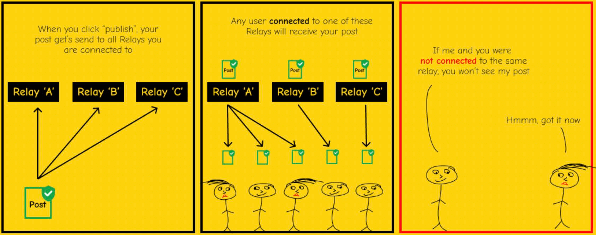
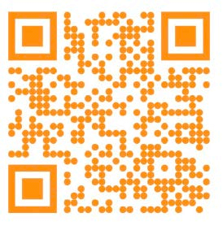

# NOSTR

## NOSTR & HAL-HAL LAIN YANG DIKIRIM OLEH RELAY

>*Seseorang dapat membuat undang-undang untuk melawannya, tetapi kebebasan
berbicara, bahkan lebih dari privasi, adalah fundamental bagi
masyarakat terbuka; kita tidak berusaha untuk membatasi ucapan apa pun.*

~ Eric Hughes, Manifesto Cypherpunk, 1993

## APA ITU NOSTR

>*TL;DR: nostr adalah protokol yang memiliki kekuatan untuk
menggantikan twitter, Telegram, dan hal-hal lainnya.*

~ @dergigi

>*nostr adalah untuk kebebasan komunikasi
seperti bitcoin untuk kebebasan transaksi.*

~ Keysa @SimplestBitcoinBook

* **Nostr adalah protokol sederhana dan terdesentralisasi untuk
jaringan global yang tahan sensor dan dapat dioperasikan.**
* Nostr tidak bergantung pada server pusat yang tepercaya.
* Ini adalah protokol perangkat lunak gratis dan sumber terbuka (FOSS),
seperti Bitcoin, HTTP, atau TCP-IP, yang memungkinkan siapa pun untuk
membangun di atas nostr.
* **Ini adalah bagaimana kita mempertahankan kebebasan kita untuk berkomunikasi**
dengan siapa pun, di mana pun dengan koneksi internet.

>*(ini adalah) protokol komunikasi dengan
lapisan identitas yang berdaulat...
dan nostr juga lebih dari itu.* 

~ @dergigi

---

## MENGAPA KITA MEMBUTUHKAN NOSTR

Kita membutuhkan nostr karena sistem komunikasi
dan platform media sosial saat ini terpusat.

**Ini bermasalah karena sistem ini:**

* Memiliki kekuatan untuk menyensor ucapan Anda.
* Rentan terhadap serangan regulasi oleh negara.
* Dapat memilih, atau diberi tahu, untuk menangguhkan atau menghapus
akun Anda.
* Dapat diretas, dan dengan demikian membahayakan data Anda.
* Menggunakan algoritma untuk memberi Anda informasi yang mereka inginkan
Anda lihat.
* Memanipulasi setiap aspek pengalaman Anda di dalamnya.
* Melacak semua aktivitas Anda.
* Memanen dan menjual data Anda.
* Menggunakan data Anda untuk memenuhi umpan Anda dengan iklan.

---

## BAGAIMANA NOSTR BEKERJA

* **Nostr memiliki dua bagian:** Klien dan Relay.
* **KLIEN adalah ANTARMUKA** (aplikasi atau situs web) yang dijalankan
pada protokol nostr. 
* **Di sinilah Anda melihat catatan** yang Anda dan orang-orang
yang Anda ikuti posting (dengan cara yang sama seperti twitter adalah
antarmuka tempat Anda memposting dan membaca catatan oleh orang lain,
kecuali twitter terpusat & menyensor postingan.)
* **RELAY adalah SERVER dan DATABASE.** Siapa pun dapat
menjalankan relay, yang membuat nostr terdesentralisasi.
* **Di sinilah catatan Anda dikirim, disimpan, dan diambil
dari** oleh klien.
* Ada banyak relay dan Anda dapat memilih relay mana
untuk terhubung. Beberapa gratis dan beberapa berbayar.
* Saat Anda memposting pesan, pesan tersebut disiarkan ke relay
tempat Anda terhubung.
* Klien menanyakan relay tempat mereka terhubung, dan
kemudian mereka mengisi pesan yang dihosting oleh
relay tersebut.

~ @BTCillustrated

---

>*Siapa pun dapat menjalankan relay. Relay sangat sederhana dan
bodoh. Ia tidak melakukan apa pun selain menerima postingan
dari beberapa orang dan meneruskannya ke orang lain.
Relay tidak harus dipercaya.
Tanda tangan diverifikasi di sisi klien.*

~ @fiatjaf, 2019-11-02 fiatjaf.com/nostr.html

* Saat Anda membuka klien nostr Anda, Anda akan melihat semua
catatan yang diposting oleh Anda dan orang-orang yang Anda ikuti secara
kronologis.
* Tidak ada **algoritma** yang memutuskan apa yang akan ditampilkan kepada Anda,
apa yang akan ditahan dari Anda, atau menyensor postingan Anda.
* Seperti Bitcoin, **nostr menggunakan pasangan kunci publik/privat.**
* **KUNCI PUBLIK** = npub, seperti nama pengguna
* **KUNCI PRIVAT** = nsec, seperti kata sandi

>* **CATATAN:** Kunci privat Anda tidak dapat direset jika
>hilang, jadi Anda **harus mengamankannya dengan baik!**
>* Jika Anda membocorkan kunci privat Anda, siapa pun yang
>memiliki akses ke sana memiliki akses ke nostr
>akun, dan **tidak ada cara untuk mendapatkan kembali
>akses tunggal.**

---

* Anda dapat membuat nama pengguna yang mudah dibaca manusia menggunakan
NIP-05. **Contohnya:**
* **Kunci Publik Saya, atau npub adalah:**
<small>npub1dpna3xwwddnhhzg9ycpvlcz2ze0jdwm2rf3eqd2lf9leaewtq7tqhw0ef2</small>

* **Alamat Nostr NIP-05 Saya adalah:**

SimplestBitcoinBook@nostrplebs.com

* **Anda dapat mencari orang di nostr** dengan memasukkan:
*  npub
*  NIP-05 (alias alamat nostr) jika mereka memilikinya
*  Nama pengguna dari NIP-05 -> @SimplestBitcoinBook

* **Dapatkan Pengidentifikasi NIP-05 di sini:**
* nostrplebs.com
* verified-nostr.com
* getalby.com
* Atau siapkan dengan domain Anda sendiri

* Setelah Anda memiliki pasangan kunci nostr Anda, Anda dapat masuk ke klien
nostr mana pun dengan kunci yang sama, dan Anda akan melihat bahwa
Anda **mempertahankan identitas dan daftar pengikut/mengikuti Anda
di semua klien.**
* Ini berbeda dari media sosial lama, di mana Anda membutuhkan
akun, nama pengguna, dan kata sandi terpisah untuk setiap
platform, dan Anda memiliki konten, pengikut, dan
pengikut yang berbeda di masing-masing platform. 
>*Pada level paling dasar, Nostr adalah komunikasi
protokol yang bertindak sebagai perekat sosial yang mengikat
semua aplikasi Anda bersama-sama.*

~ derekross@nostrplebs.com

---

# BAGAIMANA CARA NOSTR

>1. **Pilih aplikasi klien** untuk diunduh. (Tidak masalah
mana yang Anda pilih, karena Anda dapat mencoba semuanya setelah
Anda memiliki pasangan kunci yang dihasilkan.)
>2. **Contoh Klien Populer:**
>* Damus di iOS
>* Amethyst di Android
>* Primal di iOS/Android/Desktop
>3. **Buat Nama Pengguna.** Tidak ada info lain yang diperlukan.
>4. **Aplikasi akan menghasilkan akun.**
>5. **Anda dapat menambahkan gambar profil dan spanduk** jika Anda suka.
>6. **Akun Anda akan secara otomatis terhubung ke beberapa
relay** setelah Anda memilih setidaknya satu minat (misalnya:
bitcoin, seni, hak asasi manusia, olahraga, musik, dll.)
>7. Tergantung pada klien, itu akan secara otomatis mengikuti beberapa
akun dengan minat yang sama, atau membiarkan Anda memilih beberapa.
>8. **Anda kemudian dapat menambahkan atau menghapus relay dan akun.**

~ @BTCillustrated

---

## MANAJEMEN KUNCI
* Setelah kunci Anda dihasilkan, saatnya untuk
menginstal **ekstensi penandatanganan.**
* Saat Anda ingin masuk ke situs web yang berjalan di
protokol nostr, itu akan meminta nsec Anda, atau kunci privat.
* **JANGAN** memasukkannya secara langsung, karena situs web dapat membocorkan data
* **Sebagai gantinya, selalu gunakan ekstensi penandatanganan.**
* Ini adalah alat yang menyimpan kunci privat Anda, dan Anda
mengotorisasinya untuk menandatangani peristiwa, seperti catatan, atas
nama Anda. Jangan khawatir, ini lebih sederhana dari kedengarannya!
* **Ekstensi penandatanganan populer:**
* Nostore (iOS Safari)
* Amber (Android)
* Aplikasi Nsec (Seluler/Desktop)
* Alby (Desktop)
* Nos2X (Desktop)
* Nostr Connect (Desktop)

## ZAP
* Zapping adalah bagaimana kita bitcoin di nostr! Membuat V4V
(Value4Value) ekonomi, catatan demi catatan, zap demi zap.
* Anda dapat mengirim dan menerima sats (alias zaps) untuk catatan atau
konten yang Anda hargai dengan menghubungkan Bitcoin
Dompet Lightning ke akun nostr Anda.
* Ada berbagai cara untuk melakukan ini. Jika klien yang Anda
pilih tidak memandu Anda, tanyakan saja di nostr
dengan tag #asknostr, dan seseorang akan memandu Anda.
Nostrich ramah

---

## SUMBER DAYA NOSTR
Di bawah ini adalah daftar situs web yang memiliki panduan yang sangat baik dan mudah
dicerna tentang nostr dan keajaibannya!

*  nostr-resources.com oleh @derGigi
* nostr.com oleh @fiatjaf
* nostr.net oleh @aljaz
* nostr.how oleh @JeffG
* usenostr.org oleh @pluja
* benwehrman.com/nostr-guide oleh @benwehrman
* nostrapps.com oleh @Karnage

## MENGAPA BURUNG UNTA?

**Kisah Asal Nostrich**

oleh Walker@primal.net

**16 Desember 2022:**

Saya menemukan ChatGPT3 dan,
tentu saja, bertanya kepadanya
"Bisakah Anda menulis lelucon tentang #nostr?"
ChatGPT3 menjawab:
T: Apa sebutan untuk burung unta yang ingin tahu?
J: Seorang nosTrich!
Lelucon itu tidak bagus, tetapi Anda tidak dapat menyalahkan bot. Terlepas dari itu, saya
menyukai gagasan identitas visual untuk nostr, dan burung unta adalah
burung yang keren. Jadi saya pergi ke Midjourney dan membuat #Nostrich

**20 Desember 2022:**

@jb55 mengusulkan "Nostrich" sebagai maskot Nostr resmi
dan logo.
Tiga menit kemudian, @jack men-tweet gambar Nostrich.
Selebihnya, seperti yang mereka katakan, adalah sejarah. 

~ @Walker

---

## KLIEN/APLIKASI NOSTR

Kunjungi **nostrapps.com** untuk menemukan ini, dan begitu banyak lagi
aplikasi luar biasa yang dibangun di atas protokol nostr sumber terbuka gratis.
Gunakan ekstensi penandatanganan Anda untuk masuk ke semuanya!

* **Sarang Nostr** - Ruang audio untuk mengobrol, berjamming,
mikro-konferensi, podcast langsung.
* **Pasar Plebian** - Pasar yang berdaulat sendiri di
Internet, didukung oleh Bitcoin & Lightning.
* **Npub.pro** - Buat situs web berbasis nostr sendiri.
* **Obrolan Corny** - Ruang audio langsung.
* **Wavlake** - Platform streaming musik yang memanfaatkan
Jaringan Lightning Bitcoin untuk menawarkan nilai untuk nilai.
* **Zap.stream** - Host streaming langsung Anda dan dapatkan zap sat.
* **Flare** - Klien untuk melihat, mengunggah, dan berinteraksi
dengan konten video.
* **Blowater** - Dibangun untuk menggantikan Telegram/Slack/Discord.
* **Stemstr** - Pengalaman sosial bagi artis musik untuk
terhubung, berkolaborasi, dan berbagi musik yang luar biasa.
* **Nostr.build** - Pengunggah & host gambar, video & media.
* Hivetalk - Panggilan video dan rapat real-time yang benar-benar pribadi,
menggantikan Zoom.
* **Zap.cooking** - Bagikan resep melalui Nostr.
* **Flockstr** - Penjadwalan acara dan pertemuan.
* **Memestr** - Lihat dan buat meme melalui Nostr
* **Quotestr** - Buat catatan Nostr sebagai kutipan gambar.

---

## BERGABUNG DENGAN KAMI
* Nostr masih sangat muda. Sama seperti bitcoin, tetapi jauh
lebih muda, ini adalah eksperimen akar rumput, berantakan, global, dari bawah ke atas.
* Jika Anda melihat nilai dalam protokol komunikasi yang terdesentralisasi, tahan sensor, dan sumber terbuka,
silakan bergabung dengan kami dalam menggunakannya, mengembangkannya, menawarkan
umpan balik kepada para pengembang, dan berpartisipasi dalam apa pun
cara Anda merasa terpanggil, untuk membantu menumbuhkan alat kebebasan berbicara ini.
* Ini adalah pengalaman luar biasa untuk terlibat dalam pertumbuhan
teknologi yang dibangun untuk melestarikan kebebasan berbicara
dan komunikasi terbuka secara global.
* Selami dan belajar bersama kami jiwa-jiwa berdaulat lainnya,
merangkul kekacauan yang melekat untuk menciptakan keindahan,
dan untuk menempa masa depan yang cerah bagi cucu-cucu kita!

*Lebih penting dari segalanya adalah kita harus ingat bahwa
nostr hanyalah sekumpulan server yang sangat longgar dengan pada dasarnya tidak ada
koneksi di antara mereka, ... dan proses menjaga
terhubung dengan orang lain dan menemukan konten harus
ditangani melalui banyak upaya peretasan yang berbeda. Untuk
menulis aplikasi Nostr dan menggunakan Nostr seseorang
harus merangkul kekacauan yang melekat.*

*~ @fiatjaf dari:*

*'Visi untuk penemuan konten dan penggunaan relay
untuk jejaring sosial dasar di Nostr'*

---

Rasa syukur yang mendalam kepada Satoshi, Fiatjaf, para cypherpunk
masa lalu, sekarang dan masa depan, keluarga Nostr, pusaran BT,
maxis beracun, maxis tidak beracun, para meme-lords dan -
para wanita, orang-orang percaya, para sinis, para peramal...
dan selalu,
keluarga dan teman-teman terkasihku,
dan Dia yang bernapas melalui kita semua,
karena selalu membantuku,
lebih berharga dari apa pun, bahkan bitcoin

PDF gratis dari buku ini dan terjemahannya
tersedia di: thesimplestbitcoinbook.net 

Ikuti saya di nostr:

Komentar, pertanyaan, pembaruan, umpan balik:

thesimplestbitcoinbook@proton.me

Tidak dapat menjanjikan saya akan menyelesaikannya tepat waktu ...

mungkin bertelanjang kaki di gunung di suatu tempat

Tumpuk sats

Tetap kuat

Tetap setia

pada akhirnya, Cinta

851522
