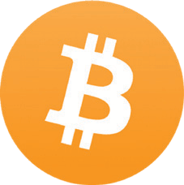
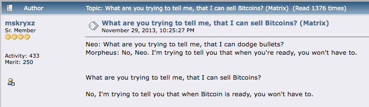

# Menepis Fud Bitcoin
(Ketakutan Ketidakpastian Keraguan)

* Di bawah ini adalah beberapa argumen umum yang menentang, atau ketakutan
tentang, bitcoin.
* Ini sebagian besar tidak berdasar, akibat dari ketidaktahuan, atau mungkin pemahaman yang tidak lengkap.
* Saya memberikan sanggahan singkat untuk masing-masing di sini, dan pada akhirnya
Anda akan menemukan petunjuk ke sumber daya yang lebih mendalam
membantah semua FUD.

## BITCOIN MENGGUNAKAN TERLALU BANYAK ENERGI

>*Panas dari komputer Anda tidak terbuang
jika Anda perlu memanaskan rumah Anda… Ini
biaya yang sama jika Anda menghasilkan panas
dengan komputer Anda.*

~ Satoshi Nakamoto 2010-08-09

>*Pada awalnya, produksi komoditas hanya karena
mahal tampaknya cukup boros. Namun, yang tak dapat dipalsukan
komoditas mahal berulang kali menambah nilai dengan memungkinkan
transfer kekayaan yang bermanfaat. Lebih banyak biaya yang diperoleh kembali
setiap kali transaksi dimungkinkan atau dibuat
lebih murah. Biaya, awalnya benar-benar sia-sia, adalah
diamortisasi selama banyak transaksi.*

~ Nick Szabo

Cypherpunk

---

* **Energi 'terlalu banyak' adalah proposisi nilai yang harus
mempertimbangkan bagaimana kita menghargai tujuan dari penggunaan energi.**

* **Ketika seseorang mempertimbangkan bahwa lampu Natal di
AS menggunakan listrik sebanyak seluruh jaringan Bitcoin,** maka mungkin orang dapat melihat bahwa itu semua relatif!

* Menggunakan energi, bahkan banyak energi, untuk mengamankan
uang terkeras dan paling tahan sensor
yang pernah dikenal umat manusia, lebih dari sekadar berharga.

* Dalam membandingkan penggunaan energi bitcoin dengan yang digunakan oleh
sistem warisan, kita juga perlu mempertimbangkan 'tumpukan penuh' di kedua sisi:

| Ekosistem Bitcoin    | Sistem Fiat Warisan          |
| -------------------- | --------------------------- |
| Penambang ASIC          | BIS                         |
| Node                | Bank Sentral               |
| Dompet Perangkat Keras     | Bank Nasional/Regional     |
| Aplikasi Dompet Perangkat Lunak | Kompleks Industri Militer |
|                      | Pusat Data Cadangan         |
|                      | Pencetakan Uang Fisik     |
|                      | Distribusi Uang Fisik |
|                      | Aplikasi Perbankan Online         |
|                      | Jaringan ATM             |

* Dengan menggunakan bitcoin, kita pada akhirnya akan mengurangi energi
penggunaan di berbagai bidang lain, terutama
dengan tidak lagi membutuhkan Industri Militer
Kompleks untuk melindungi dolar petro

---

* Juga, konsumerisme yang merajalela yang diperlukan untuk
menjaga sistem berbasis utang tetap bertahan, seiring waktu
akan dikurangi, karena **uang keras secara alami memberi insentif
pengeluaran dan tabungan yang bijaksana** (karena tabungan Anda
sebenarnya akan mempertahankan nilainya, sebuah konsep yang belum pernah kita
alami sejak meninggalkan standar emas).
* **Terakhir, dan yang penting, penambangan bitcoin sudah
mengurangi polusi dengan menangkap gas alam yang dibakar
dan menggunakannya untuk memberi daya pada para penambang.** Karena penambang mencari
biaya listrik rendah, kemungkinan juga menjadi yang terbesar
pendorong menuju energi murah terbarukan, karena
insentifnya cocok.
* **Pendalaman informasi yang mendalam tentang Bitcoin dan Energi** telah
ditulis oleh Daniel Batten di batcoinz.com, Troy
Cross, Jyn Urso, video 'Mesin Ini Menghijaukan'
oleh Swan Bitcoin di YouTube, 'Dirty Coin', Sebuah
dokumenter penambangan bitcoin, dan sebuah
episode yang sangat baik dari acara 'Apa Itu Uang'
(WiM161) dengan B.Quittem, di antara banyak lainnya.

---

## BITCOIN ADALAH PONZI
* **Bitcoin bukanlah Ponzi:**
 * Investor lama tidak dibayar uang oleh yang baru
 investor.
 * Saat membeli bitcoin, tidak ada yang menjanjikan pengembalian
 pada investasi Anda.
 * Tidak ada tim kepemimpinan atau promosi.
 * Tidak ada pra-penambangan.
 * **Baca:** 'Mengapa Bitcoin Bukan Ponzi' oleh Lyn Alden
untuk lebih lanjut.

## BITCOIN TERLALU LAMBAT
* Sementara lapisan dasar Bitcoin lambat, lapisan ke-2
**Lightning Network yang dibangun di atas lapisan dasar adalah …
secepat kilat!**
* Jaringan Bitcoin dapat memproses sekitar 7
transaksi per detik (TPS).
* Jaringan Visa mengklaim dapat memproses hingga 24.000
TPS, meskipun 4.000 TPS lebih dekat dengan penggunaan sebenarnya.
* **Lightning Network, solusi lapisan kedua
dibangun di atas Bitcoin, memiliki potensi kapasitas untuk
memproses jutaan transaksi per detik!**

---

## PEMERINTAH DAPAT MELARANG BITCOIN
* Beberapa pemerintah telah mencoba, seperti China, India, dan
Nigeria misalnya. Dalam setiap kasus, penggunaan bitcoin
meningkat pesat oleh orang-orang di negara tersebut
* **Tidak ada cara bagi pemerintah untuk benar-benar 'melarang' bitcoin,** karena secara alami tanpa izin dan tahan sensor. Ini adalah kode dan kode adalah ucapan.
* Konon, pemerintah dapat mempersulit pembelian
dan menjual dengan, dan ke dalam fiat. Mereka juga dapat mengenakannya sebagai
komoditas, seperti yang mereka lakukan di AS.
* **Pada akhirnya, tidak akan menguntungkan mereka untuk mencoba melarang
itu, karena bitcoin tidak bisa dihindari dan mereka mulai
untuk melihat itu.** Mereka akan jauh lebih pintar untuk menambahkannya ke
neraca negara mereka sebagai lindung nilai terhadap mereka
menggelembungkan mata uang fiat.

>*Pemerintah pandai memotong
kepala jaringan yang dikendalikan secara terpusat
seperti Napster, tetapi jaringan P2P murni
seperti Gnutella dan Tor tampaknya
mempertahankan diri mereka sendiri.*

~ Satoshi Nakamoto

* **Baca:**

Bisakah Pemerintah Menghentikan Bitcoin? oleh Alex Gladstein,
CSO dari Human Rights Foundation

Bisakah Pemerintah Melarang Bitcoin? Empat Hal yang Anda
Perlu Tahu oleh Nick Giambruno

---

## BITCOIN ADALAH TEKNOLOGI LAMA
* **Lebih seperti 'teknologi pamungkas',** sehubungan dengan digital
kelangkaan, desentralisasi, dan memecahkan baik masalah pembelanjaan ganda dan Masalah Jenderal Bizantium. Setelah ditemukan, itu tidak dapat ditemukan kembali.
* **Setelah roda ditemukan, itu tidak akan pernah bisa
diciptakan kembali.**
* Protokol TCP/IP yang menjalankan internet telah
menjadi standar untuk semua jaringan komputer sejak
1983. Kemungkinan akan terus menjadi standar untuk
waktu yang lama.
* Setelah solusi sempurna, teknologi lapisan dasar ditemukan yang bekerja secara optimal, itu dapat bertahan selama ratusan,
atau ribuan tahun.

Kredit: @DecouvreBitcoin

---

## BITCOIN DIGUNAKAN OLEH PARA KRIMINAL
* **Begitu juga dolar, dan setiap mata uang fiat lainnya di dunia.** Cukup salah untuk mengatribusikan ini
masalah hanya untuk bitcoin.
* **Bitcoin adalah alat, sama seperti pisau, dan terserah masing-masing
salah satu dari kita bagaimana kita menggunakannya.**
* Menariknya, jika bitcoin tidak dapat digunakan oleh penjahat,
maka itu tidak akan menjadi netral, tahan sensor
uang yang sangat dibutuhkan dunia.
* **Catatan:** Karena blockchain Bitcoin dapat diaudit, itu
sebenarnya pilihan yang sangat buruk untuk aktivitas kriminal!

## KOMPUTASI KUANTUM BISA MERUSAK BITCOIN
* Meskipun ini mungkin suatu kemungkinan di masa depan,
**pengembang sudah mengerjakan solusi untuk enkripsi pasca-kuantum**
* Bitcoin hanyalah salah satu dari banyak aplikasi online yang mengandalkan hashing SHA-256 untuk keamanan.
Bahkan militer menggunakannya, jadi ada insentif besar di luar komunitas bitcoin untuk mengembangkan yang baru
protokol enkripsi.
* Jika SHA-256 rusak, kita akan memiliki banyak hal lain untuk
khawatirkan selain bitcoin. Seluruh internet menggunakannya
untuk enkripsi. Ini termasuk semua perbankan, pasokan
rantai, sistem transportasi, sistem perawatan kesehatan,
sistem pendidikan dan banyak lagi.

---

## BITCOIN TIDAK MEMILIKI NILAI NYATA
>*“Nilai Bitcoin didorong oleh kelangkaannya yang dapat ditegakkan”*

*~ Fidelity Digital Assets*

* **Kelangkaan adalah nilainya. Semua uang sepanjang waktu telah
dinilai karena memiliki ukuran kelangkaan.**

* Selain itu, itu didukung oleh keyakinan bahwa itu akan
mempertahankan nilainya, sedemikian rupa sehingga dapat diperdagangkan di
masa depan untuk sesuatu yang bernilai.
* Saat jaringan Bitcoin tumbuh, didukung oleh superior
properti moneter yang diwujudkannya, efek jaringan
tumbuh secara eksponensial
* Semakin besar efek jaringan, semakin banyak nilai yang ditawarkannya, sebagai
aset langka. Nilai adalah cerminan dari permintaan,
dan seiring meningkatnya permintaan, nilai meningkat.

---

## BEBERAPA ORANG MEMILIKI TERLALU BANYAK
* Memang benar bahwa beberapa orang memiliki jauh lebih banyak daripada yang lain.
**Dalam merilis protokol secara terbuka, Satoshi mengizinkannya untuk
berkeliaran dengan bebas, dan mereka yang memahami potensi
itu ditahan baik ditambang, atau dibeli lebih awal. Itu adalah
cara paling adil dan paling organik untuk menyajikannya
kepada dunia.**
* Seiring waktu, ketika dunia mengalami hiperbitcoinisasi, yang berarti kita hidup dengan standar bitcoin, mereka yang
memiliki lebih banyak secara alami akan membelanjakannya ke dalam ekonomi

* Meskipun pada titik tertentu seseorang tidak lagi
dapat membelinya dengan fiat, orang akan dibayar untuk pekerjaan mereka
bekerja dengan bitcoin. Dibayar dengan uang yang benar-benar sehat akan
memungkinkan kita untuk memiliki tabungan nyata yang tidak akan direndahkan
seiring waktu oleh inflasi
* Meskipun akan selalu ada orang dengan lebih banyak kekayaan
dan mereka yang kurang, karena sejumlah besar faktor,
**standar bitcoin akan membuat membran di antara
kelas-kelas kekayaan dapat ditembus**, seperti yang dikatakan Aleks Svetsi. Ini
akan memungkinkan mobilitas ke atas dan ke bawah menjadi
jauh, jauh lebih cair daripada hari ini
* **Setelah dilahirkan, dan berenang sepanjang hidup kita
di dunia fiat, hampir tidak mungkin untuk dibayangkan, dan
sepenuhnya memahami implikasi memiliki uang yang
tidak dapat direndahkan atau dimanipulasi!**

---
## BITCOIN TERLALU BERUBAH-UBAH
* **Ini normal selama fase penemuan harga
aset moneter baru.** Tidak ada cara lain untuk
pertumbuhan terjadi ketika itu organik dan muncul
(sebagai lawan dari atas ke bawah dan dikendalikan secara terpusat.
* Selain itu, pada tahap keberadaan manusia ini, dengan
pergeseran eksponensial terjadi di semua bidang, masuk akal
bahwa sesuatu yang rEVOLusioner seperti bitcoin akan
memiliki ayunan liar.
* Sementara kita yang jauh di lubang kelinci melihatnya
sebagai masa depan, saat ini hanya sebagian kecil dari
populasi global memegang bitcoin saat ini. Ini
membuatnya rentan terhadap volatilitas yang sangat besar.
* Saat itu matang, dan adopsi meningkat, volatilitas akan berkurang, dan akhirnya akan stabil dan
menjadi unit akun.

>*Saya yakin bahwa dalam 20 tahun akan ada
baik volume transaksi yang sangat besar
atau tidak ada volume.*

~ Satoshi Nakamoto 2010-02-14

---

## ANDA TIDAK BISA MENYENTUH BITCOIN

* **Ini adalah fitur, bukan bug.** Fakta bahwa bitcoin
tidak fisik adalah salah satu faktor terbesar yang berkontribusi pada ketidakmampuannya untuk disita!

## BITCOIN BISA DIRETAS

* Dalam 15 tahun sejak diluncurkan, tidak pernah
diretas.
* Namun, ada peretasan di bursa, jadi saya
sangat merekomendasikan untuk memindahkan bitcoin Anda ke milik Anda sendiri
dompet kustodi mandiri sesegera mungkin.
* Diperkirakan bahwa untuk memecahkan SHA-256
enkripsi (yang digunakan bitcoin) dalam 24 jam, a
komputer kuantum akan membutuhkan 13.000.000 fisik
qubit. Saat ini, rekor qubit saat ini dipegang
oleh Atom Computing di California adalah 1.180 qubit.
* Secara luas diasumsikan bahwa enkripsi aman kuantum
metode akan dikembangkan jauh sebelum dibutuhkan.

>*Menjadi sumber terbuka berarti siapa pun bisa
secara independen meninjau kode. Jika itu
sumber tertutup, tidak ada yang bisa memverifikasi
keamanan. Saya pikir itu penting untuk
program dengan sifat ini untuk menjadi sumber terbuka.*

*~Satoshi Nakamoto 2009-12-10*

---

## LEBIH LANJUT TENTANG MEMBANTAH FUD DI SINI:

* Endthefud.org
* Bitcoinmythbusters.org
* Casebitcoin.com - Kritik Umum
* Safehodl.github.io/failure/
* Lopp.net - Info Bitcoin: Kesalahpahaman

>*Bitcoin secara fundamental berbeda dari aset digital lainnya
aset. Tidak ada aset digital lain yang mungkin untuk ditingkatkan
bitcoin sebagai barang moneter karena bitcoin adalah yang paling
(relatif terhadap aset digital lainnya) uang digital yang aman, terdesentralisasi, dan sehat dan "peningkatan" apa pun
pasti akan menghadapi trade-off.*

~ Laporan Fidelity Digital Assets, 'Bitcoin First', Jan 2022
Chris Kuiper, CFA, Direktur Riset
Jack Neureuter, Analis Riset

---

## TENTANG HARGA BITCOIN
* **Saya melihat hodling (memegang) bitcoin seperti memiliki jangka panjang
rekening tabungan.**
* Harga harian tidak masalah, karena diperkirakan akan
berubah-ubah (naik dan turun) selama beberapa tahun lagi.
* Seperti yang saya sebutkan sebelumnya, ini normal untuk yang baru
aset yang mengalami penemuan harga
* Jika seseorang memperbesar grafik harga BTC/USD, Anda
akan melihat bahwa itu telah meningkat sebesar +31.296% sejak 2009,
rata-rata menjadi ~200% per tahun.
* Perubahan harga mencerminkan berbagai artikel berita, pembaruan peraturan, permintaan pasar, ketakutan dan kegembiraan.
Ini adalah roller coaster!
* **Semakin lama Anda hodl, semakin banyak Anda belajar dan memahami fundamentalnya, dan semakin Anda menyadari
implikasi mendalam dari memiliki uang yang sehat,
semakin tidak penting harganya.**

>**Pada akhirnya, 'harga' tidak akan menjadi masalah sama sekali, karena bitcoin
akan menjadi unit akun.**

* **Penafian:**
* Hanya masukkan apa yang 'mampu Anda hilangkan', karena
tentu saja, tidak ada jaminan.
* Pertimbangkan bitcoin yang Anda beli sebagai jangka panjang
rekening tabungan, dan rencanakan untuk menyimpannya di tempat dingin
penyimpanan minimal selama lima tahun sebelum
menghabiskan.

---

Sumber bitcointalkforum.org asli untuk salah satu dari
meme bitcoin paling klasik sepanjang masa.

---

## SEMENTARA ITU, TENTANG PAJAK
* **Penafian:** Ini bukan nasihat keuangan atau pajak

* Dalam kode pajak AS, bitcoin saat ini dilihat sebagai komoditas, jadi ada implikasi pajak potensial jika Anda
menjualnya kembali ke fiat, atau bahkan jika Anda membeli sesuatu dengan
bitcoin Anda
* Jika harga turun sebelum Anda menjual/membelanjakannya, Anda
dapat mengklaim kerugian
* Jika harganya naik, Anda seharusnya mengklaim a
keuntungan modal, dan membayar antara 10-30% CGT (Modal
Pajak Keuntungan)
* Jumlahnya tergantung pada beberapa faktor, seperti
berapa lama Anda memegangnya sebelum menjual atau membelanjakan, dan
di braket pajak mana Anda mendarat.
* Jika Anda berencana untuk menjual atau membelanjakan bitcoin, terutama yang lebih besar
jumlah, Anda mungkin ingin mempertimbangkan untuk berkonsultasi dengan
seorang profesional pajak.
* Jika Anda hanya membeli dan memegang, Anda saat ini tidak memiliki
setiap kejadian yang dikenakan pajak terkait bitcoin.
* Dan jika Anda membeli non-KYC…

---
