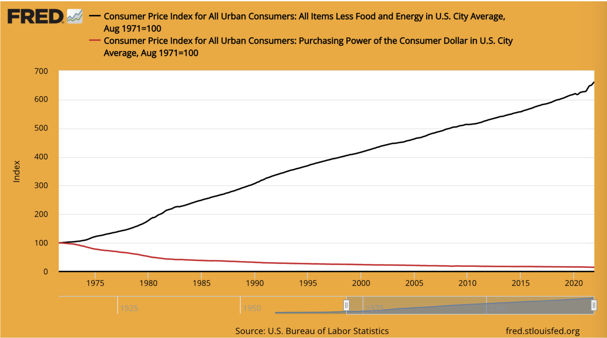
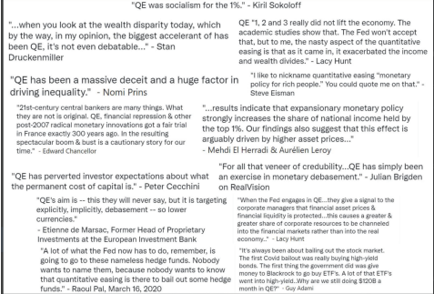
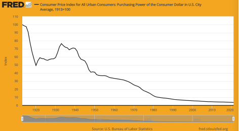
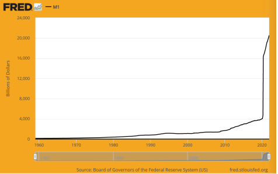
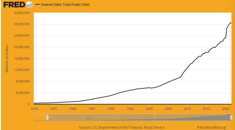

# Why We Need Bitcoin 

## WE NEED BECAUSE MONEY IS BROKEN

> `The root problem with conventional
> currency is all the trust that’s required
> to make it work. The central bank must
> be trusted not to debase the currency,
> but the history of fiat currencies is full
> of breaches of that trust. Banks must be
> trusted to hold our money and transfer
> it electronically, but they lend it out
> in waves of credit bubbles with barely a
> fraction in reserve. We have to trust them
> with our privacy, trust them not to let
> identity thieves drain our accounts.`

~ Satoshi Nakamoto 2009-02-11

* The fiat money system is broken (always has been).
* It is not sustainable (never has been).
* There is no way to fix it (never will be).
---

## THE (NOT) GOLD STANDARD

* Most people still believe that money is backed by gold.
* It is not.
* It has not been backed by gold since 1971, when President Nixon unilaterally took the world off the gold standard (the
  Nixon Shock).
* See wtfhappenedin1971.com to get a clear picture of the damage this did.

> Chart showing CPI inflation (black line) vs the purchasing power of the dollar (red line) since 1971.

- Fun Fact: The WEF was formed in 1971.

---

> **FIAT:** (noun) /ˈfiː.æt/
>
>: an authoritative or arbitrary order : DECREE
>
>: an authoritative determination : DICTATE
>
>: **a command or act of will that creates something without
>or as if without further effort**

 ~ merriam-webster.com/dictionary

> **FIAT:** from Latin fieri «to be made, come into being» 

- Fiat is money that has value only because the government says it does.

- Therefore people (have to) believe it does.

- `Even if they don’t believe fiat has value, by law they
are forced to use it and to accept it as payment for
goods and services.`

- **Fiat money is printed/created out of thin air**

- These days 3% of all dollars are printed as cash.

- The other 97% is created by banks entering numbers
into a computer (not kidding!), when they issue loans.

> It costs only a few cents for the Bureau of
Engraving and Printing to produce a $100 bill… 

~ American Economist, Barry Eichengreen

---

>***Scott Pelley of NBC ’60 Minutes’:*** *Fair to say you
>simply flooded the system with money?*
>
>***Fed Chair Jerome Powell:*** *Yes. We did.
>That’s another way to think about it. We did.*
>
>***Pelley:*** *Where does it come from?
>Do you just print it?*
>
>***Powell:*** *We print it digitally. So as a central bank, we
>have the ability to create money digitally. And we do that
>by buying Treasury Bills or bonds for other government
>guaranteed securities. And that actually increases the
>money supply. We also print actual currency and we
>distribute that through the Federal Reserve banks.*

~  CNBC ’60 Minutes’ Interview, May 17, 2020
Two months after the onset of the C*vid-19 lockdown

> There’s really no limit to what we can do
with these lending programs that we have. 

~  Fed Chair Jerome Powell

> Yes, there is an infinite amount of cash in the Federal
Reserve. We will do whatever we need to do to make
sure there’s enough cash in the banking system.

~ Neel Kashkari , Pres of the Minneapolis Fed

> The ‘we’ here is five people voting on changes to
monetary policy within the Federal Reserve system
during FOMC meetings. 5 out of 330,000,000.
That’s all it takes to change US monetary policy. 

~ @MartyBent, Founder of TFTC.io

---

## FROM THE HORSE’S MOUTH OF OLDE

>*The bank hath benefit of interest on all monies
that it creates out of nothing.*

~ *William Paterson, 1694, Founder of the Bank of England*

>*All of the perplexities, confusion, and distress in America arises, not
from the defects of the Constitution or Confederation, not from the
want of honor or virtue,
so much as from downright ignorance of
the nature of coin, credit, and circulation.*

~ *John Adams, 2nd President of the United States, 1735−1826*

> *I believe that banking institutions are more
dangerous to our liberties than standing armies.
Already they have raised up a money aristocracy
that has set the government at defiance.
The issuing power should be taken from the banks, and restored to
the people to whom it properly belongs.*

~ *Thomas Jefferson
3rd President of the United States, 1801-1809*

> While boasting of our noble deeds were careful to conceal the ugly
fact that by an iniquitous money system we have nationalized a
system of oppression which, though more refined, is not less cruel
than
the old system of chattel slavery.

~ Horace Greeley (1811-1872)
US Congressman and Founder of The New York Tribune.

---

> *Whoever controls the volume of money in any country is absolute
master of all industry and commerce…
when you realize that the entire system is very easily controlled, one
way or another, by a few powerful men at the top, you will not have
to be told how
periods of inflation and depression originate.*

~ James A. Garfield,
20th President of the USA, Mar-Sept. 1881
Assassinated 1881

> *There today exists uncontrolled in the hands of a set of men a
power to make dollars from nothing*

~ Thomas W. Lawson, Frenzied Finance, 1905

> *I was as secretive - indeed, as furtive - as any conspirator. Discovery,
we knew, simply must not happen, or else all our time and effort
would be wasted. If it were to be exposed that our particular group
had got together and written a banking bill, that bill would have no
chance whatever of passage by Congress.* 

~ Frank A.Vanderlip
President of the National City Bank of New York
(forerunner of Citi Bank)
~ Writing in 1935 of the secretive meeting that took place on Jekyll
Island in 1910, to draft the bill that was passed as the Federal
Reserve Act in 1913.

> *This (Federal Reserve) Act establishes the most
gigantic trust on earth. When the President
(Woodrow Wilson) signs the Bill, the invisible government of the
Monetary Power will be legalised… The worst legislative crime of the
ages is perpetrated by this banking and currency Bill.* :::

~  Charles A. Lindbergh, Sr. (1859-1924)

---

> *I am a most unhappy man. I have unwittingly ruined my country.
A great industrial nation is controlled by its system of credit.
Our system of credit is concentrated. The growth of the nation,
therefore, and all our activities are in the hands of a few men.
We have come to be one of the worst ruled, one of the most
completely controlled and dominated governments in the civilized
world. No longer a government by free opinion, no longer a
government by conviction and the vote of the majority, but a
government by the opinion and duress of
a small group of dominant men.* 

~ Woodrow Wilson,
28th President of the United States, 1913-1921
6 years after passing the Federal Reserve Act of 1913.

> *The real truth of the matter is, as you and I know,
that a financial element in the large centers
has owned the government of the U.S. since
the days of Andrew Jackson.* 

~ Franklin D. Roosevelt, 32nd President of the US
in a letter written Nov. 21, 1933 to
Colonel E. Mandell House

> *It [the depression] was not accidental.
It was a carefully contrived occurrence….
The international bankers sought to bring about
a condition of despair here so that they might
emerge as the rulers of us all.* 

~ Congressman Louis T. McFadden,
(Assassinated in 1936)

> Chairman of the House Banking and Currency Committee
*Each and every time a bank makes a loan,
new bank credit is created - new deposits - brand new money* 

~ Graham F.Towers
Gov of the Central Bank of Canada, 1934-55

---

> *If there were no debts in our money system,
there wouldn’t be any money*

~ *Marriner Eccles,
1941, Gov. of the Fed*

> *I have never yet had anyone who could, through the use of logic
and reason, justify the Federal government borrowing the use of its
own money…
I believe the time will come when people will demand that this be
changed. I believe the time will come in this country when they will
actually blame you and me and everyone else connected with the
Congress
for sitting idly by and permitting
such an idiotic system to continue.* 

~ Wright Patman, Democratic Congressman 1928-1976, Chairman
Committee on Banking and Currency 1963-1975

> *When you or I write a check, there must be sufficient funds in our
account to cover the check, but when the Federal Reserve writes a
check there is no bank deposit on which that check is drawn. When
the Federal Reserve writes a check, it is creating money* 

~  Federal Reserve Bank of Boston
“Putting It Simply”, 1984

---

## THE FEDERAL RESERVE 

* The Fed is the ‘independent’ central bank of the US. It was created in 1913 with the passing of the Federal Reserve
Act.
* It has a unique structure, part private and part government.
* It is supposed to be a politically independent, non-partisan entity within the government.
* While the Fed Board of Governors is appointed by the President and confirmed by Congress, **the decisions
of the Fed do not need to be ratified by anyone. Yes, it is confusing!**

**It consists of:**

- The Federal Reserve Board of Governors.
- 12 Federal Reserve Banks.
- The Federal Open Markets Committee (FOMC),
which is the monetary policy-making body.

**The Fed is responsible for:**

- Overseeing US monetary policy, promoting employment and stable prices.
- Regulating and supervising banking and financial
institutions.

- Providing payments services to financial institutions.
- Promoting consumer protection and community
development.

---

## A NOTE ON THE FED CHAIR
* The Chair of the Federal Reserve also:

1. Chairs the Federal Open Market Committee
(FOMC), which decides on the direction of US
monetary policy (for eg: QE, interest rate hikes)

2. Is a member of the International Monetary Fund,
the IMF.

3. Is a member of the Bank for International
Settlements, the BIS (the bank of central banks).

4. Is the finance minister of the G-7.
5. Is the finance minister of the G-20.
* A whole lot of power for one person!

## FRACTIONAL RESERVE BANKING, INTEREST & LOANS

* **Fractional Reserve banking:** Until March 2020, banks
were required to hold a reserve of 10%, and could
loan out 90%.
* **Since March 2020, there is no reserve required, allowing banks to issue unlimited loans (!!!)**

* A loan is debt-based money, and you are required to
pay interest on the loan.
 
* **Fun Fact 1:** The money to pay the interest on the
loan is NOT created by the banks.
* **Fun Fact 2:** It is NEVER created.
* **Fun Fact 3:** There is NOT ENOUGH money in the
world to pay back all the loans + the interest due
on those loans.
* **Fun Fact 4:** There never will be!
---

## A NOTE ON THE PETRO DOLLAR

* One could say **that until 1971 the dollar was backed
by gold, and since 1974 it has been backed by oil,
and by default, the US Military.**
* **In 1974 the US and Saudi Arabia entered into bilateral agreements to price the sale of oil in US dollars.**
* Since then, most global oil sales have been settled in
US dollars.
* This has contributed greatly to the dollar becoming
the strongest currency in the world.
* **It has thus been artificially propped up** , even during
times when it would normally have struggled.
* While I was writing this, things were rapidly deteriorating as the Russian invasion of the Ukraine was heating
up, and Russia and China were making deals for oil in
the ruble/yuan, breaking away from using the dollar.
* It is very likely that this could be the beginning of the
end of the petro dollar. What happens next remains
to be seen…

---
## ON QE (QUANTITATIVE EASING)

* **Quantitative Easing is considered an ‘unconventional
monetary policy’ used by Central Banks to ‘stimulate
the economy’, whereby the Fed buys government
bonds and other government securities.**
* It was first used by Japan between 2001-2006.
Following that, the US, UK, and the Eurozone used
QE during the 2008 financial crisis.
* Since then, the only time the US has not had a QE
program was between 2014-2019.
* As seen below, critics contend that **QE overwhelmingly benefits the already-wealthy.**

*Credit: @RudyHavenstein on Twitter*

---

## CYCLES
* **In all of nature, there are cycles, natural ebbs and
flows, expansions and contractions.**

* This **contributes to an overall, over-time, balance and
sustainability** of the whole interconnected system, of
all life on earth.
* **The debt-based, fiat currency system ignores the wisdom of natural cycles**, and instead is based on, and
100% reliant for its survival upon, unparalleled and
unmitigated growth, in order to continue servicing its
debts.
* In nature, this is cancer.
* In ‘the economy’, this unnatural trajectory is further
supported by the government bailing out failing
banks and large companies, rather than allowing them
to fold, and be recycled into something new, something healthier.
* **The short-sightedness of bailing out failing companies is putting the whole economy at risk.** In essence,
it is just kicking the can down the road, and the inevitable turmoil that lies ahead is likely to be far, far
more intense than if natural cycles were allowed to
play out.
* **We are indebted to Satoshi Nakamoto, and to the
cypherpunks before and after him**, for having the
vision, foresight, determination and skill to provide
a lifeboat to carry us to new shores.

---
* Once we realize the gift that this is, it is up to us to
jump on board, with full hearts and clear minds, to
take the trip and build a new world with the Money
of Peace.
>* Bitcoin fixes the money, it is up to us to fix the rest.
And, to be clear, by having the money fixed, a LOT
of other things will be fixed, by default.
* The main one being that large-scale, government-initiated, kinetic war will no longer be profitable, or possible, without the support of the people.
* Additionally, there will naturally be less consumption,
along with a switch over to real-value goods and services, free markets, real savings, & demonetization of
housing and real estate, that was never meant to be
monetized in the first plac.

---

## WE NEED BECAUSE INFLATION IS THEFT

Chart showing the declining purchasing power of the dollar since
the formation of the Federal Reserve in 1913. The cumulative
rate of inflation since 1913 is around 2,525.4%. All central bank
fiat currencies around the world are following a similar rate of
decline.

* **The more money that is created out of thin air, the
more all money loses value.**
* This is called **inflation.**
Inflation is **time-theft**, literally. The value of your time
is stolen when you save it in a currency that is inflated
and manipulated.
* Inflation is also a **hidden tax**.
* This time-theft and tax affects all other countries’ fiat
currencies as well, since they are all pegged to the US dollar, as it has been the world reserve currency
since the Bretton Woods agreement in 1944.

---
* **In the USA, a 2% annual inflation rate is written into
the Federal Reserve mandate.**
* This means that **you are GUARANTEED to be able
to buy 2% LESS** with the same $20 bill each year.
* **In February 2022, the annual inflation rate was 7.9%**,
(a lot more than 2%), which means you lost 7.9% of
your purchasing power in the past year.
* Put another way, this means that on average, things
went up in price by 7.9%.
* So, if a basket of groceries cost $50 in 2021, the same
basket cost $53.95 in 2022.
* **If inflation was measured accurately, like it was done
until the early 1980’s, it would actually be closer to
15% right now in 2022, and your basket of groceries
would be $57.50.**
* **When looked at by category, one can see inflation
is actually a lot worse than 7.9% in many categories
over the past year:**
* Energy - 25.6%
* Gasoline - 38%
* New vehicles - 12.4%
* Used cars and trucks - 41.2
* Food - 7.9% (largest since July, 1981)

--- 

**Average Inflation over the
past 50 years in the US:**

|  Average Cost   |   1971  |   2021  |   % Increase  |
| --- | --- | --- | --- |
|  Salary   |    $9,400 |    $53,400 |    469% |
|   House  |    $23,400 |    $408,000 |    1,643% |
|    Gallon of Gas | $0.36    |   $3.60 |  1,000%   |
|    New Car |  $3,400   |   $39,000  |    1,047% |
|   College Degree   |  $1,400   |   $26,000  |  1,757%   |
|   Basket Groceries  |$20     |  $133   |    565% |
|  Electricity/kWh   |  $0.02    |   $0.14  |   600%  |

>`True Story:
~ A house was bought in 1976 for $58,000.
~ When accounting for ‘official’ inflation, this would be
$279,000 in 2022 dollars,.
~ In 2022 the same house was recently valued at $2.09
million.
~ Ponder on that…`

---
* As inflation increases, your savings (if you are lucky
enough to have savings), lose value.
* Over time, they lose A LOT of value.
>* If you started saving $100/month today, with the
best available interest rate of 0.05%:
>* In 30 years you would have saved $84,019.
>* When adjusted for the FED’s mandated 2% inflation:
>* In 30 years your savings would have an **effective
purchasing power** of just $46,384.
>* Adjusting for today’s ‘actual’ inflation of 7%:
>* Your $84,019 worth of savings would have the
purchasing power of just $11,037 in 30 years!

* **In effect this means that ~six out of seven hours of
your work have been stolen = *Time Theft.***

---

**Another way to look at it is the following:**
* In 1971, the cost of a house = 2.5 times an average
annual salary.
* In 2021, the cost of a house = 8 times an average
annual salary.
* In 1971, a new car cost about 1/3 of an average salary.
* In 2021, a new car cost nearly 2/3 of an average salary.

**I trust that it is now clear that**

**inflation**

**does not**

**work in your favor.**

**Note:** All of these numbers are averages, and variable based
on many factors. The point remains, inflation has sky-rocketed
and shows no signs of slowing down, thanks to the ongoing
money printing. Inflation is a hidden tax and is time-theft on
our real labor and production.

**Hard money fixes this.**
> * Bitcoin is hard money

---

## WE NEED TO REPLACE THE CENTRALLY CONTROLLED, MANIPULATED, DEBTBASED ECONOMY

>*I don’t believe we shall ever have a good money again,
before we take the thing out of the hands of government,
that is, we can’t take them violently out of the hands of
government, all we can do is by some sly roundabout way
introduce something they can’t stop*

~ Friedrich Hayek

~ Austrian Economist, Philosopher and Author

Graph showing M1 Money Supply increase from $4 trillion to
over $20 trillion since March 2020
* **Blow your mind here:** https://usdebtclock.org/

* **45% of all the US dollars in existence were printed
in the past 21 months, April 2020-Jan 2022!**
* Printed out of thin air that is, remember?
* Fiat money is centrally controlled by the state, and
the supply is easily manipulated.
* **It took 205 years for the US National Debt to reach
$1 trillion.** (1776 > 1981)
* It took just **31 more years for the** US National Debt
**to reach $30 trillion!** (1981 > 2022)

Graph showing Total Public Debt 1970-2021 in the US.

>*Global debt, measured by the Institute of
International Finance, now totals $303 TRILLION.
This is our planet on debt-based fiat.
By the way, global GDP is only $84 trillion.*

~ *Nik Bhatia, Author of ‘Layered Money’, 2021*

---
* **For reference:**

| If you have: | You can spend $1/second |                |
| ------------ | ----------------------- | -------------- |
| **$1 Million**   | or 11 days              | = 11 days      |
| **$1 Billion**   | for 11,680 days         | = 32 years     |
| **$1 Trillion**  | for 11,680,000 days     | = 32,000 years |

* We are all at the mercy of those who have the power
to decide when to print more, and what interest rates
to charge.
* **If the Fed raises the interest rates, then getting a
loan for a house or a car becomes suddenly more
expensive, which slows down spending, leading to
stagflation.**
* **If they keep the rates artificially low, we enter a
period of depression**
>* **Allowing the central bank to create the financial
‘weather’, takes away our freedom to let the market decide what is of value, and what is not.**
* In addition, **when they bail out banks and corporations, they artificially prop up the economy.** It is only
a matter of time before the house of cards falls.
* The original argument for having a central bank was
that there needed to be a Lender of Last Resort when
the economy wobbled.

---

* **This has turned into the central bank being a Ruler of
First Resort, with unparalleled, unelected, ultimately
authoritarian power.**

>*All money is political, except for Bitcoin.
Fiat currencies, banking instruments, fintech credits,
other cryptocurrencies, and even gold are all controlled
by governments, corporations, or small groups.
Having an exception will prove very useful
as we head into the future.*

~ Alex Gladstein @gladstein
Chief Strategy Officer for the Human Rights Foundation

>*Bitcoin links together 8 billion people, links together a
hundred million companies, it synchronizes the world
across political jurisdictions, and it returns rationality to
the entire financial system, and it returns freedom and
property rights to the entire human race.*

~*Michael Saylor, CEO Microstrategy*

---

## WE NEED TO BANK THE UNBANKED
>*For 953 million people in 20 countries with weakening
currencies, Bitcoin represents something greater than a
treasury asset. For them, it’s more like an ark of encrypted
energy to escape the flood.*

~ *Michael Saylor
CEO of Microstrategy*

* **Approximately 30% of the adults in the world are
unbanked, about 1.9 billion people!**

>* **This means they have no access to banking services
and cannot use ATM’s, debit cards, credit cards or
checks.**
>* **In addition, they are not able to get loans to start
a business, to buy a car or a house etc.**

* **Sending and receiving money, or cashing checks, is
expensive.**

* They have to use money-transfer and check cashing
services like Western Union, that charge high rates
and take time to process.

* It is **especially expensive for people sending money
home to their families** in other countries (remittances),
which can cost up to 10%.

---

* It is **expensive and time-consuming for those receiving remittances**, as they need to pay for transport and
go to the money-transfer office, often far from where
they live, to get the money their family member sent.

* Oftentimes it is not safe for them to travel to these
offices.

* Bitcoin, over the Lightning Network, provides an
instant solution to these problems now!

***#bitcoin fixes this***

>*When has a technology that empowers
people ever been stopped?*

~*Jeff Booth
Author of: The Price of Tomorrow*

---

## WE NEED TO HELP PEOPLE ESCAPE TYRANNY AND CURRENCY COLLAPSE

* As we have seen, over these past months even in
2022, governments can and do freeze the bank
accounts of those they disagree with.
>* **This shows that, in essence, your money in the bank
is nothing more than an IOU that can be stolen
from you at any time**

* In addition, when inflation runs rampant, as we are
currently seeing in Venezuela, Sudan, Lebanon, Syria,
Argentina, Zimbabwe, Turkey and more, people’s
life-savings are vaporized, sometimes overnight, and
there is nothing they can do about it.
* For people experiencing any of the above, **bitcoin
becomes a real, immediate solution to an otherwise
untenable problem**
* **Considering that both tyranny and inflation is on the
rise in many places, one would be wise to hedge
against them by buying bitcoin now.**

---

## WE NEED TO AVOID CBDCS
* You may have heard that **central banks are starting
to create CBDC’s, Central Bank Digital Currencies.**
In May 2020, 35 countries were exploring this option.
* At the time of this writing, February 2022, 87 countries are actively looking at, or have already launched,
a CBDC.
* In the US it is called Project Hamilton.
>* **CBDCs are very similar to the electronic money
you see in your online bank account, except that
by being *natively digital, they are programmable
and 100% controllable.***

>*A key difference with CBDCs is
central banks would have **absolute control..***

~Agustin Carstens
GM, BIS (Bank for International Settlements)
(The bank of all banks)

* **This means the government can program an expiration date on your money**, forcing you to spend it
before it expires.

---

* **They can also program other things into it**, like only
allowing it to be spent at certain shops, websites or
jurisdictions, and not at others.
* **They could link it to:** your credit score, your health
pass, digital ID and other social scores.
* **Following this, they can program any restrictions they
see fit**, based on your specific score in one area, or
on your ‘overall score’, or on what they deem the
‘economy’ needs.
* In addition, they will be able to surveil every single
thing you do with your money.

>*We don’t know who’s using a $100 bill today and we don’t
know who’s using a 1,000 peso bill today.
The key difference with the CBDC is **the central bank
will have absolute control on the rules and regulations
that will determine the use** of **that expression of
central bank liability**, and also **we will have
the technology to enforce that.***

~Agustin Carstens
GM, BIS - Bank for International Settlements

>* **Note: Saying “that expression of central bank liability”** implies that your value, your life force, stored
as money, is actually ‘owned’ by the central bank.
(Um, no!)

---

## WE NEED TO SAVE THE GARDEN

* **Bitcoin plucks out, at the root, THE biggest issue we
face, the Fiat Lie.**
* This is the lie of corrupted fiat currency, usury and all
that comes with it to steal your time, while greatly
enriching those closest to the money printer (known
as the Cantillon Effect).
* The **Fiat Lie** is like a giant **monster weed** in your garden, **sucking** all the nutrients from the soil, **killing**
all the mycelium, and **blocking** the sunlight so that
the other plants cannot thrive, and are struggling to
survive.
* Suddenly when this noxious, monster Fiat Lie weed
is gone, Truth enters!

>* All the plants **(the people)** can begin to recover.
>* The soil **(being peoples’ creativity, real goods and
services)** can regenerate.
>* The mycelium **(being authentic connection between
people)** will regrow.
>* And the sunlight (unmediated life force) will shine
down once again upon us all!

---

## WE NEED TO FIX THE WORLD
* This is not a joke. **#bitcoinfixesthis** is a running meme
on BT (Bitcoin Twitter), for good reason.
* While this might sound somewhat ‘grandiose’, let me
explain. When one considers the ‘way things are’,
even before 2020, **anyone could, still can, see that
‘something is very wrong’**
* Rampant destruction, environmental degradation,
splintered families and communities, loss of cultures, languages, traditions, poverty increasing, massive wealth concentration amongst the hands of the
(very) few, over-consumption, infinite money backing
politicians, lack of food and clean water for millions,
ever-increasing obesity and auto-immune disorders,
seemingly endless wars …
>* One would think that with the exponential growth in
NGOs, non-profit organizations, charitable foundations and so-called government-backed institutions,
these issues would be getting less severe.
>* Instead, **they are largely becoming more severe.**

---

