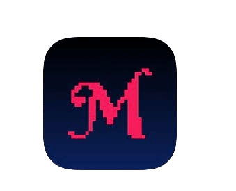

# HOW TO BITCOIN

>**To Bitcoin:** (verb) /tuːˈbɪtkɔɪn/
I hereby propose making ‘to bitcoin’ a verb,
that encapsulates the fullness of participating
in the bitcoin/Bitcoin eco-system.

* Ok, now that you have, hopefully ;) been orangepilled, and are ready to become your own bank, participating in the world’s first global freedom money,
here comes the fun part!

---

## BECOMING YOUR OWN BANK
* This is where the really epic shift in becoming finacially self-sovereign lies, and, it can take time to
really, truly grasp what this means.
* Some **intention and dedication is required to
understand how to do it in the most secure way
possible.**
* In the spirit of keeping this book ‘the simplest
bitcoin book ever written’, I will provide an
outline here, and then I offer resources at the end
for you to dive in to that go much deeper than
the scope of this primer.

>**HODL:** (verb) /ho’dill/

: to hold on to your bitcoin

: to not sell

-From a 2013 bitcointalk.org post, where the poster
professing to be drunk, misspelled ‘HOLD’

-bitcointalk.org/index.php?topic=375643.0

* While the network is still growing, there is much
value in the millions of global hodl’rs of last resort.

---

## ACQUIRING BITCOIN
* **Bitcoin enters the market by miners selling some of
the bitcoins they receive as rewards,** in order to pay
for their operating costs.
* **You can acquire bitcoin by buying on a peer-to-peer
trading platform, by accepting it as payment for
goods or services you offer, as a gift, or by mining
it.** (A very last resort, not recommended, is to buy it
from a registered exchange).
* When you receive it, you are technically receiving the
private keys with which to access your bitcoin.
> * **Remember:** The bitcoin itself never leaves the
 timechain.

* You can acquire bitcoin either anonymously, or
with ID verification (KYC - Know Your Customer)

* KYC is required by law to fulfill AML (anti-money laundering laws) when buying from exchanges.

>* Buying non-KYC bitcoin **preserves your right to
privacy in the future.**

---

## Non-KYC >> Anonymously
**How to Get non-KYC Bitcoin (No ID):**

RECOMMENDED

>1. Download a bitcoin-only wallet app (see pg 102).
>2. Choose a method (see below).
>3. Buy, receive or mine bitcoin.
>4. Withdraw your bitcoin to your wallet.
>5. HODL, or spend and replace.

* **Buy it from Robosats, Bisq, HodlHodl, Peach Bitcoin.**
* **Buy it from a bitcoin ATM** - Be sure to check, as
some require ID. Others just ask for a name and
number (you can use a temporary phone #).
* **Buy an Azteco voucher** - Visit azte.co for locations.
* **Earn it for work you do** - Ask to be paid in bitcoin.
Offer to discount your price.
* **Buy it in person at a bitcoin meet-up.**
* **Mine it** - It is getting easier to mine at home, or
you can join a mining pool, but then DYOR to stay
KYC-free. Ocean Pool is a great option.

---

## KYC >> ID Verification Required

**How to Buy KYC Bitcoin (with ID):**

NOT RECOMMENDED

>1. Download a bitcoin-only wallet app (see pg 102).
>2. Choose a bitcoin-only exchange.
>3. Create an account & link a payment method.
>4. Fulfill the KYC requirements.
>5. Buy bitcoin.
>6. **Withdraw your bitcoin to your own wallet.**
>7. HODL or spend and replace.

* **Be aware that your bitcoin will be forever linked to
your identity** if you buy it this way, thus forfeiting
future pseudonymity with regard to these purchases.
* If you choose this method, I recommend finding a
reputable ***bitcoin-only exchange***
* ***Be sure the exchange allows you to withdraw your
bitcoin to your own wallet!***
* **Exchanges are required by law to ‘KYC’ you.**
* They will take **your full name, address, social security
number, email, phone number and often a photo of
you holding your ID.**
* **Confirm that the exchange has both phone and email
support** for customer service.

---

* Have them walk you through sending your bitcoin
from your account with them to your own wallet, so
that you are self-custodying your bitcoin
= **Holding your own keys.**

>* **Note:** This does NOT erase the fact you
>bought bitcoin from them.
>* **Transactions are traceable on-chain, and in
>many countries you are liable for taxation when
>spending your bitcoin.**

* If you want to buy through Venmo or Paypal, be
sure to **first confirm that you can still withdraw
your sats to your own self-hosted wallet.** In the
past you could not do so.
* As they say:
> **“No keys, No cheese”** or
>
>**“Not your keys, Not your bitcoin”**

* What this means is, so long as a centralized service is
holding the private keys to your bitcoin, there remains
the possibility that their platform gets hacked, or that
they undergo regulatory capture and you lose your
bitcoin.

>* **Always withdraw your bitcoin to your own
self-hosted wallet as soon as you have
bought it.**

---
## EO 6102
* In 1933 **President Roosevelt issued Executive Order
6102, which required every US citizen to turn in
most of their gold in exchange for bank notes.**
* The gold was valued at $20.67/oz. The following
year, the government increased the price of gold to
$35/oz with the Gold Reserve Act of 1934,
effectively devaluing the notes people had
received by almost half, since the value of their
notes never went up with the inflated gold price.

---

* It took until 1975, **42 years later, for EO6102 to
be repealed,** and for private citizens to once again
be allowed to hold more than 5oz of gold.
* At this stage, we have little idea how the regulators
are going to respond to bitcoin as it continues to
gain popularity and more widespread adoption.
* So far, there has been a mixed reception. For the
time being however, it seems that many
understand, or perhaps just accept, that bitcoin
cannot ultimately be stopped.
* There are a number of politicians starting to speak
in support of bitcoin as part of their platform.
There are also some against it.
* Being an election year in the US, 2024 is very
interesting, with all three major Presidential
candidates accepting bitcoin campaign donations!
* El Salvador made it a form of legal tender in 2021.
It will be interesting to see which country is next.

>* **Ultimately, it would be in the interest of every government to embrace it and add it to their balance
sheet, as a hedge against their rapidly inflating
fiat currencies.**

---

## SECURELY STORING BITCOIN

* Once you have taken the life-changing step of buying your first , you need to **decide how to securely
store it.**
>* **Being your own bank is a powerful form of
>self-sovereignty.**
>* It needs to be taken **seriously**
* ***Please DYOR - Do Your Own Research * beyond
my basic recommendations here.**
* The **bitcoin ecosystem is evolving every minute.**
* Nostr, Twitter and bitcointalk.org are good
places to stay on top of the latest developments.

## CHECK OUT THESE SITES FOR TUTORIALS:
> * BTCSessions.ca by @BTCSessions
>* Bitcoiner.guide by @QnA
>* Armantheparman.com by @ArmanTheParman
>* @SouthernBitcoiner on YouTube
>* @wickedsmartbitcoin on YouTube

---

## BITCOIN-ONLY WALLETS
* Bitcoin is best stored in your own
 * **self-hosted**
 * **non-custodial**
 * **bitcoin-only** ‘wallet’

* A ‘wallet’ is actually a piece of software which is a
signing device. It contains your private keys which it
uses to sign a transaction you send (broadcast).

## HOT WALLET
* **This is an online bitcoin wallet app that you download to your phone or computer.**
* It is best used for smaller amounts, for day-to-day
spending
## COLD STORAGE WALLET
* **This is an offline wallet.** Also known as a hardware
wallet
* It is a separate hardware device on which to store
your keys. 

>* While both work well, it is generally recommended
to make use of a cold wallet once you have over
$500-1000 worth of bitcoin, as it is **more secure.**

---
* **Please DYOR to compare the features and
trade-offs between the wallets shown below.**

* **HOT WALLET APPS** - Non-Custodial
Blue Wallet, Muun Wallet, Mutiny Wallet
Sparrow Wallet, Green Wallet, Phoenix
Wallet, Zeus Wallet, Breez Wallet

* **COLD STORAGE WALLETS** - Non-Custodial
Cold Card, Trezor, Foundation Passport,
Blockstream Jade, Seed Signer, Bitbox,

>* **ALWAYS** purchase your cold storage wallet **direct
from the manufacturer,** to be certain it has not been
tampered with.

---

## WALLET SETUP
* Follow @BTCSessions on YouTube for excellent
tutorials on wallet set-up, and lots more.

>* When setting up your wallet, be sure to ***write down
>the 12- or 24-word Seed Phrase on paper.***
>* ***Keep it offline. Never take a screenshot of it.***
>* **STORE THE SEED PHRASE VERY SAFELY.**
>* **VERY, VERY SAFELY!**

* **Many companies make metal seed plates into
which you can punch your seed phrase for added
fire/water/damage protection. Highly recommend!**
* If you were to lose access to your hot or cold wallet,
you can restore it with the seed phrase and recover
your funds.
* You can do so on any wallet that supports the same
type of BIP39 seed phrase (12/24 words).
* Best practice would be to store the wallet
descriptor of your wallet in addition to your seed.
>* **REMEMBER: Anyone who has your seed has
access to your bitcoin!**

---
## ON PRIVACY
* Privacy when **buying (non-KYC), securing, storing
and spending** bitcoin is becoming more and more
important, especially in light of recent events with
bank accounts being seized/frozen.
>* In addition, **general digital privacy is critical if you
wish to gain online sovereignty, and protect yourself from undue surveillance and fraud.**

* Below are some current privacy-focused services.
* It is beyond the scope of this book to go deeply into
each of the following, so absolutely DYOR, and
follow the accounts I mention below on Nostr or
Twitter for updates.

>*Privacy is necessary for an open society in the electronic
age. Privacy is not secrecy. A private matter is something
one doesn’t want the whole world to know, but a secret
matter is something one doesn’t want anybody to know.
Privacy is the power to selectively reveal
oneself to the world.*

~Eric Hughes, From ‘A Cypherpunk’s Manifesto’

---
