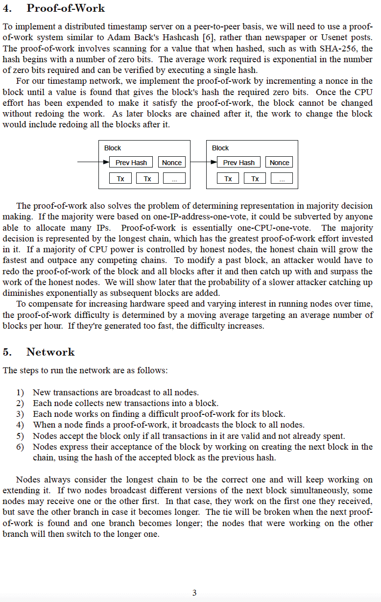
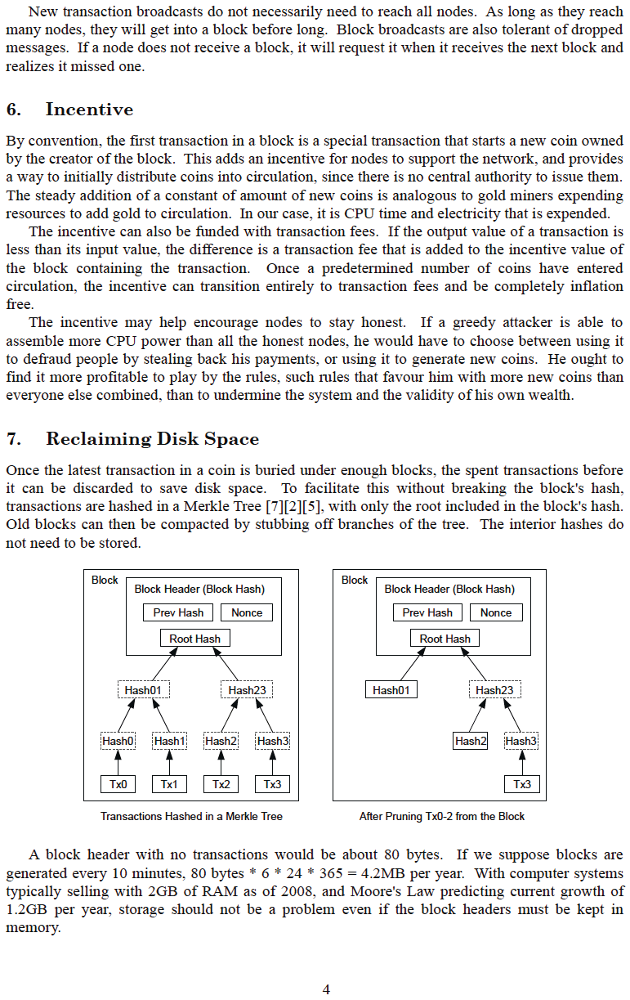
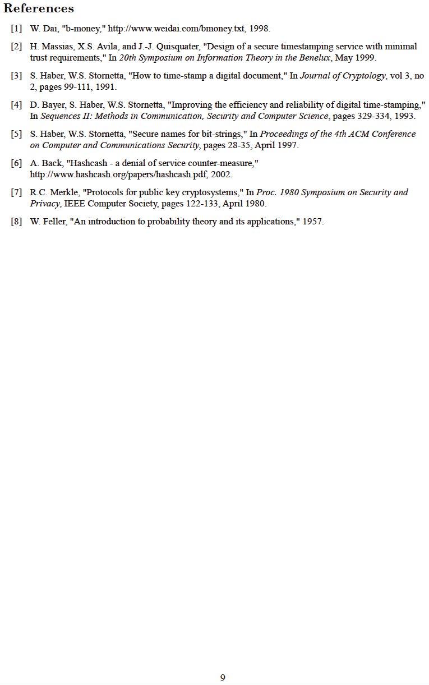

# The Bitcoin White Paper
Presented to the world on metzdowd.com
2008-10-31

**by Satoshi Nakamoto**

A pseudonymous cypherpunk, who last communicated
with the cypherpunk community on the bitcointalk.org
forum on 2010-12-10.

By leaving, he allowed Bitcoin to be a true experiment in
the wild. Everyone who works on it is a volunteer in some
sense <-> inspired by the potential of freeing humanity
from the shackles of a manipulated, debt-based money
system, and instead, participating in a global, trustless,
permissionless, censorship-resistant, truly scarce, peer-topeer, decentralized money and monetary payment network, that is inspiring an emergent order to rise out of the
fiat ashes

**We are all Satoshi**
>*The Times 03/Jan/2009 Chancellor on brink
of second bailout for banks*

~ Text of a headline from The Times of London,
etched into the Bitcoin Genesis block by Satoshi
Nakamoto on 2009-01-03

---

---

---

---

---

---

---

---

---

---

## Bitcoin Genesis Block ~ Raw Hex Version 2009-01-03

and so,

a new era,

was unleashed

---

