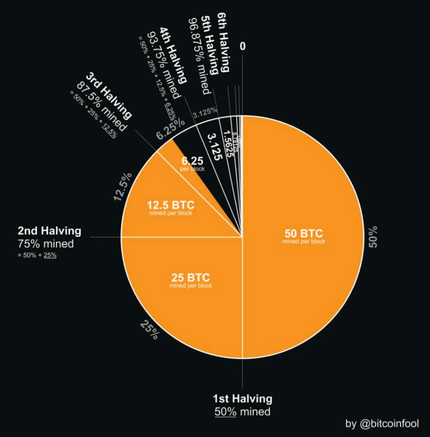

# ЧАСОВНИК 369 НА САТОШИ

**Биткойн е проектиран да копае 6 блока на час >> един блок
средно на всеки ~10 минути.**

* 24 часа в един ден

2+4=**6**

* Това прави 144 блока на ден

1+4+4=**9**

* 52560 блока на година

5+2+5+6+0=18

1+8=**9**

* 52704 блока на високосна година

5+2+7+0+4=18

1+8=**9**

* 21 милиона монети:

2 + 1 + 0 + 0 + 0 + 0 + 0 + 0 = **3**

* 33 Намалявания наполовина:

3 + 3 =**6**

* Трудността се коригира на всеки 2016 блока:

2 + 0 + 1 + 6 = **9**

~ Въз основа на туит от @level39

* Наградата за блок се намалява наполовина на всеки
210 000-и блок (приблизително на всеки четири години)
2 + 1 + 0 + 0 + 0 + 0 = **3**

---

>*„Ако само знаехте великолепието на 3, 6 и 9, тогава
щяхте да имате ключа към вселената.“
~ Никола Тесла*

## НАГРАДА ЗА БЛОК = % ОТ ПРЕДЛАГАНЕТО

* Субсидията за блок (броят на биткойни, наградени
за всеки новодобиван блок) представлява **процента
от общото предлагане**, което ще бъде добито
по време на тази епоха.

* Например, текущата награда за блок между
2024-2028 е **3.125** биткойна.

* През същите тези четири години, **3.125**% от 21
милиона биткойни ще бъдат добити.

Кредит: @bitcoinfool

---

## ЕПОХИ НА НАГРАЖДАВАНЕ

* На всеки четири години субсидията за биткойн се намалява наполовина за всеки
изкопан блок. **Епоха на награждаване е този четиригодишен период.**

* **Епоха на награждаване 1:** 2009-2012 **Субсидия за блок:** 50 биткойна
= (50 биткойна * 210 000 блока) = 10 500 000 биткойна

1+0+5+0+0+0+0+0 = **6**

* **Епоха на награждаване 2:** 2012-2016 **Субсидия за блок:** 25 биткойна
= (25 * 210 000) = 5 250 000 биткойна

5+2+5+0+0+0+0 = 12

1+2 = **3**

* **Епоха на награждаване 3:** 2016-2020 **Субсидия за блок:** 12.5 биткойна
= (12.5 * 210 000) = 2 625 000 биткойна

2+6+2+5+0+0+0 = 15

1+5 = **6**

* **Епоха на награждаване 4:** 2020-2024 **Субсидия за блок:** 6.25 биткойна
= (6.25 * 210 000) = 1 312 500 биткойна

1+3+1+2+5+0+0 = 12

1+2 = **3**

* **Епоха на награждаване 5:** 2024-2028 **Субсидия за блок:** 3.125 биткойна
= (3.125 * 210 000) = 656 250 биткойна

6+5+6+2+5+0 = 24

2+4 = **6**

* **Епоха на награждаване 7: 2032-2036 Субсидия за блок:** 0.78125 btc
= (0.78125*210 000) = 164 062.5 биткойна

1+6+4+0+6+2+5 = 24

2+4 = **6**

**... и така нататък до 2140 г.**

---

## РОЖДЕН ДЕН НА САТОШИ

* ***5 април 1975 г.*** е датата, която Сатоши посочи като свой
роден ден.
* Въпреки че не можем да знаем дали това наистина е било неговото истинско раждане
дата, това е много интересно.
* ***5 април*** (1933) е денят, в който е издаден Изпълнителна заповед 6102
беше подписана от президента на САЩ Франклин Д. Рузвелт
„забранява натрупването на златни монети, златен кюлчета
и златни сертификати в континенталната част на
Съединени щати.“
* ***1975*** е годината, в която влиза в сила отмяната на EO 6102 и гражданите на САЩ отново имат право да
притежават повече от 5 унции злато.

## ЧИСЛОВ ПАЛИНДРОМ 6102-2016

* ***6102*** беше номерът на гореспоменатия
Изпълнителна заповед.
* ***2016*** е броят на блоковете, добити по време на всяка корекция на трудността (приблизително 2 седмици).

>* И в двата горни примера човек може
да постулира, че Сатоши е използвал числа
за да покаже обрат, **разплитане на
вредата, нанесена от превишаването на правителствените правомощия.**

---

## ДЕН НА БИТКОЙН ПИЦАТА

* 22 май е известен като Ден на биткойн пицата. Това беше
денят, в който един човек, на име Ласло Ханеч, обяви
на bitcointalkforum.org, че е успешно
разменил 10 000 биткойна за пица! Тогава това
беше около $40.
* По днешни цени това би било ~ $610 000 000.
* Това беше важен етап за биткойн, тъй като това беше първият
известен инцидент, при който някой търгува с биткойн за
стока или услуга. Какъв дълъг път извървяхме!

---

## БИТКОЙН КАЛЕНДАР НА ЗАБЕЛЕЖИТЕЛНИ ДНИ

**2008-08-18** ~ Името на домейна **bitcoin.org беше регистрирано.**

**2008-10-31** ~ **Ден на бялата книга за биткойн:** Бялата книга,
озаглавен „Биткойн: Електронна система за пари в партньорска мрежа“ беше
публикуван от анонимен криптограф на име Сатоши
Накамото в metzdowd.com, пощенския списък за криптография.

**2009-01-03** ~ **Рожден ден на биткойн:** Мрежата на биткойн беше
стартира, когато Сатоши изкопа Genesis блока.

**2009-01-12** ~ **Първата биткойн транзакция** се състоя, когато Хал
Фини получи десет биткойна от Сатоши като тестово изпращане.

**2009-10-05** ~ **Раждане на първата биткойн борса,** The New
Liberty Standard (NLS), с посочена пазарна цена от $0,00764
за монета.

**2009-10-12** ~ "Намерих **първата известна биткойн към USD
транзакция** от моите имейл архиви. Продадох 5050 BTC за $5,02
на 2009-10-12." - Марти Малми, основател на bitcointalk.org, продаден
биткойн на NewLibertyStandard, който стартира първата борса.

**2010-05-22** ~ **Ден на биткойн пицата:** Първото известно събитие на
биткойн, използван за закупуване на стока или услуга, когато Ласло
Ханеч плати 10 000 биткойна за две пици Papa John’s!

**2010-12-12** ~ **Последният път**, когато Сатоши публикува във форума
bitcointalk.org.

**2011-02-11** ~ **Биткойн достига паритет** с щатския долар за
първи път.

**2011-06-14** ~ **Wikileaks** започва да приема дарения в биткойн.

**2017-03-03** ~ **Биткойн достига паритет** с унция злато.

**2021-08-21** ~ **Първи годишен ден на биткойн безкрайност**, предложен от
мема на Кнут Сванхолм:
Всичко, разделено на 21 милиона.

**2021-09-07** ~ Ел Салвадор става първата държава, която прави
биткойн законно платежно средство.

---