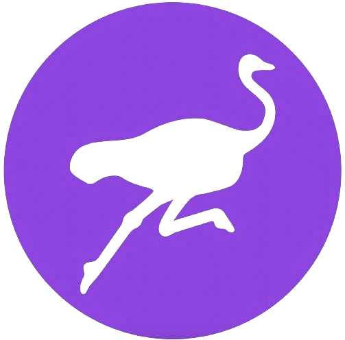

# NOSTR

## NOSTR И ДРУГИ НЕЩА, ПРЕДАВАНИ ЧРЕЗ РЕЛЕТА

>*Човек може да приеме закони против това, но свободата на
словото, дори повече от поверителността, е основополагаща за едно
отворено общество; ние се стремим да не ограничаваме речта изобщо.*

~ Ерик Хюз, Манифестът на Киберпънка, 1993

## КАКВО Е NOSTR

>*TL;DR: nostr е протокол, който има силата да
замени Twitter, Telegram и други неща.*

~ @dergigi

>*nostr е за свободата на комуникация
както биткойн е за свободата на транзакции.*

~ Keysa @SimplestBitcoinBook

* **Nostr е прост, децентрализиран протокол за
устойчиви на цензура, глобални, оперативно съвместими мрежи.**
* Nostr не разчита на надежден централен сървър.
* Това е безплатен софтуер с отворен код (FOSS),
като Bitcoin, HTTP или TCP-IP, което позволява на всеки да
надгражда върху nostr.
* **Това е начинът, по който запазваме свободата си да комуникираме**
с всеки, навсякъде с интернет връзка.

>*(това е) комуникационен протокол със
самостоятелен слой за самоличност...
и nostr е също повече от това.*

~ @dergigi

---

## ЗАЩО НИ Е НУЖЕН NOSTR

Нуждаем се от nostr, защото настоящите комуникационни
системи и платформи за социални медии са централизирани.

**Това е проблематично, защото тези системи:**

* Имат силата да цензурират речта ви.
* Са уязвими на регулаторни атаки от страна на държавата.
* Могат да изберат, или да им бъде казано, да спрат или изтрият вашия
акаунт.
* Могат да бъдат хакнати и по този начин да компрометират вашите данни.
* Използват алгоритми, за да ви подават информацията, която искат
да видите.
* Манипулират всеки аспект от опита ви върху тях.
* Проследяват цялата ви активност.
* Събират и продават вашите данни.
* Използват вашите данни, за да замърсят емисията ви с реклами.

---

## КАК РАБОТИ NOSTR

* **Nostr има две части:** Клиенти и Релета.
* **КЛИЕНТ е ИНТЕРФЕЙС** (приложение или уебсайт), който се изпълнява
върху протокола nostr.
* **Това е мястото, където виждате бележките**, които вие и хората
, които следвате, публикувате (по същия начин, по който Twitter е
интерфейс, където публикувате и четете бележки от други,
с изключение на това, че Twitter е централизиран и цензурира публикациите.)
* **РЕЛЕТО е СЪРВЪР и БАЗА ДАННИ.** Всеки може
да управлява реле, което е това, което прави nostr децентрализиран.
* **Това е мястото, където вашите бележки се изпращат, съхраняват и извличат
от** от клиентите.
* Има много релета и можете да изберете към кои да се свържете. Някои са безплатни, а други се заплащат.
* Когато публикувате съобщение, то се излъчва до релетата
, към които сте свързани.
* Клиентите правят заявки към релетата, към които са свързани, и
след това попълват съобщенията, хоствани от
тези релета.

~ @BTCillustrated

---

>*Всеки може да управлява реле. Релето е много просто и
глупаво. То не прави нищо друго, освен да приема публикации
от някои хора и да ги препраща на други.
На релетата не трябва да се има доверие.
Подписите се проверяват от страна на клиента.*

~ @fiatjaf, 2019-11-02 fiatjaf.com/nostr.html

* Когато отворите вашия nostr клиент, ще видите всички
бележки, публикувани от вас и тези, които следвате, в
хронологичен ред.
* Няма **алгоритми**, които да решават какво да ви показват,
какво да ви задържат или да цензурират публикациите ви.
* Подобно на Bitcoin, **nostr използва двойки публичен/частен ключ.**
* **ПУБЛИЧЕН КЛЮЧ** = npub, като потребителско име
* **ЧАСТЕН КЛЮЧ** = nsec, като парола

>* **ЗАБЕЛЕЖКА:** Вашият частен ключ не може да бъде нулиран, ако е
>загубен, така че **трябва да го защитите добре!**
>* Ако изтече вашият частен ключ, който и да има
>достъп до него, има достъп до вашия nostr
>акаунт и **няма начин да възстановите
>единствения достъп.**

---

* Можете да създадете четимо от човека потребителско име, като използвате
NIP-05. **Например:**
* **Моят публичен ключ, или npub, е:**
<small>npub1dpna3xwwddnhhzg9ycpvlcz2ze0jdwm2rf3eqd2lf9leaewtq7tqhw0ef2</small>

* **Моят NIP-05 Nostr адрес е:**

SimplestBitcoinBook@nostrplebs.com

* **Можете да търсите хора в nostr**, като въведете техните:
* npub
* NIP-05 (известен още като nostr адрес), ако имат такъв
* Потребителско име от NIP-05 -> @SimplestBitcoinBook

* **Вземете NIP-05 идентификатор тук:**
* nostrplebs.com
* verified-nostr.com
* getalby.com
* Или настройте такъв със собствен домейн

* След като имате вашата двойка ключове nostr, можете да влезете във всеки
nostr клиент със същите тези ключове и ще видите, че
**запазвате своята самоличност и списъци със последователи/следвания
на всички клиенти.**
* Това се различава от старите социални медии, където имате нужда от
отделен акаунт, потребителско име и парола за всяка
платформа и имате различно съдържание, следвания и
последователи на всяка една от тях.
>*На най-основно ниво Nostr е комуникационен
протокол, който действа като социално лепило, което свързва
всички ваши приложения заедно.*

~ derekross@nostrplebs.com

---

# КАК ДА ИЗПОЛЗВАТЕ NOSTR

>1. **Изберете клиентско** приложение за изтегляне. (Няма значение
кое ще изберете, тъй като можете да ги изпробвате всички, след като
имате генерирана двойка ключове.)
>2. **Популярни примери за клиенти:**
>* Damus на iOS
>* Amethyst на Android
>* Primal на iOS/Android/Desktop
>3. **Създайте потребителско име.** Не е необходима друга информация.
>4. **Приложението ще генерира акаунта.**
>5. **Можете да добавите профилна снимка и банер**, ако желаете.
>6. **Вашият акаунт автоматично ще се свърже с няколко
релета**, след като изберете поне един интерес (напр.:
биткойн, изкуство, права на човека, спорт, музика и т.н.)
>7. В зависимост от клиента, той автоматично ще следва няколко
акаунта с подобен интерес или ще ви позволи да изберете няколко.
>8. **След това можете да добавяте или премахвате релета и акаунти.**

~ @BTCillustrated

---

## УПРАВЛЕНИЕ НА КЛЮЧОВЕ
* След като ключовете ви бъдат генерирани, е време да
инсталирате **разширение за подписване.**
* Когато искате да влезете в уебсайт, работещ на
протокола nostr, той ще поиска вашия nsec или частен ключ.
* **НЕ** го въвеждайте директно, тъй като уебсайтовете могат да изтекат данни.
* **Вместо това винаги използвайте разширение за подписване.**
* Това е инструмент, който съхранява вашия частен ключ и вие
го упълномощавате да подписва събития, като например бележки, от ваше
име. Не се притеснявайте, това е по-просто, отколкото звучи!
* **Популярни разширения за подписване:**
* Nostore (iOS Safari)
* Amber (Android)
* Nsec App (Mobile/Desktop)
* Alby (Desktop)
* Nos2X (Desktop)
* Nostr Connect (Desktop)

## ZAPS
* Zapping е как правим биткойн в nostr! Създавайки V4V
(Value4Value) икономика, бележка по бележка, зап по зап.
* Можете да изпращате и получавате сатове (известни още като запсове) за бележки или
съдържание, което оценявате, като свържете Bitcoin
Lightning портфейл към вашия nostr акаунт.
* Има различни начини да направите това. Ако клиентът, който
изберете, не ви преведе през това, просто попитайте в nostr
с тага #asknostr и някой ще ви насочи.
Щраусите са приятелски настроени

---

## NOSTR РЕСУРСИ
По-долу е даден списък с уебсайтове, които имат отлични, лесно
смилаеми ръководства за nostr и неговите чудеса!

* nostr-resources.com от @derGigi
* nostr.com от @fiatjaf
* nostr.net от @aljaz
* nostr.how от @JeffG
* usenostr.org от @pluja
* benwehrman.com/nostr-guide от @benwehrman
* nostrapps.com от @Karnage

## ЗАЩО ЩРАУСЪТ?

**Историята за произхода на Щрауса**

от Walker@primal.net

**16 декември 2022 г.:**

Открих ChatGPT3 и,
естествено, го попитах
„Можеш ли да напишеш шега за #nostr?“
ChatGPT3 отговори:
В: Как наричате любопитен щраус?
О: NosTrich!
Шегата не беше страхотна, но не можете да обвинявате бот. Независимо от това, аз
харесах идеята за визуална идентичност за nostr, а щраусите са
готини птици. Така че се обърнах към Midjourney и създадох #Nostrich

**20 декември 2022 г.:**

@jb55 предложи „Щраусът“ като официален талисман на Nostr
и лого.
Три минути по-късно @jack туитва изображението на Щрауса.
Останалото, както се казва, е история.

~ @Walker

---

## NOSTR КЛИЕНТИ/ПРИЛОЖЕНИЯ

Посетете **nostrapps.com**, за да намерите тези и толкова много други
невероятни приложения, изградени върху безплатния протокол с отворен код nostr.
Използвайте разширението си за подписване, за да влезете във всички тях!

* **Nostr Nests** - Аудио пространство за чат, джем сесии,
микро-конференции, подкастове на живо.
* **Plebian Market** - Самостоятелният пазар на
Интернет, захранван от Bitcoin & Lightning.
* **Npub.pro** - Направете си уебсайт, базиран на nostr.
* **Corny Chat** - Аудио пространства на живо.
* **Wavlake** - Платформа за стрийминг на музика, която използва
Lightning Network на Bitcoin, за да предложи стойност за стойност.
* **Zap.stream** - Хоствайте стрийма си на живо и получавайте зап сатове.
* **Flare** - Клиент за гледане, качване и взаимодействие
с видео съдържание.
* **Blowater** - Създаден да замени Telegram/Slack/Discord.
* **Stemstr** - Социално изживяване за музикални артисти, за да
се свързват, да си сътрудничат и да споделят невероятна музика.
* **Nostr.build** - Качване и хостване на изображения, видео и медии.
* Hivetalk - Видео разговори и
срещи в реално време, напълно частни, замества Zoom.
* **Zap.cooking** - Споделяйте рецепти в Nostr.
* **Flockstr** - Събития и планиране на срещи.
* **Memestr** - Преглеждайте и правете мемета в Nostr
* **Quotestr** - Направете бележка Nostr като цитат в изображение.

---

## ПРИСЪЕДИНЕТЕ СЕ КЪМ НАС
* Nostr е все още много млад. Точно като биткойн, но много
по-млад, той е основен, объркан, глобален, експеримент отдолу нагоре.
* Ако виждате стойността в децентрализиран, устойчив на цензура
комуникационен протокол с отворен код,
моля, присъединете се към нас в използването му, разработването му, предлагането на
обратна връзка към програмистите и участвайте във каквото
чувствате, че сте призовани, за да помогнете за растежа на този инструмент за свободна реч.
* Това е невероятно изживяване да се ангажирате в нарастваща
технология, която е изградена, за да запази свободата на словото
и отворената комуникация в световен мащаб.
* Гмурнете се и учете заедно с останалите ни суверенни
души, прегръщайки присъщия хаос, за да създадете красота,
и да изковете светло бъдеще за нашите внуци!

*По-важно от всичко е, че трябва да имаме предвид, че
nostr е просто много свободен набор от сървъри с основно никаква
връзка между тях, ... и процесът на поддържане на
връзка с другите и намиране на съдържание трябва да бъде
разгледан чрез много различни хакерски опити. За да
пишете Nostr приложения и да използвате Nostr, човек
трябва да прегърне присъщия хаос.*

*~ @fiatjaf от:*

*'Визия за откриване на съдържание и използване на реле
за основно социално общуване в Nostr'*

---

Дълбока благодарност на Сатоши, Фиатжаф, киберпънкарите
в миналото, настоящето и бъдещето, Nostr fam, BT вихъра,
токсичните максита, нетоксичните максита, меме-лордовете и
-дами, вярващите, циниците, гадателите...
и винаги,
моето любимо семейство, приятели,
и Този, който диша през всички нас,
за това, че винаги ме виждат,
по-скъпи от всичко, дори биткойн

Безплатен PDF на тази книга и преводите
налични на: thesimplestbitcoinbook.net

Следвайте ме в nostr:

Коментари, въпроси, актуализации, обратна връзка:

thesimplestbitcoinbook@proton.me

Не мога да обещая, че ще стигна до това навреме...

може би съм бос на някъде в планината

Натрупайте сатове

Останете силни

Останете верни

в крайна сметка, Любов

851522
