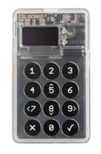

# КАК ДА БИТКОЙН

>**Да биткойнваш:** (глагол) /tuːˈbɪtkɔɪn/
С настоящото предлагам да направя "да биткойнваш" глагол,
който да обхване цялата пълнота на участието
в биткойн/Bitcoin екосистемата.

* Добре, сега, след като сте, надявам се ;) били "оранжевеещи" и сте готови да станете своя собствена банка, участвайки в първите в света глобални пари за свобода,
ето и забавната част!

---

## ДА СТАНЕШ СОБСТВЕНА БАНКА
* Тук се крие наистина епичната промяна в превръщането във финансово самовластен и това може да отнеме време, за да
наистина, истински да схванете какво означава това.
* Необходими са известни **намерения и отдаденост, за да
разберете как да го направите по най-сигурния начин.**
* В духа на това да запазим тази книга "най-простата
книга за биткойн, писана някога", ще предоставя тук
очертание, а след това предлагам ресурси в края,
за да се потопите в тях, които са много по-задълбочени от
обхвата на този учебник.

>**HODL:** (глагол) /ho’dill/

: да държиш биткойна си

: да не продаваш

-От публикация в bitcointalk.org от 2013 г., където авторът
твърди, че е пиян, грешно е изписал "HOLD" (ДЪРЖИ)

-bitcointalk.org/index.php?topic=375643.0

* Докато мрежата все още расте, има голяма
стойност в милионите глобални hodl'ри от последна инстанция.

---

## ПРИДОБИВАНЕ НА БИТКОЙН
* **Биткойн навлиза на пазара, като миньорите продават част от
биткойните, които получават като награди,** за да платят
оперативните си разходи.
* **Можете да придобиете биткойн, като купувате на peer-to-peer
търговска платформа, като го приемате като плащане за
стоки или услуги, които предлагате, като подарък или чрез копаене.** (Много крайна мярка, не се препоръчва, е да го купите
от регистрирана борса).
* Когато го получите, вие технически получавате
личните ключове, с които да получите достъп до биткойна си.
> * **Запомнете:** Самият биткойн никога не напуска
 времевата верига.

* Можете да придобиете биткойн анонимно или
с проверка на самоличността (KYC - Опознай клиента).

* KYC се изисква от закона, за да се изпълнят законите за AML (борба с изпирането на пари), когато купувате от борси.

>* Купуването на не-KYC биткойн **запазва правото ви на
поверителност в бъдеще.**

---

## Non-KYC >> Анонимно
**Как да получите не-KYC биткойн (без лична карта):**

ПРЕПОРЪЧИТЕЛНО

>1. Изтеглете приложение за портфейл само за биткойн (вижте стр. 102).
>2. Изберете метод (вижте по-долу).
>3. Купете, получете или копайте биткойн.
>4. Изтеглете биткойна си в портфейла си.
>5. HODL или харчете и заменете.

* **Купете го от Robosats, Bisq, HodlHodl, Peach Bitcoin.**
* **Купете го от биткойн банкомат** - Не забравяйте да проверите, тъй като
някои изискват лична карта. Други просто искат име и
номер (можете да използвате временен телефонен номер).
* **Купете ваучер Azteco** - Посетете azte.co за местоположения.
* **Спечелете го за работа, която вършите** - Поискайте да ви платят в биткойн.
Предложете да намалите цената си.
* **Купете го лично на биткойн среща.**
* **Копайте го** - Става все по-лесно да копаете у дома или
можете да се присъедините към пул за копаене, но след това DYOR, за да останете
без KYC. Ocean Pool е чудесен вариант.

---

## KYC >> Изисква се проверка на самоличността

**Как да купите KYC биткойн (с лична карта):**

НЕ СЕ ПРЕПОРЪЧВА

>1. Изтеглете приложение за портфейл само за биткойн (вижте стр. 102).
>2. Изберете борса само за биткойн.
>3. Създайте акаунт и свържете метод на плащане.
>4. Изпълнете KYC изискванията.
>5. Купете биткойн.
>6. **Изтеглете биткойна си в собствения си портфейл.**
>7. HODL или харчете и заменете.

* **Имайте предвид, че биткойнът ви ще бъде завинаги свързан с
вашата самоличност**, ако го купите по този начин, като по този начин се откажете
от бъдеща псевдонимност по отношение на тези покупки.
* Ако изберете този метод, препоръчвам да намерите
реномирана ***борса само за биткойн***
* ***Уверете се, че борсата ви позволява да изтеглите вашия
биткойн в собствения си портфейл!***
* **Борсите са задължени по закон да ви "KYC"ват.**
* Те ще вземат **пълното ви име, адрес, номер на социална осигуровка,
имейл, телефонен номер и често снимка на
вас, държащи личната си карта.**
* **Потвърдете, че борсата има поддръжка както по телефона, така и по имейл
за обслужване на клиенти.**

---

* Помолете ги да ви преведат през изпращането на вашия биткойн
от вашия акаунт при тях в собствения ви портфейл, така че
да имате самосъхранение на вашия биткойн
= **Държите собствените си ключове.**

>* **Забележка:** Това НЕ заличава факта, че
>сте купили биткойн от тях.
>* **Транзакциите са проследими във веригата и в
>много страни сте отговорни за данъчно облагане, когато
>харчите биткойна си.**

* Ако искате да купувате чрез Venmo или Paypal, бъдете
сигурни, че **първо потвърждавате, че все още можете да изтеглите
вашите сатове в собствения си самостоятелно хостван портфейл.** В
миналото не можехте да го направите.
* Както казват:
> **"Без ключове, без сирене"** или
>
>**"Не са твоите ключове, не е твоят биткойн"**

* Това означава, че докато централизирана услуга
държи личните ключове за вашия биткойн, остава
възможността тяхната платформа да бъде хакната или
да бъдат подложени на регулаторно завладяване и да загубите
биткойна си.

>* **Винаги изтегляйте биткойна си в собствения си
самостоятелно хостван портфейл веднага щом сте
го купили.**

---
## ИД 6102
* През 1933 г. **президентът Рузвелт издава Изпълнителна заповед
6102, която изисква от всеки американски гражданин да върне
по-голямата част от златото си в замяна на банкноти.**
* Златото е оценено на 20,67 долара/унция. През следващата
година правителството увеличава цената на златото до
35 долара/унция със Закона за златните резерви от 1934 г.,
като ефективно обезценява банкнотите, които хората са
получили с почти наполовина, тъй като стойността на техните
банкноти никога не се е повишила с надутата цена на златото.

---

* Отне чак до 1975 г., **42 години по-късно, за да бъде отменена ИД6102,** и за частните граждани отново
да бъде позволено да притежават повече от 5 унции злато.
* На този етап имаме малка представа как регулаторите
ще реагират на биткойн, тъй като той продължава да
придобива популярност и по-широко разпространение.
* Досега имаше смесен прием. За
момента обаче изглежда, че много
разбират или може би просто приемат, че биткойн
в крайна сметка не може да бъде спрян.
* Има редица политици, които започват да говорят
в подкрепа на биткойн като част от своята платформа.
Има и някои, които са против него.
* Тъй като 2024 г. е година на избори в САЩ, е много
интересно, като и тримата основни кандидати за президент
приемат дарения за кампания в биткойн!
* Ел Салвадор го направи форма на законно платежно средство през 2021 г.
Ще бъде интересно да видим коя държава е следващата.

>* **В крайна сметка би било в интерес на всяко правителство да го прегърне и да го добави към своя баланс
като хеджиране срещу бързо нарастващите им
фиатни валути.**

---

## СИГУРНО СЪХРАНЕНИЕ НА БИТКОЙН

* След като сте предприели променящата живота стъпка да купите първия си, трябва да **решите как сигурно да
го съхранявате.**
>* **Да бъдеш своя собствена банка е мощна форма на
>самовластие.**
>* Трябва да се вземе **на сериозно**
* ***Моля, DYOR - Направете собствено проучване * отвъд
моите основни препоръки тук.**
* **Биткойн екосистемата се развива всяка минута.**
* Nostr, Twitter и bitcointalk.org са добри
места, за да сте в крак с най-новите разработки.

## ПРОВЕРЕТЕ ТЕЗИ САЙТОВЕ ЗА УРОЦИ:
> * BTCSessions.ca от @BTCSessions
>* Bitcoiner.guide от @QnA
>* Armantheparman.com от @ArmanTheParman
>* @SouthernBitcoiner в YouTube
>* @wickedsmartbitcoin в YouTube

---

## ПОРТФЕЙЛИ САМО ЗА БИТКОЙН
* Биткойн се съхранява най-добре в собствения ви
 * **самостоятелно хостван**
 * **непопечителски**
 * **само за биткойн** "портфейл"

* "Портфейлът" всъщност е част от софтуер, който е
устройство за подписване. Той съдържа вашите лични ключове, които
използва, за да подпише транзакция, която изпращате (предавате).

## ГОРЕЩ ПОРТФЕЙЛ
* **Това е онлайн приложение за биткойн портфейл, което изтегляте на телефона или компютъра си.**
* Най-добре е да се използва за по-малки суми, за ежедневно
харчене
## СТУДЕН ПОРТФЕЙЛ ЗА СЪХРАНЕНИЕ
* **Това е офлайн портфейл.** Също така известен като хардуерен
портфейл
* Това е отделно хардуерно устройство, на което да съхранявате
ключовете си.

>* Въпреки че и двата работят добре, обикновено се препоръчва
да използвате студен портфейл, след като имате над
500-1000 долара биткойн, тъй като е **по-сигурен.**

---
* **Моля, DYOR, за да сравните характеристиките и
компромисите между портфейлите, показани по-долу.**

* **ПРИЛОЖЕНИЯ ЗА ГОРЕЩ ПОРТФЕЙЛ** - Непопечителски
Blue Wallet, Muun Wallet, Mutiny Wallet
Sparrow Wallet, Green Wallet, Phoenix
Wallet, Zeus Wallet, Breez Wallet

* **СТУДЕНИ ПОРТФЕЙЛИ ЗА СЪХРАНЕНИЕ** - Непопечителски
Cold Card, Trezor, Foundation Passport,
Blockstream Jade, Seed Signer, Bitbox,

>* **ВИНАГИ** купувайте своя студен портфейл за съхранение **директно
от производителя,** за да сте сигурни, че не е бил
подправен.

---

## НАСТРОЙКА НА ПОРТФЕЙЛА
* Следвайте @BTCSessions в YouTube за отлични
уроци за настройка на портфейла и много други.

>* Когато настройвате портфейла си, не забравяйте да ***запишете
>фразата на сийд от 12 или 24 думи на хартия.***
>* ***Дръжте я офлайн. Никога не правете екранна снимка на нея.***
>* **СЪХРАНЯВАЙТЕ ФРАЗАТА НА СИЙД МНОГО СИГУРНО.**
>* **МНОГО, МНОГО СИГУРНО!**

* **Много компании правят метални плочи за сийдове, в които
можете да перфорирате фразата си за сийд за допълнителна
защита от огън/вода/повреди. Силно препоръчвам!**
* Ако загубите достъп до вашия горещ или студен портфейл,
можете да го възстановите с фразата на сийд и да възстановите
средствата си.
* Можете да го направите на всеки портфейл, който поддържа същия
тип фраза за сийд BIP39 (12/24 думи).
* Най-добрата практика би била да съхранявате
дескриптора на портфейла си в допълнение към вашия сийд.
>* **ЗАПОМНЕТЕ: Всеки, който има вашия сийд, има
достъп до вашия биткойн!**

---
## ЗА ПОВЕРИТЕЛНОСТТА
* Поверителността при **купуване (не-KYC), осигуряване, съхранение
и харчене** на биткойн става все по-важна,
особено в светлината на последните събития със
завладени/замразени банкови сметки.
>* В допълнение, **общата дигитална поверителност е от решаващо значение, ако
желаете да придобиете онлайн суверенитет и да се предпазите от неправомерно наблюдение и измами.**

* По-долу са изброени някои актуални услуги, фокусирани върху поверителността.
* Надхвърля обхвата на тази книга да се задълбочава
във всяка от следните, така че абсолютно DYOR и
следвайте акаунтите, които споменавам по-долу в Nostr или
Twitter за актуализации.

>*Поверителността е необходима за едно отворено общество в електронната
епоха. Поверителността не е тайна. Личен въпрос е нещо,
което човек не иска целият свят да знае, но таен
въпрос е нещо, което човек не иска никой да знае.
Поверителността е силата да се разкриеш избирателно
пред света.*

~Ерик Хюз, от "Манифеста на киберпънка"

---