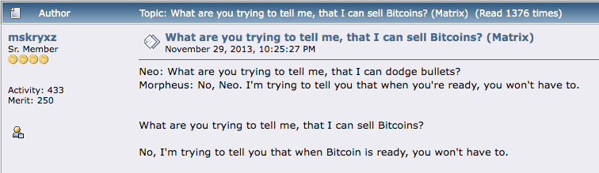

# Развенчаване на Биткойн Fud
(Страх, Несигурност, Съмнение)

* По-долу са изброени някои често срещани аргументи против или страхове
относно Биткойн.
* Те са до голяма степен неоснователни, произтичащи от невежество или може би непълно разбиране.
* Тук предоставям кратки отговори на всеки от тях и в края
ще намерите насоки към по-задълбочени ресурси,
опровергаващи целия FUD.

## БИТКОЙН ИЗПОЛЗВА ТВЪРДЕ МНОГО ЕНЕРГИЯ

>*Топлината от компютъра ви не е загуба
ако трябва да отоплявате дома си... Това е
равна цена, ако генерирате топлината
с вашия компютър.*

~ Сатоши Накамото 2010-08-09

>*Първоначално производството на стока просто защото
е скъпо, изглежда доста разточително. Въпреки това, незаличимо
скъпата стока многократно добавя стойност, като позволява
изгодни трансфери на богатство. По-голяма част от цената се възвръща
всеки път, когато транзакция е възможна или става
по-евтина. Цената, първоначално пълна загуба, е
амортизирана в много транзакции.*

~ Ник Сабо

Киберпънк

---

* **"Твърде много" енергия е стойностно предложение, което трябва
да се вземе предвид как оценяваме целта на енергията
използване.**

* **Когато човек си помисли, че коледните светлини в
САЩ използват толкова електроенергия, колкото цялата Биткойн мрежа,** тогава може би човек може да види, че всичко е относително!

* Използването на енергия, дори много енергия, за да се защити
най-трудните, най-устойчиви на цензура пари, които
човечеството някога е познавало, си заслужава повече от всякога.

* Когато сравняваме използването на енергия от Биткойн с това, използвано от
наследената система, също трябва да вземем предвид "пълния
стек" от двете страни:

| Биткойн Екосистема    | Наследена Фиат Система          |
| -------------------- | --------------------------- |
| ASIC копачи          | BIS                         |
| Възли                | Централни Банки               |
| Хардуерни Портфейли     | Национални/Регионални Банки     |
| Приложения за Софтуерен Портфейл | Военно-промишлен комплекс |
|                      | Центрове за Архивиране на Данни         |
|                      | Физическо Отпечатване на Пари     |
|                      | Физическо Разпространение на Пари |
|                      | Приложения за Онлайн Банкиране         |
|                      | Мрежа от Банкомати             |

* Използвайки Биткойн, в крайна сметка ще намалим енергията
използване в множество други области, най-вече
като вече не се нуждаем от Военно-промишления
Комплекс за защита на петродолара

---

* Също така, необузданият консумеризъм, който е необходим, за да
поддържа дълговата система на повърхността, с течение на времето
ще бъде ограничен, тъй като **твърдите пари естествено стимулират
разумни разходи и спестявания** (тъй като вашите спестявания
всъщност ще запазят стойността си, концепция, която не сме
изпитвали, откакто сме извън златния стандарт).
* **На последно място, и важното е, че копаенето на Биткойн вече
намалява замърсяването чрез улавяне на изгорял природен газ
и го използва за захранване на миньорите.** Тъй като миньорите търсят
ниски разходи за електроенергия, също така е вероятно да бъде най-големият
двигател към възобновяема ниска цена на енергията, тъй като
стимулите съвпадат.
* **Информирани дълбоки анализи за Биткойн и Енергия** са
написани от Даниел Батън на batcoinz.com, Трой
Крос, Джин Урсо, видеото "Тази машина озеленява"
от Swan Bitcoin в YouTube, "Мръсна Монета", A
Биткойн миньорски документален филм и
отличен епизод на шоуто "Какво е пари"
(WiM161) с B.Quittem, наред с много други.

---

## БИТКОЙН Е ПОНЗИ
* **Биткойн не е схема на Понзи:**
 * Старите инвеститори не получават пари от нови
 инвеститори.
 * Когато купувате Биткойн, никой не обещава възвръщаемост
 върху вашата инвестиция.
 * Няма лидерски или промоционален екип.
 * Нямаше предварително добиване.
 * **Прочетете:** "Защо Биткойн не е схема на Понзи" от Лин Алдън
за повече.

## БИТКОЙН Е ТВЪРДЕ БАВЕН
* Въпреки че основният слой на Биткойн е бавен, 2-рият слой
**Lightning Network, изградена върху основния слой, е...
светкавично бърза!**
* Мрежата на Биткойн може да обработва около 7
транзакции в секунда (TPS).
* Мрежата на Visa твърди, че може да обработва до 24 000
TPS, въпреки че 4000 TPS са по-близо до действителното използване.
* **Lightning Network, решение от втори слой
изградено върху Биткойн, има потенциален капацитет да
обработва милиони транзакции в секунда!**

---

## ПРАВИТЕЛСТВАТА МОГАТ ДА ЗАБРАНЯТ БИТКОЙН
* Някои правителства са опитали, като Китай, Индия и
Нигерия например. Във всеки случай използването на Биткойн
нараства бързо от хората на споменатата страна
* **Няма начин правителствата наистина да "забранят" Биткойн,** тъй като по своята същност е без разрешение и устойчив на цензура. Той е код и кодът е реч.
* Въпреки това, правителствата могат да затруднят купуването
и продаването с и във фиат. Те могат също така да го облагат с данък като
стока, както правят в САЩ.
* **В крайна сметка, няма да е в тяхна полза да се опитват да го забранят
тъй като Биткойн е неизбежен и те започват
да виждат това.** Би било много по-умно да го добавят към
баланса на страната си като хедж срещу техните
надуващи се фиатни валути.

>*Правителствата са добри в отрязването на
главите на централно контролирани мрежи
като Napster, но чистите P2P мрежи
като Gnutella и Tor изглежда са
се справят сами.*

~ Сатоши Накамото

* **Прочетете:**

Може ли правителството да спре Биткойн? от Алекс Гладщайн,
CSO на Human Rights Foundation

Може ли правителството да забрани Биткойн? Четири неща, които вие
Трябва да знаете от Ник Джамбруно

---

## БИТКОЙН Е СТАРА ТЕХНОЛОГИЯ
* **По-скоро "върховна технология",** по отношение на дигиталния
оскъдност, децентрализация и решаване както на проблема с двойното харчене, така и на проблема на Византийския генерал. Веднъж открит, той не може да бъде преоткрит.
* **След като колелото е изобретено, то никога не може да бъде
преоткрито.**
* TCP/IP протоколът, върху който работи интернет, е
бил стандарт за всички компютърни мрежи от
1983 г. Вероятно ще продължи да бъде стандарт за
дълго време.
* След като перфектното решение, основната технология на слоя е открита, която работи оптимално, тя може да продължи стотици
или хиляди години.

Кредит: @DecouvreBitcoin

---

## БИТКОЙН СЕ ИЗПОЛЗВА ОТ ПРЕСТЪПНИЦИ
* **Така е и доларът, и всяка друга фиатна валута в света.** Просто е некоректно да се приписва това
проблем само на Биткойн.
* **Биткойн е инструмент, точно като нож, и зависи от всеки
един от нас как го използваме.**
* Интересното е, че ако Биткойн не можеше да бъде използван от престъпници,
тогава той не би бил неутралните, устойчиви на цензура
пари, от които светът толкова се нуждае.
* **Забележка:** Тъй като Биткойн блокчейнът е одитируем, той е
всъщност наистина лош избор за престъпна дейност!

## КВАНТОВИТЕ КОМПЮТРИ МОГАТ ДА РАЗБИЯТ БИТКОЙН
* Въпреки че това може да е възможност един ден в бъдещето,
**разработчиците вече работят по решения за следквантово криптиране**
* Биткойн е само едно от множеството онлайн приложения, които разчитат на SHA-256 хеширане за сигурност.
Дори военните го използват, така че има огромен стимул извън Биткойн общността да разработва нови
протоколи за криптиране.
* Ако SHA-256 е разбит, ще имаме много друго да
се тревожим отвъд Биткойн. Целият интернет го използва
за криптиране. Това включва всички банкови, вериги за доставки, транспортни системи, здравни системи,
образователни системи и други.

---

## БИТКОЙН НЯМА РЕАЛНА СТОЙНОСТ
>*"Стойността на Биткойн се определя от неговата приложима оскъдност"*

*~ Fidelity Digital Assets*

* **Рядкостта е стойността. Всички пари във всички времена са били
оценени, защото са имали някаква мярка за оскъдност.**

* В допълнение, той беше подкрепен от вярата, че той ще
запази стойността си, така че да може да бъде търгуван в
бъдеще за нещо друго с стойност.
* С нарастването на Биткойн мрежата, подкрепена от превъзходните
парични свойства, които въплъщава, мрежовият ефект
нараства експоненциално
* Колкото по-голям е мрежовият ефект, толкова повече стойност той, като
оскъден актив, предлага. Стойността е отражение на търсенето,
и с увеличаването на търсенето, стойността се увеличава.

---

## НЯКОИ ХОРА ИМАТ ТВЪРДЕ МНОГО
* Вярно е, че някои хора имат много повече от други.
**В пускайки протокола отворено, Сатоши му позволи да
се разпространява свободно и тези, които разбраха потенциала
който притежава, или копаеше, или купуваше рано. Беше най-
справедливият и най-органичен начин да го представи
на света.**
* С течение на времето, когато светът е хипербиткойнизиран, което означава, че живеем по стандарт на Биткойн, тези, които
имат повече, естествено ще го изхарчат в икономиката

* Въпреки че в определен момент човек вече няма да може
да го купи с фиат, хората ще бъдат платени за тяхната
работа в Биткойн. Плащането в истински стабилни пари ще
ни позволи да имаме реални спестявания, които няма да бъдат обезценени
с течение на времето от инфлацията
* Въпреки че винаги ще има такива с повече богатство
и тези с по-малко, поради огромен брой фактори,
**стандартът на Биткойн ще направи мембраната между
класите на богатство пропускливи**, както казва Алекс Светси. Това
ще позволи възходяща и низходяща мобилност да бъде
много, много по-гъвкав, отколкото е днес
* **Да си роден и да плуваме през целия си живот
в свят на фиат, е почти невъзможно да си представим и
напълно да осмислим последиците от това да имаме пари, които
не могат да бъдат обезценени или манипулирани!**

---
## БИТКОЙН Е ТВЪРДЕ НЕСТАБИЛЕН
* **Това е нормално по време на фазата на откриване на цената на
нов паричен актив.** Няма друг начин
растежът да се случи, когато е органичен и нововъзникващ
(за разлика от отгоре надолу и централно контролиран.
* В допълнение, на този етап от човешкото съществуване, с
експоненциални промени, случващи се във всички сфери, има
смисъл, че нещо толкова рЕВОЛюционно като Биткойн ще
има диви колебания.
* Въпреки че тези от нас, дълбоко в заешката дупка, го виждат
като бъдещето, в момента само малък процент от
глобалното население притежава Биткойн в момента. Това
го прави уязвим на огромна нестабилност.
* С узряването и увеличаването на приемането нестабилността ще намалее и в крайна сметка ще се стабилизира и
ще стане разчетна единица.

>*Сигурен съм, че след 20 години ще има
или много голям обем на транзакции
или никакъв обем.*

~ Сатоши Накамото 2010-02-14

---

## НЕ МОЖЕТЕ ДА ДОКОСНЕТЕ БИТКОЙН

* **Това е функция, а не грешка.** Самият факт, че Биткойн
не е физически е един от най-големите фактори, допринасящи за неговата невъзможност за конфискация!

## БИТКОЙН МОЖЕ ДА БЪДЕ ХАКНАТ

* За 15-те години от пускането му, той никога не е бил
хакнат.
* Имало е обаче хакове на борси, така че аз
силно препоръчвам да преместите вашия Биткойн в собствения си
самостоятелно съхраняван портфейл възможно най-скоро.
* Изчислено е, че за да се разбие SHA-256
криптиране (което използва Биткойн) в рамките на 24 часа,
квантовият компютър ще се нуждае от 13 000 000 физически
кубити. В момента текущият рекорд за кубити, държан
от Atom Computing в Калифорния е 1180 кубити.
* Широко се предполага, че квантово-безопасен метод за криптиране
ще бъде разработен много преди да е необходим.

>*Да бъдеш с отворен код означава, че всеки може
независимо да прегледа кода. Ако беше
със затворен код, никой не би могъл да провери
сигурността. Мисля, че е от съществено значение за
програма от този характер да бъде с отворен код.*

*~Сатоши Накамото 2009-12-10*

---

## ПОВЕЧЕ ЗА РАЗБИВАНЕ НА FUD ТУК:

* Endthefud.org
* Bitcoinmythbusters.org
* Casebitcoin.com - Чести Критики
* Safehodl.github.io/failure/
* Lopp.net - Информация за Биткойн: Недоразумения

>*Биткойн е фундаментално различен от всеки друг дигитален
актив. Няма вероятност никой друг дигитален актив да се подобри
върху Биткойн като парично благо, защото Биткойн е най-
(в сравнение с други дигитални активи) сигурни, децентрализирани,
солидни дигитални пари и всяко "подобрение"
неизбежно ще се сблъска с компромиси.*

~ Fidelity Digital Assets Report, 'Bitcoin First', януари 2022 г.
Крис Куипер, CFA, Директор изследвания
Джак Нойройтер, Анализатор изследвания

---

## ОТНОСНО ЦЕНАТА НА БИТКОЙН
* **Виждам hodling (държене) Биткойн като дългосрочен
спестовен влог.**
* Ежедневната цена няма значение, тъй като се очаква да бъде
нестабилен (да се повишава и понижава) за още няколко години.
* Както споменах по-рано, това е нормално за нов
актив, подложен на откриване на цената
* Ако човек увеличи графика на цената на BTC/USD, ще
ще видите, че е нараснал с +31 296% от 2009 г.,
средно до ~200% на година.
* Колебанията на цените отразяват различни новинарски статии, регулаторни актуализации, пазарно търсене, страх и вълнение.
Това е влакче в увеселителен парк!
* **Колкото по-дълго hodl-вате, толкова повече научавате и разбирате основите и колкото повече осъзнавате
дълбоките последици от това да имаш стабилни пари,
толкова по-малко има значение цената.**

>**В крайна сметка "цената" изобщо няма да има значение, тъй като Биткойн
ще бъде разчетната единица.**

* **Отказ от отговорност:**
* Слагайте само това, което "можете да си позволите да загубите", тъй като
разбира се, няма гаранции.
* Считайте Биткойн, който купувате, за дългосрочен
спестовен влог и планирайте да го оставите на студено
съхранение за минимум пет години преди
харчене.

---

Оригинален източник на bitcointalkforum.org за един от
най-класическите Биткойн мемета на всички времена.

---

## МЕЖДУВРЕМЕННО, ОТНОСНО ДАНЪЦИТЕ
* **Отказ от отговорност:** Това не е финансов или данъчен съвет

* В данъчния кодекс на САЩ Биткойн в момента се разглежда като стока, така че има потенциални данъчни последици, ако вие
го продадете обратно във фиат или дори ако купите нещо с
вашия Биткойн
* Ако цената е паднала, преди да го продадете/изхарчите, вие
можете да заявите загуба
* Ако цената се е повишила, трябва да заявите
капиталова печалба и да платите между 10-30% CGT (Данък върху
капиталова печалба)
* Сумата зависи от няколко фактора, като например
колко дълго сте го държали, преди да го продадете или изхарчите, и
в кой данъчен клас попадате.
* Ако планирате да продавате или харчите Биткойн, особено по-големи
суми, може да искате да помислите за консултация с
данъчен специалист.
* Ако просто купувате и държите, в момента нямате
никакви облагаеми събития относно Биткойн.
* И ако купувате не-KYC...

---
