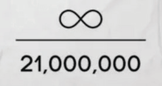

# ساعة ساتوشي للأرقام 369

**تم تصميم البيتكوين لتعدين 6 كتل في الساعة >> كتلة واحدة
في المتوسط كل ~10 دقائق.**

* 24 ساعة في اليوم

2+4=**6**

* هذا يساوي 144 كتلة في اليوم

1+4+4=**9**

* 52560 كتلة في السنة

5+2+5+6+0=18

1+8=**9**

* 52704 كتلة في السنة الكبيسة

5+2+7+0+4=18

1+8=**9**

* 21 مليون عملة:

2 + 1 + 0 + 0 + 0 + 0 + 0 + 0 = **3**

* 33 تنصيف:

3 + 3 =**6**

* يتم تعديل الصعوبة كل 2016 كتلة:

2 + 0 + 1 + 6 = **9**

~ بناءً على تغريدة بواسطة @level39

* يحدث تنصيف مكافأة الكتلة كل
الكتلة رقم 210,000 (تقريبًا كل أربع سنوات)
2 + 1 + 0 + 0 + 0 + 0 = **3**

---

>*"إذا كنت تعرف فقط عظمة الأرقام 3 و 6 و 9، إذن
سيكون لديك مفتاح الكون."
~ نيكولا تيسلا*

## مكافأة الكتلة = % من المعروض

* يمثل دعم الكتلة (عدد عملات البيتكوين التي تتم مكافأتها
لكل كتلة يتم تعدينها حديثًا) **النسبة المئوية من إجمالي المعروض** التي سيتم تعدينها
خلال تلك الحقبة

* على سبيل المثال، مكافأة الكتلة الحالية بين
2024-2028 هي **3.125** بيتكوين.

* في نفس هذه السنوات الأربع، سيتم تعدين **3.125**% من الـ 21
مليون بيتكوين.

حقوق الصورة: @bitcoinfool

---

## حقب المكافآت

* كل أربع سنوات، يتم تنصيف دعم البيتكوين لكل
كتلة يتم تعدينها. **حقبة المكافأة هي تلك الفترة التي مدتها أربع سنوات.**

* **حقبة المكافأة 1:** 2009-2012 **دعم الكتلة:** 50 بيتكوين
= (50 بيتكوين * 210,000 كتلة) = 10,500,000 بيتكوين

1+0+5+0+0+0+0+0 = **6**

* **حقبة المكافأة 2:** 2012-2016 **دعم الكتلة:** 25 بيتكوين
= (25 * 210,000) = 5,250,000 بيتكوين

5+2+5+0+0+0+0 = 12

1+2 = **3**

* **حقبة المكافأة 3:** 2016-2020 **دعم الكتلة:** 12.5 بيتكوين
= (12.5 * 210,000) = 2,625,000 بيتكوين

2+6+2+5+0+0+0 = 15

1+5 = **6**

* **حقبة المكافأة 4:** 2020-2024 **دعم الكتلة:** 6.25 بيتكوين
= (6.25 * 210,000) = 1,312,500 بيتكوين

1+3+1+2+5+0+0 = 12

1+2 = **3**

* **حقبة المكافأة 5:** 2024-2028 **دعم الكتلة:** 3.125 بيتكوين
= (3.125 * 210,000) = 656,250 بيتكوين

6+5+6+2+5+0 = 24

2+4 = **6**

* **حقبة المكافأة 7: 2032-2036 دعم الكتلة:** 0.78125 بيتكوين
= (0.78125*210,000) = 164,062.5 بيتكوين

1+6+4+0+6+2+5 = 24

2+4 = **6**

**... وهكذا حتى عام 2140**

---

## عيد ميلاد ساتوشي

* ***5 أبريل 1975*** هو التاريخ الذي ادعى ساتوشي أنه تاريخ
ميلاده.
* في حين أننا لا نستطيع معرفة ما إذا كان هذا هو تاريخ ميلاده الحقيقي بالفعل
، إلا أنه مثير للاهتمام للغاية.
* ***5 أبريل*** (1933) هو اليوم الذي تم فيه التوقيع على الأمر التنفيذي رقم 6102
من قبل الرئيس الأمريكي فرانكلين دي روزفلت
"الذي يحظر اكتناز العملات الذهبية والسبائك الذهبية
وشهادات الذهب داخل القارة
الولايات المتحدة."
* ***1975*** هو العام الذي دخل فيه إلغاء الأمر التنفيذي رقم 6102 حيز
التنفيذ، وسُمح للمواطنين الأمريكيين مرة أخرى
بحيازة أكثر من 5 أوقيات من الذهب.

## متتالية رقمية 6102-2016

* ***6102*** هو رقم الأمر التنفيذي المذكور أعلاه.
* ***2016*** هو عدد الكتل التي تم تعدينها خلال كل تعديل للصعوبة (حوالي أسبوعين).

>* في كلا المثالين أعلاه، يمكن للمرء
افتراض أن ساتوشي كان يستخدم الأرقام
للإشارة إلى انعكاس، **إلغاء الضرر
الناجم عن تجاوز الحكومة.**

---

## يوم بيتكوين بيتزا

* يُعرف 22 مايو باسم يوم بيتكوين بيتزا. كان هذا هو
اليوم الذي أعلن فيه أحد الأشخاص، ويدعى لازلو هانيتش،
على bitcointalkforum.org أنه نجح
في تداول 10000 بيتكوين مقابل البيتزا! في ذلك الوقت كان
حوالي 40 دولارًا.
* بأسعار اليوم، سيكون ذلك ~ 610,000,000 دولار.
* لقد كان علامة فارقة بالنسبة للبيتكوين، حيث كان هذا هو أول
حادثة معروفة لشخص يتداول البيتكوين مقابل
سلعة أو خدمة. يا له من طريق طويل قطعناه!

---

## تقويم البيتكوين للأيام البارزة

**2008-08-18** ~ تم تسجيل اسم النطاق **bitcoin.org**.

**2008-10-31** ~ **يوم الورقة البيضاء للبيتكوين:** الورقة البيضاء،
بعنوان "Bitcoin: A Peer-to-Peer Electronic Cash System"
نشرها خبير تشفير مجهول الهوية يدعى ساتوشي
ناكاموتو على metzdowd.com، القائمة البريدية للتشفير.

**2009-01-03** ~ **عيد ميلاد البيتكوين:** تم إطلاق شبكة البيتكوين،
عندما قام ساتوشي بتعدين كتلة Genesis.

**2009-01-12** ~ **أول معاملة بيتكوين** تمت، عندما تلقى هال
فيني عشرة بيتكوين من ساتوشي كإرسال اختباري.

**2009-10-05** ~ **ولادة أول بورصة بيتكوين،** The New
Liberty Standard (NLS)، بسعر سوق مدرج قدره 0.00764 دولار
لكل عملة.

**2009-10-12** ~ "وجدت **أول معاملة معروفة من البيتكوين إلى الدولار الأمريكي**
من النسخ الاحتياطية لبريدي الإلكتروني. لقد بعت 5050 بيتكوين مقابل 5.02 دولار
في 2009-10-12." - مارتي مالمي، مؤسس bitcointalk.org، باع
البيتكوين إلى NewLibertyStandard الذي بدأ أول بورصة.

**2010-05-22** ~ **يوم بيتكوين بيتزا:** أول مرة معروفة لـ
يتم استخدام البيتكوين لشراء سلعة أو خدمة، عندما قام لازلو
دفع Hanyecz 10000 بيتكوين مقابل اثنين من بيتزا بابا جونز!

**2010-12-12** ~ **آخر مرة** نشر فيها ساتوشي على
منتدى bitcointalk.org.

**2011-02-11** ~ **يصل البيتكوين إلى التكافؤ** مع الدولار الأمريكي لأول مرة
مرة.

**2011-06-14** ~ **ويكيليكس** تبدأ في قبول التبرعات بالبيتكوين.

**2017-03-03** ~ **يصل البيتكوين إلى التكافؤ** مع أوقية من الذهب.

**2021-08-21** ~ **أول يوم لانهائي للبيتكوين السنوي** اقترحه
ميمي Knut Svanholm:
كل شيء مقسوم على 21 مليون.

**2021-09-07** ~ السلفادور تصبح أول دولة تجعل
البيتكوين عملة قانونية.

---