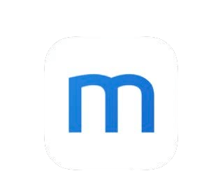
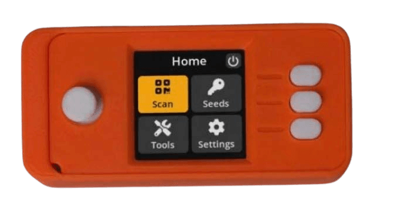

# إزاي تبقى بيتكوين

>**تبيتكوين:** (فعل) /tuːˈbɪtkɔɪn/
أنا هنا بقترح إننا نخلي "تبيتكوين" فعل،
يلخص كل جوانب المشاركة
في النظام البيئي للبيتكوين/Bitcoin.

* تمام، دلوقتي بعد ما (يا رب ;) تكون اتلونت باللون البرتقالي، ومستعد تبقى البنك بتاع نفسك، وبتشارك في أول فلوس حرية عالمية في العالم،
هنا بقى المتعة!

---

## تبقى البنك بتاع نفسك
* هنا يكمن التحول الملحمي الحقيقي في إنك تبقى مستقل ماليًا، وممكن ياخد وقت
علشان تستوعب بجد معنى ده.
* فيه **نية وتفاني مطلوبين علشان
تفهم إزاي تعمل ده بأكتر طريقة آمنة ممكنة.**
* من منطلق الحفاظ على الكتاب ده "أبسط
كتاب بيتكوين اتكتب على الإطلاق"، أنا هقدم
هنا مخطط عام، وبعدين هقدم مصادر في الآخر
علشان تتعمق فيها أكتر بكتير من
نطاق التمهيدي ده.

>**HODL:** (فعل) /ho’dill/

: إنك تتمسك بالبيتكوين بتاعك

: إنك متبعش

-من منشور على bitcointalk.org سنة 2013،
الكاتب كان بيقول إنه سكران، وغلط في كتابة كلمة "HOLD"

-bitcointalk.org/index.php?topic=375643.0

* طول ما الشبكة لسه بتنمو، فيه قيمة كبيرة
في ملايين الـ hodl’rs العالميين كحل أخير.

---

## الحصول على البيتكوين
* **البيتكوين بيدخل السوق لما المعدنين بيبيعوا جزء من
البيتكوين اللي بيستلموه كمكافآت،** علشان يقدروا يدفعوا
تكاليف التشغيل بتاعتهم.
* **ممكن تحصل على بيتكوين عن طريق الشراء من منصة تداول نظير لنظير، أو عن طريق قبوله كدفعة مقابل
سلع أو خدمات بتقدمها، أو كهدية، أو عن طريق تعدينه.** (حل أخير جدًا، مش مستحب، إنك تشتريه
من بورصة مسجلة).
* لما بتستلمه، أنت فنيًا بتستلم
المفاتيح الخاصة اللي بتوصلك للبيتكوين بتاعك.
> * **افتكر:** البيتكوين نفسه عمره ما بيسيب
 سلسلة الكتل الزمنية (timechain).

* ممكن تحصل على بيتكوين إما بشكل مجهول، أو
عن طريق التحقق من الهوية (KYC - اعرف عميلك).

* قانونًا، KYC مطلوب علشان يتم الامتثال لقوانين مكافحة غسل الأموال (AML) لما تشتري من البورصات.

>* شراء بيتكوين غير KYC **بيحافظ على حقك في
الخصوصية في المستقبل.**

---

## غير KYC >> مجهول
**إزاي تجيب بيتكوين غير KYC (من غير هوية):**

مستحسن

>1. نزّل تطبيق محفظة بيتكوين بس (شوف صفحة 102).
>2. اختار طريقة (شوف تحت).
>3. اشتري أو استلم أو عدّن بيتكوين.
>4. اسحب البيتكوين بتاعك على المحفظة بتاعتك.
>5. HODL، أو اصرفه واستبدله.

* **اشتريه من Robosats أو Bisq أو HodlHodl أو Peach Bitcoin.**
* **اشتريه من ماكينة ATM بيتكوين** - تأكد إنك تتأكد، لأن
فيه بعضها بيطلب هوية. فيه غيرها بيطلب اسم ورقم بس
(ممكن تستخدم رقم تليفون مؤقت).
* **اشتري قسيمة Azteco** - زور azte.co علشان تعرف أماكنها.
* **اكسبه مقابل شغل بتعمله** - اطلب إنك تتقاضى بالبيتكوين.
اعرض إنك تقلل السعر بتاعك.
* **اشتريه شخصيًا في تجمع بيتكوين.**
* **عدّنه** - بقى أسهل إنك تعدن في البيت، أو
ممكن تنضم لمجمع تعدين، بس ساعتها اعمل بحثك الخاص (DYOR) علشان تفضل
من غير KYC. Ocean Pool خيار عظيم.

---

## KYC >> مطلوب التحقق من الهوية

**إزاي تشتري بيتكوين KYC (بالهوية):**

مش مستحسن

>1. نزّل تطبيق محفظة بيتكوين بس (شوف صفحة 102).
>2. اختار بورصة بيتكوين بس.
>3. اعمل حساب واربط طريقة دفع.
>4. استوفي متطلبات KYC.
>5. اشتري بيتكوين.
>6. **اسحب البيتكوين بتاعك على المحفظة بتاعتك.**
>7. HODL أو اصرفه واستبدله.

* **خلي بالك إن البيتكوين بتاعك هيفضل مرتبط بـ
هويتك للأبد** لو اشتريته بالطريقة دي، وبالتالي بتخسر
حقك في عدم الكشف عن هويتك في المستقبل فيما يتعلق بالمشتريات دي.
* لو اخترت الطريقة دي، أنا بنصحك تلاقي
***بورصة بيتكوين بس*** ليها سمعة كويسة.
* ***تأكد إن البورصة بتسمحلك تسحب
البيتكوين بتاعك على المحفظة بتاعتك!***
* **قانونًا، البورصات مطالبة إنها تعملك ‘KYC’.**
* هياخدوا **اسمك بالكامل وعنوانك ورقم الضمان الاجتماعي
والإيميل ورقم التليفون وغالبًا صورة ليك وأنت ماسك
هويتك.**
* **تأكد إن البورصة عندها دعم عن طريق التليفون والإيميل
لخدمة العملاء.**

---

* خليهم يمشوك خطوة بخطوة في عملية إنك تبعت البيتكوين
بتاعك من حسابك معاهم للمحفظة بتاعتك، علشان
تبقى أنت اللي متحفظ على البيتكوين بتاعك بنفسك
= **إنك تبقى ماسك المفاتيح بتاعتك بنفسك.**

>* **ملحوظة:** ده مش بيمحي حقيقة إنك
>اشتريت بيتكوين منهم.
>* **المعاملات قابلة للتتبع على السلسلة، وفي
>دول كتير أنت مسؤول عن الضرائب لما
>تصرف البيتكوين بتاعك.**

* لو عايز تشتري عن طريق Venmo أو Paypal،
تأكد **الأول إنك لسه تقدر تسحب
الساتوشي بتاعتك على المحفظة بتاعتك اللي بتستضيفها بنفسك.** زمان ما كنتش بتقدر تعمل كده.
* زي ما بيقولوا:
> **"مفيش مفاتيح، مفيش جبنة"** أو
>
>**"مش مفاتيحك، مش البيتكوين بتاعك"**

* معنى الكلام ده، طول ما فيه خدمة مركزية
هي اللي ماسكة المفاتيح الخاصة للبيتكوين بتاعك، بيفضل
فيه احتمال إن المنصة بتاعتهم تتهكر، أو إن
يخضعوا للاستيلاء التنظيمي وتخسر البيتكوين بتاعك.

>* **اسحب البيتكوين بتاعك على
المحفظة بتاعتك اللي بتستضيفها بنفسك أول ما
تشتريه على طول.**

---
## الأمر التنفيذي 6102
* سنة 1933 **الرئيس روزفلت أصدر الأمر التنفيذي
6102، اللي طلب من كل مواطن أمريكي إنه يسلم
معظم الدهب بتاعه مقابل أوراق بنكية.**
* الدهب كان متقدر بـ 20.67 دولار للأوقية. في السنة اللي
بعدها، الحكومة رفعت سعر الدهب لـ
35 دولار للأوقية عن طريق قانون احتياطي الدهب لسنة 1934،
وبكده قللت قيمة الأوراق اللي الناس
استلمتها للنص تقريبًا، لأن قيمة
الأوراق بتاعتهم عمرها ما زادت مع سعر الدهب المتضخم.

---

* الموضوع خد لحد سنة 1975، **بعد 42 سنة، علشان
الأمر التنفيذي 6102 يتلغي،** وعلشان المواطنين العاديين يقدروا تاني
يمتلكوا أكتر من 5 أوقيات من الدهب.
* في المرحلة دي، معندناش فكرة كبيرة إزاي الجهات التنظيمية
هتستجيب للبيتكوين وهو بيكتسب شعبية
أكبر وتبني أوسع.
* لحد دلوقتي، كان فيه استقبال متباين. في الوقت
الحالي، يبدو إن كتير فاهمين،
أو يمكن بس متقبلين، إن البيتكوين
مينفعش يتوقف في النهاية.
* فيه عدد من السياسيين بدأوا يتكلموا
بدعم البيتكوين كجزء من البرنامج بتاعهم.
فيه برضه ناس ضده.
* بما إن 2024 سنة انتخابات في أمريكا، فهي سنة
مهمة جدًا، وكل المرشحين الرئاسيين
الكبار بيقبلوا تبرعات حملاتهم الانتخابية بالبيتكوين!
* السلفادور خلته شكل من أشكال العملة القانونية سنة 2021.
هيبقى من المثير للاهتمام نشوف إيه الدولة اللي عليها الدور.

>* **في النهاية، هيكون في مصلحة كل حكومة إنها تتبناه وتضيفه للميزانية بتاعتها،
كدفاع ضد العملات الورقية المتضخمة بتاعتهم بسرعة.**

---

## تخزين البيتكوين بشكل آمن

* بمجرد ما تاخد الخطوة اللي بتغير الحياة بتاعة إنك تشتري أول بيتكوين ليك، لازم **تقرر إزاي تخزنه بشكل آمن.**
>* **إنك تبقى البنك بتاع نفسك ده شكل قوي من
>الاستقلالية الذاتية.**
>* لازم يتاخد **بجدية.**
* ***من فضلك اعمل بحثك الخاص (DYOR - Do Your Own Research) * أبعد من
توصياتي الأساسية هنا.**
* **النظام البيئي للبيتكوين بيتطور كل دقيقة.**
* Nostr وTwitter وbitcointalk.org أماكن كويسة علشان
تبقى على اطلاع بآخر التطورات.

## شوف المواقع دي علشان فيديوهات تعليمية:
> * BTCSessions.ca من @BTCSessions
>* Bitcoiner.guide من @QnA
>* Armantheparman.com من @ArmanTheParman
>* @SouthernBitcoiner على يوتيوب
>* @wickedsmartbitcoin على يوتيوب

---

## محافظ البيتكوين بس
* أحسن طريقة لتخزين البيتكوين هي في المحفظة بتاعتك
 * **اللي بتستضيفها بنفسك**
 * **اللي مش بتخضع لحضانة طرف تالت**
 * **محفظة بيتكوين بس**

* "المحفظة" هي في الواقع جزء من برنامج سوفتوير وهو عبارة عن
جهاز توقيع. بيحتوي على المفاتيح الخاصة بتاعتك اللي
بيستخدمها علشان يوقع على معاملة بتبعتها (بتذيعها).

## محفظة هوت
* **دي عبارة عن تطبيق محفظة بيتكوين أونلاين بتنزله على تليفونك أو الكمبيوتر بتاعك.**
* الأفضل تستخدمها لكميات صغيرة، علشان المصاريف اليومية
## محفظة تخزين بارد
* **دي عبارة عن محفظة أوفلاين.** معروفة برضه باسم محفظة أجهزة
* ده جهاز منفصل بتخزن عليه
المفاتيح بتاعتك.

>* في حين إن الاتنين شغالين كويس، بينصح عمومًا
باستخدام محفظة باردة بمجرد ما يبقى معاك بيتكوين بقيمة
أكتر من 500-1000 دولار، لأنها **أكتر أمانًا.**

---
* **من فضلك اعمل بحثك الخاص (DYOR) علشان تقارن بين المميزات
والمقايضات بين المحافظ المعروضة تحت.**

* **تطبيقات محافظ هوت** - مش بتخضع لحضانة طرف تالت
Blue Wallet, Muun Wallet, Mutiny Wallet
Sparrow Wallet, Green Wallet, Phoenix
Wallet, Zeus Wallet, Breez Wallet

* **محافظ تخزين بارد** - مش بتخضع لحضانة طرف تالت
Cold Card, Trezor, Foundation Passport,
Blockstream Jade, Seed Signer, Bitbox,

>* **دايمًا** اشتري محفظة التخزين البارد بتاعتك **مباشرة
من الشركة المصنعة،** علشان تبقى متأكد إن محدش لعب فيها.

---

## إعداد المحفظة
* تابع @BTCSessions على يوتيوب علشان تشوف فيديوهات تعليمية ممتازة
عن إعداد المحفظة، وحاجات تانية كتير.

>* لما تيجي تعمل إعداد للمحفظة بتاعتك، تأكد إنك ***تكتب
>عبارة البذور المكونة من 12 أو 24 كلمة على ورق.***
>* ***خليها أوفلاين. متخدش سكرين شوت ليها أبدًا.***
>* **خزّن عبارة البذور بأمان شديد.**
>* **بأمان شديد جدًا!**

* **شركات كتير بتعمل صفائح بذور معدنية ممكن
تخرم فيها عبارة البذور بتاعتك علشان تحميها زيادة من
الحريق/المية/التلف. بنصح بيها بشدة!**
* لو خسرت القدرة على الوصول للمحفظة الهوت أو الكولد بتاعتك،
ممكن ترجعها بعبارة البذور وتسترجع
الفلوس بتاعتك.
* ممكن تعمل ده على أي محفظة بتدعم نفس
نوع عبارة البذور BIP39 (12/24 كلمة).
* أفضل الممارسات هي إنك تخزن
واصف المحفظة بتاعك بالإضافة للبذور بتاعتك.
>* **افتكر: أي حد معاه البذور بتاعتك يقدر
يوصل للبيتكوين بتاعك!**

---
## عن الخصوصية
* الخصوصية وقت **الشراء (غير KYC) وتأمين وتخزين
وإنفاق** البيتكوين بقت أهم وأهم،
بالذات في ضوء الأحداث الأخيرة اللي حصلت مع
حسابات بنكية تم الاستيلاء عليها/تجميدها.
>* بالإضافة لكده، **الخصوصية الرقمية العامة مهمة جدًا لو
عايز تكسب سيادة أونلاين، وتحمي نفسك من المراقبة والاحتيال اللي مالهمش لازمة.**

* تحت فيه بعض الخدمات اللي بتركز على الخصوصية حاليًا.
* الموضوع أبعد من نطاق الكتاب ده للدخول بعمق في
كل حاجة من الحاجات اللي جاية دي، فعلشان كده اعمل بحثك الخاص (DYOR) تمامًا،
وتابع الحسابات اللي بذكرها تحت على Nostr أو
Twitter علشان تشوف التحديثات.

>*الخصوصية ضرورية لمجتمع مفتوح في العصر الإلكتروني.
الخصوصية ليست سرية. الأمر الخاص هو شيء لا يريد
المرء أن يعرفه العالم كله، لكن الأمر السري هو شيء
لا يريد المرء أن يعرفه أحد. الخصوصية هي القوة للانتقائية
في الكشف عن المرء للعالم.*

~إريك هيوز، من "بيان سايفر بانك"
