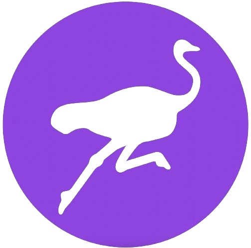

# NOSTR

## NOSTR & OTHER STUFF TRANSMITTED BY RELAYS

>*One could pass laws against it, but the freedom of
speech, even more than privacy, is fundamental to an
open society; we seek not to restrict any speech at all.*

~ Eric Hughes, The Cypherpunk's manifesto, 1993

## WHAT IS NOSTR

>*TL;DR: nostr is a protocol that has the power to
replace twitter, Telegram, and other things.*

~ @dergigi 

>*nostr is to freedom of communication
as bitcoin is to freedom of transaction.*

~ Keysa @SimplestBitcoinBook

* **Nostr is a simple, decentralized protocol for
censorship-resistant, global, interoperable networks.**
* Nostr does not rely on a trusted central server.
* It is a free and open source (FOSS) software protocol,
like Bitcoin, HTTP or TCP-IP, which allows anyone to
build on nostr.
* **It is how we retain our freedom to communicate**
with anyone, anywhere with an internet connection.

>*(it is) a communications protocol with a
self-sovereign identity layer...
and nostr is also more than that.* 

~ @dergigi

---

## WHY WE NEED NOSTR

We need nostr because the current communication
systems and social media platforms are centralized.

**This is problematic because these systems:**

* Have the power to censor your speech.
* Are vulnerable to regulatory attacks by the state.
* Can choose, or be told, to suspend or delete your
account.
* Can be hacked, and thus compromise your data.
* Use algorithms to feed you the information they want
you to see.
* Manipulate every aspect of your experience on them.
* Track all your activity.
* Harvest and sell your data.
* Use your data to litter your feed with advertisements.

---

## HOW DOSE NOSTR WORK

* **Nostr has two parts:** Clients and Relays.
* **A CLIENT is an INTERFACE** (app or website) that is run
on the nostr protocol. 
* **It is where you see the notes** that you and the people
you follow post (in the same way that twitter is an
interface where you post and read notes by others,
except twitter is centralized & it censors posts.)
* **A RELAY is a SERVER and a DATABASE.** Anyone can
run a relay, which is what makes nostr decentralized.
* **t is where your notes are sent, stored and retrieved
from** by clients.
* There are many relays and you can choose which ones
to connect to. Some are free and some are paid.
* When you post a message, it is broadcast to the relays
you are connected to.
* The clients query the relays they are connected to, and
then they populate the messages being hosted by
those relays.

~ @BTCillustrated

---

>*Anyone can run a relay. A relay is very simple and
dumb. It does nothing besides accepting posts
from some people and forwarding to others.
Relays don’t have to be trusted.
Signatures are verified on the client side.*

~ @fiatjaf, 2019-11-02 fiatjaf.com/nostr.html

* When you open your nostr client, you will see all the
notes posted by you and those you follow in
chronological order.
* There are no **algorithms** deciding what to show you,
what to withhold from you, or censoring your posts.
* Like Bitcoin, **nostr uses public/private key pairs.**
* **PUBLIC KEY** = npub, like a username
* **PRIVATE KEY** = nsec, like a password

>* **NOTE:** Your private key cannot be reset if
>lost, so you **must secure it well!**
>* If you leak your private key, whoever has
>access to it has access to your nostr
>account, and **there is no way to regain
>sole access.**

---

* You can create a human-readable username using
NIP-05. **For example:**
* **My Public Key, or npub is:**
<small>npub1dpna3xwwddnhhzg9ycpvlcz2ze0jdwm2rf3eqd2lf9leaewtq7tqhw0ef2</small>

* **My NIP-05 Nostr address is:**

SimplestBitcoinBook@nostrplebs.com

* **You can search for people on nostr** by entering their:
*  npub
*  NIP-05 (aka nostr address) if they have one
*  Username from NIP-05 -> @SimplestBitcoinBook

* **Get a NIP-05 Identifier here:**
* nostrplebs.com
* verified-nostr.com
* getalby.com
* Or set one up with your own domain

* Once you have your nostr key pair, you can log into any
nostr client with those same keys, and you will see that
you **retain your identity and followers/following lists
on all the clients.**
* This differs from legacy social media, where you need a
separate account, username and password for each
platform, and you have different content, follows and
followers on each one. 
>*At it's most basic level, Nostr is a communication
protocol that acts as the social glue that binds
all of your apps together.*

~ derekross@nostrplebs.com

---

# HOW TO NOSTR

>1. **Choose a client** app to download. (It doesn't matter
which one you select, as you can try them all out once
you have your key pair generated.)
>2. **Popular Client Examples:**
>* Damus on iOS
>* Amethyst on Android
>* Primal on iOS/Android/Desktop
>3. **Create a User Name.** No other info is needed.
>4. **The app will generate the account.**
>5. **You can add a profile picture and banner** if you like.
>6. **Your account will automatically connect to a few
relays** once you select at least one interest (eg:
bitcoin, art, human rights, sports, music etc)
>7. Depending on the client, it will automatically follow a
few accounts with a similar interest, or let you select a
few.
>8. **You can then add or remove relays and accounts.**

~ @BTCillustrated

---

## KEY MANAGEMENT
* Once your keys have been generated, it is time to
install a **signing extension.**
* When you want to log in to a website running on the
nostr protocol, it will ask for your nsec, or private key.
* **DO NOT** enter it directly, as websites can leak data
* **Instead, always use a signing extension.**
* This is a tool which stores your private key, and you
authorize it to sign events, such as notes, on your
behalf. Don't worry, this is simpler than it sounds!
* **Popular signing extensions:**
* Nostore (iOS Safari)
* Amber (Android)
* Nsec App (Mobile/Desktop)
* Alby (Desktop)
* Nos2X (Desktop)
* Nostr Connect (Desktop)

## ZAPS
* Zapping is how we bitcoin on nostr! Creating a V4V
(Value4Value) economy, note by note, zap by zap.
* You can send and receive sats (aka zaps) for notes or
content you appreciate by connecting a Bitcoin
Lightning wallet to your nostr account.
* There are various ways to do this. If the client you
choose doesn't walk you through it, just ask on nostr
with the #asknostr tag, and someone will guide you.
Nostriches are friendly

---

## NOSTR RESOURCSES
Below is a list of websites that have excellent, easily
digestible guides on nostr and it's wonders!

*  nostr-resources.com by @derGigi
* nostr.com by @fiatjaf
* nostr.net by @aljaz
* nostr.how by @JeffG
* usenostr.org by @pluja
* benwehrman.com/nostr-guide by @benwehrman
* nostrapps.com by @Karnage

## WHY THE OSTRICH?

**The Nostrich Origin Story**

by Walker@primal.net

**December 16, 2022:**

I discovered ChatGPT3 and,
naturally, asked it
“Can you write a joke about #nostr?”
ChatGPT3 responded:
Q: What do you call a nosy ostrich?
A: A nosTrich!
The joke wasn’t great, but you can’t blame a bot. Regardless, I
loved the idea of a visual identity for nostr, and ostriches are
cool birds. So I took to Midjourney and created The #Nostrich

**December 20, 2022:**

@jb55 proposed the “Nostrich” as the official Nostr mascot
and logo.
Three minutes later, @jack tweets the Nostrich image.
The rest, as they say, is history. 

~ @Walker

---

## NOSTR CLIENTS/APPS

Visit **nostrapps.com** to find these, and so many more
amazing apps built on the free, open-source nostr protocol.
Use your signing extension to sign into them all!

* **Nostr Nests** - An audio space for chatting, jamming,
micro-conferences, live podcasts.
* **Plebian Market** - The self-sovereign marketplace of the
Internet, powered by Bitcoin & Lightning.
* **Npub.pro** - Make yourself a nostr-based website.
* **Corny Chat** - Live audio spaces.
* **Wavlake** - A music streaming platform that utilizes
Bitcoin's Lightning Network to offer value for value.
* **Zap.stream** - Host your live stream and get sat zaps.
* **Flare** - A client for viewing, uploading, and interacting
with video content.
* **Blowater** - Built to replace Telegram/Slack/Discord.
* **Stemstr** - A social experience for music artists to
connect, collaborate and share amazing music.
* **Nostr.build** - Image, video & media uploader & host.
* Hivetalk - Real-time, totally private video calls and
meetings, replaces Zoom.
* **Zap.cooking** - Share recipes over Nostr.
* **Flockstr** - Events and meetup scheduling.
* **Memestr** - View and make memes over Nostr
* **Quotestr** - Make a Nostr note an image quote.

---

## JOIN US
* Nostr is still very young. Just like bitcoin, but much
younger, it is a grassroots, messy, global, ground-up
experiment.
* If you see the value in a decentralized, censorshipresistant, open-source communications protocol,
please join us in using it, developing it, offering
feedback to the devs, and participating in whatever
way you feel called, to help grow this free speech tool.
* It is an amazing experience to engage in a growing
technology that is built to preserve freedom of speech
and open communication globally.
* Dive in and learn along with the rest of us sovereign
souls, embracing the inherent chaos to create beauty,
and to forge a bright future for our grandchildren!

*More important than all is that we must keep in mind that
nostr is just a very loose set of servers with basically no
connection between them, ... and the process of keeping
connected to others and finding content must be
addressed through many different hackish attempts. To
write Nostr applications and to use Nostr one
must embrace the inherent chaos.*

*~ @fiatjaf from:*

*'A vision for content discovery and relay usage
for basic social-networking in Nostr'*

---

Profound gratitude to Satoshi, Fiatjaf, the cypherpunks
past, present and future, Nostr fam, the BT vortex, the
toxic maxis, the non-toxic maxis, the meme-lords and -
ladies, the believers, the cynics, the seers...
and always,
my beloved family, friends,
and the One who breathes through us all,
for always seeing me through,
more precious than anything, even bitcoin

Free PDF of this book and the translations
available at: thesimplestbitcoinbook.net 

Follow me on nostr:

Comments, questions, updates, feedback:

thesimplestbitcoinbook@proton.me

Can’t promise I will get to it in a timely fashion ...

might be barefoot on a mountain somewhere

Stack sats

Stay strong

Stay true

in the end, Love

851522
