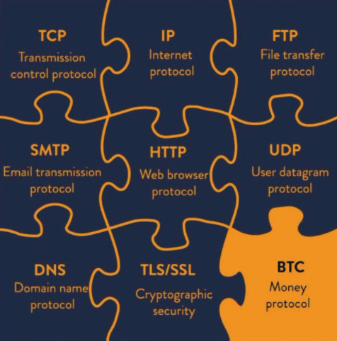

#  Dispelling Bitcoin Fud
(Fear Uncertainty Doubt)

* Below are some common arguments against, or fears
about, bitcoin.
* These are largely unfounded, resulting from ignorance, or perhaps incomplete understanding.
* I provide brief rebuttals to each here, and at the end
you will find pointers to more in-depth resources
rebutting all the FUD.

## BITCOIN USES TOO MUCH ENERGY

>*The heat from your computer is not wasted
if you need to heat your home… It’s
equal cost if you generate the heat
with your computer.*

~ Satoshi Nakamoto 2010-08-09

>*At first, the production of a commodity simply because it
is costly seems quite wasteful. However, the unforgeably
costly commodity repeatedly adds value by enabling
beneficial wealth transfers. More of the cost is recouped
every time a transaction is made possible or made
less expensive. The cost, initially a complete waste, is
amortized over many transactions.*

~ Nick Szabo

Cypherpunk

---

* **‘Too much’ energy is a value proposition that must
consider how we value the purpose of the energy
use.**

* **When one considers that the Christmas lights in the
US use as much electricity as the entire Bitcoin network,** then perhaps one can see that it is all relative!

* Using energy, even a whole lot of energy, to secure
the hardest, most censorship-resistant money
humanity has ever known, is more than worth it.

* In comparing bitcoin energy usage to that used by
the legacy system, we also need to consider the ‘full
stack’ on both sides:

| Bitcoin Ecosystem    | Legacy Fiat System          |
| -------------------- | --------------------------- |
| ASIC Miners          | BIS                         |
| Nodes                | Central Banks               |
| Hardware Wallets     | National/Regional Banks     |
| Software Wallet Apps | Military Industrial Complex |
|                      | Backup Data Centers         |
|                      | Physical Money Printing     |
|                      | Physical Money Distribution |
|                      | Online Banking Apps         |
|                      | Network of ATMs             |

* By using bitcoin, we will ultimately reduce energy
usage in a multitude of other areas, most notably
by no longer needing the Military Industrial
Complex to protect the petro dollar

---

* Also, the rampant consumerism that is required to
keep the debt-based system afloat, will over time
be curtailed, as **hard money naturally incentivizes
prudent spending and saving** (since your savings
will actually hold their value, a concept we have not
experienced since being off the gold standard).
* **Lastly, and importantly, bitcoin mining is already
reducing pollution by capturing flared natural gas
and using it to power the miners.** Since miners seek
low electricity costs, it is also likely to be the biggest
driver toward renewable low cost energy, since the
incentives match up.
* **Informed deep dives on Bitcoin and Energy** have
been written by Daniel Batten on batcoinz.com, Troy
Cross, Jyn Urso, the video ‘This Machine Greens’
by Swan Bitcoin on YouTube, 'Dirty Coin', A
bitcoin mining documentary, and an
excellent episode of the ‘What is Money’ show
(WiM161) with B.Quittem, among many others.

---

## BITCOIN IS A PONZI
* **Bitcoin is not a Ponzi:**
 * Old investors are not paid any money by new
 investors.
 * When buying bitcoin, no one is promising a return
 on your investment.
 * There is no leadership or promotions team.
 * There was no pre-mine.
 * **Read:** ‘Why Bitcoin is Not a Ponzi’ by Lyn Alden
for more.

## BITCOIN IS TOO SLOW
* While the Bitcoin base layer is slow, the 2
nd layer
**Lightning Network built on the base layer is …
lightning fast!**
* Bitcoin’s network can process about 7
transactions per second (TPS).
* The Visa network claims it can process up to 24,000
TPS, although 4,000 TPS is closer to actual usage.
* **The Lightning Network, a second layer solution
built on Bitcoin, has the potential capacity to
process millions of transactions per second!**

---

## GOVERNMENTS COULD BAN BITCOIN
* Some governments have tried, like China, India and
Nigeria for example. In each case, the use of bitcoin
rises rapidly by the people of said country
* **There is no way for governments to truly ‘ban’ bitcoin,** as it is by its nature permissionless and censorship-resistant. It is code and code is speech.
* That said, governments can make it harder to buy
and sell with, and into fiat. They can also tax it as a
commodity, like they do in the US.
* **Ultimately, it will not be in their favor to try and ban
it, since bitcoin is inevitable and they are starting
to see that.** They would be far smarter to add it to
their country’s balance sheet as a hedge against their
inflating fiat currencies.

>*Governments are good at cutting off the
heads of centrally controlled networks
like Napster, but pure P2P networks
like Gnutella and Tor seem to be
holding their own.*

~ Satoshi Nakamoto

* **Read:**

Can Government Stop Bitcoin? by Alex Gladstein,
CSO of the Human Rights Foundation

Can the Government Ban Bitcoin? Four Things You
Need to Know by Nick Giambruno

---

## BITCOIN IS OLD TECH
* **More like ‘ultimate tech’,** with regards to digital
scarcity, decentralization and solving both the double-spending problem and the Byzantine General’s
problem. Once discovered, it cannot be re-discovered.
* **Once the wheel was invented, it could never be
reinvented.**
* The TCP/IP protocol that the internet runs on has
been the standard for all computer networking since
1983. It is likely to continue being the standard for a
long time.
* Once a prefect-solution, base layer technology is discovered that works optimally, it can last for hundreds,
or thousands of years.

Credit: @DecouvreBitcoin

---

## BITCOIN IS USED BY CRIMINALS
* **So is the dollar, and every other fiat currency in the
world.** It is simply incorrect to attribute this
problem only to bitcoin.
* **Bitcoin is a tool, just like a knife, and it is up to each
one of us how we use it.**
* Interestingly, if bitcoin couldn't be used by criminals,
then it would not be the neutral, censorship-resistant
money the world so badly needs.
* **Note:** Since the Bitcoin blockchain is auditable, it is
actually a really bad choice for criminal activity!

## QUANTUM COMPUTING COULD BREAK BITCOIN
* While this may be a possibility one day in the future,
**developers are already working on solutions for postquantum encryption**
* Bitcoin is only one of a multitude of online applications that rely on SHA-256 hashing for security.
Even the military uses it, so there is massive incentive beyond the bitcoin community to develop new
encryption protocols.
* If SHA-256 is broken, we will have a lot else to
worry about beyond bitcoin. The entire internet uses
it for encryption. This includes all banking, supply
chains, transportation systems, healthcare systems,
education systems and more.

---

## BITCOIN HAS NO REAL VALUE
>*“Bitcoin's value is driven by its enforceable scarcity”*

*~ Fidelity Digital Assets*

* **Rarity is the value. All money over all time has been
valued because it had some measure of scarcity.**

* In addition, it was backed by the belief that it would
hold its value, such that it could be traded in the
future for something else of value.
* As the Bitcoin network grows, backed by the superior
monetary properties it embodies, the network effect
grows exponentially
* The larger the network effect, the more value it, as a
scarce asset, offers. Value is a reflection of demand,
and as demand increases, value increases.

---

## SOME PEOPLE HAVE TOO MUCH
* It is true that some people have far more than others.
**In releasing the protocol openly, Satoshi allowed it to
roam freely, and those that understood the potential
it held either mined, or bought in early. It was the
fairest and most organic way possible to present it
to the world.**
* Over time, when the world is hyperbitcoinized, meaning we are living on a bitcoin standard, those that
have more will naturally spend it into the economy

* Even though at a certain point one will no longer be
able to buy it with fiat, people will get paid for their
work in bitcoin. Being paid in truly sound money will
allow us to have real savings that will not be debased
over time by inflation
* While there will always be those with more wealth
and those with less, due to a vast number of factors,
**a bitcoin standard will make the membrane between
wealth classes permeable**, as Aleks Svetsi says. This
will allow both upward and downward mobility to be
far, far more fluid than it is today
* **Having been born into, and swimming our whole lives
in a fiat world, it is almost impossible to imagine, and
fully grok the implications of having a money that
cannot be debased or manipulated!**

---
## BITCOIN IS TOO VOLATILE
* **This is normal during the price discovery phase of
a new monetary asset.** There is no other way for
growth to happen when it is organic and emergent
(as opposed to top down and centrally controlled.
* In addition, at this stage of human existence, with
exponential shifts happening in all spheres, it makes
sense that something as rEVOLutionary as bitcoin will
have wild swings.
* While those of us deep down the rabbit hole see it
as the future, currently only a small percent of the
global population holds bitcoin at this time. This
makes it vulnerable to immense volatility.
* As it matures, and adoption increases, the volatility will decrease, and eventually it will stabilize and
become a unit of account.

>*I’m sure that in 20 years there will
either be very large transaction
volume or no volume.*

~ Satoshi Nakamoto 2010-02-14

---

## YOU CAN’T TOUCH A BITCOIN

* **This is a feature, not a bug.** The very fact that bitcoin
is not physical is one of the biggest factors contributing to it’s unconfiscatability!

## BITCOIN COULD GET HACKED

* In the 15 years since it was launched, it has never
been hacked.
* There have been hacks at exchanges however, so I
highly recommend moving your bitcoin to your own
self-custody wallet as soon as possible.
* It has been estimated that to break the SHA-256
encryption (that bitcoin uses) within 24 hours, a
quantum computer would need 13,000,000 physical
qubits. At this time, the current qubit record held
by Atom Computing in California is 1,180 qubits.
* It is widely assumed that a quantum-safe encryption
method will be developed well before it is needed.

>*Being open source means anyone can
independently review the code. If it was
closed source, nobody could verify the
security. I think it’s essential for a
program of this nature to be open source.*

*~Satoshi Nakamoto 2009-12-10*

---

## MORE ON DEBUNKING FUD HERE:

* Endthefud.org
* Bitcoinmythbusters.org
* Casebitcoin.com - Common Critiques
* Safehodl.github.io/failure/
* Lopp.net - Bitcoin Info: Misconceptions

>*Bitcoin is fundamentally different from any other digital
asset. No other digital asset is likely to improve upon
bitcoin as a monetary good because bitcoin is the most
(relative to other digital assets) secure, decentralized,
sound digital money and any “improvement”
will necessarily face tradeoffs.*

~ Fidelity Digital Assets Report, ‘Bitcoin First’, Jan 2022
Chris Kuiper, CFA, Director of Research
Jack Neureuter, Research Analyst

---

## ON THE PRICE OF BITCOIN
* **I see hodling (holding) bitcoin like having a long-term
savings account.**
* The daily price doesn’t matter, as it is expected to be
volatile (go up and down) for some years yet.
* As I mentioned previously, this is normal for a new
asset undergoing price discovery
* If one zooms out on the BTC/USD price chart, you
will see that it has increased by +31,296% since 2009,
averaged out to ~200% per year.
* The price swings reflect various news articles, regulatory updates, market demand, fear and excitement.
It’s a roller-coaster!
* **The longer you hodl, the more you learn and understand the fundamentals, and the more you realize
the profound implications of having sound money,
the less the price matters.**

>**In the end, ‘price’ won’t matter at all, as bitcoin
will be the unit of account.**

* **Disclaimer:**
* Only put in what you ‘can afford to lose’, since
there are, of course, no guarantees.
* Consider the bitcoin you buy as a long-term
savings account, and plan to leave it in cold
storage for a minimum of five years before
spending.

---

Original bitcointalkforum.org source for one of the
most classic bitcoin memes of all time.

---

## IN THE MEANTIME, ON TAXES
* **Disclaimer:** This is not financial or tax advice

* In the US tax code, bitcoin is currently seen as a commodity, so there are potential tax implications if you
sell it back into fiat, or even if you buy something with
your bitcoin
* If the price went down before you sold/spent it, you
can claim a loss
* If the price went up, you are supposed to claim a
capital gain, and pay between 10-30% CGT (Capital
Gains Tax)
* The amount depends upon several factors, such as
how long you held it before selling or spending, and
in which tax bracket you land.
* If you plan to sell or spend bitcoin, especially larger
amounts, you may want to consider consulting with
a tax professional.
* If you simply buy and hold, you currently do not have
any taxable events regarding bitcoin.
* And if you buy non-KYC…

---

