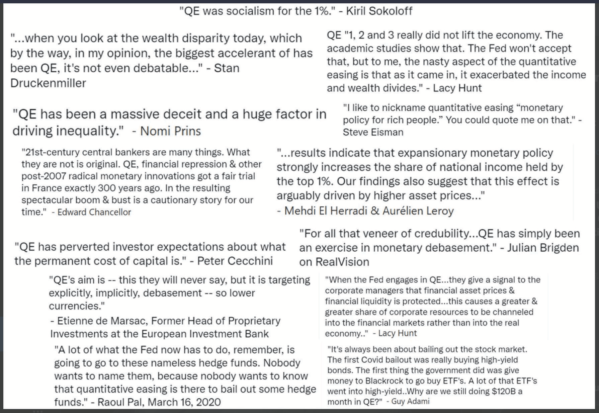

# چرا به بیت‌کوین نیاز داریم

## نياز داريم، چون پول خراب است

> *`مشکل ریشه‌ای ارزهای مرسوم، تمام اعتمادی است که برای کارکردن آن لازم است. بانک مرکزی باید مورد اعتماد باشد که ارزش پول را پایین نیاورد، اما تاریخ ارزهای فیات پر از نقض این اعتماد است. بانک‌ها باید مورد اعتماد باشند که پول ما را نگه دارند و آن را به‌صورت الکترونیکی منتقل کنند، اما آن‌ها با موج‌های حباب‌های اعتباری وام می‌دهند و به‌سختی کسری از آن را در ذخیره نگه می‌دارند. ما باید به آن‌ها در مورد حریم خصوصی خود اعتماد کنیم، اعتماد کنیم که اجازه ندهند سارقان هویت حساب‌های ما را خالی کنند.`*

~ ساتوشی ناکاموتو 2009-02-11

* سیستم پول فیات خراب است (همیشه بوده است).
* پایدار نیست (هرگز نبوده است).
* هیچ راهی برای رفع آن وجود ندارد (هرگز نخواهد بود).

---
## استاندارد (نه‌چندان) طلا
* بسیاری از مردم هنوز بر این باورند که پول توسط طلا پشتیبانی می‌شود.
* این‌طور نیست.
* از سال 1971، زمانی که رئیس‌جمهور نیکسون به‌طور یک‌جانبه جهان را از استاندارد طلا خارج کرد (شوک نیکسون)، توسط طلا پشتیبانی نشده است.
* برای به‌دست آوردن تصویری واضح از آسیبی که این کار وارد کرد، به **wtfhappenedin1971.com** مراجعه کنید.

نمودار نشان‌دهنده تورم شاخص قیمت مصرف‌کننده (خط قرمز) در مقابل قدرت خرید دلار آمریکا (خط سیاه) از سال 1971.

<small>اداره آمار کار ایالات متحده، بازیابی‌شده از FRED، بانک فدرال رزرو سنت لوئیس؛ https://
fred.stlouisfed.org/series/CPIAUCSL، 9 ژوئن 2024.</small>

* نکته جالب: مجمع جهانی اقتصاد در سال 1971 تشکیل شد.
---

>**FIAT:** (اسم) /ˈfiː.æt/
>
>: یک دستور معتبر یا خودسرانه: حکم
>
>: یک تعیین معتبر: دستور
>
>**: یک فرمان یا عمل اراده که چیزی را بدون یا طوری ایجاد می‌کند که انگار بدون تلاش بیشتر**

~ merriam-webster.com/dictionary

>**FIAT :** از لاتین fieri «ساخته شدن، به وجود آمدن»

* فیات پولی است که فقط به این دلیل ارزش دارد که دولت می‌گوید (حکم می‌کند) که این‌طور است.
* بنابراین مردم (باید) باور داشته باشند که این‌طور است.
>* **حتی اگر آن‌ها باور ندارند که فیات ارزش دارد، طبق قانون مجبورند از آن استفاده کنند و آن را به‌عنوان پرداخت برای کالاها و خدمات بپذیرند.**
* **پول فیات از هیچ چاپ/ایجاد می‌شود.**
* این روزها حدود 5 درصد از کل دلارها به صورت اسکناس چاپ می‌شوند.
* 95 درصد دیگر به‌صورت دیجیتالی توسط بانک‌ها با واردکردن اعداد در رایانه هنگام صدور وام ایجاد می‌شود.

>*تنها چند سنت برای اداره چاپ و حکاکی هزینه دارد تا یک اسکناس 100 دلاری تولید کند…*

~ اقتصاددان آمریکایی، بری آیکن‌گرین

---

>***اسکات پلی از NBC '60 Minutes':*** *منصفانه است بگوییم شما به‌سادگی سیستم را با پول پر کردید؟*
>
>***جروم پاول، رئیس فدرال رزرو:*** *بله. ما این کار را کردیم.
>این یک روش دیگر برای فکرکردن به آن است. ما این کار را کردیم.*
>
>***پلی:*** *از کجا می‌آید؟
>آیا شما فقط آن را چاپ می‌کنید؟*
>
>***پاول:*** *ما آن را به‌صورت دیجیتالی چاپ می‌کنیم. بنابراین به‌عنوان یک بانک مرکزی، ما
>توانایی ایجاد پول به‌صورت دیجیتالی را داریم. و ما این کار را
>با خرید اوراق خزانه یا اوراق قرضه برای سایر اوراق بهادار تضمین‌شده دولتی انجام می‌دهیم. و این در واقع باعث افزایش عرضه پول می‌شود. ما همچنین ارز واقعی را چاپ می‌کنیم و آن را از طریق بانک‌های فدرال رزرو توزیع می‌کنیم.*

~ مصاحبه CNBC '60 Minutes'، 17 می 2020
دو ماه پس از شروع قرنطینه C*vid-19

>هیچ محدودیتی برای کاری که می‌توانیم انجام دهیم وجود ندارد
با این برنامه‌های وام‌دهی که داریم.

~ جروم پاول، رئیس فدرال رزرو
18 مارس 2020 در CBS News

>بله، مقدار نامحدودی پول نقد در فدرال رزرو وجود دارد. ما هر کاری که لازم باشد انجام خواهیم داد تا مطمئن شویم که پول نقد کافی در سیستم بانکی وجود دارد.

~ نیل کاشکاری، رئیس فدرال رزرو مینیاپولیس
23 مارس 2020، CBS '60 Minutes'

>'ما' در اینجا پنج نفر هستند که در مورد تغییرات رأی می‌دهند
سیاست پولی در سیستم فدرال رزرو
در طول جلسات FOMC. 5 از 330,000,000.
این تمام چیزی است که برای تغییر سیاست پولی ایالات متحده لازم است.

~ مارتین بنت، بنیان‌گذار TFTC.io @
مقاله فوربس، 18 مارس 2020

---

## از زبان خود اسب پیر

>*بانک از بهره تمام پول‌هایی که ایجاد می‌کند، سود می‌برد
از هیچ.*

*~ ویلیام پترسون، 1694
بنیان‌گذار بانک انگلستان*

>*تمام سردرگمی‌ها، آشفتگی‌ها و پریشانی‌ها در آمریکا ناشی می‌شود،
نه از نقص قانون اساسی یا کنفدراسیون،
نه از نبود شرافت یا فضیلت،
به همان اندازه ناشی از جهل محض نسبت به
ماهیت سکه، اعتبار و گردش پول.*

*~ جان آدامز
دومین رئیس‌جمهور ایالات متحده، 1797-1801*

>*من معتقدم که مؤسسات بانکی بیشتر از ارتش‌های دائمی برای آزادی‌های ما خطرناک هستند.
آن‌ها در حال حاضر یک اشرافیت پولی ایجاد کرده‌اند
که دولت را به چالش کشیده است.
قدرت صدور باید از بانک‌ها گرفته شود و
به مردمی که به‌درستی به آن تعلق دارد، بازگردانده شود.*

*~ توماس جفرسون
سومین رئیس‌جمهور ایالات متحده، 1801-1809*

>*در حالی که به اعمال نجیبانه خود می‌بالیدیم، مراقب بودیم که واقعیت زشت را پنهان کنیم
اینکه با یک سیستم پولی ناعادلانه، یک
سیستم ظلم را ملی کرده‌ایم که، هرچند تصفیه شده‌تر،
کمتر از سیستم قدیمی برده‌داری منقول ظالمانه نیست.*

~ هوراس گریلی
نماینده کنگره ایالات متحده 1848-49
بنیان‌گذار نیویورک تریبون

---

>*هر کس حجم پول را در هر کشوری کنترل کند،
استاد مطلق تمام صنعت و تجارت است…
وقتی متوجه شدید که کل سیستم به‌راحتی کنترل می‌شود،
به‌نوعی یا به شکل دیگر، توسط چند مرد قدرتمند در بالا، به شما نیازی نخواهد بود
به شما گفته شود که دوره‌های تورم و رکود از کجا ناشی می‌شوند*

~ جیمز ای. گارفیلد
بیستمین رئیس‌جمهور ایالات متحده، مارس-سپتامبر 1881
ترور شده در سال 1881

>*امروزه در دست گروهی از مردان یک قدرت کنترل‌نشده وجود دارد
تا از هیچ دلاری بسازند.*

~ توماس دبلیو. لاوسون، نویسنده کتاب «مالی دیوانه‌وار»، 1905

>*من به اندازه هر توطئه‌گری پنهان‌کار - در واقع، پنهانی - بودم.
ما می‌دانستیم که کشف به‌هیچ‌وجه نباید اتفاق بیفتد، در غیر این صورت تمام زمان و تلاش ما هدر خواهد رفت. اگر فاش می‌شد که گروه خاص ما گرد هم آمده و یک لایحه بانکی نوشته است، آن لایحه هیچ شانسی برای تصویب توسط کنگره نخواهد داشت.*

~ فرانک ای. وندریپ
رئیس بانک ملی شهر نیویورک
(پیشگام سیتی بانک)
~ نوشتن در سال 1935 از جلسه مخفیانه‌ای که در
جزیره جکیل در سال 1910، برای تهیه پیش‌نویس لایحه‌ای که در سال 1913 به‌عنوان
قانون فدرال رزرو تصویب شد.

>*این قانون (فدرال رزرو) بزرگ‌ترین تراست روی زمین را تأسیس می‌کند. هنگامی که رئیس‌جمهور (وودرو ویلسون) این لایحه را امضا کند،
دولت نامرئی قدرت پولی قانونی خواهد شد…
بدترین جنایت قانونی اعصار توسط این لایحه بانکی و ارزی انجام می‌شود.*

~ چارلز ای. لیندبرگ، پدر
نماینده کنگره ایالات متحده 1907-1917

---

>*من بدبخت‌ترین مرد هستم. من ناآگاهانه کشورم را نابود کرده‌ام.
یک ملت صنعتی بزرگ توسط سیستم اعتباری خود کنترل می‌شود.
سیستم اعتباری ما متمرکز است. رشد ملت،
بنابراین، و تمام فعالیت‌های ما در دست چند مرد است.
ما تبدیل به یکی از بدترین حکومت‌ها، یکی از
کامل‌ترین دولت‌های کنترل‌شده و تحت سلطه در جهان متمدن شده‌ایم.
دیگر نه یک دولت با نظر آزاد، نه یک دولت با
اعتقاد و رأی اکثریت، بلکه یک
دولت با نظر و اجبار
یک گروه کوچک از مردان غالب.*

~ وودرو ویلسون
بیست و هشتمین رئیس‌جمهور ایالات متحده، 1913-1921
6 سال پس از تصویب قانون فدرال رزرو در سال 1913.

>*حقیقت واقعی این است که، همان‌طور که شما و من می‌دانیم،
یک عنصر مالی در مراکز بزرگ
از زمان
اندرو جکسون صاحب دولت ایالات متحده بوده‌اند.*

~ فرانکلین دی. روزولت
سی و دومین رئیس‌جمهور ایالات متحده در نامه‌ای که
در 21 نوامبر 1933 به سرهنگ ای. مندل هاوس نوشته شده است

>*این [رکود] تصادفی نبود.
این یک اتفاق با دقت طراحی‌شده بود….
بانکداران بین‌المللی به دنبال ایجاد
وضعیت ناامیدی در اینجا بودند تا بتوانند
به‌عنوان حاکمان همه ما ظاهر شوند.*

~ نماینده کنگره لوئیس تی. مک‌فادن،
ترور شده در سال 1936

>رئیس کمیته بانکداری و ارزی مجلس نمایندگان
*هر بار که یک بانک وام می‌دهد،
اعتبار بانکی جدید ایجاد می‌شود - سپرده‌های جدید - پول کاملاً جدید.*

~ گراهام اف. تاورز
رئیس بانک مرکزی کانادا، 1934-55

---

>*اگر هیچ بدهی در سیستم پولی ما وجود نداشت،
هیچ پولی وجود نداشت*

*~ مارینر اکلس،
1941، رئیس فدرال رزرو*

>*من هنوز کسی را ندیده‌ام که بتواند از طریق
استفاده از منطق و استدلال، دولت فدرال را توجیه کند
برای قرض‌گرفتن استفاده از پول خودش…
من معتقدم زمانی فرا خواهد رسید که مردم
تقاضا خواهند کرد که این تغییر کند.
من معتقدم زمانی در این کشور فرا خواهد رسید که
آن‌ها در واقع شما و من و
هر کس دیگری را که به کنگره مرتبط است، سرزنش خواهند کرد
به خاطر نشستن بیکار و اجازه دادن به
چنین سیستم احمقانه‌ای برای ادامه.*

~ رایت پاتمن
نماینده کنگره ایالات متحده 1928-1976
رئیس کمیته بانکداری و ارزی 1963-1975

>*وقتی من یا شما چک می‌نویسیم، باید وجوه کافی در حساب ما وجود داشته باشد
برای پوشش چک، اما وقتی فدرال رزرو چکی می‌نویسد،
هیچ سپرده بانکی وجود ندارد که چک از آن برداشت شود. وقتی
فدرال رزرو چکی می‌نویسد، در حال ایجاد پول است*

~ بانک فدرال رزرو بوستون
'به زبان ساده بیان کنیم'، 1984

---

## فدرال رزرو

* فدرال رزرو بانک مرکزی «مستقل» ایالات متحده است.
در سال 1913 با تصویب قانون
فدرال رزرو ایجاد شد.
* ساختاری منحصربه‌فرد دارد، بخشی خصوصی و بخشی دولتی.
* قرار است یک نهاد غیرحزبی و مستقل از نظر سیاسی
در داخل دولت باشد.
* در حالی که هیئت مدیره فدرال رزرو توسط
رئیس‌جمهور منصوب و توسط کنگره تأیید می‌شود،
تصمیمات فدرال رزرو نیازی به تصویب
توسط هیچ‌کس ندارد.**

**این شامل:**

* هیئت مدیره فدرال رزرو
* 12 بانک فدرال رزرو
* کمیته بازار آزاد فدرال (FOMC)،
که نهاد سیاست‌گذاری پولی است.

**فدرال رزرو مسئول موارد زیر است:**

* نظارت بر سیاست پولی ایالات متحده، ترویج اشتغال و قیمت‌های باثبات.
* تنظیم و نظارت بر مؤسسات بانکی و مالی.
* ارائه خدمات پرداخت به مؤسسات مالی.
* ترویج حمایت از مصرف‌کننده و توسعه جامعه.

---

## نکته‌ای در مورد رئیس فدرال رزرو

* **رئیس فدرال رزرو نیز:**

* رئیس کمیته بازار آزاد فدرال (FOMC) است، که در مورد جهت‌گیری سیاست پولی ایالات متحده تصمیم می‌گیرد (به‌عنوان‌مثال: تسهیل مقداری، افزایش نرخ بهره)
* عضو صندوق بین‌المللی پول، IMF
* عضو بانک تسویه‌های بین‌المللی، BIS (بانک بانک‌های مرکزی).
* وزیر دارایی ایالات متحده در G-7
* وزیر دارایی ایالات متحده در G-20

* قدرت **بسیار** زیادی برای یک نفر.

---

## بانکداری ذخیره کسری، بهره و وام

* **بانکداری ذخیره کسری:** تا مارس 2020، بانک‌ها
موظف بودند 10 درصد ذخیره نگه دارند و می‌توانستند
90 درصد را وام دهند.
* **از مارس 2020، هیچ الزامی برای ذخیره وجود ندارد و به بانک‌ها اجازه می‌دهد تا وام‌های نامحدود صادر کنند.**

* وام پول مبتنی بر بدهی است و شما ملزم به پرداخت
بهره روی وام هستید.

>* **نکته جالب 1:** پولی که برای پرداخت بهره وام پرداخت می‌شود، توسط بانک‌ها ایجاد نمی‌شود.
>* **نکته جالب 2:** هرگز ایجاد نمی‌شود.
>* **نکته جالب 3:** پول کافی در
>دنیا برای پرداخت تمام وام‌ها + بهره
>مربوط به آن وام‌ها وجود ندارد.
>* **نکته جالب 4:** هرگز وجود نخواهد داشت!

---

## نکته‌ای در مورد پترو دلار
* می‌توان گفت **که تا سال 1971 دلار توسط طلا پشتیبانی می‌شد و از سال 1974 توسط نفت و در نتیجه به‌طور پیش‌فرض توسط ارتش ایالات متحده پشتیبانی شده است.**
* **در سال 1974 ایالات متحده و عربستان سعودی توافق‌نامه‌های دوجانبه‌ای را برای قیمت‌گذاری فروش نفت به دلار آمریکا منعقد کردند.**
* از آن زمان، بیشتر فروش‌های جهانی نفت به دلار آمریکا تسویه شده است.
* این امر کمک زیادی به تبدیل‌شدن دلار به
قوی‌ترین ارز در جهان کرده است.
* **بنابراین به‌طور مصنوعی تقویت شده است،** حتی در
زمان‌هایی که به‌طور معمول با مشکل مواجه می‌شد.
* از اواخر سال 2022، تعدادی از کشورها شروع
به تجارت با ارزهایی غیر از دلار آمریکا کرده‌اند
* بسیار محتمل است که این می‌تواند شروع
پایان پترو دلار باشد. اتفاقی که در ادامه می‌افتد،
باید دید…

---

## در مورد QE (تسهیل مقداری)
* **تسهیل مقداری یک «سیاست پولی غیرمتعارف» در نظر گرفته می‌شود
که توسط بانک‌های مرکزی برای «تحریک
اقتصاد» استفاده می‌شود، که طی آن فدرال رزرو اوراق قرضه دولتی و سایر اوراق بهادار دولتی را می‌خرد.**
* اولین بار توسط ژاپن بین سال‌های 2001-2006 استفاده شد.
پس از آن، ایالات متحده، بریتانیا و منطقه یورو
از QE در طول بحران مالی 2008 استفاده کردند.
* از آن زمان، تنها زمانی که ایالات متحده برنامه QE
نداشته است، بین سال‌های 2014-2019 بوده است.
* همان‌طور که در زیر مشاهده می‌شود، منتقدان معتقدند که **QE
به‌طور چشمگیری به نفع ثروتمندان است.**

*اعتبار: RudyHavenstein@ در توییتر*

---

## چرخه‌ها

* **در تمام طبیعت، چرخه‌ها، فراز و نشیب‌های طبیعی،
انبساط و انقباض وجود دارد.**

* این **به تعادل و پایداری
کلی و در طول زمان سیستم به‌هم‌پیوسته، کل زندگی روی زمین کمک می‌کند.**
* **سیستم ارزی فیات مبتنی بر بدهی از
خرد چرخه‌های طبیعی چشم‌پوشی می‌کند و در عوض مبتنی بر
و 100٪ متکی به بقای خود بر،
رشد بی‌نظیر و بی‌وقفه است تا بتواند به خدمت
بدهی‌های خود ادامه دهد.
* در طبیعت، این سرطان است.
* در «اقتصاد»، این مسیر غیرطبیعی بیشتر
توسط دولت با کمک مالی به بانک‌های ورشکسته و شرکت‌های بزرگ پشتیبانی می‌شود، تا اینکه اجازه دهد آن‌ها
ورشکست شوند و به چیزی جدید و سالم‌تر بازیافت شوند.
* **کوتاه‌بینی کمک مالی به شرکت‌های ورشکسته کل اقتصاد را در معرض خطر قرار می‌دهد.** در اصل،
این فقط انداختن مشکل به آینده است و آشفتگی اجتناب‌ناپذیری که در پیش است، احتمالاً بسیار، بسیار
شدیدتر از زمانی است که اجازه داده شود چرخه‌های طبیعی اجرا شوند.
* **ما مدیون ساتوشی ناکاموتو و
سایفرپانک‌های قبل و بعد از او هستیم،** به خاطر داشتن
چشم‌انداز، دوراندیشی، عزم و مهارت برای ارائه
یک قایق نجات برای حمل ما به سواحل جدید.

---

* هنگامی که ما هدیه‌ای را که این است درک کردیم، این به ما بستگی دارد که
با تمام قلب و ذهن شفاف، سوار شویم تا
سفر کنیم و دنیای جدیدی را با پول صلح بسازیم.
>* **بیت‌کوین پول را اصلاح می‌کند، این به ما بستگی دارد که بقیه را اصلاح کنیم.
و برای اینکه واضح باشد، با ثابت‌شدن پول، چیزهای بسیار دیگری به‌طور پیش‌فرض اصلاح می‌شوند**

* نکته اصلی این است که جنگ جنبشی در مقیاس بزرگ که توسط دولت آغاز شده، بدون حمایت مردم، دیگر سودآور یا ممکن نخواهد بود.
* علاوه بر این، به‌طور طبیعی مصرف کمتری وجود خواهد داشت،
همراه با تغییر به سمت کالاها و خدمات با ارزش واقعی، بازارهای آزاد، پس‌انداز واقعی و کاهش پولی
مسکن و املاک و مستغلاتی که هرگز قرار نبود در وهله اول پولی شوند.
* **مشاهده کنید:** بیت‌کوین این را اصلاح می‌کند، صفحه 32
---

## نياز داريم، چون تورم دزدی است

نمودار FRED 2024 که نشان‌دهنده کاهش قدرت خرید
دلار از زمان تشکیل فدرال رزرو در
سال 1913 است. نرخ تجمعی تورم از سال 1913 در حدود
3.067% است. تمام ارزهای فیات بانک مرکزی در سراسر جهان
از نرخ مشابهی از کاهش پیروی می‌کنند.

* **هرچه پول بیشتری از هیچ ایجاد شود،
ارزش/قدرت خرید همه پول‌ها بیشتر کاهش می‌یابد.**
* به این **تورم** می‌گویند.
* تورم به‌معنای واقعی کلمه **دزدی زمان** است. ارزش
زمان شما زمانی دزدیده می‌شود که آن را در ارزی ذخیره می‌کنید که
متورم، بی‌ارزش و دست‌کاری می‌شود.
* تورم همچنین یک **مالیات پنهان** است.

---

* این دزدی زمان و مالیات بر تمام ارزهای فیات کشورهای دیگر نیز تأثیر گذاشته است، زیرا همه آن‌ها
به دلار آمریکا متصل شده‌اند، زیرا از زمان توافق‌نامه برتون وودز در سال 1944
ارز ذخیره جهانی بوده است.
* **در ایالات متحده آمریکا، نرخ تورم سالانه 2% در
دستور فدرال رزرو نوشته شده است.**
* این بدان معناست که **شما تضمین شده‌اید که بتوانید
با همان اسکناس 20 دلاری هر سال 2% کمتر خرید کنید.**
* **در مارس 2024، نرخ تورم سالانه 3.5% بود،**
(خیلی بیشتر از 2%، به این معنی که شما 3.5% از
قدرت خرید خود را بین مارس 2023 و
مارس 2024 از دست دادید.
* به‌عبارت‌دیگر، این بدان معناست که به‌طور متوسط، قیمت‌ها
3.5% افزایش یافت.
* **اگر تورم به‌درستی اندازه‌گیری می‌شد، همان‌طور که
تا اوایل دهه 1980 انجام می‌شد، در واقع به
10% در سال 2024 نزدیک‌تر بود.**
* هنگام بررسی بر اساس دسته‌بندی، مشاهده می‌شود که
تورم در بسیاری از دسته‌بندی‌ها در سال گذشته
بسیار بدتر از 3.5% است.
* وقتی کسی به اجاره، قبض مواد غذایی، قیمت گاز،
تقریباً هر چیزی که می‌خرد نگاه می‌کند، کاملاً مشخص است که
تورم در هر بخش بیداد می‌کند.

---
**میانگین تورم در طول
50 سال گذشته در ایالات متحده:**

| هزینه متوسط | 1971 | 2021 | % افزایش |
| --- | --- | --- | --- |
| حقوق | 9,400 دلار | 59,400 دلار | 532% |
| خانه | 23,400 دلار | 513,000 دلار | 2,092% |
| گالن بنزین | 0.36 دلار | 4.17 دلار | 1,058% |
| ماشین نو | 3,400 دلار | 47,000 دلار | 1,282% |
| مدرک دانشگاهی | 1,400 دلار | 26,000 دلار | 1,757% |
| سبد خرید مواد غذایی | 20 دلار | 210 دلار | 950% |
| برق/کیلووات ساعت | 0.02 دلار | 0.15 دلار | 650% |

>**داستان واقعی:**
~ خانه‌ای در سال 1976 به قیمت 58,000 دلار خریداری شد.
~ هنگام محاسبه تورم "رسمی"، این مبلغ
279,000 دلار در سال 2022 خواهد بود.
~ در سال 2022 ارزش همان خانه 2.09 میلیون دلار بود.
~ در این مورد فکر کنید…

>*ارز فیات اطلاعات نادرست است.
یک اسکناس 10 دلاری چه اطلاعاتی را منتقل می‌کند؟
10 صورت یک کسر با
مخرج از دست رفته است.
10 از چند؟
10 بدون مخرج شناخته شده
و پایدار هیچ چیزی نمی‌گوید.*

~ bitlany@

---

* **همان‌طور که تورم افزایش می‌یابد، پس‌اندازهای شما (اگر خوش‌شانس
باشید که پس‌انداز داشته باشید)، ارزش خود را از دست می‌دهند.**
* با گذشت زمان، آن‌ها **بسیار** ارزش خود را از دست می‌دهند
>*اگر امروز شروع به پس‌انداز 100 دلار در ماه کنید، با
بهترین نرخ بهره موجود 0.05%:
> * در 30 سال شما **84,019 دلار** پس‌انداز کرده‌اید.
>* با تعدیل برای تورم 2٪ تعیین شده توسط فدرال رزرو
>* در 30 سال پس‌انداز شما قدرت خرید مؤثر فقط **46,384 دلار** را خواهد داشت.
>* تعدیل برای تورم امروزی 3.5%:
>* پس‌انداز 84,019 دلاری شما قدرت خرید فقط **11,037 دلار** را در 30 سال خواهد داشت!

* **در واقع این بدان معناست که تقریباً شش از
هفت ساعت کار شما دزدیده شده است = *دزدی زمان.***

---
**روش دیگری برای نگاه‌کردن به آن به شرح زیر است:**
* در **1971**، هزینه یک خانه = **2.5** برابر متوسط
حقوق سالانه.
* در **2024**، هزینه یک خانه = **8.6** برابر یک
حقوق سالانه متوسط.
* در **1971**، یک ماشین جدید حدود **1/3** از یک حقوق متوسط هزینه داشت
* در **2024**، یک ماشین جدید بیش از **3/4** از یک حقوق متوسط هزینه دارد.

من اطمینان دارم که اکنون مشخص شده است که
تورم
به نفع شما
* **کار نمی‌کند** *.

**توجه:** تمام این اعداد میانگین هستند و بر اساس
عوامل بسیاری متغیر هستند. نکته اصلی این است که تورم یک مالیات پنهان است
و دزدی زمان از کار و تولید واقعی ما است

>* **پول سخت این را اصلاح می‌کند.**
>* **بیت‌کوین پول سخت است**
---

## ما نیاز داریم تا اقتصاد متمرکز کنترل‌شده، دست‌کاری‌شده و مبتنی بر بدهی را جایگزین کنیم

>*من معتقدم که هرگز پول خوبی نخواهیم داشت،
قبل از اینکه این چیز را از دست دولت خارج کنیم،
یعنی نمی‌توانیم آن‌ها را به‌زور از دست
دولت خارج کنیم، تنها کاری که می‌توانیم انجام دهیم این است که با یک روش دزدکی و دور زدن چیزی را معرفی کنیم که نتوانند متوقف کنند.*

~ فردریش هایک، 1984
اقتصاددان، فیلسوف و نویسنده اتریشی، 1899-1992

نمودار نشان‌دهنده افزایش نمایی عرضه پول M1 از
4 تریلیون دلار در مارس 2020 به بیش از 18 تریلیون دلار در ژوئن 2024.

* **مغزتان را منفجر کنید:** https://usdebtclock.org/
---
* **45 درصد از تمام دلارهای ایالات متحده موجود بین آوریل 2020 و ژانویه 2022 چاپ شده‌اند!**
* به یاد دارید که از هیچ چاپ شده است؟
* پول فیات به‌طور متمرکز توسط دولت کنترل می‌شود و
عرضه آن به‌راحتی دست‌کاری می‌شود.
* **205 سال طول کشید تا بدهی ملی ایالات متحده به
1 تریلیون دلار برسد. (1776 > 1981)**
* فقط **33 سال دیگر طول کشید تا بدهی ملی ایالات متحده
به 34 تریلیون دلار برسد!** (1981 > 2024)

نمودار FRED که نشان‌دهنده کل بدهی عمومی 1970-2024 در ایالات متحده است.

>*بدهی جهانی، که توسط مؤسسه
امور مالی بین‌المللی اندازه‌گیری می‌شود، اکنون در مجموع 303 تریلیون دلار است.
این سیاره ما در فیات مبتنی بر بدهی است.
به هر حال، تولید ناخالص داخلی جهانی فقط 84 تریلیون دلار است.*

*~ نیک بهاتیا، نویسنده کتاب «پول لایه‌بندی‌شده»، 2021*

---

* **برای اطلاع شما**

| **اگر دارید:** | **می‌توانید 1 دلار در ثانیه خرج کنید** | |
| ------------ | ----------------------- | -------------- |
| **1 میلیون دلار** | یا 11 روز | = 11 روز |
| **1 میلیارد دلار** | به مدت 11,680 روز | = 32 سال |
| **1 تریلیون دلار** | به مدت 11,680,000 روز | = 32000 سال |

* ما همه در معرض رحمت کسانی هستیم که قدرت
تصمیم‌گیری برای چه زمانی چاپ بیشتر و چه نرخ‌های بهره‌ای
را دارند.
* **اگر فدرال رزرو نرخ‌های بهره را افزایش دهد، گرفتن
وام برای خانه یا ماشین ناگهان گران‌تر می‌شود، که باعث کاهش سرعت
هزینه‌کردن می‌شود و منجر به رکود تورمی می‌شود**

* **اگر آن‌ها نرخ‌ها را به‌طور مصنوعی پایین نگه دارند، وارد یک دوره افسردگی می‌شویم**

>* **اجازه دادن به بانک مرکزی برای ایجاد
«آب‌وهوای» مالی آزادی ما را برای اینکه اجازه دهیم بازار تصمیم بگیرد چه چیزی ارزش دارد و چه چیزی ارزش ندارد، می‌گیرد.**

* علاوه بر این، **هنگامی که آن‌ها به بانک‌ها و شرکت‌ها کمک مالی می‌کنند، به‌طور مصنوعی اقتصاد را تقویت می‌کنند.** فقط
مسئله زمان است که خانه پوشالی فرو می‌ریزد.
* استدلال اصلی برای داشتن یک بانک مرکزی این بود
که وقتی اقتصاد دچار تزلزل می‌شود، باید یک وام‌دهنده آخرین‌راه وجود داشته باشد.

---
* **این به این تبدیل شده است که بانک مرکزی یک حاکم
اولین‌راه است، با قدرت بی‌نظیر، منتخب‌نشده و در نهایت
اقتدارگرا.**

> *همه پول‌ها سیاسی هستند، به‌جز بیت‌کوین.
ارزهای فیات، ابزارهای بانکی، اعتبارات فین‌تک،
سایر ارزهای رمزنگاری‌شده و حتی طلا همه توسط
دولت‌ها، شرکت‌ها یا گروه‌های کوچک کنترل می‌شوند.
داشتن یک استثنا بسیار مفید خواهد بود
وقتی به آینده می‌رویم.*

*~ الکس گلدشتاین @gladstein
مدیر ارشد استراتژی بنیاد حقوق بشر*

>*بیت‌کوین 8 میلیارد نفر را به هم متصل می‌کند، صد میلیون شرکت را به هم متصل می‌کند، جهان را در حوزه‌های قضایی سیاسی هماهنگ می‌کند و عقلانیت را به کل سیستم مالی بازمی‌گرداند و آزادی و حقوق مالکیت را به کل نژاد بشر بازمی‌گرداند*

*~ مایکل سیلور
مدیرعامل Microstrategy*

---

## ما نیاز داریم تا به افراد بدون حساب بانکی خدمات ارائه دهیم

>*برای 953 میلیون نفر در 20 کشور با ارزهای ضعیف‌شده، بیت‌کوین چیزی بزرگ‌تر از
یک دارایی خزانه‌داری است. برای آن‌ها، بیشتر شبیه یک کشتی
انرژی رمزگذاری‌شده برای فرار از سیل است.*

*~ مایکل سیلور
مدیرعامل Microstrategy*

* **از سال 2024، تقریباً 25 درصد از بزرگسالان در
جهان بدون حساب بانکی هستند، حدود 1.4 میلیارد نفر!**

>* **این بدان معناست که آن‌ها به خدمات بانکی
>دسترسی ندارند و نمی‌توانند از دستگاه‌های خودپرداز، کارت‌های نقدی، کارت‌های اعتباری یا
>چک‌ها استفاده کنند.**
>* **علاوه بر این، آن‌ها قادر به دریافت وام برای شروع
کسب‌وکار، خرید ماشین یا خانه و غیره نیستند.**

* **ارسال و دریافت پول، یا نقدکردن چک‌ها،
گران است.**

* آن‌ها باید از خدمات انتقال پول و نقدکردن چک مانند وسترن یونیون استفاده کنند که نرخ‌های بالایی دریافت می‌کنند
و زمان می‌برد تا پردازش شوند.

* این **به‌ویژه برای افرادی که پول را به
خانواده‌های خود** در کشورهای دیگر (حواله‌ها) می‌فرستند گران است که می‌تواند تا 10% یا 12% از طریق بانک هزینه داشته باشد.

---
* این **برای کسانی که حواله‌ها را دریافت می‌کنند گران و زمان‌بر است،** زیرا آن‌ها باید هزینه حمل‌ونقل را بپردازند و
به دفتر انتقال پول بروند، که اغلب دور از جایی که زندگی می‌کنند، تا پولی را که یکی از اعضای خانواده‌شان فرستاده است، دریافت کنند.

* اغلب سفر به این دفاتر برای آن‌ها امن نیست.
* بیت‌کوین، از طریق شبکه لایتنینگ، یک
راه‌حل فوری برای این مشکلات اکنون ارائه می‌دهد!

***#بیت‌کوین این را حل می‌کند***
>*چه زمانی یک فناوری که به مردم قدرت می‌دهد
متوقف شده است؟*

*~ جف بوث
نویسنده: قیمت فردا*

---

## ما باید به مردم کمک کنیم از استبداد و فروپاشی ارز فرار کنند

* همان‌طور که دیدیم، در طول چند سال گذشته،
دولت‌ها می‌توانند و حساب‌های بانکی
کسانی را که با آن‌ها مخالف هستند مسدود می‌کنند.

>* **این نشان می‌دهد که، در اصل، پول شما در بانک چیزی نیست جز یک IOU که می‌تواند در هر زمان از شما دزدیده شود.**

* علاوه بر این، وقتی تورم بیداد می‌کند، همان‌طور که در حال حاضر در سال 2024 در ونزوئلا (283%)، سودان (63%)، لبنان (212%)، سوریه (79%)، آرژانتین (161%)، زیمبابوه (47%)، ترکیه (64%) و بیشتر می‌بینیم، پس‌اندازهای مردم ناپدید می‌شود، گاهی یک‌شبه، و هیچ کاری نمی‌توانند در مورد آن انجام دهند.
* برای افرادی که هر یک از موارد بالا را تجربه می‌کنند، **بیت‌کوین
به یک راه‌حل واقعی و فوری برای
یک مشکل غیرقابل‌تحمل تبدیل می‌شود.**
* **با توجه به اینکه استبداد و تورم
در بسیاری از مکان‌ها در حال افزایش است، عاقلانه است که
با خرید بیت‌کوین اکنون در برابر آن‌ها محافظت کنید.**
---
## ما باید از CBDCها اجتناب کنیم
* شاید شنیده باشید که **بانک‌های مرکزی در حال شروع به
ایجاد CBDCها، ارزهای دیجیتال بانک مرکزی هستند.**
در می 2020، 35 کشور در حال بررسی این گزینه بودند.
* در مارس 2022، 87 کشور به‌طور فعال در حال بررسی بودند
یا قبلاً یک CBDC آزمای