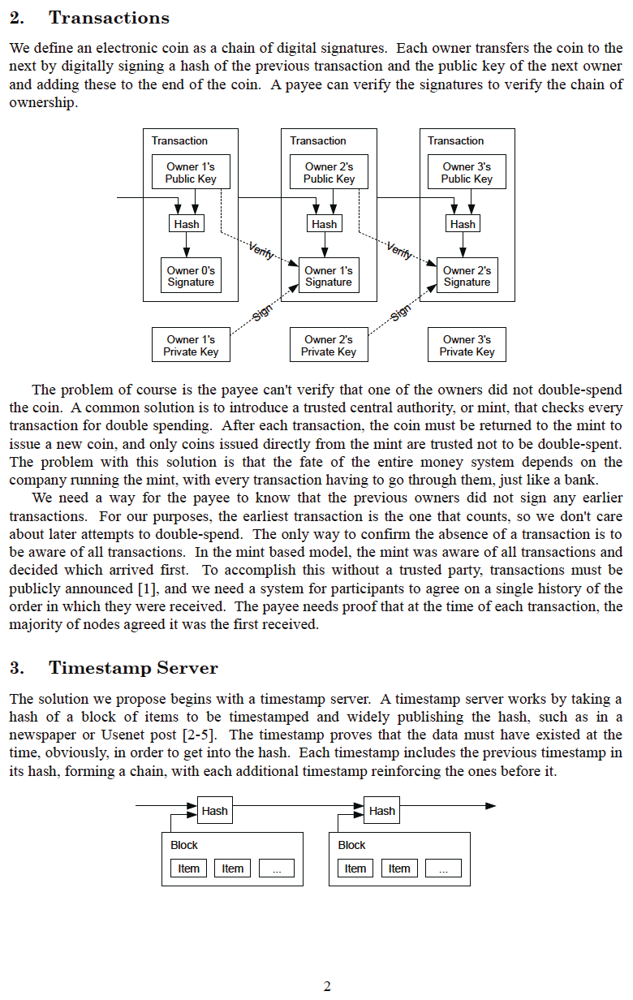

# مقاله سفید بیت کوین
ارائه شده به جهان در metzdowd.com
2008-10-31

**توسط ساتوشی ناکاموتو**

یک سایفرپانک ناشناس، که آخرین بار با انجمن
سایفرپانک در انجمن bitcointalk.org در تاریخ
2010-12-10 ارتباط برقرار کرد.

او با رفتن، به بیت کوین اجازه داد تا یک آزمایش واقعی در
طبیعت باشد. هر کسی که روی آن کار می کند، به نوعی داوطلب است
<-> با الهام از پتانسیل رهایی بشریت
از غل و زنجیر یک سیستم پولی دستکاری شده و مبتنی بر بدهی،
و در عوض، مشارکت در یک شبکه جهانی، غیرمتمرکز، بدون نیاز به مجوز، مقاوم در برابر سانسور، واقعاً کمیاب، همتا به همتا، غیرمتمرکز پول و پرداخت پولی، که الهام بخش یک نظم نوظهور برای برخاستن از خاکسترهای پول بدون پشتوانه است.

**همه ما ساتوشی هستیم**
>*The Times 03/Jan/2009 صدراعظم در آستانه
دومین کمک مالی برای بانک ها*

~ متن یک سرتیتر از تایمز لندن،
حک شده در بلوک پیدایش بیت کوین توسط ساتوشی
ناکاموتو در 2009-01-03

---

---

---

---

---

---

---

---

---

---

## بلوک پیدایش بیت کوین ~ نسخه هگز خام 2009-01-03

و اینگونه،

عصری نو،

آزاد شد

---
