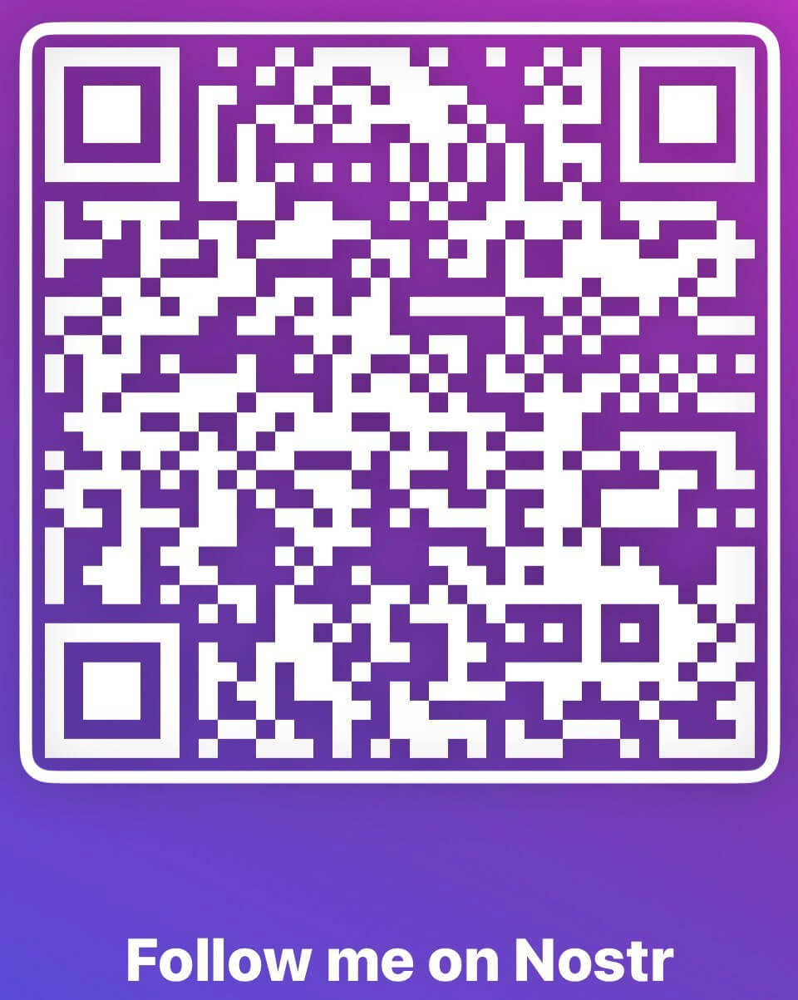

# NOSTR

## NOSTR و سایر مواردی که توسط رله‌ها منتقل می‌شوند

>*می‌توان علیه آن قوانینی وضع کرد، اما آزادی بیان، حتی بیشتر از حریم خصوصی، برای یک جامعه باز اساسی است؛ ما به دنبال محدود کردن هیچ بیانی نیستیم.*

~ اریک هیوز، مانیفست سایفرپانک، 1993

## NOSTR چیست

>*TL;DR: nostr یک پروتکل است که قدرت جایگزینی توییتر، تلگرام و موارد دیگر را دارد.*

~ @dergigi

>*nostr برای آزادی ارتباطات همانقدر اهمیت دارد که بیت کوین برای آزادی تراکنش.*

~ Keysa @SimplestBitcoinBook

*   **Nostr یک پروتکل ساده و غیرمتمرکز برای شبکه‌های مقاوم در برابر سانسور، جهانی و تعاملی است.**
*   Nostr به یک سرور مرکزی مورد اعتماد متکی نیست.
*   این یک پروتکل نرم‌افزاری رایگان و متن‌باز (FOSS) مانند بیت‌کوین، HTTP یا TCP-IP است که به هر کسی اجازه می‌دهد بر روی nostr بسازد.
*   **اینگونه است که ما آزادی خود را برای ارتباط** با هر کسی، در هر کجا که به اینترنت متصل است، حفظ می‌کنیم.

>*(این) یک پروتکل ارتباطی با یک لایه هویت خودحاکمیتی است... و nostr همچنین فراتر از این است.*

~ @dergigi

---

## چرا به NOSTR نیاز داریم

ما به nostr نیاز داریم زیرا سیستم‌های ارتباطی و پلتفرم‌های رسانه‌های اجتماعی فعلی متمرکز هستند.

**این مشکل‌ساز است زیرا این سیستم‌ها:**

*   قدرت سانسور کردن گفتار شما را دارند.
*   در برابر حملات نظارتی توسط دولت آسیب‌پذیر هستند.
*   می‌توانند انتخاب کنند یا به آنها گفته شود که حساب شما را معلق یا حذف کنند.
*   می‌توانند هک شوند و در نتیجه اطلاعات شما را به خطر بیندازند.
*   از الگوریتم‌ها برای ارائه اطلاعاتی که می‌خواهند ببینید به شما استفاده می‌کنند.
*   هر جنبه از تجربه شما در آنها را دستکاری می‌کنند.
*   تمام فعالیت‌های شما را ردیابی می‌کنند.
*   اطلاعات شما را جمع‌آوری و می‌فروشند.
*   از اطلاعات شما برای پر کردن فید شما با تبلیغات استفاده می‌کنند.

---

## NOSTR چگونه کار می‌کند

*   **Nostr دو بخش دارد:** کلاینت‌ها و رله‌ها.
*   **کلاینت یک رابط است** (برنامه یا وب‌سایت) که روی پروتکل nostr اجرا می‌شود.
*   **اینجاست که شما یادداشت‌ها را می‌بینید** که شما و افرادی که دنبال می‌کنید پست می‌کنند (به همان روشی که توییتر یک رابط است که در آن یادداشت‌ها را پست می‌کنید و یادداشت‌های دیگران را می‌خوانید، با این تفاوت که توییتر متمرکز است و پست‌ها را سانسور می‌کند.)
*   **رله یک سرور و یک پایگاه داده است.** هر کسی می‌تواند یک رله را اجرا کند، که این باعث می‌شود nostr غیرمتمرکز شود.
*   **اینجاست که یادداشت‌های شما ارسال، ذخیره و بازیابی می‌شوند** توسط کلاینت‌ها.
*   رله‌های زیادی وجود دارد و شما می‌توانید انتخاب کنید که به کدام یک متصل شوید. برخی رایگان و برخی پولی هستند.
*   وقتی پیامی را ارسال می‌کنید، به رله‌هایی که به آنها متصل هستید ارسال می‌شود.
*   کلاینت‌ها از رله‌هایی که به آنها متصل هستند، پرس و جو می‌کنند و سپس پیام‌های میزبانی شده توسط آن رله‌ها را پر می‌کنند.

~ @BTCillustrated

---

>*هر کسی می‌تواند یک رله را اجرا کند. یک رله بسیار ساده و احمق است. کاری جز پذیرش پست‌ها از برخی افراد و ارسال به دیگران انجام نمی‌دهد. رله‌ها نباید مورد اعتماد باشند. امضاها در سمت کلاینت تأیید می‌شوند.*

~ @fiatjaf, 2019-11-02 fiatjaf.com/nostr.html

*   وقتی کلاینت nostr خود را باز می‌کنید، تمام یادداشت‌های ارسال شده توسط شما و کسانی که دنبال می‌کنید را به ترتیب زمانی خواهید دید.
*   هیچ **الگوریتمی** وجود ندارد که تصمیم بگیرد چه چیزی را به شما نشان دهد، چه چیزی را از شما پنهان کند یا پست‌های شما را سانسور کند.
*   مانند بیت کوین، **nostr از جفت کلیدهای عمومی/خصوصی استفاده می‌کند.**
*   **کلید عمومی** = npub، مانند نام کاربری
*   **کلید خصوصی** = nsec، مانند رمز عبور

>*   **توجه:** کلید خصوصی شما در صورت گم شدن قابل تنظیم مجدد نیست، بنابراین **باید آن را به خوبی ایمن کنید!**
>*   اگر کلید خصوصی خود را درز دهید، هرکسی که به آن دسترسی داشته باشد، به حساب nostr شما دسترسی خواهد داشت و **هیچ راهی برای به دست آوردن مجدد دسترسی انحصاری وجود ندارد.**

---

*   می‌توانید با استفاده از NIP-05 یک نام کاربری قابل خواندن توسط انسان ایجاد کنید. **به عنوان مثال:**
*   **کلید عمومی من، یا npub، این است:**
    <small>npub1dpna3xwwddnhhzg9ycpvlcz2ze0jdwm2rf3eqd2lf9leaewtq7tqhw0ef2</small>

*   **آدرس NIP-05 Nostr من این است:**

    SimplestBitcoinBook@nostrplebs.com

*   **می‌توانید با وارد کردن موارد زیر، افراد را در nostr جستجو کنید:**
*   npub
*   NIP-05 (معروف به آدرس nostr) اگر داشته باشند
*   نام کاربری از NIP-05 -> @SimplestBitcoinBook

*   **یک شناسه NIP-05 را از اینجا دریافت کنید:**
*   nostrplebs.com
*   verified-nostr.com
*   getalby.com
*   یا یکی را با دامنه خود تنظیم کنید

*   پس از اینکه جفت کلید nostr خود را دارید، می‌توانید با همان کلیدها وارد هر کلاینت nostr شوید و خواهید دید که **هویت و لیست‌های دنبال‌کنندگان/دنبال‌شوندگان خود را در همه کلاینت‌ها حفظ می‌کنید.**
*   این با رسانه‌های اجتماعی قدیمی متفاوت است، جایی که شما به یک حساب کاربری، نام کاربری و رمز عبور جداگانه برای هر پلتفرم نیاز دارید و محتوا، دنبال‌کنندگان و دنبال‌شوندگان مختلفی در هر کدام دارید.
>*در ابتدایی‌ترین سطح خود، Nostr یک پروتکل ارتباطی است که به عنوان چسب اجتماعی عمل می‌کند که همه برنامه‌های شما را به هم متصل می‌کند.*

~ derekross@nostrplebs.com

---

# چگونه NOSTR کنیم

>1. **یک برنامه کلاینت برای دانلود انتخاب کنید.** (مهم نیست کدام یک را انتخاب می‌کنید، زیرا می‌توانید پس از تولید جفت کلید خود، همه آنها را امتحان کنید.)
>2. **نمونه‌های کلاینت محبوب:**
>*   Damus در iOS
>*   Amethyst در Android
>*   Primal در iOS/Android/Desktop
>3. **یک نام کاربری ایجاد کنید.** به اطلاعات دیگری نیاز نیست.
>4. **برنامه حساب را ایجاد می‌کند.**
>5. **در صورت تمایل می‌توانید یک عکس پروفایل و بنر اضافه کنید.**
>6. **حساب شما به طور خودکار به چند رله متصل می‌شود** هنگامی که حداقل یک علاقه را انتخاب کنید (به عنوان مثال: بیت کوین، هنر، حقوق بشر، ورزش، موسیقی و غیره)
>7. بسته به کلاینت، به طور خودکار چند حساب با علاقه مشابه را دنبال می‌کند یا به شما امکان می‌دهد چند حساب را انتخاب کنید.
>8. **سپس می‌توانید رله‌ها و حساب‌ها را اضافه یا حذف کنید.**

~ @BTCillustrated

---

## مدیریت کلید
*   هنگامی که کلیدهای شما تولید شد، زمان نصب یک **افزونه امضا** است.
*   وقتی می‌خواهید وارد وب‌سایتی شوید که روی پروتکل nostr اجرا می‌شود، از شما nsec یا کلید خصوصی شما را می‌خواهد.
*   **مستقیماً آن را وارد نکنید،** زیرا وب‌سایت‌ها می‌توانند داده‌ها را درز دهند
*   **در عوض، همیشه از یک افزونه امضا استفاده کنید.**
*   این ابزاری است که کلید خصوصی شما را ذخیره می‌کند و شما به آن اجازه می‌دهید رویدادهایی مانند یادداشت‌ها را از طرف شما امضا کند. نگران نباشید، این ساده‌تر از آن چیزی است که به نظر می‌رسد!
*   **افزونه‌های امضا محبوب:**
*   Nostore (iOS Safari)
*   Amber (Android)
*   Nsec App (Mobile/Desktop)
*   Alby (Desktop)
*   Nos2X (Desktop)
*   Nostr Connect (Desktop)

## ZAPS
*   زپ کردن این است که چگونه ما بیت کوین را در nostr انجام می‌دهیم! ایجاد یک اقتصاد V4V (ارزش برای ارزش)، یادداشت به یادداشت، زپ به زپ.
*   با اتصال یک کیف پول Bitcoin Lightning به حساب nostr خود، می‌توانید سات (معروف به زپ) برای یادداشت‌ها یا محتوایی که قدردانی می‌کنید ارسال و دریافت کنید.
*   راه‌های مختلفی برای انجام این کار وجود دارد. اگر کلاینتی که انتخاب می‌کنید شما را در این فرآیند راهنمایی نمی‌کند، فقط در nostr با تگ #asknostr بپرسید و شخصی شما را راهنمایی خواهد کرد. شترمرغ‌ها دوستانه هستند

---

## منابع NOSTR
در زیر لیستی از وب‌سایت‌هایی وجود دارد که راهنماهای عالی و به راحتی قابل هضم در مورد nostr و شگفتی‌های آن دارند!

*   nostr-resources.com توسط @derGigi
*   nostr.com توسط @fiatjaf
*   nostr.net توسط @aljaz
*   nostr.how توسط @JeffG
*   usenostr.org توسط @pluja
*   benwehrman.com/nostr-guide توسط @benwehrman
*   nostrapps.com توسط @Karnage

## چرا شترمرغ؟

**داستان پیدایش شترمرغ Nostr**

توسط Walker@primal.net

**16 دسامبر 2022:**

من ChatGPT3 را کشف کردم و،
طبیعتاً از آن پرسیدم
"آیا می توانید یک شوخی در مورد #nostr بنویسید؟"
ChatGPT3 پاسخ داد:
س: به یک شترمرغ فضول چه می‌گویید؟
پاسخ: یک NosTrich!
این شوخی عالی نبود، اما نمی توانید یک ربات را سرزنش کنید. با این وجود، من ایده یک هویت بصری برای nostr را دوست داشتم و شترمرغ ها پرندگان جالبی هستند. بنابراین من به Midjourney رفتم و #Nostrich را ایجاد کردم

**20 دسامبر 2022:**

@jb55 "Nostrich" را به عنوان نشان و لوگوی رسمی Nostr پیشنهاد داد.
سه دقیقه بعد، @jack تصویر Nostrich را توییت کرد.
بقیه، همانطور که می گویند، تاریخ است.

~ @Walker

---

## کلاینت‌ها/برنامه‌های NOSTR

برای یافتن اینها و بسیاری از برنامه‌های شگفت‌انگیز دیگر که روی پروتکل متن‌باز nostr ساخته شده‌اند، به **nostrapps.com** مراجعه کنید.
از افزونه امضای خود برای ورود به همه آنها استفاده کنید!

*   **Nostr Nests** - یک فضای صوتی برای گپ زدن، جمینگ، کنفرانس‌های کوچک، پادکست‌های زنده.
*   **Plebian Market** - بازار خودحاکمیتی اینترنت، با پشتیبانی از بیت کوین و لایتنینگ.
*   **Npub.pro** - یک وب‌سایت مبتنی بر nostr برای خودتان بسازید.
*   **Corny Chat** - فضاهای صوتی زنده.
*   **Wavlake** - یک پلتفرم پخش موسیقی که از شبکه لایتنینگ بیت کوین برای ارائه ارزش در ازای ارزش استفاده می‌کند.
*   **Zap.stream** - جریان زنده خود را میزبانی کنید و زپ‌های سات دریافت کنید.
*   **Flare** - یک کلاینت برای مشاهده، آپلود و تعامل با محتوای ویدیویی.
*   **Blowater** - ساخته شده برای جایگزینی تلگرام/اسلک/دیسکورد.
*   **Stemstr** - یک تجربه اجتماعی برای هنرمندان موسیقی برای ارتباط، همکاری و به اشتراک گذاری موسیقی شگفت انگیز.
*   **Nostr.build** - آپلود کننده و هاست تصویر، ویدیو و رسانه.
*   Hivetalk - تماس های ویدیویی و جلسات بلادرنگ و کاملاً خصوصی، جایگزین Zoom می شود.
*   **Zap.cooking** - دستور العمل ها را از طریق Nostr به اشتراک بگذارید.
*   **Flockstr** - رویدادها و برنامه ریزی ملاقات.
*   **Memestr** - مشاهده و ساخت میم ها از طریق Nostr
*   **Quotestr** - یک یادداشت Nostr را به یک نقل قول تصویری تبدیل کنید.

---

## به ما بپیوندید
*   Nostr هنوز بسیار جوان است. درست مانند بیت کوین، اما بسیار جوان تر، این یک آزمایش مردمی، آشفته، جهانی و از پایه به بالا است.
*   اگر ارزش یک پروتکل ارتباطی غیرمتمرکز، مقاوم در برابر سانسور و متن‌باز را می‌بینید، لطفاً با استفاده از آن، توسعه آن، ارائه بازخورد به توسعه‌دهندگان و شرکت در هر طریقی که احساس می‌کنید فراخوانده شده‌اید، برای کمک به رشد این ابزار آزادی بیان، به ما بپیوندید.
*   این یک تجربه شگفت‌انگیز است که در یک فناوری در حال رشد شرکت کنید که برای حفظ آزادی بیان و ارتباطات باز در سطح جهانی ساخته شده است.
*   غواصی کنید و همراه با بقیه روح‌های مستقل ما یاد بگیرید، هرج و مرج ذاتی را در آغوش بگیرید تا زیبایی خلق کنید و آینده‌ای روشن برای نوه‌های خود بسازید!

*مهم‌تر از همه این است که باید به خاطر داشته باشیم که nostr فقط مجموعه‌ای بسیار سست از سرورها با اساساً هیچ ارتباطی بین آنها است، ... و فرآیند حفظ ارتباط با دیگران و یافتن محتوا باید از طریق بسیاری از تلاش‌های هکی مختلف مورد توجه قرار گیرد. برای نوشتن برنامه‌های Nostr و استفاده از Nostr باید هرج و مرج ذاتی را پذیرفت.*

*~ @fiatjaf از:*

*'چشم اندازی برای کشف محتوا و استفاده از رله برای شبکه های اجتماعی اساسی در Nostr'*

---

سپاس عمیق به ساتوشی، فیاتجف، سایفرپانک های
گذشته، حال و آینده، خانواده Nostr، گرداب BT،
ماکسی‌های سمی، ماکسی‌های غیرسمی، اربابان و
بانوان میم، مؤمنان، بدبینان، غیب بینان...
و همیشه،
خانواده و دوستان عزیزم،
و کسی که از طریق همه ما نفس می‌کشد،
برای اینکه همیشه مرا می‌بینی،
ارزشمندتر از هر چیز، حتی بیت کوین

نسخه PDF رایگان این کتاب و ترجمه ها
در دسترس است در: thesimplestbitcoinbook.net

من را در nostr دنبال کنید:

نظرات، سوالات، به روز رسانی ها، بازخورد:

thesimplestbitcoinbook@proton.me

نمی توانم قول بدهم که به موقع به آن خواهم رسید...

ممکن است پابرهنه در کوهی باشم

Stack sats

قوی بمانید

صادق بمانید

در پایان، عشق

851522
