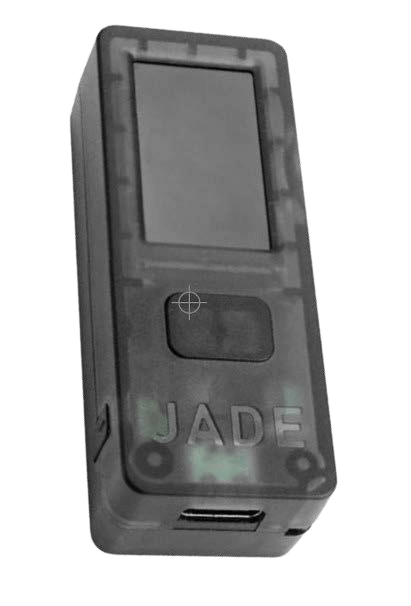

# چگونه بیت کوین کنیم

>**بیت کوین کردن:** (فعل) ‎/tuːˈbɪtkɔɪn/‎
بدینوسیله پیشنهاد می کنم "بیت کوین کردن" را به عنوان یک فعل در نظر بگیریم،
که تمامیت شرکت در
اکوسیستم بیت کوین/Bitcoin را در بر می گیرد.

* خب، حالا که، امیدوارم ;) نارنجی شده باشید و آماده باشید که بانک خودتان شوید، و در اولین پول آزادی جهانی شرکت کنید،
قسمت سرگرم کننده اش فرا می رسد!

---

## تبدیل شدن به بانک خودتان
* اینجا جایی است که تغییر واقعا حماسی در خود مختاری مالی رخ می دهد، و می تواند زمان ببرد
تا واقعاً درک کنید این به چه معناست.
* برای **درک نحوه انجام آن به امن ترین شکل ممکن، به قصد و تعهد نیاز است.**
* در راستای حفظ اینکه این کتاب "ساده ترین کتاب بیت کوین نوشته شده تا کنون" باشد، یک
طرح کلی در اینجا ارائه خواهم داد، و سپس منابعی را در پایان ارائه می دهم تا شما عمیق تر از
دامنه این مقدمه به آن بپردازید.

>**HODL:** (فعل) ‎/ho’dill/‎

: نگه داشتن بیت کوین خود

: نفروختن

-از یک پست در bitcointalk.org در سال 2013، که در آن نویسنده
اعتراف می کرد که مست است و کلمه "HOLD" را اشتباه تایپ کرده است.

-bitcointalk.org/index.php?topic=375643.0

* در حالی که شبکه هنوز در حال رشد است، ارزش زیادی در میلیون ها هودلر جهانی به عنوان آخرین راه حل وجود دارد.

---

## به دست آوردن بیت کوین
* **بیت کوین با فروش بخشی از بیت کوین هایی که ماینرها به عنوان پاداش دریافت می کنند وارد بازار می شود،** تا
هزینه های عملیاتی خود را بپردازند.
* **شما می توانید بیت کوین را با خرید در یک پلتفرم معاملاتی همتا به همتا، با پذیرش آن به عنوان پرداخت برای
کالاها یا خدماتی که ارائه می دهید، به عنوان هدیه یا با استخراج آن به دست آورید.** (آخرین راه حل، که توصیه نمی شود، خرید آن از یک صرافی ثبت شده است).
* هنگامی که آن را دریافت می کنید، از نظر فنی کلیدهای خصوصی را دریافت می کنید که با آن می توانید به بیت کوین خود دسترسی داشته باشید.
> * **به یاد داشته باشید:** خود بیت کوین هرگز زنجیره زمانی را ترک نمی کند.

* می توانید بیت کوین را به صورت ناشناس یا با
تأیید هویت (KYC - شناخت مشتری) به دست آورید.

* KYC طبق قانون برای انجام AML (قوانین ضد پولشویی) هنگام خرید از صرافی ها الزامی است.

>* خرید بیت کوین غیر KYC **حق حفظ حریم خصوصی شما را در آینده حفظ می کند.**

---

## غیر KYC >> ناشناس
**چگونه بیت کوین غیر KYC (بدون احراز هویت) دریافت کنیم:**

توصیه می شود

>1. یک برنامه کیف پول فقط بیت کوین دانلود کنید (به صفحه 102 مراجعه کنید).
>2. یک روش را انتخاب کنید (به زیر مراجعه کنید).
>3. بیت کوین بخرید، دریافت کنید یا استخراج کنید.
>4. بیت کوین خود را به کیف پول خود برداشت کنید.
>5. HODL کنید یا خرج کنید و جایگزین کنید.

* **از Robosats ،Bisq ،HodlHodl ،Peach Bitcoin بخرید.**
* **از یک دستگاه خودپرداز بیت کوین بخرید** - حتماً بررسی کنید، زیرا
برخی به شناسه نیاز دارند. برخی دیگر فقط نام و
شماره می خواهند (می توانید از یک شماره تلفن موقت استفاده کنید).
* **یک کوپن Azteco بخرید** - برای مکان ها به azte.co مراجعه کنید.
* **برای کاری که انجام می دهید، آن را به دست آورید** - درخواست کنید که با بیت کوین پرداخت شود.
پیشنهاد دهید قیمت خود را تخفیف دهید.
* **به صورت حضوری در یک گردهمایی بیت کوین بخرید.**
* **استخراج کنید** - استخراج در خانه آسان تر می شود، یا
می توانید به یک استخر استخراج بپیوندید، اما DYOR را برای اینکه بدون KYC بمانید، دنبال کنید. Ocean Pool یک گزینه عالی است.

---

## KYC >> تأیید هویت مورد نیاز است

**نحوه خرید بیت کوین KYC (با احراز هویت):**

توصیه نمی شود

>1. یک برنامه کیف پول فقط بیت کوین دانلود کنید (به صفحه 102 مراجعه کنید).
>2. یک صرافی فقط بیت کوین انتخاب کنید.
>3. یک حساب کاربری ایجاد کنید و یک روش پرداخت را پیوند دهید.
>4. الزامات KYC را برآورده کنید.
>5. بیت کوین بخرید.
>6. **بیت کوین خود را به کیف پول خود برداشت کنید.**
>7. HODL کنید یا خرج کنید و جایگزین کنید.

* **آگاه باشید که بیت کوین شما برای همیشه به
هویت شما پیوند داده می شود** اگر آن را از این طریق بخرید، بنابراین از
نام مستعار آینده در رابطه با این خریدها چشم پوشی می کنید.
* اگر این روش را انتخاب می کنید، توصیه می کنم یک
***صرافی فقط بیت کوین*** معتبر پیدا کنید.
* ***مطمئن شوید که صرافی به شما اجازه می دهد بیت کوین
خود را به کیف پول خود برداشت کنید!***
* **صرافی ها طبق قانون ملزم به "KYC" کردن شما هستند.**
* آنها **نام کامل، آدرس، شماره تامین اجتماعی،
ایمیل، شماره تلفن و اغلب عکسی از شما در حالی که شناسه خود را نگه داشته اید، خواهند گرفت.**
* **تأیید کنید که صرافی هم پشتیبانی تلفنی و هم ایمیلی
برای خدمات مشتری دارد.**

---

* از آنها بخواهید شما را در ارسال بیت کوین
از حساب خود در آنجا به کیف پول خود راهنمایی کنند، بنابراین
خودتان بیت کوین خود را نگهداری می کنید
= **نگه داشتن کلیدهای خود.**

>* **توجه:** این واقعیت که شما بیت کوین را از آنها خریده اید را پاک نمی کند.
>* **تراکنش ها در زنجیره قابل ردیابی هستند و در
>بسیاری از کشورها هنگام
>خرج کردن بیت کوین خود، مشمول مالیات هستید.**

* اگر می خواهید از طریق Venmo یا Paypal خرید کنید، حتماً
**ابتدا تأیید کنید که هنوز می توانید
ساتوشی های خود را به کیف پول خود میزبانی شده برداشت کنید.** در
گذشته نمی توانستید این کار را انجام دهید.
* همانطور که می گویند:
> **"بدون کلید، بدون پنیر"** یا
>
>**"کلیدهای شما نیست، بیت کوین شما نیست"**

* معنای این گفته این است که تا زمانی که یک سرویس متمرکز
کلیدهای خصوصی بیت کوین شما را نگه می دارد، این احتمال وجود دارد
که پلتفرم آنها هک شود، یا اینکه
دچار تسخیر نظارتی شوند و بیت کوین خود را از دست بدهید.

>* **همیشه به محض اینکه
خریداری کردید، بیت کوین خود را به کیف پول خود
میزبانی شده برداشت کنید.**

---
## EO 6102
* در سال 1933 **رئیس جمهور روزولت فرمان اجرایی
6102 را صادر کرد، که از هر شهروند ایالات متحده می خواست که
بیشتر طلای خود را در ازای اسکناس تحویل دهد.**
* ارزش طلا 20.67 دلار در هر اونس بود. سال بعد، دولت قیمت طلا را به
35 دلار در هر اونس با قانون ذخیره طلای سال 1934 افزایش داد،
و به طور موثر ارزش اسکناس هایی را که مردم
دریافت کرده بودند تقریباً به نصف کاهش داد، زیرا ارزش
اسکناس های آنها هرگز با قیمت متورم شده طلا افزایش نیافت.

---

* تا سال 1975، **42 سال بعد، طول کشید تا EO6102 لغو شود،**
و به شهروندان عادی اجازه داده شود دوباره
بیش از 5 اونس طلا داشته باشند.
* در این مرحله، ما ایده کمی در مورد اینکه چگونه تنظیم کننده ها
به بیت کوین با ادامه افزایش محبوبیت و
پذیرش گسترده تر، پاسخ خواهند داد، داریم.
* تاکنون، استقبال متفاوتی صورت گرفته است. در حال حاضر
به نظر می رسد که بسیاری درک می کنند، یا شاید فقط می پذیرند، که بیت کوین
در نهایت نمی تواند متوقف شود.
* تعدادی از سیاستمداران شروع به صحبت
در حمایت از بیت کوین به عنوان بخشی از پلتفرم خود کرده اند.
همچنین برخی مخالف آن هستند.
* سال انتخابات در ایالات متحده، 2024 بسیار
جالب است، زیرا هر سه نامزد اصلی ریاست جمهوری
کمک های مالی کمپین بیت کوین را می پذیرند!
* السالوادور آن را در سال 2021 به شکل قانونی ارز قانونی تبدیل کرد.
جالب خواهد بود که ببینیم کشور بعدی کدام است.

>* **در نهایت، به نفع هر دولتی خواهد بود که آن را در آغوش بگیرد و آن را به ترازنامه خود اضافه کند، به عنوان یک پوشش در برابر ارزهای فیات به سرعت در حال تورم.**

---

## ذخیره ایمن بیت کوین

* هنگامی که گام تغییر دهنده زندگی خرید اولین خود را برداشتید، باید **تصمیم بگیرید که چگونه به طور ایمن
آن را ذخیره کنید.**
>* **بانک خود بودن یک شکل قدرتمند از
>خودمختاری است.**
>* باید **جدی** گرفته شود.
* ***لطفاً DYOR - فراتر از
توصیه های اساسی من در اینجا، تحقیقات خود را انجام دهید.***
* **اکوسیستم بیت کوین هر دقیقه در حال تحول است.**
* Nostr ،Twitter و bitcointalk.org مکان های خوبی برای
آگاه شدن از آخرین تحولات هستند.

## برای آموزش ها این سایت ها را بررسی کنید:
> * BTCSessions.ca توسطBTCSessions@
>* Bitcoiner.guide توسط QnA@
>* Armantheparman.com توسط ArmanTheParman@
>* SouthernBitcoiner@ در یوتیوب
>* wickedsmartbitcoin@ در یوتیوب

---

## کیف پول های فقط بیت کوین
* بهترین مکان برای ذخیره بیت کوین در کیف پول
 * **خود میزبانی شده**
 * **غیر امانی**
 * **فقط بیت کوین** است.

* یک "کیف پول" در واقع یک قطعه نرم افزاری است که یک
دستگاه امضا است. این شامل کلیدهای خصوصی شما است که
برای امضای یک تراکنش که ارسال (پخش) می کنید، استفاده می کند.

## کیف پول داغ
* **این یک برنامه کیف پول بیت کوین آنلاین است که در تلفن یا رایانه خود دانلود می کنید.**
* بهترین استفاده از آن برای مقادیر کمتر، برای
هزینه های روزمره است.
## کیف پول سرد
* **این یک کیف پول آفلاین است.** همچنین به عنوان یک کیف پول سخت افزاری
شناخته می شود.
* این یک دستگاه سخت افزاری جداگانه برای ذخیره
کلیدهای شما است.

>* در حالی که هر دو به خوبی کار می کنند، به طور کلی توصیه می شود
هنگامی که بیش از 500 تا 1000 دلار بیت کوین دارید، از یک کیف پول سرد استفاده کنید، زیرا **امن تر است.**

---
* **لطفاً DYOR برای مقایسه ویژگی ها و
مبادله ها بین کیف پول های نشان داده شده در زیر.**

* **برنامه های کیف پول داغ** - غیر امانی
Blue Wallet ،Muun Wallet ،Mutiny Wallet
Sparrow Wallet ،Green Wallet ،Phoenix
Wallet ،Zeus Wallet ،Breez Wallet

* **کیف پول های سرد** - غیر امانی
Cold Card ،Trezor ،Foundation Passport
Blockstream Jade ،Seed Signer ،Bitbox

>* **همیشه** کیف پول سرد خود را **مستقیماً
از سازنده** خریداری کنید تا مطمئن شوید که دستکاری نشده است.

---

## تنظیمات کیف پول
* BTCSessions@ را در یوتیوب برای آموزش های عالی
در مورد تنظیمات کیف پول و خیلی بیشتر دنبال کنید.

>* هنگام تنظیم کیف پول خود، حتماً ***عبارت بازیابی 12 یا 24 کلمه ای را روی کاغذ یادداشت کنید.***
>* ***آن را آفلاین نگه دارید. هرگز از آن اسکرین شات نگیرید.***
>* **عبارت بازیابی را بسیار ایمن ذخیره کنید.**
>* **خیلی، خیلی ایمن!**

* **بسیاری از شرکت ها صفحات بازیابی فلزی می سازند که می توانید عبارت بازیابی خود را برای محافظت بیشتر در برابر آتش/آب/آسیب، روی آن ها پانچ کنید. به شدت توصیه می شود!**
* اگر دسترسی به کیف پول داغ یا سرد خود را از دست بدهید،
می توانید آن را با عبارت بازیابی بازیابی کنید و
وجوه خود را بازیابی کنید.
* می توانید این کار را در هر کیف پولی که از همان نوع
عبارت بازیابی BIP39 (12/24 کلمه) پشتیبانی می کند، انجام دهید.
* بهترین روش این است که علاوه بر عبارت بازیابی،
توصیفگر کیف پول خود را نیز ذخیره کنید.
>* **به یاد داشته باشید: هر کسی که عبارت بازیابی شما را داشته باشد، به بیت کوین شما دسترسی دارد!**

---
## درباره حریم خصوصی
* حریم خصوصی هنگام **خرید (غیر KYC)، ایمن سازی، ذخیره
و خرج کردن** بیت کوین، به ویژه با توجه به رویدادهای اخیر با
توقیف/مسدود شدن حساب های بانکی، اهمیت بیشتری پیدا می کند.
>* علاوه بر این، **حریم خصوصی دیجیتال عمومی اگر می خواهید
خودمختاری آنلاین به دست آورید و از خود در برابر نظارت و تقلب نامناسب محافظت کنید، بسیار مهم است.**

* در زیر برخی از سرویس های متمرکز بر حریم خصوصی فعلی آورده شده است.
* پرداختن عمیق به
هر یک از موارد زیر خارج از محدوده این کتاب است، بنابراین حتماً DYOR را دنبال کنید، و
حساب هایی را که در زیر ذکر می کنم در Nostr یا
توییتر برای به روز رسانی ها دنبال کنید.

>*حریم خصوصی برای یک جامعه باز در عصر الکترونیک ضروری است. حریم خصوصی پنهان کاری نیست. یک موضوع خصوصی چیزی است که
شخص نمی خواهد تمام جهان بداند، اما یک موضوع مخفی
چیزی است که شخص نمی خواهد هیچ کس بداند. حریم خصوصی
قدرت افشای انتخابی خود به جهان است.*

~اریک هیوز، از "مانیفست سایفرپانک"
