# Chapter 1

# Kwa Nini Tunahitaji Bitcoin

## TUNAHITAJI KWA SABABU PESA IMEHARIBIKA

> *`Tatizo la msingi la fedha za kawaida ni uaminifu wote unaohitajika kufanya kazi. Benki kuu lazima iaminike kutopunguza thamani ya fedha, lakini historia ya fedha za fiat imejaa uvunjifu wa uaminifu huo. Benki lazima ziaminike kushika pesa zetu na kuzihamisha kwa njia ya elektroniki, lakini zinazikopesha kwa mawimbi ya mapovu ya mikopo zikiwa na akiba ndogo sana. Tunapaswa kuziamini kwa faragha yetu, kuziamini kutowaruhusu wezi wa vitambulisho kuondoa pesa kwenye akaunti zetu.`*

~ Satoshi Nakamoto 2009-02-11

* Mfumo wa fedha za fiat umeharibika (umekuwa hivyo kila wakati).
* Hauendelevi (haujawahi kuwa hivyo).
* Hakuna njia ya kuurekebisha (kamwe hautarekebishwa).

---
## (SIYO) KIWANGO CHA DHAHABU
* Watu wengi bado wanaamini kuwa pesa zinaungwa mkono na
dhahabu.
* Siyo hivyo.
* Haijaungwa mkono na dhahabu tangu 1971, wakati
Rais Nixon alipoiondoa dunia unilaterally kutoka kwenye kiwango cha dhahabu (Mshtuko wa Nixon).
* Angalia **wtfhappenedin1971.com** ili kupata picha kamili ya uharibifu uliofanywa na hili.

Chati inayoonyesha mfumuko wa bei wa Kiwango cha Bei ya Watumiaji (mstari mwekundu) dhidi ya nguvu ya ununuzi ya dola ya Marekani (mstari mweusi) tangu 1971.

<small>U.S. Bureau of Labor Statistics, imepatikana kutoka FRED, Federal Reserve Bank of St. Louis; https://
fred.stlouisfed.org/series/CPIAUCSL, Juni 9, 2024.</small>

* Ukweli wa Kufurahisha: Jukwaa la Kiuchumi Duniani liliundwa mwaka 1971.
---

>**FIAT:** (nomino) /ˈfiː.æt/
>
>: amri ya mamlaka au ya kiholela : AMRI
>
>: uamuzi wa mamlaka : AMRI
>
>**: amri au kitendo cha mapenzi kinachoumba kitu bila
>au kana kwamba bila juhudi zaidi**

~ merriam-webster.com/dictionary

>**FIAT :** kutoka Kilatini fieri «kuumbwa, kuwepo»

* Fiat ni pesa ambayo ina thamani tu kwa sababu serikali inasema (inaamuru) hivyo.
* Kwa hivyo watu (wanapaswa) kuamini kuwa ina thamani.
>* **Hata kama hawaamini fiat ina thamani, kisheria wanalazimishwa kuitumia na kuikubali kama malipo ya
bidhaa na huduma.**
* **Pesa za Fiat huchapishwa/kuundwa kutokana na hewa tupu.**
* Siku hizi takriban 5% ya dola zote huchapishwa kama
pesa taslimu.
* Asilimia 95 nyingine huundwa kidijitali na benki zinazoingiza
namba kwenye kompyuta zinapotoa mikopo

>*Inagharimu senti chache tu kwa Shirika la
Engraving and Printing kuzalisha noti ya $100…*

~ Mchumi wa Marekani, Barry Eichengreen

---

>***Scott Pelley wa NBC '60 Minutes':*** *Ni haki kusema mlijaza tu mfumo kwa pesa?*
>
>***Mwenyekiti wa Fed Jerome Powell:*** *Ndiyo. Tulifanya hivyo.
Hiyo ni njia nyingine ya kufikiria juu yake. Tulifanya hivyo.*
>
>***Pelley:*** *Inatoka wapi?
Mnaichapisha tu?*
>
>***Powell:*** *Tunaichapisha kidijitali. Kwa hivyo kama benki kuu, tuna uwezo wa kuunda pesa kidijitali. Na tunafanya hivyo
kwa kununua Hati za Hazina au dhamana kwa serikali nyingine zenye dhamana. Na hilo linaongeza
usambazaji wa pesa. Pia tunachapisha pesa halisi na tunazisambaza kupitia benki za Federal Reserve.*

~ Mahojiano ya CNBC '60 Minutes', Mei 17, 2020
Miezi miwili baada ya kuanza kwa kufungiwa kwa C*vid-19

>Hakuna kikomo kwa kile tunachoweza kufanya
na programu hizi za kukopesha tulizo nazo.

~ Mwenyekiti wa Fed Jerome Powell
Machi 18, 2020 kwenye CBS News

>Ndiyo, kuna kiasi kisicho na kikomo cha pesa taslimu katika Federal
Reserve. Tutafanya chochote tunachohitaji kufanya ili kuhakikisha
kuna pesa za kutosha katika mfumo wa benki.

~ Neel Kashkari , Rais wa Minneapolis Fed
Machi 23, 2020, CBS '60 Minutes'

>‘Sisi’ hapa ni watu watano wanaopiga kura juu ya mabadiliko
ya sera ya fedha ndani ya mfumo wa Federal Reserve
wakati wa mikutano ya FOMC. 5 kati ya 330,000,000.
Hicho ndicho kinachohitajika kubadili sera ya fedha ya Marekani.

~ @MartyBent, Mwanzilishi wa TFTC.io
Makala ya Forbes, Machi 18, 2020

---

## KUTOKA KINYWA CHA FARASI WA ZAMANI

>*Benki ina manufaa ya riba kwa fedha zote
inazounda kutokana na chochote.*

*~ William Paterson, 1694
Mwanzilishi wa Benki Kuu ya Uingereza*

>*Utata, machafuko, na dhiki zote huko Amerika zinatokana,
siyo na kasoro za Katiba au Shirikisho,
siyo na ukosefu wa heshima au wema,
bali kutokana na ujinga kamili wa
asili ya sarafu, mikopo, na mzunguko.*

*~ John Adams
Rais wa 2 wa Marekani, 1797-1801*

>*Ninaamini kuwa taasisi za benki ni
hatari zaidi kwa uhuru wetu kuliko majeshi ya kudumu.
Tayari zimeinua aristocracy ya pesa
iliyoiweka serikali katika hali ya kukaidi.
Mamlaka ya kutoa fedha inapaswa kuondolewa kwa benki, na
kurejeshwa kwa watu ambao inawahusu kihalali.*

*~ Thomas Jefferson
Rais wa 3 wa Marekani, 1801-1809*

>*Tunapojigamba kwa matendo yetu matukufu tulikuwa makini kuficha ukweli mbaya kwamba kwa mfumo wa fedha usio haki tumetengeneza kitaifa
mfumo wa ukandamizaji ambao, ingawa umesafishwa zaidi, si
chini ya ukatili kuliko mfumo wa zamani wa utumwa wa mali.*

~Horace Greeley
Mbunge wa Marekani 1848-49
Mwanzilishi wa The New York Tribune

---

>*Yeyote anayedhibiti kiasi cha pesa katika nchi yoyote ni
bwana kamili wa viwanda na biashara zote…
utakapogundua kuwa mfumo mzima unadhibitiwa kwa urahisi sana, kwa namna moja au nyingine, na watu wachache wenye nguvu juu, hutahitaji
kuambiwa jinsi vipindi vya mfumuko wa bei na kushuka kwa uchumi vinavyotokea*

~ James A. Garfield
Rais wa 20 wa Marekani, Machi-Sept.1881
Aliuawa mwaka 1881

>*Leo kuna mamlaka isiyodhibitiwa mikononi mwa kikundi cha wanaume
ya kutengeneza dola kutokana na chochote.*

~ Thomas W. Lawson, Mwandishi 'Frenzied Finance', 1905

>*Nilikuwa wa siri – kwa kweli, wa kificho – kama mwanamapinduzi yeyote.
Kugunduliwa, tulijua, hakupaswi kutokea, au la muda wetu wote
na juhudi zetu zingepotea. Kama ingegundulika kwamba
kikundi chetu maalum kimekutana na kuandika muswada wa benki,
muswada huo usingekuwa na nafasi yoyote ya kupitishwa na Bunge.*

~ Frank A.Vanderlip
Rais wa National City Bank of New York
(mtangulizi wa Citi Bank)
~ Akieleza mwaka 1935 kuhusu mkutano wa siri uliofanyika
kwenye Jekyll Island mwaka 1910, kuandaa muswada uliopitishwa kama
Sheria ya Federal Reserve mwaka 1913.

>*Sheria hii (Federal Reserve) inaanza uaminifu mkubwa zaidi duniani.
Rais (Woodrow Wilson) anaposaini Muswada,
serikali isiyoonekana ya Nguvu za Fedha itawezeshwa kisheria…
Uhalifu mbaya zaidi wa kisheria wa karne unatekelezwa
na Muswada huu wa benki na sarafu.*

~ Charles A. Lindbergh, Sr.
Mbunge wa Marekani 1907-1917

---

>*Mimi ni mtu mwenye bahati mbaya sana. Nimeharibu nchi yangu bila kujua.
Taifa kubwa la viwanda linadhibitiwa na mfumo wake wa mikopo.
Mfumo wetu wa mikopo umejikita. Ukuaji wa taifa,
kwa hivyo, na shughuli zetu zote ziko mikononi mwa wanaume wachache.
Tumekuwa moja ya serikali zinazotawaliwa vibaya zaidi, moja ya
serikali zinazodhibitiwa na kutawaliwa kabisa katika
ulimwengu uliostaarabika. Siyo tena serikali kwa maoni huru, siyo tena
serikali kwa kushawishika na kura ya walio wengi, bali
serikali kwa maoni na shuruti ya
kikundi kidogo cha wanaume wenye mamlaka.*

~ Woodrow Wilson
Rais wa 28 wa Marekani, 1913-1921
Miaka 6 baada ya kupitisha Sheria ya Federal Reserve ya 1913.

>*Ukweli halisi wa jambo hili ni, kama mimi na wewe tunavyojua,
kwamba kipengele cha kifedha katika vituo vikubwa
kimeimiliki serikali ya Marekani tangu
siku za Andrew Jackson.*

~ Franklin D. Roosevelt
Rais wa 32 wa Marekani katika barua iliyoandikwa
Novemba 21, 1933 kwa Kanali E. Mandell House

>*Haya [mdororo] hayakuwa ajali.
Yalikuwa tukio lililopangwa kwa uangalifu….
Mabenki ya kimataifa yalijaribu kuleta
hali ya kukata tamaa hapa ili waweze
kuibuka kama watawala wetu sote.*

~ Mbunge Louis T. McFadden,
Aliuawa mwaka 1936

>Mwenyekiti wa Kamati ya Benki na Fedha ya Bunge
*Kila mara benki inapotoa mkopo,
mikopo mipya ya benki huundwa – amana mpya – pesa mpya kabisa.*

~ Graham F.Towers
Gav. wa Benki Kuu ya Kanada, 1934-55

---

>*Kama kusingekuwa na madeni katika mfumo wetu wa fedha,
kusingekuwa na pesa yoyote*

*~ Marriner Eccles,
1941, Gav. wa Fed*

>*Sijawahi kuwa na mtu yeyote ambaye angeweza, kwa kutumia
mantiki na sababu, kuhalalisha serikali ya Shirikisho
kukopa matumizi ya pesa zake yenyewe…
Ninaamini wakati utafika ambapo watu watadai
hili libadilishwe.
Ninaamini wakati utafika katika nchi hii ambapo
watakulaumu mimi na wewe na
kila mmoja anayehusika na Bunge
kwa kukaa kimya na kuruhusu
mfumo kama huo wa kijinga kuendelea.*

~ Wright Patman
Mbunge wa Marekani 1928-1976
Mwenyekiti, Kamati ya Benki na Fedha 1963-1975

>*Wewe au mimi tunapoandika hundi, lazima kuwe na fedha za kutosha katika
akaunti yetu kufidia hundi, lakini Federal Reserve inapoandika
hundi hakuna amana ya benki ambayo hundi hiyo inatolewa. Wakati
Federal Reserve inapoandika hundi, inaumba pesa.*

~ Federal Reserve Bank of Boston
'Putting It Simply', 1984

---

## FEDERAL RESERVE

* Fed ni benki kuu 'huru' ya
Marekani. Iliundwa mwaka 1913 kwa kupitishwa kwa
Sheria ya Federal Reserve.
* Ina muundo wa kipekee, sehemu binafsi na sehemu ya
serikali.
* Inatakiwa kuwa taasisi huru kisiasa,
isiyoegemea upande wowote ndani ya serikali.
* Wakati Bodi ya Magavana ya Fed inateuliwa na
Rais na kuthibitishwa na Bunge, **
maamuzi ya Fed hayahitaji kuridhiwa
na mtu yeyote.**

**Inajumuisha:**

* Bodi ya Magavana ya Federal Reserve
* Benki 12 za Federal Reserve
* Kamati ya Soko Huria ya Shirikisho (FOMC),
ambayo ndiyo chombo cha kutunga sera ya fedha.

**Fed inawajibika kwa:**

* Kusimamia sera ya fedha ya Marekani, kukuza ajira na bei thabiti.
* Kudhibiti na kusimamia taasisi za benki na kifedha.
* Kutoa huduma za malipo kwa taasisi za kifedha.
* Kukuza ulinzi wa watumiaji na maendeleo ya jamii.

---

## KUMBUKUMBU JUU YA MWENYEKITI WA FED

* **Mwenyekiti wa Federal Reserve pia ni:**

* Mwenyekiti wa Kamati ya Soko Huria ya Shirikisho
(FOMC), ambayo huamua mwelekeo wa
sera ya fedha ya Marekani (kwa mfano: QE, ongezeko la riba)
* Mwanachama wa Shirika la Fedha la Kimataifa,
IMF
* Mwanachama wa Benki ya Makazi ya Kimataifa,
BIS (benki ya benki zote kuu).
* Waziri wa fedha wa Marekani wa G-7
* Waziri wa fedha wa Marekani wa G-20

* Mamlaka **kubwa sana** kwa mtu mmoja.

---

## BANKING YA AKIBA NDOGO NDOGO, RIBA & MIKOPO

* **Banking ya Akiba Ndogo Ndogo (Fractional Reserve banking):** Hadi Machi 2020, benki
zilitakiwa kushikilia akiba ya 10%, na zingeweza
kukopesha 90%.
* **Tangu Machi 2020, hakuna akiba inayotakiwa, kuruhusu benki kutoa mikopo isiyo na kikomo.**

* Mkopo ni pesa inayotegemea deni, na unahitajika
kulipa riba kwenye mkopo huo.

>* **Ukweli wa Kufurahisha 1:** Pesa za kulipa riba kwenye
mkopo HAZIUNDWI na benki.
>* **Ukweli wa Kufurahisha 2:** HAZIUNDWI KAMWE.
>* **Ukweli wa Kufurahisha 3:** HAKUNA PESA YA KUTOSHA duniani kulipa mikopo yote + riba inayodaiwa
kwenye mikopo hiyo.
>* **Ukweli wa Kufurahisha 4:** Kamwe haitakuwepo!

---

## KUMBUKUMBU JUU YA PETRO DOLLA
* Mtu anaweza kusema **kuwa hadi 1971 dola iliungwa mkono
na dhahabu, na tangu 1974 imeungwa mkono na mafuta,
na hivyo kwa upungufu, Jeshi la Marekani.**
* **Mwaka 1974 Marekani na Saudi Arabia ziliingia makubaliano ya pande mbili ya kupanga bei ya uuzaji wa mafuta kwa dola za Marekani.**
* Tangu wakati huo, mauzo mengi ya mafuta duniani yamelipwa kwa
dola za Marekani.
* Hili limechangia sana dola kuwa
sarafu yenye nguvu zaidi duniani.
* **Kwa hivyo imependekezwa bandia,** hata wakati
ambapo ingekuwa imepambana.
* Tangu mwishoni mwa 2022, nchi

---

# Chapter 2

# HUTATUA UJUMUISHAJI WA KIFEDHA
* **Kwa kutumia bitcoin, kila mtu anapata mfumo wa kifedha *uleule*, wenye sheria *zilezile* kwa kila mtu.**
* Hakuna mianya au milango ya nyuma au mikataba maalum
kwa mtu yeyote.
* Kila mtu ana uwezo wa kulipwa kwa
thamani anayoitoa kwa fedha halisi zilezile,
zilizoundwa na kudumishwa kwa sheria zilezile.
* **Bitcoin inapatikana kwa mtu yeyote, popote penye
muunganisho wa intaneti.**

## KUONGEZA THAMANI KWENYE ULIMWENGU
* **Bitcoin inawahimiza watu kuongeza thamani halisi kwa
jamii na soko,** kwani hii ndiyo njia pekee
ya kupata pesa zaidi
* Ikiwa mtu ameridhika na kidogo, bado ananufaika kwa kufanya kazi kwa ujira wa haki, na **anapohifadhi, akiba hiyo hudumisha thamani yake baada ya muda.**

---
## HUTATUA HILI TATIZO LA MAZINGIRA
* Fedha imara yenye ugavi uliopunguzwa sana huunda
mwelekeo tofauti sana na ule unaoundwa na
uchapishaji wa pesa usio na kikomo unaotegemea deni ambao
tunaona ukitokea leo.
* Badala ya msukumo usiokoma wa kutumia zaidi
na zaidi, katika mbio za chini kulipa
riba ya mkopo inayoongezeka na deni
ambalo halitalipwa kamwe, **bitcoin
hutoa njia mbadala kuelekea ulimwengu ambapo upendeleo wa muda mfupi
hautafutwi.**
>* Uharibifu mkubwa wa mazingira **hubadilishwa
na matumizi kidogo, taka kidogo, na
mbinu makini ya uzalishaji,** ambapo
soko huamua nini kina thamani halisi, na
hivyo vitu hujengwa ili kudumu.
* Huu ni manufaa halisi kwa watu, mimea na wanyama!
---
## HUTATUA HII VITA
* Uchapishaji usio na kikomo wa mfumo wa fedha wa fiat
ndio unaofanya ‘vita vya milele’ viwezekanavyo na
faida.
* Kwa kuwa watu wengi hawajui jinsi
matumizi ya vita yanavyofanya kazi, au pesa za vita
zinatoka wapi, kuna uwajibikaji mdogo au hakuna kabisa
kwa upande wa serikali. Vita vinaweza kuendelea kwa
miaka mingi katika maeneo ya mbali, bila usimamizi halisi.
* Kuanzia na Vietnam, vita vimekuwa 'vita vya kadi ya mkopo' (h/t @AlexGladstein), kwani
serikali inakopa pesa kufadhili vita, na
kisha inakopa pesa zaidi kulipa riba kwenye
mikopo ya awali... suuza na kurudia.
>* **Katika kiwango cha bitcoin, itahitaji
watu wa nchi kuwa tayari kusaidia kulipia
vita. Huenda watafanya hivyo tu ikiwa
ni muhimu kabisa na wazi, kutetea familia zao
na nchi yao, na lengo la mwisho likionekana.**
* Kwa kuwa hakungekuwa na faida isiyostahili kutengenezwa,
maafisa wa serikali na mashirika hawangehimizwa
kukuza au kushiriki katika vita kama
chaguo linalowezekana.
* **Juhudi zingeongezeka sana kupata njia za
kufikia maazimio ya amani, yenye gharama nafuu badala yake.**
---
## HUTATUA UPENDELEO HUU WA MUDA

**Upendeleo wa Muda Mfupi:** Kuridhika mara moja, Kutokuwa na subira,
Mipango ya muda mfupi
**Upendeleo wa Muda Mrefu:** Kuridhika kwa kuchelewa, Uvumilivu,
Mipango ya muda mrefu

* Upendeleo wa muda mrefu husababisha uharibifu wa kibinafsi, kijamii na
kimazingira. Wakati pesa zetu
zinapoteza thamani kila siku, ‘tunashurutishwa’ kutokuwa
na subira na kuzitumia haraka iwezekanavyo,
kabla hazijapoteza thamani zaidi.
* Wakati muda wetu unapoteza thamani kutokana na sarafu ya fiat inayopanda thamani kila mara, tunapoteza uhusiano na thamani ya muda wetu.
* Hii husababisha kutengana, na mkazo wa chini.
* Majibu ya kupunguza mkazo, na kutafuta maana,
yanapotoshwa na kuwa vikwazo kama vile
matumizi mabaya ya madawa ya kulevya, pombe, ununuzi,
ponografia, chakula cha haraka, umakini mfupi, uraibu
wa skrini/mitandao ya kijamii, maamuzi ya haraka n.k.
* **Fedha imara kwa upande mwingine, ambayo hudumisha
thamani yake baada ya muda na kupima ipasavyo
mchango wetu kupitia kazi yetu, husababisha upendeleo wa muda mfupi, ubora wa maisha wenye
fikra, na mahusiano yenye maana, matumizi kidogo, muunganisho wa kina, mazungumzo yenye uzito zaidi, malengo ya muda mrefu na ubunifu ulioongezeka.**
---

---

# Chapter 3

# BITCOIN NI NINI ?

>*“Kuandika maelezo kwa kitu hiki kwa hadhira ya jumla ni ngumu sana. Hakuna kitu cha kukiunganisha nacho.”*

~ Satoshi Nakamoto 2010-07-05

>*Mzunguko jumla utakuwa sarafu 21,000,000. Zitasambazwa kwa nodi za mtandao (wachimbaji) wanapotengeneza vizuizi, huku kiasi kikipunguzwa kwa nusu kila baada ya miaka 4.
miaka 4 ya kwanza: sarafu 10,500,000
miaka 4 ijayo: sarafu 5,250,000
miaka 4 ijayo: sarafu 2,625,000
miaka 4 ijayo: sarafu 1,312,500 n.k...
Itakapokwisha, mfumo unaweza kusaidia ada za miamala ikiwa inahitajika. Inatokana na ushindani wa soko huria, na labda kutakuwa na nodi zitakazokuwa tayari kuchakata miamala bure.*

~ Satoshi Nakamoto 2009-01-09

* **Bitcoin ni pesa ya uhuru…** kwa maana kwamba ina
uwezo wa kutuweka huru sote kutokana na udhibiti mkuu na ghilba ya mfumo mkuu wa benki
* **Katika bitcoin, sheria za kifedha ni sawa kwa
KILA MTU, KILA MAHALI.**
* Bitcoin inajumuisha wote, kwa maana kwamba yeyote aliye na
muunganisho wa intaneti anaweza kushiriki kwenye mtandao,
na **lazima afuate sheria zile zile.**

---
## bitcoin ni:
* **IMETAWANYWA**
* **ADIMU KWELI**
* **HAIPATI UDHIBITI**
* **LEJA ILIYOSAMBAZWA**
* **HAIPATIKANI NA UFISADI**
* HAINA HITAJI YA KIBALI
* INAYOWEZA KUKAGULIWA
* UWANJA WA WAZI
* ISIYOBADILIKA
* HAINA MIPAKA
* NGUMU KUGHUSHI
* MAJINA BANDIA
* HAINA MSUGUANO
* HAINA HITAJI YA KUAMINI
* RIKA-KWA-RIKA
---
* Bitcoin imetawanywa.
* **Inaendeshwa kwenye maelfu ya nodi duniani kote, na maelfu ya watu wasiofahamiana.**
* Hakuna mtu, serikali au kampuni inayoweza kuyadhibiti.
* Unaweza kuendesha nodi pia, ni rahisi ;)
* Kwa kuendesha nodi yako mwenyewe, unaongeza
faragha yako na kusaidia kulinda mtandao unapothibitisha miamala yako mwenyewe.
> **Usiamini. Thibitisha**
---
* **Bitcoin (herufi kubwa ‘B’)** ni mtandao wa kifedha.
* **bitcoin (herufi ndogo ‘b’)** ni sarafu, au mali ya kifedha, inayotolewa na kuendeshwa kwenye mtandao wa Bitcoin.

---
* **Bitcoin ndio kichocheo kikuu.**
>* **Ujuzi wa Satoshi ulikuwa kwamba katika bitcoin, kwa
mara ya kwanza, watendaji wazuri na wabaya wanachochewa kufuata sheria.**

> *"Motisha inaweza kusaidia kuhimiza
nodi kubaki waaminifu.
Ikiwa mshambuliaji mlafi anaweza kukusanya
uthibitisho-wa-kazi wa CPU zaidi ya nodi zote
za uaminifu, itabidi achague kati ya kuitumia
kuwadanganya watu kwa kuiba malipo yake,
au kuitumia kutengeneza sarafu mpya.
Anapaswa kuona faida zaidi kufuata
sheria, sheria ambazo zinamfaidi kwa sarafu
mpya zaidi kuliko wengine wote kwa pamoja,
kuliko kuharibu mfumo na uhalali wa
utajiri wake mwenyewe.”*

~ Satoshi Nakamoto 2008-10-31

---
* **Bitcoin ni pesa ya kwanza asilia ya kidijitali,** tofauti na
akaunti yako ya benki mtandaoni, ambayo ni mfumo wa kidijitali tu wa fedha fiat za benki kuu.
* Bitcoin ni sarafu ya kidijitali **iliyotawanywa**.
* Bitcoin haina **mamlaka kuu.**
* Bitcoin **haina taifa.**
* Fikiria athari zake ...

>*Bitcoin ni sarafu ya kidijitali iliyotawanywa inayowezesha
malipo ya papo hapo kwa yeyote, popote duniani.
Bitcoin hutumia teknolojia ya rika-kwa-rika kufanya kazi bila
mamlaka kuu: usimamizi wa miamala na
utoaji wa pesa hufanywa kwa pamoja na mtandao.*

~ Bitcoin Wiki
en.bitcoin.it

---
* Bitcoin ni pesa ya ajabu ya intaneti.
* Hapana, kwa umakini, **Bitcoin ndiyo njia tutakayorekebisha ulimwengu.**
* Kweli? Ndiyo.
---
* **Bitcoin ni njia ya kuhamisha thamani**
 * ya kiasi chochote
 * kwa usalama
 * papo hapo (kwenye Mtandao wa Lightning)
 * kati ya pande mbili zozote
 * wakati wowote
 * 24/7
 * popote
 * ndiyo, popote
 * Fikiria kuhusu hilo.

 ---

>*Kwa sarafu ya kielektroniki inayotegemea uthibitisho wa kriptografia,
bila hitaji la kumwamini mpatanishi wa tatu, pesa inaweza kuwa salama na
miamala rahisi.*

~ Satoshi Nakamoto 2009-02-11

---
>*Bitcoin haina (karibu) gharama ya kuhamisha kwa uhakika.
Najua kwa uhakika wa 100% ninachopokea.*

~ Michael Saylor Mkurugenzi Mtendaji wa Microstrategy

* Unaweza kutuma $1.13, au senti 46 au satoshi 359 au satoshi 500,000,000
au dola milioni 1 kwa yeyote, popote, wakati wowote
kupitia Mtandao wa Bitcoin, au Mtandao wa Lightning
uliojengwa juu ya Bitcoin.
* **Na hakuna anayeweza kukuzuia.**
* Je, unaweza kufanya hivyo kwa dhahabu, fedha, USD/GBP/EUR/YEN/
CYK/ZAR au sarafu nyingine yoyote ya benki kuu ya fiat?

---
* **Bitcoin ni ya kihistoria.** Hii ni mara ya kwanza katika historia ambapo
mfumo wa kifedha uliotawanywa kikweli, usiozuilika, usiobadilika,
usio na mipaka, usiohitaji kibali, na usioweza kuharibika wenye kikomo kabisa (sarafu milioni 21) umewahi kuundwa
>* Bitcoin ni **muhimu kwa kutawanya mamlaka
na kuongeza ushirikishwaji wa kifedha,** kama vile uvumbuzi
wa mashine ya kuchapisha, na baadaye World Wide Web, **ulivyokuwa muhimu kwa kutawanya udhibiti wa, na
kuongeza upatikanaji wa, habari.**

>*Watu wengi hufuta kiotomatiki
sarafu ya kielektroniki kama sababu iliyopotea
kutokana na makampuni yote yaliyofeli
tangu miaka ya 1990.
Natumai ni dhahiri kwamba ilikuwa tu
asili ya mifumo hiyo iliyodhibitiwa kati ndiyo
iliyowaangamiza.
Nadhani hii ni mara ya kwanza tunajaribu
mfumo uliotawanywa, usioegemea uaminifu.*

~ Satoshi Nakamoto 2009-02-15
---
* **Bitcoin ni LEJA YA HESABU iliyosambazwa, iliyotawanywa, ya uwazi na isiyobadilika.**
* Mtu yeyote duniani anaweza kuona nani anamiliki nini, wakati wowote, na haiwezi kubadilishwa.
* Isipokuwa ‘nani’ si jina, **ni anwani
iliyoundwa na namba na herufi.**
>* Mfano wa anwani ya bitcoin:
**bc1qar0srrr7xfkvy5l643lydnw9re59gtzzwf5mdq**

* Kwa hivyo Bitcoin ni **ya majina bandia.**
---
* **Bitcoin ni**
* mtoaji usio na upendeleo wa mali
* akiba ya thamani
* njia ya kubadilishana
* na hivi karibuni itakuwa kitengo cha hesabu
* **pamoja na**
* **njia** ya kubadilishana.

* Ni mtoaji, dhahabu, pesa taslimu, kadi ya debit NA
paypal, benki, venmo, cashapp, western union

**ZOTE ZIMEUNGANISHWA KUWA MOJA\!**

---
* **Bitcoin ni mtunzaji wa kumbukumbu anayetumia hisabati na
sayansi ya kompyuta, badala ya mabenki, wahasibu na wakaguzi wa hesabu.**
* Inaondoa walanguzi, benki, serikali, ada za akaunti iliyopitiliza,
ada za akaunti ya hundi, saa chache za huduma,
uwezekano wa udhibiti, akaunti zilizogandishwa, udanganyifu wa usambazaji wa pesa, viwango vya riba, IMF,
WEF, BIS, majengo halisi, ATM,
hundi, malipo ya kurejeshwa, petro dola, euro
dola, ushuru wa benki, athari ya cantillon,
benki ya akiba ya sehemu, visa, mastercard, amex,
western union, siku za kusubiri uhamisho wako wa waya
upitie ...

>* **Badala ya kuwa na mtu kati yako na
>yule unayetaka kumsalimia, unaweza
>kumsalimia moja kwa moja.**
>* **Hakuna haja ya kuomba ruhusa kutuma
>pesa zako mwenyewe\!**
---

## Kwa Urahisi…
* **Bitcoin ni mali ya kidijitali ambayo hakuna anayeweza kukuchukulia.**
* >Kumiliki bitcoin kunamaanisha kumiliki haki ya kutuma thamani
kutoka anwani maalum unayoidhibiti kwa
funguo yako ya siri kwenda anwani YOYOTE unayoichagua.

*Bitcoin ni haki ya mali ambayo haitegemei
ukiritimba wa vurugu.*

~ Robert Breedlove @breedlove22

---

* **Bitcoin ni tukio la mara moja katika spishi.**
* Bitcoin ni chaguo.
* Bitcoin **inazaa uhuru wa kujitawala.**
>* **Kugunduliwa kwa Bitcoin miaka 15 iliyopita, ni kwa
uhuru wa kifedha na uhuru wa kujitawala wa binadamu,
kama vile ugunduzi wa moto ulivyokuwa kwa ustawi wa
binadamu zaidi ya miaka 500,000 iliyopita, na mashine ya
kuchapisha ilivyokuwa kwa kutawanya upatikanaji wa
maarifa ya binadamu karibu miaka 900 iliyopita.**

---
* **Bitcoin ni akiba halisi ya thamani.**
* Inahifadhi rasilimali yako muhimu zaidi, muda wako, kwa
njia ambayo unaweza kuupata tena baadaye.
>*Bitcoin ni kama njia yenye uwezo mkubwa wa kusafirisha nishati
kwa wewe wa baadaye ... unaweza kufanya kazi leo na Bitcoin
itahifadhi nishati yako kwa matumizi ya baadaye.*

~ Robert Breedlove

>*Kiini cha pesa ni muda
Na kiini cha muda ni thamani*

~ Guy Swann

---
* Bitcoin ni mnyororo wa wakati, kihalisi.
* Satoshi alirejelea mnyororo wa wakati mara nyingi katika
barua pepe zake na waendelezaji wa mapema.
* Unaweza kupima muda katika vizuizi, kwani kizuizi kimoja
huchimbwa kila baada ya takriban dakika 10.
>* **Wakati wetu ndio rasilimali yetu adimu na muhimu zaidi.**
>* **Ndio nguvu yetu halisi ya maisha.**
>* **Pesa Halisi huturuhusu kuhifadhi muda wetu.**

* Ndio njia tunayoweza kutambua muda tulio ‘tumia’.
* Tunabadilishana **muda wetu kwa pesa, ambayo ni kumbukumbu rahisi
ya muda na juhudi zetu.**
* **Bitcoin inafanya iwezekane kuhifadhi muda wetu ili tuweze
‘kuupata’ baadaye maishani, wakati hatuwezi tena
kufanya kazi kama tulivyofanya zamani.**
---
* Bitcoin ni **akiba ya thamani.**
* Bitcoin ni **njia ya kubadilishana.**
* Bitcoin **siku moja itakuwa kitengo cha hesabu.**
* Bitcoin **siku moja itakuwa *KITENGO CHA HESABU KIKUU.***
---
* **Bitcoin ni adimu**
* Ina kikomo kikali cha 21,000,000.
* Hakutakuwa na zaidi.
* Nambari ndiyo sheria hapa.*

*Ingawa ‘kiufundi’ inawezekana kubadilisha
msimbo, ujuzi wa Satoshi unazuia hilo, kwani kuongeza
(kuharibu) ugavi kungesababisha tu kupungua kwa
thamani ya bitcoin zote zilizopo. Hii inawachochea
kila mtu kukubali kwa undani kudumisha kikomo cha
ugavi wa 21,000,000.

* Angalia **timechaincalendar.com** na @TC kuangalia
urefu wa kizuizi cha sasa, ugavi uliopo, na
vipimo vingine vingi kuhusiana na mnyororo wa wakati wa bitcoin.
---
* **Bitcoin inaweza kugawanyika bila kikomo, bila kuharibu
ugavi.**
* **Pizza moja ni pizza moja, bila kujali vipande ni vidogo kiasi gani.**
* Kwa sasa inaweza kugawanyika hadi desimali ya nane: 1.00000000
* Kuna satoshi 100,000,000 katika bitcoin 1.
* satoshi 1 = 0.00000001
* Unaweza kununua satoshi (satoshi) kwa kiasi chochote.
---
* **Bitcoin ndio pesa ngumu na imara zaidi tuliyowahi
kuifahamu.**
* Ni imara zaidi hata kuliko dhahabu, kwani dhahabu haina
urahisi wa kugawanyika au kubebeka, ina kasi ndogo (huhamia polepole)
na si rahisi kuthibitishwa
* **Bitcoin ina sifa bora zaidi za kifedha
kuliko mali yoyote inayojulikana.**

**CHATI YA KUILINGANISHA SIFA ZA PESA IMARA**
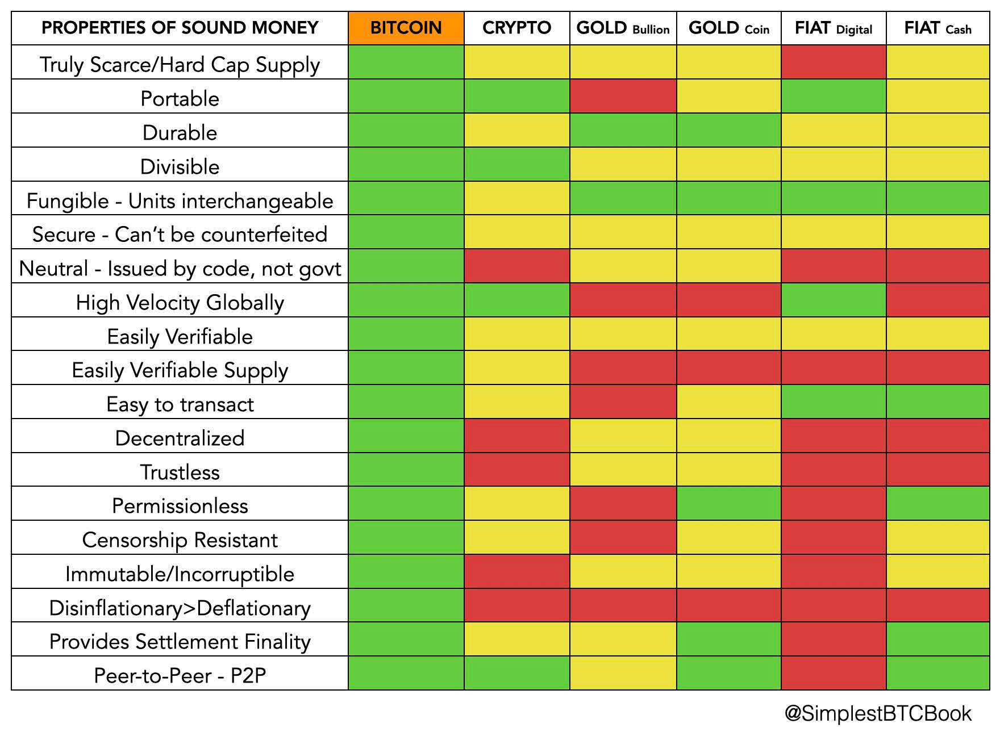

KUMBUKA: Huu ni muhtasari wa jumla, kuna tofauti ndogondogo zisizoweza
kushughulikiwa kwenye chati.

---
* **Bitcoin ndio kinga.**
* Kujaribu ‘kutuliza’ uchumi kwa mikopo ya dharura,
uchapishaji wa pesa, QE na udanganyifu wa viwango vya riba ni
kama kuiweka kwenye mashine ya kupumua.
* Hii ‘mashine’ inaweza kuendelea kwa muda tu, kabla ya
kuwa ghali zaidi na zaidi kudumisha, na isiyodumu,
ikisababisha uharibifu mkubwa.
* **Bitcoin inarekebisha hili**
* **Bitcoin ni pesa bora zaidi**

---
* **Bitcoin ni isiyovunjika kirahisi.**
* Na inazidi kuwa hivyo kwa kila jaribio la shambulio,
kwa kila marufuku ya serikali, kwa kila kipande cha habari kuu za
vyombo vya habari vya FUD (hofu, kutokuwa na uhakika, shaka).
>* Bitcoin haijawahi kudukuliwa.*
* Ingawa wengi wamejaribu.

\*Ingawa unaweza kuwa umesikia kuhusu udukuzi, ni
kubadilishana ndiko kulikodukuliwa, si
itifaki ya bitcoin.
* **Kumbuka:**
* Sio funguo zako, sio sarafu zako.
* **Daima** ondoa satoshi zako kwenye **pochi yako mwenyewe.**
* **Bora** kununua rika-kwa-rika.

---
* **Bitcoin ni mchanganyiko wa:**
* sayansi ya kompyuta
* itifaki za mtandao
* mifumo ya umeme
* nadharia ya michezo
* imani
* mimetiki
* thermodynamiki
* athari za mtandao
* kriptografia
* nishati
* uhaba wa kweli
* vivutio vya kiuchumi
* uhandisi

---

# Chapter 4

# JINSI Bitcoin INAVYOFANYA KAZI?

Sheria si Watawala

tik-tok/
/block inayofuata
* Bitcoin hutumia uthibitisho wa kazi (proof-of-work), kriptografia ya funguo za umma (public-key cryptography) na mitandao ya rika-kwa-rika (peer-to-peer networking), ili kuchakata na kuthibitisha malipo katika leja ya mtandaoni, ya kimataifa, iliyosambazwa.

>**Kriptografia** (nomino) /krɪpˈtɑːɡrəfi
>
>*: kitendo cha kusimba na kusimbua jumbe
>katika msimbo wa siri au sifa
>: usimbaji na usimbuaji wa habari kwa
>kutumia kompyuta*

~ Kamusi ya Merriam Webster

>**Hashing** (kitenzi) /ˈhæʃɪŋ/
>
>*: njia ya usimbaji fiche
>: mchakato wa kutumia algoriti ya hisabati dhidi ya
>data ili kutoa thamani ya nambari (hash digest)
>ambayo inawakilisha data hiyo.*

~ crsc.nist.gov

>**Kumbuka:**
>
>Mfumoikolojia wa Bitcoin unajumuisha >>
>
>**bitcoin:** **rasilimali ya kifedha** ya kidijitali
>
>**Bitcoin:** **mtandao wa malipo** wa wachimbaji na nodi

1 bitcoin = 100,000,000 satoshis (sats)

**(Unaweza kununua sats, sehemu ya bitcoin)**

---

>*Tunafafanua sarafu ya kielektroniki kama mnyororo wa
saini za kidijitali. Kila mmiliki huhamisha
sarafu kwa anayefuata kwa kusaini kidijitali
heshi ya muamala uliopita na
funguo ya umma ya mmiliki anayefuata na kuongeza
hizi mwishoni mwa sarafu. Mpokeaji anaweza
thibitisha saini ili kuthibitisha mnyororo
wa umiliki.*

~ Satoshi Nakamoto
Karatasi Nyeupe ya Bitcoin, Sehemu ya 2, 2008
Ikielezea jinsi muamala wa bitcoin unavyofanya kazi
katika leja iliyosambazwa

---
## MFUMO IKOLOJIA WA BITCOIN..
**unaundwa na Wachimbaji, Nodi, Watumiaji, Wasanidi Programu**

wote wakifanya kazi kwa kujitegemea,

na wakati huo huo kwa kutegemeana,

kuuhuisha ule ambao ni

BITCOIN!

---
## WACHIMBAJI
* **Nodi maalum** (kompyuta zinazoitwa ASICS) **zinazochimba vitalu** vinavyokuwa sehemu ya blockchain ya bitcoin.
* Kwa kufanya hivyo, **huthibitisha miamala iliyothibitishwa iliyofanywa na watumiaji, huchapisha bitcoins mpya** na **hulinda mtandao mzima.**

## WATUMIAJI
* **Wewe na mimi. Sote.** Watu.
* Tukitambua na kuthamini thamani ya
bidhaa na huduma zinazotolewa, tunafanya miamala: tunatoa
na kupokea bitcoin, au tunaihifadhi kwa matumizi ya baadaye, kadri
inavyohitajika.

## NODI
* **Nodi ni kompyuta zinazoendesha programu ya bitcoin.**
* **Kuna maelfu ya nodi** zinazounda
**mtandao** uliosambazwa, wa kimataifa, wa hiari **unaothibitisha miamala** (hivyo kuzuia
matumizi mara mbili, na kusaidia kulinda
mfumo).

## WASANIDI PROGRAMU (DEVS)
* **Wakodishaji, waandaaji programu & waandishi wa kidijitali** wanaofanya kazi
**kudumisha na kupanua mtandao, kuboresha usalama,
faragha na kiolesura cha mtumiaji, na kutafsiri msimbo** kuwa
lugha na taswira ambazo sisi wengine tunaweza kuelewa na kutumia.

---

## MUAMALA WA BITCOIN:
Ali anataka kumtumia Benji bitcoin:

>1. Ali **anafungua programu ya pochi ya bitcoin** kwenye simu yake na
>**anabofya 'Tuma'.**
>2. Benji **anafungua programu yake ya pochi** na **anabofya 'Pokea'.**
>3. **Ikiwa wako pamoja:** Ali anaskani nambari ya QR kwenye
>programu ya pochi kwenye simu ya Benji.
>4. **Ikiwa hawako pamoja:** Ali ananakili na kubandika
>anwani Benji aliyomtumia, kwenye sehemu ya anwani katika pochi yake.
>5. Ali **anaweka kiasi cha kutuma,** na kubofya **'Tuma'.**
>6. **Sekunde chache baadaye,** Benji ataona kiasi
>kikiwa kinasubiri katika pochi yake.
>7. **Ikiwa ilitumwa kupitia Lightning** itathibitishwa
>karibu papo hapo, na ni karibu bila malipo.
>8. **Ikiwa ilitumwa 'onchain'** (kwenye mnyororo mkuu wa Bitcoin),
>inajumuisha ada ndogo, na kwa kawaida huchukua kama dakika 10
>kuthibitishwa. Inaweza kuchukua muda mrefu zaidi,
>kutegemea na msongamano wa mtandao.

---

## MUAMALA WA BITCOIN KINYUME NA PAJAMAA:
(Ufafanuzi wa maneno yaliyo **kwa herufi nzito** yafuata)

>1. Ali anapotuma sats hizo kwa Benji, **muamala** wa malipo
>**unatangazwa** kwenye mtandao.
>2. Muamala unathibitishwa na **nodi** zinazohakikisha
>Ali kweli ana bitcoin ya kutuma, na
>kwamba haijawahi kutumika hapo awali (kuzuia
>matumizi mara mbili).
>3. Mara tu inapothibitishwa na nodi, inasubiri kwenye **mempool**
>pamoja na miamala ya watu wengine.
>4. Miamala iliyo kwenye mempool huongezwa kwenye
>block kwenye **blockchain** wakati **mchimbaji** anapopata
>**nonce** inayokidhi **algoriti ya ugumu.**
>5. Kila **block** ina **timestamp.**
>6. Hii huleta **kutobadilika,** na husaidia kulinda
>marekebisho ya algoriti ya ugumu kutokana na kudanganywa.
>7. Kila block inawakilisha uthibitisho mmoja kwa
>miamala iliyojumuishwa ndani yake.
>8. Vitalu vinavyoongezwa, kwa wastani kila baada ya dakika kumi,
>kutobadilika kwa blockchain huongezeka.

---

## KAMUSI YA ISTILAHI

---
>* **MUAMALA ~ Kutuma/kupokea bitcoin**
---
* Uhamisho wa thamani kwa namna ya satoshi, kutoka
mmiliki mmoja wa bitcoin kwenda kwa mwingine.

---
>* **NODE ~ 'Tawi' la 'benki' ya bitcoin iliyosambazwa. Mtu yeyote anaweza kuendesha nodi.**
---

* Nodi ni kompyuta zinazoendesha programu ya bitcoin.
* Nodi, pamoja na wachimbaji, watumiaji na
wasanidi programu, huunda mtandao wa Bitcoin wa rika-kwa-rika.
* Fikiria **kila nodi kamili kama leja iliyo na
salio za kila funguo ya faragha.**
* Huwasiliana, na kufikia makubaliano (kukubaliana) na
kila mmoja kwa kukubali na kuthibitisha
miamala kutoka nodi nyingine, pamoja na vitalu
kutoka kwa wachimbaji, na kisha kuyapeleka hizi kwa
nodi nyingine.
* Nodi huendeshwa na kundi la kujitolea la maelfu
ya watu duniani kote.
* Nodi kamili ni ile ambayo imethibitisha kwa kujitegemea
blockchain nzima ya Bitcoin, tangu
Genesis Block ilipochimbwa na Satoshi mwaka 2009.
* Kadri nodi zinavyokuwa nyingi, ndivyo mtandao mzima unavyosambazwa zaidi, na hivyo kuwa na uwezo wa kustahimili zaidi.
* **Kwa sasa kuna zaidi ya nodi kamili 19,000 zinazoweza kufikiwa
ulimwenguni kote, na nyingi zaidi zisizoweza kufikiwa.**
* Nodi zote zinazoshiriki ni sawa.

---

---
>* **TANGAZA ~ Kuujulisha mtandao kuwa unamtumia mtu bitcoin.**
---

* Unapobofya 'Tuma', pochi yako inasaini muamala kwa kutumia funguo yako ya faragha na kuutangaza, ikiwajulisha nodi nyingine zote nia yako ya kuhamisha thamani ili ziweze kuthibitisha muamala huo.

---
>* **MEMPOOL ~ Chumba cha kusubiria miamala**
---

* Hiki ni 'chumba cha kusubiria' ambapo miamala iliyothibitishwa hutumwa kuchukuliwa na mchimbaji na
kuongezwa kwenye block.

---
>* **BLOCK ~ 'Ukurasa' katika leja ya bitcoin**
---

* Leja iliyosambazwa ya Bitcoin imeundwa na 'vitalu' vya kidijitali.
* Kila block ina miamala ya bitcoin iliyothibitishwa
inayoweka leja ya kimataifa kuwa sahihi na mpya.
Pia zina nonce, timestamp na
heshi ya block iliyopita, zote zikichangia
kutobadilika kwa blockchain ya bitcoin.

---
>* **BLOCKCHAIN ~ Leja nzima ya bitcoin**
---

* Blockchain ya bitcoin, pia inajulikana kama
timechain, ni leja iliyosambazwa iliyo na
kila block, na kila muamala wa bitcoin uliowahi
kufanywa tangu block ya Genesis ilipochimbwa na
Satoshi mwaka 2009.

---

---
>* **MCHIMBAJI ~ Nodi maalum inayothibitisha
miamala na kutoa bitcoins mpya**
---

* Wachimbaji wa Bitcoin ni kompyuta maalum.
Huelekeza nguvu nyingi za kompyuta (hashrate) katika
bahati nasibu ya kidijitali kubashiri nambari ambayo itakidhi
algoriti ya ugumu wa sasa, hivyo 'kuchimba'
'block' (sehemu ya leja).
* Block iliyochimbwa huwekwa timestamp na kuongezwa kwenye
blockchain (pia inajulikana kama timechain).

---
>* **ALGORITI YA UGUMU ~ Muundo maalum, unaobadilika unaosaidia kuweka utoaji mpya wa bitcoin kuwa unatabirika.**
---

* Hili lilikuwa moja ya suluhisho za kipekee za Satoshi kusaidia
kulinda utoaji wa bitcoin usizidi kikomo,
kadri kompyuta za kisasa zaidi zinavyotengenezwa.
* Wachimbaji wengi wanapoingia mtandaoni, nambari lengwa (nonce) katika 'bahati nasibu' hupungua, na hivyo kuwa ngumu zaidi kuipata.
* Wachimbaji wachache wanapokuwa mtandaoni, inakuwa rahisi zaidi.
* Algoriti **hujirekebisha kiotomatiki kila baada ya vitalu 2016** (kama kila wiki mbili), kuhakikisha kiwango kinachotabirika cha usambazaji, ambapo block moja huchimbwa
kwa wastani kila baada ya dakika kumi.

---
>* **NONCE ~ Nambari isiyo ya mpangilio ya biti 32**
---

* Nambari isiyo ya mpangilio ya biti 32 ambayo wachimbaji huongeza mwishoni mwa orodha ya miamala iliyohashwa, kujaribu
kukidhi lengo la ugumu kuchimba block.
* Mchimbaji anapopata nonce inayosababisha
kutengeneza heshi chini ya nambari lengwa ya sasa,
amechimba block na anaruhusiwa kuiweka kwenye
blockchain na kudai zawadi ya block ya bitcoin.
---

---
>* **TIMESTAMP ~ Huweka muda**
---

* Kila block iliyochimbwa huongezewa timestamp.
* Hii ni kwa ajili ya usalama zaidi, kutobadilika na kusaidia
kuanzisha marekebisho ya ugumu.

---
>* **KUTOBADILIKA ~ Hali isiyoweza kubadilishwa.**
---

* Hii inamaanisha blockchain 'imewekwa katika jiwe la kidijitali'.

---
>* **UTHIBITISHO WA KAZI (PoW) ~ Uthibitisho wa kriptografia
kwamba kazi ngumu ilifanywa kukidhi algoriti.**
---

* Wachimbaji hutumia algoriti ya PoW kuthibitisha wametumia nguvu nyingi za kompyuta kupitia umeme
(kazi), ili kufikia makubaliano kwa njia isiyo ya kati, na kuzuia wahusika fisadi
kutuma ujumbe taka kwenye mtandao.

---
>* **KRIPTOGRAFIA YA FUNGUO ZA UMMA ~ Mchakato unaounda funguo za kidijitali za kufikia bitcoins zako**
---

* Huu ni mfumo ambapo funguo mbili huundwa
kupitia algoriti ya kriptografia.
* **Funguo moja ni ya umma** - Kama nambari yako ya akaunti ya benki, unayoweza kuwapa watu kukutumia bitcoin
kwa bidhaa, zawadi au huduma.
* **Funguo nyingine ni ya faragha** - Ni wewe tu una nakala,
na unaitumia kufungua ufikiaji wa bitcoin yako,
kama vile nenosiri linavyofungua akaunti yako ya benki mtandaoni.
* **Ni lazima ulinde funguo yako ya faragha vizuri sana,**
kwani mtu yeyote anayepata ufikiaji wake ana ufikiaji wa
bitcoin yako.

---

---
>* **MTANDAO WA RIKA-KWA-RIKA (P2P) ~ Mtandao uliosambazwa bila waamuzi**
---

* Nodi kamili (rika) hushirikiana kudumisha mtandao wa rika-kwa-rika kwa ajili ya uthibitisho na uhakiki wa miamala na vitalu.
* Katika aina hii ya mtandao, kila nodi ina uwezo wa
kutoa/kuomba data kwa/kutoka kwa rika zake.
* Hakuna walinzi katika mtandao wa P2P.

---
>* **MTANDAO WA LIGHTNING ~ Mtandao uliojengwa juu ya bitcoin unaowezesha kutuma au kupokea
sats haraka sana na karibu bila malipo.**
---

* Lightning ni suluhisho la kusawazisha la Tabaka la 2. Hii inamaanisha
inatoa njia kwa bitcoin kusawazisha, na kuipa
uwezo wa kuchakata mamilioni ya miamala kwa
sekunde (TPS).

---
>* **POCHI ~ 'Pochi' inashikilia funguo za kriptografia za kufikia bitcoin yako.**
---

* Inaweza kuwa kwenye simu, kompyuta au kwenye kifaa kidogo tofauti cha maunzi (salama zaidi).
* Pochi ya bitcoin kwa usahihi zaidi ingeitwa
kifaa cha kusaini. Bitcoin yako haiondoki kamwe
kwenye blockchain, leja ya kidijitali.
* Unapotaka kutuma au kutumia bitcoin yako,
pochi itasaini na kutangaza muamala kwenye
mtandao, ili uweze kuthibitishwa na
kuongezwa kwenye block kwenye blockchain.

---
>* **WASANIDI PROGRAMU ~ Waandaji programu za kompyuta**
---

* Cypherpunks/waandaji programu wanaodumisha mtandao, kuboresha usalama, kuangalia hitilafu, kuwasilisha
maombi ya kuvuta (kwa masasisho au vipengele vipya), kukagua maombi ya kuvuta, kukagua msimbo.

---

---
>* **FUNGUO YA UMMA ~ Kama nambari ya akaunti ya benki ya kupokea bitcoin.**
---

* Unaweza kuwapa watu kukutumia bitcoin,
kama vile unavyoweza kumpa mtu nambari yako ya akaunti
ili waweze kukutumia fedha za kawaida.

---
>* **FUNGUO YA FARAGHA ~ Kwa kulinda, kufikia na kutuma bitcoin, kama ufunguo wa sanduku la amana salama.**
---

* Funguo ya faragha ya bitcoin ni mfuatano wa siri wa nambari
na herufi unaokuruhusu kutuma/kutumia bitcoin yako.
* Ni wewe tu una nakala. **Ni muhimu sana
kuiweka salama

---

# Chapter 5

# NENO KUHUSU MTANDAO WA UMEME
* **Vitalu vya Bitcoin vina ukubwa mdogo kwa makusudi*** (1MB kila moja),
matokeo yake mnyororo mkuu wa bitcoin unaweza kuchakata takriban miamala 7 kwa sekunde (TPS).
* Visa huchakata takriban 24,000 TPS.
* Pia, **kwa kawaida huchukua kama dakika 10 kwa
uthibitisho wa kwanza kupita kwenye
muamala wa mnyororo mkuu** (kwani kitalu kinachimbwa kwa
wastani kila ~ dakika 10).
* Hii haifai ikiwa uko dukani na unataka
fanya malipo ya haraka kwa bidhaa zako.

>***Maelezo Muhimu:** Sababu vitalu ni vidogo,
ni kuweka **mnyororo wa wakati mdogo kiasi kwamba mtu yeyote anaweza
endesha nodi yao wenyewe nyumbani, ambayo husaidia kuweka
mtandao umegatuliwa.** Satoshi alitambua
umuhimu wa hili

>*Watumiaji wa Bitcoin wanaweza kuzidi
kuwa wakali kuhusu kupunguza ukubwa wa
mnyororo ili iwe rahisi kwa watumiaji wengi
na vifaa vidogo.*

~ Satoshi Nakamoto, 2010-12-10

**Usomaji Unaopendekezwa:**
* Vita vya Ukubwa wa Kitalu na Jonathan Bier
---

>* Ingia, **Mtandao wa Umeme (LN),** **Suluhisho la kupima bitcoin la Tabaka la 2.**
>* **'Tabaka la 2'** linamaanisha **limejengwa juu ya bitcoin.**
>* **'Suluhisho la Kupima'** linamaanisha inaruhusu mtandao:
>* ** Ongeza kasi ya uchakataji kwa kiasi kikubwa.**
>* **Ongeza kwa kiasi kikubwa idadi ya miamala ambayo
>inaweza kuchakata kwa sekunde.**
>* **Fanya malipo madogo yawezekane.**

* Mtandao wa Umeme unaweza (kwa kiasi fulani) kufikiriwa kama
kama kichupo ambacho unaweza kuweka na marafiki zako kwenye baa.
* Unaendelea kufuatilia kati yenu nani anamdai nani
(kama kituo cha Mtandao wa Umeme), na mwishoni
mwa usiku kikundi chako kinakaa na mhudumu wa baa
('mnyororo mkuu').
* **Vituo vya umeme, hata hivyo, vinaweza kubaki wazi kwa
siku, wiki, miezi au miaka kabla ya
'kukaa' kwenye mnyororo mkuu.**

---
## FAIDA ZA :
* **KIASI** - Kiasi cha miamala kwa sekunde ni
kimsingi haina kikomo, kwani njia nyingi zinaweza kuwa
kufunguliwa kwa wakati mmoja, kila moja ikiweka yao wenyewe
'kichupo'.
* **MALIPO MADOGO** - Unaweza kutuma kidogo kama 1
satoshi (hivi sasa $0.0006).
* **KASI** - Kwa kawaida huchukua kati ya milisekunde na
sekunde chache kupokea malipo.
* **USIRI** - Miamala haihifadhiwi kwenye wazi,
blockchain ya umma ya bitcoin. Kwa njia zingine ni hata
ya kibinafsi zaidi kuliko pesa taslimu, kwa sababu na Umeme,
hata mtu mwingine hajui lazima nani
wewe ni, kama malipo yako mara nyingi 'huruka' kupitia
njia tofauti kufikia mpokeaji.

Ili kuwa wazi, sisemi kuwa haiwezekani 100%
kufichua, ni zaidi tu kuliko malipo kwenye
mnyororo mkuu wa bitcoin.
Itachukua muda na nguvu nyingi
kuanzisha kwa uhakika ni nani alikuwa akifanya malipo
kwa nani, na haitawezekana kila wakati
fanya hivyo kabisa.

>**Furahia taswira za kushangaza** za hali ya sasa
>ya Mtandao wa Umeme katika:
>* lnrouter.app/graph
>* mempool.space/graphs/lightning/nodeschannels-map

---

>*Bitcoin yenyewe haiwezi kupima ili kuwa na kila
muamala mmoja wa kifedha katika
ulimwengu utangazwe kwa kila mtu na
imejumuishwa kwenye blockchain.
Kunahitaji kuwa na kiwango cha pili cha
mifumo ya malipo ambayo ni nyepesi
uzito na ufanisi zaidi.*

*~ Hal Finney, 2010-12-30, Cypherpunk ya mapema
& mtu wa pili kuendesha Bitcoin*

**Fikiria kama hii:**
>* Bitcoin: **Akaunti ya Akiba** ~ Miamala ya polepole zaidi kwa
>kiasi kikubwa zaidi.
>* Umeme: **Akaunti ya Akiba** ~ Miamala ya haraka zaidi
>kwa kiasi kidogo.

>*Bitcoin iliyoimarishwa na Umeme inaweza kuonekana kama zote mbili a
bidhaa (mali ya dijiti) na huduma (mtandao wa pesa wazi). Uwezo wa kuhamisha nishati ya fedha kupitia
wakati na nafasi bila kuingiliwa na serikali au
benki za kawaida ni muhimu sana kwa ubinadamu.*

~ Michael Saylor, Mkurugenzi Mkuu
Microstrategy

**Jifunze zaidi kuhusu Umeme hapa:**

lopp.net/lightning-information.html

---

---

# Chapter 6

# JINSI YA KUBITCOIN

>**Kubitcoini:** (kitenzi) /tuːˈbɪtkɔɪn/
Ninapendekeza hapa kufanya ‘kubitcoin’ kuwa kitenzi,
kinachojumuisha ukamilifu wa kushiriki
katika mfumo wa ikolojia wa bitcoin/Bitcoin.

* Sawa, sasa kwa kuwa umebahatika ;) kupewa "orangepilled", na uko tayari kuwa benki yako mwenyewe, ukishiriki katika fedha huru ya kwanza duniani, hapa ndipo sehemu ya kufurahisha inapokuja!

---

## KUWA BENKI YAKO MWENYEWE
* Hapa ndipo mabadiliko makubwa kweli ya kuwa huru kifedha yanapatikana, na, inaweza kuchukua muda
kuelewa kweli, kabisa maana yake.
* **Nia na kujitolea kunahitajika ili
kuelewa jinsi ya kufanya hivyo kwa njia salama zaidi iwezekanavyo.**
* Kwa roho ya kuweka kitabu hiki kuwa 'kitabu rahisi zaidi
kuandikwa kuhusu bitcoin', nitatoa
muhtasari hapa, na kisha natoa rasilimali mwishoni
ili uweze kuzama zaidi kuliko
wigo wa kitabu hiki kifupi.

>**HODL:** (kitenzi) /ho’dill/

: kushikilia bitcoin yako

: kuto kuuza

-Kutoka chapisho la bitcointalk.org la 2013, ambapo mchapishaji
akidai amelewa, alikosea herufi ya ‘HOLD’

-bitcointalk.org/index.php?topic=375643.0

* Wakati mtandao bado unakua, kuna thamani kubwa
katika mamilioni ya washikiliaji wa mwisho duniani.

---

## KUPATA BITCOIN
* **Bitcoin huingia sokoni kupitia wachimbaji wanapouza baadhi ya
bitcoins wanazopokea kama zawadi,** ili kulipia
gharama zao za uendeshaji.
* **Unaweza kupata bitcoin kwa kununua kwenye jukwaa la biashara ya rika-kwa-rika
, kwa kuikubali kama malipo ya
bidhaa au huduma unazotoa, kama zawadi, au kwa kuchimba
yenyewe.** (Njia ya mwisho kabisa, isiyopendekezwa, ni kuinunua
kutoka soko la kubadilishana lililosajiliwa).
* Unapoipokea, kiufundi unapokea
funguo za faragha unazotumia kufikia bitcoin yako.
> * **Kumbuka:** Bitcoin yenyewe haiwahi kuondoka
  kwenye timechain.

* Unaweza kupata bitcoin ama bila kujulikana, au
kwa uthibitisho wa kitambulisho (KYC - Mjue Mteja Wako)

* KYC inahitajika kisheria kutimiza AML (sheria za kuzuia utakatishaji fedha haramu) unaponunua kutoka kwenye soko za kubadilishana.

>* Kununua bitcoin isiyo ya KYC **huhifadhi haki yako ya
  faragha katika siku zijazo.**

---

## Isiyo ya KYC >> Bila Kujulikana
**Jinsi ya Kupata Bitcoin Isiyo ya KYC (Bila Kitambulisho):**

INAPENDEKEZWA

>1. Pakua programu ya pochi ya bitcoin pekee (tazama uk. 102).
>2. Chagua njia (tazama hapa chini).
>3. Nunua, pokea au chimba bitcoin.
>4. Toa bitcoin yako kwenye pochi yako.
>5. HODL, au tumia na ubadilishe.

* **Inunue kutoka Robosats, Bisq, HodlHodl, Peach Bitcoin.**
* **Inunue kutoka ATM ya bitcoin** - Hakikisha umeangalia, kwani
  baadhi zinahitaji kitambulisho. Nyingine huuliza tu jina na
  namba (unaweza kutumia # ya simu ya muda).
* **Nunua vocha ya Azteco** - Tembelea azte.co kwa maeneo.
* **Ipate kwa kazi unayofanya** - Omba kulipwa kwa bitcoin.
  Toa punguzo la bei yako.
* **Inunue kibinafsi kwenye mkutano wa bitcoin.**
* **Ichimbe** - Inazidi kuwa rahisi kuchimba nyumbani, au
  unaweza kujiunga na "mining pool", lakini kisha DYOR ili kubaki bila KYC. Ocean Pool ni chaguo zuri.

---

## KYC >> Uthibitisho wa Kitambulisho Unahitajika

**Jinsi ya Kununua Bitcoin ya KYC (kwa Kitambulisho):**

HAIPENDEKEZWI

>1. Pakua programu ya pochi ya bitcoin pekee (tazama uk. 102).
>2. Chagua soko la kubadilishana la bitcoin pekee.
>3. Fungua akaunti & unganisha njia ya malipo.
>4. Timiza mahitaji ya KYC.
>5. Nunua bitcoin.
>6. **Toa bitcoin yako kwenye pochi yako mwenyewe.**
>7. HODL au tumia na ubadilishe.

* **Fahamu kuwa bitcoin yako itaunganishwa milele na
  utambulisho wako** ukinunua kwa njia hii, hivyo kupoteza
  uwezekano wa kutokujulikana katika siku zijazo kuhusiana na manunuzi haya.
* Ukichagua njia hii, ninapendekeza kutafuta
  ***soko la kubadilishana la bitcoin pekee*** linaloaminika
* ***Hakikisha soko la kubadilishana linakuruhusu kutoa
  bitcoin yako kwenye pochi yako mwenyewe!***
* **Masoko ya kubadilishana yanahitajika kisheria kukufanyia ‘KYC’.**
* Watachukua **jina lako kamili, anwani, namba ya usalama wa jamii
  , barua pepe, namba ya simu na mara nyingi picha yako
  ukiwa umeshikilia kitambulisho chako.**
* **Thibitisha kuwa soko la kubadilishana lina usaidizi wa simu na barua pepe
  kwa huduma kwa wateja.**

---

* Waache wakuelekeze jinsi ya kutuma bitcoin yako
  kutoka akaunti yako kwao hadi kwenye pochi yako mwenyewe, ili
  uwe unajihifadhi bitcoin yako
  = **Kushikilia funguo zako mwenyewe.**

>* **Kumbuka:** Hii HAIFUTI ukweli kwamba
>ulinunua bitcoin kutoka kwao.
>* **Miamala inaweza kufuatiliwa kwenye "on-chain", na katika
>nchi nyingi unaweza kutozwa ushuru unapotumia
>bitcoin yako.**

* Ukitaka kununua kupitia Venmo au Paypal, hakikisha
  **kwanza unathibitisha kuwa bado unaweza kutoa
  sats zako kwenye pochi yako mwenyewe uliyoijenga.** Hapo awali hukuweza kufanya hivyo.
* Kama wanavyosema:
> **"Hakuna funguo, Hakuna jibini"** au
>
> **"Sio funguo zako, Sio bitcoin yako"**

* Hii inamaanisha, mradi tu huduma ya kati inashikilia
  funguo za faragha za bitcoin yako, kuna
  uwezekano kwamba jukwaa lao litashambuliwa, au kwamba
  watakumbwa na udhibiti wa kisheria na utapoteza yako
  bitcoin.

>* **Daima toa bitcoin yako kwenye
  pochi yako mwenyewe uliyoijenga mara tu unapoimaliza kuinunua.**

---
## EO 6102
* Mwaka 1933 **Rais Roosevelt alitoa Amri Kuu
  6102, ambayo ilitaka kila raia wa Marekani kutoa
  dhahabu yao nyingi kwa kubadilishana na noti za benki.**
* Dhahabu ilithaminishwa kwa $20.67/oz. Mwaka uliofuata
  , serikali iliongeza bei ya dhahabu hadi
  $35/oz kwa Sheria ya Hifadhi ya Dhahabu ya 1934,
  na hivyo kupunguza thamani ya noti ambazo watu walikuwa
  wamepokea kwa karibu nusu, kwani thamani ya
  noti zao haikuwahi kupanda na bei ya dhahabu iliyopanda.

---

* Ilichukua hadi 1975, **miaka 42 baadaye, kwa EO6102
  kufutwa,** na kwa raia binafsi kuruhusiwa tena
  kushikilia zaidi ya wakia 5 za dhahabu.
* Katika hatua hii, tuna wazo dogo jinsi wadhibiti
  watakavyoitikia bitcoin inapoendelea
  kupata umaarufu na kukubalika zaidi.
* Hadi sasa, kumekuwa na mapokezi tofauti. Kwa
  sasa hata hivyo, inaonekana kwamba wengi
  wanaelewa, au labda wanakubali tu, kwamba bitcoin
  haiwezi kuzuiliwa kabisa.
* Kuna idadi ya wanasiasa wanaoanza kuongea
  kwa kuunga mkono bitcoin kama sehemu ya jukwaa lao.
  Pia kuna baadhi ya wanaopinga.
* Kama mwaka wa uchaguzi nchini Marekani, 2024 inavutia sana, huku wagombea wote watatu wakuu wa Urais wakikubali michango ya kampeni ya bitcoin!
* El Salvador iliifanya kuwa aina ya zabuni halali mnamo 2021.
  Itakuwa ya kuvutia kuona nchi gani itafuata.

>* **Hatimaye, ingekuwa kwa maslahi ya kila serikali kuikumbatia na kuiongeza kwenye mizania yao
  , kama kinga dhidi ya sarafu zao za fiat zinazopanda bei haraka.**

---

## KUHIFADHI BITCOIN KWA USALAMA

* Mara tu unapochukua hatua ya kubadilisha maisha ya kununua bitcoin yako ya kwanza, unahitaji **kuamua jinsi ya kuihifadhi kwa usalama.**
>* **Kuwa benki yako mwenyewe ni aina yenye nguvu ya
>kujitawala.**
>* Inahitaji kuchukuliwa **kwa uzito**
* ***Tafadhali DYOR - Fanya Utafiti Wako Mwenyewe* zaidi ya
mapendekezo yangu ya msingi hapa.**
* **Mfumo wa ikolojia wa bitcoin unabadilika kila dakika.**
* Nostr, Twitter na bitcointalk.org ni sehemu nzuri
  za kukaa juu ya maendeleo ya hivi karibuni.

## ANGILIA TOVUTI HIZI KWA MAFUNZO:
> * BTCSessions.ca na @BTCSessions
>* Bitcoiner.guide na @QnA
>* Armantheparman.com na @ArmanTheParman
>* @SouthernBitcoiner kwenye YouTube
>* @wickedsmartbitcoin kwenye YouTube

---

## POCHI ZA BITCOIN PEKEE
* Bitcoin huhifadhiwa vizuri zaidi kwenye yako mwenyewe
 * **iliyojengwa mwenyewe**
 * **isiyo ya ulinzi**
 * **bitcoin-pekee** 'pochi'

* ‘Pochi’ kwa hakika ni kipande cha programu ambacho ni
  kifaa cha kusaini. Ina funguo zako za faragha ambazo
  hutumia kusaini miamala unayotuma (kutangaza).

## POCHI MOTO
* **Hii ni programu ya pochi ya bitcoin ya mtandaoni unayopakua kwenye simu au kompyuta yako.**
* Inatumika vizuri kwa kiasi kidogo, kwa matumizi ya kila siku
## POCHI YA HIFADHI BARIDI
* **Hii ni pochi isiyohitaji intaneti.** Pia inajulikana kama pochi ya maunzi (hardware wallet)
* Ni kifaa tofauti cha maunzi ambacho unahifadhi
  funguo zako.

>* Ingawa zote mbili hufanya kazi vizuri, inashauriwa kwa ujumla
  kutumia pochi baridi pindi unapokuwa na bitcoin yenye
  thamani ya zaidi ya $500-1000, kwani ni **salama zaidi.**

---
* **Tafadhali DYOR kulinganisha sifa na faida/hasara kati ya
  pochi zilizoonyeshwa hapa chini.**

* **PROGRAMU ZA POCHI MOTO** - Zisizo za Ulinzi
Blue Wallet, Muun Wallet, Mutiny Wallet
Sparrow Wallet, Green Wallet, Phoenix
Wallet, Zeus Wallet, Breez Wallet

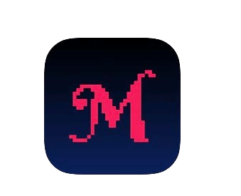

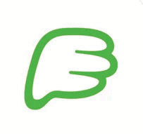
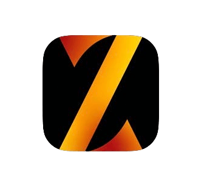
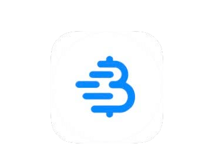

* **POCHI ZA HIFADHI BARIDI** - Zisizo za Ulinzi
Cold Card, Trezor, Foundation Passport,
Blockstream Jade, Seed Signer, Bitbox,

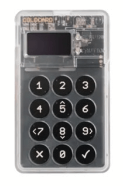

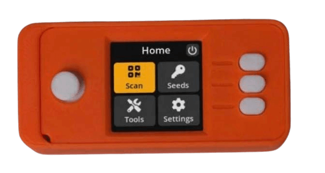

>* **DAIMA** nunua pochi yako ya hifadhi baridi **moja kwa moja
  kutoka kwa mtengenezaji,** ili kuwa na uhakika haijachakachuliwa.

---

## KUWEKA POCHI
* Mfuatilie @BTCSessions kwenye YouTube kwa mafunzo bora
  ya kuweka pochi, na mengine mengi.

>* Unapoweka pochi yako, hakikisha
>***unaandika Neno la Msingi la Maneno 12 au 24 kwenye karatasi.***
>* ***Iiweke nje ya mtandao. Usiwahi kuichukua picha ya skrini.***
>* **HIFADHI NENO LA MSINGI SALAMA SANA.**
>* **SALAMA SANA, SANA!**

* Kampuni nyingi hutengeneza sahani za chuma za "seed"
  ambazo unaweza kuchonga neno lako la msingi kwa ulinzi zaidi dhidi ya moto/maji/uharibifu. Ninapendekeza sana!
* Ukipoteza ufikiaji wa pochi yako moto au baridi,
  unaweza kuirejesha kwa neno la msingi na kurejesha
  fedha zako.
* Unaweza kufanya hivyo kwenye pochi yoyote inayounga mkono aina hiyo hiyo
  ya neno la msingi la BIP39 (maneno 12/24).
* Utendaji bora utakuwa kuhifadhi "wallet descriptor"
  ya pochi yako mbali na neno lako la msingi.
>* **KUMBUKA: Yeyote aliye na neno lako la msingi ana
  ufikiaji wa bitcoin yako!**

---
## KUHUSU FARAGHA
* Faragha wakati wa **kununua (bila KYC), kulinda, kuhifadhi
  na kutumia** bitcoin inazidi kuwa muhimu zaidi,
  haswa kutokana na matukio ya hivi karibuni ya
  akaunti za benki kukamatwa/kufungwa.
>* Kwa kuongeza, **faragha ya jumla ya kidijitali ni muhimu ikiwa
  unataka kupata uhuru wa mtandaoni, na kujilinda dhidi ya ufuatiliaji usiofaa na ulaghai.**

* Chini ni baadhi ya huduma zinazozingatia faragha hivi sasa.
* Ni zaidi ya upeo wa kitabu hiki kuingia kwa undani
  katika kila moja ya yafuatayo, kwa hivyo fanya utafiti wako mwenyewe (DYOR) kabisa, na
  fuatilia akaunti ninazotaja hapa chini kwenye Nostr au
  Twitter kwa sasisho.

>*Faragha ni muhimu kwa jamii huru katika umri wa elektroniki.
  Faragha si usiri. Jambo la faragha ni jambo ambalo
  mtu hataki ulimwengu mzima lijue, lakini jambo la siri ni
  jambo ambalo mtu hataki mtu yeyote ajue. Faragha ni
  uwezo wa kujifunua mwenyewe kwa ulimwengu kwa kuchagua.*

\~Eric Hughes, Kutoka ‘A Cypherpunk’s Manifesto’

---

---

# Chapter 7

# KUHUSU FARAGHA
## MWONGOZO WA USIRI
* Bitcoiner.guide @BitcoinQ_A
* Econoalchemist.com @econoalchemist
* Sethforprivacy.com @sethforprivacy
* diverter.hostyourown.tools @Diverter_NoKYC
* Citadeldispatch.com @ODELL kwenye Nostr
* KYCnot.me
* Lopp.net @lopp > Bonyeza Rasilimali > Faragha
* Privacytools.io
* Enegnei.github.io
* Restoreprivacy.com @ResPrivacy
* Keepitsimplebitcoin.com @KISBitcoin
* nbtv.media @naomibrockwell

## VPN (Mtandao Binafsi Pepe Kuficha Mtoa Huduma wako wa Mtandao)
* Mullvad.net - Lipa kwa bitcoin
* IVPN.net - Lipa kwa bitcoin

## APP ZA UDHIBITISHAJI WA HATUA MBILI
* Yubi Key - Kifaa
* 2FAS - Programu ya Android pekee
* Bitwarden Authenticator - Programu ya Android & iOS

## BROWSER ZILIZOLENGWA KWENYE USIRI
* TOR
* Firefox Focus
* Mullvad Browser
* Duck Duck Go
---
## APP YA 'VIDOKEZO' ILIYOSIMBIWA
* StandardNotes.com
## MITAMBO YA UTAFUTAJI ILIYOLENGWA KWENYE USIRI
* Duck Duck Go
* Kagi - Inalipwa na haina matangazo
* SearXNG
* Swisscows
* Mojeek

## APP ZA UJUMBE ZILIZOLENGWA KWENYE USIRI
* Signal
* SimpleX
* Session
* Telegram - Mipangilio ya 'Soga ya Siri'
## KUENDESHA NODE YAKO MWENYEWE
* Bitcoin Knots
* Bitcoin Core
* Ronin Dojo
* Run Citadel
* Raspi Blitz
* Umbrel - Kama unaendesha nodi yako ya bitcoin juu yake pekee.
## SIMU ZA MKONONI/NAMBA ZA SIMU ZA MATUMIZI MOJA
* Endesha Graphene OS kwenye Android Pixel
* Silent.link - Inakubali bitcoin & Lightning
* Text Verified - Inakubali bitcoin

---

## MATUMIZI YA SIRI
* The Bitcoin Company
* Bitrefill
* Bit.Store
* Kumbuka: Soma daima maandishi madogo
## BOT YA ANUANI YA KUPOKEA YA SIRI
* PayNym
## MITANDAO YA KIJAMII ILIYOGATULIWA
* Nostr

> *Uwezekano wa kuwa hajulikani au
kujulikana kwa jina bandia unategemea wewe kutofichua
taarifa zozote za utambulisho kuhusu wewe mwenyewe
kuhusiana na anwani za bitcoin unazotumia. Ukichapisha
anwani yako ya bitcoin mtandaoni, basi una
kuunganisha anwani hiyo na miamala yoyote
nayo na jina ulilochapisha chini yake.
Ukichapisha chini ya jina la utambulisho ambalo
hujaliunganisha na utambulisho wako halisi, basi bado una jina bandia.*

~ Satoshi Nakamoto 2009-11-25

> *Kwa faragha kubwa zaidi, ni bora kutumia
anwani za bitcoin mara moja tu. Unaweza
kubadili anwani mara nyingi upendavyo.*

~ Satoshi Nakamoto 2009-11-25

---

---

# Chapter 8

# Kuondoa Fud ya Bitcoin
(Hofu Kutokuwa na Uhakika Mashaka)

* Chini ni baadhi ya hoja za kawaida dhidi, au hofu
kuhusu, bitcoin.
* Hizi hazina msingi, zikitokana na ujinga, au labda uelewa usio kamili.
* Ninatoa majibu mafupi kwa kila moja hapa, na mwishoni
utapata viashiria vya rasilimali zenye kina zaidi
zinazopinga FUD yote.

## BITCOIN INATUMIA NISHATI NYINGI SANA

>*Joto kutoka kwa kompyuta yako halipotei
ikiwa unahitaji kupasha joto nyumba yako… Ni
gharama sawa ikiwa unazalisha joto
na kompyuta yako.*

~ Satoshi Nakamoto 2010-08-09

>*Hapo awali, uzalishaji wa bidhaa kwa sababu tu
ni ghali unaonekana kuwa upotezaji mkubwa. Hata hivyo, bidhaa
ghali isiyoweza kughushiwa huongeza thamani mara kwa mara kwa kuwezesha
uhamishaji wa utajiri wenye manufaa. Gharama zaidi hurejeshwa
kila wakati muamala unawezekana au unafanywa
bei rahisi. Gharama, awali ikiwa upotevu kamili,
hulipwa kwa muda mrefu kupitia miamala mingi.*

~ Nick Szabo

Cypherpunk

---

* **Nishati ‘nyingi sana’ ni pendekezo la thamani ambalo lazima
lizingatie jinsi tunavyothamini kusudi la matumizi ya nishati.**

* **Mtu anapozingatia kuwa taa za Krismasi huko Marekani hutumia umeme mwingi kama mtandao mzima wa Bitcoin,** basi labda anaweza kuona kwamba yote ni ya kiasi!

* Kutumia nishati, hata nishati nyingi sana, kulinda
fedha ngumu zaidi, isiyoweza kudhibitiwa zaidi
ambayo binadamu amewahi kujua, inastahili zaidi.

* Katika kulinganisha matumizi ya nishati ya bitcoin na ile inayotumiwa na
mfumo wa zamani, pia tunahitaji kuzingatia ‘mrundiko kamili’ kwa pande zote mbili:

| Mfumo wa Bitcoin | Mfumo wa Zamani wa Fiat      |
| -------------------- | --------------------------- |
| Wachimbaji wa ASIC    | BIS                         |
| Nodhi                | Benki Kuu                   |
| Hifadhi za Vifaa    | Benki za Kitaifa/Kikanda    |
| Programu za Hifadhi   | Sekta ya Kijeshi ya Viwanda |
|                      | Vituo vya Hifadhi Data      |
|                      | Uchafuzi Halisi wa Fedha |
|                      | Usambazaji Halisi wa Fedha |
|                      | Programu za Benki Mtandaoni |
|                      | Mtandao wa ATM             |

* Kwa kutumia bitcoin, hatimaye tutapunguza matumizi ya nishati
katika maeneo mengine mengi, hasa
kwa kutohitaji tena Sekta ya Kijeshi ya Viwanda
kulinda dola ya petroli.

---

* Pia, matumizi mabaya yanayohitajika
ili kuweka mfumo unaotegemea deni ukiendelea, hatimaye yatapunguzwa, kwani
**fedha ngumu kwa asili huchochea
matumizi na uwekaji akiba wa busara** (kwani akiba yako
itatunza thamani yake, dhana ambayo hatujaipitia tangu kuondoka kwenye kiwango cha dhahabu).
* **Mwisho, na muhimu, uchimbaji wa bitcoin tayari
unapunguza uchafuzi wa mazingira kwa kukamata gesi asilia inayowaka
na kuitumia kuwasha wachimbaji.** Kwa kuwa wachimbaji hutafuta
gharama nafuu za umeme, pia kuna uwezekano mkubwa wa kuwa
kivutio kikuu kuelekea nishati mbadala ya gharama nafuu, kwani
motisha zinalingana.
* **Uchambuzi wa kina kuhusu Bitcoin na Nishati** umeandikwa na Daniel Batten kwenye batcoinz.com, Troy
Cross, Jyn Urso, video 'This Machine Greens'
na Swan Bitcoin kwenye YouTube, 'Dirty Coin', documentary
ya uchimbaji wa bitcoin, na
kipindi bora cha kipindi cha ‘What is Money’
(WiM161) na B.Quittem, miongoni mwa wengine wengi.

---

## BITCOIN NI PONZI
* **Bitcoin si Ponzi:**
 * Wawekezaji wa zamani hawalipwi pesa yoyote na wawekezaji wapya.
 * Unaponunua bitcoin, hakuna anayeahidi faida
kwenye uwekezaji wako.
 * Hakuna uongozi au timu ya matangazo.
 * Hakukuwa na uchimbaji wa awali.
 * **Soma:** ‘Why Bitcoin is Not a Ponzi’ na Lyn Alden
kwa maelezo zaidi.

## BITCOIN NI POLEPOLE SANA
* Ingawa safu ya msingi ya Bitcoin ni polepole, safu ya 2
na safu
**Lightning Network iliyojengwa juu ya safu ya msingi ni…
kasi ya umeme!**
* Mtandao wa Bitcoin unaweza kushughulikia takriban miali 7
kwa sekunde (TPS).
* Mtandao wa Visa unadai unaweza kushughulikia hadi miali 24,000
TPS, ingawa 4,000 TPS ni karibu na matumizi halisi.
* **Lightning Network, suluhisho la safu ya pili
lililojengwa kwenye Bitcoin, lina uwezo wa
kushughulikia mamilioni ya miamala kwa sekunde!**

---

## SERIKALI ZINAWEZA KUIZUIA BITCOIN
* Baadhi ya serikali zimejaribu, kama Uchina, India na
Nigeria kwa mfano. Katika kila kisa, matumizi ya bitcoin
huongezeka haraka na watu wa nchi husika.
* **Hakuna njia kwa serikali kuizuia kweli ‘bitcoin’,** kwani kwa asili yake haina ruhusa na haizuiliwi na udhibiti. Ni kanuni na kanuni ni usemi.
* Hata hivyo, serikali zinaweza kufanya iwe ngumu zaidi kununua
na kuuza na, na kuingia kwenye fiat. Zinaweza pia kuitoza ushuru kama
bidhaa, kama wanavyofanya Marekani.
* **Hatimaye, haitakuwa kwa manufaa yao kujaribu kuizuia, kwani bitcoin ni ya lazima na wanaanza kuona hivyo.** Wangeweza kuwa na akili zaidi kuiweka kwenye mizania ya nchi yao kama kinga dhidi ya sarafu zao za fiat zinazopoteza thamani.

>*Serikali ni nzuri katika kukata
vichwa vya mitandao inayodhibitiwa kati
kama Napster, lakini mitandao halisi ya P2P
kama Gnutella na Tor zinaonekana
kujisimamia.*

~ Satoshi Nakamoto

* **Soma:**

Je, Serikali Inaweza Kuzuia Bitcoin? na Alex Gladstein,
CSO wa Human Rights Foundation

Je, Serikali Inaweza Kuzuia Bitcoin? Mambo Manne Unayohitaji
Kujua na Nick Giambruno

---

## BITCOIN NI TEKNOLOJIA YA ZAMANI
* **Zaidi kama ‘teknolojia ya mwisho’,** kuhusiana na uhaba wa kidijitali, ugatuzi na kutatua tatizo la matumizi-mara-mbili na tatizo la Byzantine General. Mara tu ikigunduliwa, haiwezi kugunduliwa tena.
* **Mara tu gurudumu lilipovumbuliwa, halikuweza kamwe kuvumbuliwa tena.**
* Itifaki ya TCP/IP ambayo intaneti inaendeshwa nayo imekuwa
kiwango cha mitandao yote ya kompyuta tangu
1983. Kuna uwezekano itaendelea kuwa kiwango kwa muda mrefu.
* Mara tu suluhisho kamili, teknolojia ya safu ya msingi itakapogunduliwa ambayo inafanya kazi kikamilifu, inaweza kudumu kwa mamia,
au maelfu ya miaka.

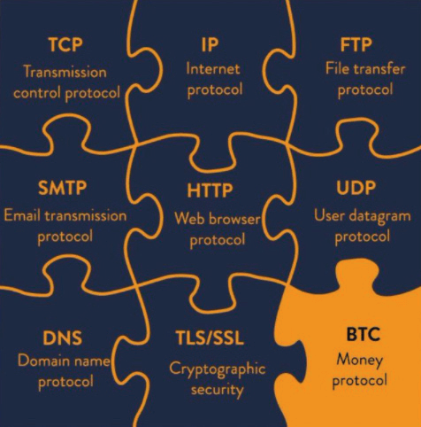

Credit: @DecouvreBitcoin

---

## BITCOIN INATUMIWA NA WAHALIFU
* **Ndivyo ilivyo dola, na kila sarafu nyingine ya fiat duniani.** Si sahihi tu kuhusisha tatizo hili na bitcoin pekee.
* **Bitcoin ni zana, kama kisu, na ni juu ya kila mmoja
wetu jinsi tunavyoitumia.**
* Kwa kupendeza, kama bitcoin isingeweza kutumiwa na wahalifu,
basi isingekuwa fedha isiyo na upendeleo, isiyoweza kudhibitiwa
ambayo dunia inahitaji sana.
* **Kumbuka:** Kwa kuwa blockchain ya Bitcoin inaweza kukaguliwa, ni
chaguo baya sana kwa shughuli za uhalifu!

## COMPUTING YA QUANTUM INAWEZA KUVUNJA BITCOIN
* Ingawa hii inaweza kuwa uwezekano siku moja hapo baadaye,
**watengenezaji tayari wanafanya kazi kutatua usimbaji fiche wa baada ya quantum**
* Bitcoin ni moja tu ya programu nyingi za mtandaoni zinazotegemea heshing ya SHA-256 kwa usalama.
Hata jeshi linaitumia, kwa hivyo kuna motisha kubwa zaidi ya jamii ya bitcoin kukuza
itifaki mpya za usimbaji fiche.
* Ikiwa SHA-256 itavunjwa, tutakuwa na mambo mengine mengi ya
kuhangaika nayo zaidi ya bitcoin. Mtandao mzima unaitumia
kwa usimbaji fiche. Hii inajumuisha benki zote, minyororo ya ugavi, mifumo ya usafirishaji, mifumo ya huduma za afya,
mifumo ya elimu na mengineyo.

---

## BITCOIN HAINATHAMANI HALISI
>*"Thamani ya Bitcoin inaendeshwa na uhaba wake unaoweza kutekelezwa"*

*~ Fidelity Digital Assets*

* **Uhaba ndio thamani. Fedha zote wakati wote zimethaminiwa kwa sababu zilikuwa na kiasi fulani cha uhaba.**

* Kwa kuongeza, ilitegemea imani kwamba itashikilia thamani yake, kama vile inaweza kubadilishwa baadaye kwa kitu kingine chenye thamani.

* Kadiri mtandao wa Bitcoin unavyokua, ukitegemezwa na sifa bora za kifedha inazojumuisha, athari ya mtandao inakua kwa kasi.

* Kadiri athari ya mtandao inavyokuwa kubwa, ndivyo thamani yake, kama rasilimali adimu, inavyoongezeka. Thamani ni kielelezo cha mahitaji, na kadiri mahitaji yanavyoongezeka, thamani huongezeka.

---

## BAADHI YA WATU WANA MENGI SANA
* Ni kweli kwamba baadhi ya watu wana mengi zaidi kuliko wengine.
**Kwa kutoa itifaki waziwazi, Satoshi aliiruhusu
kuenea kwa uhuru, na wale walioelewa uwezo iliokuwa nayo ama walichimba, au walinunua mapema. Ilikuwa njia ya haki na ya asili iwezekanavyo kuiwasilisha kwa ulimwengu.**

* Baada ya muda, wakati dunia itakapokuwa na bitcoinizing ya hali ya juu, ikimaanisha tutaishi kwa kiwango cha bitcoin, wale walio na mengi watayatumia kiasili kwenye uchumi.

* Ingawa kwa wakati fulani mtu hataweza tena kuinunua kwa fiat, watu watalipwa kwa kazi yao kwa bitcoin. Kulipwa kwa fedha halisi kutatuwezesha kuwa na akiba halisi ambayo haitapungua thamani kadiri muda unavyopita kutokana na mfumuko wa bei.

* Ingawa daima kutakuwa na wale walio na utajiri zaidi na wale walio na kidogo, kutokana na sababu nyingi, **kiwango cha bitcoin kitafanya utando kati ya madarasa ya utajiri upitike**, kama anavyosema Aleks Svetsi. Hii itaruhusu uhamaji wa juu na wa chini kuwa laini zaidi kuliko ilivyo leo.

* **Kuzaliwa na kuishi maisha yetu yote katika ulimwengu wa fiat, ni karibu haiwezekani kufikiria, na kuelewa kikamilifu athari za kuwa na fedha ambayo haiwezi kupunguzwa thamani au kudanganywa!**

---
## BITCOIN INABADILIKA-BADILIKA SANA
* **Hii ni kawaida wakati wa awamu ya ugunduzi wa bei ya mali mpya ya fedha.** Hakuna njia nyingine ya ukuaji kutokea wakati ni wa kiasili na unaoibuka (tofauti na wa juu-chini na unaodhibitiwa kikatikati).
* Kwa kuongeza, katika hatua hii ya uwepo wa binadamu, na mabadiliko ya kielelezo yanayotokea katika nyanja zote, inawezekana kwamba kitu kinacholeta Mapinduzi kama bitcoin kitakuwa na mabadiliko makubwa.
* Ingawa sisi tulio ndani kabisa ya 'shimo la sungura' tunaiona kama mustakabali, kwa sasa ni asilimia ndogo tu ya idadi ya watu duniani inayoshikilia bitcoin kwa wakati huu. Hii inaifanya iwe hatari kwa tete kubwa.
* Kadiri inavyokomaa, na kupitishwa kunavyoongezeka, tete itapungua, na hatimaye itatulia na kuwa kitengo cha hesabu.

>*Nina uhakika kwamba katika miaka 20 kutakuwa na kiasi kikubwa sana cha miamala au hakuna kiasi kabisa.*

~ Satoshi Nakamoto 2010-02-14

---

## HUWEZI KUGUSA BITCOIN

* **Hii ni sifa, si kasoro.** Ukweli kwamba bitcoin si ya kimwili ni mojawapo ya sababu kubwa zinazochangia kutoweza kunyang'anywa kwake!

## BITCOIN YAWEZA KUDUKULIWA

* Katika miaka 15 tangu kuzinduliwa kwake, haijawahi kudukuliwa.
* Kumekuwa na udukuzi katika soko za ubadilishaji hata hivyo, kwa hivyo napendekeza sana kuhamisha bitcoin yako kwenye hifadhi yako mwenyewe haraka iwezekanavyo.
* Imekadiriwa kuwa ili kuvunja usimbaji fiche wa SHA-256 (ambao bitcoin hutumia) ndani ya saa 24, kompyuta ya quantum ingehitaji qubits halisi 13,000,000. Kwa sasa, rekodi ya sasa ya qubit inayoshikiliwa na Atom Computing huko California ni qubits 1,180.
* Inadhaniawa sana kuwa njia salama ya usimbaji fiche wa quantum itatengenezwa vizuri kabla haijahitajika.

>*Kuwa chanzo wazi kunamaanisha mtu yeyote anaweza kukagua msimbo kwa uhuru. Kama ingekuwa chanzo kilichofungwa, hakuna anayeweza kuthibitisha usalama. Nadhani ni muhimu kwa programu ya aina hii kuwa chanzo wazi.*

*~Satoshi Nakamoto 2009-12-10*

---

## ZAIDI KUHUSU KUKATA FUD HAPA:

* Endthefud.org
* Bitcoinmythbusters.org
* Casebitcoin.com - Ukosoaji wa Kawaida
* Safehodl.github.io/failure/
* Lopp.net - Taarifa za Bitcoin: Dhana Potofu

>*Bitcoin ni tofauti kimsingi na mali nyingine yoyote ya kidijitali. Hakuna mali nyingine ya kidijitali inayoweza kuboresha bitcoin kama bidhaa ya kifedha kwa sababu bitcoin ndiyo (kulinganisha na mali nyingine za kidijitali) salama zaidi, yenye ugatuzi, fedha thabiti ya kidijitali na "uboreshaji" wowote lazima utakabiliana na maafikiano.*

~ Ripoti ya Fidelity Digital Assets, ‘Bitcoin First’, Jan 2022
Chris Kuiper, CFA, Mkurugenzi wa Utafiti
Jack Neureuter, Mchambuzi wa Utafiti

---

## KUHUSU BEI YA BITCOIN

* **Naona kuhodli (kushikilia) bitcoin kama kuwa na akiba ya muda mrefu.**
* Bei ya kila siku haina umuhimu, kwani inatarajiwa kuwa tete (kwenda juu na chini) kwa miaka kadhaa ijayo.
* Kama nilivyotaja hapo awali, hii ni kawaida kwa mali mpya inayopitia ugunduzi wa bei.
* Ukipanua chati ya bei ya BTC/USD, utaona imeongezeka kwa +31,296% tangu 2009, wastani wa ~200% kwa mwaka.
* Mabadiliko ya bei yanaakisi makala mbalimbali za habari, masasisho ya

---

# Chapter 9

# KWA NINI Bitcoin PEKEE?
Kati ya zaidi ya milioni 2.5* (!) za sarafu-fiche zilizowahi kuundwa,
na 13,000 zinazouzwa kwa sasa, bitcoin ndiyo pekee ambayo ni:

* **IMEVUNJWA madaraka KWELI**
* Ikiwa na **kitabu cha kumbukumbu kilichosambazwa KWELI**
* Ugavi **uliopunguzwa KWELI**
* **Kitabu cha kumbukumbu kisichoweza kubadilishwa KWELI**
* **Athari ya mtandao** iliyojengwa kwa zaidi ya miaka 15
* Na **sera ya fedha isiyoweza kuchezewa\!**
* Kila sarafu-fiche nyingine ina **kikundi kidogo, chenye madaraka ya kati kinachodhibiti ugavi, na/au kina uwezo wa kubadilisha itifaki ya msingi (sera ya fedha).**
* **Huu ni mfumo wa kibenki wa fedha za fiat tulio nao leo**
* Mamlaka ya kati kama hii inasababisha uchezaji na
rushwa.
* Tazama kashfa ya pump/dump ya altcoin iliyoelezwa kwenye
ukurasa unaofuata.
* **Sikiliza:**

Stephan Livera Pod (SLP306) na Guy Swann

* Orodha isiyokamilika ya rug-pulls za altcoin/defi tangu 2020:

**rekt.news/leaderboard/**

*coingecko.com/research/publications/
how-manycryptocurrencies-are-there

---

## PUMP NA DUMP ZA ALTCOIN
* Kwa kusikitisha, hizi ni halisi, na hutokea kila siku na 'cryptos/tokens' zingine isipokuwa bitcoin.
* Kuna matoleo mbalimbali, lakini mojawapo ya
aina za kawaida ni hii ifuatayo:

* **Tokeni Imeundwa:** Tokeni mpya ya crypto huundwa. Rahisi zaidi kuliko inavyosikika, mtu yeyote anaweza kuifanya kwa dakika chache.
* **Tovuti:** Mara nyingi, tovuti maridadi na ya kuvutia huundwa ili
kufanya tokeni ionekane halali.
* **Washawishi Wanaolipwa:** Hawa hulipwa ili kuitangaza kwenye mitandao ya kijamii,
Telegram n.k.
* **Vikundi vya Ndani Vinavyolipwa:** Taarifa hutumwa kwa viongozi wa
baadhi ya mamia ya Vikundi vya 'Biashara' au 'Uwekezaji', ambapo watu hulipa ada za kila mwezi au za kila mwaka ili
kupata 'intel ya ndani'.
* **Kabla ya Uzinduzi:** Washawishi wanaolipwa na viongozi wa vikundi wanaolipwa hununua kwanza, kwa bei ya chini kabisa.
* **Uzinduzi:** Tokeni 'huzinduliwa' na hawa washawishi
na viongozi wa vikundi, ambao huwaambia wafuasi wao: "Haraka,
nunua sasa!"
* **Pump:** Bei hupanda haraka huku wafuasi wao wakigombania kuingia mapema.
* Bei inayopanda haraka huwavutia watu wa kawaida kununua
kwa matumaini ya kutajirika.

---

* Hii kwa upande wake ina athari ya kupandisha bei
hata zaidi.
* **Dump:** Sehemu hii ya kusikitisha kawaida hutokea haraka. Katika hatua fulani, viongozi wa vikundi vinavyolipwa huuza tokeni zao, 'juu kabisa'. Kisha huwaambia wafuasi wao wauze.
* **Kupungua kwa Bei:** Kwa sababu watu wengi huuza kwa
wakati mmoja, na ukwasi kwa ujumla ni mdogo kwani ni
sarafu mpya, bei hushuka haraka.
* **Hofu:** Kushuka kwa bei huleta hofu miongoni mwa umma, ambao hawajui michezo hii ya siri, na wanaanza kuuza kwa hofu.
* **Waliobakia na Mizigo:** Mwisho wa hadithi hii ya kusikitisha ni kwamba wale
waliobakia 'wameshika mzigo', huenda wataishika mizigo yao
milele.
* Bila thamani halisi au misingi, nyingi ya tokeni hizi na sarafu-meme hazijawahi kurejesha bei ya soko.

---

## USALAMA NA KUEPUKA KASHFA
* **Shikamana na bitcoin pekee.**
* **Kuwa macho sana** kuhusu usalama wako wa mtandao\!
* **Fanya utafiti wako mwenyewe** na **linda bitcoin yako** kwa
uangalifu mkubwa.

>* **KAMWE usimpe maneno yako ya siri yeyote ambaye
  usingempa ufunguo wa akiba yako ya dhahabu\!**

* **KAMWE usibonyeze viungo vyovyote** kwenye barua pepe yako vinavyokuomba
uthibitishe maelezo ya akaunti ya aina yoyote. **Badala yake, nenda
kwenye tovuti rasmi moja kwa moja** na uangalie ikiwa una
arifa zozote zinazohitaji hatua.
* **UWE MAKINI** kwamba kuna bidhaa bandia nyingi zisizo na kikomo za
akaunti zenye wafuasi wengi kwenye mitandao ya kijamii. Ikiwa
mshawishi anakutumia DM bila mpangilio, huenda ni kashfa.
* **EPUKA kashfa zote zinazojitokeza kwenye akaunti za mitandao ya kijamii**
zinazoahidi kuongeza mara mbili bitcoin yako ukizituma kwao\! Utapoteza bitcoin yako\!
* **EPUKA kashfa hizo hizo za 'ongeza mara mbili crypto yako'** kwenye
YouTube.
* **HAKIKISHA** kuhusu anwani unayotumia bitcoin yako, kwani miamala haiwezi kurejeshwa. Afadhali
angalia anwani nzima, hasa ikiwa ni kiasi kikubwa.

---

# Chapter 10

# SAA YA SATOSHI NAMBA 369

**Bitcoin imeundwa kuchimba vitalu 6 kwa saa >> kitalu kimoja
kwa wastani kila baada ya ~dakika 10.**

* Masaa 24 kwa siku

2+4=**6**

* Hiyo inafanya kuwa vitalu 144 kwa siku

1+4+4=**9**

* Vitalu 52560 kwa mwaka

5+2+5+6+0=18

1+8=**9**

* Vitalu 52704 kwa mwaka wa kuruka

5+2+7+0+4=18

1+8=**9**

* Sarafu Milioni 21:

2 + 1 + 0 + 0 + 0 + 0 + 0 + 0 = **3**

* Nusu 33:

3 + 3 =**6**

* Ugumu unajirekebisha kila baada ya vitalu 2016:

2 + 0 + 1 + 6 = **9**

~ Kulingana na tweet na @level39

* Kupungua kwa nusu kwa tuzo ya kizuizi hutokea kila
kitalu cha 210,000 (takriban kila miaka minne)
2 + 1 + 0 + 0 + 0 + 0 = **3**

---

>*“Kama ungelijua tu ukuu wa 3, 6 na 9, basi
ungelikuwa na ufunguo wa ulimwengu.”
~ Nikola Tesla*

## ZAWADI YA KITALU = % YA UGAVI

* Ruzuku ya kizuizi (idadi ya bitcoins zinazotuzwa kwa kila kizuizi kipya kilichochimbwa) inawakilisha **asilimia ya ugavi wote** ambao utachimbwa katika kipindi hicho

* Kwa mfano, tuzo ya kizuizi cha sasa kati ya
2024-2028 ni **3.125** bitcoin.

* Katika miaka hiyo minne, **3.125**% ya bitcoins milioni 21 zitachimbwa.

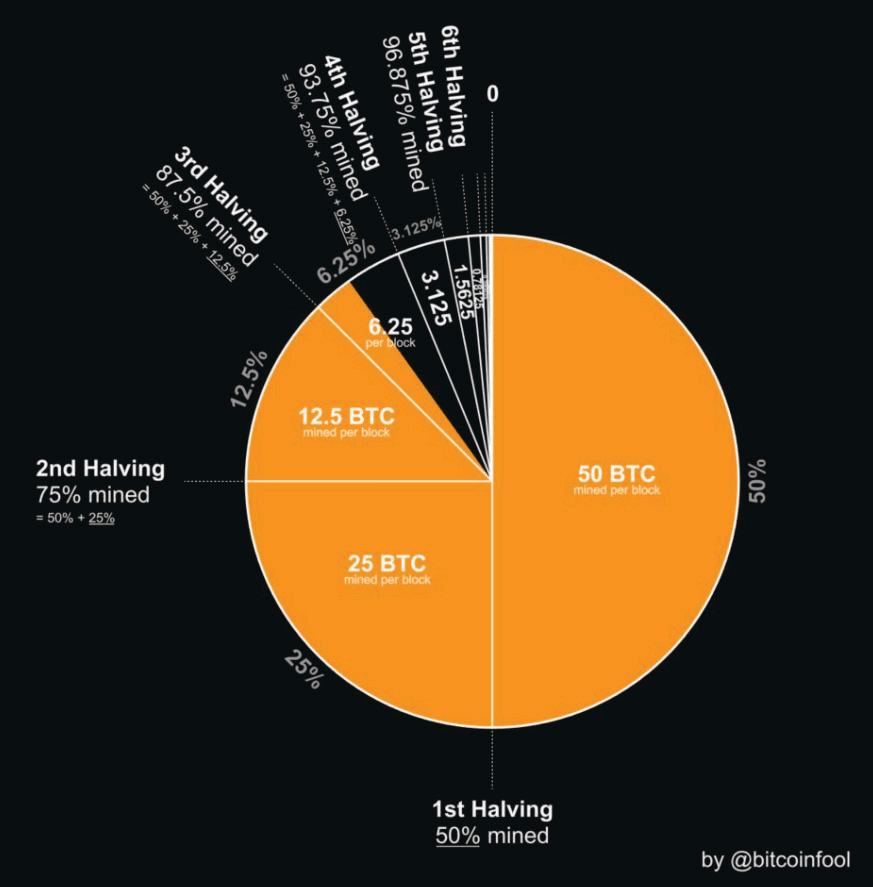

Mchango: @bitcoinfool

---

## ENZI ZA ZAWADI

* Kila baada ya miaka minne, ruzuku ya bitcoin hupunguzwa kwa nusu kwa kila
kitalu kilichochimbwa. **Enzi ya Zawadi ni kipindi hicho cha miaka minne.**

* **Enzi ya zawadi 1:** 2009-2012 **Ruzuku ya kitalu:** 50 bitcoin
= (50 bitcoin * vitalu 210,000) = 10,500,000 bitcoin

1+0+5+0+0+0+0+0 = **6**

* **Enzi ya zawadi 2:** 2012-2016 **Ruzuku ya kitalu:** 25 bitcoin
= (25 * 210,000) = 5,250,000 bitcoin

5+2+5+0+0+0+0 = 12

1+2 = **3**

* **Enzi ya zawadi 3:** 2016-2020 **Ruzuku ya kitalu:** 12.5 bitcoin
= (12.5 * 210,000) = 2,625,000 bitcoin

2+6+2+5+0+0+0 = 15

1+5 = **6**

* **Enzi ya zawadi 4:** 2020-2024 **Ruzuku ya kitalu:** 6.25 bitcoin
= (6.25 * 210,000) = 1,312,500 bitcoin

1+3+1+2+5+0+0 = 12

1+2 = **3**

* **Enzi ya zawadi 5:** 2024-2028 **Ruzuku ya kitalu:** 3.125 bitcoin
= (3.125 * 210,000) = 656,250 bitcoin

6+5+6+2+5+0 = 24

2+4 = **6**

* **Enzi ya zawadi 7: 2032-2036 Ruzuku ya kitalu:** 0.78125 btc
= (0.78125*210,000) = 164,062.5 bitcoin

1+6+4+0+6+2+5 = 24

2+4 = **6**

**... na kuendelea hadi 2140**

---

## SIKU YA KUZALIWA YA SATOSHI

* ***Aprili 5, 1975*** ndiyo tarehe Satoshi aliyodai kuwa siku yake ya kuzaliwa.
* Ingawa hatuwezi kujua kama hii ilikuwa kweli tarehe yake halisi ya kuzaliwa, inavutia sana.
* ***Aprili 5*** (1933) ilikuwa siku ambayo Amri Kuu Namba 6102 ilitiwa saini na Rais wa Marekani Franklin D. Roosevelt “ikikataza uhifadhi wa sarafu za dhahabu, vigingi vya dhahabu, na vyeti vya dhahabu ndani ya Marekani bara.”
* ***1975*** ilikuwa mwaka ambao kufutwa kwa EO 6102 kulianza kutumika, na raia wa Marekani waliruhusiwa tena kushikilia zaidi ya wakia 5 za dhahabu.

## PALINDROMU YA NAMBA 6102-2016

* ***6102*** ilikuwa namba ya Amri Kuu iliyotajwa hapo juu.
* ***2016*** ni idadi ya vitalu vilivyochimbwa wakati wa kila marekebisho ya ugumu (takriban wiki 2).

>* Katika mifano yote miwili hapo juu, mtu anaweza
kudhani kwamba Satoshi alikuwa akitumia namba
kuashiria mabadiliko, **kukomesha
uharibifu uliosababishwa na serikali kuvuka mipaka.**

---

## SIKU YA PIZZA YA BITCOIN

* Mei 22 inajulikana kama Siku ya Pizza ya Bitcoin. Hii ilikuwa
siku ambayo jamaa mmoja, anayeitwa Laszlo Hanyecz, alitangaza
kwenye bitcointalkforum.org kwamba alikuwa amefanikiwa
amebadilisha bitcoin 10,000 kwa pizza! Wakati huo ilikuwa kama $40.
* Kwa bei za leo, hiyo ingekuwa takriban $610,000,000.
* Ilikuwa hatua muhimu kwa bitcoin, kwani ilikuwa tukio la kwanza linalojulikana la mtu kubadilisha bitcoin kwa
bidhaa au huduma. Tumeendelea mbali kiasi gani!

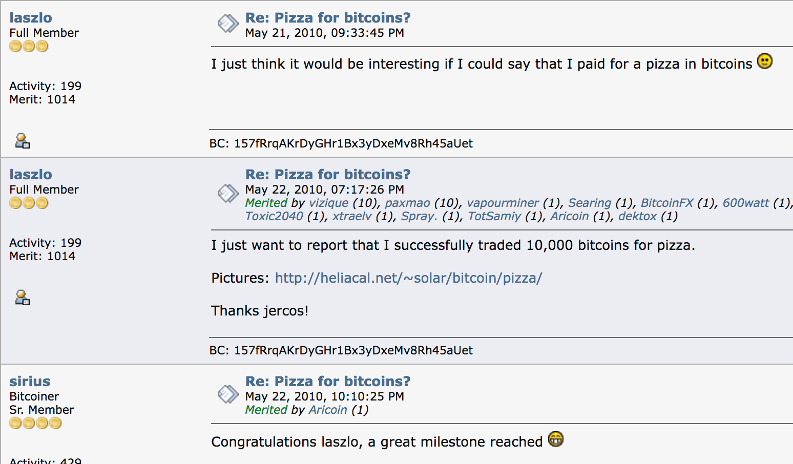

---

## KALENDA YA BITCOIN YA SIKU MUHIMU

**2008-08-18** ~ Jina la kikoa **bitcoin.org lilisajiliwa.**

**2008-10-31** ~ **Siku ya Karatasi Nyeupe ya Bitcoin:** Karatasi Nyeupe,
iliyopewa jina "Bitcoin: Mfumo wa Fedha Taslimu wa Kielektroniki wa Peer-to-Peer"
ilichapishwa na mwandishi wa siri asiyejulikana anayeitwa Satoshi
Nakamoto kwenye metzdowd.com, orodha ya barua pepe ya kriptografia.

**2009-01-03** ~ **Siku ya Kuzaliwa ya Bitcoin:** Mtandao wa Bitcoin ulikuwa
imezinduliwa, wakati Satoshi alichimba kitalu cha Mwanzo.

**2009-01-12** ~ **Muamala wa kwanza wa bitcoin** ulifanyika, wakati Hal
Finney alipokea bitcoin kumi kutoka kwa Satoshi kama jaribio la kutuma.

**2009-10-05** ~ **Kuzaliwa kwa ubadilishanaji wa kwanza wa bitcoin,** The New
Kiwango cha Uhuru (NLS), na bei ya soko iliyoorodheshwa ya $0.00764
kwa sarafu.

**2009-10-12** ~ "Nimepata **muamala wa kwanza unaojulikana wa bitcoin kwenda USD kutoka kwenye nakala rudufu za barua pepe zangu. Niliuza BTC 5,050 kwa $5.02 mnamo 2009-10-12." - Martti Malmi, mwanzilishi wa bitcointalk.org, aliuza
bitcoin kwa NewLibertyStandard ambaye alianza ubadilishanaji wa kwanza.**

**2010-05-22** ~ **Siku ya Pizza ya Bitcoin:** Tukio la kwanza linalojulikana la
bitcoin inatumika kununua bidhaa au huduma, wakati Lazslo
Hanyecz alilipa bitcoin 10,000 kwa pizza mbili za Papa John!

**2010-12-12** ~ **Mara ya mwisho** ambayo Satoshi alichapisha kwenye
jukwaa la bitcointalk.org.

**2011-02-11** ~ **Bitcoin inafikia usawa** na Dola ya Marekani kwa
mara ya kwanza.

**2011-06-14** ~ **Wikileaks** inaanza kukubali michango katika bitcoin.

**2017-03-03** ~ **Bitcoin inafikia usawa** na wakia ya dhahabu.

**2021-08-21** ~ **Siku ya Kwanza ya Mwaka ya Usiokwisha wa Bitcoin** iliyopendekezwa na
Meme ya Knut Svanholm:
Kila kitu kimegawanywa na milioni 21.

**2021-09-07** ~ El Salvador inakuwa nchi ya kwanza kufanya
bitcoin fedha halali.

---

---

# Chapter 11

# RASILIMALI ZA SHIMO LA  BITCOIN RABBIT
"Kushangaza zaidi na kushangaza zaidi!" alisema Alice

## FILAMU
* Unaweza kupata filamu hizi kwenye YouTube au Rumble.

## FILAMU ZA BITCOIN:

* @MaxDeMarco na @GetBasedTV kwenye YouTube
* Bitcointv.com
* Dirty Coin: Hati ya Uchimbaji wa Bitcoin (2024)
* Immutable Democracy: film.simpleproof.com (2023)
* Uwekaji Upya Mkuu na Kupanda kwa Bitcoin (2022)
* A Sly Roundabout Way: aslyroundaboutway.com (2022)
* Where Did Bitcoin Come From (2021)
* This Machine Greens (2021) Kuhusu Bitcoin & Nishati
* Bit X Bit: In Bitcoin We Trust (2018)
* Bitcoin Big Bang (2018) Kuhusu udukuzi wa 2014 Mt Gox
* Magic Money: The Bitcoin Revolution (2017)
* Banking on Bitcoin (2016)
* Deep Web (2015) Kuhusu Silk Road & Ross Ulbricht
* Bitcoin: The End of Money as We Know It (2015)
* The Rise and Rise of Bitcoin (2014)
* Bitcoin in Uganda (2014)

## FILAMU ZA MFUMO WA PESA ZA FIAT:

* How is Money Created (2020)
* Hidden Secrets of Money - Mike Maloney (2013-18)
* Who Controls All of our Money? (2017)
* How the Economic Machine Works - Ray Dalio (2013)
* Inside Job (2010) - Matukio yanayoongoza hadi kuanguka kwa 2008
* The Money Masters (1996)

---

## VITABU
**Kuhusu Bitcoin:**
* **Layered Money** na Nik Batia
* **21 Lessons** na DerGigi
* **The Bullish Case for Bitcoin** na Vijay Boyapati
* **The Bitcoin Standard** na Saifedean Ammous
* **Inventing Bitcoin** na Yan Pritzker
* **Check Your Financial Privilege** na Alex Gladstein
* **Why Buy Bitcoin** na Andy Edstrom
* **Bitcoin Audible:** Guy Swann anasoma vitabu vya Bitcoin
* **The Bitcoin Dictionary** na Ansel Lindner
* **The Genesis Book** na Aaron van Wirdum
* **Gradually, then Suddenly** na Parker Lewis
* **Cryptosovereignty** na Eric Cason

**Kuhusu Fiat, Historia ya Fedha na zaidi:**
* **The Price of Tomorrow** na Jeff Booth
* **Broken Money** na Lyn Alden
* **The Fiat Standard** na Saifedean Ammous
* **The Hidden Cost of Money** na Seb Bunney
* **Shells to Satoshi** na D Heikkinen na J Marquez
* **The Sovereign Individual** na Davidson & Rees-Mogg

## PODCASTS
**Sikiliza kwenye programu ya Fountain ili kutiririsha sats kwa wenyeji!
Ikiwa bado haupo kwenye Fountain, zipate hizi kwenye Spotify na iTunes.**
* **Citadel Dispatch** na Matt Odell
* **Bitcoin Rapid Fire** na John Vallis
* **Stephan Livera Podcast** na Stephan Livera
* **Coin Stories** na Natalie Brunell
* **Access Tribe's Bitcoin Podcast** na Krista Edmunds
* **The Bitcoin Standard Podcast** na Dk S. Ammous
* **Once Bitten** na Daniel Prince
* **Rabbit Hole Recap** na Matt Odell na Marty Bent
* **Bitcoin for Peace** na DJ Valerie B Love

---
* **The Bitcoin Matrix** na Cedric Youngelman
* **Bitcoin Fixes This** na Jimmy Song
* **Orange Pill Podcast** na Max Keiser na Stacy Herbert
* **What Bitcoin Did** na Peter McCormack
* **Bitcoin Audible** Guy Swann anasoma vitabu/makala

## KOZI ZA BURE
* **My First Bitcoin** - Mtaala wa Bitcoin
* **Saylor Academy** - Bitcoin kwa Kila Mtu
* **Looking Glass Education** - Kozi za Fedha & Bitcoin

## TOVUTI
* Nakamotoinstitute.org
* Bitcoin-only.com
* Bitcoin Wiki - En.bitcoin.it
* WhyBitcoinOnly.com
* Wtfhappenedinfeb2023.com
* Lopp.net
* Casebitcoin.com
* Bitcoiner.guide
* Bitcoin.tv
* Learnmeabitcoin.com - Mfafanuzi mzuri rahisi wa teknolojia ya btc!
* Hope.com
* Bitcoin-resources.com
* Myfirstbitcoin.io (Inapatikana pia kwa Kihispania)
* Whatisbitcoin.com
* SatoshisJournal.com
* github.com/bitcoin

## KWA WATOTO
* **PlayShamory.com** - Vinyago, michezo & vitabu incl.
* **Satoshi Nakamoto & His Bitcoin Invention**
* **Bitcoin Money** Na Michael Caras
* **Bitcoin Trading Cards** - btc-tc.com
* **Bitcoin Kids Comic Book** na Nzonda Fotsing Sr
* **Hodl Up** - Mchezo wa Bodi ya Uchimbaji wa Bitcoin
* **21 Bitcoin Lessons** - freemarketkids.com
* **What is Bitcoin?** - @TuttleTwins kwenye YouTube

---

## BT ~ BITCOIN TWITTER
Baadhi ya cypherpunks, akili, mbuzi & wazimu wa kuwafuata!
Kupitia akaunti hizi, utapata maelfu ya plebs
na wasomi wengine,
wote kwenye safari.
BT, pamoja na bitcointalk.org na Reddit, kwa kiasi kikubwa imekuwa
ambapo jaribio hili limekua,
na sasa imeunganishwa na Nostr,
itokali ya mawasiliano iliyogatuliwa,
zote zinafunguka kwa wakati halisi, katika wakati na nafasi,
katika etha za mtandao, iliyounganishwa na ya kimwili,
kupitia sisi sote,
wanadamu,
tukishiriki maono ya ulimwengu uliogatuliwa.
Halafu kuna wale watulivu, wasanidi programu wanafanya kazi
nyuma ya pazia
bila ambaye
hakuna haya yangekuwa yanawezekana.
Sisi sote
pamoja,
tumeachiliwa,
kama bitcoin ilivyoachiliwa kwetu,
baraka isiyopimika.

**MADA ZINAJUMUISHA:** Bitcoin, Uthibitisho-wa-Kazi, Faragha, Falsafa,
Historia ya Pesa, Kanuni, Uchimbaji wa Bitcoin, Sosholojia, Mchezo
Nadharia, Uchumi wa Austria, Elimu ya Bitcoin, Umeme
Mtandao, Mazingira ya Udhibiti, Matumizi ya Nishati ya Bitcoin,
Wasani wa Msingi, Jumuiya za Bitcoin, Mustakabali wa Bitcoin na zaidi.

**Onyo:** Inasaidia kuwa na ngozi nene kidogo kwenye twitter,
na ujue hili, kuna shauku nyingi katika utetezi wa
bitcoin. Kuweka mstari wazi kati yake na yote
altcoins inahitaji kazi. Kudumisha uwazi, usalama na
usafi wa pesa pekee yenye sauti ambayo ulimwengu umewahi
kujua ni muhimu, ikiwa tunapaswa kuwa na nafasi katika nyakati hizi
zinakuja.

---

Adam Back - @adam3us

Allen Farrington - @allenf32

Anil - @anilsaidso

Anita Posch - @AnitaPosch

Arman the Parman - @parman_the

Beautyon - @Beautyon_

Bitcoin Q+A - @BitcoinQ_A

BTC Sessions - @BTCsessions

BTC Times - @btc

Brandon Quittem - @Bquittem

D++ - @D_plus__plus

Daniel Batten - @DSBatten

Daniel S Pico - @BTCGandalf

Deterministic Optimism - @nvk

Efrat Fenigson - @efenigson

Erik Cason - @Erikcason

Giacomo - @giacomozucco

Gigi - @dergigi kwenye Nostr

Guy Swann - @TheGuySwann

Jack - @jack kwenye Nostr

Jameson Lopp - @lopp

Jeff Booth - @JeffBooth

Jimmy Song - @jimmysong

Knut Svanholm - @knutsvanholm

Luke Dash Jr - @LukeDashjr

Lyn Alden - @LynAldenContact

Marty Bent - @MartyBent

Matt Odell - @ODELL kwenye Nostr

Mechanic - @GrassFedBitcoin

Michael Saylor - @saylor

Natalie Brunell - @natbrunell

Natalie Smolenski - @NSmolenski

Nick Szabo - @NickSzabo4

Nik Bhatia - @timevalueofbtc

Parker Lewis - @parkeralewis

Pavlenex - @pavlenex

Pleb Lab - @PlebLab

Preston Pysh - @PrestonPysh

Seb Bunney - @sebbunney

Tomer Strolight - @TomerStrolight

Troy Cross - @thetrocro

Vijay Boyapati - @real_vijay

**Asante nyote kwa kunifundisha kila siku!**

---

---

# Chapter 12

# MIRADI YA JUMUIYA YA BITCOIN
Ifuatayo ni baadhi ya miradi ya mashinani duniani kote inayofanya kazi ya kuelimisha na kuunda uchumi wa ndani kwa kutumia bitcoin.

Wafuate kwenye Nostr au Twitter ili kujifunza zaidi au kutoa mchango:

* **Bitcoin Beach El Zonte** - El Salvador - @Bitcoinbeach
* **Bitcoin Ekasi** - Afrika Kusini - @BitcoinEkasi
* **Bitcoin Beach Brazil** - Brazil - @BitcoinBeachBR
* **Bitcoin Jungle** - Costa Rica - @BitcoinJungleCR
* **Bitcoin Venezuela** - Venezuela - @btcven
* **Bitcoin Bay** - Florida, USA - @bitcoinbaytpa
* **Bitcoin Lake**- Ziwa Atitlan - @LakeBitcoin
* **Bitcoin House** Bali - Indonesia - @btchousebali
* **7 Mile Bitcoin** - Visiwa vya Cayman - 7milebitcoin.org
* **Bitcoin Kampala** - Uganda - @BitcoinKampala
* **Bitcoin Retreat** - Ufilipino - @BtcRetreat
* **Bridge2Bitcoin** - Uingereza - @Bridge2Bitcoin
* **Bitcoin Berlin** - El Salvador - @BitcoinBerlinSV
* **Harlem Bitcoin** - New York, USA - @HarlemBitcoin
* **F.R.E.E Madeira** - Ureno - @FREEMadeiraOrg
* **Bitcoin Valley** - Rovereto, Italia

---

---

# Chapter 13

# MAWAZO YANAYOTOKANA NA BITCOIN
Pongezi kwa

Satoshi

na wote

walioingia kikamilifu

waotaji

waonaji

wachawi wa mfumo wa mawasiliano usiofuatiliwa

washairi wa uhuru

walinzi wa hekima

watu huru

wahifadhi wa mwisho

wakisonga mbele bila woga

peke yao pamoja

kwa ajili ya uhuru

Vires In Numeris!

---

## TAFFAKURI YA SHIMO LA UNGU

Bitcoin kwa kweli ni 'kitu' cha kuvutia

Isipokuwa si 'kitu'

Kwa maana huwezi kuigusa

Lakini inagusa mamilioni yetu

Duniani kote

Hivi karibuni itakuwa mabilioni..

Ni kweli kwamba

Ni biti na baiti za kidijitali

Algorithm na kanuni

0 na 1

Na kwamba kama kila nodi moja

Nodi ya kumbukumbu, nodi iliyopunguzwa na nodi nyepesi

Zingeharibiwa kwa namna fulani

Isingekuwepo tena

Kwa njia tunavyoijua

Tunaweza kuiona..

Hata hivyo, bado 'ingekuwepo'

Kwa maana kwamba fizikia ya quantum

Au mvuto

Upo

Bila kujali mtazamo wa binadamu..

Kwa maana kwamba hisabati ilikuwepo

Kabla ya wanadamu kuiweka katika kanuni

Walichagua alama kuiwakilisha..

Ukweli

Hautuhitaji

## KWA NINI THAMANI YOTE ITAJILIMBIKIZA KWENYE BITCOIN

Kuna nadharia za mchezo za kuvutia ambazo zinaonekana
kuungana linapokuja suala la bitcoin, na kufanya
uwezekano wa ukuaji wake na kuongezeka kwa thamani kwa muda
kuwa hakika zaidi na zaidi.

## SCHELLING POINT (KIUNGO CHA SCHELLING)

* Ilianzishwa katika miaka ya 1960 na mwanauchumi wa Marekani,
Thomas Schelling, kiungo cha Schelling kimsingi kinadai
kwamba **watu ambao hawawezi kuwasiliana
wanaweza bado kukubaliana juu ya uamuzi
au hatua, hasa wakati suluhisho la kulazimisha
kwa tatizo linajitokeza** (-> bitcoin)
* Kwa kuongezea, kadri watu wengi wanavyovutiwa na kiungo cha Schelling,
inavutia watu zaidi (-> bitcoin)

## LINDY EFFECT (ATHARI YA LINDY)
* Kimsingi, Athari ya Lindy inasema **kwamba kadiri wazo,
teknolojia au biashara imekuwepo,
ndivyo inavyowezekana kudumu.**

## METCALFE’S LAW (SHERIA YA METCALFE)

* Ilipata umaarufu kupitia Robert Metcalfe, ambaye alivumbua
Ethernet, miongoni mwa mambo mengine. Sheria ya Metcalfe inasema
kwamba **mtandao unakuwa na thamani zaidi kadiri unavyokuwa na watumiaji wengi.** Huduma huongezeka kimahesabu kadiri watumiaji wengi wanavyojiunga, na kuimarisha
mtandao.

---

## MTANDAO WA P2P
>*Ni hifadhidata iliyosambazwa kimataifa, na
nyongeza za hifadhidata kwa idhini ya
wengi...*

~ Satoshi Nakamoto 2009-02-18

Usambazaji wa Nodi za Bitcoin zinazoweza kufikiwa Ulimwenguni, Juni 2024

>*Matokeo yake ni mfumo uliosambazwa na
bila sehemu moja ya kushindwa. Watumiaji wanashikilia
funguo za crypto kwa pesa zao wenyewe na
wanafanya biashara moja kwa moja na kila mmoja, kwa
msaada wa mtandao wa P2P kuangalia
matumizi mara mbili.*

~ Satoshi Nakamoto 2009-02-11

---

## BITCOIN, MAWASILIANO YASIYO NA VURUGU & UKULIMA ENDELEVU

Mimi huona **Bitcoin,** iliyoletwa kwetu na Satoshi Nakamoto, kama msingi
wa jamii yenye afya kuhusiana na:

* **kuwasilisha thamani**
* **kufanya biashara na kubadilishana**
* **kuhifadhi muda/nguvu zetu za maisha**
katika ufunuo unaojitokeza, wa kimaumbile, wa uaminifu.

Mimi huona **Mawasiliano Yasiyo na Vurugu,** iliyoletwa kwetu na Marshall
Rosenberg PhD, kama msingi wa jamii yenye afya
kuhusiana na:

* **kuwasilisha hisia na mahitaji**
* **kusikiliza kwa kina, huruma**
* **kutafuta suluhisho za ubunifu shirikishi**
katika ufunuo unaojitokeza, wa kimaumbile, wa uaminifu.

Mimi huona **Ukulima wa Asili na Ukulima Endelevu,** iliyoletwa kwetu na
Wazee wetu, na hivi karibuni zaidi, Masunobu Fukuoka na Bill
Mollison kama msingi wa jamii yenye afya
kuhusiana na:

* **mawasiliano na dunia**
* **kulima chakula, kuponya udongo**
* **kutunza pori**
katika ufunuo unaojitokeza, wa kimaumbile na wa uaminifu

---

Kila moja ya teknolojia hizi, moja ya kihisabati, ikitupeleka
zaidi ya hisabati, moja ya lugha, ikitupeleka zaidi ya
lugha, moja ya kibiolojia, ikitupeleka zaidi ya biolojia,
zinatokana na Ukweli.

Ni juu yetu kuzitumia, kuishi ndani yake, na
kuziruhusu zituongoze zaidi na zaidi katika
uwezo mkuu tunaohisi ukisisimka kwenye ncha ya
mtazamo wetu.

**Tupate ujasiri, nguvu,
hekima na neema
kusonga mbele bila woga
kwenye safari**

---

---

# Chapter 14

# Azimio la Mwana-mapepe wa Mtandao

na Eric Hughes

**Faragha ni muhimu kwa jamii huru katika enzi ya kielektroniki.
Faragha si usiri. Jambo la faragha ni jambo ambalo mtu
hataki ulimwengu mzima kujua, lakini jambo la siri
ni jambo ambalo mtu hataki mtu yeyote kujua. Faragha ni
uwezo wa kujidhihirisha kwa hiari yako kwa ulimwengu.**

Ikiwa pande mbili zina aina fulani ya mwingiliano, basi kila moja ina
kumbukumbu ya mwingiliano wao. Kila upande unaweza kuzungumza kuhusu
kumbukumbu yake mwenyewe ya hili; nani anaweza kuzuia? Mtu
anaweza kupitisha sheria dhidi yake, lakini **uhuru wa kujieleza, hata
zaidi ya faragha, ni msingi kwa jamii huru;** hatutafuti
kuzuia usemi wowote. Ikiwa pande nyingi zinazungumza
pamoja katika jukwaa moja, kila moja inaweza kuzungumza na zingine zote
na kukusanya pamoja maarifa kuhusu watu binafsi na
pande zingine. Nguvu ya mawasiliano ya kielektroniki ime
wezesha hotuba ya kikundi kama hicho, na haitaondoka tu
kwa sababu tunaweza kutaka ifanye hivyo.

Kwa kuwa tunatamani faragha, lazima tuhakikishe kwamba kila upande wa
muamala una ujuzi tu wa kile kinachohitajika moja kwa moja
kwa muamala huo. Kwa kuwa habari yoyote inaweza
kuzungumzwa, lazima tuhakikishe tunafichua kidogo iwezekanavyo.
Katika hali nyingi, utambulisho wa kibinafsi sio muhimu. Ninaponunua
gazeti dukani na kumpa karani pesa taslimu, hakuna
haja ya kujua mimi ni nani.

Ninapomwomba mtoa huduma wangu wa barua pepe kutuma na kupokea
jumbe, mtoa huduma wangu hahitaji kujua ninazungumza na nani au
ninasema nini au wengine wananinena nini; mtoa huduma wangu
anahitaji tu kujua jinsi ya kufikisha ujumbe hapo na
kiasi gani ninawadaiwa ada. Utambulisho wangu unapofichuliwa
na utaratibu wa msingi wa muamala, sina
faragha. Siwezi hapa kujidhihirisha kwa hiari; lazima
nijidhihirishe daima.

---

Kwa hivyo, **faragha katika jamii huru inahitaji mifumo ya miamala isiyojulikana. Hadi sasa, pesa taslimu imekuwa mfumo mkuu
wa aina hiyo. Mfumo wa miamala isiyojulikana si
mfumo wa miamala ya siri. Mfumo usiojulikana unawawezesha watu binafsi kufichua utambulisho wao wanapotaka na tu
wanapotaka; hii ndio kiini cha faragha.**

Faragha katika jamii huru pia inahitaji kriptografia. Nikisema
kitu, nataka kisikike tu na wale ninaowakusudia.
Ikiwa maudhui ya hotuba yangu yanapatikana kwa ulimwengu, sina
faragha. Kusimba ni kuashiria hamu ya faragha,
na kusimba kwa kriptografia dhaifu ni **kuashiria kutokuwa na hamu kubwa sana
ya faragha. Zaidi ya hayo, kufichua utambulisho wa mtu
kwa uhakika wakati hali chaguo-msingi ni kutokujulikana kunahitaji
saini ya kriptografia.** Hatuwezi kutarajia serikali,
mashirika, au mashirika mengine makubwa, yasiyo na uso kutupa
faragha kwa hisani yao

Ni faida yao kuzungumza kutuhusu, na tunapaswa kutarajia
kwamba watazungumza. Kujaribu kuzuia hotuba yao ni kupambana
na ukweli wa habari. Habari haitaki tu
kuwa huru, inatamani kuwa huru. Habari huongezeka kujaza
nafasi ya kuhifadhi inayopatikana. Habari ni binamu mdogo,
mwenye nguvu zaidi wa Uvumi; Habari ni nyepesi zaidi kwa miguu, ina macho zaidi,
inajua zaidi, na inaelewa kidogo kuliko Uvumi.

**Lazima tutetee faragha yetu wenyewe ikiwa tunatarajia kuwa na yoyote.**
Lazima tukusanyike na kuunda mifumo inayoruhusu
miamala isiyojulikana kufanyika. Watu wamekuwa
wakitetea faragha yao wenyewe kwa karne nyingi kwa minong'ono,
giza, bahasha, milango iliyofungwa, mikono ya siri, na
wajumbe. Teknolojia za zamani hazikuruhusu faragha kali,
lakini teknolojia za kielektroniki zinaruhusu.

**Sisi Cypherpunks tumejitolea kujenga mifumo isiyojulikana. Tunatetea faragha yetu kwa kriptografia,**
kwa mifumo ya usambazaji barua isiyojulikana, kwa saini za kidijitali, na kwa pesa za kielektroniki.

---

**Cypherpunks huandika msimbo. Tunajua kwamba lazima mtu
aandike programu kutetea faragha, na kwa kuwa hatuwezi kupata
faragha isipokuwa sote tufanye hivyo, tutaiandika.** Tuna
chapisha
msimbo wetu ili Cypherpunks wenzetu waweze kuufanyia mazoezi na
kuuchezea.

**Msimbo wetu ni huru kwa wote kutumia, duniani kote.** Hatujali sana
kama hauungi mkono programu tunayoandika. Tunajua
kwamba programu haiwezi kuharibiwa na kwamba mfumo
uliosambazwa sana hauwezi kuzimwa.

Cypherpunks hukashifu kanuni juu ya kriptografia, kwani
usimbaji kimsingi ni tendo la faragha. Kitendo cha
usimbaji, kwa kweli, huondoa habari kutoka katika
uwanja wa umma. Hata sheria dhidi ya kriptografia hufikia tu hadi
mpaka wa taifa na mkono wa vurugu zake.

Kriptografia itaenea bila shaka duniani kote,
na pamoja nayo mifumo ya miamala isiyojulikana inayowezesha.

**Ili faragha ienee lazima iwe sehemu ya mkataba wa kijamii. Watu lazima waje na kwa pamoja waweke mifumo hii kwa manufaa ya wote.**
Faragha huenea tu hadi ushirikiano wa wenzako katika
jamii. Sisi Cypherpunks tunatafuta maswali yenu na hoja zenu na
tunatumai tunaweza kuwashirikisha ili tusijidanganye
wenyewe. Hata hivyo, hatutaondolewa kwenye
mkondo wetu kwa sababu wengine wanaweza kutokubaliana na malengo yetu.

Cypherpunks wanashiriki kikamilifu katika kufanya mitandao kuwa salama zaidi kwa faragha. Tutaendelea pamoja kwa kasi.
Mbele.

Eric Hughes <hughes@soda.berkeley.edu>
9 Machi 1993

(Msisitizo katika **bold** ni wangu)

---

## BAADHI YA WANA-MAPEPE WA MTANDAO WA MWANZO

**KATI YA WANA-MAPEPE WA MTANDAO WA MWANZO
tunaweza kuwashukuru kwa kuchangia
maendeleo ya pesa taslimu za kidijitali za rika-kwa-rika**

* **Satoshi Nakamoto** - Cypherpunk asiyejulikana aliyeanzisha bitcoin duniani mwaka 2009.
* **Nick Szabo** - Bit Gold 2005
* **Hal Finney**- 2004 Uthibitisho wa Kazi Unaoweza Kutumika Tena (RPoW),
Mwandishi wa PGP 2.0. Mtu wa pili kuendesha mteja wa bitcoin. Alipokea muamala wa kwanza wa bitcoin
wa bitcoin 10 kutoka kwa Satoshi Nakamoto
* **Wei Dai** - B-money 1998
* **Dk. Adam Back** - HashCash 1997 - Mkurugenzi Mtendaji
Blockstream
* **Douglas Jackson na Barry Downey** - E Gold
1996
 * **John Gilmore**
 * **Timothy C.May**
 * **Eric Hughes**
* **Philip Zimmermann:** 1991 PGP 1.0, zaidi
usimbaji wa barua pepe unaotumiwa sana unaotumika.
* **David Chaum** - Ecash 1983 na DigiCash 1989

---

---

# Chapter 15

# Karatasi Nyeupe ya Bitcoin
Iliyowasilishwa kwa ulimwengu kwenye metzdowd.com
2008-10-31

**na Satoshi Nakamoto**

Mtu asiyejulikana cypherpunk, ambaye mara ya mwisho aliwasiliana na jamii ya cypherpunk kwenye jukwaa la bitcointalk.org tarehe 2010-12-10.

Kwa kuondoka, aliruhusu Bitcoin kuwa jaribio la kweli katika
mazingira halisi. Kila anayefanya kazi juu yake ni mfanyakazi wa kujitolea kwa namna fulani
<- aliyehamasishwa na uwezo wa kuikomboa binadamu
kutoka katika minyororo ya mfumo wa fedha unaodhibitiwa, unaotegemea deni,
na badala yake, kushiriki katika mtandao wa malipo ya fedha wa kimataifa, usiohitaji uaminifu,
usiohitaji ruhusa, sugu dhidi ya udhibiti, adimu kweli, rika-kwa-rika, uliogatuliwa, ambao unachochea utaratibu mpya kuibuka kutoka katika
majivu ya fiat

**Sisi sote ni Satoshi**
>*The Times 03/Jan/2009 Kansela karibu ya mpango wa pili wa uokozi kwa benki*

~ Maandishi ya kichwa cha habari kutoka The Times of London,
iliyochorwa katika Kizuizi cha Bitcoin Genesis na Satoshi
Nakamoto tarehe 2009-01-03

---

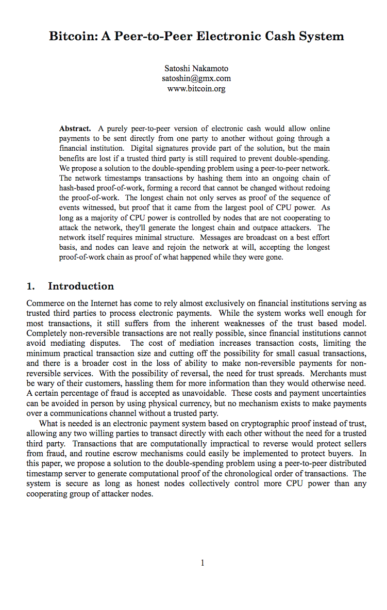

---

---

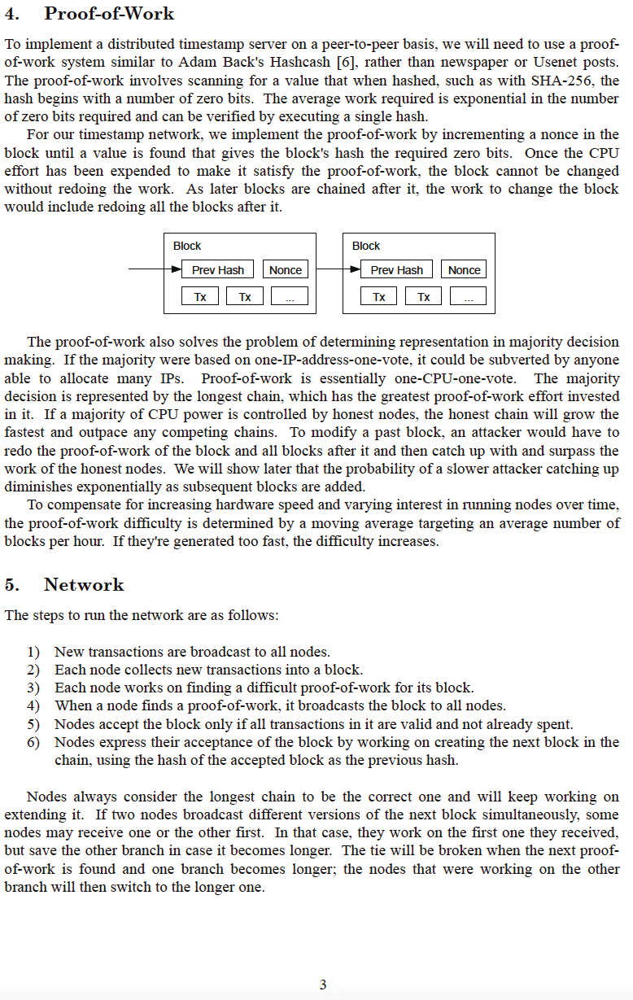

---

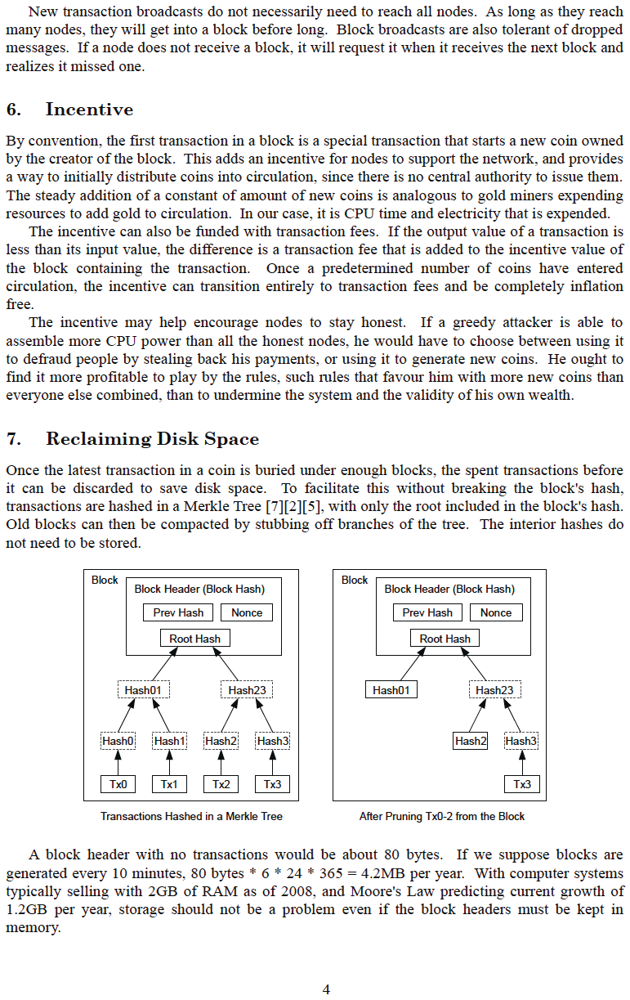

---

---
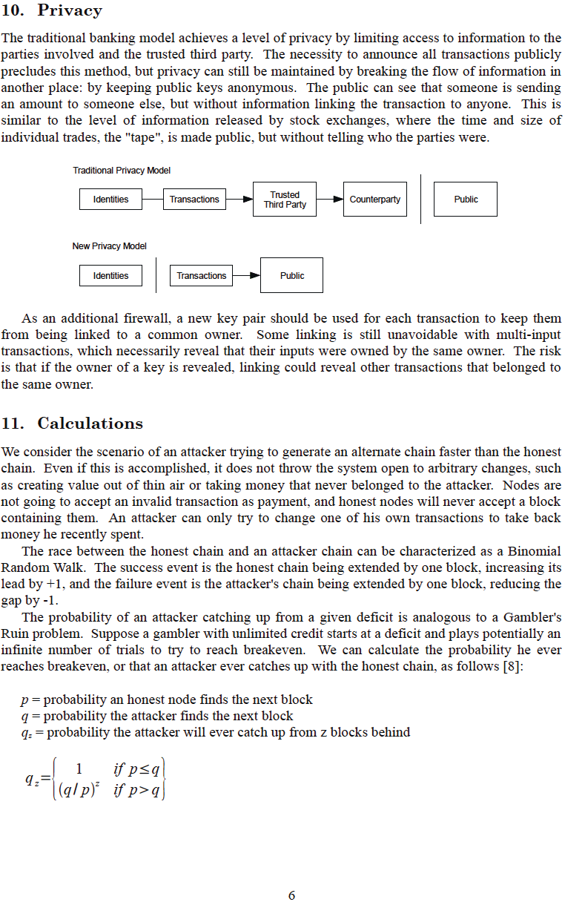

---

---

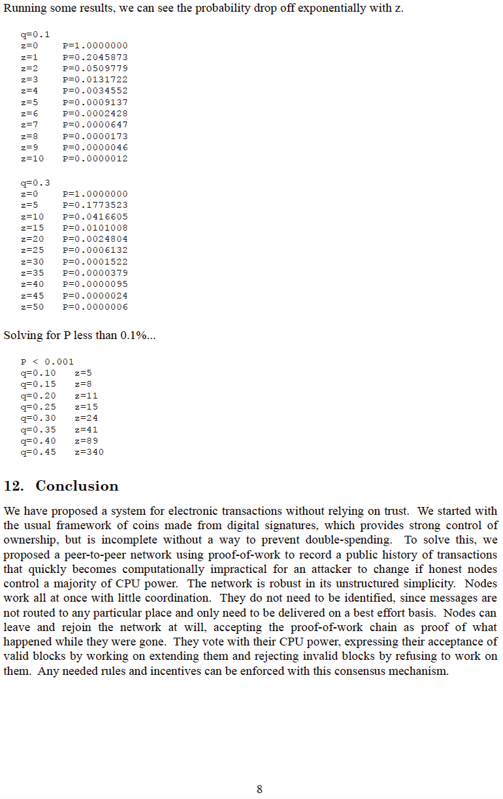

---

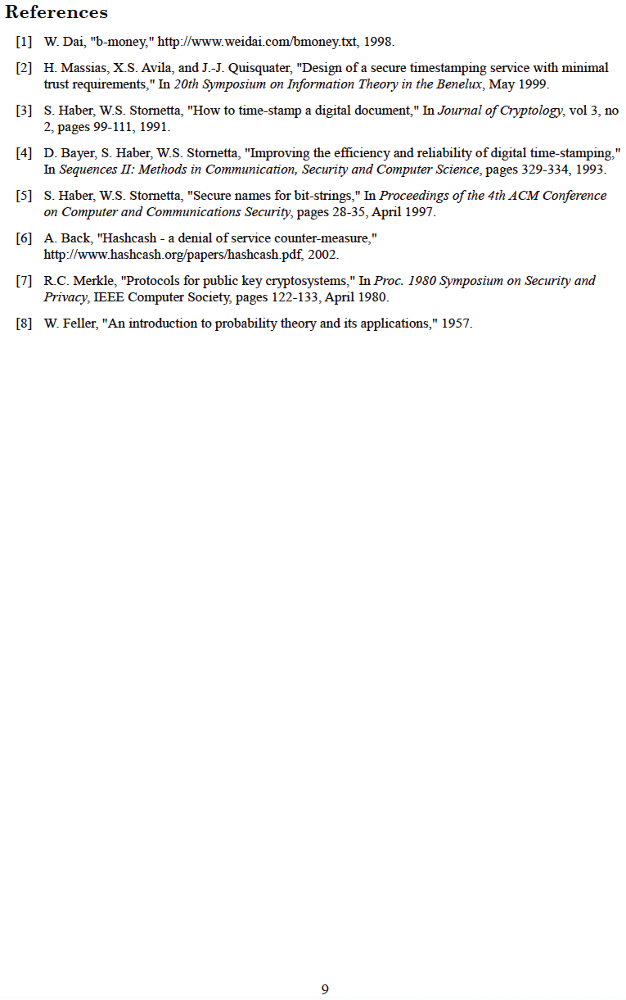

---

## Kizuizi cha Bitcoin Genesis ~ Toleo Ghafi la Hex 2009-01-03

na hivyo,

enzi mpya,

iliachiliwa

---

---

# Chapter 16

# NOSTR

## NOSTR & MAMBO MENGINE YANAYOSAMBAZWA NA RELAYS

>*Mtu anaweza kupitisha sheria dhidi yake, lakini uhuru wa
kujieleza, zaidi ya faragha, ni muhimu kwa
jamii huru; hatutaki kuzuia aina yoyote ya usemi kabisa.*

~ Eric Hughes, Ilani ya Cypherpunk, 1993

## NOSTR NI NINI

>*MUHTASARI: nostr ni itifaki yenye uwezo wa
kuchukua nafasi ya Twitter, Telegram, na vitu vingine.*

~ @dergigi

>*nostr ni kwa uhuru wa mawasiliano
kama bitcoin ilivyo kwa uhuru wa miamala.*

~ Keysa @SimplestBitcoinBook

* **Nostr ni itifaki rahisi, iliyogatuliwa kwa mitandao isiyopinga udhibiti, ya kimataifa, na inayoweza kuendana.**
* Nostr haitegemei seva kuu inayoaminika.
* Ni itifaki ya programu huru na chanzo wazi (FOSS),
kama Bitcoin, HTTP au TCP-IP, ambayo inaruhusu mtu yeyote
kujenga juu ya nostr.
* **Ndio jinsi tunavyohifadhi uhuru wetu wa kuwasiliana**
na mtu yeyote, popote palipo na muunganisho wa intaneti.

>*(ni) itifaki ya mawasiliano yenye
tabaka la utambulisho huru...
na nostr pia ni zaidi ya hayo.*

~ @dergigi

---

## KWA NINI TUNAHITAJI NOSTR

Tunahitaji nostr kwa sababu mifumo ya mawasiliano ya sasa
na majukwaa ya mitandao ya kijamii yamegatuliwa.

**Hii inaleta matatizo kwa sababu mifumo hii:**

* Ina uwezo wa kudhibiti usemi wako.
* Iko hatarini kwa mashambulizi ya udhibiti kutoka serikalini.
* Inaweza kuchagua, au kuambiwa, kusimamisha au kufuta
akaunti yako.
* Inaweza kuingiliwa, na hivyo kuhatarisha data yako.
* Hutumia algoriti kukupa taarifa wanazotaka
uzione.
* Hutumiza kudanganya kila kipengele cha uzoefu wako ndani yake.
* Hufuatilia shughuli zako zote.
* Hukusanya na kuuza data yako.
* Hutumia data yako kujaza ukurasa wako wa habari na matangazo.

---

## NOSTR INAFANYAJE KAZI

* **Nostr ina sehemu mbili:** Wateja (Clients) na Relay.
* **MTEJA (CLIENT) ni KIUNGO** (programu au tovuti) inayoendeshwa
kwenye itifaki ya nostr.
* **Ndipo unapoweza kuona maelezo** unayochapisha wewe na watu
unaowafuata (kama vile Twitter ilivyo kiungo ambapo
unachapisha na kusoma maelezo ya wengine, isipokuwa Twitter
imegatuliwa & hudhibiti machapisho.)
* **RELAY ni SEVA na HIFADHIDATA.** Mtu yeyote anaweza
kuendesha relay, jambo ambalo linafanya nostr iwe
imegatuliwa.
* **Ndipo maelezo yako yanapotumwa, kuhifadhiwa na kupatikana tena na**
wateja.
* Kuna relay nyingi na unaweza kuchagua ni zipi za
kuunganisha. Baadhi ni za bure na zingine zinalipiwa.
* Unapochapisha ujumbe, unasambazwa kwa relay
ulizounganisha.
* Wateja huuliza relay walizounganisha, na
kisha huonyesha ujumbe unaohifadhiwa na
relay hizo.

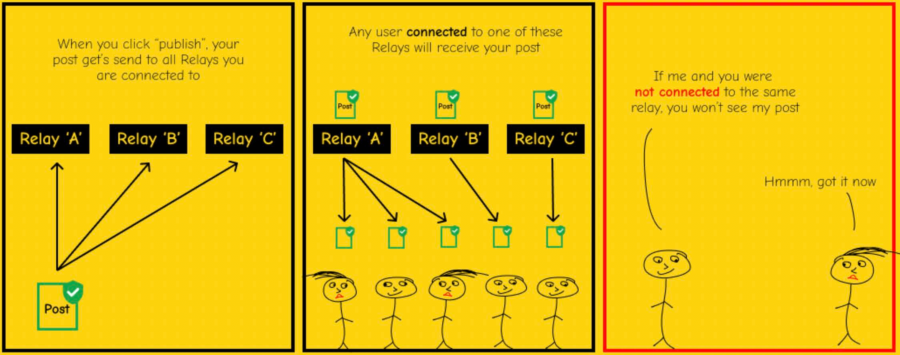

~ @BTCillustrated

---

>*Mtu yeyote anaweza kuendesha relay. Relay ni rahisi sana na
mjinga. Haifanyi chochote zaidi ya kukubali machapisho
kutoka kwa baadhi ya watu na kuyapeleka kwa wengine.
Relay hazihitaji kuaminiwa.
Sahihi zinathibitishwa upande wa mteja.*

~ @fiatjaf, 2019-11-02 fiatjaf.com/nostr.html

* Unapofungua mteja wako wa nostr, utaona maelezo yote
uliyochapisha wewe na wale unaowafuata kwa
mpangilio wa tarehe.
* Hakuna **algoriti** zinazoamua nini cha kukuonyesha,
nini cha kukuzuia, au kudhibiti machapisho yako.
* Kama Bitcoin, **nostr hutumia jozi za funguo za umma/binafsi.**
* **FUNGUA YA UMMA** = npub, kama jina la mtumiaji
* **FUNGUA YA BINAFSI** = nsec, kama nenosiri

>* **KUMBUKA:** Fungua yako ya kibinafsi haiwezi kuwekwa upya ikipotea, kwa hivyo
> **lazima uihifadhi vizuri!**
>* Ukivujisha fungua yako ya kibinafsi, yeyote anayeipata atapata
>ufikiaji wa akaunti yako ya nostr, na **hakuna njia ya
>kurejesha ufikiaji pekee.**

---

* Unaweza kuunda jina la mtumiaji linalosomeka kwa urahisi ukitumia
NIP-05. **Kwa mfano:**
* **Fungua Yangu ya Umma, au npub ni:**
<small>npub1dpna3xwwddnhhzg9ycpvlcz2ze0jdwm2rf3eqd2lf9leaewtq7tqhw0ef2</small>

* **Anwani Yangu ya NIP-05 Nostr ni:**

SimplestBitcoinBook@nostrplebs.com

* **Unaweza kutafuta watu kwenye nostr** kwa kuingiza:
* npub
* NIP-05 (pia inajulikana kama anwani ya nostr) ikiwa wanayo
* Jina la mtumiaji kutoka NIP-05 -> @SimplestBitcoinBook

* **Pata Kitambulisho cha NIP-05 hapa:**
* nostrplebs.com
* verified-nostr.com
* getalby.com
* Au weka moja na kikoa chako mwenyewe

* Mara baada ya kuwa na jozi yako ya funguo za nostr, unaweza
kuingia kwenye mteja wowote wa nostr kwa kutumia funguo hizo
hizo, na utaona kuwa **unabaki na utambulisho wako na
orodha za wafuasi/wanaofuatwa kwenye wateja wote.**
* Hii inatofautiana na mitandao ya kijamii ya zamani, ambapo
unahitaji akaunti tofauti, jina la mtumiaji na nenosiri
kwa kila jukwaa, na unakuwa na maudhui, wafuasi na
wanaofuatwa tofauti kwenye kila moja.
>*Katika kiwango chake cha msingi zaidi, Nostr ni itifaki ya mawasiliano
inayofanya kazi kama gundi ya kijamii inayounganisha
programu zako zote pamoja.*

~ derekross@nostrplebs.com

---

# JINSI YA KUTUMIA NOSTR

>1. **Chagua programu ya mteja** ya kupakua. (Haijalishi
>ni ipi unayochagua, kwani unaweza kuzijaribu zote mara tu
>unapokuwa na jozi yako ya funguo zilizozalishwa.)
>2. **Mifano Maarufu ya Wateja:**
>* Damus kwenye iOS
>* Amethyst kwenye Android
>* Primal kwenye iOS/Android/Kompyuta ya Mezani
>3. **Unda Jina la Mtumiaji.** Hakuna taarifa nyingine inayohitajika.
>4. **Programu itazalisha akaunti.**
>5. **Unaweza kuongeza picha ya wasifu na bango** ukipenda.
>6. **Akaunti yako itaunganishwa kiotomatiki na relay chache**
>mara tu unapochagua angalau riba moja (k.m.:
>bitcoin, sanaa, haki za binadamu, michezo, muziki n.k.)
>7. Kulingana na mteja, itafuatilia kiotomatiki akaunti
>chache zenye maslahi yanayofanana, au itakuruhusu
>kuchagua chache.
>8. **Kisha unaweza kuongeza au kuondoa relay na akaunti.**

~ @BTCillustrated

---

## USIMAMIZI WA FUNGUO
* Mara tu funguo zako zinapozalishwa, ni wakati wa
sakinisha **kiendelezi cha kusaini.**
* Unapotaka kuingia kwenye tovuti inayoendeshwa kwenye
itifaki ya nostr, itakuomba nsec yako, au funguo ya
kibinafsi.
* **USIIINGIZE** moja kwa moja, kwani tovuti zinaweza
kuvujisha data
* **Badala yake, tumia kiendelezi cha kusaini kila wakati.**
* Hiki ni zana inayohifadhi funguo yako ya kibinafsi, na
unaipa idhini ya kusaini matukio, kama vile maelezo,
kwa niaba yako. Usijali, hii ni rahisi kuliko
inavyosikika!
* **Viendelezi Maarufu vya Kusaini:**
* Nostore (iOS Safari)
* Amber (Android)
* Nsec App (Simu/Kompyuta ya Mezani)
* Alby (Kompyuta ya Mezani)
* Nos2X (Kompyuta ya Mezani)
* Nostr Connect (Kompyuta ya Mezani)

## ZAPS
* Kuzap ni jinsi tunavyobitcoin kwenye nostr! Kuunda
uchumi wa V4V (Value4Value), noti kwa noti, zap kwa
zap.
* Unaweza kutuma na kupokea sats (pia zinajulikana kama
zaps) kwa maelezo au maudhui unayoyathamini kwa
kuunganisha mkoba wa Bitcoin Lightning kwenye akaunti
yako ya nostr.
* Kuna njia mbalimbali za kufanya hivi. Ikiwa mteja
unayemchagua hakuelekezi, uliza tu kwenye nostr kwa
kutumia #asknostr, na mtu atakuelekeza. Nostrich
ni rafiki

---

## NYENZO ZA NOSTR
Chini ni orodha ya tovuti zenye miongozo bora,
inayoeleweka kwa urahisi kuhusu nostr na maajabu yake!

* nostr-resources.com na @derGigi
* nostr.com na @fiatjaf
* nostr.net na @aljaz
* nostr.how na @JeffG
* usenostr.org na @pluja
* benwehrman.com/nostr-guide na @benwehrman
* nostrapps.com na @Karnage

## KWA NINI MBUNI?

**Hadithi ya Asili ya Nostrich**

na Walker@primal.net

**Desemba 16, 2022:**

Niligundua ChatGPT3 na,
kwa kawaida, nikauliza
"Unaweza kuandika utani kuhusu #nostr?"
ChatGPT3 ilijibu:
Swali: Unamwitaje mbuni anayechungulia?
J: NosTrich!
Utani haukuwa mzuri, lakini huwezi kumlaumu roboti. Hata
hivyo, nilipenda wazo la utambulisho wa kuona kwa nostr,
na mbuni ni ndege wa kupendeza. Kwa hivyo nilianza
kutumia Midjourney na kuunda #Nostrich

**Desemba 20, 2022:**

@jb55 alipendekeza "Nostrich" kama maskoti rasmi
na nembo ya Nostr.
Dakika tatu baadaye, @jack alituma picha ya Nostrich.
Baada ya hapo, kama wasemavyo, ni historia.

~ @Walker

---

## WATEJA/APP ZA NOSTR

Tembelea **nostrapps.com** ili kupata hizi, na programu
zingine nyingi za ajabu zilizojengwa kwenye itifaki ya
nostr huru, chanzo-wazi.
Tumia kiendelezi chako cha kusaini kuingia kwenye zote!

* **Nostr Nests** - Nafasi ya sauti kwa ajili ya kupiga gumzo,
kutafakari, mikutano midogo, podikasti za moja kwa moja.
* **Plebian Market** - Soko huru la Mtandao,
linaloendeshwa na Bitcoin & Lightning.
* **Npub.pro** - Jifanyie tovuti inayotegemea nostr.
* **Corny Chat** - Nafasi za sauti za moja kwa moja.
* **Wavlake** - Jukwaa la kutiririsha muziki linalotumia
Mtandao wa Lightning wa Bitcoin kutoa thamani kwa thamani.
* **Zap.stream** - Pangisha mtiririko wako wa moja kwa moja na
upate zaps za sat.
* **Flare** - Mteja wa kutazama, kupakia, na kuingiliana
na maudhui ya video.
* **Blowater** - Imejengwa kuchukua nafasi ya
Telegram/Slack/Discord.
* **Stemstr** - Uzoefu wa kijamii kwa wasanii wa muziki
kuungana, kushirikiana na kushiriki muziki wa ajabu.
* **Nostr.build** - Kipakuzi na mpangishaji wa picha, video
& vyombo vya habari.
* Hivetalk - Simu na mikutano ya video ya muda halisi, ya
faragha kabisa, inachukua nafasi ya Zoom.
* **Zap.cooking** - Shiriki mapishi kupitia Nostr.
* **Flockstr** - Kupanga matukio na mikutano.
* **Memestr** - Tazama na unda meme kupitia Nostr
* **Quotestr** - Badilisha noti ya Nostr kuwa nukuu ya picha.

---

## JIUNGE NASI
* Nostr bado ni changa sana. Kama bitcoin, lakini changa
zaidi, ni jaribio la kimataifa, chafu, linalotokana na
mashinani, la kuanzia chini.
* Ukiona umuhimu wa itifaki ya mawasiliano
iliyogatuliwa, isiyodhibitiwa, na chanzo-wazi, tafadhali
jiunge nasi katika kuitumia, kuikuza, kutoa maoni kwa
waendelezaji, na kushiriki kwa njia yoyote unayojisikia
kuitwa, kusaidia kukuza zana hii ya uhuru wa
kujieleza.
* Ni uzoefu wa ajabu kushiriki katika teknolojia
inayokua iliyojengwa kuhifadhi uhuru wa kujieleza na
mawasiliano ya wazi duniani kote.
* Ingia na ujifunze pamoja nasi roho huru, ukikumbatia
machafuko asilia kuunda uzuri, na kuunda mustakabali
mzuri kwa wajukuu wetu!

*Muhimu zaidi ya yote ni kwamba lazima tukumbuke kuwa
nostr ni seti tu ya seva zisizo na uhusiano wowote kati
yao, ... na mchakato wa kuendelea kuunganishwa na wengine
na kutafuta maudhui lazima ushughulikiwe kupitia
majaribio mengi tofauti ya kubuni. Kuandika programu za
Nostr na kutumia Nostr ni lazima mtu akumbatie
machafuko yaliyopo.*

*~ @fiatjaf kutoka:*

*'Maono ya ugunduzi wa maudhui na matumizi ya relay
kwa mitandao ya kijamii ya msingi katika Nostr'*

---

Shukrani za dhati kwa Satoshi, Fiatjaf, wafaraghasi wa
zamani, wa sasa na wa baadaye, familia ya Nostr, kimbunga
cha BT, maxis wenye sumu, maxis wasio na sumu, mabwana
na bibi wa meme, waumini, wabeuzi, waonaji...
na daima,
familia yangu mpendwa, marafiki,
na Yule anayetupumulia sote,
kwa kunivusha daima,
yenye thamani zaidi kuliko chochote, hata bitcoin

PDF ya bure ya kitabu hiki na tafsiri zake zinapatikana
hapa: thesimplestbitcoinbook.net

Nifuate kwenye nostr:

Maoni, maswali, masasisho, maoni:

thesimplestbitcoinbook@proton.me

Siwezi kuahidi nitayafikia