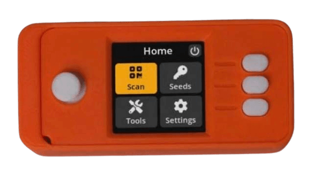

# COMMENT BITCOINER

>**To Bitcoin:** (verbe) /tuːˈbɪtkɔɪn/
Je propose par la présente de faire de « bitcoiner » un verbe,
qui englobe toute la plénitude de la participation
dans l'écosystème bitcoin/Bitcoin.

* Ok, maintenant que vous avez, espérons-le ;) été converti, et que vous êtes prêt à devenir votre propre banque, en participant à la première monnaie mondiale de la liberté,
voici la partie amusante !

---

## DEVENIR VOTRE PROPRE BANQUE
* C'est là que se situe le véritable changement épique pour devenir financièrement auto-souverain, et cela peut prendre du temps pour
vraiment, véritablement saisir ce que cela signifie.
* Une certaine **intention et un certain dévouement sont nécessaires pour
comprendre comment le faire de la manière la plus sûre possible.**
* Dans l'esprit de faire de ce livre « le livre sur le bitcoin le plus simple jamais écrit », je vais fournir un
plan ici, puis je vous offre des ressources à la fin
pour que vous puissiez plonger dans des sujets beaucoup plus approfondis que
la portée de cette introduction.

>**HODL :** (verbe) /ho’dill/

: conserver votre bitcoin

: ne pas vendre

-Tiré d'un post de 2013 sur bitcointalk.org, où l'auteur
avouant être ivre, a mal orthographié « HOLD » (TENIR).

-bitcointalk.org/index.php?topic=375643.0

* Bien que le réseau soit encore en croissance, il y a beaucoup
de valeur dans les millions de hodl'rs mondiaux de dernier recours.

---

## ACQUÉRIR DES BITCOINS
* **Les bitcoins entrent sur le marché lorsque les mineurs vendent une partie des
bitcoins qu'ils reçoivent en récompense,** afin de payer
leurs coûts d'exploitation.
* **Vous pouvez acquérir des bitcoins en achetant sur une plateforme d'échange de pair à pair, en les acceptant comme paiement pour
les biens ou services que vous offrez, comme cadeau, ou en les minant.** (Un tout dernier recours, non recommandé, est de l'acheter
auprès d'une bourse enregistrée).
* Lorsque vous le recevez, vous recevez techniquement les
clés privées avec lesquelles accéder à votre bitcoin.
> * **Rappelez-vous :** Le bitcoin lui-même ne quitte jamais la
 chaîne temporelle.

* Vous pouvez acquérir des bitcoins soit anonymement, soit
avec vérification d'identité (KYC - Know Your Customer).

* La KYC est exigée par la loi pour se conformer aux lois AML (lois anti-blanchiment d'argent) lors de l'achat auprès des bourses.

>* L'achat de bitcoins non-KYC **préserve votre droit à
la vie privée à l'avenir.**

---

## Non-KYC >> Anonymement
**Comment obtenir des bitcoins non-KYC (sans identification) :**

RECOMMANDÉ

>1. Téléchargez une application de portefeuille uniquement bitcoin (voir page 102).
>2. Choisissez une méthode (voir ci-dessous).
>3. Achetez, recevez ou minez des bitcoins.
>4. Retirez vos bitcoins dans votre portefeuille.
>5. HODL, ou dépensez et remplacez.

* **Achetez-le sur Robosats, Bisq, HodlHodl, Peach Bitcoin.**
* **Achetez-le à un guichet automatique de bitcoins** - Assurez-vous de vérifier, car
certains exigent une pièce d'identité. D'autres demandent simplement un nom et un
numéro (vous pouvez utiliser un numéro de téléphone temporaire).
* **Achetez un bon Azteco** - Visitez azte.co pour connaître les emplacements.
* **Gagnez-le pour le travail que vous faites** - Demandez à être payé en bitcoins.
Proposez de réduire votre prix.
* **Achetez-le en personne lors d'une rencontre bitcoin.**
* **Minez-le** - Il est de plus en plus facile de miner à la maison, ou
vous pouvez rejoindre un pool de minage, mais alors DYOR pour rester
sans KYC. Ocean Pool est une excellente option.

---

## KYC >> Vérification d'identité requise

**Comment acheter des bitcoins KYC (avec pièce d'identité) :**

NON RECOMMANDÉ

>1. Téléchargez une application de portefeuille uniquement bitcoin (voir page 102).
>2. Choisissez une bourse uniquement bitcoin.
>3. Créez un compte et associez un mode de paiement.
>4. Remplissez les exigences de la KYC.
>5. Achetez des bitcoins.
>6. **Retirez vos bitcoins dans votre propre portefeuille.**
>7. HODL, ou dépensez et remplacez.

* **Soyez conscient que vos bitcoins seront liés à jamais à
votre identité** si vous l'achetez de cette façon, renonçant ainsi à
l'anonymat futur en ce qui concerne ces achats.
* Si vous choisissez cette méthode, je vous recommande de trouver un
***bourse uniquement bitcoin*** réputée
* ***Assurez-vous que la bourse vous permet de retirer vos
bitcoins dans votre propre portefeuille !***
* **Les bourses sont tenues par la loi de vous « KYCiser ».**
* Ils prendront **votre nom complet, votre adresse, votre numéro de sécurité sociale, votre courriel, votre numéro de téléphone et souvent une photo de
vous tenant votre pièce d'identité.**
* **Confirmez que la bourse a à la fois un soutien téléphonique et un soutien par courriel
pour le service à la clientèle.**

---

* Demandez-leur de vous guider dans l'envoi de vos bitcoins
de votre compte chez eux à votre propre portefeuille, afin
que vous puissiez assurer vous-même la garde de vos bitcoins
= **Détenir vos propres clés.**

>* **Note :** Cela n'efface PAS le fait que vous
>avez acheté des bitcoins chez eux.
>* **Les transactions sont traçables sur la chaîne, et dans
>de nombreux pays, vous êtes redevable de l'impôt lorsque
>vous dépensez vos bitcoins.**

* Si vous voulez acheter par l'intermédiaire de Venmo ou de Paypal, assurez-vous de
**d'abord confirmer que vous pouvez toujours retirer
vos sats dans votre propre portefeuille auto-hébergé.** Dans le
passé, vous ne pouviez pas le faire.
* Comme ils disent :
> **« Pas de clés, pas de fromage »** ou
>
>**« Pas vos clés, pas vos bitcoins »**

* Ce que cela signifie, c'est que tant qu'un service centralisé
détient les clés privées de vos bitcoins, il reste
la possibilité que leur plateforme soit piratée, ou qu'ils
subissent une capture réglementaire et que vous perdiez vos
bitcoins.

>* **Retirez toujours vos bitcoins dans votre propre
portefeuille auto-hébergé dès que vous l'avez
acheté.**

---
## EO 6102
* En 1933, **le président Roosevelt a émis le décret 6102, qui obligeait chaque citoyen américain à remettre
la plupart de son or en échange de billets de banque.**
* L'or était évalué à 20,67 $/oz. L'année suivante, le gouvernement a augmenté le prix de l'or à
35 $/oz avec la loi sur la réserve d'or de 1934,
dévaluant effectivement les billets que les gens avaient
reçus de près de la moitié, puisque la valeur de leurs
billets n'a jamais augmenté avec le prix gonflé de l'or.

---

* Il a fallu attendre 1975, **42 ans plus tard, pour que le décret 6102 soit
abrogé,** et pour que les citoyens privés soient à nouveau
autorisés à détenir plus de 5 oz d'or.
* À ce stade, nous avons peu d'idée de la façon dont les régulateurs
vont réagir au bitcoin à mesure qu'il continue de
gagner en popularité et d'être adopté plus largement.
* Jusqu'à présent, l'accueil a été mitigé. Pour le
moment, cependant, il semble que beaucoup
comprennent, ou peut-être acceptent simplement, que le bitcoin
ne peut finalement pas être arrêté.
* Il y a un certain nombre de politiciens qui commencent à parler
en faveur du bitcoin dans le cadre de leur plateforme.
Il y en a aussi qui sont contre.
* Étant une année électorale aux États-Unis, 2024 est très
intéressante, car les trois principaux candidats à la présidence
acceptent les dons de campagne en bitcoin !
* Le Salvador en a fait une forme de monnaie légale en 2021.
Il sera intéressant de voir quel pays sera le prochain.

>* **En fin de compte, il serait dans l'intérêt de chaque gouvernement de l'adopter et de l'ajouter à son bilan, afin de se prémunir contre l'inflation rapide de leurs
monnaies fiduciaires.**

---

## STOCKER SÉCURISÉMENT LES BITCOINS

* Une fois que vous avez franchi l'étape qui change votre vie d'acheter vos premiers bitcoins, vous devez **décider comment les stocker en toute sécurité.**
>* **Être votre propre banque est une forme puissante de
>l'auto-souveraineté.**
>* Cela doit être pris **au sérieux**.
* ***Veuillez DYOR - Faites vos propres recherches * au-delà de
mes recommandations de base ici.**
* **L'écosystème bitcoin évolue à chaque minute.**
* Nostr, Twitter et bitcointalk.org sont de bons
endroits pour se tenir au courant des derniers développements.

## CONSULTEZ CES SITES POUR DES TUTORIELS :
> * BTCSessions.ca par @BTCSessions
>* Bitcoiner.guide par @QnA
>* Armantheparman.com par @ArmanTheParman
>* @SouthernBitcoiner sur YouTube
>* @wickedsmartbitcoin sur YouTube

---

## PORTEFEUILLES UNIQUEMENT BITCOIN
* Les bitcoins sont mieux stockés dans votre propre
 * **auto-hébergé**
 * **non-custodial**
 * **portefeuille « uniquement bitcoin »**

* Un « portefeuille » est en fait un logiciel qui est un
dispositif de signature. Il contient vos clés privées qu'il
utilise pour signer une transaction que vous envoyez (diffusez).

## PORTEFEUILLE CHAUD
* **Il s'agit d'une application de portefeuille bitcoin en ligne que vous téléchargez sur votre téléphone ou votre ordinateur.**
* Il est préférable de l'utiliser pour les petites sommes, pour les dépenses quotidiennes.
## PORTEFEUILLE DE STOCKAGE FROID
* **Il s'agit d'un portefeuille hors ligne.** Aussi connu sous le nom de portefeuille matériel.
* Il s'agit d'un dispositif matériel distinct sur lequel stocker
vos clés.

>* Bien que les deux fonctionnent bien, il est généralement recommandé
d'utiliser un portefeuille froid une fois que vous avez plus de
500 à 1000 $ de bitcoins, car il est **plus sûr.**

---
* **Veuillez DYOR pour comparer les fonctionnalités et les
compromis entre les portefeuilles présentés ci-dessous.**

* **APPLICATIONS DE PORTEFEUILLE CHAUD** - Non-Custodial
Blue Wallet, Muun Wallet, Mutiny Wallet
Sparrow Wallet, Green Wallet, Phoenix
Wallet, Zeus Wallet, Breez Wallet

* **PORTEFEUILLES DE STOCKAGE FROID** - Non-Custodial
Cold Card, Trezor, Foundation Passport,
Blockstream Jade, Seed Signer, Bitbox,

>* **ACHETEZ TOUJOURS** votre portefeuille de stockage froid **directement
auprès du fabricant,** pour être certain qu'il n'a pas été
frelaté.

---

## CONFIGURATION DU PORTEFEUILLE
* Suivez @BTCSessions sur YouTube pour d'excellents
tutoriels sur la configuration du portefeuille, et bien plus encore.

>* Lors de la configuration de votre portefeuille, assurez-vous d'***écrire
>la phrase de départ de 12 ou 24 mots sur papier.***
>* ***Gardez-la hors ligne. Ne prenez jamais de capture d'écran de celle-ci.***
>* **CONSERVEZ LA PHRASE DE DÉPART TRÈS SÉCURISÉMENT.**
>* **TRÈS, TRÈS SÉCURISÉMENT !**

* **De nombreuses entreprises fabriquent des plaques métalliques de départ dans lesquelles
vous pouvez poinçonner votre phrase de départ pour une protection supplémentaire contre le feu, l'eau et les dommages. Fortement recommandé !**
* Si vous perdez l'accès à votre portefeuille chaud ou froid,
vous pouvez le restaurer avec la phrase de départ et récupérer
vos fonds.
* Vous pouvez le faire sur n'importe quel portefeuille qui prend en charge le même
type de phrase de départ BIP39 (12/24 mots).
* La meilleure pratique serait de stocker le descripteur de portefeuille de votre portefeuille en plus de votre départ.
>* **RAPPELEZ-VOUS : Quiconque a votre départ a
accès à vos bitcoins !**

---
## SUR LA VIE PRIVÉE
* La vie privée lors de l'**achat (non-KYC), de la sécurisation, du stockage et de la dépense** de bitcoins devient de plus en plus
importante, surtout à la lumière des événements récents où
des comptes bancaires sont saisis ou gelés.
>* De plus, **la vie privée numérique générale est essentielle si vous
souhaitez acquérir une souveraineté en ligne, et vous protéger contre la surveillance abusive et la fraude.**

* Vous trouverez ci-dessous quelques services actuels axés sur la vie privée.
* Il n'entre pas dans le cadre de ce livre d'approfondir
chacun des éléments suivants, alors absolument DYOR, et
suivez les comptes que je mentionne ci-dessous sur Nostr ou
Twitter pour les mises à jour.

>*La vie privée est nécessaire à une société ouverte à l'ère électronique.
La vie privée n'est pas le secret. Une question privée est une chose que l'on ne veut pas que le monde entier sache, mais une question secrète est une chose que l'on ne veut que personne ne sache.
La vie privée est le pouvoir de se révéler sélectivement
au monde.*

~Eric Hughes, tiré de « Le manifeste d'un cypherpunk »

---
