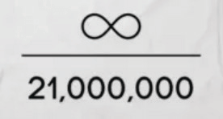

# Chapter 1

# Mengapa Kita Membutuhkan Bitcoin

## KITA MEMBUTUHKANNYA KARENA UANG RUSAK

> *`Akar masalah dengan mata uang konvensional
>adalah semua kepercayaan yang diperlukan
>agar itu berfungsi. Bank sentral harus
>dipercaya untuk tidak menurunkan nilai mata uang,
>tetapi sejarah mata uang fiat penuh
>dengan pelanggaran kepercayaan itu. Bank harus
>dipercaya untuk menyimpan uang kita dan mentransfernya
>secara elektronik, tetapi mereka meminjamkannya
>dalam gelombang gelembung kredit dengan hampir tidak
>ada sebagian kecil pun dalam cadangan. Kita harus mempercayai mereka
>dengan privasi kita, mempercayai mereka untuk tidak membiarkan
>pencuri identitas menguras rekening kita.`*

~ Satoshi Nakamoto 2009-02-11

* Sistem uang fiat rusak (selalu begitu).
* Itu tidak berkelanjutan (tidak pernah begitu).
* Tidak ada cara untuk memperbaikinya (tidak akan pernah bisa).

---
## STANDAR (BUKAN) EMAS
* Banyak orang masih percaya bahwa uang didukung oleh
emas.
* Itu tidak benar.
* Itu belum didukung oleh emas sejak 1971, ketika
Presiden Nixon secara sepihak mengeluarkan dunia dari
standar emas (Kejutan Nixon).
* Lihat **wtfhappenedin1971.com** untuk mendapatkan gambaran yang jelas
tentang kerusakan yang ditimbulkannya.

Grafik yang menunjukkan inflasi Indeks Harga Konsumen (garis merah) vs
daya beli dolar AS (garis hitam) sejak 1971.

<small>Biro Statistik Tenaga Kerja A.S., diambil dari FRED, Bank Federal Reserve St. Louis; https://
fred.stlouisfed.org/series/CPIAUCSL, 9 Juni 2024.</small>

* Fakta Menarik: Forum Ekonomi Dunia dibentuk pada tahun 1971.
---

>**FIAT:** (kata benda) /ˈfiː.æt/
>
>: perintah otoritatif atau sewenang-wenang : DEKRET
>
>: penentuan otoritatif : DIKTAT
>
>**: perintah atau tindakan kehendak yang menciptakan sesuatu tanpa
>atau seolah-olah tanpa upaya lebih lanjut**

~ merriam-webster.com/dictionary

>**FIAT :** dari bahasa Latin fieri «untuk dibuat, menjadi ada»

* Fiat adalah uang yang memiliki nilai hanya karena pemerintah mengatakan (mendekretkan) bahwa itu benar.
* Oleh karena itu orang (harus) percaya bahwa itu benar.
>* **Bahkan jika mereka tidak percaya fiat memiliki nilai, menurut hukum mereka
terpaksa menggunakannya dan menerimanya sebagai pembayaran untuk
barang dan jasa.**
* **Uang fiat dicetak/dibuat dari udara tipis.**
* Saat ini sekitar 5% dari semua dolar dicetak sebagai
uang tunai.
* 95% lainnya dibuat secara digital oleh bank dengan memasukkan
angka ke dalam komputer ketika mereka mengeluarkan pinjaman

>*Hanya diperlukan beberapa sen bagi Biro
Pengukiran dan Pencetakan untuk menghasilkan uang kertas $100…*

~ Ekonom Amerika, Barry Eichengreen

---

>***Scott Pelley dari NBC ’60 Minutes’:*** *Apakah adil untuk mengatakan Anda
>sederhana membanjiri sistem dengan uang?*
>
>***Ketua Fed Jerome Powell:*** *Ya. Kami melakukannya.
>Itu cara lain untuk memikirkannya. Kami melakukannya.*
>
>***Pelley:*** *Dari mana asalnya?
>Apakah Anda hanya mencetaknya?*
>
>***Powell:*** *Kami mencetaknya secara digital. Jadi sebagai bank sentral, kami
>memiliki kemampuan untuk menciptakan uang secara digital. Dan kami melakukan itu
>dengan membeli Treasury Bills atau obligasi untuk pemerintah lain
>jaminan yang dijamin. Dan itu sebenarnya meningkatkan
>pasokan uang. Kami juga mencetak mata uang yang sebenarnya dan kami
>mendistribusikannya melalui bank Federal Reserve.*

~ Wawancara CNBC ’60 Minutes’, 17 Mei 2020
Dua bulan setelah dimulainya penguncian C*vid-19

>Sebenarnya tidak ada batasan untuk apa yang dapat kami lakukan
dengan program pinjaman yang kami miliki ini.

~ Ketua Fed Jerome Powell
18 Maret 2020 di CBS News

>Ya, ada uang tunai tak terbatas di Federal
Reserve. Kami akan melakukan apa pun yang perlu kami lakukan untuk memastikan
ada cukup uang tunai di sistem perbankan.

~ Neel Kashkari , Presiden Fed Minneapolis
23 Maret 2020, CBS '60 Minutes'

>’Kita’ di sini adalah lima orang yang memberikan suara pada perubahan
kebijakan moneter di dalam sistem Federal Reserve
selama pertemuan FOMC. 5 dari 330.000.000.
Itu saja yang diperlukan untuk mengubah kebijakan moneter AS.

~ @MartyBent, Pendiri TFTC.io
Artikel Forbes, 18 Maret 2020

---

## DARI MULUT KUDA DI ZAMAN DAHULU

>*Bank mendapat keuntungan dari bunga atas semua uang
yang diciptakannya dari ketiadaan.*

*~ William Paterson, 1694
Pendiri Bank of England*

>*Semua kebingungan, kebingungan, dan kesusahan di Amerika muncul,
bukan dari kekurangan Konstitusi atau Konfederasi,
bukan dari kurangnya kehormatan atau kebajikan,
sebanyak dari ketidaktahuan langsung tentang
sifat koin, kredit, dan sirkulasi.*

*~ John Adams
Presiden ke-2 Amerika Serikat, 1797-1801*

>*Saya percaya bahwa lembaga perbankan lebih
berbahaya bagi kebebasan kita daripada tentara tetap.
Mereka telah mengangkat aristokrasi uang
yang telah menentang pemerintah.
Kekuatan penerbitan harus diambil dari bank, dan
dikembalikan kepada rakyat yang seharusnya menjadi miliknya.*

*~ Thomas Jefferson
Presiden ke-3 Amerika Serikat, 1801-1809*

>*Saat membual tentang perbuatan mulia kita, kami berhati-hati untuk menyembunyikan kenyataan buruk bahwa
dengan sistem uang yang jahat, kita telah menasionalkan
sistem penindasan yang, meskipun lebih halus, tidak
kurang kejam dari sistem perbudakan barang pribadi yang lama.*

~Horace Greeley
Anggota Kongres AS 1848-49
Pendiri The New York Tribune

---

>*Siapa pun yang mengendalikan volume uang di negara mana pun adalah
penguasa mutlak atas semua industri dan perdagangan…
ketika Anda menyadari bahwa seluruh sistem sangat mudah dikendalikan, satu
atau lainnya, oleh beberapa orang kuat di atas, Anda tidak perlu
diberi tahu bagaimana periode inflasi dan depresi berasal*

~ James A. Garfield
Presiden ke-20 Amerika Serikat, Maret-Sept 1881
Dibunuh pada tahun 1881

>*Saat ini ada yang tidak terkendali di tangan sekelompok pria
kekuatan untuk menghasilkan dolar dari ketiadaan.*

~ Thomas W. Lawson, Penulis 'Frenzied Finance', 1905

>*Saya sangat rahasia - bahkan, sama liciknya - seperti konspirator mana pun.
Penemuan, kami tahu, tidak boleh terjadi, atau semua waktu kami
dan usaha akan sia-sia. Jika terungkap bahwa kelompok khusus kami
telah berkumpul dan menulis rancangan undang-undang perbankan, itu
rancangan undang-undang tidak akan memiliki kesempatan apa pun untuk disahkan oleh Kongres.*

~ Frank A.Vanderlip
Presiden National City Bank of New York
(pendahulu Citi Bank)
~ Menulis pada tahun 1935 tentang pertemuan rahasia yang terjadi di
Jekyll Island pada tahun 1910, untuk menyusun rancangan undang-undang yang disahkan sebagai
Undang-Undang Federal Reserve pada tahun 1913.

>*Undang-Undang (Federal Reserve) ini membentuk kepercayaan yang paling raksasa di
bumi. Ketika Presiden (Woodrow Wilson) menandatangani RUU itu,
pemerintahan tak terlihat dari Kekuatan Moneter akan disahkan…
Kejahatan legislatif terburuk sepanjang zaman dilakukan
oleh RUU perbankan dan mata uang ini.*

~ Charles A. Lindbergh, Sr.
Anggota Kongres AS 1907-1917

---

>*Saya adalah orang yang paling tidak bahagia. Saya tanpa sadar telah menghancurkan negara saya.
Sebuah negara industri besar dikendalikan oleh sistem kreditnya.
Sistem kredit kita terkonsentrasi. Pertumbuhan bangsa,
oleh karena itu, dan semua kegiatan kita berada di tangan beberapa orang.
Kita telah menjadi salah satu yang paling buruk diperintah, salah satu yang paling
sepenuhnya dikendalikan dan didominasi oleh pemerintah di dunia yang beradab.
Tidak lagi pemerintahan oleh opini bebas, tidak lagi pemerintahan oleh keyakinan dan suara mayoritas, tetapi pemerintahan oleh opini dan paksaan dari
sekelompok kecil orang yang dominan.*

~ Woodrow Wilson
Presiden ke-28 Amerika Serikat, 1913-1921
6 tahun setelah mengesahkan Undang-Undang Federal Reserve tahun 1913.

>*Kebenaran yang sebenarnya adalah, seperti yang Anda dan saya tahu,
bahwa elemen keuangan di pusat-pusat besar
telah memiliki pemerintahan AS sejak
zaman Andrew Jackson.*

~ Franklin D. Roosevelt
Presiden ke-32 Amerika Serikat dalam surat yang ditulis
pada 21 November 1933 kepada Kolonel E. Mandell House

>*Itu [depresi] tidak disengaja.
Itu adalah kejadian yang dirancang dengan hati-hati….
Para bankir internasional berusaha untuk mewujudkan
kondisi keputusasaan di sini sehingga mereka mungkin
muncul sebagai penguasa kita semua.*

~ Anggota Kongres Louis T. McFadden,
Dibunuh pada tahun 1936

>Ketua Komite Perbankan dan Mata Uang DPR
*Setiap kali bank memberikan pinjaman,
kredit bank baru dibuat - deposit baru - uang baru.*

~ Graham F.Towers
Gubernur Bank Sentral Kanada, 1934-55

---

>*Jika tidak ada utang dalam sistem uang kita,
tidak akan ada uang sama sekali*

*~ Marriner Eccles,
1941, Gubernur Fed*

>*Saya belum pernah memiliki siapa pun yang dapat, melalui
penggunaan logika dan alasan, membenarkan pemerintah Federal
meminjam penggunaan uangnya sendiri…
Saya percaya akan tiba saatnya ketika orang-orang akan
menuntut agar ini diubah.
Saya percaya akan tiba saatnya di negara ini ketika
mereka benar-benar akan menyalahkan Anda dan saya dan
semua orang lain yang terhubung dengan Kongres
karena duduk diam dan membiarkan
sistem idiot seperti itu berlanjut.*

~ Wright Patman
Anggota Kongres AS 1928-1976
Ketua, Komite Perbankan dan Mata Uang 1963-1975

>*Ketika Anda atau saya menulis cek, harus ada dana yang cukup di
rekening kami untuk menutupi cek, tetapi ketika Federal Reserve menulis sebuah
cek tidak ada deposito bank yang menjadi dasar cek itu ditarik. Ketika
Federal Reserve menulis cek, itu menciptakan uang*

~ Bank Federal Reserve Boston
'Menyederhanakannya', 1984

---

## FEDERAL RESERVE

* The Fed adalah bank sentral 'independen' dari
AS. Itu diciptakan pada tahun 1913 dengan disahkannya
Undang-Undang Federal Reserve.
* Ia memiliki struktur yang unik, sebagian swasta dan sebagian
pemerintah.
* Itu seharusnya menjadi independen secara politis,
entitas non-partisan di dalam pemerintah.
* Sementara Dewan Gubernur Fed ditunjuk oleh
Presiden dan dikonfirmasi oleh Kongres, **the
keputusan Fed tidak perlu diratifikasi
oleh siapa pun.**

**Ini terdiri dari:**

* Dewan Gubernur Federal Reserve
* 12 Bank Federal Reserve
* Komite Pasar Terbuka Federal (FOMC),
yang merupakan badan pembuat kebijakan moneter.

**The Fed bertanggung jawab untuk:**

* Mengawasi kebijakan moneter AS, mempromosikan lapangan kerja dan harga yang stabil.
* Mengatur dan mengawasi perbankan dan keuangan
lembaga.
* Menyediakan layanan pembayaran ke lembaga keuangan.
* Mempromosikan perlindungan konsumen dan komunitas
pembangunan.

---

## CATATAN TENTANG FED CHAI TE DI KURSI FED

* **Ketua Federal Reserve juga:**

* Memimpin Komite Pasar Terbuka Federal
(FOMC), yang memutuskan arah AS
kebijakan moneter (misalnya: QE, kenaikan suku bunga)
* Anggota Dana Moneter Internasional,
IMF
* Anggota Bank for International
Settlements, BIS (bank dari bank sentral).
* Menteri keuangan AS dari G-7
* Menteri keuangan AS dari G-20

* Kekuatan yang **banyak** untuk satu orang.

---

## PERBANKAN CADANGAN FRAKSIONAL, BUNGA & PINJAMAN

* **Perbankan Cadangan Fraksional:** Hingga Maret 2020, bank
diwajibkan untuk memegang cadangan 10%, dan dapat
meminjamkan 90%.
* **Sejak Maret 2020, tidak ada cadangan yang diperlukan, memungkinkan bank untuk mengeluarkan pinjaman tak terbatas.**

* Pinjaman adalah uang berbasis utang, dan Anda diharuskan untuk
membayar bunga atas pinjaman.

>* **Fakta Menarik 1:** Uang untuk membayar bunga atas
>pinjaman TIDAK dibuat oleh bank.
>* **Fakta Menarik 2:** Itu TIDAK PERNAH dibuat.
>* **Fakta Menarik 3:** TIDAK CUKUP uang di
>dunia untuk membayar kembali semua pinjaman + bunga yang jatuh tempo
>atas pinjaman tersebut.
>* **Fakta Menarik 4:** Tidak akan pernah ada!

---

## CATATAN TENTANG PETRO DOLLA
* Orang bisa mengatakan **bahwa hingga 1971 dolar didukung
oleh emas, dan sejak 1974 telah didukung oleh minyak,
dan dengan demikian secara default, oleh Militer AS.**
* **Pada tahun 1974 AS dan Arab Saudi menandatangani perjanjian bilateral untuk menetapkan harga penjualan minyak dalam dolar AS.**
* Sejak saat itu, sebagian besar penjualan minyak global telah diselesaikan dalam
Dolar AS.
* Ini telah berkontribusi besar bagi dolar untuk menjadi
mata uang terkuat di dunia.
* **Dengan demikian telah ditopang secara artifisial,** bahkan selama
waktu ketika biasanya akan berjuang.
* Sejak akhir tahun 2022, sejumlah negara telah
mulai berdagang dalam mata uang selain AS
Dolar
* Sangat mungkin bahwa ini bisa menjadi awal dari
akhir dari petro dolar. Apa yang terjadi selanjutnya
masih harus dilihat…

---

## TENTANG QE (PELONGGARAN KUANTITATIF)
* **Pelonggaran Kuantitatif dianggap sebagai 'kebijakan moneter tidak konvensional' yang digunakan oleh Bank Sentral untuk 'merangsang
ekonomi', di mana Fed membeli pemerintah
obligasi dan surat berharga pemerintah lainnya.**
* Itu pertama kali digunakan oleh Jepang antara 2001-2006.
Setelah itu, AS, Inggris, dan Zona Euro menggunakan
QE selama krisis keuangan 2008
* Sejak saat itu, satu-satunya waktu AS tidak memiliki QE
program adalah antara 2014-2019.
* Seperti yang terlihat di bawah ini, para kritikus berpendapat bahwa **QE
sangat menguntungkan yang sudah kaya**

*Kredit: @RudyHavenstein di Twitter*

---

## SIKLUS

* **Di seluruh alam, ada siklus, pasang surut alami,
ekspansi dan kontraksi.**

* Ini **berkontribusi pada keseimbangan keseluruhan, dari waktu ke waktu,
dan keberlanjutan** dari seluruh yang saling berhubungan
sistem, dari semua kehidupan di bumi.
* **Sistem mata uang fiat berbasis utang mengabaikan
kebijaksanaan siklus alami,** dan sebaliknya didasarkan pada,
dan 100% bergantung untuk kelangsungan hidupnya pada, yang tak tertandingi
dan pertumbuhan yang tak henti-hentinya, untuk terus
melayani hutangnya.
* Di alam, ini adalah kanker.
* Dalam ‘ekonomi’, lintasan tidak wajar ini lebih lanjut
didukung oleh pemerintah yang menyelamatkan bank-bank yang gagal
dan perusahaan besar, daripada membiarkan mereka
melipat, dan didaur ulang menjadi sesuatu yang baru, sesuatu yang lebih sehat.
* **Kekurangpahaman menyelamatkan perusahaan yang gagal menempatkan seluruh ekonomi pada risiko.** Intinya,
itu hanya menendang kaleng di sepanjang jalan, dan kekacauan tak terhindarkan yang ada di depan kemungkinan akan jauh, jauh
lebih intens daripada jika siklus alami diizinkan untuk
bermain
* **Kita berutang budi kepada Satoshi Nakamoto, dan kepada
cypherpunk sebelum dan sesudahnya,** karena memiliki
visi, pandangan ke depan, tekad dan keterampilan untuk menyediakan
sekoci untuk membawa kita ke pantai baru.

---

* Begitu kita menyadari hadiah ini, terserah kita untuk
naik ke kapal, dengan hati penuh dan pikiran jernih, untuk
melakukan perjalanan dan membangun dunia baru dengan Uang
Perdamaian.
>* **Bitcoin memperbaiki uang, terserah kita untuk memperbaiki sisanya.
Dan, untuk lebih jelasnya, dengan memperbaiki uang, BANYAK
hal lain akan diperbaiki, secara default**

* Yang utama adalah bahwa perang kinetik berskala besar yang diprakarsai pemerintah tidak akan lagi menguntungkan, atau mungkin, tanpa dukungan rakyat.
* Selain itu, secara alami akan ada lebih sedikit konsumsi,
bersamaan dengan peralihan ke barang dan jasa nilai nyata, pasar bebas, tabungan nyata, & demonetisasi
perumahan dan real estat, yang tidak pernah dimaksudkan untuk
dimonetisasi sejak awal.
* **LIHAT:** Bitcoin Memperbaiki Ini, halaman 32
---

## KITA MEMBUTUHKANNYA KARENA INFLASI ADALAH PENCURIAN

Grafik FRED 2024 yang menunjukkan penurunan daya beli
dolar sejak pembentukan Federal Reserve pada tahun
1913. Tingkat inflasi kumulatif sejak 1913 adalah sekitar
3.067%. Semua mata uang fiat bank sentral di seluruh dunia
mengikuti tingkat penurunan yang serupa.

* **Semakin banyak uang yang diciptakan dari udara tipis,
semakin banyak semua uang kehilangan nilai/daya beli.**
* Ini disebut **inflasi.**
* Inflasi adalah **pencurian waktu,** secara harfiah. Nilai dari Anda
waktu dicuri ketika Anda menyimpannya dalam mata uang yang
digelembungkan, diturunkan nilainya, dan dimanipulasi.
* Inflasi juga merupakan **pajak tersembunyi**.

---

* Pencurian waktu dan pajak ini juga telah memengaruhi semua
mata uang fiat negara lain, karena mereka semua memiliki
telah dipatok ke dolar AS, karena telah menjadi
mata uang cadangan dunia sejak Bretton Woods
perjanjian pada tahun 1944.
* **Di AS, tingkat inflasi tahunan 2% tertulis dalam
mandat Federal Reserve.**
* Ini berarti bahwa **Anda DIJAMIN untuk dapat
membeli 2% LEBIH SEDIKIT** dengan uang kertas $20 yang sama setiap tahun.
* **Pada Maret 2024, tingkat inflasi tahunan adalah 3,5%,**
(jauh lebih dari 2%, yang berarti Anda kehilangan 3,5% dari
daya beli Anda antara Maret 2023 dan
Maret 2024.
* Dengan kata lain, ini berarti bahwa rata-rata, sesuatu
naik harga sebesar 3,5%
* **Jika inflasi diukur secara akurat, seperti yang
dilakukan sampai awal 1980-an, itu sebenarnya
akan mendekati 10% pada tahun 2024.**
* Ketika dilihat berdasarkan kategori, orang melihat bahwa
inflasi jauh lebih buruk daripada 3,5% di banyak
kategori selama setahun terakhir.
* Ketika seseorang melihat sewa, tagihan bahan makanan, bensin
harga, hampir semua yang dibeli seseorang, cukup jelas bahwa
inflasi merajalela di setiap sektor

---
**Inflasi Rata-Rata selama
50 tahun terakhir di AS:**

|  Biaya Rata-Rata   |   1971  |   2021  |   % Peningkatan  |
| --- | --- | --- | --- |
|  Gaji   |    $9,400 |    $59,400 |    532% |
|   Rumah  |    $23,400 |    $513,000 |    2,092% |
|    Galon Bensin | $0.36    |   $4.17 |  1,058%   |
|    Mobil Baru |  $3,400   |   $47,000  |    1,282% |
|   Gelar Sarjana   |  $1,400   |   $26,000  |  1,757%   |
|   Keranjang Belanjaan  |$20     |  $210  |    950% |
|  Listrik/kWh   |  $0.02    |   $0.15  |   650%  |

>**Kisah Nyata:**
~ Sebuah rumah dibeli pada tahun 1976 seharga $58.000.
~ Ketika memperhitungkan inflasi 'resmi', ini akan menjadi
$279.000 dalam dolar 2022.
~ Pada tahun 2022 rumah yang sama dihargai $2,09 juta.
~ Renungkan itu…

>*Mata uang fiat adalah disinformasi.
Informasi apa yang disampaikan oleh uang kertas $10?
Angka 10 adalah pembilang dari pecahan dengan
penyebutnya hilang.
10 dari apa?
Angka 10 tidak mengatakan apa-apa tanpa diketahui
dan penyebut yang stabil.*

~ @bitlany

---

* **Saat inflasi meningkat, tabungan Anda (jika Anda beruntung
cukup memiliki tabungan), kehilangan nilai.**
* Seiring waktu, mereka kehilangan **BANYAK** nilai
>*Jika Anda mulai menabung $100/bulan hari ini, dengan
>suku bunga terbaik yang tersedia 0,05%:
> * n 30 tahun Anda akan menabung **$84.019.**
>* Ketika disesuaikan untuk inflasi 2% yang diamanatkan FED
>* Dalam 30 tahun tabungan Anda akan memiliki efektif
daya beli hanya **$46.384.**
>* Menyesuaikan untuk inflasi hari ini sebesar 3,5%:
>* Tabungan Anda senilai $84.019 akan memiliki
daya beli hanya **$11.037** dalam 30 tahun!

* **Akibatnya ini berarti bahwa kira-kira enam dari
tujuh jam kerja Anda telah dicuri = *Waktu
Pencurian.***

---
**Cara lain untuk melihatnya adalah sebagai berikut:**
* Pada **1971**, biaya sebuah rumah = **2.5** kali rata-rata
gaji tahunan.
* Pada **2024,** biaya sebuah rumah = **8.6** kali
gaji tahunan rata-rata.
* Pada **1971**, mobil baru berharga sekitar **1/3** dari gaji rata-rata
* Pada **2024**, mobil baru berharga lebih dari **3/4** dari gaji rata-rata.

Saya percaya bahwa sekarang jelas bahwa
inflasi
tidak  * **tidak** *
bekerja untuk keuntungan Anda.

**Catatan:** Semua angka ini adalah rata-rata, dan variabel berdasarkan
banyak faktor. Intinya tetap, inflasi adalah pajak tersembunyi
dan merupakan pencurian waktu atas tenaga kerja dan produksi nyata kita

>* **Uang keras memperbaiki ini.**
>* **Bitcoin adalah uang keras**
---

## KITA PERLU MENGGANTI EKONOMI BERBASIS UTANG YANG DIKONTROL SECARA TERPUSAT DAN DIMANIPULASI

>*Saya tidak percaya kita akan pernah memiliki uang yang bagus lagi,
sebelum kita mengambil hal itu dari tangan pemerintah,
yaitu, kita tidak dapat mengambilnya secara paksa dari tangan
pemerintah, semua yang dapat kita lakukan adalah dengan cara memutar yang licik
memperkenalkan sesuatu yang tidak dapat mereka hentikan.*

~ Friedrich Hayek, 1984
Ekonom Austria, Filsuf dan Penulis, 1899-1992

Grafik yang menunjukkan peningkatan Pasokan Uang M1 eksponensial dari
$4 triliun pada Maret 2020 menjadi lebih dari $18 triliun pada Juni 2024.

* **Ledakkan pikiran Anda di sini:** https://usdebtclock.org/
---
* **45% dari semua dolar AS yang ada di
dicetak antara April 2020-Jan 2022!**
* Dicetak dari udara tipis, ingat?
* Uang fiat dikendalikan secara terpusat oleh negara, dan
pasokannya mudah dimanipulasi.
* **Butuh 205 tahun untuk Utang Nasional AS untuk
mencapai $1 triliun. (1776 > 1981)**
* Hanya butuh **33 tahun lagi untuk** Utang Nasional AS
untuk mencapai **$34 triliun!** (1981 > 2024)

Grafik FRED yang menunjukkan Total Utang Publik 1970-2024 di AS.

>*Utang global, diukur oleh Institute of
International Finance, sekarang berjumlah $303 TRILIUN.
Ini adalah planet kita pada fiat berbasis utang.
Ngomong-ngomong, PDB global hanya $84 triliun.*

*~ Nik Bhatia, Penulis ‘Layered Money’, 2021*

---

* **Sebagai referensi**

| **Jika Anda memiliki:** | **Anda dapat menghabiskan $1/detik** |                |
| ------------ | ----------------------- | -------------- |
| **$1 Juta**   | atau 11 hari              | = 11 hari    |
| **$1 Miliar**   | selama 11.680 hari         | = 32 tahun   |
| **$1 Triliun**  | selama 11.680.000 hari     | = 32000 tahun |

* Kita semua berada di bawah belas kasihan mereka yang memiliki kekuatan
untuk memutuskan kapan harus mencetak lebih banyak, dan tingkat bunga apa
untuk mengisi daya.
* **Jika Fed menaikkan suku bunga, maka mendapatkan
pinjaman untuk rumah atau mobil tiba-tiba menjadi lebih
mahal, yang memperlambat pengeluaran, yang mengarah ke
stagflasi**

* **Jika mereka menjaga suku bunga tetap rendah secara artifisial, kita memasuki
periode depresi**

>* **Memungkinkan bank sentral untuk menciptakan
‘cuaca’, menghilangkan kebebasan kita untuk membiarkan pasar memutuskan apa yang bernilai, dan apa yang tidak.**

* Selain itu, **ketika mereka menyelamatkan bank dan perusahaan, mereka secara artifisial menopang ekonomi.** Hanya
masalah waktu sebelum rumah kartu runtuh.
* Argumen asli untuk memiliki bank sentral adalah
bahwa harus ada Pemberi Pinjaman Terakhir ketika
ekonomi goyah.

---
* **Ini telah berubah menjadi bank sentral yang menjadi Penguasa
Resor Pertama, dengan kekuatan otoriter yang tak tertandingi, tidak terpilih, pada akhirnya.**

> *Semua uang bersifat politis, kecuali Bitcoin.
Mata uang fiat, instrumen perbankan, kredit fintech,
cryptocurrency lain, dan bahkan emas semuanya dikendalikan
oleh pemerintah, perusahaan, atau kelompok kecil.
Memiliki pengecualian akan terbukti sangat berguna
saat kita menuju masa depan.*

*~ Alex Gladstein @gladstein
Kepala Petugas Strategi untuk Human Rights Foundation*

>*Bitcoin menghubungkan 8 miliar orang, menghubungkan
seratus juta perusahaan, itu menyinkronkan dunia
di seluruh yurisdiksi politik, dan mengembalikan rasionalitas ke
seluruh sistem keuangan, dan mengembalikan kebebasan dan
hak milik untuk seluruh umat manusia*

*~Michael Saylor
CEO Microstrategy*

---

## KITA PERLU MEMBERIKAN LAYANAN PERBANKAN KEPADA ORANG YANG TIDAK MEMILIKI REKENING BANK

>*Untuk 953 juta orang di 20 negara dengan mata uang yang melemah,
Bitcoin mewakili sesuatu yang lebih besar dari
aset treasury. Bagi mereka, itu lebih seperti bahtera
energi terenkripsi untuk melarikan diri dari banjir.*

*~ Michael Saylor
CEO Microstrategy*

* **Pada 2024, sekitar 25% orang dewasa di
dunia tidak memiliki rekening bank, sekitar 1,4 miliar orang!**

>* **Ini berarti mereka tidak memiliki akses ke layanan perbankan
>dan tidak dapat menggunakan ATM, kartu debit, kartu kredit atau
>cek.**
>* **Selain itu, mereka tidak dapat memperoleh pinjaman untuk memulai
bisnis, untuk membeli mobil atau rumah dll.**

* **Mengirim dan menerima uang, atau mencairkan cek, adalah
mahal.**

* Mereka harus menggunakan transfer uang dan layanan pencairan cek
layanan seperti Western Union, yang mengenakan tarif tinggi
dan membutuhkan waktu untuk diproses.

* Sangat **mahal terutama bagi orang-orang yang mengirim uang
pulang ke keluarga mereka** di negara lain (kiriman uang),
yang dapat dikenakan biaya hingga 10%, atau 12% melalui bank

---
* Sangat **mahal dan memakan waktu bagi mereka yang menerima kiriman uang,** karena mereka perlu membayar transportasi dan
pergi ke kantor transfer uang, seringkali jauh dari tempat
mereka tinggal, untuk mendapatkan uang yang dikirim anggota keluarga mereka.

* Seringkali tidak aman bagi mereka untuk bepergian ke ini
kantor.
* Bitcoin, melalui Lightning Network, menyediakan
solusi instan untuk masalah ini sekarang!

***#bitcoinmemperbaikinya***
>*Kapan teknologi yang memberdayakan
orang pernah dihentikan?*

*~ Jeff Booth
Penulis: Harga Hari Esok*

---

## KITA PERLU MEMBANTU ORANG-ORANG MELEPASKAN DIRI DARI TIRANI DAN KERUNTUHAN MATA UANG

* Seperti yang telah kita lihat, selama beberapa tahun terakhir,
pemerintah dapat dan memang membekukan rekening bank
orang-orang yang tidak setuju dengan mereka.

>* **Ini menunjukkan bahwa, pada dasarnya, uang Anda di bank
tidak lebih dari sekadar IOU yang dapat dicuri
dari Anda kapan saja.**

* Selain itu, ketika inflasi merajalela, seperti yang kita
saat ini melihat pada tahun 2024 di Venezuela (283%), Sudan
(63%), Lebanon (212%), Suriah (79%),
Argentina (161%), Zimbabwe (47%), Turki
(64%) dan banyak lagi, tabungan hidup orang-orang
menguap, kadang-kadang dalam semalam, dan ada
tidak ada yang bisa mereka lakukan.
* Bagi orang-orang yang mengalami salah satu hal di atas, **bitcoin
menjadi solusi nyata dan segera untuk
masalah yang tidak dapat dipertahankan.**
* **Mengingat bahwa baik tirani maupun inflasi
sedang meningkat di banyak tempat, orang bijak
untuk melakukan lindung nilai terhadap mereka dengan memperoleh bitcoin sekarang.**
---
## KITA PERLU MENGHINDARI CBDC
* Anda mungkin pernah mendengar bahwa **bank sentral mulai
untuk membuat CBDC, Mata Uang Digital Bank Sentral.**
Pada Mei 2020, 35 negara sedang menjajaki opsi ini.
* Pada Maret 2022, 87 negara secara aktif mencari
di, atau telah meluncurkan, pilot CBDC
* Pada saat penulisan ini pada Juni 2024, 134 negara
mewakili 98% PDB global berada dalam
tahap penelitian, pengembangan, pilot, atau peluncuran.
www.atlanticcouncil.org/cbdctracker/

>**CBDC sangat mirip dengan uang elektronik
Anda melihat di rekening bank online Anda, kecuali bahwa
dengan menjadi digital secara asli, mereka dapat diprogram
dan 100% dapat dikendalikan.**

>*Perbedaan utama dengan CBDC adalah
bank sentral akan memiliki **kendali mutlak..***

~Agustin Carstens
General Mgr, BIS - Bank for International
Settlements (Bank dari semua bank)

* **Ini berarti pemerintah dapat memprogram tanggal kedaluwarsa pada uang Anda,** memaksa Anda untuk membelanjakannya
sebelum kedaluwarsa.

---

* **Mereka juga dapat memprogram hal-hal lain ke dalamnya,** seperti hanya
memungkinkan untuk dibelanjakan di toko, situs web, atau
yurisdiksi tertentu, dan tidak di tempat lain.
* **Mereka dapat menautkannya ke:** skor kredit Anda, kesehatan Anda
lulus, ID digital, dan skor sosial lainnya.

* **Mereka dapat memprogram batasan apa pun yang mereka anggap sesuai,** berdasarkan
skor spesifik Anda di satu area, atau pada Anda
‘skor keseluruhan’, atau pada apa yang mereka anggap
‘ekonomi’ butuhkan.
* Selain itu, mereka akan dapat mengawasi setiap hal yang
Anda lakukan dengan uang Anda.

>*Kita tidak tahu siapa yang menggunakan uang kertas $100 hari ini dan kita
tidak tahu siapa yang menggunakan uang kertas 1.000 peso hari ini.
Perbedaan utama dengan CBDC adalah **bank sentral
akan memiliki kendali mutlak atas aturan dan regulasi
yang akan menentukan penggunaan** dari **ekspresi itu dari
kewajiban bank sentral,** dan juga **kami akan memiliki
teknologi untuk menegakkan itu.***

~Agustin Carstens
GM, BIS - Bank for International Settlements

>* **Catatan:** Mengatakan **“ekspresi kewajiban bank sentral itu”** menyiratkan bahwa nilai Anda, kekuatan hidup Anda, disimpan
sebagai uang, sebenarnya ‘dimiliki’ oleh bank sentral.
---

## KITA PERLU MENYELAMATKAN TAMAN

* **Bitcoin mencabut, pada akarnya, MASALAH terbesar yang
kita hadapi, Kebohongan Fiat.**

* Ini adalah kebohongan mata uang fiat yang rusak, riba, dan semua
yang menyertainya untuk mencuri waktu Anda, sambil sangat
memperkaya mereka yang paling dekat dengan pencetak uang.

* The **Fiat Lie** seperti **gulma monster** raksasa di kebun Anda, **menghisap

# Chapter 2

# MEMPERBAIKI INKLUSIVITAS KEUANGAN
* **Dengan bitcoin, semua orang memiliki akses ke sistem keuangan yang *sama*, dengan aturan yang *sama* untuk semua orang.**
* Tidak ada celah atau pintu belakang atau penawaran khusus untuk siapa pun.
* Setiap orang memiliki potensi untuk dikompensasi atas nilai yang mereka berikan dengan uang riil yang sama, diciptakan dan dipelihara dengan aturan yang sama.
* **Bitcoin dapat diakses oleh siapa saja, di mana saja dengan koneksi internet.**

## MENAMBAH NILAI KE DUNIA
* **Bitcoin memberi insentif kepada orang-orang untuk menambah nilai riil bagi komunitas dan pasar,** karena ini adalah satu-satunya cara untuk menghasilkan lebih banyak uang
* Jika seseorang merasa puas dengan lebih sedikit, seseorang tetap mendapat manfaat dengan bekerja dengan upah yang adil, dan **ketika seseorang menabung, tabungan tersebut mempertahankan nilainya dari waktu ke waktu.**

---
## MEMPERBAIKI LINGKUNGAN INI
* Uang yang sehat dengan pasokan yang dibatasi secara ketat menciptakan dinamika yang sangat berbeda dengan yang diciptakan oleh pencetakan uang tanpa batas berbasis utang yang kita lihat terjadi saat ini.
* Alih-alih dorongan yang tak terhentikan untuk mengonsumsi lebih banyak, dalam perlombaan menuju titik terendah untuk membayar suku bunga majemuk atas pinjaman dan utang yang pada akhirnya tidak akan pernah dilunasi, **bitcoin menyediakan jalan keluar ke dunia di mana preferensi waktu rendah dicari.**
>* Perusakan lingkungan yang merajalela **digantikan dengan lebih sedikit konsumsi, lebih sedikit limbah, dan pendekatan yang dipertimbangkan untuk produksi,** di mana pasar menentukan apa yang memiliki nilai sejati, dan oleh karena itu barang-barang dibangun agar tahan lama.
* Ini adalah manfaat bersih bagi manusia, tumbuhan, dan hewan!
---
## MEMPERBAIKI PERANG INI
* Pencetakan sistem moneter fiat tanpa batas adalah yang membuat 'perang abadi' menjadi mungkin dan menguntungkan.
* Karena orang-orang sebagian besar tidak tahu tentang bagaimana pengeluaran perang bekerja, atau dari mana uang untuk perang berasal, hanya ada sedikit atau tidak ada akuntabilitas dari pihak pemerintah. Perang dapat berlarut-larut selama bertahun-tahun di tempat-tempat terpencil, tanpa pengawasan yang nyata.
* Dimulai dengan Vietnam, perang telah menjadi 'perang kartu kredit' (h/t @AlexGladstein), karena pemerintah meminjam uang untuk mendanai perang, dan kemudian meminjam lebih banyak uang untuk membayar bunga atas pinjaman awal... cuci dan ulangi.
>* **Dengan standar bitcoin, itu akan mengharuskan orang-orang di suatu negara untuk bersedia membantu membayar perang. Mereka kemungkinan besar hanya akan melakukannya jika benar-benar dan jelas diperlukan, untuk membela keluarga dan negara mereka, dengan tujuan akhir yang jelas.**
* Karena tidak akan ada keuntungan yang tidak semestinya yang dapat diperoleh, pejabat pemerintah dan perusahaan tidak akan diberi insentif untuk mempromosikan atau terlibat dalam perang sebagai pilihan yang layak.
* **Upaya akan meningkat pesat untuk menemukan cara untuk mencapai resolusi damai dan berbiaya rendah sebagai gantinya.**
---
## MEMPERBAIKI PREFERENSI WAKTU INI

**Preferensi Waktu Tinggi:** Kepuasan instan, Tidak sabar,
Perencanaan jangka pendek
**Preferensi Waktu Rendah:** Menunda kepuasan, Kesabaran,
Perencanaan jangka panjang

* Preferensi waktu tinggi mengarah pada kehancuran pribadi, masyarakat, dan lingkungan. Ketika uang kita kehilangan nilai setiap hari, kita 'dipaksa' untuk tidak sabar dan membelanjakannya secepat mungkin, sebelum kehilangan lebih banyak nilai.
* Ketika waktu kita direndahkan oleh mata uang fiat yang terus meningkat, kita kehilangan hubungan dengan nilai waktu kita.
* Ini mengarah pada pemutusan hubungan, dan arus bawah stres.
* Upaya untuk mengurangi stres, dan menemukan makna, terdistorsi dan menjadi gangguan seperti konsumsi berlebihan narkoba, alkohol, belanja, porno, makanan cepat saji, rentang perhatian pendek, kecanduan layar/media sosial, keputusan impulsif, dll.
* **Uang yang sehat di sisi lain, yang mempertahankan nilainya dari waktu ke waktu dan mengukur dengan benar kontribusi kita melalui pekerjaan kita, mengarah pada preferensi waktu rendah, kualitas hidup yang bijaksana, dengan hubungan yang bermakna, lebih sedikit konsumsi, hubungan yang lebih dalam, percakapan yang lebih mendalam, tujuan jangka panjang dan peningkatan kreativitas.**
---

# Chapter 3

# APA ITU BITCOIN?

>*“Menulis deskripsi untuk hal ini
untuk audiens umum sangatlah sulit.
Tidak ada apa pun untuk mengaitkannya.”*

~ Satoshi Nakamoto 2010-07-05

>*Total sirkulasi akan menjadi 21.000.000
koin. Itu akan didistribusikan ke jaringan
node (penambang) ketika mereka membuat blok,
dengan jumlah yang dipotong setengah setiap 4 tahun.
4 tahun pertama: 10.500.000 koin
4 tahun berikutnya: 5.250.000 koin
4 tahun berikutnya: 2.625.000 koin
4 tahun berikutnya: 1.312.500 koin dll...
Ketika itu habis, sistem dapat mendukung
biaya transaksi jika diperlukan. Ini didasarkan pada
persaingan pasar terbuka, dan di sana akan
mungkin selalu ada node yang bersedia
memproses transaksi secara gratis.*

~ Satoshi Nakamoto 2009-01-09

* **Bitcoin adalah uang kebebasan…** dalam artian ia memiliki
potensi untuk membebaskan kita semua dari yang terpenting
manipulasi oleh, dan kontrol atas, sistem perbankan sentral
* **Dalam bitcoin, aturan moneter sama untuk
SETIAP ORANG, DI MANA SAJA.**
* Bitcoin bersifat inklusif, dalam artian siapa pun dengan
koneksi internet dapat berpartisipasi dalam jaringan,
dan **harus bermain dengan aturan yang sama.**

---
## bitcoin adalah:
* **TERDESENTRALISASI**
* **BENAR-BENAR LANGKA**
* **TAHAN SENSOR**
* **BUKU BESAR TERDISTRIBUSI**
* **TAK DAPAT DIKORUPSI**
* TANPA IZIN
* DAPAT DIAUDIT
* TRANSPARAN
* TIDAK BERUBAH
* TANPA BATAS
* SULIT DIPALSUKAN
* PSUEDONIM
* TANPA FRIKSI
* TANPA KEPERCAYAAN
* PEER-TO-PEER
---
* Bitcoin terdesentralisasi.
* **Ini dijalankan di ribuan node di seluruh dunia, oleh ribuan orang yang tidak saling mengenal.**
* Tidak seorang pun, pemerintah, atau perusahaan yang dapat
mengendalikannya.
* Anda juga dapat menjalankan node, itu mudah ;)
* Dengan menjalankan node Anda sendiri, Anda meningkatkan
privasi Anda dan membantu mengamankan jaringan saat Anda
memverifikasi transaksi Anda sendiri.
> **Jangan percaya. Verifikasi**
---
* **Bitcoin (huruf besar 'B')** adalah jaringan moneter.
* **bitcoin (huruf kecil 'b')** adalah mata uang, atau aset moneter, yang diterbitkan pada, dan berjalan di jaringan Bitcoin.

---
* **Bitcoin adalah pemberi insentif yang hebat.**
>* **Kejeniusan Satoshi adalah sedemikian rupa sehingga dalam bitcoin, untuk
pertama kalinya, pelaku baik dan buruk diberi insentif untuk bermain sesuai aturan.**

> *“Insentif dapat membantu mendorong
node untuk tetap jujur.
Jika penyerang yang rakus mampu mengumpulkan
lebih banyak bukti kerja CPU daripada semua
node yang jujur, dia harus memilih
antara menggunakannya untuk menipu orang dengan
mencuri kembali pembayarannya,
atau menggunakannya untuk menghasilkan koin baru.
Dia seharusnya merasa lebih menguntungkan untuk bermain
sesuai aturan, aturan yang mendukung
dia dengan lebih banyak koin baru daripada
semua orang lain digabungkan,
daripada merusak sistem dan
keabsahan kekayaannya sendiri.”*

~ Satoshi Nakamoto 2008-10-31

---
* **Bitcoin adalah uang digital asli pertama,** tidak seperti
rekening giro online Anda, yang hanyalah sebuah
bentuk digital dari fiat bank sentral.
* Bitcoin adalah mata uang digital **terdesentralisasi**.
* Bitcoin **tidak memiliki otoritas pusat.**
* Bitcoin **tidak bernegara.**
* Pertimbangkan implikasinya ...

>*Bitcoin adalah mata uang digital terdesentralisasi yang memungkinkan
pembayaran instan kepada siapa pun, di mana pun di dunia.
Bitcoin menggunakan teknologi peer-to-peer untuk beroperasi tanpa
otoritas pusat: manajemen transaksi dan uang
penerbitan dilakukan secara kolektif oleh jaringan.*

~ Bitcoin Wiki
en.bitcoin.it

---
* Bitcoin adalah uang internet ajaib.
* Tidak serius, **Bitcoin adalah cara kita akan memperbaiki
dunia.**
* Serius? Iya.
---
* **Bitcoin adalah cara untuk mentransfer nilai**
 * dari jumlah berapa pun
 * secara aman
 * secara instan (di Lightning Network)
 * antara dua pihak mana pun
 * kapan saja
 * 24/7
 * di mana saja
 * ya, di mana saja
 * Pikirkan tentang itu.

 ---

>*Dengan e-currency berdasarkan kriptografi
bukti, tanpa perlu mempercayai pihak ketiga
perantara, uang bisa aman dan
transaksi mudah.*

~ Satoshi Nakamoto 2009-02-11

---
>*Bitcoin (hampir) tidak memerlukan biaya untuk dipindahkan dengan pasti.
Saya tahu dengan 100% kepastian apa yang saya terima.*

~ Michael Saylor CEO Microstrategy

* Anda dapat mengirim $1,13, atau 46c atau 359 sats atau 500.000.000
sats atau $1 juta kepada siapa pun, di mana pun, kapan saja
melalui Jaringan Bitcoin, atau Jaringan Lightning
dibangun di atas Bitcoin.
* **Dan tidak ada yang bisa menghentikan Anda.**
* Bisakah Anda melakukan itu dengan emas, perak, USD/GBP/EUR/YEN/
CYK/ZAR atau mata uang fiat bank sentral lainnya?

---
* **Bitcoin adalah bersejarah.** Ini adalah pertama kalinya dalam sejarah
sistem moneter terdesentralisasi, tahan sensor, tidak berubah,
tanpa batas, tanpa izin, dan tidak dapat dikorupsi dengan batas atas mutlak (21 juta
koin) pernah dibuat
>* Bitcoin **sama pentingnya dengan desentralisasi kekuasaan
dan meningkatkan inklusi keuangan,** seperti penemuan
mesin cetak, dan kemudian World Wide
Web, **adalah untuk mendesentralisasikan kendali atas, dan
meningkatkan akses ke, informasi.**

>*Banyak orang secara otomatis
menolak e-currency sebagai penyebab yang hilang
karena semua perusahaan yang gagal
sejak tahun 1990-an.
Saya harap jelas bahwa itu hanya
sifat sistem yang dikendalikan secara terpusat yang menghancurkan mereka.
Saya pikir ini adalah pertama kalinya kita mencoba
sistem terdesentralisasi yang tidak berbasis kepercayaan.*

~ Satoshi Nakamoto 2009-02-15
---
* **Bitcoin adalah BUKU BESAR AKUN terdistribusi, terdesentralisasi, transparan, dan tidak berubah.**
* Siapa pun di dunia dapat melihat siapa memiliki apa, kapan saja, dan tidak dapat diubah.
* Kecuali 'siapa' itu bukan nama, **itu adalah alamat
terdiri dari angka dan huruf.**
>* Contoh alamat bitcoin:
**bc1qar0srrr7xfkvy5l643lydnw9re59gtzzwf5mdq**

* Oleh karena itu, Bitcoin **pseudonim.**
---
* **Bitcoin adalah**
* penerbit aset yang tidak memihak
* penyimpan nilai
* media pertukaran
* dan akan segera menjadi unit akun
* **sebagai**
* **sarana** pertukaran.

* Ini adalah penerbit, emas, uang tunai, kartu debit DAN
paypal, bank, venmo, cashapp, western union

**SEMUA DIGABUNG MENJADI SATU!**

---
* **Bitcoin adalah pencatat yang menggunakan matematika dan
ilmu komputer, alih-alih bankir, pembukuan
dan akuntan.**
* Ini menghilangkan perantara, bank, pemerintah, biaya cerukan, biaya rekening giro, jam layanan terbatas, potensi sensor, akun yang dibekukan, manipulasi pasokan uang, suku bunga, IMF, WEF, BIS, bangunan fisik, ATM, cek, penagihan balik, dolar petro, dolar euro, seigniorage bank, efek cantillon, perbankan cadangan fraksional, visa, mastercard, amex, western union, hari-hari menunggu transfer uang Anda selesai ...

>* **Alih-alih memiliki seseorang di antara Anda dan
>orang yang ingin Anda jabat tangannya, Anda bisa saja
>jabat tangan mereka secara langsung.**
>* **Tidak perlu meminta izin untuk mengirim milik Anda sendiri
>uang!**
---

## Sederhananya…
* **Bitcoin adalah properti digital yang tidak dapat diambil oleh siapa pun dari Anda.**
* >Memiliki bitcoin berarti memiliki hak untuk mengirim nilai
dari alamat tertentu yang Anda kendalikan dengan
kunci pribadi Anda ke alamat LAIN yang Anda pilih.

*Bitcoin adalah hak milik yang independen dari
monopoli atas kekerasan.*

~ Robert Breedlove @breedlove22

---

* **Bitcoin adalah peristiwa sekali seumur hidup.**
* Bitcoin adalah pilihan.
* Bitcoin **menimbulkan kedaulatan.**
>* **Penemuan Bitcoin 15 tahun yang lalu, adalah untuk
kebebasan dan kedaulatan finansial manusia, seperti
penemuan api adalah untuk kemakmuran manusia selama
500.000 tahun yang lalu, dan mesin cetak adalah untuk
mendesentralisasikan akses ke pengetahuan manusia hampir
900 tahun yang lalu.**

---
* **Bitcoin adalah penyimpan nilai yang sebenarnya.**
* Ini menyimpan sumber daya Anda yang paling berharga, waktu Anda, di
sedemikian rupa sehingga Anda dapat mengaksesnya lagi nanti.
>*Bitcoin seperti saluran energi bandwidth tinggi ke masa depan Anda
diri ... Anda dapat bekerja hari ini dan Bitcoin akan membekukan
energi Anda untuk digunakan nanti.*

~ Robert Breedlove

>*Akar dari uang adalah waktu
Dan akar dari waktu adalah nilai*

~ Guy Swann

---
* Bitcoin adalah rantai waktu, secara harfiah.
* Satoshi menyebut rantai waktu berkali-kali di
emailnya dengan pengembang awal.
* Anda dapat mengukur waktu dalam blok, karena satu blok
ditambang setiap ~10 menit.
>* **Waktu kita adalah sumber daya kita yang paling langka dan berharga.**
>* **Ini adalah kekuatan hidup kita yang sebenarnya.**
>* **Uang Sejati memungkinkan kita untuk menyimpan waktu kita.**

* Ini adalah cara kita dapat mengakui waktu yang 'kita habiskan'.
* Kita **menukar waktu kita dengan uang, yang hanyalah catatan
dari waktu dan upaya kita.**
* **Bitcoin memungkinkan untuk melestarikan waktu kita seperti
bahwa kita memiliki 'akses' ke sana nanti dalam hidup, ketika
kita tidak lagi dapat bekerja seperti dulu.**
---
* Bitcoin adalah **penyimpan nilai.**
* Bitcoin adalah **media pertukaran.**
* Bitcoin **suatu hari nanti akan menjadi unit akun.**
* Bitcoin **suatu hari nanti akan menjadi *SATU unit akun.***
---
* **Bitcoin langka**
* Ini memiliki batas atas 21.000.000.
* Tidak akan pernah ada lagi.
* Kode adalah hukum di sini.*

*Meskipun 'secara teknis' mungkin untuk mengubah
kode, kejeniusan Satoshi mencegah hal itu, karena meningkatkan
(menggelembungkan) pasokan hanya akan berfungsi untuk mengurangi
nilai semua bitcoin yang beredar. Oleh karena itu
memberi insentif kepada semua orang untuk secara implisit setuju untuk mempertahankan
pasokan batas keras 21.000.000.

* Lihat **timechaincalendar.com** oleh @TC untuk memeriksa
tinggi blok saat ini, pasokan yang tersedia, dan
banyak metrik lain yang berkaitan dengan bitcoin
rantai waktu.
---
* **Bitcoin dapat dibagi tanpa batas, tanpa merusak
pasokan.**
* **Satu pizza adalah satu pizza, terlepas dari seberapa kecil
irisannya.**
* Saat ini dapat dibagi menjadi yang kedelapan
desimal: 1.00000000
* Ada 100.000.000 satoshi dalam 1 bitcoin.
* 1 satoshi = 0.00000001
* Anda dapat membeli sats (satoshis) dalam jumlah berapa pun.
---
* **Bitcoin adalah uang terkeras dan teraman yang pernah kita
tahu.**
* Itu bahkan lebih aman daripada emas, karena emas tidak mudah
dapat dibagi atau dipindahkan, memiliki kecepatan rendah (bergerak lambat)
dan tidak mudah diverifikasi
* **Bitcoin memiliki properti moneter yang paling unggul
dari aset apa pun yang pernah dikenal.**

**BAGAN PERBANDINGAN PROPERTI UANG YANG AMAN**

CATATAN: Ini adalah ikhtisar umum, ada nuansa yang tidak
dapat diatasi dalam bagan.

---
* **Bitcoin adalah penawarnya.**
* Mencoba 'menstabilkan' ekonomi dengan bailout,
pencetakan uang, QE dan manipulasi suku bunga adalah
seperti memilikinya pada dukungan kehidupan buatan
* 'Mesin' ini hanya dapat berjalan begitu lama, sebelum menjadi semakin mahal untuk dipelihara, dan semakin tidak berkelanjutan, yang mengarah pada kerusakan serius.
* **Bitcoin memperbaiki ini**
* **Bitcoin adalah uang yang lebih baik**
---
* **Bitcoin bersifat anti-rapuh.**
* Dan itu menjadi lebih dengan setiap upaya serangan,
dengan setiap larangan pemerintah, dengan setiap bagian dari media arus utama FUD (ketakutan, ketidakpastian, keraguan).
>* Bitcoin tidak pernah diretas.*
* Meskipun banyak yang mencoba.

*Meskipun Anda mungkin pernah mendengar tentang peretasan, itu
pertukaran yang telah diretas, bukan
protokol bitcoin.
* **Ingat:**
* Bukan kunci Anda, bukan koin Anda.
* **Selalu** tarik sats Anda ke **dompet Anda sendiri.**
* **Terbaik** untuk membeli peer-to-peer.
---
* **Bitcoin adalah kombinasi dari:**
* ilmu komputer
* protokol jaringan
* sistem kelistrikan
* teori permainan
* keyakinan
* mimetik
* termodinamika
* efek jaringan
* kriptografi
* energi
* kelangkaan sejati
* insentif ekonomi
* rekayasa perangkat lunak
* nilai waktu uang
* kurva adopsi teknologi
* fenomena yang muncul
* kekuatan desentralisasi
* preferensi waktu rendah
* penyelarasan insentif
* netralitas moneter
* aktivisme keuangan
* tidak berubah

... semua bekerja sama untuk menciptakan kepercayaan
di lingkungan yang terdesentralisasi dan tanpa kepercayaan,
untuk mendukung sebuah

* netral
* aman
* tahan sensor
* tanpa izin
* global

uang digital dan jaringan moneter.

---

* **Bitcoin adalah lubang kelinci yang dalam,** menyebabkan Anda
mempertanyakan sebagian besar semua yang Anda pikir Anda tahu ;)
* Bitcoin mandiri.
* **Bitcoin adalah.**
>*Bitcoin adalah. Dan itu sudah cukup.*

~ @Beautyon

---
* **Bitcoin adalah hubungan simbiosis** antara:

**Manusia**

dan

**Solusi sempurna untuk mentransfer dan menyimpan
waktu/nilai.**

* Manusia membutuhkan bitcoin, bitcoin membutuhkan manusia.
---
* **Bitcoin adalah solusi untuk masalah Jenderal Bizantium.**
* Ini dulunya dianggap sebagai masalah yang tidak dapat dipecahkan di
ilmu komputer
* Masalah ini muncul dalam sistem terdesentralisasi, di mana
diperkirakan tidak mungkin untuk membuktikan bahwa pesan yang dikirim
= pesan diterima, karena 'orang di tengah'
bisa menjadi aktor jahat dan memalsukan pesan.
* Dengan kata lain, tampaknya tidak mungkin untuk membentuk konsensus di antara jaringan komputer terdistribusi dan independen.
* Dengan menggunakan stempel waktu bersama dengan buku besar terdistribusi yang diamankan secara kriptografis, Satoshi memecahkan masalah ini.
* Solusinya dikenal sebagai **konsensus Nakamoto.**
---
* **Bitcoin adalah solusi untuk masalah pengeluaran ganda.**
* Ini berarti bahwa ketika Anda mengirim bitcoin, penerima
dapat yakin bahwa Anda benar-benar memiliki bitcoin yang Anda
kirim, dan, begitu Anda mengirimkannya kepada mereka, Anda tidak dapat
menghabiskan koin itu lagi dengan mengirimkannya ke seseorang
lain (pengeluaran ganda).
* Sama seperti saya memberi Anda jeruk. Setelah itu keluar
dari tangan saya dan ada di tangan Anda, saya tidak lagi memiliki
jeruk untuk diberikan kepada orang lain.
>*..pengeluaran ganda tidak pernah diterima ke dalam
kumpulan transaksi, jadi setiap node menanggung
saksi transaksi mana yang dilihatnya pertama kali
dengan bekerja untuk memasukkannya ke dalam blok.*

~ Satoshi Nakamoto 2010-12-09

---
* **Bitcoin adalah aset pembawa,** seperti uang tunai atau emas, yang dipegang oleh
pembawa (pemilik) secara langsung

>* **Ini berarti, setelah dikirim (diberikan), itu langsung
ke pembawa (pemilik) baru, tanpa perantara
(bank) diperlukan untuk memproses transaksi.**

---
* **Bitcoin adalah P2P (peer-to-peer).**
* Bitcoin tahan sensor
>* **Ini berarti tidak ada seorang pun yang memiliki kekuatan untuk menahan
atau untuk mencegah transaksi berjalan ke
pembawa baru.**
* Bitcoin mengalir dengan bebas.

* Tidak boleh ada penjaga gerbang.
---
* **Bitcoin tidak membutuhkan kepercayaan.**
>*Masalah mendasar dengan konvensional
mata uang adalah semua kepercayaan yang diperlukan
untuk membuatnya bekerja. Bank sentral harus dipercaya
tidak untuk merendahkan mata uang, tetapi
sejarah mata uang fiat penuh dengan
pelanggaran kepercayaan itu.*

~ Satoshi Nakamoto tentang pentingnya
Sifat tanpa kepercayaan Bitcoin.

---
* **Bitcoin adalah kode.**
* **Kode adalah ucapan.**
* Lihat github.com/bitcoin
* **Ini adalah repositori bitcoin utama saat ini.**
* Klik untuk melihat kode, permintaan tarik,
ulasan, komit, bip (proposal peningkatan bitcoin) dan pengembang yang
sedang mengerjakan, memelihara, dan meningkatkan
ciptaan yang merupakan bitcoin.

---

* **Bitcoin adalah internet uang.**
* Ketika seseorang berhenti untuk mempertimbangkan bahwa segala sesuatu yang lain adalah
akan/telah menjadi digital, termasuk:
 * musik
 * buku
 * perbankan
 * film
 * pendidikan
 * Foto
 * panggilan telepon
 * radio
 * peta
 * permainan
 * pertemuan
 * dan daftarnya terus berlanjut (lebih baik atau lebih buruk)

… maka seseorang melihat bagaimana **itu benar-benar langkah logis untuk
uang untuk diikuti.**

> **TAPI,** kita membutuhkan **BITCOIN, BUKAN CBDC!**

---

## KEJENIUSAN SATOSHI
>* Bitcoin adalah **SEMUA** dari berikut ini:
> * Buku besar terdistribusi terdesentralisasi
> * Sistem pembayaran
> * Dan nilai itu sendiri sedang ditransfer.

* Di luar bitcoin, **penciptaan uang** (penerbitan), dan
**akuntansi** (melacak uang yang diterima/dibelanjakan),
**dipusatkan,** dan mencakup lapisan terpisah berikut:

* Penerbitan uang oleh berbagai Bank Sentral
* Buku besar akun, baik tertulis maupun digital
* Pihak tepercaya yang memasukkan angka ke dalam
buku besar
* Pihak tepercaya yang menjaga buku besar fisik
aman, atau yang memelihara database komputer
* Tim keamanan tepercaya yang bekerja untuk mencegah
peretasan database

* Dengan bitcoin, **semua lapisan ini dilipat menjadi satu!**
* Meskipun ini mungkin terdengar lebih terpusat, Satoshi
kejeniusan membuatnya sedemikian rupa sehingga yang terjadi adalah kebalikannya.
* Itu **100% Terdesentralisasi!**

---

>* **Bitcoin TIDAK memiliki titik kegagalan pusat.**

* Satu-satunya cara semuanya dapat digabungkan menjadi satu, dan menjadi
terdesentralisasi, adalah bahwa **buku besar terdistribusi
dipertahankan oleh sukarela, di seluruh dunia, ad hoc
sekelompok orang yang secara sukarela menambang dan/atau menjalankan
node lengkap.**
* Dan, insentif jaringan **mendorong semua orang untuk bermain sesuai aturan**
* Anda dapat bergabung dengan kami!

---
## Bitcoin adalah revolusi damai
---
## Bitcoin adalah Harapan
---

# Chapter 4

# BAGAIMANA Bitcoin BEKERJA?

Aturan, Bukan Penguasa

tik-tok/
/blok berikutnya
* Bitcoin menggunakan proof-of-work, kriptografi kunci publik
dan jaringan peer-to-peer, untuk memproses dan memverifikasi
pembayaran dalam buku besar daring global yang terdistribusi.

>**Kriptografi** (kata benda) /krɪpˈtɑːɡrəfi
>
>*: penyandian dan penguraian pesan
>dalam kode rahasia atau sandi
>: pengkodean dan
>dekode informasi terkomputerisasi*

~ Kamus Merriam Webster

>**Hashing** (kata kerja) /ˈhæʃɪŋ/
>
>*: metode enkripsi
>: proses penggunaan algoritma matematika terhadap
>data untuk menghasilkan nilai numerik (hash digest)
>yang mewakili data tersebut.*

~ crsc.nist.gov

>**Ingat:**
>
>Ekosistem bitcoin mencakup >>
>
>**bitcoin:** **aset moneter** digital
>
>**Bitcoin:** **jaringan pembayaran** penambang dan node

1 bitcoin = 100.000.000 satoshi (sats)

**(Anda dapat membeli sats, sebagian kecil dari bitcoin)**

---

>*Kami mendefinisikan koin elektronik sebagai rantai
tanda tangan digital. Setiap pemilik mentransfer
koin ke pemilik berikutnya dengan menandatangani secara digital
hash dari transaksi sebelumnya dan
kunci publik pemilik berikutnya dan menambahkan
ini ke ujung koin. Penerima pembayaran dapat
memverifikasi tanda tangan untuk memverifikasi rantai
kepemilikan.*

~ Satoshi Nakamoto
Buku Putih Bitcoin, Bag.2, 2008
Menjelaskan cara kerja transaksi bitcoin
dalam buku besar terdistribusi

---
## EKOSISTEM BITCOIN..
**terdiri dari Penambang, Node, Pengguna, Pengembang**

semua bekerja secara mandiri,

dan secara bersamaan saling bergantung,

untuk menghidupkan apa yang ada

BITCOIN!

---
## PENAMBANG
* **Node khusus** (komputer yang disebut ASICS) **yang
'menambang' blok** yang menjadi bagian dari bitcoin
blockchain.
* Dengan demikian, mereka **memverifikasi transaksi yang divalidasi
yang dilakukan oleh pengguna, mencetak bitcoin baru** dan **mengamankan
seluruh jaringan.**

## PENGGUNA
* **Anda dan saya. Kita semua.** Orang-orang.
* Menyadari dan menghargai nilai dari
barang dan jasa yang diberikan, kita bertransaksi: memberi
dan menerima bitcoin, atau kita menyimpannya untuk digunakan nanti, sebagaimana
dibutuhkan.

## NODE
* **Node adalah komputer yang menjalankan bitcoin
perangkat lunak.**
* **Ada ribuan node** yang membentuk
terdesentralisasi, global, sukarela **jaringan yang
memvalidasi transaksi** (dengan demikian mencegah
pembelanjaan ganda, dan membantu mengamankan
sistem).

## PENGEMBANG (DEVS)
* **Coder, pemrogram & penulis digital** yang bekerja
untuk **memelihara dan menskalakan jaringan, meningkatkan keamanan,
privasi dan antarmuka pengguna, dan menerjemahkan kode** ke dalam
bahasa dan visual yang dapat dipahami dan dimanfaatkan oleh kita semua

---

## SEBUAH TRANSAKSI BITCOIN:
Ali ingin mengirimkan beberapa bitcoin kepada Benji:

>1. Ali **membuka aplikasi dompet bitcoin** di ponselnya dan
>**klik 'Kirim'.**
>2. Benji **membuka aplikasi dompetnya** dan **klik 'Terima'.**
>3. **Jika mereka bersama:** Ali memindai kode QR di
>aplikasi dompet di ponsel Benji.
>4. **Jika mereka tidak bersama:** Ali menyalin dan menempel
>alamat yang dikirimkan Benji kepadanya melalui teks, ke dalam bidang alamat di miliknya
>dompet.
>5. Ali **memasukkan jumlah yang akan dikirim,** dan menekan **'Kirim'.**
>6. **Beberapa detik kemudian,** Benji akan melihat jumlah
>tertunda di dompetnya.
>7. **Jika dikirim melalui Lightning** itu akan dikonfirmasi
>hampir seketika, dan hampir gratis.
>8. **Jika dikirim 'onchain'** (di rantai utama Bitcoin),
>itu termasuk biaya kecil, dan biasanya membutuhkan waktu sekitar 10
>menit untuk dikonfirmasi. Mungkin perlu waktu lebih lama,
>tergantung pada lalu lintas jaringan.

---

## TRANSAKSI BITCOIN DI BAWAH KAP:
(Definisi istilah yang **dicetak tebal** menyusul)

>1. Ketika Ali mengirimkan sats tersebut ke Benji, pembayaran
>**transaksi** adalah **siaran** ke jaringan.
>2. Transaksi tersebut divalidasi oleh **node** yang
>memastikan Ali benar-benar memiliki bitcoin untuk dikirim, dan
>bahwa itu belum pernah dibelanjakan sebelumnya (untuk mencegah
>pembelanjaan ganda).
>3. Setelah divalidasi oleh sebuah node, ia menunggu di **mempool**
>dengan transaksi orang lain.
>4. Transaksi di mempool ditambahkan dalam sebuah
>blok ke **blockchain** ketika **penambang** menemukan sebuah >**nonce**
>yang memenuhi **algoritma kesulitan.**
>5. Setiap **blok** memiliki **cap waktu.**
>6. Ini menciptakan **kekekalan,** dan membantu melindungi
>penyesuaian algoritma kesulitan dari
>dimanipulasi.
>7. Setiap blok mewakili satu konfirmasi untuk
>transaksi yang termasuk di dalamnya.
>8. Saat blok ditambahkan, rata-rata setiap sepuluh menit,
>kekekalan blockchain meningkat.

---

## DAFTAR ISTILAH

---
>* **TRANSAKSI ~ Mengirim/menerima bitcoin**
---
* Transfer nilai dalam bentuk satoshi, dari
satu pemegang bitcoin ke yang lain.

---
>* **NODE ~ Sebuah 'cabang' dari bitcoin yang terdesentralisasi
'bank'. Siapa pun dapat menjalankan sebuah node.**
---

* Node adalah komputer yang menjalankan bitcoin
perangkat lunak.
* Node, bersama dengan penambang, pengguna dan
pengembang, membentuk Bitcoin peer-to-peer
jaringan.
* Bayangkan **setiap node penuh sebagai buku besar yang berisi
saldo setiap kunci pribadi.**
* Mereka berinteraksi, dan mencapai konsensus (setuju) dengan
satu sama lain dengan menerima dan memvalidasi
transaksi dari node lain, bersama dengan blok
dari penambang, dan kemudian menyampaikan ini ke depan ke
node lain.
* Node dijalankan oleh sekelompok relawan ad-hoc yang berjumlah ribuan
di seluruh dunia.
* Node penuh adalah node yang secara independen
memvalidasi seluruh blockchain Bitcoin, sejak
Genesis Block ditambang oleh Satoshi pada tahun 2009.
* Semakin banyak node aktif, semakin terdistribusi, dan oleh karena itu tangguh, seluruh jaringan
menjadi.
* Saat ini **ada lebih dari 19.000 node penuh yang dapat dijangkau
di seluruh dunia, & jauh lebih banyak yang tidak dapat dijangkau.**
* Semua node yang berpartisipasi adalah sama.

---

---
>* **SIARAN ~ Memberi tahu jaringan bahwa Anda
mengirim bitcoin ke seseorang.**
---

* Ketika Anda mengklik 'Kirim', dompet Anda menandatangani transaksi dengan kunci pribadi Anda dan menyiarkannya,
memberi tahu semua node lain tentang niat Anda
untuk mentransfer nilai sehingga mereka dapat memvalidasi
transaksi

---
>* **MEMPOOL ~ Ruang tunggu transaksi**
---

* Ini adalah 'ruang tunggu' tempat transaksi yang divalidasi dikirim untuk diambil oleh penambang dan
ditambahkan ke blok.

---
>* **BLOK ~ Sebuah 'halaman' dalam buku besar bitcoin**
---

* Buku besar terdistribusi Bitcoin terdiri dari 'blok' digital.
* Setiap blok berisi transaksi bitcoin terverifikasi
yang menjaga buku besar global tetap akurat dan terkini.
Mereka juga berisi nonce, stempel waktu dan
hash dari blok sebelumnya, yang semuanya
berkontribusi pada kekekalan bitcoin
blockchain.

---
>* **BLOCKCHAIN ~ Seluruh buku besar bitcoin**
---

* Blockchain bitcoin, juga dikenal sebagai
timechain, adalah buku besar terdistribusi yang berisi
setiap blok, dan setiap transaksi bitcoin yang pernah
dibuat sejak blok Genesis ditambang oleh
Satoshi pada tahun 2009.

---

---
>* **PENAMBANG ~ Node khusus yang mengonfirmasi
transaksi dan menerbitkan bitcoin baru**
---

* Penambang Bitcoin adalah komputer khusus. Mereka
mengarahkan banyak daya komputasi (hashrate) dalam
lotre digital untuk menebak angka yang akan memenuhi
algoritma kesulitan saat ini, dengan demikian 'menambang'
sebuah 'blok' (sepotong buku besar).
* Blok yang ditambang diberi stempel waktu dan ditambahkan ke
blockchain (alias timechain).

---
>* **ALGORITMA KESULITAN ~ Khusus, adaptif
desain yang membantu menjaga penerbitan bitcoin baru
dapat diprediksi.**
---

* Ini adalah salah satu solusi jenius Satoshi untuk membantu
melindungi penerbitan bitcoin agar tidak melampaui dirinya sendiri,
karena komputer yang lebih canggih sedang dikembangkan.
* Ketika lebih banyak penambang online, nomor target (nonce) dalam 'lotre' menjadi lebih kecil, dan oleh karena itu lebih sulit ditemukan.
* Ketika lebih sedikit penambang online, itu menjadi lebih mudah.
* Algoritma **menyesuaikan secara otomatis setiap 2016
blok** (kira-kira setiap dua minggu), untuk memastikan tingkat pasokan yang dapat diprediksi, di mana satu blok ditambang
rata-rata setiap sepuluh menit.

---
>* **NONCE ~ Angka acak 32-bit**
---

* Angka acak 32-bit yang ditambahkan penambang ke
akhir daftar transaksi yang di-hash, untuk dicoba
untuk memenuhi target kesulitan untuk menambang blok.
* Ketika penambang menemukan nonce yang mengarah ke
menghasilkan hash di bawah target saat ini
angka, mereka telah menambang blok dan dapat menambahkannya
itu ke blockchain dan klaim hadiah blok bitcoin.
---

---
>* **CAP WAKTU ~ Menempelkan waktu**
---

* Setiap blok yang ditambang memiliki stempel waktu yang ditambahkan ke dalamnya.
* Ini untuk keamanan tambahan, kekekalan dan untuk membantu
menetapkan penyesuaian kesulitan

---
>* **KEKEKALAN ~ Tidak dapat diubah.**
---

* Ini berarti blockchain 'terukir dalam batu digital'.

---
>* **PROOF-OF-WORK (PoW) ~ Bukti kriptografi
bahwa pekerjaan sulit dilakukan untuk memenuhi algoritma.**
---

* Penambang menggunakan algoritma PoW untuk membuktikan bahwa mereka memiliki
menggunakan banyak daya komputasi melalui listrik
(pekerjaan), untuk mencapai konsensus dalam terdesentralisasi
cara, dan untuk mencegah pelaku korup
dari mengirim spam ke jaringan.

---
>* **KRIPTOGRAFI KUNCI PUBLIK ~ Proses yang
menciptakan kunci digital untuk mengakses bitcoin Anda**
---

* Ini adalah sistem di mana dua kunci dibuat
melalui algoritma kriptografi.
* **Satu kunci bersifat publik** - Seperti nomor rekening bank Anda, yang dapat Anda berikan kepada orang untuk mengirim bitcoin ke
Anda untuk barang, hadiah atau layanan.
* **Kunci lainnya bersifat pribadi** - Hanya Anda yang memiliki salinan,
dan Anda menggunakannya untuk membuka akses ke bitcoin Anda,
sama seperti kata sandi membuka bank online Anda
akun.
* **Anda harus mengamankan kunci pribadi Anda dengan sangat baik,**
karena siapa pun yang memiliki akses ke sana memiliki akses ke
bitcoin Anda.

---

---
>* **JARINGAN PEER-TO-PEER (P2P) ~ Terdesentralisasi
jaringan tanpa perantara**
---

* Node penuh (peer) secara kolaboratif memelihara jaringan peer-to-peer untuk validasi dan verifikasi transaksi dan blok.
* Dalam jenis jaringan ini, setiap node mampu
baik menyediakan/meminta data ke/dari peer-nya.
* Tidak ada penjaga gerbang di jaringan P2P.

---
>* **JARINGAN LIGHTNING ~ Jaringan yang dibangun di atas bitcoin yang memungkinkan untuk mengirim atau menerima
sats sangat cepat dan hampir gratis.**
---

* Lightning adalah solusi penskalaan Layer 2. Ini berarti
itu menyediakan cara bagi bitcoin untuk menskalakan, memberikannya
potensi untuk memproses jutaan transaksi per
detik (TPS).

---
>* **DOMPET ~ 'Dompet' memegang kriptografi
kunci untuk mengakses bitcoin Anda.**
---

* Itu bisa di telepon, komputer atau di terpisah
perangkat perangkat keras kecil (yang paling aman).
* Dompet bitcoin akan lebih akurat disebut
perangkat penandatanganan. Bitcoin Anda tidak pernah benar-benar pergi
blockchain, buku besar digital.
* Ketika Anda ingin mengirim atau membelanjakan bitcoin Anda,
dompet akan menandatangani dan menyiarkan transaksi ke
jaringan, sehingga dapat divalidasi dan
ditambahkan ke dalam blok di blockchain.

---
>* **PENGEMBANG ~ Pemrogram komputer**
---

* Cypherpunks/pemrogram yang memelihara jaringan, meningkatkan keamanan, memeriksa bug, mengirimkan
tarik permintaan (untuk pembaruan atau fitur baru), tinjau
tarik permintaan, audit kode.

---

---
>* **KUNCI PUBLIK ~ Seperti nomor rekening bank untuk
menerima bitcoin.**
---

* Anda dapat memberikannya kepada orang-orang untuk mengirimi Anda bitcoin,
sama seperti Anda akan memberikan nomor rekening Anda kepada
seseorang sehingga mereka dapat mengirimi Anda uang fiat

---
>* **KUNCI PRIBADI ~ Untuk mengamankan, mengakses, dan mengirim bitcoin, seperti kunci brankas.**
---

* Kunci pribadi bitcoin adalah string rahasia dari angka
dan huruf yang memungkinkan Anda mengirim/membelanjakan milik Anda
bitcoin.
* Hanya Anda yang memiliki salinan. ** **Sangat penting untuk
jaga agar tetap sangat aman dan terjamin, karena siapa pun yang
mendapatkan salinan dapat membelanjakan bitcoin Anda.** **

---
>* **BUKU BESAR TERDISTRIBUSI ~ Buku besar yang dikelola oleh
semua orang yang ingin membantu memeliharanya.**
---

* Alih-alih buku besar yang dikendalikan secara terpusat yang
tidak terlihat oleh publik, seperti yang dikelola oleh bank, Bitcoin adalah terpusat yang transparan dan terbuka
buku besar terlihat oleh siapa saja, kapan saja.
* Alamatnya adalah string huruf dan angka,
tanpa nama terlampir.
* Meskipun pseudonim, adalah mungkin untuk melacak transaksi, terutama jika bitcoin dibeli dari
pertukaran KYC terpusat.
* Jaringan Bitcoin tidak dapat dipercaya dan siapa pun dapat
audit setiap saat, tidak seperti bank di mana orang harus
percaya bahwa buku besar disimpan dengan jujur.

---

## LEBIH LANJUT TENTANG PENAMBANGAN
 Whatsminer M50S

 Antminer S21 Pro

 Bitaxe 401 Supra

* **Penambang mencurahkan daya komputasi AKA hashrate,
melalui listrik ke jaringan,** untuk menambahkan blok ke
Blockchain Bitcoin.
* Komputer ini berjalan 24 jam sehari, biasanya dalam set
dari beberapa, hingga beberapa ratus atau ribu.
* **Mereka pada dasarnya menjalankan lotre. Ketika salah satu dari
mereka menebak angka** (nonce) yang menghasilkan
hash yang memenuhi target kesulitan saat ini, **mereka
bisa menambahkan blok berikutnya ke timechain.**
* **Semua di atas adalah proof-of-work (PoW) yang diperlukan untuk
melahirkan bitcoin baru.**

---

## HADIAH BLOK BITCOIN
**= Subsidi + Biaya**

>* **Untuk pekerjaan mereka, penambang mendapatkan:**
> * **Subsidi, dalam bentuk bitcoin yang baru dicetak.**
> * **Plus, biaya dari transaksi terverifikasi
>termasuk dalam blok itu**

* **Ketika Anda mengirim bitcoin ke seseorang, transaksi itu
termasuk biaya** dan perlu diverifikasi oleh penambang,
dan kemudian dimasukkan dalam blok.
* **Subsidi blok bitcoin** dipotong setengah setiap empat
tahun
* Saat ini **3.125 bitcoin** per blok yang ditambang.
* **'Halving' berikutnya akan terjadi pada tahun 2028,** di mana titik
hadiah blok akan turun menjadi 1.5625 bitcoin per
blok yang ditambang.
* Seperti yang disebutkan sebelumnya, **ini menjaga penerbitan tetap stabil.**
* **Pada tahun 2140, bagian terakhir dari bitcoin akan
ditambang.**
* Setelah itu, penambang hanya akan mendapatkan biaya dari transaksi yang mereka verifikasi di setiap blok.

>*Dalam beberapa dekade ketika hadiah menjadi terlalu
kecil, biaya transaksi akan menjadi
kompensasi utama untuk node (penambang).*

~ Satoshi Nakamoto
Bitcointalk.org, 2010-02-14

>* **Penambang akan selalu dibutuhkan untuk memverifikasi transaksi,
dengan demikian menjaga jaringan tetap terbarui dan aman.**

* Sementara orang perlu menyadari bahwa ada biaya
terlibat, dan profitabilitas dapat diabaikan untuk rumah
penambang, itu adalah cara yang ampuh untuk membantu mengamankan dan menjaga
jaringan terdesentralisasi.
* Penambang bertahan cukup lama. Saat ini ada banyak
Antminer S9 misalnya, yang telah berjalan
selama lebih dari 6 tahun.
* Ketika penambang dipensiunkan **mereka dapat dengan mudah diambil
pisah dan didaur ulang.**
* **Banyak inovasi menarik yang terjadi,** dengan
orang menggunakan panas berlebih dari penambang untuk
memanaskan rumah, sauna, rumah kaca, bak air panas,
dendeng kering dan sayuran, dek panas, kayu kering dan
lebih banyak lagi!

---

# Chapter 5

# SEBUAH KATA TENTANG JARINGAN PETIR
* **Blok Bitcoin sengaja dibuat kecil*** (masing-masing 1MB),
sehingga rantai utama bitcoin hanya dapat memproses sekitar 7 transaksi per detik (TPS).
* Visa memproses sekitar 24.000 TPS.
* Juga, **umumnya dibutuhkan waktu sekitar 10 menit agar
konfirmasi pertama diproses pada
transaksi rantai utama** (karena sebuah blok ditambang rata-rata
setiap ~10 menit).
* Ini tidak praktis jika Anda berada di toko dan ingin
melakukan pembayaran cepat untuk barang Anda.

> ***Detail Penting:** Alasan blok dibuat kecil,
adalah untuk menjaga **rantai waktu tetap cukup kecil agar siapa pun
dapat menjalankan node mereka sendiri di rumah, yang membantu menjaga
jaringan tetap terdesentralisasi.** Satoshi menyadari
pentingnya hal ini

>*Pengguna Bitcoin mungkin menjadi semakin
tirani tentang membatasi ukuran
rantai sehingga mudah bagi banyak pengguna
dan perangkat kecil.*

~ Satoshi Nakamoto, 2010-12-10

**Bacaan yang Direkomendasikan:**
* The Blocksize War oleh Jonathan Bier
---

>* Masuklah, **Jaringan Petir (LN),** sebuah **solusi penskalaan
>bitcoin Lapisan 2.**
>* **‘Lapisan 2’** berarti **dibangun di atas bitcoin.**
>* **‘Solusi Penskalaan’** berarti memungkinkan jaringan untuk:
>* ** Meningkatkan kecepatan pemrosesan secara besar-besaran.**
>* **Meningkatkan jumlah transaksi yang dapat diproses per detik secara besar-besaran.**
>* **Memungkinkan pembayaran mikro.**

* Jaringan Petir (dapat) dianggap seperti tab yang mungkin Anda simpan dengan beberapa teman di bar.
* Anda mencatat di antara Anda semua siapa yang berutang apa
(seperti saluran Jaringan Petir), dan di akhir
malam kelompok Anda menyelesaikan dengan bartender
(‘rantai utama’).
* **Saluran Petir, bagaimanapun, dapat tetap terbuka selama
berhari-hari, berminggu-minggu, berbulan-bulan atau bertahun-tahun sebelum
'diselesaikan' di rantai utama.**

---
## MANFAAT :
* **VOLUME** - Volume transaksi per detik pada dasarnya tidak terbatas, karena saluran yang tak terhitung jumlahnya dapat dibuka pada saat yang sama, masing-masing menyimpan 'tab' mereka sendiri.
* **PEMBAYARAN MIKRO** - Anda dapat mengirim sekecil 1 satoshi (saat ini $0,0006).
* **KECEPATAN** - Biasanya membutuhkan waktu antara milidetik dan beberapa detik untuk menerima pembayaran.
* **PRIVASI** - Transaksi tidak disimpan di blockchain bitcoin publik yang terbuka. Dalam beberapa hal, ini bahkan lebih pribadi daripada uang tunai, karena dengan Petir, bahkan pihak lain tidak harus tahu siapa Anda, karena pembayaran Anda sering 'melompat' melalui saluran yang berbeda untuk mencapai penerima.

Perlu diperjelas, saya tidak mengatakan bahwa 100% tidak mungkin untuk mengungkapnya, hanya saja jauh lebih sulit daripada dengan pembayaran di rantai utama bitcoin.
Dibutuhkan waktu dan energi yang sangat besar untuk memastikan dengan pasti siapa yang melakukan pembayaran kepada siapa, dan itu tidak selalu mungkin untuk dilakukan sama sekali.

>**Nikmati visualisasi menakjubkan** dari keadaan saat ini
>Jaringan Petir di:
>* lnrouter.app/graph
>* mempool.space/graphs/lightning/nodeschannels-map

---

>*Bitcoin itu sendiri tidak dapat diskalakan untuk memiliki setiap
transaksi keuangan tunggal di
dunia disiarkan kepada semua orang dan
termasuk dalam blockchain.
Perlu ada tingkat sekunder dari
sistem pembayaran yang lebih ringan
berat dan lebih efisien.*

*~ Hal Finney, 2010-12-30, Cypherpunk Awal
& orang kedua yang menjalankan Bitcoin*

**Pikirkan seperti ini:**
>* Bitcoin: **Rekening Tabungan** ~ Transaksi lebih lambat untuk jumlah yang lebih besar.
>* Petir: **Rekening Giro** ~ Transaksi lebih cepat untuk jumlah yang lebih kecil.

>*Bitcoin yang ditingkatkan oleh Petir dapat dilihat sebagai produk (properti digital) dan layanan (jaringan moneter terbuka). Kemampuan untuk mentransfer energi moneter melalui waktu dan ruang tanpa campur tangan pemerintah atau perbankan konvensional sangat berharga bagi umat manusia.*

~ Michael Saylor, CEO
Microstrategy

**Pelajari lebih lanjut tentang Petir di sini:**

lopp.net/lightning-information.html

---

# Chapter 6

# CARA MELAKUKAN BITCOIN

>**Melakukan Bitcoin:** (kata kerja) /tuːˈbɪtkɔɪn/
Dengan ini saya mengusulkan menjadikan 'melakukan bitcoin' sebagai kata kerja,
yang merangkum sepenuhnya partisipasi
dalam ekosistem bitcoin/Bitcoin.

* Oke, sekarang Anda, semoga saja ;) telah ter-orangepill, dan siap untuk menjadi bank Anda sendiri, berpartisipasi dalam uang kebebasan global pertama di dunia,
inilah bagian yang menyenangkan!

---

## MENJADI BANK ANDA SENDIRI
* Di sinilah letak pergeseran yang benar-benar epik dalam menjadi mandiri secara finansial, dan, ini bisa memakan waktu untuk
benar-benar, sungguh-sungguh memahami apa artinya ini.
* Beberapa **niat dan dedikasi diperlukan untuk
memahami cara melakukannya dengan cara yang paling aman
mungkin.**
* Dalam semangat menjaga buku ini 'buku bitcoin paling sederhana
yang pernah ditulis', saya akan memberikan
garis besar di sini, dan kemudian saya menawarkan sumber daya di akhir
agar Anda dapat menyelam ke dalamnya yang jauh lebih dalam daripada
cakupan buku dasar ini.

>**HODL:** (kata kerja) /ho’dill/

: untuk menahan bitcoin Anda

: untuk tidak menjual

-Dari postingan bitcointalk.org tahun 2013, di mana poster
mengaku mabuk, salah mengeja 'HOLD'

-bitcointalk.org/index.php?topic=375643.0

* Sementara jaringan masih berkembang, ada banyak
nilai dalam jutaan hodl'rs of last resort global.

---

## MENDAPATKAN BITCOIN
* **Bitcoin memasuki pasar dengan penambang menjual sebagian dari
bitcoin yang mereka terima sebagai hadiah,** untuk membayar
biaya operasional mereka.
* **Anda dapat memperoleh bitcoin dengan membeli di platform perdagangan peer-to-peer, dengan menerimanya sebagai pembayaran untuk
barang atau jasa yang Anda tawarkan, sebagai hadiah, atau dengan menambangnya.** (Resor terakhir, tidak disarankan, adalah membelinya
dari bursa terdaftar).
* Ketika Anda menerimanya, Anda secara teknis menerima
kunci pribadi untuk mengakses bitcoin Anda.
> * **Ingat:** Bitcoin itu sendiri tidak pernah meninggalkan
 timechain.

* Anda dapat memperoleh bitcoin baik secara anonim, atau
dengan verifikasi ID (KYC - Kenali Pelanggan Anda)

* KYC diwajibkan oleh hukum untuk memenuhi AML (undang-undang anti pencucian uang) saat membeli dari bursa.

>* Membeli bitcoin non-KYC **menjaga hak Anda untuk
privasi di masa depan.**

---

## Non-KYC >> Anonim
**Cara Mendapatkan Bitcoin non-KYC (Tanpa ID):**

DIREKOMENDASIKAN

>1. Unduh aplikasi dompet khusus bitcoin (lihat hal. 102).
>2. Pilih metode (lihat di bawah).
>3. Beli, terima, atau tambang bitcoin.
>4. Tarik bitcoin Anda ke dompet Anda.
>5. HODL, atau belanjakan dan ganti.

* **Beli dari Robosats, Bisq, HodlHodl, Peach Bitcoin.**
* **Beli dari ATM bitcoin** - Pastikan untuk memeriksa, karena
beberapa memerlukan ID. Yang lain hanya meminta nama dan
nomor (Anda dapat menggunakan nomor telepon sementara).
* **Beli voucher Azteco** - Kunjungi azte.co untuk lokasi.
* **Hasilkan untuk pekerjaan yang Anda lakukan** - Minta dibayar dengan bitcoin.
Tawarkan untuk mendiskon harga Anda.
* **Beli secara langsung di pertemuan bitcoin.**
* **Tambang** - Semakin mudah untuk menambang di rumah, atau
Anda dapat bergabung dengan kumpulan penambangan, tetapi kemudian DYOR untuk tetap
bebas KYC. Ocean Pool adalah pilihan yang bagus.

---

## KYC >> Verifikasi ID Diperlukan

**Cara Membeli Bitcoin KYC (dengan ID):**

TIDAK DIREKOMENDASIKAN

>1. Unduh aplikasi dompet khusus bitcoin (lihat hal. 102).
>2. Pilih bursa khusus bitcoin.
>3. Buat akun & tautkan metode pembayaran.
>4. Penuhi persyaratan KYC.
>5. Beli bitcoin.
>6. **Tarik bitcoin Anda ke dompet Anda sendiri.**
>7. HODL atau belanjakan dan ganti.

* **Ketahuilah bahwa bitcoin Anda akan selamanya terhubung ke
identitas Anda** jika Anda membelinya dengan cara ini, sehingga kehilangan
pseudonimitas di masa depan terkait dengan pembelian ini.
* Jika Anda memilih metode ini, saya sarankan untuk menemukan
***bursa khusus bitcoin*** yang memiliki reputasi baik.
* ***Pastikan bursa memungkinkan Anda untuk menarik
bitcoin Anda ke dompet Anda sendiri!***
* **Bursa diwajibkan oleh hukum untuk 'KYC' Anda.**
* Mereka akan mengambil **nama lengkap Anda, alamat, nomor jaminan sosial,
nomor, email, nomor telepon, dan seringkali foto
Anda memegang ID Anda.**
* **Konfirmasikan bahwa bursa memiliki dukungan telepon dan email
untuk layanan pelanggan.**

---

* Minta mereka memandu Anda mengirim bitcoin Anda
dari akun Anda dengan mereka ke dompet Anda sendiri, jadi
bahwa Anda menyimpan sendiri bitcoin Anda
= **Memegang kunci Anda sendiri.**

>* **Catatan:** Ini TIDAK menghapus fakta bahwa Anda
>membeli bitcoin dari mereka.
>* **Transaksi dapat dilacak di blockchain, dan di
>banyak negara Anda bertanggung jawab atas pajak saat
>membelanjakan bitcoin Anda.**

* Jika Anda ingin membeli melalui Venmo atau Paypal, pastikan untuk
**pertama-tama konfirmasikan bahwa Anda masih dapat menarik
sat Anda ke dompet yang Anda host sendiri.** Di masa lalu, Anda tidak dapat melakukannya.
* Seperti yang mereka katakan:
> **"Tidak ada kunci, tidak ada keju"** atau
>
>**"Bukan kunci Anda, bukan bitcoin Anda"**

* Apa artinya ini adalah, selama layanan terpusat
memegang kunci pribadi ke bitcoin Anda, masih ada
kemungkinan bahwa platform mereka diretas, atau
mereka mengalami penangkapan regulasi dan Anda kehilangan
bitcoin Anda.

>* **Selalu tarik bitcoin Anda ke
dompet yang Anda host sendiri segera setelah Anda
membelinya.**

---
## EO 6102
* Pada tahun 1933 **Presiden Roosevelt mengeluarkan Perintah Eksekutif
6102, yang mengharuskan setiap warga negara AS untuk menyerahkan
sebagian besar emas mereka dengan imbalan uang kertas bank.**
* Emas dihargai $20,67/oz. Tahun berikutnya,
pemerintah menaikkan harga emas menjadi
$35/oz dengan Undang-Undang Cadangan Emas tahun 1934,
secara efektif mendevaluasi uang kertas yang diterima orang
hampir setengahnya, karena nilai
uang kertas mereka tidak pernah naik dengan harga emas yang meningkat.

---

* Butuh hingga 1975, **42 tahun kemudian, agar EO6102
dicabut,** dan agar warga negara pribadi sekali lagi
diizinkan untuk memegang lebih dari 5oz emas.
* Pada tahap ini, kita tidak tahu bagaimana regulator
akan menanggapi bitcoin karena terus
mendapatkan popularitas dan adopsi yang lebih luas.
* Sejauh ini, ada penerimaan yang beragam. Untuk saat ini,
bagaimanapun, tampaknya banyak yang
memahami, atau mungkin hanya menerima, bahwa bitcoin
pada akhirnya tidak dapat dihentikan.
* Ada sejumlah politisi yang mulai berbicara
mendukung bitcoin sebagai bagian dari platform mereka.
Ada juga beberapa yang menentangnya.
* Menjadi tahun pemilihan di AS, 2024 sangat
menarik, dengan semua tiga kandidat Presiden utama
menerima sumbangan kampanye bitcoin!
* El Salvador menjadikannya bentuk alat pembayaran yang sah pada tahun 2021.
Akan menarik untuk melihat negara mana yang berikutnya.

>* **Pada akhirnya, akan menjadi kepentingan setiap pemerintah untuk merangkulnya dan menambahkannya ke neraca mereka,
sebagai lindung nilai terhadap mata uang fiat mereka yang
mengalami inflasi yang cepat.**

---

## MENYIMPAN BITCOIN DENGAN AMAN

* Setelah Anda mengambil langkah mengubah hidup dengan membeli bitcoin pertama Anda, Anda perlu **memutuskan cara menyimpannya
dengan aman.**
>* **Menjadi bank Anda sendiri adalah bentuk
>kedaulatan diri yang kuat.**
>* Ini perlu ditanggapi **dengan serius**
* ***Harap DYOR - Lakukan Riset Anda Sendiri * di luar
rekomendasi dasar saya di sini.**
* **Ekosistem bitcoin berkembang setiap menit.**
* Nostr, Twitter, dan bitcointalk.org adalah tempat yang baik
untuk tetap mengikuti perkembangan terbaru.

## PERIKSA SITUS-SITUS INI UNTUK TUTORIAL:
> * BTCSessions.ca oleh @BTCSessions
>* Bitcoiner.guide oleh @QnA
>* Armantheparman.com oleh @ArmanTheParman
>* @SouthernBitcoiner di YouTube
>* @wickedsmartbitcoin di YouTube

---

## DOMPET KHUSUS BITCOIN
* Bitcoin paling baik disimpan di
 * **dihosting sendiri**
 * **non-penahanan**
 * **dompet** khusus bitcoin

* 'Dompet' sebenarnya adalah perangkat lunak yang merupakan
perangkat penandatanganan. Ini berisi kunci pribadi Anda yang
digunakan untuk menandatangani transaksi yang Anda kirim (siarkan).

## DOMPET PANAS
* **Ini adalah aplikasi dompet bitcoin online yang Anda unduh ke ponsel atau komputer Anda.**
* Ini paling baik digunakan untuk jumlah yang lebih kecil, untuk pengeluaran
sehari-hari
## DOMPET PENYIMPANAN DINGIN
* **Ini adalah dompet offline.** Juga dikenal sebagai dompet perangkat keras
* Ini adalah perangkat keras terpisah untuk menyimpan
kunci Anda.

>* Meskipun keduanya berfungsi dengan baik, umumnya disarankan
untuk menggunakan dompet dingin setelah Anda memiliki lebih dari
$500-1000 bitcoin, karena itu **lebih aman.**

---
* **Harap DYOR untuk membandingkan fitur dan
trade-off antara dompet yang ditunjukkan di bawah ini.**

* **APLIKASI DOMPET PANAS** - Non-Penahanan
Blue Wallet, Muun Wallet, Mutiny Wallet
Sparrow Wallet, Green Wallet, Phoenix
Wallet, Zeus Wallet, Breez Wallet

* **DOMPET PENYIMPANAN DINGIN** - Non-Penahanan
Cold Card, Trezor, Foundation Passport,
Blockstream Jade, Seed Signer, Bitbox,

>* **SELALU** beli dompet penyimpanan dingin Anda **langsung
dari pabrikan,** untuk memastikan itu belum
dirusak.

---

## PENYIAPAN DOMPET
* Ikuti @BTCSessions di YouTube untuk tutorial yang sangat baik
tentang pengaturan dompet, dan banyak lagi.

>* Saat menyiapkan dompet Anda, pastikan untuk ***menuliskan
>Frasa Benih 12 atau 24 kata di atas kertas.***
>* ***Simpan secara offline. Jangan pernah mengambil tangkapan layar.***
>* **SIMPAN FRASE BENIH DENGAN SANGAT AMAN.**
>* **SANGAT, SANGAT AMAN!**

* **Banyak perusahaan membuat pelat benih logam
ke mana Anda dapat meninju frasa benih Anda untuk menambahkan
perlindungan terhadap api/air/kerusakan. Sangat direkomendasikan!**
* Jika Anda kehilangan akses ke dompet panas atau dingin Anda,
Anda dapat memulihkannya dengan frasa benih dan memulihkan
dana Anda.
* Anda dapat melakukannya di dompet apa pun yang mendukung jenis
frasa benih BIP39 yang sama (12/24 kata).
* Praktik terbaik adalah menyimpan
deskriptor dompet Anda selain benih Anda.
>* **INGAT: Siapa pun yang memiliki benih Anda memiliki
akses ke bitcoin Anda!**

---
## TENTANG PRIVASI
* Privasi saat **membeli (non-KYC), mengamankan, menyimpan
dan membelanjakan** bitcoin menjadi semakin
penting, terutama mengingat peristiwa baru-baru ini dengan
rekening bank yang disita/dibekukan.
>* Selain itu, **privasi digital umum sangat penting jika Anda
ingin mendapatkan kedaulatan online, dan melindungi diri Anda dari pengawasan dan penipuan yang tidak semestinya.**

* Di bawah ini adalah beberapa layanan yang berfokus pada privasi saat ini.
* Di luar cakupan buku ini untuk membahas secara mendalam
masing-masing berikut ini, jadi DYOR sepenuhnya, dan
ikuti akun yang saya sebutkan di bawah ini di Nostr atau
Twitter untuk pembaruan.

>*Privasi diperlukan untuk masyarakat terbuka di era elektronik.
Privasi bukanlah kerahasiaan. Masalah pribadi adalah sesuatu
yang tidak ingin diketahui seluruh dunia, tetapi masalah rahasia
adalah sesuatu yang tidak ingin diketahui siapa pun.
Privasi adalah kekuatan untuk secara selektif mengungkapkan
diri kepada dunia.*

~Eric Hughes, Dari 'Manifesto Cypherpunk'

---

# Chapter 7

# TENTANG PRIVASI
## PANDUAN PRIVASI
* Bitcoiner.guide @BitcoinQ_A
* Econoalchemist.com @econoalchemist
* Sethforprivacy.com @sethforprivacy
* diverter.hostyourown.tools @Diverter_NoKYC
* Citadeldispatch.com @ODELL di Nostr
* KYCnot.me
* Lopp.net @lopp > Klik Sumber Daya > Privasi
* Privacytools.io
* Enegnei.github.io
* Restoreprivacy.com @ResPrivacy
* Keepitsimplebitcoin.com @KISBitcoin
* nbtv.media @naomibrockwell

## VPN (Jaringan Privat Virtual untuk Menyembunyikan ISP Anda)
* Mullvad.net - Bayar dengan bitcoin
* IVPN.net - Bayar dengan bitcoin

## APLIKASI AUTENTIKASI DUA FAKTOR
* Yubi Key - Perangkat Keras
* 2FAS - Aplikasi Khusus Android
* Bitwarden Authenticator - Aplikasi Android & iOS

## PERAMBA N DENGAN FOKUS PRIVASI
* TOR
* Firefox Focus
* Mullvad Browser
* Duck Duck Go
---
## APLIKASI 'CATATAN' TERENKRIPSI
* StandardNotes.com
## MESIN PENCARI DENGAN FOKUS PRIVASI
* Duck Duck Go
* Kagi - Berbayar dan bebas iklan
* SearXNG
* Swisscows
* Mojeek

## APLIKASI PESAN DENGAN FOKUS PRIVASI
* Signal
* SimpleX
* Session
* Telegram - Pengaturan 'Obrolan Rahasia'
## MENJALANKAN NODE SENDIRI
* Bitcoin Knots
* Bitcoin Core
* Ronin Dojo
* Run Citadel
* Raspi Blitz
* Umbrel - Jika Anda hanya menjalankan node bitcoin Anda di sana.
## PONSEL/NO. TELP SEKALI PAKAI
* Jalankan Graphene OS di Android Pixel
* Silent.link - Menerima bitcoin & Lightning
* Text Verified - Menerima bitcoin

---

## PENGELUARAN PRIVAT
* The Bitcoin Company
* Bitrefill
* Bit.Store
* Catatan: Selalu baca cetakan kecil
## BOT ALAMAT PENERIMAAN PRIVAT
* PayNym
## MEDIA SOSIAL TERDESENTRALISASI
* Nostr

> *Kemungkinan untuk menjadi anonim atau
samaran bergantung pada Anda untuk tidak mengungkapkan
informasi identifikasi apa pun tentang
diri Anda sehubungan dengan bitcoin
alamat yang Anda gunakan. Jika Anda memposting milik Anda
alamat bitcoin di web, maka Anda
mengaitkan alamat itu dan apa pun
transaksi dengannya dengan nama Anda
diposting di bawah.
Jika Anda memposting di bawah nama panggilan yang
Anda belum mengaitkannya dengan yang asli
identitas, maka Anda masih menggunakan nama samaran.*

~ Satoshi Nakamoto 2009-11-25

> *Untuk privasi yang lebih besar, yang terbaik adalah menggunakan
alamat bitcoin hanya sekali. Kamu bisa
ubah alamat sesering yang Anda inginkan.*

~Satoshi Nakamoto 2009-11-25

---

# Chapter 8

# Menepis Fud Bitcoin
(Ketakutan Ketidakpastian Keraguan)

* Di bawah ini adalah beberapa argumen umum yang menentang, atau ketakutan
tentang, bitcoin.
* Ini sebagian besar tidak berdasar, akibat dari ketidaktahuan, atau mungkin pemahaman yang tidak lengkap.
* Saya memberikan sanggahan singkat untuk masing-masing di sini, dan pada akhirnya
Anda akan menemukan petunjuk ke sumber daya yang lebih mendalam
membantah semua FUD.

## BITCOIN MENGGUNAKAN TERLALU BANYAK ENERGI

>*Panas dari komputer Anda tidak terbuang
jika Anda perlu memanaskan rumah Anda… Ini
biaya yang sama jika Anda menghasilkan panas
dengan komputer Anda.*

~ Satoshi Nakamoto 2010-08-09

>*Pada awalnya, produksi komoditas hanya karena
mahal tampaknya cukup boros. Namun, yang tak dapat dipalsukan
komoditas mahal berulang kali menambah nilai dengan memungkinkan
transfer kekayaan yang bermanfaat. Lebih banyak biaya yang diperoleh kembali
setiap kali transaksi dimungkinkan atau dibuat
lebih murah. Biaya, awalnya benar-benar sia-sia, adalah
diamortisasi selama banyak transaksi.*

~ Nick Szabo

Cypherpunk

---

* **Energi 'terlalu banyak' adalah proposisi nilai yang harus
mempertimbangkan bagaimana kita menghargai tujuan dari penggunaan energi.**

* **Ketika seseorang mempertimbangkan bahwa lampu Natal di
AS menggunakan listrik sebanyak seluruh jaringan Bitcoin,** maka mungkin orang dapat melihat bahwa itu semua relatif!

* Menggunakan energi, bahkan banyak energi, untuk mengamankan
uang terkeras dan paling tahan sensor
yang pernah dikenal umat manusia, lebih dari sekadar berharga.

* Dalam membandingkan penggunaan energi bitcoin dengan yang digunakan oleh
sistem warisan, kita juga perlu mempertimbangkan 'tumpukan penuh' di kedua sisi:

| Ekosistem Bitcoin    | Sistem Fiat Warisan          |
| -------------------- | --------------------------- |
| Penambang ASIC          | BIS                         |
| Node                | Bank Sentral               |
| Dompet Perangkat Keras     | Bank Nasional/Regional     |
| Aplikasi Dompet Perangkat Lunak | Kompleks Industri Militer |
|                      | Pusat Data Cadangan         |
|                      | Pencetakan Uang Fisik     |
|                      | Distribusi Uang Fisik |
|                      | Aplikasi Perbankan Online         |
|                      | Jaringan ATM             |

* Dengan menggunakan bitcoin, kita pada akhirnya akan mengurangi energi
penggunaan di berbagai bidang lain, terutama
dengan tidak lagi membutuhkan Industri Militer
Kompleks untuk melindungi dolar petro

---

* Juga, konsumerisme yang merajalela yang diperlukan untuk
menjaga sistem berbasis utang tetap bertahan, seiring waktu
akan dikurangi, karena **uang keras secara alami memberi insentif
pengeluaran dan tabungan yang bijaksana** (karena tabungan Anda
sebenarnya akan mempertahankan nilainya, sebuah konsep yang belum pernah kita
alami sejak meninggalkan standar emas).
* **Terakhir, dan yang penting, penambangan bitcoin sudah
mengurangi polusi dengan menangkap gas alam yang dibakar
dan menggunakannya untuk memberi daya pada para penambang.** Karena penambang mencari
biaya listrik rendah, kemungkinan juga menjadi yang terbesar
pendorong menuju energi murah terbarukan, karena
insentifnya cocok.
* **Pendalaman informasi yang mendalam tentang Bitcoin dan Energi** telah
ditulis oleh Daniel Batten di batcoinz.com, Troy
Cross, Jyn Urso, video 'Mesin Ini Menghijaukan'
oleh Swan Bitcoin di YouTube, 'Dirty Coin', Sebuah
dokumenter penambangan bitcoin, dan sebuah
episode yang sangat baik dari acara 'Apa Itu Uang'
(WiM161) dengan B.Quittem, di antara banyak lainnya.

---

## BITCOIN ADALAH PONZI
* **Bitcoin bukanlah Ponzi:**
 * Investor lama tidak dibayar uang oleh yang baru
 investor.
 * Saat membeli bitcoin, tidak ada yang menjanjikan pengembalian
 pada investasi Anda.
 * Tidak ada tim kepemimpinan atau promosi.
 * Tidak ada pra-penambangan.
 * **Baca:** 'Mengapa Bitcoin Bukan Ponzi' oleh Lyn Alden
untuk lebih lanjut.

## BITCOIN TERLALU LAMBAT
* Sementara lapisan dasar Bitcoin lambat, lapisan ke-2
**Lightning Network yang dibangun di atas lapisan dasar adalah …
secepat kilat!**
* Jaringan Bitcoin dapat memproses sekitar 7
transaksi per detik (TPS).
* Jaringan Visa mengklaim dapat memproses hingga 24.000
TPS, meskipun 4.000 TPS lebih dekat dengan penggunaan sebenarnya.
* **Lightning Network, solusi lapisan kedua
dibangun di atas Bitcoin, memiliki potensi kapasitas untuk
memproses jutaan transaksi per detik!**

---

## PEMERINTAH DAPAT MELARANG BITCOIN
* Beberapa pemerintah telah mencoba, seperti China, India, dan
Nigeria misalnya. Dalam setiap kasus, penggunaan bitcoin
meningkat pesat oleh orang-orang di negara tersebut
* **Tidak ada cara bagi pemerintah untuk benar-benar 'melarang' bitcoin,** karena secara alami tanpa izin dan tahan sensor. Ini adalah kode dan kode adalah ucapan.
* Konon, pemerintah dapat mempersulit pembelian
dan menjual dengan, dan ke dalam fiat. Mereka juga dapat mengenakannya sebagai
komoditas, seperti yang mereka lakukan di AS.
* **Pada akhirnya, tidak akan menguntungkan mereka untuk mencoba melarang
itu, karena bitcoin tidak bisa dihindari dan mereka mulai
untuk melihat itu.** Mereka akan jauh lebih pintar untuk menambahkannya ke
neraca negara mereka sebagai lindung nilai terhadap mereka
menggelembungkan mata uang fiat.

>*Pemerintah pandai memotong
kepala jaringan yang dikendalikan secara terpusat
seperti Napster, tetapi jaringan P2P murni
seperti Gnutella dan Tor tampaknya
mempertahankan diri mereka sendiri.*

~ Satoshi Nakamoto

* **Baca:**

Bisakah Pemerintah Menghentikan Bitcoin? oleh Alex Gladstein,
CSO dari Human Rights Foundation

Bisakah Pemerintah Melarang Bitcoin? Empat Hal yang Anda
Perlu Tahu oleh Nick Giambruno

---

## BITCOIN ADALAH TEKNOLOGI LAMA
* **Lebih seperti 'teknologi pamungkas',** sehubungan dengan digital
kelangkaan, desentralisasi, dan memecahkan baik masalah pembelanjaan ganda dan Masalah Jenderal Bizantium. Setelah ditemukan, itu tidak dapat ditemukan kembali.
* **Setelah roda ditemukan, itu tidak akan pernah bisa
diciptakan kembali.**
* Protokol TCP/IP yang menjalankan internet telah
menjadi standar untuk semua jaringan komputer sejak
1983. Kemungkinan akan terus menjadi standar untuk
waktu yang lama.
* Setelah solusi sempurna, teknologi lapisan dasar ditemukan yang bekerja secara optimal, itu dapat bertahan selama ratusan,
atau ribuan tahun.

Kredit: @DecouvreBitcoin

---

## BITCOIN DIGUNAKAN OLEH PARA KRIMINAL
* **Begitu juga dolar, dan setiap mata uang fiat lainnya di dunia.** Cukup salah untuk mengatribusikan ini
masalah hanya untuk bitcoin.
* **Bitcoin adalah alat, sama seperti pisau, dan terserah masing-masing
salah satu dari kita bagaimana kita menggunakannya.**
* Menariknya, jika bitcoin tidak dapat digunakan oleh penjahat,
maka itu tidak akan menjadi netral, tahan sensor
uang yang sangat dibutuhkan dunia.
* **Catatan:** Karena blockchain Bitcoin dapat diaudit, itu
sebenarnya pilihan yang sangat buruk untuk aktivitas kriminal!

## KOMPUTASI KUANTUM BISA MERUSAK BITCOIN
* Meskipun ini mungkin suatu kemungkinan di masa depan,
**pengembang sudah mengerjakan solusi untuk enkripsi pasca-kuantum**
* Bitcoin hanyalah salah satu dari banyak aplikasi online yang mengandalkan hashing SHA-256 untuk keamanan.
Bahkan militer menggunakannya, jadi ada insentif besar di luar komunitas bitcoin untuk mengembangkan yang baru
protokol enkripsi.
* Jika SHA-256 rusak, kita akan memiliki banyak hal lain untuk
khawatirkan selain bitcoin. Seluruh internet menggunakannya
untuk enkripsi. Ini termasuk semua perbankan, pasokan
rantai, sistem transportasi, sistem perawatan kesehatan,
sistem pendidikan dan banyak lagi.

---

## BITCOIN TIDAK MEMILIKI NILAI NYATA
>*“Nilai Bitcoin didorong oleh kelangkaannya yang dapat ditegakkan”*

*~ Fidelity Digital Assets*

* **Kelangkaan adalah nilainya. Semua uang sepanjang waktu telah
dinilai karena memiliki ukuran kelangkaan.**

* Selain itu, itu didukung oleh keyakinan bahwa itu akan
mempertahankan nilainya, sedemikian rupa sehingga dapat diperdagangkan di
masa depan untuk sesuatu yang bernilai.
* Saat jaringan Bitcoin tumbuh, didukung oleh superior
properti moneter yang diwujudkannya, efek jaringan
tumbuh secara eksponensial
* Semakin besar efek jaringan, semakin banyak nilai yang ditawarkannya, sebagai
aset langka. Nilai adalah cerminan dari permintaan,
dan seiring meningkatnya permintaan, nilai meningkat.

---

## BEBERAPA ORANG MEMILIKI TERLALU BANYAK
* Memang benar bahwa beberapa orang memiliki jauh lebih banyak daripada yang lain.
**Dalam merilis protokol secara terbuka, Satoshi mengizinkannya untuk
berkeliaran dengan bebas, dan mereka yang memahami potensi
itu ditahan baik ditambang, atau dibeli lebih awal. Itu adalah
cara paling adil dan paling organik untuk menyajikannya
kepada dunia.**
* Seiring waktu, ketika dunia mengalami hiperbitcoinisasi, yang berarti kita hidup dengan standar bitcoin, mereka yang
memiliki lebih banyak secara alami akan membelanjakannya ke dalam ekonomi

* Meskipun pada titik tertentu seseorang tidak lagi
dapat membelinya dengan fiat, orang akan dibayar untuk pekerjaan mereka
bekerja dengan bitcoin. Dibayar dengan uang yang benar-benar sehat akan
memungkinkan kita untuk memiliki tabungan nyata yang tidak akan direndahkan
seiring waktu oleh inflasi
* Meskipun akan selalu ada orang dengan lebih banyak kekayaan
dan mereka yang kurang, karena sejumlah besar faktor,
**standar bitcoin akan membuat membran di antara
kelas-kelas kekayaan dapat ditembus**, seperti yang dikatakan Aleks Svetsi. Ini
akan memungkinkan mobilitas ke atas dan ke bawah menjadi
jauh, jauh lebih cair daripada hari ini
* **Setelah dilahirkan, dan berenang sepanjang hidup kita
di dunia fiat, hampir tidak mungkin untuk dibayangkan, dan
sepenuhnya memahami implikasi memiliki uang yang
tidak dapat direndahkan atau dimanipulasi!**

---
## BITCOIN TERLALU BERUBAH-UBAH
* **Ini normal selama fase penemuan harga
aset moneter baru.** Tidak ada cara lain untuk
pertumbuhan terjadi ketika itu organik dan muncul
(sebagai lawan dari atas ke bawah dan dikendalikan secara terpusat.
* Selain itu, pada tahap keberadaan manusia ini, dengan
pergeseran eksponensial terjadi di semua bidang, masuk akal
bahwa sesuatu yang rEVOLusioner seperti bitcoin akan
memiliki ayunan liar.
* Sementara kita yang jauh di lubang kelinci melihatnya
sebagai masa depan, saat ini hanya sebagian kecil dari
populasi global memegang bitcoin saat ini. Ini
membuatnya rentan terhadap volatilitas yang sangat besar.
* Saat itu matang, dan adopsi meningkat, volatilitas akan berkurang, dan akhirnya akan stabil dan
menjadi unit akun.

>*Saya yakin bahwa dalam 20 tahun akan ada
baik volume transaksi yang sangat besar
atau tidak ada volume.*

~ Satoshi Nakamoto 2010-02-14

---

## ANDA TIDAK BISA MENYENTUH BITCOIN

* **Ini adalah fitur, bukan bug.** Fakta bahwa bitcoin
tidak fisik adalah salah satu faktor terbesar yang berkontribusi pada ketidakmampuannya untuk disita!

## BITCOIN BISA DIRETAS

* Dalam 15 tahun sejak diluncurkan, tidak pernah
diretas.
* Namun, ada peretasan di bursa, jadi saya
sangat merekomendasikan untuk memindahkan bitcoin Anda ke milik Anda sendiri
dompet kustodi mandiri sesegera mungkin.
* Diperkirakan bahwa untuk memecahkan SHA-256
enkripsi (yang digunakan bitcoin) dalam 24 jam, a
komputer kuantum akan membutuhkan 13.000.000 fisik
qubit. Saat ini, rekor qubit saat ini dipegang
oleh Atom Computing di California adalah 1.180 qubit.
* Secara luas diasumsikan bahwa enkripsi aman kuantum
metode akan dikembangkan jauh sebelum dibutuhkan.

>*Menjadi sumber terbuka berarti siapa pun bisa
secara independen meninjau kode. Jika itu
sumber tertutup, tidak ada yang bisa memverifikasi
keamanan. Saya pikir itu penting untuk
program dengan sifat ini untuk menjadi sumber terbuka.*

*~Satoshi Nakamoto 2009-12-10*

---

## LEBIH LANJUT TENTANG MEMBANTAH FUD DI SINI:

* Endthefud.org
* Bitcoinmythbusters.org
* Casebitcoin.com - Kritik Umum
* Safehodl.github.io/failure/
* Lopp.net - Info Bitcoin: Kesalahpahaman

>*Bitcoin secara fundamental berbeda dari aset digital lainnya
aset. Tidak ada aset digital lain yang mungkin untuk ditingkatkan
bitcoin sebagai barang moneter karena bitcoin adalah yang paling
(relatif terhadap aset digital lainnya) uang digital yang aman, terdesentralisasi, dan sehat dan "peningkatan" apa pun
pasti akan menghadapi trade-off.*

~ Laporan Fidelity Digital Assets, 'Bitcoin First', Jan 2022
Chris Kuiper, CFA, Direktur Riset
Jack Neureuter, Analis Riset

---

## TENTANG HARGA BITCOIN
* **Saya melihat hodling (memegang) bitcoin seperti memiliki jangka panjang
rekening tabungan.**
* Harga harian tidak masalah, karena diperkirakan akan
berubah-ubah (naik dan turun) selama beberapa tahun lagi.
* Seperti yang saya sebutkan sebelumnya, ini normal untuk yang baru
aset yang mengalami penemuan harga
* Jika seseorang memperbesar grafik harga BTC/USD, Anda
akan melihat bahwa itu telah meningkat sebesar +31.296% sejak 2009,
rata-rata menjadi ~200% per tahun.
* Perubahan harga mencerminkan berbagai artikel berita, pembaruan peraturan, permintaan pasar, ketakutan dan kegembiraan.
Ini adalah roller coaster!
* **Semakin lama Anda hodl, semakin banyak Anda belajar dan memahami fundamentalnya, dan semakin Anda menyadari
implikasi mendalam dari memiliki uang yang sehat,
semakin tidak penting harganya.**

>**Pada akhirnya, 'harga' tidak akan menjadi masalah sama sekali, karena bitcoin
akan menjadi unit akun.**

* **Penafian:**
* Hanya masukkan apa yang 'mampu Anda hilangkan', karena
tentu saja, tidak ada jaminan.
* Pertimbangkan bitcoin yang Anda beli sebagai jangka panjang
rekening tabungan, dan rencanakan untuk menyimpannya di tempat dingin
penyimpanan minimal selama lima tahun sebelum
menghabiskan.

---

Sumber bitcointalkforum.org asli untuk salah satu dari
meme bitcoin paling klasik sepanjang masa.

---

## SEMENTARA ITU, TENTANG PAJAK
* **Penafian:** Ini bukan nasihat keuangan atau pajak

* Dalam kode pajak AS, bitcoin saat ini dilihat sebagai komoditas, jadi ada implikasi pajak potensial jika Anda
menjualnya kembali ke fiat, atau bahkan jika Anda membeli sesuatu dengan
bitcoin Anda
* Jika harga turun sebelum Anda menjual/membelanjakannya, Anda
dapat mengklaim kerugian
* Jika harganya naik, Anda seharusnya mengklaim a
keuntungan modal, dan membayar antara 10-30% CGT (Modal
Pajak Keuntungan)
* Jumlahnya tergantung pada beberapa faktor, seperti
berapa lama Anda memegangnya sebelum menjual atau membelanjakan, dan
di braket pajak mana Anda mendarat.
* Jika Anda berencana untuk menjual atau membelanjakan bitcoin, terutama yang lebih besar
jumlah, Anda mungkin ingin mempertimbangkan untuk berkonsultasi dengan
seorang profesional pajak.
* Jika Anda hanya membeli dan memegang, Anda saat ini tidak memiliki
setiap kejadian yang dikenakan pajak terkait bitcoin.
* Dan jika Anda membeli non-KYC…

---

# Chapter 9

# MENGAPA Hanya Bitcoin?
Dari lebih dari 2,5 juta* (!) mata uang kripto yang pernah dibuat,
dan 13.000 yang saat ini diperdagangkan, bitcoin adalah satu-satunya yang:

* **BENAR-BENAR terdesentralisasi**
* Dengan **buku besar yang BENAR-BENAR terdistribusi**
* **Pasokan dengan batas keras yang BENAR-BENAR**
* **Buku besar yang BENAR-BENAR tidak dapat diubah**
* **Efek jaringan** yang dibangun selama lebih dari 15 tahun
* Dan **kebijakan moneter yang tidak dapat dimanipulasi!**
* Setiap mata uang kripto lainnya memiliki **kelompok kecil dan tersentralisasi
yang mengontrol pasokan, dan/atau memiliki
kekuatan untuk mengubah protokol lapisan dasar (moneter
kebijakan).**
* **Ini sama seperti sistem perbankan fiat pusat yang kita
lihat hari ini**
* Kekuatan terpusat seperti ini memohon untuk manipulasi dan
korupsi.
* Lihat penipuan pump/dump altcoin yang dijelaskan di
halaman berikut.
* **Dengarkan:**

Stephan Livera Pod (SLP306) dengan Guy Swann

* Daftar parsial dari rug-pull altcoin/defi sejak 2020:

**rekt.news/leaderboard/**

 *coingecko.com/research/publications/
how-manycryptocurrencies-are-there

---

## PUMP DAN DUMP ALTCOIN
* Sayangnya, ini nyata, dan terjadi setiap hari dengan 'kripto/token' selain bitcoin.
* Ada berbagai iterasi, tetapi salah satu yang paling
umum adalah sebagai berikut:

* **Token Dibuat:** Token kripto baru dibuat. Jauh
lebih mudah daripada yang terdengar, siapa pun dapat melakukannya dalam hitungan menit.
* **Situs web:** Seringkali, situs web mewah dan berkilau dibuat untuk
membuat token terlihat sah.
* **Influencer Berbayar:** Dibayar untuk mempromosikannya di media sosial,
Telegram dll.
* **Grup Orang Dalam Berbayar:** Info dikirim ke para pemimpin
beberapa dari ratusan Grup 'Perdagangan' atau 'Investasi',
di mana orang membayar biaya bulanan atau tahunan untuk
mendapatkan 'intel orang dalam'.
* **Pra-Peluncuran:** Para influencer berbayar dan pemimpin grup berbayar membeli terlebih dahulu, dengan harga terendah.
* **Peluncuran:** Token 'diluncurkan' oleh para influencer ini
dan pemimpin grup, yang memberi tahu pengikut mereka: "Cepat,
beli sekarang!"
* **Pump:** Harga naik dengan cepat saat pengikut mereka berebut untuk masuk lebih awal.
* Harga yang naik dengan cepat menarik orang biasa untuk
masuk, dengan harapan menghasilkan kekayaan mereka.

---

* Ini pada gilirannya memiliki efek memompa harga
lebih jauh.
* **Dump:** Bagian sedih ini biasanya terjadi dengan cepat. Pada titik tertentu,
para pemimpin grup berbayar menjual token mereka, 'di puncak'. Kemudian mereka menyuruh pengikut mereka untuk menjual.
* **Penurunan Harga:** Karena begitu banyak orang menjual di
waktu yang sama, dan likuiditas umumnya rendah karena
koin baru, harga turun dengan cepat.
* **Panik:** Penurunan harga menyebabkan kepanikan di tengah masyarakat umum, yang tidak tahu tentang intrik pintu belakang ini, dan mereka mulai panik-menjual.
* **Pemegang Tas:** Akhir dari kisah sedih ini adalah bahwa mereka
yang tersisa 'memegang tas', kemungkinan akan memegang tas mereka
selamanya.
* Tanpa nilai atau fundamental nyata, sebagian besar
token dan koin meme ini tidak pernah memulihkan pasar
harga.

---

## KEAMANAN & MENGHINDARI PENIPUAN
* **Tetap hanya dengan bitcoin.**
* **Berhati-hatilah** tentang keamanan dunia maya Anda!
* **Lakukan riset sendiri** dan **amankan bitcoin Anda** dengan
sangat hati-hati.

>* **JANGAN PERNAH memberikan kata-kata benih Anda kepada siapa pun Anda
tidak akan memberikan kunci untuk tumpukan emas Anda!**

* **JANGAN PERNAH mengklik tautan apa pun** di email Anda yang meminta Anda
untuk mengonfirmasi detail akun apa pun. **Sebagai gantinya, buka
ke situs web resmi secara langsung** dan periksa apakah Anda memiliki
pemberitahuan yang memerlukan tindakan apa pun.
* **BERHATI-HATILAH** bahwa ada banyak sekali imitasi dari
akun dengan banyak pengikut di media sosial. Jika seorang
influencer secara acak mengirim DM kepada Anda, itu mungkin penipuan.
* **HINDARI semua penipuan yang muncul di media sosial**
akun, berjanji untuk menggandakan bitcoin Anda jika Anda
kirimkan beberapa kepada mereka! Anda akan kehilangan bitcoin Anda!
* **HINDARI penipuan 'gandakan kripto Anda' yang sama** di
You Tube.
* **PASTIKAN** tentang alamat yang Anda kirimi
bitcoin Anda, karena transaksi tidak dapat diubah. Idealnya
periksa seluruh alamat, terutama jika jumlahnya besar
jumlah.

---

# Chapter 10

# JAM SATOSHI ANGKA 369

**Bitcoin dirancang untuk menambang 6 blok per jam >> satu blok
rata-rata setiap ~10 menit.**

* 24 jam dalam sehari

2+4=**6**

* Itu menghasilkan 144 blok per hari

1+4+4=**9**

* 52560 blok per tahun

5+2+5+6+0=18

1+8=**9**

* 52704 blok per tahun kabisat

5+2+7+0+4=18

1+8=**9**

* 21 Juta koin:

2 + 1 + 0 + 0 + 0 + 0 + 0 + 0 = **3**

* 33 Halving:

3 + 3 =**6**

* Tingkat kesulitan menyesuaikan setiap 2016 blok:

2 + 0 + 1 + 6 = **9**

~ Berdasarkan tweet oleh @level39

* Hadiah blok halving terjadi setiap
blok ke-210.000 (kira-kira setiap empat tahun)
2 + 1 + 0 + 0 + 0 + 0 = **3**

---

>*“Jika Anda hanya tahu keagungan angka 3, 6, dan 9, maka
Anda akan memiliki kunci alam semesta.”
~ Nikola Tesla*

## HADIAH BLOK = % DARI PASOKAN

* Subsidi blok (jumlah bitcoin yang diberikan
untuk setiap blok yang baru ditambang) mewakili **persentase
dari total pasokan** yang akan ditambang
selama era tersebut

* Contohnya, hadiah blok saat ini antara
2024-2028 adalah **3.125** bitcoin.

* Dalam empat tahun yang sama ini, **3.125**% dari 21
juta bitcoin akan ditambang.

Kredit: @bitcoinfool

---

## ERA HADIAH

* Setiap empat tahun, subsidi bitcoin dipotong setengah untuk setiap
blok yang ditambang. **Era Hadiah adalah periode empat tahun tersebut.**

* **Era hadiah 1:** 2009-2012 **Subsidi blok:** 50 bitcoin
= (50 bitcoin * 210,000 blok) = 10,500,000 bitcoin

1+0+5+0+0+0+0+0 = **6**

* **Era hadiah 2:** 2012-2016 **Subsidi blok:** 25 bitcoin
= (25 * 210,000) = 5,250,000 bitcoin

5+2+5+0+0+0+0 = 12

1+2 = **3**

* **Era hadiah 3:** 2016-2020 **Subsidi blok:** 12.5 bitcoin
= (12.5 * 210,000) = 2,625,000 bitcoin

2+6+2+5+0+0+0 = 15

1+5 = **6**

* **Era hadiah 4:** 2020-2024 **Subsidi blok:** 6.25 bitcoin
= (6.25 * 210,000) = 1,312,500 bitcoin

1+3+1+2+5+0+0 = 12

1+2 = **3**

* **Era hadiah 5:** 2024-2028 **Subsidi blok:** 3.125 bitcoin
= (3.125 * 210,000) = 656,250 bitcoin

6+5+6+2+5+0 = 24

2+4 = **6**

* **Era hadiah 7: 2032-2036 Subsidi blok:** 0.78125 btc
= (0.78125*210,000) = 164,062.5 bitcoin

1+6+4+0+6+2+5 = 24

2+4 = **6**

**... dan seterusnya hingga 2140**

---

## ULANG TAHUN SATOSHI

* ***5 April 1975*** adalah tanggal yang diklaim Satoshi sebagai
hari ulang tahunnya.
* Walaupun kita tidak dapat mengetahui apakah ini benar-benar tanggal
kelahirannya, ini sangat menarik.
* ***5 April*** (1933) adalah hari ketika Perintah Eksekutif 6102
ditandatangani oleh Presiden AS Franklin D. Roosevelt
"melarang penimbunan koin emas, batangan emas,
dan sertifikat emas di wilayah kontinental
Amerika Serikat."
* ***1975*** adalah tahun pencabutan EO 6102 berlaku,
dan warga AS sekali lagi diizinkan untuk
memegang lebih dari 5oz emas.

## PALINDROM ANGKA 6102-2016

* ***6102*** adalah nomor dari
Perintah Eksekutif yang disebutkan di atas.
* ***2016*** adalah jumlah blok yang ditambang selama setiap penyesuaian tingkat kesulitan (kira-kira 2 minggu).

>* Dalam kedua contoh di atas, seseorang dapat
menduga bahwa Satoshi menggunakan angka
untuk menunjukkan pembalikan, **pembukaan kembali
kerusakan yang disebabkan oleh campur tangan pemerintah.**

---

## HARI PIZZA BITCOIN

* 22 Mei dikenal sebagai Hari Pizza Bitcoin. Ini adalah
hari ketika seorang pria, bernama Laszlo Hanyecz, mengumumkan
di bitcointalkforum.org bahwa ia telah berhasil
menukar 10.000 bitcoin dengan pizza! Saat itu
sekitar $40.
* Dalam harga saat ini, itu akan menjadi ~$610.000.000.
* Itu adalah tonggak sejarah bagi bitcoin, karena itu adalah
insiden pertama yang diketahui tentang seseorang yang memperdagangkan bitcoin untuk
barang atau jasa. Betapa jauhnya kita telah melangkah!

---

## KALENDER BITCOIN UNTUK HARI-HARI PENTING

**2008-08-18** ~ Nama domain **bitcoin.org didaftarkan.**

**2008-10-31** ~ **Hari Kertas Putih Bitcoin:** Kertas Putih,
berjudul "Bitcoin: Sistem Uang Tunai Elektronik Peer-to-Peer"
diterbitkan oleh seorang kriptografer anonim bernama Satoshi
Nakamoto di metzdowd.com, daftar surat menyurat kriptografi.

**2009-01-03** ~ **Ulang Tahun Bitcoin:** Jaringan Bitcoin
diluncurkan, ketika Satoshi menambang blok Genesis.

**2009-01-12** ~ **Transaksi bitcoin pertama** terjadi, ketika Hal
Finney menerima sepuluh bitcoin dari Satoshi sebagai pengiriman uji.

**2009-10-05** ~ **Kelahiran bursa bitcoin pertama,** The New
Liberty Standard (NLS), dengan harga pasar terdaftar $0,00764
per koin.

**2009-10-12** ~ "Menemukan **transaksi bitcoin ke USD pertama yang diketahui**
dari cadangan email saya. Saya menjual 5.050 BTC seharga $5,02
pada 2009-10-12." - Martti Malmi, pendiri bitcointalk.org, menjual
bitcoin ke NewLibertyStandard yang memulai bursa pertama.

**2010-05-22** ~ **Hari Pizza Bitcoin:** Kejadian pertama yang diketahui tentang
bitcoin yang digunakan untuk membeli barang atau jasa, ketika Lazslo
Hanyecz membayar 10.000 bitcoin untuk dua pizza Papa John!

**2010-12-12** ~ **Terakhir kalinya** Satoshi memposting di
forum bitcointalk.org.

**2011-02-11** ~ **Bitcoin mencapai paritas** dengan Dolar AS untuk
pertama kalinya.

**2011-06-14** ~ **Wikileaks** mulai menerima donasi dalam bitcoin.

**2017-03-03** ~ **Bitcoin mencapai paritas** dengan satu ons emas.

**2021-08-21** ~ **Hari Infinity Bitcoin Tahunan Pertama** yang disarankan oleh
meme Knut Svanholm:
Semuanya dibagi dengan 21 juta.

**2021-09-07** ~ El Salvador menjadi negara pertama yang menjadikan
bitcoin sebagai alat pembayaran yang sah.

---

# Chapter 11

# SUMBER DAYA UNTUK LUBANG KELINCI BITCOIN
“Aneh dan semakin aneh!” kata Alice

## FILM
* Anda dapat menemukan film-film ini di YouTube atau Rumble.

## FILM BITCOIN:

* @MaxDeMarco dan @GetBasedTV di YouTube
* Bitcointv.com
* Dirty Coin: A Bitcoin Mining Documentary (2024)
* Immutable Democracy: film.simpleproof.com (2023)
* The Great Reset and the Rise of Bitcoin (2022)
* A Sly Roundabout Way: aslyroundaboutway.com (2022)
* Where Did Bitcoin Come From (2021)
* This Machine Greens (2021) Tentang Bitcoin & Energi
* Bit X Bit: In Bitcoin We Trust (2018)
* Bitcoin Big Bang (2018) Tentang peretasan Mt Gox 2014
* Magic Money: The Bitcoin Revolution (2017)
* Banking on Bitcoin (2016)
* Deep Web (2015) Tentang Silk Road & Ross Ulbricht
* Bitcoin: The End of Money as We Know It (2015)
* The Rise and Rise of Bitcoin (2014)
* Bitcoin in Uganda (2014)

## FILM SISTEM UANG FIAT:

* How is Money Created (2020)
* Hidden Secrets of Money - Mike Maloney (2013-18)
* Who Controls All of our Money? (2017)
* How the Economic Machine Works - Ray Dalio (2013)
* Inside Job (2010) - Peristiwa yang mengarah ke kehancuran 2008
* The Money Masters (1996)

---

## BUKU
**Tentang Bitcoin:**
* **Layered Money** oleh Nik Batia
* **21 Lessons** oleh DerGigi
* **The Bullish Case for Bitcoin** oleh Vijay Boyapati
* **The Bitcoin Standard** oleh Saifedean Ammous
* **Inventing Bitcoin** oleh Yan Pritzker
* **Check Your Financial Privilege** oleh Alex Gladstein
* **Why Buy Bitcoin** oleh Andy Edstrom
* **Bitcoin Audible:** Guy Swann membacakan buku-buku Bitcoin
* **The Bitcoin Dictionary** oleh Ansel Lindner
* **The Genesis Book** oleh Aaron van Wirdum
* **Gradually, then Suddenly** oleh Parker Lewis
* **Cryptosovereignty** oleh Eric Cason

**Tentang Fiat, Sejarah Moneter dan lainnya:**
* **The Price of Tomorrow** oleh Jeff Booth
* **Broken Money** oleh Lyn Alden
* **The Fiat Standard** oleh Saifedean Ammous
* **The Hidden Cost of Money** oleh Seb Bunney
* **Shells to Satoshi** oleh D Heikkinen dan J Marquez
* **The Sovereign Individual** oleh Davidson & Rees-Mogg

## PODCAST
**Dengarkan di aplikasi Fountain untuk menyalurkan sats ke host!
Jika belum ada di Fountain, temukan ini di Spotify dan iTunes.**
* **Citadel Dispatch** bersama Matt Odell
* **Bitcoin Rapid Fire** bersama John Vallis
* **Stephan Livera Podcast** bersama Stephan Livera
* **Coin Stories** bersama Natalie Brunell
* **Access Tribe's Bitcoin Podcast** bersama Krista Edmunds
* **The Bitcoin Standard Podcast** bersama Dr S. Ammous
* **Once Bitten** bersama Daniel Prince
* **Rabbit Hole Recap** bersama Matt Odell dan Marty Bent
* **Bitcoin for Peace** bersama DJ Valerie B Love

---
* **The Bitcoin Matrix** bersama Cedric Youngelman
* **Bitcoin Fixes This** bersama Jimmy Song
* **Orange Pill Podcast** bersama Max Keiser dan Stacy Herbert
* **What Bitcoin Did** bersama Peter McCormack
* **Bitcoin Audible** Guy Swann membacakan buku/artikel

## KURSUS GRATIS
* **My First Bitcoin** - Kurikulum Bitcoin
* **Saylor Academy** - Bitcoin untuk Semua Orang
* **Looking Glass Education** - Kursus Uang & Bitcoin

## SITUS WEB
* Nakamotoinstitute.org
* Bitcoin-only.com
* Bitcoin Wiki - En.bitcoin.it
* WhyBitcoinOnly.com
* Wtfhappenedinfeb2023.com
* Lopp.net
* Casebitcoin.com
* Bitcoiner.guide
* Bitcoin.tv
* Learnmeabitcoin.com - Penjelasan teknis btc sederhana yang bagus!
* Hope.com
* Bitcoin-resources.com
* Myfirstbitcoin.io (Juga tersedia dalam bahasa Spanyol)
* Whatisbitcoin.com
* SatoshisJournal.com
* github.com/bitcoin

## UNTUK ANAK-ANAK
* **PlayShamory.com** - Termasuk mainan, permainan & buku.
* **Satoshi Nakamoto & His Bitcoin Invention**
* **Bitcoin Money** Oleh Michael Caras
* **Bitcoin Trading Cards** - btc-tc.com
* **Bitcoin Kids Comic Book** oleh Nzonda Fotsing Sr
* **Hodl Up** - Permainan Papan Penambangan Bitcoin
* **21 Bitcoin Lessons** - freemarketkids.com
* **What is Bitcoin?** - @TuttleTwins di YouTube

---

## BT ~ BITCOIN TWITTER
Beberapa cypherpunk, jenius, kambing & orang liar untuk diikuti!
Melalui akun-akun ini, Anda akan menemukan ribuan pleb
dan pemikir mendalam lainnya,
semua dalam perjalanan.
BT, bersama dengan bitcointalk.org dan Reddit, sebagian besar telah menjadi
tempat eksperimen ini berkembang,
dan sekarang bergabung dengan Nostr,
protokol komunikasi terdesentralisasi,
semua terbentang secara waktu nyata, lintas waktu dan ruang,
di eter dunia maya, terhubung ke fisik,
melalui kita semua,
manusia,
berbagi visi dunia yang terdesentralisasi.
Lalu ada mereka yang lebih pendiam, pengembang yang bekerja
di balik layar
tanpa siapa
semua ini tidak mungkin.
Kita semua
bersama,
dilepaskan,
seperti bitcoin dilepaskan kepada kita,
berkah yang tak terukur.

**TOPIK TERMASUK:** Bitcoin, Proof-of-Work, Privasi, Filosofi,
Sejarah Moneter, Kode, Penambangan Bitcoin, Sosiologi, Game
Teori, Ekonomi Austria, Pendidikan Bitcoin, Lightning
Jaringan, Lingkungan Regulasi, Penggunaan Energi Bitcoin,
Pengembang Inti, Komunitas Bitcoin, Masa Depan Bitcoin, dan lainnya.

**Peringatan:** Sangat membantu untuk memiliki kulit yang agak tebal di twitter,
dan ketahuilah ini, ada banyak semangat dalam membela
bitcoin. Menjaga garis yang jelas antara itu dan semua
altcoin membutuhkan pekerjaan. Mempertahankan kejelasan, keamanan, dan
kemurnian satu-satunya uang yang benar-benar sehat yang pernah ada di dunia
diketahui sangat penting, jika kita ingin memiliki kesempatan di zaman ini
yang akan datang.

---

Adam Back - @adam3us

Allen Farrington - @allenf32

Anil - @anilsaidso

Anita Posch - @AnitaPosch

Arman the Parman - @parman_the

Beautyon - @Beautyon_

Bitcoin Q+A - @BitcoinQ_A

BTC Sessions - @BTCsessions

BTC Times - @btc

Brandon Quittem - @Bquittem

D++ - @D_plus__plus

Daniel Batten - @DSBatten

Daniel S Pico - @BTCGandalf

Deterministic Optimism - @nvk

Efrat Fenigson - @efenigson

Erik Cason - @Erikcason

Giacomo - @giacomozucco

Gigi - @dergigi di Nostr

Guy Swann - @TheGuySwann

Jack - @jack di Nostr

Jameson Lopp - @lopp

Jeff Booth - @JeffBooth

Jimmy Song - @jimmysong

Knut Svanholm - @knutsvanholm

Luke Dash Jr - @LukeDashjr

Lyn Alden - @LynAldenContact

Marty Bent - @MartyBent

Matt Odell - @ODELL di Nostr

Mechanic - @GrassFedBitcoin

Michael Saylor - @saylor

Natalie Brunell - @natbrunell

Natalie Smolenski - @NSmolenski

Nick Szabo - @NickSzabo4

Nik Bhatia - @timevalueofbtc

Parker Lewis - @parkeralewis

Pavlenex - @pavlenex

Pleb Lab - @PlebLab

Preston Pysh - @PrestonPysh

Seb Bunney - @sebbunney

Tomer Strolight - @TomerStrolight

Troy Cross - @thetrocro

Vijay Boyapati - @real_vijay

**Terima kasih semuanya telah mengajari saya setiap hari!**

---

# Chapter 12

# PROYEK KOMUNITAS BITCOIN
Di bawah ini adalah beberapa proyek akar rumput di seluruh
dunia yang berupaya untuk mendidik dan menciptakan
ekonomi lokal dengan bitcoin.

Ikuti mereka di Nostr atau Twitter untuk mempelajari lebih lanjut atau untuk
berdonasi:

* **Bitcoin Beach El Zonte** - El Salvador - @Bitcoinbeach
* **Bitcoin Ekasi** - Afrika Selatan - @BitcoinEkasi
* **Bitcoin Beach Brazil** - Brasil - @BitcoinBeachBR
* **Bitcoin Jungle** - Kosta Rika - @BitcoinJungleCR
* **Bitcoin Venezuela** - Venezuela - @btcven
* **Bitcoin Bay** - Florida, AS - @bitcoinbaytpa
* **Bitcoin Lake**- Danau Atitlan - @LakeBitcoin
* **Bitcoin House** Bali - Indonesia - @btchousebali
* **7 Mile Bitcoin** - Kepulauan Cayman - 7milebitcoin.org
* **Bitcoin Kampala** - Uganda - @BitcoinKampala
* **Bitcoin Retreat** - Filipina - @BtcRetreat
* **Bridge2Bitcoin** - Inggris - @Bridge2Bitcoin
* **Bitcoin Berlin** - El Salvador - @BitcoinBerlinSV
* **Harlem Bitcoin** - New York, AS - @HarlemBitcoin
* **F.R.E.E Madeira** - Portugal - @FREEMadeiraOrg
* **Bitcoin Valley** - Rovereto, Italia

---

# Chapter 13

# PERENUNGAN YANG DISEBABKAN BITCOIN
Sapaan hangat untuk

Satoshi

dan semua

yang telah sadar akan kebaikan bitcoin (orange-pilled)

para pemimpi

para visioner

para penyihir cypher punk

para penyair kebebasan

para penjaga kebijaksanaan

individu-individu berdaulat

para pemegang aset terakhir

yang tanpa rasa takut maju ke depan

sendiri bersama

untuk kebebasan

Vires In Numeris!

---

## SEBUAH PERENUNGAN LUBANG KELINCI

Bitcoin sebenarnya adalah 'sesuatu' yang cukup menarik

Kecuali itu bukan 'sesuatu'

Dalam artian Anda tidak dapat menyentuhnya

Namun ia menyentuh jutaan dari kita

Di seluruh dunia

Segera menjadi miliaran..

Memang benar bahwa

Itu adalah bit dan byte digital

Algoritma dan kode

0 dan 1

Dan bahwa jika setiap node

Node arsip, node terpangkas, dan node ringan

Entah bagaimana

Dihancurkan

Itu tidak akan ada lagi

Seperti yang kita ketahui

Mampu mempersepsikannya..

Namun, itu masih akan 'ada'

Dalam artian fisika kuantum

Atau gravitasi

Ada

Terlepas dari persepsi manusia..

Dalam artian matematika ada

Sebelum manusia mengkodifikasinya

Memilih simbol untuk mewakilinya..

Kebenaran

Tidak membutuhkan kita

## MENGAPA SEMUA NILAI AKAN BERAKUMULASI KE BITCOIN

Ada beberapa teori permainan menarik yang tampaknya
berkumpul ketika membahas bitcoin, membuat
kemungkinan pertumbuhannya dan peningkatan nilai dari waktu ke waktu
semakin pasti.

## TITIK SCHELLING

* Diperkenalkan pada tahun 1960-an oleh ekonom Amerika,
Thomas Schelling, titik Schelling pada dasarnya menegaskan
bahwa **orang yang tidak dapat saling berkomunikasi
satu sama lain, masih dapat bertemu dalam keputusan
atau tindakan, terutama ketika solusi yang menarik
untuk suatu masalah muncul** (-> bitcoin)
* Selain itu, karena semakin banyak orang tertarik pada Schelling
poin, itu menarik lebih banyak orang (-> bitcoin)

## EFEK LINDY
* Intinya, Efek Lindy menyatakan **bahwa semakin lama sebuah
ide, teknologi atau bisnis telah ada,
semakin lama ia akan bertahan.**

## HUKUM METCALFE

* Dipopulerkan oleh Robert Metcalfe, yang menemukan
Ethernet, di antara hal-hal lainnya. Hukum Metcalfe menyatakan
bahwa **suatu jaringan menjadi lebih berharga secara proporsional semakin banyak penggunanya.** Utilitas meningkat secara eksponensial ketika semakin banyak pengguna bergabung, memperkuat
jaringan.

---

## JARINGAN P2P
>*Ini adalah database terdistribusi global, dengan
penambahan ke database dengan persetujuan
mayoritas...*

~ Satoshi Nakamoto 2009-02-18

Distribusi Node Bitcoin yang dapat dijangkau secara global, Juni 2024

>*Hasilnya adalah sistem terdistribusi dengan
tidak ada titik kegagalan tunggal. Pengguna memegang
kunci kripto untuk uang mereka sendiri dan
bertransaksi langsung satu sama lain, dengan
bantuan jaringan P2P untuk memeriksa
pengeluaran ganda.*

~ Satoshi Nakamoto 2009-02-11

---

## BITCOIN, KOMUNIKASI NONVIOLEN & PERMAKULTUR

Saya melihat **Bitcoin,** yang dibawakan kepada kita oleh Satoshi Nakamoto, sebagai
lapisan dasar untuk masyarakat yang sehat sehubungan dengan:

* **mengomunikasikan nilai**
* **bertransaksi dan bertukar**
* **menyimpan energi waktu/hidup kita**
dalam perkembangan yang muncul, organik, dan jujur.

Saya melihat **Komunikasi Nonviolent,** yang dibawakan kepada kita oleh Marshall
Rosenberg PhD, sebagai lapisan dasar untuk masyarakat yang sehat
sehubungan dengan:

* **mengomunikasikan perasaan dan kebutuhan**
* **mendengarkan secara mendalam, empati**
* **menemukan solusi ko-kreatif**
dalam perkembangan yang muncul, organik, dan jujur.

Saya melihat **Pertanian Alami dan Permakultur,** yang dibawakan kepada kita oleh
Nenek Moyang kita, dan baru-baru ini, Masunobu Fukuoka dan Bill
Mollison sebagai lapisan dasar untuk masyarakat yang sehat
sehubungan dengan:

* **komunikasi dengan bumi**
* **menanam makanan, menyembuhkan tanah**
* **merawat alam liar**
dalam perkembangan yang muncul, organik, dan jujur

---

Masing-masing teknologi ini, satu matematis, membawa
kita melampaui matematika, satu linguistik, membawa kita melampaui
bahasa, satu biologis, membawa kita melampaui biologi,
didasarkan pada Kebenaran.

Terserah kita untuk memanfaatkannya, untuk menghidupinya, dan
untuk memungkinkan mereka membimbing kita semakin dalam ke dalam
potensi mendalam yang kita rasakan menggelitik di ujung
persepsi kita.

**Semoga kita menemukan keberanian, kekuatan,
kebijaksanaan dan rahmat
untuk bergerak maju tanpa rasa takut
dalam perjalanan**

---

# Chapter 14

# Manifesto Seorang Cypherpunk

oleh Eric Hughes

**Privasi diperlukan untuk masyarakat terbuka di era elektronik.
Privasi bukanlah kerahasiaan. Masalah pribadi adalah sesuatu yang
tidak ingin diketahui seluruh dunia, tetapi masalah rahasia
adalah sesuatu yang tidak ingin diketahui siapa pun. Privasi adalah
kekuatan untuk secara selektif mengungkapkan diri kepada dunia.**

Jika dua pihak memiliki semacam urusan, maka masing-masing memiliki
ingatan tentang interaksi mereka. Setiap pihak dapat berbicara tentang
ingatan mereka sendiri tentang hal ini; bagaimana orang dapat mencegahnya? Seseorang
dapat membuat undang-undang yang melarangnya, tetapi **kebebasan berbicara, bahkan
lebih dari privasi, sangat penting bagi masyarakat terbuka;** kita
tidak berusaha untuk membatasi ucapan apa pun. Jika banyak pihak berbicara
bersama dalam forum yang sama, masing-masing dapat berbicara kepada semua yang lain
dan mengumpulkan pengetahuan tentang individu dan
pihak lain. Kekuatan komunikasi elektronik telah
memungkinkan pidato kelompok semacam itu, dan itu tidak akan hilang hanya
karena kita mungkin menginginkannya.

Karena kita menginginkan privasi, kita harus memastikan bahwa setiap pihak dalam
transaksi hanya memiliki pengetahuan tentang apa yang secara langsung
diperlukan untuk transaksi itu. Karena informasi apa pun dapat
dibicarakan, kita harus memastikan bahwa kita mengungkapkan sesedikit mungkin.
Dalam kebanyakan kasus, identitas pribadi tidaklah penting. Ketika saya membeli
sebuah majalah di toko dan menyerahkan uang tunai kepada petugas, tidak ada
perlunya mengetahui siapa saya.

Ketika saya meminta penyedia surat elektronik saya untuk mengirim dan menerima
pesan, penyedia saya tidak perlu tahu kepada siapa saya berbicara atau apa yang saya katakan atau apa yang orang lain katakan kepada saya; penyedia
saya hanya perlu tahu bagaimana mengirim pesan ke sana dan
berapa banyak biaya yang saya hutangkan kepada mereka. Ketika identitas saya terungkap
oleh mekanisme transaksi yang mendasarinya, saya tidak memiliki
privasi. Saya tidak dapat di sini secara selektif mengungkapkan diri saya; Saya harus selalu
mengungkapkan diri saya.

---

Oleh karena itu, **privasi dalam masyarakat terbuka membutuhkan anonim
sistem transaksi. Sampai sekarang, uang tunai telah menjadi yang utama
sistem seperti itu. Sistem transaksi anonim bukanlah
sistem transaksi rahasia. Sistem anonim memberdayakan individu untuk mengungkapkan identitas mereka ketika diinginkan dan hanya
ketika diinginkan; inilah esensi dari privasi.**

Privasi dalam masyarakat terbuka juga membutuhkan kriptografi. Jika saya mengatakan
sesuatu, saya ingin hanya didengar oleh mereka yang saya tuju.
Jika isi pidato saya tersedia untuk dunia, saya tidak memiliki
privasi. Untuk mengenkripsi adalah untuk menunjukkan keinginan untuk privasi,
dan untuk mengenkripsi dengan kriptografi yang lemah adalah **untuk menunjukkan tidak terlalu
banyak keinginan untuk privasi. Selain itu, untuk mengungkapkan identitas seseorang
dengan jaminan ketika standarnya adalah anonimitas membutuhkan
tanda tangan kriptografi.** Kita tidak dapat mengharapkan pemerintah,
korporasi, atau organisasi besar dan tanpa wajah lainnya untuk memberi
kita privasi karena kemurahan hati mereka

Adalah keuntungan mereka untuk berbicara tentang kita, dan kita harus berharap
bahwa mereka akan berbicara. Mencoba mencegah pidato mereka adalah berjuang
melawan realitas informasi. Informasi tidak hanya
ingin bebas, ia rindu untuk bebas. Informasi meluas untuk mengisi
ruang penyimpanan yang tersedia. Informasi adalah sepupu Rumor yang lebih muda dan
lebih kuat; Informasi lebih cepat dari kaki, memiliki lebih banyak mata,
tahu lebih banyak, dan memahami lebih sedikit dari Rumor.

**Kita harus mempertahankan privasi kita sendiri jika kita berharap untuk memilikinya.**
Kita harus berkumpul dan membuat sistem yang memungkinkan
transaksi anonim terjadi. Orang-orang telah
mempertahankan privasi mereka sendiri selama berabad-abad dengan bisikan,
kegelapan, amplop, pintu tertutup, jabat tangan rahasia, dan
kurir. Teknologi masa lalu tidak memungkinkan
privasi yang kuat, tetapi teknologi elektronik memungkinkannya.

**Kami para Cypherpunk berdedikasi untuk membangun anonim
sistem. Kami mempertahankan privasi kami dengan kriptografi,**
dengan sistem penerusan surat anonim, dengan tanda tangan digital, dan dengan uang elektronik.

---

**Cypherpunk menulis kode. Kita tahu bahwa seseorang harus
menulis perangkat lunak untuk mempertahankan privasi, dan karena kita tidak bisa mendapatkan
privasi kecuali kita semua melakukannya, kita akan menuliskannya.** Kami
menerbitkan
kode kami sehingga sesama Cypherpunk kami dapat berlatih dan
bermain dengannya.

**Kode kami gratis untuk digunakan semua orang, di seluruh dunia.** Kami tidak terlalu
peduli jika Anda tidak menyetujui perangkat lunak yang kami tulis. Kami
tahu bahwa perangkat lunak tidak dapat dihancurkan dan bahwa sistem yang
tersebar luas tidak dapat dimatikan.

Cypherpunk mengecam peraturan tentang kriptografi, karena
enkripsi pada dasarnya adalah tindakan pribadi. Tindakan
enkripsi, pada kenyataannya, menghapus informasi dari publik
ranah. Bahkan undang-undang yang menentang kriptografi hanya menjangkau sejauh
perbatasan suatu negara dan kekuatan kekerasannya.

Kriptografi pasti akan menyebar ke seluruh dunia,
dan dengan itu sistem transaksi anonim yang
memungkinkannya.

**Agar privasi tersebar luas, itu harus menjadi bagian dari sosial
kontrak. Orang-orang harus datang dan bersama-sama menyebarkan
sistem ini untuk kebaikan bersama.** Privasi hanya meluas sejauh
kerjasama sesama dalam masyarakat. Kami para
Cypherpunk mencari pertanyaan dan kekhawatiran Anda dan
berharap kami dapat melibatkan Anda sehingga kami tidak menipu
diri kami sendiri. Kami tidak akan, bagaimanapun, diubah dari
jalur kami karena beberapa mungkin tidak setuju dengan tujuan kami.

Para Cypherpunk secara aktif terlibat dalam membuat jaringan lebih aman untuk privasi. Mari kita lanjutkan bersama dengan cepat.
Maju.

Eric Hughes <hughes@soda.berkeley.edu>
9 Maret 1993

(Penekanan dalam **tebal** adalah milik saya)

---

## BEBERAPA CYPHERPUNK AWAL

**DARI CYPHERPUNK AWAL
kita dapat berterima kasih atas kontribusinya pada
pengembangan uang tunai peer-to-peer digital**

* **Satoshi Nakamoto** - Cypherpunk anonim yang
memperkenalkan bitcoin ke dunia pada tahun 2009.
* **Nick Szabo** - Bit Gold 2005
* **Hal Finney**- 2004 Reusable Proof of Work (RPoW),
Penulis PGP 2.0. Orang kedua yang menjalankan klien bitcoin. Menerima transaksi bitcoin pertama
sebanyak 10 bitcoin dari Satoshi Nakamoto
* **Wei Dai** - B-money 1998
* **Dr Adam Back** - HashCash 1997 - CEO
Blockstream
* **Douglas Jackson dan Barry Downey** - E Gold
1996
 * **John Gilmore**
 * **Timothy C.May**
 * **Eric Hughes**
* **Philip Zimmermann:** 1991 PGP 1.0, yang paling
enkripsi email yang banyak digunakan yang digunakan.
* **David Chaum** - Ecash 1983 dan DigiCash 1989

---

# Chapter 15

# Buku Putih Bitcoin
Dipresentasikan kepada dunia di metzdowd.com
2008-10-31

**oleh Satoshi Nakamoto**

Seorang cypherpunk anonim, yang terakhir berkomunikasi
dengan komunitas cypherpunk di
forum bitcointalk.org pada 2010-12-10.

Dengan pergi, dia memungkinkan Bitcoin menjadi eksperimen sejati di
alam liar. Setiap orang yang mengerjakannya adalah sukarelawan dalam
arti tertentu <-> terinspirasi oleh potensi membebaskan umat manusia
dari belenggu sistem uang berbasis utang yang dimanipulasi,
dan sebagai gantinya, berpartisipasi dalam jaringan pembayaran moneter dan uang peer-to-peer, terdesentralisasi, benar-benar langka, tanpa izin, tanpa kepercayaan, tahan sensor, global, yang menginspirasi tatanan baru untuk bangkit dari abu fiat

**Kita semua adalah Satoshi**
>*The Times 03/Jan/2009 Kanselir di ambang
dana talangan kedua untuk bank*

~ Teks dari tajuk berita dari The Times of London,
terukir di blok Genesis Bitcoin oleh Satoshi
Nakamoto pada 2009-01-03

---

---

---

---

---

---

---

---

---

---

## Blok Genesis Bitcoin ~ Versi Hex Mentah 2009-01-03

dan begitulah,

era baru,

dilepaskan

---

# Chapter 16

# NOSTR

## NOSTR & HAL-HAL LAIN YANG DIKIRIM OLEH RELAY

>*Seseorang dapat membuat undang-undang untuk melawannya, tetapi kebebasan
berbicara, bahkan lebih dari privasi, adalah fundamental bagi
masyarakat terbuka; kita tidak berusaha untuk membatasi ucapan apa pun.*

~ Eric Hughes, Manifesto Cypherpunk, 1993

## APA ITU NOSTR

>*TL;DR: nostr adalah protokol yang memiliki kekuatan untuk
menggantikan twitter, Telegram, dan hal-hal lainnya.*

~ @dergigi

>*nostr adalah untuk kebebasan komunikasi
seperti bitcoin untuk kebebasan transaksi.*

~ Keysa @SimplestBitcoinBook

* **Nostr adalah protokol sederhana dan terdesentralisasi untuk
jaringan global yang tahan sensor dan dapat dioperasikan.**
* Nostr tidak bergantung pada server pusat yang tepercaya.
* Ini adalah protokol perangkat lunak gratis dan sumber terbuka (FOSS),
seperti Bitcoin, HTTP, atau TCP-IP, yang memungkinkan siapa pun untuk
membangun di atas nostr.
* **Ini adalah bagaimana kita mempertahankan kebebasan kita untuk berkomunikasi**
dengan siapa pun, di mana pun dengan koneksi internet.

>*(ini adalah) protokol komunikasi dengan
lapisan identitas yang berdaulat...
dan nostr juga lebih dari itu.* 

~ @dergigi

---

## MENGAPA KITA MEMBUTUHKAN NOSTR

Kita membutuhkan nostr karena sistem komunikasi
dan platform media sosial saat ini terpusat.

**Ini bermasalah karena sistem ini:**

* Memiliki kekuatan untuk menyensor ucapan Anda.
* Rentan terhadap serangan regulasi oleh negara.
* Dapat memilih, atau diberi tahu, untuk menangguhkan atau menghapus
akun Anda.
* Dapat diretas, dan dengan demikian membahayakan data Anda.
* Menggunakan algoritma untuk memberi Anda informasi yang mereka inginkan
Anda lihat.
* Memanipulasi setiap aspek pengalaman Anda di dalamnya.
* Melacak semua aktivitas Anda.
* Memanen dan menjual data Anda.
* Menggunakan data Anda untuk memenuhi umpan Anda dengan iklan.

---

## BAGAIMANA NOSTR BEKERJA

* **Nostr memiliki dua bagian:** Klien dan Relay.
* **KLIEN adalah ANTARMUKA** (aplikasi atau situs web) yang dijalankan
pada protokol nostr. 
* **Di sinilah Anda melihat catatan** yang Anda dan orang-orang
yang Anda ikuti posting (dengan cara yang sama seperti twitter adalah
antarmuka tempat Anda memposting dan membaca catatan oleh orang lain,
kecuali twitter terpusat & menyensor postingan.)
* **RELAY adalah SERVER dan DATABASE.** Siapa pun dapat
menjalankan relay, yang membuat nostr terdesentralisasi.
* **Di sinilah catatan Anda dikirim, disimpan, dan diambil
dari** oleh klien.
* Ada banyak relay dan Anda dapat memilih relay mana
untuk terhubung. Beberapa gratis dan beberapa berbayar.
* Saat Anda memposting pesan, pesan tersebut disiarkan ke relay
tempat Anda terhubung.
* Klien menanyakan relay tempat mereka terhubung, dan
kemudian mereka mengisi pesan yang dihosting oleh
relay tersebut.

~ @BTCillustrated

---

>*Siapa pun dapat menjalankan relay. Relay sangat sederhana dan
bodoh. Ia tidak melakukan apa pun selain menerima postingan
dari beberapa orang dan meneruskannya ke orang lain.
Relay tidak harus dipercaya.
Tanda tangan diverifikasi di sisi klien.*

~ @fiatjaf, 2019-11-02 fiatjaf.com/nostr.html

* Saat Anda membuka klien nostr Anda, Anda akan melihat semua
catatan yang diposting oleh Anda dan orang-orang yang Anda ikuti secara
kronologis.
* Tidak ada **algoritma** yang memutuskan apa yang akan ditampilkan kepada Anda,
apa yang akan ditahan dari Anda, atau menyensor postingan Anda.
* Seperti Bitcoin, **nostr menggunakan pasangan kunci publik/privat.**
* **KUNCI PUBLIK** = npub, seperti nama pengguna
* **KUNCI PRIVAT** = nsec, seperti kata sandi

>* **CATATAN:** Kunci privat Anda tidak dapat direset jika
>hilang, jadi Anda **harus mengamankannya dengan baik!**
>* Jika Anda membocorkan kunci privat Anda, siapa pun yang
>memiliki akses ke sana memiliki akses ke nostr
>akun, dan **tidak ada cara untuk mendapatkan kembali
>akses tunggal.**

---

* Anda dapat membuat nama pengguna yang mudah dibaca manusia menggunakan
NIP-05. **Contohnya:**
* **Kunci Publik Saya, atau npub adalah:**
<small>npub1dpna3xwwddnhhzg9ycpvlcz2ze0jdwm2rf3eqd2lf9leaewtq7tqhw0ef2</small>

* **Alamat Nostr NIP-05 Saya adalah:**

SimplestBitcoinBook@nostrplebs.com

* **Anda dapat mencari orang di nostr** dengan memasukkan:
*  npub
*  NIP-05 (alias alamat nostr) jika mereka memilikinya
*  Nama pengguna dari NIP-05 -> @SimplestBitcoinBook

* **Dapatkan Pengidentifikasi NIP-05 di sini:**
* nostrplebs.com
* verified-nostr.com
* getalby.com
* Atau siapkan dengan domain Anda sendiri

* Setelah Anda memiliki pasangan kunci nostr Anda, Anda dapat masuk ke klien
nostr mana pun dengan kunci yang sama, dan Anda akan melihat bahwa
Anda **mempertahankan identitas dan daftar pengikut/mengikuti Anda
di semua klien.**
* Ini berbeda dari media sosial lama, di mana Anda membutuhkan
akun, nama pengguna, dan kata sandi terpisah untuk setiap
platform, dan Anda memiliki konten, pengikut, dan
pengikut yang berbeda di masing-masing platform. 
>*Pada level paling dasar, Nostr adalah komunikasi
protokol yang bertindak sebagai perekat sosial yang mengikat
semua aplikasi Anda bersama-sama.*

~ derekross@nostrplebs.com

---

# BAGAIMANA CARA NOSTR

>1. **Pilih aplikasi klien** untuk diunduh. (Tidak masalah
mana yang Anda pilih, karena Anda dapat mencoba semuanya setelah
Anda memiliki pasangan kunci yang dihasilkan.)
>2. **Contoh Klien Populer:**
>* Damus di iOS
>* Amethyst di Android
>* Primal di iOS/Android/Desktop
>3. **Buat Nama Pengguna.** Tidak ada info lain yang diperlukan.
>4. **Aplikasi akan menghasilkan akun.**
>5. **Anda dapat menambahkan gambar profil dan spanduk** jika Anda suka.
>6. **Akun Anda akan secara otomatis terhubung ke beberapa
relay** setelah Anda memilih setidaknya satu minat (misalnya:
bitcoin, seni, hak asasi manusia, olahraga, musik, dll.)
>7. Tergantung pada klien, itu akan secara otomatis mengikuti beberapa
akun dengan minat yang sama, atau membiarkan Anda memilih beberapa.
>8. **Anda kemudian dapat menambahkan atau menghapus relay dan akun.**

~ @BTCillustrated

---

## MANAJEMEN KUNCI
* Setelah kunci Anda dihasilkan, saatnya untuk
menginstal **ekstensi penandatanganan.**
* Saat Anda ingin masuk ke situs web yang berjalan di
protokol nostr, itu akan meminta nsec Anda, atau kunci privat.
* **JANGAN** memasukkannya secara langsung, karena situs web dapat membocorkan data
* **Sebagai gantinya, selalu gunakan ekstensi penandatanganan.**
* Ini adalah alat yang menyimpan kunci privat Anda, dan Anda
mengotorisasinya untuk menandatangani peristiwa, seperti catatan, atas
nama Anda. Jangan khawatir, ini lebih sederhana dari kedengarannya!
* **Ekstensi penandatanganan populer:**
* Nostore (iOS Safari)
* Amber (Android)
* Aplikasi Nsec (Seluler/Desktop)
* Alby (Desktop)
* Nos2X (Desktop)
* Nostr Connect (Desktop)

## ZAP
* Zapping adalah bagaimana kita bitcoin di nostr! Membuat V4V
(Value4Value) ekonomi, catatan demi catatan, zap demi zap.
* Anda dapat mengirim dan menerima sats (alias zaps) untuk catatan atau
konten yang Anda hargai dengan menghubungkan Bitcoin
Dompet Lightning ke akun nostr Anda.
* Ada berbagai cara untuk melakukan ini. Jika klien yang Anda
pilih tidak memandu Anda, tanyakan saja di nostr
dengan tag #asknostr, dan seseorang akan memandu Anda.
Nostrich ramah

---

## SUMBER DAYA NOSTR
Di bawah ini adalah daftar situs web yang memiliki panduan yang sangat baik dan mudah
dicerna tentang nostr dan keajaibannya!

*  nostr-resources.com oleh @derGigi
* nostr.com oleh @fiatjaf
* nostr.net oleh @aljaz
* nostr.how oleh @JeffG
* usenostr.org oleh @pluja
* benwehrman.com/nostr-guide oleh @benwehrman
* nostrapps.com oleh @Karnage

## MENGAPA BURUNG UNTA?

**Kisah Asal Nostrich**

oleh Walker@primal.net

**16 Desember 2022:**

Saya menemukan ChatGPT3 dan,
tentu saja, bertanya kepadanya
"Bisakah Anda menulis lelucon tentang #nostr?"
ChatGPT3 menjawab:
T: Apa sebutan untuk burung unta yang ingin tahu?
J: Seorang nosTrich!
Lelucon itu tidak bagus, tetapi Anda tidak dapat menyalahkan bot. Terlepas dari itu, saya
menyukai gagasan identitas visual untuk nostr, dan burung unta adalah
burung yang keren. Jadi saya pergi ke Midjourney dan membuat #Nostrich

**20 Desember 2022:**

@jb55 mengusulkan "Nostrich" sebagai maskot Nostr resmi
dan logo.
Tiga menit kemudian, @jack men-tweet gambar Nostrich.
Selebihnya, seperti yang mereka katakan, adalah sejarah. 

~ @Walker

---

## KLIEN/APLIKASI NOSTR

Kunjungi **nostrapps.com** untuk menemukan ini, dan begitu banyak lagi
aplikasi luar biasa yang dibangun di atas protokol nostr sumber terbuka gratis.
Gunakan ekstensi penandatanganan Anda untuk masuk ke semuanya!

* **Sarang Nostr** - Ruang audio untuk mengobrol, berjamming,
mikro-konferensi, podcast langsung.
* **Pasar Plebian** - Pasar yang berdaulat sendiri di
Internet, didukung oleh Bitcoin & Lightning.
* **Npub.pro** - Buat situs web berbasis nostr sendiri.
* **Obrolan Corny** - Ruang audio langsung.
* **Wavlake** - Platform streaming musik yang memanfaatkan
Jaringan Lightning Bitcoin untuk menawarkan nilai untuk nilai.
* **Zap.stream** - Host streaming langsung Anda dan dapatkan zap sat.
* **Flare** - Klien untuk melihat, mengunggah, dan berinteraksi
dengan konten video.
* **Blowater** - Dibangun untuk menggantikan Telegram/Slack/Discord.
* **Stemstr** - Pengalaman sosial bagi artis musik untuk
terhubung, berkolaborasi, dan berbagi musik yang luar biasa.
* **Nostr.build** - Pengunggah & host gambar, video & media.
* Hivetalk - Panggilan video dan rapat real-time yang benar-benar pribadi,
menggantikan Zoom.
* **Zap.cooking** - Bagikan resep melalui Nostr.
* **Flockstr** - Penjadwalan acara dan pertemuan.
* **Memestr** - Lihat dan buat meme melalui Nostr
* **Quotestr** - Buat catatan Nostr sebagai kutipan gambar.

---

## BERGABUNG DENGAN KAMI
* Nostr masih sangat muda. Sama seperti bitcoin, tetapi jauh
lebih muda, ini adalah eksperimen akar rumput, berantakan, global, dari bawah ke atas.
* Jika Anda melihat nilai dalam protokol komunikasi yang terdesentralisasi, tahan sensor, dan sumber terbuka,
silakan bergabung dengan kami dalam menggunakannya, mengembangkannya, menawarkan
umpan balik kepada para pengembang, dan berpartisipasi dalam apa pun
cara Anda merasa terpanggil, untuk membantu menumbuhkan alat kebebasan berbicara ini.
* Ini adalah pengalaman luar biasa untuk terlibat dalam pertumbuhan
teknologi yang dibangun untuk melestarikan kebebasan berbicara
dan komunikasi terbuka secara global.
* Selami dan belajar bersama kami jiwa-jiwa berdaulat lainnya,
merangkul kekacauan yang melekat untuk menciptakan keindahan,
dan untuk menempa masa depan yang cerah bagi cucu-cucu kita!

*Lebih penting dari segalanya adalah kita harus ingat bahwa
nostr hanyalah sekumpulan server yang sangat longgar dengan pada dasarnya tidak ada
koneksi di antara mereka, ... dan proses menjaga
terhubung dengan orang lain dan menemukan konten harus
ditangani melalui banyak upaya peretasan yang berbeda. Untuk
menulis aplikasi Nostr dan menggunakan Nostr seseorang
harus merangkul kekacauan yang melekat.*

*~ @fiatjaf dari:*

*'Visi untuk penemuan konten dan penggunaan relay
untuk jejaring sosial dasar di Nostr'*

---

Rasa syukur yang mendalam kepada Satoshi, Fiatjaf, para cypherpunk
masa lalu, sekarang dan masa depan, keluarga Nostr, pusaran BT,
maxis beracun, maxis tidak beracun, para meme-lords dan -
para wanita, orang-orang percaya, para sinis, para peramal...
dan selalu,
keluarga dan teman-teman terkasihku,
dan Dia yang bernapas melalui kita semua,
karena selalu membantuku,
lebih berharga dari apa pun, bahkan bitcoin

PDF gratis dari buku ini dan terjemahannya
tersedia di: thesimplestbitcoinbook.net 

Ikuti saya di nostr:

Komentar, pertanyaan, pembaruan, umpan balik:

thesimplestbitcoinbook@proton.me

Tidak dapat menjanjikan saya akan menyelesaikannya tepat waktu ...

mungkin bertelanjang kaki di gunung di suatu tempat

Tumpuk sats

Tetap kuat

Tetap setia

pada akhirnya, Cinta

851522