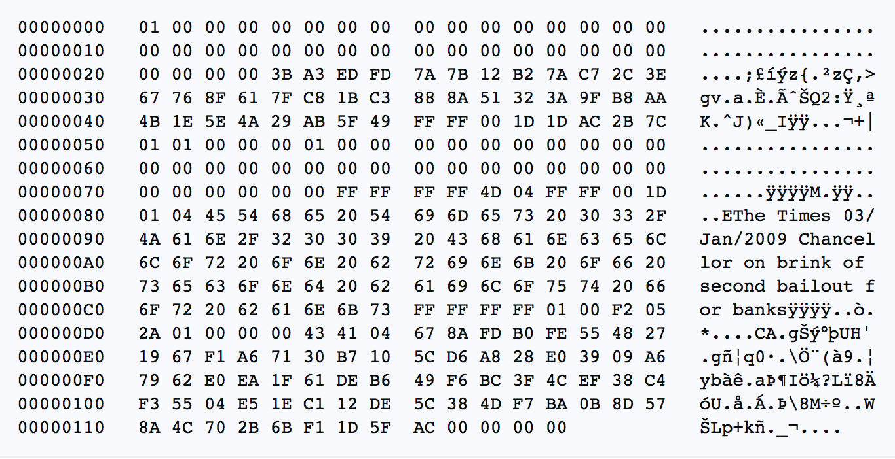

# Chapter 1

# چرا به بیت‌کوین نیاز داریم

## نياز داريم، چون پول خراب است

> *`مشکل ریشه‌ای ارزهای مرسوم، تمام اعتمادی است که برای کارکردن آن لازم است. بانک مرکزی باید مورد اعتماد باشد که ارزش پول را پایین نیاورد، اما تاریخ ارزهای فیات پر از نقض این اعتماد است. بانک‌ها باید مورد اعتماد باشند که پول ما را نگه دارند و آن را به‌صورت الکترونیکی منتقل کنند، اما آن‌ها با موج‌های حباب‌های اعتباری وام می‌دهند و به‌سختی کسری از آن را در ذخیره نگه می‌دارند. ما باید به آن‌ها در مورد حریم خصوصی خود اعتماد کنیم، اعتماد کنیم که اجازه ندهند سارقان هویت حساب‌های ما را خالی کنند.`*

~ ساتوشی ناکاموتو 2009-02-11

* سیستم پول فیات خراب است (همیشه بوده است).
* پایدار نیست (هرگز نبوده است).
* هیچ راهی برای رفع آن وجود ندارد (هرگز نخواهد بود).

---
## استاندارد (نه‌چندان) طلا
* بسیاری از مردم هنوز بر این باورند که پول توسط طلا پشتیبانی می‌شود.
* این‌طور نیست.
* از سال 1971، زمانی که رئیس‌جمهور نیکسون به‌طور یک‌جانبه جهان را از استاندارد طلا خارج کرد (شوک نیکسون)، توسط طلا پشتیبانی نشده است.
* برای به‌دست آوردن تصویری واضح از آسیبی که این کار وارد کرد، به **wtfhappenedin1971.com** مراجعه کنید.

نمودار نشان‌دهنده تورم شاخص قیمت مصرف‌کننده (خط قرمز) در مقابل قدرت خرید دلار آمریکا (خط سیاه) از سال 1971.

<small>اداره آمار کار ایالات متحده، بازیابی‌شده از FRED، بانک فدرال رزرو سنت لوئیس؛ https://
fred.stlouisfed.org/series/CPIAUCSL، 9 ژوئن 2024.</small>

* نکته جالب: مجمع جهانی اقتصاد در سال 1971 تشکیل شد.
---

>**FIAT:** (اسم) /ˈfiː.æt/
>
>: یک دستور معتبر یا خودسرانه: حکم
>
>: یک تعیین معتبر: دستور
>
>**: یک فرمان یا عمل اراده که چیزی را بدون یا طوری ایجاد می‌کند که انگار بدون تلاش بیشتر**

~ merriam-webster.com/dictionary

>**FIAT :** از لاتین fieri «ساخته شدن، به وجود آمدن»

* فیات پولی است که فقط به این دلیل ارزش دارد که دولت می‌گوید (حکم می‌کند) که این‌طور است.
* بنابراین مردم (باید) باور داشته باشند که این‌طور است.
>* **حتی اگر آن‌ها باور ندارند که فیات ارزش دارد، طبق قانون مجبورند از آن استفاده کنند و آن را به‌عنوان پرداخت برای کالاها و خدمات بپذیرند.**
* **پول فیات از هیچ چاپ/ایجاد می‌شود.**
* این روزها حدود 5 درصد از کل دلارها به صورت اسکناس چاپ می‌شوند.
* 95 درصد دیگر به‌صورت دیجیتالی توسط بانک‌ها با واردکردن اعداد در رایانه هنگام صدور وام ایجاد می‌شود.

>*تنها چند سنت برای اداره چاپ و حکاکی هزینه دارد تا یک اسکناس 100 دلاری تولید کند…*

~ اقتصاددان آمریکایی، بری آیکن‌گرین

---

>***اسکات پلی از NBC '60 Minutes':*** *منصفانه است بگوییم شما به‌سادگی سیستم را با پول پر کردید؟*
>
>***جروم پاول، رئیس فدرال رزرو:*** *بله. ما این کار را کردیم.
>این یک روش دیگر برای فکرکردن به آن است. ما این کار را کردیم.*
>
>***پلی:*** *از کجا می‌آید؟
>آیا شما فقط آن را چاپ می‌کنید؟*
>
>***پاول:*** *ما آن را به‌صورت دیجیتالی چاپ می‌کنیم. بنابراین به‌عنوان یک بانک مرکزی، ما
>توانایی ایجاد پول به‌صورت دیجیتالی را داریم. و ما این کار را
>با خرید اوراق خزانه یا اوراق قرضه برای سایر اوراق بهادار تضمین‌شده دولتی انجام می‌دهیم. و این در واقع باعث افزایش عرضه پول می‌شود. ما همچنین ارز واقعی را چاپ می‌کنیم و آن را از طریق بانک‌های فدرال رزرو توزیع می‌کنیم.*

~ مصاحبه CNBC '60 Minutes'، 17 می 2020
دو ماه پس از شروع قرنطینه C*vid-19

>هیچ محدودیتی برای کاری که می‌توانیم انجام دهیم وجود ندارد
با این برنامه‌های وام‌دهی که داریم.

~ جروم پاول، رئیس فدرال رزرو
18 مارس 2020 در CBS News

>بله، مقدار نامحدودی پول نقد در فدرال رزرو وجود دارد. ما هر کاری که لازم باشد انجام خواهیم داد تا مطمئن شویم که پول نقد کافی در سیستم بانکی وجود دارد.

~ نیل کاشکاری، رئیس فدرال رزرو مینیاپولیس
23 مارس 2020، CBS '60 Minutes'

>'ما' در اینجا پنج نفر هستند که در مورد تغییرات رأی می‌دهند
سیاست پولی در سیستم فدرال رزرو
در طول جلسات FOMC. 5 از 330,000,000.
این تمام چیزی است که برای تغییر سیاست پولی ایالات متحده لازم است.

~ مارتین بنت، بنیان‌گذار TFTC.io @
مقاله فوربس، 18 مارس 2020

---

## از زبان خود اسب پیر

>*بانک از بهره تمام پول‌هایی که ایجاد می‌کند، سود می‌برد
از هیچ.*

*~ ویلیام پترسون، 1694
بنیان‌گذار بانک انگلستان*

>*تمام سردرگمی‌ها، آشفتگی‌ها و پریشانی‌ها در آمریکا ناشی می‌شود،
نه از نقص قانون اساسی یا کنفدراسیون،
نه از نبود شرافت یا فضیلت،
به همان اندازه ناشی از جهل محض نسبت به
ماهیت سکه، اعتبار و گردش پول.*

*~ جان آدامز
دومین رئیس‌جمهور ایالات متحده، 1797-1801*

>*من معتقدم که مؤسسات بانکی بیشتر از ارتش‌های دائمی برای آزادی‌های ما خطرناک هستند.
آن‌ها در حال حاضر یک اشرافیت پولی ایجاد کرده‌اند
که دولت را به چالش کشیده است.
قدرت صدور باید از بانک‌ها گرفته شود و
به مردمی که به‌درستی به آن تعلق دارد، بازگردانده شود.*

*~ توماس جفرسون
سومین رئیس‌جمهور ایالات متحده، 1801-1809*

>*در حالی که به اعمال نجیبانه خود می‌بالیدیم، مراقب بودیم که واقعیت زشت را پنهان کنیم
اینکه با یک سیستم پولی ناعادلانه، یک
سیستم ظلم را ملی کرده‌ایم که، هرچند تصفیه شده‌تر،
کمتر از سیستم قدیمی برده‌داری منقول ظالمانه نیست.*

~ هوراس گریلی
نماینده کنگره ایالات متحده 1848-49
بنیان‌گذار نیویورک تریبون

---

>*هر کس حجم پول را در هر کشوری کنترل کند،
استاد مطلق تمام صنعت و تجارت است…
وقتی متوجه شدید که کل سیستم به‌راحتی کنترل می‌شود،
به‌نوعی یا به شکل دیگر، توسط چند مرد قدرتمند در بالا، به شما نیازی نخواهد بود
به شما گفته شود که دوره‌های تورم و رکود از کجا ناشی می‌شوند*

~ جیمز ای. گارفیلد
بیستمین رئیس‌جمهور ایالات متحده، مارس-سپتامبر 1881
ترور شده در سال 1881

>*امروزه در دست گروهی از مردان یک قدرت کنترل‌نشده وجود دارد
تا از هیچ دلاری بسازند.*

~ توماس دبلیو. لاوسون، نویسنده کتاب «مالی دیوانه‌وار»، 1905

>*من به اندازه هر توطئه‌گری پنهان‌کار - در واقع، پنهانی - بودم.
ما می‌دانستیم که کشف به‌هیچ‌وجه نباید اتفاق بیفتد، در غیر این صورت تمام زمان و تلاش ما هدر خواهد رفت. اگر فاش می‌شد که گروه خاص ما گرد هم آمده و یک لایحه بانکی نوشته است، آن لایحه هیچ شانسی برای تصویب توسط کنگره نخواهد داشت.*

~ فرانک ای. وندریپ
رئیس بانک ملی شهر نیویورک
(پیشگام سیتی بانک)
~ نوشتن در سال 1935 از جلسه مخفیانه‌ای که در
جزیره جکیل در سال 1910، برای تهیه پیش‌نویس لایحه‌ای که در سال 1913 به‌عنوان
قانون فدرال رزرو تصویب شد.

>*این قانون (فدرال رزرو) بزرگ‌ترین تراست روی زمین را تأسیس می‌کند. هنگامی که رئیس‌جمهور (وودرو ویلسون) این لایحه را امضا کند،
دولت نامرئی قدرت پولی قانونی خواهد شد…
بدترین جنایت قانونی اعصار توسط این لایحه بانکی و ارزی انجام می‌شود.*

~ چارلز ای. لیندبرگ، پدر
نماینده کنگره ایالات متحده 1907-1917

---

>*من بدبخت‌ترین مرد هستم. من ناآگاهانه کشورم را نابود کرده‌ام.
یک ملت صنعتی بزرگ توسط سیستم اعتباری خود کنترل می‌شود.
سیستم اعتباری ما متمرکز است. رشد ملت،
بنابراین، و تمام فعالیت‌های ما در دست چند مرد است.
ما تبدیل به یکی از بدترین حکومت‌ها، یکی از
کامل‌ترین دولت‌های کنترل‌شده و تحت سلطه در جهان متمدن شده‌ایم.
دیگر نه یک دولت با نظر آزاد، نه یک دولت با
اعتقاد و رأی اکثریت، بلکه یک
دولت با نظر و اجبار
یک گروه کوچک از مردان غالب.*

~ وودرو ویلسون
بیست و هشتمین رئیس‌جمهور ایالات متحده، 1913-1921
6 سال پس از تصویب قانون فدرال رزرو در سال 1913.

>*حقیقت واقعی این است که، همان‌طور که شما و من می‌دانیم،
یک عنصر مالی در مراکز بزرگ
از زمان
اندرو جکسون صاحب دولت ایالات متحده بوده‌اند.*

~ فرانکلین دی. روزولت
سی و دومین رئیس‌جمهور ایالات متحده در نامه‌ای که
در 21 نوامبر 1933 به سرهنگ ای. مندل هاوس نوشته شده است

>*این [رکود] تصادفی نبود.
این یک اتفاق با دقت طراحی‌شده بود….
بانکداران بین‌المللی به دنبال ایجاد
وضعیت ناامیدی در اینجا بودند تا بتوانند
به‌عنوان حاکمان همه ما ظاهر شوند.*

~ نماینده کنگره لوئیس تی. مک‌فادن،
ترور شده در سال 1936

>رئیس کمیته بانکداری و ارزی مجلس نمایندگان
*هر بار که یک بانک وام می‌دهد،
اعتبار بانکی جدید ایجاد می‌شود - سپرده‌های جدید - پول کاملاً جدید.*

~ گراهام اف. تاورز
رئیس بانک مرکزی کانادا، 1934-55

---

>*اگر هیچ بدهی در سیستم پولی ما وجود نداشت،
هیچ پولی وجود نداشت*

*~ مارینر اکلس،
1941، رئیس فدرال رزرو*

>*من هنوز کسی را ندیده‌ام که بتواند از طریق
استفاده از منطق و استدلال، دولت فدرال را توجیه کند
برای قرض‌گرفتن استفاده از پول خودش…
من معتقدم زمانی فرا خواهد رسید که مردم
تقاضا خواهند کرد که این تغییر کند.
من معتقدم زمانی در این کشور فرا خواهد رسید که
آن‌ها در واقع شما و من و
هر کس دیگری را که به کنگره مرتبط است، سرزنش خواهند کرد
به خاطر نشستن بیکار و اجازه دادن به
چنین سیستم احمقانه‌ای برای ادامه.*

~ رایت پاتمن
نماینده کنگره ایالات متحده 1928-1976
رئیس کمیته بانکداری و ارزی 1963-1975

>*وقتی من یا شما چک می‌نویسیم، باید وجوه کافی در حساب ما وجود داشته باشد
برای پوشش چک، اما وقتی فدرال رزرو چکی می‌نویسد،
هیچ سپرده بانکی وجود ندارد که چک از آن برداشت شود. وقتی
فدرال رزرو چکی می‌نویسد، در حال ایجاد پول است*

~ بانک فدرال رزرو بوستون
'به زبان ساده بیان کنیم'، 1984

---

## فدرال رزرو

* فدرال رزرو بانک مرکزی «مستقل» ایالات متحده است.
در سال 1913 با تصویب قانون
فدرال رزرو ایجاد شد.
* ساختاری منحصربه‌فرد دارد، بخشی خصوصی و بخشی دولتی.
* قرار است یک نهاد غیرحزبی و مستقل از نظر سیاسی
در داخل دولت باشد.
* در حالی که هیئت مدیره فدرال رزرو توسط
رئیس‌جمهور منصوب و توسط کنگره تأیید می‌شود،
تصمیمات فدرال رزرو نیازی به تصویب
توسط هیچ‌کس ندارد.**

**این شامل:**

* هیئت مدیره فدرال رزرو
* 12 بانک فدرال رزرو
* کمیته بازار آزاد فدرال (FOMC)،
که نهاد سیاست‌گذاری پولی است.

**فدرال رزرو مسئول موارد زیر است:**

* نظارت بر سیاست پولی ایالات متحده، ترویج اشتغال و قیمت‌های باثبات.
* تنظیم و نظارت بر مؤسسات بانکی و مالی.
* ارائه خدمات پرداخت به مؤسسات مالی.
* ترویج حمایت از مصرف‌کننده و توسعه جامعه.

---

## نکته‌ای در مورد رئیس فدرال رزرو

* **رئیس فدرال رزرو نیز:**

* رئیس کمیته بازار آزاد فدرال (FOMC) است، که در مورد جهت‌گیری سیاست پولی ایالات متحده تصمیم می‌گیرد (به‌عنوان‌مثال: تسهیل مقداری، افزایش نرخ بهره)
* عضو صندوق بین‌المللی پول، IMF
* عضو بانک تسویه‌های بین‌المللی، BIS (بانک بانک‌های مرکزی).
* وزیر دارایی ایالات متحده در G-7
* وزیر دارایی ایالات متحده در G-20

* قدرت **بسیار** زیادی برای یک نفر.

---

## بانکداری ذخیره کسری، بهره و وام

* **بانکداری ذخیره کسری:** تا مارس 2020، بانک‌ها
موظف بودند 10 درصد ذخیره نگه دارند و می‌توانستند
90 درصد را وام دهند.
* **از مارس 2020، هیچ الزامی برای ذخیره وجود ندارد و به بانک‌ها اجازه می‌دهد تا وام‌های نامحدود صادر کنند.**

* وام پول مبتنی بر بدهی است و شما ملزم به پرداخت
بهره روی وام هستید.

>* **نکته جالب 1:** پولی که برای پرداخت بهره وام پرداخت می‌شود، توسط بانک‌ها ایجاد نمی‌شود.
>* **نکته جالب 2:** هرگز ایجاد نمی‌شود.
>* **نکته جالب 3:** پول کافی در
>دنیا برای پرداخت تمام وام‌ها + بهره
>مربوط به آن وام‌ها وجود ندارد.
>* **نکته جالب 4:** هرگز وجود نخواهد داشت!

---

## نکته‌ای در مورد پترو دلار
* می‌توان گفت **که تا سال 1971 دلار توسط طلا پشتیبانی می‌شد و از سال 1974 توسط نفت و در نتیجه به‌طور پیش‌فرض توسط ارتش ایالات متحده پشتیبانی شده است.**
* **در سال 1974 ایالات متحده و عربستان سعودی توافق‌نامه‌های دوجانبه‌ای را برای قیمت‌گذاری فروش نفت به دلار آمریکا منعقد کردند.**
* از آن زمان، بیشتر فروش‌های جهانی نفت به دلار آمریکا تسویه شده است.
* این امر کمک زیادی به تبدیل‌شدن دلار به
قوی‌ترین ارز در جهان کرده است.
* **بنابراین به‌طور مصنوعی تقویت شده است،** حتی در
زمان‌هایی که به‌طور معمول با مشکل مواجه می‌شد.
* از اواخر سال 2022، تعدادی از کشورها شروع
به تجارت با ارزهایی غیر از دلار آمریکا کرده‌اند
* بسیار محتمل است که این می‌تواند شروع
پایان پترو دلار باشد. اتفاقی که در ادامه می‌افتد،
باید دید…

---

## در مورد QE (تسهیل مقداری)
* **تسهیل مقداری یک «سیاست پولی غیرمتعارف» در نظر گرفته می‌شود
که توسط بانک‌های مرکزی برای «تحریک
اقتصاد» استفاده می‌شود، که طی آن فدرال رزرو اوراق قرضه دولتی و سایر اوراق بهادار دولتی را می‌خرد.**
* اولین بار توسط ژاپن بین سال‌های 2001-2006 استفاده شد.
پس از آن، ایالات متحده، بریتانیا و منطقه یورو
از QE در طول بحران مالی 2008 استفاده کردند.
* از آن زمان، تنها زمانی که ایالات متحده برنامه QE
نداشته است، بین سال‌های 2014-2019 بوده است.
* همان‌طور که در زیر مشاهده می‌شود، منتقدان معتقدند که **QE
به‌طور چشمگیری به نفع ثروتمندان است.**

*اعتبار: RudyHavenstein@ در توییتر*

---

## چرخه‌ها

* **در تمام طبیعت، چرخه‌ها، فراز و نشیب‌های طبیعی،
انبساط و انقباض وجود دارد.**

* این **به تعادل و پایداری
کلی و در طول زمان سیستم به‌هم‌پیوسته، کل زندگی روی زمین کمک می‌کند.**
* **سیستم ارزی فیات مبتنی بر بدهی از
خرد چرخه‌های طبیعی چشم‌پوشی می‌کند و در عوض مبتنی بر
و 100٪ متکی به بقای خود بر،
رشد بی‌نظیر و بی‌وقفه است تا بتواند به خدمت
بدهی‌های خود ادامه دهد.
* در طبیعت، این سرطان است.
* در «اقتصاد»، این مسیر غیرطبیعی بیشتر
توسط دولت با کمک مالی به بانک‌های ورشکسته و شرکت‌های بزرگ پشتیبانی می‌شود، تا اینکه اجازه دهد آن‌ها
ورشکست شوند و به چیزی جدید و سالم‌تر بازیافت شوند.
* **کوتاه‌بینی کمک مالی به شرکت‌های ورشکسته کل اقتصاد را در معرض خطر قرار می‌دهد.** در اصل،
این فقط انداختن مشکل به آینده است و آشفتگی اجتناب‌ناپذیری که در پیش است، احتمالاً بسیار، بسیار
شدیدتر از زمانی است که اجازه داده شود چرخه‌های طبیعی اجرا شوند.
* **ما مدیون ساتوشی ناکاموتو و
سایفرپانک‌های قبل و بعد از او هستیم،** به خاطر داشتن
چشم‌انداز، دوراندیشی، عزم و مهارت برای ارائه
یک قایق نجات برای حمل ما به سواحل جدید.

---

* هنگامی که ما هدیه‌ای را که این است درک کردیم، این به ما بستگی دارد که
با تمام قلب و ذهن شفاف، سوار شویم تا
سفر کنیم و دنیای جدیدی را با پول صلح بسازیم.
>* **بیت‌کوین پول را اصلاح می‌کند، این به ما بستگی دارد که بقیه را اصلاح کنیم.
و برای اینکه واضح باشد، با ثابت‌شدن پول، چیزهای بسیار دیگری به‌طور پیش‌فرض اصلاح می‌شوند**

* نکته اصلی این است که جنگ جنبشی در مقیاس بزرگ که توسط دولت آغاز شده، بدون حمایت مردم، دیگر سودآور یا ممکن نخواهد بود.
* علاوه بر این، به‌طور طبیعی مصرف کمتری وجود خواهد داشت،
همراه با تغییر به سمت کالاها و خدمات با ارزش واقعی، بازارهای آزاد، پس‌انداز واقعی و کاهش پولی
مسکن و املاک و مستغلاتی که هرگز قرار نبود در وهله اول پولی شوند.
* **مشاهده کنید:** بیت‌کوین این را اصلاح می‌کند، صفحه 32
---

## نياز داريم، چون تورم دزدی است

نمودار FRED 2024 که نشان‌دهنده کاهش قدرت خرید
دلار از زمان تشکیل فدرال رزرو در
سال 1913 است. نرخ تجمعی تورم از سال 1913 در حدود
3.067% است. تمام ارزهای فیات بانک مرکزی در سراسر جهان
از نرخ مشابهی از کاهش پیروی می‌کنند.

* **هرچه پول بیشتری از هیچ ایجاد شود،
ارزش/قدرت خرید همه پول‌ها بیشتر کاهش می‌یابد.**
* به این **تورم** می‌گویند.
* تورم به‌معنای واقعی کلمه **دزدی زمان** است. ارزش
زمان شما زمانی دزدیده می‌شود که آن را در ارزی ذخیره می‌کنید که
متورم، بی‌ارزش و دست‌کاری می‌شود.
* تورم همچنین یک **مالیات پنهان** است.

---

* این دزدی زمان و مالیات بر تمام ارزهای فیات کشورهای دیگر نیز تأثیر گذاشته است، زیرا همه آن‌ها
به دلار آمریکا متصل شده‌اند، زیرا از زمان توافق‌نامه برتون وودز در سال 1944
ارز ذخیره جهانی بوده است.
* **در ایالات متحده آمریکا، نرخ تورم سالانه 2% در
دستور فدرال رزرو نوشته شده است.**
* این بدان معناست که **شما تضمین شده‌اید که بتوانید
با همان اسکناس 20 دلاری هر سال 2% کمتر خرید کنید.**
* **در مارس 2024، نرخ تورم سالانه 3.5% بود،**
(خیلی بیشتر از 2%، به این معنی که شما 3.5% از
قدرت خرید خود را بین مارس 2023 و
مارس 2024 از دست دادید.
* به‌عبارت‌دیگر، این بدان معناست که به‌طور متوسط، قیمت‌ها
3.5% افزایش یافت.
* **اگر تورم به‌درستی اندازه‌گیری می‌شد، همان‌طور که
تا اوایل دهه 1980 انجام می‌شد، در واقع به
10% در سال 2024 نزدیک‌تر بود.**
* هنگام بررسی بر اساس دسته‌بندی، مشاهده می‌شود که
تورم در بسیاری از دسته‌بندی‌ها در سال گذشته
بسیار بدتر از 3.5% است.
* وقتی کسی به اجاره، قبض مواد غذایی، قیمت گاز،
تقریباً هر چیزی که می‌خرد نگاه می‌کند، کاملاً مشخص است که
تورم در هر بخش بیداد می‌کند.

---
**میانگین تورم در طول
50 سال گذشته در ایالات متحده:**

| هزینه متوسط | 1971 | 2021 | % افزایش |
| --- | --- | --- | --- |
| حقوق | 9,400 دلار | 59,400 دلار | 532% |
| خانه | 23,400 دلار | 513,000 دلار | 2,092% |
| گالن بنزین | 0.36 دلار | 4.17 دلار | 1,058% |
| ماشین نو | 3,400 دلار | 47,000 دلار | 1,282% |
| مدرک دانشگاهی | 1,400 دلار | 26,000 دلار | 1,757% |
| سبد خرید مواد غذایی | 20 دلار | 210 دلار | 950% |
| برق/کیلووات ساعت | 0.02 دلار | 0.15 دلار | 650% |

>**داستان واقعی:**
~ خانه‌ای در سال 1976 به قیمت 58,000 دلار خریداری شد.
~ هنگام محاسبه تورم "رسمی"، این مبلغ
279,000 دلار در سال 2022 خواهد بود.
~ در سال 2022 ارزش همان خانه 2.09 میلیون دلار بود.
~ در این مورد فکر کنید…

>*ارز فیات اطلاعات نادرست است.
یک اسکناس 10 دلاری چه اطلاعاتی را منتقل می‌کند؟
10 صورت یک کسر با
مخرج از دست رفته است.
10 از چند؟
10 بدون مخرج شناخته شده
و پایدار هیچ چیزی نمی‌گوید.*

~ bitlany@

---

* **همان‌طور که تورم افزایش می‌یابد، پس‌اندازهای شما (اگر خوش‌شانس
باشید که پس‌انداز داشته باشید)، ارزش خود را از دست می‌دهند.**
* با گذشت زمان، آن‌ها **بسیار** ارزش خود را از دست می‌دهند
>*اگر امروز شروع به پس‌انداز 100 دلار در ماه کنید، با
بهترین نرخ بهره موجود 0.05%:
> * در 30 سال شما **84,019 دلار** پس‌انداز کرده‌اید.
>* با تعدیل برای تورم 2٪ تعیین شده توسط فدرال رزرو
>* در 30 سال پس‌انداز شما قدرت خرید مؤثر فقط **46,384 دلار** را خواهد داشت.
>* تعدیل برای تورم امروزی 3.5%:
>* پس‌انداز 84,019 دلاری شما قدرت خرید فقط **11,037 دلار** را در 30 سال خواهد داشت!

* **در واقع این بدان معناست که تقریباً شش از
هفت ساعت کار شما دزدیده شده است = *دزدی زمان.***

---
**روش دیگری برای نگاه‌کردن به آن به شرح زیر است:**
* در **1971**، هزینه یک خانه = **2.5** برابر متوسط
حقوق سالانه.
* در **2024**، هزینه یک خانه = **8.6** برابر یک
حقوق سالانه متوسط.
* در **1971**، یک ماشین جدید حدود **1/3** از یک حقوق متوسط هزینه داشت
* در **2024**، یک ماشین جدید بیش از **3/4** از یک حقوق متوسط هزینه دارد.

من اطمینان دارم که اکنون مشخص شده است که
تورم
به نفع شما
* **کار نمی‌کند** *.

**توجه:** تمام این اعداد میانگین هستند و بر اساس
عوامل بسیاری متغیر هستند. نکته اصلی این است که تورم یک مالیات پنهان است
و دزدی زمان از کار و تولید واقعی ما است

>* **پول سخت این را اصلاح می‌کند.**
>* **بیت‌کوین پول سخت است**
---

## ما نیاز داریم تا اقتصاد متمرکز کنترل‌شده، دست‌کاری‌شده و مبتنی بر بدهی را جایگزین کنیم

>*من معتقدم که هرگز پول خوبی نخواهیم داشت،
قبل از اینکه این چیز را از دست دولت خارج کنیم،
یعنی نمی‌توانیم آن‌ها را به‌زور از دست
دولت خارج کنیم، تنها کاری که می‌توانیم انجام دهیم این است که با یک روش دزدکی و دور زدن چیزی را معرفی کنیم که نتوانند متوقف کنند.*

~ فردریش هایک، 1984
اقتصاددان، فیلسوف و نویسنده اتریشی، 1899-1992

نمودار نشان‌دهنده افزایش نمایی عرضه پول M1 از
4 تریلیون دلار در مارس 2020 به بیش از 18 تریلیون دلار در ژوئن 2024.

* **مغزتان را منفجر کنید:** https://usdebtclock.org/
---
* **45 درصد از تمام دلارهای ایالات متحده موجود بین آوریل 2020 و ژانویه 2022 چاپ شده‌اند!**
* به یاد دارید که از هیچ چاپ شده است؟
* پول فیات به‌طور متمرکز توسط دولت کنترل می‌شود و
عرضه آن به‌راحتی دست‌کاری می‌شود.
* **205 سال طول کشید تا بدهی ملی ایالات متحده به
1 تریلیون دلار برسد. (1776 > 1981)**
* فقط **33 سال دیگر طول کشید تا بدهی ملی ایالات متحده
به 34 تریلیون دلار برسد!** (1981 > 2024)

نمودار FRED که نشان‌دهنده کل بدهی عمومی 1970-2024 در ایالات متحده است.

>*بدهی جهانی، که توسط مؤسسه
امور مالی بین‌المللی اندازه‌گیری می‌شود، اکنون در مجموع 303 تریلیون دلار است.
این سیاره ما در فیات مبتنی بر بدهی است.
به هر حال، تولید ناخالص داخلی جهانی فقط 84 تریلیون دلار است.*

*~ نیک بهاتیا، نویسنده کتاب «پول لایه‌بندی‌شده»، 2021*

---

* **برای اطلاع شما**

| **اگر دارید:** | **می‌توانید 1 دلار در ثانیه خرج کنید** | |
| ------------ | ----------------------- | -------------- |
| **1 میلیون دلار** | یا 11 روز | = 11 روز |
| **1 میلیارد دلار** | به مدت 11,680 روز | = 32 سال |
| **1 تریلیون دلار** | به مدت 11,680,000 روز | = 32000 سال |

* ما همه در معرض رحمت کسانی هستیم که قدرت
تصمیم‌گیری برای چه زمانی چاپ بیشتر و چه نرخ‌های بهره‌ای
را دارند.
* **اگر فدرال رزرو نرخ‌های بهره را افزایش دهد، گرفتن
وام برای خانه یا ماشین ناگهان گران‌تر می‌شود، که باعث کاهش سرعت
هزینه‌کردن می‌شود و منجر به رکود تورمی می‌شود**

* **اگر آن‌ها نرخ‌ها را به‌طور مصنوعی پایین نگه دارند، وارد یک دوره افسردگی می‌شویم**

>* **اجازه دادن به بانک مرکزی برای ایجاد
«آب‌وهوای» مالی آزادی ما را برای اینکه اجازه دهیم بازار تصمیم بگیرد چه چیزی ارزش دارد و چه چیزی ارزش ندارد، می‌گیرد.**

* علاوه بر این، **هنگامی که آن‌ها به بانک‌ها و شرکت‌ها کمک مالی می‌کنند، به‌طور مصنوعی اقتصاد را تقویت می‌کنند.** فقط
مسئله زمان است که خانه پوشالی فرو می‌ریزد.
* استدلال اصلی برای داشتن یک بانک مرکزی این بود
که وقتی اقتصاد دچار تزلزل می‌شود، باید یک وام‌دهنده آخرین‌راه وجود داشته باشد.

---
* **این به این تبدیل شده است که بانک مرکزی یک حاکم
اولین‌راه است، با قدرت بی‌نظیر، منتخب‌نشده و در نهایت
اقتدارگرا.**

> *همه پول‌ها سیاسی هستند، به‌جز بیت‌کوین.
ارزهای فیات، ابزارهای بانکی، اعتبارات فین‌تک،
سایر ارزهای رمزنگاری‌شده و حتی طلا همه توسط
دولت‌ها، شرکت‌ها یا گروه‌های کوچک کنترل می‌شوند.
داشتن یک استثنا بسیار مفید خواهد بود
وقتی به آینده می‌رویم.*

*~ الکس گلدشتاین @gladstein
مدیر ارشد استراتژی بنیاد حقوق بشر*

>*بیت‌کوین 8 میلیارد نفر را به هم متصل می‌کند، صد میلیون شرکت را به هم متصل می‌کند، جهان را در حوزه‌های قضایی سیاسی هماهنگ می‌کند و عقلانیت را به کل سیستم مالی بازمی‌گرداند و آزادی و حقوق مالکیت را به کل نژاد بشر بازمی‌گرداند*

*~ مایکل سیلور
مدیرعامل Microstrategy*

---

## ما نیاز داریم تا به افراد بدون حساب بانکی خدمات ارائه دهیم

>*برای 953 میلیون نفر در 20 کشور با ارزهای ضعیف‌شده، بیت‌کوین چیزی بزرگ‌تر از
یک دارایی خزانه‌داری است. برای آن‌ها، بیشتر شبیه یک کشتی
انرژی رمزگذاری‌شده برای فرار از سیل است.*

*~ مایکل سیلور
مدیرعامل Microstrategy*

* **از سال 2024، تقریباً 25 درصد از بزرگسالان در
جهان بدون حساب بانکی هستند، حدود 1.4 میلیارد نفر!**

>* **این بدان معناست که آن‌ها به خدمات بانکی
>دسترسی ندارند و نمی‌توانند از دستگاه‌های خودپرداز، کارت‌های نقدی، کارت‌های اعتباری یا
>چک‌ها استفاده کنند.**
>* **علاوه بر این، آن‌ها قادر به دریافت وام برای شروع
کسب‌وکار، خرید ماشین یا خانه و غیره نیستند.**

* **ارسال و دریافت پول، یا نقدکردن چک‌ها،
گران است.**

* آن‌ها باید از خدمات انتقال پول و نقدکردن چک مانند وسترن یونیون استفاده کنند که نرخ‌های بالایی دریافت می‌کنند
و زمان می‌برد تا پردازش شوند.

* این **به‌ویژه برای افرادی که پول را به
خانواده‌های خود** در کشورهای دیگر (حواله‌ها) می‌فرستند گران است که می‌تواند تا 10% یا 12% از طریق بانک هزینه داشته باشد.

---
* این **برای کسانی که حواله‌ها را دریافت می‌کنند گران و زمان‌بر است،** زیرا آن‌ها باید هزینه حمل‌ونقل را بپردازند و
به دفتر انتقال پول بروند، که اغلب دور از جایی که زندگی می‌کنند، تا پولی را که یکی از اعضای خانواده‌شان فرستاده است، دریافت کنند.

* اغلب سفر به این دفاتر برای آن‌ها امن نیست.
* بیت‌کوین، از طریق شبکه لایتنینگ، یک
راه‌حل فوری برای این مشکلات اکنون ارائه می‌دهد!

***#بیت‌کوین این را حل می‌کند***
>*چه زمانی یک فناوری که به مردم قدرت می‌دهد
متوقف شده است؟*

*~ جف بوث
نویسنده: قیمت فردا*

---

## ما باید به مردم کمک کنیم از استبداد و فروپاشی ارز فرار کنند

* همان‌طور که دیدیم، در طول چند سال گذشته،
دولت‌ها می‌توانند و حساب‌های بانکی
کسانی را که با آن‌ها مخالف هستند مسدود می‌کنند.

>* **این نشان می‌دهد که، در اصل، پول شما در بانک چیزی نیست جز یک IOU که می‌تواند در هر زمان از شما دزدیده شود.**

* علاوه بر این، وقتی تورم بیداد می‌کند، همان‌طور که در حال حاضر در سال 2024 در ونزوئلا (283%)، سودان (63%)، لبنان (212%)، سوریه (79%)، آرژانتین (161%)، زیمبابوه (47%)، ترکیه (64%) و بیشتر می‌بینیم، پس‌اندازهای مردم ناپدید می‌شود، گاهی یک‌شبه، و هیچ کاری نمی‌توانند در مورد آن انجام دهند.
* برای افرادی که هر یک از موارد بالا را تجربه می‌کنند، **بیت‌کوین
به یک راه‌حل واقعی و فوری برای
یک مشکل غیرقابل‌تحمل تبدیل می‌شود.**
* **با توجه به اینکه استبداد و تورم
در بسیاری از مکان‌ها در حال افزایش است، عاقلانه است که
با خرید بیت‌کوین اکنون در برابر آن‌ها محافظت کنید.**
---
## ما باید از CBDCها اجتناب کنیم
* شاید شنیده باشید که **بانک‌های مرکزی در حال شروع به
ایجاد CBDCها، ارزهای دیجیتال بانک مرکزی هستند.**
در می 2020، 35 کشور در حال بررسی این گزینه بودند.
* در مارس 2022، 87 کشور به‌طور فعال در حال بررسی بودند
یا قبلاً یک CBDC آزمای

# Chapter 2

# این شمولیت مالی را اصلاح می کند
* **با بیت کوین، همه به یک سیستم مالی *یکسان* دسترسی دارند، با قوانین *یکسان* برای همه.**
* هیچ حفره یا درب پشتی یا معاملات ویژه ای برای هیچ کس وجود ندارد.
* همه این پتانسیل را دارند که برای ارزشی که ارائه می دهند با همان پول واقعی جبران شوند، که با قوانین یکسان ایجاد و نگهداری می شود.
* **بیت کوین برای هر کسی، در هر مکانی که به اینترنت متصل است، در دسترس است.**

## افزودن ارزش به جهان
* **بیت کوین مردم را تشویق می کند تا ارزش واقعی به جامعه و بازار اضافه کنند،** زیرا این تنها راه کسب درآمد بیشتر است.
* اگر کسی به کمتر راضی باشد، باز هم از کار کردن با دستمزد منصفانه سود می برد، و **هنگامی که کسی پس انداز می کند، آن پس اندازها ارزش خود را در طول زمان حفظ می کنند.**

---
## این محیط را اصلاح می کند
* پول سالم با عرضه ای که به سختی محدود شده است، پویایی بسیار متفاوتی نسبت به آنچه که توسط چاپ پول نامحدود و مبتنی بر بدهی ایجاد شده است، ایجاد می کند.
* به جای یک انگیزه غیرقابل توقف برای مصرف هر چه بیشتر، در یک مسابقه نزولی برای پرداخت نرخ بهره مرکب بر روی وام ها و بدهی هایی که در نهایت هرگز پرداخت نخواهند شد، **بیت کوین یک خروجی به دنیایی را فراهم می کند که در آن یک ترجیح زمانی پایین مورد توجه قرار می گیرد.**
>* تخریب بی رویه محیط زیست با **مصرف کمتر، زباله کمتر و رویکردی سنجیده به تولید جایگزین می شود،** جایی که بازار تصمیم می گیرد چه چیزی ارزش واقعی دارد، و بنابراین چیزها طوری ساخته می شوند که ماندگار باشند.
* این یک سود خالص برای مردم، گیاهان و حیوانات است!
---
## این جنگ را اصلاح می کند
* چاپ نامحدود سیستم پولی فیات چیزی است که "جنگ های ابدی" را ممکن و سودآور می کند.
* از آنجایی که مردم عمدتاً در مورد نحوه عملکرد هزینه های جنگ یا اینکه پول جنگ از کجا می آید بی اطلاع هستند، پاسخگویی کمی از سوی دولت وجود دارد. جنگ ها می توانند سال ها در مکان های دورافتاده، بدون نظارت واقعی، ادامه یابند.
* جنگ ها با شروع از ویتنام، به "جنگ های کارت اعتباری" تبدیل شده اند (با تشکر از ‎@AlexGladstein‎‏ )، زیرا دولت برای تامین مالی جنگ ها پول قرض می گیرد و سپس پول بیشتری قرض می گیرد تا سود وام های اولیه را بپردازد... بشویید و تکرار کنید.
>* **در یک استاندارد بیت کوین، لازم است که مردم یک کشور مایل به کمک به پرداخت هزینه های جنگ باشند. احتمالاً آنها این کار را فقط در صورتی انجام می دهند که کاملاً و به وضوح ضروری باشد، برای دفاع از خانواده ها و کشور خود، با یک هدف نهایی در سایت.**
* از آنجایی که هیچ سود بیجایی برای کسب وجود نخواهد داشت، مقامات دولتی و شرکت ها برای ترویج یا مشارکت در جنگ به عنوان یک گزینه قابل اجرا، انگیزه نخواهند داشت.
* **تلاش ها برای یافتن راه هایی برای رسیدن به راه حل های صلح آمیز و کم هزینه به طور چشمگیری افزایش می یابد.**
---
## این ترجیح زمانی را اصلاح می کند

**ترجیح زمانی بالا:** رضایت فوری، بی صبری، برنامه ریزی کوتاه مدت
**ترجیح زمانی پایین:** رضایت تاخیری، صبر، برنامه ریزی بلند مدت

* ترجیح زمانی بالا منجر به تخریب شخصی، اجتماعی و محیطی می شود. وقتی پول ما هر روز ارزش خود را از دست می دهد، ما "مجبور" می شویم بی تاب باشیم و آن را در اسرع وقت خرج کنیم، قبل از اینکه ارزش بیشتری را از دست بدهد.
* وقتی زمان ما توسط یک ارز فیات همیشه متورم بی ارزش می شود، ارتباط خود را با ارزش زمان خود از دست می دهیم.
* این منجر به قطع ارتباط و یک جریان زیرین از استرس می شود.
* تلاش برای کاهش استرس و یافتن معنا، تحریف می شود و به حواس پرتی هایی مانند مصرف بیش از حد مواد مخدر، الکل، خرید، هرزه نگاری، فست فود، دامنه توجه کوتاه، اعتیاد به صفحه نمایش/رسانه های اجتماعی، تصمیمات تکانشی و غیره تبدیل می شود.
* **از سوی دیگر، پول سالم، که ارزش خود را در طول زمان حفظ می کند و سهم ما را از طریق کارمان به درستی اندازه گیری می کند، منجر به ترجیح زمانی پایین، کیفیت زندگی متفکرانه، با روابط معنادار، مصرف کمتر، ارتباط عمیق تر، مکالمه عمیق تر، اهداف بلند مدت و افزایش خلاقیت می شود.**
---

# Chapter 3

# بیت کوین چیست؟

>*"توضیح دادن این چیز برای مخاطبان عمومی خیلی سخته.
هیچ چیزی نیست که بشه باهاش مرتبطش کرد."*

~ ساتوشی ناکاموتو ۲۰۱۰-۰۷-۰۵

>*"گردش کل ۲۱،۰۰۰،۰۰۰ سکه خواهد بود. این به گره‌های شبکه (ماینرها) زمانی که بلاک می‌سازند توزیع خواهد شد و مقدار آن هر ۴ سال نصف می‌شود.
۴ سال اول: ۱۰،۵۰۰،۰۰۰ سکه
۴ سال بعد: ۵،۲۵۰،۰۰۰ سکه
۴ سال بعد: ۲،۶۲۵،۰۰۰ سکه
۴ سال بعد: ۱،۳۱۲،۵۰۰ سکه و غیره...
وقتی تموم شد، سیستم میتونه از کارمزد تراکنش‌ها پشتیبانی کنه اگه نیاز باشه. این بر اساس رقابت بازار آزاد است و احتمالاً همیشه گره‌هایی هستند که مایل به پردازش تراکنش‌ها به صورت رایگان باشند."*

~ ساتوشی ناکاموتو ۲۰۰۹-۰۱-۰۹

* **بیت کوین پول آزادی است...** به این معنا که این پتانسیل را دارد که همه ما را از دستکاری بیش از حد توسط سیستم بانکداری مرکزی و کنترل آن آزاد کند.
* **در بیت کوین، قوانین پولی برای همه، در همه جا یکسان است.**
* بیت کوین فراگیر است، به این معنا که هر کسی که اتصال اینترنت دارد می‌تواند در شبکه شرکت کند و **باید طبق قوانین یکسان بازی کند.**

---
## بیت کوین این است:
* **غیر متمرکز**
* **به شدت کمیاب**
* **مقاوم در برابر سانسور**
* **یک دفتر کل توزیع شده**
* **فساد ناپذیر**
* بدون نیاز به اجازه
* قابل حسابرسی
* شفاف
* تغییر ناپذیر
* بدون مرز
* جعل کردنش سخته
* شبه ناشناس
* بدون اصطکاک
* بدون اعتماد
* همتا به همتا
---
* بیت کوین غیرمتمرکز است.
* **این بر روی هزاران گره در سراسر جهان، توسط هزاران نفر که همدیگر را نمی شناسند، اجرا می شود.**
* هیچ شخص، دولت یا شرکتی نمی تواند آن را کنترل کند.
* شما هم می توانید یک گره را اجرا کنید، آسان است ;)
* با اجرای گره خود، حریم خصوصی خود را افزایش می دهید و به امنیت شبکه در هنگام تأیید تراکنش های خود کمک می کنید.
> **اعتماد نکنید. بررسی کنید**
---
* **بیت کوین (حرف بزرگ 'B')** یک شبکه پولی است.
* **بیت کوین (حرف کوچک 'b')** ارز یا دارایی پولی است که در شبکه بیت کوین صادر و اجرا می شود.

---
* **بیت کوین انگیزه دهنده بزرگ است.**
>* **نبوع ساتوشی به گونه ای بود که در بیت کوین، برای اولین بار، هم بازیگران خوب و هم بازیگران بد انگیزه دارند که طبق قوانین بازی کنند.**

> *"انگیزه ممکن است به تشویق
> گره ها برای صادق ماندن کمک کند.
> اگر یک مهاجم حریص بتواند بیشتر از تمام
> گره های صادق، قدرت اثبات کار CPU را جمع آوری کند،
> باید بین استفاده از آن برای تقلب از مردم با
> دزدیدن پرداخت های خود، یا استفاده از آن برای تولید
> سکه های جدید یکی را انتخاب کند.
> باید برای او سودآورتر باشد که طبق قوانین بازی کند،
> قوانینی که او را با سکه های جدید بیشتری نسبت به
> همه افراد دیگر ترکیب می کند، تا اینکه
> سیستم و اعتبار ثروت خود را تضعیف کند."*

~ ساتوشی ناکاموتو ۲۰۰۸-۱۰-۳۱

---
* **بیت کوین اولین پول دیجیتال بومی است،** برخلاف حساب جاری آنلاین شما، که فقط یک شکل دیجیتالی از پول فیات بانک مرکزی است.
* بیت کوین یک ارز دیجیتال **غیرمتمرکز** است.
* بیت کوین **مرجع مرکزی ندارد.**
* بیت کوین **بدون دولت است.**
* پیامدها را در نظر بگیرید ...

>*بیت کوین یک ارز دیجیتال غیرمتمرکز است که امکان پرداخت های فوری به هر کسی، در هر کجای دنیا را فراهم می کند.
بیت کوین از فناوری همتا به همتا برای کارکرد بدون مرجع مرکزی استفاده می کند: مدیریت تراکنش و صدور پول به طور جمعی توسط شبکه انجام می شود.*

~ ویکی بیت کوین
en.bitcoin.it

---
* بیت کوین پول جادویی اینترنتی است.
* جدی میگم، **بیت کوین راهی است که ما می خواهیم جهان را درست کنیم.**
* جدی؟ بله.
---
* **بیت کوین راهی برای انتقال ارزش است**
 * از هر مقداری
 * امن
 * فوراً (در شبکه لایتنینگ)
 * بین هر دو طرف
 * هر زمان
 * 24/7
 * هر جا
 * بله، هر جا
 * بهش فکر کن.

 ---

>*با پول الکترونیکی مبتنی بر اثبات رمزنگاری، بدون نیاز به اعتماد به یک واسطه شخص ثالث، پول می تواند امن و تراکنش ها بدون زحمت باشند.*

~ ساتوشی ناکاموتو ۲۰۰۹-۰۲-۱۱

---
>*حرکت بیت کوین (تقریباً) بدون هزینه و با اطمینان است.
من با اطمینان ۱۰۰٪ می دانم که چه چیزی دریافت می کنم.*

~ مایکل سیلور مدیرعامل Microstrategy

* شما می توانید ۱.۱۳ دلار، یا ۴۶ سنت یا ۳۵۹ سات یا ۵۰۰،۰۰۰،۰۰۰ سات یا ۱ میلیون دلار را به هر کسی، در هر کجا، هر زمان از طریق شبکه بیت کوین، یا شبکه لایتنینگ ساخته شده بر روی بیت کوین ارسال کنید.
* **و هیچ کس نمی تواند شما را متوقف کند.**
* آیا می توانید این کار را با طلا، نقره، USD/GBP/EUR/YEN/CYK/ZAR یا هر ارز فیات بانک مرکزی دیگری انجام دهید؟

---
* **بیت کوین تاریخی است.** این اولین بار در تاریخ است که یک سیستم پولی واقعاً غیرمتمرکز، مقاوم در برابر سانسور، تغییرناپذیر، بدون مرز، بدون نیاز به اجازه و فسادناپذیر با سقف سخت مطلق (۲۱ میلیون سکه) ایجاد شده است.
>* بیت کوین **به اندازه اختراع دستگاه چاپ و بعداً شبکه جهانی وب، برای تمرکز زدایی قدرت و افزایش شمول مالی مهم است، که برای تمرکز زدایی کنترل و افزایش دسترسی به اطلاعات بود.**

>*خیلی از مردم به طور خودکار
>ارز الکترونیکی را به عنوان یک علت از دست رفته رد می کنند
>زیرا تمام شرکت هایی که شکست خوردند
>از دهه 1990 به این طرف.
>امیدوارم بدیهی باشد که این فقط
>ماهیت متمرکز کنترل شده آن سیستم ها بود
>که آنها را محکوم کرد.
>فکر می کنم این اولین باری است که ما در حال تلاش هستیم
>یک سیستم غیرمتمرکز و غیر مبتنی بر اعتماد.*

~ ساتوشی ناکاموتو ۲۰۰۹-۰۲-۱۵
---
* **بیت کوین یک دفتر حساب توزیع شده، غیرمتمرکز، شفاف و تغییر ناپذیر است.**
* هر کسی در جهان می تواند ببیند چه کسی چه چیزی را در هر لحظه مالک است و نمی توان آن را تغییر داد.
* به جز اینکه «چه کسی» یک نام نیست، **بلکه یک آدرس است که از اعداد و حروف تشکیل شده است.**
>* نمونه ای از یک آدرس بیت کوین:
>**bc1qar0srrr7xfkvy5l643lydnw9re59gtzzwf5mdq**

* بنابراین بیت کوین **شبه ناشناس** است.
---
* **بیت کوین این است**
* یک صادرکننده بی طرف دارایی
* یک ذخیره ارزش
* یک وسیله مبادله
* و به زودی یک واحد حساب
* **همچنین**
* **وسیله** مبادله.

* این صادرکننده، طلا، پول نقد، کارت اعتباری و پی پال، بانک، ونمو، کش اپ، وسترن یونیون است.

**همه در یک جا جمع شده اند!**

---
* **بیت کوین یک نگهدارنده سوابق است که به جای بانکداران، دفترداران و حسابداران از ریاضیات و علوم کامپیوتر استفاده می کند.**
* این واسطه ها، بانک ها، دولت ها، هزینه های اضافه برداشت، هزینه های حساب جاری، ساعات محدود خدمات، پتانسیل سانسور، حساب های مسدود شده، دستکاری در عرضه پول، نرخ بهره، صندوق بین المللی پول، مجمع جهانی اقتصاد، بانک تسویه حساب های بین المللی، ساختمان های آجری و ملاتی، دستگاه های خودپرداز، چک ها، برگشت هزینه ها، دلار نفتی، دلار یورو، حق ضرب سکه بانک، اثر کانتیلون، بانکداری ذخیره کسری، ویزا، مسترکارت، امریکن اکسپرس، وسترن یونیون، روزها انتظار برای انجام انتقال سیم کشی شما را حذف می کند ...

>* **به جای اینکه کسی بین شما و شخصی باشد که می خواهید دستش را بفشارید، می توانید مستقیماً دست او را بفشارید.**
>* **نیازی به اجازه گرفتن برای ارسال پول خود نیست!**
---

## به زبان ساده ...
* **بیت کوین دارایی دیجیتالی است که هیچ کس نمی تواند از شما بگیرد.**
* >داشتن بیت کوین به معنای داشتن حق ارسال ارزش از یک آدرس خاص است که شما با کلید خصوصی خود آن را کنترل می کنید به هر آدرس دیگری که انتخاب می کنید.

*بیت کوین یک حق مالکیت است که مستقل از انحصار خشونت است.*

~ رابرت بریدلاو @breedlove22

---

* **بیت کوین یک رویداد یک بار در گونه است.**
* بیت کوین انتخاب است.
* بیت کوین **حاکمیت را ایجاد می کند.**
>* **کشف بیت کوین ۱۵ سال پیش، برای آزادی مالی و حاکمیت انسان، به اندازه کشف آتش برای شکوفایی انسان در بیش از ۵۰۰۰۰۰ سال پیش، و ماشین چاپ برای تمرکز زدایی دسترسی به دانش انسانی نزدیک به ۹۰۰ سال پیش، مهم است.**

---
* **بیت کوین یک ذخیره ارزش واقعی است.**
* این با ارزش ترین منبع شما، وقت شما را به گونه ای ذخیره می کند که بتوانید بعداً دوباره به آن دسترسی داشته باشید.
>*بیت کوین مانند یک مجرای پرپهنای باند انرژی به سوی خودِ آینده تان است... می توانید امروز کار کنید و بیت کوین انرژی شما را برای استفاده بعدی منجمد می کند.*

~ رابرت بریدلاو

>*ریشه پول زمان است
>و ریشه زمان ارزش است*

~ گای سوان

---
* بیت کوین یک زنجیره زمانی است، به معنای واقعی کلمه.
* ساتوشی بارها در ایمیل های خود با توسعه دهندگان اولیه به زنجیره زمانی اشاره کرد.
* شما می توانید زمان را بر حسب بلوک اندازه گیری کنید، زیرا هر ~10 دقیقه یک بلوک استخراج می شود.
>* **زمان ما کمیاب ترین و گرانبها ترین منبع ما است.**
>* **این نیروی حیاتی واقعی ماست.**
>* **پول واقعی به ما امکان می دهد تا زمان خود را ذخیره کنیم.**

* این راهی است که ما می توانیم زمانی را که «صرف کردیم» تصدیق کنیم.
* ما **وقت خود را با پول معامله می کنیم، که به سادگی یک رکورد از زمان و تلاش ما است.**
* **بیت کوین این امکان را فراهم می کند که زمان خود را حفظ کنیم به گونه ای که در اواخر زندگی، زمانی که دیگر نمی توانیم مانند گذشته کار کنیم، به آن «دسترسی» داشته باشیم.**
---
* بیت کوین یک **ذخیره ارزش** است.
* بیت کوین یک **وسیله مبادله** است.
* بیت کوین **روزی یک واحد حساب خواهد بود.**
* بیت کوین **روزی *واحد حساب* خواهد بود.**
---
* **بیت کوین کمیاب است**
* سقف سختی ۲۱،۰۰۰،۰۰۰ دارد.
* هرگز بیشتر از این نخواهد بود.
* اینجا کد قانون است.*

*در حالی که «از نظر فنی» امکان تغییر کد وجود دارد، نبوغ ساتوشی از این امر جلوگیری می کند، زیرا افزایش (تورم) عرضه فقط باعث کاهش ارزش تمام بیت کوین های در گردش می شود. بنابراین به همه انگیزه می دهد تا به طور ضمنی موافقت کنند که عرضه سقف سخت ۲۱،۰۰۰،۰۰۰ را حفظ کنند.

* برای بررسی ارتفاع فعلی بلوک، عرضه در دسترس و معیارهای متعدد دیگر مربوط به زنجیره زمانی بیت کوین، **timechaincalendar.com** را توسط @TC بررسی کنید.
---
* **بیت کوین بی نهایت قابل تقسیم است، بدون اینکه ارزش عرضه را کاهش دهد.**
* **یک پیتزا یک پیتزا است، صرف نظر از اینکه برش ها چقدر کوچک باشند.**
* در حال حاضر تا رقم هشتم اعشار قابل تقسیم است: 1.00000000
* در ۱ بیت کوین ۱۰۰،۰۰۰،۰۰۰ ساتوشی وجود دارد.
* ۱ ساتوشی = ۰.۰۰۰۰۰۰۰۱
* شما می توانید سات (ساتوشی) را به هر مقداری خریداری کنید.
---
* **بیت کوین سخت ترین و سالم ترین پولی است که تا به حال شناخته ایم.**
* حتی سالم تر از طلا است، زیرا طلا به راحتی قابل تقسیم یا حمل نیست، سرعت کمی دارد (به آرامی حرکت می کند) و به راحتی قابل تأیید نیست.
* **بیت کوین عالی ترین خواص پولی را در بین تمام دارایی های شناخته شده دارد.**

**نمودار مقایسه خواص پول سالم**

توجه: این یک مرور کلی است، تفاوت های ظریفی وجود دارد که در یک نمودار قابل رسیدگی نیست.

---
* **بیت کوین پادزهر است.**
* تلاش برای «تثبیت» اقتصاد با وثیقه، چاپ پول، تسهیل کمی و دستکاری نرخ بهره مانند این است که آن را روی دستگاه تنفس مصنوعی نگه دارید.
* این «دستگاه» فقط می تواند تا زمانی ادامه یابد، قبل از اینکه حفظ آن گران تر و گران تر شود و پایدارتر و پایدارتر شود و منجر به یک خرابی جدی شود.
* **بیت کوین این را درست می کند**
* **بیت کوین پول بهتری است**
---
* **بیت کوین ضد شکننده است.**
* و با هر حمله تلاش شده، با هر ممنوعیت دولتی، با هر قطعه از FUD (ترس، عدم اطمینان، تردید) رسانه های اصلی، بیشتر می شود.
>* بیت کوین هرگز هک نشده است.*
* اگرچه بسیاری تلاش کرده اند.

*اگرچه ممکن است در مورد هک ها شنیده باشید، اما این صرافی ها هستند که هک شده اند، نه پروتکل بیت کوین.
* **به یاد داشته باشید:**
* کلیدهای شما نیست، سکه های شما نیست.
* **همیشه** سات های خود را به **کیف پول خودتان** برداشت کنید.
* **بهترین** راه خرید همتا به همتا است.
---
* **بیت کوین ترکیبی از:**
* علوم کامپیوتر
* پروتکل های شبکه
* سیستم های الکتریکی
* تئوری بازی
* اعتقاد
* تقلید
* ترمودینامیک
* اثرات شبکه
* رمزنگاری
* انرژی
* کمیابی واقعی
* مشوق های اقتصادی
* مهندسی نرم افزار
* ارزش زمانی پول
* منحنی های پذیرش فناوری
* پدیده های نوظهور
* قدرت عدم تمرکز
* ترجیح زمانی پایین
* همسویی مشوق ها
* بی طرفی پولی
* کنشگری مالی
* تغییرناپذیری

... همه با هم کار می کنند تا اعتماد ایجاد کنند
در یک محیط غیرمتمرکز و بدون اعتماد،
برای پشتیبانی از یک

* بی طرف
* امن
* مقاوم در برابر سانسور
* بدون نیاز به اجازه
* جهانی

پول دیجیتال و شبکه پولی.

---

* **بیت کوین یک لانه خرگوش عمیق است،** که باعث می شود در مورد بیشتر چیزهایی که فکر می کردید می دانید، سوال کنید ;)
* بیت کوین خودکفا است.
* **بیت کوین به سادگی وجود دارد.**
>*بیت کوین هست. و همین کافی است.*

~ @Beautyon

---
* **بیت کوین یک رابطه همزیستی است** بین:

**انسان ها**

و

**یک راه حل عالی برای انتقال و ذخیره
زمان/ارزش.**

* انسان ها به بیت کوین نیاز دارند، بیت کوین به انسان ها نیاز دارد.
---
* **بیت کوین راه حل مشکل ژنرال های بیزانس است.**
* این زمانی یک مشکل حل نشدنی در علوم کامپیوتر تصور می شد.
* این مشکل در سیستم های غیرمتمرکز به وجود می آید، جایی که اثبات اینکه پیام ارسال شده = پیام دریافت شده غیرممکن تلقی می شد، زیرا «مرد میانی» می تواند یک بازیگر بد باشد و پیام را جعل کند.
* به عبارت دیگر، به نظر می رسید ایجاد اجماع در بین یک شبکه از رایانه های توزیع شده و مستقل غیرممکن است.
* ساتوشی با استفاده از یک مهر زمانی همراه با یک دفتر کل توزیع شده رمزنگاری شده، این مشکل را حل کرد.
* راه حل او به عنوان **اجماع ناکاموتو** شناخته می شود.
---
* **بیت کوین راه حل مشکل دوبار خرج کردن است.**
* این بدان معناست که وقتی بیت کوین ارسال می کنید، گیرنده می تواند مطمئن باشد که شما در واقع مالک بیت کوین هایی هستید که ارسال کرده اید، و اینکه پس از ارسال آن به آنها، نمی توانید دوباره آن سکه ها را با ارسال آنها به شخص دیگری خرج کنید (دوبار خرج کردن).
* درست مثل اینکه من به شما یک پرتقال بدهم. وقتی از دست من خارج شد و در دست شماست، دیگر پرتقالی ندارم که به شخص دیگری بدهم.
>*..هزینه های مضاعف هرگز در استخر تراکنش پذیرفته نمی شوند، بنابراین هر گره شاهد این است که کدام تراکنش را ابتدا دیده است با تلاش برای قرار دادن آن در یک بلوک.*

~ ساتوشی ناکاموتو ۲۰۱۰-۱۲-۰۹

---
* **بیت کوین یک دارایی حامل است،** مانند پول نقد یا طلا، که مستقیماً توسط حامل (مالک) نگهداری می شود.

>* **این بدان معناست که پس از ارسال (داده شدن)، مستقیماً به حامل جدید (مالک) می رود، بدون نیاز به واسطه (بانک) برای پردازش تراکنش.**

---
* **بیت کوین P2P (همتا به همتا) است.**
* بیت کوین در برابر سانسور مقاوم است
>* **این بدان معناست که هیچ کس قدرتی ندارد که از عبور یک تراکنش به حامل جدید جلوگیری کند یا آن را متوقف کند.**
* بیت کوین آزادانه جریان دارد.

*هیچ دروازه بانی نمی تواند وجود داشته باشد.
---
* **بیت کوین بدون اعتماد است.**
>*مشکل ریشه ای با ارزهای مرسوم
>تمام اعتمادی است که لازم است
>تا آن را کار کند. بانک مرکزی باید
>اعتماد شود که ارزش پول را کاهش نمی دهد، اما
>تاریخچه ارزهای فیات پر از
>نقض این اعتماد است.*

~ ساتوشی ناکاموتو در مورد اهمیت
ماهیت غیرقابل اعتماد بیت کوین.

---
* **بیت کوین کد است.**
* **کد گفتار است.**
* github.com/bitcoin را بررسی کنید
* **این در حال حاضر مخزن اصلی بیت کوین است.**
* برای مشاهده کد، درخواست های کشش، بررسی ها، تعهدات، bips (پیشنهادهای بهبود بیت کوین) و توسعه دهندگانی که در حال کار، نگهداری و بهبود هستند، کلیک کنید
ایجاد چیزی که بیت کوین است.

---

* **بیت کوین اینترنت پول است.**
* وقتی کسی به این فکر می‌کند که همه‌چیزهای دیگر دیجیتالی شده‌اند یا در حال دیجیتالی شدن هستند، از جمله:
 * موسیقی
 * کتابها
 * بانکداری
 * فیلم ها
 * تحصیلات
 * عکس ها
 * تماس های تلفنی
 * رادیو
 * نقشه ها
 * بازی ها
 * جلسات
 * و لیست همینطور ادامه دارد (بهتر یا بدتر)

… سپس فرد می بیند که **این واقعاً یک گام منطقی برای پیروی از پول است.**

> **اما،** ما به **بیت کوین نیاز داریم، نه CBDC!**

---

## نبوغ ساتوشی
>* بیت کوین **همه** موارد زیر است:
> * یک دفتر کل غیرمتمرکز و توزیع شده
> * یک سیستم پرداخت
> * و خود ارزشی که منتقل می شود.

* در خارج از بیت کوین، **ایجاد پول** (صدور) و **حسابداری** (پیگیری پول دریافت/خرج شده) **متمرکز است،** و شامل لایه های جداگانه زیر است:

* صدور پول بانک های مرکزی مختلف
* دفاتر حساب، چه نوشته شده یا دیجیتالی
* طرف های مورد اعتمادی که اعداد را در دفاتر وارد می کنند
* طرف های مورد اعتمادی که دفاتر فیزیکی را ایمن نگه می دارند یا پایگاه داده های رایانه ای را نگهداری می کنند
* تیم های امنیتی مورد اعتمادی که برای جلوگیری از هک پایگاه داده ها تلاش می کنند

* با بیت کوین، **تمام این لایه ها در یک لایه ادغام می شوند!**
* در حالی که این ممکن است متمرکزتر به نظر برسد، نبوغ ساتوشی آن را به گونه ای کرد که برعکس آن درست باشد.
* این **100٪ غیرمتمرکز است!**

---

>* **بیت کوین هیچ نقطه مرکزی شکست ندارد.**

* تنها راهی که همه آن می تواند در یک ادغام شود و غیرمتمرکز باشد، این است که **دفتر کل توزیع شده توسط یک گروه داوطلبانه، جهانی و ویژه از افرادی که به طور داوطلبانه استخراج می کنند و/یا گره های کامل را اجرا می کنند، نگهداری شود.**
* و، مشوق های شبکه **همه را تشویق می کند تا طبق قوانین بازی کنند**
* شما می توانید به ما بپیوندید!

---
## بیت کوین یک انقلاب صلح آمیز است
---
## بیت کوین امید است
---

# Chapter 4

# بیت کوین چطور کار می کند؟

قانون ها نه حاکمان

tik-tok/
/بلاک بعدی
* بیت کوین از اثبات کار، رمزنگاری کلید عمومی
و شبکه همتا به همتا برای پردازش و تأیید
پرداخت ها در یک دفتر کل آنلاین جهانی و توزیع شده استفاده می کند.

>**رمزنگاری** (اسم) /krɪpˈtɑːɡrəfi
>
>*: رمزگذاری و رمزگشایی پیام ها
>در کد یا رمز مخفی
>: رمزگذاری و
>رمزگشایی اطلاعات به صورت رایانه ای*

~ دیکشنری مریام وبستر

>**هشینگ** (فعل) /ˈhæʃɪŋ/
>
>*: یک روش رمزگذاری
>: فرآیند استفاده از یک الگوریتم ریاضی در برابر
>داده ها برای تولید یک مقدار عددی (خلاصه هش)
>که نشان دهنده آن داده ها است.*

~ crsc.nist.gov

>**به یاد داشته باشید:**
>
>اکوسیستم بیت کوین شامل >>
>
>**بیت کوین:** **دارایی پولی** دیجیتال
>
>**بیت کوین:** **شبکه پرداخت** ماینرها و نودها

1 بیت کوین = 100,000,000 ساتوشی (سات)

**(می توانید ساتوشی بخرید، کسری از یک بیت کوین)**

---

>*ما یک سکه الکترونیکی را به عنوان زنجیره ای از
امضاهای دیجیتال تعریف می کنیم. هر مالک انتقال می دهد
سکه به نفر بعدی با امضای دیجیتالی
هش تراکنش قبلی و
کلید عمومی مالک بعدی و اضافه کردن
اینها به انتهای سکه. یک ذینفع می تواند
امضاها را برای تأیید زنجیره تأیید کند
مالکیت.*

~ ساتوشی ناکاموتو
وایت پیپر بیت کوین، قسمت 2، 2008
توضیح نحوه عملکرد یک تراکنش بیت کوین
در دفتر کل توزیع شده

---
## اکوسیستم بیت کوین..
**شامل ماینرها، نودها، کاربران، توسعه دهندگان می شود**

همه به طور مستقل کار می کنند،

و همزمان به طور متقابل وابسته هستند،

برای زنده کردن چیزی که هست

بیت کوین!

---
## ماینرها
* **نودهای تخصصی** (رایانه هایی به نام ASICS) **که
بلوک‌هایی را «استخراج» می‌کنند** که بخشی از بیت‌کوین
بلاکچین می شوند.
* با این کار، آنها **تراکنش های معتبر انجام شده توسط کاربران را تأیید می کنند، بیت کوین های جدید را ضرب می کنند** و **کل شبکه را ایمن می کنند.**

## کاربران
* **من و شما. همه ما.** مردم.
* با تصدیق و قدردانی از ارزش
کالاها و خدمات ارائه شده، ما معامله می کنیم: می دهیم
و بیت کوین دریافت می کنیم، یا آن را برای استفاده بعدی، در صورت
نیاز ذخیره می کنیم.

## نودها
* **نودها رایانه هایی هستند که نرم افزار بیت کوین را اجرا می کنند.**
* **هزاران نود وجود دارد** که شبکه
غیرمتمرکز، جهانی و داوطلبانه **ایجاد می کنند که
تراکنش ها را تأیید می کند** (در نتیجه از
دوبار خرج کردن جلوگیری می کند و به ایمن سازی
سیستم کمک می کند).

## توسعه دهندگان
* **کدنویسان، برنامه نویسان و نویسندگان دیجیتال** که کار می کنند
برای **حفظ و مقیاس شبکه، بهبود امنیت،
حریم خصوصی و رابط کاربری، و ترجمه کد** به
زبان و تصاویری که بقیه ما بتوانیم درک و استفاده کنیم.

---

## یک تراکنش بیت کوین:
علی می خواهد مقداری بیت کوین برای بنجی ارسال کند:

>1. علی **برنامه کیف پول بیت کوین را** روی تلفن خود **باز می کند و
روی "ارسال" کلیک می کند.**
>2. بنجی **برنامه کیف پول خود را باز می کند** و **روی "دریافت" کلیک می کند.**
>3. **اگر با هم هستند:** علی کد QR را در
برنامه کیف پول روی تلفن بنجی اسکن می کند.
>4. **اگر با هم نیستند:** علی آدرسی را که بنجی برای او پیامک می کند،
کپی و در قسمت آدرس در کیف پول خود جایگذاری می کند.
>5. علی **مقدار مورد نظر برای ارسال را وارد می کند** و **روی "ارسال" می زند.**
>6. **چند ثانیه بعد،** بنجی مقدار
در انتظار را در کیف پول خود مشاهده خواهد کرد.
>7. **اگر از طریق لایتنینگ ارسال شده باشد،** تقریباً فوراً تأیید می شود و تقریباً رایگان است.
>8. **اگر "روی زنجیره" (در زنجیره اصلی بیت کوین) ارسال شده باشد،**
شامل هزینه کمی است و معمولاً حدود 10
دقیقه طول می کشد تا تأیید شود. ممکن است بیشتر طول بکشد،
بسته به ترافیک شبکه.

---

## یک تراکنش بیت کوین زیر کاپوت:
(تعاریف اصطلاحاتی که **پررنگ** هستند در زیر آمده است)

>1. وقتی علی آن ساتوشی ها را برای بنجی می فرستد،
**تراکنش** پرداخت به شبکه **پخش** می شود.
>2. تراکنش توسط **نودهایی** که
مطمئن می شوند علی واقعاً بیت کوین برای ارسال دارد و
اینکه قبلاً خرج نشده است (برای جلوگیری از
دوبار خرج کردن) تأیید می شود.
>3. پس از تأیید توسط یک نود، در **ممپول**
با تراکنش های افراد دیگر منتظر می ماند.
>4. تراکنش های موجود در ممپول در یک
بلوک به **بلاکچین** اضافه می شوند، زمانی که یک **ماینر** یک **نانس**
>پیدا کند که **الگوریتم سختی** را برآورده کند.
>5. هر **بلاک** دارای یک **مهر زمانی** است.
>6. این **تغییرناپذیری** ایجاد می کند و به محافظت از تنظیم
الگوریتم سختی در برابر دستکاری کمک می کند.
>7. هر بلاک نشان دهنده یک تأیید برای
تراکنش های موجود در آن است.
>8. با اضافه شدن بلاک ها، به طور متوسط هر ده دقیقه یک بار،
تغییرناپذیری بلاکچین افزایش می یابد.

---

## واژه نامه اصطلاحات

---
>* **تراکنش ~ ارسال/دریافت بیت کوین**
---
* انتقال ارزش به شکل ساتوشی، از
یک دارنده بیت کوین به دارنده دیگر.

---
>* **نود ~ یک "شاخه" از "بانک" غیرمتمرکز بیت کوین. هر کسی می تواند یک نود را اجرا کند.**
---

* نودها رایانه هایی هستند که نرم افزار بیت کوین را اجرا می کنند.
* نودها، به همراه ماینرها، کاربران و
توسعه دهندگان، شبکه همتا به همتای بیت کوین را
تشکیل می دهند.
* **هر نود کامل را به عنوان یک دفتر کل حاوی
موجودی هر کلید خصوصی تصور کنید.**
* آنها تعامل می کنند و با پذیرش و اعتبارسنجی
تراکنش ها از نودهای دیگر، همراه با بلاک های
ماینرها، و سپس انتقال آنها به نودهای دیگر، با
یکدیگر به اجماع (توافق) می رسند.
* نودها توسط یک گروه ویژه از هزاران
داوطلب در سراسر جهان اداره می شوند.
* یک نود کامل، نودی است که به طور مستقل
کل بلاکچین بیت کوین را از زمان
بلاک پیدایش که توسط ساتوشی در سال 2009 استخراج شد، تأیید کرده است.
* هرچه نودهای فعال بیشتری وجود داشته باشند، کل شبکه
توزیع شده تر و در نتیجه انعطاف پذیرتر می شود.
* **در حال حاضر بیش از 19000 نود کامل قابل دسترسی
در سراسر جهان و تعداد بسیار بیشتری نود غیرقابل دسترسی وجود دارد.**
* تمام نودهای شرکت کننده برابر هستند.

---

---
>* **پخش ~ اطلاع دادن به شبکه که شما
بیت کوین را برای کسی ارسال می کنید.**
---

* وقتی روی "ارسال" کلیک می کنید، کیف پول شما تراکنش را با کلید خصوصی خود امضا می کند و آن را پخش می کند،
و به همه نودهای دیگر از قصد خود برای انتقال ارزش
اطلاع می دهد تا بتوانند تراکنش را تأیید کنند.

---
>* **ممپول ~ اتاق انتظار تراکنش**
---

* این "اتاق انتظار" است که تراکنش های تأیید شده برای انتخاب توسط یک ماینر
و اضافه شدن به یک بلاک به آنجا ارسال می شوند.

---
>* **بلاک ~ یک "صفحه" در دفتر کل بیت کوین**
---

* دفتر کل توزیع شده بیت کوین از "بلاک"های دیجیتال تشکیل شده است.
* هر بلاک شامل تراکنش های بیت کوین تأیید شده است
که دفتر کل جهانی را دقیق و به روز نگه می دارد.
آنها همچنین شامل نانس، یک مهر زمانی و یک
هش از بلاک قبلی هستند که همه آنها به تغییرناپذیری
بلاکچین بیت کوین کمک می کنند.

---
>* **بلاکچین ~ کل دفتر کل بیت کوین**
---

* بلاکچین بیت کوین، همچنین به عنوان
زنجیره زمانی شناخته می شود، دفتر کل توزیع شده ای است که شامل
هر بلاک و هر تراکنش بیت کوینی است که تاکنون
از زمان استخراج بلاک پیدایش توسط
ساتوشی در سال 2009 انجام شده است.

---

---
>* **ماینر ~ یک نود تخصصی که هم تراکنش ها را تأیید می کند و هم بیت کوین های جدید صادر می کند**
---

* ماینرهای بیت کوین رایانه های تخصصی هستند. آنها
قدرت محاسباتی زیادی (نرخ هش) را در یک
قرعه کشی دیجیتالی برای حدس زدن یک عدد هدایت می کنند که
الگوریتم سختی فعلی را برآورده می کند، در نتیجه یک
"بلاک" (بخشی از دفتر کل) را "استخراج" می کنند.
* یک بلاک استخراج شده دارای مهر زمانی است و به
بلاکچین (معروف به زنجیره زمانی) اضافه می شود.

---
>* **الگوریتم سختی ~ یک طرح ویژه و تطبیقی
که به حفظ قابل پیش بینی بودن صدور بیت کوین جدید کمک می کند.**
---

* این یکی از راه حل های هوشمندانه ساتوشی برای کمک به
محافظت از صدور بیت کوین در برابر پیشی گرفتن از خود،
با توسعه رایانه های پیشرفته تر بود.
* وقتی ماینرهای بیشتری آنلاین می شوند، عدد هدف (نانس) در "قرعه کشی" کوچکتر می شود و بنابراین یافتن آن دشوارتر می شود.
* وقتی ماینرهای کمتری آنلاین هستند، آسان تر می شود.
* این الگوریتم **به طور خودکار هر 2016
بلاک** (تقریباً هر دو هفته) **تنظیم می شود** تا از یک نرخ عرضه قابل پیش بینی اطمینان حاصل شود، جایی که یک بلاک
به طور متوسط هر ده دقیقه یک بار استخراج می شود.

---
>* **نانس ~ یک عدد تصادفی 32 بیتی**
---

* یک عدد تصادفی 32 بیتی که ماینرها به انتهای
لیست درهم شده تراکنش ها اضافه می کنند تا تلاش کنند
هدف سختی را برای استخراج یک بلاک برآورده کنند.
* وقتی یک ماینر یک نانس پیدا می کند که منجر به
تولید یک هش زیر عدد هدف فعلی می شود، آنها
یک بلاک را استخراج کرده اند و می توانند آن را به
بلاکچین اضافه کنند و پاداش بلاک بیت کوین را دریافت کنند.
---

---
>* **مهر زمانی ~ زمان را مهر می زند**
---

* هر بلاک استخراج شده دارای یک مهر زمانی است.
* این برای امنیت بیشتر، تغییرناپذیری و کمک به
ایجاد تنظیم سختی است.

---
>* **تغییرناپذیری ~ قابل تغییر نیست.**
---

* این بدان معناست که بلاکچین در "سنگ دیجیتالی" قرار گرفته است.

---
>* **اثبات کار (PoW) ~ اثبات رمزنگاری
که کار دشواری برای برآوردن یک الگوریتم انجام شده است.**
---

* ماینرها از الگوریتم PoW برای اثبات اینکه آنها
از طریق برق (کار) از قدرت محاسباتی زیادی
استفاده کرده اند، به منظور دستیابی به اجماع به روشی غیرمتمرکز
و جلوگیری از هرزنامه زدن بازیگران فاسد به شبکه استفاده می کنند.

---
>* **رمزنگاری کلید عمومی ~ فرآیندی که
کلیدهای دیجیتالی را برای دسترسی به بیت کوین های شما ایجاد می کند**
---

* این یک سیستم است که در آن دو کلید
از طریق یک الگوریتم رمزنگاری ایجاد می شوند.
* **یک کلید عمومی است** - مانند شماره حساب بانکی شما، که می توانید به افراد بدهید تا بیت کوین را
برای کالاها، هدایا یا خدمات برای شما ارسال کنند.
* **کلید دیگر خصوصی است** - فقط شما یک کپی دارید،
و از آن برای باز کردن قفل دسترسی به بیت کوین خود استفاده می کنید،
درست مانند یک رمز عبور که قفل حساب بانکی آنلاین شما را
باز می کند.
* **شما باید کلید خصوصی خود را به خوبی ایمن کنید،**
زیرا هر کسی که به آن دسترسی داشته باشد، به
بیت کوین شما نیز دسترسی دارد.

---

---
>* **شبکه همتا به همتا (P2P) ~ یک شبکه غیرمتمرکز
بدون واسطه**
---

* نودهای کامل (همتاها) به طور مشترک یک شبکه همتا به همتا
برای اعتبارسنجی و تأیید تراکنش و بلاک را حفظ می کنند.
* در این نوع شبکه، هر نود می تواند
داده ها را به/از همتایان خود ارائه/درخواست کند.
* هیچ دروازه بانی در یک شبکه P2P وجود ندارد.

---
>* **شبکه لایتنینگ ~ شبکه ای که بر روی بیت کوین ساخته شده است و
ارسال یا دریافت ساتوشی را بسیار سریع و تقریباً
رایگان می کند.**
---

* لایتنینگ یک راه حل مقیاس بندی لایه 2 است. این بدان معناست
که راهی برای مقیاس بندی بیت کوین فراهم می کند و به آن
پتانسیل پردازش میلیون ها تراکنش در
ثانیه (TPS) را می دهد.

---
>* **کیف پول ~ یک "کیف پول" کلیدهای رمزنگاری
را برای دسترسی به بیت کوین شما نگه می دارد.**
---

* می تواند روی تلفن، رایانه یا روی یک
دستگاه سخت افزاری کوچک جداگانه باشد (ایمن ترین).
* یک کیف پول بیت کوین به طور دقیق تری دستگاه
امضا نامیده می شود. بیت کوین شما هرگز واقعاً
بلاکچین، دفتر کل دیجیتالی را ترک نمی کند.
* هنگامی که می خواهید بیت کوین خود را ارسال یا خرج کنید،
کیف پول تراکنش را امضا و به شبکه پخش می کند،
تا بتوان آن را تأیید کرد و
به یک بلاک در بلاکچین اضافه کرد.

---
>* **توسعه دهندگان ~ برنامه نویسان رایانه ای**
---

* سایفرپانک ها/برنامه نویسانی که شبکه را نگهداری می کنند، امنیت را بهبود می بخشند، اشکالات را بررسی می کنند،
درخواست های کششی (برای به روز رسانی ها یا ویژگی های جدید) ارسال می کنند،
درخواست های کششی را بررسی می کنند، کد را ممیزی می کنند.

---

---
>* **کلید عمومی ~ مانند شماره حساب بانکی برای
دریافت بیت کوین.**
---

* می توانید آن را به افراد بدهید تا برای شما بیت کوین ارسال کنند،
درست مانند اینکه شماره حساب خود را به
کسی می دهید تا بتواند پول فیات برای شما ارسال کند.

---
>* **کلید خصوصی ~ برای ایمن سازی، دسترسی و ارسال بیت کوین، مانند کلید یک صندوق امانات.**
---

* یک کلید خصوصی بیت کوین یک رشته مخفی از اعداد
و حروف است که به شما امکان می دهد بیت کوین خود را ارسال/خرج کنید.
* فقط شما یک کپی دارید. ** **بسیار مهم است که آن را بسیار
ایمن و مطمئن نگه دارید، زیرا هر کسی که
یک کپی به دست آورد، می تواند بیت کوین شما را خرج کند.** **

---
>* **دفتر کل توزیع شده ~ دفتری که توسط
هر کسی که مایل به کمک به نگهداری آن است نگهداری می شود.**
---

* به جای یک دفتر کل کنترل شده مرکزی که
برای عموم نامرئی است، مانند دفتری که یک بانک نگهداری می کند، بیت کوین یک
دفتر کل شفاف، باز و غیرمتمرکز است که برای هر کسی
در هر زمان قابل مشاهده است.
* آدرس ها رشته ای از حروف و اعداد هستند،
بدون اینکه نامی به آنها ضمیمه شود.
* در حالی که نام مستعار است، پیگیری تراکنش ها امکان پذیر است،
به خصوص اگر بیت کوین از یک
صرافی KYC متمرکز خریداری شده باشد.
* شبکه بیت کوین بدون اعتماد است و هر کسی می تواند
در هر زمان آن را ممیزی کند، برخلاف یک بانک که در آن باید
اعتماد کرد که دفتر کل به طور صادقانه نگهداری می شود.

---

## اطلاعات بیشتر در مورد استخراج
 Whatsminer M50S

 Antminer S21 Pro

 Bitaxe 401 Supra

* **ماینرها قدرت محاسباتی معروف به نرخ هش را
از طریق برق به شبکه اختصاص می دهند** تا بلاک ها را به
بلاکچین بیت کوین اضافه کنند.
* این رایانه ها 24 ساعت شبانه روز کار می کنند، معمولاً در مجموعه هایی از چند
تا چند صد یا هزار عدد.
* **آنها اساساً یک قرعه کشی را اجرا می کنند. وقتی یکی از
آنها عددی را حدس می زند** (نانس) که یک
هش تولید می کند که هدف سختی فعلی را برآورده می کند، **آنها
می توانند بلاک بعدی را به زنجیره زمانی اضافه کنند.**
* **همه موارد فوق اثبات کار (PoW) مورد نیاز برای
تولد بیت کوین های جدید است.**

---

## پاداش بلاک بیت کوین
**= یارانه + کارمزدها**

>* **ماینرها برای کار خود دریافت می کنند:**
> * **یارانه ای به شکل بیت کوین های تازه ضرب شده.**
> * **به علاوه، کارمزدهای تراکنش های تأیید شده
موجود در آن بلاک**

* **وقتی بیت کوین را برای کسی ارسال می کنید، آن تراکنش
شامل کارمزدی است** و باید توسط یک ماینر تأیید شود
و سپس در یک بلاک گنجانده شود.
* **یارانه بلاک بیت کوین** هر چهار
سال به نصف کاهش می یابد.
* **در حال حاضر 3.125 بیت کوین** در هر بلاکی است که استخراج می شود.
* **"نصف شدن" بعدی در سال 2028 خواهد بود،** در آن زمان
پاداش بلاک به 1.5625 بیت کوین در هر
بلاک استخراج شده کاهش می یابد.
* همانطور که قبلاً ذکر شد، **این امر باعث می شود که صدور پایدار بماند.**
* **در سال 2140، آخرین قطعه بیت کوین استخراج خواهد شد.**
* پس از آن، ماینرها فقط کارمزدهای تراکنش هایی را که در هر بلاک تأیید می کنند، دریافت خواهند کرد.

>*در چند دهه آینده که پاداش خیلی
کوچک می شود، کارمزد تراکنش به
جبران اصلی برای نودها (ماینرها) تبدیل می شود.*

~ ساتوشی ناکاموتو
Bitcointalk.org, 2010-02-14

>* **همیشه به ماینرها برای تأیید تراکنش ها نیاز خواهد بود،
در نتیجه شبکه را به روز و ایمن نگه می دارد.**

* در حالی که باید آگاه بود که هزینه هایی
درگیر است و سودآوری برای ماینرهای خانگی ناچیز است، این یک
روش قدرتمند برای کمک به ایمن سازی و غیرمتمرکز نگه داشتن
شبکه است.
* ماینرها چند سال دوام می آورند. در حال حاضر بسیاری از
Antminer S9 ها به عنوان مثال وجود دارند که بیش از 6 سال
است که کار می کنند.
* هنگامی که ماینرها بازنشسته می شوند **به راحتی می توان آنها را از
هم جدا کرد و بازیافت کرد.**
* **نوآوری های جذاب زیادی در حال وقوع است،** با
افرادی که از گرمای اضافی ماینرها برای
گرم کردن خانه ها، سوناها، گلخانه ها، وان های آب گرم،
گوشت و سبزیجات خشک شده، گرم کردن عرشه ها، خشک کردن چوب و
بیشتر استفاده می کنند!

---

# Chapter 5

# نکته ای درباره شبکه لایتنینگ
* **بلاک های بیت کوین عمداً کوچک هستند*** (هر کدام 1 مگابایت)،
که باعث می شود زنجیره اصلی بیت کوین بتواند حدود 7 تراکنش در ثانیه (TPS) را پردازش کند.
* ویزا حدود 24000 TPS را پردازش می کند.
* همچنین، **به طور کلی حدود 10 دقیقه طول می کشد تا اولین تاییدیه در یک تراکنش زنجیره اصلی انجام شود** (زیرا یک بلاک به طور متوسط هر ~10 دقیقه استخراج می شود).
* اگر در یک فروشگاه هستید و می خواهید به سرعت هزینه کالاهای خود را پرداخت کنید، این روش عملی نیست.

> ***جزئیات مهم:** دلیل کوچک بودن بلاک ها این است که **زنجیره زمانی به اندازه ای کوچک نگه داشته شود تا هر کسی بتواند گره خود را در خانه اجرا کند، که به غیرمتمرکز نگه داشتن شبکه کمک می کند.** ساتوشی به اهمیت این موضوع پی برد.

>*ممکن است کاربران بیت کوین به طور فزاینده ای
درباره محدود کردن اندازه زنجیره خود مستبد شوند
تا برای تعداد زیادی از کاربران و دستگاه های کوچک آسان باشد.*

~ ساتوشی ناکاموتو، 2010-12-10

**مطالعه پیشنهادی:**
* جنگ اندازه بلاک توسط جاناتان بیر
---

>* وارد شوید، **شبکه لایتنینگ (LN)،** یک **راه حل مقیاس بندی لایه 2 بیت کوین.**
>* **'لایه 2'** به این معنی است که **روی بیت کوین ساخته شده است.**
>* **'راه حل مقیاس بندی'** به این معنی است که به شبکه اجازه می دهد:
>* **سرعت پردازش را به شدت افزایش دهد.**
>* **تعداد تراکنش هایی را که می تواند در ثانیه پردازش کند، به شدت افزایش دهد.**
>* **پرداخت های خرد را امکان پذیر کند.**

* شبکه لایتنینگ را می توان (تا حدودی) شبیه به برگه ای تصور کرد که ممکن است با برخی از دوستان خود در بار نگه دارید.
* شما بین همه شما پیگیری می کنید که چه کسی چه مبلغی را بدهکار است (مانند یک کانال شبکه لایتنینگ)، و در پایان شب، گروه شما با متصدی بار تسویه حساب می کند ('زنجیره اصلی').
* **با این حال، کانال های لایتنینگ می توانند روزها، هفته ها، ماه ها یا سال ها قبل از 'تسویه شدن' در زنجیره اصلی باز بمانند.**

---
## مزایای :
* **حجم** - حجم تراکنش ها در ثانیه اساساً نامحدود است، زیرا کانال های بی شماری می توانند همزمان باز شوند و هر کدام 'برگه' خود را نگه دارند.
* **پرداخت های خرد** - شما می توانید به اندازه 1 ساتوشی (در حال حاضر 0.0006 دلار) ارسال کنید.
* **سرعت** - معمولاً بین یک میلی ثانیه و چند ثانیه طول می کشد تا یک پرداخت دریافت شود.
* **حریم خصوصی** - تراکنش ها در بلاک چین بیت کوین عمومی و باز ذخیره نمی شوند. از برخی جهات حتی از پول نقد نیز خصوصی تر است، زیرا با لایتنینگ، حتی طرف مقابل لزوماً نمی داند شما چه کسی هستید، زیرا پرداخت شما اغلب از طریق کانال های مختلف 'پرش' می کند تا به گیرنده برسد.

برای روشن شدن موضوع، من نمی گویم کشف آن 100٪ غیرممکن است، فقط بسیار بیشتر از پرداخت ها در زنجیره اصلی بیت کوین است.
مقدار زیادی زمان و انرژی لازم است تا با قطعیت مشخص شود که چه کسی در حال پرداخت به چه کسی است، و همیشه امکان انجام این کار وجود نخواهد داشت.

>**از تصاویر شگفت انگیز** از وضعیت فعلی شبکه لایتنینگ در آدرس های زیر لذت ببرید:
>* lnrouter.app/graph
>* mempool.space/graphs/lightning/nodeschannels-map

---

>*خود بیت کوین نمی تواند مقیاس بندی شود تا هر
تراکنش مالی در جهان به همه مخابره شود و
در بلاک چین گنجانده شود.
باید یک سطح ثانویه از
سیستم های پرداخت وجود داشته باشد که سبک تر
و کارآمدتر باشد.*

*~ هال فینی، 2010-12-30، سایفرپانک اولیه
و دومین نفری که بیت کوین را اجرا کرد*

**اینطور فکر کنید:**
>* بیت کوین: **حساب پس انداز** ~ تراکنش های کندتر برای
مبالغ بیشتر.
>* لایتنینگ: **حساب جاری** ~ تراکنش های سریعتر
برای مبالغ کمتر.

>*بیت کوین تقویت شده توسط لایتنینگ را می توان هم به عنوان یک
محصول (دارایی دیجیتال) و هم به عنوان یک سرویس (شبکه پولی باز) در نظر گرفت. توانایی انتقال انرژی پولی از طریق
زمان و مکان بدون مداخله دولت یا
بانکداری مرسوم برای بشریت بسیار ارزشمند است.*

~ مایکل سیلر، مدیر عامل شرکت
مایکرواستراتژی

**اطلاعات بیشتری درباره لایتنینگ در اینجا کسب کنید:**

lopp.net/lightning-information.html

---

# Chapter 6

# چگونه بیت کوین کنیم

>**بیت کوین کردن:** (فعل) ‎/tuːˈbɪtkɔɪn/‎
بدینوسیله پیشنهاد می کنم "بیت کوین کردن" را به عنوان یک فعل در نظر بگیریم،
که تمامیت شرکت در
اکوسیستم بیت کوین/Bitcoin را در بر می گیرد.

* خب، حالا که، امیدوارم ;) نارنجی شده باشید و آماده باشید که بانک خودتان شوید، و در اولین پول آزادی جهانی شرکت کنید،
قسمت سرگرم کننده اش فرا می رسد!

---

## تبدیل شدن به بانک خودتان
* اینجا جایی است که تغییر واقعا حماسی در خود مختاری مالی رخ می دهد، و می تواند زمان ببرد
تا واقعاً درک کنید این به چه معناست.
* برای **درک نحوه انجام آن به امن ترین شکل ممکن، به قصد و تعهد نیاز است.**
* در راستای حفظ اینکه این کتاب "ساده ترین کتاب بیت کوین نوشته شده تا کنون" باشد، یک
طرح کلی در اینجا ارائه خواهم داد، و سپس منابعی را در پایان ارائه می دهم تا شما عمیق تر از
دامنه این مقدمه به آن بپردازید.

>**HODL:** (فعل) ‎/ho’dill/‎

: نگه داشتن بیت کوین خود

: نفروختن

-از یک پست در bitcointalk.org در سال 2013، که در آن نویسنده
اعتراف می کرد که مست است و کلمه "HOLD" را اشتباه تایپ کرده است.

-bitcointalk.org/index.php?topic=375643.0

* در حالی که شبکه هنوز در حال رشد است، ارزش زیادی در میلیون ها هودلر جهانی به عنوان آخرین راه حل وجود دارد.

---

## به دست آوردن بیت کوین
* **بیت کوین با فروش بخشی از بیت کوین هایی که ماینرها به عنوان پاداش دریافت می کنند وارد بازار می شود،** تا
هزینه های عملیاتی خود را بپردازند.
* **شما می توانید بیت کوین را با خرید در یک پلتفرم معاملاتی همتا به همتا، با پذیرش آن به عنوان پرداخت برای
کالاها یا خدماتی که ارائه می دهید، به عنوان هدیه یا با استخراج آن به دست آورید.** (آخرین راه حل، که توصیه نمی شود، خرید آن از یک صرافی ثبت شده است).
* هنگامی که آن را دریافت می کنید، از نظر فنی کلیدهای خصوصی را دریافت می کنید که با آن می توانید به بیت کوین خود دسترسی داشته باشید.
> * **به یاد داشته باشید:** خود بیت کوین هرگز زنجیره زمانی را ترک نمی کند.

* می توانید بیت کوین را به صورت ناشناس یا با
تأیید هویت (KYC - شناخت مشتری) به دست آورید.

* KYC طبق قانون برای انجام AML (قوانین ضد پولشویی) هنگام خرید از صرافی ها الزامی است.

>* خرید بیت کوین غیر KYC **حق حفظ حریم خصوصی شما را در آینده حفظ می کند.**

---

## غیر KYC >> ناشناس
**چگونه بیت کوین غیر KYC (بدون احراز هویت) دریافت کنیم:**

توصیه می شود

>1. یک برنامه کیف پول فقط بیت کوین دانلود کنید (به صفحه 102 مراجعه کنید).
>2. یک روش را انتخاب کنید (به زیر مراجعه کنید).
>3. بیت کوین بخرید، دریافت کنید یا استخراج کنید.
>4. بیت کوین خود را به کیف پول خود برداشت کنید.
>5. HODL کنید یا خرج کنید و جایگزین کنید.

* **از Robosats ،Bisq ،HodlHodl ،Peach Bitcoin بخرید.**
* **از یک دستگاه خودپرداز بیت کوین بخرید** - حتماً بررسی کنید، زیرا
برخی به شناسه نیاز دارند. برخی دیگر فقط نام و
شماره می خواهند (می توانید از یک شماره تلفن موقت استفاده کنید).
* **یک کوپن Azteco بخرید** - برای مکان ها به azte.co مراجعه کنید.
* **برای کاری که انجام می دهید، آن را به دست آورید** - درخواست کنید که با بیت کوین پرداخت شود.
پیشنهاد دهید قیمت خود را تخفیف دهید.
* **به صورت حضوری در یک گردهمایی بیت کوین بخرید.**
* **استخراج کنید** - استخراج در خانه آسان تر می شود، یا
می توانید به یک استخر استخراج بپیوندید، اما DYOR را برای اینکه بدون KYC بمانید، دنبال کنید. Ocean Pool یک گزینه عالی است.

---

## KYC >> تأیید هویت مورد نیاز است

**نحوه خرید بیت کوین KYC (با احراز هویت):**

توصیه نمی شود

>1. یک برنامه کیف پول فقط بیت کوین دانلود کنید (به صفحه 102 مراجعه کنید).
>2. یک صرافی فقط بیت کوین انتخاب کنید.
>3. یک حساب کاربری ایجاد کنید و یک روش پرداخت را پیوند دهید.
>4. الزامات KYC را برآورده کنید.
>5. بیت کوین بخرید.
>6. **بیت کوین خود را به کیف پول خود برداشت کنید.**
>7. HODL کنید یا خرج کنید و جایگزین کنید.

* **آگاه باشید که بیت کوین شما برای همیشه به
هویت شما پیوند داده می شود** اگر آن را از این طریق بخرید، بنابراین از
نام مستعار آینده در رابطه با این خریدها چشم پوشی می کنید.
* اگر این روش را انتخاب می کنید، توصیه می کنم یک
***صرافی فقط بیت کوین*** معتبر پیدا کنید.
* ***مطمئن شوید که صرافی به شما اجازه می دهد بیت کوین
خود را به کیف پول خود برداشت کنید!***
* **صرافی ها طبق قانون ملزم به "KYC" کردن شما هستند.**
* آنها **نام کامل، آدرس، شماره تامین اجتماعی،
ایمیل، شماره تلفن و اغلب عکسی از شما در حالی که شناسه خود را نگه داشته اید، خواهند گرفت.**
* **تأیید کنید که صرافی هم پشتیبانی تلفنی و هم ایمیلی
برای خدمات مشتری دارد.**

---

* از آنها بخواهید شما را در ارسال بیت کوین
از حساب خود در آنجا به کیف پول خود راهنمایی کنند، بنابراین
خودتان بیت کوین خود را نگهداری می کنید
= **نگه داشتن کلیدهای خود.**

>* **توجه:** این واقعیت که شما بیت کوین را از آنها خریده اید را پاک نمی کند.
>* **تراکنش ها در زنجیره قابل ردیابی هستند و در
>بسیاری از کشورها هنگام
>خرج کردن بیت کوین خود، مشمول مالیات هستید.**

* اگر می خواهید از طریق Venmo یا Paypal خرید کنید، حتماً
**ابتدا تأیید کنید که هنوز می توانید
ساتوشی های خود را به کیف پول خود میزبانی شده برداشت کنید.** در
گذشته نمی توانستید این کار را انجام دهید.
* همانطور که می گویند:
> **"بدون کلید، بدون پنیر"** یا
>
>**"کلیدهای شما نیست، بیت کوین شما نیست"**

* معنای این گفته این است که تا زمانی که یک سرویس متمرکز
کلیدهای خصوصی بیت کوین شما را نگه می دارد، این احتمال وجود دارد
که پلتفرم آنها هک شود، یا اینکه
دچار تسخیر نظارتی شوند و بیت کوین خود را از دست بدهید.

>* **همیشه به محض اینکه
خریداری کردید، بیت کوین خود را به کیف پول خود
میزبانی شده برداشت کنید.**

---
## EO 6102
* در سال 1933 **رئیس جمهور روزولت فرمان اجرایی
6102 را صادر کرد، که از هر شهروند ایالات متحده می خواست که
بیشتر طلای خود را در ازای اسکناس تحویل دهد.**
* ارزش طلا 20.67 دلار در هر اونس بود. سال بعد، دولت قیمت طلا را به
35 دلار در هر اونس با قانون ذخیره طلای سال 1934 افزایش داد،
و به طور موثر ارزش اسکناس هایی را که مردم
دریافت کرده بودند تقریباً به نصف کاهش داد، زیرا ارزش
اسکناس های آنها هرگز با قیمت متورم شده طلا افزایش نیافت.

---

* تا سال 1975، **42 سال بعد، طول کشید تا EO6102 لغو شود،**
و به شهروندان عادی اجازه داده شود دوباره
بیش از 5 اونس طلا داشته باشند.
* در این مرحله، ما ایده کمی در مورد اینکه چگونه تنظیم کننده ها
به بیت کوین با ادامه افزایش محبوبیت و
پذیرش گسترده تر، پاسخ خواهند داد، داریم.
* تاکنون، استقبال متفاوتی صورت گرفته است. در حال حاضر
به نظر می رسد که بسیاری درک می کنند، یا شاید فقط می پذیرند، که بیت کوین
در نهایت نمی تواند متوقف شود.
* تعدادی از سیاستمداران شروع به صحبت
در حمایت از بیت کوین به عنوان بخشی از پلتفرم خود کرده اند.
همچنین برخی مخالف آن هستند.
* سال انتخابات در ایالات متحده، 2024 بسیار
جالب است، زیرا هر سه نامزد اصلی ریاست جمهوری
کمک های مالی کمپین بیت کوین را می پذیرند!
* السالوادور آن را در سال 2021 به شکل قانونی ارز قانونی تبدیل کرد.
جالب خواهد بود که ببینیم کشور بعدی کدام است.

>* **در نهایت، به نفع هر دولتی خواهد بود که آن را در آغوش بگیرد و آن را به ترازنامه خود اضافه کند، به عنوان یک پوشش در برابر ارزهای فیات به سرعت در حال تورم.**

---

## ذخیره ایمن بیت کوین

* هنگامی که گام تغییر دهنده زندگی خرید اولین خود را برداشتید، باید **تصمیم بگیرید که چگونه به طور ایمن
آن را ذخیره کنید.**
>* **بانک خود بودن یک شکل قدرتمند از
>خودمختاری است.**
>* باید **جدی** گرفته شود.
* ***لطفاً DYOR - فراتر از
توصیه های اساسی من در اینجا، تحقیقات خود را انجام دهید.***
* **اکوسیستم بیت کوین هر دقیقه در حال تحول است.**
* Nostr ،Twitter و bitcointalk.org مکان های خوبی برای
آگاه شدن از آخرین تحولات هستند.

## برای آموزش ها این سایت ها را بررسی کنید:
> * BTCSessions.ca توسطBTCSessions@
>* Bitcoiner.guide توسط QnA@
>* Armantheparman.com توسط ArmanTheParman@
>* SouthernBitcoiner@ در یوتیوب
>* wickedsmartbitcoin@ در یوتیوب

---

## کیف پول های فقط بیت کوین
* بهترین مکان برای ذخیره بیت کوین در کیف پول
 * **خود میزبانی شده**
 * **غیر امانی**
 * **فقط بیت کوین** است.

* یک "کیف پول" در واقع یک قطعه نرم افزاری است که یک
دستگاه امضا است. این شامل کلیدهای خصوصی شما است که
برای امضای یک تراکنش که ارسال (پخش) می کنید، استفاده می کند.

## کیف پول داغ
* **این یک برنامه کیف پول بیت کوین آنلاین است که در تلفن یا رایانه خود دانلود می کنید.**
* بهترین استفاده از آن برای مقادیر کمتر، برای
هزینه های روزمره است.
## کیف پول سرد
* **این یک کیف پول آفلاین است.** همچنین به عنوان یک کیف پول سخت افزاری
شناخته می شود.
* این یک دستگاه سخت افزاری جداگانه برای ذخیره
کلیدهای شما است.

>* در حالی که هر دو به خوبی کار می کنند، به طور کلی توصیه می شود
هنگامی که بیش از 500 تا 1000 دلار بیت کوین دارید، از یک کیف پول سرد استفاده کنید، زیرا **امن تر است.**

---
* **لطفاً DYOR برای مقایسه ویژگی ها و
مبادله ها بین کیف پول های نشان داده شده در زیر.**

* **برنامه های کیف پول داغ** - غیر امانی
Blue Wallet ،Muun Wallet ،Mutiny Wallet
Sparrow Wallet ،Green Wallet ،Phoenix
Wallet ،Zeus Wallet ،Breez Wallet

* **کیف پول های سرد** - غیر امانی
Cold Card ،Trezor ،Foundation Passport
Blockstream Jade ،Seed Signer ،Bitbox

>* **همیشه** کیف پول سرد خود را **مستقیماً
از سازنده** خریداری کنید تا مطمئن شوید که دستکاری نشده است.

---

## تنظیمات کیف پول
* BTCSessions@ را در یوتیوب برای آموزش های عالی
در مورد تنظیمات کیف پول و خیلی بیشتر دنبال کنید.

>* هنگام تنظیم کیف پول خود، حتماً ***عبارت بازیابی 12 یا 24 کلمه ای را روی کاغذ یادداشت کنید.***
>* ***آن را آفلاین نگه دارید. هرگز از آن اسکرین شات نگیرید.***
>* **عبارت بازیابی را بسیار ایمن ذخیره کنید.**
>* **خیلی، خیلی ایمن!**

* **بسیاری از شرکت ها صفحات بازیابی فلزی می سازند که می توانید عبارت بازیابی خود را برای محافظت بیشتر در برابر آتش/آب/آسیب، روی آن ها پانچ کنید. به شدت توصیه می شود!**
* اگر دسترسی به کیف پول داغ یا سرد خود را از دست بدهید،
می توانید آن را با عبارت بازیابی بازیابی کنید و
وجوه خود را بازیابی کنید.
* می توانید این کار را در هر کیف پولی که از همان نوع
عبارت بازیابی BIP39 (12/24 کلمه) پشتیبانی می کند، انجام دهید.
* بهترین روش این است که علاوه بر عبارت بازیابی،
توصیفگر کیف پول خود را نیز ذخیره کنید.
>* **به یاد داشته باشید: هر کسی که عبارت بازیابی شما را داشته باشد، به بیت کوین شما دسترسی دارد!**

---
## درباره حریم خصوصی
* حریم خصوصی هنگام **خرید (غیر KYC)، ایمن سازی، ذخیره
و خرج کردن** بیت کوین، به ویژه با توجه به رویدادهای اخیر با
توقیف/مسدود شدن حساب های بانکی، اهمیت بیشتری پیدا می کند.
>* علاوه بر این، **حریم خصوصی دیجیتال عمومی اگر می خواهید
خودمختاری آنلاین به دست آورید و از خود در برابر نظارت و تقلب نامناسب محافظت کنید، بسیار مهم است.**

* در زیر برخی از سرویس های متمرکز بر حریم خصوصی فعلی آورده شده است.
* پرداختن عمیق به
هر یک از موارد زیر خارج از محدوده این کتاب است، بنابراین حتماً DYOR را دنبال کنید، و
حساب هایی را که در زیر ذکر می کنم در Nostr یا
توییتر برای به روز رسانی ها دنبال کنید.

>*حریم خصوصی برای یک جامعه باز در عصر الکترونیک ضروری است. حریم خصوصی پنهان کاری نیست. یک موضوع خصوصی چیزی است که
شخص نمی خواهد تمام جهان بداند، اما یک موضوع مخفی
چیزی است که شخص نمی خواهد هیچ کس بداند. حریم خصوصی
قدرت افشای انتخابی خود به جهان است.*

~اریک هیوز، از "مانیفست سایفرپانک"

# Chapter 7

# در مورد حریم خصوصی
## راهنماهای حریم خصوصی
* Bitcoiner.guide @BitcoinQ_A
* Econoalchemist.com @econoalchemist
* Sethforprivacy.com @sethforprivacy
* diverter.hostyourown.tools @Diverter_NoKYC
* Citadeldispatch.com @ODELL در Nostr
* KYCnot.me
* Lopp.net @lopp > کلیک کنید روی Resources > Privacy
* Privacytools.io
* Enegnei.github.io
* Restoreprivacy.com @ResPrivacy
* Keepitsimplebitcoin.com @KISBitcoin
* nbtv.media @naomibrockwell

## VPN (شبکه خصوصی مجازی برای مخفی کردن ISP شما)
* Mullvad.net - پرداخت با بیت کوین
* IVPN.net - پرداخت با بیت کوین

## برنامه‌های احراز هویت دو مرحله‌ای
* Yubi Key - سخت‌افزار
* 2FAS - برنامه فقط اندروید
* Bitwarden Authenticator - برنامه اندروید و iOS

## مرورگرهای متمرکز بر حریم خصوصی
* TOR
* Firefox Focus
* Mullvad Browser
* Duck Duck Go
---
## برنامه رمزگذاری شده "یادداشت‌ها"
* StandardNotes.com
## موتورهای جستجوی متمرکز بر حریم خصوصی
* Duck Duck Go
* Kagi - پولی و بدون تبلیغات
* SearXNG
* Swisscows
* Mojeek

## برنامه‌های پیام‌رسانی متمرکز بر حریم خصوصی
* Signal
* SimpleX
* Session
* Telegram - تنظیمات "گفتگوی مخفی"
## اجرای گره خودتان
* Bitcoin Knots
* Bitcoin Core
* Ronin Dojo
* Run Citadel
* Raspi Blitz
* Umbrel - اگر فقط گره بیت کوین خود را روی آن اجرا کنید.
## تلفن‌های همراه/شماره تلفن‌های یک‌بار مصرف
* اجرای Graphene OS بر روی Android Pixel
* Silent.link - بیت کوین و لایتنینگ را می پذیرد
* Text Verified - بیت کوین را می پذیرد

---

## هزینه کردن خصوصی
* The Bitcoin Company
* Bitrefill
* Bit.Store
* توجه: همیشه مطالب با حروف کوچک را بخوانید
## ربات آدرس دریافت خصوصی
* PayNym
## رسانه های اجتماعی غیرمتمرکز
* Nostr

>*امکان ناشناس بودن یا
شبه ناشناس بودن متکی بر این است که شما هیچ گونه اطلاعات شناسایی در مورد
خودتان در ارتباط با
آدرس‌های بیت کوینی که استفاده می کنید، فاش نکنید. اگر شما آدرس
بیت کوین خود را در وب پست کنید، پس شما در حال
مرتبط کردن آن آدرس و هر گونه
تراکنش با آن با نامی هستید که
تحت آن پست کرده اید.
اگر شما تحت یک نام کاربری که
به هویت واقعی خود مرتبط نکرده‌اید پست کنید، پس شما هنوز شبه ناشناس هستید.*

~ ساتوشی ناکاموتو 25-11-2009

>*برای حفظ حریم خصوصی بیشتر، بهتر است از
آدرس های بیت کوین فقط یک بار استفاده کنید. شما می توانید
آدرس ها را هر چند بار که می خواهید تغییر دهید.*

~ساتوشی ناکاموتو 25-11-2009

---

# Chapter 8

# از بین بردن ترس، عدم قطعیت و تردید (FUD) بیت کوین

* در زیر برخی از استدلالات رایج علیه بیت کوین یا ترس ها در مورد آن آمده است.
* اینها عمدتاً بی اساس هستند و ناشی از جهل یا شاید درک ناقص هستند.
* من در اینجا پاسخ های کوتاهی به هر کدام ارائه می کنم و در پایان، به منابع عمیق تری اشاره می کنم که تمام ترس ها و تردیدها را رد می کنند.

## بیت کوین انرژی زیادی مصرف می کند

>*گرمای تولید شده از رایانه شما هدر نمی رود
اگر نیاز به گرم کردن خانه خود دارید ... هزینه
آن مساوی است با حالتی که گرما را
با رایانه خود تولید کنید.*

~ ساتوشی ناکاموتو 2010-08-09

>*در ابتدا، تولید یک کالا صرفاً به این دلیل که
گران است، کاملاً اتلاف به نظر می رسد. با این حال، کالای
گران قیمت غیرقابل جعل، به طور مکرر با فعال کردن
انتقال های سودمند ثروت، ارزش افزوده ایجاد می کند. بخش
بیشتری از هزینه هر بار که یک تراکنش امکان پذیر می شود یا
هزینه آن کاهش می یابد، جبران می شود. هزینه، که در ابتدا یک
اتلاف کامل است، در طول بسیاری از تراکنش ها مستهلک می شود.*

~ نیک سابو

سایفرپانک

---

* **«مصرف بیش از حد» انرژی یک ارزش پیشنهادی است که
باید در نظر بگیرد که ما چقدر برای هدف استفاده از
انرژی ارزش قائل هستیم.**

* **وقتی در نظر بگیریم که چراغ های کریسمس در
ایالات متحده به اندازه کل شبکه بیت کوین برق مصرف می کنند،** آنگاه شاید بتوان دید که همه چیز نسبی است!

* استفاده از انرژی، حتی مقدار زیادی انرژی، برای ایمن سازی
سخت ترین و مقاوم ترین پول در برابر سانسور
که بشر تا به حال شناخته است، ارزشی بیش از آن دارد.

* در مقایسه مصرف انرژی بیت کوین با مصرف انرژی توسط
سیستم قدیمی، ما همچنین باید «کل پشته» را در هر دو طرف در نظر بگیریم:

| اکوسیستم بیت کوین    | سیستم پولی فیات قدیمی          |
| -------------------- | --------------------------- |
| استخراج کننده های ASIC          | BIS                         |
| نودها                | بانک های مرکزی               |
| کیف پول های سخت افزاری     | بانک های ملی/منطقه ای     |
| برنامه های کیف پول نرم افزاری | مجموعه صنایع نظامی |
|                      | مراکز داده پشتیبان         |
|                      | چاپ فیزیکی پول     |
|                      | توزیع فیزیکی پول |
|                      | برنامه های بانکداری آنلاین         |
|                      | شبکه دستگاه های خودپرداز             |

* با استفاده از بیت کوین، ما در نهایت مصرف انرژی را
در بسیاری از زمینه های دیگر کاهش خواهیم داد، به ویژه
با عدم نیاز به مجموعه صنایع نظامی برای محافظت از دلار نفتی

---

* همچنین، مصرف گرایی افسارگسیخته که برای
حفظ سیستم مبتنی بر بدهی مورد نیاز است، با گذشت زمان
کاهش خواهد یافت، زیرا **پول سخت به طور طبیعی انگیزه
خرج کردن و پس انداز محتاطانه را ایجاد می کند** (زیرا پس انداز
شما در واقع ارزش خود را حفظ خواهد کرد، مفهومی که ما از زمان
خروج از استاندارد طلا تجربه نکرده ایم).
* **در آخر و مهمتر از آن، استخراج بیت کوین در حال حاضر
با جذب گاز طبیعی سوزانده شده و استفاده از آن برای تامین
انرژی استخراج کننده ها، آلودگی را کاهش می دهد.** از آنجا که
استخراج کننده ها به دنبال هزینه های برق پایین هستند، به احتمال
زیاد بزرگترین محرک به سمت انرژی تجدید پذیر کم هزینه
نیز خواهد بود، زیرا انگیزه ها مطابقت دارند.
* **تحلیل های عمیق آگاهانه در مورد بیت کوین و انرژی** توسط دانیل باتن در batcoinz.com، تروی کراس، جین اورسو، ویدیوی 'This Machine Greens' توسط Swan Bitcoin در YouTube، 'Dirty Coin'، یک مستند استخراج بیت کوین، و یک قسمت عالی از نمایش 'What is Money' (WiM161) با B.Quittem، در میان بسیاری دیگر نوشته شده است.

---

## بیت کوین یک طرح پانزی است
* **بیت کوین یک طرح پانزی نیست:**
 * هیچ پولی توسط سرمایه گذاران جدید به سرمایه گذاران
 قدیمی پرداخت نمی شود.
 * هنگام خرید بیت کوین، هیچ کس وعده بازگشت سرمایه
 را نمی دهد.
 * هیچ رهبری یا تیم تبلیغاتی وجود ندارد.
 * هیچ پیش استخراجی وجود نداشت.
 * **بخوانید:** «چرا بیت کوین یک طرح پانزی نیست» اثر لین آلدن.

## بیت کوین خیلی کند است
* در حالی که لایه پایه بیت کوین کند است، لایه دوم
**شبکه لایتنینگ که بر روی لایه پایه ساخته شده است ...
فوق العاده سریع است!**
* شبکه بیت کوین می تواند حدود 7 تراکنش در ثانیه (TPS) را پردازش کند.
* شبکه ویزا ادعا می کند که می تواند تا 24000
تراکنش در ثانیه را پردازش کند، اگرچه 4000 تراکنش در ثانیه به
استفاده واقعی نزدیکتر است.
* **شبکه لایتنینگ، یک راه حل لایه دوم
که بر روی بیت کوین ساخته شده است، ظرفیت بالقوه ای برای
پردازش میلیون ها تراکنش در ثانیه را دارد!**

---

## دولت ها می توانند بیت کوین را ممنوع کنند
* برخی از دولت ها مانند چین، هند و
نیجریه برای مثال تلاش کرده اند. در هر مورد، استفاده از بیت کوین
به سرعت توسط مردم کشور مذکور افزایش می یابد
* **هیچ راهی برای دولت ها وجود ندارد که واقعاً بیت کوین را «ممنوع» کنند،** زیرا ذاتاً بدون نیاز به مجوز و مقاوم در برابر سانسور است. این کد است و کد، گفتار است.
* با این حال، دولت ها می توانند خرید و فروش با آن و تبدیل آن به پول فیات را دشوارتر کنند. آنها همچنین می توانند آن را به عنوان یک کالا مشمول مالیات قرار دهند، همانطور که در ایالات متحده انجام می دهند.
* **در نهایت، تلاش برای ممنوع کردن آن به نفع آنها نخواهد بود،
زیرا بیت کوین اجتناب ناپذیر است و آنها شروع به دیدن این موضوع
کرده اند.** آنها بسیار باهوش تر خواهند بود اگر آن را به
ترازنامه کشور خود به عنوان پوششی در برابر تورم ارزهای
فیات خود اضافه کنند.

>*دولت ها در قطع کردن سرهای شبکه های
تحت کنترل متمرکز مانند Napster مهارت دارند،
اما به نظر می رسد شبکه های P2P خالص
مانند Gnutella و Tor جایگاه خود را حفظ کرده اند.*

~ ساتوشی ناکاموتو

* **بخوانید:**

آیا دولت می تواند بیت کوین را متوقف کند؟ نوشته الکس گلادشتاین،
مدیر ارشد بنیاد حقوق بشر

آیا دولت می تواند بیت کوین را ممنوع کند؟ چهار نکته ای که
باید بدانید نوشته نیک جیامبرونو

---

## بیت کوین فناوری قدیمی است
* **بیشتر شبیه «فناوری نهایی» است،** با توجه به کمیابی
دیجیتال، تمرکززدایی و حل مشکل دوبار خرج کردن و
مسئله ژنرال های بیزانس. پس از کشف، دیگر نمی توان آن را دوباره کشف کرد.
* **پس از اختراع چرخ، دیگر نمی توان آن را دوباره
اختراع کرد.**
* پروتکل TCP/IP که اینترنت بر روی آن اجرا می شود از
سال 1983 استاندارد برای تمام شبکه های کامپیوتری بوده
است. به احتمال زیاد برای مدت طولانی استاندارد باقی خواهد
ماند.
* هنگامی که یک راه حل کامل، فناوری لایه پایه کشف
شود که به طور بهینه کار می کند، می تواند صدها یا
هزاران سال دوام بیاورد.

اعتبار: DecouvreBitcoin@

---

## بیت کوین توسط جنایتکاران استفاده می شود
* **دلار و هر ارز فیات دیگری در جهان نیز همینطور هستند.** این
اشتباه است که این مشکل را فقط به بیت کوین نسبت دهیم.
* **بیت کوین یک ابزار است، درست مانند یک چاقو، و این به هر
یک از ما بستگی دارد که چگونه از آن استفاده کنیم.**
* جالب اینجاست که اگر بیت کوین نمی توانست توسط
جنایتکاران استفاده شود، آنگاه آن پول بی طرف و مقاوم در
برابر سانسوری که جهان به شدت به آن نیاز دارد، نمی بود.
* **توجه:** از آنجا که بلاک چین بیت کوین قابل ممیزی است، در واقع
انتخاب بسیار بدی برای فعالیت های جنایی است!

## محاسبات کوانتومی می توانند بیت کوین را بشکنند
* در حالی که این ممکن است یک روز در آینده امکان پذیر باشد،
**توسعه دهندگان در حال حاضر بر روی راه حل هایی برای رمزگذاری
پساکوانتومی کار می کنند**
* بیت کوین تنها یکی از مجموعه ای از برنامه های آنلاین است
که برای امنیت به هش کردن SHA-256 متکی هستند.
حتی ارتش از آن استفاده می کند، بنابراین انگیزه عظیمی فراتر
از جامعه بیت کوین برای توسعه پروتکل های رمزگذاری جدید
وجود دارد.
* اگر SHA-256 شکسته شود، ما نگرانی های بسیار
بیشتری فراتر از بیت کوین خواهیم داشت. کل اینترنت از آن
برای رمزگذاری استفاده می کند. این شامل تمام بانکداری، زنجیره های
تامین، سیستم های حمل و نقل، سیستم های بهداشتی، سیستم های
آموزشی و موارد دیگر می شود.

---

## بیت کوین ارزش واقعی ندارد
>*«ارزش بیت کوین ناشی از کمیابی قابل اجرای آن است»*

*~ Fidelity Digital Assets*

* **کمیابی، ارزش است. تمام پول در طول زمان
ارزش گذاری شده است زیرا مقداری کمیابی داشته است.**

* علاوه بر این، توسط این باور پشتیبانی می شد که ارزش
خود را حفظ خواهد کرد، به طوری که می تواند در آینده با چیز
دیگری با ارزش معامله شود.
* با رشد شبکه بیت کوین، با پشتوانه ویژگی های
پولی برتر که تجسم می کند، اثر شبکه به طور تصاعدی رشد
می کند
* هرچه اثر شبکه بزرگتر باشد، ارزش بیشتری به عنوان یک
دارایی کمیاب ارائه می دهد. ارزش بازتابی از تقاضا است و
با افزایش تقاضا، ارزش نیز افزایش می یابد.

---

## بعضی از افراد خیلی زیاد دارند
* درست است که بعضی از افراد خیلی بیشتر از دیگران دارند.
**ساتوشی با انتشار آزادانه پروتکل، به آن اجازه داد
تا آزادانه پرسه بزند و کسانی که پتانسیل آن را درک کردند
یا استخراج کردند یا زودتر خریدند. این منصفانه ترین
و ارگانیک ترین راه ممکن برای ارائه آن به جهان بود.**
* با گذشت زمان، هنگامی که جهان بیش از حد بیت کوینی شود، به این
معنی که ما در یک استاندارد بیت کوین زندگی می کنیم، کسانی که
بیشتر دارند به طور طبیعی آن را در اقتصاد خرج خواهند کرد

* حتی اگر در یک نقطه مشخص دیگر نتوان آن را با
پول فیات خرید، به مردم برای کارشان بیت کوین پرداخت
می شود. پرداخت با پول واقعاً سالم به ما این امکان را می دهد
که پس انداز واقعی داشته باشیم که با گذشت زمان توسط
تورم از بین نمی رود
* در حالی که همیشه کسانی با ثروت بیشتر و کسانی با ثروت
کمتر وجود خواهند داشت، به دلیل عوامل بسیار زیاد،
**استاندارد بیت کوین غشای بین طبقات
ثروت را نفوذپذیر می کند**، همانطور که الکس سوتسی می گوید.
این به تحرک رو به بالا و رو به پایین اجازه می دهد
تا بسیار، بسیار روان تر از امروز باشد
* **متولد شدن و شنا کردن تمام زندگی خود
در یک دنیای فیات، تقریباً غیرممکن است که تصور کنیم
و به طور کامل پیامدهای داشتن پولی را درک کنیم
که نمی تواند تضعیف یا دستکاری شود!**

---
## بیت کوین خیلی بی ثبات است
* **این در طول مرحله کشف قیمت یک دارایی
پولی جدید طبیعی است.** هیچ راه دیگری برای
رشد وجود ندارد وقتی که ارگانیک و نوظهور باشد
(برخلاف رویکرد بالا به پایین و کنترل متمرکز.
* علاوه بر این، در این مرحله از هستی انسان، با
تغییرات نمایی که در تمام زمینه ها رخ می دهد، منطقی است
که چیزی به همان اندازه انقلابی مانند بیت کوین
نوسانات شدیدی داشته باشد.
* در حالی که کسانی از ما که در اعماق لانه خرگوش هستیم، آن را
به عنوان آینده می بینیم، در حال حاضر تنها درصد کمی از
جمعیت جهان در این زمان بیت کوین دارند. این امر
آن را در برابر نوسانات بسیار آسیب پذیر می کند.
* با بالغ شدن و افزایش پذیرش، نوسانات کاهش می یابد و
در نهایت تثبیت می شود و به یک واحد حساب تبدیل می شود.

>*من مطمئن هستم که در 20 سال آینده
یا حجم تراکنش بسیار زیادی وجود
خواهد داشت یا هیچ حجمی وجود نخواهد داشت.*

~ ساتوشی ناکاموتو 2010-02-14

---

## شما نمی توانید یک بیت کوین را لمس کنید

* **این یک ویژگی است، نه یک باگ.** خود این واقعیت که بیت کوین
فیزیکی نیست، یکی از بزرگترین عواملی است که در غیرقابل
مصادره بودن آن نقش دارد!

## بیت کوین می تواند هک شود

* در 15 سالی که از راه اندازی آن می گذرد، هرگز
هک نشده است.
* با این حال، هک هایی در صرافی ها رخ داده است، بنابراین من
به شدت توصیه می کنم که بیت کوین خود را در اسرع وقت به
کیف پول خودحفاظتی خود منتقل کنید.
* تخمین زده شده است که برای شکستن رمزگذاری SHA-256
(که بیت کوین از آن استفاده می کند) در عرض 24 ساعت، یک
رایانه کوانتومی به 13000000 کیوبیت فیزیکی
نیاز دارد. در این زمان، رکورد فعلی کیوبیت که توسط
Atom Computing در کالیفرنیا به ثبت رسیده است، 1180 کیوبیت است.
* به طور گسترده ای فرض بر این است که یک روش رمزگذاری
ایمن کوانتومی خیلی زودتر از نیاز به آن توسعه داده خواهد شد.

>*منبع باز بودن به این معنی است که هر کسی می تواند
به طور مستقل کد را بررسی کند. اگر منبع بسته بود،
هیچ کس نمی توانست امنیت را تأیید کند. من فکر می کنم
برای برنامه ای با این ماهیت، منبع باز بودن ضروری است.*

*~ ساتوشی ناکاموتو 2009-12-10*

---

## اطلاعات بیشتر در مورد رد FUD در اینجا:

* Endthefud.org
* Bitcoinmythbusters.org
* Casebitcoin.com - انتقادات رایج
* Safehodl.github.io/failure/
* Lopp.net - اطلاعات بیت کوین: تصورات غلط

>*بیت کوین اساساً با هر دارایی دیجیتال دیگری متفاوت
است. هیچ دارایی دیجیتال دیگری به احتمال زیاد نمی تواند بیت کوین
را به عنوان یک کالای پولی بهبود بخشد، زیرا بیت کوین امن ترین
(نسبت به سایر دارایی های دیجیتال)، غیرمتمرکزترین،
پول دیجیتال سالم است و هر "بهبودی"
لزوماً با مبادلات روبرو خواهد شد.*

~ گزارش Fidelity Digital Assets، "Bitcoin First"، ژانویه 2022
کریس کویپر، CFA، مدیر تحقیقات
جک نویروتر، تحلیلگر تحقیقات

---

## در مورد قیمت بیت کوین
* **من هودل کردن (نگهداری) بیت کوین را مانند داشتن یک
حساب پس انداز بلندمدت می بینم.**
* قیمت روزانه مهم نیست، زیرا انتظار می رود که برای
چند سال دیگر بی ثبات باشد (بالا و پایین برود).
* همانطور که قبلاً اشاره کردم، این برای یک دارایی
جدید که در حال کشف قیمت است، طبیعی است
* اگر روی نمودار قیمت BTC/USD زوم اوت کنید،
خواهید دید که از سال 2009 +31296٪ افزایش یافته
است، به طور متوسط حدود 200٪ در سال.
* نوسانات قیمت منعکس کننده مقالات خبری مختلف،
به روز رسانی های نظارتی، تقاضای بازار، ترس و هیجان است.
این یک ترن هوایی است!
* **هر چه بیشتر هودل کنید، بیشتر یاد می گیرید و
مبانی را درک می کنید و بیشتر به پیامدهای عمیق
داشتن پول سالم پی می برید، کمتر قیمت اهمیت دارد.**

>**در پایان، "قیمت" اصلاً مهم نخواهد بود، زیرا بیت کوین
واحد حساب خواهد بود.**

* **سلب مسئولیت:**
* فقط آنچه را که "می توانید از دست بدهید" وارد کنید، زیرا
البته هیچ تضمینی وجود ندارد.
* بیت کوینی را که می خرید به عنوان یک
حساب پس انداز بلندمدت در نظر بگیرید و قصد داشته باشید
قبل از خرج کردن حداقل به مدت پنج سال آن را در
فضای ذخیره سازی سرد بگذارید.

---

منبع اصلی bitcointalkforum.org برای یکی از
کلاسیک ترین میم های بیت کوین در تمام دوران.

---

## در این میان، در مورد مالیات
* **سلب مسئولیت:** این مشاوره مالی یا مالیاتی نیست

* در قانون مالیات ایالات متحده، بیت کوین در حال حاضر
به عنوان یک کالا دیده می شود، بنابراین اگر آن را دوباره
به پول فیات بفروشید یا حتی اگر با بیت کوین خود چیزی
بخرید، پیامدهای مالیاتی بالقوه ای وجود دارد
* اگر قیمت قبل از فروش/خرج کردن شما کاهش یابد، می توانید
ادعای ضرر کنید
* اگر قیمت افزایش یابد، قرار است ادعای
سود سرمایه کنید و بین 10 تا 30 درصد CGT (مالیات بر
سود سرمایه) بپردازید
* میزان آن به عوامل مختلفی بستگی دارد، مانند
مدت زمانی که قبل از فروش یا خرج کردن آن را نگه داشته اید و
در کدام گروه مالیاتی قرار می گیرید.
* اگر قصد فروش یا خرج کردن بیت کوین، به ویژه
مقادیر بیشتر را دارید، ممکن است بخواهید با یک
متخصص مالیاتی مشورت کنید.
* اگر به سادگی بخرید و نگه دارید، در حال حاضر هیچ
رویداد مشمول مالیاتی در مورد بیت کوین ندارید.
* و اگر غیرKYC بخرید…

---

# Chapter 9

# چرا فقط بیت کوین؟
از بین بیش از ۲.۵ میلیون* (!) ارز دیجیتال که تا به حال ایجاد شده است،
و ۱۳۰۰۰ ارزی که در حال حاضر معامله می شوند، بیت کوین تنها ارزی است که:

*   **واقعاً غیرمتمرکز است**
*   دارای یک **دفتر کل توزیع شده واقعی** است
*   دارای یک **عرضه محدود شده واقعی** است
*   دارای یک **دفتر کل تغییرناپذیر واقعی** است
*   یک **اثر شبکه** که در طول ۱۵ سال ساخته شده است
*   و یک **سیاست پولی که نمی توان آن را دستکاری کرد!**
*   هر ارز دیجیتال دیگری دارای یک **گروه کوچک و متمرکز است
    که عرضه را کنترل می کند، و/یا این قدرت را دارد
    که پروتکل لایه اصلی (سیاست پولی) را تغییر دهد.**
*   **این دقیقاً مانند سیستم بانکداری فیات مرکزی است که
    امروزه شاهد آن هستیم**
*   قدرت متمرکز این چنینی، تمایل به دستکاری و فساد را افزایش می دهد.
*   کلاهبرداری پامپ/دامپ آلتکوین را که در صفحه زیر توضیح داده شده است، ببینید.
*   **گوش دهید به:**

پادکست استفان لیورا (SLP306) با گای سوان

*   لیست جزئی از پولبک های آلتکوین/دیفای از سال ۲۰۲۰:

**rekt.news/leaderboard/**

*coingecko.com/research/publications/
how-manycryptocurrencies-are-there

---

## پامپ و دامپ آلتکوین ها
*   متاسفانه، اینها واقعی هستند و روزانه با 'ارزهای دیجیتال/توکن ها' غیر از بیت کوین اتفاق می افتند.
*   تکرارهای مختلفی وجود دارد، اما یکی از رایج ترین انواع آن، موارد زیر است:

*   **توکن ایجاد شد:** یک توکن کریپتوی جدید ساخته می شود. بسیار آسان تر از آن چیزی که به نظر می رسد، هر کسی می تواند آن را در عرض چند دقیقه انجام دهد.
*   **وب سایت:** اغلب، یک وب سایت براق و فانتزی ایجاد می شود تا توکن قانونی به نظر برسد.
*   **اینفلوئنسرهای پولی:** پول می گیرند تا آن را در رسانه های اجتماعی، تلگرام و غیره تبلیغ کنند.
*   **گروه های داخلی پولی:** اطلاعات به رهبران برخی از صدها "گروه معاملاتی" یا "سرمایه گذاری" ارسال می شود، جایی که افراد هزینه های ماهانه یا سالانه پرداخت می کنند تا "اطلاعات داخلی" دریافت کنند.
*   **پیش از عرضه:** اینفلوئنسرهای پولی و رهبران گروه پولی ابتدا با کمترین قیمت خرید می کنند.
*   **عرضه:** توکن توسط این اینفلوئنسرها و رهبران گروه ها "عرضه" می شود، کسانی که به دنبال کنندگان خود می گویند: "سریع، الان بخرید!"
*   **پامپ:** قیمت به سرعت افزایش می یابد زیرا دنبال کنندگان آنها برای ورود زودهنگام تلاش می کنند.
*   قیمت به سرعت در حال افزایش، مردم عادی را وسوسه می کند تا به امید به دست آوردن ثروت خود، وارد شوند.

---

*   این به نوبه خود اثر پامپ شدن بیشتر قیمت را دارد.
*   **دامپ:** این قسمت غم انگیز معمولاً سریع اتفاق می افتد. در یک نقطه معین، رهبران گروه پولی توکن های خود را "در اوج" می فروشند. سپس به دنبال کنندگان خود می گویند که بفروشند.
*   **افت قیمت:** از آنجا که افراد زیادی همزمان می فروشند و نقدینگی به طور کلی کم است زیرا یک سکه جدید است، قیمت به سرعت کاهش می یابد.
*   **وحشت:** افت قیمت باعث وحشت در بین عموم مردم می شود، کسانی که از این دسیسه های پشت پرده اطلاعی ندارند و شروع به فروش از روی وحشت می کنند.
*   **دارندگان کیف:** پایان این داستان غم انگیز این است که کسانی که "کیف را نگه می دارند"، احتمالاً کیف های خود را برای همیشه نگه خواهند داشت.
*   بدون هیچ ارزش واقعی یا مبانی، بیشتر این توکن ها و میم کوین ها هرگز قیمت بازار را بازیابی نمی کنند.

---

## امنیت و اجتناب از کلاهبرداری
*   **فقط به بیت کوین بچسبید.**
*   **در مورد امنیت سایبری خود بسیار هوشیار باشید!**
*   **تحقیقات خود را انجام دهید** و **بیت کوین خود را** با نهایت دقت **ایمن کنید.**

>   **هرگز کلمات بازیابی خود را به کسی ندهید که کلید انبار طلای خود را به او نمی دهید!**

*   **هرگز روی هیچ لینکی در ایمیل خود که از شما می خواهد جزئیات حساب خود را تأیید کنید، کلیک نکنید.** **در عوض، مستقیماً به وب سایت رسمی بروید** و بررسی کنید که آیا اعلانی دارید که نیاز به اقدام داشته باشد.
*   **آگاه باشید** که تقلیدهای بی پایانی از حساب ها با دنبال کنندگان زیاد در رسانه های اجتماعی وجود دارد. اگر یک اینفلوئنسر به طور تصادفی به شما پیام خصوصی می دهد، احتمالاً یک کلاهبرداری است.
*   **از تمام کلاهبرداری هایی که در حساب های رسانه های اجتماعی ظاهر می شوند، اجتناب کنید** و قول می دهند اگر مقداری از آن را برای آنها بفرستید، بیت کوین شما را دو برابر می کنند! شما بیت کوین خود را از دست خواهید داد!
*   **از همان کلاهبرداری های "دو برابر کردن کریپتو" در** یوتیوب **اجتناب کنید.**
*   **مطمئن شوید** که آدرسی که بیت کوین خود را به آن ارسال می کنید، صحیح است، زیرا تراکنش ها غیرقابل برگشت هستند. در حالت ایده آل کل آدرس را بررسی کنید، به خصوص اگر مبلغ زیادی باشد.

# Chapter 10

# ساعت ۳۶۹ ساتوشی

**بیت کوین طوری طراحی شده است که در هر ساعت 6 بلاک استخراج کند >> به طور متوسط یک بلاک
تقریباً هر 10 دقیقه.**

* ۲۴ ساعت در یک روز

2+4=**6**

* این می‌شود ۱۴۴ بلاک در روز

1+4+4=**9**

* ۵۲۵۶۰ بلاک در سال

5+2+5+6+0=18

1+8=**9**

* ۵۲۷۰۴ بلاک در سال کبیسه

5+2+7+0+4=18

1+8=**9**

* ۲۱ میلیون کوین:

2 + 1 + 0 + 0 + 0 + 0 + 0 + 0 = **3**

* ۳۳ هاوینگ:

3 + 3 =**6**

* سختی شبکه هر ۲۰۱۶ بلاک تنظیم می‌شود:

2 + 0 + 1 + 6 = **9**

~ بر اساس یک توییت از @level39

* پاداش بلاک هر
۲۱۰,۰۰۰ بلاک (تقریباً هر چهار سال) نصف می‌شود
2 + 1 + 0 + 0 + 0 + 0 = **3**

---

>*"اگر فقط عظمت اعداد 3، 6 و 9 را می‌دانستید،
آنگاه کلید جهان را در اختیار داشتید."
~ نیکولا تسلا*

## پاداش بلاک = % از عرضه

* پاداش بلاک (تعداد بیت کوین‌هایی که به عنوان پاداش
برای هر بلاک تازه استخراج شده داده می‌شود) نشان دهنده **درصد
از کل عرضه** است که در طول آن دوره استخراج می‌شود.

* به عنوان مثال، پاداش بلاک فعلی بین
2024-2028، **۳.۱۲۵** بیت کوین است.

* در این چهار سال نیز، **۳.۱۲۵**٪ از ۲۱
میلیون بیت کوین استخراج خواهد شد.

Credit: @bitcoinfool

---

## دوره‌های پاداش

* هر چهار سال، پاداش بیت کوین برای هر
بلاک استخراج شده نصف می‌شود. **دوره پاداش همان دوره چهار ساله است.**

* **دوره پاداش ۱:** ۲۰۰۹-۲۰۱۲ **پاداش بلاک:** ۵۰ بیت کوین
= (۵۰ بیت کوین * ۲۱۰,۰۰۰ بلاک) = ۱۰,۵۰۰,۰۰۰ بیت کوین

1+0+5+0+0+0+0+0 = **6**

* **دوره پاداش ۲:** ۲۰۱۲-۲۰۱۶ **پاداش بلاک:** ۲۵ بیت کوین
= (۲۵ * ۲۱۰,۰۰۰) = ۵,۲۵۰,۰۰۰ بیت کوین

5+2+5+0+0+0+0 = 12

1+2 = **3**

* **دوره پاداش ۳:** ۲۰۱۶-۲۰۲۰ **پاداش بلاک:** ۱۲.۵ بیت کوین
= (۱۲.۵ * ۲۱۰,۰۰۰) = ۲,۶۲۵,۰۰۰ بیت کوین

2+6+2+5+0+0+0 = 15

1+5 = **6**

* **دوره پاداش ۴:** ۲۰۲۰-۲۰۲۴ **پاداش بلاک:** ۶.۲۵ بیت کوین
= (۶.۲۵ * ۲۱۰,۰۰۰) = ۱,۳۱۲,۵۰۰ بیت کوین

1+3+1+2+5+0+0 = 12

1+2 = **3**

* **دوره پاداش ۵:** ۲۰۲۴-۲۰۲۸ **پاداش بلاک:** ۳.۱۲۵ بیت کوین
= (۳.۱۲۵ * ۲۱۰,۰۰۰) = ۶۵۶,۲۵۰ بیت کوین

6+5+6+2+5+0 = 24

2+4 = **6**

* **دوره پاداش ۷: ۲۰۳۲-۲۰۳۶ پاداش بلاک:** ۰.۷۸۱۲۵ بیت کوین
= (۰.۷۸۱۲۵*۲۱۰,۰۰۰) = ۱۶۴,۰۶۲.۵ بیت کوین

1+6+4+0+6+2+5 = 24

2+4 = **6**

**... و همینطور تا سال ۲۱۴۰**

---

## تاریخ تولد ساتوشی

* ***۵ آوریل ۱۹۷۵*** تاریخی است که ساتوشی به عنوان
تاریخ تولدش ادعا کرد.
* در حالی که نمی‌توانیم بدانیم که آیا این واقعاً تاریخ تولد واقعی او بود یا خیر،
این موضوع بسیار جالب است.
* ***۵ آوریل*** (۱۹۳۳) روزی بود که دستور اجرایی ۶۱۰۲
توسط رئیس جمهور ایالات متحده، فرانکلین دی. روزولت امضا شد
"مبنی بر ممنوعیت احتکار سکه طلا، شمش طلا و
گواهی‌های طلا در داخل سرزمین اصلی
ایالات متحده."
* ***۱۹۷۵*** سالی بود که لغو دستور اجرایی ۶۱۰۲ اجرایی شد
و به شهروندان آمریکایی مجدداً اجازه داده شد
بیش از ۵ اونس طلا در اختیار داشته باشند.

## یک عدد متقارن ۶۱۰۲-۲۰۱۶

* ***۶۱۰۲*** شماره دستور اجرایی فوق الذکر بود.
* ***۲۰۱۶*** تعداد بلاک‌های استخراج شده در طول هر تنظیم سختی است (تقریباً ۲ هفته).

>* در هر دو مثال بالا، می‌توان
حدس زد که ساتوشی از اعداد
برای نشان دادن یک وارونگی استفاده می‌کرد، **خنثی کردن
آسیب‌های ناشی از زیاده‌روی دولت.**

---

## روز پیتزای بیت کوین

* ۲۲ می به عنوان روز پیتزای بیت کوین شناخته می‌شود. این روزی بود که
شخصی به نام لازلو هانیچ در
bitcointalkforum.org اعلام کرد که با موفقیت
۱۰,۰۰۰ بیت کوین را با پیتزا معامله کرده است! در آن زمان حدود ۴۰ دلار بود.
* با قیمت‌های امروز، این مبلغ حدود ۶۱۰,۰۰۰,۰۰۰ دلار خواهد بود.
* این یک نقطه عطف برای بیت کوین بود، زیرا اولین
حادثه شناخته شده‌ای بود که کسی بیت کوین را با یک
کالا یا خدمات معامله می‌کرد. چه راه طولانی را پیموده‌ایم!

---

## تقویم روزهای مهم بیت کوین

**2008-08-18** ~ نام دامنه **bitcoin.org ثبت شد.**

**2008-10-31** ~ **روز وایت پیپر بیت کوین:** وایت پیپر،
با عنوان "بیت کوین: یک سیستم پول نقد الکترونیکی همتا به همتا"
توسط یک رمزنگار ناشناس به نام ساتوشی
ناکاموتو در metzdowd.com، لیست پستی رمزنگاری منتشر شد.

**2009-01-03** ~ **تولد بیت کوین:** شبکه بیت کوین راه اندازی شد،
هنگامی که ساتوشی بلاک جنسیس را استخراج کرد.

**2009-01-12** ~ **اولین تراکنش بیت کوین** انجام شد، زمانی که هال
فینی ده بیت کوین از ساتوشی به عنوان یک ارسال آزمایشی دریافت کرد.

**2009-10-05** ~ **تولد اولین صرافی بیت کوین،** نیو
لیبرتی استاندارد (NLS)، با قیمت بازار فهرست شده ۰.۰۰۷۶۴ دلار
به ازای هر کوین.

**2009-10-12** ~ "اولین **تراکنش شناخته شده بیت کوین به دلار آمریکا** را پیدا کردم
از پشتیبان گیری‌های ایمیل من. من ۵۰۵۰ BTC را به قیمت ۵.۰۲ دلار فروختم
در 2009-10-12." - مارتی مالمای، بنیانگذار bitcointalk.org،
بیت کوین را به NewLibertyStandard فروخت که اولین صرافی را راه اندازی کرد.

**2010-05-22** ~ **روز پیتزای بیت کوین:** اولین رویداد شناخته شده
استفاده از بیت کوین برای خرید یک کالا یا خدمات، زمانی که لازلو
هانیچ ۱۰,۰۰۰ بیت کوین برای دو پیتزای پاپا جان پرداخت کرد!

**2010-12-12** ~ **آخرین باری** که ساتوشی در
انجمن bitcointalk.org پستی ارسال کرد.

**2011-02-11** ~ **بیت کوین برای اولین بار به برابری** با دلار آمریکا می‌رسد.

**2011-06-14** ~ **ویکی لیکس** شروع به پذیرش کمک‌های مالی در بیت کوین می‌کند.

**2017-03-03** ~ **بیت کوین به برابری** با یک اونس طلا می‌رسد.

**2021-08-21** ~ **اولین روز بی‌نهایت بیت کوین سالانه** پیشنهاد شده توسط
میم Knut Svanholm:
همه چیز تقسیم بر ۲۱ میلیون.

**2021-09-07** ~ السالوادور اولین کشوری شد که
بیت کوین را به عنوان پول قانونی اعلام کرد.

---

# Chapter 11

# منابعی برای سوراخ خرگوش بیت‌کوین
آلیس گفت: «عجیب‌تر و عجیب‌تر!»

## فیلم‌ها
* این فیلم‌ها را می‌توانید در یوتیوب یا رامبل پیدا کنید.

## فیلم‌های بیت‌کوین:

* ‎@MaxDeMarco و ‎@GetBasedTV در یوتیوب
* Bitcointv.com
* سکه کثیف: یک مستند استخراج بیت‌کوین (۲۰۲۴)
* دموکراسی تغییرناپذیر: film.simpleproof.com (۲۰۲۳)
* بازنشانی بزرگ و ظهور بیت‌کوین (۲۰۲۲)
* یک راه غیرمستقیم حیله‌گرانه: aslyroundaboutway.com (۲۰۲۲)
* بیت‌کوین از کجا آمد (۲۰۲۱)
* این ماشین سبز می‌شود (۲۰۲۱) درباره بیت‌کوین و انرژی
* بیت ایکس بیت: ما به بیت‌کوین اعتماد داریم (۲۰۱۸)
* بیگ بنگ بیت‌کوین (۲۰۱۸) درباره هک Mt Gox سال ۲۰۱۴
* پول جادویی: انقلاب بیت‌کوین (۲۰۱۷)
* تکیه بر بیت‌کوین (۲۰۱۶)
* وب عمیق (۲۰۱۵) درباره سیلک رود و راس اولبریخت
* بیت‌کوین: پایان پولی که می‌شناسیم (۲۰۱۵)
* ظهور و صعود بیت‌کوین (۲۰۱۴)
* بیت‌کوین در اوگاندا (۲۰۱۴)

## فیلم‌های سیستم پول فیات:

* پول چگونه ایجاد می‌شود (۲۰۲۰)
* اسرار پنهان پول - مایک مالونی (۲۰۱۳-۱۸)
* چه کسی تمام پول ما را کنترل می‌کند؟ (۲۰۱۷)
* ماشین اقتصادی چگونه کار می‌کند - ری دالیو (۲۰۱۳)
* شغل داخلی (۲۰۱۰) - رویدادهای منتهی به سقوط ۲۰۰۸
* استادان پول (۱۹۹۶)

---

## کتاب‌ها
**درباره بیت‌کوین:**
* **پول لایه‌ای** نوشته نیک باتیا
* **۲۱ درس** نوشته DerGigi
* **استدلال صعودی برای بیت‌کوین** نوشته ویجی بویپاتی
* **استاندارد بیت‌کوین** نوشته سیفدین عموس
* **اختراع بیت‌کوین** نوشته یان پریتزکر
* **امتیاز مالی خود را بررسی کنید** نوشته الکس گلدشتاین
* **چرا بیت‌کوین بخریم** نوشته اندی ادستروم
* **شنیداری بیت‌کوین:** گای سوان کتاب‌های بیت‌کوین را می‌خواند
* **فرهنگ لغت بیت‌کوین** نوشته آنسل لیندنر
* **کتاب پیدایش** نوشته آرون ون ویردوم
* **به تدریج، سپس ناگهان** نوشته پارکر لوئیس
* **کریپتوساورنیتی** نوشته اریک کاسون

**درباره فیات، تاریخچه پولی و بیشتر:**
* **بهای فردا** نوشته جف بوث
* **پول شکسته** نوشته لین آلدن
* **استاندارد فیات** نوشته سیفدین عموس
* **هزینه پنهان پول** نوشته سب بانی
* **از صدف‌ها تا ساتوشی** نوشته دی هیکینن و جی مارکز
* **فرد مستقل** نوشته دیویدسون و ریس-ماگ

## پادکست‌ها
**در برنامه Fountain گوش دهید تا سات‌ها را به میزبان‌ها ارسال کنید!
اگر هنوز در Fountain نیست، این موارد را در Spotify و iTunes پیدا کنید.**
* **Citadel Dispatch** با مت اودل
* **Bitcoin Rapid Fire** با جان والیس
* **پادکست استفان لیورا** با استفان لیورا
* **Coin Stories** با ناتالی برونل
* **پادکست بیت‌کوین Access Tribe** با کریستا ادموندز
* **پادکست استاندارد بیت‌کوین** با دکتر س. عموس
* **Once Bitten** با دانیل پرینس
* **Rabbit Hole Recap** با مت اودل و مارتی بنت
* **Bitcoin for Peace** با دی‌جی والری بی لاو

---
* **ماتریکس بیت‌کوین** با سدریک یانگلمن
* **بیت‌کوین این را درست می‌کند** با جیمی سانگ
* **پادکست قرص نارنجی** با مکس کایزر و استیسی هربرت
* **What Bitcoin Did** با پیتر مک‌کورمک
* **شنیداری بیت‌کوین** گای سوان کتاب‌ها/مقالات را می‌خواند

## دوره‌های رایگان
* **اولین بیت‌کوین من** - برنامه درسی بیت‌کوین
* **آکادمی سیلور** - بیت‌کوین برای همه
* **آموزش آینه نگاه** - دوره‌های پول و بیت‌کوین

## وب‌سایت‌ها
* Nakamotoinstitute.org
* Bitcoin-only.com
* ویکی بیت‌کوین - En.bitcoin.it
* WhyBitcoinOnly.com
* Wtfhappenedinfeb2023.com
* Lopp.net
* Casebitcoin.com
* Bitcoiner.guide
* Bitcoin.tv
* Learnmeabitcoin.com - توضیح‌دهنده عالی و ساده فناوری بیت‌کوین!
* Hope.com
* Bitcoin-resources.com
* Myfirstbitcoin.io (به زبان اسپانیایی هم موجود است)
* Whatisbitcoin.com
* SatoshisJournal.com
* github.com/bitcoin

## برای کودکان
* **PlayShamory.com** - اسباب‌بازی‌ها، بازی‌ها و کتاب‌ها شامل.
* **ساتوشی ناکاموتو و اختراع بیت‌کوین او**
* **پول بیت‌کوین** نوشته مایکل کاراس
* **کارت‌های معاملاتی بیت‌کوین** - btc-tc.com
* **کتاب کمیک کودکان بیت‌کوین** نوشته نزوندا فوتسینگ پدر
* **Hodl Up** - بازی رومیزی استخراج بیت‌کوین
* **۲۱ درس بیت‌کوین** - freemarketkids.com
* **بیت‌کوین چیست؟** - ‎@TuttleTwins در یوتیوب

---

## BT ~ توییتر بیت‌کوین
برخی سایفرپانک‌ها، نوابغ، بزها و افراد وحشی برای دنبال کردن!
از طریق این حساب‌ها، هزاران نفر از افراد عادی را خواهید یافت
و دیگر متفکران عمیق،
همه در این سفر هستند.
BT، همراه با bitcointalk.org و Reddit، تا حد زیادی بوده است
جایی که این آزمایش رشد کرده است،
و اکنون Nostr به آن پیوسته است،
پروتکل ارتباطی غیرمتمرکز،
همه در زمان واقعی، در طول زمان و فضا آشکار می‌شوند،
در اثیر فضای مجازی، متصل به فیزیکی،
از طریق همه ما،
انسان‌ها،
به اشتراک گذاری دیدگاهی از یک دنیای غیرمتمرکز.
سپس افراد ساکت‌تری هستند، توسعه‌دهندگانی که کار می‌کنند
پشت صحنه
بدون آنها
هیچ‌کدام از اینها ممکن نبود.
همه ما
با هم،
رها شده،
همانطور که بیت‌کوین بر ما رها شد،
نعمتی فراتر از اندازه.

**موضوعات شامل:** بیت‌کوین، اثبات کار، حریم خصوصی، فلسفه،
تاریخچه پولی، کد، استخراج بیت‌کوین، جامعه‌شناسی، نظریه بازی،
اقتصاد اتریشی، آموزش بیت‌کوین، شبکه لایتنینگ، محیط نظارتی،
مصرف انرژی بیت‌کوین، توسعه‌دهندگان اصلی، جوامع بیت‌کوین،
آینده بیت‌کوین و موارد دیگر.

**هشدار:** کمک می‌کند که پوست نسبتاً ضخیمی در توییتر داشته باشید،
و این را بدانید، شور و شوق زیادی در دفاع از
بیت‌کوین وجود دارد. حفظ یک خط روشن بین آن و همه
آلت‌کوین‌ها کار می‌برد. حفظ وضوح، امنیت و
خلوص تنها پول واقعاً سالم که جهان تا به حال
شناخته است، اگر قرار باشد شانسی در این زمانه‌ها داشته باشیم، بسیار مهم است.
در حال آمدن.

---

آدام بک - ‎@adam3us

آلن فارینگتون - ‎@allenf32

آنیل - ‎@anilsaidso

آنیتا پوش - ‎@AnitaPosch

آرمان د پارمان - ‎@parman_the

بیوتیون - ‎@Beautyon_

پرسش و پاسخ بیت‌کوین - ‎@BitcoinQ_A

جلسات BTC - ‎@BTCsessions

تایمز BTC - ‎@btc

براندون کویتم - ‎@Bquittem

دی++ - ‎@D_plus__plus

دانیل باتن - ‎@DSBatten

دانیل اس پیکو - ‎@BTCGandalf

خوش‌بینی قطعی - ‎@nvk

افراد فنی - ‎@efenigson

اریک کاسون - ‎@Erikcason

جیاکومو - ‎@giacomozucco

گیگی - ‎@dergigi در نوستر

گای سوان - ‎@TheGuySwann

جک - ‎@jack در نوستر

جیمسون لوپ - ‎@lopp

جف بوث - ‎@JeffBooth

جیمی سانگ - ‎@jimmysong

کنوت سوانهولم - ‎@knutsvanholm

لوک دش جونیور - ‎@LukeDashjr

لین آلدن - ‎@LynAldenContact

مارتی بنت - ‎@MartyBent

مت اودل - ‎@ODELL در نوستر

مکانیک - ‎@GrassFedBitcoin

مایکل سیلور - ‎@saylor

ناتالی برونل - ‎@natbrunell

ناتالی اسمولنسکی - ‎@NSmolenski

نیک سابو - ‎@NickSzabo4

نیک باتیا - ‎@timevalueofbtc

پارکر لوئیس - ‎@parkeralewis

پاولنکس - ‎@pavlenex

آزمایشگاه پلاب - ‎@PlebLab

پریستون پیش - ‎@PrestonPysh

سب بانی - ‎@sebbunney

تومر استرولایت - ‎@TomerStrolight

تروی کراس - ‎@thetrocro

ویجی بویپاتی - ‎@real_vijay

**از همه شما متشکرم که هر روز به من آموزش می‌دهید!**

---

# Chapter 12

# پروژه‌های جامعه بیت‌کوین
در زیر برخی از پروژه‌های مردمی در سراسر جهان آورده شده است
که برای آموزش و ایجاد یک
اقتصاد محلی با بیت‌کوین تلاش می‌کنند.

برای کسب اطلاعات بیشتر یا اهدای کمک مالی، آن‌ها را در نوستر یا توییتر دنبال کنید:

*   **Bitcoin Beach El Zonte** - السالوادور - @Bitcoinbeach
*   **Bitcoin Ekasi** - آفریقای جنوبی - @BitcoinEkasi
*   **Bitcoin Beach Brazil** - برزیل - @BitcoinBeachBR
*   **Bitcoin Jungle** - کاستاریکا - @BitcoinJungleCR
*   **Bitcoin Venezuela** - ونزوئلا - @btcven
*   **Bitcoin Bay** - فلوریدا، ایالات متحده آمریکا - @bitcoinbaytpa
*   **Bitcoin Lake**- دریاچه آتیتلان - @LakeBitcoin
*   **Bitcoin House** بالی - اندونزی - @btchousebali
*   **7 Mile Bitcoin** - جزایر کیمن - 7milebitcoin.org
*   **Bitcoin Kampala** - اوگاندا - @BitcoinKampala
*   **Bitcoin Retreat** - فیلیپین - @BtcRetreat
*   **Bridge2Bitcoin** - انگلستان - @Bridge2Bitcoin
*   **Bitcoin Berlin** - السالوادور - @BitcoinBerlinSV
*   **Harlem Bitcoin** - نیویورک، ایالات متحده آمریکا - @HarlemBitcoin
*   **F.R.E.E Madeira** - پرتغال - @FREEMadeiraOrg
*   **Bitcoin Valley** - روورتو، ایتالیا

---

# Chapter 13

# تاملات ناشی از بیت کوین
با تشکر از

ساتوشی

و همه

نارنجی‌شده‌ها

رویاپردازان

غیب‌بینان

جادوگران سایبرپانک

شاعران آزادی

حافظان خرد

افراد مستقل

نگهدارندگان آخرین راه چاره

بی‌باکانه به جلو می‌روند

تنها با هم

برای آزادی

Vires In Numeris!

---

## تاملات در مورد یک سوراخ خرگوش

بیت کوین واقعاً یک "چیز" نسبتاً جذاب است

البته این یک "چیز" نیست

به این معنا که نمی توانید آن را لمس کنید

با این حال میلیون ها نفر از ما را لمس می کند

در سراسر جهان

به زودی میلیاردها نفر..

این درست است که

این بیت ها و بایت های دیجیتالی است

الگوریتم ها و کد

0 و 1

و اینکه اگر هر گره واحد

گره آرشیوی، گره هرس شده و گره سبک

به نوعی

نابود می شد

دیگر به شکلی که ما می شناسیم وجود نداشت

قادر به درک آن هستیم..

با این حال، هنوز هم "وجود" داشت

به این معنا که فیزیک کوانتومی

یا گرانش

وجود دارد

صرف نظر از درک انسان..

به این معنا که ریاضیات وجود داشت

قبل از اینکه انسانها آن را مدون کنند

نمادهایی را برای نشان دادن آن انتخاب کنند..

حقیقت

به ما نیازی ندارد

## چرا همه ارزش ها به بیت کوین می رسد

برخی از نظریه های بازی جالب وجود دارد که به نظر می رسد
وقتی صحبت از بیت کوین می شود، همگرا می شوند، و باعث می شود
احتمال رشد و افزایش ارزش آن در طول زمان
بیش از پیش قطعی شود.

## نقطه شلینگ

* نقطه شلینگ که در دهه 1960 توسط اقتصاددان آمریکایی،
توماس شلینگ معرفی شد، اساساً ادعا می کند
که **افرادی که لزوماً نمی توانند با یکدیگر ارتباط برقرار کنند،
باز هم می توانند در مورد یک تصمیم همگرا شوند
یا اقدام، به ویژه هنگامی که یک راه حل قانع کننده
برای یک مشکل ارائه می شود** (-> بیت کوین)
* علاوه بر این، با جذب بیشتر افراد به نقطه شلینگ،
افراد بیشتری را جذب می کند (-> بیت کوین)

## اثر لیندی
* در اصل، اثر لیندی بیان می کند **که هر چه یک
ایده، یک فناوری یا یک کسب و کار بیشتر دوام داشته باشد،
احتمال دوام آن بیشتر است.**

## قانون متکالف

* رابرت متکالف که اترنت را اختراع کرد، آن را محبوب کرد
از جمله موارد دیگر. قانون متکالف بیان می کند
که **یک شبکه هر چه کاربران بیشتری داشته باشد، به طور متناسب ارزشمندتر می شود.** با پیوستن کاربران بیشتر و بیشتر، فایده به طور تصاعدی افزایش می یابد و شبکه را تقویت می کند.

---

## شبکه P2P
>*این یک پایگاه داده توزیع شده جهانی است، با
اضافه شدن به پایگاه داده با رضایت
اکثریت...*

~ ساتوشی ناکاموتو 2009-02-18

توزیع گره های بیت کوین قابل دسترس جهانی، ژوئن 2024

>*نتیجه یک سیستم توزیع شده با
بدون نقطه شکست واحد است. کاربران
کلیدهای رمزنگاری پول خود را دارند و
مستقیماً با یکدیگر معامله می کنند، با
کمک شبکه P2P برای بررسی
هزینه مضاعف.*

~ ساتوشی ناکاموتو 2009-02-11

---

## بیت کوین، ارتباطات غیر خشونت آمیز و پرماکالچر

من **بیت کوین** را که توسط ساتوشی ناکاموتو برای ما آورده شده است، به عنوان
لایه پایه ای برای یک جامعه سالم با توجه به موارد زیر می بینم:

* **ارتباط ارزش**
* **معامله و مبادله**
* **ذخیره انرژی زمان/زندگی خود**
در یک تکامل نوظهور، ارگانیک و صادقانه.

من **ارتباطات غیر خشونت آمیز** را که توسط مارشال
روزنبرگ دکترای تخصصی برای ما آورده شده است، به عنوان لایه پایه ای برای یک جامعه سالم
با توجه به موارد زیر می بینم:

* **برقراری ارتباط با احساسات و نیازها**
* **گوش دادن عمیق، همدلی**
* **یافتن راه حل های خلاقانه**
در یک تکامل نوظهور، ارگانیک و صادقانه.

من **کشاورزی طبیعی و پرماکالچر** را که توسط
اجدادمان و به تازگی، ماسانوبو فوکوئوکا و بیل
ملیسون برای ما آورده شده است، به عنوان لایه پایه ای برای یک جامعه سالم
با توجه به موارد زیر می بینم:

* **ارتباط با زمین**
* **کاشت غذا، التیام خاک**
* **مراقبت از طبیعت وحشی**
در یک تکامل نوظهور، ارگانیک و صادقانه

---

هر یک از این فناوری ها، یکی ریاضیاتی، ما را فراتر از
ریاضیات می برد، یکی زبانی، ما را فراتر از
زبان می برد، یکی زیستی، ما را فراتر از زیست شناسی می برد، بر
اساس حقیقت هستند.

این به ما بستگی دارد که از آنها استفاده کنیم، در آنها زندگی کنیم و
به آنها اجازه دهیم ما را عمیق تر و عمیق تر به
پتانسیل عمیقی که در نوک
درک خود احساس می کنیم، راهنمایی کنند.

**امیدواریم شجاعت، قدرت،
خرد و فیض را بیابیم
تا بی باکانه به جلو حرکت کنیم
در این سفر**

---

# Chapter 14

# مانیفست یک سایفرپانک

نوشته اریک هیوز

**حریم خصوصی برای یک جامعه باز در عصر الکترونیک ضروری است.
حریم خصوصی پنهان‌کاری نیست. موضوع خصوصی چیزی است که فرد
نمی‌خواهد تمام دنیا از آن باخبر شود، اما موضوع پنهانی
چیزی است که فرد نمی‌خواهد هیچ‌کس از آن باخبر شود. حریم خصوصی
قدرت افشای انتخابی خود به جهان است.**

اگر دو طرف نوعی تعامل داشته باشند، هر کدام خاطره‌ای از
تعامل خود دارند. هر طرف می‌تواند درباره خاطره خود از این
تعامل صحبت کند؛ چگونه کسی می‌تواند مانع آن شود؟
می‌توان قوانینی علیه آن وضع کرد، اما **آزادی بیان، حتی
بیشتر از حریم خصوصی، برای یک جامعه باز اساسی است؛** ما
به دنبال محدود کردن هیچ بیانی نیستیم. اگر طرف‌های زیادی
در یک مجمع با هم صحبت کنند، هر کدام می‌توانند با همه
دیگران صحبت کنند و دانش مربوط به افراد و
طرف‌های دیگر را جمع‌آوری کنند. قدرت ارتباطات الکترونیکی
چنین گفتار گروهی را ممکن ساخته است، و صرفاً به این دلیل که
ممکن است آن را نخواهیم، از بین نخواهد رفت.

از آنجایی که ما خواهان حریم خصوصی هستیم، باید اطمینان حاصل کنیم که هر طرف در
یک معامله فقط از آنچه مستقیماً
برای آن معامله ضروری است، آگاهی داشته باشد. از آنجایی که می‌توان
درباره هر اطلاعاتی صحبت کرد، باید اطمینان حاصل کنیم که تا حد امکان کمتری را فاش می‌کنیم.
در بیشتر موارد، هویت شخصی برجسته نیست. وقتی من یک
مجله را در یک فروشگاه می‌خرم و پول نقد به متصدی می‌دهم، نیازی
به دانستن اینکه من کی هستم نیست.

وقتی از ارائه‌دهنده ایمیل الکترونیکی خود می‌خواهم پیام‌ها را ارسال و دریافت
کند، ارائه‌دهنده من نیازی نیست بداند با چه کسی صحبت می‌کنم یا چه می‌گویم یا دیگران به من چه می‌گویند؛
ارائه‌دهنده من فقط باید بداند چگونه پیام را به آنجا برساند و
چه مقدار به آنها بابت هزینه‌ها بدهکارم. وقتی هویت من
توسط مکانیسم زیربنایی معامله آشکار می‌شود، من حریم خصوصی
ندارم. من نمی‌توانم در اینجا خود را به طور انتخابی آشکار کنم؛ من همیشه باید
خودم را آشکار کنم.

---

بنابراین، **حریم خصوصی در یک جامعه باز نیازمند سیستم‌های
معاملاتی ناشناس است. تا به حال، پول نقد سیستم اصلی
این‌گونه بوده است. یک سیستم معاملاتی ناشناس یک سیستم
معاملاتی مخفی نیست. یک سیستم ناشناس به افراد این امکان را می‌دهد که در صورت تمایل هویت خود را آشکار کنند و فقط
در صورت تمایل؛ این جوهر حریم خصوصی است.**

حریم خصوصی در یک جامعه باز همچنین نیازمند رمزنگاری است. اگر من
چیزی بگویم، می‌خواهم فقط توسط کسانی شنیده شود که قصد دارم آن را بشنوند.
اگر محتوای سخنان من در دسترس جهان باشد، من
حریم خصوصی ندارم. رمزگذاری نشان دادن تمایل به حریم خصوصی است،
و رمزگذاری با رمزنگاری ضعیف **نشان دادن تمایل چندانی به حریم خصوصی نیست.
علاوه بر این، آشکار کردن هویت خود
با اطمینان در زمانی که حالت پیش‌فرض ناشناس بودن است، نیازمند
امضای رمزنگاری است.** ما نمی‌توانیم انتظار داشته باشیم که دولت‌ها،
شرکت‌ها یا سایر سازمان‌های بزرگ و بی‌چهره از روی لطف خود
به ما حریم خصوصی اعطا کنند.

به نفع آنهاست که از ما صحبت کنند، و ما باید انتظار داشته باشیم
که آنها صحبت خواهند کرد. تلاش برای جلوگیری از سخنان آنها مبارزه با
واقعیت‌های اطلاعات است. اطلاعات فقط نمی‌خواهد آزاد باشد، بلکه مشتاق آزاد بودن است. اطلاعات گسترش می‌یابد تا فضای ذخیره‌سازی موجود را پر کند. اطلاعات پسرعموی جوان‌تر و
قوی‌تر شایعه است؛ اطلاعات چابک‌تر، دارای چشمان بیشتر،
بیشتر می‌داند و کمتر از شایعه می‌فهمد.

**اگر انتظار داریم حریم خصوصی داشته باشیم، باید از حریم خصوصی خود دفاع کنیم.**
ما باید گرد هم آییم و سیستم‌هایی را ایجاد کنیم که
به معاملات ناشناس اجازه وقوع دهند. مردم قرن‌هاست که با زمزمه‌ها،
تاریکی، پاکت‌ها، درهای بسته، دست دادن‌های مخفی و
پیک‌ها از حریم خصوصی خود دفاع کرده‌اند. فناوری‌های گذشته امکان
حریم خصوصی قوی را فراهم نمی‌کردند، اما فناوری‌های الکترونیکی این کار را انجام می‌دهند.

**ما سایفرپانک‌ها متعهد به ساخت سیستم‌های ناشناس هستیم. ما با رمزنگاری،**
با سیستم‌های ارسال ایمیل ناشناس، با امضاهای دیجیتال و با پول الکترونیکی از حریم خصوصی خود دفاع می‌کنیم.

---

**سایفرپانک‌ها کد می‌نویسند. ما می‌دانیم که کسی باید
نرم‌افزاری برای دفاع از حریم خصوصی بنویسد، و از آنجایی که تا زمانی که همه ما این کار را نکنیم، نمی‌توانیم
حریم خصوصی داشته باشیم، می‌خواهیم آن را بنویسیم.** ما
کد خود را منتشر می‌کنیم تا سایفرپانک‌های همکار ما بتوانند آن را تمرین و
بازی کنند.

**کد ما برای استفاده همگان، در سراسر جهان، رایگان است.** ما زیاد
اهمیت نمی‌دهیم که شما نرم‌افزاری را که می‌نویسیم تأیید نکنید. ما
می‌دانیم که نرم‌افزار را نمی‌توان از بین برد و یک سیستم
به طور گسترده پراکنده را نمی‌توان تعطیل کرد.

سایفرپانک‌ها مقررات مربوط به رمزنگاری را تقبیح می‌کنند، زیرا
رمزگذاری اساساً یک عمل خصوصی است. در واقع، عمل
رمزگذاری اطلاعات را از حوزه عمومی خارج می‌کند. حتی قوانینی که علیه رمزنگاری وضع می‌شوند، فقط تا
مرز یک کشور و بازوی خشونت آن می‌رسند.

رمزنگاری به طور اجتناب‌ناپذیری در سراسر جهان گسترش خواهد یافت،
و به همراه آن سیستم‌های معاملات ناشناسی که آن را
ممکن می‌سازد.

**برای اینکه حریم خصوصی گسترده باشد، باید بخشی از یک
قرارداد اجتماعی باشد. مردم باید بیایند و با هم این
سیستم‌ها را برای خیر عمومی مستقر کنند.** حریم خصوصی فقط تا
همکاری همنوعان در جامعه گسترش می‌یابد. ما سایفرپانک‌ها به دنبال سوالات و نگرانی‌های شما هستیم و
امیدواریم بتوانیم شما را درگیر کنیم تا خودمان را فریب ندهیم.
با این حال، ما از مسیر خود منحرف نخواهیم شد زیرا ممکن است برخی با اهداف ما مخالف باشند.

سایفرپانک‌ها به طور فعال در تلاش برای ایمن‌تر کردن شبکه‌ها برای حریم خصوصی هستند. بیایید با هم شتاب بگیریم.
به پیش.

اریک هیوز <hughes@soda.berkeley.edu>
9 مارس 1993

(تاکید در **پررنگ** از من است)

---

## برخی از سایفرپانک‌های اولیه

**از سایفرپانک‌های اولیه
که می‌توانیم از آنها برای کمک به
توسعه پول نقد دیجیتال همتا به همتا تشکر کنیم**

* **ساتوشی ناکاموتو** - سایفرپانک ناشناسی که
بیت کوین را در سال 2009 به جهان معرفی کرد.
* **نیک زابو** - بیت گلد 2005
* **هال فینی** - 2004 اثبات کار قابل استفاده مجدد (RPoW)،
نویسنده PGP 2.0. دومین نفری که کلاینت بیت کوین را اجرا کرد. اولین تراکنش بیت کوین
به مبلغ 10 بیت کوین را از ساتوشی ناکاموتو دریافت کرد.
* **وی دای** - B-money 1998
* **دکتر آدام بک** - هش‌کاش 1997 - مدیرعامل
بلاک استریم
* **داگلاس جکسون و بری داونی** - E Gold
1996
 * **جان گیلمور**
 * **تیموتی سی. می**
 * **اریک هیوز**
* **فیلیپ زیمرمن:** 1991 PGP 1.0، پرکاربردترین
رمزگذاری ایمیل مورد استفاده.
* **دیوید چاوم** - Ecash 1983 و DigiCash 1989

---

# Chapter 15

# مقاله سفید بیت کوین
ارائه شده به جهان در metzdowd.com
2008-10-31

**توسط ساتوشی ناکاموتو**

یک سایفرپانک ناشناس، که آخرین بار با انجمن
سایفرپانک در انجمن bitcointalk.org در تاریخ
2010-12-10 ارتباط برقرار کرد.

او با رفتن، به بیت کوین اجازه داد تا یک آزمایش واقعی در
طبیعت باشد. هر کسی که روی آن کار می کند، به نوعی داوطلب است
<-> با الهام از پتانسیل رهایی بشریت
از غل و زنجیر یک سیستم پولی دستکاری شده و مبتنی بر بدهی،
و در عوض، مشارکت در یک شبکه جهانی، غیرمتمرکز، بدون نیاز به مجوز، مقاوم در برابر سانسور، واقعاً کمیاب، همتا به همتا، غیرمتمرکز پول و پرداخت پولی، که الهام بخش یک نظم نوظهور برای برخاستن از خاکسترهای پول بدون پشتوانه است.

**همه ما ساتوشی هستیم**
>*The Times 03/Jan/2009 صدراعظم در آستانه
دومین کمک مالی برای بانک ها*

~ متن یک سرتیتر از تایمز لندن،
حک شده در بلوک پیدایش بیت کوین توسط ساتوشی
ناکاموتو در 2009-01-03

---

---

---

---

---

---

---

---

---

---

## بلوک پیدایش بیت کوین ~ نسخه هگز خام 2009-01-03

و اینگونه،

عصری نو،

آزاد شد

---

# Chapter 16

# NOSTR

## NOSTR و سایر مواردی که توسط رله‌ها منتقل می‌شوند

>*می‌توان علیه آن قوانینی وضع کرد، اما آزادی بیان، حتی بیشتر از حریم خصوصی، برای یک جامعه باز اساسی است؛ ما به دنبال محدود کردن هیچ بیانی نیستیم.*

~ اریک هیوز، مانیفست سایفرپانک، 1993

## NOSTR چیست

>*TL;DR: nostr یک پروتکل است که قدرت جایگزینی توییتر، تلگرام و موارد دیگر را دارد.*

~ @dergigi

>*nostr برای آزادی ارتباطات همانقدر اهمیت دارد که بیت کوین برای آزادی تراکنش.*

~ Keysa @SimplestBitcoinBook

*   **Nostr یک پروتکل ساده و غیرمتمرکز برای شبکه‌های مقاوم در برابر سانسور، جهانی و تعاملی است.**
*   Nostr به یک سرور مرکزی مورد اعتماد متکی نیست.
*   این یک پروتکل نرم‌افزاری رایگان و متن‌باز (FOSS) مانند بیت‌کوین، HTTP یا TCP-IP است که به هر کسی اجازه می‌دهد بر روی nostr بسازد.
*   **اینگونه است که ما آزادی خود را برای ارتباط** با هر کسی، در هر کجا که به اینترنت متصل است، حفظ می‌کنیم.

>*(این) یک پروتکل ارتباطی با یک لایه هویت خودحاکمیتی است... و nostr همچنین فراتر از این است.*

~ @dergigi

---

## چرا به NOSTR نیاز داریم

ما به nostr نیاز داریم زیرا سیستم‌های ارتباطی و پلتفرم‌های رسانه‌های اجتماعی فعلی متمرکز هستند.

**این مشکل‌ساز است زیرا این سیستم‌ها:**

*   قدرت سانسور کردن گفتار شما را دارند.
*   در برابر حملات نظارتی توسط دولت آسیب‌پذیر هستند.
*   می‌توانند انتخاب کنند یا به آنها گفته شود که حساب شما را معلق یا حذف کنند.
*   می‌توانند هک شوند و در نتیجه اطلاعات شما را به خطر بیندازند.
*   از الگوریتم‌ها برای ارائه اطلاعاتی که می‌خواهند ببینید به شما استفاده می‌کنند.
*   هر جنبه از تجربه شما در آنها را دستکاری می‌کنند.
*   تمام فعالیت‌های شما را ردیابی می‌کنند.
*   اطلاعات شما را جمع‌آوری و می‌فروشند.
*   از اطلاعات شما برای پر کردن فید شما با تبلیغات استفاده می‌کنند.

---

## NOSTR چگونه کار می‌کند

*   **Nostr دو بخش دارد:** کلاینت‌ها و رله‌ها.
*   **کلاینت یک رابط است** (برنامه یا وب‌سایت) که روی پروتکل nostr اجرا می‌شود.
*   **اینجاست که شما یادداشت‌ها را می‌بینید** که شما و افرادی که دنبال می‌کنید پست می‌کنند (به همان روشی که توییتر یک رابط است که در آن یادداشت‌ها را پست می‌کنید و یادداشت‌های دیگران را می‌خوانید، با این تفاوت که توییتر متمرکز است و پست‌ها را سانسور می‌کند.)
*   **رله یک سرور و یک پایگاه داده است.** هر کسی می‌تواند یک رله را اجرا کند، که این باعث می‌شود nostr غیرمتمرکز شود.
*   **اینجاست که یادداشت‌های شما ارسال، ذخیره و بازیابی می‌شوند** توسط کلاینت‌ها.
*   رله‌های زیادی وجود دارد و شما می‌توانید انتخاب کنید که به کدام یک متصل شوید. برخی رایگان و برخی پولی هستند.
*   وقتی پیامی را ارسال می‌کنید، به رله‌هایی که به آنها متصل هستید ارسال می‌شود.
*   کلاینت‌ها از رله‌هایی که به آنها متصل هستند، پرس و جو می‌کنند و سپس پیام‌های میزبانی شده توسط آن رله‌ها را پر می‌کنند.

~ @BTCillustrated

---

>*هر کسی می‌تواند یک رله را اجرا کند. یک رله بسیار ساده و احمق است. کاری جز پذیرش پست‌ها از برخی افراد و ارسال به دیگران انجام نمی‌دهد. رله‌ها نباید مورد اعتماد باشند. امضاها در سمت کلاینت تأیید می‌شوند.*

~ @fiatjaf, 2019-11-02 fiatjaf.com/nostr.html

*   وقتی کلاینت nostr خود را باز می‌کنید، تمام یادداشت‌های ارسال شده توسط شما و کسانی که دنبال می‌کنید را به ترتیب زمانی خواهید دید.
*   هیچ **الگوریتمی** وجود ندارد که تصمیم بگیرد چه چیزی را به شما نشان دهد، چه چیزی را از شما پنهان کند یا پست‌های شما را سانسور کند.
*   مانند بیت کوین، **nostr از جفت کلیدهای عمومی/خصوصی استفاده می‌کند.**
*   **کلید عمومی** = npub، مانند نام کاربری
*   **کلید خصوصی** = nsec، مانند رمز عبور

>*   **توجه:** کلید خصوصی شما در صورت گم شدن قابل تنظیم مجدد نیست، بنابراین **باید آن را به خوبی ایمن کنید!**
>*   اگر کلید خصوصی خود را درز دهید، هرکسی که به آن دسترسی داشته باشد، به حساب nostr شما دسترسی خواهد داشت و **هیچ راهی برای به دست آوردن مجدد دسترسی انحصاری وجود ندارد.**

---

*   می‌توانید با استفاده از NIP-05 یک نام کاربری قابل خواندن توسط انسان ایجاد کنید. **به عنوان مثال:**
*   **کلید عمومی من، یا npub، این است:**
    <small>npub1dpna3xwwddnhhzg9ycpvlcz2ze0jdwm2rf3eqd2lf9leaewtq7tqhw0ef2</small>

*   **آدرس NIP-05 Nostr من این است:**

    SimplestBitcoinBook@nostrplebs.com

*   **می‌توانید با وارد کردن موارد زیر، افراد را در nostr جستجو کنید:**
*   npub
*   NIP-05 (معروف به آدرس nostr) اگر داشته باشند
*   نام کاربری از NIP-05 -> @SimplestBitcoinBook

*   **یک شناسه NIP-05 را از اینجا دریافت کنید:**
*   nostrplebs.com
*   verified-nostr.com
*   getalby.com
*   یا یکی را با دامنه خود تنظیم کنید

*   پس از اینکه جفت کلید nostr خود را دارید، می‌توانید با همان کلیدها وارد هر کلاینت nostr شوید و خواهید دید که **هویت و لیست‌های دنبال‌کنندگان/دنبال‌شوندگان خود را در همه کلاینت‌ها حفظ می‌کنید.**
*   این با رسانه‌های اجتماعی قدیمی متفاوت است، جایی که شما به یک حساب کاربری، نام کاربری و رمز عبور جداگانه برای هر پلتفرم نیاز دارید و محتوا، دنبال‌کنندگان و دنبال‌شوندگان مختلفی در هر کدام دارید.
>*در ابتدایی‌ترین سطح خود، Nostr یک پروتکل ارتباطی است که به عنوان چسب اجتماعی عمل می‌کند که همه برنامه‌های شما را به هم متصل می‌کند.*

~ derekross@nostrplebs.com

---

# چگونه NOSTR کنیم

>1. **یک برنامه کلاینت برای دانلود انتخاب کنید.** (مهم نیست کدام یک را انتخاب می‌کنید، زیرا می‌توانید پس از تولید جفت کلید خود، همه آنها را امتحان کنید.)
>2. **نمونه‌های کلاینت محبوب:**
>*   Damus در iOS
>*   Amethyst در Android
>*   Primal در iOS/Android/Desktop
>3. **یک نام کاربری ایجاد کنید.** به اطلاعات دیگری نیاز نیست.
>4. **برنامه حساب را ایجاد می‌کند.**
>5. **در صورت تمایل می‌توانید یک عکس پروفایل و بنر اضافه کنید.**
>6. **حساب شما به طور خودکار به چند رله متصل می‌شود** هنگامی که حداقل یک علاقه را انتخاب کنید (به عنوان مثال: بیت کوین، هنر، حقوق بشر، ورزش، موسیقی و غیره)
>7. بسته به کلاینت، به طور خودکار چند حساب با علاقه مشابه را دنبال می‌کند یا به شما امکان می‌دهد چند حساب را انتخاب کنید.
>8. **سپس می‌توانید رله‌ها و حساب‌ها را اضافه یا حذف کنید.**

~ @BTCillustrated

---

## مدیریت کلید
*   هنگامی که کلیدهای شما تولید شد، زمان نصب یک **افزونه امضا** است.
*   وقتی می‌خواهید وارد وب‌سایتی شوید که روی پروتکل nostr اجرا می‌شود، از شما nsec یا کلید خصوصی شما را می‌خواهد.
*   **مستقیماً آن را وارد نکنید،** زیرا وب‌سایت‌ها می‌توانند داده‌ها را درز دهند
*   **در عوض، همیشه از یک افزونه امضا استفاده کنید.**
*   این ابزاری است که کلید خصوصی شما را ذخیره می‌کند و شما به آن اجازه می‌دهید رویدادهایی مانند یادداشت‌ها را از طرف شما امضا کند. نگران نباشید، این ساده‌تر از آن چیزی است که به نظر می‌رسد!
*   **افزونه‌های امضا محبوب:**
*   Nostore (iOS Safari)
*   Amber (Android)
*   Nsec App (Mobile/Desktop)
*   Alby (Desktop)
*   Nos2X (Desktop)
*   Nostr Connect (Desktop)

## ZAPS
*   زپ کردن این است که چگونه ما بیت کوین را در nostr انجام می‌دهیم! ایجاد یک اقتصاد V4V (ارزش برای ارزش)، یادداشت به یادداشت، زپ به زپ.
*   با اتصال یک کیف پول Bitcoin Lightning به حساب nostr خود، می‌توانید سات (معروف به زپ) برای یادداشت‌ها یا محتوایی که قدردانی می‌کنید ارسال و دریافت کنید.
*   راه‌های مختلفی برای انجام این کار وجود دارد. اگر کلاینتی که انتخاب می‌کنید شما را در این فرآیند راهنمایی نمی‌کند، فقط در nostr با تگ #asknostr بپرسید و شخصی شما را راهنمایی خواهد کرد. شترمرغ‌ها دوستانه هستند

---

## منابع NOSTR
در زیر لیستی از وب‌سایت‌هایی وجود دارد که راهنماهای عالی و به راحتی قابل هضم در مورد nostr و شگفتی‌های آن دارند!

*   nostr-resources.com توسط @derGigi
*   nostr.com توسط @fiatjaf
*   nostr.net توسط @aljaz
*   nostr.how توسط @JeffG
*   usenostr.org توسط @pluja
*   benwehrman.com/nostr-guide توسط @benwehrman
*   nostrapps.com توسط @Karnage

## چرا شترمرغ؟

**داستان پیدایش شترمرغ Nostr**

توسط Walker@primal.net

**16 دسامبر 2022:**

من ChatGPT3 را کشف کردم و،
طبیعتاً از آن پرسیدم
"آیا می توانید یک شوخی در مورد #nostr بنویسید؟"
ChatGPT3 پاسخ داد:
س: به یک شترمرغ فضول چه می‌گویید؟
پاسخ: یک NosTrich!
این شوخی عالی نبود، اما نمی توانید یک ربات را سرزنش کنید. با این وجود، من ایده یک هویت بصری برای nostr را دوست داشتم و شترمرغ ها پرندگان جالبی هستند. بنابراین من به Midjourney رفتم و #Nostrich را ایجاد کردم

**20 دسامبر 2022:**

@jb55 "Nostrich" را به عنوان نشان و لوگوی رسمی Nostr پیشنهاد داد.
سه دقیقه بعد، @jack تصویر Nostrich را توییت کرد.
بقیه، همانطور که می گویند، تاریخ است.

~ @Walker

---

## کلاینت‌ها/برنامه‌های NOSTR

برای یافتن اینها و بسیاری از برنامه‌های شگفت‌انگیز دیگر که روی پروتکل متن‌باز nostr ساخته شده‌اند، به **nostrapps.com** مراجعه کنید.
از افزونه امضای خود برای ورود به همه آنها استفاده کنید!

*   **Nostr Nests** - یک فضای صوتی برای گپ زدن، جمینگ، کنفرانس‌های کوچک، پادکست‌های زنده.
*   **Plebian Market** - بازار خودحاکمیتی اینترنت، با پشتیبانی از بیت کوین و لایتنینگ.
*   **Npub.pro** - یک وب‌سایت مبتنی بر nostr برای خودتان بسازید.
*   **Corny Chat** - فضاهای صوتی زنده.
*   **Wavlake** - یک پلتفرم پخش موسیقی که از شبکه لایتنینگ بیت کوین برای ارائه ارزش در ازای ارزش استفاده می‌کند.
*   **Zap.stream** - جریان زنده خود را میزبانی کنید و زپ‌های سات دریافت کنید.
*   **Flare** - یک کلاینت برای مشاهده، آپلود و تعامل با محتوای ویدیویی.
*   **Blowater** - ساخته شده برای جایگزینی تلگرام/اسلک/دیسکورد.
*   **Stemstr** - یک تجربه اجتماعی برای هنرمندان موسیقی برای ارتباط، همکاری و به اشتراک گذاری موسیقی شگفت انگیز.
*   **Nostr.build** - آپلود کننده و هاست تصویر، ویدیو و رسانه.
*   Hivetalk - تماس های ویدیویی و جلسات بلادرنگ و کاملاً خصوصی، جایگزین Zoom می شود.
*   **Zap.cooking** - دستور العمل ها را از طریق Nostr به اشتراک بگذارید.
*   **Flockstr** - رویدادها و برنامه ریزی ملاقات.
*   **Memestr** - مشاهده و ساخت میم ها از طریق Nostr
*   **Quotestr** - یک یادداشت Nostr را به یک نقل قول تصویری تبدیل کنید.

---

## به ما بپیوندید
*   Nostr هنوز بسیار جوان است. درست مانند بیت کوین، اما بسیار جوان تر، این یک آزمایش مردمی، آشفته، جهانی و از پایه به بالا است.
*   اگر ارزش یک پروتکل ارتباطی غیرمتمرکز، مقاوم در برابر سانسور و متن‌باز را می‌بینید، لطفاً با استفاده از آن، توسعه آن، ارائه بازخورد به توسعه‌دهندگان و شرکت در هر طریقی که احساس می‌کنید فراخوانده شده‌اید، برای کمک به رشد این ابزار آزادی بیان، به ما بپیوندید.
*   این یک تجربه شگفت‌انگیز است که در یک فناوری در حال رشد شرکت کنید که برای حفظ آزادی بیان و ارتباطات باز در سطح جهانی ساخته شده است.
*   غواصی کنید و همراه با بقیه روح‌های مستقل ما یاد بگیرید، هرج و مرج ذاتی را در آغوش بگیرید تا زیبایی خلق کنید و آینده‌ای روشن برای نوه‌های خود بسازید!

*مهم‌تر از همه این است که باید به خاطر داشته باشیم که nostr فقط مجموعه‌ای بسیار سست از سرورها با اساساً هیچ ارتباطی بین آنها است، ... و فرآیند حفظ ارتباط با دیگران و یافتن محتوا باید از طریق بسیاری از تلاش‌های هکی مختلف مورد توجه قرار گیرد. برای نوشتن برنامه‌های Nostr و استفاده از Nostr باید هرج و مرج ذاتی را پذیرفت.*

*~ @fiatjaf از:*

*'چشم اندازی برای کشف محتوا و استفاده از رله برای شبکه های اجتماعی اساسی در Nostr'*

---

سپاس عمیق به ساتوشی، فیاتجف، سایفرپانک های
گذشته، حال و آینده، خانواده Nostr، گرداب BT،
ماکسی‌های سمی، ماکسی‌های غیرسمی، اربابان و
بانوان میم، مؤمنان، بدبینان، غیب بینان...
و همیشه،
خانواده و دوستان عزیزم،
و کسی که از طریق همه ما نفس می‌کشد،
برای اینکه همیشه مرا می‌بینی،
ارزشمندتر از هر چیز، حتی بیت کوین

نسخه PDF رایگان این کتاب و ترجمه ها
در دسترس است در: thesimplestbitcoinbook.net

من را در nostr دنبال کنید:

نظرات، سوالات، به روز رسانی ها، بازخورد:

thesimplestbitcoinbook@proton.me

نمی توانم قول بدهم که به موقع به آن خواهم رسید...

ممکن است پابرهنه در کوهی باشم

Stack sats

قوی بمانید

صادق بمانید

در پایان، عشق

851522