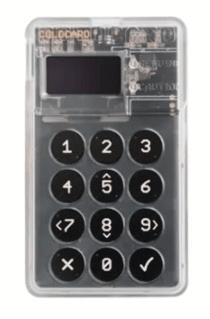

# Chapter 1

# Warum wir Bitcoin brauchen

## WIR BRAUCHEN ES, WEIL GELD KAPUTT IST

> *`Das Grundproblem bei konventionellen
>Währungen ist das ganze Vertrauen, das
>erforderlich ist, damit sie funktionieren. Der Zentralbank muss
>vertraut werden, dass sie die Währung nicht entwertet,
>aber die Geschichte der Fiat-Währungen ist voll
>von Verstößen gegen dieses Vertrauen. Banken muss
>vertraut werden, dass sie unser Geld halten und
>es elektronisch überweisen, aber sie verleihen es
>in Wellen von Kreditblasen mit kaum einem
>Bruchteil in Reserve. Wir müssen ihnen
>unsere Privatsphäre anvertrauen, darauf vertrauen, dass sie
>Identitätsdiebe nicht unsere Konten leer räumen.`*

~ Satoshi Nakamoto 2009-02-11

* Das Fiat-Geldsystem ist kaputt (war es immer).
* Es ist nicht nachhaltig (war es nie).
* Es gibt keine Möglichkeit, es zu reparieren (wird es nie geben).

---
## DER (NICHT) GOLDKURS
* Viele Leute glauben immer noch, dass Geld durch
Gold gedeckt ist.
* Ist es aber nicht.
* Es ist seit 1971 nicht mehr durch Gold gedeckt, als
Präsident Nixon die Welt einseitig vom
Goldstandard abkoppelte (der Nixon-Schock).
* Siehe **wtfhappenedin1971.com**, um ein klares Bild
der Schäden zu bekommen, die dadurch entstanden sind.

Diagramm, das die Inflation des Verbraucherpreisindex (rote Linie) vs.
die Kaufkraft des US-Dollars (schwarze Linie) seit 1971 zeigt.

<small>U.S. Bureau of Labor Statistics, abgerufen von FRED, Federal Reserve Bank of St. Louis; https://
fred.stlouisfed.org/series/CPIAUCSL, 9. Juni 2024.</small>

* Fun Fact: Das Weltwirtschaftsforum wurde 1971 gegründet.
---

>**FIAT:** (Nomen) /ˈfiː.æt/
>
>: eine autoritäre oder willkürliche Anordnung : DEKRET
>
>: eine autoritäre Festlegung : DIKTAT
>
>**: ein Befehl oder Willensakt, der etwas ohne
>oder wie ohne weitere Anstrengung erschafft**

~ merriam-webster.com/dictionary

>**FIAT :** von lateinisch fieri „gemacht werden, entstehen“

* Fiat ist Geld, das nur deshalb einen Wert hat, weil die Regierung sagt (dekretiert), dass es das tut.
* Daher müssen die Leute (glauben), dass es das tut.
>* **Auch wenn sie nicht glauben, dass Fiat einen Wert hat, werden sie per Gesetz
gezwungen, es zu benutzen und es als Zahlung für
Waren und Dienstleistungen zu akzeptieren.**
* **Fiat-Geld wird aus dem Nichts gedruckt/geschaffen.**
* Heutzutage werden etwa 5 % aller Dollar als
Bargeld gedruckt.
* Die anderen 95 % werden digital von Banken geschaffen, indem sie
Zahlen in einen Computer eingeben, wenn sie Kredite vergeben.

>*Es kostet das Bureau of Engraving and Printing nur wenige Cent, um einen 100-Dollar-Schein herzustellen...*

~ Amerikanischer Wirtschaftswissenschaftler, Barry Eichengreen

---

>***Scott Pelley von NBC ’60 Minutes‘:*** *Ist es richtig zu sagen, dass Sie
>das System einfach mit Geld überschwemmt haben?*
>
>***Fed-Chef Jerome Powell:*** *Ja. Das haben wir getan.
>Das ist eine andere Art, darüber nachzudenken. Das haben wir getan.*
>
>***Pelley:*** *Wo kommt das her?
>Drucken Sie es einfach?*
>
>***Powell:*** *Wir drucken es digital. Als Zentralbank haben wir
>die Möglichkeit, Geld digital zu schaffen. Und das tun wir,
>indem wir Schatzwechsel oder Anleihen für andere staatlich
>garantierte Wertpapiere kaufen. Und das erhöht tatsächlich die
>Geldmenge. Wir drucken auch echtes Bargeld und wir
>verteilen es über die Federal Reserve Banks.*

~ CNBC ’60 Minutes‘ Interview, 17. Mai 2020
Zwei Monate nach Beginn des C*vid-19-Lockdowns

>Es gibt eigentlich keine Grenzen für das, was wir mit diesen Kreditprogrammen tun können, die wir haben.

~ Fed-Chef Jerome Powell
18. März 2020 auf CBS News

>Ja, es gibt eine unendliche Menge an Bargeld in der Federal
Reserve. Wir werden alles tun, was wir tun müssen, um
sicherzustellen, dass genügend Bargeld im Bankensystem vorhanden ist.

~ Neel Kashkari, Präsident der Minneapolis Fed
23. März 2020, CBS '60 Minutes'

>Das „wir“ hier sind fünf Personen, die über Änderungen der
Geldpolitik innerhalb des Federal Reserve Systems
während der FOMC-Sitzungen abstimmen. 5 von 330.000.000.
Mehr braucht es nicht, um die US-Geldpolitik zu ändern.

~ @MartyBent, Gründer von TFTC.io
Forbes Artikel, 18. März 2020

---

## AUS DEM MUNDE DES PFERDES VON DAMALS

>*Die Bank hat Zinsvorteile auf alle Gelder,
die sie aus dem Nichts erschafft.*

*~ William Paterson, 1694
Gründer der Bank of England*

>*Alle Verwirrungen, Verwirrungen und Nöte in Amerika entstehen,
nicht aus den Mängeln der Verfassung oder der Konföderation,
nicht aus dem Mangel an Ehre oder Tugend,
sondern aus schlichter Unkenntnis der
Natur von Münzen, Krediten und Umlauf.*

*~ John Adams
2. Präsident der Vereinigten Staaten, 1797-1801*

>*Ich glaube, dass Bankinstitute gefährlicher
für unsere Freiheiten sind als stehende Heere.
Bereits jetzt haben sie eine Geldaristokratie geschaffen,
die die Regierung verhöhnt.
Die Ausgabe von Geld sollte den Banken entzogen und
dem Volk zurückgegeben werden, dem es rechtmäßig gehört.*

*~ Thomas Jefferson
3. Präsident der Vereinigten Staaten, 1801-1809*

>*Während wir mit unseren edlen Taten prahlten, achteten wir darauf, die hässliche
Tatsache zu verbergen, dass wir durch ein ungerechtes Geldsystem ein
System der Unterdrückung verstaatlicht haben, das, obwohl es raffinierter ist,
nicht weniger grausam ist als das alte System der Chattel-Sklaverei.*

~Horace Greeley
US-Kongressabgeordneter 1848-49
Gründer der The New York Tribune

---

>*Wer das Geldvolumen in einem Land kontrolliert, ist
absoluter Herr über alle Industrie und allen Handel...
wenn Sie erkennen, dass das gesamte System sehr leicht kontrolliert werden kann,
auf die eine oder andere Weise, von ein paar mächtigen Männern an der Spitze, werden Sie nicht
gesagt bekommen müssen, wie Inflations- und Depressionsperioden entstehen*

~ James A. Garfield
20. Präsident der Vereinigten Staaten, März-Sept. 1881
Ermordet im Jahr 1881

>*Heute existiert unkontrolliert in den Händen einer Gruppe von Männern
die Macht, Dollar aus dem Nichts zu machen.*

~ Thomas W. Lawson, Autor von 'Frenzied Finance', 1905

>*Ich war so geheimnisvoll - ja, so heimlich - wie jeder Verschwörer.
Entdeckung, das wussten wir, durfte einfach nicht geschehen, sonst wären unsere ganze Zeit
und Mühe verschwendet. Wenn bekannt würde, dass sich unsere
besondere Gruppe zusammengefunden und einen Bankgesetzentwurf geschrieben hatte, hätte dieser
Gesetzentwurf keinerlei Chancen, vom Kongress verabschiedet zu werden.*

~ Frank A. Vanderlip
Präsident der National City Bank of New York
(Vorläufer der Citi Bank)
~ Er schrieb 1935 über das geheime Treffen, das 1910 auf
Jekyll Island stattfand, um den Gesetzentwurf zu entwerfen, der 1913 als
Federal Reserve Act verabschiedet wurde.

>*Dieses (Federal Reserve) Gesetz errichtet den gigantischsten Trust auf
Erden. Wenn der Präsident (Woodrow Wilson) den Gesetzentwurf unterzeichnet, wird die
unsichtbare Regierung der Geldmacht legalisiert...
Das schlimmste legislative Verbrechen der Geschichte wird
durch dieses Bank- und Währungsgesetz begangen.*

~ Charles A. Lindbergh, Sr.
US-Kongressabgeordneter 1907-1917

---

>*Ich bin ein sehr unglücklicher Mann. Ich habe unwissentlich mein Land ruiniert.
Eine große Industrienation wird von ihrem Kreditsystem kontrolliert.
Unser Kreditsystem ist konzentriert. Das Wachstum der Nation,
daher liegen alle unsere Aktivitäten in den Händen einiger weniger Männer.
Wir sind zu einer der am schlechtesten regierten, einer der am
vollständigsten kontrollierten und beherrschten Regierungen in der zivilisierten
Welt geworden. Längst keine Regierung mehr durch freie Meinungsäußerung, längst keine
Regierung mehr durch Überzeugung und die Stimme der Mehrheit, sondern eine
Regierung durch die Meinung und den Zwang einer
kleinen Gruppe dominanter Männer.*

~ Woodrow Wilson
28. Präsident der Vereinigten Staaten, 1913-1921
6 Jahre nach der Verabschiedung des Federal Reserve Act von 1913.

>*Die wahre Wahrheit ist, wie Sie und ich wissen,
dass ein finanzielles Element in den großen Zentren
die Regierung der USA seit den
Tagen von Andrew Jackson besitzt.*

~ Franklin D. Roosevelt
32. Präsident der Vereinigten Staaten in einem Brief vom
21. November 1933 an Colonel E. Mandell House

>*Es [die Depression] war kein Zufall.
Es war ein sorgfältig ausgeklügeltes Ereignis....
Die internationalen Bankiers versuchten,
hier einen Zustand der Verzweiflung herbeizuführen, damit sie
als die Herrscher über uns alle hervorgehen könnten.*

~ Kongressabgeordneter Louis T. McFadden,
Ermordet im Jahr 1936

>Vorsitzender des Banken- und Währungsausschusses des Repräsentantenhauses
*Jedes Mal, wenn eine Bank einen Kredit vergibt,
wird neuer Bankkredit geschaffen - neue Einlagen - brandneues Geld.*

~ Graham F. Towers
Gouverneur der Zentralbank von Kanada, 1934-55

---

>*Wenn es in unserem Geldsystem keine Schulden gäbe,
gäbe es kein Geld*

*~ Marriner Eccles,
1941, Gouverneur der Fed*

>*Ich habe noch nie jemanden gehabt, der durch
den Gebrauch von Logik und Vernunft rechtfertigen konnte, dass die Bundesregierung
sich die Nutzung ihres eigenen Geldes leiht...
Ich glaube, es wird die Zeit kommen, in der die Menschen
fordern werden, dass dies geändert wird.
Ich glaube, es wird die Zeit in diesem Land kommen, in der
sie Sie und mich und
alle anderen, die mit dem Kongress zu tun haben,
tatsächlich dafür verantwortlich machen werden, dass wir
tatenlos zugesehen und
ein solch idiotisches System weiterhin zugelassen haben.*

~ Wright Patman
US-Kongressabgeordneter 1928-1976
Vorsitzender des Ausschusses für Banken und Währung 1963-1975

>*Wenn Sie oder ich einen Scheck ausstellen, muss sich genügend Guthaben auf unserem
Konto befinden, um den Scheck zu decken, aber wenn die Federal Reserve einen
Scheck ausstellt, gibt es keine Bankeinlage, auf die dieser Scheck gezogen wird. Wenn
die Federal Reserve einen Scheck ausstellt, schafft sie Geld*

~ Federal Reserve Bank von Boston
'Putting It Simply', 1984

---

## DIE FEDERAL RESERVE

* Die Fed ist die „unabhängige“ Zentralbank der
USA. Sie wurde 1913 mit der Verabschiedung des
Federal Reserve Act gegründet.
* Sie hat eine einzigartige Struktur, teils privat und teils
staatlich.
* Sie soll eine politisch unabhängige,
überparteiliche Einheit innerhalb der Regierung sein.
* Während das Fed Board of Governors vom
Präsidenten ernannt und vom Kongress bestätigt wird, müssen
**die Entscheidungen der Fed von niemandem
ratifiziert werden.**

**Sie besteht aus:**

* Dem Federal Reserve Board of Governors
* 12 Federal Reserve Banken
* Dem Federal Open Markets Committee (FOMC),
das das geldpolitische Entscheidungsgremium ist.

**Die Fed ist verantwortlich für:**

* Die Aufsicht über die US-Geldpolitik, die Förderung von Beschäftigung und stabilen Preisen.
* Die Regulierung und Aufsicht von Banken und Finanzinstituten.
* Die Bereitstellung von Zahlungsdiensten für Finanzinstitute.
* Die Förderung des Verbraucherschutzes und der Gemeindeentwicklung.

---

## EINE ANMERKUNG ZUM VORSITZENDEN DER FED

* **Der Vorsitzende der Federal Reserve ist auch:**

* Vorsitzender des Federal Open Market Committee
(FOMC), das über die Ausrichtung der US-
Geldpolitik entscheidet (z. B. QE, Zinserhöhungen)
* Mitglied des Internationalen Währungsfonds,
des IWF
* Mitglied der Bank für Internationalen
Zahlungsausgleich, der BIZ (die Bank der Zentralbanken).
* Der US-Finanzminister der G-7
* Der US-Finanzminister der G-20

* Eine **ganze** Menge Macht für eine Person.

---

## FRAKTIONALE RESERVEBANK, ZINSEN & KREDITE

* **Fraktionale Reservebank:** Bis März 2020 mussten Banken
eine Reserve von 10 % halten und konnten
90 % verleihen.
* **Seit März 2020 gibt es keine vorgeschriebene Reserve mehr, so dass Banken unbegrenzt Kredite vergeben können.**

* Ein Kredit ist schuldenbasiertes Geld, und Sie müssen
Zinsen auf den Kredit zahlen.

>* **Fun Fact 1:** Das Geld, um die Zinsen auf den
>Kredit zu zahlen, wird NICHT von den Banken geschaffen.
>* **Fun Fact 2:** Es wird NIEMALS geschaffen.
>* **Fun Fact 3:** Es gibt NICHT GENUG Geld in der
>Welt, um alle Kredite + die auf diese Kredite fälligen Zinsen zurückzuzahlen.
>* **Fun Fact 4:** Das wird es nie geben!

---

## EINE ANMERKUNG ZUM PETRO-DOLLAR
* Man könnte sagen, **dass der Dollar bis 1971 durch
Gold gedeckt war und seit 1974 durch Öl,
und damit standardmäßig durch das US-Militär.**
* **1974 schlossen die USA und Saudi-Arabien bilaterale Vereinbarungen ab, um den Verkauf von Öl in US-Dollar zu bepreisen.**
* Seitdem werden die meisten globalen Ölverkäufe in
US-Dollar abgewickelt.
* Dies hat maßgeblich dazu beigetragen, dass der Dollar zur
stärksten Währung der Welt geworden ist.
* **Er wurde also künstlich gestützt,** selbst in
Zeiten, in denen er normalerweise zu kämpfen gehabt hätte.
* Seit Ende 2022 haben eine Reihe von Ländern
begonnen, in anderen Währungen als dem US-
Dollar zu handeln
* Es ist sehr gut möglich, dass dies der Anfang vom
Ende des Petro-Dollars sein könnte. Was als nächstes geschieht,
bleibt abzuwarten...

---

## ZU QE (QUANTITATIVE ENTSCHÄRFUNG)
* **Quantitative Entschärfung gilt als „unkonventionelle
Geldpolitik“, die von Zentralbanken zur „Stimulierung
der Wirtschaft“ eingesetzt wird, wobei die Fed Staatsanleihen
und andere staatliche Wertpapiere kauft.**
* Sie wurde erstmals von Japan zwischen 2001 und 2006 eingesetzt.
Danach nutzten die USA, Großbritannien und die Eurozone
QE während der Finanzkrise von 2008.
* Seitdem gab es in den USA nur zwischen 2014 und 2019 kein
QE-Programm.
* Wie unten zu sehen ist, argumentieren Kritiker, dass **QE
überwiegend den bereits Wohlhabenden zugute kommt**

*Quelle: @RudyHavenstein auf Twitter*

---

## ZYKLEN

* **In der Natur gibt es Zyklen, natürliche Ebbe und
Flut, Expansionen und Kontraktionen.**

* Dies **trägt zu einem allgemeinen, langfristigen, Gleichgewicht
und Nachhaltigkeit** des gesamten vernetzten
Systems, des gesamten Lebens auf der Erde **bei**.
* **Das schuldenbasierte Fiat-Währungssystem ignoriert die
Weisheit der natürlichen Zyklen,** sondern basiert stattdessen auf,
und ist für sein Überleben zu 100 % darauf angewiesen, dass es ein beispielloses
und ungemildertes Wachstum gibt, um weiterhin
seine Schulden zu bedienen.
* In der Natur ist dies Krebs.
* In der „Wirtschaft“ wird diese unnatürliche Entwicklung weiter
dadurch unterstützt, dass die Regierung scheiternde
Banken und große Unternehmen rettet, anstatt sie
zusammenbrechen und zu etwas Neuem, etwas Gesünderem recycelt zu werden.
* **Die Kurzsichtigkeit, scheiternde Unternehmen zu retten, gefährdet die gesamte Wirtschaft.** Im Wesentlichen
wird das Problem nur aufgeschoben, und die unvermeidlichen Turbulenzen, die vor uns liegen, werden wahrscheinlich viel, viel
intensiver sein, als wenn sich natürliche Zyklen hätten
abspielen können.
* **Wir sind Satoshi Nakamoto und den
Cypherpunks vor und nach ihm zu Dank verpflichtet,** für ihre
Vision, Weitsicht, Entschlossenheit und ihr Können, uns ein
Rettungsboot zu bieten, um uns zu neuen Ufern zu bringen.

---

* Sobald wir das Geschenk, das dies ist, erkennen, liegt es an uns,
mit vollem Herzen und klarem Verstand an Bord zu gehen, um
die Reise anzutreten und mit dem Geld
des Friedens eine neue Welt aufzubauen.
>* **Bitcoin repariert das Geld, es liegt an uns, den Rest zu reparieren.
Und um es klar zu sagen: Wenn das Geld repariert ist, wird
automatisch EINE MENGE anderer Dinge repariert**

* Die wichtigste davon ist, dass groß angelegte, von der Regierung initiierte, kinetische Kriege ohne die Unterstützung des Volkes nicht mehr rentabel oder möglich sind.
* Darüber hinaus wird es natürlich weniger Konsum geben,
zusammen mit einer Umstellung auf Güter und Dienstleistungen mit echtem Wert, freie Märkte, reale Ersparnisse und Entmonetarisierung von
Wohnraum und Immobilien, die ohnehin nie monetarisiert werden sollten.
* **SIEHE:** Bitcoin repariert das, Seite 32
---

## WIR BRAUCHEN ES, WEIL INFLATION DIEBSTAHL IST

FRED-Diagramm von 2024, das den sinkenden Kaufkraft des
Dollars seit der Gründung der Federal Reserve im Jahr
1913 zeigt. Die kumulative Inflationsrate seit 1913 liegt bei etwa
3,067 %. Alle Fiat-Währungen der Zentralbanken auf der ganzen Welt
folgen einer ähnlichen Rückgangsrate.

* **Je mehr Geld aus dem Nichts geschaffen wird,
desto mehr verliert alles Geld an Wert/Kaufkraft.**
* Dies wird **Inflation** genannt.
* Inflation ist buchstäblich **Zeitdiebstahl**. Der Wert Ihrer
Zeit wird gestohlen, wenn Sie sie in einer Währung sparen, die
aufgebläht, entwertet und manipuliert wird.
* Inflation ist auch eine **versteckte Steuer**.

---

* Dieser Zeitdiebstahl und diese Steuer haben auch alle anderen
Fiat-Währungen der Länder betroffen, da sie alle
an den US-Dollar gekoppelt waren, da dieser seit dem Bretton-Woods-Abkommen von 1944 die
Weltreservewährung ist.
* **In den USA ist eine jährliche Inflationsrate von 2 % im
Mandat der Federal Reserve festgeschrieben.**
* Das bedeutet, dass **Sie GARANTIERT jedes Jahr 2 % WENIGER
kaufen können** mit demselben 20-Dollar-Schein.
* **Im März 2024 betrug die jährliche Inflationsrate 3,5 %,**
(viel mehr als 2 %, was bedeutet, dass Sie 3,5 % Ihrer
Kaufkraft zwischen März 2023 und
März 2024 verloren haben.
* Anders ausgedrückt bedeutet dies, dass die Preise im Durchschnitt
um 3,5 % gestiegen sind
* **Wenn die Inflation genau gemessen würde, wie
bis in die frühen 1980er Jahre, würde sie 2024
tatsächlich eher bei 10 % liegen.**
* Betrachtet man die einzelnen Kategorien, so stellt man fest, dass
die Inflation in vielen Kategorien im vergangenen Jahr
viel schlimmer ist als 3,5 %.
* Wenn man sich die Miete, die Lebensmittelrechnungen, die Benzinpreise und
fast alles, was man kauft, ansieht, ist es ganz klar, dass
die Inflation in jedem Sektor grassiert

---
**Durchschnittliche Inflation in den
letzten 50 Jahren in den USA:**

|  Durchschnittliche Kosten   |   1971  |   2021  |   % Steigerung  |
| --- | --- | --- | --- |
|  Gehalt   |    9.400 $ |    59.400 $ |    532 % |
|   Haus  |    23.400 $ |    513.000 $ |    2.092 % |
|    Gallone Benzin | 0,36 $    |   4,17 $ |  1.058 %   |
|    Neuwagen |  3.400 $   |   47.000 $  |    1.282 % |
|   Hochschulabschluss   |  1.400 $   |   26.000 $  |  1.757 %   |
|   Warenkorb  |20 $     |  210 $ |    950 % |
|  Strom/kWh   |  0,02 $    |   0,15 $  |   650 %  |

>**Wahre Geschichte:**
~ Ein Haus wurde 1976 für 58.000 $ gekauft.
~ Unter Berücksichtigung der „offiziellen“ Inflation wären das
279.000 $ in Dollar von 2022.
~ Im Jahr 2022 wurde dasselbe Haus mit 2,09 Millionen $ bewertet.
~ Denken Sie darüber nach...

>*Fiat-Währung ist Desinformation.
Welche Informationen vermittelt ein 10-Dollar-Schein?
Die 10 ist der Zähler eines Bruchs, bei dem
der Nenner fehlt.
10 von was?
Die 10 sagt nichts ohne einen bekannten
und stabilen Nenner.*

~ @bitlany

---

* **Wenn die Inflation steigt, verlieren Ihre Ersparnisse (wenn Sie das Glück
haben, Ersparnisse zu haben) an Wert.**
* Im Laufe der Zeit verlieren sie **VIEL** an Wert
>*Wenn Sie heute beginnen, 100 $/Monat zu sparen, mit dem
besten verfügbaren Zinssatz von 0,05 %:
> * n 30 Jahren hätten Sie **84.019 $** gespart.
>* Bereinigt um die von der FED vorgeschriebene Inflation von 2 %
>* In 30 Jahren hätten Ihre Ersparnisse eine effektive
Kaufkraft von nur **46.384 $**.
>* Bereinigung um die heutige Inflation von 3,5 %:
>* Ihre Ersparnisse im Wert von 84.019 $ hätten in 30 Jahren
eine Kaufkraft von nur **11.037 $**!

* **In der Tat bedeutet dies, dass etwa sechs von
sieben Stunden Ihrer Arbeit gestohlen wurden = *Zeitdiebstahl.***

---
**Eine andere Möglichkeit, dies zu betrachten, ist die folgende:**
* Im Jahr **1971** kostete ein Haus das **2,5-fache** eines durchschnittlichen
Jahresgehalts.
* Im Jahr **2024** kostet ein Haus das **8,6-fache** eines
durchschnittlichen Jahresgehalts.
* Im Jahr **1971** kostete ein Neuwagen etwa **1/3** eines durchschnittlichen Gehalts
* Im Jahr **2024** kostet ein Neuwagen über **3/4** eines durchschnittlichen Gehalts.

Ich bin zuversichtlich, dass es jetzt klar ist, dass
Inflation
* **nicht** *
zu Ihren Gunsten wirkt.

**Hinweis:** Alle diese Zahlen sind Durchschnittswerte und variieren je nach
vielen Faktoren. Der Punkt bleibt, Inflation ist eine versteckte Steuer
und ist Zeitdiebstahl an unserer realen Arbeit und Produktion

>* **Hartes Geld behebt das.**
>* **Bitcoin ist hartes Geld**
---

## WIR MÜSSEN DIE ZENTRAL GESTEUERTE, MANIPULIERTE, SCHULDENBASIERTE WIRTSCHAFT ERSETZEN

>*Ich glaube nicht, dass wir jemals wieder ein gutes Geld haben werden,
bevor wir die Sache aus den Händen der Regierung nehmen,
das heißt, wir können sie nicht gewaltsam aus den Händen der
Regierung nehmen, alles, was wir tun können, ist auf einem verschlungenen Weg etwas einzuführen,
das sie nicht aufhalten können.*

~ Friedrich Hayek, 1984
Österreichischer Wirtschaftswissenschaftler, Philosoph und Autor, 1899-1992

Diagramm, das den exponentiellen Anstieg der M1-Geldmenge von
4 Billionen Dollar im März 2020 auf über 18 Billionen Dollar im Juni 2024 zeigt.

* **Sprengen Sie hier Ihren Verstand:** https://usdebtclock.org/
---
* **45 % aller US-Dollar, die es gibt, wurden
zwischen April 2020 und Januar 2022 gedruckt!**
* Gedruckt aus dem Nichts, wohlgemerkt?
* Fiat-Geld wird zentral vom Staat kontrolliert, und
das Angebot wird leicht manipuliert.
* **Es dauerte 205 Jahre, bis die US-Staatsverschuldung
1 Billion Dollar erreichte. (1776 > 1981)**
* Es dauerte nur **33 weitere Jahre, bis die** US-Staatsverschuldung
**34 Billionen Dollar erreichte!** (1981 > 2024)

FRED-Diagramm, das die Gesamtverschuldung des Staates von 1970 bis 2024 in den USA zeigt.

>*Die globale Verschuldung, gemessen vom Institute of
International Finance, beläuft sich mittlerweile auf 303 BILLIONEN Dollar.
Dies ist unser Planet auf schuldenbasiertem Fiat.
Übrigens beträgt das globale BIP nur 84 Billionen Dollar.*

*~ Nik Bhatia, Autor von ‘Layered Money’, 2021*

---

* **Zum Vergleich**

| **Wenn Sie haben:** | **Sie können 1 $/Sekunde ausgeben** |                |
| ------------ | ----------------------- | -------------- |
| **1 Million $**   | oder 11 Tage              | = 11 Tage    |
| **1 Milliarde $**   | für 11.680 Tage         | = 32 Jahre   |
| **1 Billion $**  | für 11.680.000 Tage     | = 32.000 Jahre |

* Wir sind alle der Gnade derer ausgeliefert, die die Macht haben,
zu entscheiden, wann mehr gedruckt werden soll und welche Zinssätze
erhoben werden sollen.
* **Wenn die Fed die Zinsen erhöht, dann wird die Aufnahme
eines Kredits für ein Haus oder ein Auto plötzlich teurer,
was die Ausgaben verlangsamt und zu einer Stagflation führt**

* **Wenn sie die Zinssätze künstlich niedrig halten, treten wir in eine
Periode der Depression ein**

>* **Wenn man der Zentralbank erlaubt, das finanzielle
"Wetter" zu machen, nimmt man uns die Freiheit, den Markt entscheiden zu lassen, was von Wert ist und was nicht.**

* Darüber hinaus **stützen sie die Wirtschaft künstlich, wenn sie Banken und Unternehmen retten.** Es ist nur
eine Frage der Zeit, bis das Kartenhaus zusammenfällt.
* Das ursprüngliche Argument für eine Zentralbank war, dass
es einen Kreditgeber der letzten Instanz geben müsse, wenn die
Wirtschaft ins Wanken gerät.

---
* **Dies hat sich dahin entwickelt, dass die Zentralbank ein Herrscher
erster Instanz ist, mit beispielloser, nicht gewählter, letztlich
autoritärer Macht.**

> *Alles Geld ist politisch, außer Bitcoin.
Fiat-Währungen, Bankinstrumente, Fintech-Kredite,
andere Kryptowährungen und sogar Gold werden alle von
Regierungen, Unternehmen oder kleinen Gruppen kontrolliert.
Eine Ausnahme zu haben, wird sich als sehr nützlich erweisen,
wenn wir in die Zukunft gehen.*

*~ Alex Gladstein @gladstein
Chief Strategy Officer der Human Rights Foundation*

>*Bitcoin verbindet 8 Milliarden Menschen, verbindet
hundert Millionen Unternehmen, es synchronisiert die Welt
über politische Gerichtsbarkeiten hinweg und bringt Rationalität in
das gesamte Finanzsystem zurück und es gibt der gesamten Menschheit
Freiheit und Eigentumsrechte zurück*

*~Michael Saylor
CEO Microstrategy*

---

## WIR MÜSSEN DIE MENSCHEN OHNE BANKVERBINDUNG MIT BANKDIENSTLEISTUNGEN VERSORGEN

>*Für 953 Millionen Menschen in 20 Ländern mit schwächelnden
Währungen stellt Bitcoin etwas Größeres als einen
Vermögenswert dar. Für sie ist es eher eine Arche
verschlüsselter Energie, um der Flut zu entkommen.*

*~ Michael Saylor
CEO von Microstrategy*

* **Stand 2024 haben etwa 25 % der Erwachsenen auf
der Welt keine Bankverbindung, etwa 1,4 Milliarden Menschen!**

>* **Das bedeutet, dass sie keinen Zugang zu Bankdienstleistungen haben
>und keine Geldautomaten, Debitkarten, Kreditkarten oder
>Schecks verwenden können.**
>* **Darüber hinaus sind sie nicht in der Lage, Kredite aufzunehmen, um
ein Unternehmen zu gründen, ein Auto oder ein Haus usw. zu kaufen.**

* **Das Senden und Empfangen von Geld oder das Einlösen von Schecks ist
teuer.**

* Sie müssen Geldtransfer- und Scheckeinlösedienste
wie Western Union nutzen, die hohe Gebühren erheben
und Zeit für die Bearbeitung benötigen.

* Es ist **besonders teuer für Menschen, die Geld
nach Hause an ihre Familien** in anderen Ländern (Überweisungen) senden,
was bis zu 10 % oder 12 % über eine Bank kosten kann

---
* Es ist **teuer und zeitaufwendig für diejenigen, die Überweisungen erhalten,** da sie für den Transport bezahlen
und zum Geldtransferbüro gehen müssen, oft weit von ihrem
Wohnort entfernt, um das Geld zu bekommen, das ihr Familienmitglied gesendet hat.

* Oftmals ist es für sie nicht sicher, zu diesen
Büros zu reisen.
* Bitcoin über das Lightning Network bietet jetzt eine
sofortige Lösung für diese Probleme!

***#bitcoin repariert das***
>*Wann wurde eine Technologie, die Menschen
ermächtigt, jemals aufgehalten?*

*~ Jeff Booth
Autor: Der Preis von morgen*

---

## WIR MÜSSEN DEN MENSCHEN HELFEN, DER TYRANNEI UND DEM WÄHRUNGSZUSAMMENBRUCH ZU ENTFLIEHEN

* Wie wir gesehen haben, können und tun Regierungen
in den letzten Jahren die Bankkonten
derjenigen einfrieren, mit denen sie nicht einverstanden sind.

>* **Dies zeigt, dass Ihr Geld auf der Bank
im Wesentlichen nichts anderes als ein Schuldschein ist, der Ihnen
jederzeit gestohlen werden kann.**

* Wenn die Inflation grassiert, wie wir es derzeit
2024 in Venezuela (283 %), Sudan
(63 %), Libanon (212 %), Syrien (79 %),
Argentinien (161 %), Simbabwe (47 %), Türkei
(64 %) und mehr sehen, werden die Lebensersparnisse der Menschen
verdampft, manchmal über Nacht, und sie können
nichts dagegen tun.
* Für Menschen, die eines der oben genannten Probleme haben, wird **Bitcoin
zu einer echten, sofortigen Lösung für
ein ansonsten untragbares Problem.**
* **In Anbetracht der Tatsache, dass sowohl Tyrannei als auch Inflation
an vielen Orten zunehmen, wäre es ratsam, sich
dagegen abzusichern, indem man jetzt Bitcoin erwirbt.**
---
## WIR MÜSSEN CBDCS VERMEIDEN
* Sie haben vielleicht gehört, dass **Zentralbanken beginnen,
CBDCs, Central Bank Digital Currencies, zu schaffen.**
Im Mai 2020 untersuchten 35 Länder diese Option.
* Im März 2022 waren 87 Länder aktiv auf der Suche
oder hatten bereits einen Pilot-CBDC gest

# Chapter 2

# BEHEBT DIESE FINANZIELLE INKLUSIVITÄT
* **Mit Bitcoin hat jeder Zugang zum *gleichen*
Finanzsystem, mit den *gleichen* Regeln für alle.**
* Keine Schlupflöcher oder Hintertüren oder Sondervereinbarungen
für irgendjemanden.
* Jeder hat das Potenzial, für den Wert entschädigt zu werden, den er mit dem gleichen realen Geld bereitstellt,
das mit den gleichen Regeln geschaffen und verwaltet wird.
* **Bitcoin ist für jeden und überall mit
einer Internetverbindung zugänglich.**

## MEHRWERT FÜR DIE WELT
* **Bitcoin incentiviert Menschen, der Gemeinschaft und dem Marktplatz einen echten Mehrwert zu verleihen,** da dies der einzige
Weg ist, mehr Geld zu verdienen
* Wenn man mit weniger zufrieden ist, profitiert man trotzdem von der Arbeit für einen fairen Lohn, und **wenn man spart, behalten diese Ersparnisse ihren Wert im Laufe der Zeit.**

---
## BEHEBT DIESE UMWELTBELASTUNG
* Solides Geld mit einer festen Obergrenze schafft eine
sehr andere Dynamik als die, die durch die
schuldenbasierte, unbegrenzte Gelddruckerei entsteht, die wir
heute beobachten.
* Anstelle eines unaufhaltsamen Drangs, immer
mehr zu konsumieren, in einem Wettlauf nach unten, um
Zinseszinsen auf Kredite und Schulden zu zahlen,
die letztendlich nie beglichen werden, **bietet Bitcoin
einen Ausweg in eine Welt, in der eine niedrige Zeitpräferenz
angestrebt wird.**
>* Die grassierende Umweltzerstörung wird **durch
weniger Konsum, weniger Verschwendung und einen
überlegten Ansatz bei der Produktion ersetzt,** wobei der
Markt entscheidet, was einen wahren Wert hat, und
die Dinge daher auf Langlebigkeit ausgelegt sind.
* Dies ist ein Netto-Nutzen für Menschen, Pflanzen und Tiere!
---
## BEHEBT DIESEN KRIEG
* Das unbegrenzte Drucken des Fiat-Geldsystems
macht "ewige Kriege" möglich und
profitabel.
* Da die Menschen größtenteils im Unklaren darüber sind, wie
Kriegsausgaben funktionieren oder woher das Geld für den Krieg
kommt, gibt es wenig bis gar keine Rechenschaftspflicht
seitens der Regierung. Kriege können sich über
Jahre an abgelegenen Orten hinziehen, ohne dass es eine wirkliche Aufsicht gibt.
* Angefangen mit Vietnam sind Kriege zu "Kreditkartenkriegen" geworden (h/t @AlexGladstein), da die
Regierung Geld leiht, um die Kriege zu finanzieren, und
dann mehr Geld leiht, um die Zinsen auf
die ursprünglichen Kredite zu bezahlen... und das immer wieder.
>* **Auf einem Bitcoin-Standard wäre es erforderlich, dass die
Bevölkerung eines Landes bereit ist, sich an der Finanzierung
eines Krieges zu beteiligen. Sie würden dies wahrscheinlich nur tun, wenn es
absolut und eindeutig notwendig ist, um ihre
Familien und ihr Land zu verteidigen, mit einem Endziel vor Augen.**
* Da es keine ungebührlichen Gewinne zu erzielen gäbe,
wären Regierungsbeamte und Unternehmen nicht dazu
angeregt, Krieg als eine gangbare Option zu fördern oder sich daran zu beteiligen.
* **Die Bemühungen würden erheblich zunehmen, um Wege zu finden,
friedliche und kostengünstige Lösungen zu finden.**
---
## BEHEBT DIESE ZEITPRÄFERENZ

**Hohe Zeitpräferenz:** Sofortige Befriedigung, Ungeduld,
Kurzfristige Planung
**Niedrige Zeitpräferenz:** Aufgeschobene Befriedigung, Geduld,
Langfristige Planung

* Hohe Zeitpräferenz führt zu persönlicher, gesellschaftlicher und
ökologischer Zerstörung. Wenn unser Geld
jeden Tag an Wert verliert, sind wir "gezwungen",
ungeduldig zu sein und es so schnell wie möglich auszugeben,
bevor es noch mehr an Wert verliert.
* Wenn unsere Zeit durch eine ständig steigende Fiat-Währung
entwertet wird, verlieren wir die Verbindung zum Wert unserer
Zeit.
* Dies führt zu Entfremdung und einem unterschwelligen
Stress.
* Versuche, den Stress zu lindern und einen Sinn zu finden,
werden verzerrt und werden zu Ablenkungen wie z.B.
übermäßiger Konsum von Drogen, Alkohol, Einkaufen,
Pornos, Fast Food, kurze Aufmerksamkeitsspanne, Sucht
nach Bildschirmen/Social Media, impulsive Entscheidungen usw.
* **Solides Geld hingegen, das seinen
Wert im Laufe der Zeit behält und unsere
Beiträge durch unsere Arbeit richtig misst, führt zu einer niedrigen Zeitpräferenz, einer durchdachten Lebensqualität, mit
sinnvollen Beziehungen, weniger Konsum, tieferer
Verbindung, tiefgründigeren Gesprächen, langfristigen
Zielen und erhöhter Kreativität.**
---

# Chapter 3

# WAS IST BITCOIN?

>*"Eine Beschreibung für dieses Ding
für ein allgemeines Publikum zu schreiben ist verdammt schwer.
Es gibt nichts, womit man es vergleichen könnte."*

~ Satoshi Nakamoto 2010-07-05

>*Die Gesamtmenge wird 21.000.000
Coins betragen. Sie wird an Netzwerk-
knoten (Miner) verteilt, wenn sie Blöcke erstellen,
wobei die Menge alle 4 Jahre halbiert wird.
erste 4 Jahre: 10.500.000 Coins
nächste 4 Jahre: 5.250.000 Coins
nächste 4 Jahre: 2.625.000 Coins
nächste 4 Jahre: 1.312.500 Coins usw...
Wenn das aufgebraucht ist, kann das System
Transaktionsgebühren unterstützen, falls erforderlich. Es basiert auf
offenem Marktwettbewerb, und es wird
wahrscheinlich immer Knoten geben, die bereit sind,
Transaktionen kostenlos zu verarbeiten.*

~ Satoshi Nakamoto 2009-01-09

* **Bitcoin ist freies Geld...** in dem Sinne, dass es
das Potenzial hat, uns alle von der übergreifenden
Manipulation durch und Kontrolle des zentralen Bankwesens zu befreien.
* **Bei Bitcoin sind die monetären Regeln für
JEDEN, ÜBERALL gleich.**
* Bitcoin ist inklusiv, in dem Sinne, dass jeder mit einer
Internetverbindung am Netzwerk teilnehmen kann,
und **muss sich an die gleichen Regeln halten.**

---
## Bitcoin ist:
* **DEZENTRALISIERT**         
* **WIRKLICH BEGRENZT**          
* **ZENSURRESISTENT** 
* **EIN VERTEILTES KONTOBUCH**
* **UNBESTECHLICH**
* ERLAUBNISLOS
* ÜBERPRÜFBAR
* TRANSPARENT
* UNVERÄNDERLICH
* GRENZENLOS
* SCHWER ZU FÄLSCHEN
* PSEUDONYM
* REIBUNGSLOS
* VERTRAUENSLOS
* PEER-TO-PEER
---
* Bitcoin ist dezentralisiert.
* **Es wird auf Tausenden von Knoten weltweit von Tausenden von Menschen betrieben, die sich nicht kennen.**
* Keine einzelne Person, Regierung oder Firma kann es jemals kontrollieren.
* Du kannst auch einen Knoten betreiben, es ist einfach ;)
* Indem du deinen eigenen Knoten betreibst, erhöhst du deine
Privatsphäre und hilfst, das Netzwerk zu sichern, wenn du
deine eigenen Transaktionen verifizierst.
> **Nicht vertrauen. Verifizieren**
---
* **Bitcoin (Grossgeschrieben 'B')** ist ein monetäres Netzwerk.
* **bitcoin (kleingeschrieben 'b')** ist die Währung oder der monetäre Vermögenswert, der im Bitcoin-Netzwerk ausgegeben wird und auf diesem läuft.

---
* **Bitcoin ist der grosse Anreizgeber.**
>* **Das Genie von Satoshi war so gross, dass bei Bitcoin zum ersten Mal sowohl gute als auch schlechte Akteure einen Anreiz haben, sich an die Regeln zu halten.**

> *"Der Anreiz könnte dazu beitragen,
Knoten zu ermutigen, ehrlich zu bleiben.
Wenn ein gieriger Angreifer in der Lage ist,
mehr CPU-Proof-of-Work zusammenzubringen als alle
ehrlichen Knoten, müsste er wählen,
ob er sie dazu verwendet, Menschen zu betrügen, indem
er seine Zahlungen zurückstiehlt,
oder ob er sie dazu verwendet, neue Coins zu generieren.
Er sollte es als profitabler erachten,
sich an die Regeln zu halten, solche Regeln, die
ihn mit mehr neuen Coins begünstigen als
alle anderen zusammen,
als das System und
die Gültigkeit seines eigenen Vermögens zu untergraben."*

~ Satoshi Nakamoto 2008-10-31

---
* **Bitcoin ist das erste digital-native Geld**, im Gegensatz
zu deinem Online-Girokonto, das nur eine
digitale Form von Zentralbank-Fiatgeld ist.
* Bitcoin ist eine **dezentrale** digitale Währung.
* Bitcoin hat **keine zentrale Autorität.**
* Bitcoin ist **staatenlos.**
* Denk über die Auswirkungen nach ...

>*Bitcoin ist eine dezentrale digitale Währung, die
sofortige Zahlungen an jeden, überall auf der Welt ermöglicht.
Bitcoin verwendet Peer-to-Peer-Technologie, um ohne
zentrale Autorität zu funktionieren: Transaktionsmanagement und Geld-
ausgabe werden gemeinsam vom Netzwerk durchgeführt.*

~ Bitcoin Wiki
en.bitcoin.it

---
* Bitcoin ist magisches Internetgeld.
* Nein, im Ernst, **Bitcoin ist der Weg, wie wir die Welt reparieren werden.**
* Ernsthaft? Ja.
---
* **Bitcoin ist eine Möglichkeit, Werte zu übertragen**
 *  in beliebiger Höhe
 * sicher
 * sofort (im Lightning Network)
 * zwischen zwei Parteien
 * jederzeit
 * rund um die Uhr
 * überall
 * ja, überall
 * Denk darüber nach.

 ---

>*Mit E-Währung, die auf kryptografischem
Beweis basiert, ohne dass man einem Dritten
vertrauen muss, kann Geld sicher sein und
Transaktionen mühelos.*

~ Satoshi Nakamoto 2009-02-11

---
>*Bitcoin ist (fast) kostenlos mit Sicherheit zu bewegen.
Ich weiss zu 100% sicher, was ich erhalte.*

~ Michael Saylor CEO von Microstrategy

* Du kannst $1.13, oder 46c oder 359 Sats oder 500.000.000
Sats oder $1 Million an jeden, überall, jederzeit
über das Bitcoin-Netzwerk oder das auf Bitcoin aufgebaute Lightning-Netzwerk senden.
* **Und niemand kann dich aufhalten.**
* Kannst du das mit Gold, Silber, USD/GBP/EUR/YEN/
CYK/ZAR oder einer anderen Zentralbank-Fiatwährung?

---
* **Bitcoin ist historisch.** Dies ist das erste Mal in der Geschichte, dass
ein wirklich dezentrales, zensurresistentes, unveränderliches,
grenzenloses, erlaubnisloses und unbestechliches monetäres System mit einer absoluten Obergrenze (21 Millionen
Coins) geschaffen wurde.
>* Bitcoin ist **für die Dezentralisierung von Macht
und die Steigerung der finanziellen Inklusion genauso bedeutsam** wie die Erfindung
der Druckerpresse und später des World Wide
Web **für die Dezentralisierung der Kontrolle über und
den zunehmenden Zugang zu Informationen war.**

>*Viele Leute tun
E-Währung automatisch als aussichtslos ab,
weil alle Unternehmen seit den 1990er Jahren gescheitert sind.
Ich hoffe, es ist offensichtlich, dass es nur die
zentral gesteuerte Natur dieser
Systeme war, die sie zum Scheitern verurteilt hat.
Ich denke, dies ist das erste Mal, dass wir
ein dezentrales, nicht-vertrauensbasiertes System ausprobieren.*

~ Satoshi Nakamoto 2009-02-15
---
* **Bitcoin ist ein verteiltes, dezentrales, transparentes
und unveränderliches KONTOBUCH.**
* Jeder auf der Welt kann sehen, wem was gehört, zu jedem
Zeitpunkt, und es kann nicht geändert werden.
* Ausser dass das "wer" kein Name ist, **sondern eine Adresse
bestehend aus Zahlen und Buchstaben.**
>* Ein Beispiel für eine Bitcoin-Adresse:
**bc1qar0srrr7xfkvy5l643lydnw9re59gtzzwf5mdq**

* Bitcoin ist daher **pseudonym.**
---
* **Bitcoin ist**
* ein unparteiischer Emittent von Vermögenswerten
*  ein Wertspeicher
* ein Tauschmittel
* und bald eine Recheneinheit
*  **sowie**
* **die Mittel** des Austauschs.

* Es ist der Emittent, das Gold, das Bargeld, die Debitkarte UND
Paypal, die Bank, Venmo, Cashapp, Western Union

**ALLES IN EINEM!**

---
* **Bitcoin ist ein Protokollführer, der Mathematik und
Informatik verwendet, anstelle von Bankern, Buchhaltern
und Wirtschaftsprüfern.**
* Es eliminiert die Mittelsmänner, Banken, Regierungen, Überziehungs-
gebühren, Girokontogebühren, begrenzte Öffnungszeiten,
Potenzial für Zensur, eingefrorene Konten, Manipulation
der Geldmenge, Zinssätze, den IWF,
das WEF, die BIZ, stationäre Gebäude, Geldautomaten,
Schecks, Rückbuchungen, den Petrodollar, den Euro
Dollar, Bankseigniorage, den Cantillon-Effekt,
fractional Reserve Banking, Visa, Mastercard, Amex,
Western Union, tagelanges Warten, bis deine Überweisung
durchgeht ...

>* **Anstatt jemanden zwischen dir und der
>Person zu haben, deren Hand du schütteln möchtest, kannst du einfach
>ihre Hand direkt schütteln.**
>* **Keine Notwendigkeit, um Erlaubnis zu bitten, dein eigenes
>Geld zu senden!**
---

## Einfach ausgedrückt…
* **Bitcoin ist digitales Eigentum, das dir niemand wegnehmen kann.**
* >Bitcoin zu besitzen bedeutet, das Recht zu besitzen, Werte
von einer bestimmten Adresse, die du mit
deinem privaten Schlüssel kontrollierst, an JEDE andere Adresse deiner Wahl zu senden.

*Bitcoin ist ein Eigentumsrecht, das unabhängig vom
Gewaltmonopol ist.*

~ Robert Breedlove @breedlove22

---

* **Bitcoin ist ein einmaliges Ereignis in der Geschichte der Menschheit.**
* Bitcoin ist Wahlfreiheit.
* Bitcoin **fördert Souveränität.**
>* **Die Entdeckung von Bitcoin vor 15 Jahren ist für
die finanzielle Freiheit und Souveränität des Menschen so bedeutend wie die
Entdeckung des Feuers für die menschliche Entwicklung vor
500.000 Jahren und die Druckerpresse für die
Dezentralisierung des Zugangs zu menschlichem Wissen vor fast
900 Jahren.**

---
* **Bitcoin ist ein echter Wertspeicher.**
* Es speichert deine wertvollste Ressource, deine Zeit, so
dass du später wieder darauf zugreifen kannst.
>*Bitcoin ist wie eine Hochenergieleitung zu deinem
zukünftigen Selbst ... du kannst heute arbeiten und Bitcoin wird deine Energie tief
gefrieren, damit du sie später nutzen kannst.*

~ Robert Breedlove

>*Die Wurzel des Geldes ist die Zeit
Und die Wurzel der Zeit ist der Wert*

~ Guy Swann

---
* Bitcoin ist eine Timechain, im wahrsten Sinne des Wortes.
* Satoshi hat sich in seinen E-Mails mit den frühen Entwicklern viele Male auf die Timechain bezogen.
* Du kannst die Zeit in Blöcken messen, da alle ~10 Minuten ein Block geschürft wird.
>* **Unsere Zeit ist unsere knappste und wertvollste Ressource.**
>* **Sie ist unsere buchstäbliche Lebenskraft.**
>* **Echtes Geld ermöglicht es uns, unsere Zeit zu speichern.**

* Es ist die Art und Weise, wie wir die Zeit anerkennen können, die wir "verbracht" haben.
* Wir **tauschen unsere Zeit gegen Geld, das einfach eine Aufzeichnung
unserer Zeit und Mühe ist.**
* **Bitcoin macht es möglich, unsere Zeit so zu bewahren,
dass wir später im Leben "Zugang" dazu haben, wenn
wir nicht mehr so arbeiten können wie früher.**
---
* Bitcoin ist ein **Wertspeicher.**
* Bitcoin ist ein **Tauschmittel.**
* Bitcoin **wird eines Tages eine Recheneinheit sein.**
* Bitcoin **wird eines Tages *DIE Recheneinheit sein.***
---
* **Bitcoin ist knapp**
* Es hat eine Obergrenze von 21.000.000.
* Es wird nie mehr geben.
* Code ist hier Gesetz.*

*Obwohl es "technisch" möglich ist, den
Code zu ändern, verhindert Satoshis Genie dies, da eine Erhöhung
(Inflation) des Angebots nur dazu dienen würde, den
Wert aller im Umlauf befindlichen Bitcoins zu verringern. Dies gibt daher
allen einen Anreiz, sich implizit darauf zu einigen, die
Obergrenze des Angebots von 21.000.000 beizubehalten.

* Schau dir **timechaincalendar.com** von @TC an, um
die aktuelle Blockhöhe, das verfügbare Angebot und
zahlreiche andere Metriken in Bezug auf die Bitcoin-
Timechain zu überprüfen.
---
* **Bitcoin ist unendlich teilbar, ohne das Angebot zu
mindern.**
* **Eine Pizza ist eine Pizza, egal wie klein die
Stücke sind.**
* Sie ist derzeit bis zur achten
Dezimalstelle teilbar: 1,00000000
* Es gibt 100.000.000 Satoshis in 1 Bitcoin.
* 1 Satoshi = 0,00000001
* Du kannst Sats (Satoshis) in beliebiger Menge kaufen.
---
* **Bitcoin ist das härteste, solideste Geld, das wir je
kannten.**
* Es ist sogar solider als Gold, da Gold nicht leicht
teilbar oder tragbar ist, eine geringe Geschwindigkeit hat (sich langsam bewegt)
und nicht leicht überprüfbar ist.
* **Bitcoin hat die besten monetären Eigenschaften
aller jemals bekannten Vermögenswerte.**

**VERGLEICHSCHART DER EIGENSCHAFTEN VON SOLIDEEM GELD**

HINWEIS: Dies ist eine allgemeine Übersicht, es gibt Nuancen, die in
einem Diagramm nicht dargestellt werden können.

---
* **Bitcoin ist das Gegenmittel.**
* Der Versuch, die Wirtschaft mit Rettungsaktionen,
Gelddrucken, QE und Zinsmanipulationen zu "stabilisieren", ist
wie wenn man sie künstlich am Leben erhält.
* Diese "Maschine" kann nur so lange laufen, bevor sie immer teurer in der Wartung und immer weniger nachhaltig wird, was zu einem schwerwiegenden Zusammenbruch führt.
* **Bitcoin behebt das**
* **Bitcoin ist besseres Geld**
---
* **Bitcoin ist antifragil.**
* Und das wird es mit jedem versuchten Angriff,
mit jedem Regierungsverbot, mit jedem Stück Mainstream-Medien-FUD (Angst, Unsicherheit, Zweifel).
>* Bitcoin wurde noch nie gehackt.*
* Obwohl es viele versucht haben.

*Obwohl du vielleicht von Hacks gehört hast, sind es
die Börsen, die gehackt wurden, nicht
das Bitcoin-Protokoll.
* **Denk daran:**
* Nicht deine Schlüssel, nicht deine Coins.
* Ziehe deine Sats **immer** in deine **eigene Wallet** ab.
* **Am besten** kaufst du Peer-to-Peer.
---
* **Bitcoin ist eine Kombination aus:**
* Informatik
* Netzwerkprotokolle
* elektrische Systeme
* Spieltheorie
* Überzeugung
* Mimetik
* Thermodynamik
* Netzwerkeffekte
* Kryptographie
* Energie
* echte Knappheit
* wirtschaftliche Anreize
* Software-Entwicklung
* Zeitwert des Geldes
* Tech-Adoptionskurven
* emergente Phänomene
* Kraft der Dezentralisierung
* niedrige Zeitpräferenz
* Angleichung der Anreize
* monetäre Neutralität
* finanzieller Aktivismus
* Unveränderlichkeit

... die alle zusammenarbeiten, um Vertrauen
in einer vertrauenslosen, dezentralen Umgebung zu schaffen,
um ein

* neutrales
* sicheres
* zensurresistentes
* erlaubnisloses
* globales

digitales Geld- und Währungsnetzwerk zu unterstützen.

---

* **Bitcoin ist ein tiefes Kaninchenloch**, das dich dazu bringt,
fast alles in Frage zu stellen, was du zu wissen glaubtest ;)
* Bitcoin ist in sich geschlossen.
* **Bitcoin ist einfach.**
>*Bitcoin ist. Und das ist genug.*

~ @Beautyon

---
* **Bitcoin ist eine symbiotische Beziehung** zwischen:

**Menschen**

und

**Eine perfekte Lösung, um
Zeit/Wert zu übertragen und zu speichern.**

* Menschen brauchen Bitcoin, Bitcoin braucht Menschen.
---
* **Bitcoin ist die Lösung für das Problem der byzantinischen Generäle.**
* Dies galt einst als unlösbares Problem in der
Informatik.
* Dieses Problem tritt in dezentralen Systemen auf, wo
es als unmöglich galt, zu beweisen, dass gesendete Nachricht
= empfangene Nachricht, da der "Man-in-the-Middle"
ein schlechter Akteur sein und die Nachricht fälschen könnte.
* Mit anderen Worten, es schien unmöglich, einen Konsens
zwischen einem Netzwerk von verteilten und unabhängigen Computern zu bilden.
* Durch die Verwendung eines Zeitstempels zusammen mit einem kryptografisch
gesicherten, verteilten Hauptbuch hat Satoshi dieses
Problem gelöst.
* Seine Lösung ist bekannt als **Nakamotos Konsens.**
---
* **Bitcoin ist die Lösung für das Double-Spend-Problem.**
* Das bedeutet, dass der Empfänger sicher sein kann, wenn du Bitcoin sendest,
dass du tatsächlich die Bitcoin besessen hast, die du
gesendet hast, und dass du, sobald du sie an ihn gesendet hast, diese Coins nicht
erneut ausgeben kannst, indem du sie an jemand
anderen sendest (Double-Spending).
* So wie wenn ich dir eine Orange gebe. Sobald sie
meine Hände verlässt und in deinen Händen ist, habe ich nicht mehr
die Orange, um sie jemand anderem zu geben.
>*..Double-Spends werden nie in den
Transaktionspool aufgenommen, so dass jeder Knoten
bezeugt, welche Transaktion er zuerst gesehen hat,
indem er daran arbeitet, sie in einen Block zu legen.*

~ Satoshi Nakamoto 2010-12-09

---
* **Bitcoin ist ein Inhaberpapier**, wie Bargeld oder Gold, das direkt vom
Inhaber (Eigentümer) gehalten wird.

>* **Das bedeutet, dass es, sobald es gesendet (gegeben) wurde, direkt
an den neuen Inhaber (Eigentümer) geht, ohne dass ein Mittelsmann
(Bank) benötigt wird, um die Transaktion zu verarbeiten.**

---
* **Bitcoin ist P2P (Peer-to-Peer).**
* Bitcoin ist zensurresistent
>* **Das bedeutet, dass niemand die Macht hat, eine
Transaktion aufzuhalten oder zu verhindern, dass sie an
den neuen Inhaber geht.**
* Bitcoin fliesst frei.

* Es darf keine Gatekeeper geben.
---
* **Bitcoin ist vertrauenslos.**
>*Das grundlegende Problem mit herkömmlichen
Währungen ist all das Vertrauen, das erforderlich ist,
damit sie funktionieren. Man muss der Zentralbank
vertrauen, dass sie die Währung nicht entwertet, aber
die Geschichte der Fiat-Währungen ist voll von
Verletzungen dieses Vertrauens.*

~ Satoshi Nakamoto über die Bedeutung von
Bitcoins vertrauensloser Natur.

---
* **Bitcoin ist Code.**
* **Code ist Sprache.**
* Schau dir github.com/bitcoin an.
* **Dies ist derzeit das Haupt-Bitcoin-Repository.**
* Klicke dich durch, um den Code, die Pull-Requests,
die Reviews, die Commits, die Bips (Bitcoin
Improvement Proposals) und die Entwickler zu sehen, die
an der Entwicklung arbeiten, sie pflegen und verbessern,
die Bitcoin ist.

---

* **Bitcoin ist das Internet des Geldes.**
* Wenn man bedenkt, dass alles andere
digital wird/geworden ist, einschliesslich:
 * Musik
 * Bücher
 * Bankgeschäfte
 * Filme
 * Bildung
 * Fotos
 * Telefonate
 * Radio
 * Karten
 * Spiele
 * Besprechungen
 * und die Liste geht weiter (im Guten wie im Schlechten)

… dann erkennt man, wie **es wirklich ein logischer Schritt für
Geld ist, zu folgen.**

> **ABER** wir brauchen **BITCOIN, NICHT CBDCs!**

---

## SATOSHIs GENIE
>* Bitcoin ist **ALLES** davon:
> * Ein dezentrales, verteiltes Hauptbuch
> * Ein Zahlungssystem
> * Und der Wert selbst, der übertragen wird.

* Ausserhalb von Bitcoin sind **Geldschöpfung** (Ausgabe) und
**Buchhaltung** (Verfolgung von erhaltenem/ausgegebenem Geld)
**zentralisiert** und umfasst die folgenden separaten
Schichten:

* Die Ausgabe von Geld durch verschiedene Zentralbanken
* Die Kontobücher, ob geschrieben oder digital
* Die vertrauenswürdigen Parteien, die die Zahlen in
die Kontobücher eintragen
* Die vertrauenswürdigen Parteien, die die physischen Kontobücher
sicher aufbewahren oder die die Computerdatenbanken
warten
* Die vertrauenswürdigen Sicherheitsteams, die daran arbeiten,
Hacking der Datenbanken zu verhindern

* Mit Bitcoin sind **all diese Schichten in einer zusammengefasst!**
* Obwohl dies zentralisierter klingen mag, hat Satoshis
Genie dafür gesorgt, dass das Gegenteil der Fall ist.
* Es ist **100% dezentralisiert!**

---

>* **Bitcoin hat KEINEN zentralen Ausfallpunkt.**

* Die einzige Möglichkeit, all das in einem zu vereinen und dezentralisiert zu sein, ist, dass **das verteilte Hauptbuch
von einer freiwilligen, weltweiten, Ad-hoc-
Gruppe von Leuten, die freiwillig schürfen und/oder
Full Nodes betreiben, geführt wird.**
* Und die Anreize des Netzwerks **ermutigen jeden, sich an die Regeln zu halten**
* Du kannst mitmachen!

---
## Bitcoin ist eine friedliche Revolution
---
## Bitcoin ist Hoffnung
---

# Chapter 4

# WIE FUNKTIONIERT Bitcoin?

Regeln, nicht Herrscher

tik-tok/
/nächster Block
* Bitcoin verwendet Proof-of-Work, Public-Key-Kryptographie
und Peer-to-Peer-Netzwerke, um
Zahlungen in einem globalen, verteilten Online-Ledger zu verarbeiten und zu verifizieren.

>**Kryptographie** (Substantiv) /krɪpˈtɑːɡrəfi
>
>*: das Ver- und Entschlüsseln von Nachrichten
>in geheimem Code oder Chiffre
>: die computergestützte Kodierung und
>Dekodierung von Informationen*

~ Merriam Webster Wörterbuch

>**Hashing** (Verb) /ˈhæʃɪŋ/
>
>*: eine Methode der Verschlüsselung
>: der Prozess der Verwendung eines mathematischen Algorithmus auf
>Daten, um einen numerischen Wert (einen Hash-Digest) zu erzeugen,
>der für diese Daten repräsentativ ist.*

~ crsc.nist.gov

>**Merke:**
>
>Das Bitcoin-Ökosystem umfasst >>
>
>**bitcoin:** das digitale **monetäre Gut**
>
>**Bitcoin:** das **Zahlungsnetzwerk** von Minern und Nodes

1 bitcoin = 100.000.000 Satoshis (Sats)

**(Du kannst Sats kaufen, einen Bruchteil eines Bitcoins)**

---

>*Wir definieren eine elektronische Münze als eine Kette von
digitalen Signaturen. Jeder Besitzer überträgt
die Münze an den nächsten, indem er digital
einen Hash der vorherigen Transaktion und den
öffentlichen Schlüssel des nächsten Besitzers signiert und
diese am Ende der Münze hinzufügt. Ein Zahlungsempfänger kann
die Signaturen verifizieren, um die Kette
des Eigentums zu überprüfen.*

~ Satoshi Nakamoto
Bitcoin White Paper, Pt.2, 2008
Beschreibung, wie eine Bitcoin-Transaktion im
verteilten Ledger funktioniert

---
## DAS BITCOIN-ÖKOSYSTEM...
**besteht aus Minern, Nodes, Benutzern, Entwicklern**

alle arbeiten unabhängig voneinander,

und gleichzeitig interdependent,

um das zu beleben, was

BITCOIN ist!

---
## MINER
* **Spezialisierte Nodes** (Computer, die ASICS genannt werden) **die
die Blöcke 'minen'**, die Teil der Bitcoin-
Blockchain werden.
* Dabei **verifizieren sie die validierten Transaktionen
die von Benutzern getätigt werden, prägen neue Bitcoins** und **sichern
das gesamte Netzwerk.**

## BENUTZER
* **Du und ich. Wir alle.** Die Leute.
* In Anerkennung und Wertschätzung des Wertes von
Waren und Dienstleistungen, die bereitgestellt werden, transagieren wir: geben
und empfangen Bitcoin, oder wir speichern es für die spätere Verwendung, nach
Bedarf.

## NODES
* **Nodes sind Computer, die die Bitcoin-
Software ausführen.**
* **Es gibt Tausende von Nodes**, die das
dezentrale, globale, freiwillige **Netzwerk bilden, das
Transaktionen validiert** (und dadurch
Doppelausgaben verhindert und zur Sicherung des
Systems beiträgt).

## ENTWICKLER (DEVS)
* **Coder, Programmierer und digitale Autoren**, die
daran arbeiten, **das Netzwerk zu warten und zu skalieren, die Sicherheit zu verbessern,
Datenschutz und Benutzeroberfläche, und Code zu übersetzen** in
Sprache und Visualisierungen, die der Rest von uns verstehen und nutzen kann

---

## EINE BITCOIN-TRANSAKTION:
Ali möchte Benji etwas Bitcoin schicken:

>1. Ali **öffnet die Bitcoin-Wallet** App auf ihrem Handy und
>**klickt auf 'Senden'.**
>2. Benji **öffnet seine Wallet-App** und **klickt auf 'Empfangen'.**
>3. **Wenn sie zusammen sind:** Ali scannt den QR-Code auf der
>Wallet-App auf Benjis Handy.
>4. **Wenn sie nicht zusammen sind:** Ali kopiert und fügt die
>Adresse, die Benji ihr per SMS schickt, in das Adressfeld in ihrer
>Wallet ein.
>5. Ali **gibt den zu sendenden Betrag ein** und drückt **'Senden'.**
>6. **Wenige Sekunden später** wird Benji den Betrag
>in seiner Wallet als ausstehend sehen.
>7. **Wenn es über Lightning gesendet wurde,** wird es
>fast sofort bestätigt und ist fast kostenlos.
>8. **Wenn es 'Onchain' gesendet wurde** (auf der Bitcoin-Mainchain),
>enthält es eine kleine Gebühr und dauert normalerweise etwa 10
>Minuten, um bestätigt zu werden. Es kann länger dauern,
>abhängig vom Netzwerkverkehr.

---

## EINE BITCOIN-TRANSAKTION UNTER DER HAUBE:
(Definitionen der Begriffe, die **fettgedruckt** sind, folgen)

>1. Wenn Ali diese Sats an Benji schickt, wird die
>**Transaktion** an das Netzwerk **gesendet**.
>2. Die Transaktion wird von **Nodes** validiert, die
>sicherstellen, dass Ali wirklich das Bitcoin zum Senden hat, und
>dass es nicht bereits ausgegeben wurde (um
>Doppelausgaben zu verhindern).
>3. Sobald sie von einem Node validiert wurde, wartet sie im **Mempool**
>mit den Transaktionen anderer Leute.
>4. Die Transaktionen im Mempool werden in einem
>Block zur **Blockchain** hinzugefügt, wenn ein **Miner** eine >**Nonce**
>findet, die den **Difficulty-Algorithmus** erfüllt.
>5. Jeder **Block** hat einen **Zeitstempel.**
>6. Dies schafft **Unveränderlichkeit** und hilft, die
>Anpassung des Difficulty-Algorithmus vor
>Manipulation zu schützen.
>7. Jeder Block stellt eine Bestätigung für die darin enthaltenen
>Transaktionen dar.
>8. Wenn Blöcke hinzugefügt werden, im Durchschnitt alle zehn Minuten,
>erhöht sich die Unveränderlichkeit der Blockchain.

---

## GLOSSAR DER BEGRIFFE

---
>* **TRANSAKTION ~ Senden/Empfangen von Bitcoin**
---
* Eine Wertübertragung in Form von Satoshis, von
einem Bitcoin-Inhaber zu einem anderen.

---
>* **NODE ~ Ein 'Zweig' der dezentralen Bitcoin-
'Bank'. Jeder kann einen Node betreiben.**
---

* Nodes sind Computer, die die Bitcoin-
Software ausführen.
* Nodes bilden zusammen mit Minern, Benutzern und
Entwicklern das Peer-to-Peer-Bitcoin-
Netzwerk.
* Stellen Sie sich **jeden Full Node als ein Ledger vor, das die
Guthaben jedes privaten Schlüssels enthält.**
* Sie interagieren und erzielen Konsens (stimmen überein) miteinander,
indem sie Transaktionen von anderen Nodes zusammen mit Blöcken
von Minern akzeptieren und validieren und diese dann an
andere Nodes weiterleiten.
* Nodes werden von einer Ad-hoc-Gruppe von Tausenden
von Freiwilligen auf der ganzen Welt betrieben.
* Ein Full Node ist einer, der die gesamte Bitcoin-Blockchain seit dem
Genesis-Block, der 2009 von Satoshi gemint wurde, unabhängig validiert hat.
* Je mehr aktive Nodes es gibt, desto verteilter und damit widerstandsfähiger wird das gesamte Netzwerk.
* Es gibt **derzeit über 19.000 erreichbare Full
Nodes weltweit, & weit mehr unerreichbare.**
* Alle teilnehmenden Nodes sind gleichberechtigt.

---

---
>* **BROADCAST ~ Das Netzwerk wissen lassen, dass Sie
Bitcoin an jemanden senden.**
---

* Wenn Sie auf 'Senden' klicken, signiert Ihre Wallet die Transaktion mit Ihrem privaten Schlüssel und sendet sie,
wodurch alle anderen Nodes von Ihrer Absicht
informiert werden, einen Wert zu übertragen, damit sie die
Transaktion validieren können.

---
>* **MEMPOOL ~ Ein Transaktionswartebereich**
---

* Dies ist der 'Warteraum', in dem validierte Transaktionen gesendet werden, um von einem Miner abgeholt und
zu einem Block hinzugefügt zu werden.

---
>* **BLOCK ~ Eine 'Seite' im Bitcoin-Ledger**
---

* Das verteilte Bitcoin-Ledger besteht aus digitalen 'Blöcken'.
* Jeder Block enthält verifizierte Bitcoin-Transaktionen,
die das globale Ledger genau und aktuell halten.
Sie enthalten auch die Nonce, einen Zeitstempel und einen
Hash des vorherigen Blocks, die alle zur Unveränderlichkeit der Bitcoin-Blockchain beitragen.

---
>* **BLOCKCHAIN ~ Das gesamte Bitcoin-Ledger**
---

* Die Bitcoin-Blockchain, auch bekannt als die
Timechain, ist das verteilte Ledger, das
jeden Block und jede Bitcoin-Transaktion enthält, die seit dem Genesis-Block, der von
Satoshi im Jahr 2009 gemint wurde, jemals getätigt wurde.

---

---
>* **MINER ~ Ein spezialisierter Node, der sowohl
Transaktionen bestätigt als auch neue Bitcoins ausgibt**
---

* Bitcoin-Miner sind spezialisierte Computer. Sie
richten viel Rechenleistung (Hashrate) in einer
digitalen Lotterie, um eine Zahl zu erraten, die den
aktuellen Difficulty-Algorithmus erfüllt, wodurch ein 'Block' (ein Teil des Ledgers) 'gemint' wird.
* Ein geminter Block wird mit einem Zeitstempel versehen und der
Blockchain (aka Timechain) hinzugefügt.

---
>* **DIFFICULTY-ALGORITHMUS ~ Ein spezielles, adaptives
Design, das dazu beiträgt, die Ausgabe neuer Bitcoins
vorhersehbar zu halten.**
---

* Dies war eine von Satoshis genialen Lösungen, um
die Bitcoin-Ausgabe vor dem Überholen zu schützen,
da fortschrittlichere Computer entwickelt werden.
* Wenn mehr Miner online kommen, wird die Zielzahl (Nonce) in der 'Lotterie' kleiner und daher schwieriger zu finden.
* Wenn weniger Miner online sind, wird es einfacher.
* Der Algorithmus **passt sich automatisch alle 2016
Blöcke an** (etwa alle zwei Wochen), um eine vorhersehbare Lieferrate zu gewährleisten, wobei ein Block
im Durchschnitt alle zehn Minuten gemint wird.

---
>* **NONCE ~ Eine 32-Bit-Zufallszahl**
---

* Eine 32-Bit-Zufallszahl, die Miner zum
Ende der gehashten Transaktionsliste hinzufügen, um
das Difficulty-Ziel zu erfüllen, um einen Block zu minen.
* Wenn ein Miner eine Nonce findet, die zur
Generierung eines Hashes unterhalb des aktuellen Zielwerts führt, haben sie einen Block gemint und können ihn
zur Blockchain hinzufügen und die Bitcoin-Block-
Belohnung beanspruchen.
---

---
>* **ZEITSTEMPEL ~ Stempelt die Zeit**
---

* Jeder geminte Block hat einen hinzugefügten Zeitstempel.
* Dies dient der zusätzlichen Sicherheit, Unveränderlichkeit und hilft,
die Difficulty-Anpassung festzulegen.

---
>* **UNVERÄNDERLICHKEIT ~ Kann nicht geändert werden.**
---

* Dies bedeutet, dass die Blockchain in 'digitalen Stein gemeißelt' ist.

---
>* **PROOF-OF-WORK (PoW) ~ Kryptografischer Beweis
dafür, dass schwierige Arbeit geleistet wurde, um einen Algorithmus zu erfüllen.**
---

* Miner verwenden den PoW-Algorithmus, um zu beweisen, dass sie
viel Rechenleistung über Elektrizität
(Arbeit) verwendet haben, um einen Konsens auf dezentrale Weise zu erzielen und korrupte Akteure
daran zu hindern, das Netzwerk mit Spam zu überfluten.

---
>* **PUBLIC-KEY-KRYPTOGRAPHIE ~ Ein Prozess, der
die digitalen Schlüssel für den Zugriff auf Ihre Bitcoins erstellt**
---

* Dies ist ein System, bei dem zwei Schlüssel durch einen kryptografischen Algorithmus erstellt werden.
* **Ein Schlüssel ist öffentlich** - Wie Ihre Bankkontonummer, die Sie Leuten geben können, um Ihnen Bitcoin für Waren, Geschenke oder Dienstleistungen zu senden.
* **Der andere Schlüssel ist privat** - Nur Sie haben eine Kopie,
und Sie verwenden ihn, um den Zugriff auf Ihr Bitcoin freizuschalten,
genau wie ein Passwort Ihr Online-Bankkonto
entsperrt.
* **Sie müssen Ihren privaten Schlüssel sehr gut sichern,**
da jeder, der Zugriff darauf hat, Zugriff auf
Ihr Bitcoin hat.

---

---
>* **PEER-TO-PEER (P2P) NETZWERK ~ Ein dezentrales
Netzwerk ohne Mittelsmänner**
---

* Full Nodes (Peers) pflegen gemeinsam ein Peer-
to-Peer-Netzwerk für Transaktions- und Blockvalidierung und -verifizierung.
* In dieser Art von Netzwerk ist jeder Node in der Lage, sowohl Daten bereitzustellen als auch von seinen Peers anzufordern.
* Es gibt keine Gatekeeper in einem P2P-Netzwerk.

---
>* **LIGHTNING NETWORK ~ Ein auf Bitcoin aufgebautes Netzwerk, das es ermöglicht,
Sats sehr schnell und fast kostenlos zu senden oder zu empfangen.**
---

* Lightning ist eine Layer-2-Skalierungslösung. Dies bedeutet,
dass es eine Möglichkeit für Bitcoin bietet, zu skalieren, was es
potenziell ermöglicht, Millionen von Transaktionen pro
Sekunde (TPS) zu verarbeiten.

---
>* **WALLET ~ Eine 'Wallet' enthält die kryptografischen
Schlüssel für den Zugriff auf Ihr Bitcoin.**
---

* Es kann sich auf einem Telefon, Computer oder auf einem separaten
kleinen Hardwaregerät (dem sichersten) befinden.
* Eine Bitcoin-Wallet sollte genauer als
Signiergerät bezeichnet werden. Ihr Bitcoin verlässt
niemals wirklich die Blockchain, das digitale Ledger.
* Wenn Sie Ihr Bitcoin senden oder ausgeben möchten, wird die
Wallet die Transaktion signieren und an das
Netzwerk senden, damit sie validiert und
zu einem Block in der Blockchain hinzugefügt werden kann.

---
>* **ENTWICKLER ~ Computerprogrammierer**
---

* Cypherpunks/Programmierer, die das Netzwerk warten, die Sicherheit verbessern, nach Fehlern suchen,
Pull-Requests einreichen (für neue Updates oder Funktionen),
Pull-Requests überprüfen, den Code auditieren.

---

---
>* **ÖFFENTLICHER SCHLÜSSEL ~ Wie eine Bankkontonummer zum
Empfangen von Bitcoin.**
---

* Sie können ihn an Leute weitergeben, um Ihnen Bitcoin zu senden,
genau wie Sie Ihre Kontonummer an
jemanden weitergeben würden, damit er Ihnen Fiat senden kann.

---
>* **PRIVATER SCHLÜSSEL ~ Zum Sichern, Zugreifen und Senden von Bitcoin, wie der Schlüssel zu einem Schließfach.**
---

* Ein privater Bitcoin-Schlüssel ist eine geheime Zeichenfolge aus Zahlen
und Buchstaben, mit der Sie Ihr
Bitcoin senden/ausgeben können.
* Nur Sie haben eine Kopie. ** **Es ist sehr wichtig, es sehr sicher und geschützt aufzubewahren, da jeder, der
eine Kopie erhält, Ihr Bitcoin ausgeben kann.** **

---
>* **VERTEILTES LEDGER ~ Ein Ledger, das von
jedem geführt wird, der zur Aufrechterhaltung beitragen möchte.**
---

* Anstelle eines zentral gesteuerten Ledgers, das für die Öffentlichkeit unsichtbar ist, wie es eine Bank führt, ist Bitcoin ein transparentes, offenes, dezentrales
Ledger, das für jeden jederzeit sichtbar ist.
* Die Adressen sind Zeichenfolgen aus Buchstaben und Zahlen,
ohne angehängte Namen.
* Obwohl pseudonym, ist es möglich, Transaktionen zu verfolgen, insbesondere wenn das Bitcoin von
einer zentralisierten KYC-Börse gekauft wurde.
* Das Bitcoin-Netzwerk ist vertrauenslos und jeder kann es
jederzeit prüfen, im Gegensatz zu einer Bank, bei der man
darauf vertrauen muss, dass die Ledger ehrlich geführt werden.

---

## MEHR ZUM MINING
 Whatsminer M50S

 Antminer S21 Pro

 Bitaxe 401 Supra

* **Miner widmen Rechenleistung, auch bekannt als Hashrate, über Strom dem Netzwerk,** um Blöcke zur
Bitcoin-Blockchain hinzuzufügen.
* Diese Computer laufen 24 Stunden am Tag, normalerweise in Sätzen
von wenigen bis zu wenigen hundert oder tausend.
* **Sie betreiben im Grunde eine Lotterie. Wenn einer von
ihnen eine Zahl errät** (die Nonce), die einen
Hash erzeugt, der das aktuelle Difficulty-Ziel erfüllt, **können sie
den nächsten Block zur Timechain hinzufügen.**
* **All das oben Genannte ist der Proof-of-Work (PoW), der benötigt wird,
um neue Bitcoins zu erzeugen.**

---

## BITCOIN-BLOCK-BELOHNUNG
**= Subvention + Gebühren**

>* **Für ihre Arbeit erhalten Miner:**
> * **Eine Subvention in Form von frisch geprägten Bitcoins.**
> * **Plus die Gebühren von den verifizierten Transaktionen,
>die in diesem Block enthalten sind**

* **Wenn Sie Bitcoin an jemanden senden, enthält diese Transaktion
eine Gebühr** und muss von einem Miner verifiziert und dann in einen Block aufgenommen werden.
* Die **Bitcoin-Block-Subvention** wird alle vier
Jahre halbiert.
* Sie beträgt **derzeit 3,125 Bitcoin** pro Block, der gemint wird.
* **Die nächste 'Halbierung' wird im Jahr 2028 sein,** zu diesem Zeitpunkt
wird die Blockbelohnung auf 1,5625 Bitcoin pro
geminten Block sinken.
* Wie bereits erwähnt, **hält dies die Ausgabe stabil.**
* **Im Jahr 2140 wird das letzte Stück Bitcoin
gemint werden.**
* Danach erhalten Miner nur noch die Gebühren von den Transaktionen, die sie in jedem Block verifizieren.

>*In einigen Jahrzehnten, wenn die Belohnung zu
klein wird, wird die Transaktionsgebühr zur
Hauptvergütung für Nodes (Miner).*

~ Satoshi Nakamoto
Bitcointalk.org, 2010-02-14

>* **Miner werden immer benötigt, um Transaktionen zu verifizieren,
wodurch das Netzwerk aktualisiert und sicher gehalten wird.**

* Obwohl man sich bewusst sein muss, dass es Kosten
gibt und die Rentabilität für Home-Miner vernachlässigbar ist, ist es eine wirksame Möglichkeit, das Netzwerk zu sichern und dezentral zu halten.
* Miner halten einige Jahre. Es gibt derzeit viele
Antminer S9 zum Beispiel, die seit über 6 Jahren laufen.
* Wenn Miner außer Betrieb genommen werden, **können sie leicht auseinandergenommen und recycelt werden.**
* **Es gibt jede Menge faszinierende Innovationen,** wobei
Leute die überschüssige Wärme von Minern nutzen, um
ihre Häuser, Saunen, Gewächshäuser, Whirlpools zu beheizen,
Trockenfleisch und Gemüse zu trocknen, Decks zu heizen, Holz zu trocknen und
mehr!

---

# Chapter 5

# EIN WORT ZUM LIGHTNING NETWORK
* **Bitcoin-Blöcke sind absichtlich klein*** (jeweils 1 MB),
was dazu führt, dass die Bitcoin-Hauptkette etwa 7 Transaktionen pro Sekunde (TPS) verarbeiten kann.
* Visa verarbeitet etwa 24.000 TPS.
* Außerdem **dauert es in der Regel etwa 10 Minuten, bis die
erste Bestätigung für eine Hauptketten-
Transaktion durchläuft** (da ein Block im
Durchschnitt alle ~10 Minuten geschürft wird).
* Dies ist nicht praktikabel, wenn Sie in einem Geschäft sind und
eine schnelle Bezahlung für Ihre Waren vornehmen möchten.

> ***Wichtiges Detail:** Der Grund, warum die Blöcke klein sind,
ist, um **die Timechain klein genug zu halten, damit jeder
seinen eigenen Knoten zu Hause betreiben kann, was dazu beiträgt,
das Netzwerk dezentralisiert zu halten.** Satoshi erkannte die
Bedeutung davon

>*Bitcoin-Nutzer könnten zunehmend
tyrannischer werden, wenn es darum geht, die Größe der
Kette zu begrenzen, damit es für viele Nutzer
und kleine Geräte einfach ist.*

~ Satoshi Nakamoto, 2010-12-10

**Empfohlene Lektüre:**
* Der Blocksize War von Jonathan Bier
---

>* Treten Sie ein, das **Lightning Network (LN),** eine **Layer-2-Bitcoin-
>Skalierungslösung.**
>* **"Layer 2"** bedeutet, **dass es auf Bitcoin aufbaut.**
>* **"Skalierungslösung"** bedeutet, dass es dem Netzwerk Folgendes ermöglicht:
>* **Die Verarbeitungsgeschwindigkeit wird erheblich erhöht.**
>* **Die Anzahl der Transaktionen, die es
>pro Sekunde verarbeiten kann, wird erheblich erhöht.**
>* **Ermöglichen von Mikrozahlungen.**

* Das Lightning Network kann (sozusagen) als eine Art
Rechnung betrachtet werden, die Sie möglicherweise mit einigen Freunden in der Bar haben.
* Sie behalten den Überblick, wer wem was schuldet
(wie ein Lightning-Network-Kanal), und am Ende
des Abends rechnet Ihre Gruppe mit dem Barkeeper ab
("die Hauptkette").
* **Lightning-Kanäle können jedoch für
Tage, Wochen, Monate oder Jahre offen bleiben, bevor sie
auf der Hauptkette "abgerechnet" werden.**

---
## VORTEILE VON:
* **VOLUMEN** - Das Volumen der Transaktionen pro Sekunde ist
im Wesentlichen unbegrenzt, da unzählige Kanäle
gleichzeitig geöffnet werden können, wobei jeder seine eigene
"Rechnung" führt.
* **MIKROZAHLUNGEN** - Sie können so wenig wie 1
Satoshi senden (derzeit 0,0006 $).
* **GESCHWINDIGKEIT** - Es dauert normalerweise zwischen einer Millisekunde und
ein paar Sekunden, bis eine Zahlung empfangen wird.
* **DATENSCHUTZ** - Transaktionen werden nicht auf der offenen,
öffentlichen Bitcoin-Blockchain gespeichert. In gewisser Weise ist sie sogar
privater als Bargeld, denn mit Lightning
weiß selbst die andere Partei nicht unbedingt, wer
Sie sind, da Ihre Zahlung oft durch
verschiedene Kanäle "springt", um den Empfänger zu erreichen.

Um es klarzustellen, ich sage nicht, dass es zu 100 % unmöglich ist,
aufzudecken, nur weitaus mehr als bei Zahlungen auf der
Bitcoin-Hauptkette.
Es würde eine immense Menge an Zeit und Energie kosten,
mit Sicherheit festzustellen, wer Zahlungen
an wen leistet, und es wäre nicht immer möglich,
dies überhaupt zu tun.

>**Genießen Sie erstaunliche Visualisierungen** des aktuellen Zustands
>des Lightning Network unter:
>* lnrouter.app/graph
>* mempool.space/graphs/lightning/nodeschannels-map

---

>*Bitcoin selbst kann nicht skaliert werden, um jede
einzelne Finanztransaktion der
Welt an alle zu übertragen und
in die Blockchain aufzunehmen.
Es muss eine sekundäre Ebene von
Zahlungssystemen geben, die leichter
und effizienter ist.*

*~ Hal Finney, 2010-12-30, Früher Cypherpunk
& die zweite Person, die Bitcoin betrieben hat*

**Stellen Sie es sich so vor:**
>* Bitcoin: **Sparkonto** ~ Langsamere Transaktionen für
>größere Beträge.
>* Lightning: **Girokonto** ~ Schnellere Transaktionen
>für kleinere Beträge.

>*Bitcoin, erweitert durch Lightning, kann sowohl als
Produkt (digitales Eigentum) als auch als Dienstleistung (offenes monetäres
Netzwerk) betrachtet werden. Die Fähigkeit, monetäre Energie durch
Zeit und Raum ohne staatliche Intervention oder
konventionelles Bankwesen zu übertragen, ist für die Menschheit von enormem Wert.*

~ Michael Saylor, CEO
Microstrategy

**Erfahren Sie hier mehr über Lightning:**

lopp.net/lightning-information.html

---

# Chapter 6

# WIE MAN BITCOINBT

>**To Bitcoin:** (Verb) /tuːˈbɪtkɔɪn/
Hiermit schlage ich vor, 'to bitcoin' zu einem Verb zu machen,
das die Fülle der Teilnahme
am Bitcoin/Bitcoin-Ökosystem umfasst.

* Ok, jetzt, wo du hoffentlich ;) orangepilled wurdest und bereit bist, deine eigene Bank zu werden, die am ersten globalen Freiheitsgeld der Welt teilnimmt,
kommt hier der spaßige Teil!

---

## DEINE EIGENE BANK WERDEN
* Hier liegt die wirklich epische Verschiebung hin zur finanziellen Selbstbestimmung, und es kann Zeit dauern,
wirklich und wahrhaftig zu begreifen, was das bedeutet.
* Einige **Absichten und Hingabe sind erforderlich, um
zu verstehen, wie man es auf die sicherste Art und Weise
tut.**
* Im Geiste, dieses Buch als 'das einfachste
Bitcoin-Buch, das jemals geschrieben wurde' zu halten, werde ich hier eine
Gliederung geben und dann am Ende Ressourcen anbieten,
in die du tiefer eintauchen kannst, als es der Rahmen
dieses Buches zulässt.

>**HODL:** (Verb) /ho’dill/

: deine Bitcoin festhalten

: nicht verkaufen

-Aus einem Beitrag von 2013 auf bitcointalk.org, wo der Poster,
der vorgab, betrunken zu sein, 'HOLD' falsch geschrieben hat.

-bitcointalk.org/index.php?topic=375643.0

* Während das Netzwerk noch wächst, liegt viel
Wert in den Millionen von globalen Hodl'rs of Last Resort.

---

## BITCOIN ERWERBEN
* **Bitcoin kommt auf den Markt, indem Miner einige der
Bitcoins verkaufen, die sie als Belohnung erhalten,** um
ihre Betriebskosten zu decken.
* **Du kannst Bitcoin erwerben, indem du auf einer Peer-to-Peer
Handelsplattform kaufst, indem du es als Zahlung für
Waren oder Dienstleistungen annimmst, die du anbietest, als Geschenk oder durch Mining.** (Ein sehr letzter Ausweg, nicht empfohlen, ist es, es
von einer registrierten Börse zu kaufen).
* Wenn du es erhältst, erhältst du technisch gesehen die
privaten Schlüssel, mit denen du auf deine Bitcoin zugreifen kannst.
> * **Denke daran:** Der Bitcoin selbst verlässt niemals die
 Zeitkette.

* Du kannst Bitcoin entweder anonym oder
mit ID-Verifizierung (KYC - Know Your Customer) erwerben.

* KYC ist gesetzlich vorgeschrieben, um AML (Anti-Geldwäsche-Gesetze) beim Kauf von Börsen zu erfüllen.

>* Der Kauf von Non-KYC-Bitcoin **bewahrt dein Recht auf
Privatsphäre in der Zukunft.**

---

## Non-KYC >> Anonym
**Wie man Non-KYC-Bitcoin bekommt (Keine ID):**

EMPFOHLEN

>1. Lade eine Bitcoin-Only-Wallet-App herunter (siehe Seite 102).
>2. Wähle eine Methode (siehe unten).
>3. Kaufe, erhalte oder mine Bitcoin.
>4. Ziehe deine Bitcoin in deine Wallet ab.
>5. HODL, oder gib sie aus und ersetze sie.

* **Kaufe es von Robosats, Bisq, HodlHodl, Peach Bitcoin.**
* **Kaufe es von einem Bitcoin-Geldautomaten** - Achte darauf, dies zu überprüfen, da
einige eine ID benötigen. Andere fragen nur nach einem Namen und einer
Nummer (du kannst eine temporäre Telefonnummer verwenden).
* **Kaufe einen Azteco-Gutschein** - Besuche azte.co für Standorte.
* **Verdiene es für Arbeit, die du leistest** - Bitte darum, in Bitcoin bezahlt zu werden.
Biete an, deinen Preis zu reduzieren.
* **Kaufe es persönlich bei einem Bitcoin-Meet-up.**
* **Mine es** - Es wird einfacher, zu Hause zu minen, oder
du kannst einem Mining-Pool beitreten, aber dann DYOR, um
KYC-frei zu bleiben. Ocean Pool ist eine großartige Option.

---

## KYC >> ID-Verifizierung erforderlich

**Wie man KYC-Bitcoin kauft (mit ID):**

NICHT EMPFOHLEN

>1. Lade eine Bitcoin-Only-Wallet-App herunter (siehe Seite 102).
>2. Wähle eine Bitcoin-Only-Börse.
>3. Erstelle ein Konto & verknüpfe eine Zahlungsmethode.
>4. Erfülle die KYC-Anforderungen.
>5. Kaufe Bitcoin.
>6. **Ziehe deine Bitcoin in deine eigene Wallet ab.**
>7. HODL oder gib sie aus und ersetze sie.

* **Sei dir bewusst, dass deine Bitcoin für immer mit
deiner Identität verbunden sein werden**, wenn du sie auf diese Weise kaufst, und somit
zukünftige Pseudonymität in Bezug auf diese Käufe verwirkst.
* Wenn du diese Methode wählst, empfehle ich dir, eine
seriöse ***Bitcoin-Only-Börse*** zu finden.
* ***Stelle sicher, dass die Börse es dir erlaubt, deine
Bitcoin in deine eigene Wallet abzuheben!***
* **Börsen sind gesetzlich verpflichtet, dich zu 'KYC'.**
* Sie nehmen **deinen vollständigen Namen, Adresse, Sozialversicherungsnummer, E-Mail, Telefonnummer und oft ein Foto von
dir mit deinem Ausweis.**
* **Bestätige, dass die Börse sowohl Telefon- als auch E-Mail-
Support** für den Kundenservice hat.

---

* Lasse dir zeigen, wie du deine Bitcoin von
deinem Konto bei ihnen in deine eigene Wallet sendest, so
dass du deine Bitcoin selbst verwahrst
= **Deine eigenen Schlüssel hältst.**

>* **Hinweis:** Dies löscht NICHT die Tatsache, dass du
>Bitcoin von ihnen gekauft hast.
>* **Transaktionen sind On-Chain nachverfolgbar, und in
>vielen Ländern bist du steuerpflichtig, wenn du
>deine Bitcoin ausgibst.**

* Wenn du über Venmo oder Paypal kaufen möchtest, stelle bitte
zuerst sicher, **dass du deine Sats noch in deine eigene selbst gehostete Wallet abheben kannst.** In der
Vergangenheit war dies nicht möglich.
* Wie sie sagen:
> **"Keine Schlüssel, kein Käse"** oder
>
>**"Nicht deine Schlüssel, nicht deine Bitcoin"**

* Was dies bedeutet, ist, solange ein zentralisierter Dienst
die privaten Schlüssel zu deinen Bitcoin hält, besteht
die Möglichkeit, dass ihre Plattform gehackt wird oder dass
sie einer regulatorischen Vereinnahmung unterliegen und du deine
Bitcoin verlierst.

>* **Ziehe deine Bitcoin immer in deine eigene
selbst gehostete Wallet ab, sobald du sie
gekauft hast.**

---
## EO 6102
* Im Jahr 1933 **erließ Präsident Roosevelt die Executive Order
6102, die jeden US-Bürger verpflichtete, den
Großteil seines Goldes im Austausch gegen Banknoten abzugeben.**
* Das Gold wurde mit 20,67 $/Unze bewertet. Im folgenden
Jahr erhöhte die Regierung den Goldpreis auf
35 $/Unze mit dem Gold Reserve Act von 1934,
wodurch die Noten, die die Leute erhalten hatten,
faktisch um fast die Hälfte entwertet wurden, da der Wert ihrer
Noten nie mit dem erhöhten Goldpreis stieg.

---

* Es dauerte bis 1975, **42 Jahre später, bis EO6102
aufgehoben wurde** und es Privatpersonen wieder
erlaubt war, mehr als 5 Unzen Gold zu halten.
* In dieser Phase haben wir kaum eine Ahnung, wie die Aufsichtsbehörden
auf Bitcoin reagieren werden, da es weiterhin an
Popularität und breiter Akzeptanz gewinnt.
* Bisher gab es einen gemischten Empfang. Im Moment
scheint es jedoch, dass viele
verstehen oder vielleicht einfach akzeptieren, dass Bitcoin
letztendlich nicht gestoppt werden kann.
* Es gibt eine Reihe von Politikern, die anfangen,
Bitcoin als Teil ihrer Plattform zu unterstützen.
Es gibt auch einige, die dagegen sind.
* Da in den USA ein Wahljahr ist, ist 2024 sehr
interessant, da alle drei großen Präsidentschaftskandidaten
Bitcoin-Kampagnenspenden akzeptieren!
* El Salvador machte es 2021 zu einer Form von gesetzlichem Zahlungsmittel.
Es wird interessant sein zu sehen, welches Land als nächstes kommt.

>* **Letztendlich wäre es im Interesse jeder Regierung, es anzunehmen und es ihrer Bilanz hinzuzufügen, als Absicherung gegen ihre schnell inflationierenden
Fiat-Währungen.**

---

## BITCOIN SICHER AUFBEWAHREN

* Sobald du den lebensverändernden Schritt getan hast, deine ersten zu kaufen, musst du **entscheiden, wie du sie sicher
aufbewahrst.**
>* **Deine eigene Bank zu sein ist eine mächtige Form von
>Selbstbestimmung.**
>* Es muss **ernst** genommen werden.
* ***Bitte DYOR - Do Your Own Research * über
meine grundlegenden Empfehlungen hier hinaus.**
* Das **Bitcoin-Ökosystem entwickelt sich jede Minute weiter.**
* Nostr, Twitter und bitcointalk.org sind gute
Orte, um über die neuesten Entwicklungen auf dem Laufenden zu bleiben.

## SCHAU DIR DIESE SEITEN FÜR TUTORIALS AN:
> * BTCSessions.ca von @BTCSessions
>* Bitcoiner.guide von @QnA
>* Armantheparman.com von @ArmanTheParman
>* @SouthernBitcoiner auf YouTube
>* @wickedsmartbitcoin auf YouTube

---

## BITCOIN-ONLY-WALLETS
* Bitcoin wird am besten in deiner eigenen
 * **selbst gehosteten**
 * **nicht-verwahrenden**
 * **Bitcoin-Only**-'Wallet' aufbewahrt

* Eine 'Wallet' ist eigentlich eine Software, die ein
Signiergerät ist. Sie enthält deine privaten Schlüssel, die sie
verwendet, um eine Transaktion zu signieren, die du sendest (broadcast).

## HOT WALLET
* **Dies ist eine Online-Bitcoin-Wallet-App, die du auf dein Telefon oder deinen Computer herunterlädst.**
* Sie wird am besten für kleinere Beträge verwendet, für den täglichen
Gebrauch.
## COLD STORAGE WALLET
* **Dies ist eine Offline-Wallet.** Auch bekannt als Hardware-
Wallet.
* Es ist ein separates Hardwaregerät, auf dem du
deine Schlüssel aufbewahren kannst.

>* Obwohl beide gut funktionieren, wird im Allgemeinen empfohlen,
eine Cold Wallet zu verwenden, sobald du über
500-1000 $ im Wert von Bitcoin hast, da sie **sicherer** ist.

---
* **Bitte DYOR, um die Funktionen und
Kompromisse zwischen den unten gezeigten Wallets zu vergleichen.**

* **HOT WALLET APPS** - Nicht verwahrend
Blue Wallet, Muun Wallet, Mutiny Wallet
Sparrow Wallet, Green Wallet, Phoenix
Wallet, Zeus Wallet, Breez Wallet

* **COLD STORAGE WALLETS** - Nicht verwahrend
Cold Card, Trezor, Foundation Passport,
Blockstream Jade, Seed Signer, Bitbox,

>* Kaufe deine Cold-Storage-Wallet **IMMER
direkt vom Hersteller**, um sicherzustellen, dass sie nicht
manipuliert wurde.

---

## WALLET-EINRICHTUNG
* Folge @BTCSessions auf YouTube für exzellente
Tutorials zur Wallet-Einrichtung und vielem mehr.

>* Stelle bei der Einrichtung deiner Wallet sicher, dass du ***die
>12- oder 24-Wort-Seed-Phrase auf Papier notierst.***
>* ***Bewahre sie offline auf. Mache niemals einen Screenshot davon.***
>* **BEWAHRE DIE SEED-PHRASE SEHR SICHER AUF.**
>* **SEHR, SEHR SICHER!**

* **Viele Unternehmen stellen Seed-Platten aus Metall her,
in die du deine Seed-Phrase für zusätzlichen
Feuer-/Wasser-/Beschädigungsschutz stanzen kannst. Sehr empfehlenswert!**
* Wenn du den Zugriff auf deine Hot- oder Cold-Wallet verlieren solltest,
kannst du sie mit der Seed-Phrase wiederherstellen und
deine Gelder wiedererlangen.
* Du kannst dies mit jeder Wallet tun, die den gleichen
Typ von BIP39-Seed-Phrase (12/24 Wörter) unterstützt.
* Es ist ratsam, zusätzlich zu deinem Seed den Wallet-Deskriptor deiner Wallet zu speichern.
>* **DENKE DARAN: Jeder, der deinen Seed hat, hat
Zugriff auf deine Bitcoin!**

---
## ZUM THEMA DATENSCHUTZ
* Datenschutz beim **Kaufen (Non-KYC), Sichern, Aufbewahren
und Ausgeben** von Bitcoin wird immer wichtiger,
insbesondere angesichts der jüngsten Ereignisse mit
beschlagnahmten/eingefrorenen Bankkonten.
>* Darüber hinaus ist **allgemeine digitale Privatsphäre von entscheidender Bedeutung, wenn du
Online-Souveränität erlangen und dich vor unzulässiger Überwachung und Betrug schützen möchtest.**

* Unten sind einige aktuelle datenschutzorientierte Dienste aufgeführt.
* Es würde den Rahmen dieses Buches sprengen, auf jeden der folgenden Punkte
einzugehen, also DYOR unbedingt und
folge den Accounts, die ich unten auf Nostr oder
Twitter für Updates erwähne.

>*Privatsphäre ist notwendig für eine offene Gesellschaft im elektronischen
Zeitalter. Privatsphäre ist keine Geheimhaltung. Eine private Angelegenheit ist etwas,
das man nicht die ganze Welt wissen lassen möchte, aber eine geheime
Angelegenheit ist etwas, das man niemanden wissen lassen möchte.
Privatsphäre ist die Macht, sich selektiv
der Welt zu offenbaren.*

~Eric Hughes, Aus 'A Cypherpunk's Manifesto'

---

# Chapter 7

# ÜBER PRIVATSPHÄRE
## LEITFÄDEN ZUM DATENSCHUTZ
* Bitcoiner.guide @BitcoinQ_A
* Econoalchemist.com @econoalchemist
* Sethforprivacy.com @sethforprivacy
* diverter.hostyourown.tools @Diverter_NoKYC
* Citadeldispatch.com @ODELL auf Nostr
* KYCnot.me
* Lopp.net @lopp > Klicke auf Ressourcen > Datenschutz
* Privacytools.io
* Enegnei.github.io
* Restoreprivacy.com @ResPrivacy
* Keepitsimplebitcoin.com @KISBitcoin
* nbtv.media @naomibrockwell

## VPN (Virtuelles Privates Netzwerk, um deinen ISP zu verschleiern)
* Mullvad.net - Mit Bitcoin bezahlen
* IVPN.net - Mit Bitcoin bezahlen

## ZWEI-FAKTOR-AUTHENTIFIZIERUNGS-APPS
* Yubi Key - Hardware
* 2FAS - Nur Android-App
* Bitwarden Authenticator - Android & iOS App

## DATENSCHUTZORIENTIERTE BROWSER
* TOR
* Firefox Focus
* Mullvad Browser
* Duck Duck Go
---
## VERSCHLÜSSELTE 'NOTIZEN'-APP
* StandardNotes.com
## DATENSCHUTZORIENTIERTE SUCHMASCHINEN
* Duck Duck Go
* Kagi - Bezahlte und werbefreie Version
* SearXNG
* Swisscows
* Mojeek

## DATENSCHUTZORIENTIERTE MESSAGING-APPS
* Signal
* SimpleX
* Session
* Telegram - Einstellung 'Geheimer Chat'
## EIGENE NODE BETREIBEN
* Bitcoin Knots
* Bitcoin Core
* Ronin Dojo
* Run Citadel
* Raspi Blitz
* Umbrel - Wenn du nur deine Bitcoin-Node darauf betreibst.
## HANDYS/EINMALIG VERWENDBARE TELEFONNUMMERN
* Graphene OS auf einem Android Pixel ausführen
* Silent.link - Akzeptiert Bitcoin & Lightning
* Text Verified - Akzeptiert Bitcoin

---

## PRIVATE AUSGABEN
* The Bitcoin Company
* Bitrefill
* Bit.Store
* Hinweis: Lies immer das Kleingedruckte
## BOT FÜR PRIVATE EMPFANGSADRESSEN
* PayNym
## DEZENTRALE SOZIALE MEDIEN
* Nostr

>*Die Möglichkeit, anonym oder
pseudonym zu sein, hängt davon ab, dass du keine
identifizierenden Informationen über
dich im Zusammenhang mit den Bitcoin-
Adressen, die du verwendest, preisgibst. Wenn du deine
Bitcoin-Adresse im Web veröffentlichst, dann
verbindest du diese Adresse und alle
Transaktionen damit mit dem Namen, unter dem du
gepostet hast.
Wenn du unter einem Handle gepostet hast, das
du nicht mit deiner echten
Identität in Verbindung gebracht hast, dann bist du immer noch pseudonym.*

~ Satoshi Nakamoto 2009-11-25

>*Für mehr Privatsphäre ist es am besten,
Bitcoin-Adressen nur einmal zu verwenden. Du kannst
Adressen so oft ändern, wie du möchtest.*

~Satoshi Nakamoto 2009-11-25

---

# Chapter 8

#  Bitcoin-FUD entkräften
(Fear Uncertainty Doubt = Angst, Unsicherheit, Zweifel)

* Im Folgenden werden einige gängige Argumente gegen Bitcoin oder Ängste
bezüglich Bitcoin aufgeführt.
* Diese sind grösstenteils unbegründet und resultieren aus Unwissenheit oder vielleicht unvollständigem Verständnis.
* Ich liefere hier kurze Widerlegungen für jedes Argument, und am Ende
findest du Verweise auf ausführlichere Quellen,
die alle FUD-Argumente widerlegen.

## BITCOIN VERBRAUCHT ZU VIEL ENERGIE

>*Die Wärme von deinem Computer ist nicht verschwendet,
wenn du dein Haus damit heizen musst... Es ist
der gleiche Kostenaufwand, wenn du die Wärme
mit deinem Computer erzeugst.*

~ Satoshi Nakamoto 2010-08-09

>*Zuerst scheint die Produktion eines Gutes allein deshalb,
weil es kostspielig ist, recht verschwenderisch. Das
unverfälscht kostspielige Gut schafft jedoch immer wieder
einen Mehrwert, indem es vorteilhafte Vermögenstransfers
ermöglicht. Ein grösserer Teil der Kosten wird jedes Mal
wieder hereingeholt, wenn eine Transaktion möglich oder
kostengünstiger gemacht wird. Die Kosten, anfänglich eine
vollständige Verschwendung, werden über viele
Transaktionen amortisiert.*

~ Nick Szabo

Cypherpunk

---

* **‘Zu viel’ Energie ist eine Wertvorstellung, die
berücksichtigen muss, wie wir den Zweck der
Energienutzung bewerten.**

* **Wenn man bedenkt, dass die Weihnachtsbeleuchtung in den
USA so viel Strom verbraucht wie das gesamte Bitcoin-Netzwerk,** dann erkennt man vielleicht, dass alles relativ ist!

* Energie zu verbrauchen, selbst eine ganze Menge Energie, um
das härteste, zensurresistenteste Geld zu sichern, das
die Menschheit je kannte, ist es mehr als wert.

* Beim Vergleich des Energieverbrauchs von Bitcoin mit dem des
traditionellen Systems müssen wir auch den «Full Stack»
auf beiden Seiten berücksichtigen:

| Bitcoin-Ökosystem      | Traditionelles Fiat-System     |
| ----------------------- | ----------------------------- |
| ASIC-Miner             | BIZ                           |
| Nodes                   | Zentralbanken                 |
| Hardware-Wallets        | Nationale/Regionale Banken    |
| Software-Wallet-Apps   | Militärisch-industrieller Komplex |
|                         | Backup-Rechenzentren          |
|                         | Physischer Gelddruck           |
|                         | Physische Geldverteilung      |
|                         | Online-Banking-Apps           |
|                         | Netzwerk von Geldautomaten     |

* Durch die Verwendung von Bitcoin werden wir letztendlich den
Energieverbrauch in einer Vielzahl anderer Bereiche reduzieren,
insbesondere indem wir nicht mehr den militärisch-industriellen
Komplex benötigen, um den Petro-Dollar zu schützen.

---

* Ausserdem wird der grassierende Konsumismus, der erforderlich ist, um
das schuldenbasierte System am Laufen zu halten, im Laufe der Zeit
eingedämmt, da **hartes Geld auf natürliche Weise zu
umsichtigem Ausgeben und Sparen anregt** (da deine Ersparnisse
tatsächlich ihren Wert behalten, ein Konzept, das wir seit der
Abkehr vom Goldstandard nicht mehr erlebt haben).
* **Schliesslich, und das ist wichtig, reduziert das Bitcoin-Mining bereits
die Umweltverschmutzung, indem es abgefackeltes Erdgas einfängt
und es zur Stromversorgung der Miner verwendet.** Da Miner
niedrige Stromkosten anstreben, wird dies wahrscheinlich auch der
grösste Treiber für erneuerbare, kostengünstige Energien sein, da die
Anreize übereinstimmen.
* **Fundierte, tiefgehende Analysen zu Bitcoin und Energie** wurden
von Daniel Batten auf batcoinz.com, Troy
Cross, Jyn Urso, dem Video «This Machine Greens»
von Swan Bitcoin auf YouTube, «Dirty Coin», einem
Dokumentarfilm über Bitcoin-Mining, und einer
ausgezeichneten Episode der Sendung «What is Money»
(WiM161) mit B.Quittem, unter vielen anderen, verfasst.

---

## BITCOIN IST EIN PONZI-SYSTEM
* **Bitcoin ist kein Ponzi-System:**
 * Alte Investoren erhalten kein Geld von neuen
 Investoren.
 * Beim Kauf von Bitcoin verspricht niemand eine Rendite
 auf deine Investition.
 * Es gibt kein Führungs- oder Promotionsteam.
 * Es gab keinen Pre-Mine.
 * **Lesen:** «Why Bitcoin is Not a Ponzi» von Lyn Alden
für mehr Informationen.

## BITCOIN IST ZU LANGSAM
* Während die Bitcoin-Basisschicht langsam ist, ist die 2.
Schicht
**Lightning Network, die auf der Basisschicht aufgebaut ist, ...
blitzschnell!**
* Das Bitcoin-Netzwerk kann etwa 7
Transaktionen pro Sekunde (TPS) verarbeiten.
* Das Visa-Netzwerk behauptet, bis zu 24'000
TPS verarbeiten zu können, obwohl 4'000 TPS eher der tatsächlichen Nutzung entsprechen.
* **Das Lightning Network, eine Second-Layer-Lösung,
die auf Bitcoin aufbaut, hat das Potenzial,
Millionen von Transaktionen pro Sekunde zu verarbeiten!**

---

## REGIERUNGEN KÖNNTEN BITCOIN VERBIETEN
* Einige Regierungen haben es versucht, wie z.B. China, Indien und
Nigeria. In jedem Fall steigt die Nutzung von Bitcoin
durch die Bevölkerung des jeweiligen Landes rasant an.
* **Es gibt für Regierungen keine Möglichkeit, Bitcoin wirklich zu verbieten,** da es von Natur aus erlaubnisfrei und zensurresistent ist. Es ist Code, und Code ist Sprache.
* Allerdings können es Regierungen erschweren, mit Fiat zu kaufen
und zu verkaufen. Sie können es auch als Ware besteuern,
wie sie es in den USA tun.
* **Letztendlich wird es nicht in ihrem Interesse sein, zu versuchen, es zu verbieten,
da Bitcoin unvermeidlich ist und sie das langsam
erkennen.** Es wäre viel klüger, es als Absicherung gegen ihre
inflationären Fiat-Währungen in die Bilanz ihres Landes aufzunehmen.

>*Regierungen sind gut darin, die
Köpfe von zentral gesteuerten Netzwerken
wie Napster abzuschneiden, aber reine P2P-Netzwerke
wie Gnutella und Tor scheinen sich zu
behaupten.*

~ Satoshi Nakamoto

* **Lesen:**

Can Government Stop Bitcoin? von Alex Gladstein,
CSO der Human Rights Foundation

Can the Government Ban Bitcoin? Four Things You
Need to Know von Nick Giambruno

---

## BITCOIN IST ALTE TECHNIK
* **Eher «ultimative Technik»,** in Bezug auf digitale
Knappheit, Dezentralisierung und die Lösung des Double-Spending-Problems und des Problems der byzantinischen Generäle. Einmal entdeckt, kann es nicht wiederentdeckt werden.
* **Sobald das Rad erfunden war, konnte es nie wieder
neu erfunden werden.**
* Das TCP/IP-Protokoll, auf dem das Internet läuft, ist seit
1983 der Standard für die gesamte Computernetzwerktechnik.
Es wird wahrscheinlich noch lange Zeit der Standard bleiben.
* Sobald eine perfekte Basisschicht-Technologie entdeckt wurde, die optimal funktioniert, kann sie Hunderte
oder Tausende von Jahren bestehen.

Credit: @DecouvreBitcoin

---

## BITCOIN WIRD VON KRIMINELLEN VERWENDET
* **So ist es auch mit dem Dollar und jeder anderen Fiat-Währung der
Welt.** Es ist schlichtweg falsch, dieses
Problem nur Bitcoin zuzuschreiben.
* **Bitcoin ist ein Werkzeug, genau wie ein Messer, und es liegt an jedem
von uns, wie wir es verwenden.**
* Interessanterweise, wenn Bitcoin nicht von Kriminellen verwendet werden könnte,
dann wäre es nicht das neutrale, zensurresistente
Geld, das die Welt so dringend benötigt.
* **Hinweis:** Da die Bitcoin-Blockchain überprüfbar ist, ist sie
eigentlich eine wirklich schlechte Wahl für kriminelle Aktivitäten!

## QUANTENCOMPUTING KÖNNTE BITCOIN BRECHEN
* Obwohl dies eines Tages in der Zukunft möglich sein könnte,
**arbeiten Entwickler bereits an Lösungen für Post-Quanten-Verschlüsselung**
* Bitcoin ist nur eine von einer Vielzahl von Online-Anwendungen, die für ihre Sicherheit auf SHA-256-Hashing angewiesen sind.
Sogar das Militär verwendet es, daher gibt es über die Bitcoin-Community hinaus einen enormen Anreiz, neue
Verschlüsselungsprotokolle zu entwickeln.
* Wenn SHA-256 gebrochen ist, werden wir uns um viel mehr
Sorgen machen müssen als um Bitcoin. Das gesamte Internet verwendet
es zur Verschlüsselung. Dazu gehören alle Banken, Lieferketten,
Transportsysteme, Gesundheitssysteme,
Bildungssysteme und mehr.

---

## BITCOIN HAT KEINEN ECHTEN WERT
>*«Der Wert von Bitcoin wird durch seine durchsetzbare Knappheit bestimmt»*

*~ Fidelity Digital Assets*

* **Knappheit ist der Wert. Alles Geld zu allen Zeiten wurde
geschätzt, weil es ein gewisses Mass an Knappheit aufwies.**

* Darüber hinaus wurde es von dem Glauben getragen, dass es seinen
Wert behalten würde, so dass es in der
Zukunft gegen etwas anderes Wertvolles eingetauscht werden könnte.
* Wenn das Bitcoin-Netzwerk wächst, unterstützt durch die überlegenen
monetären Eigenschaften, die es verkörpert, wächst der Netzwerkeffekt
exponentiell.
* Je grösser der Netzwerkeffekt, desto mehr Wert bietet es als
knappes Gut. Wert ist ein Spiegelbild der Nachfrage,
und wenn die Nachfrage steigt, steigt der Wert.

---

## EINIGE LEUTE HABEN ZU VIEL
* Es stimmt, dass einige Leute viel mehr haben als andere.
**Mit der offenen Freigabe des Protokolls erlaubte Satoshi,
dass es sich frei bewegen kann, und diejenigen, die das Potenzial
erkannten, das es barg, schürften entweder frühzeitig, oder kauften frühzeitig ein. Es war die
fairste und organischste Art und Weise, es der
Welt zu präsentieren.**
* Im Laufe der Zeit, wenn die Welt hyperbitcoinisiert ist, was bedeutet, dass wir auf einem Bitcoin-Standard leben, werden diejenigen, die
mehr haben, es auf natürliche Weise in die Wirtschaft investieren.

* Auch wenn man es ab einem bestimmten Zeitpunkt nicht mehr
mit Fiat kaufen kann, werden die Leute für ihre
Arbeit in Bitcoin bezahlt. In wirklich solidem Geld bezahlt zu
werden, ermöglicht es uns, echte Ersparnisse zu haben, die im
Laufe der Zeit nicht durch Inflation entwertet werden.
* Während es aufgrund einer Vielzahl von Faktoren immer diejenigen mit mehr Vermögen
und diejenigen mit weniger geben wird,
**wird ein Bitcoin-Standard die Membran zwischen
den Vermögensklassen durchlässig machen**, wie Aleks Svetski sagt. Dies
wird es sowohl der Aufwärts- als auch der Abwärtsmobilität ermöglichen,
viel, viel flüssiger zu sein als heute.
* **Da wir in eine Fiat-Welt hineingeboren wurden und unser ganzes Leben
darin geschwommen sind, ist es fast unmöglich, sich die Auswirkungen eines Geldes,
das nicht entwertet oder manipuliert werden kann,
vorzustellen und sie vollständig zu erfassen!**

---
## BITCOIN IST ZU VOLATIL
* **Das ist normal während der Preisfindungsphase eines
neuen monetären Vermögenswerts.** Es gibt keinen anderen Weg für
Wachstum, wenn es organisch und emergent ist
(im Gegensatz zu Top-Down und zentral gesteuert).
* Ausserdem ist es in diesem Stadium der menschlichen Existenz, mit
exponentiellen Veränderungen in allen Bereichen, sinnvoll, dass etwas so rEVOLutionäres wie Bitcoin
wilde Schwankungen aufweisen wird.
* Während diejenigen von uns, die tief im Kaninchenbau sind, es
als die Zukunft sehen, hält derzeit nur ein kleiner Prozentsatz der
Weltbevölkerung Bitcoin. Das macht es
anfällig für immense Volatilität.
* Wenn es reift und die Akzeptanz steigt, wird die Volatilität abnehmen, und schliesslich wird es sich stabilisieren und
zu einer Rechnungseinheit werden.

>*Ich bin sicher, dass es in 20 Jahren entweder ein
sehr grosses Transaktionsvolumen oder kein Volumen
geben wird.*

~ Satoshi Nakamoto 2010-02-14

---

## MAN KANN BITCOIN NICHT ANFASSEN

* **Das ist ein Feature, kein Bug.** Die Tatsache, dass Bitcoin
nicht physisch ist, ist einer der grössten Faktoren, die zu seiner
Unkonfiszierbarkeit beitragen!

## BITCOIN KÖNNTE GEHACKT WERDEN

* In den 15 Jahren seit seiner Einführung wurde es noch nie
gehackt.
* Es gab jedoch Hacks an Börsen, daher empfehle ich
dringend, dein Bitcoin so schnell wie möglich in deine eigene
Self-Custody-Wallet zu verschieben.
* Es wurde geschätzt, dass ein Quantencomputer, um die SHA-256-Verschlüsselung
(die Bitcoin verwendet) innerhalb von 24 Stunden zu brechen,
13'000'000 physische
Qubits benötigen würde. Der aktuelle Qubit-Rekord von
Atom Computing in Kalifornien liegt derzeit bei 1'180 Qubits.
* Es wird allgemein davon ausgegangen, dass eine quantensichere Verschlüsselungsmethode
entwickelt wird, lange bevor sie benötigt wird.

>*Open Source zu sein bedeutet, dass jeder den
Code unabhängig überprüfen kann. Wenn es
Closed Source wäre, könnte niemand die
Sicherheit überprüfen. Ich denke, es ist unerlässlich,
dass ein Programm dieser Art Open Source ist.*

*~Satoshi Nakamoto 2009-12-10*

---

## MEHR ZUM ENTKRAFTEN VON FUD HIER:

* Endthefud.org
* Bitcoinmythbusters.org
* Casebitcoin.com - Häufige Kritikpunkte
* Safehodl.github.io/failure/
* Lopp.net - Bitcoin Info: Missverständnisse

>*Bitcoin unterscheidet sich grundlegend von jedem anderen digitalen
Vermögenswert. Kein anderer digitaler Vermögenswert wird Bitcoin
wahrscheinlich als monetäres Gut verbessern, da Bitcoin das
(im Vergleich zu anderen digitalen Vermögenswerten) sicherste, dezentralste,
solide digitale Geld ist und jede «Verbesserung»
notwendigerweise Kompromisse eingehen wird.*

~ Fidelity Digital Assets Report, «Bitcoin First», Jan 2022
Chris Kuiper, CFA, Director of Research
Jack Neureuter, Research Analyst

---

## ZUM PREIS VON BITCOIN
* **Ich sehe das Hodln (Halten) von Bitcoin wie ein langfristiges
Sparkonto.**
* Der tägliche Preis spielt keine Rolle, da er voraussichtlich
noch einige Jahre lang volatil sein wird (steigen und fallen wird).
* Wie ich bereits erwähnt habe, ist dies normal für einen neuen
Vermögenswert, der sich in der Preisfindungsphase befindet.
* Wenn man auf dem BTC/USD-Preisdiagramm herauszoomt,
wird man feststellen, dass er seit 2009 um +31'296 % gestiegen ist,
was im Durchschnitt ~200 % pro Jahr entspricht.
* Die Preisschwankungen spiegeln verschiedene Nachrichtenartikel, regulatorische Aktualisierungen, Marktnachfrage, Angst und Aufregung wider.
Es ist eine Achterbahnfahrt!
* **Je länger man hodlt, desto mehr lernt und versteht man
die Grundlagen, und desto mehr erkennt man
die tiefgreifenden Auswirkungen von solidem Geld,
desto weniger spielt der Preis eine Rolle.**

>**Am Ende wird der «Preis» überhaupt keine Rolle spielen, da Bitcoin
die Rechnungseinheit sein wird.**

* **Haftungsausschluss:**
* Setze nur das ein, was du dir «leisten kannst zu verlieren», da
es natürlich keine Garantien gibt.
* Betrachte das Bitcoin, das du kaufst, als ein langfristiges
Sparkonto und plane, es für mindestens fünf Jahre im Cold
Storage zu lassen, bevor du es ausgibst.

---

Originalquelle von bitcointalkforum.org für eines der
klassischsten Bitcoin-Memes aller Zeiten.

---

## IN DER ZWISCHENZEIT, ZU STEUERN
* **Haftungsausschluss:** Dies ist keine Finanz- oder Steuerberatung.

* Im US-Steuergesetz wird Bitcoin derzeit als Ware angesehen, daher gibt es potenzielle steuerliche Auswirkungen, wenn du
es wieder in Fiat verkaufst, oder sogar wenn du etwas mit
deinem Bitcoin kaufst.
* Wenn der Preis gefallen ist, bevor du es verkauft/ausgegeben hast,
kannst du einen Verlust geltend machen.
* Wenn der Preis gestiegen ist, musst du einen
Kapitalgewinn geltend machen und zwischen 10-30 % CGT (Capital
Gains Tax = Kapitalertragsteuer) zahlen.
* Die Höhe hängt von verschiedenen Faktoren ab, wie z.B.
wie lange du es vor dem Verkauf oder der Ausgabe gehalten hast, und
in welche Steuerklasse du fällst.
* Wenn du planst, Bitcoin zu verkaufen oder auszugeben, insbesondere grössere
Beträge, solltest du dich möglicherweise von einem
Steuerberater beraten lassen.
* Wenn du einfach kaufst und hältst, hast du derzeit keine
steuerpflichtigen Ereignisse in Bezug auf Bitcoin.
* Und wenn du Non-KYC kaufst...

---

# Chapter 9

# WARUM NUR Bitcoin?
Von den über 2,5 Millionen* (!) jemals geschaffenen Kryptowährungen
und 13.000, die derzeit gehandelt werden, ist Bitcoin die einzige, die:

* **WIRKLICH dezentralisiert** ist
* Mit einem **WIRKLICH verteilten Hauptbuch**
* Eine **WIRKLICH hart begrenzte Versorgung** hat
* Ein **WIRKLICH unveränderliches Hauptbuch** hat
* Ein **Netzwerkeffekt**, der über 15 Jahre aufgebaut wurde
* Und eine **Geldpolitik, die nicht manipuliert werden kann!**
* Jede andere Kryptowährung hat eine **kleine, zentralisierte
Gruppe, die die Versorgung kontrolliert und/oder die
Macht hat, das Basisprotokoll (Geldpolitik) zu ändern.**
* **Das ist genau wie das zentrale Fiat-Bankensystem, das wir
heute sehen**
* Zentralisierte Macht wie diese lädt zur Manipulation und
Korruption ein.
* Siehe den Altcoin-Pump/Dump-Betrug, der auf der
folgenden Seite beschrieben wird.
* **Anhören:**

Stephan Livera Pod (SLP306) mit Guy Swann

* Eine Teilliste von Altcoin/DeFi-Rug-Pulls seit 2020:

**rekt.news/leaderboard/**

 *coingecko.com/research/publications/
how-manycryptocurrencies-are-there

---

## ALTCOIN PUMP UND DUMPS
* Leider sind diese real und passieren täglich mit "Kryptos/Tokens" außer Bitcoin.
* Es gibt verschiedene Varianten, aber eine der häufigsten
Arten ist die folgende:

* **Token erstellt:** Ein neuer Krypto-Token wird erstellt. Viel
einfacher als es sich anhört, jeder kann es in wenigen Minuten tun.
* **Webseite:** Oft wird eine schicke, ausgefallene Webseite erstellt, um
den Token legitim aussehen zu lassen.
* **Bezahlte Influencer:** Werden bezahlt, um ihn in den sozialen Medien,
Telegram usw. zu bewerben.
* **Bezahlte Insider-Gruppen:** Die Informationen werden an die Leiter von
einigen der Hunderten von "Trading"- oder "Investment"-
Gruppen gesendet, wo die Leute monatliche oder jährliche Gebühren zahlen, um
"Insider-Informationen" zu erhalten.
* **Vor dem Start:** Die bezahlten Influencer und bezahlten Gruppenleiter kaufen zuerst, zum niedrigsten Preis.
* **Start:** Der Token wird von diesen Influencern
und Gruppenleitern "gestartet", die ihren Followern sagen: "Schnell,
jetzt kaufen!"
* **Pump:** Der Preis steigt schnell, da sich ihre Follower beeilen, um frühzeitig einzusteigen.
* Der schnell steigende Preis verleitet normale Leute zum Kaufen
in der Hoffnung, ihr Vermögen zu machen.

---

* Dies wiederum hat den Effekt, den Preis
noch weiter in die Höhe zu treiben.
* **Dump:** Dieser traurige Teil passiert normalerweise schnell. An einem bestimmten
Punkt verkaufen die bezahlten Gruppenleiter ihre Token "am
oberen Ende". Dann sagen sie ihren Followern, sie sollen verkaufen.
* **Preissturz:** Da so viele Leute gleichzeitig verkaufen und die Liquidität im Allgemeinen gering ist, da es sich
um eine neue Münze handelt, fällt der Preis schnell.
* **Panik:** Der Preissturz verursacht Panik in der breiten Öffentlichkeit, die keine Ahnung von diesen Hintertür-Spielchen hat, und sie beginnen, in Panik zu verkaufen.
* **Bag Holder:** Das Ende dieser traurigen Geschichte ist, dass diejenigen, die
den "schwarzen Peter" haben, ihre Taschen wahrscheinlich für immer halten werden.
* Ohne einen echten Wert oder Fundamentaldaten erholen sich die meisten dieser
Token und Meme-Coins nie wieder von einem Markt
Preis.

---

## SICHERHEIT & VERMEIDUNG VON BETRUG
* **Bleiben Sie nur bei Bitcoin.**
* **Seien Sie äußerst wachsam** in Bezug auf Ihre Cybersicherheit!
* **Machen Sie Ihre eigenen Nachforschungen** und **sichern Sie Ihre Bitcoins** mit
äußerster Sorgfalt.

>* **GEBEN Sie NIEMALS Ihre Seed-Wörter an jemanden weiter, dem Sie
nicht den Schlüssel zu Ihrem Goldversteck geben würden!**

* **KLICKEN Sie NIEMALS auf Links** in Ihrer E-Mail, die Sie auffordern,
Kontodaten jeglicher Art zu bestätigen. **Gehen Sie stattdessen direkt auf die offizielle Website** und prüfen Sie, ob Sie
Hinweise haben, die Maßnahmen erfordern.
* **SEIEN SIE SICH BEWUSST**, dass es endlose Nachahmungen von
Konten mit großer Anhängerschaft in den sozialen Medien gibt. Wenn
Ihnen ein Influencer zufällig eine DM schickt, ist es wahrscheinlich ein Betrug.
* **VERMEIDEN Sie alle Betrügereien, die in den sozialen Medien auftauchen**,
die versprechen, Ihre Bitcoins zu verdoppeln, wenn Sie
ihnen welche schicken! Sie werden Ihre Bitcoins verlieren!
* **VERMEIDEN Sie die gleichen "verdoppeln Sie Ihre Krypto"-Betrügereien** auf
You Tube.
* **SEIEN SIE SICHER** über die Adresse, an die Sie Ihre
Bitcoins senden, da Transaktionen unwiderruflich sind. Idealerweise
überprüfen Sie die gesamte Adresse, insbesondere wenn es sich um einen großen
Betrag handelt.

---

# Chapter 10

# SATOSHIS ZAHLEN 369 UHR

**Bitcoin ist so konzipiert, dass es 6 Blöcke pro Stunde minen kann >> ein Block
im Durchschnitt alle ~10 Minuten.**

* 24 Stunden pro Tag

2+4=**6**

* Das ergibt 144 Blöcke pro Tag

1+4+4=**9**

* 52560 Blöcke pro Jahr

5+2+5+6+0=18

1+8=**9**

* 52704 Blöcke pro Schaltjahr

5+2+7+0+4=18

1+8=**9**

* 21 Millionen Coins:

2 + 1 + 0 + 0 + 0 + 0 + 0 + 0 = **3**

* 33 Halbierungen:

3 + 3 =**6**

* Die Schwierigkeit wird alle 2016 Blöcke angepasst:

2 + 0 + 1 + 6 = **9**

~ Basierend auf einem Tweet von @level39

* Die Blockbelohnungshalbierung findet alle
210.000 Blöcke statt (ungefähr alle vier Jahre)
2 + 1 + 0 + 0 + 0 + 0 = **3**

---

>*"Wenn du nur die Herrlichkeit der 3, 6 und 9 kennst, dann
hättest du den Schlüssel zum Universum."
~ Nikola Tesla*

## BLOCKBELOHNUNG = % DES ANGEBOTS

* Die Blocksubvention (Anzahl der Bitcoins, die für jeden neu geminten Block belohnt werden) stellt **den
Prozentsatz des Gesamtangebots** dar, der während dieser Epoche gemined wird

* Zum Beispiel beträgt die aktuelle Blockbelohnung zwischen
2024-2028 **3.125** Bitcoin.

* In denselben vier Jahren werden **3.125**% der 21
Millionen Bitcoins gemined.

Quelle: @bitcoinfool

---

## BELOHNUNGSEPOCHEN

* Alle vier Jahre wird die Bitcoin-Subvention für jeden geminten Block halbiert. **Eine Belohnungsepoche ist dieser Vierjahreszeitraum.**

* **Belohnungsepoche 1:** 2009-2012 **Blocksubvention:** 50 Bitcoin
= (50 Bitcoins * 210.000 Blöcke) = 10.500.000 Bitcoin

1+0+5+0+0+0+0+0 = **6**

* **Belohnungsepoche 2:** 2012-2016 **Blocksubvention:** 25 Bitcoin
= (25 * 210.000) = 5.250.000 Bitcoin

5+2+5+0+0+0+0 = 12

1+2 = **3**

* **Belohnungsepoche 3:** 2016-2020 **Blocksubvention:** 12.5 Bitcoin
= (12.5 * 210.000) = 2.625.000 Bitcoin

2+6+2+5+0+0+0 = 15

1+5 = **6**

* **Belohnungsepoche 4:** 2020-2024 **Blocksubvention:** 6.25 Bitcoin
= (6.25 * 210.000) = 1.312.500 Bitcoin

1+3+1+2+5+0+0 = 12

1+2 = **3**

* **Belohnungsepoche 5:** 2024-2028 **Blocksubvention:** 3.125 Bitcoin
= (3.125 * 210.000) = 656.250 Bitcoin

6+5+6+2+5+0 = 24

2+4 = **6**

* **Belohnungsepoche 7: 2032-2036 Blocksubvention:** 0.78125 btc
= (0.78125*210.000) = 164.062.5 Bitcoin

1+6+4+0+6+2+5 = 24

2+4 = **6**

**... und so weiter bis 2140**

---

## SATOSHIS GEBURTSTAG

* Der ***5. April 1975*** ist das Datum, das Satoshi als seinen
Geburtstag angab.
* Wir können zwar nicht wissen, ob dies tatsächlich sein wahres Geburtsdatum war
Datum, aber es ist sehr interessant.
* Der ***5. April*** (1933) war der Tag, an dem die Executive Order 6102
vom US-Präsidenten Franklin D. Roosevelt unterzeichnet wurde,
"die das Horten von Goldmünzen, Goldbarren,
und Goldzertifikate innerhalb des Festlands der Vereinigten Staaten."
* ***1975*** war das Jahr, in dem die Aufhebung von EO 6102 in Kraft trat, und US-Bürgern war es wieder erlaubt,
mehr als 5 Unzen Gold zu halten.

## EIN NUMERISCHES PALINDROM 6102-2016

* ***6102*** war die Nummer der oben genannten
Executive Order.
* ***2016*** ist die Anzahl der Blöcke, die während jeder Schwierigkeitsanpassung gemined werden (ungefähr 2 Wochen).

>* In beiden obigen Beispielen könnte man
davon ausgehen, dass Satoshi Zahlen verwendete,
um eine Umkehrung anzuzeigen, **eine Aufhebung des
Schadens, der durch staatliche Übergriffe verursacht wurde.**

---

## BITCOIN PIZZA TAG

* Der 22. Mai ist als Bitcoin Pizza Tag bekannt. Dies war der
Tag, an dem ein Typ namens Laszlo Hanyecz
auf bitcointalkforum.org ankündigte, dass er erfolgreich
10.000 Bitcoin gegen Pizza eingetauscht hatte! Damals waren das
ungefähr 40 Dollar.
* Zu den heutigen Preisen wären das ~610.000.000 Dollar.
* Es war ein Meilenstein für Bitcoin, da es der erste
bekannte Vorfall war, bei dem jemand Bitcoin gegen eine
Ware oder Dienstleistung eintauschte. Was für einen langen Weg wir zurückgelegt haben!

---

## BITCOIN KALENDER DER BEMERKENSWERTEN TAGE

**2008-08-18** ~ Der Domainname **bitcoin.org wurde registriert.**

**2008-10-31** ~ **Bitcoin White Paper Tag:** Das White Paper,
mit dem Titel "Bitcoin: Ein Peer-to-Peer Electronic Cash System" wurde
von einem anonymen Kryptographen namens Satoshi
Nakamoto auf metzdowd.com, der Kryptographie-Mailingliste, veröffentlicht.

**2009-01-03** ~ **Bitcoins Geburtstag:** Das Bitcoin-Netzwerk wurde
gestartet, als Satoshi den Genesis-Block minte.

**2009-01-12** ~ **Die erste Bitcoin-Transaktion** fand statt, als Hal
Finney erhielt zehn Bitcoins von Satoshi als Testsendung.

**2009-10-05** ~ **Geburt der ersten Bitcoin-Börse,** The New
Liberty Standard (NLS), mit einem notierten Marktpreis von 0,00764 Dollar
pro Coin.

**2009-10-12** ~ "Fand die **erste bekannte Bitcoin-zu-USD-Transaktion** aus meinen E-Mail-Backups. Ich verkaufte 5.050 BTC für 5,02 Dollar
am 2009-10-12." - Martti Malmi, Gründer von bitcointalk.org, verkaufte
Bitcoin an NewLibertyStandard, der die erste Börse gründete.

**2010-05-22** ~ **Bitcoin Pizza Tag:** Das erste bekannte Vorkommnis, bei dem
Bitcoin verwendet wurde, um eine Ware oder Dienstleistung zu kaufen, als Lazslo
Hanyecz bezahlte 10.000 Bitcoin für zwei Papa John's Pizzen!

**2010-12-12** ~ **Das letzte Mal**, dass Satoshi im
bitcointalk.org Forum gepostet hat.

**2011-02-11** ~ **Bitcoin erreicht die Parität** mit dem US-Dollar zum
ersten Mal.

**2011-06-14** ~ **Wikileaks** beginnt, Spenden in Bitcoin anzunehmen.

**2017-03-03** ~ **Bitcoin erreicht die Parität** mit einer Unze Gold.

**2021-08-21** ~ **Erster jährlicher Bitcoin Infinity Day** vorgeschlagen durch
Knut Svanholms Meme:
Alles geteilt durch 21 Millionen.

**2021-09-07** ~ El Salvador wird das erste Land, das
Bitcoin zum gesetzlichen Zahlungsmittel macht.

---

# Chapter 11

# RESSOURCEN FÜR DEN BITCOIN-KANINCHENBAU
"Immer kurioser!" sagte Alice

## FILME
* Du kannst diese Filme auf YouTube oder Rumble finden.

## BITCOIN-FILME:

* @MaxDeMarco und @GetBasedTV auf YouTube
* Bitcointv.com
* Dirty Coin: Eine Bitcoin-Mining-Dokumentation (2024)
* Immutable Democracy: film.simpleproof.com (2023)
* The Great Reset and the Rise of Bitcoin (2022)
* A Sly Roundabout Way: aslyroundaboutway.com (2022)
* Where Did Bitcoin Come From (2021)
* This Machine Greens (2021) Über Bitcoin & Energie
* Bit X Bit: In Bitcoin We Trust (2018)
* Bitcoin Big Bang (2018) Über den Mt Gox Hack von 2014
* Magic Money: The Bitcoin Revolution (2017)
* Banking on Bitcoin (2016)
* Deep Web (2015) Über Silk Road & Ross Ulbricht
* Bitcoin: The End of Money as We Know It (2015)
* The Rise and Rise of Bitcoin (2014)
* Bitcoin in Uganda (2014)

## FILME ÜBER DAS FIAT-GELDSYSTEM:

* How is Money Created (2020)
* Hidden Secrets of Money - Mike Maloney (2013-18)
* Who Controls All of our Money? (2017)
* How the Economic Machine Works - Ray Dalio (2013)
* Inside Job (2010) - Ereignisse, die zum Crash von 2008 führten
* The Money Masters (1996)

---

## BÜCHER
**Über Bitcoin:**
* **Layered Money** von Nik Batia
* **21 Lessons** von DerGigi
* **The Bullish Case for Bitcoin** von Vijay Boyapati
* **The Bitcoin Standard** von Saifedean Ammous
* **Inventing Bitcoin** von Yan Pritzker
* **Check Your Financial Privilege** von Alex Gladstein
* **Why Buy Bitcoin** von Andy Edstrom
* **Bitcoin Audible:** Guy Swann liest Bitcoin-Bücher
* **The Bitcoin Dictionary** von Ansel Lindner
* **The Genesis Book** von Aaron van Wirdum
* **Gradually, then Suddenly** von Parker Lewis
* **Cryptosovereignty** von Eric Cason

**Über Fiat, Geldgeschichte und mehr:**
* **The Price of Tomorrow** von Jeff Booth
* **Broken Money** von Lyn Alden
* **The Fiat Standard** von Saifedean Ammous
* **The Hidden Cost of Money** von Seb Bunney
* **Shells to Satoshi** von D Heikkinen und J Marquez
* **The Sovereign Individual** von Davidson & Rees-Mogg

## PODCASTS
**Höre über die Fountain App, um Sats an die Hosts zu streamen!
Wenn noch nicht auf Fountain, finde diese auf Spotify und iTunes.**
* **Citadel Dispatch** mit Matt Odell
* **Bitcoin Rapid Fire** mit John Vallis
* **Stephan Livera Podcast** mit Stephan Livera
* **Coin Stories** mit Natalie Brunell
* **Access Tribe's Bitcoin Podcast** mit Krista Edmunds
* **The Bitcoin Standard Podcast** mit Dr. S. Ammous
* **Once Bitten** mit Daniel Prince
* **Rabbit Hole Recap** mit Matt Odell und Marty Bent
* **Bitcoin for Peace** mit DJ Valerie B Love

---
* **The Bitcoin Matrix** mit Cedric Youngelman
* **Bitcoin Fixes This** mit Jimmy Song
* **Orange Pill Podcast** mit Max Keiser und Stacy Herbert
* **What Bitcoin Did** mit Peter McCormack
* **Bitcoin Audible** Guy Swann liest Bücher/Artikel

## KOSTENLOSE KURSE
* **My First Bitcoin** - Bitcoin-Lehrplan
* **Saylor Academy** - Bitcoin für Jedermann
* **Looking Glass Education** - Geld- & Bitcoin-Kurse

## WEBSEITEN
* Nakamotoinstitute.org
* Bitcoin-only.com
* Bitcoin Wiki - En.bitcoin.it
* WhyBitcoinOnly.com
* Wtfhappenedinfeb2023.com
* Lopp.net
* Casebitcoin.com
* Bitcoiner.guide
* Bitcoin.tv
* Learnmeabitcoin.com - Großartige einfache BTC-Tech-Erklärung!
* Hope.com
* Bitcoin-resources.com
* Myfirstbitcoin.io (Auch auf Spanisch verfügbar)
* Whatisbitcoin.com
* SatoshisJournal.com
* github.com/bitcoin

## FÜR KINDER
* **PlayShamory.com** - Spielzeug, Spiele & Bücher inkl.
* **Satoshi Nakamoto & His Bitcoin Invention**
* **Bitcoin Money** Von Michael Caras
* **Bitcoin Trading Cards** - btc-tc.com
* **Bitcoin Kids Comic Book** von Nzonda Fotsing Sr
* **Hodl Up** - Bitcoin Mining Brettspiel
* **21 Bitcoin Lessons** - freemarketkids.com
* **What is Bitcoin?** - @TuttleTwins auf YouTube

---

## BT ~ BITCOIN TWITTER
Einige Cypherpunks, Genies, Koryphäen und Wilde zum Folgen!
Durch diese Accounts wirst du 1000de Plebs finden
und andere tiefe Denker,
alle auf der Reise.
BT, zusammen mit bitcointalk.org und Reddit, war größtenteils der Ort,
wo dieses Experiment gewachsen ist,
und jetzt von Nostr ergänzt,
dem dezentralen Kommunikationsprotokoll,
das sich alles in Echtzeit, über Zeit und Raum entfaltet,
in den Äthern des Cyberspace, verbunden mit dem Physischen,
durch uns alle,
Menschen,
die eine Vision einer dezentralen Welt teilen.
Dann gibt es noch die leiseren, Entwickler, die
hinter den Kulissen arbeiten
ohne die
nichts davon möglich wäre.
Wir alle
zusammen,
entfesselt,
wie Bitcoin auf uns losgelassen wurde,
ein Segen, der unermesslich ist.

**THEMEN UMFASSEN:** Bitcoin, Proof-of-Work, Datenschutz, Philosophie,
Geldgeschichte, Code, Bitcoin Mining, Soziologie, Spieltheorie,
Österreichische Wirtschaft, Bitcoin-Bildung, Lightning
Netzwerk, Regulatorisches Umfeld, Bitcoin's Energieverbrauch,
Kernentwickler, Bitcoin-Gemeinschaften, Bitcoin's Zukunft und mehr.

**Sei gewarnt:** Es hilft, eine etwas dickere Haut auf Twitter zu haben,
und wisse dies, es gibt viel Leidenschaft bei der Verteidigung von
Bitcoin. Eine klare Linie zwischen ihm und all den
Altcoins zu ziehen, erfordert Arbeit. Die Klarheit, Sicherheit und
Reinheit des einzig wirklich soliden Geldes, das die Welt je
gekannt hat, zu erhalten, ist entscheidend, wenn wir in diesen Zeiten
eine Chance haben wollen, die da kommen.

---

Adam Back - @adam3us

Allen Farrington - @allenf32

Anil - @anilsaidso

Anita Posch - @AnitaPosch

Arman the Parman - @parman_the

Beautyon - @Beautyon_

Bitcoin Q+A - @BitcoinQ_A

BTC Sessions - @BTCsessions

BTC Times - @btc

Brandon Quittem - @Bquittem

D++ - @D_plus__plus

Daniel Batten - @DSBatten

Daniel S Pico - @BTCGandalf

Deterministic Optimism - @nvk

Efrat Fenigson - @efenigson

Erik Cason - @Erikcason

Giacomo - @giacomozucco

Gigi - @dergigi auf Nostr

Guy Swann - @TheGuySwann

Jack - @jack auf Nostr

Jameson Lopp - @lopp

Jeff Booth - @JeffBooth

Jimmy Song - @jimmysong

Knut Svanholm - @knutsvanholm

Luke Dash Jr - @LukeDashjr

Lyn Alden - @LynAldenContact

Marty Bent - @MartyBent

Matt Odell - @ODELL auf Nostr

Mechanic - @GrassFedBitcoin

Michael Saylor - @saylor

Natalie Brunell - @natbrunell

Natalie Smolenski - @NSmolenski

Nick Szabo - @NickSzabo4

Nik Bhatia - @timevalueofbtc

Parker Lewis - @parkeralewis

Pavlenex - @pavlenex

Pleb Lab - @PlebLab

Preston Pysh - @PrestonPysh

Seb Bunney - @sebbunney

Tomer Strolight - @TomerStrolight

Troy Cross - @thetrocro

Vijay Boyapati - @real_vijay

**Vielen Dank euch allen, dass ihr mir jeden Tag etwas beibringt!**

---

# Chapter 12

# BITCOIN COMMUNITY PROJEKTE
Unten sind einige der Basisprojekte auf der ganzen
Welt, die daran arbeiten, eine lokale Wirtschaft mit Bitcoin zu bilden
und aufzuklären.

Folge ihnen auf Nostr oder Twitter, um mehr zu erfahren oder zu
spenden:

* **Bitcoin Beach El Zonte** - El Salvador - @Bitcoinbeach
* **Bitcoin Ekasi** - Südafrika - @BitcoinEkasi
* **Bitcoin Beach Brazil** - Brasilien - @BitcoinBeachBR
* **Bitcoin Jungle** - Costa Rica - @BitcoinJungleCR
* **Bitcoin Venezuela** - Venezuela - @btcven
* **Bitcoin Bay** - Florida, USA - @bitcoinbaytpa
* **Bitcoin Lake**- Lake Atitlan - @LakeBitcoin
* **Bitcoin House** Bali - Indonesien - @btchousebali
* **7 Mile Bitcoin** - Cayman Inseln - 7milebitcoin.org
* **Bitcoin Kampala** - Uganda - @BitcoinKampala
* **Bitcoin Retreat** - Philippinen - @BtcRetreat
* **Bridge2Bitcoin** - UK - @Bridge2Bitcoin
* **Bitcoin Berlin** - El Salvador - @BitcoinBerlinSV
* **Harlem Bitcoin** - New York, USA - @HarlemBitcoin
* **F.R.E.E Madeira** - Portugal - @FREEMadeiraOrg
* **Bitcoin Valley** - Rovereto, Italien

---

# Chapter 13

# BITCOIN-INDUZIERTE ÜBERLEGUNGEN
Ein Dank an

Satoshi

und all die

Orange-Pilled

Träumer

Seher

Cypher Punk Zauberer

Dichter für die Freiheit

Hüter der Weisheit

souveräne Individuen

Hodler der letzten Instanz

furchtlos vorwärts schreitend

allein zusammen

für die Freiheit

Vires In Numeris!

---

## EINE ÜBERLEGUNG ZUM KANINCHENBAU

Bitcoin ist wirklich eine ziemlich faszinierende "Sache"

Außer dass es keine "Sache" ist

In dem Sinne, dass man es nicht berühren kann

Und doch berührt es Millionen von uns

Auf der ganzen Welt

Bald werden es Milliarden sein...

Es stimmt, dass

es digitale Bits und Bytes sind

Algorithmen und Code

0en und 1en

Und dass, wenn jeder einzelne Knoten

Archivknoten, beschnittener Knoten und leichter Knoten

irgendwie

zerstört würden

es nicht mehr existieren würde

in der Art, wie wir es kennen

in der Lage sind, es wahrzunehmen...

Es würde aber dennoch "existieren"

in dem Sinne, dass die Quantenphysik

oder die Schwerkraft

existiert

unabhängig von der menschlichen Wahrnehmung...

in dem Sinne, dass Mathematik existierte

bevor Menschen sie kodifizierten

Symbole wählten, um sie darzustellen...

Die Wahrheit

braucht uns nicht

## WARUM WIRD SICH ALLER WERT BEI BITCOIN ANSAMMELN

Es gibt einige interessante Spieltheorien, die anscheinend
konvergieren, wenn es um Bitcoin geht, was die
Wahrscheinlichkeit für sein Wachstum und seinen steigenden Wert im Laufe der Zeit
immer sicherer macht.

## SCHELLING-PUNKT

* Der Schelling-Punkt wurde in den 1960er Jahren vom amerikanischen Wirtschaftswissenschaftler
Thomas Schelling eingeführt und besagt im Wesentlichen,
dass **Menschen, die nicht unbedingt miteinander
kommunizieren können, sich dennoch auf eine Entscheidung
oder Vorgehensweise einigen können, insbesondere wenn eine überzeugende
Lösung für ein Problem präsentiert wird** (-> Bitcoin)
* Da immer mehr Menschen von dem Schelling-Punkt angezogen
werden, zieht er immer mehr Menschen an (-> Bitcoin)

## LINDY-EFFEKT
* Im Wesentlichen besagt der Lindy-Effekt, **dass je länger eine
Idee, eine Technologie oder ein Unternehmen existiert,
desto länger wird es wahrscheinlich bestehen bleiben.**

## METCALFES GESETZ

* Popularisiert von Robert Metcalfe, der unter anderem
Ethernet erfunden hat. Das Metcalfe-Gesetz besagt,
dass **ein Netzwerk umso wertvoller wird, je mehr Nutzer es hat.** Der Nutzen steigt exponentiell, je mehr Nutzer hinzukommen, was das Netzwerk stärkt.

---

## DAS P2P-NETZWERK
>*Es ist eine globale, verteilte Datenbank, deren
Ergänzungen durch die Zustimmung der Mehrheit erfolgen...*

~ Satoshi Nakamoto 2009-02-18

Globale erreichbare Bitcoin-Knoten-Verteilung, Juni 2024

>*Das Ergebnis ist ein verteiltes System ohne
Single Point of Failure. Die Nutzer haben
die Kryptoschlüssel zu ihrem eigenen Geld und
transagieren direkt miteinander, mit
Hilfe des P2P-Netzwerks, um auf
Doppelausgaben zu prüfen.*

~ Satoshi Nakamoto 2009-02-11

---

## BITCOIN, GEWALTLFREIE KOMMUNIKATION & PERMAKULTUR

Ich sehe **Bitcoin**, der uns von Satoshi Nakamoto gebracht wurde, als die
Grundlage für eine gesunde Gesellschaft in Bezug auf:

* **Kommunikation von Wert**
* **Transaktionen und Austausch**
* **Speicherung unserer Zeit/Lebensenergie**
in einer emergenten, organischen, ehrlichen Entfaltung.

Ich sehe **Gewaltfreie Kommunikation**, die uns von Marshall
Rosenberg PhD gebracht wurde, als die Grundlage für eine gesunde Gesellschaft
in Bezug auf:

* **Kommunikation von Gefühlen und Bedürfnissen**
* **tiefes Zuhören, Empathie**
* **gemeinsam kreative Lösungen finden**
in einer emergenten, organischen, ehrlichen Entfaltung.

Ich sehe **Natürliche Landwirtschaft und Permakultur**, die uns von
unseren Vorfahren und in jüngerer Zeit von Masunobu Fukuoka und Bill
Mollison gebracht wurden, als die Grundlage für eine gesunde Gesellschaft
in Bezug auf:

* **Kommunikation mit der Erde**
* **Anbau von Nahrungsmitteln, Heilung des Bodens**
* **Pflege der Wildnis**
in einer emergenten, organischen und ehrlichen Entfaltung

---

Jede dieser Technologien, eine mathematische, die
uns über die Mathematik hinausführt, eine sprachliche, die uns über die
Sprache hinausführt, eine biologische, die uns über die Biologie hinausführt,
basiert auf Wahrheit.

Es liegt an uns, sie zu nutzen, sie zu leben und
uns von ihnen tiefer und tiefer in das
tiefe Potenzial führen zu lassen, das wir an der Spitze
unserer Wahrnehmung spüren.

**Mögen wir den Mut, die Kraft,
die Weisheit und die Gnade finden,
furchtlos voranzuschreiten
auf der Reise**

---

# Chapter 14

# Ein Manifest des Cypherpunks

von Eric Hughes

**Privatsphäre ist notwendig für eine offene Gesellschaft im elektronischen Zeitalter.
Privatsphäre ist nicht Geheimhaltung. Eine private Angelegenheit ist etwas,
von dem man nicht will, dass die ganze Welt es weiß, aber eine geheime Angelegenheit
ist etwas, von dem man nicht will, dass es irgendjemand weiß. Privatsphäre ist
die Macht, sich der Welt selektiv zu offenbaren.**

Wenn zwei Parteien in irgendeiner Art von Geschäftsbeziehung stehen, dann hat jede
eine Erinnerung an ihre Interaktion. Jede Partei kann über ihre eigene
Erinnerung daran sprechen; wie könnte irgendjemand das verhindern? Man
könnte Gesetze dagegen erlassen, aber die **Redefreiheit ist, noch
mehr als Privatsphäre, grundlegend für eine offene Gesellschaft;** wir
versuchen, keinerlei Rede einzuschränken. Wenn viele Parteien
gemeinsam in einem Forum sprechen, kann jede zu allen anderen sprechen
und Wissen über Einzelpersonen und andere Parteien zusammentragen. Die Macht
der elektronischen Kommunikation hat solche Gruppensprache ermöglicht, und sie wird
nicht verschwinden, nur weil wir es vielleicht wollen.

Da wir uns Privatsphäre wünschen, müssen wir sicherstellen, dass jede Partei
einer Transaktion nur Kenntnis von dem hat, was für diese Transaktion
unmittelbar notwendig ist. Da über jede Information gesprochen werden kann,
müssen wir sicherstellen, dass wir so wenig wie möglich preisgeben.
In den meisten Fällen ist die persönliche Identität nicht relevant. Wenn ich
eine Zeitschrift in einem Geschäft kaufe und dem Verkäufer Bargeld gebe, gibt es
keine Notwendigkeit zu wissen, wer ich bin.

Wenn ich meinen E-Mail-Anbieter bitte, Nachrichten zu senden und zu empfangen,
muss mein Anbieter nicht wissen, mit wem ich spreche oder was ich sage oder was andere mir sagen; mein
Anbieter muss nur wissen, wie er die Nachricht dorthin bekommt und
wie viel ich ihm an Gebühren schulde. Wenn meine Identität durch
den zugrunde liegenden Mechanismus der Transaktion enthüllt wird, habe ich keine
Privatsphäre. Ich kann mich hier nicht selektiv offenbaren; ich muss mich immer
offenbaren.

---

Daher **erfordert Privatsphäre in einer offenen Gesellschaft anonyme
Transaktionssysteme. Bis jetzt war Bargeld das primäre
solche System. Ein anonymes Transaktionssystem ist kein
geheimes Transaktionssystem. Ein anonymes System befähigt Einzelpersonen, ihre Identität preiszugeben, wenn sie es wünschen und nur
wenn sie es wünschen; dies ist die Essenz der Privatsphäre.**

Privatsphäre in einer offenen Gesellschaft erfordert auch Kryptographie. Wenn ich
etwas sage, möchte ich, dass es nur von denen gehört wird, für die ich es bestimmt habe.
Wenn der Inhalt meiner Rede für die Welt verfügbar ist, habe ich
keine Privatsphäre. Zu verschlüsseln bedeutet, den Wunsch nach Privatsphäre anzuzeigen,
und mit schwacher Kryptographie zu verschlüsseln bedeutet, **nicht zu
viel Wunsch nach Privatsphäre anzuzeigen. Des Weiteren erfordert das
sichere Offenlegen der eigenen Identität, wenn die Standardeinstellung Anonymität ist, die
kryptografische Signatur.** Wir können nicht erwarten, dass Regierungen,
Konzerne oder andere große, gesichtslose Organisationen uns
Privatsphäre aus ihrer Wohltätigkeit gewähren.

Es ist zu ihrem Vorteil, über uns zu sprechen, und wir sollten erwarten,
dass sie sprechen werden. Zu versuchen, ihre Rede zu verhindern, bedeutet, gegen
die Realitäten der Information zu kämpfen. Information will nicht nur
frei sein, sie sehnt sich danach, frei zu sein. Information dehnt sich aus, um
den verfügbaren Speicherplatz zu füllen. Information ist Gerüchts jüngerer,
stärkerer Cousin; Information ist flinker zu Fuß, hat mehr Augen,
weiß mehr und versteht weniger als Gerücht.

**Wir müssen unsere eigene Privatsphäre verteidigen, wenn wir erwarten, welche zu haben.**
Wir müssen zusammenkommen und Systeme schaffen, die
anonyme Transaktionen ermöglichen. Menschen verteidigen
ihre eigene Privatsphäre seit Jahrhunderten mit Flüstern,
Dunkelheit, Umschlägen, geschlossenen Türen, geheimen Handschlägen und
Kurieren. Die Technologien der Vergangenheit erlaubten keine starke
Privatsphäre, aber elektronische Technologien tun dies.

**Wir, die Cypherpunks, widmen uns dem Aufbau anonymer
Systeme. Wir verteidigen unsere Privatsphäre mit Kryptographie,**
mit anonymen Mail-Weiterleitungssystemen, mit digitalen Signaturen und mit elektronischem Geld.

---

**Cypherpunks schreiben Code. Wir wissen, dass jemand
Software schreiben muss, um die Privatsphäre zu verteidigen, und da wir keine
Privatsphäre bekommen können, es sei denn, wir alle tun es, werden wir sie schreiben.** Wir
veröffentlichen
unseren Code, damit unsere Cypherpunk-Kollegen ihn üben und
mit ihm spielen können.

**Unser Code steht allen zur weltweiten Nutzung frei.** Es ist uns egal,
ob Sie die Software, die wir schreiben, nicht gutheißen. Wir
wissen, dass Software nicht zerstört werden kann und dass ein weit
verteiltes System nicht abgeschaltet werden kann.

Cypherpunks verabscheuen Vorschriften zur Kryptographie, denn
Verschlüsselung ist im Grunde ein privater Akt. Der Akt der
Verschlüsselung entfernt Informationen aus dem öffentlichen
Bereich. Sogar Gesetze gegen Kryptographie reichen nur so weit wie die
Grenze eines Landes und der Arm seiner Gewalt.

Kryptographie wird sich unaufhaltsam über den gesamten Globus ausbreiten,
und mit ihr die anonymen Transaktionssysteme, die sie
ermöglicht.

**Damit Privatsphäre weit verbreitet ist, muss sie Teil eines sozialen
Vertrags sein. Die Menschen müssen zusammenkommen und diese
Systeme zum Wohle aller einsetzen.** Privatsphäre reicht nur so
weit wie die Zusammenarbeit der Mitmenschen in der Gesellschaft. Wir, die
Cypherpunks, bitten um Ihre Fragen und Ihre Bedenken und
hoffen, dass wir Sie einbeziehen können, damit wir uns nicht
selbst täuschen. Wir werden uns jedoch nicht von unserem
Kurs abbringen lassen, weil einige mit unseren Zielen nicht einverstanden sind.

Die Cypherpunks engagieren sich aktiv dafür, die Netzwerke sicherer für die Privatsphäre zu machen. Lasst uns gemeinsam voranschreiten.
Vorwärts.

Eric Hughes <hughes@soda.berkeley.edu>
9. März 1993

(Hervorhebung in **fett** ist von mir)

---

## EINIGE DER FRÜHEN CYPHERPUNKS

**DEN FRÜHEN CYPHERPUNKS
können wir für ihren Beitrag zur
Entwicklung von digitalem Peer-to-Peer-Bargeld danken**

* **Satoshi Nakamoto** - Anonymer Cypherpunk, der
Bitcoin im Jahr 2009 der Welt vorstellte.
* **Nick Szabo** - Bit Gold 2005
* **Hal Finney** - 2004 Wiederverwendbarer Arbeitsnachweis (RPoW),
Autor von PGP 2.0. Zweite Person, die den Bitcoin-Client ausführt. Empfing die erste Bitcoin-Transaktion
von 10 Bitcoins von Satoshi Nakamoto
* **Wei Dai** - B-money 1998
* **Dr. Adam Back** - HashCash 1997 - CEO
Blockstream
* **Douglas Jackson und Barry Downey** - E Gold
1996
 * **John Gilmore**
 * **Timothy C. May**
 * **Eric Hughes**
* **Philip Zimmermann:** 1991 PGP 1.0, die am
weitesten verbreitete E-Mail-Verschlüsselung in Gebrauch.
* **David Chaum** - Ecash 1983 und DigiCash 1989

---

# Chapter 15

# Das Bitcoin White Paper
Der Welt präsentiert auf metzdowd.com
2008-10-31

**von Satoshi Nakamoto**

Ein pseudonymer Cypherpunk, der zuletzt mit der
Cypherpunk-Gemeinschaft im bitcointalk.org
Forum am 2010-12-10 kommunizierte.

Durch sein Ausscheiden ermöglichte er, dass Bitcoin ein wahres Experiment
in freier Wildbahn sein konnte. Jeder, der daran arbeitet, ist in gewisser
Weise ein Freiwilliger <-> inspiriert vom Potenzial, die Menschheit
von den Fesseln eines manipulierten, schuldenbasierten Geldsystems zu befreien
und stattdessen an einem globalen, vertrauenslosen,
genehmigungsfreien, zensurresistenten, wirklich knappen, Peer-to-Peer,
dezentralen Geld- und monetären Zahlungsnetzwerk teilzunehmen, das eine
aufkommende Ordnung inspiriert, aus der Fiat-Asche aufzusteigen

**Wir sind alle Satoshi**
>*The Times 03/Jan/2009 Kanzler steht kurz vor
dem zweiten Rettungspaket für Banken*

~ Text einer Schlagzeile aus The Times of London,
eingeritzt in den Bitcoin-Genesis-Block von Satoshi
Nakamoto am 2009-01-03

---

---

---

---

---

---

---

---

---

---

## Bitcoin Genesis Block ~ Rohe Hex-Version 2009-01-03

und so,

eine neue Ära,

wurde entfesselt

---

# Chapter 16

# NOSTR

## NOSTR & ANDERE DURCH RELAIS ÜBERTRAGENE DINGE

>*Man könnte Gesetze dagegen erlassen, aber die Freiheit der
Rede ist, noch mehr als die Privatsphäre, grundlegend für eine
offene Gesellschaft; wir versuchen, keinerlei Rede einzuschränken.*

~ Eric Hughes, Das Manifest des Cypherpunks, 1993

## WAS IST NOSTR

>*TL;DR: nostr ist ein Protokoll, das die Macht hat,
Twitter, Telegram und andere Dinge zu ersetzen.*

~ @dergigi

>*nostr ist für die Freiheit der Kommunikation
das, was Bitcoin für die Freiheit der Transaktion ist.*

~ Keysa @SimplestBitcoinBook

* **Nostr ist ein einfaches, dezentrales Protokoll für
zensurresistente, globale, interoperable Netzwerke.**
* Nostr ist nicht auf einen vertrauenswürdigen zentralen Server angewiesen.
* Es ist ein freies und Open-Source-Softwareprotokoll (FOSS),
wie Bitcoin, HTTP oder TCP-IP, das es jedem ermöglicht,
auf nostr aufzubauen.
* **Es ist, wie wir unsere Freiheit behalten, zu kommunizieren**
mit jedem, überall mit einer Internetverbindung.

>*(es ist) ein Kommunikationsprotokoll mit einer
selbstbestimmten Identitätsschicht...
und nostr ist auch mehr als das.*

~ @dergigi

---

## WARUM WIR NOSTR BRAUCHEN

Wir brauchen nostr, weil die aktuellen Kommunikationssysteme
und Social-Media-Plattformen zentralisiert sind.

**Das ist problematisch, weil diese Systeme:**

* Die Macht haben, deine Rede zu zensieren.
* Anfällig für regulatorische Angriffe durch den Staat sind.
* Wählen oder angewiesen werden können, dein
Konto zu sperren oder zu löschen.
* Gehackt werden können und somit deine Daten gefährden.
* Algorithmen verwenden, um dir die Informationen zu liefern, die sie wollen,
dass du sie siehst.
* Jeden Aspekt deiner Erfahrung auf ihnen manipulieren.
* Deine gesamte Aktivität verfolgen.
* Deine Daten ernten und verkaufen.
* Deine Daten verwenden, um deinen Feed mit Werbung zuzumüllen.

---

## WIE FUNKTIONIERT NOSTR

* **Nostr hat zwei Teile:** Clients und Relays.
* **Ein CLIENT ist eine BENUTZEROBERFLÄCHE** (App oder Website), die
auf dem nostr-Protokoll läuft.
* **Hier siehst du die Notizen**, die du und die Leute
denen du folgst, posten (auf die gleiche Weise wie Twitter eine
Benutzeroberfläche ist, auf der du Notizen von anderen postest und liest,
außer dass Twitter zentralisiert ist und Beiträge zensiert.)
* **Ein RELAY ist ein SERVER und eine DATENBANK.** Jeder kann
ein Relay betreiben, was nostr dezentralisiert macht.
* **Hier werden deine Notizen gesendet, gespeichert und abgerufen
von** Clients.
* Es gibt viele Relays und du kannst wählen, mit welchen du dich
verbinden möchtest. Einige sind kostenlos und einige sind kostenpflichtig.
* Wenn du eine Nachricht postest, wird sie an die Relays gesendet,
mit denen du verbunden bist.
* Die Clients fragen die Relays ab, mit denen sie verbunden sind, und
dann füllen sie die Nachrichten aus, die von
diesen Relays gehostet werden.

~ @BTCillustrated

---

>*Jeder kann ein Relay betreiben. Ein Relay ist sehr einfach und
dumm. Es tut nichts anderes, als Beiträge von
einigen Leuten anzunehmen und an andere weiterzuleiten.
Relays müssen nicht vertrauenswürdig sein.
Signaturen werden clientseitig verifiziert.*

~ @fiatjaf, 2019-11-02 fiatjaf.com/nostr.html

* Wenn du deinen nostr-Client öffnest, siehst du alle
Notizen, die von dir und denen, denen du folgst, in
chronologischer Reihenfolge gepostet wurden.
* Es gibt keine **Algorithmen**, die entscheiden, was dir gezeigt wird,
was dir vorenthalten wird oder deine Beiträge zensiert.
* Wie Bitcoin verwendet **nostr Public/Private-Key-Paare.**
* **ÖFFENTLICHER SCHLÜSSEL** = npub, wie ein Benutzername
* **PRIVATER SCHLÜSSEL** = nsec, wie ein Passwort

>* **HINWEIS:** Dein privater Schlüssel kann nicht zurückgesetzt werden, wenn
>er verloren geht, daher musst du ihn **gut sichern!**
>* Wenn du deinen privaten Schlüssel preisgibst, hat jeder, der
>Zugriff darauf hat, Zugriff auf dein nostr-
>Konto, und **es gibt keine Möglichkeit,
>den alleinigen Zugriff wiederzuerlangen.**

---

* Du kannst einen für Menschen lesbaren Benutzernamen mit
NIP-05 erstellen. **Zum Beispiel:**
* **Mein öffentlicher Schlüssel, oder npub ist:**
<small>npub1dpna3xwwddnhhzg9ycpvlcz2ze0jdwm2rf3eqd2lf9leaewtq7tqhw0ef2</small>

* **Meine NIP-05 Nostr-Adresse ist:**

SimplestBitcoinBook@nostrplebs.com

* **Du kannst nach Personen auf nostr suchen**, indem du ihre:
* npub
* NIP-05 (aka nostr Adresse), falls vorhanden
* Benutzername von NIP-05 -> @SimplestBitcoinBook

* **Hole dir hier eine NIP-05-Kennung:**
* nostrplebs.com
* verified-nostr.com
* getalby.com
* Oder richte eine mit deiner eigenen Domain ein

* Sobald du dein nostr-Schlüsselpaar hast, kannst du dich mit diesen
selben Schlüsseln in jeden nostr-Client einloggen, und du wirst sehen,
dass du **deine Identität und Follower-/Following-Listen
auf allen Clients behältst.**
* Dies unterscheidet sich von Legacy-Social-Media, wo du ein
separates Konto, Benutzernamen und Passwort für jede
Plattform benötigst und du unterschiedliche Inhalte, Follows und
Follower auf jeder einzelnen hast.
>*Auf der grundlegendsten Ebene ist Nostr ein Kommunikations-
protokoll, das als sozialer Klebstoff dient, der
all deine Apps zusammenhält.*

~ derekross@nostrplebs.com

---

# WIE MAN NOSTR NUTZT

>1. **Wähle eine Client-App** zum Herunterladen aus. (Es spielt keine Rolle,
welche du auswählst, da du sie alle ausprobieren kannst, sobald
du dein Schlüsselpaar generiert hast.)
>2. **Beliebte Client-Beispiele:**
>* Damus auf iOS
>* Amethyst auf Android
>* Primal auf iOS/Android/Desktop
>3. **Erstelle einen Benutzernamen.** Keine weiteren Informationen sind erforderlich.
>4. **Die App generiert das Konto.**
>5. **Du kannst ein Profilbild und ein Banner hinzufügen**, wenn du möchtest.
>6. **Dein Konto verbindet sich automatisch mit einigen
Relays**, sobald du mindestens ein Interesse auswählst (z. B.:
Bitcoin, Kunst, Menschenrechte, Sport, Musik usw.)
>7. Abhängig vom Client folgt er automatisch einigen
Konten mit einem ähnlichen Interesse oder lässt dich einige
auswählen.
>8. **Du kannst dann Relays und Konten hinzufügen oder entfernen.**

~ @BTCillustrated

---

## SCHLÜSSELVERWALTUNG
* Sobald deine Schlüssel generiert wurden, ist es an der Zeit,
eine **Signaturerweiterung** zu installieren.
* Wenn du dich auf einer Website anmelden möchtest, die auf dem
nostr-Protokoll läuft, wird nach deinem nsec oder privaten Schlüssel gefragt.
* **Gib ihn NICHT** direkt ein, da Websites Daten
verlieren können
* **Verwende stattdessen immer eine Signaturerweiterung.**
* Dies ist ein Tool, das deinen privaten Schlüssel speichert, und du
ermächtigst es, Ereignisse, wie z. B. Notizen, in deinem
Namen zu signieren. Keine Sorge, das ist einfacher als es sich anhört!
* **Beliebte Signaturerweiterungen:**
* Nostore (iOS Safari)
* Amber (Android)
* Nsec App (Mobile/Desktop)
* Alby (Desktop)
* Nos2X (Desktop)
* Nostr Connect (Desktop)

## ZAPS
* Zappen ist, wie wir Bitcoin auf nostr betreiben! Eine V4V
(Value4Value)-Wirtschaft schaffen, Notiz für Notiz, Zap für Zap.
* Du kannst Sats (aka Zaps) für Notizen oder
Inhalte, die du schätzt, senden und empfangen, indem du ein
Bitcoin-Lightning-Wallet mit deinem nostr-Konto verbindest.
* Es gibt verschiedene Möglichkeiten, dies zu tun. Wenn der von dir
gewählte Client dich nicht durch den Prozess führt, frage einfach auf nostr
mit dem Tag #asknostr, und jemand wird dich anleiten.
Strauße sind freundlich

---

## NOSTR-RESSOURCEN
Unten ist eine Liste von Websites, die ausgezeichnete, leicht
verständliche Anleitungen zu nostr und seinen Wundern haben!

* nostr-resources.com von @derGigi
* nostr.com von @fiatjaf
* nostr.net von @aljaz
* nostr.how von @JeffG
* usenostr.org von @pluja
* benwehrman.com/nostr-guide von @benwehrman
* nostrapps.com von @Karnage

## WARUM DER STRAUSS?

**Die Entstehungsgeschichte des Nostrich**

von Walker@primal.net

**16. Dezember 2022:**

Ich entdeckte ChatGPT3 und
fragte es natürlich
"Kannst du einen Witz über #nostr schreiben?"
ChatGPT3 antwortete:
F: Wie nennt man einen neugierigen Strauß?
A: Einen NosTrich!
Der Witz war nicht großartig, aber man kann es einem Bot nicht verdenken. Trotzdem
gefiel mir die Idee einer visuellen Identität für nostr, und Strauße sind
coole Vögel. Also wandte ich mich an Midjourney und erstellte The #Nostrich

**20. Dezember 2022:**

@jb55 schlug den "Nostrich" als offizielles Nostr-Maskottchen
und Logo vor.
Drei Minuten später twittert @jack das Nostrich-Bild.
Der Rest ist, wie man so sagt, Geschichte.

~ @Walker

---

## NOSTR CLIENTS/APPS

Besuche **nostrapps.com**, um diese und viele weitere
erstaunliche Apps zu finden, die auf dem freien, Open-Source-nostr-Protokoll basieren.
Verwende deine Signaturerweiterung, um dich bei allen anzumelden!

* **Nostr Nests** - Ein Audio-Raum für Chatten, Jammen,
Mikro-Konferenzen, Live-Podcasts.
* **Plebian Market** - Der selbstbestimmte Marktplatz des
Internets, betrieben von Bitcoin & Lightning.
* **Npub.pro** - Erstelle dir eine nostr-basierte Website.
* **Corny Chat** - Live-Audio-Räume.
* **Wavlake** - Eine Musik-Streaming-Plattform, die das
Lightning-Netzwerk von Bitcoin nutzt, um Wert für Wert zu bieten.
* **Zap.stream** - Hoste deinen Live-Stream und erhalte Sat-Zaps.
* **Flare** - Ein Client zum Anzeigen, Hochladen und Interagieren
mit Videoinhalten.
* **Blowater** - Entwickelt, um Telegram/Slack/Discord zu ersetzen.
* **Stemstr** - Eine soziale Erfahrung für Musikkünstler, um
sich zu vernetzen, zusammenzuarbeiten und erstaunliche Musik zu teilen.
* **Nostr.build** - Bild-, Video- und Medien-Uploader & Host.
* Hivetalk - Echtzeit-, total private Videoanrufe und
Meetings, ersetzt Zoom.
* **Zap.cooking** - Teile Rezepte über Nostr.
* **Flockstr** - Veranstaltungen und Meetup-Planung.
* **Memestr** - Anzeigen und Erstellen von Memes über Nostr
* **Quotestr** - Mache eine Nostr-Notiz zu einem Bildzitat.

---

## MACH MIT
* Nostr ist noch sehr jung. Genau wie Bitcoin, aber viel
jünger, ist es ein von unten aufgebautes, chaotisches, globales
Experiment.
* Wenn du den Wert in einem dezentralen, zensurresistenten,
Open-Source-Kommunikationsprotokoll siehst,
bitte schließe dich uns an, es zu nutzen, es zu entwickeln,
Feedback an die Entwickler zu geben und auf jede
Art und Weise teilzunehmen, wie du dich berufen fühlst, um dieses
Tool für freie Meinungsäußerung zu fördern.
* Es ist eine erstaunliche Erfahrung, sich an einer wachsenden
Technologie zu beteiligen, die entwickelt wurde, um die freie Meinungsäußerung
und offene Kommunikation weltweit zu bewahren.
* Tauche ein und lerne zusammen mit dem Rest von uns souveränen
Seelen, umarme das inhärente Chaos, um Schönheit zu erschaffen,
und eine strahlende Zukunft für unsere Enkelkinder zu gestalten!

*Wichtiger als alles andere ist, dass wir uns vor Augen halten müssen, dass
nostr nur eine sehr lose Ansammlung von Servern ist, die im Grunde keine
Verbindung untereinander haben, ... und der Prozess, mit anderen in Verbindung zu bleiben
und Inhalte zu finden, muss durch viele verschiedene
Hack-Versuche angegangen werden. Um Nostr-Anwendungen zu schreiben und Nostr zu verwenden,
muss man das inhärente Chaos annehmen.*

*~ @fiatjaf von:*

*'Eine Vision für die Inhaltsfindung und Relay-Nutzung
für grundlegendes Social Networking in Nostr'*

---

Tiefe Dankbarkeit an Satoshi, Fiatjaf, die Cypherpunks
Vergangenheit, Gegenwart und Zukunft, die Nostr-Familie, den BT-Vortex, die
toxischen Maxis, die nicht-toxischen Maxis, die Meme-Lords und -
Damen, die Gläubigen, die Zyniker, die Seher...
und immer,
meine geliebte Familie, Freunde
und der Eine, der durch uns alle atmet,
weil er mich immer durchbringt,
kostbarer als alles, sogar Bitcoin

Kostenlose PDF-Datei dieses Buches und die Übersetzungen
verfügbar unter: thesimplestbitcoinbook.net

Folge mir auf nostr:

Kommentare, Fragen, Aktualisierungen, Feedback:

thesimplestbitcoinbook@proton.me

Kann nicht versprechen, dass ich es rechtzeitig schaffen werde ...

bin vielleicht barfuß auf einem Berg irgendwo

Stack Sats

Bleib stark

Bleib treu

am Ende, Liebe

851522