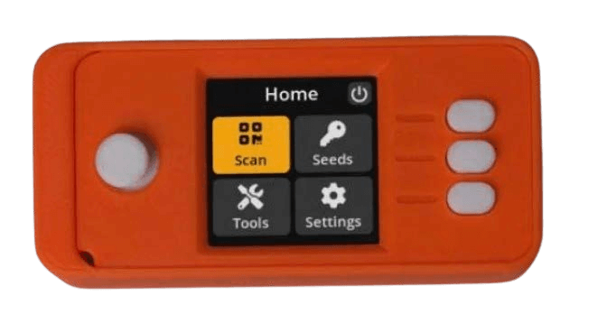

# Chapter 1

# なぜビットコインが必要なのか

## なぜなら、お金は壊れているから

> *従来の通貨の根本的な問題は、
> それを機能させるために必要なすべての信頼です。
> 中央銀行は通貨を切り下げないと
> 信頼されなければなりませんが、法定通貨の歴史は
> その信頼の侵害でいっぱいです。銀行は
> 私たちのお金を保持し、電子的に送金すると
> 信頼されなければなりませんが、彼らはほとんど
> 準備金を持たずに信用バブルの波で貸し出します。私たちは彼らを
> 私たちのプライバシーで信頼し、彼らが
> 個人情報泥棒が私たちの口座を空にしないと信頼します。*

~ サトシ・ナカモト 2009-02-11

* 法定通貨システムは壊れています（常にそうでした）。
* 持続可能ではありません（決してそうではありませんでした）。
* 修正する方法はありません（決してありません）。

---
## （金）本位制について
* 多くの人々は、お金は依然として金に裏打ちされていると信じています。
* そうではありません。
* 1971年にニクソン大統領が一方的に世界を金本位制から外して以来、金に裏打ちされていません（ニクソン・ショック）。
* これがもたらした損害の明確な全体像を把握するには、**wtfhappenedin1971.com**を参照してください。

1971年以降の消費者物価指数のインフレ（赤い線）と米ドルの購買力（黒い線）を示すグラフ。

<small>米国労働統計局、セントルイス連邦準備銀行のFREDから取得。https://
fred.stlouisfed.org/series/CPIAUCSL、2024年6月9日。</small>

* 豆知識：世界経済フォーラムは1971年に設立されました。
---

>**法定通貨（FIAT）：**（名詞）/ˈfiː.æt/
>
>: 権威的または恣意的な命令：布告
>
>: 権威ある決定：命令
>
>**: それ以上の努力なしに、またはあたかもなしに何かを創造する命令または意志の行為**

~ merriam-webster.com/dictionary

>**法定通貨：** ラテン語のfieri「作られる、生まれる」に由来

* 法定通貨とは、政府がそうである（と布告する）と言う場合にのみ価値があるお金です。
* したがって、人々はそれがそうであると（信じなければなりません）。
>* **法定通貨には価値がないと信じていなくても、法律により、
それを使用し、商品やサービスの支払いとして受け入れることを強制されます。**
* **法定通貨は無から印刷/作成されます。**
* 現在、すべてのドルの約5％が現金として印刷されています。
* 他の95％は、銀行が融資を行う際にコンピューターに数字を入力することによってデジタルで作成されます。

>*造幣局が100ドル紙幣を製造するのにかかる費用はわずか数セントです...*

~ アメリカの経済学者、バリー・アイケングリーン

---

>***NBC ’60 Minutes’のスコット・ペリー：*** *システムにお金を単に溢れさせたと言っても過言ではありませんか？*
>
>***FRB議長ジェローム・パウエル：*** *はい。そうしました。
それは別の考え方です。そうしました。*
>
>***ペリー：*** *それはどこから来るのですか？
ただ印刷するだけですか？*
>
>***パウエル：*** *デジタルで印刷します。そのため、中央銀行として、
デジタルでお金を作成する能力があります。そして、私たちはそれを行います
米国財務省証券または債券を他の政府機関から購入することで
保証された証券。そして、それは実際にお金を増やします
供給。また、実際の通貨も印刷し、
それを連邦準備銀行を通じて配布します。*

~ CNBC ’60 Minutes’ インタビュー、2020年5月17日
C*vid-19ロックダウンの開始から2か月後

>これらの貸付プログラムでできることに本当に制限はありません。

~ FRB議長ジェローム・パウエル
2020年3月18日、CBSニュースにて

>はい、連邦準備制度には無限の現金があります。私たちはそうするために必要なことは何でもします
銀行システムに十分な現金があることを確認してください。

~ ミネアポリス連銀総裁ニール・カシュカリ
2020年3月23日、CBS '60 Minutes'

>ここでの「私たち」は、連邦準備制度内の貨幣政策の変更に投票する5人です
FOMC会議中。3億3000万人のうち5人。
それが米国の金融政策を変えるのに必要なすべてです。

~ TFTC.ioの創設者@MartyBent
フォーブス記事、2020年3月18日

---

## 古き良き時代からのホースマウスから

>*銀行は、無から作り出したすべてのお金に利息の利益があります。*

*〜ウィリアム・パターソン、1694年
イングランド銀行の創設者*

>*アメリカの当惑、混乱、苦悩はすべて、
憲法や連邦の欠陥からではなく、
名誉や美徳の欠如からではなく、
コイン、信用、流通の性質についての完全な無知から生じます。*

*〜ジョン・アダムス
第2代米国大統領、1797〜1801年*

>*私は、銀行機関は常備軍よりも
私たちの自由にとって危険であると信じています。
すでに彼らは、政府を無視するマネー貴族を育ててきました。
発行権は銀行から取り上げ、
それが適切に属する人々に返還されるべきです。*

*〜トーマス・ジェファーソン
第3代米国大統領、1801〜1809年*

>*私たちの高貴な行為を誇りながら、不公平なお金システムによって、私たちは国家化されたという醜い事実を隠すように注意しました
抑圧のシステム。それは、より洗練されていますが、
動産奴隷制度の古いシステムよりも残酷ではありません。*

〜ホレス・グリーリー
米国下院議員1848〜49年
ニューヨーク・トリビューンの創設者

---

>*どの国のマネー量を管理する人も、
すべての産業と商業の絶対的な支配者です...
システム全体が非常に簡単に制御されていることに気づいたとき、
多かれ少なかれ、トップにいる少数の有力者によって、インフレと不況の時期がどのように発生するかを伝えられる必要はありません*

〜ジェームズ・A・ガーフィールド
第20代米国大統領、1881年3月〜9月
1881年に暗殺

>*今日、一連の人々の手に制御されていないものが存在します
何もないところからドルを作る力。*

〜トーマス・W・ローソン、著書『熱狂的な金融』、1905年

>*私は陰謀者のように秘密主義的で、実際にはこっそりしていました。
発見は、私たちの時間と労力がすべて無駄になるので、決して起こってはならないことを私たちは知っていました。私たちの
特定のグループが集まって銀行法案を書いたことが暴露された場合、その法案は議会を通過する可能性はまったくありません。*

〜フランク・A・ヴァンダーリップ
ニューヨーク国立シティ銀行の頭取
（シティバンクの前身）
〜1913年の連邦準備制度法として可決された法案の草案を作成するために、1910年にジキル島で行われた秘密会議について1935年に書きました。

>*この（連邦準備制度）法は、地球上で最も巨大な信託を確立します。大統領（ウッドロー・ウィルソン）が法案に署名すると、
金融力の見えない政府が合法化されます...
今世紀最悪の立法犯罪は、
この銀行および通貨法案によって行われます。*

〜チャールズ・A・リンドバーグ・シニア
米国下院議員1907-1917年

---

>*私は最も不幸な男です。私は不注意にも私の国を破滅させました。
偉大な工業国は、その信用システムによって管理されています。
私たちの信用システムは集中しています。国家の成長、
したがって、私たちのすべての活動は少数の人々の手に委ねられています。
私たちは、文明化された世界で最悪の支配を受け、最も
完全に制御され、支配されている政府の1つになりました。もはや自由な意見による政府ではなく、もはや
多数派の信念と投票による政府ではなく、
少数の支配的な人々の意見と強制による政府。*

〜ウッドロー・ウィルソン
第28代米国大統領、1913〜1921年
1913年の連邦準備制度法可決から6年後。

>*問題の本当の真実は、あなたと私が知っているように、
大規模なセンターの金融要素は
アンドリュー・ジャクソンの時代から米国の政府を所有しています。*

〜フランクリン・D・ルーズベルト
第32代米国大統領、1933年11月21日にE.マンデル・ハウス大佐に宛てた手紙の中で

>*それは[恐慌]偶然ではありませんでした。
それは慎重に考案された出来事でした...
国際銀行家は、彼らが
私たちすべての支配者として現れることができるように、ここで絶望の状態をもたらそうとしました。*

〜下院議員ルイス・T・マクファデン、
1936年に暗殺

>下院銀行通貨委員会の委員長
*銀行が融資を行うたびに、新しい銀行信用が創造されます - 新しい預金 - 真新しいお金。*

〜グラハム・F・タワーズ
カナダ中央銀行総裁、1934〜55年

---

>*私たちのお金システムに借金がなければ、お金は存在しません*

*〜マリナー・エクルズ、
1941年、FRB総裁*

>*私は、連邦政府が
論理と理性を使って、自分のお金の借り入れを正当化できる人は誰もいませんでした...
私は、人々が
これが変更されることを要求する時が来ると信じています。
私は、この国で
あなたと私と
議会に関係する他のすべての人を実際に非難する時が来ると信じています。
そのようなばかげたシステムが継続することを黙って傍観していることに対して。*

〜ライト・パトマン
米国下院議員1928〜1976年
銀行通貨委員会委員長1963〜1975年

>*あなたまたは私が小切手を書くとき、小切手を支払うのに十分な資金が口座にある必要がありますが、連邦準備制度が
小切手を書くとき、その小切手が引き出される銀行預金はありません。連邦準備制度が
小切手を書くとき、それはお金を作っています*

〜ボストン連邦準備銀行
「簡単に言うと」、1984年

---

## 連邦準備制度

* FRBは、米国の「独立した」中央銀行です。それは、1913年に連邦準備制度法が可決されたときに作成されました。
* 民間と政府の一部であるユニークな構造を持っています。
* 政府内の政治的に独立した超党派の団体であると考えられています。
* FRB理事会は大統領によって任命され、議会によって承認されますが、**FRBの決定は誰によっても批准される必要はありません。**

**構成：**

* 連邦準備制度理事会
* 12の連邦準備銀行
* 金融政策を決定する機関である連邦公開市場委員会（FOMC）。

**FRBは、次の責任を負います。**

* 米国の金融政策を監督し、雇用と安定した価格を促進すること。
* 銀行および金融機関を規制および監督すること。
* 金融機関に支払いサービスを提供すること。
* 消費者保護と地域社会の発展を促進すること。

---

## FRB議長に関するメモ

* **連邦準備制度議長は次の役割も担います。**

* 米国の方向性を決定する連邦公開市場委員会（FOMC）の議長
金融政策（例：QE、金利引き上げ）
* 国際通貨基金（IMF）のメンバー
* 国際決済銀行（BIS）のメンバー（中央銀行の銀行）。
* G-7の米国財務大臣
* G-20の米国財務大臣

* 1人の人にとって**非常に**大きな力。

---

## 部分準備銀行制度、利息、および融資

* **部分準備銀行制度：** 2020年3月まで、銀行は10％の準備金を保持する必要があり、90％を貸し出すことができました。
* **2020年3月以降、準備金は不要になり、銀行は無制限の融資を発行できるようになりました。**

* 融資は債務に基づくお金であり、融資に利息を支払う必要があります。

>* **豆知識1：** 融資の利息を支払うためのお金は、銀行によって作成されていません。
>* **豆知識2：** それは決して作成されません。
>* **豆知識3：** すべての融資＋それらの融資に発生する利息を返済するのに十分なお金は世界にありません。
>* **豆知識4：** 決してありません！

---

## 石油ドルに関するメモ
* **1971年までドルは金に裏打ちされ、1974年以降は石油に裏打ちされ、したがってデフォルトでは米軍に裏打ちされていたと言えるでしょう。**
* **1974年、米国とサウジアラビアは、石油の販売価格を米ドルで設定する二国間協定を締結しました。**
* それ以来、世界の石油販売のほとんどは米ドルで決済されています。
* これは、ドルが世界で最も強い通貨になることに大きく貢献しています。
* **したがって、通常は苦労している時期でも、人為的に支えられてきました。**
* 2022年後半以降、多くの国が米ドル以外の通貨で取引を開始しています。
* これは、石油ドルの終わりの始まりである可能性が非常に高いです。次に何が起こるかはまだわかりません…

---

## QE（量的緩和）について
* **量的緩和は、中央銀行が「経済を刺激する」ために使用する「型破りな金融政策」と見なされており、FRBが政府債券やその他の政府証券を購入します。**
* これは、2001〜2006年の間に日本で初めて使用されました。その後、米国、英国、ユーロ圏は2008年の金融危機の際にQEを使用しました
* それ以来、米国がQEプログラムを実施していなかったのは2014〜2019年の間だけです。
* 以下に示すように、批評家は**QEがすでに富裕層に圧倒的に利益をもたらすと主張しています**

*クレジット：Twitterの@RudyHavenstein*

---

## サイクル

* **自然界のすべてにおいて、サイクル、自然な満ち引き、拡大と収縮があります。**

* これは、地球上のすべての生命の、全体的な、長期的な、バランスのとれた持続可能性に貢献します。
* **債務に基づく法定通貨システムは、自然サイクルの知恵を無視し、代わりにその生存のために、その債務にサービスを提供し続けるために、比類のない、緩和されていない成長に100％依存しています。**
* 自然界では、これはがんです。
* 「経済」では、この不自然な軌道は、政府が倒産しつつある銀行や大企業を救済することによってさらに支持されています。倒産させ、何か新しい、より健全なものにリサイクルするのではなく。
* **倒産しつつある企業を救済することの近視眼さは、経済全体を危険にさらしています。** つまり、それは単に缶詰を先送りしているだけであり、必然的に訪れる混乱は、自然サイクルが実行されることを許可した場合よりも、はるかに激しくなる可能性があります
* **私たちは、新しい海岸に私たちを運ぶための救命ボートを提供するビジョン、先見性、決意、スキルを持っているサトシ・ナカモト、そして彼以前および以降のサイファーパンクに恩義があります。**

---

* これが贈り物であることに気づいたら、心と頭をクリアにして、旅に参加し、平和のお金で新しい世界を構築するのは私たち次第です。
>* **ビットコインはお金を修正し、残りを修正するのは私たち次第です。そして、明確にするために、お金を修正することで、多くの他のことがデフォルトで修正されます**

* 主なものは、大規模で政府が開始した運動戦争が、人々の支持なしにはもはや利益を得ることができず、不可能になることです。
* さらに、自然に消費が減少し、本来収益化されるべきではなかった住宅や不動産の、実質価値の商品やサービス、自由市場、実際の貯蓄、非収益化への切り替えが行われます。
* **参照：** Bitcoin Fixes This、32ページ
---

## なぜなら、インフレは窃盗だから

1913年の連邦準備制度の設立以来のドルの購買力の低下を示す2024年のFREDチャート。1913年以降の累積インフレ率は約3.067％です。世界中の中央銀行の法定通貨はすべて、同様の低下率に従っています。

* **無からお金が作成されればされるほど、すべてのお金は価値/購買力を失います。**
* これは**インフレ**と呼ばれます。
* インフレは、文字通り**時間の窃盗**です。インフレ、切り下げ、操作された通貨で時間を節約すると、時間の価値が盗まれます。
* インフレは**隠れた税金**でもあります。

---

* この時間の窃盗と税金は、他のすべての国の法定通貨にも影響を与えています。これは、1944年のブレトンウッズ協定以来、世界準備通貨として、すべてが米ドルに固定されているためです。
* **米国では、年間2％のインフレ率が連邦準備制度の義務に書き込まれています。**
* これは、毎年同じ20ドル札で**2％少なく購入できることが保証されている**ことを意味します。
* **2024年3月、年間インフレ率は3.5％でした**（2％よりもはるかに高いので、2023年3月から2024年3月の間に購買力の3.5％を失ったことを意味します。
* 言い換えれば、これは平均して物価が3.5％上昇したことを意味します
* **1980年代初頭まで行われていたように、インフレが正確に測定された場合、2024年には実際には10％近くになるでしょう。**
* カテゴリ別に見ると、過去1年間で多くのカテゴリでインフレが3.5％よりもはるかに悪いことがわかります。
* 家賃、食料品代、ガソリン代、ほとんどの購入物を調べると、すべてのセクターでインフレが蔓延していることは明らかです

---
**過去50年間の米国の平均インフレ率：**

| 平均費用 | 1971年 | 2021年 | ％増加 |
| --- | --- | --- | --- |
| 給与 | $9,400 | $59,400 | 532% |
| 家 | $23,400 | $513,000 | 2,092% |
| ガソリン1ガロン | $0.36 | $4.17 | 1,058% |
| 新車 | $3,400 | $47,000 | 1,282% |
| 大学の学位 | $1,400 | $26,000 | 1,757% |
| 食料品のバスケット | $20 | $210 | 950% |
| 電気/kWh | $0.02 | $0.15 | 650% |

>**本当の話：**
〜家は1976年に58,000ドルで購入されました。
〜「公式」インフレを考慮すると、これは2022年のドルで279,000ドルになります。
〜2022年、同じ家は209万ドルと評価されました。
〜考えてみてください…

>*法定通貨は偽情報です。
10ドル札はどのような情報を伝えますか？
10は、分母が欠落している分数の分子です。
10はいくつですか？
10は、既知の安定した分母がなければ何も言いません。*

〜@bitlany

---

* **インフレが上昇すると、貯蓄（幸運にも貯蓄がある場合）は価値を失います。**
* 時間の経過とともに、それらは**多大な**価値を失います
>*今日から毎月100ドルを貯蓄し始めた場合、利用可能な最高の金利は0.05％です。
> * 30年後には**84,019ドル**貯蓄できたでしょう。
>* FEDの義務付けられた2％のインフレ率で調整した場合
>* 30年後には、貯蓄の実質購買力はわずか**46,384ドル**になります。
>* 今日の3.5％のインフレ率で調整した場合：
>* 84,019ドルの貯蓄の購買力は、30年後にはわずか**11,037ドル**になります！

* **実際には、仕事の約6時間のうち7時間が盗まれたことを意味します = *時間の窃盗。***

---
**別の見方は次のとおりです。**
* **1971年**、家の費用 = 平均年収の**2.5**倍。
* **2024年**、家の費用 = 平均年収の**8.6**倍。
* **1971年**、新車は平均年収の約**1/3**でした
* **2024年**、新車は平均年収の**3/4**以上かかります。

インフレが
あなたのために働く
**ではありません** *。

**注：** これらの数字はすべて平均であり、多くの要因に基づいて変動します。ポイントは、インフレが隠れた税金であり、私たちの実際の労働と生産に対する時間の窃盗であるということです

>* **ハードマネーがこれを修正します。**
>* **ビットコインはハードマネーです**
---

## 中央制御され、操作され、債務に基づく経済を置き換える必要があります

>*政府の手から物を取り除く前に、私たちは良いお金を再び持つことは決してないと思います。
つまり、政府の手から暴力的に奪うことはできません。私たちができるのは、政府が阻止できないものを導入するような、狡猾な回り道の方法によるだけです。*

〜フリードリヒ・ハイエク、1984年
オーストリアの経済学者、哲学者、作家、1899〜1992年

2020年3月の4兆ドルから2024年6月には18兆ドル以上に増加した、指数関数的なM1マネーサプライの増加を示すグラフ。

* **ここであなたの心を爆破してください：** https://usdebtclock.org/
---
* **既存のすべての米ドルの45％は、2020年4月から2022年1月にかけて印刷されました！**
* つまり、空気から印刷されたことを覚えていますか？
* 法定通貨は国によって中央制御されており、供給は簡単に操作されます。
* **米国の国家債務が1兆ドルに達するのに205年かかりました。（1776 > 1981）**
* 米国の国家債務が**34兆ドルに達するのに**わずか**33年しかかかりませんでした！（1981 > 2024）

米国の1970〜2024年の総公的債務を示すFREDグラフ。

>*国際金融協会によって測定された世界の債務は、現在303兆ドルに達しています。
これは債務に基づく法定通貨の私たちの惑星です。
ちなみに、世界GDPはわずか84兆ドルです。*

*〜ニク・バティア、『レイヤードマネー』の著者、2021年*

---

* **参考までに**

| **もしあなたが持っているなら：** | **1秒あたり1ドル使える** | |
| ------------ | ----------------------- | -------------- |
| **100万ドル** | 11日間 | ＝11日間 |
| **10億ドル** | 11,680日間 | ＝32年間 |
| **1兆ドル** | 11,680,000日間 | ＝32000年間 |

* 私たちは皆、より多くを印刷する時期と、請求する金利を決定する力を持っている人々のなすがままにされています。
* **FRBが金利を引き上げると、家や車のローンが突然高くなり、支出が鈍化し、スタグフレーションにつながります**

* **彼らが金利を人為的に低く保つと、私たちは不況の時代に入ります**

>* **中央銀行が財政の「天気」を作り出すことを許可することは、何が価値があり、何がないかを市場に決定させる自由を奪います。**

* さらに、**彼らが銀行や企業を救済すると、人為的に経済を支えます。** カードの家が崩壊するのも時間の問題です。
* 中央銀行を持つことの当初の議論は、経済が揺らいだときに最後の貸し手が必要であるということでした。

---
* **これは、中央銀行が第一のリゾートの支配者に変わり、比類のない、選出されていない、最終的には権威主義的な力を持つようになりました。**

> *ビットコインを除くすべてのお金は政治的です。
法定通貨、銀行商品、フィンテッククレジット、
他の暗号通貨、さらには金も、すべて政府、企業、または少数のグループによって管理されています。
例外を持つことは、
私たちが将来に向かうにつれて非常に役立つことが証明されます。*

*〜アレックス・グラッドスタイン @gladstein
人権財団最高戦略責任者*

>*ビットコインは80億人を結びつけ、1億の企業を結びつけ、世界を政治的管轄区域にわたって同期させ、金融システム全体に合理性を回復させ、人類全体に自由と財産権を回復させます*

*〜マイケル・セイラー
マイクロストラテジーCEO*

---

## 銀行口座を持たない人々に銀行サービスを提供する必要があります

>*通貨が弱体化している20か国9億5300万人の人々にとって、ビットコインは財務資産よりも大きな何かを表しています。彼らにとって、それは洪水を逃れるための暗号化されたエネルギーの方舟のようなものです。*

*〜マイケル・セイラー
マイクロストラテジーのCEO*

* **2024年現在、世界の成人の約25％が銀行口座を持っておらず、約14億人です！**

>* **これは、彼らが銀行サービスにアクセスできず、ATM、デビットカード、クレジットカード、小切手を使用できないことを意味します。**
>* **さらに、彼らはビジネスを開始したり、車や家などを購入したりするためのローンを組むことができません。**

* **送金、受領、または小切手の換金は費用がかかります。**

* 彼らは、高額な料金を請求し、処理に時間がかかるウエスタンユニオンのような送金および小切手換金サービスを使用する必要があります。

* 他の国（送金）の家族に送金する人々にとって特に費用がかかり、銀行経由で最大10％または12％の費用がかかる可能性があります

---
* 彼らが家族のメンバーが送ったお金を手に入れるために、輸送費を支払い、居住地から遠く離れた送金オフィスに行く必要があるため、**送金を受け取る人々にとって費用と時間がかかります**。

* 多くの場合、これらのオフィスに旅行するのは安全ではありません。
* ビットコインは、ライトニングネットワーク上で、これらの問題に対する即時のソリューションを今提供します！

***＃ビットコインがこれを修正します***
>*人々を力づけるテクノロジーが止められたことはいつありますか？*

*〜ジェフ・ブース
著者：明日の価格*

---

## 人々が専制政治と通貨崩壊から逃れるのを支援する必要があります

* 私たちがこれまで見てきたように、過去数年間で、政府は反対する人々の銀行口座を凍結することができますし、そうしています。

>* **これは、本質的に、銀行にあるあなたのお金は、いつでもあなたから盗むことができる借用証書に過ぎないことを示しています。**

* さらに、ベネズエラ（283％）、スーダン（63％）、レバノン（212％）、シリア（79％）、アルゼンチン（161％）、ジンバブエ（47％）、トルコ（64％）などで2024年に現在見られているように、インフレが蔓延すると、人々の生涯にわたる貯蓄は、時には一晩にして蒸発し、それについて何もできることはありません。
* 上記のいずれかを経験している人々にとって、**ビットコインは、それ以外の場合は維持できない問題に対する現実的で即時の解決策になります。**
* **専制政治とインフレの両方が多くの場所で高まっていることを考えると、今ビットコインを取得することで、それらに対するヘッジをするのが賢明でしょう。**
---
## CBDCを避ける必要があります
* **中央銀行がCBDC、中央銀行デジタル通貨の作成を開始していることを聞いたことがあるかもしれません。** 2020年5月には、35か国がこのオプションを検討していました。
* 2022年3月には、87か国が積極的にCBDCのパイロット版を検討しているか、すでに開始していました
* 2024年6月の執筆時点では、世界のGDPの98％を占める134か国が調査、開発、パイロット、または立ち上げ段階にあります。
www.atlanticcouncil.org/cbdctracker/

>**CBDCは、オンライン銀行口座で表示される電子マネーと非常によく似ていますが、ネイティブにデジタルであるため、プログラミング可能で100％制御可能です。**

>*CBDCの重要な違いは、中央銀行が**絶対的な制御**を持つことです...*

〜アグスティン・カルステンス
BIS総支配人 - 国際決済銀行（すべての銀行の銀行）

* **これは、政府がお金に有効期限をプログラムし、有効期限が切れる前に強制的に支出させることができることを意味します。**

---

* **また、他のこと、**特定のショップ、ウェブサイト、または管轄区域でのみ使用できるようにプログラムすることもできます。
* **彼らはそれを以下にリンクすることができます：** あなたの信用スコア、あなたの健康パス、デジタルID、その他の社会的スコア。

* **彼らは、ある分野のあなたの特定のスコア、またはあなたの「全体的なスコア」、または彼らが「経済」が必要だと見なすものに基づいて、**彼らが適切と考える制限をプログラムすることができます。
* さらに、彼らはあなたがお金で行うすべてのことを監視することができます。

>*今日、誰が100ドル札を使っているのかわかりませんし、今日、誰が1,000ペソ札を使っているのかわかりません。
CBDCの重要な違いは、**中央銀行は
その**中央銀行の債務の表現**の使用を決定するルールと規制を絶対に制御**し、また**それを強制する技術を持っている**ということです。*

〜アグスティン・カルステンス
GM、BIS - 国際決済銀行

>* **注：** **「中央銀行の債務の表現」**と言うことは、お金として保存されたあなたの価値、あなたの生命力が、実際には中央銀行によって「所有」されていることを意味します。
---

## 庭を救う必要があります

* **ビットコインは、私たちが直面している最大の問題である法定通貨の嘘を根源から摘み取ります。**

* これは、堕落した法定通貨、高利貸し、そしてお金の印刷機に最も近い人々を大きく豊かにしながら、あなたの時間を盗むためにそれに伴うすべての嘘です。

* **法定通貨の嘘**は、庭の巨大な**モンスター雑草**のようなもので、土壌からすべての栄養素を**吸い込み**、すべての菌糸体を**殺し**、他の植物が繁栄できず、生き残るのに苦労しているため、日光を**遮断し**ます。
* この有害なモンスター法定通貨の嘘がなくなると、突然真実が入ってきます！

>* すべての植物**（人々）**は回復を開始できます。
>* 土壌**（人々の創造性、実際の製品、サービス）**は再生できます。
>* 菌糸体**（人々の間の信頼できるつながり）**は再成長します。
>* そして、日光**（仲介されていない生命力）**が再び私たち全員に降り注ぎます！
---

## 世界を修正する必要があります
* これは冗談ではありません。**#ビットコインがこれを修正します**は、正当な理由で実行されているミームです。
* これはやや「壮大」に聞こえるかもしれませんが、説明させてください。「物事がそうなっている方法」を考えると、**「何かが非常に間違っている」ことがわかります。**
* 蔓延する破壊、環境破壊、分裂した家族やコミュニティ、文化、言語、伝統の喪失、貧困の増加、莫大な富が（非常に）少数の手に集中、過剰消費、政治家を支援する無限のお金、何百万人もの人々のための食料と清潔な水の不足、肥満と自己免疫疾患の増加、終わりのない戦争…

>* NGO、非営利組織、慈善財団、いわゆる政府支援機関が指数関数的に増加していることを考えると、これらの問題は深刻度が低下しているはずだと思うでしょう。
>* 代わりに**、それらは大きく悪化しています。**

---

# Chapter 2

# 金融包摂を改善する
* **ビットコインがあれば、誰もが*同じ*金融システムにアクセスでき、誰もが*同じ*ルールに従います。**
* 抜け穴や裏口、特別な取引は誰にもありません。
* 誰もが、同じルールで作成および維持される同じ本物のお金で、提供する価値に対して報酬を得る可能性があります。
* **ビットコインは、インターネットに接続できる場所であればどこでも、誰でもアクセスできます。**

## 世界への価値の追加
* **ビットコインは、コミュニティや市場に真の価値を付加するように人々を奨励します。**それがより多くのお金を稼ぐ唯一の方法だからです。
* 満足できる量が少なければ、公正な賃金で働くことで引き続き利益を得ることができ、**貯蓄をすると、その貯蓄は時間の経過とともに価値を維持します。**

---
## 環境を改善する
* 上限のある健全な通貨は、私たちが今日見ている債務に基づく無制限の通貨発行によって作り出されるものとは、まったく異なるダイナミクスを生み出します。
* 常に多くを消費するという止められない衝動の代わりに、ローンや債務に対する複利を支払うために底辺への競争を行い、最終的に完済されることはありません。**ビットコインは、低い時間選好が求められる世界へのオフランプを提供します。**
>* 横行する環境破壊は、**消費の削減、廃棄物の削減、および生産への慎重なアプローチに置き換えられ、**市場が真の価値を保持するものを決定し、したがって、物事は長持ちするように構築されます。
* これは人、植物、動物にとって純粋な利益です！
---
## 戦争を改善する
* 法定通貨システムの無制限の発行は、「永遠の戦争」を可能にし、収益性の高いものにしています。
* 人々は戦争の支出がどのように行われるか、または戦争のお金がどこから来ているのかをほとんど知らないため、政府の側にはほとんど責任がありません。 戦争は遠隔地で何年も長引く可能性があり、実際の監視はありません。
* ベトナムから始まり、戦争は「クレジットカード戦争」になりました（@AlexGladsteinより）。政府は戦争に資金を供給するためにお金を借り、最初のローンの利息を支払うためにもっとお金を借りるからです...何度も繰り返します。
>* **ビットコイン標準では、戦争の費用を喜んで支払う国の国民が必要になります。 彼らは、自分たちの家族と国を守るために、絶対に明確に必要な場合にのみ、そうする可能性が高く、最終目標はサイト内にあります。**
* 不当な利益が得られることはないので、政府関係者や企業は、実行可能な選択肢として戦争を促進または関与するよう奨励されません。
* **代わりに、平和的で低コストの解決策を見つけるための努力が大幅に増加します。**
---
## 時間選好を改善する

**高い時間選好：**即時的な満足、短気、短期的な計画
**低い時間選好：**遅延された満足、忍耐、長期的な計画

* 高い時間選好は、個人的、社会的、環境的な破壊につながります。 私たちのお金は日々価値を失っているので、私たちは我慢できなくなり、価値を失う前にできるだけ早くお金を使うことを「強制」されます。
* 私たちの時間が絶えずインフレする法定通貨によって切り下げられると、私たちは時間の価値とのつながりを失います。
* これは断絶と、根底にあるストレスにつながります。
* ストレスを軽減し、意味を見つけようとする試みは歪められ、薬物、アルコール、買い物、ポルノ、ファストフード、注意散漫、スクリーン/ソーシャルメディアへの依存、衝動的な決断などの気晴らしになります。
* **一方、健全なお金は、時間の経過とともにその価値を保持し、私たちの仕事を通して私たちの貢献を適切に測定し、低い時間選好、思慮深い生活の質、有意義な関係、消費の削減、より深い繋がり、より深い会話、長期的な目標、創造性の向上につながります。**
---

# Chapter 3

# ビットコインとは？

>*「一般の聴衆向けにこのものを説明するのは
非常に難しい。
何にも関連付けることができない。」*

~ サトシ・ナカモト 2010-07-05

>*「総流通量は21,000,000コインになります。ネットワーク
ノード（マイナー）がブロックを作成する際に配布され、
その量は4年ごとに半分になります。
最初の4年間：10,500,000コイン
次の4年間：5,250,000コイン
次の4年間：2,625,000コイン
次の4年間：1,312,500コインなど...
それがなくなると、システムは必要に応じて
取引手数料をサポートできます。それは
自由市場競争に基づいており、おそらく常に
無料で取引を処理するノードが存在するでしょう。」*

~ サトシ・ナカモト 2009-01-09

* **ビットコインは自由なお金です…** 中央銀行システムの広範な操作と管理から私たち全員を解放する可能性があるという意味で。
* **ビットコインでは、通貨のルールは誰にとっても、どこでも同じです。**
* ビットコインは包括的であり、インターネット接続があれば誰でもネットワークに参加でき、**同じルールに従わなければならない**という意味で。

---
## ビットコインとは：
* **分散型**
* **真に希少**
* **検閲耐性**
* **分散型台帳**
* **改ざん不可能**
* 許可不要
* 監査可能
* 透明性
* 不変
* 国境なし
* 偽造困難
* 仮名性
* 摩擦なし
* トラストレス
* ピアツーピア
---
* ビットコインは分散型です。
* **それは、互いを知らない何千人もの人々によって、世界中の何千ものノードで実行されています。**
* 誰一人として、政府や企業も、それを制御することはできません。
* あなたもノードを実行できます、簡単です ;)
* 自分のノードを実行することで、自分のトランザクションを検証するときに、プライバシーを高め、ネットワークを保護するのに役立ちます。
> **信頼するな。検証せよ。**
---
* **Bitcoin（大文字の「B」）**は、金融ネットワークです。
* **bitcoin（小文字の「b」）**は、Bitcoinネットワーク上で発行され、実行される通貨または金融資産です。

---
* **ビットコインは偉大なインセンティブを与えるものです。**
>* **サトシの天才は、ビットコインにおいて初めて、善人も悪人もルールに従うようにインセンティブが与えられていることでした。**

> *「インセンティブは、ノードが正直であり続けることを奨励するのに役立つかもしれません。
もし貪欲な攻撃者が、すべての正直なノードよりも多くのCPUプルーフオブワークを組み立てることができれば、彼はそれを使って支払いを盗み返すことで人々を欺くか、新しいコインを生成するかのどちらかを選択しなければなりません。
彼は、システムと彼自身の富の有効性を損なうよりも、ルールに従ってプレイする方が有益であるはずです。ルールは、他のすべての人を合わせたよりも多くの新しいコインで彼を優遇するものです。」*

~ サトシ・ナカモト 2008-10-31

---
* **ビットコインは最初のデジタルネイティブマネーです。** オンラインの当座預金口座とは異なり、中央銀行の不換紙幣のデジタル形式にすぎません。
* ビットコインは**分散型**デジタル通貨です。
* ビットコインには**中央機関がありません。**
* ビットコインは**国家を持たない**ものです。
* 意味を考えてみてください...

>*ビットコインは、世界中の誰にでも即座に支払いができる分散型デジタル通貨です。
ビットコインは、中央機関なしで動作するためにピアツーピアテクノロジーを使用します。トランザクション管理とマネー発行は、ネットワークによって共同で行われます。*

~ Bitcoin Wiki
en.bitcoin.it

---
* ビットコインは魔法のインターネットマネーです。
* いいえ、真面目に、**ビットコインは私たちが世界を修正する方法です。**
* 本当に？はい。
---
* **ビットコインは価値を移転する方法です**
 * 任意の金額の
 * 安全に
 * 瞬時に（ライトニングネットワーク上）
 * 任意の2者間
 * いつでも
 * 24時間365日
 * どこでも
 * ええ、どこでも
 * それについて考えてみてください。

 ---

>*暗号証明に基づく電子通貨を使用すると、第三者の中間業者を信頼する必要がなく、お金は安全になり、取引は簡単になります。*

~ サトシ・ナカモト 2009-02-11

---
>*ビットコインは（ほぼ）確実にコストなしで移動できます。
私は自分が何を受け取っているかを100％確信しています。*

~ マイクロストラテジーCEO、マイケル・セイラー

* 1.13ドル、46セント、359サトシ、5億サトシ、または100万ドルを、BitcoinネットワークまたはBitcoin上に構築されたLightningネットワーク経由で、いつでも、どこでも、誰にでも送信できます。
* **そして、誰もあなたを止めることはできません。**
* それを金、銀、USD/GBP/EUR/YEN/CYK/ZARまたはその他の中央銀行の不換紙幣で行うことができますか？

---
* **ビットコインは歴史的です。** これは、真に分散型で、検閲耐性があり、不変で、国境がなく、許可不要で、改ざん不可能な、絶対的なハードキャップ（2100万コイン）を持つ金融システムがこれまでに作成されたのは、歴史上初めてのことです。
>* ビットコインは、**権力を分散化し、金融包摂を促進する上で、**印刷機の発明、そして後にワールドワイドウェブが、**情報の管理を分散化し、アクセスを増やす上で、**と同じくらい重要です。*

>*多くの人々は、1990年代以降に失敗したすべての企業のために、電子通貨を当然のように失われたものとして却下します。
それらを破滅させたのは、それらのシステムの中央集権的な性質だけだったことは明らかだと思います。
これが、分散型で、信頼に基づかないシステムを私たちが初めて試みていることだと思います。*

~ サトシ・ナカモト 2009-02-15
---
* **ビットコインは、分散型、透明で不変のアカウントの台帳です。**
* 世界中の誰もが、誰が何を所有しているかをいつでも見ることができ、それを変更することはできません。
* ただし、「誰」は名前ではなく、**数字と文字で構成されたアドレスです。**
>* ビットコインアドレスの例：
**bc1qar0srrr7xfkvy5l643lydnw9re59gtzzwf5mdq**

* したがって、ビットコインは**仮名性**です。
---
* **ビットコインは**
* 資産の公平な発行者
* 価値の保存
* 交換媒体
* そしてまもなく会計単位になる
* **だけでなく**
* **交換の手段**でもあります。

* 発行者、金、現金、デビットカード、Paypal、銀行、Venmo、Cash App、Western Unionです。

**すべてが1つにまとめられています！**

---
* **ビットコインは、銀行家、簿記係、会計士の代わりに、数学とコンピューターサイエンスを使用する記録管理者です。**
* 中間業者、銀行、政府、当座貸越手数料、当座預金手数料、限られた営業時間、検閲の可能性、口座凍結、マネーサプライの操作、金利、IMF、WEF、BIS、実店舗の建物、ATM、小切手、チャージバック、石油ドル、ユーロドル、銀行貨幣発行益、カンテロン効果、部分準備銀行制度、Visa、Mastercard、Amex、Western Union、電信送金が完了するまでの数日間...を排除します。

>* **あなたと握手したい人の間に誰かを挟む代わりに、直接握手することができます。**
>* **自分のお金を送るために許可を求める必要はありません！**
---

## 簡単に言うと...
* **ビットコインは、誰にも奪われないデジタル資産です。**
* >ビットコインを所有するということは、あなたの秘密鍵で制御する特定の住所から、あなたが選択した任意の他の住所に価値を送る権利を所有することを意味します。

*ビットコインは、暴力の独占から独立した財産権です。*

~ ロバート・ブリードラブ @breedlove22

---

* **ビットコインは、種にとって一度限りのイベントです。**
* ビットコインは選択肢です。
* ビットコインは**主権を生み出します。**
>* **15年前にビットコインが発見されたことは、人間の金融的自由と主権にとって、50万年以上前の火の発見が人間の繁栄にとって、そして約900年前の印刷機の発見が人間の知識へのアクセスを分散化する上で重要であったことと同じです。**

---
* **ビットコインは真の価値の保存手段です。**
* 最も貴重な資源である時間を保存し、後で再びアクセスできるようにします。
>*ビットコインは、将来の自分への高帯域幅のエネルギー導管のようなものです...今日働き、ビットコインはあなたのエネルギーを後で使用するために深く凍結します。*

~ ロバート・ブリードラブ

>*お金の根源は時間であり
時間の根源は価値である*

~ ガイ・スワン

---
* ビットコインは、文字通りタイムチェーンです。
* サトシは、初期の開発者とのメールで何度もタイムチェーンについて言及しました。
* 1つのブロックが約10分ごとにマイニングされるため、ブロックで時間を測定できます。
>* **私たちの時間は、最も希少で貴重な資源です。**
>* **それは私たちの文字通りの生命力です。**
>* **真のお金は、私たちが時間を保存することを可能にします。**

* それは、私たちが「費やした」時間を認識できる方法です。
* 私たちは**お金と時間を交換します。これは単に私たちの時間と努力の記録です。**
* **ビットコインは、私たちが以前のように働くことができなくなったときに、人生で後で「アクセス」できるように、時間を保存することを可能にします。**
---
* ビットコインは**価値の保存**です。
* ビットコインは**交換媒体**です。
* ビットコインは**いつの日か会計単位になるでしょう。**
* ビットコインは**いつの日か*THE会計単位*になるでしょう。**
---
* **ビットコインは希少です**
* それには21,000,000のハードキャップがあります。
* これ以上増えることはありません。
* ここではコードが法律です。*

*コードを変更することは「技術的に」可能ですが、サトシの天才はそれを防ぎます。供給を増やす（インフレさせる）ことは、流通しているすべてのビットコインの価値を下げるだけに役立つためです。したがって、これは、すべての人に21,000,000のハードキャップ供給を維持することに暗黙のうちに同意するように促します。

* @TCによる**timechaincalendar.com**をチェックして、現在のブロック高、利用可能な供給、およびビットコインタイムチェーンに関する他の多くの指標を確認してください。
---
* **ビットコインは、供給を低下させることなく、無限に分割可能です。**
* **ピザは、スライスがどれほど小さくても、1つのピザです。**
* 現在、8桁まで分割可能です：1.00000000
* 1ビットコインには100,000,000サトシがあります。
* 1サトシ = 0.00000001
* 任意の量でサツ（サトシ）を購入できます。
---
* **ビットコインは、私たちが知っている中で最も硬く、健全なお金です。**
* 金は簡単に分割または携帯できず、速度が遅く（移動が遅い）、簡単に検証できないため、金よりも健全です。
* **ビットコインは、これまで知られているすべてのアセットの中で最も優れた金融特性を持っています。**

**健全な貨幣特性の比較チャート**

注：これは一般的な概要であり、チャートで対処できないニュアンスがあります。

---
* **ビットコインは解毒剤です。**
* 救済、マネープリンティング、量的緩和、金利操作で経済を「安定化」しようとすることは、人工生命維持装置を使用するようなものです。
* この「機械」は、維持するのにますます費用がかかり、持続可能性が低下し、深刻な故障につながる前に、これ以上長くは続かない可能性があります。
* **ビットコインはこれを修正します**
* **ビットコインはより良いお金です**
---
* **ビットコインは反脆弱性です。**
* そして、試みられたすべての攻撃、すべての政府の禁止、すべての主流メディアのFUD（恐怖、不確実性、疑念）によって、ますますそうになります。
>* ビットコインはハッキングされたことがありません。*
* 多くの人が試みましたが。

*ハッキングについて聞いたことがあるかもしれませんが、ハッキングされたのは取引所であり、ビットコインプロトコルではありません。
* **覚えておいてください：**
* あなたの鍵でなければ、あなたのコインではありません。
* **常に**あなたのサツを**自分のウォレット**に引き出してください。
* **ベスト**はピアツーピアで購入することです。
---
* **ビットコインは次のものの組み合わせです。**
* コンピュータサイエンス
* ネットワークプロトコル
* 電気システム
* ゲーム理論
* 確信
* ミメティクス
* 熱力学
* ネットワーク効果
* 暗号化
* エネルギー
* 真の希少性
* 経済的インセンティブ
* ソフトウェアエンジニアリング
* お金の時間的価値
* テクノロジー採用曲線
* 創発現象
* 分散化の力
* 低い時間選好
* インセンティブの整合
* 金融的中立性
* 金融活動主義
* 不変性

...これらはすべて、信頼のない分散型環境で信頼を築き、

* 中立的な
* 安全な
* 検閲耐性のある
* 許可不要の
* グローバルな

デジタルマネーと金融ネットワークをサポートするために連携して機能します。

---

* **ビットコインは深いウサギの穴であり、**知っていると思っていたほとんどすべてのことに疑問を抱かせます ;)
* ビットコインは自己完結型です。
* **ビットコインは単に存在します。**
>*ビットコインは存在します。そして、それで十分です。*

~ @Beautyon

---
* **ビットコインは共生関係です。**

**人間**

と

**時間/価値を転送および保存するための完璧なソリューション。**

* 人間はビットコインを必要とし、ビットコインは人間を必要とします。
---
* **ビットコインは、ビザンチン将軍問題の解決策です。**
* これは、かつてはコンピューターサイエンスでは解決できない問題であると考えられていました。
* この問題は、分散型システムで発生します。ここでは、送信されたメッセージ=受信されたメッセージであることを証明することは不可能であると考えられていました。なぜなら、「中間者」が悪者であり、メッセージを偽造する可能性があるからです。
* つまり、分散された独立したコンピューターのネットワーク間でコンセンサスを形成することは不可能であるように思われました。
* サトシは、暗号で保護された分散型台帳とともにタイムスタンプを使用することにより、この問題を解決しました。
* 彼の解決策は、**ナカモトのコンセンサス**として知られています。
---
* **ビットコインは二重支払い問題の解決策です。**
* これは、ビットコインを送信すると、受信者は実際に送信したビットコインを所有しており、それを受信者に送信した後は、他の誰かに送信してそれらのコインを再度使用（二重支払い）できないことを確認できることを意味します。
* 私があなたにオレンジをあげるのと同じです。それが私の手を離れてあなたの手に入ると、私はもはや他の誰かに与えるオレンジを持っていません。
>*..二重支出はトランザクションプールに決して受け入れられないため、すべてのノードは、最初に見たトランザクションをブロックに入れるために作業することで証言します。*

~ サトシ・ナカモト 2010-12-09

---
* **ビットコインは、現金や金のようなベアラー資産であり、**ベアラー（所有者）が直接保持します

>* **つまり、送信（付与）されると、トランザクションを処理するために中間者（銀行）を必要とせずに、新しいベアラー（所有者）に直接渡されます。**

---
* **ビットコインはP2P（ピアツーピア）です。**
* ビットコインは検閲耐性があります
>* **これは、トランザクションが新しいベアラーに送信されるのを阻止したり、妨げたりする力を持つ人がいないことを意味します。**
* ビットコインは自由に流れます。

* ゲートキーパーは存在できません。
---
* **ビットコインはトラストレスです。**
>*従来の通貨の根本的な問題は、それが機能するために必要なすべての信頼です。中央銀行は通貨を切り下げないように信頼されなければなりませんが、不換紙幣の歴史はその信頼の侵害に満ちています。*

~ サトシ・ナカモト、ビットコインのトラストレスな性質の重要性について。

---
* **ビットコインはコードです。**
* **コードはスピーチです。**
* github.com/bitcoinをチェックしてください
* **これは現在、メインのビットコインリポジトリです。**
* コード、プルリクエスト、レビュー、コミット、bip（ビットコイン改善提案）、およびビットコインである作成に取り組んでおり、維持し、改善している開発者を表示するには、クリックしてください。

---

* **ビットコインはマネーのインターネットです。**
* 他のすべてのものがデジタル化されている（またはデジタル化された）ことを考えると、次のものが含まれます。
 * 音楽
 * 本
 * 銀行業務
 * 映画
 * 教育
 * 写真
 * 電話
 * ラジオ
 * 地図
 * ゲーム
 * 会議
 * そして、リストは続く（良くも悪くも）

…次に、**お金がそれに続くのは本当に論理的なステップ**であることがわかります。

> **しかし、**私たちは**CBDCではなく、BITCOINが必要です！**

---

## サトシの天才
>* ビットコインは**次のすべて**です。
> * 分散型の分散型台帳
> * 支払いシステム
> * そして、転送される価値そのもの。

* ビットコイン以外では、**お金の創造**（発行）、および**会計**（受け取った/費やしたお金の追跡）**は集中化されており、**次の個別のレイヤーが含まれます。

* さまざまな中央銀行によるお金の発行
* 台帳の記録、書かれたものまたはデジタル
* 台帳に数字を入力する信頼できる当事者
* 物理的な台帳を安全に保管する、またはコンピューターデータベースを維持する信頼できる当事者
* データベースのハッキングを防ぐために働く信頼できるセキュリティチーム

* ビットコインを使用すると、**これらすべてのレイヤーが1つに折りたたまれます！**
* これはより集中化されているように聞こえるかもしれませんが、サトシの天才はそれをそのようにしました。反対が真実です。
* それは**100％分散化されています！**

---

>* **ビットコインには、中心的な障害点はありません。**

* それがすべて1つにまとめられ、分散化される唯一の方法は、**分散型台帳が、採掘またはフルノードを実行する、世界規模の自発的な人々のグループによって維持されることです。**
* そして、ネットワークのインセンティブは**すべての人にルールに従うことを奨励します**
* あなたは私たちに参加できます！

---
## ビットコインは平和的な革命です
---
## ビットコインは希望です
---

# Chapter 4

# ビットコインはどのように機能するのか？

支配者ではなくルールを

tik-tok/
/次のブロック
* ビットコインは、プルーフ・オブ・ワーク、公開鍵暗号、
そしてピアツーピア・ネットワークを使用して、グローバルで分散型のオンライン台帳で支払い処理と検証を行います。

>**暗号** (名詞) /krɪpˈtɑːɡrəfi
>
>*: 秘密のコードまたは暗号でメッセージを暗号化および解読すること
>: 情報のコンピュータ化されたエンコードおよび
>デコード*

~ Merriam Webster Dictionary

>**ハッシュ** (動詞) /ˈhæʃɪŋ/
>
>*: 暗号化の方法
>: 数学的アルゴリズムをデータに対して使用して、そのデータを代表する数値（ハッシュダイジェスト）を生成するプロセス*

~ crsc.nist.gov

>**覚えておいてください:**
>
>ビットコインのエコシステムには以下が含まれます >>
>
>**bitcoin:** デジタル**通貨資産**
>
>**Bitcoin:** マイナーとノードの**決済ネットワーク**

1 bitcoin = 100,000,000 satoshis (sats)

**(あなたはsats、ビットコインの一部を購入できます)**

---

>*電子コインをデジタル署名のチェーンとして定義します。各所有者は、前のトランザクションのハッシュと次の所有者の公開鍵をデジタル署名し、これらをコインの末尾に追加することにより、コインを次の所有者に転送します。支払人は署名を検証して、所有権のチェーンを検証できます。*

~ サトシ・ナカモト
Bitcoin White Paper, Pt.2, 2008
分散型台帳でのビットコイン取引の仕組みについて説明

---
## ビットコインのエコシステム..
**マイナー、ノード、ユーザー、開発者で構成されています**

すべてが独立して作業し、

同時に相互依存して、

ビットコインを活性化します！

---
## マイナー
* **ビットコインのブロックチェーンの一部となる「ブロック」を「マイニング」する**__特殊なノード__（ASICと呼ばれるコンピュータ）。
* そうすることで、**ユーザーが行った検証済みのトランザクションを検証し、新しいビットコインを鋳造し、ネットワーク全体を保護します。**

## ユーザー
* **あなたと私。私たち全員。** 人々。
* 提供された商品やサービスの価値を認識し、感謝し、私たちは取引を行います：必要に応じて、ビットコインを授受するか、後で使用するために保管します。

## ノード
* **ノードは、ビットコインソフトウェアを実行するコンピュータです。**
* **何千ものノード**が、トランザクションを検証する分散型のグローバルな自発的な**ネットワーク**を構成しています（二重支出を防ぎ、システムのセキュリティを支援します）。

## 開発者（DEVS）
* ネットワークの**維持とスケーリング、セキュリティ、プライバシー、ユーザーインターフェースの改善、コードの翻訳**を行う**コーダー、プログラマー、およびデジタルオーサー**
そして、私たち残りの人が理解して利用できる言語とビジュアルに翻訳します。

---

## ビットコインの取引：
アリがベンジーにビットコインを送りたいとします。

>1. アリは携帯電話で**ビットコインウォレット**アプリを開き、**「送信」をクリック**します。
>2. ベンジーは**ウォレットアプリを開き、「受信」をクリック**します。
>3. **彼らが一緒にいる場合：**アリはベンジーの携帯電話のウォレットアプリにあるQRコードをスキャンします。
>4. **彼らが一緒にいない場合：**アリはベンジーが彼女にテキストメッセージで送ったアドレスをコピーして、彼女のウォレットのアドレスフィールドに貼り付けます。
>5. アリは**送信する金額を入力**し、**「送信」**を押します。
>6. **数秒後、**ベンジーはウォレットに保留中の金額が表示されます。
>7. **Lightning経由で送信された場合**、ほぼ瞬時に確認され、ほぼ無料です。
>8. **「オンチェーン」（ビットコインメインチェーン上）で送信された場合**、少額の手数料が含まれ、通常は約10分で確認されます。ネットワークトラフィックによっては、時間がかかる場合があります。

---

## ビットコインの取引の裏側：
（**太字**の用語の定義は次のとおりです）

>1. アリがそのsatsをベンジーに送信すると、支払い**トランザクション**がネットワークに**ブロードキャスト**されます。
>2. トランザクションは**ノード**によって検証されます。ノードは、アリが実際に送信するビットコインを持っていること、および以前に（二重支出を防ぐために）使用されていないことを確認します。
>3. ノードによって検証されると、**mempool**で他の人々のトランザクションとともに待機します。
>4. mempool内のトランザクションは、**マイナー**が**nonce**を見つけたときに、ブロックとして**ブロックチェーン**に追加されます。
>5. 各**ブロック**には**タイムスタンプ**があります。
>6. これにより**不変性**が生まれ、**困難なアルゴリズム**の調整が操作されるのを防ぐのに役立ちます。
>7. 各ブロックは、それに含まれるトランザクションの1つの確認を表します。
>8. 平均して10分ごとにブロックが追加されると、ブロックチェーンの不変性が高まります。

---

## 用語集

---
>* **トランザクション〜ビットコインの送受信**
---
* あるビットコイン保有者から別のビットコイン保有者への、satoshiの形式での価値の移転。

---
>* **NODE 〜 分散型ビットコイン「バンク」の「ブランチ」。誰でもノードを実行できます。**
---

* ノードは、ビットコインソフトウェアを実行するコンピュータです。
* ノードは、マイナー、ユーザー、開発者とともに、ピアツーピアのビットコインネットワークを形成します。
* **各フルノードを、すべての秘密鍵の残高を含む台帳として想像してください。**
* それらは相互作用し、他のノードからのトランザクションとマイナーからのブロックを受け入れて検証し、これらを他のノードに中継することによって、相互にコンセンサス（合意）に達します。
* ノードは、世界中の数千人のボランティアのその場限りのグループによって運営されています。
* フルノードは、サトシが2009年にマイニングしたジェネシスブロック以来、ビットコインブロックチェーン全体を個別に検証したノードです。
* アクティブなノードが多いほど、ネットワーク全体がより分散化され、回復力が高まります。
* **現在、世界中で19,000を超える到達可能なフルノードがあり、到達できないノードははるかに多くあります。**
* 参加するすべてのノードは平等です。

---

---
>* **ブロードキャスト〜誰かにビットコインを送信していることをネットワークに知らせる。**
---

* 「送信」をクリックすると、ウォレットは秘密鍵でトランザクションに署名してブロードキャストし、他のすべてのノードに価値を移転する意図を知らせて、トランザクションを検証できるようにします。

---
>* **MEMPOOL 〜 トランザクション待機室**
---

* これは、検証済みのトランザクションがマイナーによってピックアップされてブロックに追加されるために送信される「待機室」です。

---
>* **ブロック〜ビットコイン台帳の「ページ」**
---

* ビットコインの分散型台帳は、デジタル「ブロック」で構成されています。
* 各ブロックには、グローバル台帳を正確かつ最新の状態に保つ検証済みのビットコイン取引が含まれています。
* これらには、nonce、タイムスタンプ、前のブロックのハッシュも含まれており、これらすべてがビットコインブロックチェーンの不変性に貢献します。

---
>* **ブロックチェーン〜ビットコイン台帳全体**
---

* タイムチェーンとしても知られるビットコインブロックチェーンは、2009年にサトシによってジェネシスブロックがマイニングされて以来、すべてのブロックとこれまでに作成されたすべてのビットコイン取引を含む分散型台帳です。

---

---
>* **マイナー〜トランザクションを確認し、新しいビットコインを発行する特殊なノード**
---

* ビットコインマイナーは特殊なコンピュータです。
* 彼らは、現在の困難なアルゴリズムを満たす数値を推測するために、デジタル宝くじで多くの計算能力（ハッシュレート）を向け、それによって「ブロック」（台帳の一部）を「マイニング」します。
* マイニングされたブロックにはタイムスタンプが付けられ、ブロックチェーン（別名タイムチェーン）に追加されます。

---
>* **ディフィカルティ・アルゴリズム〜新しいビットコインの発行を予測可能に保つのに役立つ、特別な適応設計。**
---

* これは、より高度なコンピュータが開発されるにつれて、ビットコインの発行がそれ自体を上回るのを防ぐためのサトシの天才的なソリューションの1つでした。
* より多くのマイナーがオンラインになると、「宝くじ」のターゲット番号（nonce）が小さくなり、したがって見つけるのがより困難になります。
* マイナーが少ない場合は、簡単になります。
* アルゴリズムは**2016ブロックごとに自動的に調整され**（約2週間ごと）、1つのブロックが平均して10分ごとにマイニングされるという予測可能な供給率を保証します。

---
>* **NONCE 〜 32ビットの乱数**
---

* マイナーがブロックをマイニングするために困難なターゲットを満たすために、ハッシュ化されたトランザクションリストの最後に追加する32ビットの乱数。
* マイナーが現在のターゲット数よりも低いハッシュを生成することにつながるnonceを見つけた場合、ブロックをマイニングし、ブロックチェーンに追加して、ビットコインブロック報酬を請求することができます。
---

---
>* **タイムスタンプ〜時間をスタンプします**
---

* マイニングされたすべてのブロックには、タイムスタンプが追加されています。
* これは、セキュリティ、不変性の追加、および困難な調整の確立に役立つためです

---
>* **不変性〜変更できません。**
---

* これは、ブロックチェーンが「デジタルストーンに設定されている」ことを意味します。

---
>* **プルーフ・オブ・ワーク（PoW）〜アルゴリズムを満たすために困難な作業が行われたという暗号化証明。**
---

* マイナーはPoWアルゴリズムを使用して、分散型の方法でコンセンサスを達成し、不正なアクターがネットワークをスパムすることを防ぐために、電気（作業）を介して多くの計算能力を使用したことを証明します。

---
>* **公開鍵暗号〜ビットコインにアクセスするためのデジタルキーを作成するプロセス**
---

* これは、暗号化アルゴリズムを通じて2つのキーが作成されるシステムです。
* **1つのキーは公開されています** - あなたが人々に商品、ギフト、またはサービスのビットコインを送るために与えることができるあなたの銀行口座番号のようなもの。
* **もう1つのキーはプライベートです** - あなただけがコピーを持っており、オンライン銀行口座のパスワードがロックを解除するのと同じように、ビットコインへのアクセスをロック解除するために使用します。
* **秘密鍵へのアクセス権を持っている人は誰でもあなたのビットコインへのアクセス権を持っているため、秘密鍵を非常に安全に保護する必要があります。**

---

---
>* **ピアツーピア（P2P）ネットワーク〜仲介者のいない分散型ネットワーク**
---

* フルノード（ピア）は、トランザクションとブロックの検証および確認のために、ピアツーピアネットワークを共同で維持します。
* このタイプのネットワークでは、各ノードはピアとの間でデータを送受信できます。
* P2Pネットワークにはゲートキーパーはありません。

---
>* **ライトニングネットワーク〜ビットコイン上に構築されたネットワークで、satsを非常に高速かつほぼ無料で送受信できます。**
---

* Lightningはレイヤー2のスケーリングソリューションです。
* これは、ビットコインがスケーリングする方法を提供し、1秒あたり数百万のトランザクション（TPS）を処理できる可能性を提供することを意味します。

---
>* **ウォレット〜「ウォレット」には、ビットコインにアクセスするための暗号化キーが保持されています。**
---

* 携帯電話、コンピュータ、または別の小型ハードウェアデバイス（最も安全）に搭載できます。
* ビットコインウォレットは、より正確には署名デバイスと呼ばれます。
* ビットコインがデジタル台帳であるブロックチェーンから実際に離れることはありません。
* ビットコインを送金または使用したい場合、ウォレットはトランザクションに署名してネットワークにブロードキャストし、検証してブロックチェーンのブロックに追加できるようにします。

---
>* **開発者〜コンピュータープログラマー**
---

* ネットワークを維持し、セキュリティを改善し、バグをチェックし、プルリクエスト（新しい更新または機能の場合）を送信し、プルリクエストを確認し、コードを監査するサイファーパンク/プログラマー。

---

---
>* **公開鍵〜ビットコインを受け取るための銀行口座番号のようなもの。**
---

* あなたが彼らに法定通貨を送ることができるようにあなたが誰かにあなたのアカウント番号を与えるのと同じように、あなたはビットコインを送るために人々にそれを与えることができます

---
>* **秘密鍵〜安全デポジットボックスの鍵のように、ビットコインを保護、アクセス、送信するため。**
---

* ビットコインの秘密鍵は、ビットコインを送金/使用できる数字と文字の秘密の文字列です。
* あなただけがコピーを持っています。**コピーを入手した人は誰でもビットコインを使うことができるため、非常に安全に保管することが非常に重要です。**

---
>* **分散型台帳〜維持を支援したいすべての人が維持する台帳。**
---

* 銀行が維持しているように、一般の人々には見えない中央制御された台帳の代わりに、ビットコインは透明でオープンな分散型台帳であり、誰でもいつでも見ることができます。
* アドレスは文字と数字の文字列であり、名前は付いていません。
* 仮名ですが、特に集中型のKYCエクスチェンジからビットコインを購入した場合は、トランザクションを追跡できます。
* ビットコインネットワークは信頼性がなく、銀行とは異なり、銀行が正直に台帳を保持していることを信頼する必要があるため、誰でもいつでも監査できます。

---

## マイニングの詳細
 Whatsminer M50S

 Antminer S21 Pro

 Bitaxe 401 Supra

* **マイナーは、電気を介して計算能力（AKAハッシュレート）をネットワークに投入し、**ブロックをビットコインブロックチェーンに追加します。
* これらのコンピュータは、通常、数個から数百個、または数千個のセットで1日24時間稼働しています。
* **彼らは基本的に宝くじを運営しています。**
* **彼らの1人が、現在の困難なターゲットを満たすハッシュを生成する番号**（nonce）**を推測すると、次のブロックをタイムチェーンに追加できます。**
* **上記のすべてが、新しいビットコインを生み出すために必要なプルーフ・オブ・ワーク（PoW）です。**

---

## ビットコインブロック報酬
**= 補助金+手数料**

>* **マイナーは、その仕事に対して次のものを得ます。**
> * **新たに鋳造されたビットコインの形で、補助金。**
> * **さらに、そのブロックに含まれる検証済みトランザクションからの手数料。**

* **誰かにビットコインを送信すると、そのトランザクションには手数料が含まれ、マイナーによって検証され、ブロックに含める必要があります。**
* **ビットコインブロック補助金**は4年ごとに半減します
* **現在、マイニングされたブロックあたり3.125ビットコインです。**
* **次の「半減期」は2028年に行われ、**その時点でブロック報酬はマイニングされたブロックあたり1.5625ビットコインに低下します。
* 前述のように、**これにより発行が安定します。**
* **2140年には、最後のビットコインがマイニングされます。**
* その後、マイナーは各ブロックで検証するトランザクションからの手数料のみを受け取ります。

>*報酬が少なすぎる場合、数十年後には、トランザクション手数料がノード（マイナー）の主な報酬になります。*

~ サトシ・ナカモト
Bitcointalk.org, 2010-02-14

>* **マイナーは常にトランザクションを検証し、それによってネットワークを最新の状態に保ち、セキュリティを確保する必要があります。**

* 費用がかかること、および収益性が家庭用マイナーにとってごくわずかであることを認識する必要がありますが、これはネットワークのセキュリティを確保し、分散化された状態に保つのに役立つ強力な方法です。
* マイナーはかなり長持ちします。たとえば、現在、6年以上稼働しているAntminer S9がたくさんあります。
* マイナーが廃止された場合、**簡単に分解してリサイクルできます。**
* **人々がマイナーからの余分な熱を使用して家、サウナ、温室、ホットタブ、乾燥ジャッキーや野菜、暖房デッキ、乾燥木材などを暖めていることから、多くの魅力的なイノベーションが起こっています！**

---

# Chapter 5

# ライトニングネットワークに関する一言
* **Bitcoinのブロックは意図的に小さい***（各1MB）ため、
Bitcoinのメインチェーンは約7トランザクション/秒（TPS）を処理できます。
* Visaは約24,000 TPSを処理します。
* また、**一般的に、メインチェーンでの
最初の確認が完了するまで約10分かかります**（ブロックが平均して
約10分ごとにマイニングされるため）。
* これは、お店で買い物をするときに、
商品の支払いを迅速に行いたい場合には実用的ではありません。

> ***重要な詳細：** ブロックが小さい理由は、
**タイムチェーンを誰でも自宅で自分のノードを実行できるほど小さく保ち、ネットワークの分散化を維持するためです。** サトシはこの重要性に気づいていました。

>*Bitcoinのユーザーは、多くのユーザーと小型デバイスが
簡単に利用できるように、チェーンのサイズを制限することに
ますます厳しくなるかもしれません。*

~ サトシ・ナカモト、2010-12-10

**推奨される読み物：**
* The Blocksize War by Jonathan Bier
---

>* さあ、**ライトニングネットワーク（LN）**、**レイヤー2のBitcoin
>スケーリングソリューション**の登場です。
>* **「レイヤー2」**とは、**Bitcoin上に構築されている**ことを意味します。
>* **「スケーリングソリューション」**とは、ネットワークが以下を可能にすることを意味します。
>* **処理速度を大幅に向上させる。**
>* **1秒あたりに処理できるトランザクション数を大幅に増やす。**
>* **マイクロペイメントを可能にする。**

* ライトニングネットワークは、（ある意味）バーで友達と維持するタブのように考えることができます。
* あなた達の間で誰が誰にいくら借りているかを把握し（ライトニングネットワークのチャネルのように）、夜の終わりに、グループはバーテンダー（「メインチェーン」）と決済します。
* **ただし、ライトニングチャネルは、メインチェーンで「決済」されるまで、数日、数週間、数ヶ月、または数年間開いたままにすることができます。**

---
## メリット：
* **ボリューム** - 1秒あたりのトランザクションのボリュームは、
本質的に無制限であり、無数のチャネルを同時に開くことができ、それぞれが独自の
「タブ」を保持します。
* **マイクロペイメント** - 1サトシ（現在0.0006ドル）という少額を送ることができます。
* **スピード** - 通常、支払いの受領には1ミリ秒から数秒かかります。
* **プライバシー** - トランザクションは、公開されたBitcoinブロックチェーンには保存されません。ある意味では、現金よりもプライベートです。ライトニングでは、支払いを受ける相手でさえ、あなたが誰であるかを必ずしも知っているとは限りません。支払いは、受信者に到達するためにさまざまなチャネルを「ホップ」することがよくあるためです。

明確にしておきますが、解明することが100％不可能だと言っているわけではありません。
Bitcoinメインチェーンでの支払いよりもはるかに困難であると言っているだけです。
誰が誰に支払いをしていたかを確実に特定するには、膨大な時間とエネルギーがかかります。
そして、そうすることがまったく不可能であることもあります。

>**ライトニングネットワークの現在の状態の素晴らしい視覚化をお楽しみください**：
>* lnrouter.app/graph
>* mempool.space/graphs/lightning/nodeschannels-map

---

>*Bitcoin自体は、世界のすべての
金融取引をすべての人にブロードキャストし、
ブロックチェーンに含めるようにスケールすることはできません。
より軽量で効率的な
第二レベルの決済システムが必要です。*

*〜Hal Finney、2010-12-30、初期のサイファーパンク
＆ Bitcoinを実行した2人目*

**このように考えてください。**
>* Bitcoin：**貯蓄預金口座**〜より大きな金額のためのより遅いトランザクション。
>* ライトニング：**当座預金口座**〜より少額のためのより高速なトランザクション。

>*ライトニングによって強化されたBitcoinは、製品（デジタル財産）とサービス（オープンな金融ネットワーク）の両方として見なすことができます。政府の介入や
従来の銀行業務なしに、時間と空間を超えて金融エネルギーを転送する能力は、人類にとって非常に価値があります。*

~ Michael Saylor, CEO
Microstrategy

**ライトニングの詳細はこちら：**

lopp.net/lightning-information.html

---

# Chapter 6

# ビットコインのやり方

>**To Bitcoin (ビットコインする):** (動詞) /tuːˈbɪtkɔɪn/
私はここに「ビットコインする」という動詞を作ることを提案します。
これは、ビットコイン/Bitcoinのエコシステムに参加することの
完全性を包含するものです。

* さて、うまくいけば ;) オレンジピルを受け入れ、自分の銀行になる準備ができたあなたは、世界初のグローバルな自由なお金に参加する準備ができました。
ここからが楽しい部分です！

---

## 自分の銀行になる
* これは、経済的に自立することにおいて、本当に壮大な変化が起こる場所です。そして、それには時間がかかる可能性があります。
本当に、真に、これが何を意味するのかを理解するには。
* 最も安全な方法でそれを行う方法を理解するには、**意図と献身が必要です。**
* この本を「これまでで最もシンプルなビットコイン本」にしておくという精神で、ここで概要を説明し、最後にこの入門書の範囲よりもはるかに深いところまで踏み込むためのリソースを提供します。

>**HODL (ホドル):** (動詞) /ho’dill/

: ビットコインを保持すること

: 売らないこと

-2013年のbitcointalk.orgの投稿から。投稿者は
酔っ払っていると告白し、「HOLD」のスペルを間違えました。

-bitcointalk.org/index.php?topic=375643.0

* ネットワークがまだ成長している間、世界中の何百万人もの最後の手段としてのホドラーには、多くの価値があります。

---

## ビットコインの取得
* **ビットコインは、マイナーが運営費を支払うために、報酬として受け取るビットコインの一部を販売することによって市場に参入します。**
* **ビットコインは、ピアツーピア取引プラットフォームで購入したり、提供する商品やサービスの支払いとして受け取ったり、ギフトとして受け取ったり、マイニングしたりすることで取得できます。** (非常に最後の手段であり、推奨されませんが、登録された取引所から購入することです)。
* 受け取るときは、技術的にはビットコインにアクセスするための秘密鍵を受け取ることになります。
> * **覚えておいてください:** ビットコイン自体は決してタイムチェーンから離れません。

* ビットコインは、匿名で、またはID検証 (KYC - Know Your Customer) を行なって取得できます。

* KYCは、取引所から購入する際に、AML (アンチマネーロンダリング法) を満たすために法律で義務付けられています。

>* 非KYCビットコインを購入することは、**将来のプライバシーに対する権利を保護します。**

---

## 非KYC >> 匿名で
**非KYCビットコイン (IDなし) を入手する方法:**

推奨

>1. ビットコイン専用のウォレットアプリをダウンロードします (102ページを参照)。
>2. 方法を選択します (下記参照)。
>3. ビットコインを購入、受信、またはマイニングします。
>4. ビットコインをウォレットに引き出します。
>5. HODLするか、使用して交換します。

* **Robosats、Bisq、HodlHodl、Peach Bitcoinから購入します。**
* **ビットコインATMで購入します** - IDが必要かどうかを確認してください。
名前と番号だけを尋ねるものもあります (一時的な電話番号を使用できます)。
* **Aztecoバウチャーを購入します** - 場所についてはazte.coにアクセスしてください。
* **仕事の対価として稼ぎます** - ビットコインで支払われるように依頼します。
価格の割引を申し出ます。
* **ビットコインのミートアップで直接購入します。**
* **マイニングします** - 自宅でのマイニングは簡単になってきていますが、マイニングプールに参加することもできますが、KYCフリーを維持するためにDYOR (Do Your Own Research) を行ってください。Ocean Poolは素晴らしい選択肢です。

---

## KYC >> ID検証が必要

**KYCビットコイン (IDあり) を購入する方法:**

推奨されません

>1. ビットコイン専用のウォレットアプリをダウンロードします (102ページを参照)。
>2. ビットコイン専用の取引所を選択します。
>3. アカウントを作成し、支払い方法をリンクします。
>4. KYC要件を満たします。
>5. ビットコインを購入します。
>6. **ビットコインを自分のウォレットに引き出します。**
>7. HODLするか、使用して交換します。

* **ビットコインをこの方法で購入した場合、ビットコインはあなたの身元に永遠に結び付けられる**ことに注意してください。したがって、これらの購入に関して将来の匿名性を放棄することになります。
* この方法を選択する場合は、評判の良い***ビットコイン専用の取引所***を見つけることをお勧めします。
* ***取引所がビットコインを自分のウォレットに引き出すことを許可していることを確認してください!***
* **取引所は法律によりあなたを「KYC」する必要があります。**
* 彼らは**あなたの氏名、住所、社会保障番号、メールアドレス、電話番号、そして多くの場合、IDを持っているあなたの写真**を必要とします。
* **取引所がカスタマーサービスのために電話とメールの両方のサポートを持っていることを確認してください。**

---

* あなたのアカウントから自分のウォレットにビットコインを送信する方法を教えてもらい、ビットコインを自己管理していることを確認してください。
= **自分の鍵を保持すること。**

>* **注:** これは、あなたが
>ビットコインを購入したという事実を消去するものではありません。
>* **トランザクションはオンチェーンで追跡可能であり、
>多くの国では、ビットコインを使用する際に課税対象となります。**

* VenmoまたはPaypalで購入する場合は、**まず自分の自己ホスト型ウォレットにsatsを引き出すことができることを確認してください。**
過去にはできませんでした。
* 彼らが言うように:
> **「鍵がなければ、チーズはない」**または
>
> **「あなたの鍵でなければ、あなたのビットコインではない」**

* これが意味するのは、中央集権型サービスがビットコインの秘密鍵を保持している限り、プラットフォームがハッキングされたり、規制の対象となり、ビットコインを失う可能性があるということです。

>* **購入したらすぐに、ビットコインを自分の
自己ホスト型ウォレットに引き出してください。**

---
## EO 6102
* 1933年、**ルーズベルト大統領は行政命令6102を発令し、すべてのアメリカ国民に銀行券と引き換えに金の大半を提出することを義務付けました。**
* 金の価値は1オンスあたり20.67ドルでした。翌年、政府は1934年の金準備法により金の価格を1オンスあたり35ドルに引き上げ、人々が受け取った紙幣の価値をほぼ半分に切り下げました。なぜなら、紙幣の価値はインフレを起こした金の価格とともに上昇しなかったからです。

---

* EO6102が**42年後の1975年に廃止**され、一般市民が再び5オンス以上の金を保有することが許可されるまで時間がかかりました。
* この段階では、規制当局がビットコインが人気を集め、より広範に採用されるにつれて、どのように対応するかはほとんどわかっていません。
* これまでのところ、反応はまちまちです。しかし、当面の間、多くの人々はビットコインは最終的に阻止できないことを理解しているか、あるいは単に受け入れているようです。
* ビットコインをプラットフォームの一部として支持し始める政治家もいます。
反対する人もいます。
* 米国では選挙の年であるため、2024年は非常に興味深い年であり、3人の主要な大統領候補全員がビットコインの選挙キャンペーンへの寄付を受け入れています!
* エルサルバドルは2021年に法定通貨の一種としました。次にどの国が続くか興味深いところです。

>* **最終的には、急速にインフレしている
法定通貨に対するヘッジとして、すべての政府がそれを受け入れ、バランスシートに追加することが彼らの利益になるでしょう。**

---

## ビットコインを安全に保管する

* 最初の を購入するという人生を変える一歩を踏み出したら、**それを安全に保管する方法を決定する必要があります。**
>* **自分の銀行であることは、強力な自己主権の一形態です。**
>* それは**真剣に**受け止める必要があります
* ***この基本的な推奨事項を超えて、DYOR - Do Your Own Research (自分で調べてください) を行ってください。***
* **ビットコインのエコシステムは毎分進化しています。**
* Nostr、Twitter、bitcointalk.orgは、最新の開発状況を把握するのに適した場所です。

## チュートリアルについては、次のサイトをチェックしてください。
> * BTCSessions.ca by @BTCSessions
>* Bitcoiner.guide by @QnA
>* Armantheparman.com by @ArmanTheParman
>* @SouthernBitcoiner on YouTube
>* @wickedsmartbitcoin on YouTube

---

## ビットコイン専用ウォレット
* ビットコインは、あなた自身の
 * **自己ホスト型**
 * **ノンカストディアル**
 * **ビットコイン専用** 「ウォレット」

に保管するのが最適です。

* 「ウォレット」は実際には署名デバイスであるソフトウェアです。送信 (ブロードキャスト) するトランザクションに署名するために使用する秘密鍵が含まれています。

## ホットウォレット
* **これは、携帯電話またはコンピューターにダウンロードするオンラインのビットコインウォレットアプリです。**
* 日常の支出のために、少額で使用するのが最適です。
## コールドストレージウォレット
* **これはオフラインウォレットです。** ハードウェアウォレットとしても知られています。
* これは、鍵を保管するための別のハードウェアデバイスです。

>* どちらも十分に機能しますが、一般的に、500〜1000ドル以上のビットコインを保有している場合は、**より安全であるため**コールドウォレットを使用することをお勧めします。

---
* **以下のウォレット間の機能とトレードオフを比較するために、DYORを行ってください。**

* **ホットウォレットアプリ** - ノンカストディアル
Blue Wallet、Muun Wallet、Mutiny Wallet
Sparrow Wallet、Green Wallet、Phoenix
Wallet、Zeus Wallet、Breez Wallet

* **コールドストレージウォレット** - ノンカストディアル
Cold Card、Trezor、Foundation Passport、
Blockstream Jade、Seed Signer、Bitbox、

>* 常に、コールドストレージウォレットを**メーカーから直接**購入して、改ざんされていないことを確認してください。

---

## ウォレットの設定
* ウォレットのセットアップやその他の多くの情報については、YouTubeで@BTCSessionsをフォローしてください。

>* ウォレットを設定するときは、必ず***12または24ワードのシードフレーズを紙に書き留めてください。***
>* ***オフラインに保ってください。スクリーンショットは絶対に撮らないでください。***
>* **シードフレーズを非常に安全に保管してください。**
>* **非常に、非常に安全に!**

* **多くの企業が金属製のシードプレートを作成しており、火災/水/損傷からの保護を強化するために、シードフレーズをパンチすることができます。強くお勧めします!**
* ホットウォレットまたはコールドウォレットへのアクセスを失った場合でも、シードフレーズを使用して復元し、資金を回復できます。
* 同じタイプのBIP39シードフレーズ (12/24ワード) をサポートするウォレットならどれでも可能です。
* ベストプラクティスとしては、シードに加えてウォレットのウォレット記述子を保存することです。
>* **覚えておいてください: シードを持っている人は誰でも
ビットコインにアクセスできます!**

---
## プライバシーについて
* **ビットコインの購入 (非KYC)、セキュリティ保護、保管、使用**におけるプライバシーは、特に銀行口座が差し押さえ/凍結された最近の出来事を考慮すると、ますます重要になっています。
>* さらに、**オンラインの主権を獲得し、不当な監視や詐欺から身を守りたい場合は、一般的なデジタルプライバシーが重要です。**

* 以下は、現在プライバシーに重点を置いたサービスです。
* この本では、以下のそれぞれについて深く掘り下げることはできないため、DYORを絶対に行い、アップデートについてはNostrまたはTwitterで以下に示すアカウントをフォローしてください。

>*電子時代の開かれた社会にはプライバシーが必要です。プライバシーは秘密ではありません。プライベートな事柄は、全世界に知られたくない事柄ですが、秘密の事柄は、誰にも知られたくない事柄です。プライバシーとは、自分自身を選択的に世界に明らかにできる力です。*

~Eric Hughes, From ‘A Cypherpunk’s Manifesto’

# Chapter 7

# プライバシーについて
## プライバシーガイド
* Bitcoiner.guide @BitcoinQ_A
* Econoalchemist.com @econoalchemist
* Sethforprivacy.com @sethforprivacy
* diverter.hostyourown.tools @Diverter_NoKYC
* Citadeldispatch.com @ODELL on Nostr
* KYCnot.me
* Lopp.net @lopp > Resources > Privacy をクリック
* Privacytools.io
* Enegnei.github.io
* Restoreprivacy.com @ResPrivacy
* Keepitsimplebitcoin.com @KISBitcoin
* nbtv.media @naomibrockwell

## VPN (ISP を隠すための仮想プライベートネットワーク)
* Mullvad.net - ビットコインで支払い
* IVPN.net - ビットコインで支払い

## 二要素認証アプリ
* Yubi Key - ハードウェア
* 2FAS - Android のみ対応のアプリ
* Bitwarden Authenticator - Android & iOS アプリ

## プライバシー重視のブラウザ
* TOR
* Firefox Focus
* Mullvad Browser
* Duck Duck Go
---
## 暗号化された「メモ」アプリ
* StandardNotes.com
## プライバシー重視の検索エンジン
* Duck Duck Go
* Kagi - 有料、広告なし
* SearXNG
* Swisscows
* Mojeek

## プライバシー重視のメッセージングアプリ
* Signal
* SimpleX
* Session
* Telegram - 「秘密のチャット」設定
## 自分のノードを立てる
* Bitcoin Knots
* Bitcoin Core
* Ronin Dojo
* Run Citadel
* Raspi Blitz
* Umbrel - Bitcoin ノードを単に実行する場合

## 携帯電話/使い捨ての電話番号
* Android Pixel で Graphene OS を実行
* Silent.link - ビットコインと Lightning に対応
* Text Verified - ビットコインに対応

---

## プライベートな支払い
* The Bitcoin Company
* Bitrefill
* Bit.Store
* 注意: 必ず小さな文字で書かれた注記を読んでください
## プライベートな受信アドレスボット
* PayNym
## 分散型ソーシャルメディア
* Nostr

>*匿名性または仮名性は、使用するビットコインアドレスに関連して、自分自身に関する識別情報を開示しないことに依存します。ウェブ上にビットコインアドレスを投稿すると、そのアドレスとそれに関連するすべてのトランザクションを、投稿に使用した名前と関連付けることになります。
実名に関連付けていないハンドルで投稿した場合でも、依然として仮名を使用していることになります。*

~ サトシ・ナカモト 2009-11-25

>*プライバシーを高めるためには、ビットコインアドレスは一度だけ使用するのが最善です。アドレスは何度でも変更できます。*

~サトシ・ナカモト 2009-11-25

---

# Chapter 8

# ビットコインのFUD（不安、不確実性、疑念）を払拭する

* 以下は、ビットコインに対する一般的な反論や懸念事項です。
* これらは主に根拠がなく、無知、あるいは不完全な理解から生じています。
* ここではそれぞれに対する簡単な反論を提示し、最後に
すべてのFUDに対するより詳細なリソースへのポインタがあります。

## ビットコインはエネルギーを使いすぎる

>*あなたのコンピュータからの熱は無駄ではありません。
もしあなたが家を暖める必要があるのであれば... それは
コンピュータで熱を発生させるのと同じコストです。*

~ サトシ・ナカモト 2010-08-09

>*当初、ある商品を生産する理由は、単にコストがかかるからというだけで、非常に無駄に思えます。しかし、偽造不可能なコストのかかる商品は、有益な富の移転を可能にすることで、繰り返し価値を付加します。取引が可能になったり、費用が削減されたりするたびに、より多くのコストが回収されます。当初は完全な無駄であったコストが、多くの取引にわたって償却されます。*

~ ニック・サボ

サイファーパンク

---

* **「多すぎる」エネルギーは、エネルギーの用途をどのように評価するかを考慮する必要がある価値提案です。**

* **米国のクリスマスライトが、ビットコインネットワーク全体の電気使用量と同じくらいの電気を使用していることを考えると、** おそらくすべてが相対的であることがわかるでしょう！

* 人類がこれまでに知っている中で最も硬く、最も検閲耐性のあるお金を確保するために、エネルギー、それも大量のエネルギーを使用することは、それ以上の価値があります。

* ビットコインのエネルギー使用量を従来のシステムで使用されるエネルギーと比較する際には、両側の「フルスタック」も考慮する必要があります。

| ビットコインエコシステム    | 従来のフィアットシステム          |
| -------------------- | --------------------------- |
| ASICマイナー          | BIS                         |
| ノード                | 中央銀行               |
| ハードウェアウォレット     | 国/地域銀行     |
| ソフトウェアウォレットアプリ | 軍産複合体 |
|                      | バックアップデータセンター         |
|                      | 物理的なお金の印刷     |
|                      | 物理的なお金の流通 |
|                      | オンラインバンキングアプリ         |
|                      | ATMのネットワーク             |

* ビットコインを使用することで、最終的には他の多くの分野でエネルギー使用量を削減できます。特に、石油ドルを保護するために軍産複合体を必要としなくなることで。

---

* また、債務に基づいたシステムを維持するために必要な、蔓延る消費主義は、時間が経つにつれて抑制されます。なぜなら、**ハードマネーは当然のことながら、慎重な支出と貯蓄を促すからです**（貯蓄が実際にその価値を保持するため、金本位制から離れて以来経験していない概念です）。
* **最後に、そして重要なことですが、ビットコインのマイニングは、フレアされた天然ガスを回収し、それを使用してマイナーに電力を供給することで、すでに汚染を削減しています。** マイナーは電気料金の低さを求めているため、インセンティブが一致するため、再生可能な低コストエネルギーへの最大の推進力となる可能性も高くなります。
* **ビットコインとエネルギーに関する情報に基づいた詳細な調査** は、Daniel Battenがbatcoinz.comで、Troy Cross、Jyn Urso、YouTubeのSwan Bitcoinによるビデオ「This Machine Greens」、ビットコインマイニングのドキュメンタリー「Dirty Coin」、およびB.Quittemとの「What is Money」ショー（WiM161）の優れたエピソードなど、多数の人が書いています。

---

## ビットコインはねずみ講である
* **ビットコインはねずみ講ではありません。**
 * 古い投資家は、新しい投資家からお金を受け取っていません。
 * ビットコインを購入する際、誰も投資に対するリターンを約束していません。
 * リーダーシップやプロモーションチームはありません。
 * プリマインはありませんでした。
 * **お読みください：** Lyn Aldenによる「ビットコインがねずみ講ではない理由」をご覧ください。

## ビットコインは遅すぎる
* ビットコインのベースレイヤーは遅いですが、2番目のレイヤーである
**ベースレイヤー上に構築されたLightning Networkは... 電光石火の速さです！**
* ビットコインのネットワークは、1秒あたり約7トランザクション（TPS）を処理できます。
* Visaネットワークは、最大24,000 TPSを処理できると主張していますが、実際の使用量に近いのは4,000 TPSです。
* **ビットコイン上に構築されたセカンドレイヤーソリューションであるLightning Networkは、1秒あたり数百万のトランザクションを処理できる可能性があります！**

---

## 政府はビットコインを禁止できる
* 一部の政府は、たとえば中国、インド、ナイジェリアのように試みました。それぞれの場合において、ビットコインの使用は当該国の人々によって急速に増加しています。
* **政府が本当にビットコインを「禁止」する方法はありません。** なぜなら、その性質上、許可不要で検閲耐性があるからです。それはコードであり、コードはスピーチです。
* とはいえ、政府は購入や販売、そしてフィアットへの転換を困難にすることができます。また、米国のようにコモディティとして課税することもできます。
* **最終的には、ビットコインは避けられず、彼らはそれに気づき始めているため、禁止しようとすることは彼らの利益にはなりません。** 自国のインフレを起こしているフィアット通貨に対するヘッジとして、自国の貸借対照表に追加する方がはるかに賢明でしょう。

>*政府は、Napsterのような集中管理されたネットワークの首を切るのが得意ですが、GnutellaやTorのような純粋なP2Pネットワークは、持ちこたえているようです。*

~ サトシ・ナカモト

* **お読みください：**

政府はビットコインを止められるか？ Alex Gladstein、人権財団CSO

政府はビットコインを禁止できますか？知っておくべき4つのこと Nick Giambruno著

---

## ビットコインは古い技術である
* **デジタル希少性、分散化、および二重支払い問題とビザンチン将軍問題の両方を解決することに関して言えば、「究極の技術」に近いです。** 一度発見されると、再発見することはできません。
* **一度車輪が発明されると、再び発明することはできません。**
* インターネットが動作するTCP/IPプロトコルは、1983年以来、すべてのコンピューターネットワークの標準となっています。今後も長い間標準であり続けるでしょう。
* 完璧なソリューションであるベースレイヤーテクノロジーが最適に機能することが発見されると、何百年、何千年も持続する可能性があります。

クレジット：@DecouvreBitcoin

---

## ビットコインは犯罪者に使用されている
* **ドルや世界の他のすべての法定通貨も同様です。** この問題をビットコインだけに帰することは、単純に誤りです。
* **ビットコインは、ナイフと同じように道具であり、どのように使用するかは私たち一人ひとりにかかっています。**
* 興味深いことに、ビットコインが犯罪者に使用できない場合、世界が非常に必要としている中立的で検閲耐性のあるお金にはなり得ません。
* **注：** ビットコインのブロックチェーンは監査可能であるため、実際には犯罪行為には非常に悪い選択肢です！

## 量子コンピューティングはビットコインを破壊する可能性がある
* これは将来のある日に起こる可能性はありますが、**開発者はすでに量子耐性暗号化のソリューションに取り組んでいます**
* ビットコインは、セキュリティのためにSHA-256ハッシュに依存している多数のオンラインアプリケーションの1つにすぎません。
軍もそれを使用しているため、ビットコインコミュニティを超えて、新しい暗号化プロトコルを開発する大きなインセンティブがあります。
* SHA-256が破られた場合、ビットコイン以外にも心配することがたくさんあります。インターネット全体が暗号化に使用しています。これには、すべての銀行業務、サプライチェーン、輸送システム、ヘルスケアシステム、教育システムなどが含まれます。

---

## ビットコインには真の価値がない
>*「ビットコインの価値は、その強制可能な希少性によって左右されます」*

*〜フィデリティ・デジタル・アセッツ*

* **希少性が価値です。これまでのお金はすべて、ある程度の希少性を持っているために評価されてきました。**

* 加えて、それは価値を保持するという信念によって裏付けられており、将来価値のある他のものと交換できると考えられていました。
* ビットコインネットワークが成長するにつれて、それが具現化する優れた金融特性によって裏付けられ、ネットワーク効果は指数関数的に増大します。
* ネットワーク効果が大きければ大きいほど、希少な資産として提供する価値が高まります。価値は需要の反映であり、需要が増加するにつれて価値は増加します。

---

## 一部の人が多すぎる
* 一部の人が他の人よりもはるかに多くを持っているのは事実です。
**プロトコルをオープンに公開することで、サトシはそれを自由に動き回らせ、それが持つ可能性を理解した人々はマイニングするか、早期に購入しました。それは、それを世界に提示する最も公平で有機的な方法でした。**
* 時が経ち、世界がハイパービットコイン化されると、つまりビットコイン標準で生活していると、多くを持っている人々は当然それを経済に費やすでしょう。

* ある時点でフィアットで購入できなくなっても、人々は仕事の対価としてビットコインで支払われます。真に健全な通貨で支払われることで、インフレによって時間の経過とともに価値が下落することのない、真の貯蓄を持つことができます
* 莫大な数の要因により、常に多くの富を持つ人とそうでない人がいますが、**ビットコイン標準は、富裕層間の膜を透過可能にするでしょう**、とAleks Svetsiは言います。これにより、今日よりもはるかに流動的な上方および下方への移動が可能になります
* **私たちがフィアットの世界に生まれ、人生全体を泳いできたため、価値を下げたり操作したりできないお金を持つことの意味を想像し、完全に理解することはほとんど不可能です！**

---
## ビットコインは不安定すぎる
* **これは、新しい金融資産の価格発見段階では正常です。** 有機的かつ創発的な場合（トップダウンおよび集中管理とは対照的）、成長が起こる方法は他にありません。
* 加えて、人間の存在のこの段階では、すべての分野で指数関数的な変化が起こっているため、ビットコインほど革新的なものが激しい変動を持つのは理にかなっています。
* ウサギの穴の奥深くにいる私たちはそれを未来と見ていますが、現時点では世界の人口のごく一部しかビットコインを保有していません。これにより、莫大なボラティリティに対して脆弱になります。
* 成熟し、採用が増加するにつれて、ボラティリティは低下し、最終的には安定して会計単位になります。

>*20年後には、非常に大きなトランザクション量があるか、まったくないかのどちらかになると確信しています。*

~ サトシ・ナカモト 2010-02-14

---

## ビットコインに触れることはできない

* **これはバグではなく、機能です。** ビットコインが物理的ではないという事実は、その没収不可能性に貢献する最大の要因の1つです！

## ビットコインはハッキングされる可能性がある

* 発売から15年間、ハッキングされたことはありません。
* ただし、取引所でハッキングが発生したため、できるだけ早くビットコインを自己管理ウォレットに移動することを強くお勧めします。
* SHA-256暗号化（ビットコインが使用）を24時間以内に破るには、量子コンピューターは13,000,000個の物理量子ビットが必要になると推定されています。現時点では、カリフォルニアのAtom Computingが保持している現在の量子ビットレコードは1,180量子ビットです。
* 必要な時が来る前に、量子安全な暗号化方法が開発されると広く想定されています。

>*オープンソースであるということは、誰でもコードを独自にレビューできることを意味します。クローズドソースの場合、誰もセキュリティを確認できません。この性質のプログラムでは、オープンソースであることが不可欠だと思います。*

*〜サトシ・ナカモト 2009-12-10*

---

## ここでFUDを反論することに関する詳細：

* Endthefud.org
* Bitcoinmythbusters.org
* Casebitcoin.com - 一般的な批判
* Safehodl.github.io/failure/
* Lopp.net - ビットコイン情報：誤解

>*ビットコインは、他のデジタル資産とは根本的に異なります。他のデジタル資産が金融商品としてビットコインを改善する可能性は低いです。なぜなら、ビットコインは（他のデジタル資産と比較して）最も安全で、分散化され、健全なデジタルマネーであり、「改善」は必然的にトレードオフに直面するからです。*

~ フィデリティ・デジタル・アセッツ・レポート、「Bitcoin First」、2022年1月
クリス・クイパー、CFA、リサーチディレクター
ジャック・ノイロイター、リサーチアナリスト

---

## ビットコインの価格について
* **ビットコインをホドリング（保持）することは、長期の貯蓄口座を持っているようなものだと考えています。**
* 日々の価格は重要ではありません。なぜなら、数年間はボラティリティ（上昇と下降）が予想されるからです。
* 前述のように、これは価格発見を受けている新しい資産では正常です
* BTC/USD価格チャートをズームアウトすると、2009年以降+31,296%増加し、平均して年間〜200%増加していることがわかります。
* 価格の変動は、さまざまなニュース記事、規制の更新、市場の需要、恐怖、興奮を反映しています。ジェットコースターのようです！
* **ホドリングする期間が長ければ長いほど、ファンダメンタルズを学び、理解し、健全なお金を持つことの重大な意味を理解するほど、価格は重要ではなくなります。**

>**最終的には、「価格」はまったく重要ではなくなります。なぜなら、ビットコインが会計単位になるからです。**

* **免責事項：**
* もちろん保証はないため、「失うことができる」ものだけを入れてください。
* 購入するビットコインは長期の貯蓄口座と見なし、使用する前に最低5年間はコールドストレージに保管する予定を立ててください。

---

最も古典的なビットコインミームの1つの元のbitcointalkforum.orgソース。

---

## その間、税金について
* **免責事項：** これは財務または税務アドバイスではありません

* 米国の税法では、ビットコインは現在コモディティと見なされているため、フィアットに売り戻したり、ビットコインで何かを購入したりすると、潜在的な税金の影響があります。
* 販売/使用する前に価格が下落した場合、損失を請求できます
* 価格が上昇した場合、キャピタルゲインを請求し、10〜30％のCGT（キャピタルゲイン税）を支払うことになっています
* 金額は、販売または使用する前に保持していた期間や、どの税率区分に該当するかなど、いくつかの要因によって異なります。
* ビットコインを販売または使用する予定がある場合は、特に多額の場合、税務専門家にご相談ください。
* 単に購入して保持するだけの場合は、現在ビットコインに関する課税対象イベントはありません。
* そして、非KYCを購入すると...

---

# Chapter 9

# なぜビットコインだけなのか？
これまでに作成された250万以上* (!)の暗号通貨のうち、現在取引されている13,000の暗号通貨の中で、ビットコインだけが以下の特徴を備えています。

* **真に分散化されている**
* **真に分散型の台帳**を持っている
* **真に上限が定められた供給量**を持っている
* **真に不変の台帳**を持っている
* 15年以上にわたって構築された**ネットワーク効果**
* そして、**操作できない金融政策！**
* 他のすべての暗号通貨は、**供給を管理する、または（金融政策である）基本レイヤープロトコルを変更する力を持つ、小規模な中央集権的なグループ**を持っています。
* **これは、今日私たちが目にしている中央集権的な法定通貨システムと非常によく似ています**
* このような中央集権的な力は、操作や汚職を招きやすいです。
* 次のページで説明されているアルトコインのパンプ＆ダンプ詐欺を参照してください。
* **聞いてみてください：**

Stephan Livera Pod (SLP306) with Guy Swann

* 2020年以降のアルトコイン/DeFiのラグプル（出口詐欺）の不完全なリスト：

**rekt.news/leaderboard/**

*coingecko.com/research/publications/
how-manycryptocurrencies-are-there

---

## アルトコインのパンプ＆ダンプ
* 悲しいことに、これらは現実であり、ビットコイン以外の「暗号通貨/トークン」で日常的に発生しています。
* さまざまな種類がありますが、最も一般的なタイプの1つは次のとおりです。

* **トークンの作成：** 新しい暗号トークンが作成されます。 見た目よりもはるかに簡単で、誰でも数分で実行できます。
* **ウェブサイト：** しばしば、トークンを合法に見せるために、光沢のある派手なウェブサイトが作成されます。
* **報酬が支払われたインフルエンサー：** ソーシャルメディアやTelegramなどで宣伝するために報酬が支払われます。
* **報酬が支払われたインサイダーグループ：** 情報は、何百もの「取引」または「投資」グループのリーダーに送信されます。そこでは、人々が「インサイダー情報」を得るために月額または年額料金を支払います。
* **プレローンチ：** 報酬が支払われたインフルエンサーとグループリーダーが、最初に最低価格で購入します。
* **ローンチ：** トークンは、これらのインフルエンサーとグループリーダーによって「ローンチ」され、フォロワーに「急いで、今すぐ購入してください！」と伝えます。
* **パンプ：** フォロワーが急いで早期に購入しようとするため、価格は急速に上昇します。
* 急速に上昇する価格は、一般の人々が財産を築くことを期待して購入するように誘います。

---

* これは、価格をさらに押し上げる効果があります。
* **ダンプ：** この悲しい部分は通常、迅速に発生します。 ある時点で、報酬が支払われたグループリーダーは「最高値」でトークンを売却します。 次に、フォロワーに売却するように指示します。
* **価格の下落：** 非常に多くの人々が同時に売却し、新しいコインであるため流動性が一般的に低いため、価格は急速に下落します。
* **パニック：** 価格の下落は、これらの裏口工作を知らない一般の人々の間でパニックを引き起こし、彼らはパニック売りを開始します。
* **バッグホルダー：** この悲しい物語の終わりは、「バッグを保持している」人が、おそらく永遠にバッグを保持することになるでしょう。
* 実際の価値やファンダメンタルズがないため、これらのトークンやミームコインのほとんどは市場価格を回復することはありません。

---

## セキュリティと詐欺の回避
* **ビットコインのみにこだわってください。**
* サイバーセキュリティについて**非常に警戒**してください！
* **自分で調査**し、最大限の注意を払って**ビットコインを保護**してください。

>* **決して、あなたの金の隠し場所の鍵を渡さないような人には、シードフレーズを決して渡さないでください！**

* **アカウントの詳細を確認するように求めるメール**内の**リンク**は**絶対にクリックしないでください**。 **代わりに、公式ウェブサイトに直接アクセス**して、アクションが必要な通知があるかどうかを確認してください。
* ソーシャルメディアで多数のフォロワーを持つアカウントの模倣が無限にあることに**注意してください**。 インフルエンサーがランダムにDMを送ってきた場合、それはおそらく詐欺です。
* **ソーシャルメディア**アカウントで飛び交っている詐欺を**すべて回避**してください。ビットコインを送れば2倍にすると約束しています！ ビットコインを失います！
* You Tubeで**同じ「暗号通貨を2倍にする」詐欺を回避**してください。
* トランザクションは取り消しできないため、**ビットコインの送信先アドレスが正しいことを確認**してください。 特に金額が大きい場合は、アドレス全体を理想的に確認してください。

---

# Chapter 10

# SATOSHI’S NUMBERS 369 CLOCK

**Bitcoin is designed to mine 6 blocks per hour >> one block
on average every ~10 minutes.**

* 1日に24時間

2+4=**6**

* 1日に144ブロックが生成される計算になる

1+4+4=**9**

* 1年で52560ブロック

5+2+5+6+0=18

1+8=**9**

* うるう年で52704ブロック

5+2+7+0+4=18

1+8=**9**

* 2100万コイン：

2 + 1 + 0 + 0 + 0 + 0 + 0 + 0 = **3**

* 33回の半減期：

3 + 3 =**6**

* 難易度は2016ブロックごとに調整される：

2 + 0 + 1 + 6 = **9**

~ @level39のツイートに基づく

* ブロック報酬の半減は、
210,000ブロックごと（約4年ごと）に発生します。
2 + 1 + 0 + 0 + 0 + 0 = **3**

---

>*「もしあなたが3、6、9の壮大さだけを知っていれば、
宇宙の鍵を手に入れることができるでしょう。」
~ ニコラ・テスラ*

## BLOCK REWARD = % OF SUPPLY

* ブロック補助金（新しく採掘された各ブロックに対して報酬として与えられるビットコインの数）は、
その時代に採掘される**総供給量の割合**を表します。

* たとえば、2024年から2028年までの現在のブロック報酬は**3.125**ビットコインです。

* この4年間で、2100万ビットコインの**3.125**％が採掘されます。

クレジット：@bitcoinfool

---

## REWARD EPOCHS

* 4年ごとに、採掘された各ブロックに対するビットコインの補助金が半減します。**報酬時代とは、その4年間の期間のことです。**

* **報酬時代1：** 2009-2012 **ブロック補助金：** 50ビットコイン
=（50ビットコイン * 210,000ブロック）= 10,500,000ビットコイン

1+0+5+0+0+0+0+0 = **6**

* **報酬時代2：** 2012-2016 **ブロック補助金：** 25ビットコイン
=（25 * 210,000）= 5,250,000ビットコイン

5+2+5+0+0+0+0 = 12

1+2 = **3**

* **報酬時代3：** 2016-2020 **ブロック補助金：** 12.5ビットコイン
=（12.5 * 210,000）= 2,625,000ビットコイン

2+6+2+5+0+0+0 = 15

1+5 = **6**

* **報酬時代4：** 2020-2024 **ブロック補助金：** 6.25ビットコイン
=（6.25 * 210,000）= 1,312,500ビットコイン

1+3+1+2+5+0+0 = 12

1+2 = **3**

* **報酬時代5：** 2024-2028 **ブロック補助金：** 3.125ビットコイン
=（3.125 * 210,000）= 656,250ビットコイン

6+5+6+2+5+0 = 24

2+4 = **6**

* **報酬時代7：2032-2036 ブロック補助金：** 0.78125 btc
= (0.78125*210,000) = 164,062.5 bitcoin

1+6+4+0+6+2+5 = 24

2+4 = **6**

**...以降2140年まで**

---

## SATOSHI’S BIRTHDAY

* ***1975年4月5日***は、サトシが自身の誕生日として主張した日付です。
* これが本当に彼の本当の誕生日かどうかはわかりませんが、非常に興味深いです。
* ***4月5日***（1933年）は、フランクリン・D・ルーズベルト米大統領が行政命令6102号に署名した日でした。「金貨、金の延べ棒、および金証券を米国内で蓄積することを禁止する」
* ***1975年***は、EO 6102の廃止が発効し、米国民が再び5オンス以上の金を保有できるようになった年でした。

## A NUMERIC PALINDROME 6102-2016

* ***6102***は、上記の行政命令の番号でした。
* ***2016***は、各難易度調整中に採掘されたブロック数です（約2週間）。

>* 上記の例の両方において、サトシが
数字を使って反転、**政府の行き過ぎによる
損害の解消**を示唆していたと推測できます。

---

## BITCOIN PIZZA DAY

* 5月22日は、ビットコインピザの日として知られています。これは、ラズロ・ハニエツという人物がbitcointalkforum.orgで、10,000ビットコインをピザと交換することに成功したと発表した日でした！当時は約40ドルでした。
* 今日の価格では、約6億1000万ドルになります。
* それはビットコインにとって画期的な出来事であり、誰かがビットコインを商品やサービスと交換したことが知られている最初の事例でした。私たちは長い道のりを歩んできました！

---

## BITCOIN CALENDAR OF NOTABLE DAYS

**2008-08-18** ~ ドメイン名 **bitcoin.org が登録されました。**

**2008-10-31** ~ **ビットコインホワイトペーパーの日：**「Bitcoin: A Peer-to-Peer Electronic Cash System」というタイトルのホワイトペーパーは、サトシ・ナカモトという匿名の暗号研究者によって、暗号メーリングリストであるmetzdowd.comで公開されました。

**2009-01-03** ~ **ビットコインの誕生日：**サトシがジェネシスブロックを採掘したときに、ビットコインネットワークが開始されました。

**2009-01-12** ~ **最初のビットコイン取引**が行われ、ハル・フィニーがテスト送信としてサトシから10ビットコインを受け取りました。

**2009-10-05** ~ **最初のビットコイン取引所の誕生、**The New Liberty Standard（NLS）で、コインあたり0.00764ドルの市場価格が提示されました。

**2009-10-12** ~ 「私のメールバックアップから**最初の既知のビットコインから米ドルへの取引**を見つけました。2009年10月12日に5,050 BTCを5.02ドルで販売しました。」 - bitcointalk.orgの創設者であるマルティ・マルミが、最初の取引所を始めたNewLibertyStandardにビットコインを販売しました。

**2010-05-22** ~ **ビットコインピザの日：**ラズロ・ハニエツが2枚のパパ・ジョーンズのピザに10,000ビットコインを支払った、ビットコインが商品またはサービスを購入するために使用されたことが知られている最初の出来事！

**2010-12-12** ~ サトシがbitcointalk.orgフォーラムに投稿した**最後の日**。

**2011-02-11** ~ **ビットコインが初めて**米ドルと**同等**に達します。

**2011-06-14** ~ **Wikileaks**がビットコインでの寄付の受け入れを開始します。

**2017-03-03** ~ **ビットコイン**が金1オンスと**同等**に達します。

**2021-08-21** ~ Knut Svanholmのミームによって提案された**最初の年次ビットコインインフィニティデー**：
すべてを2100万で割ったもの。

**2021-09-07** ~ エルサルバドルがビットコインを法定通貨にした最初の国になります。

---

# Chapter 11

# ビットコインのウサギの穴へのリソース
「ますます奇妙になってきた！」とアリスは言いました。

## 映画
* これらの映画はYouTubeやRumbleで見つけることができます。

## ビットコイン映画：

* @MaxDeMarco と @GetBasedTV （YouTube）
* Bitcointv.com
* Dirty Coin: A Bitcoin Mining Documentary (2024)
* Immutable Democracy: film.simpleproof.com (2023)
* The Great Reset and the Rise of Bitcoin (2022)
* A Sly Roundabout Way: aslyroundaboutway.com (2022)
* Where Did Bitcoin Come From (2021)
* This Machine Greens (2021) Bitcoinとエネルギーについて
* Bit X Bit: In Bitcoin We Trust (2018)
* Bitcoin Big Bang (2018) 2014年のMt Goxハッキングについて
* Magic Money: The Bitcoin Revolution (2017)
* Banking on Bitcoin (2016)
* Deep Web (2015) Silk RoadとRoss Ulbrichtについて
* Bitcoin: The End of Money as We Know It (2015)
* The Rise and Rise of Bitcoin (2014)
* Bitcoin in Uganda (2014)

## 法定通貨システムに関する映画：

* How is Money Created (2020)
* Hidden Secrets of Money - Mike Maloney (2013-18)
* Who Controls All of our Money? (2017)
* How the Economic Machine Works - Ray Dalio (2013)
* Inside Job (2010) - 2008年の金融危機に至るまでの出来事
* The Money Masters (1996)

---

## 書籍
**ビットコインについて:**
* **Layered Money** by Nik Batia
* **21 Lessons** by DerGigi
* **The Bullish Case for Bitcoin** by Vijay Boyapati
* **The Bitcoin Standard** by Saifedean Ammous
* **Inventing Bitcoin** by Yan Pritzker
* **Check Your Financial Privilege** by Alex Gladstein
* **Why Buy Bitcoin** by Andy Edstrom
* **Bitcoin Audible:** Guy Swannがビットコイン関連書籍を朗読
* **The Bitcoin Dictionary** by Ansel Lindner
* **The Genesis Book** by Aaron van Wirdum
* **Gradually, then Suddenly** by Parker Lewis
* **Cryptosovereignty** by Eric Cason

**法定通貨、金融史などについて:**
* **The Price of Tomorrow** by Jeff Booth
* **Broken Money** by Lyn Alden
* **The Fiat Standard** by Saifedean Ammous
* **The Hidden Cost of Money** by Seb Bunney
* **Shells to Satoshi** by D Heikkinen and J Marquez
* **The Sovereign Individual** by Davidson & Rees-Mogg

## ポッドキャスト
**ホストにsatsをストリーミングするには、Fountainアプリで聴いてください！
Fountainにまだない場合は、SpotifyとiTunesで検索してください。**
* **Citadel Dispatch** with Matt Odell
* **Bitcoin Rapid Fire** with John Vallis
* **Stephan Livera Podcast** with Stephan Livera
* **Coin Stories** with Natalie Brunell
* **Access Tribe's Bitcoin Podcast** with Krista Edmunds
* **The Bitcoin Standard Podcast** with Dr S. Ammous
* **Once Bitten** with Daniel Prince
* **Rabbit Hole Recap** with Matt Odell and Marty Bent
* **Bitcoin for Peace** with DJ Valerie B Love

---
* **The Bitcoin Matrix** with Cedric Youngelman
* **Bitcoin Fixes This** with Jimmy Song
* **Orange Pill Podcast** with Max Keiser and Stacy Herbert
* **What Bitcoin Did** with Peter McCormack
* **Bitcoin Audible** Guy Swannが書籍/記事を朗読

## 無料コース
* **My First Bitcoin** - ビットコインカリキュラム
* **Saylor Academy** - Bitcoin for Everybody
* **Looking Glass Education** - お金とビットコインのコース

## ウェブサイト
* Nakamotoinstitute.org
* Bitcoin-only.com
* Bitcoin Wiki - En.bitcoin.it
* WhyBitcoinOnly.com
* Wtfhappenedinfeb2023.com
* Lopp.net
* Casebitcoin.com
* Bitcoiner.guide
* Bitcoin.tv
* Learnmeabitcoin.com - 素晴らしいシンプルなBTC技術解説！
* Hope.com
* Bitcoin-resources.com
* Myfirstbitcoin.io (スペイン語版もあります)
* Whatisbitcoin.com
* SatoshisJournal.com
* github.com/bitcoin

## 子供向け
* **PlayShamory.com** - おもちゃ、ゲーム、書籍など
* **Satoshi Nakamoto & His Bitcoin Invention**
* **Bitcoin Money** By Michael Caras
* **Bitcoin Trading Cards** - btc-tc.com
* **Bitcoin Kids Comic Book** by Nzonda Fotsing Sr
* **Hodl Up** - ビットコインマイニングボードゲーム
* **21 Bitcoin Lessons** - freemarketkids.com
* **What is Bitcoin?** - YouTubeの@TuttleTwins

---

## BT ~ ビットコインツイッター
フォローすべきサイファーパンク、天才、最高の人々、そしてワイルドな人々！
これらのアカウントを通して、何千人もの一般人と
他の深い思考家を見つけるでしょう。
すべて旅の途中です。
BTは、bitcointalk.orgやRedditと共に、これまで大部分が
この実験が成長してきた場所であり、
現在はNostrによって参加されています。
分散型コミュニケーションプロトコル、
すべてが時間と空間を超えて、リアルタイムで展開され、
サイバースペースのエーテルの中で、物理的なものに接続され、
私たち全員を通して、
人間、
分散型世界のビジョンを共有しています。
そして、より静かな人々、開発者がいます。
舞台裏で働いています。
彼らなしでは
このどれもが可能ではなかったでしょう。
私たち全員が
一緒に、
解き放たれ、
ビットコインが私たちに解き放たれたように、
計り知れない祝福です。

**トピックは次のとおりです。**ビットコイン、プルーフオブワーク、プライバシー、哲学、
金融史、コード、ビットコインマイニング、社会学、ゲーム
理論、オーストリア経済学、ビットコイン教育、ライトニング
ネットワーク、規制環境、ビットコインのエネルギー使用、
コア開発者、ビットコインコミュニティ、ビットコインの未来など。

**警告：**Twitterである程度の図太い神経を持ち、
知っておくことが役立ちます。ビットコインの擁護には多くの情熱があります。
ビットコインとすべての
アルトコインを明確に区別するには努力が必要です。明確さ、セキュリティ、
そして、世界がこれまでに知った中で唯一の本当に健全な貨幣の純粋さを維持することは、
私たちがこれらの時代にチャンスを得るために不可欠です。

---

Adam Back - @adam3us

Allen Farrington - @allenf32

Anil - @anilsaidso

Anita Posch - @AnitaPosch

Arman the Parman - @parman_the

Beautyon - @Beautyon_

Bitcoin Q+A - @BitcoinQ_A

BTC Sessions - @BTCsessions

BTC Times - @btc

Brandon Quittem - @Bquittem

D++ - @D_plus__plus

Daniel Batten - @DSBatten

Daniel S Pico - @BTCGandalf

Deterministic Optimism - @nvk

Efrat Fenigson - @efenigson

Erik Cason - @Erikcason

Giacomo - @giacomozucco

Gigi - Nostrの@dergigi

Guy Swann - @TheGuySwann

Jack - Nostrの@jack

Jameson Lopp - @lopp

Jeff Booth - @JeffBooth

Jimmy Song - @jimmysong

Knut Svanholm - @knutsvanholm

Luke Dash Jr - @LukeDashjr

Lyn Alden - @LynAldenContact

Marty Bent - @MartyBent

Matt Odell - Nostrの@ODELL

Mechanic - @GrassFedBitcoin

Michael Saylor - @saylor

Natalie Brunell - @natbrunell

Natalie Smolenski - @NSmolenski

Nick Szabo - @NickSzabo4

Nik Bhatia - @timevalueofbtc

Parker Lewis - @parkeralewis

Pavlenex - @pavlenex

Pleb Lab - @PlebLab

Preston Pysh - @PrestonPysh

Seb Bunney - @sebbunney

Tomer Strolight - @TomerStrolight

Troy Cross - @thetrocro

Vijay Boyapati - @real_vijay

**毎日教えてくれてありがとうございます！**

---

# Chapter 12

# BITCOIN COMMUNITY PROJECTS
以下は、世界各地でビットコインを使った地域経済の教育と創造に取り組んでいる草の根プロジェクトの一部です。

詳細を知りたい方、または寄付をしたい方は、NostrまたはTwitterでフォローしてください。

* **Bitcoin Beach El Zonte** - エルサルバドル - @Bitcoinbeach
* **Bitcoin Ekasi** - 南アフリカ - @BitcoinEkasi
* **Bitcoin Beach Brazil** - ブラジル - @BitcoinBeachBR
* **Bitcoin Jungle** - コスタリカ - @BitcoinJungleCR
* **Bitcoin Venezuela** - ベネズエラ - @btcven
* **Bitcoin Bay** - フロリダ、アメリカ - @bitcoinbaytpa
* **Bitcoin Lake**- アティトラン湖 - @LakeBitcoin
* **Bitcoin House** Bali - インドネシア - @btchousebali
* **7 Mile Bitcoin** - ケイマン諸島 - 7milebitcoin.org
* **Bitcoin Kampala** - ウガンダ - @BitcoinKampala
* **Bitcoin Retreat** - フィリピン - @BtcRetreat
* **Bridge2Bitcoin** - イギリス - @Bridge2Bitcoin
* **Bitcoin Berlin** - エルサルバドル - @BitcoinBerlinSV
* **Harlem Bitcoin** - ニューヨーク、アメリカ - @HarlemBitcoin
* **F.R.E.E Madeira** - ポルトガル - @FREEMadeiraOrg
* **Bitcoin Valley** - ロベレト、イタリア

---

# Chapter 13

# ビットコインが引き起こす思索
への賛辞

サトシ

そしてすべての

オレンジピルを飲んだ

夢想家

預言者

サイファーパンクの魔法使い

自由のための詩人

知恵の守り手

主権者

最後の手段の保有者

恐れずに前進する

共に孤独に

自由のために

Vires In Numeris!

---

## ウサギの穴の思索

ビットコインは実に魅力的な「もの」である

ただし、それは「もの」ではない

触れることができないという意味で

しかし、それは私たち何百万人もの心を揺さぶっている

世界中で

間もなく何十億人も..

それは確かだ

それはデジタルビットとバイトである

アルゴリズムとコード

0と1

そして、もしすべてのノードが

アーカイブノード、プルーンドノード、ライトノード

何らかの形で

破壊されたら

それはもはや存在しないだろう

私たちが知っている方法で

認識することができる..

しかし、それはまだ「存在する」だろう

量子物理学が

あるいは重力が

存在するように

人間の認識に関係なく..

数学が存在したように

人間がそれを体系化する前に

それを表現するために記号を選んだ..

真実

私たちを必要としない

## なぜすべての価値がビットコインに集中するのか

ビットコインに関して収束するように見える興味深いゲーム理論がいくつかあり、
その成長と長期にわたる価値の増加の可能性が
ますます確実になっています。

## シェリングポイント

* 1960年代にアメリカの経済学者である
トーマス・シェリングによって紹介されたシェリングポイントは基本的に、
**必ずしも互いにコミュニケーションをとることができない人々でも、意思決定や行動方針について合意できる**
と主張しています。**特に問題に対する説得力のある解決策が提示された場合**（->ビットコイン）
* さらに、より多くの人々がシェリングポイントに惹かれるにつれて、それはますます多くの人々を引きつけます（->ビットコイン）

## リンディ効果
* 本質的に、リンディ効果は**アイデア、テクノロジー、またはビジネスが長く存在すればするほど、長持ちする可能性が高くなる**ことを述べています。

## メトカーフの法則

* イーサネットを発明したロバート・メトカーフによって広められました。メトカーフの法則は、**ネットワークはユーザーが増えるほど比例して価値が高くなる**と述べています。ネットワークに参加するユーザーが増えるほど、効用は指数関数的に増加し、ネットワークが強化されます。

---

## P2Pネットワーク
>*それはグローバルな分散型データベースであり、
データベースへの追加は過半数の同意による...*

〜サトシ・ナカモト 2009-02-18

グローバルに到達可能なビットコインノードの分布、2024年6月

>*その結果、単一障害点のない分散システムになります。ユーザーは
自分のお金の暗号鍵を保持し、
P2Pネットワークの助けを借りて、
二重支出を確認しながら、互いに直接取引します。*

〜サトシ・ナカモト 2009-02-11

---

## ビットコイン、非暴力コミュニケーション、パーマカルチャー

サトシ・ナカモトによってもたらされた**ビットコイン**は、以下の点に関して、健全な社会の基盤となるレイヤーであると考えています。

* **価値の伝達**
* **取引と交換**
* **私たちの時間/生命エネルギーの蓄積**
創発的、有機的、正直な展開で。

マーシャル・ローゼンバーグ博士によってもたらされた**非暴力コミュニケーション**は、以下の点に関して、健全な社会の基盤となるレイヤーであると考えています。

* **感情とニーズの伝達**
* **深い傾聴、共感**
* **共同創造的な解決策の発見**
創発的、有機的、正直な展開で。

私たちの祖先、そして最近では福岡正信とビル・モリソンによってもたらされた**自然農法とパーマカルチャー**は、以下の点に関して、健全な社会の基盤となるレイヤーであると考えています。

* **地球とのコミュニケーション**
* **食糧の栽培、土壌の癒し**
* **野生の世話**
創発的、有機的、正直な展開で。

---

これらのテクノロジーはそれぞれ、1つは数学的であり、私たちを数学の先へ、1つは言語的であり、私たちを言語の先へ、1つは生物学的であり、私たちを生物学の先へ導き、真実に基づいています。

それらを利用し、それらに生き、そしてそれらが私たちを知覚の先端でチクチクと感じる深遠な可能性へとますます深く導いてくれるようにするのは、私たち次第です。

**勇気、強さ、
知恵と恵みを
恐れずに前進する
旅の中で**

---

# Chapter 14

# サイファーパンクの宣言

エリック・ヒューズ著

**プライバシーは電子時代の開かれた社会に不可欠である。
プライバシーは秘密ではない。プライベートな事柄は、人が
全世界に知られたくないことであるが、秘密の事柄は、
誰にも知られたくないことである。プライバシーは、
選択的に自分自身を世界に明らかにする力である。**

もし二者が何らかの取引をする場合、それぞれが
そのやり取りの記憶を持つ。各当事者は
このことについての自身の記憶について語ることができる。誰がそれを防ぐことができるだろうか？
それに対して法律を制定することはできるが、**言論の自由は、
プライバシーよりもさらに、開かれた社会にとって根本的なものである。**私たちは
いかなる言論も制限することを求めない。もし多くの当事者が
同じフォーラムで一緒に話す場合、それぞれが他のすべての当事者に
語りかけ、個人や
他の当事者に関する知識を集約することができる。電子通信の力は
そのようなグループでの発言を可能にし、それは単に私たちが
それを望むかもしれないからといってなくなることはないだろう。

私たちはプライバシーを望んでいるので、取引の各当事者が
その取引に直接
必要な知識のみを持つことを保証しなければならない。どのような情報でも
語ることができるので、私たちは可能な限り少ない情報を明らかにすることを保証しなければならない。
ほとんどの場合、個人の身元は重要ではない。私が
店で雑誌を購入し、店員に現金を渡すとき、私が誰であるかを
知る必要はない。

私が電子メールプロバイダーにメッセージを送受信するよう依頼するとき、私のプロバイダーは、私が誰と話しているのか、私が何を言っているのか、または他の人が私に何を言っているのかを知る必要はない。私の
プロバイダーは、メッセージをそこに届ける方法と
私が彼らにいくら料金を支払う必要があるかを知るだけでよい。私の身元が
取引の基礎となるメカニズムによって明らかにされるとき、私には
プライバシーがない。ここでは選択的に自分自身を明らかにすることはできない。私は常に
自分自身を明らかにしなければならない。

---

したがって、**開かれた社会におけるプライバシーは、匿名の
取引システムを必要とする。今まで、現金が主要な
そのようなシステムであった。匿名の取引システムは、
秘密の取引システムではない。匿名のシステムは、個人が望むときに、そして
望むときにのみ自分の身元を明らかにすることを可能にする。これがプライバシーの本質である。**

開かれた社会におけるプライバシーは、暗号化も必要とする。もし私が
何かを言う場合、私はそれが私が意図した人だけに聞かれることを望む。
もし私の発言の内容が世界に公開されている場合、私には
プライバシーがない。暗号化することはプライバシーへの欲求を示すことであり、
弱い暗号化で暗号化することは**プライバシーへの欲求をあまり
示さないことである。さらに、デフォルトが匿名である場合に、自分の身元を
確実に明らかにするには、暗号署名が必要である。**私たちは政府、
企業、またはその他の大規模で顔のない組織が、彼らの慈悲から
私たちにプライバシーを与えてくれるとは期待できない。

彼らが私たちについて話すことは彼らの利益になり、私たちは
彼らが話すことを期待すべきである。彼らの発言を防ごうとすることは、
情報の現実と戦うことである。情報はただ自由になりたいだけでなく、自由になることを切望している。情報は
利用可能なストレージスペースを埋めるために拡大する。情報は噂の若い、
強い従兄弟である。情報は足が速く、目が多く、
より多くを知り、噂よりも理解が少ない。

**もし私たちがプライバシーを持つことを期待するならば、私たちは自分自身のプライバシーを守らなければならない。**
私たちは集まり、匿名の取引が行われることを可能にする
システムを作成しなければならない。人々は何世紀にもわたって、ささやき、
暗闇、封筒、閉じたドア、秘密の握手、そして
宅配便で自分自身のプライバシーを守ってきた。過去の技術は強力な
プライバシーを可能にしなかったが、電子技術は可能にする。

**私たちサイファーパンクは、匿名の
システムを構築することに専念している。私たちは暗号化で私たちのプライバシーを守っている。**
匿名のメール転送システム、デジタル署名、そして電子マネーで。

---

**サイファーパンクはコードを書く。私たちは誰かが
プライバシーを守るためのソフトウェアを書かなければならないことを知っており、もし私たち全員がそうしない限り、
プライバシーを得ることができないので、私たちはそれを書くつもりである。**私たちは
私たちの仲間のサイファーパンクが練習し、
それで遊ぶことができるように、私たちのコードを公開する。

**私たちのコードは世界中の誰もが自由に使用できる。**私たちが書くソフトウェアをあなたが承認しないかどうかはあまり気にしない。
私たちはソフトウェアが破壊できず、広く
分散されたシステムがシャットダウンできないことを知っている。

サイファーパンクは暗号化に対する規制を嘆いている。なぜなら、
暗号化は根本的に私的な行為であるからだ。暗号化の行為は、
実際には、公共の領域から情報を削除する。暗号化に対する法律でさえ、国の
国境と暴力の腕の範囲までしか届かない。

暗号化は必然的に地球全体に広がり、
それとともに、それが可能にする匿名の取引システムも広がるだろう。

**プライバシーが広範囲にわたるためには、それは社会
契約の一部でなければならない。人々は集まり、共通の利益のためにこれらの
システムを展開しなければならない。**プライバシーは社会における仲間との協力の範囲までしか及ばない。私たち
サイファーパンクはあなたの質問とあなたの懸念を求め、
私たちがあなたを巻き込み、私たちが自分自身を欺かないように願っている。しかし、私たちの目標に
同意しない人がいるかもしれないからといって、私たちは私たちの
コースから外されることはないだろう。

サイファーパンクは、ネットワークをプライバシーにとってより安全にするために積極的に取り組んでいる。
一緒に歩調を合わせて進んでいこう。前進。

エリック・ヒューズ <hughes@soda.berkeley.edu>
1993年3月9日

(強調は**太字**は私による)

---

## 初期のサイファーパンクの一部

**初期のサイファーパンクのうち
デジタルピアツーピア現金開発に貢献してくれたことに感謝できる人々**

* **サトシ・ナカモト** - 2009年にビットコインを世界に
紹介した匿名のサイファーパンク。
* **ニック・サボ** - ビットゴールド 2005
* **ハル・フィニー** - 2004 再利用可能なプルーフオブワーク (RPoW)、
PGP 2.0の著者。ビットコインクライアントを実行した2番目の人物。サトシ・ナカモトから
10ビットコインの最初のビットコイントランザクションを受け取った。
* **ウェイ・ダイ** - B-money 1998
* **アダム・バック博士** - HashCash 1997 - CEO
Blockstream
* **ダグラス・ジャクソンとバリー・ダウニー** - E Gold
1996
* **ジョン・ギルモア**
* **ティモシー・C・メイ**
* **エリック・ヒューズ**
* **フィリップ・ツィマーマン:** 1991 PGP 1.0、最も
広く使用されているメール暗号化。
* **デイビッド・チャウム** - Ecash 1983 および DigiCash 1989

---

# Chapter 15

# Bitcoinのホワイトペーパー
metzdowd.comで世界に公開
2008-10-31

**サトシ・ナカモト著**

2010年12月10日にbitcointalk.orgのフォーラムで
最後にサイファーパンクコミュニティと連絡を取った
偽名のサイファーパンク。

彼が去ったことで、Bitcoinは真の実験として
野放しにされることになった。それに取り組むすべての人は、ある意味でボランティアである
<-> 操作され、借金に基づく貨幣制度の束縛から
人類を解放する可能性に触発され、代わりに、グローバルで、トラストレスで、
許可不要で、検閲耐性があり、真に希少で、ピアツーピアで、
分散型の貨幣および金銭支払いネットワークに参加し、
法定通貨の灰の中から新たな秩序が生まれることを刺激している

**私たちは皆サトシです**
>*The Times 2009年1月3日 財務相、銀行の2度目の救済間近*

~ ロンドンのThe Times紙の見出しのテキスト、
2009年1月3日にサトシ・ナカモトによってBitcoinのジェネシスブロックに刻まれた

---

---

---

---

---

---

---

---

---

---

## Bitcoinジェネシスブロック～Raw Hexバージョン 2009-01-03

そして、

新しい時代が、

解き放たれた

---

# Chapter 16

# NOSTR

## NOSTRとリレーによって送信されるその他のもの

> *たとえ法律を作って禁止しようとも、言論の自由はプライバシー以上に、開かれた社会にとって不可欠なものだ。我々は、いかなる言論の制限も求めない。*

~ エリック・ヒューズ, サイファーパンクの宣言, 1993

## NOSTRとは

> *TL;DR: nostr は、Twitter、Telegram、その他のものを置き換える力を持つプロトコルです。*

~ @dergigi

> *nostrはコミュニケーションの自由にとって、
ビットコインが取引の自由にとってそうであるように不可欠だ。*

~ Keysa @SimplestBitcoinBook

* **Nostrは、検閲耐性があり、グローバルで相互運用可能なネットワークのための、シンプルで分散型のプロトコルです。**
* Nostrは、信頼できる中央サーバーに依存しません。
* これは、Bitcoin、HTTP、TCP-IPのようなフリーでオープンソース（FOSS）のソフトウェアプロトコルであり、誰でもnostr上に構築できます。
* **インターネットに接続された場所ならどこでも、誰とでもコミュニケーションをとる自由を維持する方法です。**

> *(それは) 自己主権的なアイデンティティレイヤーを持つコミュニケーションプロトコルです...
そしてnostrはそれ以上のものです。*

~ @dergigi

---

## なぜNOSTRが必要なのか

現在のコミュニケーションシステムとソーシャルメディアプラットフォームは集中型であるため、nostrが必要です。

**これらのシステムは問題があります。なぜなら:**

* あなたの発言を検閲する力を持っている。
* 国家による規制攻撃に対して脆弱である。
* あなたのアカウントを一時停止または削除するように選択できる、または指示される可能性がある。
* ハッキングされる可能性があり、それによりあなたのデータが侵害される。
* アルゴリズムを使用して、彼らが見せたい情報をあなたに提供する。
* あなたの経験のあらゆる側面を操作する。
* あなたのすべてのアクティビティを追跡する。
* あなたのデータを収集して販売する。
* あなたのデータを使用して、広告であなたのフィードを散らかす。

---

## NOSTRはどのように機能するのか

* **Nostrには、クライアントとリレーの2つの部分があります。**
* **クライアントは、nostrプロトコル上で実行されるインターフェース**（アプリまたはウェブサイト）です。
* **それは、あなたとあなたがフォローしている人が投稿したノートが表示される場所**です（Twitterが他の人のノートを投稿および読むインターフェースであるのと同じように、ただしTwitterは集中型であり、投稿を検閲します。）
* **リレーはサーバーとデータベースです。**誰でもリレーを実行でき、それがnostrを分散型にしています。
* **それは、あなたのノートがクライアントによって送信、保存、および取得される場所**です。
* 多くのリレーがあり、接続するリレーを選択できます。無料のものもあれば、有料のものもあります。
* メッセージを投稿すると、接続しているリレーにブロードキャストされます。
* クライアントは、接続しているリレーにクエリを実行し、それらのリレーでホストされているメッセージを取り込みます。

~ @BTCillustrated

---

> *誰でもリレーを実行できます。リレーは非常にシンプルでダムです。一部の人からの投稿を受け入れて他の人に転送する以外は何もしません。
リレーは信頼される必要はありません。
署名はクライアント側で検証されます。*

~ @fiatjaf, 2019-11-02 fiatjaf.com/nostr.html

* nostrクライアントを開くと、あなたとあなたがフォローしている人が投稿したすべてのノートが時系列順に表示されます。
* あなたに何を見せるか、あなたから何を隠すか、またはあなたの投稿を検閲するかを決定する**アルゴリズム**はありません。
* Bitcoinと同様に、**nostrは公開鍵/秘密鍵のペアを使用します。**
* **公開鍵** = npub、ユーザー名のようなもの
* **秘密鍵** = nsec、パスワードのようなもの

> * **注：**秘密鍵は紛失した場合、リセットできませんので、**しっかりと保護する必要があります！**
> * 秘密鍵を漏洩すると、それにアクセスできる人は誰でもあなたのnostrアカウントにアクセスでき、**単独アクセスを取り戻す方法はありません。**

---

* NIP-05を使用して、人間が読めるユーザー名を作成できます。**例えば：**
* **私の公開鍵、またはnpubは：**
<small>npub1dpna3xwwddnhhzg9ycpvlcz2ze0jdwm2rf3eqd2lf9leaewtq7tqhw0ef2</small>

* **私のNIP-05 Nostrアドレスは：**

SimplestBitcoinBook@nostrplebs.com

* **nostrで人を検索できます**。以下を入力して：
* npub
* NIP-05（つまりnostrアドレス）（持っている場合）
* NIP-05のユーザー名 -> @SimplestBitcoinBook

* **NIP-05識別子を取得：**
* nostrplebs.com
* verified-nostr.com
* getalby.com
* または、自分のドメインで設定する

* nostrキーペアを入手したら、それらの同じキーで任意のnostrクライアントにログインでき、**すべてのクライアントでIDとフォロワー/フォローリストを保持**することがわかります。
* これは、従来のソーシャルメディアとは異なります。従来のソーシャルメディアでは、プラットフォームごとに別のアカウント、ユーザー名、パスワードが必要であり、それぞれに異なるコンテンツ、フォロー、フォロワーがいます。
> *最も基本的なレベルでは、Nostrは、すべてのアプリを結び付けるソーシャルグルーとして機能するコミュニケーションプロトコルです。*

~ derekross@nostrplebs.com

---

# NOSTRの始め方

> 1. **ダウンロードするクライアント**アプリを選択します。（キーペアを生成したら、すべて試すことができるので、どれを選択してもかまいません。）
> 2. **人気のあるクライアントの例：**
> * iOSのDamus
> * AndroidのAmethyst
> * iOS/Android/デスクトップのPrimal
> 3. **ユーザー名を作成します。**他の情報は必要ありません。
> 4. **アプリがアカウントを生成します。**
> 5. **必要に応じて、プロフィール写真とバナーを追加できます。**
> 6. **少なくとも1つの興味を選択すると、アカウントは自動的にいくつかのリレーに接続されます**（例：bitcoin、art、human rights、sports、musicなど）
> 7. クライアントによっては、同様の関心を持ついくつかのアカウントを自動的にフォローするか、いくつかを選択できます。
> 8. **リレーとアカウントを追加または削除できます。**

~ @BTCillustrated

---

## キー管理
* キーが生成されたら、**署名拡張機能**をインストールします。
* nostrプロトコルで実行されているウェブサイトにログインする場合、nsecまたは秘密鍵を求められます。
* ウェブサイトからデータが漏洩する可能性があるため、**直接入力しないでください**
* **代わりに、常に署名拡張機能を使用してください。**
* これは、秘密鍵を保存するツールであり、ノートなどのイベントに署名することを承認します。心配しないでください、これは思ったよりも簡単です！
* **人気のある署名拡張機能：**
* Nostore (iOS Safari)
* Amber (Android)
* Nsec App (Mobile/Desktop)
* Alby (Desktop)
* Nos2X (Desktop)
* Nostr Connect (Desktop)

## ZAPS
* Zappingは、nostrでビットコインを使用する方法です！ V4V（Value4Value）エコノミーを、ノートごとに、zapごとに作成します。
* Bitcoin Lightningウォレットをnostrアカウントに接続することで、感謝するノートやコンテンツに対してsats（つまりzaps）を送受信できます。
* これを行うにはさまざまな方法があります。選択したクライアントが案内してくれない場合は、#asknostrタグを使用してnostrで質問するだけで、誰かが案内してくれます。
Nostrichはフレンドリーです

---

## NOSTRリソース
以下は、nostrとその素晴らしさに関する優れた、理解しやすいガイドを提供するウェブサイトのリストです！

* nostr-resources.com by @derGigi
* nostr.com by @fiatjaf
* nostr.net by @aljaz
* nostr.how by @JeffG
* usenostr.org by @pluja
* benwehrman.com/nostr-guide by @benwehrman
* nostrapps.com by @Karnage

## なぜダチョウなのか？

**ダチョウの起源の物語**

by Walker@primal.net

**2022年12月16日：**

ChatGPT3を発見し、
当然ながら、それを尋ねました
「#nostrについてのジョークを書けますか？」
ChatGPT3は答えました：
Q：おせっかいなダチョウを何と呼びますか？
A：nosTrich！
ジョークは素晴らしくありませんでしたが、ボットを責めることはできません。とにかく、nostrの視覚的なアイデンティティのアイデアが大好きで、ダチョウはクールな鳥です。そこで私はMidjourneyにアクセスし、#Nostrichを作成しました。

**2022年12月20日：**

@jb55は、公式のNostrマスコットおよびロゴとして「Nostrich」を提案しました。
3分後、@jackがNostrichの画像をツイートします。
残りは、彼らが言うように、歴史です。

~ @Walker

---

## NOSTRクライアント/アプリ

**nostrapps.com**にアクセスして、これらを見つけてください。また、無料のオープンソースnostrプロトコル上に構築された非常に多くの素晴らしいアプリを見つけてください。
署名拡張機能を使用して、すべてにサインインしてください！

* **Nostr Nests** - チャット、ジャミング、マイクロカンファレンス、ライブポッドキャストのためのオーディオスペース。
* **Plebian Market** - Bitcoin & Lightningによって強化された、インターネットの自己主権的なマーケットプレイス。
* **Npub.pro** - nostrベースのウェブサイトを作成します。
* **Corny Chat** - ライブオーディオスペース。
* **Wavlake** - BitcoinのLightning Networkを利用して、価値に見合う価値を提供する音楽ストリーミングプラットフォーム。
* **Zap.stream** - ライブストリームをホストして、sat zapを取得します。
* **Flare** - ビデオコンテンツを表示、アップロード、操作するためのクライアント。
* **Blowater** - Telegram/Slack/Discordを置き換えるために構築されました。
* **Stemstr** - ミュージックアーティストが接続し、コラボレーションし、素晴らしい音楽を共有するためのソーシャルエクスペリエンス。
* **Nostr.build** - 画像、ビデオ、メディアのアップローダー＆ホスト。
* Hivetalk - リアルタイムで完全にプライベートなビデオ通話と会議、Zoomを置き換えます。
* **Zap.cooking** - Nostrでレシピを共有します。
* **Flockstr** - イベントとミートアップのスケジュール。
* **Memestr** - Nostrでミームを表示および作成します
* **Quotestr** - Nostrノートを画像の引用にします。

---

## 参加しませんか
* Nostrはまだ非常に若いです。ビットコインと同じように、しかしはるかに若く、草の根の、乱雑な、グローバルな、ボトムアップの実験です。
* 分散型で、検閲耐性があり、オープンソースのコミュニケーションプロトコルの価値を理解している場合は、それを使用し、開発し、開発者にフィードバックを提供し、自由なスピーチツールを成長させるために、呼ばれたと感じる方法で参加してください。
* 言論の自由とグローバルなオープンコミュニケーションを維持するために構築された、成長するテクノロジーに関与することは素晴らしい経験です。
* 飛び込んで、私たち主権的な魂の残りの部分と一緒に学び、本質的な混沌を受け入れて美しさを創造し、孫たちのために明るい未来を築きましょう！

*最も重要なことは、nostrが基本的にそれらの間の接続がない、非常に緩いサーバーのセットにすぎないことを念頭に置く必要があるということです...そして、他の人とつながりを維持し、コンテンツを見つけるプロセスは、多くの異なるハック的な試みを通して対処する必要があります。Nostrアプリケーションを作成し、Nostrを使用するには、本質的な混沌を受け入れなければなりません。*

*〜@fiatjafから：*

*「Nostrでの基本的なソーシャルネットワーキングのためのコンテンツディスカバリーとリレー使用のビジョン」*

---

サトシ、Fiatjaf、過去、現在、未来のサイファーパンク、Nostrファミリー、BTボルテックス、有毒なマキシ、無毒のマキシ、ミームの支配者と女性、信者、皮肉屋、先見者...
そして常に、
私の最愛の家族、友人、
そして私たちを通して息づくお方、
いつも私を見抜いてくれて、
ビットコインよりも貴重です。

この本と翻訳の無料PDFは、こちらで入手できます：thesimplestbitcoinbook.net

nostrでフォローしてください：

コメント、質問、更新、フィードバック：

thesimplestbitcoinbook@proton.me

タイムリーに対応できるとは約束できません...

どこかの山で裸足かもしれません

スタックサット

強くあれ

誠実であれ

結局は、愛

851522