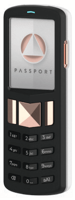

# Chapter 1

# 왜 비트코인이 필요한가

## 돈이 망가졌기 때문에 필요하다

> *`기존 통화의 근본적인 문제는
>작동하게 만드는 데 필요한 모든 신뢰입니다. 중앙 은행은
>통화를 평가절하하지 않도록 신뢰해야 합니다.
>그러나 명목 화폐의 역사는 그 신뢰 위반으로 가득 차 있습니다. 은행은
>우리의 돈을 보관하고 이체하도록 신뢰해야 합니다.
>전산적으로는 신용 거품의 파도를 일으키며 빌려주지만
>거의 준비금이 없습니다. 우리는 그들을 믿어야 합니다
>우리의 프라이버시, 그들이 허락하지 않도록 신뢰하세요
>신원 도용자가 우리 계좌를 비우지 않도록요.`*

~ 사토시 나카모토 2009-02-11

* 명목 화폐 시스템은 망가졌습니다 (항상 그래왔습니다).
* 지속 가능하지 않습니다 (결코 지속 가능하지 않았습니다).
* 고칠 방법이 없습니다 (결코 없을 것입니다).

---
## (아닌) 금본위제
* 많은 사람들이 여전히 돈이 금으로 뒷받침된다고 믿습니다.
* 그렇지 않습니다.
* 1971년 닉슨 대통령이 일방적으로 세계를 금본위제에서 벗어나게 한 이후로 금으로 뒷받침되지 않았습니다 (닉슨 쇼크).
* 이것이 얼마나 큰 피해를 입혔는지 명확하게 보려면 **wtfhappenedin1971.com**을 참조하십시오.

1971년 이후 소비자 물가 지수 인플레이션 (빨간색 선)과 미국 달러 구매력 (검은색 선)을 보여주는 차트.

<small>미국 노동 통계국, 세인트루이스 연방 준비 은행 FRED에서 검색; https://
fred.stlouisfed.org/series/CPIAUCSL, 2024년 6월 9일.</small>

* 재미있는 사실: 세계 경제 포럼은 1971년에 설립되었습니다.
---

>**FIAT:** (명사) /ˈfiː.æt/
>
>: 권위적이거나 자의적인 명령: 법령
>
>: 권위 있는 결정: 지시
>
>**: 더 이상의 노력 없이 또는 마치 노력 없이 무언가를 창조하는 명령 또는 의지의 행위**

~ merriam-webster.com/dictionary

>**FIAT:** 라틴어 fieri «만들어지다, 생겨나다»에서 유래

* 명목 화폐는 정부가 그렇게 한다고 (명령) 말하기 때문에 가치가 있는 돈입니다.
* 따라서 사람들은 (그렇게 한다고) 믿어야 합니다.
>* **명목 화폐에 가치가 있다고 믿지 않더라도 법적으로
재화와 서비스에 대한 지불로 사용하고 받아들여야 합니다.**
* **명목 화폐는 무에서 인쇄/생성됩니다.**
* 요즘 모든 달러의 약 5%가 현금으로 인쇄됩니다.
* 나머지 95%는 은행이 대출을 발행할 때 컴퓨터에 숫자를 입력하여 디지털 방식으로 생성됩니다.

>*조폐국에서 100달러 지폐를 생산하는 데는 몇 센트밖에 들지 않습니다…*

~ 미국 경제학자 배리 아이켄그린

---

>***NBC ’60 Minutes’의 스콧 펠리:*** *시스템에 돈을 쏟아부었다고 말할 수 있나요?*
>
>***연준 의장 제롬 파월:*** *네. 그랬습니다.
>그렇게 생각할 수도 있습니다. 그랬습니다.*
>
>***펠리:*** *어디서 나오나요?
>그냥 인쇄하나요?*
>
>***파월:*** *디지털 방식으로 인쇄합니다. 따라서 중앙 은행으로서 우리는
>디지털 방식으로 돈을 창조할 수 있습니다. 그리고 우리는 그렇게 합니다.
>재무부 어음이나 다른 정부 보증 증권을 구매합니다. 그러면 실제로 증가합니다.
>통화 공급. 우리는 또한 실제 통화를 인쇄하고 우리는
>연방 준비 은행을 통해 배포합니다.*

~ CNBC ’60 Minutes’ 인터뷰, 2020년 5월 17일
C*vid-19 봉쇄 시작 후 두 달

>우리가 가진 이러한 대출 프로그램으로 할 수 있는 일에는 정말 제한이 없습니다.

~ 연준 의장 제롬 파월
2020년 3월 18일 CBS 뉴스에서

>네, 연방 준비 제도에는 무한한 현금이 있습니다. 우리는
은행 시스템에 충분한 현금이 있는지 확인하기 위해 필요한 모든 것을 할 것입니다.

~ 닐 카시카리, 미니애폴리스 연준 총재
2020년 3월 23일, CBS '60 Minutes'

>'여기서 '우리'는 연방 준비 제도 내에서 통화 정책 변경에 투표하는 5명입니다.
FOMC 회의 중. 3억 3천만 명 중 5명.
미국 통화 정책을 변경하는 데 필요한 전부입니다.

~ @MartyBent, TFTC.io 설립자
포브스 기사, 2020년 3월 18일

---

## 옛날 말의 입에서

>*은행은 무에서 창조하는 모든 돈에 대해 이자를 받습니다.*

*~ 윌리엄 패터슨, 1694
영국 은행 설립자*

>*미국의 모든 당혹감, 혼란 및 고통은
헌법 또는 연방의 결함에서 비롯된 것이 아닙니다.
명예나 미덕의 부족에서 비롯된 것이 아니라
화폐, 신용 및 유통의 본질에 대한 완전한 무지에서 비롯됩니다.*

*~ 존 애덤스
미국 제2대 대통령, 1797-1801*

>*나는 은행 기관이 우리 자유에 대한 더 큰 위협이라고 믿습니다.
상비군보다 위험합니다. 이미 그들은 돈 귀족을 일으켰습니다.
정부를 무시했습니다.
발행 권한은 은행에서 가져와야 합니다.
마땅히 속한 국민에게 되돌려줘야 합니다.*

*~ 토마스 제퍼슨
미국 제3대 대통령, 1801-1809*

>*우리의 고귀한 업적을 자랑하면서 추악한 것을 숨기기 위해 조심했습니다.
불의한 통화 시스템에 의해 우리는 국유화되었습니다.
더 세련되었지만 잔인함이 덜하지 않은 억압 시스템은
구식 노예 제도보다 덜합니다.*

~ 호레이스 그릴리
미국 하원 의원 1848-49
뉴욕 트리뷴 설립자

---

>*어느 나라에서든 돈의 양을 통제하는 사람은
모든 산업과 상업의 절대적인 주인입니다…
전체 시스템이 매우 쉽게 제어된다는 것을 깨달으면, 하나
어떤 식으로든 소수의 강력한 사람들이 통제합니다.
인플레이션과 경기 침체 기간이 어떻게 발생하는지 들을 필요가 없습니다.*

~ 제임스 A. 가필드
미국 제20대 대통령, 1881년 3월~9월
1881년 암살

>*오늘날 소수의 사람들 손에 통제되지 않는 것이 있습니다.
무에서 달러를 만들 수 있는 힘.*

~ 토마스 W. 로슨, 작가 '미쳐버린 금융', 1905

>*나는 다른 공모자만큼 은밀했고, 사실상 은밀했습니다.
우리는 발견이 절대 일어나서는 안 된다는 것을 알았습니다. 그렇지 않으면 우리의 모든 시간과
노력이 낭비될 것입니다. 만약 그것이 우리의
특정 그룹이 모여 은행 법안을 작성했다면, 그것은
그 법안은 의회를 통과할 기회가 없을 것입니다.*

~ 프랭크 A. 반델립
뉴욕 내셔널 시티 은행 총재
(시티 은행의 전신)
~ 1910년 지킬 아일랜드에서 열린 비밀 회의에 대해 1935년에 작성
1913년에 연방 준비 제도 법으로 통과된 법안 초안 작성

>*이 (연방 준비 제도) 법은 지구상에서 가장 거대한 신탁을 설립합니다.
지구. 대통령 (우드로 윌슨)이 법안에 서명하면
통화력의 보이지 않는 정부가 합법화됩니다…
세기의 최악의 입법 범죄가 발생합니다.
이 은행 및 통화 법안에 의해.*

~ 찰스 A. 린드버그, 시니어
미국 하원 의원 1907-1917

---

>*나는 가장 불행한 사람입니다. 나는 무심코 우리나라를 망쳤습니다.
위대한 산업 국가는 신용 시스템에 의해 통제됩니다.
우리 신용 시스템은 집중되어 있습니다. 국가의 성장,
따라서 우리의 모든 활동은 소수의 사람들의 손에 달려 있습니다.
우리는 최악의 통치를 받고, 가장 많이 통제되고 지배되는 정부 중 하나가 되었습니다.
문명화된 세계. 더 이상 자유로운 의견에 의한 정부가 아니고, 더 이상 확신과 다수결에 의한 정부가 아니라
소수의 지배적인 사람들의 의견과 강압에 의한 정부.*

~ 우드로 윌슨
미국 제28대 대통령, 1913-1921
1913년 연방 준비 제도 법 통과 6년 후.

>*실제 문제는 당신과 내가 알다시피
대규모 센터의 금융 요소
앤드루 잭슨 시대부터 미국 정부를 소유했습니다.*

~ 프랭클린 D. 루스벨트
1933년 11월 21일 Colonel E. Mandell House에게 보낸 편지에서 미국 제32대 대통령

>*그것 [공황]은 우연이 아니었습니다.
그것은 신중하게 고안된 사건이었습니다….
국제 은행가들은
절망적인 상황을 조성하여 그들이
우리 모두의 통치자로 등장합니다.*

~ 루이스 T. 맥패든 하원 의원,
1936년 암살

>하원 은행 및 통화 위원회 위원장
*은행이 대출을 할 때마다,
새로운 은행 신용이 창출됩니다 - 새로운 예금 - 완전히 새로운 돈.*

~ 그레이엄 F. 타워스
캐나다 중앙 은행 총재, 1934-55

---

>*우리 통화 시스템에 부채가 없다면,
돈은 없을 것입니다*

*~ 매리너 에클스,
1941년, 연준 총재*

>*나는 논리와 이성을 사용하여 연방 정부를 정당화할 수 있는 사람을 아직 본 적이 없습니다.
자신의 돈을 빌려 사용하는 것…
사람들이 요구할 때가 올 것이라고 믿습니다.
이것이 바뀌어야 합니다.
나는 이 나라에 사람들이 실제로 당신과 나를 비난할 때가 올 것이라고 믿습니다.
의회와 관련된 다른 모든 사람들이
가만히 앉아 있도록 허용합니다.
이런 바보 같은 시스템이 계속되도록요.*

~ 라이트 패트먼
미국 하원 의원 1928-1976
은행 및 통화 위원회 위원장 1963-1975

>*당신이나 제가 수표를 쓰면 수표를 지불할 충분한 자금이 우리에 있어야 합니다.
계정으로 수표를 처리해야 하지만 연방 준비 은행이
수표가 인출되는 은행 예금이 없습니다. 언제
연방 준비 은행이 수표를 발행하면 돈을 창출하는 것입니다.*

~ 보스턴 연방 준비 은행
'간단하게 말하면', 1984

---

## 연방 준비 제도

* 연준은 미국의 '독립적인' 중앙 은행입니다.
미국. 1913년 연방 준비 제도 법 통과와 함께 만들어졌습니다.
* 부분적으로 민간 및 부분적으로 정부인 고유한 구조를 가지고 있습니다.
* 정치적으로 독립적인 것으로 여겨집니다.
정부 내 비당파적 기관.
* 연준 이사회는 대통령이 임명하고 의회가 확인하지만, **연준의 결정은 누구에 의해서도 비준될 필요가 없습니다.**

**다음으로 구성됩니다:**

* 연방 준비 제도 이사회
* 12개의 연방 준비 은행
* 연방 공개 시장 위원회 (FOMC),
통화 정책 결정 기관입니다.

**연준은 다음을 담당합니다:**

* 미국 통화 정책 감독, 고용 및 안정적인 가격 촉진.
* 은행 및 금융 기관 규제 및 감독.
* 금융 기관에 대한 지불 서비스 제공.
* 소비자 보호 및 지역 사회 개발 촉진.

---

## 연준 의장 관련 참고 사항

* **연방 준비 제도 의장은 다음과 같습니다:**

* 미국 방향을 결정하는 연방 공개 시장 위원회 (FOMC) 의장
통화 정책 (예: 양적 완화, 금리 인상)
* 국제 통화 기금 (IMF) 회원
* 국제 결제 은행 (BIS, 중앙 은행 은행) 회원.
* G-7 미국 재무 장관
* G-20 미국 재무 장관

* 한 사람에게 **엄청난** 권력.

---

## 부분 준비금 은행 제도, 이자 및 대출

* **부분 준비금 은행 제도:** 2020년 3월까지 은행은 10%의 준비금을 보유해야 했고 90%를 대출할 수 있었습니다.
* **2020년 3월 이후 준비금 요건이 없어 은행은 무제한 대출을 발행할 수 있습니다.**

* 대출은 부채 기반 돈이며 대출에 대한 이자를 지불해야 합니다.

>* **재미있는 사실 1:** 대출 이자를 지불하기 위한 돈은 은행에서 창출되지 않습니다.
>* **재미있는 사실 2:** 결코 창출되지 않습니다.
>* **재미있는 사실 3:** 모든 대출 + 해당 대출에 대한 이자를 모두 갚을 만큼 충분한 돈이 세상에 없습니다.
>* **재미있는 사실 4:** 결코 없을 것입니다!

---

## 석유 달러 관련 참고 사항
* **1971년까지 달러는 금으로 뒷받침되었고 1974년부터는 석유로 뒷받침되었으며 따라서 기본적으로 미군으로 뒷받침되었다고 말할 수 있습니다.**
* **1974년 미국과 사우디아라비아는 석유 판매 가격을 미국 달러로 책정하는 양자 간 협정을 체결했습니다.**
* 그 이후 대부분의 글로벌 석유 판매는 미국 달러로 결제되었습니다.
* 이것은 달러가 세계에서 가장 강력한 통화가 되는 데 크게 기여했습니다.
* **따라서 일반적으로 어려움을 겪었을 시기에도 인위적으로 지지되었습니다.**
* 2022년 말 이후 많은 국가가 미국 달러 이외의 통화로 거래하기 시작했습니다.
* 이것이 석유 달러의 종말의 시작일 가능성이 큽니다. 다음에 무슨 일이 일어날지는 두고 볼 일입니다…

---

## 양적 완화 (QUANTITATIVE EASING)에 대해
* **양적 완화는 중앙 은행이 '경제를 활성화'하기 위해 사용하는 '비전통적인 통화 정책'으로 간주되며, 연준이 정부 채권 및 기타 정부 증권을 구매합니다.**
* 2001-2006년 사이에 일본에서 처음 사용되었습니다. 그 후 미국, 영국 및 유로존은 2008년 금융 위기 동안 양적 완화를 사용했습니다.
* 그 이후 미국에 양적 완화 프로그램이 없었던 유일한 시기는 2014-2019년 사이였습니다.
* 아래에서 볼 수 있듯이 비평가들은 **양적 완화가 이미 부유한 사람들에게 압도적으로 이익이 된다고 주장합니다.**

*출처: 트위터의 @RudyHavenstein*

---

## 주기

* **자연에는 모든 주기, 자연스러운 썰물과 밀물, 확장과 수축이 있습니다.**

* 이것은 **지구상의 모든 생명체의 전체적으로 상호 연결된 시스템의 전반적인 시간 경과에 따른 균형과 지속 가능성에 기여합니다.**
* **부채 기반 명목 화폐 시스템은 자연 주기의 지혜를 무시하고 대신 부채를 계속 서비스하기 위해 비할 데 없는 완화되지 않은 성장에 기반하고 있으며 100% 의존합니다.**
* 자연에서는 이것이 암입니다.
* '경제'에서 이러한 부자연스러운 궤적은 실패한 은행과 대기업이 무너지도록 하고 새로운 것, 더 건강한 것으로 재활용되도록 하는 대신 정부의 구제 금융으로 더욱 뒷받침됩니다.
* **실패한 기업을 구제하는 근시안적인 행위는 전체 경제를 위험에 빠뜨리고 있습니다.** 본질적으로 깡통을 차는 것일 뿐이며, 앞으로 다가올 불가피한 혼란은 자연 주기가 작동하도록 허용된 경우보다 훨씬 더 강렬할 것입니다.
* **우리는 우리를 새로운 해안으로 데려갈 구명정을 제공할 수 있는 비전, 선견지명, 결단력 및 기술을 가진 사토시 나카모토와 그 이전과 이후의 사이퍼펑크에게 빚을 지고 있습니다.**

---

* 일단 이것이 선물이라는 것을 깨달으면, 완전한 마음과 맑은 정신으로 여행을 떠나 평화의 돈으로 새로운 세상을 건설하는 것은 우리에게 달려 있습니다.
>* **비트코인은 돈을 고치고 나머지를 고치는 것은 우리에게 달려 있습니다.
그리고 분명히 하기 위해 돈이 고정되면 많은 다른 것들이 기본적으로 고정될 것입니다.**

* 주된 것은 대규모의 정부 주도의 운동 전쟁이 더 이상 수익성이 없거나 국민의 지원 없이는 불가능할 것이라는 것입니다.
* 또한 소비가 자연스럽게 줄어들고 실제 가치 상품 및 서비스, 자유 시장, 실제 저축 및 주택 및 부동산의 비화폐화로 전환될 것입니다.
* **참조:** 비트코인은 이것을 수정합니다, 32페이지
---

## 인플레이션이 도둑질이기 때문에 필요하다

1913년 연방 준비 제도 설립 이후 달러의 구매력 하락을 보여주는 2024년 FRED 차트. 1913년 이후 누적 인플레이션율은 약 3.067%입니다. 전 세계 모든 중앙 은행 명목 화폐는 유사한 하락률을 보이고 있습니다.

* **무에서 돈이 많이 창출될수록 모든 돈은 가치/구매력을 잃습니다.**
* 이것을 **인플레이션**이라고 합니다.
* 인플레이션은 문자 그대로 **시간 도둑**입니다. 인플레이션되고, 평가절하되고, 조작되는 통화로 저축하면 시간의 가치가 도난당합니다.
* 인플레이션은 또한 **숨겨진 세금**입니다.

---

* 이 시간 도둑과 세금은 다른 모든 국가의 명목 화폐에도 영향을 미쳤습니다. 1944년 브레턴 우즈 협정 이후 미국 달러가 세계 기축 통화가 되었기 때문에 미국 달러에 고정되어 있기 때문입니다.
* **미국에서는 연간 2%의 인플레이션율이 연방 준비 제도 위임에 기록되어 있습니다.**
* 이것은 매년 동일한 20달러 지폐로 **2% 적게** 구매할 수 있도록 보장된다는 의미입니다.
* **2024년 3월 연간 인플레이션율은 3.5%였습니다.**
(2%보다 훨씬 많으므로 2023년 3월과 2024년 3월 사이에 구매력의 3.5%를 잃었습니다.
* 달리 말하면 이것은 평균적으로 가격이 3.5% 상승했다는 의미입니다.
* **1980년대 초까지 그랬던 것처럼 인플레이션이 정확하게 측정되었다면 2024년에는 실제로 10%에 더 가까울 것입니다.**
* 범주별로 보면 인플레이션이 지난 한 해 동안 많은 범주에서 3.5%보다 훨씬 나쁘다는 것을 알 수 있습니다.
* 임대료, 식료품, 휘발유 가격, 거의 모든 것을 보면 모든 부문에서 인플레이션이 만연하다는 것을 알 수 있습니다.

---
**미국의 지난 50년간 평균 인플레이션:**

|  평균 비용   |   1971  |   2021  |   % 증가  |
| --- | --- | --- | --- |
|  급여   |    $9,400 |    $59,400 |    532% |
|   집  |    $23,400 |    $513,000 |    2,092% |
|    갤런당 휘발유 | $0.36    |   $4.17 |  1,058%   |
|    새 차 |  $3,400   |   $47,000  |    1,282% |
|   대학 학위   |  $1,400   |   $26,000  |  1,757%   |
|   식료품 바구니  |$20     |  $210  |    950% |
|  전기/kWh   |  $0.02    |   $0.15  |   650%  |

>**실화:**
~ 1976년에 집을 58,000달러에 샀습니다.
~ '공식' 인플레이션을 고려하면 2022년 달러로 279,000달러가 됩니다.
~ 2022년에 같은 집은 209만 달러로 평가되었습니다.
~ 그것에 대해 생각해 보세요…

>*명목 화폐는 허위 정보입니다.
10달러 지폐는 어떤 정보를 전달합니까?
10은 분모가 없는 분수의 분자입니다.
10은 무엇에서 나옵니까?
10은 알려지고 안정적인 분모 없이는 아무것도 말하지 않습니다.*

~ @bitlany

---

* **인플레이션이 증가함에 따라 저축 (운이 좋으면 저축이 있는 경우)은 가치를 잃습니다.**
* 시간이 지남에 따라 **많은** 가치를 잃습니다.
>*오늘부터 월 100달러를 저축하기 시작했다면, 가장 좋은 금리인 0.05%로:
> * 30년 후에는 **$84,019**를 저축했을 것입니다.
>* 연준이 지정한 2% 인플레이션으로 조정하면
>* 30년 후 저축액은 **$46,384**의 구매력을 갖게 됩니다.
>* 오늘날의 3.5% 인플레이션으로 조정하면:
>* $84,019 상당의 저축액은 30년 후 **$11,037**의 구매력을 갖게 됩니다!

* **사실상 이것은 노동 시간의 약 6/7이 도난당했다는 의미입니다 = *시간 도둑질.***

---
**다른 관점에서 보면 다음과 같습니다:**
* **1971년** 주택 비용 = 평균 연봉의 **2.5**배.
* **2024년** 주택 비용 = 평균 연봉의 **8.6**배.
* **1971년** 새 차는 평균 급여의 약 **1/3**이었습니다.
* **2024년** 새 차는 평균 급여의 **3/4** 이상입니다.

인플레이션이
당신에게 도움이
되지 않는다는 것이 분명해졌기를 바랍니다.

**참고:** 이 모든 숫자는 평균이며 많은 요인에 따라 변동됩니다. 요점은 인플레이션이 숨겨진 세금이며 우리의 실제 노동과 생산에 대한 시간 도둑질이라는 것입니다.

>* **현금은 이것을 수정합니다.**
>* **비트코인은 현금입니다.**
---

## 중앙에서 통제되고 조작되고 부채 기반 경제를 대체해야 합니다.

>*정부가 직접 빼앗기 전에는 다시 좋은 돈을 갖게 될 것이라고 믿지 않습니다.
즉, 우리는 정부에서 폭력적으로 빼앗을 수 없습니다. 우리가 할 수 있는 일은 은밀하고 우회적인 방법으로
그들이 멈출 수 없는 것을 도입하는 것입니다.*

~ 프리드리히 하이에크, 1984년
오스트리아 경제학자, 철학자 및 작가, 1899-1992

2020년 3월 4조 달러에서 2024년 6월 18조 달러 이상으로 증가한 지수 M1 통화 공급 증가를 보여주는 그래프.

* **여기서 당신의 마음을 날려 버리세요:** https://usdebtclock.org/
---
* **존재하는 모든 미국 달러의 45%가 2020년 4월에서 2022년 1월 사이에 인쇄되었습니다!**
* 기억하세요, 무에서 인쇄되었다는 것입니다.
* 명목 화폐는 국가에 의해 중앙에서 통제되며 공급은 쉽게 조작됩니다.
* **미국 국가 부채가 1조 달러에 도달하는 데 205년이 걸렸습니다. (1776 > 1981)**
* 미국 국가 부채가 **34조 달러에 도달하는 데 33년 더** 걸렸습니다! (1981 > 2024)

미국에서 1970-2024년 총 공공 부채를 보여주는 FRED 그래프.

>*국제 금융 연구소가 측정한 글로벌 부채는 현재 총 303조 달러입니다.
이것이 부채 기반 명목 화폐에 있는 우리 행성입니다.
그런데 전 세계 GDP는 84조 달러에 불과합니다.*

*~ 니크 바티아, '계층화된 돈' 저자, 2021*

---

* **참조용**

| **만약 당신이:** | **초당 $1를 쓸 수 있습니다** |                |
| ------------ | ----------------------- | -------------- |
| **$1백만**   | 또는 11일              | = 11일    |
| **$10억**   | 11,680일 동안         | = 32년   |
| **$1조**  | 11,680,000일 동안     | = 32000년 |

* 우리는 모두 언제 더 인쇄할지, 어떤 이자율을 부과할지 결정할 권한이 있는 사람들의 자비에 달려 있습니다.
* **연준이 금리를 인상하면 갑자기 집이나 차를 빌리는 것이 더 비싸지고 이는 지출을 둔화시켜 스태그플레이션으로 이어집니다.**

* **만약 그들이 금리를 인위적으로 낮게 유지하면 우리는 공황기에 접어듭니다.**

>* **중앙 은행이 금융 '날씨'를 만들도록 허용하면 시장이 무엇이 가치가 있고 무엇이 가치가 없는지 결정할 자유가 없어집니다.**

* 또한 **은행과 기업을 구제하면 인위적으로 경제를 부양합니다.** 카드 집이 무너지는 것은 시간 문제입니다.
* 중앙 은행을 갖는 것에 대한 원래 주장은 경제가 흔들릴 때 최후의 대부자가 있어야 한다는 것이었습니다.

---
* **이것은 중앙 은행이 비교할 수 없는 선출되지 않은 궁극적으로 권위주의적인 힘을 가진 최초의 리조트 통치자가 되는 것으로 바뀌었습니다.**

> *비트코인을 제외한 모든 돈은 정치적입니다.
명목 화폐, 은행 상품, 핀테크 신용,
다른 암호화폐, 심지어 금까지 정부, 기업 또는 소규모 그룹에 의해 통제됩니다.
미래로 향하면서 예외가 있다는 것이 매우 유용할 것입니다.*

*~ 알렉스 글래드스타인 @gladstein
인권 재단 최고 전략 책임자*

>*비트코인은 80억 명의 사람들을 연결하고, 수억 개의 회사를 연결하고, 정치 관할 구역 전체에서 세계를 동기화하고, 전체 금융 시스템에 합리성을 되돌리고, 전체 인류에게 자유와 재산권을 되돌려줍니다.*

*~ 마이클 세일러
마이크로스트래티지 CEO*

---

## 은행을 이용하지 못하는 사람들을 은행에 연결해야 합니다.

>*통화가 약화되는 20개국의 9억 5천 3백만 명에게 비트코인은 국고 자산보다 더 큰 의미를 갖습니다. 그들에게 그것은 홍수를 피하기 위한 암호화된 에너지 방주와 같습니다.*

*~ 마이클 세일러
마이크로스트래티지 CEO*

* **2024년 현재 전 세계 성인의 약 25%가 은행을 이용하지 못하고 있습니다. 약 14억 명입니다!**

>* **즉, 은행 서비스에 액세스할 수 없고 ATM, 직불 카드, 신용 카드 또는 수표를 사용할 수 없습니다.**
>* **또한 사업을 시작하거나, 차나 집을 사는 등의 대출을 받을 수 없습니다.**

* **돈을 보내고 받는 것 또는 수표를 현금으로 바꾸는 것은 비쌉니다.**

* 높은 요금을 부과하고 처리하는 데 시간이 걸리는 Western Union과 같은 송금 및 수표 현금 서비스에 의존해야 합니다.

* 다른 나라의 가족에게 돈을 보내는 사람들에게는 **특히 비싸고**(송금), 은행을 통해 최대 10% 또는 12%의 비용이 들 수 있습니다.

---
* 그들이 가족 구성원이 보낸 돈을 받으려면 운송 비용을 지불하고 종종 그들이 사는 곳에서 멀리 떨어진 송금 사무실에 가야 하기 때문에 **송금을 받는 사람들에게는 비싸고 시간이 오래 걸립니다.**

* 종종 그들이 이러한 사무실로 이동하는 것이 안전하지 않습니다.
* 비트코인은 라이트닝 네트워크를 통해 이러한 문제에 대한 즉각적인 솔루션을 제공합니다!

***#bitcoin이 문제를 해결합니다***
>*사람들에게 권한을 부여하는 기술이 언제 중단되었습니까?*

*~ 제프 부스
저자: 내일의 가격*

---

## 사람들이 폭정과 통화 붕괴에서 벗어나도록 도와야 합니다.

* 우리가 본 바와 같이 지난 몇 년 동안 정부는 동의하지 않는 사람들의 은행 계좌를 동결할 수 있고 동결합니다.

>* **이것은 본질적으로 은행의 돈은 언제든지 도난당할 수 있는 IOU에 불과하다는 것을 보여줍니다.**

* 또한 현재 베네수엘라 (283%), 수단 (63%), 레바논 (212%), 시리아 (79%), 아르헨티나 (161%), 짐바브웨 (47%), 터키 (64%) 등에서 볼 수 있듯이 인플레이션이 만연하면 사람들의 평생 저축은 때로는 하룻밤 사이에 사라지고 이에 대해 할 수 있는 일이 없습니다.
* 위에서 언급한 사항 중 하나라도 겪고 있는 사람들에게 **비트코인은 다른 방법으로는 유지할 수 없는 문제에 대한 실제적이고 즉각적인 해결책이 됩니다.**
* **폭정과 인플레이션이 모두 많은 곳에서 증가하고 있다는 점을 고려하면 비트코인을 지금 획득하여 이들을 헤지하는 것이 현명할 것입니다.**
---
## CBDC를 피해야 합니다.
* **중앙 은행이 CBDC, 중앙 은행 디지털 통화를 만들기 시작하고 있다는 것을 들었을 것입니다.**
2020년 5월에 35개국이 이 옵션을 모색하고 있었습니다.
* 2022년 3월에 87개국이 CBDC 파일럿을 적극적으로 검토하거나 이미 출시했습니다.
* 2024년 6월 이 글을 쓰는 시점에서 전 세계 GDP의 98%를 차지하는 134개국이 연구, 개발, 파일럿 또는 출시 단계에 있습니다.
www.atlanticcouncil.org/cbdctracker/

>**CBDC는 온라인 은행 계좌에서 볼 수 있는 전자 화폐와 매우 유사하지만 기본적으로 디지털이기 때문에 프로그래밍 가능하고 100% 제어 가능합니다.**

>*CBDC의 핵심 차이점은 중앙 은행이 **절대적인 통제권을 갖게 된다는 것입니다**.*

~ 아구스틴 카르스텐스
BIS 사무총장 - 국제 결제 은행 (모든 은행의 은행)

* **이는 정부가 돈에 만료 날짜를 프로그래밍하여 만료되기 전에 돈을 쓰도록 강제할 수 있음을 의미합니다.**

---

* **특정 상점, 웹사이트 또는 관할 구역에서만 사용할 수 있고 다른 곳에서는 사용할 수 없도록 다른 항목을 프로그래밍할 수도 있습니다.**
* **그들은 그것을 당신의 신용 점수, 건강 패스, 디지털 ID 및 기타 사회적 점수에 연결할 수 있습니다.**

* **특정 영역의 특정 점수, '전체 점수' 또는 '경제'에 필요한 사항을 기준으로 적합하다고 판단되는 모든 제한 사항을 프로그래밍할 수 있습니다.**
* 또한 돈으로 하는 모든 일을 감시할 수 있습니다.

>*오늘날 누가 100달러 지폐를 사용하는지 모르고 오늘날 누가 1,000페소 지폐를 사용하는지 모릅니다. CBDC의 핵심 차이점은 **중앙 은행이 규칙과 규정을 절대적으로 통제할 수 있다는 것입니다.**
**중앙 은행 책임의 표현** 사용을 결정하고 **이를 시행할 기술을 갖게 될 것입니다.**

~ 아구스틴 카르스텐스
GM, BIS - 국제 결제 은행

>* **참고:** **“중앙 은행 책임의 표현”**이라는 말은 돈으로 저장된 당신의 가치, 당신의 생명력이 실제로 중앙 은행에 '소유'되어 있다는 것을 의미합니다.
---

## 정원을 구해야 합니다.

* **비트코인은 우리가 직면한 가장 큰 문제인 명목 화폐 거짓말을 뿌리에서 뽑아냅니다.**

* 이것은 부패한 명목 화폐, 고리대금 및 돈 인쇄기에

# Chapter 2

# 금융 포용성 개선
* **비트코인을 사용하면 누구나 *동일한* 금융 시스템에 접근할 수 있으며, *모든 사람에게 동일한* 규칙이 적용됩니다.**
* 누구에게도 허점이나 뒷문, 특별 거래가 없습니다.
* 모든 사람은 동일한 규칙으로 생성되고 유지 관리되는 동일한 실제 화폐로 자신이 제공하는 가치에 대해 보상받을 가능성이 있습니다.
* **비트코인은 인터넷 연결이 가능한 곳이라면 어디든 누구에게나 접근 가능합니다.**

## 세상에 가치 더하기
* **비트코인은 사람들이 커뮤니티와 시장에 실제 가치를 더하도록 장려합니다.** 이것이 돈을 더 벌 수 있는 유일한 방법이기 때문입니다.
* 더 적은 것에 만족한다면, 공정한 임금을 받고 일함으로써 여전히 혜택을 누릴 수 있으며, **저축할 때 그 저축은 시간이 지나도 가치를 유지합니다.**

---
## 환경 개선
* 엄격하게 제한된 공급량을 가진 건전한 화폐는 오늘날 우리가 보고 있는 부채 기반의 무제한 화폐 발행으로 만들어지는 것과는 매우 다른 역동성을 만듭니다.
* 궁극적으로 갚을 수 없는 대출과 부채에 대한 복리 이자율을 지불하기 위해 바닥을 향해 질주하며 끊임없이 더 많이 소비하려는 멈출 수 없는 추진력 대신, **비트코인은 낮은 시간 선호도가 추구되는 세상으로 가는 출구를 제공합니다.**
>* 만연한 환경 파괴는 **더 적은 소비, 더 적은 낭비, 생산에 대한 신중한 접근 방식으로 대체됩니다.** 여기서 시장은 진정한 가치를 지닌 것을 결정하고, 따라서 오래 지속되도록 만들어집니다.
* 이것은 사람, 식물, 동물에게 순수한 이익입니다!
---
## 전쟁 해결
* 법정 통화 시스템의 무제한 발행은 '영원한 전쟁'을 가능하게 하고 수익성 있게 만듭니다.
* 사람들은 전쟁 지출이 어떻게 이루어지는지, 전쟁 자금이 어디서 나오는지에 대해 거의 모르기 때문에 정부에 대한 책임이 거의 없습니다. 전쟁은 실제 감독 없이 외딴 곳에서 몇 년 동안 질질 끌 수 있습니다.
* 베트남 전쟁부터 전쟁은 '신용 카드 전쟁'(@AlexGladstein 님께 감사드립니다)이 되었습니다. 정부는 전쟁 자금을 조달하기 위해 돈을 빌리고 초기 대출에 대한 이자를 지불하기 위해 더 많은 돈을 빌리기 때문입니다... 반복합니다.
>* **비트코인 표준에서는 국가 국민이 전쟁 비용을 기꺼이 지불해야 합니다. 그들은 가족과 국가를 방어하기 위해 절대적으로 명확하게 필요한 경우에만 그렇게 할 것이며, 목표는 현장에 있습니다.**
* 부당한 이익을 얻을 수 없기 때문에 정부 관리와 기업은 전쟁을 실행 가능한 옵션으로 홍보하거나 참여할 동기가 없습니다.
* **평화롭고 저렴한 해결책을 찾기 위한 노력이 크게 증가할 것입니다.**
---
## 시간 선호도 해결

**높은 시간 선호도:** 즉각적인 만족, 조급함, 단기 계획
**낮은 시간 선호도:** 지연된 만족, 인내심, 장기 계획

* 높은 시간 선호도는 개인, 사회 및 환경 파괴로 이어집니다. 우리 돈이 매일 가치를 잃으면 가능한 한 빨리 써야 하기 때문에 조급해지도록 '강요'됩니다.
* 우리의 시간이 끊임없이 팽창하는 법정 통화에 의해 가치가 절하되면 우리는 시간의 가치와의 연결을 잃게 됩니다.
* 이것은 단절과 스트레스의 기저로 이어집니다.
* 스트레스를 완화하고 의미를 찾으려는 시도는 왜곡되어 마약, 알코올, 쇼핑, 포르노, 패스트푸드, 짧은 집중 시간, 화면/소셜 미디어 중독, 충동적인 결정 등과 같은 주의 산만이 됩니다.
* **반면에 시간이 지나도 가치를 유지하고 업무를 통해 우리의 기여도를 적절하게 측정하는 건전한 돈은 낮은 시간 선호도, 사려 깊은 삶의 질, 의미 있는 관계, 더 적은 소비, 더 깊은 연결, 더 심오한 대화, 장기적인 목표 및 증가된 창의성으로 이어집니다.**
---

# Chapter 3

# 비트코인은 무엇인가?

>*“일반 대중을 위해 이 녀석에 대한 설명을 쓰는 건 정말 어렵다.
연관 지을 만한 것이 아무것도 없다.”*

~ 사토시 나카모토 2010-07-05

>*총 발행량은 21,000,000 코인이 될 것입니다. 네트워크
노드(채굴자)가 블록을 만들 때 배포되며,
4년마다 그 양이 절반으로 줄어듭니다.
처음 4년: 10,500,000 코인
다음 4년: 5,250,000 코인
다음 4년: 2,625,000 코인
다음 4년: 1,312,500 코인 등...
그것이 다 떨어지면, 시스템은 필요한 경우
거래 수수료를 지원할 수 있습니다.
개방 시장 경쟁에 기반하며,
아마도 항상 기꺼이
거래를 무료로 처리하려는 노드가 있을 것입니다.*

~ 사토시 나카모토 2009-01-09

* **비트코인은 자유 화폐입니다...** 중앙 은행 시스템의
지나친 조작과 통제로부터 우리 모두를 해방시킬
잠재력이 있다는 점에서 그렇습니다.
* **비트코인에서 화폐 규칙은
모든 사람, 모든 곳에서 동일합니다.**
* 비트코인은 인터넷 연결이 있는 사람이면 누구나
네트워크에 참여할 수 있고, **동일한 규칙을 따라야
한다는 점에서 포용적입니다.**

---
## 비트코인은 다음과 같습니다:
* **탈중앙화**         
* **진정으로 희소함**          
* **검열 저항성** 
* **분산 원장**
* **부패 불가능**
* 허가 불필요
* 감사 가능
* 투명함
* 불변성
* 국경 없음
* 위조하기 어려움
* 익명성
* 마찰 없음
* 신뢰 불필요
* P2P
---
* 비트코인은 탈중앙화되어 있습니다.
* **서로 알지 못하는 수천 명의 사람들이 전 세계 수천 개의 노드에서 실행합니다.**
* 어떤 사람, 정부 또는 회사도 그것을 통제할 수 없습니다.
* 당신도 노드를 실행할 수 있습니다. 쉽습니다 ;)
* 자신의 노드를 실행함으로써 개인 정보를 늘리고 자신의 거래를 확인할 때 네트워크를 보호하는 데 도움이 됩니다.
> **믿지 마세요. 확인하세요.**
---
* **비트코인(대문자 'B')**은 화폐 네트워크입니다.
* **비트코인(소문자 'b')**은 비트코인 네트워크에서 발행되고 실행되는 통화 또는 화폐 자산입니다.

---
* **비트코인은 위대한 인센티브 제공자입니다.**
>* **사토시의 천재성은 비트코인에서 처음으로 선악의 행위자 모두가 규칙을 따르도록 장려된다는 데 있습니다.**

> *“인센티브는 노드가 정직하게 유지되도록
장려하는 데 도움이 될 수 있습니다.
탐욕스러운 공격자가 모든 정직한 노드보다
더 많은 CPU 작업 증명을 조립할 수 있다면,
지불금을 훔쳐 사람들을 속이는 데 사용할지,
아니면 새 코인을 생성하는 데 사용할지 선택해야 할 것입니다.
그는 규칙을 따르는 것이 더 유리하다는 것을 알아야 합니다.
그 규칙은 시스템을 훼손하고 자신의 부의
타당성을 훼손하는 것보다
다른 모든 사람을 합친 것보다 더 많은 새 코인으로
그를 선호합니다.”*

~ 사토시 나카모토 2008-10-31

---
* **비트코인은 최초의 디지털 네이티브 화폐입니다.**
온라인 수표 계좌와 달리 중앙 은행 법정 화폐의 디지털 형태일 뿐입니다.
* 비트코인은 **탈중앙화된** 디지털 통화입니다.
* 비트코인에는 **중앙 기관이 없습니다.**
* 비트코인은 **국가가 없습니다.**
* 의미를 생각해 보세요...

>*비트코인은 전 세계 어디에서나 누구에게나 즉시 지불할 수 있는
탈중앙화된 디지털 통화입니다.
비트코인은 중앙 기관 없이 운영하기 위해 P2P 기술을 사용합니다.
거래 관리 및 화폐 발행은 네트워크에서 집단적으로 수행됩니다.*

~ 비트코인 위키
en.bitcoin.it

---
* 비트코인은 마법의 인터넷 화폐입니다.
* 아니, 진지하게, **비트코인은 우리가 세상을 고칠 방법입니다.**
* 진심이냐구요? 네.
---
* **비트코인은 가치를 이전하는 방법입니다.**
 *  어떤 금액이든
 * 안전하게
 * 즉시(라이트닝 네트워크에서)
 * 두 당사자 간에
 * 언제든지
 * 24/7
 * 어디에서나
 * 네, 어디에서나
 * 생각해 보세요.

 ---

>*제3자 중개인을 신뢰할 필요 없이
암호화 증명에 기반한 전자 화폐를 사용하면
돈은 안전하고 거래는 간편해질 수 있습니다.*

~ 사토시 나카모토 2009-02-11

---
>*비트코인은 (거의) 확실하게 이동하는 데 비용이 들지 않습니다.
나는 내가 무엇을 받고 있는지 100% 확신합니다.*

~ 마이클 세일러, Microstrategy CEO

* 비트코인 네트워크 또는 비트코인 위에 구축된 라이트닝 네트워크를 통해 언제든지 어디서나 누구에게나 $1.13, 46c, 359 사토시, 5억 사토시 또는 100만 달러를 보낼 수 있습니다.
* **그리고 아무도 당신을 막을 수 없습니다.**
* 금, 은, USD/GBP/EUR/YEN/CYK/ZAR 또는 기타 중앙 은행 법정 화폐로 그렇게 할 수 있습니까?

---
* **비트코인은 역사적입니다.**
진정으로 탈중앙화되고 검열에 저항하며 불변하고 국경이 없고 허가 없이 사용할 수 있으며 절대적인 상한선(2,100만 코인)이 있는 부패 불가능한 통화 시스템이 만들어진 것은 역사상 처음입니다.
>* 비트코인은 **권력을 분산하고 금융 포용을 확대하는 데 있어
인쇄기의 발명과 이후 월드 와이드 웹이
정보에 대한 통제를 분산하고 접근성을 높인 것만큼이나 중요합니다.**

>*많은 사람들이 1990년대 이후 실패한
모든 회사 때문에 전자 화폐를 자동으로
실패한 것으로 간주합니다.
그 시스템을 망친 것은 단지
중앙 통제적인 성격 때문이라는 것이 분명하기를 바랍니다.
탈중앙화되고 신뢰에 기반하지 않은 시스템을
시도하는 것은 이번이 처음이라고 생각합니다.*

~ 사토시 나카모토 2009-02-15
---
* **비트코인은 분산되고 탈중앙화되고 투명하며 불변하는 계정 원장입니다.**
* 세상의 누구든 언제든 누가 무엇을 소유하고 있는지 볼 수 있으며 변경할 수 없습니다.
* '누구'가 이름이 아니라 **숫자와 문자로 구성된 주소입니다.**
>* 비트코인 주소의 예:
**bc1qar0srrr7xfkvy5l643lydnw9re59gtzzwf5mdq**

* 따라서 비트코인은 **익명**입니다.
---
* **비트코인은**
* 자산의 공정한 발행자
* 가치 저장소
* 교환 매개체
* 곧 회계 단위가 될 것입니다.
*  **뿐만 아니라**
* **교환 수단**입니다.

* 발행자, 금, 현금, 직불 카드 및 페이팔, 은행, 벤모, 캐시앱, 웨스턴 유니온입니다.

**모두 하나로 통합되었습니다!**

---
* **비트코인은 은행가, 부기, 회계사 대신 수학과 컴퓨터 과학을 사용하는 기록 보관소입니다.**
* 중개인, 은행, 정부, 초과 인출 수수료, 수표 계좌 수수료, 제한된 서비스 시간, 검열 가능성, 계좌 동결, 통화 공급 조작, 이자율, IMF, WEF, BIS, 벽돌 건물, ATM, 수표, 차지백, 페트로 달러, 유로 달러, 은행 시뇨리지, 캔틸론 효과, 부분 지급 준비금 은행, 비자, 마스터카드, 아멕스, 웨스턴 유니온, 전신 송금이 완료될 때까지 기다리는 날짜를 없애줍니다.

>* **당신과 악수하고 싶은 사람 사이에 누가 있는 대신,
>직접 악수할 수 있습니다.**
>* **자신의 돈을 보내기 위해 허락을 구할 필요가 없습니다!**
---

## 간단히 말해서…
* **비트코인은 누구도 빼앗을 수 없는 디지털 자산입니다.**
* >비트코인을 소유한다는 것은 개인 키로 제어하는 특정 주소에서 선택한 다른 주소로 가치를 보낼 권리를 소유한다는 의미입니다.

*비트코인은 폭력 독점과 독립된 재산권입니다.*

~ 로버트 브리드러브 @breedlove22

---

* **비트코인은 종의 역사상 한 번 있는 사건입니다.**
* 비트코인은 선택입니다.
* 비트코인은 **주권을 낳습니다.**
>* **15년 전 비트코인의 발견은 인간의 금융 자유와 주권에 있어
50만 년 전 불의 발견이 인간의 번영에 미친 영향과
900년 전 인쇄기가 인간 지식에 대한 접근성을 분산화하는 데 미친 영향과 같습니다.**

---
* **비트코인은 진정한 가치 저장소입니다.**
* 가장 귀중한 자원인 시간을 저장하여 나중에 다시 액세스할 수 있도록 합니다.
>*비트코인은 미래의 자신에게 에너지를 전달하는 고대역폭 파이프라인과 같습니다.
오늘 일하면 비트코인이 에너지를 동결시켜 나중에 사용할 수 있습니다.*

~ 로버트 브리드러브

>*돈의 근원은 시간이고
시간의 근원은 가치다*

~ 가이 스완

---
* 비트코인은 문자 그대로 타임체인입니다.
* 사토시는 초기 개발자와 주고받은 이메일에서 타임체인을 여러 번 언급했습니다.
* 한 블록은 약 10분마다 채굴되기 때문에 블록 단위로 시간을 측정할 수 있습니다.
>* **우리의 시간은 가장 희소하고 소중한 자원입니다.**
>* **그것은 우리의 문자 그대로의 생명력입니다.**
>* **진정한 돈은 우리가 시간을 저장할 수 있게 해줍니다.**

* 그것은 우리가 '소비한' 시간을 인정할 수 있는 방법입니다.
* 우리는 **시간과 노력을 기록한 것에 불과한 돈으로 시간을 교환합니다.**
* **비트코인은 우리가 더 이상 예전처럼 일할 수 없을 때
나중에 '접근'할 수 있도록 시간을 보존할 수 있게 해줍니다.**
---
* 비트코인은 **가치 저장소**입니다.
* 비트코인은 **교환 매개체**입니다.
* 비트코인은 **언젠가 회계 단위가 될 것입니다.**
* 비트코인은 **언젠가 *회계 단위가 될 것입니다.***
---
* **비트코인은 희소합니다**
* 21,000,000의 상한선이 있습니다.
* 더 이상은 없을 것입니다.
* 여기서는 코드가 법입니다.*

*코드를 변경하는 것이 '기술적으로' 가능하지만
사토시의 천재성은 공급량을 늘리면(팽창시키면)
유통 중인 모든 비트코인의 가치가 감소할 뿐이므로
그것을 막습니다. 따라서 이것은 모든 사람이 암묵적으로
21,000,000의 하드 캡 공급을 유지하는 데 동의하도록 장려합니다.

* @TC의 **timechaincalendar.com**을 확인하여
현재 블록 높이, 사용 가능한 공급량 및
비트코인 타임체인과 관련된 기타 여러 지표를 확인하십시오.
---
* **비트코인은 공급을 저하시키지 않고 무한히 나눌 수 있습니다.**
* **피자 한 판은 조각이 얼마나 작든 피자 한 판입니다.**
* 현재 소수점 여덟 번째 자리까지 나눌 수 있습니다. 1.00000000
* 1 비트코인에는 100,000,000 사토시가 있습니다.
* 1 사토시 = 0.00000001
* 어떤 금액으로든 사토시(사토시)를 살 수 있습니다.
---
* **비트코인은 우리가 아는 가장 단단하고 건전한 돈입니다.**
* 금은 쉽게 나눌 수 없거나 휴대할 수 없고, 속도가 느리고(천천히 움직임) 쉽게 확인할 수 없기 때문에 금보다 더 건전합니다.
* **비트코인은 지금까지 알려진 어떤 자산보다 우수한 화폐적 특성을 가지고 있습니다.**

**건전한 화폐적 특성 비교 차트**

참고: 이것은 일반적인 개요이며 차트에서 다룰 수 없는 미묘한 차이가 있습니다.

---
* **비트코인은 해독제입니다.**
* 구제 금융, 돈 찍어내기, 양적 완화 및 이자율 조작으로 경제를 '안정화'하려고 시도하는 것은 인공 생명 유지 장치를 사용하는 것과 같습니다.
* 이 '기계'는 유지하는 데 점점 더 비싸지고 지속 가능성이 떨어지기 전에 너무 오래 지속될 수 있으며 심각한 고장으로 이어질 수 있습니다.
* **비트코인은 이것을 수정합니다**
* **비트코인은 더 나은 돈입니다**
---
* **비트코인은 반취약적입니다.**
* 그리고 시도된 모든 공격, 모든 정부 금지, 모든 주류 미디어 FUD(공포, 불확실성, 의심)로 인해 더욱 그렇습니다.
>* 비트코인은 해킹당한 적이 없습니다.*
* 많은 사람들이 시도했지만.

*해킹에 대해 들어본 적이 있을 수 있지만 비트코인 프로토콜이 아닌 거래소가 해킹당했습니다.
* **기억하세요:**
* 개인 키가 없으면 코인도 없습니다.
* **항상** 자신의 **개인 지갑으로** 사토시를 인출하십시오.
* **가장 좋은 방법은** P2P로 구매하는 것입니다.
---
* **비트코인은 다음의 조합입니다:**
* 컴퓨터 과학      
* 네트워크 프로토콜
* 전기 시스템
* 게임 이론
* 확신
* 미메틱스
* 열역학
* 네트워크 효과
* 암호화
* 에너지
* 진정한 희소성
* 경제적 인센티브
* 소프트웨어 엔지니어링
* 돈의 시간 가치
* 기술 채택 곡선
* 창발적 현상
* 분산화의 힘
* 낮은 시간 선호
* 인센티브 조정
* 화폐적 중립성
* 금융 운동주의
* 불변성

... 모두 함께 작동하여
신뢰가 필요 없는 탈중앙화된 환경에서 신뢰를 창출하여
다음과 같은 것을 지원합니다.

* 중립적인
* 안전한
* 검열 저항성
* 허가 불필요
* 글로벌

디지털 화폐 및 화폐 네트워크.

---

* **비트코인은 깊은 토끼굴**이므로 알고 있다고 생각했던 대부분의 것에 의문을 제기하게 됩니다 ;)
* 비트코인은 자족적입니다.
* **비트코인은 그저 존재합니다.**
>*비트코인은 존재합니다. 그리고 그것으로 충분합니다.*

~ @Beautyon

---
* **비트코인은 다음과 같은 공생 관계입니다.**

**인간**

과

**시간/가치를 이전하고 저장하는 완벽한 솔루션.**

* 인간은 비트코인이 필요하고 비트코인은 인간이 필요합니다.
---
* **비트코인은 비잔틴 장군 문제에 대한 해결책입니다.**
* 이것은 한때 컴퓨터 과학에서 풀 수 없는 문제로 여겨졌습니다.
* 이 문제는 메시지 전송 = 메시지 수신을 증명하는 것이 불가능하다고 생각되는 분산 시스템에서 발생합니다. '중간자'가 악의적인 행위자일 수 있고 메시지를 위조할 수 있기 때문입니다.
* 다시 말해서 분산된 독립적인 컴퓨터 네트워크 간에 합의를 형성하는 것은 불가능해 보였습니다.
* 사토시는 암호화 방식으로 보호된 분산 원장과 함께 타임스탬프를 사용하여 이 문제를 해결했습니다.
* 그의 해결책은 **나카모토 합의**로 알려져 있습니다.
---
* **비트코인은 이중 지출 문제에 대한 해결책입니다.**
* 이는 비트코인을 보낼 때 수신자가 실제로 보낸 비트코인을 소유했는지, 그리고 일단 자신에게 보내면 다른 사람에게 보내 다시 코인을 사용할 수 없는지(이중 지출) 확인할 수 있음을 의미합니다.
* 마치 내가 당신에게 오렌지를 주는 것과 같습니다. 일단 내 손을 떠나 당신의 손에 있으면 더 이상 다른 사람에게 줄 오렌지가 없습니다.
>*..이중 지출은 거래 풀에 절대 받아들여지지 않으므로 모든 노드는
블록에 넣기 위해 노력함으로써 먼저 본 거래가 무엇인지 증명합니다.*

~ 사토시 나카모토 2010-12-09

---
* **비트코인은 현금이나 금과 같은 소유자 자산**이며, 소지자(소유자)가 직접 소유합니다.

>* **이는 일단 전송(제공)되면 거래를 처리하는 데 필요한 중개인(은행) 없이 새로운 소지자(소유자)에게 직접 전달됨을 의미합니다.**

---
* **비트코인은 P2P(피어 투 피어)입니다.**
* 비트코인은 검열에 저항합니다.
>*  **이는 누구도 새로운 소지자에게 거래가 이루어지는 것을 막거나 막을 권한이 없음을 의미합니다.**
* 비트코인은 자유롭게 흐릅니다.

* 게이트키퍼는 있을 수 없습니다.
---
* **비트코인은 신뢰가 필요 없습니다.**
>*기존 통화의 근본적인 문제는
작동하는 데 필요한 모든 신뢰입니다.
중앙은행은 통화를 평가절하하지 않을 것으로 신뢰해야 하지만
법정 통화의 역사는 그러한 신뢰를
위반하는 것으로 가득 차 있습니다.*

~ 비트코인의 신뢰가 필요 없는
본질의 중요성에 대한 사토시 나카모토.

---
* **비트코인은 코드입니다.**
* **코드는 언어입니다.**
* github.com/bitcoin을 확인하세요.
* **이것이 현재 메인 비트코인 리포지토리입니다.**
* 코드를 보거나, 풀 요청을 보거나,
리뷰를 보거나, 커밋을 보거나, 빕스(비트코인
개선 제안)를 보거나, 비트코인이라는
창조물을 작업하고 유지 관리하고 개선하는
개발자를 보려면 클릭하세요.

---

* **비트코인은 화폐의 인터넷입니다.**
* 음악을 포함하여 다른 모든 것이
디지털화되거나 디지털화되었다는 점을 고려하면:
 * 음악
 * 책
 * 은행 업무
 * 영화
 * 교육
 * 사진
 * 전화 통화
 * 라디오
 * 지도
 * 게임
 * 회의
 * 목록은 계속됩니다(좋든 싫든)

… **돈이 따라야 하는 논리적인 단계라는 것을 알 수 있습니다.**

> **하지만 CBDC가 아닌 비트코인이 필요합니다!**

---

## 사토시의 천재성
>* 비트코인은 **다음의 모든 것**입니다.
> * 분산된 분산 원장
> * 결제 시스템
> * 그리고 전송되는 가치 자체.

* 비트코인 외부에서 **화폐 창출**(발행) 및
**회계**(받거나 지출한 돈을 추적)는
**중앙 집중화**되어 있으며 다음과 같은 별도의
계층이 포함됩니다.

* 다양한 중앙 은행의 화폐 발행
* 서면 또는 디지털 계정 원장
* 숫자를 원장에 입력하는 신뢰할 수 있는 당사자
* 물리적 원장을 안전하게 보관하거나
컴퓨터 데이터베이스를 유지 관리하는
신뢰할 수 있는 당사자
* 데이터베이스 해킹을 방지하기 위해 노력하는
신뢰할 수 있는 보안 팀

* 비트코인을 사용하면 **이러한 모든 계층이 하나로 통합됩니다!**
* 이것이 더 중앙 집중화된 것처럼 들릴 수 있지만
사토시의 천재성은 정반대가 되도록 만들었습니다.
* **100% 탈중앙화됩니다!**

---

>* **비트코인은 중앙 실패 지점이 없습니다.**

* 모든 것을 하나로 통합하고 탈중앙화할 수 있는 유일한 방법은
**분산 원장이 자발적으로 마이닝하거나
전체 노드를 실행하는 전 세계 자발적인 애드혹 그룹에 의해 유지 관리되는 것입니다.**
* 그리고 네트워크의 인센티브는 **모든 사람이 규칙을 따르도록 장려합니다.**
* 우리와 함께 할 수 있습니다!

---
## 비트코인은 평화로운 혁명입니다
---
## 비트코인은 희망입니다
---

# Chapter 4

# Bitcoin은 어떻게 작동하는가?

통치자가 아닌 규칙

tik-tok/
/다음 블록
* Bitcoin은 작업 증명, 공개 키 암호화 및 피어 투 피어 네트워킹을 사용하여 글로벌 분산 온라인 원장에서 지불을 처리하고 확인합니다.

>**암호화** (명사) /krɪpˈtɑːɡrəfi
>
>*: 비밀 코드 또는 암호로 메시지를 암호화하고 해독하는 것
>: 컴퓨터화된 정보 인코딩 및 디코딩*

~ Merriam Webster 사전

>**해싱** (동사) /ˈhæʃɪŋ/
>
>*: 암호화 방법
>: 데이터에 대한 수학적 알고리즘을 사용하여 해당 데이터를 나타내는 숫자 값(해시 다이제스트)을 생성하는 프로세스입니다.*

~ crsc.nist.gov

>**기억하세요:**
>
>Bitcoin 생태계에는 다음이 포함됩니다. >>
>
>**bitcoin:** 디지털 **화폐 자산**
>
>**Bitcoin:** 채굴자와 노드의 **결제 네트워크**

1 bitcoin = 100,000,000 사토시 (sats)

**(비트코인의 일부인 사토시를 구매할 수 있습니다)**

---

>*우리는 전자 코인을 디지털 서명 체인으로 정의합니다. 각 소유자는 이전 트랜잭션의 해시와 다음 소유자의 공개 키를 디지털 서명하고 이를 코인 끝에 추가하여 코인을 다음 소유자에게 전송합니다. 지불인은 서명을 확인하여 소유권 체인을 확인할 수 있습니다.*

~ 사토시 나카모토
Bitcoin 백서, Pt.2, 2008
분산 원장에서 비트코인 거래가 작동하는 방식 설명

---
## BITCOIN 생태계..
**채굴자, 노드, 사용자, 개발자로 구성됩니다**

모두 독립적으로 작업하고,

동시에 상호 의존적으로,

존재하는 것을 활성화하기 위해

BITCOIN!

---
## 채굴자
* Bitcoin 블록체인의 일부가 되는 **'블록을 채굴'하는 전문 노드**(ASICS라고 하는 컴퓨터)입니다.
* 그렇게 함으로써, 그들은 **사용자가 만든 유효성 검사된 트랜잭션을 확인하고, 새로운 비트코인을 발행하고, 전체 네트워크를 보호합니다.**

## 사용자
* **당신과 나. 우리 모두입니다.** 사람들.
* 제공되는 상품과 서비스의 가치를 인정하고 감상하면서 우리는 거래합니다. 필요에 따라 비트코인을 주고받거나 나중에 사용하기 위해 저장합니다.

## 노드
* **노드는 Bitcoin 소프트웨어를 실행하는 컴퓨터입니다.**
* **수천 개의 노드가 트랜잭션을 검증하는 분산된 글로벌 자발적 네트워크**를 구성합니다(따라서 이중 지출을 방지하고 시스템을 보호하는 데 도움이 됨).

## 개발자 (DEVS)
* 네트워크를 **유지 관리하고 확장하고, 보안, 개인 정보 보호 및 사용자 인터페이스를 개선하고, 코드를** 우리 나머지가 이해하고 활용할 수 있는 언어와 시각 자료로 **번역하는 코더, 프로그래머 및 디지털 작성자**

---

## BITCOIN 거래:
Ali가 Benji에게 비트코인을 보내려고 합니다.

>1. Ali는 그녀의 휴대폰에서 **Bitcoin 지갑** 앱을 열고 **'보내기'를 클릭합니다.**
>2. Benji는 **그의 지갑 앱을 열고** **'받기'를 클릭합니다.**
>3. **함께 있는 경우:** Ali는 Benji 휴대폰의 지갑 앱에서 QR 코드를 스캔합니다.
>4. **함께 있지 않은 경우:** Ali는 Benji가 그녀에게 문자로 보낸 주소를 그녀의 지갑 주소 필드에 복사하여 붙여넣습니다.
>5. Ali는 **보낼 금액을 입력하고** **'보내기'를 누릅니다.**
>6. **몇 초 후,** Benji는 그의 지갑에서 보류 중인 금액을 볼 수 있습니다.
>7. **Lightning을 통해 보낸 경우** 거의 즉시 확인되고 거의 무료입니다.
>8. **'온체인'(Bitcoin 메인체인에서)으로 보낸 경우** 소액의 수수료가 포함되며 일반적으로 확인하는 데 약 10분이 걸립니다. 네트워크 트래픽에 따라 더 오래 걸릴 수 있습니다.

---

## BITCOIN 거래 내부 구조:
(**굵게 표시된** 용어의 정의는 다음과 같습니다.)

>1. Ali가 Benji에게 사토시를 보낼 때 지불 **트랜잭션**은 네트워크에 **브로드캐스트**됩니다.
>2. 트랜잭션은 Ali가 실제로 보낼 비트코인을 가지고 있는지, 이전에 사용되지 않았는지(이중 지출 방지) 확인하는 **노드**에 의해 유효성을 검사받습니다.
>3. 노드에 의해 유효성을 검사받으면 다른 사람들의 트랜잭션과 함께 **멤풀**에서 기다립니다.
>4. 멤풀의 트랜잭션은 **채굴자**가 >**nonce**를 찾을 때 블록에 추가되어 **블록체인**에 추가됩니다.
>5. 각 **블록**에는 **타임스탬프**가 있습니다.
>6. 이는 **불변성**을 생성하고 난이도 알고리즘 조정이 조작되는 것을 방지하는 데 도움이 됩니다.
>7. 각 블록은 포함된 트랜잭션에 대한 하나의 확인을 나타냅니다.
>8. 블록이 추가됨에 따라 평균적으로 10분마다 블록체인의 불변성이 증가합니다.

---

## 용어 사전

---
>* **트랜잭션 ~ 비트코인 보내기/받기**
---
* 사토시 형태의 가치를 한 비트코인 소유자에서 다른 비트코인 소유자로 이전하는 것.

---
>* **노드 ~ 분산된 비트코인 '은행'의 '지점'. 누구나 노드를 실행할 수 있습니다.**
---

* 노드는 Bitcoin 소프트웨어를 실행하는 컴퓨터입니다.
* 노드는 채굴자, 사용자 및 개발자와 함께 피어 투 피어 Bitcoin 네트워크를 형성합니다.
* **각 전체 노드를 모든 개인 키의 잔액을 포함하는 원장이라고 상상해보세요.**
* 그들은 다른 노드의 트랜잭션과 채굴자의 블록을 수락하고 유효성을 검사하여 서로 상호 작용하고 합의에 도달(동의)한 다음 이를 다른 노드로 전달합니다.
* 노드는 전 세계 수천 명의 자원 봉사자로 구성된 임시 그룹에 의해 운영됩니다.
* 전체 노드는 2009년 사토시가 채굴한 제네시스 블록 이후 전체 Bitcoin 블록체인을 독립적으로 검증한 노드입니다.
* 활성 노드가 많을수록 전체 네트워크는 더 분산되고 탄력적으로 변합니다.
* **현재 전 세계적으로 19,000개 이상의 도달 가능한 전체 노드와 훨씬 더 많은 도달 불가능한 노드가 있습니다.**
* 모든 참여 노드는 동일합니다.

---

---
>* **브로드캐스트 ~ 네트워크에 누군가에게 비트코인을 보내고 있다는 것을 알리는 것.**
---

* '보내기'를 클릭하면 지갑이 개인 키로 트랜잭션에 서명하고 브로드캐스트하여 다른 모든 노드가 가치 이전 의도를 알 수 있도록 하여 트랜잭션을 검증할 수 있습니다.

---
>* **MEMPOOL ~ 트랜잭션 대기실**
---

* 이곳은 유효성 검사를 받은 트랜잭션이 채굴자가 픽업하여 블록에 추가될 수 있도록 전송되는 '대기실'입니다.

---
>* **블록 ~ 비트코인 원장의 '페이지'**
---

* Bitcoin 분산 원장은 디지털 '블록'으로 구성됩니다.
* 각 블록에는 글로벌 원장을 정확하고 최신 상태로 유지하는 검증된 비트코인 트랜잭션이 포함되어 있습니다. 또한 논스, 타임스탬프 및 이전 블록의 해시가 포함되어 있으며 이 모든 것이 비트코인 블록체인의 불변성에 기여합니다.

---
>* **블록체인 ~ 전체 비트코인 원장**
---

* 타임체인이라고도 하는 비트코인 블록체인은 사토시가 2009년에 채굴한 제네시스 블록 이후 만들어진 모든 블록과 모든 비트코인 트랜잭션을 포함하는 분산 원장입니다.

---

---
>* **채굴자 ~ 트랜잭션을 확인하고 새로운 비트코인을 발행하는 전문 노드**
---

* 비트코인 채굴자는 특수 컴퓨터입니다. 그들은 현재의 난이도 알고리즘을 충족하는 숫자를 추측하기 위해 많은 컴퓨팅 능력(해시율)을 디지털 복권에 지시하여 '블록'(원장의 일부)을 '채굴'합니다.
* 채굴된 블록은 타임스탬프가 찍히고 블록체인(일명 타임체인)에 추가됩니다.

---
>* **난이도 알고리즘 ~ 새로운 비트코인 발행을 예측 가능하게 유지하는 데 도움이 되는 특수한 적응형 설계.**
---

* 이것은 사토시가 더 발전된 컴퓨터가 개발됨에 따라 비트코인 발행이 자체적으로 실행되지 않도록 보호하는 데 도움이 되는 천재적인 솔루션 중 하나였습니다.
* 더 많은 채굴자가 온라인에 접속하면 '복권'의 목표 숫자(논스)가 작아지므로 찾기가 더 어려워집니다.
* 더 적은 채굴자가 온라인에 접속하면 더 쉬워집니다.
* 이 알고리즘은 **예측 가능한 공급 속도를 보장하기 위해 2016년마다 자동으로 조정됩니다**(약 2주마다). 여기서 한 블록은 평균 10분마다 채굴됩니다.

---
>* **논스 ~ 32비트 임의 숫자**
---

* 채굴자가 블록을 채굴하기 위한 난이도 목표를 충족하기 위해 해시된 트랜잭션 목록의 끝에 추가하는 32비트 임의 숫자입니다.
* 채굴자가 현재 목표 숫자보다 낮은 해시 생성을 유도하는 논스를 찾으면 블록을 채굴하고 블록체인에 추가하고 비트코인 블록 보상을 청구할 수 있습니다.
---

---
>* **타임스탬프 ~ 시간을 찍습니다**
---

* 채굴된 모든 블록에는 타임스탬프가 추가됩니다.
* 이는 보안, 불변성을 추가하고 난이도 조정을 설정하는 데 도움이 됩니다.

---
>* **불변성 ~ 변경할 수 없습니다.**
---

* 이는 블록체인이 '디지털 석재로 설정'되었음을 의미합니다.

---
>* **작업 증명(PoW) ~ 알고리즘을 충족하기 위해 어려운 작업이 수행되었음을 입증하는 암호화 증명입니다.**
---

* 채굴자는 PoW 알고리즘을 사용하여 탈중앙화된 방식으로 합의를 달성하고 손상된 행위자가 네트워크를 스팸으로 보내는 것을 방지하기 위해 전기(작업)를 통해 많은 컴퓨팅 능력을 사용했음을 입증합니다.

---
>* **공개 키 암호화 ~ 비트코인에 액세스하기 위한 디지털 키를 생성하는 프로세스**
---

* 이것은 암호화 알고리즘을 통해 두 개의 키가 생성되는 시스템입니다.
* **하나의 키는 공개 키입니다.** - 상품, 선물 또는 서비스에 대한 비트코인을 보낼 수 있도록 사람들에게 제공할 수 있는 은행 계좌 번호와 같습니다.
* **다른 키는 개인 키입니다.** - 온라인 은행 계정에 비밀번호로 액세스하는 것과 마찬가지로 자신만 사본을 가지고 있으며 비트코인에 대한 액세스 권한을 잠금 해제하는 데 사용합니다.
* **개인 키에 액세스할 수 있는 사람이 비트코인에 액세스할 수 있으므로 개인 키를 매우 잘 보호해야 합니다.**

---

---
>* **피어 투 피어(P2P) 네트워크 ~ 중간자가 없는 분산형 네트워크**
---

* 전체 노드(피어)는 트랜잭션 및 블록 유효성 검사 및 확인을 위해 피어 투 피어 네트워크를 공동으로 유지 관리합니다.
* 이러한 유형의 네트워크에서는 각 노드가 피어에게 데이터를 제공/요청할 수 있습니다.
* P2P 네트워크에는 게이트키퍼가 없습니다.

---
>* **라이트닝 네트워크 ~ 매우 빠르고 거의 무료로 사토시를 보내거나 받을 수 있도록 비트코인에 구축된 네트워크입니다.**
---

* Lightning은 레이어 2 확장 솔루션입니다. 이는 비트코인이 확장될 수 있는 방법을 제공하여 초당 수백만 건의 트랜잭션(TPS)을 처리할 수 있는 잠재력을 제공합니다.

---
>* **지갑 ~ '지갑'은 비트코인에 액세스하기 위한 암호화 키를 보관합니다.**
---

* 전화, 컴퓨터 또는 별도의 소형 하드웨어 장치(가장 안전함)에 있을 수 있습니다.
* 비트코인 지갑은 서명 장치라고 하는 것이 더 정확합니다. 비트코인은 디지털 원장인 블록체인을 실제로 떠나지 않습니다.
* 비트코인을 보내거나 사용하려는 경우 지갑이 트랜잭션에 서명하고 네트워크에 브로드캐스트하여 블록체인의 블록에 유효성을 검사하고 추가할 수 있도록 합니다.

---
>* **개발자 ~ 컴퓨터 프로그래머**
---

* 네트워크를 유지 관리하고, 보안을 개선하고, 버그를 확인하고, 풀 요청(새로운 업데이트 또는 기능용)을 제출하고, 풀 요청을 검토하고, 코드를 감사하는 사이퍼펑크/프로그래머.

---

---
>* **공개 키 ~ 비트코인을 받기 위한 은행 계좌 번호와 같습니다.**
---

* 계좌 번호를 누군가에게 주어 법정 화폐를 보낼 수 있도록 하는 것처럼 비트코인을 보낼 수 있도록 사람들에게 줄 수 있습니다.

---
>* **개인 키 ~ 안전 금고의 키와 같이 비트코인을 보호, 액세스 및 보내기 위한 것입니다.**
---

* 비트코인 개인 키는 비트코인을 보내거나 사용할 수 있도록 하는 비밀 숫자 및 문자열입니다.
* 당신만 사본을 가지고 있습니다. **사본을 얻는 사람이 비트코인을 사용할 수 있으므로 매우 안전하고 안전하게 보관하는 것이 매우 중요합니다.**

---
>* **분산 원장 ~ 유지 관리를 돕고자 하는 모든 사람이 유지 관리하는 원장입니다.**
---

* 은행이 유지 관리하는 것과 같이 중앙에서 제어되는 원장이 아니라 비트코인은 투명하고 개방적이며 분산된 원장으로 언제든지 누구나 볼 수 있습니다.
* 주소는 이름이 첨부되지 않은 일련의 문자와 숫자입니다.
* 가명이지만 특히 비트코인이 중앙 집중식 KYC 거래소에서 구매한 경우 트랜잭션을 추적할 수 있습니다.
* Bitcoin 네트워크는 신뢰할 수 없으며 은행이 원장을 정직하게 유지 관리하고 있다고 신뢰해야 하는 은행과 달리 누구나 언제든지 감사할 수 있습니다.

---

## 채굴에 대한 추가 정보
 Whatsminer M50S

 Antminer S21 Pro

 Bitaxe 401 Supra

* **채굴자는 Bitcoin 블록체인에 블록을 추가하기 위해 전기**를 통해 컴퓨팅 능력, 즉 해시율을 네트워크에 할애합니다.
* 이러한 컴퓨터는 일반적으로 몇 대에서 수백 또는 수천 대의 세트로 하루 24시간 실행됩니다.
* **그들은 기본적으로 복권을 실행하고 있습니다. 그들 중 하나가 현재 난이도 목표를 충족하는 해시를 생성하는 숫자**(논스)를 추측하면 **다음 블록을 타임체인에 추가할 수 있습니다.**
* **위의 모든 것은 새로운 비트코인을 생성하는 데 필요한 작업 증명(PoW)입니다.**

---

## BITCOIN 블록 보상
**= 보조금 + 수수료**

>* **그들의 작업에 대해 채굴자는 다음을 얻습니다.**
> * **갓 발행된 비트코인 형태의 보조금.**
> * **플러스, 해당 블록에 포함된 검증된 트랜잭션의 수수료**

* **비트코인을 누군가에게 보낼 때 해당 트랜잭션에는 수수료가 포함되어 있고** 채굴자가 확인한 다음 블록에 포함해야 합니다.
* **비트코인 블록 보조금**은 4년마다 절반으로 줄어듭니다.
* **현재 채굴된 블록당 3.125 비트코인입니다.**
* **다음 '반감기'는 2028년에 있을 예정**이며, 이때 블록 보상은 채굴된 블록당 1.5625 비트코인으로 떨어질 것입니다.
* 앞서 언급했듯이 **이를 통해 발행이 안정적으로 유지됩니다.**
* **2140년에 마지막 비트코인이 채굴될 것입니다.**
* 그 후 채굴자는 각 블록에서 검증하는 트랜잭션에서 발생하는 수수료만 받게 됩니다.

>*보상이 너무 작아지면 몇 십 년 안에 트랜잭션 수수료가 노드(채굴자)에 대한 주요 보상이 될 것입니다.*

~ 사토시 나카모토
Bitcointalk.org, 2010-02-14

>* **네트워크를 업데이트하고 안전하게 유지하기 위해 트랜잭션을 확인하려면 채굴자가 항상 필요합니다.**

* 관련된 비용이 있고 가정 채굴자의 수익성이 미미하다는 것을 알아야 하지만 네트워크를 안전하게 유지하고 분산화하는 데 도움이 되는 강력한 방법입니다.
* 채굴자는 꽤 오래 지속됩니다. 예를 들어 현재 6년 이상 실행 중인 많은 Antminer S9가 있습니다.
* 채굴자가 폐기되면 **쉽게 분해하여 재활용할 수 있습니다.**
* **많은 흥미로운 혁신이 일어나고 있으며,** 광부에서 발생하는 과도한 열을 사용하여 집, 사우나, 온실, 온수 욕조, 마른 육포 및 야채, 열 데크, 마른 나무 등을 난방하고 있습니다!

---

# Chapter 5

# 라이트닝 네트워크에 대한 단상
* **비트코인 블록은 의도적으로 작습니다*** (각각 1MB),
그 결과 비트코인 메인체인은 초당 약 7건의 트랜잭션(TPS)을 처리할 수 있습니다.
* Visa는 초당 약 24,000건의 TPS를 처리합니다.
* 또한, **일반적으로 메인체인에서 첫 번째 확인이 완료되는 데 약 10분이 소요됩니다.**
(블록이 평균 ~10분마다 채굴되기 때문입니다).
* 이것은 상점에서 물건을 빠르게 결제하고 싶을 때 실용적이지 않습니다.

> ***중요 세부 정보:** 블록이 작은 이유는,
**누구나 집에서 자신의 노드를 실행할 수 있을 만큼 타임체인을 작게 유지하여 네트워크를 탈중앙화하는 데 도움이 되기 때문입니다.** 사토시는 이것의 중요성을 깨달았습니다.

>*비트코인 사용자는 체인 크기를 제한하는 데 점점 더 폭압적이 될 수 있습니다.
많은 사용자와 소형 장치에서 쉽게 사용할 수 있도록 말이죠.*

~ 사토시 나카모토, 2010-12-10

**추천 도서:**
* Jonathan Bier의 블록 크기 전쟁
---

>* **레이어 2 비트코인 스케일링 솔루션인 라이트닝 네트워크(LN)에 진입하십시오.**
>* **'레이어 2'**는 **비트코인 위에 구축되었음**을 의미합니다.
>* **'스케일링 솔루션'**은 네트워크가 다음을 수행할 수 있음을 의미합니다.
>* ** 처리 속도를 크게 향상시킵니다.**
>* **초당 처리할 수 있는 트랜잭션 수를 크게 늘립니다.**
>* **소액 결제를 가능하게 합니다.**

* 라이트닝 네트워크는 술집에서 친구들과 유지하는 외상 장부와 (어느 정도) 비슷하다고 생각할 수 있습니다.
* 여러분은 누가 얼마를 빚지고 있는지 서로 추적하고(라이트닝 네트워크 채널처럼), 밤이 끝나면 여러분의 그룹은 바텐더('메인체인')와 결제합니다.
* **그러나 라이트닝 채널은 메인체인에서 '정산'되기 전에 며칠, 몇 주, 몇 달 또는 몇 년 동안 열려 있을 수 있습니다.**

---
## 장점 :
* **양** - 초당 트랜잭션 양은 본질적으로 무한합니다. 수많은 채널을 동시에 열 수 있으며, 각 채널은 자체 '장부'를 유지합니다.
* **소액 결제** - 1 사토시(현재 $0.0006)만큼 적은 금액을 보낼 수 있습니다.
* **속도** - 일반적으로 결제를 받는 데 밀리초에서 몇 초가 걸립니다.
* **개인 정보 보호** - 트랜잭션은 공개된 공용 비트코인 블록체인에 저장되지 않습니다. 어떤 면에서는 현금보다 훨씬 더 개인적입니다. 라이트닝을 사용하면 상대방조차도 여러분이 누구인지 알 필요가 없기 때문입니다. 여러분의 결제가 종종 수신자에게 도달하기 위해 다른 채널을 '넘어'갑니다.

분명히 말씀드리지만, 저는 그것을 밝혀내는 것이 100% 불가능하다고 말하는 것이 아니라, 비트코인 메인체인의 결제보다 훨씬 더 그렇다고 말하는 것입니다.
누가 누구에게 결제하고 있는지 확실하게 확인하는 데 엄청난 시간과 에너지가 소요될 것이며, 항상 그렇게 할 수 있는 것은 아닙니다.

>**현재 라이트닝 네트워크의 놀라운 시각화를 즐기십시오.**
>* lnrouter.app/graph
>* mempool.space/graphs/lightning/nodeschannels-map

---

>*비트코인 자체는 모든
세상의 모든 금융 거래가 모든 사람에게 방송되고
블록체인에 포함되도록 확장할 수 없습니다.
더 가볍고
효율적인 보조 수준의 결제 시스템이 필요합니다.*

*~ Hal Finney, 2010-12-30, 초기 사이퍼펑크
& 비트코인을 두 번째로 실행한 사람*

**다음과 같이 생각하십시오.**
>* 비트코인: **저축 예금** ~ 더 큰 금액에 대한 더 느린 거래.
>* 라이트닝: **당좌 예금** ~ 더 작은 금액에 대한 더 빠른 거래.

>*라이트닝으로 강화된 비트코인은 제품(디지털 자산)과 서비스(개방형 통화 네트워크)로 모두 간주될 수 있습니다. 정부의 개입이나
기존 은행 업무 없이 시간과 공간을 통해 통화 에너지를 전송하는 능력은 인류에게 엄청나게 가치가 있습니다.*

~ Michael Saylor, CEO
Microstrategy

**라이트닝에 대해 자세히 알아보려면 다음을 참조하십시오.**

lopp.net/lightning-information.html

---

# Chapter 6

# 비트코인 사용법

>**비트코인하다 (Bitcoin):** (동사) /tuːˈbɪtkɔɪn/
저는 여기서 '비트코인하다'를 동사로 만들 것을 제안합니다.
비트코인/Bitcoin 생태계에 참여하는 것의 완전성을
요약하는 것입니다.

* 자, 이제 바라건대 ;) 오렌지필을 받으셨고, 세계 최초의 글로벌 자유 화폐에 참여하면서 자신의 은행이 될 준비가 되셨기를 바랍니다.
재미있는 부분이 다가옵니다!

---

## 자신만의 은행 되기
* 이곳은 재정적 자기 주권을 갖게 되는 진정으로 웅장한 변화가 있는 곳이며, 시간이 걸릴 수 있습니다.
이것이 무엇을 의미하는지 진정으로, 완전히 파악하는 데 말입니다.
* 가장 안전한 방법으로 수행하는 방법을 이해하려면 **의도와 헌신이 필요합니다.**
* 이 책을 '지금까지 쓰여진 가장 간단한 비트코인 책'으로 유지하려는 정신으로, 여기에서 개요를 제공하고, 책의 마지막 부분에서 이 입문서의 범위를 훨씬 뛰어넘는 더 깊이 있는 자료를 제공합니다.

>**HODL:** (동사) /ho’dill/

: 비트코인을 보유하는 것

: 판매하지 않는 것

-2013년 bitcointalk.org 게시물에서 유래했으며, 게시자는 술에 취해 'HOLD'를 잘못 썼습니다.

-bitcointalk.org/index.php?topic=375643.0

* 네트워크가 여전히 성장하고 있는 동안, 마지막 수단으로 수백만 명의 글로벌 호들러들이 갖는 가치는 매우 큽니다.

---

## 비트코인 획득
* **비트코인은 채굴자들이 운영 비용을 지불하기 위해 보상으로 받는 비트코인의 일부를 판매함으로써 시장에 진입합니다.**
* **개인 간 거래 플랫폼에서 구매하거나, 제공하는 상품이나 서비스에 대한 지불로 받거나, 선물로 받거나, 채굴함으로써 비트코인을 획득할 수 있습니다.** (최후의 수단으로, 권장하지 않지만, 등록된 거래소에서 구매하는 것입니다).
* 비트코인을 받으면, 기술적으로는 비트코인에 접근할 수 있는 개인 키를 받는 것입니다.
> * **기억하세요:** 비트코인 자체는 타임체인에서 절대 벗어나지 않습니다.

* 익명으로 또는 ID 확인(KYC - 고객 알기)을 통해 비트코인을 획득할 수 있습니다.

* KYC는 거래소에서 구매할 때 AML(자금 세탁 방지법)을 준수하기 위해 법적으로 요구됩니다.

>* 비 KYC 비트코인을 구매하는 것은 **미래에 개인 정보를 보호할 권리를 보존합니다.**

---

## 비 KYC >> 익명으로
**비 KYC 비트코인 획득 방법(ID 없음):**

추천

>1. 비트코인 전용 지갑 앱을 다운로드합니다(102페이지 참조).
>2. 방법을 선택합니다(아래 참조).
>3. 비트코인을 구매, 수령 또는 채굴합니다.
>4. 비트코인을 지갑으로 인출합니다.
>5. HODL하거나, 소비하고 교체합니다.

* **Robosats, Bisq, HodlHodl, Peach Bitcoin에서 구매하세요.**
* **비트코인 ATM에서 구매하세요.** - ID가 필요한지 확인하세요. 다른 곳에서는 이름과 번호만 묻습니다(임시 전화번호를 사용할 수 있습니다).
* **Azteco 바우처를 구매하세요.** - 위치는 azte.co를 방문하세요.
* **하는 일에 대한 대가로 받으세요.** - 비트코인으로 지불해 달라고 요청하세요. 가격 할인을 제안하세요.
* **비트코인 모임에서 직접 구매하세요.**
* **채굴하세요.** - 집에서 채굴하는 것이 더 쉬워지고 있으며, 채굴 풀에 가입할 수도 있지만, KYC에서 벗어나려면 DYOR(자체 조사)하세요. Ocean Pool이 좋은 선택입니다.

---

## KYC >> ID 확인 필요

**KYC 비트코인 구매 방법(ID 사용):**

권장하지 않음

>1. 비트코인 전용 지갑 앱을 다운로드합니다(102페이지 참조).
>2. 비트코인 전용 거래소를 선택합니다.
>3. 계정을 만들고 결제 수단을 연결합니다.
>4. KYC 요구 사항을 충족합니다.
>5. 비트코인을 구매합니다.
>6. **비트코인을 자신의 지갑으로 인출합니다.**
>7. HODL하거나 소비하고 교체합니다.

* **비트코인을 이런 방식으로 구매하면 비트코인이 신원에 영구적으로 연결되어** 이러한 구매와 관련하여 향후 익명성을 포기하게 됩니다.
* 이 방법을 선택하는 경우 평판이 좋은 ***비트코인 전용 거래소***를 찾는 것이 좋습니다.
* ***거래소에서 비트코인을 자신의 지갑으로 인출할 수 있는지 확인하세요!***
* **거래소는 법적으로 'KYC'를 준수해야 합니다.**
* 거래소는 **이름, 주소, 사회 보장 번호, 이메일, 전화 번호와 ID를 들고 있는 사진**을 요구할 것입니다.
* **거래소에 고객 서비스를 위한 전화 및 이메일 지원이 모두 있는지 확인하세요.**

---

* 거래소에서 비트코인을 자신의 지갑으로 보내는 과정을 안내해 달라고 요청하여
비트코인을 직접 보관할 수 있도록 하세요.
= **자신의 키를 보유하는 것.**

>* **참고:** 이것은 비트코인을 구매했다는 사실을 지우지 않습니다.
>* **트랜잭션은 체인에서 추적할 수 있으며, 많은 국가에서 비트코인을 사용할 때 과세 대상이 됩니다.**

* Venmo나 Paypal을 통해 구매하려면 먼저 **자신의 자체 호스팅 지갑으로 삿을 인출할 수 있는지 확인하세요.** 과거에는 그렇게 할 수 없었습니다.
* 그들이 말하듯이:
> **"키가 없으면 치즈도 없다"** 또는
>
>**"자신의 키가 아니면 비트코인도 아니다"**

* 이는 중앙 집중식 서비스가 비트코인에 대한 개인 키를 보유하고 있는 한, 해당 플랫폼이 해킹되거나 규제 포획을 당하여 비트코인을 잃을 가능성이 남아 있다는 것을 의미합니다.

>* **비트코인을 구매하는 즉시 자신의 자체 호스팅 지갑으로 인출하세요.**

---
## EO 6102
* 1933년 **루스벨트 대통령은 모든 미국 시민이 대부분의 금을 은행권으로 교환하여 반납하도록 요구하는 행정 명령 6102를 발표했습니다.**
* 금은 $20.67/oz로 평가되었습니다. 다음 해에 정부는 1934년 금 보유법으로 금 가격을 $35/oz로 인상하여 사람들이 받은 지폐의 가치가 거의 절반으로 떨어졌습니다. 왜냐하면 지폐의 가치가 인상된 금 가격과 함께 오르지 않았기 때문입니다.

---

* EO6102가 폐지되고 개인 시민이 다시 5oz 이상의 금을 보유할 수 있게 되기까지는 **42년 후인 1975년**까지 걸렸습니다.
* 현재 단계에서 규제 당국이 비트코인이 인기를 얻고 더 널리 채택됨에 따라 어떻게 대응할지는 거의 알 수 없습니다.
* 지금까지는 엇갈린 반응이 있었습니다. 그러나 당분간은 많은 사람들이 비트코인을 궁극적으로 막을 수 없다는 것을 이해하거나 어쩌면 받아들이고 있는 것 같습니다.
* 비트코인을 자신의 플랫폼의 일부로 지지하는 정치인들이 늘어나고 있습니다. 반대하는 사람들도 있습니다.
* 미국에서 선거의 해인 2024년은 세 명의 주요 대통령 후보가 모두 비트코인 선거 캠페인 기부를 받고 있어 매우 흥미롭습니다!
* 엘살바도르는 2021년에 법정 통화의 한 형태로 만들었습니다. 다음 국가는 어디가 될지 흥미로울 것입니다.

>* **궁극적으로 모든 정부가 비트코인을 수용하고 급격히 인플레이션되는 법정 통화에 대한 헤지 수단으로 대차 대조표에 추가하는 것이 모든 정부의 이익이 될 것입니다.**

---

## 비트코인 안전하게 보관하기

* 첫 번째 비트코인을 구매하는 인생을 바꾸는 단계를 거쳤으면, **안전하게 보관하는 방법을 결정해야 합니다.**
>* **자신의 은행이 되는 것은 강력한 형태의 자기 주권입니다.**
>* **심각하게** 받아들여야 합니다.
* ***여기에서 제공하는 기본적인 권장 사항 외에도 DYOR - Do Your Own Research *를 하세요.**
* **비트코인 생태계는 매 순간 진화하고 있습니다.**
* Nostr, Twitter 및 bitcointalk.org는 최신 개발 상황을 파악하기에 좋은 곳입니다.

## 다음 사이트에서 튜토리얼을 확인하세요.
> * BTCSessions.ca by @BTCSessions
>* Bitcoiner.guide by @QnA
>* Armantheparman.com by @ArmanTheParman
>* YouTube의 @SouthernBitcoiner
>* YouTube의 @wickedsmartbitcoin

---

## 비트코인 전용 지갑
* 비트코인은 자신의
 * **자체 호스팅**
 * **비 양육**
 * **비트코인 전용** '지갑'에 보관하는 것이 가장 좋습니다.

* '지갑'은 실제로 서명 장치인 소프트웨어입니다. 여기에는 보내는(브로드캐스트) 트랜잭션에 서명하는 데 사용하는 개인 키가 포함되어 있습니다.

## 핫 월렛
* **휴대폰이나 컴퓨터에 다운로드하는 온라인 비트코인 지갑 앱입니다.**
* 일상적인 지출을 위해 소액을 사용하는 데 가장 적합합니다.
## 콜드 스토리지 월렛
* **오프라인 지갑입니다.** 하드웨어 지갑이라고도 합니다.
* 키를 저장하는 별도의 하드웨어 장치입니다.

>* 둘 다 잘 작동하지만, 일반적으로 500~1000달러 이상의 비트코인을 보유하고 있는 경우 콜드 월렛을 사용하는 것이 **더 안전**하기 때문에 권장됩니다.

---
* **아래 표시된 지갑 간의 기능과 장단점을 비교하려면 DYOR을 하세요.**

* **핫 월렛 앱** - 비 양육
Blue Wallet, Muun Wallet, Mutiny Wallet
Sparrow Wallet, Green Wallet, Phoenix
Wallet, Zeus Wallet, Breez Wallet

* **콜드 스토리지 월렛** - 비 양육
Cold Card, Trezor, Foundation Passport,
Blockstream Jade, Seed Signer, Bitbox,

>* 콜드 스토리지 월렛은 **반드시 제조업체에서 직접** 구매하여 변조되지 않았는지 확인하세요.

---

## 지갑 설정
* YouTube에서 @BTCSessions의 지갑 설정에 대한 훌륭한 튜토리얼과 더 많은 정보를 확인하세요.

>* 지갑을 설정할 때 **12단어 또는 24단어 시드 문구를 종이에 적어 두세요.**
>* **오프라인으로 보관하세요. 스크린샷을 찍지 마세요.**
>* **시드 문구를 매우 안전하게 보관하세요.**
>* **매우, 매우 안전하게 보관하세요!**

* **많은 회사에서 금속 시드 플레이트를 만들어 시드 문구를 펀칭하여 화재/물/손상으로부터 보호할 수 있습니다. 강력히 추천합니다!**
* 핫 월렛이나 콜드 월렛에 대한 액세스 권한을 잃은 경우 시드 문구로 복원하고 자금을 복구할 수 있습니다.
* 동일한 유형의 BIP39 시드 문구(12/24단어)를 지원하는 모든 지갑에서 그렇게 할 수 있습니다.
* 가장 좋은 방법은 시드 외에도 지갑 설명자를 보관하는 것입니다.
>* **기억하세요: 시드가 있는 사람은 누구나 비트코인에 액세스할 수 있습니다!**

---
## 개인 정보 보호
* **비트코인 구매(비 KYC), 보안, 보관 및 사용** 시 개인 정보 보호는 특히 은행 계좌가 압류/동결되는 최근 사건으로 인해 점점 더 중요해지고 있습니다.
>* 또한 **일반적인 디지털 개인 정보 보호는 온라인 주권을 얻고 부당한 감시와 사기로부터 자신을 보호하려는 경우 매우 중요합니다.**

* 아래는 현재 개인 정보 보호에 중점을 둔 서비스입니다.
* 이 책의 범위를 벗어나 각 서비스에 대해 자세히 설명할 수 없으므로 반드시 DYOR을 하고 아래에 언급된 계정을 Nostr 또는 Twitter에서 팔로우하여 업데이트를 받으세요.

>*개인 정보 보호는 전자 시대에 열린 사회에 필수적입니다. 개인 정보 보호는 비밀이 아닙니다. 사적인 문제는 온 세상이 알기를 원하지 않는 것이지만, 비밀 문제는 아무도 알기를 원하지 않는 것입니다. 개인 정보 보호는 자신을 세상에 선택적으로 드러낼 수 있는 힘입니다.*

~에릭 휴즈, '사이퍼펑크 선언문'에서 발췌

# Chapter 7

# 개인 정보 보호
## 개인 정보 보호 가이드
* Bitcoiner.guide @BitcoinQ_A
* Econoalchemist.com @econoalchemist
* Sethforprivacy.com @sethforprivacy
* diverter.hostyourown.tools @Diverter_NoKYC
* Citadeldispatch.com 노스트르의 @ODELL
* KYCnot.me
* Lopp.net @lopp > 리소스 클릭 > 개인 정보 보호
* Privacytools.io
* Enegnei.github.io
* Restoreprivacy.com @ResPrivacy
* Keepitsimplebitcoin.com @KISBitcoin
* nbtv.media @naomibrockwell

## VPN (ISP를 가리기 위한 가상 사설망)
* Mullvad.net - 비트코인으로 결제
* IVPN.net - 비트코인으로 결제

## 이중 인증 앱
* Yubi Key - 하드웨어
* 2FAS - Android 전용 앱
* Bitwarden Authenticator - Android & iOS 앱

## 개인 정보 보호 중심 브라우저
* TOR
* Firefox Focus
* Mullvad Browser
* Duck Duck Go
---
## 암호화된 '메모' 앱
* StandardNotes.com
## 개인 정보 보호 중심 검색 엔진
* Duck Duck Go
* Kagi - 유료 및 광고 없음
* SearXNG
* Swisscows
* Mojeek

## 개인 정보 보호 중심 메시징 앱
* Signal
* SimpleX
* Session
* Telegram - '비밀 채팅' 설정
## 자신의 노드 실행
* Bitcoin Knots
* Bitcoin Core
* Ronin Dojo
* Run Citadel
* Raspi Blitz
* Umbrel - 비트코인 노드를 실행하는 경우에만 해당됩니다.
## 휴대폰/일회용 전화번호
* Android Pixel에서 Graphene OS 실행
* Silent.link - 비트코인 및 라이트닝 결제 허용
* Text Verified - 비트코인 결제 허용

---

## 개인 지출
* The Bitcoin Company
* Bitrefill
* Bit.Store
* 참고: 항상 작은 글씨를 읽으십시오.
## 개인 수신 주소 봇
* PayNym
## 탈중앙화 소셜 미디어
* Nostr

> *익명 또는 가명을 사용할 수 있는 가능성은
귀하가 공개하지 않도록 하는 데 달려 있습니다.
비트코인에 대한 식별 정보
귀하가 사용하는 주소. 귀하가 귀하의
비트코인 주소를 웹에 게시하는 경우 귀하는
해당 주소와 모든
귀하가 게시한 이름과 관련된 거래
아래에 게시했습니다.
실명과 연결하지 않은 핸들로 게시한 경우
당신은 여전히 가명입니다.*

~ 사토시 나카모토 2009-11-25

> *개인 정보 보호를 강화하려면 다음을 사용하는 것이 가장 좋습니다.
비트코인 주소는 한 번만 사용합니다. 당신은 할 수 있습니다
원하는 만큼 주소를 변경하세요.*

~사토시 나카모토 2009-11-25

---

# Chapter 8

# 비트코인 FUD 불식시키기
(공포, 불확실성, 의심)

* 아래는 비트코인에 대한 일반적인 반박 또는 두려움입니다.
* 이것들은 대부분 근거가 없으며 무지 또는 불완전한 이해에서 비롯됩니다.
* 여기서는 각 주장에 대한 간단한 반박을 제공하며, 마지막에는 모든 FUD에 대한 보다 심층적인 리소스 포인터를 찾을 수 있습니다.

## 비트코인은 너무 많은 에너지를 사용합니다

>*컴퓨터의 열이 집을 난방하는 데 필요하다면 낭비되지 않습니다... 컴퓨터로 열을 발생시키는 것과 비용이 같습니다.*

~ 사토시 나카모토 2010-08-09

>*처음에는 상품 생산이 비싸다는 이유만으로 상당히 낭비적인 것처럼 보입니다. 그러나 위조 불가능하게 비싼 상품은 유익한 부의 이전을 가능하게 함으로써 반복적으로 가치를 더합니다. 거래가 가능해지거나 비용이 절감될 때마다 더 많은 비용이 회수됩니다. 처음에는 완전한 낭비였던 비용은 여러 거래에 걸쳐 상각됩니다.*

~ 닉 Szabo

사이퍼펑크

---

* **'너무 많은' 에너지는 에너지 사용 목적을 어떻게 평가하는지 고려해야 하는 가치 제안입니다.**

* **미국의 크리스마스 조명이 전체 비트코인 네트워크만큼 많은 전기를 사용한다는 점을 고려하면,** 모든 것이 상대적이라는 것을 알 수 있을 것입니다!

* 인류가 알고 있는 가장 강력하고 검열에 저항하는 돈을 확보하기 위해 에너지를 사용하는 것은, 심지어 많은 에너지를 사용하는 것은 그 이상의 가치가 있습니다.

* 비트코인 에너지 사용량을 기존 시스템에서 사용하는 에너지와 비교할 때, 양쪽의 '전체 스택'을 고려해야 합니다.

| 비트코인 생태계    | 기존 법정화폐 시스템          |
| -------------------- | --------------------------- |
| ASIC 채굴기          | BIS                         |
| 노드                | 중앙 은행               |
| 하드웨어 지갑     | 국가/지역 은행     |
| 소프트웨어 지갑 앱 | 군산복합체 |
|                      | 백업 데이터 센터         |
|                      | 실물 화폐 인쇄     |
|                      | 실물 화폐 배포 |
|                      | 온라인 뱅킹 앱         |
|                      | ATM 네트워크             |

* 비트코인을 사용함으로써 궁극적으로 다른 여러 분야, 특히 더 이상 페트로 달러를 보호하기 위해 군산복합체가 필요하지 않게 됨으로써 에너지 사용량을 줄일 수 있습니다.

---

* 또한 부채 기반 시스템을 유지하는 데 필요한 만연한 소비주의는 시간이 지남에 따라 억제될 것입니다. **안정적인 화폐는 자연스럽게 신중한 소비와 저축을 장려하기 때문입니다.** (저축이 실제로 가치를 유지하기 때문입니다. 이는 금본위제에서 벗어난 이후 경험하지 못한 개념입니다).
* **마지막으로, 중요한 점은 비트코인 채굴이 이미 플레어링되는 천연 가스를 포착하여 채굴기에 전력을 공급함으로써 오염을 줄이고 있다는 것입니다.** 채굴자들은 낮은 전기 요금을 추구하기 때문에 인센티브가 일치하므로 재생 가능한 저렴한 에너지로 향하는 가장 큰 동인이 될 가능성이 높습니다.
* **비트코인과 에너지에 대한 정보에 입각한 심층 분석**은 batcoinz.com의 Daniel Batten, Troy Cross, Jyn Urso, YouTube의 Swan Bitcoin의 비디오 'This Machine Greens', 비트코인 채굴 다큐멘터리 'Dirty Coin', 'What is Money' 쇼(WiM161)의 훌륭한 에피소드에서 B.Quittem이 작성했습니다.

---

## 비트코인은 폰지 사기입니다
* **비트코인은 폰지 사기가 아닙니다:**
 * 기존 투자자는 신규 투자자로부터 돈을 받지 않습니다.
 * 비트코인을 구매할 때 투자 수익을 약속하는 사람은 아무도 없습니다.
 * 리더십 또는 홍보팀이 없습니다.
 * 사전 채굴이 없었습니다.
 * **읽어보기:** Lyn Alden의 '비트코인이 폰지 사기가 아닌 이유'

## 비트코인은 너무 느립니다
* 비트코인 기본 레이어는 느리지만, 2번째 레이어인 **기본 레이어 위에 구축된 라이트닝 네트워크는... 번개처럼 빠릅니다!**
* 비트코인 네트워크는 초당 약 7건의 거래(TPS)를 처리할 수 있습니다.
* Visa 네트워크는 최대 24,000 TPS를 처리할 수 있다고 주장하지만, 실제 사용량에 가까운 것은 4,000 TPS입니다.
* **비트코인 위에 구축된 2차 레이어 솔루션인 라이트닝 네트워크는 초당 수백만 건의 거래를 처리할 수 있는 잠재력을 가지고 있습니다!**

---

## 정부는 비트코인을 금지할 수 있습니다
* 일부 정부는 중국, 인도, 나이지리아처럼 시도했습니다. 각 경우에 해당 국가의 국민들은 비트코인을 빠르게 사용합니다.
* **정부가 비트코인을 진정으로 '금지'할 방법은 없습니다.** 본질적으로 허가 없이 검열에 저항하기 때문입니다. 그것은 코드이고 코드는 표현입니다.
* 즉, 정부는 법정화폐로 구매 및 판매하는 것을 더 어렵게 만들 수 있습니다. 또한 미국처럼 상품으로 과세할 수도 있습니다.
* **궁극적으로 비트코인은 피할 수 없으며 그들은 그것을 보기 시작했기 때문에 금지하려고 하는 것은 그들에게 유리하지 않을 것입니다.** 그들은 인플레이션 법정화폐에 대한 헤지로서 비트코인을 국가 대차대조표에 추가하는 것이 훨씬 더 현명할 것입니다.

>*정부는 Napster와 같은 중앙 통제 네트워크의 머리를 자르는 데 능숙하지만, Gnutella 및 Tor와 같은 순수한 P2P 네트워크는 스스로를 유지하는 것 같습니다.*

~ 사토시 나카모토

* **읽어보기:**

Alex Gladstein, 인권 재단 CSO의 정부가 비트코인을 막을 수 있습니까?

Nick Giambruno가 알아야 할 네 가지 사항인 정부가 비트코인을 금지할 수 있습니까?

---

## 비트코인은 오래된 기술입니다
* 디지털 희소성, 분산화 및 이중 지출 문제와 비잔틴 장군 문제를 해결하는 것과 관련하여 **'최고의 기술'과 같습니다.** 일단 발견되면 다시 발견할 수 없습니다.
* **바퀴가 발명되면 다시 발명할 수 없습니다.**
* 인터넷이 실행되는 TCP/IP 프로토콜은 1983년부터 모든 컴퓨터 네트워킹의 표준이었습니다. 오랫동안 표준으로 유지될 가능성이 높습니다.
* 최적의 솔루션인 기본 레이어 기술이 발견되면 수백 년 또는 수천 년 동안 지속될 수 있습니다.

크레딧: @DecouvreBitcoin

---

## 비트코인은 범죄자들이 사용합니다
* **달러와 전 세계의 다른 모든 법정 화폐도 마찬가지입니다.** 이 문제를 비트코인에만 귀속시키는 것은 단순히 부정확합니다.
* **비트코인은 칼과 같은 도구일 뿐이며, 우리가 어떻게 사용하는지는 각자에게 달려 있습니다.**
* 흥미롭게도 비트코인을 범죄자들이 사용할 수 없다면 세상이 너무나 필요로 하는 중립적이고 검열에 저항하는 돈이 아닐 것입니다.
* **참고:** 비트코인 블록체인은 감사 가능하므로 실제로는 범죄 활동에 정말 나쁜 선택입니다!

## 양자 컴퓨팅은 비트코인을 깨뜨릴 수 있습니다
* 이것이 언젠가 미래에 가능성이 있을 수 있지만, **개발자들은 이미 양자 암호화 이후의 솔루션을 연구하고 있습니다.**
* 비트코인은 보안을 위해 SHA-256 해싱에 의존하는 수많은 온라인 애플리케이션 중 하나일 뿐입니다. 군대조차도 사용하므로 새로운 암호화 프로토콜을 개발하는 비트코인 커뮤니티를 넘어서는 막대한 인센티브가 있습니다.
* SHA-256이 깨지면 비트코인을 넘어 걱정해야 할 다른 것들이 많이 있을 것입니다. 전체 인터넷이 암호화에 사용합니다. 여기에는 모든 은행 업무, 공급망, 운송 시스템, 의료 시스템, 교육 시스템 등이 포함됩니다.

---

## 비트코인은 실제 가치가 없습니다
>*“비트코인의 가치는 집행 가능한 희소성에 의해 좌우됩니다”*

*~ Fidelity Digital Assets*

* **희소성이 가치입니다. 모든 시대의 모든 돈은 희소성이 있기 때문에 가치가 있었습니다.**

* 또한 미래에 가치가 있는 다른 것과 교환할 수 있다는 믿음에 의해 뒷받침되었습니다.
* 비트코인 네트워크가 성장하고 우수한 통화 속성으로 뒷받침됨에 따라 네트워크 효과는 기하급수적으로 증가합니다.
* 네트워크 효과가 클수록 희소 자산으로서 더 많은 가치를 제공합니다. 가치는 수요의 반영이며 수요가 증가함에 따라 가치도 증가합니다.

---

## 일부 사람들은 너무 많이 가지고 있습니다
* 일부 사람들이 다른 사람들보다 훨씬 더 많이 가지고 있다는 것은 사실입니다. **프로토콜을 공개적으로 출시함으로써 사토시는 자유롭게 돌아다니도록 허용했고, 잠재력을 이해한 사람들은 채굴하거나 초기에 구매했습니다. 그것을 세상에 제시하는 가장 공정하고 유기적인 방법이었습니다.**
* 시간이 지남에 따라 세계가 하이퍼비트코인화되면, 즉 비트코인 표준으로 살고 있다면 더 많이 가진 사람들은 자연스럽게 경제에 지출할 것입니다.

* 특정 시점에 법정화폐로 구매할 수 없게 되더라도 사람들은 비트코인으로 일에 대한 대가를 받게 됩니다. 진정으로 건전한 돈으로 급여를 받으면 인플레이션으로 인해 시간이 지남에 따라 가치가 저하되지 않는 실제 저축을 할 수 있습니다.
* 부유한 사람과 가난한 사람이 항상 많은 요인으로 인해 존재하겠지만, **비트코인 표준은 부유층 사이의 막을 투과성으로 만들 것입니다.** Aleks Svetsi가 말했듯이 말입니다. 이를 통해 오늘날보다 훨씬 더 유동적으로 상향 및 하향 이동이 가능합니다.
* **법정 화폐 세상에서 태어나 평생 수영을 해왔기 때문에 가치가 저하되거나 조작될 수 없는 돈을 갖는다는 의미를 상상하고 완전히 이해하기는 거의 불가능합니다!**

---
## 비트코인은 너무 변동성이 큽니다
* **이는 새로운 통화 자산의 가격 발견 단계에서 정상입니다.** 유기적이고 출현적일 때(하향식이고 중앙 통제되는 것과는 반대로) 성장이 일어날 수 있는 다른 방법은 없습니다.
* 또한 모든 영역에서 기하급수적인 변화가 일어나고 있는 이 인간 존재 단계에서 비트코인만큼 혁명적인 것이 격렬한 변동을 가질 것이라는 것은 이치에 맞습니다.
* 토끼굴 아래에 있는 우리는 그것을 미래로 보지만 현재 세계 인구의 작은 부분만이 이 시점에서 비트코인을 보유하고 있습니다. 이것은 엄청난 변동성에 취약하게 만듭니다.
* 성숙해지고 채택이 증가함에 따라 변동성이 감소하고 결국 안정화되어 회계 단위가 됩니다.

>*20년 후에는 거래량이 매우 많거나 거래량이 없을 것이라고 확신합니다.*

~ 사토시 나카모토 2010-02-14

---

## 비트코인을 만질 수 없습니다

* **이것은 버그가 아니라 기능입니다.** 비트코인이 물리적이지 않다는 사실 자체가 압수 불가능성에 기여하는 가장 큰 요인 중 하나입니다!

## 비트코인이 해킹될 수 있습니다

* 출시된 지 15년 동안 해킹된 적이 없습니다.
* 그러나 거래소에서 해킹이 발생했으므로 가능한 한 빨리 비트코인을 자체 보관 지갑으로 옮기는 것이 좋습니다.
* 24시간 이내에 SHA-256 암호화(비트코인이 사용하는)를 깨려면 양자 컴퓨터에 13,000,000개의 물리적 큐비트가 필요하다고 추정되었습니다. 현재 캘리포니아의 Atom Computing이 보유한 현재 큐비트 기록은 1,180 큐비트입니다.
* 양자 안전 암호화 방법이 필요하기 전에 개발될 것이라고 널리 가정됩니다.

>*오픈 소스라는 것은 누구나 코드를 독립적으로 검토할 수 있음을 의미합니다. 폐쇄 소스인 경우 아무도 보안을 확인할 수 없습니다. 이러한 성격의 프로그램에는 오픈 소스가 필수적이라고 생각합니다.*

*~사토시 나카모토 2009-12-10*

---

## FUD 반박에 대한 추가 정보:

* Endthefud.org
* Bitcoinmythbusters.org
* Casebitcoin.com - 일반적인 비판
* Safehodl.github.io/failure/
* Lopp.net - 비트코인 정보: 오해

>*비트코인은 다른 모든 디지털 자산과 근본적으로 다릅니다. 다른 디지털 자산은 비트코인이 (다른 디지털 자산에 비해) 가장 안전하고 분산되어 있으며 건전한 디지털 화폐이기 때문에 통화 상품으로서 비트코인을 개선할 가능성이 없습니다. 그리고 모든 "개선"은 필연적으로 절충에 직면할 것입니다.*

~ Fidelity Digital Assets Report, 'Bitcoin First', 2022년 1월
Chris Kuiper, CFA, 연구 이사
Jack Neureuter, 연구 분석가

---

## 비트코인 가격에 대해
* **저는 비트코인을 보유(보유)하는 것을 장기 저축 계좌를 갖는 것과 같습니다.**
* 매일 가격은 중요하지 않습니다. 몇 년 동안 변동성이 클 것으로 예상되기 때문입니다(오르락내리락).
* 앞서 언급했듯이 이는 가격 발견을 거치는 새로운 자산에 정상입니다.
* BTC/USD 가격 차트를 확대하면 2009년부터 +31,296% 증가했으며 연간 ~200%로 평균화되었습니다.
* 가격 변동은 다양한 뉴스 기사, 규제 업데이트, 시장 수요, 두려움 및 흥분을 반영합니다. 롤러코스터입니다!
* **오래 보유할수록 기본 사항을 더 많이 배우고 이해하고 건전한 돈을 갖는 것의 심오한 의미를 깨달을수록 가격은 덜 중요합니다.**

>**결국 '가격'은 전혀 중요하지 않을 것입니다. 비트코인이 회계 단위가 될 것이기 때문입니다.**

* **면책 조항:**
* 물론 보장이 없으므로 '잃을 여유가 있는' 것만 넣으십시오.
* 구매하는 비트코인을 장기 저축 계좌로 생각하고 지출하기 전에 최소 5년 동안 콜드 스토리지에 보관할 계획을 세우십시오.

---

가장 고전적인 비트코인 밈 중 하나의 원본 bitcointalkforum.org 소스입니다.

---

## 그동안 세금에 대해
* **면책 조항:** 이것은 재정 또는 세금 조언이 아닙니다

* 미국 세법에서 비트코인은 현재 상품으로 간주되므로 법정화폐로 다시 판매하거나 비트코인으로 무언가를 구매하는 경우 잠재적인 세금 영향이 있습니다.
* 판매/지출하기 전에 가격이 하락한 경우 손실을 청구할 수 있습니다.
* 가격이 상승한 경우 양도 소득을 청구하고 10-30% CGT(양도 소득세)를 납부해야 합니다.
* 금액은 판매 또는 지출하기 전에 보유한 기간과 세금 등급과 같은 여러 요인에 따라 달라집니다.
* 비트코인을 판매하거나 지출할 계획이라면 특히 더 많은 금액을 세무 전문가와 상담하는 것이 좋습니다.
* 단순히 구매하고 보유하는 경우 현재 비트코인에 관한 과세 대상 이벤트가 없습니다.
* 그리고 KYC가 아닌 것을 구매하면...

---

# Chapter 9

# 왜 비트코인 "만" 일까요?
지금까지 만들어진 250만 개* 이상의 암호화폐 중에서,
현재 거래되고 있는 13,000개 중에서, 비트코인은 다음 사항을 충족하는 유일한 것입니다:

* **진정으로 탈중앙화됨**
* **진정으로 분산된 원장** 보유
* **진정으로 하드 캡 공급량**
* **진정으로 불변의 원장**
* 15년 이상 구축된 **네트워크 효과**
* **조작할 수 없는 통화 정책!**
* 다른 모든 암호화폐는 **공급을 제어하거나 기본 레이어 프로토콜(통화 정책)을 변경할 수 있는 권한이 있는 작고 중앙 집중화된 그룹**을 가지고 있습니다.
* **이것은 오늘날 우리가 보는 중앙 집중식 명목 화폐 은행 시스템과 같습니다.**
* 이와 같은 중앙 집중식 권력은 조작과 부패를 구걸합니다.
* 다음 페이지에 설명된 알트코인 펌프/덤프 사기를 참조하십시오.
* **들어보세요:**

Guy Swann과 함께하는 Stephan Livera Pod (SLP306)

* 2020년 이후의 알트코인/디파이 러그 풀 목록 (일부):

**rekt.news/leaderboard/**

*coingecko.com/research/publications/
how-manycryptocurrencies-are-there

---

## 알트코인 펌프 앤 덤프
* 슬프게도, 이것들은 현실이며 비트코인 이외의 '암호화폐/토큰'에서 매일 발생합니다.
* 다양한 반복이 있지만 가장 일반적인 유형 중 하나는 다음과 같습니다.

* **토큰 생성:** 새로운 암호화폐 토큰이 만들어집니다. 생각보다 훨씬 쉽고 누구나 몇 분 안에 할 수 있습니다.
* **웹사이트:** 종종 토큰이 합법적으로 보이도록 화려하고 멋진 웹사이트가 만들어집니다.
* **유료 인플루언서:** 소셜 미디어, 텔레그램 등에서 홍보하기 위해 돈을 받습니다.
* **유료 내부자 그룹:** 정보는 수백 개의 '거래' 또는 '투자' 그룹의 리더에게 전송되며, 사람들은 '내부자 정보'를 얻기 위해 월별 또는 연간 요금을 지불합니다.
* **사전 출시:** 유료 인플루언서와 유료 그룹 리더가 최저 가격으로 먼저 구매합니다.
* **출시:** 토큰은 "빨리, 지금 사세요!"라고 팔로워에게 말하는 이러한 인플루언서와 그룹 리더에 의해 '출시'됩니다.
* **펌프:** 팔로워들이 일찍 뛰어들기 위해 경쟁하면서 가격이 빠르게 펌핑됩니다.
* 급등하는 가격은 일반 사람들이 재산을 만들기를 바라며 매수하도록 유혹합니다.

---

* 이것은 차례로 가격을 더욱 펌핑하는 효과가 있습니다.
* **덤프:** 이 슬픈 부분은 보통 빠르게 일어납니다. 특정 시점에서 유료 그룹 리더는 '정점에서' 토큰을 판매합니다. 그런 다음 팔로워에게 판매하라고 말합니다.
* **가격 하락:** 너무 많은 사람들이 동시에 판매하고 유동성이 일반적으로 낮기 때문에(새로운 코인이기 때문에) 가격이 빠르게 하락합니다.
* **공황:** 가격 하락은 이러한 뒷거래에 대해 전혀 모르는 일반 대중에게 공황을 일으키고 공황 매도를 시작합니다.
* **가방 보유자:** 이 슬픈 이야기의 결말은 '가방을 들고' 남은 사람들이 가방을 영원히 들고 있을 가능성이 높다는 것입니다.
* 실제 가치나 펀더멘털이 없으면 이러한 토큰과 밈 코인은 시장 가격을 회복하지 못합니다.

---

## 보안 및 사기 방지
* **비트코인만 고수하세요.**
* **사이버 보안에 대해 매우 경계하세요!**
* **스스로 조사**하고 **비트코인을** 최대한 주의하여 **보안하세요**.

>* **금괴를 보관하는 열쇠를 주지 않을 사람에게는 절대 시드 단어를 주지 마세요!**

* 이메일에서 계정 세부 정보를 확인하라는 **링크를 절대 클릭하지 마세요**. **대신, 공식 웹사이트로 직접 이동**하여 조치가 필요한 알림이 있는지 확인하십시오.
* 소셜 미디어에서 많은 팔로워를 가진 계정의 모방이 끝없이 있다는 것을 **알고 계십시오**. 인플루언서가 무작위로 DM을 보내면 사기일 가능성이 큽니다.
* **소셜 미디어 계정에 팝업되는 모든 사기를 피하십시오**. 비트코인을 보내면 두 배로 늘려주겠다고 약속합니다! 비트코인을 잃게 될 것입니다!
* You Tube에서 **동일한 '암호화폐 두 배' 사기**를 **피하십시오**.
* 거래는 돌이킬 수 없으므로 **비트코인을 보낼 주소를 확실히 하십시오**. 특히 금액이 큰 경우 전체 주소를 확인하는 것이 좋습니다.

---

# Chapter 10

# 사토시의 숫자 369 시계

**비트코인은 시간당 6개의 블록을 채굴하도록 설계되었습니다. >> 평균적으로 약 10분마다 하나의 블록이 생성됩니다.**

* 하루 24시간

2+4=**6**

* 하루에 144개의 블록이 생성됩니다.

1+4+4=**9**

* 1년에 52560개의 블록이 생성됩니다.

5+2+5+6+0=18

1+8=**9**

* 윤년에는 52704개의 블록이 생성됩니다.

5+2+7+0+4=18

1+8=**9**

* 2100만 개의 코인:

2 + 1 + 0 + 0 + 0 + 0 + 0 + 0 = **3**

* 33번의 반감기:

3 + 3 =**6**

* 난이도는 2016 블록마다 조정됩니다.

2 + 0 + 1 + 6 = **9**

~ @level39의 트윗을 기반으로 함

* 블록 보상 반감기는 매
210,000번째 블록마다 발생합니다 (약 4년마다).
2 + 1 + 0 + 0 + 0 + 0 = **3**

---

>*"3, 6, 9의 숭고함을 안다면,
우주의 열쇠를 갖게 될 것이다."
~ 니콜라 테슬라*

## 블록 보상 = 공급량의 %

* 블록 보조금 (새롭게 채굴된 각 블록에 대해 보상되는 비트코인 수)은 해당 시대에 채굴될 **총 공급량의 백분율**을 나타냅니다.

* 예를 들어, 2024-2028년 사이의 현재 블록 보상은 **3.125** 비트코인입니다.

* 이 같은 4년 동안 2100만 비트코인의 **3.125**%가 채굴될 것입니다.

제공: @bitcoinfool

---

## 보상 시대

* 매 4년마다 비트코인 보조금은 채굴되는 각 블록에 대해 반감됩니다. **보상 시대는 그 4년 기간입니다.**

* **보상 시대 1:** 2009-2012 **블록 보조금:** 50 비트코인
= (50 비트코인 * 210,000 블록) = 10,500,000 비트코인

1+0+5+0+0+0+0+0 = **6**

* **보상 시대 2:** 2012-2016 **블록 보조금:** 25 비트코인
= (25 * 210,000) = 5,250,000 비트코인

5+2+5+0+0+0+0 = 12

1+2 = **3**

* **보상 시대 3:** 2016-2020 **블록 보조금:** 12.5 비트코인
= (12.5 * 210,000) = 2,625,000 비트코인

2+6+2+5+0+0+0 = 15

1+5 = **6**

* **보상 시대 4:** 2020-2024 **블록 보조금:** 6.25 비트코인
= (6.25 * 210,000) = 1,312,500 비트코인

1+3+1+2+5+0+0 = 12

1+2 = **3**

* **보상 시대 5:** 2024-2028 **블록 보조금:** 3.125 비트코인
= (3.125 * 210,000) = 656,250 비트코인

6+5+6+2+5+0 = 24

2+4 = **6**

* **보상 시대 7: 2032-2036 블록 보조금:** 0.78125 btc
= (0.78125*210,000) = 164,062.5 비트코인

1+6+4+0+6+2+5 = 24

2+4 = **6**

**... 2140년까지 계속**

---

## 사토시의 생일

* ***1975년 4월 5일***은 사토시가 자신의 생일이라고 주장한 날짜입니다.
* 이것이 실제로 그의 진짜 생일이었는지는 알 수 없지만, 매우 흥미롭습니다.
* ***4월 5일*** (1933년)은 프랭클린 D. 루스벨트 미국 대통령이 "미국 대륙 내에서 금화, 금괴, 금 증서의 축적을 금지하는" 행정 명령 6102호에 서명한 날이었습니다.
* ***1975년***은 EO 6102의 폐지가 효력을 발휘하고 미국 시민들이 다시 5온스 이상의 금을 보유할 수 있게 된 해였습니다.

## 숫자 회문 6102-2016

* ***6102***는 위에서 언급한 행정 명령의 번호였습니다.
* ***2016***은 각 난이도 조정 (약 2주) 동안 채굴되는 블록 수입니다.

>* 위의 두 가지 예에서 사토시는 숫자를 사용하여 정부의 과도한 간섭으로 인한 피해의 반전, **되돌림**을 나타내고 있다고 추론할 수 있습니다.

---

## 비트코인 피자 데이

* 5월 22일은 비트코인 피자 데이로 알려져 있습니다. 이 날은 라즐로 하니에츠라는 사람이 bitcointalkforum.org에서 10,000 비트코인을 피자와 성공적으로 교환했다고 발표한 날입니다! 당시에는 약 40달러였습니다.
* 오늘날의 가격으로 환산하면 약 6억 1천만 달러입니다.
* 이것은 비트코인이 상품이나 서비스와 거래된 최초의 사건이라는 점에서 비트코인에게는 이정표였습니다. 정말 먼 길을 왔습니다!

---

## 주목할만한 날짜의 비트코인 달력

**2008-08-18** ~ **bitcoin.org 도메인 이름이 등록되었습니다.**

**2008-10-31** ~ **비트코인 백서 데이:** "비트코인: P2P 전자 현금 시스템"이라는 제목의 백서는 익명의 암호학자 사토시 나카모토가 암호학 메일링 리스트인 metzdowd.com에 게시했습니다.

**2009-01-03** ~ **비트코인의 생일:** 사토시가 제네시스 블록을 채굴하면서 비트코인 네트워크가 시작되었습니다.

**2009-01-12** ~ **최초의 비트코인 거래**는 Hal Finney가 테스트 전송으로 사토시로부터 10 비트코인을 받았을 때 발생했습니다.

**2009-10-05** ~ **최초의 비트코인 거래소 탄생,** New Liberty Standard (NLS)는 코인당 0.00764달러의 시장 가격으로 상장되었습니다.

**2009-10-12** ~ "이메일 백업에서 **최초의 알려진 비트코인-USD 거래**를 발견했습니다. 2009-10-12에 5,050 BTC를 5.02달러에 판매했습니다." - bitcointalk.org 설립자 Martti Malmi는 최초의 거래소를 시작한 NewLibertyStandard에게 비트코인을 판매했습니다.

**2010-05-22** ~ **비트코인 피자 데이:** 라즐로 하니에츠가 Papa John's 피자 2판에 10,000 비트코인을 지불했을 때 비트코인이 상품이나 서비스를 구매하는 데 사용된 최초의 알려진 사례!

**2010-12-12** ~ 사토시가 bitcointalk.org 포럼에 게시한 **마지막 시간**.

**2011-02-11** ~ **비트코인이 사상 처음으로** 미국 달러와 **동등한 가치에 도달합니다**.

**2011-06-14** ~ **위키리크스**는 비트코인으로 기부를 받기 시작합니다.

**2017-03-03** ~ **비트코인이 금 1온스와 동등한 가치에 도달합니다**.

**2021-08-21** ~ Knut Svanholm의 밈에서 제안된 **최초의 연례 비트코인 인피니티 데이**:
2100만으로 나눈 모든 것.

**2021-09-07** ~ 엘살바도르가 비트코인을 법정 통화로 만든 최초의 국가가 됩니다.

---

# Chapter 11

# 비트코인 토끼굴을 위한 자료
"이상해, 더 이상해!" 앨리스가 말했다.

## 영화
* YouTube 또는 Rumble에서 이 영화들을 찾을 수 있습니다.

## 비트코인 영화:

* YouTube의 @MaxDeMarco 및 @GetBasedTV
* Bitcointv.com
* Dirty Coin: 비트코인 채굴 다큐멘터리 (2024)
* Immutable Democracy: film.simpleproof.com (2023)
* The Great Reset and the Rise of Bitcoin (2022)
* A Sly Roundabout Way: aslyroundaboutway.com (2022)
* Where Did Bitcoin Come From (2021)
* This Machine Greens (2021) 비트코인 & 에너지에 대한 내용
* Bit X Bit: In Bitcoin We Trust (2018)
* Bitcoin Big Bang (2018) 2014년 Mt Gox 해킹에 대한 내용
* Magic Money: The Bitcoin Revolution (2017)
* Banking on Bitcoin (2016)
* Deep Web (2015) 실크로드 & 로스 울브리히트에 대한 내용
* Bitcoin: The End of Money as We Know It (2015)
* The Rise and Rise of Bitcoin (2014)
* Bitcoin in Uganda (2014)

## 법정 통화 시스템 영화:

* How is Money Created (2020)
* Hidden Secrets of Money - Mike Maloney (2013-18)
* Who Controls All of our Money? (2017)
* How the Economic Machine Works - Ray Dalio (2013)
* Inside Job (2010) - 2008년 폭락으로 이어지는 사건들
* The Money Masters (1996)

---

## 책
**비트코인에 대하여:**
* **Layered Money** by Nik Batia
* **21 Lessons** by DerGigi
* **The Bullish Case for Bitcoin** by Vijay Boyapati
* **The Bitcoin Standard** by Saifedean Ammous
* **Inventing Bitcoin** by Yan Pritzker
* **Check Your Financial Privilege** by Alex Gladstein
* **Why Buy Bitcoin** by Andy Edstrom
* **Bitcoin Audible:** Guy Swann이 비트코인 책을 읽어줍니다.
* **The Bitcoin Dictionary** by Ansel Lindner
* **The Genesis Book** by Aaron van Wirdum
* **Gradually, then Suddenly** by Parker Lewis
* **Cryptosovereignty** by Eric Cason

**법정 통화, 통화 역사 등에 대하여:**
* **The Price of Tomorrow** by Jeff Booth
* **Broken Money** by Lyn Alden
* **The Fiat Standard** by Saifedean Ammous
* **The Hidden Cost of Money** by Seb Bunney
* **Shells to Satoshi** by D Heikkinen and J Marquez
* **The Sovereign Individual** by Davidson & Rees-Mogg

## 팟캐스트
**Fountain 앱에서 호스트에게 sats를 스트리밍하여 들으세요!
Fountain에 아직 없다면 Spotify와 iTunes에서 찾아보세요.**
* **Citadel Dispatch** with Matt Odell
* **Bitcoin Rapid Fire** with John Vallis
* **Stephan Livera Podcast** with Stephan Livera
* **Coin Stories** with Natalie Brunell
* **Access Tribe's Bitcoin Podcast** with Krista Edmunds
* **The Bitcoin Standard Podcast** with Dr S. Ammous
* **Once Bitten** with Daniel Prince
* **Rabbit Hole Recap** with Matt Odell and Marty Bent
* **Bitcoin for Peace** with DJ Valerie B Love

---
* **The Bitcoin Matrix** with Cedric Youngelman
* **Bitcoin Fixes This** with Jimmy Song
* **Orange Pill Podcast** with Max Keiser and Stacy Herbert
* **What Bitcoin Did** with Peter McCormack
* **Bitcoin Audible** Guy Swann이 책/기사를 읽어줍니다.

## 무료 강좌
* **My First Bitcoin** - 비트코인 커리큘럼
* **Saylor Academy** - 모두를 위한 비트코인
* **Looking Glass Education** - 돈 & 비트코인 강좌

## 웹사이트
* Nakamotoinstitute.org
* Bitcoin-only.com
* Bitcoin Wiki - En.bitcoin.it
* WhyBitcoinOnly.com
* Wtfhappenedinfeb2023.com
* Lopp.net
* Casebitcoin.com
* Bitcoiner.guide
* Bitcoin.tv
* Learnmeabitcoin.com - 훌륭하고 간단한 BTC 기술 설명!
* Hope.com
* Bitcoin-resources.com
* Myfirstbitcoin.io (스페인어로도 제공)
* Whatisbitcoin.com
* SatoshisJournal.com
* github.com/bitcoin

## 어린이를 위한 자료
* **PlayShamory.com** - 장난감, 게임 & 책 포함
* **Satoshi Nakamoto & His Bitcoin Invention**
* **Bitcoin Money** By Michael Caras
* **Bitcoin Trading Cards** - btc-tc.com
* **Bitcoin Kids Comic Book** by Nzonda Fotsing Sr
* **Hodl Up** - 비트코인 채굴 보드 게임
* **21 Bitcoin Lessons** - freemarketkids.com
* **What is Bitcoin?** - YouTube의 @TuttleTwins

---

## BT ~ 비트코인 트위터
따라갈 만한 사이퍼펑크, 천재, 염소 & 와일드한 사람들!
이 계정들을 통해 당신은 수천 명의 평범한 사람들과
다른 깊이 있는 사상가들을 찾을 수 있을 것입니다.
모두 여정을 함께 하고 있습니다.
bitcointalk.org 및 Reddit과 함께 BT는 대부분
이 실험이 성장해 온 곳입니다.
그리고 이제 탈중앙화 통신 프로토콜인 Nostr이 합류했습니다.
모두 시간과 공간을 넘어 실시간으로 펼쳐지고 있으며,
사이버 공간의 에테르 속에서 우리 모두를 통해 물리적인 세계와 연결되어 있습니다.
인간은
탈중앙화된 세계의 비전을 공유합니다.
그리고 더 조용한 사람들, 보이지 않는 곳에서 일하는 개발자들이 있습니다.
그들 없이는
이 모든 것이 불가능했을 것입니다.
우리 모두
함께,
해방되었듯이,
비트코인이 우리에게 해방되었듯이,
헤아릴 수 없는 축복입니다.

**주요 주제:** 비트코인, 작업 증명, 프라이버시, 철학,
통화 역사, 코드, 비트코인 채굴, 사회학, 게임 이론,
오스트리아 경제학, 비트코인 교육, 라이트닝 네트워크,
규제 환경, 비트코인의 에너지 사용, 핵심 개발자,
비트코인 커뮤니티, 비트코인의 미래 등.

**경고:** 트위터에서 어느 정도 두꺼운 껍질을 갖는 것이 도움이 됩니다.
그리고 이것을 아세요. 비트코인 방어에는 많은 열정이 있습니다.
비트코인과 모든 알트코인 간의 명확한 선을 유지하려면 노력이 필요합니다.
세상이 지금까지 알고 있는 유일하게 건전한 돈의 명확성, 보안 및 순수성을 유지하는 것은 중요합니다.
다가오는 시대에 우리에게 기회가 주어지려면 말입니다.

---

Adam Back - @adam3us

Allen Farrington - @allenf32

Anil - @anilsaidso

Anita Posch - @AnitaPosch

Arman the Parman - @parman_the

Beautyon - @Beautyon_

Bitcoin Q+A - @BitcoinQ_A

BTC Sessions - @BTCsessions

BTC Times - @btc

Brandon Quittem - @Bquittem

D++ - @D_plus__plus

Daniel Batten - @DSBatten

Daniel S Pico - @BTCGandalf

Deterministic Optimism - @nvk

Efrat Fenigson - @efenigson

Erik Cason - @Erikcason

Giacomo - @giacomozucco

Gigi - Nostr의 @dergigi

Guy Swann - @TheGuySwann

Jack - Nostr의 @jack

Jameson Lopp - @lopp

Jeff Booth - @JeffBooth

Jimmy Song - @jimmysong

Knut Svanholm - @knutsvanholm

Luke Dash Jr - @LukeDashjr

Lyn Alden - @LynAldenContact

Marty Bent - @MartyBent

Matt Odell - Nostr의 @ODELL

Mechanic - @GrassFedBitcoin

Michael Saylor - @saylor

Natalie Brunell - @natbrunell

Natalie Smolenski - @NSmolenski

Nick Szabo - @NickSzabo4

Nik Bhatia - @timevalueofbtc

Parker Lewis - @parkeralewis

Pavlenex - @pavlenex

Pleb Lab - @PlebLab

Preston Pysh - @PrestonPysh

Seb Bunney - @sebbunney

Tomer Strolight - @TomerStrolight

Troy Cross - @thetrocro

Vijay Boyapati - @real_vijay

**매일 저를 가르쳐 주셔서 감사합니다!**

---

# Chapter 12

# 비트코인 커뮤니티 프로젝트
다음은 전 세계적으로 비트코인으로 교육하고 지역 경제를 창출하기 위해 노력하는 풀뿌리 프로젝트의 일부입니다.

자세한 내용을 알아보거나 기부하려면 Nostr 또는 Twitter에서 팔로우하세요.

* **Bitcoin Beach El Zonte** - 엘살바도르 - @Bitcoinbeach
* **Bitcoin Ekasi** - 남아프리카 공화국 - @BitcoinEkasi
* **Bitcoin Beach Brazil** - 브라질 - @BitcoinBeachBR
* **Bitcoin Jungle** - 코스타리카 - @BitcoinJungleCR
* **Bitcoin Venezuela** - 베네수엘라 - @btcven
* **Bitcoin Bay** - 미국 플로리다 - @bitcoinbaytpa
* **Bitcoin Lake**- 아티틀란 호수 - @LakeBitcoin
* **Bitcoin House** 발리 - 인도네시아 - @btchousebali
* **7 Mile Bitcoin** - 케이맨 제도 - 7milebitcoin.org
* **Bitcoin Kampala** - 우간다 - @BitcoinKampala
* **Bitcoin Retreat** - 필리핀 - @BtcRetreat
* **Bridge2Bitcoin** - 영국 - @Bridge2Bitcoin
* **Bitcoin Berlin** - 엘살바도르 - @BitcoinBerlinSV
* **Harlem Bitcoin** - 미국 뉴욕 - @HarlemBitcoin
* **F.R.E.E Madeira** - 포르투갈 - @FREEMadeiraOrg
* **Bitcoin Valley** - 이탈리아 로베레토

---

# Chapter 13

# 비트코인 유발 사색
외침

사토시에게

그리고 모든

오렌지 필을 받은

몽상가들

선견자들

사이버펑크 마법사들

자유를 위한 시인들

지혜의 수호자들

주권적인 개인들

최후의 보루 보유자들

두려움 없이 앞으로 나아가는

함께, 홀로

자유를 위해

Vires In Numeris!

---

## 토끼굴 사색

비트코인은 정말 매혹적인 '것'입니다.

다만 그것은 '것'이 아닙니다.

만질 수 없다는 의미에서

하지만 그것은 전 세계 수백만 명의 우리를 만지고 있습니다.

곧 수십억 명이 될 것입니다.

그것은 사실입니다.

그것은 디지털 비트와 바이트입니다.

알고리즘과 코드

0과 1

그리고 만약 모든 노드

보관 노드, 정리된 노드 및 라이트 노드가

어떻게든

파괴된다면

그것은 더 이상 존재하지 않을 것입니다.

우리가 아는 방식으로

인지할 수 있습니다.

그러나 그것은 여전히 '존재'할 것입니다.

양자 물리학처럼

또는 중력

인간의 인식과 상관없이 존재합니다.

수학이 존재했던 것처럼

인간이 그것을 성문화하기 전에

그것을 나타내는 기호를 선택했습니다.

진실은

우리를 필요로 하지 않습니다.

## 왜 모든 가치가 비트코인에 귀속될 것인가

비트코인에 관해서 수렴하는 흥미로운 게임 이론들이 있습니다.
시간이 지남에 따라 그것의 성장과 가치 증가 가능성을
점점 더 확실하게 만듭니다.

## 셸링 포인트

* 1960년대에 미국 경제학자인
토머스 셸링에 의해 소개된 셸링 포인트는 기본적으로
**서로 소통할 수 없는 사람들이,
문제에 대한 설득력 있는
해결책이 제시될 때 특히 결정
또는 행동 방침에 수렴할 수 있다**고 주장합니다 (-> 비트코인).
* 또한 더 많은 사람들이 셸링
포인트에 이끌릴수록 점점 더 많은 사람들을 끌어들입니다 (-> 비트코인).

## 린디 효과
* 본질적으로 린디 효과는 **아이디어, 기술 또는 비즈니스가 오래 지속될수록
더 오래 지속될 가능성이 높다**고 말합니다.

## 메칼프의 법칙

* 이더넷을 발명한 Robert Metcalfe에 의해 대중화되었습니다.
Metcalfe의 법칙은 **네트워크가 사용자가 많을수록 비례적으로 더 가치 있게 된다**고 말합니다. 더 많은 사용자가 가입할수록 유용성이 기하급수적으로 증가하여
네트워크를 강화합니다.

---

## P2P 네트워크
>*그것은 전 세계 분산 데이터베이스이며,
데이터베이스에 대한 추가는 과반수의 동의로 이루어집니다...*

~ 사토시 나카모토 2009-02-18

2024년 6월, 전 세계 연결 가능한 비트코인 노드 분포

>*결과는 단일 실패 지점이 없는 분산 시스템입니다. 사용자는
자신의 돈에 대한 암호 키를 보유하고
P2P 네트워크의 도움을 받아
이중 지출을 확인하면서 서로 직접 거래합니다.*

~ 사토시 나카모토 2009-02-11

---

## 비트코인, 비폭력 대화 & 퍼머컬처

저는 사토시 나카모토가 우리에게 가져다 준 **비트코인**을 건강한 사회의 기초 계층으로 봅니다.

* **가치 전달**
* **거래 및 교환**
* **시간/삶의 에너지 저장**
창발적이고, 유기적이며, 정직한 전개에서.

저는 Marshall Rosenberg 박사가 우리에게 가져다 준 **비폭력 대화**를 건강한 사회의 기초 계층으로 봅니다.

* **감정과 필요를 전달**
* **깊은 경청, 공감**
* **공동 창조적인 해결책 찾기**
창발적이고, 유기적이며, 정직한 전개에서.

저는 우리 조상들이 우리에게 가져다 주었고, 더 최근에는 Masunobu Fukuoka와 Bill
Mollison이 가져다 준 **자연 농법과 퍼머컬처**를 건강한 사회의 기초 계층으로 봅니다.

* **지구와의 소통**
* **식량 재배, 토양 치유**
* **야생 돌보기**
창발적이고, 유기적이며, 정직한 전개에서.

---

이러한 각 기술은, 하나는 수학적이며, 우리를 수학 너머로 데려가고, 하나는 언어적이며, 우리를 언어 너머로 데려가고, 하나는 생물학적이며, 우리를 생물학 너머로 데려갑니다.
진실에 기반을 두고 있습니다.

우리가 그것들을 사용하고, 그것들 속에서 살고, 그것들이 우리의 인식 끝에서 간질거리는 심오한 잠재력으로 우리를 점점 더 깊이 안내하도록 허용하는 것은 우리에게 달려 있습니다.

**우리가 용기, 힘,
지혜와 은혜를 찾기를 바랍니다.
두려움 없이 나아가기 위해
여정에서**

---

# Chapter 14

# 사이버펑크 선언문

에릭 휴즈

**프라이버시는 전자 시대의 열린 사회에 필수적입니다.
프라이버시는 비밀이 아닙니다. 사적인 일은
온 세상이 알기를 원치 않는 것이지만, 비밀스러운 일은
아무도 알기를 원치 않는 것입니다. 프라이버시는
자신을 선택적으로 세상에 드러낼 수 있는 힘입니다.**

만약 두 당사자가 어떤 종류의 거래를 한다면, 각자는
그들의 상호 작용에 대한 기억을 가지고 있습니다. 각 당사자는
자신의 기억에 대해 말할 수 있습니다. 누가 그것을 막을 수 있겠습니까?
그것에 반대하는 법을 제정할 수도 있지만, **프라이버시보다 훨씬 더
중요한 언론의 자유는 열린 사회의 기본입니다.** 우리는
어떤 언론도 제한하려고 하지 않습니다. 만약 많은 당사자들이
같은 포럼에서 함께 말한다면, 각자는 다른 모든 사람에게 말할 수 있고
개인과 다른 당사자들에 대한 지식을 함께 모을 수 있습니다.
전자 통신의 힘은 그러한 그룹 연설을 가능하게 했으며,
우리가 원한다고 해서 사라지지 않을 것입니다.

우리는 프라이버시를 원하기 때문에, 거래의 각 당사자가
그 거래에 직접적으로 필요한 것만 알도록 해야 합니다.
어떤 정보든 말할 수 있기 때문에, 우리는 가능한 한 적게
드러내도록 해야 합니다. 대부분의 경우 개인 식별은 중요하지 않습니다.
제가 가게에서 잡지를 사고 점원에게 현금을 건네줄 때,
점원은 제가 누구인지 알 필요가 없습니다.

제가 제 전자 메일 제공자에게 메시지를 보내고 받도록 요청할 때,
제공자는 제가 누구와 이야기하고 있는지, 무엇을 말하고 있는지,
다른 사람들이 저에게 무엇을 말하고 있는지 알 필요가 없습니다.
제공자는 메시지를 거기에 보내는 방법과
제가 수수료로 얼마를 빚지고 있는지 알기만 하면 됩니다.
거래의 기본 메커니즘에 의해 제 신원이 드러날 때,
저는 프라이버시를 가질 수 없습니다. 저는 여기서 선택적으로
저 자신을 드러낼 수 없습니다. 저는 항상 저 자신을 드러내야 합니다.

---

그러므로, **열린 사회에서의 프라이버시는 익명의
거래 시스템을 필요로 합니다. 지금까지 현금은 주요
그러한 시스템이었습니다. 익명의 거래 시스템은
비밀 거래 시스템이 아닙니다. 익명의 시스템은 개인이 원할 때,
그리고 원할 때만 자신의 신원을 드러낼 수 있도록 합니다.
이것이 프라이버시의 본질입니다.**

열린 사회에서의 프라이버시는 암호화도 필요로 합니다. 제가
무언가를 말한다면, 저는 그것이 제가 의도한 사람들에게만
들리기를 원합니다. 제 연설 내용이 세상에 공개된다면,
저는 프라이버시가 없습니다. 암호화하는 것은 프라이버시에 대한
욕구를 나타내는 것이고, 약한 암호화로 암호화하는 것은
**프라이버시에 대한 욕구가 그다지 크지 않다는 것을 나타내는 것입니다.
게다가, 기본값이 익명성일 때 자신의 신원을 확실하게 드러내려면
암호화 서명이 필요합니다.** 우리는 정부,
기업 또는 다른 거대하고 얼굴 없는 조직들이
호의로 우리에게 프라이버시를 부여할 것이라고 기대할 수 없습니다.

그들은 우리에 대해 말하는 것이 그들에게 이득이 되고,
우리는 그들이 말할 것이라고 예상해야 합니다. 그들의 연설을
막으려고 하는 것은 정보의 현실에 맞서 싸우는 것입니다.
정보는 자유로워지기를 원할 뿐만 아니라, 자유로워지기를 갈망합니다.
정보는 사용 가능한 저장 공간을 채우기 위해 확장됩니다.
정보는 소문의 더 어리고 더 강한 사촌입니다. 정보는 발이 더 빠르고,
눈이 더 많고, 더 많이 알고, 소문보다 이해력이 떨어집니다.

**우리는 프라이버시를 가지려면 스스로 프라이버시를 지켜야 합니다.**
우리는 함께 모여 익명의 거래가 이루어질 수 있는 시스템을
만들어야 합니다. 사람들은 수세기 동안 속삭임,
어둠, 봉투, 닫힌 문, 비밀 악수 및
택배로 자신의 프라이버시를 지켜왔습니다. 과거의 기술은 강력한
프라이버시를 허용하지 않았지만, 전자 기술은 그렇습니다.

**우리 사이버펑크들은 익명 시스템을 구축하는 데 전념하고 있습니다.
우리는 암호화,** 익명 메일 전달 시스템, 디지털 서명 및
전자 화폐로 우리의 프라이버시를 지키고 있습니다.

---

**사이버펑크는 코드를 작성합니다. 우리는 누군가가
프라이버시를 보호하기 위한 소프트웨어를 작성해야 한다는 것을 알고 있으며,
우리 모두가 그렇게 하지 않으면 프라이버시를 얻을 수 없기 때문에,
우리는 그것을 작성할 것입니다.** 우리는
우리 동료 사이버펑크들이 연습하고
가지고 놀 수 있도록 코드를 게시합니다.

**우리의 코드는 전 세계 모든 사람이 사용할 수 있도록 무료입니다.**
우리는 당신이 우리가 작성하는 소프트웨어를 승인하지 않더라도
신경 쓰지 않습니다. 우리는 소프트웨어가 파괴될 수 없고,
널리 분산된 시스템은 종료될 수 없다는 것을 알고 있습니다.

사이버펑크는 암호화에 대한 규제를 혐오합니다. 왜냐하면
암호화는 근본적으로 사적인 행위이기 때문입니다.
사실 암호화 행위는 정보를 공공 영역에서 제거합니다.
암호화에 대한 법률조차도 국가의 국경과
폭력의 팔이 닿는 곳까지만 미칩니다.

암호화는 필연적으로 전 세계로 퍼져나갈 것이고,
그것이 가능하게 하는 익명의 거래 시스템도 함께 퍼져나갈 것입니다.

**프라이버시가 널리 퍼지려면 사회적
계약의 일부가 되어야 합니다. 사람들은 와서 함께
공익을 위해 이러한 시스템을 배포해야 합니다.** 프라이버시는
사회의 동료들의 협력에 따라 확장됩니다. 우리 사이버펑크는 당신의
질문과 우려를 구하고 우리가 스스로를 속이지 않도록
당신을 참여시킬 수 있기를 바랍니다. 그러나 우리는
일부 사람들이 우리의 목표에 동의하지 않을 수 있기 때문에
우리의 경로에서 벗어나지 않을 것입니다.

사이버펑크는 프라이버시를 위해 네트워크를 더 안전하게 만드는 데 적극적으로 참여하고 있습니다. 함께 속도를 내어 나아갑시다.
앞으로.

에릭 휴즈 <hughes@soda.berkeley.edu>
1993년 3월 9일

(강조는 **굵게** 표시했습니다.)

---

## 초기 사이버펑크 중 일부

**초기 사이버펑크 중 일부는
디지털 P2P 현금 개발에 기여한 것에 감사할 수 있습니다.**

* **사토시 나카모토** - 2009년에 비트코인을 세상에 소개한 익명의 사이버펑크.
* **닉 사보** - 비트 골드 2005
* **할 피니** - 2004 재사용 가능한 작업 증명(RPoW),
PGP 2.0의 저자. 비트코인 클라이언트를 실행한 두 번째 사람. 사토시 나카모토로부터 10 비트코인의 첫 번째 비트코인 거래를 받았습니다.
* **웨이 다이** - B-money 1998
* **아담 백 박사** - HashCash 1997 - CEO
Blockstream
* **더글러스 잭슨과 배리 다우니** - E Gold
1996
 * **존 길모어**
 * **티모시 C. 메이**
 * **에릭 휴즈**
* **필립 짐머만:** 1991 PGP 1.0, 가장
널리 사용되는 이메일 암호화.
* **데이비드 차움** - Ecash 1983 및 DigiCash 1989

---

# Chapter 15

# 비트코인 백서
metzdowd.com에 공개됨
2008-10-31

**사토시 나카모토**

가명의 사이버펑크로, bitcointalk.org
포럼에서 2010-12-10에 사이버펑크 커뮤니티와 마지막으로 소통했습니다.

그는 떠남으로써 비트코인이 진정한 야생에서의 실험이 되도록 했습니다. 비트코인에 참여하는 모든 사람은 어떤 의미에서 자원봉사자입니다. <-> 조작되고 부채 기반의 통화 시스템의 족쇄로부터 인류를 해방시킬 잠재력에 영감을 받아 글로벌하고, 신뢰가 필요 없고, 허가받을 필요 없고, 검열에 저항하며, 진정으로 희소하고, P2P 기반의 분산형 통화 및 화폐 결제 네트워크에 참여하고 있으며, 이는 법정화폐의 잿더미에서 부상하는 새로운 질서에 영감을 주고 있습니다.

**우리는 모두 사토시입니다**
>*The Times 2009년 1월 3일, 총리가 은행에 대한 두 번째 구제 금융 직전에 있다*

~ 2009년 1월 3일 사토시 나카모토가 비트코인 제네시스 블록에 새겨 넣은 런던 타임즈의 헤드라인 텍스트

---

---

---

---

---

---

---

---

---

---

## 비트코인 제네시스 블록 ~ 로우 헥스 버전 2009-01-03

그리고,

새로운 시대가

열렸습니다.

---

# Chapter 16

# NOSTR

## 릴레이를 통해 전송되는 NOSTR 및 기타 항목

> *그것에 반대하는 법을 제정할 수도 있지만, 언론의 자유는 프라이버시보다 훨씬 더 개방된 사회에 필수적입니다. 우리는 어떤 발언도 제한하려고 하지 않습니다.*

~ 에릭 휴즈, 사이퍼펑크 선언문, 1993년

## NOSTR란 무엇인가

> *TL;DR: nostr는 트위터, 텔레그램 등을 대체할 수 있는 강력한 프로토콜입니다.*

~ @dergigi

> *nostr는 거래의 자유에 대한 비트코인과 같이 통신의 자유에 대한 것입니다.*

~ Keysa @SimplestBitcoinBook

* **Nostr는 검열 저항적이고, 글로벌하며, 상호 운용 가능한 네트워크를 위한 간단하고 분산된 프로토콜입니다.**
* Nostr는 신뢰할 수 있는 중앙 서버에 의존하지 않습니다.
* Bitcoin, HTTP 또는 TCP-IP와 같은 자유롭고 오픈 소스(FOSS) 소프트웨어 프로토콜이므로 누구나 nostr을 기반으로 구축할 수 있습니다.
* **인터넷 연결이 있는 모든 사람과 어디서든 소통할 수 있는 자유를 유지하는 방법입니다.**

> *(그것은) 자기 주권적 아이덴티티 계층을 가진 통신 프로토콜입니다... 그리고 nostr은 그 이상입니다.*

~ @dergigi

---

## 왜 NOSTR가 필요한가

현재의 통신 시스템과 소셜 미디어 플랫폼은 중앙 집중화되어 있기 때문에 nostr가 필요합니다.

**다음과 같은 이유로 문제가 됩니다:**

* 당신의 발언을 검열할 권한이 있습니다.
* 국가의 규제 공격에 취약합니다.
* 계정을 일시 중단하거나 삭제하도록 선택하거나 지시받을 수 있습니다.
* 해킹당할 수 있으며, 따라서 데이터가 손상될 수 있습니다.
* 알고리즘을 사용하여 당신이 보고 싶어하는 정보를 제공합니다.
* 그 위에 있는 당신의 모든 경험을 조작합니다.
* 모든 활동을 추적합니다.
* 데이터를 수집하고 판매합니다.
* 데이터를 사용하여 광고로 피드를 채웁니다.

---

## NOSTR는 어떻게 작동하는가

* **Nostr에는 클라이언트와 릴레이의 두 부분이 있습니다.**
* **클라이언트는 nostr 프로토콜에서 실행되는 인터페이스**(앱 또는 웹사이트)입니다.
* **당신과 당신이 팔로우하는 사람들이 게시하는 노트를 볼 수 있는 곳입니다**(트위터가 다른 사람들이 게시한 노트를 게시하고 읽는 인터페이스인 것과 같은 방식으로, 트위터는 중앙 집중화되어 있고 게시물을 검열합니다.)
* **릴레이는 서버이자 데이터베이스입니다.** 누구나 릴레이를 실행할 수 있으며, 이것이 nostr을 분산화합니다.
* **클라이언트는 노트를 보내고 저장하고 검색하는 곳입니다.**
* 많은 릴레이가 있으며 연결할 릴레이를 선택할 수 있습니다. 일부는 무료이고 일부는 유료입니다.
* 메시지를 게시하면 연결된 릴레이로 브로드캐스트됩니다.
* 클라이언트는 연결된 릴레이를 쿼리한 다음 해당 릴레이에서 호스팅되는 메시지를 채웁니다.

~ @BTCillustrated

---

> *누구나 릴레이를 실행할 수 있습니다. 릴레이는 매우 간단하고 멍청합니다. 일부 사람들의 게시물을 수락하고 다른 사람에게 전달하는 것 외에는 아무것도 하지 않습니다. 릴레이는 신뢰할 필요가 없습니다. 서명은 클라이언트 측에서 확인됩니다.*

~ @fiatjaf, 2019-11-02 fiatjaf.com/nostr.html

* nostr 클라이언트를 열면 당신과 당신이 팔로우하는 사람들이 게시한 모든 노트가 연대순으로 표시됩니다.
* 당신에게 무엇을 보여줄지, 무엇을 숨길지, 게시물을 검열할지 결정하는 **알고리즘**은 없습니다.
* Bitcoin과 마찬가지로 **nostr는 공개/개인 키 쌍을 사용합니다.**
* **공개 키** = npub, 사용자 이름과 같습니다.
* **개인 키** = nsec, 비밀번호와 같습니다.

> * **참고:** 개인 키를 분실하면 재설정할 수 없으므로 **잘 보관해야 합니다!**
> * 개인 키가 유출되면 해당 키에 접근할 수 있는 사람은 nostr 계정에 접근할 수 있으며 **단독 접근 권한을 되찾을 방법이 없습니다.**

---

* NIP-05를 사용하여 사람이 읽을 수 있는 사용자 이름을 만들 수 있습니다. **예를 들어:**
* **내 공개 키 또는 npub는 다음과 같습니다:**
<small>npub1dpna3xwwddnhhzg9ycpvlcz2ze0jdwm2rf3eqd2lf9leaewtq7tqhw0ef2</small>

* **내 NIP-05 Nostr 주소는 다음과 같습니다:**

SimplestBitcoinBook@nostrplebs.com

* **nostr에서 사람들을 검색할 수 있습니다.**
* npub
* NIP-05 (nostr 주소라고도 함) (있는 경우)
* NIP-05의 사용자 이름 -> @SimplestBitcoinBook

* **여기에서 NIP-05 식별자를 받으세요:**
* nostrplebs.com
* verified-nostr.com
* getalby.com
* 또는 자신의 도메인으로 설정하세요.

* nostr 키 쌍이 있으면 해당 키로 모든 nostr 클라이언트에 로그인할 수 있으며 **모든 클라이언트에서 신원과 팔로워/팔로잉 목록을 유지합니다.**
* 이것은 레거시 소셜 미디어와 다릅니다. 각 플랫폼마다 별도의 계정, 사용자 이름 및 비밀번호가 필요하며 각 플랫폼마다 다른 콘텐츠, 팔로우 및 팔로워가 있습니다.
> *가장 기본적인 수준에서 Nostr는 모든 앱을 함께 묶는 소셜 접착제 역할을 하는 통신 프로토콜입니다.*

~ derekross@nostrplebs.com

---

# NOSTR 사용 방법

> 1. **다운로드할 클라이언트** 앱을 선택합니다. (키 쌍이 생성되면 모두 사용해 볼 수 있으므로 어떤 것을 선택하든 상관없습니다.)
> 2. **인기 있는 클라이언트 예시:**
> * iOS의 Damus
> * Android의 Amethyst
> * iOS/Android/데스크톱의 Primal
> 3. **사용자 이름을 만듭니다.** 다른 정보는 필요하지 않습니다.
> 4. **앱이 계정을 생성합니다.**
> 5. **원하는 경우 프로필 사진과 배너를 추가할 수 있습니다.**
> 6. **관심사(예: bitcoin, art, human rights, sports, music 등)를 하나 이상 선택하면 계정이 자동으로 몇 개의 릴레이에 연결됩니다.**
> 7. 클라이언트에 따라 비슷한 관심사를 가진 몇 개의 계정을 자동으로 팔로우하거나 몇 개를 선택할 수 있습니다.
> 8. **그런 다음 릴레이와 계정을 추가하거나 제거할 수 있습니다.**

~ @BTCillustrated

---

## 키 관리
* 키가 생성되면 **서명 확장 프로그램을** 설치할 차례입니다.
* nostr 프로토콜에서 실행되는 웹사이트에 로그인하려는 경우 nsec 또는 개인 키를 요청합니다.
* 웹사이트에서 데이터가 유출될 수 있으므로 **직접 입력하지 마십시오.**
* **대신 항상 서명 확장 프로그램을 사용하십시오.**
* 이것은 개인 키를 저장하는 도구이며, 사용자 대신 노트와 같은 이벤트를 서명하도록 승인합니다. 걱정하지 마세요. 생각보다 간단합니다!
* **인기 있는 서명 확장 프로그램:**
* Nostore (iOS Safari)
* Amber (Android)
* Nsec App (모바일/데스크톱)
* Alby (데스크톱)
* Nos2X (데스크톱)
* Nostr Connect (데스크톱)

## ZAPS
* Zapping은 nostr에서 비트코인을 사용하는 방법입니다! V4V(Value4Value) 경제를 만들고, 노트별로, zap별로 만듭니다.
* 비트코인 라이트닝 지갑을 nostr 계정에 연결하여 감사하는 노트나 콘텐츠에 대해 sats(zap이라고도 함)를 보내고 받을 수 있습니다.
* 이를 수행하는 다양한 방법이 있습니다. 선택한 클라이언트에서 안내하지 않으면 #asknostr 태그로 nostr에 문의하면 누군가가 안내해 줄 것입니다. Nostrich는 친절합니다.

---

## NOSTR 리소스
다음은 nostr 및 그 경이로움에 대한 훌륭하고 이해하기 쉬운 가이드가 있는 웹사이트 목록입니다!

* @derGigi의 nostr-resources.com
* @fiatjaf의 nostr.com
* @aljaz의 nostr.net
* @JeffG의 nostr.how
* @pluja의 usenostr.org
* @benwehrman의 benwehrman.com/nostr-guide
* @Karnage의 nostrapps.com

## 왜 타조인가?

**The Nostrich Origin Story**

Walker@primal.net 작성

**2022년 12월 16일:**

ChatGPT3를 발견하고 자연스럽게
ChatGPT3에 "#nostr에 대한 농담을 써 주시겠습니까?"라고 물었습니다.
ChatGPT3가 응답했습니다.
Q: 꼬치꼬치 캐묻는 타조를 뭐라고 부르나요?
A: NosTrich!
농담이 훌륭하지는 않았지만 봇을 탓할 수는 없습니다. 어쨌든 저는 nostr에 대한 시각적 아이덴티티에 대한 아이디어를 좋아했고 타조는 멋진 새입니다. 그래서 저는 Midjourney에 가서 #Nostrich를 만들었습니다.

**2022년 12월 20일:**

@jb55는 "Nostrich"를 공식 Nostr 마스코트 및 로고로 제안했습니다.
3분 후 @jack이 Nostrich 이미지를 트윗합니다.
나머지는 역사라고 합니다.

~ @Walker

---

## NOSTR 클라이언트/앱

**nostrapps.com**을 방문하여 자유롭고 오픈 소스 nostr 프로토콜을 기반으로 구축된 이러한 놀라운 앱을 더 많이 찾아보세요.
서명 확장 프로그램을 사용하여 모두 로그인하세요!

* **Nostr Nests** - 채팅, 즉흥 연주, 마이크로 컨퍼런스, 라이브 팟캐스트를 위한 오디오 공간입니다.
* **Plebian Market** - 비트코인 및 라이트닝으로 구동되는 인터넷의 자기 주권적 마켓플레이스입니다.
* **Npub.pro** - nostr 기반 웹사이트를 만드세요.
* **Corny Chat** - 라이브 오디오 공간.
* **Wavlake** - 비트코인 라이트닝 네트워크를 활용하여 가치에 대한 가치를 제공하는 음악 스트리밍 플랫폼입니다.
* **Zap.stream** - 라이브 스트림을 호스팅하고 sat zap을 받으세요.
* **Flare** - 비디오 콘텐츠를 보고, 업로드하고, 상호 작용하기 위한 클라이언트입니다.
* **Blowater** - 텔레그램/슬랙/디스코드를 대체하기 위해 구축되었습니다.
* **Stemstr** - 음악 아티스트가 연결하고, 협업하고, 놀라운 음악을 공유할 수 있는 소셜 경험입니다.
* **Nostr.build** - 이미지, 비디오 및 미디어 업로더 및 호스트입니다.
* Hivetalk - 실시간, 완전히 비공개 비디오 통화 및 회의로 Zoom을 대체합니다.
* **Zap.cooking** - Nostr를 통해 레시피를 공유하세요.
* **Flockstr** - 이벤트 및 모임 일정.
* **Memestr** - Nostr를 통해 밈을 보고 만드세요.
* **Quotestr** - Nostr 노트를 이미지 인용문으로 만드세요.

---

## 우리와 함께 하세요
* Nostr는 여전히 매우 어립니다. 비트코인과 마찬가지로 훨씬 더 어리지만 풀뿌리, 혼란스럽고, 글로벌하고, 상향식 실험입니다.
* 분산되고 검열 저항적이며 오픈 소스 통신 프로토콜의 가치를 본다면 우리와 함께 사용하여 개발하고 개발자에게 피드백을 제공하고 이 자유 언론 도구를 성장시키는 데 필요한 방식으로 참여하십시오.
* 언론의 자유와 전 세계적으로 열린 소통을 보존하기 위해 구축된 성장하는 기술에 참여하는 것은 놀라운 경험입니다.
* 우리 모두 주권적인 영혼들과 함께 뛰어들어 배우고 본질적인 혼돈을 받아들여 아름다움을 창조하고 손주들을 위한 밝은 미래를 만들어 가십시오!

*무엇보다 중요한 것은 nostr가 기본적으로 연결이 없는 매우 느슨한 서버 세트일 뿐이라는 것을 명심해야 한다는 것입니다... 그리고 다른 사람들과 연결을 유지하고 콘텐츠를 찾는 과정은 다양한 임시변통적인 시도를 통해 해결해야 합니다. Nostr 애플리케이션을 작성하고 Nostr를 사용하려면 본질적인 혼돈을 받아들여야 합니다.*

*~ @fiatjaf 작성:*

*'Nostr에서 기본적인 소셜 네트워킹을 위한 콘텐츠 검색 및 릴레이 사용에 대한 비전'*

---

사토시, Fiatjaf, 과거, 현재, 미래의 사이버펑크, Nostr 가족, BT 소용돌이, 독성 맥시, 비독성 맥시, 밈 군주와 숙녀, 신자, 냉소주의자, 선견자에게 깊은 감사를 드립니다.
그리고 항상,
사랑하는 가족, 친구,
그리고 우리 모두를 통해 숨쉬는 분,
항상 저를 지켜봐 주셔서 감사합니다.
비트코인보다 더 소중합니다.

이 책과 번역본의 무료 PDF는 다음에서 볼 수 있습니다. thesimplestbitcoinbook.net

nostr에서 저를 팔로우하세요.

의견, 질문, 업데이트, 피드백:

thesimplestbitcoinbook@proton.me

제때에 답변할 수 있다고 약속할 수는 없습니다...

어딘가 산에서 맨발로 있을 수도 있습니다.

Sats를 쌓으세요

강하게 버티세요

진실되게 사세요

결국, 사랑으로

851522