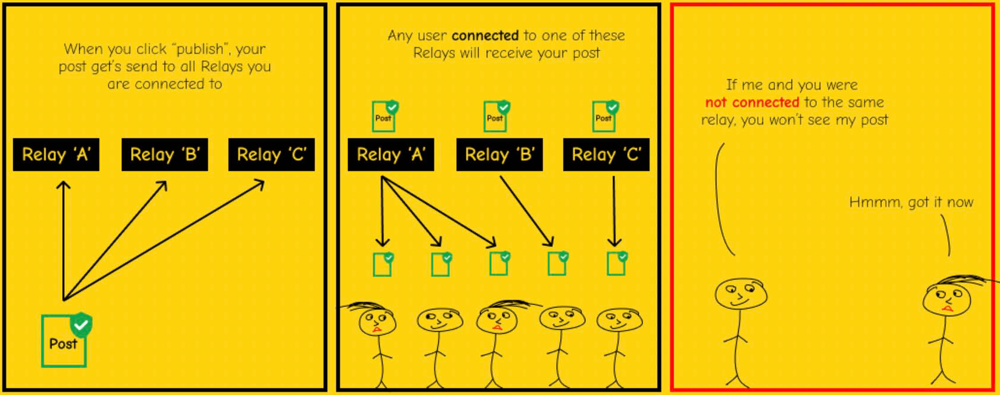

# Chapter 1

# Lwaki Twetaaga Bitcoin

## TWETAAGA KUBANGA SSENTE ZIMENYEKEDDE

> *`Ekizibu ekikulu n’ensimbi ezikolebwa abantu
> kyekyo nti twetaaga okwesiga ennyo
> okuzikozesa. Bbanka enkulu erina
> okwesigwa nti teyonoona nsimbi,
> naye ebyafaayo by’ensimbi z’abantu zijjudde
> okumenya okw’obwesige obwo. Bbanka zirina
> okwesigwa okukwata ssente zaffe n’okuzitambuza
> mu kompyuta, naye ziwola mu
> mabeega ag’obubombe bw’ebyensimbi nga waliwo butono
> mu tterekero. Tulina okuzeesiga
> obutayayaanira bwaffe, okuzeesiga nti tezikiriza
> ababbi b’amannya okumalawo akaawunti zaffe.`*

~ Satoshi Nakamoto 2009-02-11

* Enkola y’ensimbi z’abantu emenyekedde (bulijjo bwe kibadde).
* Teweesigamiziddwa (tekibadde kityo).
* Tewali ngeri ya kukilungisa (tekyijja kuba kityo).

---
## EKIFO (SI) EKYA ZAABU
* Abantu bangi bakyakkiriza nti ssente zeesigamiziddwa ku
zaabu.
* Si bwe kiri.
* Tezibadde zeesigamiziddwa ku zaabu okuva mu 1971, lwe
Pulezidenti Nixon yaggya ensi yonna ku
mutindo gwa zaabu (ekikangabwa kya Nixon).
* Laba **wtfhappenedin1971.com** ofune ekifananyi ekiragala obulungi
obw’ebintu bino bye byakola.

Ekitabo ekiraga okubumbulukuka kw’ebintu ebigulwa (omuko ogumyuufu) vs
amaanyi ag’okugula ag’edoola ya Amerika (omuko omuddugavu) okuva mu 1971.

<small>U.S. Bureau of Labor Statistics, ekiggyiddwa mu FRED, Federal Reserve Bank of St. Louis; https://
fred.stlouisfed.org/series/CPIAUCSL, June 9, 2024.</small>

* Ekyewunyisa: Ekifo ky’ebyenfuna eky’ensi yonna kyatandikibwawo mu 1971.
---

>**FIAT:** (erinnya) /ˈfiː.æt/
>
>: ekiragiro eky’obuyinza oba eky’ekyejo : EKIRAGIRO
>
>: okusalawo okw’obuyinza : EKITEGEEKO
>
>**: ekiragiro oba ekikolwa eky’obwagazi ekikolawo ekintu nga
tewali oba nga tewali kufuba kwonna**

~ merriam-webster.com/dictionary

>**FIAT :** okuva mu Lulattini fieri «okukolebwa, okubaawo»

* Fiat ssente ezirina omugaso gwokka kubanga gavumenti egamba (eragira) nti zirina.
* N’olwekyo abantu (balina) okukiriza nti zirina.
>* **Ne bwe baba tebakkiriza nti fiat erina omugaso, mu mateeka balina
okuzikozesa era okuzikkiriza ng’empeera ya
eby’amaguzi n’obuweereza.**
* **Ssente za Fiat zikubibwa/zikolebwa okuva mu bbanga obwanga.**
* Ennaku zino nga 5% ku ddoola zonna zikubibwa nga
ssente enkalu.
* Endala 95% zikolebwa mu tekinologiya bbanka bwe ziyingiza
nnamba mu kompyuta bwe ziwaayo ssente ez’obweyazike

>*Kitwala ssente ntono nnyo eri ekitongole kya
Engraving and Printing okukola edoola 100…*

~ Omukugu mu by’enfuna Omumerika, Barry Eichengreen

---

>***Scott Pelley owa NBC ’60 Minutes’:*** *Kyakugamba nti
mwajjuzza obujjuzi enkola n’essente?*
>
>***Ssentebe wa Fed Jerome Powell:*** *Yee. Twakola.
Eyo y’engeri endala ey’okukiteekako. Twakola.*
>
>***Pelley:*** *Ziva wa?
Muzikuba buto?*
>
>***Powell:*** *Tuzikuba mu tekinologiya. Bwe kityo nga bbanka enkulu, tulina
obukodyo okukola ssente mu tekinologiya. Era tukola ekyo
nga tugula ebbaluwa z’obwanakyewa oba bondi ez’obwanakyewa endala
obukakafu bw’ebyobwanakyewa. Era ekyo kyeyongera ku
obungi bw’ensente. Era tukuba ensimbi ez’omulembe era
tugabira ekyo okuyita mu bbanka enkulu.*

~ Emboozi ya CNBC ’60 Minutes’, May 17, 2020
Ebbanga lya myezi ebiri bukya okuggala kwa C*vid-19 kutandika

>Tewali kkomo ku ekyo kye tusobola okukola
n’enkola zino ez’okuwola ze tulina.

~ Ssentebe wa Fed Jerome Powell
March 18, 2020 ku CBS News

>Yee, waliwo ssente ezitaliiko kkomo mu Federal
Reserve. Tujja kukola kyonna kye twetaaga okukola okukakasa
nti waliwo ssente ezimala mu nkola ya bbanka.

~ Neel Kashkari , Pulezidenti wa Minneapolis Fed
March 23, 2020, CBS '60 Minutes'

>‘Ffe’ wano abantu bataano abalonda ku nkyukakyuka mu
nkola y’ebyensimbi mu nkola ya Federal Reserve
mu nkiiko za FOMC. 5 ku 330,000,000.
Ekyo kyonna kyetwetaaga okukyusa enkola y’ebyensimbi ey’Amerika.

~ @MartyBent, Omutandiisi wa TFTC.io
Ekiwandiiko kya Forbes, March 18, 2020

---

## OKUVA MU KAMWA K’EMBAGA EYA OLDE

>*Bbanka erina omugaso gw’amagoba ku ssente zonna
ze kola okuva mu bwereere.*

*~ William Paterson, 1694
Omutandiisi wa Bbanka ya Bungereza*

>*Emitawaana gyonna, okutabukwa, n’obuyinike mu Amerika bivaamu,
si okuva mu bunafu bw’Ekitebe kya Ssemateeka oba Okwegatta,
si okuva mu kwetaaga kitiibwa oba mpisa,
ng’oluusi okuva mu butamanya obutereevu obwa
obuwangwa bw’ekicweka, ssente, n’okutambula.*

*~ John Adams
Pulezidenti ow’okubiri owa Amerika, 1797-1801*

>*Nzikiriza nti ebitongole bya bbanka bya kabi nnyo eri
obwetwaze bwaffe okusinga amagye agayimiridde.
Dda baazimbirawo obwami bw’ebyensente
obwakoba gavumenti.
Amaanyi ag’okuwaayo galina okuggibwa ku bbanka, era
gazzibwe eri abantu be galina okubeera agabwe.*

*~ Thomas Jefferson
Pulezidenti ow’okusatu owa Amerika, 1801-1809*

>*Nga twekulisa ebikolwa byaffe eby’ekitiibwa twali bafuba okukweka ekyokulabirako ekibi
nti n’enkola y’ebyensimbi etaliimu butuukirivu twakola eggwanga
enkola y’okujooga, newankubadde ng’eyongedde okutetenkuka, si
ya kabi ntono okusinga enkola enkadde ey’obuddu obw’ebintu.*

~Horace Greeley
Omubaka wa Amerika 1848-49
Omutandiisi wa The New York Tribune

---

>*Buli alondoola obungi bw’ensente mu ggwanga lyonna ye
mukama omutongole ow’amakolero n’ebyobusuubuzi byonna…
bw’omanya nti enkola yonna yangu okukontoolwa,
mu ngeri emu oba endala, abasajja abatono ab’amaanyi waggulu, tolijja
kutegeezebwa ngeri obujjumbire n’okuggwaamu amaanyi gye bitandika*

~ James A. Garfield
Pulezidenti ow’amakumi abiri owa Amerika, Mar-Sept.1881
Yattiddwa mu 1881

>*Waliwo leero mu mikono gy’abantu abataliiko bukulembeze
amaanyi okukola edoola okuva mu bwereere.*

~ Thomas W. Lawson, Omuwandiisi 'Frenzied Finance', 1905

>*Nnali nga mukakafu - mazima ddala, nga munnakigenderewa - nga buli gundi gundi omusazi w’ekikwekweto.
Okuzuula, twali tumanyi, tekirina kubaawo, oba olwo ebiseera byaffe byonna
n’okufuba kwandisaanyiddwawo. Singa kyandisuuliddwawo nti ekitongole kyaffe
eky’enjawulo kyakuŋŋaana ne kiwandiika ebbanga ly’ebbanka, ekyo
ebbaluwa teyandibadde na mukisa gwonna okuyita mu Congress.*

~ Frank A.Vanderlip
Pulezidenti wa National City Bank of New York
(omukulembeze wa Citi Bank)
~ Ng’awandiika mu 1935 ku lukuŋŋaana olw’ekyama olwabeera ku
Ekizinga kya Jekyll mu 1910, okusalawo ebaluwa eyayisibwa nga
Etteeka lya Federal Reserve mu 1913.

>*Etteeka lino (Federal Reserve) litandikawo obwesige obusinga obunene ku
nsi. Pulezidenti (Woodrow Wilson) bw’ateeka omukono ku Ebaluwa,
gavumenti etalabika ey’Amaanyi g’Ensimbi ejja kukkirizibwa mu mateeka…
Ekikolwa ekibi ekisinga mu magezi giyisibwa
ebbaluwa eno ey’ebyebbanka n’ensimbi.*

~ Charles A. Lindbergh, Sr.
Omubaka wa Amerika 1907-1917

---

>*Ndi musajja munaku nnyo. N’obutamanya nnonoonyezza eggwanga lyange.
Eggwanga erikula mu makolero likontoolwa enkola yaalo ey’obweyazike.
Enkola yaffe ey’obweyazike ekuŋŋaanyiziddwa. Okukula kw’eggwanga,
olw’ekyo, n’ebikolwa byaffe byonna biri mu mikono gy’abasajja batono.
Tuze okuba omu ku abo abafugibwa obubi ennyo, omu ku abo abasinga
okukontoolwa n’okufugibwa gavumenti mu mpisa.
Ennyuma gavumenti ng’etegeezebwa eddoboozi ery’obuntu, ennyuma gavumenti ng’etegeezebwa
obukkakafu n’akalulu k’abasinga obungi, naye gavumenti ng’etegeezebwa eddoboozi n’obukakafu bwa
ekitongole ekitono eky’abasajja abafuga.*

~ Woodrow Wilson
Pulezidenti ow’amakumi abiri mu munaana owa Amerika, 1913-1921
Emyaka 6 bukya Etteeka lya Federal Reserve erya 1913 liyisibwa.

>*Amazima ag’ensonga, nga ggwe nange tumanyi,
nti ekintu ky’ebyensimbi mu bifo ebinene
kibadde kyakussa gavumenti ya U.S. okuva
ennaku za Andrew Jackson.*

~ Franklin D. Roosevelt
Pulezidenti ow’amakumi asatu mu bubiri owa Amerika mu bbaluwa eyaandiikibwa
ku Nov. 21, 1933 eri Koloneri E. Mandell House

>*Yo [okuggwaamu amaanyi] tekwabangawo lwa butamanya.
Kyali kintu ekyatekebwatekebwa obulungi….
Bbanka ez’ensi yonna zaanoonya okuleetawo
embeera ey’obuyinike wano basobole
okututumamu nga abafuzi baffe ffenna.*

~ Omubaka Louis T. McFadden,
Yattiddwa mu 1936

>Ssentebe wa Akakiiko k’Ebbanga ly’Ebbanga Ekkumi n’Obuwangwa bw’Ebbanga
*Buli kiseera bbanka lw’ewaayo ssente z’obweyazike,
obweyazike obupya bwa bbanka bukolwawo - obutereke obupya - ssente empya.*

~ Graham F.Towers
Gavumenti ya Bbanka Enkulu ya Canada, 1934-55

---

>*Singa temubaddeyo madeni mu nkola yaffe ey’ensente,
wandibaddeko ssente*

*~ Marriner Eccles,
1941, Gavumenti ya Fed*

>*Sirinnaba kufuna omuntu yenna asobola, okuyita mu
kukozesa amagezi n’okusalawo, okutereeza gavumenti ya Federal
okuwola okukozesa ssente zaayo…
Nzikiriza nti ekiseera kijja abantu lwe balijja
okulagira nti ekyo kikyusibwe.
Nzikiriza nti ekiseera kijja mu ggwanga lino lwe
bajja okulumiriza ggwe nange era
omuntu yenna alina akakwate ne Congress
olw’okutuula obuteeko n’okukkiriza
enkola etaliimu magezi okweyongera.*

~ Wright Patman
Omubaka wa Amerika 1928-1976
Ssentebe, Akakiiko ku Byebbanka n’Ensimbi 1963-1975

>*Bw’oba ggwe oba nze tuwandiika cceeke, mulina okubeerawo ssente ezimala mu akaawunti yaffe okubikka ku cceeke, naye Federal Reserve bw’ewandiika cceeke tewali butereke bwa bbanka cceeke eyo kwe giyingizibwa. Federal Reserve bw’ewandiika cceeke, ekola ssente*

~ Federal Reserve Bank of Boston
'Okukiteeka Mu Buufu', 1984

---

## FEDERAL RESERVE

* Fed ye bbanka enkulu ‘eyetongodde’ ey’eggwanga. Yakoledwa mu 1913 nga Etteeka lya Federal Reserve liyisibwa.
* Erina enkola ey’enjawulo, ekitundu kya nnakyewa n’ekitundu
gavumenti.
* Erina okuba ekitongole ekitabaako byabufuzi,
ekitali kya kibiina kyabufuzi mu gavumenti.
* Nga Fed Board of Governors alondebwa Pulezidenti era n’akakibwa Congress, **ebisalawo bya Fed tebyetaaga kuteekebwa mu mateeka omuntu yenna.**

**Erina:**

* The Federal Reserve Board of Governors
* Bbanka 12 eza Federal Reserve
* The Federal Open Markets Committee (FOMC),
ey’ekitongole ekisalawo ku nkola y’ebyensimbi.

**Fed evunaanyizibwa ku:**

* Okukulembera enkola y’ebyensimbi ey’Amerika, okutumbula emirimu n’ebbeeyi entereevu.
* Okuteekateeka n’okukulembera ebitongole bya bbanka n’ebyensimbi.
* Okuwaayo obuweereza obw’okusasula eri ebitongole by’ebyensimbi.
* Okutumbula okukuuma abaguzi n’enkulakulana y’omukago.

---

## EKIWANDIIKO KU FED CHAI TE KU FED CHAIR

* **Ssentebe wa Federal Reserve era:**

* Akulembera Federal Open Market Committee
(FOMC), esalawo ku lw’enkola y’ebyensimbi ey’Amerika
(ng’ekyokulabirako: QE, okwongeza ebiwero by’amagoba)
* Mmemba wa International Monetary Fund,
IMF
* Mmemba wa Bank for International
Settlements, BIS (ebbanka y’ebbanka enkulu).
* Minisita w’ebyensimbi owa Amerika owa G-7
* Minisita w’ebyensimbi owa Amerika owa G-20

* Amaanyi **amangi** nnyo eri omuntu omu.

---

## FRACTIONAL RESERVE BANKING, AMAGOBA N’OBWEYAZIKE

* **Fractional Reserve banking:** Okutuusa mu March 2020, bbanka
zaalagirwa okukwata obutereke bwa 10%, era zaali
zisobola okuwola 90%.
* **Okuva mu March 2020, tewali butereke bwetaagisa, kukkiriza bbanka okugabira ssente ez’obweyazike ezitaliiko kkomo.**

* Ssente ez’obweyazike ssente ezizimbiddwa ku madeni, era olagirwa
okusasula amagoba ku ssente ez’obweyazike.

>* **Ekyewunyisa 1:** Essente z’okusasula amagoba ku
>ssente ez’obweyazike TEZIKOLWAAWO bbanka.
>* **Ekyewunyisa 2:** TEZIKOLEBWA KUNYEERA.
>* **Ekyewunyisa 3:** TEWALI SSENTE ZIMALA MU
>nsi okusasula ssente zonna ez’obweyazike + amagoba agasaanidde
>ku ssente ezo ez’obweyazike.
>* **Ekyewunyisa 4:** Teriijja kubaayo!

---

## EKIWANDIIKO KU PETRO DOLLA
* Omuntu asobola okugamba **nti okutuusa mu 1971 edoola yali eweebwa
zaabu, era okuva mu 1974 ebaddenga eweebwa amafuta,
era n’olwekyo olw’obuntu, Amagye ga Amerika.**
* **Mu 1974 Amerika ne Saudi Arabia baayingira mu ndagaano zombi okuteeka ebiwero ku kutunda amafuta mu ddoola ya Amerika.**
* Okuva olwo, ebisinga ku kutunda amafuta mu nsi yonna kubaddenga kulungamu mu
ddoola ya Amerika.
* Kino kiyambye nnyo edoola okufuuka
ensimbi esinga amaanyi mu nsi.
* **Eyo n’olwekyo ebadde esituliddwa mu bukyamu,** ne mu
biseera by’eba nga yandikoledde bubi.
* Okuva oluvannyuma mu 2022, amawanga agamu
gatandise okusuubula mu nsimbi endala ku ddoola ya Amerika
* Kisoboka nnyo nti kino kisobola okuba entandikwa ya
enkomerero ya petro ddoola. Ekyo ekiddako kyetutali bukakafu…

---

## KU QE (OKUKENNEENYA OBUGUNGU)
* **Okukenneenya Obugungu kutwalibwa nga ‘enkola y’ebyensimbi etali ya bulijjo’ ekolebwa Bbanka Enkulu ‘okutumbula ebyenfuna’, gye Fed egula bondi za gavumenti n’obukakafu obwa gavumenti obulala.**
* Yatandikibwawo okukozesebwa Japan wakati wa 2001-2006.
Okugoberera ekyo, Amerika, Bungereza, n’ekifo kya Euro bakozesa
QE mu kiseera ky’ekizibu ky’ebyensimbi mu 2008
* Okuva olwo, ekiseera kyokka Amerika ky’etabaddenga nakiragala nkola ya QE
kyabadde wakati wa 2014-2019.
* Nga bwe kirabibwa wansi, abavumuluzi bakiziriza nti **QE
eyamba abo abagagga dda obutajjumbira**

![QE yali busosiyale eri 1%] (figure-01-QE.png)

*Ebbanja: @RudyHavenstein ku Twitter*

---

## EBISEERA

* **Mu butonde bwonna, waliwo ebiseera, okukendeera okwa bulijjo
n’okuyiwa, okugaziwa n’okukendeeza.**

* Kino **kiyamba ku obugunyu bonna, okumala ebiseera, okukulaakulana
n’obugunyu** bw’enkola yonna eyekuŋŋaanyiza, ku bulamu bwonna ku nsi.
* **Enkola y’amadeni, ey’ensimbi z’abantu tegissa kimu
amagezi g’ebiseera eby’obutonde,** era mu kifo ky’ekyo yeesigamiziddwa ku,
era 100% eweebwa okusobola okusigalawo ku, okukula okw’ekitalo
n’okutetegeka, okusobola okweyongera
okutuukiriza amadeni gaayo.
* Mu butonde, kino kansa.
* Mu ‘ebyenfuna’, ekintu kino ekitajja mu butonde kyakulemberwa
gavumenti okuwaayo obweyamo eri bbanka ezifiirwa
n’ebitongole ebinene, mu kifo ky’okubikkiriza
okuyiwa, n’okuddamu okukolebwa mu kintu ekipya, ekirungi.
* **Obububi obw’okuwaayo obweyamo eri ebitongole ebigwa buleeta ebyenfuna yonna mu kabi.** Mu butuufu,
kye kiba kigenderera kukankanya kintu wansi w’oluguudo, era okutabukwa obutalekwa okuleeta olwa leero kusobola okuba wala, wala
kusinga singa ebiseera eby’obutonde byakkirizibwa okuzannya
* **Tulina obubumbi eri Satoshi Nakamoto, n’eri
abamenyi b’amateeka okumugoberera ne bamugoberera,** olw’okuba n’okulaba,
okulaba ennyuma, okwesigamiziddwa n’obukodyo okukolawo
obwato okututwala eri enkalu empya.

---

* Bwe tumala okumanya ekirabo kino kye kiri, kitutuukira
okubuuka ku bwato, n’emitima egijjude n’amagezi amayonjo,
okutambula n’okuzimba ensi empya n’Ensimbi
y’Emirembe.
>* **Bitcoin erungisa ensimbi, kitutuukira okurungisa ebintu ebisigaddeyo.
Era, okuba abayonjo, nga tulina ensimbi ezirungise, EBINTU BINGI
ebirala birirungisibwa, olw’obuntu**

* Ekikulu ekimu ekiribawo kwe kuba nti olutalo olunenene, olutandikiddwawo gavumenti, olw’amaanyi teruliba lugasa, oba kusoboka, nga tewali buyambi bw’abantu.
* N’okwongerezaako, kulibaawo okukendeeza obutonde,
wamu n’okukyuka okugenda ku byamaguzi eby’omuwendo ogw’ensimbi, enkolagana ez’omuntu, obutereke obw’omulembe, & okuggibwako ssente okw’amayumba n’ebibanja, ebyali tebigenderera
okuteekebwako ssente mu kifo ekisookera ddala.
* **LABA:** Bitcoin Erungisa Kino, lupapula 32
---

## TWETAAGA KUBANGA OKUBUMBULUKUKA KW’EBIWERO KUBBA

Ekitabo kya 2024 FRED ekiraga okukendeera kw’amaanyi ag’okugula ag’
edoola okuva lwe kyatandikibwa Federal Reserve mu
1913. Ekigerageranyo ekikuŋŋaanyiziddwa eky’okubumbulukuka kw’ebintu okuva mu 1913 kiri kumpi
3.067%. Ensimbi zonna za bbanka enkulu ez’abantu mu nsi yonna
zigoberera ekigerageranyo kye kimu eky’okukendeera.

* **Ssente ennyingi ze zikolebwa okuva mu bbanga obwanga,
ssente zonna ze zifiirwa omuwendo/amaanyi ag’okugula.**
* Kino kiyitibwa **okubumbulukuka kw’ebintu.**
* Okubumbulukuka kw’ebintu **kubba biseera,** mazima ddala. Omuwendo gw’ebiseera byo
gubbiddwa bw’obiteeka mu nsimbi erumbuluddwa, ejuddiddwa era eteekeddwa.
* Okubumbulukuka kw’ebintu era **omusolo ogwekweese.**

---

* Obubbi buno obw’ebiseera n’omusolo gugumiddwa amawanga
amalala gonna ag’ensimbi z’abantu era, okuva gonna bwe gabaddenga
gateekeddwa ku ddoola ya Amerika, nga yadde
ensimbi y’ensi yonna okuva lwe twateeka emikono ku
endagaano ya Bretton Woods mu 1944.
* **Mu USA, ekitundu kya 2% eky’omwaka ogw’okubumbulukuka kw’ebintu kiwandiikiddwa mu
ekiragiro kya Federal Reserve.**
* Kino kitegeeza nti **OKAKASA okuba
osobola okugula obutono bwa 2%** n’edoola 20 ze zimu buli mwaka.
* **Mu March 2024, ekitundu eky’omwaka ogw’okubumbulukuka kw’ebintu kyali 3.5%,**
(amangi nnyo okusinga 2%, ekitegeeza nti waafiirwa ekitundu kya 3.5% eky’
amaanyi go ag’okugula wakati wa March 2023 ne
March 2024.
* Okuteeka mu ngeri endala, kino kitegeeza nti ku kigero, ebintu
byongezeddwa ebiwero n’ekitundu kya 3.5%
* **Singa okubumbulukuka kw’ebintu kwapimiddwa obutuufu, nga
kyakolebwanga okutuusa mu ntandikwa ya 1980,
kyandibadde kumpi ekitundu kya 10% mu 2024.**
* Bwe kikeberedwa mu bitongole, omuntu alaba nti
okubumbulukuka kw’ebintu kubi nnyo okusinga ekitundu kya 3.5% mu bingi
ebitongole mu mwaka oguwedde.
* Bwe mutunuulira buguzi, ebiwero bya ggaasi,
kumpi ekintu kyonna omuntu kyagula, kiragala bulungi nti
okubumbulukuka kw’ebintu kusiiganiddwa mu buli kitongole

---
**Ekigerageranyo ky’Okubumbulukuka kw’ebintu kumala
emyaka 50 egiyise mu Amerika:**

|  Ekigerageranyo ky’omuwendo   |   1971  |   2021  |   % Okwongeza  |
| --- | --- | --- | --- |
|  Omusaala   |    $9,400 |    $59,400 |    532% |
|   Ennyumba  |    $23,400 |    $513,000 |    2,092% |
|    Ggaloni ya Ggaasi | $0.36    |   $4.17 |  1,058%   |
|    Emmotoka Empya |  $3,400   |   $47,000  |    1,282% |
|   Diguli y’Essomero   |  $1,400   |   $26,000  |  1,757%   |
|   Ekitooli ky’Ebintu Ebigulwa  |$20     |  $210  |    950% |
|  Amassannyalaze/kWh   |  $0.02    |   $0.15  |   650%  |

>**Ekyokulabirako eky’amazima:**
~ Ennyumba yagulibwa mu 1976 ku $58,000.
~ Bw’otunuulira ‘enkola’ ey’okubumbulukuka kw’ebintu, ekyo kyandibadde
$279,000 mu ddoola za 2022.
~ Mu 2022 ennyumba yeemu yasaliddwa omuwendo ogwa $2.09 mu buwumbi.
~ Lowooza ku ekyo…

>*Ensimbi z’abantu bubenje.
Bubenje ki edoola 10 gy’esambaza?
10 kye kiwero ekisambaza obuwangwa bw’ekitundu ekirina
omuwendo ogubulawo.
10 ku ki?
10 teyogera kyonna nga tewali
n’omuwendo ogunywevu ogumanyiddwa.*

~ @bitlany

---

* **Nga okubumbulukuka kw’ebintu kwongezereka, obutereke bwo (singa oli muwera,
olina obutereke), bukuuna omuwendo.**
* Okuva ebiseera bwe bigenda, bukuuna **AMANGI** ag’omuwendo
>*Singa watandika okuteeka $100/mwezi leero, n’omuwendo
>ogusinga obulungi oguliwo ogwa 0.05%:
> * emyaka n 30 wandibadde otuusizzawo **$84,019.**
>* Bw’oteekebwa ku ekitundu kya FED eky’obuwagizi 2% ku okubumbulukuka kw’ebintu
>* emyaka n 30 obutereke bwo bwandibadde bulina
amaanyi ag’okugula agaa **$46,384.**
>* Ng’ogoberera ku kubumbulukuka kw’ebintu okwa leero okwa 3.5%:
>* Obutereke bwo obwa $84,019 bwandibadde bulina amaanyi
ag’okugula agaa **$11,037** emyaka n 30!

* **Mu ngeri eno kitegeeza nti kumpi mukaaga ku
musanvu ogw’essaawa z’omulimu gwo gubiddwa = *Obubbi
bw’Ebiseera.***

---
**Egeri endala okukitunuulira yo eno:**
* Mu **1971**, omuwendo gw’ennyumba = emirundi **2.5** ku kigerageranyo
omusaala ogw’omwaka.
* Mu **2024,** omuwendo gw’ennyumba = emirundi **8.6** ku
omusaala ogwa bulijjo ogw’omwaka.
* Mu **1971**, emmotoka empya yaaliwo kumpi **1/3** ogw’omusaala ogwa bulijjo
* Mu **2024**, emmotoka empya yaaliwo okusinga **3/4** ogw’omusaala ogwa bulijjo.

Nzikiriza nti kati kiragala bulungi nti
okubumbulukuka kw’ebintu
te **si** *
kikukolera ggwe.

**Ekyokulabirako:** Ennamba zino zonna zigerageranyo, era ezikyuka

# Chapter 2

# KILONGOOSA OKUGATTA EBY'ENSIIMBI
* **Nga tukozesa bitcoin, buli omu alina omukisa okuyingira mu nkola y'ebyensimbi *yemu*, nga buli omu alina amateeka *gegamu*.**
* Tewali busobozi bwonna bwa kwewoma oba enzigi ez'ekyama oba endagaano ez'enjawulo
eri omuntu yenna.
* Buli omu alina obusobozi okusasulwa olw'omuwendo gw'awaayo n'ensimbi entuufu zemu,
ezikolebwa era ezikuumwa n'amateeka ge gamu.
* **Bitcoin eri eri omuntu yenna, wonna wonna alina
omukisa okukozesa intaneeti.**

## OKWONGERA OMUWENDO KU NSII
* **Bitcoin ekubiriza abantu okwongera omuwendo ogw'amazima ku
muntu yenna ne ku katale,** kubanga eno y'engeri yokka
ey'okukola ssente ennyingi
* Omuntu bw'amala gasimuka n'ebitono, era aganyulwa mu kukolera omusaala omulungi, era **omuntu bw'atereka, ssente ezo zikuumira omuwendo gwazo okumala ekiseera.**

---
## KILONGOOSA OBUTONDE
* Ensimbi ennungi n'omuwendo ogukoma ogwateekebwawo
kireetawo embeera eyawukanira ddala ku leero ey'okukola
ebbanja, okukuba ssente ezitaliiko kkomo ze
tulaba nga zigenda mu maaso leero.
* Mu kifo ky'okuwakanya ekintu ekireetera okumalawo ebintu
ebingi ddala, mu mpaka z'okukka wansi okusasula
omuwendo gw'amagoba ogw'entengo ku bbanja
egenda okumaliriza nga tegisasuddwa, **bitcoin
ewaayo ekkubo okuva mu nsi omuntu gy'ayagala ekiseera ekigere.**
>* Okwonoona obutonde mu ngeri etateebereka **kuddibwamu
n'okukozesa ebitono, okusaanyaawo ebitono, n'engeri
ey'obwegendereza ey'okufulumya ebintu,** akatale we
kasalirawo ekirimu omuwendo ogw'amazima, era
ebintu lwe bikolebwa okumala ebbanga.
* Kino kiganyula abantu, ebimera n'ensolo!
---
##  KILONGOOSA ENTALO
* Okukuba ssente ezitaliiko kkomo mu nkola y'ebyensimbi
kye kireetera ‘entalo ezitalekera’ okusoboka n'okuganyula.
* Okuva abantu abasinga obungi tebamanyi ngeri ssente z'entalo
zigenda, oba ssente ziva wa, tewali buvunaanyizibwa
eri Gavumenti. Entalo zisobola okutindigga okumala
emyaka mu bifo ebyetoolodde, nga tewali kulondoola.
* Okutandika ne Vietnam, entalo zifuuse ‘entalo z'ekkaadi
z'okubanja’ (h/t @AlexGladstein), okuva Gavumenti
ewola ssente okusasula entalo, era
oluvannyuma ewola ssente endala okusasula amagoba ku
mabanja agasooka... okuddamu n'okuddamu.
>* **Ku mutindo gwa bitcoin, kyandibadde kyetaagisa
abantu b'eggwanga okuba abeetegefu okuyambako okusasula
entalo. Bandikikoze singa kyali
kyetaagisa era nga kyeyoleka obulungi, okutaasa
amaka gaabwe n'eggwanga, nga waliwo ekyigendererwa eky'enkomerero eriiso.**
* Okuva nga tewali magoba gateekwa okukolebwa,
abakungu ba Gavumenti n'amakampuni tebandikubiriziddwa
kukulakulanya oba okwenyigira mu ntalo ng'enkola
ennungi.
* **Amaanyi gandiyongereddwa nnyo okufuna engeri
ez'okutuuka ku mirembe, ensalawo ezitali za bbeeyi nnyingi mu kifo ky'ekyo.**
---
##  KILONGOOSA EKISAAWE KY'OBWENGE

**Ekisaawe ky'Obwenge Eky'Ogwangu:** Okumatiza amangu, Obutagumiikiriza,
Okuteekateeka okw'omulembe
**Ekisaawe ky'Obwenge Eky'Oluwewu:** Okumatiza okwaluddewo, Okugumiikiriza,
Okuteekateeka okw'ebbanga

* Ekisaawe ky'obwenge eky'omulembe kireetera, obwonoonefu, obuntu n'obutonde
okuzikirira. Ssente zaffe bwe ziba zifiirwa
omuwendo buli lunaku, ‘tuwalirizibwa’ okuba
abatagumiikiriza era okuzisaasaanya mangu nga bwe kisoboka,
nga tezinnadda wansi mu muwendo.
* Ekiseera kyaffe bwe kiba kyeddibwamu omuwendo n'ensimbi
ezizza emmotoka omuliro buli kiseera, tuviira ddala ku muwendo
gw'ekiseera kyaffe.
* Kino kireetera okutayagalana, n'akasattiro
akali wansi.
* Engeeri z'okukkakkanya obusungu, n'okufuna amakulu,
zikyusibwa era zifuuka eby'omusaalaba nga
okukozesa ennyo ebiragalagala, omwenge, okugula,
ebinyazi, emmere eyanguwa, obutassaayo mwoyo mu kiseera kitono, okuyayaanira
ebikozesebwa ku masimu/ebyobuwangwa, ensalawo ezikwata amangu n'ebirala.
* **Ssente ennungi ku luuyi olulala, ezikuuma
omuwendo gwazo okumala ekiseera era ne zipima obulungi
byetuyambye okuyita mu mirimu gyaffe, bireetera ekisaawe
eky'obwenge eky'omulembe, obulamu obw'omutindo, n'enkolagana
ey'amakulu, obutakozesa nnyo, okwegatta mu buntu, emboozi ey'omunda, ebiruubirirwa bya bbanga
n'okwongera okutondeka.**
---

# Chapter 3

# BITCOIN KIKI?

>*“Okuwandiika okunnyonnyola ku kintu kino
eri abantu bonna kikaluba nnyo.
Tewali kintu kyonna kiyinza kukigerageranyizibwa.”*

~ Satoshi Nakamoto 2010-07-05

>*Omusaasaanya gwonna gujja kuba 21,000,000
ensimbi. Zijja kugabanyizibwa ku ntikko z'omutimbagano
(abanoonyi b'obugagga obw'omu ttaka) bwe bakola ebipande,
n'omuwendo gusalibwamu wakati buli myaka 4.
emyaka 4 egyasooka: 10,500,000 ensimbi
emyaka 4 egiddako: 5,250,000 ensimbi
emyaka 4 egiddako: 2,625,000 ensimbi
emyaka 4 egiddako: 1,312,500 ensimbi n'ebirala...
Bwe kinaaggwaawo, enkola esobola okuyamba
ku bisale by'okukyusa ssente singa kyetaagisa. Gyekolera
ku kuvuganya kw'akatale akaggule, era waliwo
oboolyawo bulijjo okubaawo entikko ezeeyagalira
okukola enkyukakyuka ku bwereere.*

~ Satoshi Nakamoto 2009-01-09

* **Bitcoin ssente ez'eddembe…** mu ngeri nti erina
obukakafu okutuwonya fenna okuva mu kukyusakyusa
okw'amaanyi, n'okufuga, okw'enkola y'amabbanka enkulu
* **Mu bitcoin, amateeka g'ebyensimbi gafaanagana eri
Buli muntu, buli wamu.**
* Bitcoin etwaliramu buli omu, mu ngeri nti buli muntu alina
omukutu gwa intaneeti asobola okwetaba mu mutimbagano,
era **alina okugoberera amateeka ge gamu.**

---
## bitcoin yee:
* **TEKWESIGAMIZZA KU MUNTU MMOI**         
* **NTONU FUFU**          
* **EZEGANYIRA OKULONDOLA** 
* **KITABO EKISAASAANYIZIDDWA**
* **TEYONONEKA**
* TEKWETAAGISA KUKKIRIZIBWA
* EKAKASIBWA
* EYOLEKA
* ENTATEEKEBWA
* TEKOMA
* KIZIBU OKUKOPERA
* ERINA ERINYA LYA KINYIISA
* TEKIKOSA
* TEKWETAAGISA KWESIGA
* YA MUNTU KU MUNTU
---
* Bitcoin teyesigamizza ku muntu mmoi.
* **Gukolera ku nkumi n'enkumi z'entikko mu nsi yonna, ng'ekolebwa enkumi n'enkumi z'abantu abataagana.**
* Tewali muntu n'omu, gavumenti oba kkampani eyinza
okugifuga.
* Naawe osobola okukola entikko, kyangu ;)
* Bw'okola entikko yo, weeyongera obuteekumwa bwo
n'okuyamba okukuuma omutimbagano bw'okakasa
enkyukakyuka zo.
> **Tokkiriza. Kakasa**
---
* **Bitcoin (ennukuta ennene ‘B’)** mutimbagano gwa byensimbi.
* **bitcoin (ennukuta entono ‘b’)** lwe ssente, oba omutindo gw'ebyensimbi, oguweebwa ku, era ogukolera ku Bitcoin
mutimbagano.

---
* **Bitcoin kye kintu ekikubiriza ennyo.**
>* **Obwengere bw'omuntu eyayitibwa Satoshi bwali bukugu nnyo nti mu bitcoin, omulundi ogwasooka, abakola obulungi n'abakola obubi bakubirizibwa okugoberera amateeka.**

> *“Ekirabo kiyinza okuyamba okukubiriza
entikko okubeera ennamu.
Singa omulusi omuluvu aba asobola okukuŋŋaanya
obukakafu bw'obukodyo obw'amaanyi obusukkulumu ku
ntikko zonna ennamu, yandibadde alondawo
wakati w'okubikozesa okukoppa abantu ng'abba
ebisasulo bye,
oba okubikozesa okuzaala ensimbi empya.
Ateekwa okukisanga nga kisinga kumugasa okuzannya
mu mateeka, amateeka ngago agamusiima
n'ensimbi empya ezisinga
buli omu alala yenna eyagattiddwa,
okusinga okugajambula enkola n'
obutuufu bw'obugagga bwe.”*

~ Satoshi Nakamoto 2008-10-31

---
* **Bitcoin ze ssente ezasooka okubaawo mu bungi,** ez'enjawulo
okuva ku akaawunti yo ey'okukebera ey'omu Intaneeti, entereeza ennungi eri
engeri y'obungi ey'ekkobaane lya bbanka enkulu.
* Bitcoin ze ssente ez'obungi ez**tekwesigamizza ku muntu mmoi.**
* Bitcoin **terina bukulembeze bwa masekkati.**
* Bitcoin **tegondera ggwanga.**
* Lowooza ku makulu ...

>*Bitcoin ze ssente ez'obungi ezitekwesigamizza ku muntu mmoi ezisobozesa
okusasula amangu eri buli muntu, buli wantu mu nsi.
Bitcoin ekozesa tekinologiya ya muntu ku muntu okukolera awatali
bukulembeze bwa masekkati: okukwasaganya enkyukakyuka n'ensimbi
eziweebwa bikolebwa wamu omutimbagano gwe gukola.*

~ Bitcoin Wiki
en.bitcoin.it

---
* Bitcoin ze ssente ez'omu Intaneeti ez'ekyamagero.
* Nedda nzikiriza, **Bitcoin ye ngeri gye tugenda okukyusaamu
ensi.**
* Nzikiriza? Yee.
---
* **Bitcoin ngeri ya kussa omutindo**
 *  ogw'omuwendo gwonna
 * mukuumiire
 * mu bwangu (ku Lightning Network)
 * wakati w'abantu ababiri bonna
 * buli kiseera
 * 24/7
 * buli wantu
 * yee, buli wantu
 * Lowooza ku ekyo.

 ---

>*Ng'ensimbi y'omukutu ogw'amasannyalaze esinziira ku byobufuzi
obukakafu, awatali kwetaaga kwesiga omuntu ow'okusatu
ow'awakati, ssente ziba ntekumire era
enkyukakyuka nnyangu.*

~ Satoshi Nakamoto 2009-02-11

---
>*Bitcoin (kumpi) tezikosa kutambula n'obukakafu.
Mmanyi n'obukakafu obwa 100% kye nfuna.*

~ Michael Saylor CEO wa Microstrategy

* Osobola okusindika $1.13, oba 46c oba 359 sats oba 500,000,000
sats oba $1 kakadde eri buli muntu, buli wantu, buli kiseera
okuyita mu Bitcoin Network, oba Lightning Network
eyazimbibwa ku Bitcoin.
* **Era tewali n'omu ayinza okukukakkanya.**
* Osobola okukola ekyo ne zzaabu, feeza, USD/GBP/EUR/YEN/
CYK/ZAR oba ekkobaane lya bbanka enkulu eddala lyonna?

---
* **Bitcoin ya byafaayo.** Guno gwe mulundi ogwasooka mu byafaayo nti
enkola y'ebyensimbi eteekumiddwa, ezira okulondoola, entateekebwa,
etekoma, etetaagisa kukkirizibwa, era eteyononeka eyina omutindo ogugumu (21 kakadde
z'ensimbi) emazze okutondebwawo
>* Bitcoin **nkulu nnyo mu kugabanya amaanyi
n'okwongera okwetaba mu byensimbi,** ng'ekyokulabirako ky'okuva mu nkola
ey'ebyapa, era oluvannyuma World Wide
Web, **kyali kigabanya okufuga, n'okwongera
okuggya mu bubaka.**

>*Abantu bangi beewala
okutoola ensimbi z'omukutu nga bafudde ensonga
olw'amakampani gonna agaagaana
okuva mu myaka gya 1990.
Nsuubira kiba kyeyoleka nti kyali kye
kyefuga ekiri mu masekkati ekyabisaanyaawo.
Ndirowooza guno gwe mulundi ogusoose tulengezaamu
enkola eteekwesigamiza ku muntu mmoi, eteesigamiziddwa ku kwesiga.*

~ Satoshi Nakamoto 2009-02-15
---
* **Bitcoin ye LEDGER YA AKAWUNTI eya buli muntu, eteekwesigamizza ku muntu mmoi, eyoleka, era entateekebwa.**
* Buli muntu mu nsi yonna asobola okulaba ani nannyini ki, buli
kiseera, era tekisobola kukyusibwa.
* Okuggyako 'ani' si linnya, **lwe ddiressi
ekolebwa mu nnamba n'ennukuta.**
>* Ekyokulabirako kya ddiressi ya bitcoin:
**bc1qar0srrr7xfkvy5l643lydnw9re59gtzzwf5mdq**

* Bitcoin kwekyo **erimu erinnya lya kinyiisa.**
---
* **Bitcoin yee**
* omuwi ow'obutaliimu ow'omutindo gw'ebintu
*  etterekero ly'omutindo
* ekikozesebwa okukyusa
* era mu mangu okubeera ekitongole ky'akawunti
*  **wamu ne**
* **engeri** y'okukyusa.

* Gwe muwi, zzaabu, ssente, dddebbitsi kaadi NE
paypal, bbanka, venmo, cashapp, western union

**BYONNA BYEGATTIDDWAMU MU KIKUUMI!**

---
* **Bitcoin omukuumi w'ebbaluwa akola n'ekibalangulo era
ebyemizannyo gya kompyuta, mu kifo ky'abakulu b'amabbanka, abawandiisi b'ebitabo
era ababalirizi b'ebintu.**
* Egomola abantu ab'awakati, amabbanka, gavumenti, ebissale by'okuyitiriza
obukodyo, ebissale by'akaawunti okukebera, ebiseera ebikomereddwa eby'obuweereza,
obukodyo bw'okulondoola, akaawunti enzibike, okukyusakyusa ku kisaasaanya ky'ensimbi, omuwendo gwa sente, IMF,
WEF, BIS, ebizimbe by'amatoffaali n'ebisenge, ATMs,
okukebera, okuddiza emabega, petro dollar, euro
dollar, omukungu wa bbanka, ekibuza ekisuubiza,
obukodyo bw'okukozesa ebifo, visa, mastercard, amex,
western union, ennaku z'okulinda okukyusa kwo okuyita mu...

>* **Mu kifo ky'okuba n'omuntu wakati wo era n'omuntu
>gw'oyagala okukwata mu ngalo, osobola okukwata
>emikono gyabwe butereevu.**
>* **Teweetaaga kusaba kukkirizibwa okusindika ssente zo ggwe!**
---

## Kitegeezebwa mu Bufulu…
* **Bitcoin kye kintu eky'omuwendo ekya bungi omuntu yenna ky'atasobola kukutwalako.**
* >Okubeera nannyini bitcoin kitegeeza okubeera nannyini ddembe okusindika omuwendo
okuva ku ddiressi ennungi gy'ofuga ne
ensuubi yo eri DDIRESSI endala GY'OLONDA.

*Bitcoin ddembe ly'obwannannyini elyefuga
okufuga amaanyi ku bikolwa eby'ettemu.*

~ Robert Breedlove @breedlove22

---

* **Bitcoin kikulu nnyo mu nnono ya kabootongo omulundi ogumu.**
* Bitcoin kye ky'olondawo.
* Bitcoin **ewa obukulembeze.**
>* **Okuzuula kwa Bitcoin emyaka 15 emabega, kwe
ddembe ly'abantu ery'ebyensimbi n'obukulembeze, ng'okuzuula
omuliro bwe kwali eri okukulaakulana kw'abantu okumala
emyaka 500,000 emabega, era ebyapa byali eri
okugabanya okuggya mu bubaka eri okumala
emyaka 900 emabega.**

---
* **Bitcoin etterekero ly'omutindo erituufu.**
* Etereka eby'obugagga byo ebisinze okuba eby'omuwendo, ebiseera byo, mu
engeri gy'osobola okubiggyamu oluvannyuma.
>*Bitcoin efanana ng'omukutu omugazi ogw'amaanyi eri eyakwo
omu maaso ... osobola okukola leero era Bitcoin ejja
okukwaata amaanyi go mu bungi oluvannyuma.*

~ Robert Breedlove

>*Omunsi gw'ensimbi biseera
Era omunsi gw'ebiseera mutindo*

~ Guy Swann

---
* Bitcoin lukalala lw'ebiseera, mazima.
* Satoshi yategeeza lukalala lw'ebiseera emirundi mingi mu
e-meeri ze n'abakola obwangu.
* Osobola okupima ebiseera mu bipande, okuva ekipande kimu
kinoonyezebwa buli ~10 eddakiika.
>* **Ebiseera byaffe bye by'obugagga byaffe ebitono era eby'omuwendo.**
>* **Bwe bulamu bwaffe obutuufu.**
>* **Ssente Ezituufu zituyamba okutereka ebiseera byaffe.**

* Yengeri gye tusobola okukiriza ebiseera bye 'twamaze'.
* **Tukyusa ebiseera byaffe eri ssente, eziwandiikiddwa
ebiseera byaffe n'obukozi bwaffe.**
* **Bitcoin egusobola okukuuma ebiseera byaffe nga
tusobola okubaako 'ekyo tusobola' okuggyamu oluvannyuma mu bulamu, bwe
tuba nga tetukyasobola kukola nga bwe twakola edda.**
---
* Bitcoin **etterekero ly'omutindo.**
* Bitcoin **ekikozesebwa okukyusa.**
* Bitcoin **ejja olunaku lumu okuba ekitongole ky'akawunti.**
* Bitcoin **ejja olunaku lumu okuba *EKITONGOLE ky'akawunti.***
---
* **Bitcoin ntono**
* Erina omutindo ogugumu gwa 21,000,000. 
* Tewajja kubaawo gy'ekoma.
* Obukodyo mateeka wano.*

*Nga bwe kisobola okuba 'mu byetekinolojiya' okukyusa
obukodyo, obwengere bwa Satoshi buzibuza ekyo, okuva okwongera
(okuzimbulukusa) omuwi kiyinza okubeera kiyamba okukendeza
omutindo gwa bitcoin yonna mu kusaasaanya. Kino kwekyo
kikubiriza buli muntu okukkiriziganya mu bukyamu okukuuma
omuwendo ogugumu ogwa 21,000,000 omuwi.

* Kebera **timechaincalendar.com** olwa @TC okukebera
obuwanvu bw'ekipande obwa kati, omuwi alina, era
ebipimo ebirala eby'enjawulo mu kumanya ku bitcoin
lukalala lw'ebiseera.
---
* **Bitcoin egabanyizibwa mu nkomerero, awatali kukendeza
omusaasaanya.**
* **Pizaa emu pizaa emu, wadde nga bitundutundu bitono
bitya.**
* Kati egabanyizibwa mu ekkyenda
enkomerero: 1.00000000
* Waliwo satoshi 100,000,000 mu bitcoin 1.
* 1 satoshi = 0.00000001
* Osobola okugula sats (satoshi) mu muwendo gwonna.
---
* **Bitcoin ze ssente ezisinze obukodyo, ezisinga obulamu ze tumanyi.**
* Zisinga ne zzaabu obulamu, okuva zzaabu tezisiima
okugabanyizibwa oba okusiimibwa, terina mutindo (etambula mpolampola)
era tezisiima kukakasibwa
* **Bitcoin erina emikisa gy'ebyensimbi egisinga
omutindo ku kintu kyonna ekimaze okumanyika.**

**EKIPIMA EMISOMO GY'SSENTE EZIRINA OBULAMU**

KITEGEEREKE: Guno gw'omukumu ogwa bulijjo, waliwo obutonotono obutaterekeddwa
mu mmeeza.

---
* **Bitcoin lye ddagala.**
* Okugezaako 'okutereeza' eby'enfuna n'eby'okununula,
okukuba ssente, QE n'obukodyo bw'omuwendo gwa sente kufaanana
ng'okuba n'ekintu ku bulamu obukolebwa
* 'Ekyuma' kino kiyinza okugenda okumala akabanga, nga tekinaba kukola bingi n'okusinga okugumiikiriza, era bitono
era bitono ebigumiira, nga bigeza okwonooneka okw'amaanyi.
* **Bitcoin ekola kino**
* **Bitcoin ssente nnungi**
---
* **Bitcoin tezinafuwa.**
* Era zikula olw'obugezi buli lugezaako okulumba,
n'okukakkanyizibwa kwa buli gavumenti, n'akawunga
ka buli kifo ky'amawulire (obutiitiizi, okubuuza, okubuusabuusa).
>* Bitcoin teyimazeemu kukolebwako nsobi.*
* Wadde nga bangi bagezezzaako.

*Wadde nga oyinza okuba ng'owulidde ku nsobi ezikolebwa, bwe bukyusa
ebimaze okukolebwako ensobi, si
enkola ya bitcoin.
* **Jjukira:**
* Sinsuubi zo, si nsimbi zo.
* **Bulijjo** gggyawo sats zo eri **wallet yo ggwe.**
* **Esinga obulungi** okugula ya muntu ku muntu.
---
* **Bitcoin kugattika kwa:**
* ebyemizannyo gya kompyuta      
* enkola z'omutimbagano
* enkola z'amasannyalaze
* ebigambo by'omuzannyo
* okusalawo
* emimetiiki
* terimoodayinaamiika
* ebikola ku mutimbagano
* ebikodyo
* amaanyi
* obutono obutuufu
* okukubiriza eby'enfuna
* okukola software
* omuwendo gw'ebiseera by'ensimbi
* enkola y'okukozesa teki
* ebifaayo ebimerawo
* amaanyi g'okugabana
* omutindo ogw'ebbanga ettano
* okuyunga okukubiriza
* okutaba nkomerero kw'ebyensimbi
* obukozi bw'ebyensimbi
* okukakama

... byonna nga bikolera wamu okutondawo okwesiga
mu mbeera eteesigamiziddwa ku kwesiga, egabanyiziddwa,
okuyamba

* obutabaamu ludda
* ntekumire
* ezira okulondoola
* etetaagisa kukkirizibwa
* mu nsi yonna

ensimbi ez'obungi n'omutimbagano gw'ebyensimbi.

---

* **Bitcoin kiwummulo ekiwanvu,** nga kireetera okubuusa
ebintu bingi by'obadde olowooza nti obimanyi ekibuuzo ;) 
* Bitcoin yeterekera.
* **Bitcoin yee bwereere.**
>*Bitcoin yee. Era ekyo kimale.*

~ @Beautyon

---
* **Bitcoin businziraano** wakati wa:

**Abantu**

ne

**Ensonga entuufu okukyusa n'okutereka
ebiseera/omutindo.**

* Abantu beetaaga bitcoin, bitcoin yeetaaga bantu.
---
* **Bitcoin y'ekibuuzo eri Ekibuuzo ky'Omukulu w'amagye ow'e Byzantine.**
* Kino kyali kigambibwa okuba ekibuuzo ekitasobola
okugonjoolwa mu byemizannyo gya kompyuta
* Ekibuuzo kino kivaayo mu nkola eziteesigamiziddwa, we
kyali kigambibwa okuba tekisoboka okukakasa nti obubaka obusindikiddwa
= obubaka obufuniddwa, okuva 'omusajja ali wakati'
ayinza okuba omukozi omubi n'akukoppa obubaka.
* Mu bigambo ebirala, kyabanga ng'okutondawo okukiriziganya tekisoboka wakati w'omutimbagano gwa kompyuta ezisaasaanyiziddwa era ezefuga.
* Nga bakozesa akabonero k'ebiseera awamu n'ekitabo ekisaasaanyiziddwa ekikuumiddwa mu byobufuzi, Satoshi yagonjoola kino
ekibuuzo.
* Eky'okugonjoola kwe kimanyiddwa nga **okukiriziganya kwa Nakamoto.**
---
* **Bitcoin ye nsonga eri ekibuuzo ky'okumalaako ssente emirundi ebiri.**
* Kino kitegeeza nti bw'osindika bitcoin, omuwaategeeza
ayinza okukakasa nti mazima wali nannyini bitcoin gwe
wasindise, era, bw'omaze okuzisindika eri bo tosibola
okumalirawo nsimbi ezo nate nga ozisindika eri omuntu
omulala (okumalirawo emirundi ebiri).
* Nga nga bwe nkuwa omucungwa. Bwe gumaze okusimbula
emikono gyange era gubeere mu mikono gyo, sikyabaluseemu
okuba n'omucungwa okuwa omuntu omulala.
>*..okumalirawo emirundi ebiri tekyakkirizibwa mu
akattale k'enkyukakyuka, kale buli ntikko erina
okulaba enkyukakyuka gye yalaba okusooka
ng'ekolera okugiteeka mu kipande.*

~ Satoshi Nakamoto 2010-12-09

---
* **Bitcoin kintu ky'omugaso,** ng'ensimbi oba zzaabu, ekikwatibwa
omutwale (nannyini) butereevu

>* **Kino kitegeeza nti, bw'emaze okusindikibwa (okuweebwa), etambula butereevu
eri omutwale omupya (nannyini), nga tewali wakati
(bbanka) yeetaagisa okukola enkyukakyuka.**

---
* **Bitcoin ye P2P (ya muntu ku muntu).**
* Bitcoin tezira okulondoola
>*  **Kino kitegeeza nti tewali n'omu alina amaanyi okuyimirizawo
oba okuziyiza enkyukakyuka okuyitawo eri
omutwale omupya.**
* Bitcoin etambula ku bwereere.

* Tewali bayimbi abayinza okubaawo.
---
* **Bitcoin teyeetaagisa kwesiga.**
>*Ekibuuzo ekikulu mu ssente ezimenyeke
kwe kwesiga kwonna okwetaagisa
okukikola. Bbanka enkulu eteekwa okwesigibwa
obuteeyenjuluza ssente, naye
ebyafaayo by'essente eza fiat bijjudde
okuwomma kw'okwesiga okwo.*

~ Satoshi Nakamoto ku bukulu bwa
Enkola ya Bitcoin etetaagisa kwesiga.

---
* **Bitcoin bukodyo.**
* **Bukodyo mwogera.**
* Kebera github.com/bitcoin
* **Kano ke katerekero ka bitcoin akakulu mu kiseera kino.**
* Nyiga okulaba obukodyo, okusaba okuggya,
okuteesa, obukodyo (obukodyo
okusima obulungi bitcoin) era abakola abakolera,
bakuumira era bakolera ku
ekitonde ekiri bitcoin.

---

* **Bitcoin ye intaneeti y'ensimbi.**
* Omuntu bw'alekeraawo okulowooza nti buli kimu kiraga
okugenda/kimaze okugenda mu bungi, okutwalira awamu:
 * omuyimbi
 * ebitabo
 * okubanka
 * firimu
 * okusoma
 * ebifaananyi
 * amasimu
 * leediyo
 * mape
 * emizaano
 * enkiiko
 * era olukalala lugenda mu maaso (ku bulungi oba ku bubi)

… kale omuntu alaba engeri **bw'eri ddala omukutu ogw'omutindo okugoberera
ssente.**

> **Naye,** twetaaga **BITCOIN, SI CBDCs!**

---

## OBWENGERE BWA SATOSHI
>* Bitcoin **BYONNA** ku bigoberera:
> * Lukalala olusaasaanyiziddwa oluteesigamiziddwa ku muntu mmoi
> * Enkola y'okusasula
> * Era omuwendo gwennyini nga guggyibwa.

* Wabweru wa bitcoin, **okutondawo ssente** (okuweebwa), era
**akawunti** (okukuumira ssente ezifuniddwa/ezimaliddwa),
**zifugibwa mu masekkati,** era ziteekawo obukodyo obw'enjawulo
emikutu:

* Okuweebwa kw'amabbanka ag'enjawulo ag'omu Masekkati okw'essente
* Obuwandiike bwa akaawunti, oba bwawandiikiddwa oba bungi
* Abantu abeesigiddwa abateeka nnamba mu
obuwandiike
* Abantu abeesigiddwa abakuuma obuwandiike obw'omubiri
bukuumiire, oba abakuuma edata beesi za kompyuta
* Ttiimu z'abakuumi abeesigiddwa abakolera okuziyiza
enkyukakyuka z'edata beesi

* Ku bitcoin, **emikutu gino gyonna gigattiddwa wamu mu ekimu!**
* Nga kino kiyinza okuwulika nga gifugiddwa mu masekkati, obwengere bwa Satoshi
bukikola nga ekisiigaanye kye kituufu.
* Gy'eteera **100% Okugabanya!**

---

>* **Bitcoin TERINA nkomerero ya bukodyo eyonooneka.**

* Engeri yokka gye byonna bisobola okugattikwa mu ekimu, era okugabanyizibwa, kwe
nti **lukalala olusaasaanyiziddwa lukuumiddwa
ku bukulembeze bw'abantu, mu nsi yonna, abakola obunafu
ekibiina ky'abantu abanoonya era/oba abakola
obukodyo obujjuvu.**
* Era, okukubiriza kw'omutimbagano **kugumya buli omu okuzannya mu mateeka**
* Osobola okwetaba naffe!

---
## Bitcoin y'ekyewunyo eky'emirembe
---
## Bitcoin Suubi
---

# Chapter 4

# BITCOIN EKOLA GYE KIKOLA?

Mateeka si Bafuzi

tik-tok/
/ekibinja ekiddako
* Bitcoin ekozesa obukakafu bw’omulimu, okusimba enkyusa ey’olukale
n’omutimbagano gwa peer-to-peer, okukola n’okukakasa
ebisasulo mu lukalala lw’ebyensimbi olw’ensi yonna, olugabanye, olwa ku mutimbagano.

>**Cryptography** (erinnya) /krɪpˈtɑːɡrəfi
>
>*: enkyusa n’okukyusa engeri obubaka gye buwandiikiddwamu
>mu koodi oba enkyusa ey’ekyama
>: enkola ey’obukodyo okusimba
>n’okukyusa amakulu g’ebipande*

~ Merriam Webster Dictionary

>**Hashing** (ekikolwa) /ˈhæʃɪŋ/
>
>*: enkola y’okukweka
>: enkola ey’okukozesa aligorizimu y’ekibalangulo okukola ku
>data okukola omukono ogw’ennamba (hash digest)
>ogukiikirira data eyo.*

~ crsc.nist.gov

>**Jjukira:**
>
>Enkola ya bitcoin erimu >>
>
>**bitcoin:** ebintu by’ensimbi ebya digito **ebyobugagga**
>
>**Bitcoin:** **omutimbagano gw’okusasula** ogw’abaminer n’obuntuntu

1 bitcoin = 100,000,000 satoshis (sats)

**(Osobola okugula sats, ekitundu ku bitcoin)**

---

>*Tutegeeza ssente ey’omukono ng’olukoloboze
lw’emikono egya digito. Buli nannyini yo atambuza
ssente eri omulala ng’asimba omukono ogwa digito
ku hash y’ekisasulo ekibaddewo n’enkyusa
ey’olukale ey’oyo addako ng’agattako
bino ku nkomerero ya ssente. Omusasulwa asobola
okukakasa emikono okukakasa olukoloboze
lw’obwannannyini.*

~ Satoshi Nakamoto
Ekiwandiiko Ekitangaaza eky’e Bitcoin, Pt.2, 2008
Ng’annyonnyola engeri ekisasulo kya bitcoin gye kikola
mu lukalala olugabanye

---
## ENKOLA YA BITCOIN..
**erimu Abaminer, Obuntuntu, Abakozesa, Abakugu**

bonna nga bakola ku bwabwe,

era mu kiseera kye kimu nga beegendereza ku balala,

okuzzaamu amaanyi ekyo ekiri

BITCOIN!

---
## ABAMINER
* **Obuntuntu obw’enjawulo** (computer eziyitibwa ASICS) **ezi
‘zimba’ ebibinja** ebiba ekitundu ku bitcoin
blockchain.
* Mu kukola ekyo, **bakakasa ebisaasulo ebikkakkasiddwa
ebyakolebwa abakozesa, batondawo bitcoini empya** era **bakuuma
omutimbagano gwonna.**

## ABAKOZESA
* **Ggwe nange. Ffenna. Abantu.**
* Okukkiriza n’okusiima omutindo gw’ebintu
n’obuweereza obuweereddwa, tukolagana: tuwa
era tuweebwa bitcoin, oba tugitereka okukozesebwa oluvannyuma, nga
kyetaagisa.

## OBUNTUNTU
* **Obuntuntu ze computer eziddukanya software ya bitcoin.**
* **Waliwo obuntuntu nkumu** obukola
omutimbagano ogutagibwako, ogw’ensi yonna, ogw’obwannakyewa **ogukakasa ebisaasulo** (bwe kityo ne kiziyiza
okukozesaamu ssente emirundi ebiri, era nga kiyamba okukuuma
enkola).

## ABAKUUGU (DEVS)
* **Abawandiisi ba koodi, abakola programmes n’abawandiisi ba digito** abakola
okukuuma **n’okugaziya omutimbagano, okwongera obukuumi,
ekyama n’omukozesa, n’okukyusa koodi** mu
lumu n’ebifaananyi bye tussa mu nkola era ne tubikozesa

---

## EKISASULO KYA BITCOIN:
Ali ayagala okusindika Benji bitcoin:

>1. Ali **aggulawo wallet app ya bitcoin** ku ssimu ye era
>**anyiga ‘Send’.**
>2. Benji **aggulawo wallet app ye** era **anyiga ‘Receive’.**
>3. **Bwe baba bali wamu:** Ali asoma QR code ku
>wallet app ku ssimu ya Benji.
>4. **Bwe baba tebali wamu:** Ali akopa n’akwata
>address Benji gy’amuweereza, mu address field mu
>wallet ye.
>5. Ali **ayingiza omuwendo ogw’okusindika,** era akuba **‘Send’.**
>6. **Oluvannyuma lw’obuwumbi obutono,** Benji aliraba omuwendo
>ogulindiriddwa mu wallet ye.
>7. **Bwe guba gusindikiddwa okuyita mu Lightning** gulikakkasibwa
>mu bwangu ddala, era nga gwa bwereere.
>8. **Bwe guba gusindikiddwa ‘onchain’** (ku Bitcoin mainchain),
>gulimu omutemwa mutono, era gutera okutwala nga 10
>eddakiika okukakkasibwa. Gusobola okutwala ebbanga,
>okusinziira ku mutimbagano.

---

## EKISASULO KYA BITCOIN WAMMANYU KITYA:
(Ennyonnyola y’ebigambo ebiri **mu nnukuta ennene** egenda okugoberera)

>1. Ali bw’asindika sats ezo eri Benji, okusasula
>**okutambuza** **kutangazibwa** eri omutimbagano.
>2. Okutambuza kukakkasibwa **obuntuntu**
>okukakasa Ali ddala alina bitcoin ey’okusindika, era
>nti tegusasulwanga dda (okuziyiza
>okukozesa ssente emirundi ebiri) .
>3. Bwe kikakkasibwa obuntuntu, kifulumira mu **mempool**
>n’okutambuza kw’abantu abalala.
>4. Okutambuza mu mempool kugattibwa mu
>kibinja ku **blockchain** miner bw’azuula **nonce**
>esobola okumatiza **difficulty algorithm.**
>5. Buli **kibinja** kirina **timestamp.**
>6. Kino kitondawo **obutakyuka,** era kiyamba okukuuma
>difficulty algorithm okukyusibwa okuva ku
>kulimbibwa.
>7. Buli kibinja kikiikirira okukakkasibwa okumu ku
>okutambuza okukwatiddwamu.
>8. Ng’ebibinja bigattibwa, buli ddakiika kkumi,
>obutakyuka bwa blockchain bweyongera.

---

## ENNONNYOLA Y’EBIGAMBO

---
>* **OKUTAMBUZA ~ Okusindika/okuweebwa bitcoin**
---
* Okukyusa omutindo mu ngeri ya satoshis, okuva ku
omukwata bitcoin omu okudda ku mulala.

---
>* **OBUNTUNTU ~ ‘Etteke’ lya bitcoin etagibwako
‘bbanka’. Omuntu yenna asobola okuddukanya obuntuntu.**
---

* Obuntuntu ze computer eziddukanya software ya bitcoin.
* Obuntuntu, wamu n’abaminer, abakozesa n’abakugu, bukola
omutimbagano gwa peer-to-peer ogwa Bitcoin
omutimbagano.
* Lowooza **buli obuntuntu obujjuvu ng’olukalala olulimu
ebipimo bya buli nkyusa ey’ekyama.**
* Byekolerera, era bituuka ku ndagaano (bakkiriza) buli
kimu n’ekirala nga bakkiriza era bakakasa
okutambuza okuva ku buntuntu obulala, wamu n’ebibinja
okuva eri abaminer, era oluvannyuma ne biwerezebwa eri
obuntuntu obulala.
* Obuntuntu buddukanyizibwa ekibiina eky’enjawulo eky’enkumi
z’abantu abakola ku bwabwe okwetooloola ensi.
* Obuntuntu obujjuvu bwe buba nga bwakakkasa
Bitcoin blockchain yonna ku bwabwo, okuva ku
Genesis Block eyazimbibwa Satoshi mu 2009.
* Obuntuntu obukola bwe bweyongera, omutimbagano gwonna
gweyongera okugabana, era bwe kityo ne guba gwa maanyi.
* Waliwo **kati obuntuntu obujjuvu obusobola okutuukirirwa
obusoba mu 19,000 mu nsi yonna, & n’obulala obungi obuteesobola kutuukirirwa.**
* Obuntuntu bwonna obwetabamu bulenkana.

---

---
>* **OKUTANGAZA ~ Okumanyisa omutimbagano nti osindika
bitcoin eri omuntu.**
---

* Bw’onyiga ‘Send’, wallet yo esimba omukono ku kutambuza n’enkyusa yo ey’ekyama era ne kitangaza,
ng’omanyisa obuntuntu obulala byonna ebyo ky’ogenderera
okukyusa omutindo osobole okukakasa
okutambuza

---
>* **MEMPOOL ~ Ekisenge eky’okulindirira okutambuza**
---

* Kino kye ‘kisenge eky’okulindirira’ we gutambuza we gusindikibwa okukakkasibwa eri miner era
ne gugattibwa ku kibinja.

---
>* **BLOCK ~ ‘Eppage’ mu lukalala lwa bitcoin**
---

* Olukalala olugabanye olwa Bitcoin lukolebwa ‘bibinja’ ebya digito.
* Buli kibinja kirimu okutambuza kwa bitcoin okukakkasiddwa
ekikuuma olukalala lw’ensi yonna nga lutuukiridde era nga lwa kati.
Era birimu nonce, time-stamp n’enkyusa
ey’ekibinja ekibaddewo, ebyo byonna
bitwala ku butakyuka bwa bitcoin
blockchain.

---
>* **BLOCKCHAIN ~ Olukalala lwa bitcoin lwonna**
---

* Bitcoin blockchain, era emanyiddwa nga
timechain, lye lukalala olugabanye olulimu
buli kibinja, n’okutambuza kwa bitcoin kwonna kwe kwakolebwa
kasookedde Genesis block yazimbibwa
Satoshi mu 2009.

---

---
>* **MINER ~ Obuntuntu obw’enjawulo obukakkasa
okutambuza era ne bufulumya bitcoini mpya**
---

* Abaminer ba bitcoin ze computer ez’enjawulo. Bakozesa
amaanyi ag’ekibalangulo mangi (hashrate) mu
lotale ey’omukono okukoppa ennamba eneemala
algorithm y’obuzibu, bwe batyo ne ‘bazimba’
‘ekibinja’ (ekitundu ku lukalala).
* Ekibinja ekizimbibwa kibalirirwa era ne kigattibwa ku
blockchain (era emanyiddwa nga timechain).

---
>* **DIFFICULTY ALGORITHM ~ Enkola ey’enjawulo, etereera
eyamba okukuuma okugabana kwa bitcoin empya nga
kutereera.**
---

* Eno y’emu ku nsonga za Satoshi ez’amagezi okuyamba
okukuuma okugabana kwa bitcoin okuva ku kusiima
ekiremeza, ng’obuteebereza butuukiridde.
* Abaminer bwe beeyongera ku mutimbagano, ennamba egendererwa (nonce) mu ‘lotale’ eggwaawo, era bwe kityo
ne kizibu okugizuula.
* Abaminer bwe baba batono ku mutimbagano, kyanguwa.
* Algorithm **ereetawo okukyusa buli
bibinja 2016** (nga buli wiiki bbiri), okukakasa omuwendo ogutereera ogw’okuweereza, we kibinja kimu kizimbibwa
nga buli ddakiika kkumi.

---
>* **NONCE ~ Ennamba ey’omukisa eya 32-bit**
---

* Ennamba ey’omukisa eya 32-bit abaminer gye bagatta ku
nkomerero y’olukalala lw’okutambuza, okugezaako
okumatiza ekigendererwa eky’obuzibu okuzimba ekibinja.
* Miner bw’azuula nonce ekuleetera
okukola enkyusa wansi w’ennamba egendererwa kati, bazimbye ekibinja era ne bafuna okukigatta
ku blockchain n’okulondawo empeera y’ekibinja kya bitcoin.
---

---
>* **TIMESTAMP ~ Asimba ekiseera**
---

* Buli kibinja ekizimbibwa kirina timestamp eggattiddwako.
* Kino kyongera okukuuma, obutakyuka n’okuyamba
okussaawo okukyusa okuzibu

---
>* **OBUTAKYUKA ~ Tekisobola kukyusibwa.**
---

* Kino kitegeeza blockchain ‘eteereddwa mu jjinja ery’omukono’.

---
>* **OBUKAKFU BW’OMULIMU (PoW) ~ Obukakafu obw’enkyusa
nti omulimu omuzibu gwakolebwa okumatiza algorithm.**
---

*  Abaminer bakozesa algorithm ya PoW okukakasa nti bakoze
amaanyi ag’ekibalangulo mangi okuyita mu masannyalaze
(omulimu), okutuuka ku ndagaano mu ngeri etagibwako, n’okuziyiza abakola ebikyamu
okuwamba omutimbagano.

---
>* **PUBLIC KEY CRYPTOGRAPHY ~ Enkola ekola
enkyusa ez’omukono okuggya bitcoini zo**
---

* Eno y’enkola we enkyusa ebbiri zikolebwa
okuyita mu algorithm y’enkyusa.
* **Enkyusa emu ya lukale** - Ng’ennamba ya banka yo, gy’osobola okuwa abantu okukusindikira bitcoin
ku lw’ebintu, ebirabo oba obuweereza.
* **Enkyusa endala ya kyama** - Ggwe wekka olina kopi,
era ogikozesa okuggulawo ekyama eri bitcoin yo,
ng’obugambo bw’ekyama bwe buggulawo banka yo
ku mutimbagano.
* **Olina okukuuma enkyusa yo ey’ekyama obulungi nnyo,**
okuva eri omuntu yenna alina okugituukirira alina okuggya eri
bitcoin yo.

---

---
>* **PEER-TO-PEER (P2P) NETWORK ~ Omutimbagano ogutagibwako
nga teriyo batabaganya**
---

* Obuntuntu obujjuvu (peers) bukuumira wamu omutimbagano gwa peer-topeer olw’okutambuza n’okukakkasa ekibinja n’okukakasa.
* Mu mutindo guno ogw’omutimbagano, buli obuntuntu busobola
okutambuza/okusaba data eri/okuva ku peers zaabwo.
* Tewali bakuumaddala mu mutimbagano gwa P2P.

---
>* **LIGHTNING NETWORK ~ Omutimbagano ogwazimbibwa ku bitcoin ogukola okusindika oba okuweebwa
sats mu bwangu nnyo era nga kumpi gwa bwereere.**
---

* Lightning lye ddala erisooka ekigambo ekimalayo eky’okugaziya. Kino kitegeeza
kiwa engeri bitcoin gy’erina okukuzibwa, nga kigiwa
obuyinza okukola ebisaasulo obukadde n’obukadde buli
omudaakiika (TPS).

---
>* **WALLET ~ ‘Wallet’ ekwata enkyusa ey’enkyusa
okuggya bitcoin yo.**
---

* Gisobola okubeera ku ssimu, computer oba ku nteetezi
ennene ey’ebyuma (esinga okukuuma).
* Bitcoin wallet kiyinza okuyitibwa entebe y’omukono. Bitcoin yo teva ku
blockchain, olukalala lw’omukono.
* Bw’oba oyagala okusindika oba okukozesa bitcoin yo,
wallet erisimba omukono n’okutangaza okutambuza eri
omutimbagano, kiryoke kikakkasibwe era
kigattibwe mu kibinja ku blockchain.

---
>* **ABAKUGU ~ Abakola Programmes za Computer**
---

* Cypherpunks/abakola programmes abakuuma omutimbagano, balongoosa obukuumi, baketta obuwuka, bakuba
okusaba okusindika (olw’enteekateeka empya oba ebintu), badda mu
okusaba okusindika, babaza koodi.

---

---
>* **PUBLIC KEY ~ Nga ennamba ya banka olw’okuweebwa bitcoin.**
---

* Osobola okugiwa abantu okukusindikira bitcoin,
ng’ennamba ya banka gy’owa omuntu kyokka asobole okukusindikira fiat

---
>* **PRIVATE KEY ~ Olw’okukuuma, okuggya n’okusindika bitcoin, ng’enkyusa eri essanduuko y’eby’obukuumi.**
---

* Enkyusa ey’ekyama eya bitcoin ze nnyukuta ze z’ekyama
n’ebiwandiiko ebikulembera okusindika/okukozesa
bitcoin yo.
* Ggwe wekka olina kopi. ** **Kikulu nnyo okugikuuma
nga kukuume mu ngeri ey’obukuumi obw’amaanyi, okuva eri omuntu yenna
afuna kopi asobola okukozesa bitcoin yo.** **

---
>* **DISTRIBUTED LEDGER ~ Olukalala olukuumibwa
buli muntu yenna ayagala okuyamba okulukuumira.**
---

* Mu kifo ky’olukalala olufugibwa wakati olutalabika eri
abantu, ng’olwo banka lwe zikuuma, Bitcoin lukalala lw’olwatuukirivu, olw’olukale, olutagibwako
olulabika eri buli muntu yenna, buli kiseera.
* Addresses ze nnyukuta n’ebiwandiiko,
nga tewali mannya gagattiddwako.
* Nga lwa lukato, kisoboka okulondoola okutambuza, naddala bitcoin bwe yaggalwa okuva eri
olukalo lwa KYC olufugibwa wakati.
* Omutimbagano gwa Bitcoin tegwesigwa era omuntu yenna asobola
okugubaza mu kiseera kyonna, okwawukana ku banka we omuntu ateekwa
okwesiga nti amakalala gakuumibwa mu butuufu.

---

## EBISINGAWO KU KUZIMBA
 Whatsminer M50S

 Antminer S21 Pro

 Bitaxe 401 Supra

* **Abaminer bakozesa amaanyi g’ekibalangulo AKA hashrate,
okuyita mu masannyalaze okugattako ebibinja ku
Bitcoin blockchain.**
* Computer zino zidduka essaawa 24 buli lunaku, mu bikonko
ebitono, okutuuka ku kikumi oba enkumi.
* **Batera okuddukanya lotale. Emwamu lwe
akoppa ennamba** (nonce) ekola
enkyusa emala ekigendererwa ekiriwo kati, **bafuna
okugatta ekibinja ekiddako ku timechain.**
* **Ebiri waggulu byonna bwe bukakafu bw’omulimu (PoW) obwetaagisa
okuzaala bitcoin empya.**

---

## EMPEERA Y’EKIBINJA KYA BITCOIN
**= Ennamba y’ensimbi + Omutemwa**

>* **Olw’omulimu gwabwe, abaminer bafuna:**
> * **Ennamba y’ensimbi, mu ngeri ya bitcoin empya emenyeddwa.**
> * **N’omutemwa okuva mu kutambuza okukkakkasiddwa
>ogukwatiddwa mu kibinja ekyo**

* **Bw’osindika bitcoin eri omuntu, okutambuza okwo
kulimu omutemwa** era kwetaaga okukakkasibwa miner,
era oluvannyuma ne kugattibwa mu kibinja.
* **Ennamba y’ensimbi y’ekibinja kya bitcoin** ekutulwa mu bibinja bibiri buli myaka ena
* **Kati 3.125 bitcoin** buli kibinja ekizimbibwa.
* **‘Okutema’ okuddako kuliba mu 2028,** we empeera y’ekibinja lwe
erigwa wansi okutuuka ku 1.5625 bitcoin buli
ekibinja ekizimbibwa.
* Nga bwe kyogeddwa waggulu, **kino kikuuma okutereera kw’okuwaayo.**
* **Mu mwaka gwa 2140, ekitundu ekisembayo eky’e bitcoin kirizimbibwa.**
* Oluvannyuma lw’ekyo, abaminer balifuna omutemwa gwokka okuva mu kutambuza gye bakakasa mu buli kibinja.

>*Mu myaka mitono empeera bw’efuuka ntono, omutemwa gw’okutambuza gulifuuka
okusasula okw’amaanyi olw’obuntuntu (abaminer).*

~ Satoshi Nakamoto
Bitcointalk.org, 2010-02-14

>* **Abaminer baliba beetaagisa okukakasa okutambuza,
bwe batyo ne bakuuma omutimbagano nga muggya era nga mukuumi.**

* Ng’omuntu bw’ateekwa okumanya nti waliwo ebikozesebwa, era okufuna amagoba tekiriiko
eri abaminer ab’awaka, ngeri ya maanyi okuyamba okukuuma era n’okukuuma
omutimbagano nga tegutagibwa.
* Abaminer bawangaala emyaka mingi. Kati waliwo bingi
Antminer S9, omukyalo, ezibadde zidduka
okumala emyaka 6.
* Abaminer bwe bawangalira **basobola okuggyibwawo mangu
era ne bazza buggya.**
* **Toni z’obukodyo obw’okusaaga buzze bujjawo,** nga
abantu bakozesa ebbugumu erisukkulumu okuva eri abaminer okwokya
amaka gaabwe, ebisauna, obusawo, ebbafu z’amazzi agookya,
okukaliza ennyama n’enva, okwokya emikutu, okukaliza embawo n’ebisingawo!

---

# Chapter 5

# EKIGAMBO KU LIGHTNING NETWORK
* **Bitkoyini bbulooka zaatekebwawo nga ntono*** (1MB buli emu),
ekivaamu omunyoloolo omukulu ogwa bitkoyini okuba nga gusobola okukola ebintu nga 7 buli sikonda (TPS).
* Viisa ekola ebintu nga 24,000 buli sikonda.
* Era, **kitera okutwala eddakiika nga 10 okusobola
okukakasa okusooka okuyita mu kikolwa
ku munyoloolo omukulu** (okuva bbulooka eterwa okusimbibwa ku
mwaliiro buli ~eddakiika 10).
* Kino tekikola singa oli mu dduuka era oyagala
okusasula amangu ebintu byo.

> ***Eky’omugaso Ekitono:** Ensonga lwaki bbulooka ntono,
kwe kukuumira **omunyoloolo gw’ebiseera nga mutono okusobola buli omu
okuddukanya ekintu kye ku nnyumba, ekiyamba okukuuma
omutindo gw’okugabana.**. Satoshi yakiraba
obukulu bw’ekyo

>*Abakozesa Bitkoyini bayinza okukendeera
ku bukakanyavu ku kukendeeza obunene
bw’omunyoloolo, kibayambe okwanguyirwa abakozesa
ebintu ebito. *

~ Satoshi Nakamoto, 2010-12-10

**Ekyokussoma Eky’amagezi:**
* Olutalo lw’Obunene bwa Bbulooka nga Jonathan Bier
---

>* Yingira, **Omutindo gwa Lightning (LN),** a **Omutindo ogw’okubiri ogwa bitkoyini
>ogw’okugaziya.**
>* **‘Omutindo ogw’okubiri’** kitegeeza **gwazimbwa waggulu ku bitkoyini.**
>* **‘Eky’okugaziya’** kitegeeza guleka omutindo okuba:
>* ** Kwongera nnyo embiro z’okukola ebintu.**
>* **Kwongera nnyo omuwendo gw’ebintu
>gyegusobola okukola buli sikonda.**
>* **Okukola empisaasanyo entono nga bisoboka.**

* Omutindo gwa Lightning gusobola okuba (mu ngeri) okuteebereza nga
akabaluwa ke oyinza okukuumira n’emikwano gyo ku bbaala.
* Okulondoola wakati wo ne bonna abalina okusasula
(ng’omukutu gwa Lightning), era ku nkomerero
y’ekiro ekibinja kyo kisasula omuweereza
(‘omunyoloolo omukulu’).
* **Emikutu gya Lightning, kyokka, gisobola okusigala nga miggule ku
nnaku, sabiti, myezi oba myaka nga tegunaba
‘kusasulwa’ ku munyoloolo omukulu.**

---
## EMIGASO GY’EBYO:
* **OBUNENE** - Obunene bw’ebintu ebikolebwa buli sikonda
mu butuufu tebuliiko kkomo, olw’okuba emikutu mingi
gisobola okuggulwawo mu kiseera kye kimu, buli emu
ng’ekuumira ‘akabaluwa’ kaayo.
* **EMPISAASANYO ENTONO** - Osobola okutuma nga satoshi 1
(kati $0.0006).
* **EMBIRO** - Kitera okutwala wakati wa akakadde aka jjoini n’akatono
okuwera okufuna ssente.
* **EKISAMBAALO** - Ebintu tebiterekebwa ku nsiike,
eyolukale lukalaba olwa bitkoyini. Mu ngeri ezimu gusinga
ne ssente z’omukono ekisambaalo, kubanga ne Lightning,
ne mulala takitegeera bwati gw’oli, olw’okuba
omutindo gwo gutera ‘okubuuka’ okuyita mu
mikutu egitali gimu okutuuka ku mutuuzi.

Okunnyonnyola obulungi, siri kugamba nti 100% tekisoboka
okukendeeza, naye kumalawo obungi nnyo okusinga n’okusasula
ku munyoloolo omukulu ogwa bitkoyini.
Kyanditwalidde ebiseera bingi nnyo n’amaanyi
okukakasa ani eyali asalawo okusasula
bamu, era tekibeera kyangu
okukola ekyo ddala.

>**Nyumirwa okwerabirwa okulungi engeri**
>omutindo gwa Lightning oguli kati bwe gutambula:
>* lnrouter.app/graph
>* mempool.space/graphs/lightning/nodeschannels-map

---

>*Bitkoyini yennyini tesobola kugaziya okusobola okuba nga buli
kimu ekikolebwa ky’obusuubuzi mu
ensi yonna kyakazibwa eri buli muntu era
ne kireetebwa mu bblooki ennyoloolo.
Wandibaddeyo omutindo ogw’okubiri
ogw’okusasula ogwangu
era nga gufuna amangu.*

*~ Hal Finney, 2010-12-30, Omusajja ow’omubanga ow’embere
era omuntu ow’okubiri okukola Bitkoyini*

**Lowooza ku kintu kino:**
>* Bitkoyini: **Akawunti ey’Okutereka** ~ Ebyokukola ebikola mpola ku
>muwendo omunene.
>* Lightning: **Akawunti ey’Okukebera** ~ Ebyokukola ebikola amangu
>ku muwendo omutono.

>*Bitkoyini eyeongerwamu amaanyi okuyita mu Lightning esobola okutunulwa nga omutindo
(omugaso ogw’omukono) era n’obuweereza (omutindo ogw’omutindo
ogugatta). Obusobozi okukyusa amaanyi okuyita mu
biseera n’ebbanga awatali gavumenti kwetaba oba
amabanki ag’oluganda gulina omugaso mungi eri abantu.*

~ Michael Saylor, Sipiika Omukulu
Microstrategy

**Yiga ebisingawo ku Lightning wano:**

lopp.net/lightning-information.html

---

# Chapter 6

# ENGERI Y'OKUKOZESA BITCOIN

>**Okukozesa Bitcoin:** (ekikolwa) /tuːˈbɪtkɔɪn/
Nteesa okufuula ‘okukozesa bitcoin’ ekikolwa,
ekigatta obujjuvu bw'okwetaba
mu nkola ya bitcoin/Bitcoin.

* Kale, kati nga olina, nga bwe nsuubira ;) okuba nga omazze okuyiga ku bitcoin, era oli mwetegefu okufuuka bbanka yo yennyini, okwetaba mu ssente z'eddembe ez'ensi yonna ezisooka,
luno lwe lunaku olw'essanyu!

---

## OKUFUUKA BBANKA YO MWENNYINI
* Wano we wasangibwa enkyukakyuka ey'amaanyi mu kufuna obwetwaze bw'ebyenfuna, era, kiyinza okutwala obudde
okutegeera ddala, n'amazima ekitegeeza.
* Waliwo **okwagala n'obweteefuteefu obwetaagisa okutegeera engeri y'okukikola mu ngeri esinga obukuumi.**
* Mu mugongo gw'okukuuma ekitabo kino ‘ekitabo kya bitcoin ekisinga obwangu okukola ku kye kyonna ekyawandiikibwa’, nja kuwa entegeka eno, era oluvannyuma nkuwa eby'obuwanguzi ku nkomerero
olyo okuyingira mu byo eby'ebuziba okusinga
omugatte gw'ekitabo kino.

>**HODL:** (ekikolwa) /ho’dill/

: okunywerera ku bitcoin yo

: obutatunda

-Okuva mu kawandiiko ka 2013 aka bitcointalk.org, omuntu eyawandiika
nga yeegeya okutamiira, yawandiika bubi ‘HOLD’

-bitcointalk.org/index.php?topic=375643.0

* Nga omukutu gukyagenda mu maaso okukula, waliwo
omuwendo munene mu bukadde bw'abantu abakwata ku mpeera ey'enkomerero.

---

## OKUFUNA BITCOIN
* **Bitcoin eyita mu katale ng'abasimbi b'eby'obugagga eby'omuttaka abatunda ebimu ku
bitcoins ze bafuna ng'empeera,** okusobola okusasula
ebintu byabwe eby'okukozesa.
* **Oyinza okufuna bitcoin nga ogula ku lufula olutunda abantu ku bantu, ng'okkiriza ng'empeera ya
ebintu oba ebintu by'obuweereza by'owa, ng'ekirabo, oba ng'ogisimba.** (Enkomerero ey'enkomerero, si kutegeka, okugula
okuva ku lufula oluwandiisiddwa).
* Bw'ogifuna, oliyo mu bukenkeefu okufuna
enkomerero z'ekyama z'olina okuyingira mu bitcoin yo.
> * **Jjukira:** Bitcoin yennyini tevaamu
obudde.

* Oyinza okufuna bitcoin oba mu kyama, oba
nga waliyo okukkiriziganya kw'amannya (KYC - Manya Omukiriya Wo)

* KYC yetaagisa okusinziira ku mateeka okutuukiriza AML (amateeka agana okwoza ssente eziva mu bubbi) nga ogula okuva ku lufula.

>* Okugula bitcoin etali KYC **kukuuma eddembe lyo okuba nga oli mu kyama mu biseera eby'omu maaso.**

---

## Etali KYC >> Mu kyama
**Engeri y'okufuna Bitcoin etali KYC (Tewali Ndagamuntu):**

EKITEGEKEDDWA

>1. Download app ya wallet ya bitcoin yokka (laba olupapula 102).
>2. Londa engeri (laba wansi).
>3. Gula, funa oba simba bitcoin.
>4. Ggyawo bitcoin yo mu wallet yo.
>5. HODL, oba saasaanya era oddireyo.

* **Ggula okuva mu Robosats, Bisq, HodlHodl, Peach Bitcoin.**
* **Ggula okuva mu ATM ya bitcoin** - Weebalire ddala okulaba, nga
ebimu byetaaga ndagamuntu. Abandi bakusaba erinnya n'ennamba (oyinza okukozesa essimu ey'akaseera obuseera #).
* **Ggula Azteco voucher** - Gyenda ku azte.co olabe ebifo.
* **Gifunire omulimu gw'okola** - Saba okusasulwa mu bitcoin.
Owaamu okussa ku bbeeyi yo.
* **Ggula mu muntu ku nsisinkano ya bitcoin.**
* **Gisimbe** - Kikyangu okusimba awaka, oba
oyinza okwegatta ku kibiina ekisimba eby'obugagga eby'omuttaka, naye oluvannyuma DYOR okusigala
nga oli KYC-free. Ocean Pool y'engeri nnungi.

---

## KYC >> Okukkiriziganya kw'Endagamuntu Kwetaagisa

**Engeri y'okugula Bitcoin eya KYC (nga olina Ndagamuntu):**

SI KUTEGEKA

>1. Download app ya wallet ya bitcoin yokka (laba olupapula 102).
>2. Londa lufula lwa bitcoin yokka.
>3. Kola akaawunti & weegatte ku ngeri y'okusasula.
>4. Tuukiriza ebyetaagisa bya KYC.
>5. Ggula bitcoin.
>6. **Ggyawo bitcoin yo mu wallet yo yennyini.**
>7. HODL oba saasaanya era oddireyo.

* **Weegendereze nti bitcoin yo ejja kukkiriziganyizibwa emirembe gyonna ku
endagamuntu yo** bw'ogigula mu ngeri eno, bwatyo n'oyisa obudde obungi
eby'amaaso eri okugula kuno.
* Bw'olonda engeri eno, nkutegeka okunoonya
***lufula lwa bitcoin yokka*** olw'erinnya.
* ***Weebalire ddala okulaba nga lufula lukukkiriza okuggyawo
bitcoin yo mu wallet yo!***
* **Lufula lwetaagisa okusinziira ku mateeka okuba nga ‘bakukolera KYC’.**
* Bajja kutwala **erinnya lyo erijjuvu, enduukulu, social security
namba, email, essimu era emirundi mingi ekifaananyi kyo
ng'okutte ndagamuntu yo.**
* **Kakasa nga lufula lulina essimu ne email
okuyambako abakiriya**

---

* Baleke bakuyite mu kuweereza bitcoin yo
okuva mu akaawunti yo eri wallet yo yennyini, bw'otyo n'okwetwala
= **Okukwata enkomerero zo yennyini.**

>* **Ebigambo:** Kino TEKISANGULA mazima ggwe
>wagula bitcoin okuva gye bali.
>* **Ebikolwa bisobola okunoonyezebwa, era mu
>ensi nnyingi olina okuweebwa omusolo ng'osaasaanya
>bitcoin yo.**

* Bw'oyagala okugula okuyita mu Venmo oba Paypal,
weebalire ddala okusooka **okukakasa nti osigala ng'osobola okuggyawo
sats zo eri wallet yo eyeteekereteeke. Mu
ebyayita tewaali kusobola kukola bw'otyo.**
* Nga bwe bagamba:
> **“Tewali nkomerero, tewali caayi”** oba
>
>**“Si nkomerero zo, si bitcoin yo”**

* Ekyo kitegeeza, bwe kiba nga obuweereza obwa wakati
bukutte enkomerero z'ekyama eza bitcoin yo, kigenda kisigalaayo
obukodyo obusobola okukolebwa omukutu gwabwe ne gumenyeka, oba nga
bagenda mu maaso n'okukwatibwa kw'amateeka era n'obuza bitcoin yo.

>* **Buli kiseera ggyawo bitcoin yo eri yo yennyini
wallet eyeteekereteeke amangu ddala nga omala okugigula.**

---
## EO 6102
* Mu 1933 **President Roosevelt yalagira etteeka lya
6102, eryali lyetaaga buli muntu mu Amerika okuggya
ebintu byabwe ebya zzaabu ennyingi mu kuweereza embaawo z'obuwambi.**
* Zzaabu yali awereddwa $20.67/oz. Omwaka oguddako,
gavumenti yassa eggundu ku bbeeyi ya zzaabu okutuuka ku
$35/oz n'Etteeka lya Gold Reserve erya 1934,
nga kiggya omugaso ku mbaawo abantu ze baali
bafunye ekyokubiri, okuva omugaso gw'embaawo zaabwe
tegulinnya n'obuyinza obw'olutaano obwa zzaabu.

---

* Kyatwala okutuuka mu 1975, **emyaka 42 oluvannyuma, EO6102
okuggyibwawo,** era abantu okuddamu
okukkirizibwa okukwata okusinga 5oz eza zzaabu.
* Mu kifo kino, tetulina magezi matono ku ngeri abakulembeze
bwe bagenda okuddamu okukola ku bitcoin nga kigenda mu maaso okufuna
obuyinza n'okuteekebwa mu nkola okwesiigise.
* Okutuuka kati, wabaddewo okukkiriza okutabuddwa. Ku
ekiseera kino, kilabika nti bangi
bategeera, oba mpozzi bakkiriza, nti bitcoin
tegisobola kulemesebwa.
* Waliwo abakulembeze abatonotono abatandise okwogera
mu kuwagira bitcoin ng'omugatte gw'ebyokukola byabwe.
Era waliwo abamu abaagana.
* Nga omwaka gw'okulonda mu Amerika, 2024 kyandibadde
eky'okusiima, ng'abalonzi bonna abakulu abasatu aba Presidential
bakkiriza ebintu bya bitcoin mu kukungaanya ensimbi!
* El Salvador yagifuula engeri y'amateeka mu 2021.
Kyandibadde ky'okusiima okulaba eggwanga eririddako.

>* **Ku nkomerero, kyandibadde mu by'obugaso bwa buli gavumenti okugikuuma n'okugyongerako okwetikka kwabwe
empapula, ng'ekisa kye zzeeba z'okusaasaanya
ensimbi z'omu bbanka.**

---

## OKUTEEREKA BITCOIN MU BUKUUMI

* Bw'omala okutwala eddamu erikyusa obulamu okugula ekyo ky'osooka , olina **okusalawo engeri gy'ono kiteekamu mu bkuumi.**
>* **Okuba nga oli bbanka yo yennyini y'engeri ey'amaanyi eya
>obwetwaze.**
>* Kirina okutwalibwa **nga kya muganyulo**
* ***Weebalire ddala DYOR - Kola Okunoonya Kwo Okw'amaanyi * okusinga
ebyo bye ntegeka wano.**
* **Enkola ya bitcoin egenda ekyuka buli kiseera.**
* Nostr, Twitter ne bitcointalk.org bifo birungi
okusigala ku mbanda y'ebyenjawulo ebikyasinzeewo.

## LABA OMUKUTU GUNO KU MAZINA:
> * BTCSessions.ca nga @BTCSessions
>* Bitcoiner.guide nga @QnA
>* Armantheparman.com nga @ArmanTheParman
>* @SouthernBitcoiner ku YouTube
>* @wickedsmartbitcoin ku YouTube

---

## WALLETS ZA BITCOIN ZOKKA
* Bitcoin esinga okuteekebwa mu yo yennyini
 * **eya yekka**
 * **etali ya kulabirira**
 * **eya bitcoin yokka** ‘wallet’

* ‘Wallet’ ddala kitundu kya software ekituufu
ekiraga. Kirimu enkomerero zo z'ekyama kye kikozesa
okuteeka omukono ku kikolwa ky'oweereza (ky'osaasaanya).

## WALLET EYOKYA
* **Ensi eno wallet ya bitcoin ey'omukutu gy'ossa ku ssimu yo oba kompyuta.**
* Esinga okukozesebwa ku mpeera entono, ku buli lunaku
okusaasaanya
## WALLET EYOKYA ENNYOGOVU
* **Wallet eno si ya mukutu.** Era emanyiddwa nga hardware
wallet
* Kiyitimbe kya hardware ekya njawulo okuteekako
enkomerero zo.

>* Nga zonna zikola bulungi, kitegekeddwa
okukozesa wallet ennyogovu bw'oba olina okusinga
$500-1000 omugaso gwa bitcoin, nga **wa bkuumi nnyo.**

---
* **Weebalire ddala DYOR okulamba enjawulo
eziri wakati wa wallet zino wammanga.**

* **APPS ZA WALLET EZOKYA** - Ezitali za Kulabirira
Blue Wallet, Muun Wallet, Mutiny Wallet
Sparrow Wallet, Green Wallet, Phoenix
Wallet, Zeus Wallet, Breez Wallet

* **WALLETS EZOKYA ENNYOGOVU** - Ezitali za Kulabirira
Cold Card, Trezor, Foundation Passport,
Blockstream Jade, Seed Signer, Bitbox,

>* **BULI LUNAKU** gula wallet yo ennyogovu **okuva
omukozi yennyini,** okuba nga kakasa tebakukolera
bubbi.

---

## OKUTEGEKA WALLET
* Ggondera @BTCSessions ku YouTube ku mazina ag'okutegeka wallet, ne bingi okusinga.

>* Ng'otegeka wallet yo, weebalire ddala ***okuwandiika
>Seed Phrase ey'ebigambo 12 oba 24 ku lupapula.***
>* ***Gikuume nga tali mu mukutu. Tokwata kifaananyi.***
>* **TEEKA SEED PHRASE MU KIFO EKIRUNGI.**
>* **MU KIFO EKIRUNGI NNYO!**

* **Kampuni nnyingi zikola ebipande by'ensigo ze waamu
oyinza okuteekako seed phrase yo ku by'okukuuma omuliro/amazzi/okwonoonika.**
* Bw'oba owonoonye okuyingira mu wallet yo eyokya oba ennyogovu,
oyinza okugizzaawo ne seed phrase era n'ozzaawo
ebintu byo.
* Oyinza okukola bw'otyo ku wallet yonna esinga
engeri y'emu eya BIP39 seed phrase (ebigambo 12/24).
* Enkola esinga obulungi yandibadde okuteeka
wallet descriptor ya wallet yo nga ogasseeko ensigo yo.
>* **JJUKIRA: Buli muntu alina ensigo yo alina
okuyingira mu bitcoin yo!**

---
## KU BY'EKISUKU
* Okuba nga oli mu kyama bw'oba **ogula (etali KYC), okukuuma, okuteeka
era n'osaasaanya** bitcoin agenda akula nnyo
omugaso, naddala olw'ebyo ebigenda mu maaso
ne akaawunti za bbanka ezikwatiddwa/eziggaddwa.
>* Mu kweyongerako, **okukuuma ebintu byo mu kyama ddala kikulu bw'oba
oyagala okufuna obwetwaze bw'omu mukutu, n'okwerinda wekka okuva mu kukola obubi okw'amaanyi n'obubbi.**

* Wansi waliwo obuweereza obukulu obw'ekisuku obuliwo.
* Kiri ebweru w'omugatte gw'ekitabo kino okuyingira munda
buli kimu ku bino eby'oluvannyuma, okusobola ddala DYOR, era
gondera akaawunti ze njogera wano ku Nostr oba
Twitter ku by'okukyusa.

>*Okukuuma ebintu byo mu kyama kwetaagisa ku kibiina ekiggule mu myaka egy'obukodyo
Okukuuma ebintu byo mu kyama si kyamukisa. Ekintu ky'ekyama kintu
omuntu ky'atayagala ensi yonna okukimanya, naye ekintu eky'ekyama
omuntu ky'atayagala omuntu yenna okukimanya.
Okukuuma ebintu byo mu kyama bw'obuyinza okubikkula
omuntu gwe wekka eri ensi.*

~Eric Hughes, Okuva mu ‘A Cypherpunk’s Manifesto’

---

# Chapter 7

# KU BYEKUSIIMA
## EBIRAGIRO KU BYEKUSIIMA
* Bitcoiner.guide @BitcoinQ_A
* Econoalchemist.com @econoalchemist
* Sethforprivacy.com @sethforprivacy
* diverter.hostyourown.tools @Diverter_NoKYC
* Citadeldispatch.com @ODELL ku Nostr
* KYCnot.me
* Lopp.net @lopp > Nyiga ku Byobugagga > Byekusiima
* Privacytools.io
* Enegnei.github.io
* Restoreprivacy.com @ResPrivacy
* Keepitsimplebitcoin.com @KISBitcoin
* nbtv.media @naomibrockwell

## VPN (Virtual Private Network okukweka ISP yo)
* Mullvad.net - Sasula ne bitcoin
* IVPN.net - Sasula ne bitcoin

## APPS EZ’OKUKAKASA OMUKOZI MU NGERI EBIRI
* Yubi Key - Hardware
* 2FAS - App eri ku Android yokka
* Bitwarden Authenticator - App eri ku Android ne iOS

## BROWSERS EZISINGA OKUSSA ESSIRA KU BYEKUSIIMA
* TOR
* Firefox Focus
* Mullvad Browser
* Duck Duck Go
---
## ENCRYPTED ‘NOTES’ APP
* StandardNotes.com
## ENJINI EZISINGA OKUSSA ESSIRA KU BYEKUSIIMA
* Duck Duck Go
* Kagi - Esasulirwa era terina birango
* SearXNG
* Swisscows
* Mojeek

## APPS EZISINGA OKUSSA ESSIRA KU BYEKUSIIMA MU KUWEEREZA OBUMBAKA
* Signal
* SimpleX
* Session
* Telegram - Eteeka ‘Secret Chat'
## OKUDDUSA NODE YO GWENNYINI
* Bitcoin Knots
* Bitcoin Core
* Ronin Dojo
* Ddusa Citadel
* Raspi Blitz
* Umbrel - Bw’oba oddusa node yo eya bitcoin ku yo.
## SIMU EZ’EKKUUTI/ SIMU EZ’OKUKOZESA OMULUNDI GUMU #’S
* Ddusa Graphene OS ku Android Pixel
* Silent.link - Akkiriza bitcoin ne Lightning
* Text Verified - Akkiriza bitcoin

---

## OKUSAASAANYA MU KYAMA
* The Bitcoin Company
* Bitrefill
* Bit.Store
* Ekyokulabirako: Soma bulijjo ebiwandiiko ebitono
## BOT Y’ENDAGGA Y’OKUFUNIRA MU KYAMA
* PayNym
## MIDDLA EKUSIIMA EGIGATTIRA AWAMU ABANTU
* Nostr

>*Obusobozi okuba nga tolina linnya oba
ery’ekimpuli businziira ku butajuliza
makulu ganoonna agakulaga ani
ng’ogatta ku ndagga za bitcoin z’okozesa.
Bw’oteeka endagga yo eya
bitcoin ku mutimbagano, olwo obeera
ogatta endagga eyo n’ebintu byonna
ebigikolerwako n’erinnya ly’oteekeddeko.
Bw’oba oteekeddeko erinnya
ly’otogasse na mannyago mazima, olwo
oba okyali wa kimpuli.*

~ Satoshi Nakamoto 2009-11-25

>*Okusobola okuba n’obwekusiima obusingako, kisinga obulungi okukozesa
endagga za bitcoin omulundi gumu gwokka. Osobola
okukyusa endagga emirundi mingi gy’oyagala.*

~Satoshi Nakamoto 2009-11-25

---

# Chapter 8

# Okuggyawo Entiisa ku Bitcoin
(Okutya Obutakakasa Okubuusabuusa)

* Wammanga waliwo obuwakanyi obwa bulijjo obulwanyisa, oba okutya
ebikwata ku, bitcoin.
* Ebisinga obukulu tebiriimu nsonga, okuva mu butamanya, oba oboolyawo okutegeera obutajjulukuse.
* Ndiwaayo obuwakanyi obumpi ku buli kimu wano, era ku nkomerero
ojjakusanga obubonero ku byobugagga ebirambika obusinga okujjukira
okuwakanya FUD yonna.

## BITCOIN EKOZESA AMAANYI AMANJI NNYO

>*Obwokya okuva mu kompyuta yo tebwonoonwa
bwoba weetaaga okwokya ennyumba yo...Kuba
omutengo gulinga bwoba ogukola nga okompyuta yo.*

~ Satoshi Nakamoto 2010-08-09

>*Okusooka, okukola ekintu olw’okuba kyangu nnyo
kulabika nga kya busungu nnyo. Kyokka, ekintu ekitasobola
kubba kigattako omutindo emirundi mingi nga kisobozesa
okukyusa obugagga obw’omugaso. Omutengo omungi
guddizibwa buli lwekitumizibwa nga kisoboka oba nga kikoleddwa
obwangu. Omutengo, olubereberye obusungu obujjuvu,
gutenderezebwa okutuma kungi.*

~ Nick Szabo

Cypherpunk

---

* **Amaanyi ‘amangi nnyo’ bubaka obw’omutindo obuteekwa
okulowooza ku ngeri gyetutenderaamu ekigendererwa ky’amaanyi
okukozesebwa.**

* **Omuntu bw’alowooza nti amatala g’emise ya Ssekukkulu mu
US gakozesa amasannyalaze mengi ng’omutimbagano gwa Bitcoin gwonna,** awo olwo omuntu ayinza okulaba nga byonna byejja mu ngeri entuufu!

* Okukozesa amaanyi, newankubadde amaanyi agasinga obunene, okukuuma
ensimbi enzibu, ezitayinza kuziyizibwa
obuntu bweziri okuva edda, kisukka okubeera ekigwanidde.

* Mu kigera ky’omuntu akola n’amaanyi ga bitcoin okugakozesa
enkola y’ebyobusika, era twetaaga okulowooza ku ‘funa
stack’ ku njuyi zombi:

| Enkola ya Bitcoin  | Enkola ya Legacy Fiat         |
| -------------------- | --------------------------- |
| ASIC Miners          | BIS                         |
| Nodes                | Central Banks               |
| Wallet ze Hardware     | National/Regional Banks     |
| Apps ze Wallet ze Software | Military Industrial Complex |
|                      | Backup Data Centers         |
|                      | Okukuba ssente Ezalabika     |
|                      | Okugabanya ssente Ezalabika |
|                      | Apps ze Banking ze Ku Intaneeti         |
|                      | Omutimbagano gwa ATMs             |

* Nga tukozesa bitcoin, tujjakukendeeza amaanyi
okukozesa mu bifo ebirala bingi, ebisinga okuba ebikulu
nga tetukyetaaga Military Industrial
Complex okukuuma petro dollar

---

* Era, obutagambuluza obulambalamba obwetaagisa okukuuma
enkola ezeesigamiziddwa ku bbanja nga ziyimiridde, zigenda ziyimirizibwawo omulundi ogumu
be curtailed, as **ensimbi enzibu zikubiriza obutonde
obw’okukozesa n’okutereka obw’amagezi** (okuva ebyo byotereka
bijjakuba nga bikutte omutindo gwabyo, ekintu kyetutannamanyiiko
okuva bwetwavudde ku mutindo gwa zaabu).
* **Oluvannyuma, era nga kikulu, okusima bitcoin kwakakendeeza
okutemesa nga okuwamba ggaasi eyokya
era nokugikozesa okusobozesa abasima.** Okuva abasima banoonya
emutengo gwa masannyalaze omutono, era kiyinza okubeera ekisinga
okuvaamu amaanyi agaddamu obujja agomutengo omutono, okuva ebibakubiriza
bikwatagana.
* **Okunnyikira kw’ebimanyiddwa ku Bitcoin n’Amaanyi** kwawandiikiddwa
Daniel Batten ku batcoinz.com, Troy
Cross, Jyn Urso, vidiyo ‘This Machine Greens’
ng’eyakolebwa Swan Bitcoin ku YouTube, 'Dirty Coin', A
filimu eyoleka okusima bitcoin, n’ekitundu ekirungi
eky’oluyimba ‘What is Money’
(WiM161) ne B.Quittem, mu bungi bwabangi.

---

## BITCOIN YE PONZI
* **Bitcoin si Ponzi:**
 * Abatyekesa abakadde tebasasulwa ssente zonna abapya
 abatyekesa.
 * Nga ogula bitcoin, tewali muntu yenna asuubiza okuddawo
 ku kutyekesa kwo.
 * Tewali bukulembeze oba ttiimu ebyokukubiriza.
 * Tewali pre-mine.
 * **Soma:** ‘Lwaki Bitcoin si Ponzi’ ng’eyakolebwa Lyn Alden
okusinziira ku ebyo.

## BITCOIN ERWA OKUKOLA
* Newankubadde olubaawo lwa Bitcoin olw’omusingi lugenda mpola, olubaawo olw’obubiri
**Omutimbagano gwa Lightning ogwazimbibwa ku lubaawo olw’omusingi guli...
mwangu ng’okumyansa kw’eggulu!**
* Omutimbagano gwa Bitcoin gusobola okukola nga 7
okusindikagana buli sikonda (TPS).
* Omutimbagano gwa Visa gugamba nti gusobola okukola okutuuka ku 24,000
TPS, newankubadde 4,000 TPS guli kumpi n’okukozesa okwennyini.
* **Omutimbagano gwa Lightning, enkola y’olubaawo olw’obubiri
egazimbiddwa ku Bitcoin, gulina obusobozi obw’omuggavu
okukola okusindikagana obuwumbi n’obuwumbi buli sikonda!**

---

## GOVERNMENT ZANDIIGAANA BITCOIN
* Government ezimu zaagezezzaako, nga China, India ne
Nigeria okugeza. Mu buli nsonga, okukozesa bitcoin
kwongerekera ddala abantu b’ensi eyo
* **Tewali ngeri yonna government zokusigala nga ‘zigaanye’ bitcoin,** nga bwe kiri obutonde bwayo okuba etasaba lukusa era n’okuziyiza okugibikkulula. Bubeera koodi era koodi bubeera bwogera.
* Okwogera bwetityo, government zisobola okukifuula ekizibu okugula
era okutunda nayo, era nokugituusa mu fiat. Era basobola okugisalira omusolo nga
ekintu, nga bwebakola mu US.
* **Oluvannyuma, tebujjakubeera mu kisa kyazo okugezaako okugigaana
yo, okuva bitcoin bw’etyo bweeri era batandise
okukiraba.** Bandibadde bagezigezi okukigatta ku
olupapula lwa balance lw’ensi yabwe ng’ekiziyiza ku
okugaziya fiat zazo.

>*Government zirimulungi okusala emitwe
gy’emitimbagano egidukanyizibwa ng’obumu
nga Napster, naye emitimbagano egiyungiddwa ng’abantu gokka
nga Gnutella ne Tor zirabika nga
zigumirawo.*

~ Satoshi Nakamoto

* **Soma:**

Government Esobola Okuyimiriza Bitcoin? nga Alex Gladstein,
CSO wa Human Rights Foundation

Government Esobola Okugaana Bitcoin? Ebintu Bina Gyo
Oteekwa Okumanya nga Nick Giambruno

---

## BITCOIN YE TEKINOLOGIYA ENKADDE
* **Obusinga okuba ‘tekinologiya ensukkulumu’,** nga tukwatagana n’obuyinza
obuyinza okubeera obutono, okusazibwamu n’okugonjoola era ekibazo ky’okubiri eky’okusobola
era n’ekibazo kya Byzantine General’s. Nga kyakazuulwa, tekisobola kudda kuzuulwa.
* **Omulundi ogumu eggaali lwe lyakolebwa, terisobola
kukolwa buto.**
* Olutindo lwa TCP/IP olukozesebwa intaneeti lukozesebwa
lubeera omutindo ku mitimbagano gyonna gya kompyuta okuva
1983. Kiyinza okusigala nga lubeera omutindo ku
ekiseera ekiwanvu.
* Omulundi ogumu ensala-gonjoola entuufu, tekinologiya y’olubaawo olw’omusingi lwazuulwa nti lukola obulungi, lusobola okumala ebikumi,
oba enkumi z’emyaka.

Credit: @DecouvreBitcoin

---

## BITCOIN EKOZESEBWA ABAZZA KIMENYA
* **Era n’edoola, era na buli ssente ya fiat mu
ensi.** Kiliba kyekyamu okunoonya buno
ekibazo ekya bitcoin yokka.
* **Bitcoin kyakukozesa, ng’ekiso, era kili ku buli
omu ku ffe nga bwetugikozesa.**
* Eky’obuwunzi, singa bitcoin teyayinza kukozesebwa abazzi ba misango,
awo kiyandibadde nga tebuli ludda, okuziyiza okugibikkulula
ensimbi ensi zetasobola bitya zeetaaga.
* **Ekyokulabirako:** Okuva olukalala lwa Bitcoin bwe lutaliriza, luli
okukozesa obubi ennyo ku bikolwa by’abazzi ba misango!

## OKUBALIRIRA KWA QUANTUM KUSOBOLA OKUMENYA BITCOIN
* Newankubadde kino kiyinza okubeera okusoboka olumu mu biseera eby’omumaaso,
**abakola bali dda nga bakola ku nsonga ze postquantum okubikka**
* Bitcoin ye emu yokka ku bikolwa ebiri ku intaneeti eby’omuggaavu ebyeesigama ku hashing ya SHA-256 ku byokwerinda.
Era omuggaavu gukozesa, noolwekyo waliwo ekikubiriza eky’omuggavu nga okumpi n’ekitundu kya bitcoin okukola empandiika empya
obulagirizi.
* Singa SHA-256 yamenyeka, tujjakuba tulina bingi ebyokweraliikiriza
okukira bitcoin. Intaneeti ennungi egikozesa
ku byokubikka. Kino kigatta banking yonna, okugabanya
emirongo, enkola z’ebyentambula, enkola z’ebyobulamu,
enkola z’ebyokuyiga nebingi.

---

## BITCOIN TERINA MUTINDO GWENNYINI
>*“Omutindo gwa Bitcoin guvudde mu butono obusobola okuteekebwa mu nkola”*

*~ Fidelity Digital Assets*

* **Obutono bwe mutindo. Ensimbi zonna okukira ebyafaayo byonna zibadde
zetenderezebwa kubanga zirina ekyokugera ekitono.**

* Mu kwongerezaako, yali eteesigamiziddwa ku kukkiriza nti yandikute
omutindo gwayo, ng’eno bweyandisobole okusuubulwa mu
ebiseera by’omumaaso ku kintu ekirala eky’omutindo.
* Nga omutimbagano gwa Bitcoin gukulira, nga gweteesigamiziddwa ku misinde gy’ebyensimbi ensukkulumu
gye gissaamu omwoyo, omugaso gw’omutimbagano
gukulira nnyo
* Ekisinga obunene omugaso gw’omutimbagano, omutindo omungi gwe guwaayo, nga
ekintu ekitono, ogabwa. Omutindo gwekworekera omuntu gwayagala,
era nga ayagala okweyongera, omutindo gweyongera.

---

## ABANTU ABAMU BALINA MINGI NNYO
* Kikyamu abantu abamu okuba nga balina okukira abalala.
**Mu kuteekulula obulagirizi mu lwatu, Satoshi yakisobozesa
okutambula mubwereere, era abo abaategeera eby’omuggavu
kweyakuteekwa okuba nga basimye, oba bagulidde ddala. Lyali
engeli entuufu esinga era eyobutonde obw’okukigabula
ensi.**
* Olumala ekiseera, ensi bweneeyitirireko, e kitegeeza
tuli kubutindo bwa bitcoin, abo abalina
mingi bagenda kubikozesa mu byenfuna.

* Newankubadde mu lunaku olumu omuntu atalisobola
okugigula ne fiat, abantu bajjakusasulwa ku mirimu gyabwe
mu bitcoin. Okusasulwa mu nsimbi entuufu obulungi kulisobozesa
tulina ebintu ebitereke ebyennyini ebitajjakubonoonwa
olumala ekiseera ku kugaziya
* Newankubadde ng’olubeerawo abo abalina obugagga obungi
era n’abo abalina obutono, olw’omuwendo omunji gw’ebintu,
**omutindo gwa bitcoin gulifuula akakugiro akali wakati
engeri z’ebiti by’obugagga bigwanidde**, nga Aleks Svetsi bw’agamba. Kino
kulissobozesa okuli waggulu era n’okuli wansi okutambula okubeera
erali, era era muli bwangu okukira bwe kuli leero
* **Nga twazaalibwa mu, era nga tuwuga obulamu bwaffe bwonna
mu nsi ya fiat, kyekizibu okusobola okulowooza, era
nokutegeera obujjuvu eby’okuteekwa okuba n’ensimbi
ezitasobola kwonoonwa oba okukozesebwa obubi!**

---
## BITCOIN YA BUWENZI BWANGU
* **Kino kikolebwa mu ngeri entuufu mu kiseera ky’okuzuula omuwendo
ekintu eky’ebyensimbi ekipya.** Tewali ngeri endala yonna eriwo ku
okukulakulana okubaawo bwe kiba ng’obutonde era nga kulabika
(okwawukana ku waggulu okutuuka wansi era ng’oluddukanyizibwa.
* Mu kwongerezaako, mu mutendera guno ogw’obulamu bw’omuntu, nga
okusindikagana okwongerwako nga kubaawo mu busa bwonna, kimanidwa
nti ekintu nga rEVOLutionary nga bitcoin kiriba
ne buwenzi bubi.
* Newankubadde ffe abo abali mu kinnya kya rabbit wansi kitwalibwa
nga ebiseera by’omu maaso, mu kiseera kino percenti entono
obuntu obw’ensi yonna bukutte bitcoin mu kiseera kino. Kino
kigifuula eyaffeeri eya buwenzi bwangu.
* Nga ekula, era n’okukwatibwa okweyongera, obuwenzi bulikendeezebwa, era oluvannyuma kiyiyezebwe era
oberee ekigere ky’okubala.

>*Ndi musuubuzi nti mu myaka 20 kulibaawo
omusindo gw’okukyusakyusa omunene ennyo
oba tewali musindo.*

~ Satoshi Nakamoto 2010-02-14

---

## TOSOBOLA KUKWATAKO KU BITCOIN

* **Kino kye kintu, si nsobi.** Ensonga yennyini nti bitcoin
tebalabika kye kimu ku byokubikka ebisinga okukwatagana n’obutasobola okugyibwa!

## BITCOIN EYINZA OKUBBA OBUBBI
* Mu myaka 15 okuva bweyateekululwa, tekaliyo
kubba bubbi.
* Wababaddewo okubba ku bikongele, noolwekyo
nkubiriza okukyusa bitcoin yo mu yiyo
wallet yo nga bwosobola.
* Kiteeberezebwa nti okumenya SHA-256
okubikka (nti bitcoin ekikozesa) mu ssaawa 24, a
kompyuta ya quantum yandizeetaagidde 13,000,000 eza bulijjo
qubits. Mu kiseera kino, likodi y’okutuuka ku qubit
ekuumiddwa Atom Computing mu California ye qubits 1,180.
* Kitwalibwa nti enkola y’okubikka eya quantum-safe
ekyakukolebwa bweneetaagibwe.

>*Okubeera omunnyonnyozi kutegeeza omuntu yenna yajyakusobola
okunnyonnyola koodi mu kwetongola. Singa yaliyo
nsonga enzigale, tewali nensimbi yonna yesobola okukakaatiza
ebyokwerinda. Ndi mulowoozi nti kikulu nnyo ku
pulogulaamu y’ekikula kino okubeera omunnyonnyozi.*

*~Satoshi Nakamoto 2009-12-10*

---

## EBISINGA KU BYOKUGGYA FUD WANO:

* Endthefud.org
* Bitcoinmythbusters.org
* Casebitcoin.com - Okunokoolayo ebya bulijjo
* Safehodl.github.io/failure/
* Lopp.net - Ebimanyiddwa bya Bitcoin: Okutategeera

>*Bitcoin ya njawulo nnyo ku kirala kyonna ekya digito
ekintu. Tewali kirala kyonna ekya digito kiyinza okukola obulungi
bitcoin nga ekirabo eky’ebyensimbi kubanga bitcoin yebyo ebisinga
(nga bikwatagana n’ebintu ebya digito ebirala) ebyokwerinda, okusazibwamu,
ensimbi entuufu eya digito era n’‘okukyusaako’ kwonna
kuteekwa okusambwa n’obusuubuzi.*

~ Fidelity Digital Assets Ripoota, ‘Bitcoin First’, Jan 2022
Chris Kuiper, CFA, Dayirekita w’Okunonyereza
Jack Neureuter, Omukugu mu kunonyereza

---

## KU MUTINDO GWA BITCOIN
* **Ndilaba okukwata (okukwata) bitcoin nga okuba ne
akaunti y’ebyokutereka ey’omuwendo omunene.**
* Omuwendo ogwa buli lunaku tegukola, nga bwesuubirwa okuba
obutayiyezeka (okulinnya era nokukka) ku myaka mingi obutyo.
* Nga bwendayogera ku lubereberye, kino kikolebwa mu ngeri entuufu ku ekipya
ekintu nga kiyitamu okuzuula omuwendo
* Singa omuntu aggya ku chart y’omuwendo gwa BTC/USD, ggwe
ojjakulaba nti gweyongeddeko +31,296% okuva 2009,
nga guyezezza okutuuka ku ~200% buli mwaka.
* Okukyusa omuwendo kulaga ebifa mu bitundu by’amawulire ebitali bimu, empandika eziri mu nkola, okusaama kwa katale, okutya era n’essanyu.
Lwe lumegga olusisimula!
* **Gyokoma okukwata, gyokoma okuyiga era nokutegeera ebyokuzimba, era gyokoma okukitegeera
ebitegeeza eby’omuggavu by’okuba n’ensimbi entuufu,
gyokoma omuwendo okuba nga tegukola.**

>**Ku nkomerero, ‘omuwendo’ tegujjakukola buli kimu, nga bitcoin
kulubeera ekigere ky’okubala.**

* **Ebyokwewala:**
* Teeka mu ebyo ‘byosobola okwerabirako’, okuva
waliwo, okusalawo, tewali bukakafu bwonna.
* Lowooza ku bitcoin gyogula nga akaunti ey’ebyokutereka ey’omuwendo omunene, era olukubiriza okugileka mu muggalo
okumala obutono emyaka etaano nga tonakozesa.

---

Ensulo ya bitcointalkforum.org ey’okubaawo ku
ebimanyiddwa bya bitcoin eby’ebiseera byonna.

---

## MU KISEERA EKYO, KU MISOLO
* **Ebyokwewala:** Bino tebibeeramu bya ssente oba magezi ga misolo

* Mu koodi y’omusolo eya US, bitcoin mu kiseera kino erabika nga ekintu, noolwekyo waliwo ebyinza okuba eby’omusolo bwoba
otunda buto mu fiat, oba noolwekyo bwoba ogula ekintu ne
bitcoin yo
* Singa omuwendo gugenda wansi nga tonatunda/kukozesa, ggwe
osobola okusalira okufiirizigwa
* Singa omuwendo gugenda waggulu, osuubirwa okusalira a
enganyulo ya capital, era osasule wakati wa 10-30% CGT (Omusolo gw’Enganyulo za Capital)
* Omuwendo gweesigama ku byokubikka ebiwerako, nga
omalaiseera gyowaddeyo nga tonatunda oba okukozesa, era
mu kiti ky’omusolo kyosala.
* Singa olukubiriza okutunda oba okukozesa bitcoin, esinga obunene
omuwendo, oyinza okweralikiriza okwebuuza ne
omukugu mu by’omusolo.
* Singa okyala ogula era nokukwata, mu kiseera kino tolina
ebintu byonna eby’omusolo ebigwata ku bitcoin.
* Era bwoba ogula atali KYC…

---

# Chapter 10

# ESSAWA ZA SATOSHI 369 SAA

**Bitcoin yakolebwa okusima emikutu 6 buli ssaawa >> omukutu gumu
ku bulijjo buli nga eddakiika nga 10.**

* Essaawa 24 mu lunaku

2+4=**6**

* Kino kivaamu emikutu 144 buli lunaku

1+4+4=**9**

* Emikutu 52560 buli mwaka

5+2+5+6+0=18

1+8=**9**

* Emikutu 52704 mu mwaka ogw'obunnabwo

5+2+7+0+4=18

1+8=**9**

* Coin obukadde 21:

2 + 1 + 0 + 0 + 0 + 0 + 0 + 0 = **3**

* Okusalirwako 33:

3 + 3 =**6**

* Obuzibu butereezebwa buli mikutu 2016:

2 + 0 + 1 + 6 = **9**

~ Nga kwesigamiziddwa ku tweet okuva eri @level39 

* Emipeera gy'omukutu gisalirwako buli
mukutu ogwa 210,000 (kumpi buli myaka ena)
2 + 1 + 0 + 0 + 0 + 0 = **3**

---

>*“Singa mumanya obukulu bw'essaawa 3, 6 ne 9, olwo
mwandibadde n'ekisumuluzo ky'obutonde bwonna.”
~ Nikola Tesla*

## EMMPEERA Y'OMUKUTU = % EY'EBITUNDU

* Omugabo gw'omukutu (omuwendo gwa bitcoins ezisasulwa
ku buli mukutu ogusimiddwa obuggya) gukiikirira **ekitundu
ky'omuwendo gwonna** ogunaasimwa
mu kiseera ekyo

* Ng'ekyokulabirako, empeera y'omukutu ey'omulembe wakati wa
2024-2028 ye **3.125** bitcoin.

* Mu myaka ena gye gimu, **3.125**% ku bitundu 21
obukadde ebya bitcoins zinaasimwa.

Credit: @bitcoinfool

---

## EMISEERA GY'EMMPEERA

* Buli myaka ena, omugabo gwa bitcoin gusalirwako buli
mukutu ogusimiddwa. **Ekiseera ky'Empeera kye kiseera ekyo eky'emyaka ena.**

* **Ekiseera ky'empeera 1:** 2009-2012 **Omugabo gw'omukutu:** 50 bitcoin
= (50 bitcoins * emikutu 210,000) = 10,500,000 bitcoin

1+0+5+0+0+0+0+0 = **6**

* **Ekiseera ky'empeera 2:** 2012-2016 **Omugabo gw'omukutu:** 25 bitcoin
= (25 * 210,000) = 5,250,000 bitcoin

5+2+5+0+0+0+0 = 12

1+2 = **3**

* **Ekiseera ky'empeera 3:** 2016-2020 **Omugabo gw'omukutu:** 12.5 bitcoin
= (12.5 * 210,000) = 2,625,000 bitcoin

2+6+2+5+0+0+0 = 15

1+5 = **6**

* **Ekiseera ky'empeera 4:** 2020-2024 **Omugabo gw'omukutu:** 6.25 bitcoin
= (6.25 * 210,000) = 1,312,500 bitcoin

1+3+1+2+5+0+0 = 12

1+2 = **3**

* **Ekiseera ky'empeera 5:** 2024-2028 **Omugabo gw'omukutu:** 3.125 bitcoin
= (3.125 * 210,000) = 656,250 bitcoin

6+5+6+2+5+0 = 24

2+4 = **6**

* **Ekiseera ky'empeera 7: 2032-2036 Omugabo gw'omukutu:** 0.78125 btc
= (0.78125*210,000) = 164,062.5 bitcoin

1+6+4+0+6+2+5 = 24

2+4 = **6**

**... era bwe kityo okutuusa mu 2140**

---

## OLUNAKU OLW'AMAZAALIBWA GA SATOSHI

* ***April 5, 1975*** lwe lunaku Satoshi lwe yayogera nga lwe lunaku
lwe yazaalibwa.
* Newankubadde tetuyinza kumanya oba nga luno lwe lunaku lwe yazaalibwa
ddala, kyewuunyisa nnyo.
* ***April 5th*** (1933) lwe lunaku Executive Order 6102 lwe
lwateekebwako omukono Pulezidenti wa America Franklin D. Roosevelt
“nga kigaana okutereka ebyuma bya zzaabu, zzaabu omuyonjo,
n'ebiwandiiko bya zzaabu mu nsi ya America.”
* ***1975*** gwe mwaka okuggyawo EO 6102 gwe kwatandika okukola, era bannansi ba America baddamu okukkirizibwa
okutereka zzaabu esukka ku 5oz.

## EKIBALANGI EKIRAGA EMAMBALA 6102-2016

* ***6102*** gwe muwendo gw'olukalala olwogeddwa waggulu
olwa Executive Order.
* ***2016*** gwe muwendo gw'emikutu egisimiddwa mu buli kutereezebwa kw'obuzibu (kumpi wiiki 2).

>* Mu byokulabirako byombi waggulu, omuntu ayinza
okuteebereza nti Satoshi yali akola essaawa
okulaga enkyukakyuka, **okujjawo
obuzibu obwava ku Gavumenti okuyitiriza.**

---

## OLUNAKU LWA BITCOIN PIZZA

* May 22 lumanyiddwa nga Bitcoin Pizza Day. Luno lwe
lunaku omusajja, ayitibwa Laszlo Hanyecz, lwe yalanga
ku bitcointalkforum.org nti yali atutte bitcoin 10,000 ku bwangu n'agula pizza! Mu kiseera ekyo kyali kimu nga $40.
* Mu bbeeyi z'omulembe guno, ekyo kiba nga ~$610,000,000. 
* Kyali kintu kikulu eri bitcoin, mu kuba nga yali ye
ssawa emanyiddwa ey'omuntu okutunda bitcoin okugula
ekintu oba obuweereza. Nga tuli mu kkubo ddene!

---

## AKALENDA KA BITCOIN AK'ENNAKU ENNANSIJJA

**2008-08-18** ~ Erinnya lya domain **bitcoin.org lyajjibwa.**

**2008-10-31** ~ **Olunaku lw'Ekiwandiiko Ekyeru ekya Bitcoin:** Ekiwandiiko Ekyeru,
ekyalina omutwe “Bitcoin: Enkola y'Omuntu ku Muntu ey'Ensimbi Ey'omukono” kyajjibwa
omuwaandiisi ow'ekyama ayitibwa Satoshi
Nakamoto ku metzdowd.com, olukalala lw'okuwereza ebyama.

**2009-01-03** ~ **Olunaku olw'Amazaalibwa ga Bitcoin:** Omukutu gwa Bitcoin gwatongozebwa,
Satoshi bwe yasima omukutu gwa Genesis.

**2009-01-12** ~ **Ekitundu kya bitcoin ekisooka** kyabaawo, Hal
Finney bwe yaweebwa bitcoin kkumi okuva eri Satoshi ng'ekyokugezaako.

**2009-10-05** ~ **Amazaalibwa g'ekifo ekisooka eky'okukyusa bitcoins,** The New
Liberty Standard (NLS), nga waliwo omuwendo gw'akatale ogwaterekebwa ogwa $0.00764
ku buli coin.

**2009-10-12** ~ "Nazuula **ekitundu ekisooka ekimanyiddwa eky'okutunda bitcoin ku USD
okutunda** okuva mu bbakapu zange eza email. Natunda 5,050 BTC ku $5.02
ku 2009-10-12." - Martti Malmi, omutandisi wa bitcointalk.org, yatunda
bitcoin eri NewLibertyStandard eyatandikawo ekifo ekisooka eky'okukyusa.

**2010-05-22** ~ **Bitcoin Pizza Day:** Olukalala olusooka olumanyiddwa olwa
bitcoin okukozesebwa okugula ekintu oba obuweereza, Lazslo
Hanyecz bwe yasasula bitcoin 10,000 okugula pizza bbiri eza Papa John!

**2010-12-12** ~ **Essawa esembayo** Satoshi gye yawandiika ku
forum ya bitcointalk.org.

**2011-02-11** ~ **Bitcoin atuuka ku muwendo gwe gumu** ne Dollar ya America ku
ssawa esooka.

**2011-06-14** ~ **Wikileaks** atandika okukkiriza ebitundu mu bitcoin.

**2017-03-03** ~ **Bitcoin atuuka ku muwendo gwe gumu** n'akawunga ka zzaabu.

**2021-08-21** ~ **Olunaku olusooka olw'Omwaka olwa Bitcoin Infinity Day** olwateeberezebwa
ekifananyi kya Knut Svanholm:
Buli kimu kyagabanyizibwa obukadde 21.

**2021-09-07** ~ El Salvador eba ensi esooka okufuula
bitcoin okuba nga y'ensimbi etali ya tteeka.

---

# Chapter 11

# EBINTU EBIYAMBA OKUMANYA EBINTU EBIRI KU BITCOIN
“Nneeyongera okwewuunya era nneeyongera okwewuunya!” Alice bwe yagamba

## FILIMU
* Filimu zino ozisanga ku YouTube oba Rumble.

## FILIMU EZIRINA EBIGAMBO KU BITCOIN:

* @MaxDeMarco ne @GetBasedTV ku YouTube
* Bitcointv.com
* Dirty Coin: Ekiwandiiko ekiraga okusima kwa Bitcoin (2024)
* Demokulasiya etakyuka: film.simpleproof.com (2023)
* Okukyusa Okwamaanyi n’Okukula kwa Bitcoin (2022)
* Oluguudo olw’Ekyama: aslyroundaboutway.com (2022)
* Bitcoin Yavudde Wa? (2021)
* Kino Kintu Kya Mulamwa (2021) Ebikwata ku Bitcoin n’Amaanyi
* Bit X Bit: Mu Bitcoin Twesiga (2018)
* Bitcoin Big Bang (2018) Ebikwata ku kubba Mt Gox mu 2014
* Ssente ez’Ekyamagero: Enkyukakyuka ya Bitcoin (2017)
* Okwesigama ku Bitcoin (2016)
* Deep Web (2015) Ebikwata ku Silk Road ne Ross Ulbricht
* Bitcoin: Enkomerero y’Ensente nga Bwetuzimanyi (2015)
* Okukula n’Okukula kwa Bitcoin (2014)
* Bitcoin mu Uganda (2014)

## FILIMU EZIRAGA ENTEEKATEEKA Y’ENSENTE EYA FIAT:

* Ensente Ziteekwa Zityawo (2020)
* Ebyama Ebyekusike eby’Ensente - Mike Maloney (2013-18)
* Ani Afuga Ensente Zaffe Zonna? (2017)
* Enteekateeka y’Ebyenfuna Ekola Etya - Ray Dalio (2013)
* Munda mu Mulimu (2010) - Ebintu ebyatuuka nga tebunnaba kugwa kwa 2008
* Bakama b’Ensente (1996)

---

## EBIBO
**Ku Bitcoin:**
* **Ssente Eziteereddwateereddwa** eza Nik Batia
* **Ebintu 21 Bye Tuyize** ebya DerGigi
* **Ensonga Ennungi ku Bitcoin** eza Vijay Boyapati
* **Omutindo gwa Bitcoin** ogwa Saifedean Ammous
* **Okuvumbula Bitcoin** eza Yan Pritzker
* **Kekkereza Obulungi Bwo obw’Ebyenfuna** eza Alex Gladstein
* **Lwaki Tugula Bitcoin** eza Andy Edstrom
* **Ebiwulirwa ebya Bitcoin:** Guy Swann asoma ebitabo bya Bitcoin
* **Ennyonyola ya Bitcoin** eya Ansel Lindner
* **Ekitabo kya Genesis** eza Aaron van Wirdum
* **Mpolampola, ate Nga Buggwaawo** eza Parker Lewis
* **Obufuzi bw’Ekyama** eza Eric Cason

**Ku Fiat, Ebyafaayo by’Ensente n’ebirala:**
* **Omuwendo gw’Enkeera** eza Jeff Booth
* **Ssente Ezimenyese** eza Lyn Alden
* **Omutindo gwa Fiat** ogwa Saifedean Ammous
* **Omuwendo Ogwekusa Ogw’Ensente** eza Seb Bunney
* **Ebikwata ku Magulu okutuuka ku Satoshi** eza D Heikkinen ne J Marquez
* **Omuntu Afuga** eza Davidson & Rees-Mogg

## PODIKASTI
**Wuliriza ku app ya Fountain okutuma ssente ku abo abakola podikasti!
Bwe zitabaawo ku Fountain, zinoozenga ku Spotify ne iTunes.**
* **Citadel Dispatch** nga waliwo Matt Odell
* **Omuliro Ogwa Bitcoin Ogwanguwa** nga waliwo John Vallis
* **Podikasti ya Stephan Livera** nga waliwo Stephan Livera
* **Ebyafaayo by’Ebyenfuna** nga waliwo Natalie Brunell
* **Podikasti ya Access Tribe eya Bitcoin** nga waliwo Krista Edmunds
* **Podikasti ya Bitcoin Standard** nga waliwo Dr S. Ammous
* **Lumu Balumye** nga waliwo Daniel Prince
* **Okuddamu Okulambula Omwalo gw’Oluzzi** nga waliwo Matt Odell ne Marty Bent
* **Bitcoin ku Lw’Emirembe** nga waliwo DJ Valerie B Love

---
* **Enkola ya Bitcoin** nga waliwo Cedric Youngelman
* **Bitcoin Eno Etera Okukola** nga waliwo Jimmy Song
* **Podikasti ya Orange Pill** nga waliwo Max Keiser ne Stacy Herbert
* **Bitcoin Yakola Ki** nga waliwo Peter McCormack
* **Ebiwulirwa ebya Bitcoin** Guy Swann asoma ebitabo/ebiwandiiko

## EMISOMO EGY’OBUSA
* **Bitcoin Yange Esooka** - Entendeka ya Bitcoin
* **Essomero lya Saylor** - Bitcoin eri Buli Muntu
* **Okutunulira Essomero** - Emisomo gy’Ensente ne Bitcoin

## EMITIMBWA
* Nakamotoinstitute.org
* Bitcoin-only.com
* Bitcoin Wiki - En.bitcoin.it
* Lwaki Bitcoin Yokka.com
* Ekyatuuka mu Febwali 2023.com
* Lopp.net
* Casebitcoin.com
* Bitcoiner.guide
* Bitcoin.tv
* Learnmeabitcoin.com - Ennyonyola ennyangu ennyo ey’ebyuma ebikozesebwa mu btc!
* Suubi.com
* Bitcoin-resources.com
* Bitcoin Yange Esooka.io (Etwaliramu n’Olusipanyol)
* Bitcoin Kiki.com
* Olupapula lw’Amawulire olwa Satoshi.com
* github.com/bitcoin

## ERI ABAANA
* **Zannya Shamory.com** - Eby’okuzannya, emizannyo n’ebitabo omuli.
* **Satoshi Nakamoto n’Oluvumbuzi Lwe olwa Bitcoin**
* **Ssente za Bitcoin** Eza Michael Caras
* **Kaadi za Bitcoin ez’Okusuubula** - btc-tc.com
* **Ekitabo ky’Ebifaananyi eky’Abaana ekya Bitcoin** eza Nzonda Fotsing Sr
* **Hodl Up** - Omuzannyo gw’Okusima Bitcoin ogw’Akabadi
* **Ebintu 21 Bye Tuyiga Ku Bitcoin** - freemarketkids.com
* **Bitcoin Kiki?** - @TuttleTwins ku YouTube

---

## BT ~ TWITA YA BITCOIN
Abakugu mu kubala amakulu g’ebyama, abakugu abamaanyi, embuzi n’ab’ekyejo ab’okugoberera!
Okuyita mu akaawunti zino, ojja kusanga enkumi n’enkumi z’abantu aba bulijjo
n’abalala abalowooza ennyo,
bonna abali ku lugendo.
BT, awamu ne bitcointalk.org ne Reddit, byasinga okubeera
ekifo kino we kikulidde,
era kati beegasse ku Nostr,
enkola y’okwogera etali ya gavumenti,
byonna bibikkulwa mu budde obutongole, okuyita mu biseera n’ebifo,
mu bifo ebya sayiberi, ebigattiddwa ku by’omubiri,
okuyita mu ffe ffenna,
abantu,
nga tugabana ebirooto by’ensi etali ya gavumenti.
Ate waliwo abatawulira nnyo, abakugu abakola
emabega w’olutimbe
awataali bo
tewandibaddewo na kimu ku kino.
Ffenna
wamu,
nga tuteeseddwa,
nga bitcoin bwe yateesebwa ku ffe,
omukisa ogusinga ekyenkano.

**EBINTU EBIRINA OKUTWALIBWA MU:** Bitcoin, Okukakasa omulimu gwakoleddwa, Obukusike, Ensafu,
Ebyafaayo by’Ensente, Enkola, Okusima Bitcoin, Okukwatagana kw’Abantu, Omuzannyo
Ensafu, Ebyenfuna bya Austrian, Okusomesa ku Bitcoin, Omukutu gwa Lightning
Network, Obutonde bw’Eteeka, Okukozesa Amaanyi g’Ennyanguyirizi ga Bitcoin,
Abakugu Abalamu, Ebibiina bya Bitcoin, Ebiseera bya Bitcoin Eby’omu Maaso n’ebirala.

**Weekuumire:** Kiyamba okuba n’olususu oluzito ku twita,
era kimanye nti waliwo omukwano mungi mu kuwolereza
bitcoin. Okukuuma olukoloboze olulambulukufu wakati waayo ne
ssente endala ezitali za gavumenti kyetaaga omulimu. Okukuuma obulambulukufu, obukuumi ne
obutukuvu bw’ensente embirooto ennyo yonna ensi gy’emaze okumanya kikulu, bwe tuba n’omukisa mu biseera bino
ebigenda okujja.

---

Adam Back - @adam3us

Allen Farrington - @allenf32

Anil - @anilsaidso

Anita Posch - @AnitaPosch

Arman the Parman - @parman_the

Beautyon - @Beautyon_

Bitcoin Q+A - @BitcoinQ_A

BTC Sessions - @BTCsessions

BTC Times - @btc

Brandon Quittem - @Bquittem

D++ - @D_plus__plus

Daniel Batten - @DSBatten

Daniel S Pico - @BTCGandalf

Okuba n’Essuubi Ekkakkamu - @nvk

Efrat Fenigson - @efenigson

Erik Cason - @Erikcason

Giacomo - @giacomozucco

Gigi - @dergigi ku Nostr

Guy Swann - @TheGuySwann

Jack - @jack ku Nostr

Jameson Lopp - @lopp

Jeff Booth - @JeffBooth

Jimmy Song - @jimmysong

Knut Svanholm - @knutsvanholm

Luke Dash Jr - @LukeDashjr

Lyn Alden - @LynAldenContact

Marty Bent - @MartyBent

Matt Odell - @ODELL ku Nostr

Mechanic - @GrassFedBitcoin

Michael Saylor - @saylor

Natalie Brunell - @natbrunell

Natalie Smolenski - @NSmolenski

Nick Szabo - @NickSzabo4

Nik Bhatia - @timevalueofbtc

Parker Lewis - @parkeralewis

Pavlenex - @pavlenex

Pleb Lab - @PlebLab

Preston Pysh - @PrestonPysh

Seb Bunney - @sebbunney

Tomer Strolight - @TomerStrolight

Troy Cross - @thetrocro

Vijay Boyapati - @real_vijay

**Mwebale nnyo mwenna okungigiriza buli lunaku!**

---

# Chapter 12

# EMIRIMBULA GYA BITCOIN
Wammanga ge gamu ku mirimu egikolebwa abantu baabulijjo okwetoloola
ensi yonna egy'amaanyi okusomesa n'okutondawo
eby'enfuna by'omu kitundu nga bakozesa bitcoin.

Bagoberere ku Nostr oba Twitter okuyiga ebisingawo oba
okuwaayo ssente:

* **Bitcoin Beach El Zonte** - El Salvador - @Bitcoinbeach
* **Bitcoin Ekasi** - South Africa - @BitcoinEkasi
* **Bitcoin Beach Brazil** - Brazil - @BitcoinBeachBR
* **Bitcoin Jungle** - Costa Rica - @BitcoinJungleCR
* **Bitcoin Venezuela** - Venezuela - @btcven
* **Bitcoin Bay** - Florida, USA - @bitcoinbaytpa
* **Bitcoin Lake**- Lake Atitlan - @LakeBitcoin
* **Bitcoin House** Bali - Indonesia - @btchousebali
* **7 Mile Bitcoin** - Cayman Islands - 7milebitcoin.org
* **Bitcoin Kampala** - Uganda - @BitcoinKampala
* **Bitcoin Retreat** - Phillipines - @BtcRetreat
* **Bridge2Bitcoin** - UK - @Bridge2Bitcoin
* **Bitcoin Berlin** - El Salvador - @BitcoinBerlinSV
* **Harlem Bitcoin** - New York, USA - @HarlemBitcoin
* **F.R.E.E Madeira** - Portugal - @FREEMadeiraOrg
* **Bitcoin Valley** - Rovereto, Italy

---

# Chapter 13

# EBITEKOINI ENGERI GYE KITULEETERA OKULOWOOZA
Njagala okulamusa

Satoshi

n'abalooti bonna

abajjukira ebintu ebyayita

abalogo b'omutimbagano

abawandiisi b'ebitontome eby'eddembe

abakuumi b'amagezi

abantu aba yekka

abatereka ebintu ebisembayo

abagenda mu maaso n'obuvumu

tuli ffembi

okufuna eddembe

Amaanyi Mungi!

---

## ENGERI Y'OKULOWOOZA MU BUNNY RABBIT HOLE

Ebitekoini ddala kintu kyamazima ekisanyusa

Okujjako nti si "kintu"

Mu ngeri gy'otayinza kukikwatako

Naye kikwata ku bukadde bwaffe

Okwetoloola ensi

Mu kiseera kino tujja kuba bukadde..

Kituufu nti

Bino bigambo bya digito n'ebitundu byayo

Aligorizimu ne koodi

0's ne 1's

Era buli nkulu eggweede

Enkulu etereka, enkulu emazzeewo n'enkulu entono

Bwe kiba nga mu ngeri eno oba eri

Kizikiriziddwa

Tekijja kuba kyakubaawo

Mu ngeri gye tukimanyi

Tulina okukimanya..

Kyandibadde kikyaliyo

Mu ngeri fizika eya kwantamu

Oba essikirizo

Ebaawo

Tekironda ku ndowooza y'omuntu..

Mu ngeri yematimatiiki gye gibaddewo

Nga abantu tebannagikola

Balonda obubonero okugikiikirira..

Amazima

Tugatwetaga

## LWAKI OMUWENDO GWONNA GUJJIRA KU BITEKOINI

Waliwo endowooza ezirabika ezisikiriza

okuva ku bitekoini, okuleetera

embeera y'okukula kw'ebitekoini n'omuwendo okweyongera

okuba nga zikakasa.

## EKIFO KYA SCHELLING

* Kyatandikibwawo mu myaka gya 1960 omusuubuzi omunnayamerika,
Thomas Schelling, ekifo kya Schelling kitegeeza
nti **abantu abatasobola kwogera
omulala, basobola okutuuka ku nsaalwa
oba okukola, naddala ng'eky'okuddamu ekikakasa
ku buzibu kyeeyoleka** (-> ebitekoini)
* Okwongerezaako, ng'abantu abangi bajja ku Schelling
point, kisikiriza abantu abasingako (-> ebitekoini)

## EKIBALO KYA LINDY
* Mu butuufu, Ekibalo kya Lindy kitegeeza **nti akakyo akangi
endowooza, tekinologiya oba bizinensi ebaddewo,
bw'eneetera okugumiikiriza.**

## ETTEEKA LYA METCALFE

* Lyamanyikwa nnyo Robert Metcalfe, eyayiiya
Ethernet, mu bintu ebirala. Etteeka lya Metcalfe litegeeza
nti **omutimbagano gufuuka gwa muwendo mungi singa gulina abakozesa abangi.** Omugaso gweyongera mu bwangu ng'abantu abangi beegatta, ne bagumya
omutimbagano.

---

## OMUTIMBAGANO GWA P2P
>*Gye data base eyekute ekudamu,
ogwongerwako okukiriziganya
obungi...*

~ Satoshi Nakamoto 2009-02-18

Obungi bw'enkulu za Bitekoini ezisobola okutuukibwako, Jjune 2024

>*Ekivaamu nkola ekudamu,
eriyo ekintu ekimu ekisobola okulemererwa. Abakozesa bakwata
ebisumuluzo bya kripto ku ssente zaabwe era
bakolagana butereevu,
nga bayambibwa omutimbagano gwa P2P okukebera
okusasula emirundi ebiri.*

~ Satoshi Nakamoto 2009-02-11

---

## BITEKOINI, EMPISA EZITALINA MUTAWATAWA N'OBULIMI OBW'ENKALAKALA

Ndaba **Bitekoini,** eyatuleetebwa Satoshi Nakamoto, ng'emisingi
gy'ekitongole ekirungi ku:

* **okukola engeri y'okwogerera omuwendo**
* **okukola n'okusasula**
* **okutereka obudde bwaffe/amaanyi ag'obulamu**
mu kubikkulirwa okugolokofu, okw'obuntu, okwamazima.

Ndaba **Empisa ezitalina Mutawaatawa,** eyatuleetebwa Marshall
Rosenberg PhD, ng'emisingi gy'ekitongole ekirungi
ku:

* **okwogera ku nneewulira n'obwetaavu**
* **okuwuliriza okw'amaanyi, okusaasira**
* **okufuna eby'okuddamu ebikola**
mu kubikkulirwa okugolokofu, okw'obuntu, okwamazima.

Ndaba **Obulimi obw'obutonde n'obulimi obw'enkalakkala,** ebyatuleetebwa
bajjajjaffe, era mu kiseera kino, Masunobu Fukuoka ne Bill
Mollison ng'emisingi gy'ekitongole ekirungi
ku:

* **okwogera n'ensi**
* **okulima emmere, okuwonya ettaka**
* **okukuuma ebisolo by'omu nsiko**
mu kubikkulirwa okugolokofu, okw'obuntu era okwamazima

---

Buli tekinologiya, emu yematematiiki, etutwala
okusinga yematematiiki, emu y'olulimi, etutwala okusinga
olulimi, emu y'ebiramu, etutwala okusinga eby'ebiramu,
zisinziira ku Mazima.

Kiri ku ffe okuzikozesa, okuzituukiriza, era
okuzikkiriza okutuyamba okwongera okuyingira mu
muggundu gwe tusobola okuwulira nga gujja mu nkomerero
y'endowooza yaffe.

**Tusobole okufuna obuvumu, amaanyi,
amagezi n'ekisa
okugenda mu maaso n'obuvumu
ku lugendo**

---

# Chapter 14

# Endagaano y’Omukuumi w’Ebyama

nga Eric Hughes

**Ebyama byetaagisa eri ekitongole ekiggule mu mulembe gw’ebyuma ebikozesebwa.
Ebyama si kikukukulu. Ekintu eky’ekyama kye kintu omuntu
ky’atayagala nsi yonna okukimanya, naye ekikukukulu
kye kintu omuntu ky’atayagala muntu yenna okukimanya. Ebyama
bwe buyinza okweraga eri ensi mu ngeri ey’okwerondera.**

Singa abantu babiri balina omukago ogw’engeri emu, buli omu
alina ekijjukizo ky’enkolagana yaabwe. Buli omu ayinza okwogera
ku kijjukizo kye ku kino; omuntu ayinza atya okukiziyiza? Omuntu
ayinz okuyisa amateeka agagikontana, naye **obwa ddembe bw’okwogera, okusinga
ebyama, bwa mu misingi gy’ekitongole ekiggule;** tetwagala
kukugira kwogera kwonna. Singa abantu bangi boogera
wamu mu lukiiko lwe lumu, buli omu ayinza okwogera eri abalala
bonna era ne bakung’aanya wamu okumanya ebikwata ku bantu kinnoomu
n’abalala. Amaanyi g’emikutu gy’ebyuma ebikozesebwa gasobozesezza
okwogera okw’ekibiina okwo, era tekugenda kukomawo olw’okuba nti
tuyinza okukwagala.

Nga bwe twagala ebyama, tuteekwa okukakasa nti buli muntu mu
nkolagana alina okumanya ebikwata butereevu
eri enkolagana eyo. Nga bwe kiyinzika okwogera ku mawulire gonna, tuteekwa okukakasa nti tulaga bitono nga bwe kisoboka.
Mu mbeera ennyingi endambululo y’omuntu si nsonga nkulu. Bwe ngula
amagazini mu dduuka ne mpa omuwandiisi ssente, tekiriiko
bwetaavu kumanya gwe ndi.

Bwe nsaba omugabi w’empeereza z’ebbaluwa zange ez’oku kompyuta okusindika n’okufuna
obubaka, omugabi wange teyeetaaga kumanya gwe njogera naye oba kye ngamba oba abalala kye bangamba;
omugabi wange yeetaaga kumanya engeri y’okutuuza obubaka eyo n’ensonga lwaki
mbanjako ebbanja. Bwe ndambululwa yange eragibwa
olw’engeri enkolagana gy’etambulamu, sirina
byama. Sisobola wano kwelondera; nteekwa bulijjo
okweraga.

---

N’olwekyo, **ebyama mu kitongole ekiggule byetaaga enkola
ezitambulizaamu ssente mu kyama. Okutuusa kati, ssente zibadde nkola enkulu
eyo. Enkola etambulizaamu ssente mu kyama si
nkola etambulizaamu ssente mu kikukukulu. Enkola ey’ekyama egumya abantu kinnoomu okulaga endambululo yaabwe bwe baba baagala era nga
bwe baba baagala; guno gwe musingi gw’ebyama.**

Ebyama mu kitongole ekiggule era byetaaga eby’ekyama. Bwe mba
njogera ekintu, njagala kiwulirwe abo bokka be nkiragira.
Singa ebiri mu byoogerwa byange byanguwa eri ensi, sirina
byama. Okukweka kwe kulaga okwagala ebyama,
era okukweka n’eby’ekyama ebinafu **kwe kulaga obutaba
na kwagala kungi eri byama. Okwongerezaako, okulaga endambululo y’omuntu
ng’omutindo gwe guli mu kyama kyetaaga omukono
ogw’eby’ekyama.** Tetusobola kusuubira gavumenti,
amakampuni, oba ebitongole ebirala ebinene, ebitalina maaso okutuwa
ebyama olw’obuntu bwabwe.

Kibagasa okwogera ku ffe, era tusaana tusuubire
nti bajja kwogera. Okugezaako okuziyiza okwogera kwabwe kwe kulwana
eri ebiriwo mu mawulire. Amawulire tegeeragera kwetaaga kubeera
nga geeddembe, geegomba okubeera nga geeddembe. Amawulire gabeera mangi okujjula
ekifo ekigasaanidde okuterekebwamu. Amawulire muganda wa Rumor omuto,
ow’amaanyi; Amawulire mangu okusinga ebigere, galina amaaso mangi,
gamanyi ebisingawo, era gategeera bitono okusinga Rumor.

**Tuteekwa okulwanirira ebyama byaffe singa twetaaga okuba n’ebyama byonna.**
Tuteekwa okukolagana wamu era ne tukola enkola eziganya
okutambulizaamu ssente mu kyama okubaawo. Abantu babadde
balwanirira ebyama byabwe okumala ebyasa n’ebiseera ebito,
obudde obw’ekizikiza, ebbaluwa, enzigi enzigale, okukwata engalo mu kyama, era
n’abakungu. Tekinologiya ey’emabega teyakkiriza kwama
kwa maanyi, naye tekinologiya w’ebyuma ebikozesebwa akkiriza.

**Ffe Abakuumi b’Ebyama twewaayo okuzimba enkola ez’ekyama. Tulwanirira ebyama byaffe n’eby’ekyama,**
n’enkola ez’okutambuza ebaluwa mu kyama, n’emikono egya digito, era ne ssente ez’oku kompyuta.

---

**Abakuumi b’Ebyama bawandiika koodi. Tumanyi nti omuntu alina
okuwandiika puloguramu okuttaanya ebyama, era nga tetusobola kufuna
byama okujjako nga ffenna tubikoze, tugenda kugiwandiika.** Ffe
tufulumya
koodi yaffe abakuumi baffe abalala basobole okukola era
n’okugizannyisa.

**Koodi yaffe ya bwereere eri bonna okugikozesa, mu nsi yonna.** Tetufaayo nnyo
singa tomwenyumiriza mu puloguramu gye tuwandiika. Ffe
tumanyi nti puloguramu teyinza kuzikirizibwa era nti enkola
egabanidwa mu ngeri egazi teyinza kuggibwawo.

Abakuumi b’Ebyama bawakanya etteeka ly’eby’ekyama,
kubanga okukweka kya mu kyama. Ekikolwa ekyo
okukweka, mu butuufu, kiggya amawulire mu bantu
bonna. N’amateeka agaziyiza eby’ekyama gatambulira wala okutuuka
ku nsalo y’eggwanga era n’omukono gw’obukambwe bwaalyo.

Eby’ekyama bijja kusaasaana butasaanukuka ku nsi yonna,
era n’enkola ezitambulizaamu ssente mu kyama ze
gisobozesa.

**Ebyama okusaasaana mu bugazi biteekwa okuba mu
ndagaano ya mugattwa. Abantu bateekwa okujja ne batambuza
enkola zino wamu olw’obulungi obwa bonna.** Ebyama bitambula wala
okutuuka ku kwegatta kw’abantu b’omuntu mu kitongole. Ffe
Abakuumi b’Ebyama tugezaako ebibuuzo byammwe n’ebiruubirirwa byammwe era
tusuubira okubagattako okusobola okwekubisa olw’obulamu. Tetujja, wabula,
okuggyibwa ku nsonga yaffe olw’okuba nti abamu bayinza obutakkiriziganya n’ebiruubirirwa byaffe.

Abakuumi b’Ebyama beenyigidde nnyo mu kufuula emikutu eminene emirungi olw’ebyama. Ka tugende wamu mu bwangu.
Mumaaso.

Eric Hughes <hughes@soda.berkeley.edu>
9 Ogwokusatu 1993

(Okukakasa mu **bugumu** kwange)

---

## ABAMU KU BAKUUMI B’EBYAMA ABAASOOKA

**MU BAKUUMI B’EBYAMA ABAASOOKA
tusobola okwebaza olw’okuwaayo eri
enkulakulana y’ensimbi za digito ku muntu ku muntu**

* **Satoshi Nakamoto** - Omukuumi w’ebyama atali mutuukirivu eyatandikawo
bitcoin eri ensi mu 2009.
* **Nick Szabo** - Bit Gold 2005
* **Hal Finney**- 2004 Okuddamu okukozesa obukakafu bw’omulimu (RPoW),
Omuwandiisi wa PGP 2.0. Omuntu owookubiri okuddukanya omukiliya wa bitcoin. Yafuna omutango gwa bitcoin ogwasooka
ogwa bitcoins 10 okuva eri Satoshi Nakamoto
* **Wei Dai** - B-money 1998
* **Dr Adam Back** - HashCash 1997 - Ssabaminisita
Blockstream
* **Douglas Jackson ne Barry Downey** - E Gold
1996
 * **John Gilmore**
 * **Timothy C.May**
 * **Eric Hughes**
* **Philip Zimmermann:** 1991 PGP 1.0, ekisinga
okukozesebwa mu kukweka ebaluwa ekikozesebwa.
* **David Chaum** - Ecash 1983 ne DigiCash 1989

---

# Chapter 15

# Ekitabo Ekitangaavu ekya Bitcoin
Kyaleetebwa eri ensi ku metzdowd.com
2008-10-31

**Okuva eri Satoshi Nakamoto**

Omuntu atamanyika eyali mu kibinja ky'abantu abaakozesanga obukodyo okukweka ebintu, eyasembayo okwogera
ne kibinja ky'abantu abaakozesanga obukodyo okukweka ebintu ku mukutu gwa bitcointalk.org
mu 2010-12-10.

Bwe yagenda, yakiriza Bitcoin okuba ekigezo ekituufu mu
nsi. Buli omu agikolerako yeewaayo mu ngeri
emu oba endala <-> ng'akubirizibwa amaanyi agali mu kusuulawo abantu
okuva mu busibe bw'enkola y'ebyensimbi eyekobaneera, eyeeyagalira ku bbanja,
mu kifo kyekyo, okwetaba mu mukutu gw'ebyensimbi ogw'ensi yonna, ogutesigamizibwa,
ogutalina lukusa, ogutaziyizibwa, ogutalina mutindo, ogwa buli muntu ku buli muntu, ogwawuliddwa, oguleetawo enkola empya okuva mu
vvu ly'ebyensimbi ebitannyegeera

**Ffenna tuli Satoshi**
>*The Times 03/Jan/2009 Kansala ali ku mulyango
gw'okutaasa amabbanka omulundi ogwokubiri*

~ Ebigambo by'omutwe gw'amawulire okuva mu The Times eya London,
ebyawandiikibwa mu Bitcoin Genesis block mu Satoshi
Nakamoto mu 2009-01-03

---

---

---

---

---

---

---

---

---

---

## Bitcoin Genesis Block ~ Enkyusa eya Raw Hex 2009-01-03

era bwe kityo,

emirembe emipya,

gyatandika

---

# Chapter 16

# NOSTR

## NOSTR NEBYEBI EBIRALA EBISINDIKIBWA RELAYS

>*Omuntu asobola okuyisa amateeka okugiwakanya, naye eddembe ly'okwogera, okusinga n'obwannamunigina, kikulu nnyo eri
ekitongole ekiggule; tetwagala kulemesa kwogera kwonna.*

~ Eric Hughes, ekiwandiiko kya The Cypherpunk, 1993

## KIKI EKIRI NOSTR

>*TL;DR: nostr y'enkola erina amaanyi
okukyusa twitter, Telegram, n'ebintu ebirala.*

~ @dergigi

>*nostr eri eddembe ly'omuntu okwogera
nga bitcoin eri eddembe ly'okutambuza ebintu.*

~ Keysa @SimplestBitcoinBook

* **Nostr nkola nnyangu, eyawuddwaayo eri
okuziyiza okufugibwa kw'ebyogerwa, globali, n'emitimbagano egikolagana.**
* Nostr teyesigama ku servereri ey'obwesige.
* Nkola ya pulogulaamu ey'obwereere era ey'omuggule (FOSS),
nga Bitcoin, HTTP oba TCP-IP, ekkiriza omuntu yenna
okuzimba ku nostr.
* **Kiri bwe tukuumira eddembe lyaffe okwogera**
eri omuntu yenna, wonna wonna ng'olina interneti.

>*(kiri) enkola y'empuliziganya erina
omutindo gw'obuntu obwezimba...
era nostr nnyingi okusinga ekyo.* 

~ @dergigi

---

## LWAKI TWETAAGA NOSTR

Twetaaga nostr kubanga enkola z'empuliziganya eziriwo
n'emitimbagano gya social media gyateekeddwa mu masekkati.

**Kino kittaawaanya kubanga enkola zino:**

* Zirina amaanyi okufuga by'oyogera.
* Zinafu eri obulumbaganyi bw'amateeka obw'eggwanga.
* Zisobola okulonda, oba okugambwa, okuyimiriza oba okuggyawo
akkaawunti yo.
* Zisobola okubbibwa, era ne zisaanyaawo data yo.
* Zikozesa algorithm okukuwa amawulire ge baagala
olabe.
* Bakyusa buli nsonga ku bumanyirivu bwo ku zo.
* Bakulondoola buli kintu ky'okola.
* Bakung'aanya era ne batunda data yo.
* Bakozesa data yo okujjuza eby'okulanga mu feed yo.

---

## NOSTR AKOLA ATYA

* **Nostr erina ebitundu bibiri:** Bakiliyaani ne Relays.
* **AKILIYAANI gwe MUKWATAGANYA** (app oba website) akolebwa
ku nkola ya nostr. 
* **We olabira ebbaluwa** ggwe n'abantu
b'ogoberera bye mupostinga (mu ngeri y'emu nga twittereri
omukwataganya gy'opostinga era n'osoma ebbaluwa z'abalala,
okuggyako twittereri eteekeddwa mu masekkati era efuga ebiposting.)
* **ERELEYI y'E SEVERERI era ne DATABASE.** Omuntu yenna asobola
okuddukanya ereleyi, ekintu ekifuula nostr okuba eyawuddwaayo.
* **We ebbaluwa zo zisindikibwa, ziterekebwa era ne ziggibwa
okuva** eri bakiliyaani.
* Waliwo ereleyi nnyingi era osobola okulonda ze weekwatako. Ezimu za bwereere ate ezimu zisasulirwa.
* Bw'opostinga obubaka, butangazibwa eri ereleyi
z'okwataganye nazo.
* Bakiliyaani babuuza ereleyi ze bakwataganye nazo, era
oluvannyuma ne bajjuza obubaka obuli hostingibwa
ereleyi ezo.

~ @BTCillustrated

---

>*Omuntu yenna asobola okuddukanya ereleyi. Ereleyi nnyangu nnyo era
nsirusiru. Tekola kintu kyonna okuggyako okukkiriza posting
okuva eri abantu abamu n'okusindika eri abalala.
Ereleyi tezisaanye kwesigwa.
Emikono egiteereddwako gitereezebwa ku ludda lw'akiliyaani.*

~ @fiatjaf, 2019-11-02 fiatjaf.com/nostr.html

* Bw'oggulawo akiliyaani wo owa nostr, ojja kulaba ebbaluwa zonna
ze wapostinga n'abo b'ogoberera mu
ntegeka ey'ekiseera.
* Tewali **algorithm** esalawo ky'olina okulaga,
ky'olina okukukweka, oba okufuga ebiposting byo.
* Nga Bitcoin, **nostr ekoseza emikutu gy'ekyama/ey'olukale.**
* **OMUKUTU OGWA LUKALE** = npub, okufaanana erinnya ly'omukozesa
* **OMUKUTU OGWEKYAMA** = nsec, okufaanana password

>* **KIRIZIBWE:** Omukutu gwo ogwekyama tegusobola kuddamu
>okuteekebwa singa gubula, kale **olina okugukuuma obulungi!**
>* Singa otonnya omukutu gwo ogwekyama, buli alina
>okukkiriza okuguyingira aba n'okukkiriza
>okuyingira akkaawunti yo eya nostr, era **teri ngeri
>yonna okuddamu okufuna okukkiriza okwokka.**

---

* Osobola okukola erinnya ly'omukozesa erisomeka omuntu ng'okozesa
NIP-05. **Eky'okulabirako:**
* **Omukutu gwange ogwa Lukale, oba npub yange:**
<small>npub1dpna3xwwddnhhzg9ycpvlcz2ze0jdwm2rf3eqd2lf9leaewtq7tqhw0ef2</small>

* **Endagiriro yange eya NIP-05 eya Nostr:**

SimplestBitcoinBook@nostrplebs.com

* **Osobola okunoonya abantu ku nostr** ng'oyingiza:
*  npub yaabwe
*  NIP-05 (aka endagiriro ya nostr) singa balina
*  Erinnya ly'omukozesa okuva mu NIP-05 -> @SimplestBitcoinBook

* **Funa Akabonero ka NIP-05 wano:**
* nostrplebs.com
* verified-nostr.com
* getalby.com
* Oba teekawo akamu n'ekitongole kyo

* Bw'oba olina omukutu gwo ogw'ekyama ogwa nostr, osobola okuyingira mu
akiliyaani yenna owa nostr n'emikutu egyo gye gumu, era ojja kulaba
nti **okuumira obuntu bwo n'abalondoola/olukalala lw'abolondoola
ku bakiliyaani bonna.**
* Kino kyawukana ku social media ey'edda, we weetaaga
akkaawunti eyawukana, erinnya ly'omukozesa ne password eri buli
pulatifoomu, era ng'olina ebintu eby'enjawulo, abagoberera
ku buli kamu. 
>*Ku mutindo ogw'obunafu, Nostr nkola y'empuliziganya
ekola ng'omugattiko gwa social ogusiba
apps zo zonna awamu.*

~ derekross@nostrplebs.com

---

# OKUKOLA NOSTR

>1. **Londa akiliyaani** app okuddauniloodinga. (Tekirina
makulu gw'olonda, kuba osobola okugezaayo gyonna singa
olina omukutu gwo ogw'ekyama ogukolebwako.)
>2. **Eky'okulabirako ku Bakiliyaani abaakanyuse:**
>* Damus ku iOS
>* Amethyst ku Android
>* Primal ku iOS/Android/Desktop
>3. **Kola Erinnya ly'Omukozesa.** Tewetaaga mawulire malala.
>4. **App ejja kukola akkaawunti.**
>5. **Osobola okugattako ekifaananyi ky'omuntu n'ebendera** bw'oba oyagala.
>6. **Akkaawunti yo ejja kwegatta ku ereleyi ntono
amangu ddala** bw'olondaako ekitundu ky'osinziirako (eg:
bitcoin, obuyonjo, eddembe ly'obuntu, emizaanyo, omuziki n'ebirala)
>7. Okusinziira ku kiliyaani, kijja kugoberera akawunti
ntono mu by'osinziirako, oba kikkirize okulondaako
ntonono.
>8. **Oluvannyuma osobola okugattako oba okuggyawo ereleyi n'akkaawunti.**

~ @BTCillustrated

---

## OKUDDUMIRIRA EMIKUTU
* Bw'omala okukola emikutu gyo, kiba kiseera
okussaamu **ekyongereza ekiteekako omukono.**
* Bw'oba oyagala okuyingira website eriko
enkola ya nostr, ejja kukusaba nsec yo, oba omukutu gwo ogwekyama.
* **TOKIKOLA** okuguyingiza butereevu, kuba websites zisobola okuva data
* **Mu kifo kyakyo, kozesa buli kiseera ekyongereza ekiteekako omukono.**
* Kano kakyankalanya akatereka omukutu gwo ogwekyama, era okkiriza
okuteekako omukono ku bikolwa, gamba nga ebbaluwa, ku
lw'o. Toberalikirira, kino kyangu okusinga bwe kiwulika!
* **Ebyongereza ebiteekako omukono ebyaakanyuse:**
* Nostore (iOS Safari)
* Amber (Android)
* Nsec App (Mobile/Desktop)
* Alby (Desktop)
* Nos2X (Desktop)
* Nostr Connect (Desktop)

## ZAPS
* Okukuba omusipi bwe tucakasa bitcoin ku nostr! Okutondawo V4V
(Value4Value) byabufuzi, ebbaluwa ku bbbaluwa, omusipi ku musipi.
* Osobola okusindika n'okufuna sats (aka emisipi) ku lw'ebbaluwa oba
ebirimu by'osiima ng'okwataganya Bitcoin
Walleti ya Lightning ku akkaawunti yo eya nostr.
* Waliwo engeri ezitali zimu okukola kino. Singa kiliyaani gw'olonda
takutambuzaako, buuza ku nostr
n'akabonero #asknostr, era omuntu ajja kukulagirira.
Nostriches bazira

---

## EBINTU EBILI KU NOSTR
Wammanga olukalala lwa websites ezirina obulagirizi obulungi ennyo, obulengeevu
ku nostr n'ebyewuunyo byayo!

*  nostr-resources.com eya @derGigi
* nostr.com eya @fiatjaf
* nostr.net eya @aljaz
* nostr.how eya @JeffG
* usenostr.org eya @pluja
* benwehrman.com/nostr-guide eya @benwehrman
* nostrapps.com eya @Karnage

## LWA KI ENJAZO?

**Emboozi Enjazze Gyava**

eya Walker@primal.net

**December 16, 2022:**

Nazuula ChatGPT3 era,
mu butonde, nagibuza
"Osobola okuwandiika ekigambo ekisaaga ku #nostr?"
ChatGPT3 yaddamu:
Q: Oyita enjazo enoonyereza etya?
A: NosTrich!
Ekisaaga tekyali kirungi, naye toyinza kunenya bboti. Wadde kiri kityo, nze
njagala ennyo endowooza y'obuntu obulabika ku nostr, era enjazo ziri
nyonyi nnungi. Kale natambula ku Midjourney ne nkola The #Nostrich

**December 20, 2022:**

@jb55 yateesa "Nostrich" ng'akabonero akakulu aka Nostr
era logo.
Oluvannyuma lw'eddakiika ssatu, @jack atangaaza ekifaananyi kya Nostrich.
Ekitundu ekisigadde, nga bwe bagamba, byafaayo. 

~ @Walker

---

## BAKILIYAANI/APPS ZA NOSTR

Lambulula **nostrapps.com** okufuna zino, n'app nnyingi
ez'ekitalo ezizimbibwa ku nkola y'obwereere, ey'omuggule owa nostr.
Kozesa ekyongereza kyo ekiteekako omukono okuyingira mu zonna!

* **Nostr Nests** - Ekifo ky'amaloboozi ekya okwogera, okukuba,
enkiiko entonotono, pulogulaamu za leediyo ezikolebwa nga biriwo.
* **Plebian Market** - Ekatale akali ku bwannamunigina aka
Internet, akakozesebwa Bitcoin & Lightning.
* **Npub.pro** - Weekolere website esinziira ku nostr.
* **Corny Chat** - Ebifo by'amaloboozi nga biriwo.
* **Wavlake** - Pulatifoomu ya music estrima nga erina
Omutimbagano gwa Bitcoin ogwa Lightning okuwa omutindo ku mutindo.
* **Zap.stream** - Hostinga estrima yo nga gyakolebwa era ofuna emisipi egyakubwa.
* **Flare** - Kiliyaani ow'okulaba, okulayira, n'okukwatagana
n'ebirimu bya video.
* **Blowater** - Yazimbibwa okukyusa Telegram/Slack/Discord.
* **Stemstr** - Okumanyirivu kwa social eri abayimbi
okwegatta, okukolagana n'okugabana omuziki ogw'ekitalo.
* **Nostr.build** - Ekifaananyi, video & akalayira akatereka & hosting.
* Hivetalk - Essimu za video ezikolebwa mu kiseera, ez'ekyama ddala era
enkiiko, zikyusa Zoom.
* **Zap.cooking** - Gabana recipes ku Nostr.
* **Flockstr** - Ebikujjuko n'entegeka y'okulagaana.
* **Memestr** - Laba era kola memes ku Nostr
* **Quotestr** - Kola ebbaluwa ya Nostr ekifaananyi ekiggyiddwa ku kitabo.

---

## TWEGATTEKO
* Nostr nkyali muto nnyo. Nga bitcoin bw'eri, naye ntono
nnyo, kugezesa kwa butonde, kw'akaasamalo, okwa globali, okuva wansi.
* Singa olaba omutindo mu nkola y'empuliziganya eyawuddwaayo,
ezigana okufugibwa, ey'omuggule,
osabwa okwegattako mu kukozesa yo, okugikulakulanya, okuwa
ebiwandiiko eri aba devs, era n'okwetaba mu
engeri yonna gy'owulira, okuyamba okukulaakulanya ekyuma kino eky'eddembe ly'ebyogerwa.
* Kumanyirivu kwa kitalo okwenyigira mu kukulaakulanya
tekinologiya azimbibwa okukuuma eddembe ly'ebyogerwa
n'empuliziganya ey'eggule mu nsi yonna.
* Yinga munda era oyige awamu n'abantu abalala
emmeeme ezifuga, nga twambala akaasamalo akaliwo okutondawo obuyonjo,
era n'okuweesa ebiseera eby'omu maaso ebirungi eri bazzukulu baffe!

*Ekikulu okusinga byonna kwe tulina okukuumira mu mutwe nti
nostr luse olw'enseveri olutali lukakafu n'akatono nga teruli
kukwatagana wakati waazo, ... era enkola y'okukwatagana
eri abalala n'okuzuula ebintu etekwa
okumalirizibwa okuyita mu kugezaako okuyita mu ngeri ey'obukodyo. Oku
okuwandiika apps za Nostr n'okukozesa Nostr omuntu
atekwa okwambala akaasamalo akaliwo.*

*~ @fiatjaf okuva mu:*

*'Okwolesebwa kw'okuzuula ebintu n'okukozesa ereleyi
eri basic social-networking mu Nostr'*

---

Okusiima okwamaanyi eri Satoshi, Fiatjaf, aba cypherpunks
abaayita, abaliwo era ab'ebiseera eby'omu maaso, Nostr fam, BT vortex,
toxic maxis, abatali toxic maxis, meme-lords ne -
abakyala, abakkiriza, abanyoomi, abalabi...
era buli kiseera,
ab'enju yange abaagalwa, emikwano,
n'oyo akuuma nga atussa fenna,
olw'okundaba buli kiseera,
omuhendo okusinga ekintu kyonna, ne bitcoin

PDF eya bwereere ey'ekitabo kino n'enkyusa
gyeri ku: thesimplestbitcoinbook.net 

Ngondera ku nostr:

Okwogera, ebibuuzo, okwongereza, ebiwandiiko:

thesimplestbitcoinbook@proton.me

Sisaaga nti nja kukola ku kyo mu kiseera ekituufu ...

ndiba sivaako ngatto ku lusozi wonna wonna

Teeka sats

Sigala ng'oli mumaanyi

Sigala nga tuli bwesigwa

ku nkomerero, Okwagala

851522