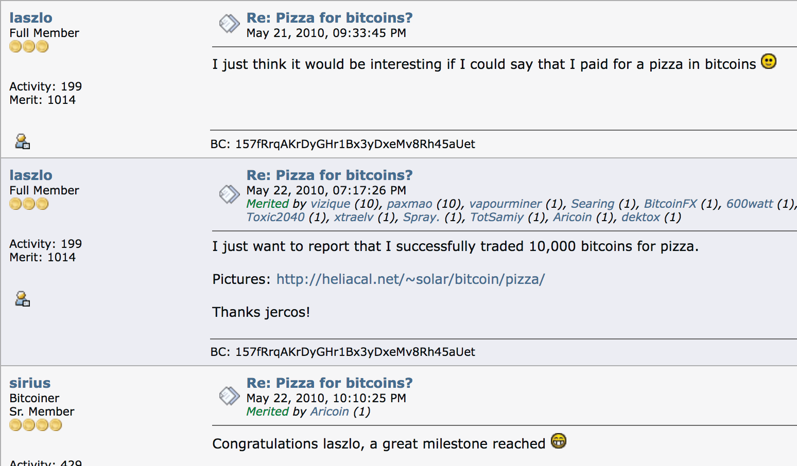

# Chapter 1

# Почему нам нужен Биткоин

## ОН НАМ НУЖЕН, ПОТОМУ ЧТО ДЕНЬГИ ИСПОРЧЕНЫ

> *`Основная проблема с обычными деньгами
>заключается в том, что для их работы
>требуется большое доверие. Нужно доверять
>центральному банку, что он не обесценит валюту,
>но история фиатных валют полна
>нарушений этого доверия. Нужно доверять
>банкам, что они будут хранить наши деньги и
>переводить их в электронном виде, но они выдают
>их в виде волн кредитных пузырей, имея едва ли
>малую часть в резерве. Мы должны доверять им
>нашу конфиденциальность, доверять им, что они не позволят
>ворам личных данных опустошить наши счета.`*

~ Сатоши Накамото 2009-02-11

* Фиатная денежная система сломана (всегда была).
* Она неустойчива (никогда не была).
* Нет способа ее исправить (никогда не будет).

---
## (НЕ) ЗОЛОТОЙ СТАНДАРТ
* Многие люди до сих пор верят, что деньги обеспечены
золотом.
* Это не так.
* Они не были обеспечены золотом с 1971 года, когда
президент Никсон в одностороннем порядке снял мир с
золотого стандарта ("шок Никсона").
* Посмотрите **wtfhappenedin1971.com**, чтобы получить четкое представление
о том, какой ущерб это нанесло.

График, показывающий инфляцию индекса потребительских цен (красная линия) в сравнении с
покупательной способностью доллара США (черная линия) с 1971 года.

<small>Бюро статистики труда США, получено с FRED, Федеральный резервный банк Сент-Луиса; https://
fred.stlouisfed.org/series/CPIAUCSL, 9 июня 2024 г.</small>

* Забавный факт: Всемирный экономический форум был сформирован в 1971 году.
---

>**ФИАТ:** (существительное) /ˈfiː.æt/
>
>: авторитетный или произвольный приказ: ДЕКРЕТ
>
>: авторитетное определение: ДИКТАТ
>
>**: команда или акт воли, который создает что-то без
>или как будто без дальнейших усилий**

~ merriam-webster.com/dictionary

>**ФИАТ:** от латинского fieri «быть сделанным, возникнуть»

* Фиат - это деньги, которые имеют ценность только потому, что правительство говорит (постановляет), что это так.
* Поэтому люди (должны) верить, что это так.
>* **Даже если они не верят, что фиат имеет ценность, по закону они
вынуждены использовать его и принимать в качестве оплаты за
товары и услуги.**
* **Фиатные деньги печатаются/создаются из воздуха.**
* В наши дни около 5% всех долларов печатаются в виде
наличных.
* Остальные 95% создаются в цифровом виде банками, вводящими
цифры в компьютер при выдаче кредитов

>*Бюро гравировки и печати тратит всего несколько центов на производство 100-долларовой купюры…*

~ Американский экономист, Барри Айхенгрин

---

>***Скотт Пелли из NBC '60 Minutes':*** *Справедливо ли сказать, что вы
>просто наводнили систему деньгами?*
>
>***Председатель ФРС Джером Пауэлл:*** *Да. Мы сделали это.
>Это еще один способ думать об этом. Мы сделали это.*
>
>***Пелли:*** *Откуда они берутся?
>Вы просто печатаете их?*
>
>***Пауэлл:*** *Мы печатаем их в цифровом виде. Так что, как центральный банк, мы
>имеем возможность создавать деньги в цифровом виде. И мы делаем это
>покупая казначейские векселя или облигации для других государственных
>обеспеченных ценных бумаг. И это на самом деле увеличивает
>денежную массу. Мы также печатаем настоящую валюту и мы
>распространяем ее через банки Федеральной резервной системы.*

~ Интервью CNBC '60 Minutes', 17 мая 2020 г.
Через два месяца после начала локдауна C*vid-19

>Действительно, нет никаких ограничений на то, что мы можем делать
с этими кредитными программами, которые у нас есть.

~ Председатель ФРС Джером Пауэлл
18 марта 2020 г. на CBS News

>Да, в Федеральном резерве есть бесконечное количество наличных денег. Мы сделаем все, что нужно, чтобы
убедиться, что в банковской системе достаточно наличных денег.

~ Нил Кашкари, президент Федерального резервного банка Миннеаполиса
23 марта 2020 г., CBS '60 Minutes'

>Под "мы" здесь подразумеваются пять человек, голосующих за изменения в
денежно-кредитной политике в рамках системы Федеральной резервной системы
во время заседаний FOMC. 5 из 330 000 000.
Этого достаточно, чтобы изменить денежно-кредитную политику США.

~ @MartyBent, основатель TFTC.io
Статья в Forbes, 18 марта 2020 г.

---

## ИЗ УСТ САМОГО КОНЯ ИЗ СТАРИНЫ

>*Банк имеет выгоду от процентов на все деньги,
которые он создает из ничего.*

*~ Уильям Патерсон, 1694 г.
Основатель Банка Англии*

>*Все недоумения, смятение и бедствия в Америке возникают,
не из-за недостатков Конституции или Конфедерации,
не из-за недостатка чести или добродетели,
а скорее из-за явного невежества в
природе монеты, кредита и обращения.*

*~ Джон Адамс
2-й президент Соединенных Штатов, 1797-1801 гг.*

>*Я считаю, что банковские учреждения более
опасны для наших свобод, чем постоянные армии.
Они уже создали денежную аристократию,
которая бросила вызов правительству.
Право на выпуск денег должно быть отнято у банков и
возвращено народу, которому оно по праву принадлежит.*

*~ Томас Джефферсон
3-й президент Соединенных Штатов, 1801-1809 гг.*

>*Хвастаясь нашими благородными делами, мы старались скрыть неприятный
факт, что с помощью несправедливой денежной системы мы национализировали
систему угнетения, которая, хотя и более утонченная,
не менее жестока, чем старая система рабства.*

~ Гораций Грили
Член Конгресса США 1848-49 гг.
Основатель The New York Tribune

---

>*Тот, кто контролирует объем денег в любой стране, является
абсолютным хозяином всей промышленности и торговли…
когда вы поймете, что вся система очень легко контролируется, так или
иначе, несколькими влиятельными людьми наверху, вам не нужно будет
говорить, как возникают периоды инфляции и депрессии*

~ Джеймс А. Гарфилд
20-й президент Соединенных Штатов, март-сент. 1881 г.
Убит в 1881 г.

>*Сегодня существует бесконтрольная в руках группы людей
сила делать доллары из ничего.*

~ Томас У. Лоусон, автор книги "Безумные финансы", 1905 г.

>*Я был таким же скрытным - действительно, таким же уклончивым, - как и любой заговорщик.
Мы знали, что обнаружение просто не должно произойти, иначе все наше время
и усилия будут потрачены впустую. Если бы стало известно, что наша
конкретная группа собралась вместе и написала банковский законопроект, этот
законопроект не имел бы никаких шансов быть принятым Конгрессом.*

~ Фрэнк А. Вандерлип
Президент National City Bank of New York
(предшественник Citi Bank)
~ Пишет в 1935 году о секретной встрече, которая состоялась на
острове Джекилл в 1910 году, чтобы разработать законопроект, который был принят в качестве
Закона о Федеральной резервной системе в 1913 году.

>*Этот (Закон о Федеральной резервной системе) устанавливает самый гигантский траст на
земле. Когда президент (Вудро Вильсон) подпишет законопроект,
невидимое правительство денежной власти будет узаконено…
Худшее законодательное преступление века совершается
этим законопроектом о банковском деле и валюте.*

~ Чарльз А. Линдберг-старший
Член Конгресса США 1907-1917 гг.

---

>*Я самый несчастный человек. Я невольно погубил свою страну.
Великая индустриальная нация контролируется своей системой кредитования.
Наша система кредитования сосредоточена. Рост нации,
следовательно, и вся наша деятельность находятся в руках немногих людей.
Мы стали одним из худших управляемых, одним из самых
полностью контролируемых и доминируемых правительств в цивилизованном
мире. Больше не правительство свободного мнения, больше не
правительство убеждений и голосов большинства, а
правительство мнения и принуждения
небольшой группы доминирующих людей.*

~ Вудро Вильсон
28-й президент Соединенных Штатов, 1913-1921 гг.
Через 6 лет после принятия Закона о Федеральной резервной системе 1913 года.

>*Реальная правда в том, как вы и я знаем,
что финансовый элемент в крупных центрах
владеет правительством США с
времен Эндрю Джексона.*

~ Франклин Д. Рузвельт
32-й президент Соединенных Штатов в письме, написанном
21 ноября 1933 года полковнику Э. Манделлу Хаузу

>*Это [депрессия] не было случайностью.
Это было тщательно спланированное событие…
Международные банкиры стремились создать
условие отчаяния здесь, чтобы они могли
стать нашими правителями.*

~ Член Конгресса Луи Т. Макфадден,
Убит в 1936 году

>Председатель комитета Палаты представителей по банковскому делу и валюте
*Каждый раз, когда банк выдает кредит,
создается новый банковский кредит - новые депозиты - совершенно новые деньги.*

~ Грэм Ф. Тауэрс
Губернатор Центрального банка Канады, 1934-55 гг.

---

>*Если бы в нашей денежной системе не было долгов,
не было бы никаких денег*

*~ Марринер Экклз,
1941 г., губернатор ФРС*

>*У меня еще никогда не было никого, кто мог бы с помощью
логики и разума оправдать Федеральное правительство
заимствование собственных денег…
Я верю, что придет время, когда люди
потребуют, чтобы это было изменено.
Я верю, что в этой стране наступит время, когда
они действительно обвинят вас и меня и
всех остальных, связанных с Конгрессом,
за то, что они сидят без дела и позволяют
продолжаться такой идиотской системе.*

~ Райт Патман
Член Конгресса США 1928-1976 гг.
Председатель комитета по банковскому делу и валюте 1963-1975 гг.

>*Когда вы или я выписываем чек, на нашем
счете должно быть достаточно средств, чтобы покрыть чек, но когда Федеральная резервная система выписывает чек,
нет банковского депозита, на который выписан этот чек. Когда
Федеральная резервная система выписывает чек, она создает деньги*

~ Федеральный резервный банк Бостона
"Говоря проще", 1984 г.

---

## ФЕДЕРАЛЬНАЯ РЕЗЕРВНАЯ СИСТЕМА

* ФРС - это "независимый" центральный банк
США. Он был создан в 1913 году с принятием
Закона о Федеральной резервной системе.
* Он имеет уникальную структуру, частично частную и частично
государственную.
* Предполагается, что это политически независимая,
непартийная организация в составе правительства.
* В то время как Совет управляющих ФРС назначается
Президентом и утверждается Конгрессом, **решения
ФРС не нужно утверждать
никому.**

**Он состоит из:**

* Совет управляющих Федеральной резервной системы
* 12 банков Федеральной резервной системы
* Федеральный комитет по операциям на открытом рынке (FOMC),
который является органом, определяющим денежно-кредитную политику.

**ФРС отвечает за:**

* Контроль над денежно-кредитной политикой США, содействие занятости и стабильным ценам.
* Регулирование и надзор за банковскими и финансовыми
учреждениями.
* Предоставление платежных услуг финансовым учреждениям.
* Содействие защите прав потребителей и развитию сообществ.

---

## ЗАМЕТКА О ПРЕДСЕДАТЕЛЕ ФРС

* **Председатель Федеральной резервной системы также является:**

* Председателем Федерального комитета по операциям на открытом рынке
(FOMC), который принимает решения о направлении денежно-кредитной политики США
(например: QE, повышение процентных ставок)
* Членом Международного валютного фонда,
МВФ
* Членом Банка международных
расчетов, БМР (банка центральных банков).
* Министром финансов США в G-7
* Министром финансов США в G-20

* **Целая** куча власти для одного человека.

---

## ЧАСТИЧНОЕ БАНКОВСКОЕ РЕЗЕРВИРОВАНИЕ, ПРОЦЕНТЫ И КРЕДИТЫ

* **Частичное банковское резервирование:** До марта 2020 года банки
должны были держать резерв в размере 10% и могли
выдавать кредиты на 90%.
* **С марта 2020 года нет никаких требований к резерву, что позволяет банкам выдавать неограниченные кредиты.**

* Кредит - это деньги, основанные на долге, и вы должны
платить проценты по кредиту.

>* **Забавный факт 1:** Деньги для выплаты процентов по
>кредиту НЕ создаются банками.
>* **Забавный факт 2:** Он НИКОГДА не создается.
>* **Забавный факт 3:** В мире НЕДОСТАТОЧНО денег, чтобы
>выплатить все кредиты + проценты по этим кредитам.
>* **Забавный факт 4:** И никогда не будет!

---

## ЗАМЕТКА О НЕФТЕДОЛЛАРЕ
* Можно сказать, что **до 1971 года доллар был обеспечен
золотом, а с 1974 года - нефтью,
и, следовательно, по умолчанию, армией США.**
* **В 1974 году США и Саудовская Аравия заключили двусторонние соглашения о ценообразовании на продажу нефти в долларах США.**
* С тех пор большинство мировых продаж нефти рассчитываются в
долларах США.
* Это в значительной степени способствовало тому, что доллар стал
самой сильной валютой в мире.
* **Таким образом, он был искусственно поддержан,** даже во время
времена, когда ему обычно было бы трудно.
* С конца 2022 года ряд стран
начали торговать в валютах, отличных от доллара США
* Вполне возможно, что это может быть началом
конца нефтедоллара. Что будет дальше,
еще предстоит увидеть…

---

## ОБ ОП (КОЛИЧЕСТВЕННОЕ СМЯГЧЕНИЕ)
* **Количественное смягчение считается "нетрадиционной
денежно-кредитной политикой", используемой центральными банками для "стимулирования
экономики", при которой ФРС покупает государственные
облигации и другие государственные ценные бумаги.**
* Впервые он был использован Японией в период с 2001 по 2006 год.
После этого США, Великобритания и Еврозона использовали
QE во время финансового кризиса 2008 года
* С тех пор единственное время, когда в США не было программы QE,
было в период с 2014 по 2019 год.
* Как видно ниже, критики утверждают, что **QE
в подавляющем большинстве случаев приносит пользу уже богатым**

*Кредит: @RudyHavenstein в Твиттере*

---

## ЦИКЛЫ

* **Во всей природе есть циклы, естественные приливы и
отливы, расширения и сокращения.**

* Это **способствует общему балансу во времени
и устойчивости** всей взаимосвязанной
системы, всей жизни на земле.
* **Долговая система фиатной валюты игнорирует
мудрость естественных циклов,** и вместо этого основана на,
и на 100% зависит от ее выживания, беспрецедентного
и безграничного роста, чтобы продолжать
обслуживать свои долги.
* В природе это рак.
* В "экономике" эта неестественная траектория еще больше
поддерживается правительством, спасающим терпящие бедствие
банки и крупные компании, а не позволяющим им
рухнуть и быть переработанными во что-то новое, что-то более здоровое.
* **Близорукость спасения терпящих бедствие компаний ставит под угрозу всю экономику.** По сути,
это просто откладывание решения проблемы на потом, и неизбежные потрясения, которые ждут впереди, скорее всего, будут гораздо, гораздо
более интенсивными, чем если бы естественным циклам было позволено
развернуться
* **Мы в долгу перед Сатоши Накамото и перед
шифропанками до и после него,** за то, что у них есть
видение, предвидение, решимость и умение предоставить
спасательную шлюпку, чтобы доставить нас к новым берегам.

---

* Как только мы осознаем, какой это дар, нам решать,
прыгать ли на борт, с полным сердцем и ясным умом,
совершить путешествие и построить новый мир с Деньгами
Мира.
>* **Биткоин исправляет деньги, нам решать, что делать с остальным.
И, чтобы было ясно, с исправленными деньгами, МНОГОЕ
другое будет исправлено, по умолчанию**

* Главное из них - это то, что крупномасштабная, инициированная правительством кинетическая война больше не будет прибыльной или возможной без поддержки народа.
* Кроме того, естественным образом будет меньше потребления,
а также переход на товары и услуги с реальной стоимостью, свободные рынки, реальные сбережения и демонетизация
жилья и недвижимости, которые никогда не предназначались для
монетизации в первую очередь.
* **СМ.:** Биткоин исправляет это, стр. 32
---

## ОН НАМ НУЖЕН, ПОТОМУ ЧТО ИНФЛЯЦИЯ - ЭТО КРАЖА

График FRED за 2024 год, показывающий снижение покупательной способности
доллара с момента образования Федеральной резервной системы в
1913 году. Совокупный уровень инфляции с 1913 года составляет около
3,067%. Все фиатные валюты центральных банков по всему миру
следуют аналогичному темпу снижения.

* **Чем больше денег создается из воздуха,
тем больше все деньги теряют в цене/покупательной способности.**
* Это называется **инфляцией.**
* Инфляция - это **кража времени,** в буквальном смысле. Ценность вашего
времени украдена, когда вы сохраняете его в валюте, которая
инфлирует, обесценивается и манипулируется.
* Инфляция - это также **скрытый налог**.

---

* Эта кража времени и налог затронули также все другие
фиатные валюты стран, поскольку все они были
привязаны к доллару США, поскольку он является
мировой резервной валютой со времен Бреттон-Вудского соглашения
в 1944 году.
* **В США ежегодный уровень инфляции в размере 2% записан в
мандат Федеральной резервной системы.**
* Это означает, что **вам ГАРАНТИРОВАНО, что вы сможете
купить на 2% МЕНЬШЕ** за те же 20 долларов каждый год.
* **В марте 2024 года годовой уровень инфляции составил 3,5%,**
(намного больше, чем 2%, что означает, что вы потеряли 3,5%
своей покупательной способности в период с марта 2023 года по
март 2024 года.
* Другими словами, это означает, что в среднем цены на вещи
выросли на 3,5%
* **Если бы инфляция измерялась точно, как это
делалось до начала 1980-х годов, она была бы фактически
ближе к 10% в 2024 году.**
* Если рассматривать по категориям, то видно, что
инфляция намного хуже, чем 3,5%, во многих
категориях за последний год.
* Когда человек смотрит на свою арендную плату, счета за продукты, цены на газ,
почти все, что он покупает, становится совершенно ясно, что
инфляция свирепствует во всех секторах

---
**Средняя инфляция за
последние 50 лет в США:**

|  Средняя стоимость  |  1971  |  2021  |   % Увеличение  |
| --- | --- | --- | --- |
|   Зарплата  |   $9,400 |   $59,400 |   532% |
|   Дом  |   $23,400 |   $513,000 |   2,092% |
|    Галлон бензина | 0,36 $  |  4,17 $ |  1,058%  |
|    Новый автомобиль |  3,400 $  |  47,000 $  |   1,282% |
|   Степень колледжа  |   1,400 $  |  26,000 $  |  1,757%  |
|   Корзина продуктов  |20 $  | 210 $ |   950% |
|   Электричество/кВтч  |  0,02 $  |  0,15 $  |  650%  |

>**Реальная история:**
~ Дом был куплен в 1976 году за 58 000 долларов.
~ С учетом "официальной" инфляции это составило бы
279 000 долларов в долларах 2022 года.
~ В 2022 году тот же дом был оценен в 2,09 миллиона долларов.
~ Задумайтесь над этим…

>*Фиатная валюта - это дезинформация.
Какую информацию несет 10-долларовая купюра?
10 - это числитель дроби, у которой
отсутствует знаменатель.
10 из чего?
10 ничего не говорит без известного
и стабильного знаменателя.*

~ @bitlany

---

* **По мере роста инфляции ваши сбережения (если вам повезло
иметь сбережения) теряют ценность.**
* Со временем они теряют **МНОГО** ценности
>*Если бы вы начали откладывать 100 долларов в месяц сегодня, с
>лучшей доступной процентной ставкой 0,05%:
> * Через 30 лет вы бы сэкономили **84 019 долларов.**
>* С поправкой на установленную ФРС инфляцию в 2%
>* Через 30 лет ваши сбережения будут иметь эффективную
покупательную способность всего **46 384 доллара.**
>* С поправкой на сегодняшнюю инфляцию в 3,5%:
>* Ваши сбережения в размере 84 019 долларов будут иметь
покупательную способность всего **11 037 долларов** через 30 лет!

* **Фактически, это означает, что примерно шесть из
семи часов вашей работы были украдены = *Кража
времени.***

---
**Другой способ взглянуть на это - следующий:**
* В **1971 году** стоимость дома = **2,5** раза средней
годовой зарплаты.
* В **2024 году** стоимость дома = **8,6** раза
средней годовой зарплаты.
* В **1971 году** новый автомобиль стоил около **1/3** от средней зарплаты
* В **2024 году** новый автомобиль стоит более **3/4** от средней зарплаты.

Я уверен, что теперь ясно, что
инфляция
* **не** *
работает в вашу пользу.

**Примечание:** Все эти цифры являются средними и переменными в зависимости
от многих факторов. Суть остается прежней: инфляция - это скрытый налог
и кража времени нашей реальной работы и производства

>* **Твердые деньги это исправляют.**
>* **Биткоин - это твердые деньги**
---

## НАМ НУЖНО ЗАМЕНИТЬ ЦЕНТРАЛИЗОВАННО КОНТРОЛИРУЕМУЮ, МАНИПУЛИРУЕМУЮ, ДОЛГОВУЮ ЭКОНОМИКУ

>*Я не верю, что у нас когда-нибудь снова будут хорошие деньги,
прежде чем мы вырвем это из рук правительства,
то есть мы не можем вырвать их насильно из рук
правительства, все, что мы можем сделать, это каким-то хитрым окольным путем
ввести что-то, что они не могут остановить.*

~ Фридрих Хайек, 1984 г.
Австрийский экономист, философ и писатель, 1899-1992 гг.

График, показывающий экспоненциальное увеличение денежной массы M1 с
4 триллионов долларов в марте 2020 года до более чем 18 триллионов долларов в июне 2024 года.

* **Поразите свой разум здесь:** https://usdebtclock.org/
---
* **45% всех долларов США, существующих в обращении, было
напечатано в период с апреля 2020 года по январь 2022 года!**
* Напечатано из воздуха, помните?
* Фиатные деньги централизованно контролируются государством, и
предложение легко манипулируется.
* **Потребовалось 205 лет, чтобы государственный долг США достиг
1 триллиона долларов. (1776 > 1981)**
* Потребовалось всего **33 года, чтобы** государственный долг США
достиг **34 триллионов долларов!** (1981 > 2024)

График FRED, показывающий общий государственный долг США в период с 1970 по 2024 год.

>*Общий долг, измеренный Институтом
международных финансов, в настоящее время составляет 303 ТРИЛЛИОНА долларов.
Это наша планета, живущая на долговом фиате.
Кстати, мировой ВВП составляет всего 84 триллиона долларов.*

*~ Ник Бхатиа, автор книги "Многослойные деньги", 2021 г.*

---

* **Для справки**

| **Если у вас есть:** | **Вы можете тратить 1 доллар в секунду** |     |
| ------------ | ----------------------- | -------------- |
| **1 миллион долларов**  | или 11 дней         | = 11 дней  |
| **1 миллиард долларов**  | в течение 11 680 дней         | = 32 года  |
| **1 триллион долларов** | в течение 11 680 000 дней   | = 32000 лет |

* Мы все находимся во власти тех, кто имеет право
решать, когда печатать больше и какие процентные ставки
взимать.
* **Если ФРС повысит процентные ставки, то получить
кредит на дом или автомобиль внезапно станет дороже,
что замедлит расходы, приведя к стагфляции**

* **Если они будут поддерживать ставки искусственно низкими, мы войдем в
период депрессии**

>* **Позволяя центральному банку создавать финансовую
"погоду", лишает нас свободы позволить рынку решать, что имеет ценность, а что нет.**

* Кроме того, **когда они спасают банки и корпорации, они искусственно поддерживают экономику.** Это всего лишь
вопрос времени, когда карточный домик рухнет.
* Первоначальный аргумент в пользу наличия центрального банка заключался в том,
что должен быть Кредитор последней инстанции, когда
экономика пошатнется.

---
* **Это превратилось в то, что центральный банк является Правителем
Первой инстанции, с беспрецедентной, неизбранной, в конечном счете
авторитарной властью.**

> *Все деньги политические, кроме Биткоина.
Фиатные валюты, банковские инструменты, финтех-кредиты,
другие криптовалюты и даже золото - все это контролируется
правительствами, корпорациями или небольшими группами.
Наличие исключения окажется очень полезным
по мере того, как мы будем двигаться в будущее.*

*~ Алекс Гладштейн @gladstein
Директор по стратегии Фонда защиты прав человека*

>*Биткоин связывает 8 миллиардов человек, связывает
сотни миллионов компаний, он синхронизирует мир
через политические юрисдикции и возвращает рациональность
всю финансовую систему, и он возвращает свободу и
права собственности всему человечеству*

*~ Майкл Сэйлор
Генеральный директор Microstrategy*

---

## НАМ НУЖНО ОКАЗАТЬ БАНКОВСКИЕ УСЛУГИ НЕОБАНКОВАННЫМ

>*Для 953 миллионов человек в 20 странах с ослабевающими
валютами Биткоин представляет собой нечто большее, чем
казначейский актив. Для них это больше похоже на ковчег
зашифрованной энергии, чтобы спастись от потопа.*

*~ Майкл Сэйлор
Генеральный директор Microstrategy*

* **По состоянию на 2024 год, примерно 25% взрослых в
в мире не имеют банковских счетов, около 1,4 миллиарда человек!**

>* **Это означает, что у них нет доступа к банковским услугам
>и они не могут использовать банкоматы, дебетовые карты, кредитные карты или
>чеки.**
>* **Кроме того, они не могут получить кредиты для открытия
бизнеса, покупки автомобиля или дома и т.д.**

* **Отправлять и получать деньги или обналичивать чеки
дорого.**

* Им приходится пользоваться службами денежных переводов и обналичивания чеков,
такими как Western Union, которые взимают высокие ставки
и требуют времени на обработку.

* Это **особенно дорого для людей, отправляющих деньги
домой своим семьям** в другие страны (денежные переводы),
которые могут стоить до 10% или 12% через банк

---
* Это **дорого и отнимает много времени у тех, кто получает денежные переводы,** так как им нужно платить за транспорт и
ходить в офис денежных переводов, часто далеко от того места,
где они живут, чтобы получить деньги, которые отправил член их семьи.

* Зачастую им небезопасно ездить в эти
офисы.
* Биткоин, через сеть Lightning, предоставляет
мгновенное решение этих проблем сейчас!

***#bitcoin исправляет это***
>*Когда-нибудь останавливали ли технологию, которая расширяет
возможности людей?*

*~ Джефф Бут
Автор: Цена завтрашнего дня*

---

## НАМ НУЖНО ПОМОЧЬ ЛЮДЯМ СПАСТИСЬ ОТ ТИРАНИИ И ОБВАЛА ВАЛЮТЫ

* Как мы видели, за последние пару лет,
правительства могут и замораживают банковские
счета тех, с кем они не согласны.

>* **Это показывает, что, по сути, ваши деньги в банке
- это не что иное, как расписка, которую у вас могут украсть
в любое время.**

* Кроме того, когда инфляция свирепствует, как мы
в настоящее время видим в 2024 году в Венесуэле (283%), Судане
(63%), Ливане (212%), Сирии (79%),
Аргентине (161%), Зимбабве (47%), Турции
(64%) и другие, жизненные сбережения людей
испаряются, иногда в одночасье, и с этим
ничего нельзя поделать.
* Для людей, испытывающих что-либо из вышеперечисленного, **биткоин
становится реальным, немедленным решением
иной неразрешимой проблемы.**

# Chapter 2

# ИСПРАВЛЯЕТ ЭТУ ФИНАНСОВУЮ ИНКЛЮЗИВНОСТЬ
* **С биткоином у каждого есть доступ к *одной и той же*
финансовой системе, с *одинаковыми* правилами для всех.**
* Никаких лазеек, задних дверей или специальных предложений
для кого-либо.
* У каждого есть потенциал получить компенсацию за
ценность, которую он предоставляет, теми же реальными деньгами,
созданными и поддерживаемыми по одним и тем же правилам.
* **Биткоин доступен любому, в любом месте, где есть
подключение к интернету.**

## ДОБАВЛЯЯ ЦЕННОСТЬ МИРУ
* **Биткоин стимулирует людей добавлять реальную ценность
сообществу и рынку,** поскольку это единственный
способ заработать больше денег
* Если кто-то доволен меньшим, он все равно выигрывает, работая за справедливую оплату, и **когда он экономит, эти сбережения сохраняют свою ценность с течением времени.**

---
## ИСПРАВЛЯЕТ ЭТУ ЭКОЛОГИЮ
* Здоровые деньги с жестко ограниченным предложением создают
совершенно иную динамику, чем та, что создается
долговой, неограниченной печатью денег, которую мы
наблюдаем сегодня.
* Вместо неудержимого стремления потреблять все
больше и больше, в гонке ко дну, чтобы выплачивать
сложные процентные ставки по кредитам и долгам,
которые в конечном итоге никогда не будут погашены, **биткоин
предлагает выход в мир, где стремятся к низкой временной
предпочтительности.**
>* Безудержное разрушение окружающей среды **заменяется
меньшим потреблением, меньшим количеством отходов и
взвешенным подходом к производству,** где
рынок решает, что имеет истинную ценность, и
поэтому вещи строятся на века.
* Это чистая выгода для людей, растений и животных!
---
## ИСПРАВЛЯЕТ ЭТУ ВОЙНУ
* Неограниченная печать фиатной денежной
системы - это то, что делает "вечные войны" возможными и
прибыльными.
* Поскольку люди в основном не в курсе того, как
работают военные расходы или откуда берутся деньги на войну,
правительство практически не несет ответственности.
Войны могут затягиваться на
годы в отдаленных местах без реального надзора.
* Начиная с Вьетнама, войны стали "войнами по кредитной
карте" (спасибо @AlexGladstein), поскольку
правительство берет деньги в долг для финансирования войн, а
затем берет больше денег в долг, чтобы выплачивать проценты по
первоначальным кредитам... повторяйте снова и снова.
>* **В биткоин-стандарте потребуется, чтобы
люди страны были готовы помочь заплатить за
войну. Вероятно, они сделали бы это только в том случае, если бы это было
абсолютно и совершенно необходимо для защиты своих
семей и страны, с конечной целью в поле зрения.**
* Поскольку не будет никакой необоснованной прибыли,
правительственные чиновники и корпорации не будут
заинтересованы в продвижении или участии в войне в качестве
жизнеспособного варианта.
* **Значительно увеличатся усилия по поиску способов
прийти к мирным, недорогим решениям вместо этого.**
---
## ИСПРАВЛЯЕТ ЭТУ ВРЕМЕННУЮ ПРЕДПОЧТИТЕЛЬНОСТЬ

**Высокая временная предпочтительность:** Мгновенное удовлетворение, Нетерпение,
Краткосрочное планирование
**Низкая временная предпочтительность:** Отложенное удовлетворение, Терпение,
Долгосрочное планирование

* Высокая временная предпочтительность ведет к личным, общественным и
экологическим разрушениям. Когда наши деньги
обесцениваются каждый день, мы "вынуждены" быть
нетерпеливыми и тратить их как можно быстрее,
пока они не потеряют больше ценности.
* Когда наше время обесценивается постоянно инфлирующей фиатной
валютой, мы теряем связь с ценностью нашего
времени.
* Это приводит к разобщенности и скрытому
стрессу.
* Попытки облегчить стресс и найти смысл,
искажаются и становятся отвлекающими факторами, такими как
чрезмерное потребление наркотиков, алкоголя, походов по магазинам,
порнографии, фаст-фуда, короткая продолжительность концентрации внимания, зависимость
от экранов/социальных сетей, импульсивные решения и т. д.
* **Здоровые деньги, с другой стороны, которые сохраняют свою
ценность с течением времени и правильно измеряют наши
вклады посредством нашей работы, приводят к низкой временной
предпочтительности, вдумчивому качеству жизни, с
осмысленными отношениями, меньшим потреблением, более глубокой
связью, более глубоким разговором, долгосрочными
целями и возросшей креативностью.**
---

# Chapter 3

# ЧТО ТАКОЕ БИТКОИН?

>*“Описать эту штуку для широкой публики
чертовски сложно.
Ее не с чем сравнить.”*

~ Сатоши Накамото 2010-07-05

>*“Общий объем эмиссии составит 21 000 000
монет. Они будут распределяться среди узлов
сети (майнеров) при создании блоков,
причем количество будет уменьшаться вдвое каждые 4 года.
первые 4 года: 10 500 000 монет
следующие 4 года: 5 250 000 монет
следующие 4 года: 2 625 000 монет
следующие 4 года: 1 312 500 монет и т.д.
Когда они закончатся, система сможет поддерживать
комиссии за транзакции, если это потребуется. Она основана на
конкуренции открытого рынка, и, вероятно,
всегда будут узлы, готовые
обрабатывать транзакции бесплатно.”*

~ Сатоши Накамото 2009-01-09

* **Биткоин – это деньги свободы...** в том смысле, что он
обладает потенциалом освободить всех нас от всеобъемлющей
манипуляции и контроля со стороны централизованной банковской
системы
* **В биткоине денежные правила одинаковы для
ВСЕХ, ВЕЗДЕ.**
* Биткоин инклюзивен в том смысле, что любой, у кого есть
подключение к интернету, может участвовать в сети,
и **должен играть по одним и тем же правилам.**

---
## Биткоин это:
* **ДЕЦЕНТРАЛИЗОВАН**
* **ДЕЙСТВИТЕЛЬНО РЕДКИЙ**
* **УСТОЙЧИВ К ЦЕНЗУРЕ**
* **РАСПРЕДЕЛЕННЫЙ РЕЕСТР**
* **НЕПОДКУПНЫЙ**
* БЕЗ РАЗРЕШЕНИЙ
* ПОДДАЮЩИЙСЯ АУДИТУ
* ПРОЗРАЧНЫЙ
* НЕИЗМЕНЯЕМЫЙ
* БЕЗГРАНИЧНЫЙ
* СЛОЖНО ПОДДЕЛАТЬ
* ПСЕВДОНИМНЫЙ
* БЕЗ ТРЕНИЙ
* БЕЗ ДОВЕРИЯ
* ОДНОРАНГОВЫЙ
---
* Биткоин децентрализован.
* **Он работает на тысячах узлов по всему миру, тысячами людей, которые не знают друг друга.**
* Ни один человек, правительство или компания не может его
контролировать.
* Вы тоже можете запустить узел, это легко ;)
* Запуская свой собственный узел, вы повышаете свою
конфиденциальность и помогаете защитить сеть, когда
проверяете свои собственные транзакции.
> **Не доверяй. Проверяй**
---
* **Биткоин (с заглавной буквы "Б")** - это денежная сеть.
* **биткоин (со строчной буквы "б")** - это валюта или денежный актив, который выпускается и работает в сети Биткоин.

---
* **Биткоин - великий стимул.**
>* **Гений Сатоши заключался в том, что в биткоине впервые
и хорошие, и плохие участники заинтересованы в том, чтобы играть по правилам.**

> *“Стимул может помочь побудить
узлы оставаться честными.
Если жадный злоумышленник сможет собрать
больше доказательств работы центрального процессора, чем все
честные узлы, ему придется выбирать
между использованием их для обмана людей,
воруя обратно свои платежи,
или использованием их для создания новых монет.
Он должен найти более выгодным играть
по правилам, таким правилам, которые
благоволят ему больше новых монет, чем
всем остальным вместе взятым,
чем подрывать систему и
действительность своего собственного богатства.”*

~ Сатоши Накамото 2008-10-31

---
* **Биткоин - это первые цифровые деньги,** в отличие от
вашего онлайн-счета, который является всего лишь
цифровой формой фиатных денег центрального банка.
* Биткоин - это **децентрализованная** цифровая валюта.
* У Биткоина **нет центрального органа власти.**
* Биткоин **безгосударственный.**
* Подумайте о последствиях ...

>*Биткоин - это децентрализованная цифровая валюта, которая позволяет
мгновенно осуществлять платежи кому угодно, в любой точке мира.
Биткоин использует технологию одноранговой сети для работы без
центрального органа власти: управление транзакциями и эмиссия денег
осуществляются коллективно сетью.*

~ Википедия Биткоин
en.bitcoin.it

---
* Биткоин - это волшебные интернет-деньги.
* Если серьезно, **Биткоин - это способ, с помощью которого мы собираемся исправить
мир.**
* Серьезно? Да.
---
* **Биткоин - это способ передачи ценности**
 *  любого количества
 * безопасно
 * мгновенно (в сети Lightning Network)
 * между любыми двумя сторонами
 * в любое время
 * 24/7
 * в любом месте
 * да, в любом месте
 * Подумайте об этом.

 ---

>*С электронной валютой, основанной на криптографических
доказательствах, без необходимости доверять третьему
посреднику, деньги могут быть безопасными, а
транзакции - легкими.*

~ Сатоши Накамото 2009-02-11

---
>*Биткоин (почти) ничего не стоит для перемещения с уверенностью.
Я со 100% уверенностью знаю, что я получаю.*

~ Майкл Сэйлор, генеральный директор Microstrategy

* Вы можете отправить 1,13 доллара, или 46 центов, или 359 сатов, или 500 000 000
сатов, или 1 миллион долларов кому угодно, куда угодно, в любое время
через сеть Биткоин или сеть Lightning Network,
построенную на Биткоине.
* **И никто не может вас остановить.**
* Можете ли вы сделать это с золотом, серебром, USD/GBP/EUR/YEN/
CYK/ZAR или любой другой фиатной валютой центрального банка?

---
* **Биткоин - это историческое событие.** Это первый раз в истории, когда
была создана по-настоящему децентрализованная, устойчивая к цензуре, неизменяемая,
безграничная, не требующая разрешений и неподкупная денежная система с абсолютным жестким ограничением (21 миллион
монет)
>* Биткоин **имеет такое же значение для децентрализации власти
и расширения финансовой доступности,** как изобретение
печатного станка, а позже и Всемирной паутины, **для децентрализации контроля и
расширения доступа к информации.**

>*Многие люди автоматически
отвергают электронную валюту как безнадежное дело
из-за всех компаний, которые потерпели неудачу
с 1990-х годов.
Надеюсь, очевидно, что только
централизованный характер этих
систем обрек их на провал.
Я думаю, что это первый раз, когда мы пробуем
децентрализованную систему, не основанную на доверии.*

~ Сатоши Накамото 2009-02-15
---
* **Биткоин - это распределенный, децентрализованный, прозрачный
и неизменяемый РЕЕСТР СЧЕТОВ.**
* Любой в мире может видеть, кому что принадлежит, в любой
момент времени, и это нельзя изменить.
* За исключением того, что "кто" - это не имя, **а адрес,
состоящий из цифр и букв.**
>* Пример биткоин-адреса:
**bc1qar0srrr7xfkvy5l643lydnw9re59gtzzwf5mdq**

* Поэтому биткоин **псевдонимный.**
---
* **Биткоин - это**
* беспристрастный эмитент активов
*  средство сбережения
* средство обмена
* и вскоре станет расчетной единицей
*  **а также**
* **средство** обмена.

* Это эмитент, золото, наличные, дебетовая карта И
paypal, банк, venmo, cashapp, western union

**ВСЕ В ОДНОМ!**

---
* **Биткоин - это хранитель записей, который использует математику и
информатику, вместо банкиров, бухгалтеров
и счетоводов.**
* Он устраняет посредников, банки, правительства, комиссии за овердрафт,
комиссии за ведение счета, ограниченное время обслуживания,
возможность цензуры, замороженные счета, манипуляции с денежной массой, процентные ставки, МВФ,
ВЭФ, БМР, физические здания, банкоматы,
чеки, возвратные платежи, нефтедоллар, евровалюта,
банковский сеньораж, эффект Кантильона,
частичное резервирование, visa, mastercard, amex,
western union, дни ожидания прохождения вашего банковского перевода ...

>* **Вместо того, чтобы кто-то стоял между вами и
>человеком, которому вы хотите пожать руку, вы можете просто
>пожать ему руку напрямую.**
>* **Не нужно спрашивать разрешения на отправку собственных
>денег!**
---

## Проще говоря…
* **Биткоин - это цифровая собственность, которую никто не может у вас отнять.**
* >Владение биткоином означает владение правом отправлять ценность
с определенного адреса, который вы контролируете с помощью
вашего личного ключа, на ЛЮБОЙ другой адрес, который вы выберете.

*Биткоин - это право собственности, которое не зависит от
монополии на насилие.*

~ Роберт Бридлав @breedlove22

---

* **Биткоин - это событие, происходящее раз в жизни вида.**
* Биткоин - это выбор.
* Биткоин **способствует суверенитету.**
>* **Открытие Биткоина 15 лет назад имеет такое же значение
для человеческой финансовой свободы и суверенитета, как
открытие огня для процветания человечества более
500 000 лет назад, а печатный станок - для
децентрализации доступа к человеческим знаниям почти
900 лет назад.**

---
* **Биткоин - это настоящее средство сбережения.**
* Он хранит ваш самый ценный ресурс, ваше время,
таким образом, что вы можете получить к нему доступ позже.
>*Биткоин подобен высокоскоростному каналу энергии к вашему
будущему "я"... вы можете работать сегодня, а Биткоин глубоко
заморозит вашу энергию для последующего использования.*

~ Роберт Бридлав

>*Корень денег - время
А корень времени - ценность*

~ Гай Свонн

---
* Биткоин - это временная цепочка, в буквальном смысле.
* Сатоши много раз упоминал о временной цепочке в
своих электронных письмах ранним разработчикам.
* Вы можете измерять время в блоках, так как один блок
добывается примерно каждые 10 минут.
>* **Наше время - наш самый дефицитный и ценный ресурс.**
>* **Это наша буквальная жизненная сила.**
>* **Настоящие деньги позволяют нам сохранять наше время.**

* Это способ, которым мы можем признать время, которое мы "потратили".
* Мы **обмениваем наше время на деньги, которые являются просто записью
нашего времени и усилий.**
* **Биткоин позволяет нам сохранить наше время таким образом,
чтобы мы имели "доступ" к нему позже в жизни, когда
мы больше не сможем работать так, как раньше.**
---
* Биткоин - это **средство сбережения.**
* Биткоин - это **средство обмена.**
* Биткоин **однажды станет расчетной единицей.**
* Биткоин **однажды станет *ГЛАВНОЙ расчетной единицей.***
---
* **Биткоин - это дефицит**
* У него жесткий лимит в 21 000 000.
* Больше никогда не будет.
* Код - это закон здесь.*

*Хотя "технически" можно изменить
код, гений Сатоши предотвращает это, поскольку увеличение
(инфляция) предложения приведет лишь к снижению
стоимости всех биткоинов в обращении. Поэтому это
стимулирует всех неявно согласиться поддерживать
жесткий лимит предложения в 21 000 000.

* Загляните на **timechaincalendar.com** от @TC, чтобы проверить
текущую высоту блока, доступное предложение и
многочисленные другие показатели, касающиеся биткоин
временной цепочки.
---
* **Биткоин бесконечно делим, не обесценивая
предложение.**
* **Одна пицца - это одна пицца, независимо от того, насколько малы
кусочки.**
* В настоящее время он делится до восьмого
десятичного знака: 1.00000000
* В 1 биткоине 100 000 000 сатоши.
* 1 сатоши = 0.00000001
* Вы можете купить саты (сатоши) в любом количестве.
---
* **Биткоин - самые надежные и надежные деньги, которые мы когда-либо
знали.**
* Он даже надежнее золота, поскольку золото нелегко
разделить или перенести, имеет низкую скорость (движется медленно)
и его нелегко проверить
* **Биткоин обладает наилучшими денежными свойствами
из всех известных активов.**

**СРАВНИТЕЛЬНАЯ ТАБЛИЦА СВОЙСТВ НАДЕЖНЫХ ДЕНЕГ**

ПРИМЕЧАНИЕ: Это общий обзор, есть нюансы, которые не
рассматриваются в таблице.

---
* **Биткоин - это противоядие.**
* Попытки "стабилизировать" экономику с помощью финансовой помощи,
печатания денег, количественного смягчения и манипулирования процентными ставками - это
все равно что поддерживать ее на искусственном жизнеобеспечении
* Эта "машина" может работать только до тех пор, пока не станет все более и более дорогостоящей в обслуживании, и все
менее и менее устойчивой, что приведет к серьезной поломке.
* **Биткоин это исправляет**
* **Биткоин - лучшие деньги**
---
* **Биткоин - антихрупкий.**
* И он становится все более и более антихрупким с каждой попыткой атаки,
с каждым правительственным запретом, с каждой частью FUD (страх, неуверенность, сомнение) в основных средствах массовой информации.
>* Биткоин никогда не был взломан.*
* Хотя многие пытались.

*Хотя вы, возможно, слышали о взломах, взламывались
биржи, а не
протокол биткоина.
* **Помните:**
* Не ваши ключи, не ваши монеты.
* **Всегда** выводите свои саты в **свой собственный кошелек.**
* **Лучше всего** покупать напрямую.
---
* **Биткоин - это сочетание:**
* информатики
* сетевых протоколов
* электрических систем
* теории игр
* убежденности
* миметики
* термодинамики
* сетевых эффектов
* криптографии
* энергии
* истинного дефицита
* экономических стимулов
* разработки программного обеспечения
* временной стоимости денег
* кривых принятия технологий
* возникающих явлений
* силы децентрализации
* низкой временной предпочтительности
* согласования стимулов
* денежного нейтралитета
* финансового активизма
* неизменности

... все это работает вместе, чтобы создать доверие
в децентрализованной среде, не требующей доверия,
для поддержки

* нейтральной
* безопасной
* устойчивой к цензуре
* не требующей разрешений
* глобальной

цифровой денежной и денежной сети.

---

* **Биткоин - это глубокая кроличья нора,** заставляющая вас
сомневаться во всем, что вы, как вам казалось, знали ;)
* Биткоин является самодостаточным.
* **Биткоин просто есть.**
>*Биткоин есть. И этого достаточно.*

~ @Beautyon

---
* **Биткоин - это симбиотические отношения** между:

**Людьми**

и

**Идеальным решением для передачи и хранения
времени/ценности.**

* Людям нужен биткоин, биткоину нужны люди.
---
* **Биткоин - это решение проблемы византийских генералов.**
* Когда-то считалось, что это неразрешимая проблема в
информатике
* Эта проблема возникает в децентрализованных системах, где
считалось невозможным доказать, что отправленное сообщение
= полученное сообщение, поскольку "человек посередине"
мог быть плохим актером и фальсифицировать сообщение.
* Другими словами, казалось невозможным сформировать консенсус между сетью распределенных и независимых компьютеров.
* Используя временную метку вместе с криптографически защищенным распределенным реестром, Сатоши решил эту проблему.
* Его решение известно как **консенсус Накамото.**
---
* **Биткоин - это решение проблемы двойной траты.**
* Это означает, что когда вы отправляете биткоин, получатель
может быть уверен, что вы действительно владели биткоином, который вы
отправили, и что, как только вы отправили его им, вы не можете
потратить эти монеты снова, отправив их кому-то
другому (двойная трата).
* Как если бы я дал вам апельсин. Как только он покидает
мои руки и оказывается в ваших руках, у меня больше нет
апельсина, чтобы отдать его кому-то другому.
>*..двойные траты никогда не принимаются в
пул транзакций, поэтому каждый узел является
свидетелем того, какую транзакцию он увидел первой,
работая над тем, чтобы поместить ее в блок.*

~ Сатоши Накамото 2010-12-09

---
* **Биткоин - это актив на предъявителя,** как наличные или золото, которым
владеет (владелец) напрямую

>* **Это означает, что, после отправки (передачи), он переходит непосредственно
к новому предъявителю (владельцу), без посредника
(банка), необходимого для обработки транзакции.**

---
* **Биткоин - это P2P (одноранговый).**
* Биткоин устойчив к цензуре
>* **Это означает, что никто не имеет права задерживать
или препятствовать прохождению транзакции
новому предъявителю.**
* Биткоин течет свободно.

* Не может быть привратников.
---
* **Биткоин не требует доверия.**
>*Основная проблема с обычной
валютой заключается во всем доверии, которое требуется
для ее работы. Центральному банку нужно
доверять, что он не обесценит валюту, но
история фиатных валют полна
нарушений этого доверия.*

~ Сатоши Накамото о важности
природы Биткоина, не требующей доверия.

---
* **Биткоин - это код.**
* **Код - это речь.**
* Загляните на github.com/bitcoin
* **В настоящее время это основной репозиторий биткоинов.**
* Нажмите, чтобы просмотреть код, запросы на включение,
обзоры, коммиты, bips (предложения по улучшению биткоина) и разработчиков, которые
работают, поддерживают и улучшают
творение, которым является биткоин.

---

* **Биткоин - это интернет денег.**
* Когда человек останавливается, чтобы подумать о том, что все остальное
становится/стало цифровым, включая:
 * музыку
 * книги
 * банковское дело
 * фильмы
 * образование
 * фотографии
 * телефонные звонки
 * радио
 * карты
 * игры
 * встречи
 * и список можно продолжать (к лучшему или к худшему)

… тогда человек видит, как **для денег действительно логично последовать этому примеру.**

> **НО,** нам нужен **БИТКОИН, А НЕ CBDC!**

---

## ГЕНИЙ САТОШИ
>* Биткоин - это **ВСЕ** следующее:
> * Децентрализованный, распределенный реестр
> * Платежная система
> * И сама ценность, которая передается.

* Вне биткоина **создание денег** (выпуск) и
**бухгалтерский учет** (отслеживание полученных/потраченных денег)
**централизованы,** и включают в себя следующие отдельные
уровни:

* Выпуск денег различными центральными банками
* Реестры счетов, письменные или цифровые
* Доверенные стороны, которые вводят цифры в
реестры
* Доверенные стороны, которые хранят физические реестры
в безопасности или поддерживают компьютерные базы данных
* Доверенные команды безопасности, которые работают над предотвращением
взлома баз данных

* С биткоином **все эти уровни объединены в один!**
* Хотя это может показаться более централизованным, гений Сатоши
сделал это так, что верно обратное.
* Это **100% Децентрализовано!**

---

>* **Биткоин НЕ имеет центральной точки отказа.**

* Единственный способ, которым все это может быть сведено в одно и быть
децентрализованным, это то, что **распределенный реестр
поддерживается добровольной, всемирной, специальной
группой людей, добровольно добывающих и/или запускающих
полные узлы.**
* И стимулы сети **поощряют всех играть по правилам**
* Вы можете присоединиться к нам!

---
## Биткоин - это мирная революция
---
## Биткоин - это надежда
---

# Chapter 4

# КАК РАБОТАЕТ Биткойн?

Правила, а не правители

tik-tok/
/следующий блок
* Биткойн использует доказательство работы, криптографию с открытым ключом
и одноранговую сеть для обработки и проверки
платежей в глобальном, распределенном онлайн-реестре.

>**Криптография** (существительное) /krɪpˈtɑːɡrəfi
>
>*: шифрование и расшифровка сообщений
>в секретном коде или шифре
>: компьютеризированное кодирование и
>декодирование информации*

~ Merriam Webster Dictionary

>**Хеширование** (глагол) /ˈhæʃɪŋ/
>
>*: метод шифрования
>: процесс использования математического алгоритма против
>данных для получения числового значения (хеш-дайджеста),
>которое является репрезентативным для этих данных.*

~ crsc.nist.gov

>**Помните:**
>
>Биткойн-экосистема включает в себя >>
>
>**bitcoin:** цифровой **денежный актив**
>
>**Bitcoin:** **платежная сеть** майнеров и узлов

1 bitcoin = 100 000 000 сатоши (sats)

**(Вы можете купить сатоши, часть биткойна)**

---

>*Мы определяем электронную монету как цепочку
цифровых подписей. Каждый владелец передает
монету следующему, цифровой подписывая
хеш предыдущей транзакции и
открытый ключ следующего владельца и добавляя
их в конец монеты. Получатель может
проверить подписи, чтобы проверить цепочку
владения.*

~ Сатоши Накамото
Белая книга Биткойна, Ч.2, 2008
Описание того, как работает биткойн-транзакция
в распределенном реестре

---
## БИТКОЙН-ЭКОСИСТЕМА..
**состоит из Майнеров, Узлов, Пользователей, Разработчиков**

все работают независимо,

и в то же время взаимозависимо,

чтобы оживить то, что есть

БИТКОЙН!

---
## МАЙНЕРЫ
* **Специализированные узлы** (компьютеры, называемые ASICS), **которые
«добывают» блоки**, которые становятся частью биткойн-
блокчейна.
* При этом они **проверяют подтвержденные транзакции,
совершенные пользователями, выпускают новые биткойны** и **защищают
всю сеть.**

## ПОЛЬЗОВАТЕЛИ
* **Вы и я. Все мы.** Люди.
* Признавая и оценивая ценность
предоставляемых товаров и услуг, мы совершаем транзакции: даем
и получаем биткойн, или храним его для использования позже, по
мере необходимости.

## УЗЛЫ
* **Узлы — это компьютеры, на которых запущено программное обеспечение биткойна.**
* **Существуют тысячи узлов**, составляющих
децентрализованную, глобальную, добровольную **сеть, которая
подтверждает транзакции** (тем самым предотвращая
двойное расходование и помогая защитить систему).

## РАЗРАБОТЧИКИ (DEVS)
* **Кодеры, программисты и цифровые авторы**, которые работают
над **поддержанием и масштабированием сети, улучшением безопасности,
конфиденциальности и пользовательского интерфейса, а также переводом кода**
на язык и визуальные эффекты, которые остальные из нас могут понимать и использовать.

---

## БИТКОЙН-ТРАНЗАКЦИЯ:
Али хочет отправить Бенджи немного биткойнов:

>1. Али **открывает приложение биткойн-кошелька** на своем телефоне и
>**нажимает «Отправить».**
>2. Бенджи **открывает свое приложение кошелька** и **нажимает «Получить».**
>3. **Если они вместе:** Али сканирует QR-код в
>приложении кошелька на телефоне Бенджи.
>4. **Если они не вместе:** Али копирует и вставляет
>адрес, который Бенджи присылает ей в текстовом сообщении, в поле адреса в своем
>кошельке.
>5. Али **вводит сумму для отправки** и нажимает **«Отправить».**
>6. **Через несколько секунд** Бенджи увидит сумму
>в ожидании в своем кошельке.
>7. **Если он был отправлен через Lightning**, он будет подтвержден
>почти мгновенно и почти бесплатно.
>8. **Если он был отправлен «ончейн»** (в основной сети Биткойн),
>он включает небольшую плату и обычно занимает около 10
>минут для подтверждения. Это может занять больше времени,
>в зависимости от сетевого трафика.

---

## БИТКОЙН-ТРАНЗАКЦИЯ ПОД КАПОТОМ:
(Определения терминов, выделенных **жирным шрифтом**, приведены ниже)

>1. Когда Али отправляет эти сатоши Бенджи,
>**транзакция** **транслируется** в сеть.
>2. Транзакция проверяется **узлами**, которые
>убеждаются, что у Али действительно есть биткойн для отправки, и
>что он не был потрачен ранее (чтобы предотвратить
>двойное расходование).
>3. После проверки узлом он ждет в **мемпуле**
>с транзакциями других людей.
>4. Транзакции в мемпуле добавляются в
>блок в **блокчейне**, когда **майнер** находит >**одноразовый номер**,
>который удовлетворяет **алгоритму сложности.**
>5. Каждый **блок** имеет **временную метку.**
>6. Это создает **неизменность** и помогает защитить
>корректировку алгоритма сложности от
>манипулирования.
>7. Каждый блок представляет собой одно подтверждение для
>транзакций, включенных в него.
>8. По мере добавления блоков, в среднем каждые десять минут,
>неизменность блокчейна увеличивается.

---

## ГЛОССАРИЙ ТЕРМИНОВ

---
>* **ТРАНЗАКЦИЯ ~ Отправка/получение биткойнов**
---
* Передача стоимости в форме сатоши от
одного держателя биткойнов другому.

---
>* **УЗЕЛ ~ «Ветвь» децентрализованного биткойн-
«банка». Любой может запустить узел.**
---

* Узлы — это компьютеры, на которых запущено программное обеспечение биткойна.
* Узлы, наряду с майнерами, пользователями и
разработчиками, образуют одноранговую сеть Bitcoin.
* Представьте **каждый полный узел как реестр, содержащий
балансы каждого приватного ключа.**
* Они взаимодействуют и достигают консенсуса (соглашаются) друг с другом,
принимая и проверяя транзакции от других узлов, наряду с блоками от майнеров,
а затем передавая их дальше другим узлам.
* Узлы управляются специальной группой из тысяч
добровольцев по всему миру.
* Полный узел — это узел, который независимо
подтвердил весь блокчейн Bitcoin, начиная с
Genesis Block, добытого Сатоши в 2009 году.
* Чем больше активных узлов, тем более распределенной и, следовательно, устойчивой становится вся сеть.
* В **настоящее время существует более 19 000 доступных полных
узлов по всему миру, и гораздо больше недоступных.**
* Все участвующие узлы равны.

---

---
>* **ТРАНСЛЯЦИЯ ~ Сообщение сети о том, что вы
отправляете биткойн кому-то.**
---

* Когда вы нажимаете «Отправить», ваш кошелек подписывает транзакцию вашим личным ключом и транслирует ее,
сообщая всем остальным узлам о вашем намерении
передать ценность, чтобы они могли подтвердить транзакцию.

---
>* **MEMPOOL ~ Комната ожидания транзакций**
---

* Это «комната ожидания», куда отправляются проверенные транзакции, чтобы быть выбранными майнером и
добавленными в блок.

---
>* **БЛОК ~ «Страница» в реестре биткойнов**
---

* Распределенный реестр Биткойна состоит из цифровых «блоков».
* Каждый блок содержит проверенные транзакции биткойнов,
которые поддерживают глобальный реестр точным и актуальным.
Они также содержат одноразовый номер, отметку времени и хеш предыдущего блока,
которые способствуют неизменности биткойн-
блокчейна.

---
>* **БЛОКЧЕЙН ~ Весь реестр биткойнов**
---

* Биткойн-блокчейн, также известный как
цепочка времени, представляет собой распределенный реестр, который содержит
каждый блок и каждую транзакцию биткойнов, когда-либо
совершенную с тех пор, как Сатоши добыл блок Genesis в 2009 году.

---

---
>* **МАЙНЕР ~ Специализированный узел, который одновременно подтверждает
транзакции и выпускает новые биткойны**
---

* Биткойн-майнеры — это специализированные компьютеры. Они
направляют много вычислительной мощности (хешрейта) в
цифровую лотерею, чтобы угадать число, которое будет удовлетворять
текущему алгоритму сложности, тем самым «добывая»
«блок» (часть реестра).
* Добытый блок имеет отметку времени и добавляется в
блокчейн (он же цепочка времени).

---
>* **АЛГОРИТМ СЛОЖНОСТИ ~ Специальная адаптивная
конструкция, которая помогает поддерживать предсказуемость выпуска новых биткойнов.**
---

* Это было одно из гениальных решений Сатоши, чтобы помочь
защитить выпуск биткойнов от превышения лимита,
поскольку разрабатываются более совершенные компьютеры.
* Когда в сеть выходит больше майнеров, целевое число (одноразовый номер) в «лотерее» становится меньше и, следовательно, его труднее найти.
* Когда в сети меньше майнеров, становится легче.
* Алгоритм **автоматически корректируется каждые 2016
блоков** (примерно каждые две недели), чтобы обеспечить предсказуемую скорость поставки, когда один блок добывается
в среднем каждые десять минут.

---
>* **NONCE ~ 32-битное случайное число**
---

* 32-битное случайное число, которое майнеры добавляют в
конец хешированного списка транзакций, чтобы попытаться
удовлетворить целевой показатель сложности для добычи блока.
* Когда майнер находит одноразовый номер, который приводит к
генерации хеша ниже текущего целевого
числа, он добыл блок и может добавить
его в блокчейн и получить вознаграждение за блок биткойнов.
---

---
>* **ВРЕМЕННАЯ МЕТКА ~ Ставит время**
---

* Каждый добытый блок имеет добавленную к нему временную метку.
* Это необходимо для дополнительной безопасности, неизменности и для помощи в
установлении корректировки сложности.

---
>* **НЕИЗМЕННОСТЬ ~ Не может быть изменена.**
---

* Это означает, что блокчейн «закреплен в цифровом камне».

---
>* **ДОКАЗАТЕЛЬСТВО РАБОТЫ (PoW) ~ Криптографическое доказательство
того, что была проделана сложная работа для удовлетворения алгоритма.**
---

* Майнеры используют алгоритм PoW, чтобы доказать, что они
использовали много вычислительной мощности посредством электричества
(работы), чтобы достичь консенсуса децентрализованным образом и чтобы предотвратить
отправку спама в сеть коррумпированными участниками.

---
>* **КРИПТОГРАФИЯ С ОТКРЫТЫМ КЛЮЧОМ ~ Процесс, который
создает цифровые ключи для доступа к вашим биткойнам**
---

* Это система, посредством которой создаются два ключа
с помощью криптографического алгоритма.
* **Один ключ является открытым** — как номер вашего банковского счета, который вы можете дать людям, чтобы они отправили вам биткойн
за товары, подарки или услуги.
* **Другой ключ является приватным** — только у вас есть копия,
и вы используете ее для разблокировки доступа к вашему биткойну,
точно так же, как пароль разблокирует ваш онлайн-банк
счет.
* **Вы должны очень хорошо защитить свой личный ключ,**
поскольку любой, кто имеет к нему доступ, имеет доступ к
вашему биткойну.

---

---
>* **ОДНОРАНГОВАЯ (P2P) СЕТЬ ~ Децентрализованная
сеть без посредников**
---

* Полные узлы (пиры) совместно поддерживают пиринговую сеть для проверки и подтверждения транзакций и блоков.
* В этом типе сети каждый узел может
как предоставлять/запрашивать данные своим/у своих пиров.
* В сети P2P нет привратников.

---
>* **СЕТЬ LIGHTNING ~ Сеть, построенная на биткойне, которая позволяет очень быстро и почти бесплатно отправлять или получать
саты.**
---

* Lightning — это решение масштабирования уровня 2. Это означает, что
он предоставляет способ масштабирования биткойна, давая ему
возможность обрабатывать миллионы транзакций в секунду (TPS).

---
>* **КОШЕЛЕК ~ «Кошелек» содержит криптографические
ключи для доступа к вашему биткойну.**
---

* Он может быть на телефоне, компьютере или на отдельном
маленьком аппаратном устройстве (самом безопасном).
* Биткойн-кошелек точнее было бы назвать
устройством подписи. Ваш биткойн на самом деле никогда не покидает
блокчейн, цифровой реестр.
* Когда вы хотите отправить или потратить свой биткойн,
кошелек подпишет и транслирует транзакцию в
сеть, чтобы ее можно было проверить и
добавить в блок в блокчейне.

---
>* **РАЗРАБОТЧИКИ ~ Программисты**
---

* Шифропанки/программисты, которые обслуживают сеть, улучшают безопасность, проверяют наличие ошибок, отправляют
запросы на включение (для новых обновлений или функций), рассматривают
запросы на включение, проверяют код.

---

---
>* **ОТКРЫТЫЙ КЛЮЧ ~ Как номер банковского счета для
получения биткойнов.**
---

* Вы можете дать его людям, чтобы они отправили вам биткойн,
точно так же, как вы дали бы свой номер счета
кому-то, чтобы он мог отправить вам фиат

---
>* **ЛИЧНЫЙ КЛЮЧ ~ Для защиты, доступа и отправки биткойнов, как ключ от банковской ячейки.**
---

* Биткойн-приватный ключ — это секретная строка чисел
и букв, которая позволяет вам отправлять/тратить ваши
биткойны.
* Только у вас есть копия. ** **Очень важно
хранить его в безопасности, поскольку любой, кто
получит копию, может потратить ваши биткойны.** **

---
>* **РАСПРЕДЕЛЕННЫЙ РЕЕСТР ~ Реестр, который поддерживается
всеми, кто желает помочь его поддерживать.**
---

* Вместо централизованно контролируемого реестра, который
невидим для общественности, как реестр, который ведет банк, Биткойн является прозрачным, открытым, децентрализованным
реестром, видимым для всех и в любое время.
* Адреса представляют собой строки букв и цифр,
без прикрепленных имен.
* Будучи псевдонимным, можно отслеживать транзакции, особенно если биткойн был куплен на
централизованной бирже KYC.
* Сеть Биткойн не требует доверия, и любой может
проверять ее в любое время, в отличие от банка, где нужно
доверять, что реестры ведутся честно.

---

## БОЛЬШЕ О МАЙНИНГЕ
 Whatsminer M50S

 Antminer S21 Pro

 Bitaxe 401 Supra

* **Майнеры выделяют вычислительную мощность, иначе говоря, хешрейт,
через электричество в сеть,** чтобы добавлять блоки в
Биткойн-блокчейн.
* Эти компьютеры работают 24 часа в сутки, обычно в наборах
от нескольких до нескольких сотен или тысяч.
* **Они в основном запускают лотерею. Когда один из
них угадывает число** (одноразовый номер), которое генерирует
хеш, удовлетворяющий текущему целевому показателю сложности, **они
получают возможность добавить следующий блок в цепочку времени.**
* **Все вышеперечисленное является доказательством работы (PoW), необходимым для
рождения новых биткойнов.**

---

## ВОЗНАГРАЖДЕНИЕ ЗА БЛОК БИТКОЙНОВ
**= Субсидия + Комиссии**

>* **За свою работу майнеры получают:**
> * **Субсидию в виде только что выпущенных биткойнов.**
> * **Плюс комиссии от проверенных транзакций,
>включенных в этот блок**

* **Когда вы отправляете биткойн кому-то, эта транзакция
включает комиссию** и должна быть проверена майнером,
а затем включена в блок.
* **Субсидия за блок биткойнов** уменьшается вдвое каждые четыре
года.
* В **настоящее время она составляет 3,125 биткойна** за добытый блок.
* **Следующее «сокращение вдвое» будет в 2028 году,** после чего
вознаграждение за блок упадет до 1,5625 биткойна за
добытый блок.
* Как упоминалось ранее, **это поддерживает стабильность выпуска.**
* **В 2140 году будет добыта последняя часть биткойна.**
* После этого майнеры будут получать только комиссии от транзакций, которые они проверяют в каждом блоке.

>*Через несколько десятилетий, когда вознаграждение станет слишком
малым, плата за транзакцию станет
основной компенсацией для узлов (майнеров).*

~ Сатоши Накамото
Bitcointalk.org, 2010-02-14

>* **Майнеры всегда будут необходимы для проверки транзакций,
тем самым поддерживая сеть в актуальном состоянии и в безопасности.**

* Хотя необходимо помнить, что существуют затраты,
и прибыльность незначительна для домашних
майнеров, это мощный способ помочь обеспечить безопасность и
поддерживать децентрализацию сети.
* Майнеры служат довольно много лет. В настоящее время существует множество
Antminer S9, например, которые работают
более 6 лет.
* Когда майнеры выводятся из эксплуатации, **их можно легко
разобрать и переработать.**
* **Происходит масса увлекательных инноваций,** когда
люди используют избыточное тепло от майнеров для
обогрева своих домов, саун, теплиц, гидромассажных ванн,
сухого вяленого мяса и овощей, обогрева палуб, сушки дров и
многого другого!

---

# Chapter 5

# О СЕТИ LIGHTNING В ДВУХ СЛОВАХ
* **Биткоин-блоки намеренно малы*** (1 МБ каждый),
в результате чего основная цепь биткоина может обрабатывать около 7 транзакций в секунду (TPS).
* Visa обрабатывает около 24 000 TPS.
* Также, **обычно требуется около 10 минут, чтобы
первое подтверждение прошло по транзакции
в основной цепи** (так как блок добывается
в среднем каждые ~10 минут).
* Это непрактично, если вы находитесь в магазине и хотите
быстро оплатить свои товары.

> ***Важная деталь:** Причина, по которой блоки маленькие,
заключается в том, чтобы **поддерживать таймчейн достаточно маленьким, чтобы любой мог
запустить свой собственный узел дома, что помогает поддерживать
сеть децентрализованной.** Сатоши осознал
важность этого

>*Пользователи Биткоина могут становиться все более
тираничными в ограничении размера
цепи, чтобы это было легко для множества пользователей
и небольших устройств.*

~ Сатоши Накамото, 2010-12-10

**Рекомендуемая литература:**
* The Blocksize War by Jonathan Bier
---

>* Итак, **Lightning Network (LN),** **решение для масштабирования биткоина уровня 2.**
>* **'Уровень 2'** означает, что **он построен поверх биткоина.**
>* **'Решение для масштабирования'** означает, что оно позволяет сети:
>* **Значительно увеличить скорость обработки.**
>* **Значительно увеличить количество транзакций, которые она
>может обрабатывать в секунду.**
>* **Сделать возможными микроплатежи.**

* Lightning Network можно (вроде как) представить себе как
счет, который вы можете вести с друзьями в баре.
* Вы следите за тем, кто кому сколько должен
(как канал Lightning Network), и в конце
вечера ваша группа расплачивается с барменом
(‘основная цепь’).
* **Однако каналы Lightning могут оставаться открытыми в течение
дней, недель, месяцев или лет до
‘расчета’ в основной цепи.**

---
## ПРЕИМУЩЕСТВА :
* **ОБЪЕМ** - Объем транзакций в секунду
по сути безграничен, так как бесчисленное количество каналов может быть
открыто одновременно, каждый ведет свой собственный
‘счет’.
* **МИКРОПЛАТЕЖИ** - Вы можете отправить всего 1
сатоши (в настоящее время 0,0006 доллара США).
* **СКОРОСТЬ** - Обычно требуется от миллисекунды до
нескольких секунд, чтобы получить платеж.
* **КОНФИДЕНЦИАЛЬНОСТЬ** - Транзакции не хранятся в открытом,
публичном блокчейне биткоина. В некотором смысле это даже
более конфиденциально, чем наличные, потому что с Lightning,
даже другая сторона не обязательно знает, кто
вы, поскольку ваш платеж часто ‘перескакивает’ через
разные каналы, чтобы достичь получателя.

Чтобы было ясно, я не говорю, что это на 100% невозможно
раскрыть, просто гораздо сложнее, чем с платежами в
основной цепи биткоина.
Потребуется огромное количество времени и энергии,
чтобы с уверенностью установить, кто кому делал платежи,
и не всегда это будет возможно
сделать вообще.

>**Наслаждайтесь потрясающими визуализациями** текущего состояния
>сети Lightning по адресу:
>* lnrouter.app/graph
>* mempool.space/graphs/lightning/nodeschannels-map

---

>*Биткоин сам по себе не может масштабироваться, чтобы каждая
отдельная финансовая транзакция в мире
транслировалась всем и
включалась в блокчейн.
Необходим вторичный уровень
платежных систем, который был бы более
легким и более эффективным.*

*~ Хэл Финни, 2010-12-30, Ранний шифропанк
и второй человек, запустивший Биткоин*

**Представьте себе это так:**
>* Биткоин: **Сберегательный счет** ~ Более медленные транзакции для
>больших сумм.
>* Lightning: **Текущий счет** ~ Более быстрые транзакции
>для меньших сумм.

>*Биткоин, улучшенный с помощью Lightning, можно рассматривать как
продукт (цифровое имущество) и услугу (открытая денежная
сеть). Возможность передавать денежную энергию во
времени и пространстве без вмешательства правительства или
обычных банков чрезвычайно ценна для человечества.*

~ Майкл Сэйлор, генеральный директор
Microstrategy

**Узнайте больше о Lightning здесь:**

lopp.net/lightning-information.html

---

# Chapter 6

# КАК БИТКОИНИТЬ

>**Биткинить:** (глагол) /tuːˈbɪtkɔɪn/
Настоящим предлагаю сделать глагол «биткинить»,
который охватывает всю полноту участия
в экосистеме биткоина/Bitcoin.

* Окей, теперь, когда вы, надеюсь ;) стали оранжевым таблеткой, и готовы стать своим собственным банком, участвуя в первых в мире глобальных деньгах свободы,
начинается самое интересное!

---

## СТАНОВИМСЯ СВОИМ СОБСТВЕННЫМ БАНКОМ
* Именно здесь кроется действительно эпический сдвиг в становлении финансово самодостаточным, и это может занять время, чтобы
действительно, по-настоящему понять, что это значит.
* Для того, чтобы **понять, как это сделать наиболее безопасным способом, требуются некоторые намерения и преданность делу.**
* В духе того, чтобы эта книга оставалась «самой простой
книгой о биткоине, когда-либо написанной», я представлю здесь конспект, а затем предложу ресурсы в конце,
чтобы вы могли углубиться в тему, которая выходит за рамки
этой вводной информации.

>**HODL:** (глагол) /ho’dill/

: удерживать свой биткоин

: не продавать

-Из поста на bitcointalk.org 2013 года, где автор,
утверждающий, что пьян, неправильно написал ‘HOLD’

-bitcointalk.org/index.php?topic=375643.0

* Пока сеть еще растет, есть большая
ценность в миллионах глобальных ходлеров последней надежды.

---

## ПРИОБРЕТЕНИЕ БИТКОИНА
* **Биткоин выходит на рынок, когда майнеры продают часть
биткоинов, которые они получают в качестве вознаграждения,** чтобы оплатить свои операционные расходы.
* **Вы можете приобрести биткоин, купив его на одноранговой
торговой платформе, приняв его в качестве оплаты за
товары или услуги, которые вы предлагаете, в качестве подарка или путем майнинга.** (Самый крайний случай, не рекомендуется, - покупать его
на зарегистрированной бирже).
* Когда вы получаете его, вы технически получаете
приватные ключи, с помощью которых можно получить доступ к вашему биткоину.
> * **Помните:** Сам биткоин никогда не покидает
 таймчейн.

* Вы можете приобрести биткоин анонимно или
с проверкой личности (KYC - Знай своего клиента)

* KYC требуется по закону для выполнения AML (законы о борьбе с отмыванием денег) при покупке на биржах.

>* Покупка биткоина без KYC **сохраняет ваше право на
конфиденциальность в будущем.**

---

## Non-KYC >> Анонимно
**Как получить биткоин без KYC (без ID):**

РЕКОМЕНДУЕТСЯ

>1. Скачайте приложение биткоин-кошелька (см. стр. 102).
>2. Выберите способ (см. ниже).
>3. Купите, получите или намайните биткоин.
>4. Выведите свой биткоин в свой кошелек.
>5. HODL, или тратьте и заменяйте.

* **Купите его на Robosats, Bisq, HodlHodl, Peach Bitcoin.**
* **Купите его в биткоин-банкомате** - Обязательно проверьте,
поскольку некоторые требуют ID. Другие просто спрашивают имя и
номер (вы можете использовать временный номер телефона).
* **Купите ваучер Azteco** - Посетите azte.co, чтобы узнать, где они находятся.
* **Заработайте его за работу, которую вы делаете** - Попросите оплатить биткоином.
Предложите скидку на свою цену.
* **Купите его лично на встрече, посвященной биткоину.**
* **Майните его** - Становится все легче майнить дома, или
вы можете присоединиться к майнинговому пулу, но тогда DYOR, чтобы оставаться
без KYC. Ocean Pool - отличный вариант.

---

## KYC >> Требуется проверка личности

**Как купить биткоин KYC (с ID):**

НЕ РЕКОМЕНДУЕТСЯ

>1. Скачайте приложение биткоин-кошелька (см. стр. 102).
>2. Выберите биржу, работающую только с биткоином.
>3. Создайте учетную запись и привяжите способ оплаты.
>4. Выполните требования KYC.
>5. Купите биткоин.
>6. **Выведите свой биткоин в свой собственный кошелек.**
>7. HODL или тратьте и заменяйте.

* **Имейте в виду, что ваш биткоин будет навсегда связан с
вашей личностью**, если вы купите его таким образом, тем самым лишаясь
будущей псевдонимности в отношении этих покупок.
* Если вы выберете этот метод, я рекомендую найти
авторитетную ***биржу, работающую только с биткоином***
* ***Убедитесь, что биржа позволяет вам выводить свой
биткоин в свой собственный кошелек!***
* **Биржи обязаны по закону проводить ‘KYC’ для вас.**
* Они возьмут **ваше полное имя, адрес, номер социального страхования, адрес электронной почты, номер телефона и часто фотографию
вас с вашим удостоверением личности.**
* **Убедитесь, что на бирже есть поддержка по телефону и электронной почте
для обслуживания клиентов.**

---

* Попросите их провести вас через процесс отправки вашего биткоина
из вашей учетной записи на их платформе в ваш собственный кошелек, чтобы
вы самостоятельно хранили свой биткоин
= **Храните свои собственные ключи.**

>* **Примечание:** Это НЕ отменяет того факта, что вы
>купили биткоин у них.
>* **Транзакции отслеживаются в цепочке, и во
>многих странах вы обязаны платить налоги при
>трате своего биткоина.**

* Если вы хотите покупать через Venmo или Paypal,
обязательно **сначала убедитесь, что вы все еще можете вывести
свои сатоши в свой собственный кошелек с самостоятельным хранением.** В
прошлом вы не могли этого сделать.
* Как говорится:
> **“Нет ключей, нет сыра”** или
>
>**“Не ваши ключи, не ваш биткоин”**

* Это означает, что пока централизованный сервис
хранит приватные ключи к вашему биткоину, остается
вероятность того, что их платформа будет взломана или что
они подвергнутся регуляторному захвату, и вы потеряете свой
биткоин.

>* **Всегда выводите свой биткоин в свой собственный
кошелек с самостоятельным хранением, как только вы его
купили.**

---
## EO 6102
* В 1933 году **президент Рузвельт издал Указ
6102, который требовал от каждого гражданина США сдать
большую часть своего золота в обмен на банковские билеты.**
* Золото оценивалось в 20,67 доллара за унцию. В следующем
году правительство увеличило цену на золото до
35 долларов за унцию с принятием Закона о золотом резерве 1934 года,
фактически обесценив билеты, которые люди
получили, почти вдвое, поскольку стоимость их
билетов никогда не росла вместе с завышенной ценой золота.

---

* Потребовалось до 1975 года, **42 года спустя, чтобы EO6102
был отменен,** и частным лицам снова
было разрешено хранить более 5 унций золота.
* На данном этапе мы мало представляем, как регуляторы
отреагируют на биткоин, поскольку он продолжает
набирать популярность и более широкое распространение.
* Пока что прием был неоднозначным. На данный момент,
однако, кажется, что многие
понимают или, возможно, просто принимают, что биткоин
в конечном итоге не может быть остановлен.
* Есть ряд политиков, которые начинают говорить
в поддержку биткоина как части своей платформы.
Есть и те, кто против него.
* Будучи годом выборов в США, 2024 год очень
интересен, поскольку все три основных кандидата в президенты
принимают пожертвования на кампанию в биткоинах!
* Сальвадор сделал его одной из форм законного платежного средства в 2021 году.
Будет интересно посмотреть, какая страна будет следующей.

>* **В конечном счете, в интересах каждого правительства было бы принять его и добавить его в свой баланс
в качестве хеджирования от их быстро обесценивающихся
фиатных валют.**

---

## БЕЗОПАСНОЕ ХРАНЕНИЕ БИТКОИНА

* После того, как вы предприняли жизненно важный шаг, купив свой первый биткоин, вам нужно **решить, как его безопасно
хранить.**
>* **Быть своим собственным банком - это мощная форма
>самостоятельности.**
>* К этому нужно относиться **серьезно**
* ***Пожалуйста, DYOR - проведите собственное исследование * помимо
моих основных рекомендаций здесь.**
* **Экосистема биткоина развивается каждую минуту.**
* Nostr, Twitter и bitcointalk.org - хорошие
места, чтобы быть в курсе последних событий.

## ОЗНАКОМЬТЕСЬ С ЭТИМИ САЙТАМИ, ЧТОБЫ НАЙТИ УЧЕБНИКИ:
> * BTCSessions.ca от @BTCSessions
>* Bitcoiner.guide от @QnA
>* Armantheparman.com от @ArmanTheParman
>* @SouthernBitcoiner на YouTube
>* @wickedsmartbitcoin на YouTube

---

## КОШЕЛЬКИ ТОЛЬКО ДЛЯ БИТКОИНА
* Биткоин лучше всего хранить в вашем собственном
 * **самостоятельно размещенном**
 * **некастодиальном**
 * **«кошельке» только для биткоина**

* «Кошелек» на самом деле является частью программного обеспечения, которое представляет собой
устройство для подписи. Он содержит ваши приватные ключи, которые он
использует для подписи отправляемой вами транзакции (трансляции).

## ГОРЯЧИЙ КОШЕЛЕК
* **Это онлайн-приложение биткоин-кошелька, которое вы скачиваете на свой телефон или компьютер.**
* Лучше всего использовать для небольших сумм, для повседневных
расходов
## КОШЕЛЕК ДЛЯ ХОЛОДНОГО ХРАНЕНИЯ
* **Это автономный кошелек.** Также известен как аппаратный
кошелек
* Это отдельное аппаратное устройство, на котором можно хранить
ваши ключи.

>* Хотя оба работают хорошо, обычно рекомендуется
использовать холодный кошелек, как только у вас будет больше
биткоинов на сумму 500-1000 долларов, поскольку он **более безопасен.**

---
* **Пожалуйста, DYOR, чтобы сравнить функции и
компромиссы между кошельками, показанными ниже.**

* **ПРИЛОЖЕНИЯ ГОРЯЧЕГО КОШЕЛЬКА** - Некастодиальные
Blue Wallet, Muun Wallet, Mutiny Wallet
Sparrow Wallet, Green Wallet, Phoenix
Wallet, Zeus Wallet, Breez Wallet

* **КОШЕЛЬКИ ДЛЯ ХОЛОДНОГО ХРАНЕНИЯ** - Некастодиальные
Cold Card, Trezor, Foundation Passport,
Blockstream Jade, Seed Signer, Bitbox,

>* **ВСЕГДА** покупайте свой кошелек для холодного хранения **непосредственно
у производителя,** чтобы быть уверенным, что он не был
взломан.

---

## НАСТРОЙКА КОШЕЛЬКА
* Подпишитесь на @BTCSessions на YouTube, чтобы получить отличные
учебные пособия по настройке кошелька и многое другое.

>* При настройке кошелька обязательно ***запишите
>фраза из 12 или 24 слов на бумаге.***
>* ***Держите его в автономном режиме. Никогда не делайте скриншот.***
>* **ХРАНИТЕ СИД-ФРАЗУ В ОЧЕНЬ БЕЗОПАСНОМ МЕСТЕ.**
>* **ОЧЕНЬ, ОЧЕНЬ БЕЗОПАСНО!**

* **Многие компании изготавливают металлические пластины для сидов, в которые
вы можете вбить свою сид-фразу для дополнительной защиты
от огня/воды/повреждений. Настоятельно рекомендую!**
* Если вы потеряете доступ к своему горячему или холодному кошельку,
вы можете восстановить его с помощью сид-фразы и восстановить
свои средства.
* Вы можете сделать это в любом кошельке, который поддерживает тот же
тип сид-фразы BIP39 (12/24 слова).
* Лучшей практикой было бы хранить
дескриптор вашего кошелька в дополнение к вашему сиду.
>* **ПОМНИТЕ: Любой, у кого есть ваш сид, имеет
доступ к вашему биткоину!**

---
## О КОНФИДЕНЦИАЛЬНОСТИ
* Конфиденциальность при **покупке (не KYC), обеспечении безопасности, хранении
и трате** биткоина становится все более и более
важной, особенно в свете недавних событий с
блокировкой/заморозкой банковских счетов.
>* Кроме того, **общая цифровая конфиденциальность имеет решающее значение, если вы
хотите получить онлайн-суверенитет и защитить себя от необоснованной слежки и мошенничества.**

* Ниже приведены некоторые текущие сервисы, ориентированные на конфиденциальность.
* В рамках этой книги невозможно углубиться в
каждый из следующих сервисов, поэтому обязательно проведите DYOR и
подпишитесь на аккаунты, которые я упоминаю ниже, в Nostr или
Twitter, чтобы получать обновления.

>*Конфиденциальность необходима для открытого общества в электронную
эпоху. Конфиденциальность - это не секретность. Личное дело - это то,
что человек не хочет, чтобы об этом знал весь мир, а секретное
дело - это то, что человек не хочет, чтобы об этом кто-либо знал.
Конфиденциальность - это возможность избирательно раскрывать
себя миру.*

~Эрик Хьюз, из «Манифеста шифропанка»

---

# Chapter 7

# О КОНФИДЕНЦИАЛЬНОСТИ
## РУКОВОДСТВА ПО КОНФИДЕНЦИАЛЬНОСТИ
* Bitcoiner.guide @BitcoinQ_A
* Econoalchemist.com @econoalchemist
* Sethforprivacy.com @sethforprivacy
* diverter.hostyourown.tools @Diverter_NoKYC
* Citadeldispatch.com @ODELL в Nostr
* KYCnot.me
* Lopp.net @lopp > Нажмите Resources > Privacy
* Privacytools.io
* Enegnei.github.io
* Restoreprivacy.com @ResPrivacy
* Keepitsimplebitcoin.com @KISBitcoin
* nbtv.media @naomibrockwell

## VPN (Виртуальная частная сеть для сокрытия вашего интернет-провайдера)
* Mullvad.net - Оплата биткоином
* IVPN.net - Оплата биткоином

## ПРИЛОЖЕНИЯ ДЛЯ ДВУХФАКТОРНОЙ АУТЕНТИФИКАЦИИ
* Yubi Key - Аппаратное обеспечение
* 2FAS - Приложение только для Android
* Bitwarden Authenticator - Приложение для Android и iOS

## БРАУЗЕРЫ, ОРИЕНТИРОВАННЫЕ НА КОНФИДЕНЦИАЛЬНОСТЬ
* TOR
* Firefox Focus
* Mullvad Browser
* Duck Duck Go
---
## ЗАШИФРОВАННОЕ ПРИЛОЖЕНИЕ ДЛЯ ЗАМЕТОК
* StandardNotes.com
## ПОИСКОВЫЕ СИСТЕМЫ, ОРИЕНТИРОВАННЫЕ НА КОНФИДЕНЦИАЛЬНОСТЬ
* Duck Duck Go
* Kagi - Платный и без рекламы
* SearXNG
* Swisscows
* Mojeek

## ПРИЛОЖЕНИЯ ДЛЯ ОБМЕНА СООБЩЕНИЯМИ, ОРИЕНТИРОВАННЫЕ НА КОНФИДЕНЦИАЛЬНОСТЬ
* Signal
* SimpleX
* Session
* Telegram - Настройка 'Секретный чат'
## ЗАПУСК СОБСТВЕННОЙ НОДЫ
* Bitcoin Knots
* Bitcoin Core
* Ronin Dojo
* Run Citadel
* Raspi Blitz
* Umbrel - Если вы просто запускаете свою биткоин-ноду на ней.
## СОТОВЫЕ ТЕЛЕФОНЫ / ТЕЛЕФОННЫЕ НОМЕРА ДЛЯ ОДНОРАЗОВОГО ИСПОЛЬЗОВАНИЯ
* Запустите Graphene OS на Android Pixel
* Silent.link - Принимает биткоин и Lightning
* Text Verified - Принимает биткоин

---

## ЧАСТНЫЕ ТРАТЫ
* The Bitcoin Company
* Bitrefill
* Bit.Store
* Примечание: Всегда читайте мелкий шрифт
## БОТ ДЛЯ ПРИВАТНЫХ АДРЕСОВ ПОЛУЧЕНИЯ
* PayNym
## ДЕЦЕНТРАЛИЗОВАННЫЕ СОЦИАЛЬНЫЕ СЕТИ
* Nostr

>*Возможность быть анонимным или
псевдонимным зависит от того, раскрываете ли вы
какую-либо идентифицирующую информацию о
себе в связи с биткоин
адресами, которые вы используете. Если вы публикуете свой
биткоин-адрес в Интернете, то вы
связываете этот адрес и любые
транзакции с ним с именем, под которым
вы опубликовали.*

>Если вы опубликовали под ником, который
вы не связали со своей настоящей
личностью, то вы все равно остаетесь псевдонимным.*

~ Сатоши Накамото 2009-11-25

>*Для большей конфиденциальности лучше всего использовать
биткоин-адреса только один раз. Вы можете
менять адреса так часто, как захотите.*

~ Сатоши Накамото 2009-11-25

---

# Chapter 8

# Развенчание Биткоин-ФАДа
(Страх, Неуверенность, Сомнение)

* Ниже приведены некоторые распространенные аргументы против или опасения
относительно биткоина.
* Они в значительной степени необоснованны и являются результатом невежества или, возможно, неполного понимания.
* Я привожу краткие опровержения каждому из них здесь, и в конце
вы найдете указатели на более глубокие ресурсы,
опровергающие весь этот ФАД.

## БИТКОИН ПОТРЕБЛЯЕТ СЛИШКОМ МНОГО ЭНЕРГИИ

>*Тепло от вашего компьютера не тратится впустую,
если вам нужно обогревать свой дом… Это
равноценные затраты, если вы генерируете тепло
с помощью компьютера.*

~ Сатоши Накамото 2010-08-09

>*Поначалу производство товара просто потому, что
он дорого стоит, кажется довольно расточительным. Однако
неподдельно дорогой товар неоднократно увеличивает
ценность, позволяя осуществлять выгодные переводы богатства.
Большая часть затрат возмещается каждый раз,
когда становится возможной или менее дорогой транзакция.
Стоимость, изначально совершенно бесполезная,
амортизируется на протяжении многих транзакций.*

~ Ник Сабо

Шифропанк

---

* **'Слишком много' энергии - это ценностное предложение, которое должно
учитывать, как мы оцениваем цель использования энергии.**

* **Когда кто-то учитывает, что рождественские огни в
США используют столько же электроэнергии, сколько вся сеть Биткойн,** тогда, возможно, можно увидеть, что все относительно!

* Использование энергии, даже большого количества энергии, для защиты
самых надежных, устойчивых к цензуре денег,
которые когда-либо знало человечество, более чем стоит того.

* Сравнивая использование энергии биткоином с использованием, которое
используется устаревшей системой, нам также необходимо учитывать 'полный
стек' с обеих сторон:

| Экосистема Биткоина  | Устаревшая Фиатная Система |
| -------------------- | --------------------------- |
| ASIC Майнеры         | БМР                         |
| Ноды                 | Центральные Банки           |
| Аппаратные Кошельки  | Национальные/Региональные Банки |
| Программные Кошельки | Военно-промышленный Комплекс |
|                      | Резервные Дата-центры       |
|                      | Печать Физических Денег     |
|                      | Распространение Физических Денег |
|                      | Приложения для Онлайн-Банкинга |
|                      | Сеть Банкоматов             |

* Используя биткоин, мы в конечном итоге сократим использование энергии
во множестве других областей, особенно
за счет отказа от необходимости Военно-промышленного
Комплекса для защиты нефтедоллара

---

* Кроме того, безудержное потребительство, которое необходимо
для поддержания системы, основанной на долге, со временем
будет ограничено, поскольку **твердые деньги естественным образом стимулируют
благоразумные траты и сбережения** (поскольку ваши сбережения
действительно сохранят свою ценность, концепция, которую мы не
испытывали с тех пор, как отказались от золотого стандарта).
* **Наконец, и что немаловажно, майнинг биткоина уже
сокращает загрязнение, улавливая попутный природный газ
и используя его для питания майнеров.** Поскольку майнеры ищут
низкие затраты на электроэнергию, он также, вероятно, станет самым большим
движущим фактором к возобновляемой дешевой энергии, поскольку
стимулы совпадают.
* **Информированные глубокие погружения в Биткоин и Энергию** были
написаны Дэниелом Баттеном на batcoinz.com, Троем
Кроссом, Джин Урсо, видео 'This Machine Greens'
от Swan Bitcoin на YouTube, 'Dirty Coin',
документальный фильм о майнинге биткоина, и
отличный эпизод шоу 'What is Money'
(WiM161) с Б.Квиттемом, среди многих других.

---

## БИТКОИН - ЭТО ПИРАМИДА
* **Биткоин - это не пирамида:**
 * Старым инвесторам не выплачиваются деньги новыми
 инвесторами.
 * При покупке биткоина никто не обещает возврат
 ваших инвестиций.
 * Нет команды лидеров или продвижения.
 * Не было премайна.
 * **Прочитайте:** 'Почему Биткоин - это не пирамида' от Лин Олден
для получения дополнительной информации.

## БИТКОИН СЛИШКОМ МЕДЛЕННЫЙ
* Хотя базовый уровень Биткоина медленный, 2-й уровень
**Lightning Network, построенная на базовом уровне, ...
молниеносно быстра!**
* Сеть Биткоина может обрабатывать около 7
транзакций в секунду (TPS).
* Сеть Visa утверждает, что может обрабатывать до 24 000
TPS, хотя 4 000 TPS ближе к фактическому использованию.
* **Lightning Network, решение второго уровня,
построенное на Биткоине, имеет потенциальную возможность
обрабатывать миллионы транзакций в секунду!**

---

## ПРАВИТЕЛЬСТВА МОГУТ ЗАПРЕТИТЬ БИТКОИН
* Некоторые правительства пытались, например, Китай, Индия и
Нигерия. В каждом случае использование биткоина
быстро растет среди населения указанной страны
* **Не существует способа для правительств по-настоящему 'запретить' биткоин,** поскольку он по своей природе не требует разрешений и устойчив к цензуре. Это код, а код - это речь.
* Тем не менее, правительства могут затруднить покупку
и продажу с использованием фиата и в фиат. Они также могут облагать его налогом как
товар, как это делают в США.
* **В конечном итоге им не будет выгодно пытаться запретить
его, поскольку биткоин неизбежен, и они начинают
это понимать.** Им было бы гораздо разумнее добавить его к
балансу своей страны в качестве хеджирования от их
инфляционных фиатных валют.

>*Правительства хороши в отрезании
голов централизованно управляемых сетей,
таких как Napster, но чистые P2P сети,
такие как Gnutella и Tor, похоже,
держатся.*

~ Сатоши Накамото

* **Прочитайте:**

Может ли Правительство Остановить Биткоин? от Алекса Гладштейна,
CSO Фонда Прав Человека

Может ли правительство запретить Биткоин? Четыре вещи, которые вам
нужно знать от Ника Джамбрано

---

## БИТКОИН - ЭТО СТАРЫЕ ТЕХНОЛОГИИ
* **Скорее 'ультимативная технология',** в отношении цифровой
дефицитности, децентрализации и решения как проблемы двойной траты, так и проблемы
византийских генералов. Будучи однажды открытым, он не может быть повторно открыт.
* **Как только колесо было изобретено, его больше никогда не
смогут переизобрести.**
* Протокол TCP/IP, на котором работает интернет, является
стандартом для всех компьютерных сетей с
1983 года. Вероятно, он продолжит оставаться стандартом еще долгое время.
* Как только обнаруживается идеальное решение, базовая технология уровня, которая работает оптимально, она может прослужить сотни
или тысячи лет.

Источник: @DecouvreBitcoin

---

## БИТКОИН ИСПОЛЬЗУЮТ ПРЕСТУПНИКИ
* **Так же как и доллар, и любая другая фиатная валюта в
мире.** Просто некорректно приписывать эту
проблему только биткоину.
* **Биткоин - это инструмент, как и нож, и каждый
из нас решает, как мы его используем.**
* Интересно, что если бы биткоин не могли использовать преступники,
то он не был бы нейтральным, устойчивым к цензуре
деньгам, в которых так сильно нуждается мир.
* **Примечание:** Поскольку блокчейн Биткоина можно проверять, он
на самом деле является очень плохим выбором для преступной деятельности!

## КВАНТОВЫЕ ВЫЧИСЛЕНИЯ МОГУТ ВЗЛОМАТЬ БИТКОИН
* Хотя это может быть возможностью когда-нибудь в будущем,
**разработчики уже работают над решениями для постквантового шифрования**
* Биткоин - это всего лишь одно из множества онлайн-приложений, которые полагаются на хеширование SHA-256 для безопасности.
Даже военные используют его, поэтому существует огромный стимул за пределами биткоин-сообщества для разработки новых
протоколов шифрования.
* Если SHA-256 будет взломан, нам будет о чем беспокоиться
помимо биткоина. Весь интернет использует
его для шифрования. Это включает в себя все банковские, цепочки
поставок, транспортные системы, системы здравоохранения,
системы образования и многое другое.

---

## БИТКОИН НЕ ИМЕЕТ РЕАЛЬНОЙ ЦЕННОСТИ
>*"Ценность биткоина обусловлена его принудительной дефицитностью"*

*~ Fidelity Digital Assets*

* **Редкость - это ценность. Все деньги во все времена
ценились, потому что они имели некоторую меру дефицита.**

* Кроме того, это было подкреплено верой в то, что он
сохранит свою ценность, так что его можно будет обменять в
будущем на что-то еще ценное.
* По мере роста сети Биткоина, подкрепленной превосходными
денежными свойствами, которые она воплощает, сетевой эффект
растет экспоненциально
* Чем больше сетевой эффект, тем больше ценности он, как
дефицитный актив, предлагает. Ценность является отражением спроса,
и по мере увеличения спроса увеличивается и ценность.

---

## У НЕКОТОРЫХ ЛЮДЕЙ СЛИШКОМ МНОГО
* Это правда, что у некоторых людей гораздо больше, чем у других.
**Открыто выпустив протокол, Сатоши позволил ему
свободно перемещаться, и те, кто понимал потенциал,
который он содержал, либо майнили, либо покупали его на ранних этапах. Это был
самый справедливый и органичный способ представить его
миру.**
* Со временем, когда мир будет гипербиткоинизирован, что означает, что мы живем по биткоин-стандарту, те, у которых
больше, естественным образом потратят его в экономику

* Даже если в определенный момент больше не будет
возможности купить его за фиат, людям будут платить за их
работу в биткоинах. Получение зарплаты в действительно надежных деньгах
позволит нам иметь реальные сбережения, которые не будут обесцениваться
со временем из-за инфляции
* Хотя всегда будут те, у кого больше богатства,
и те, у кого меньше, из-за огромного количества факторов,
**биткоин-стандарт сделает мембрану между
классами богатства проницаемой**, как говорит Алекс Свецки. Это
позволит как восходящей, так и нисходящей мобильности быть
гораздо, гораздо более плавными, чем сегодня
* **Родившись и прожив всю нашу жизнь
в фиатном мире, почти невозможно представить и
полностью понять последствия наличия денег, которые
не могут быть обесценены или манипулированы!**

---
## БИТКОИН СЛИШКОМ ВОЛАТИЛЕН
* **Это нормально во время фазы обнаружения цены
нового денежного актива.** Нет другого способа для
роста, когда он является органичным и возникающим
(в отличие от нисходящего и централизованно контролируемого.
* Кроме того, на данном этапе человеческого существования, когда
экспоненциальные сдвиги происходят во всех сферах, имеет
смысл, что нечто столь рЕВОЛюционное, как биткоин, будет
иметь дикие колебания.
* Хотя те из нас, кто глубоко погрузился в кроличью нору, видят в нем
будущее, в настоящее время лишь небольшой процент от
общего населения мира владеет биткоином. Это
делает его уязвимым для огромной волатильности.
* По мере его созревания и увеличения принятия волатильность будет уменьшаться, и в конечном итоге он стабилизируется и
станет единицей учета.

>*Я уверен, что через 20 лет
будет либо очень большой объем
транзакций, либо никакого объема.*

~ Сатоши Накамото 2010-02-14

---

## ВЫ НЕ МОЖЕТЕ КОСНУТЬСЯ БИТКОИНА

* **Это особенность, а не ошибка.** Тот факт, что биткоин
не является физическим, является одним из самых больших факторов, способствующих его неконфискуемости!

## БИТКОИН МОГУТ ВЗЛОМАТЬ

* За 15 лет с момента запуска он ни разу не
был взломан.
* Однако были взломы на биржах, поэтому я
настоятельно рекомендую как можно скорее переместить свой биткоин в свой собственный
кошелек для самостоятельного хранения.
* Было подсчитано, что для взлома шифрования SHA-256
(которое использует биткоин) в течение 24 часов
квантовому компьютеру потребуется 13 000 000 физических
кубитов. В настоящее время текущий рекорд кубитов, удерживаемый
Atom Computing в Калифорнии, составляет 1 180 кубитов.
* Широко распространено мнение, что метод шифрования, безопасный для квантовых вычислений,
будет разработан задолго до того, как он понадобится.

>*Будучи открытым исходным кодом, любой может
независимо проверить код. Если бы он был
закрытым исходным кодом, никто не смог бы проверить
безопасность. Я думаю, что для программы
такого рода необходимо быть открытым исходным кодом.*

*~Сатоши Накамото 2009-12-10*

---

## БОЛЬШЕ О РАЗВЕНЧАНИИ ФАДА ЗДЕСЬ:

* Endthefud.org
* Bitcoinmythbusters.org
* Casebitcoin.com - Общие Критические Замечания
* Safehodl.github.io/failure/
* Lopp.net - Информация о Биткоине: Заблуждения

>*Биткоин принципиально отличается от любого другого цифрового
актива. Ни один другой цифровой актив не может улучшить
биткоин в качестве денежного товара, потому что биткоин является самым
(по отношению к другим цифровым активам) безопасным, децентрализованным,
надежным цифровым денежным средством, и любое "улучшение"
обязательно столкнется с компромиссами.*

~ Отчет Fidelity Digital Assets, "Bitcoin First", январь 2022 г.
Крис Куипер, CFA, директор по исследованиям
Джек Нойройтер, аналитик по исследованиям

---

## О ЦЕНЕ БИТКОИНА
* **Я рассматриваю ходл (удержание) биткоина как долгосрочный
сберегательный счет.**
* Ежедневная цена не имеет значения, поскольку ожидается, что она будет
волатильной (подниматься и опускаться) еще несколько лет.
* Как я упоминал ранее, это нормально для нового
актива, проходящего обнаружение цены
* Если увеличить масштаб графика цены BTC/USD, вы
увидите, что он увеличился на +31 296% с 2009 года,
в среднем до ~200% в год.
* Колебания цены отражают различные новостные статьи, обновления нормативных требований, рыночный спрос, страх и волнение.
Это американские горки!
* **Чем дольше вы ходлите, тем больше вы узнаете и понимаете основы, и тем больше вы осознаете
глубокие последствия наличия надежных денег,
тем меньше цена имеет значение.**

>**В конце концов, "цена" вообще не будет иметь значения, поскольку
биткоин станет единицей учета.**

* **Отказ от ответственности:**
* Вкладывайте только то, что "можете позволить себе потерять", поскольку, конечно, нет никаких гарантий.
* Рассматривайте купленный биткоин как долгосрочный
сберегательный счет и планируйте оставить его в холодном
хранилище минимум на пять лет, прежде чем тратить.

---

Оригинальный источник bitcointalkforum.org для одного из
самых классических биткоин-мемов всех времен.

---

## ТЕМ ВРЕМЕНЕМ, О НАЛОГАХ
* **Отказ от ответственности:** Это не финансовая или налоговая консультация

* В налоговом кодексе США биткоин в настоящее время рассматривается как товар, поэтому существуют потенциальные налоговые последствия, если вы
продадите его обратно в фиат или даже если купите что-то за
свой биткоин
* Если цена упала до того, как вы продали/потратили его, вы
можете заявить об убытке
* Если цена выросла, вы должны заявить о приросте
капитала и заплатить от 10-30% налога на прирост капитала
(Capital Gains Tax)
* Сумма зависит от нескольких факторов, таких как
то, как долго вы держали его перед продажей или тратой, и
в какой налоговой категории вы находитесь.
* Если вы планируете продавать или тратить биткоины, особенно
большие суммы, вам может потребоваться консультация
налогового специалиста.
* Если вы просто покупаете и держите, у вас в настоящее время нет
никаких налогооблагаемых событий, связанных с биткоином.
* А если вы покупаете не-KYC…

---

# Chapter 9

# ПОЧЕМУ ТОЛЬКО БИТКОИН?
Из более чем 2,5 миллионов* (!) криптовалют, когда-либо созданных,
и 13 000, торгующихся в настоящее время, биткоин — единственный, который:

* **ДЕЙСТВИТЕЛЬНО децентрализован**
* С **ДЕЙСТВИТЕЛЬНО распределенным реестром**
* С **ДЕЙСТВИТЕЛЬНО жестко ограниченной эмиссией**
* С **ДЕЙСТВИТЕЛЬНО неизменяемым реестром**
* С **сетевым эффектом**, созданным за 15 лет
* И с **денежной политикой, которой нельзя манипулировать!**
* У каждой другой криптовалюты есть **небольшая централизованная
группа, которая контролирует предложение и/или имеет
право изменять протокол базового уровня (денежную
политику).**
* **Это похоже на центральную фиатную банковскую систему, которую мы
видим сегодня**
* Централизованная власть подобного рода располагает к манипуляциям и
коррупции.
* См. схему «накачки и сброса» альткоинов, описанную на
следующей странице.
* **Послушайте:**

Stephan Livera Pod (SLP306) с Гаем Свонном

* Частичный список схем «выдергивания коврика» (rug-pull) в сфере альткоинов/DeFi с 2020 года:

**rekt.news/leaderboard/**

*coingecko.com/research/publications/
how-manycryptocurrencies-are-there

---

## НАКАЧКА И СБРОС АЛЬТКОИНОВ
* К сожалению, это реальность, и это происходит ежедневно с «криптовалютами/токенами», отличными от биткоина.
* Существуют различные вариации, но один из самых
распространенных типов — следующий:

* **Токен создан:** Создается новый криптотокен. Гораздо
проще, чем кажется, любой может сделать это за считанные минуты.
* **Веб-сайт:** Часто создается блестящий, модный веб-сайт,
чтобы токен выглядел законным.
* **Платные влиятельные лица:** Им платят за продвижение в социальных сетях,
Telegram и т. д.
* **Платные инсайдерские группы:** Информация отправляется лидерам
некоторых из сотен «торговых» или «инвестиционных»
групп, где люди платят ежемесячные или ежегодные взносы, чтобы
получить «инсайдерскую информацию».
* **Предзапуск:** Платные влиятельные лица и платные лидеры групп покупают первыми, по самой низкой цене.
* **Запуск:** Токен «запускается» этими влиятельными лицами
и лидерами групп, которые говорят своим подписчикам: «Быстро,
покупайте сейчас!»
* **Накачка:** Цена быстро растет, поскольку их подписчики стремятся попасть на раннюю стадию.
* Быстро растущая цена побуждает обычных людей покупать,
в надежде нажить состояние.

---

* Это, в свою очередь, приводит к еще большему росту цены.
* **Сброс:** Эта печальная часть обычно происходит быстро. В определенный
момент платные лидеры групп продают свои токены «на самом верху». Затем они говорят своим подписчикам продавать.
* **Падение цены:** Поскольку так много людей продают одновременно, а ликвидность обычно низкая, так как это
новая монета, цена падает быстро.
* **Паника:** Падение цены вызывает панику среди широкой
публики, которая не подозревает об этих закулисных махинациях, и они начинают панически продавать.
* **Держатели мешков:** Конец этой печальной истории заключается в том, что те,
кто остался «держать мешок», скорее всего, будут держать свои мешки
вечно.
* Без какой-либо реальной ценности или фундаментальных показателей большинство этих
токенов и мем-монет так и не восстанавливают рыночную
цену.

---

## БЕЗОПАСНОСТЬ И ПРЕДОТВРАЩЕНИЕ МОШЕННИЧЕСТВА
* **Придерживайтесь только биткоина.**
* **Будьте очень бдительны** в отношении своей кибербезопасности!
* **Проведите собственное исследование** и **обезопасьте свой биткоин** с
максимальной осторожностью.

>* **НИКОГДА не сообщайте никому свои seed-фразы, кому бы вы
не доверили ключ от своего тайника с золотом!**

* **НИКОГДА не переходите по ссылкам** в электронных письмах, в которых вас просят
подтвердить данные учетной записи любого рода. **Вместо этого перейдите
непосредственно на официальный веб-сайт** и проверьте, есть ли у вас
какие-либо уведомления, требующие каких-либо действий.
* **ИМЕЙТЕ В ВИДУ**, что существует бесконечное количество имитаций
аккаунтов с большим количеством подписчиков в социальных сетях. Если
влиятельный человек случайно пишет вам в личные сообщения, это, вероятно, мошенничество.
* **ИЗБЕГАЙТЕ всех мошенничеств, появляющихся в социальных сетях**,
обещающих удвоить ваш биткоин, если вы
отправите им немного! Вы потеряете свой биткоин!
* **ИЗБЕГАЙТЕ тех же мошенничеств с «удвоением вашей криптовалюты»** на
You Tube.
* **УБЕДИТЕСЬ** в правильности адреса, на который вы отправляете свой
биткоин, поскольку транзакции необратимы. В идеале
проверьте весь адрес, особенно если это большая
сумма.

---

# Chapter 10

# ЧАСЫ С ЧИСЛАМИ 369 ОТ САТОШИ

**Биткоин разработан для майнинга 6 блоков в час >> один блок в
среднем каждые ~10 минут.**

* 24 часа в сутках

2+4=**6**

* Это составляет 144 блока в день

1+4+4=**9**

* 52560 блоков в год

5+2+5+6+0=18

1+8=**9**

* 52704 блока в високосный год

5+2+7+0+4=18

1+8=**9**

* 21 миллион монет:

2 + 1 + 0 + 0 + 0 + 0 + 0 + 0 = **3**

* 33 Халвинга:

3 + 3 = **6**

* Сложность корректируется каждые 2016 блоков:

2 + 0 + 1 + 6 = **9**

~ На основе твита от @level39

* Награда за блок уменьшается вдвое каждые
210 000 блоков (примерно каждые четыре года)
2 + 1 + 0 + 0 + 0 + 0 = **3**

---

>*«Если бы вы только знали великолепие 3, 6 и 9, то
вы бы имели ключ к вселенной».
~ Никола Тесла*

## НАГРАДА ЗА БЛОК = % ОТ ПРЕДЛОЖЕНИЯ

* Субсидия за блок (количество биткоинов, вознаграждаемых
за каждый вновь добытый блок) представляет **собой
процент от общего предложения**, который будет добыт
в течение этой эпохи.

* Например, текущая награда за блок в период с
2024 по 2028 год составляет **3,125** биткоина.

* За эти же четыре года будет добыто **3,125**% от 21
миллиона биткоинов.

Автор: @bitcoinfool

---

## ЭПОХИ НАГРАД

* Каждые четыре года субсидия биткоина уменьшается вдвое для каждого
добытого блока. **Эпоха награды - это четырехлетний период.**

* **Эпоха награды 1:** 2009-2012 **Субсидия за блок:** 50 биткоинов
= (50 биткоинов * 210 000 блоков) = 10 500 000 биткоинов

1+0+5+0+0+0+0+0 = **6**

* **Эпоха награды 2:** 2012-2016 **Субсидия за блок:** 25 биткоинов
= (25 * 210 000) = 5 250 000 биткоинов

5+2+5+0+0+0+0 = 12

1+2 = **3**

* **Эпоха награды 3:** 2016-2020 **Субсидия за блок:** 12,5 биткоинов
= (12,5 * 210 000) = 2 625 000 биткоинов

2+6+2+5+0+0+0 = 15

1+5 = **6**

* **Эпоха награды 4:** 2020-2024 **Субсидия за блок:** 6,25 биткоинов
= (6,25 * 210 000) = 1 312 500 биткоинов

1+3+1+2+5+0+0 = 12

1+2 = **3**

* **Эпоха награды 5:** 2024-2028 **Субсидия за блок:** 3,125 биткоинов
= (3,125 * 210 000) = 656 250 биткоинов

6+5+6+2+5+0 = 24

2+4 = **6**

* **Эпоха награды 7: 2032-2036 Субсидия за блок:** 0,78125 btc
= (0.78125*210,000) = 164,062.5 биткоинов

1+6+4+0+6+2+5 = 24

2+4 = **6**

**... и так далее до 2140 года**

---

## ДЕНЬ РОЖДЕНИЯ САТОШИ

* ***5 апреля 1975 года*** - это дата, которую Сатоши указал как свой
день рождения.
* Хотя мы не можем знать, была ли это действительно его настоящая дата
рождения, это очень интересно.
* ***5 апреля*** (1933) был днем, когда президент США Франклин Д. Рузвельт подписал указ № 6102,
"запрещающий накопление золотых монет, золотых слитков и золотых сертификатов на территории континентальных
Соединенных Штатов".
* ***1975*** был годом, когда отмена EO 6102 вступила в силу, и гражданам США снова разрешили
хранить более 5 унций золота.

## ЧИСЛОВОЙ ПАЛИНДРОМ 6102-2016

* ***6102*** - номер вышеупомянутого
исполнительного указа.
* ***2016*** - количество блоков, добытых во время каждой корректировки сложности (примерно 2 недели).

>* В обоих приведенных выше примерах можно
предположить, что Сатоши использовал цифры,
чтобы указать на разворот, **отмену ущерба,
нанесенного правительственным произволом.**

---

## ДЕНЬ БИТКОИН-ПИЦЦЫ

* 22 мая известно как День Биткоин-пиццы. Это был день, когда
парень по имени Ласло Ханец объявил
на bitcointalkforum.org, что он успешно
обменял 10 000 биткоинов на пиццу! Тогда это было
около 40 долларов.
* По сегодняшним ценам это было бы ~610 000 000 долларов.
* Это было важной вехой для биткоина, поскольку это был первый
известный случай, когда кто-то обменивал биткоин на
товар или услугу. Какой долгий путь мы прошли!

---

## БИТКОИН-КАЛЕНДАРЬ ЗНАМЕНАТЕЛЬНЫХ ДНЕЙ

**2008-08-18** ~ Было зарегистрировано доменное имя **bitcoin.org**.

**2008-10-31** ~ **День Белой Книги Биткоина:** Белая книга,
под названием "Bitcoin: A Peer-to-Peer Electronic Cash System" (Биткоин: одноранговая электронная денежная система) была опубликована
анонимным криптографом по имени Сатоши
Накамото на metzdowd.com, списке рассылки по криптографии.

**2009-01-03** ~ **День рождения Биткоина:** Биткоин-сеть была
запущена, когда Сатоши добыл Genesis блок.

**2009-01-12** ~ **Первая биткоин-транзакция** состоялась, когда Хэл
Финни получил от Сатоши десять биткоинов в качестве тестовой отправки.

**2009-10-05** ~ **Рождение первой биткоин-биржи,** The New
Liberty Standard (NLS), с указанной рыночной ценой 0,00764 доллара
за монету.

**2009-10-12** ~ "Нашел **первую известную транзакцию биткоина в доллары США** из моих резервных копий электронной почты. Я продал 5 050 BTC за 5,02 доллара
12 октября 2009 года." - Мартти Малми, основатель bitcointalk.org, продал
биткоины компании NewLibertyStandard, которая запустила первую биржу.

**2010-05-22** ~ **День Биткоин-пиццы:** Первый известный случай использования
биткоина для покупки товара или услуги, когда Ласло
Ханец заплатил 10 000 биткоинов за две пиццы Papa John's!

**2010-12-12** ~ **Последний раз,** когда Сатоши писал на
форуме bitcointalk.org.

**2011-02-11** ~ **Биткоин достигает паритета** с долларом США в первый раз.

**2011-06-14** ~ **Wikileaks** начинает принимать пожертвования в биткоинах.

**2017-03-03** ~ **Биткоин достигает паритета** с унцией золота.

**2021-08-21** ~ **Первый ежегодный День Бесконечности Биткоина**, предложенный
мемом Кнута Сванхольма:
Все делится на 21 миллион.

**2021-09-07** ~ Сальвадор становится первой страной, сделавшей
биткоин законным платежным средством.

---

# Chapter 11

# РЕСУРСЫ ДЛЯ "БИТКОИНОВОЙ КРОЛИЧЬЕЙ НОРЫ"
"Всё чудесатее и чудесатее!" - сказала Алиса

## ФИЛЬМЫ
* Вы можете найти эти фильмы на YouTube или Rumble.

## ФИЛЬМЫ О БИТКОИНЕ:

* @MaxDeMarco и @GetBasedTV на YouTube
* Bitcointv.com
* Dirty Coin: A Bitcoin Mining Documentary (2024)
* Immutable Democracy: film.simpleproof.com (2023)
* The Great Reset and the Rise of Bitcoin (2022)
* A Sly Roundabout Way: aslyroundaboutway.com (2022)
* Where Did Bitcoin Come From (2021)
* This Machine Greens (2021) О биткоине и энергии
* Bit X Bit: In Bitcoin We Trust (2018)
* Bitcoin Big Bang (2018) О взломе Mt Gox в 2014 году
* Magic Money: The Bitcoin Revolution (2017)
* Banking on Bitcoin (2016)
* Deep Web (2015) О Silk Road и Россе Ульбрихте
* Bitcoin: The End of Money as We Know It (2015)
* The Rise and Rise of Bitcoin (2014)
* Bitcoin in Uganda (2014)

## ФИЛЬМЫ О ФИАТНОЙ ДЕНЕЖНОЙ СИСТЕМЕ:

* How is Money Created (2020)
* Hidden Secrets of Money - Mike Maloney (2013-18)
* Who Controls All of our Money? (2017)
* How the Economic Machine Works - Ray Dalio (2013)
* Inside Job (2010) - События, предшествовавшие краху 2008 года
* The Money Masters (1996)

---

## КНИГИ
**О биткоине:**
* **Layered Money** by Nik Batia
* **21 Lessons** by DerGigi
* **The Bullish Case for Bitcoin** by Vijay Boyapati
* **The Bitcoin Standard** by Saifedean Ammous
* **Inventing Bitcoin** by Yan Pritzker
* **Check Your Financial Privilege** by Alex Gladstein
* **Why Buy Bitcoin** by Andy Edstrom
* **Bitcoin Audible:** Guy Swann читает книги о биткоине
* **The Bitcoin Dictionary** by Ansel Lindner
* **The Genesis Book** by Aaron van Wirdum
* **Gradually, then Suddenly** by Parker Lewis
* **Cryptosovereignty** by Eric Cason

**О фиате, денежной истории и многом другом:**
* **The Price of Tomorrow** by Jeff Booth
* **Broken Money** by Lyn Alden
* **The Fiat Standard** by Saifedean Ammous
* **The Hidden Cost of Money** by Seb Bunney
* **Shells to Satoshi** by D Heikkinen and J Marquez
* **The Sovereign Individual** by Davidson & Rees-Mogg

## ПОДКАСТЫ
**Слушайте в приложении Fountain, чтобы стримить саты хостам!
Если их еще нет в Fountain, найдите их на Spotify и iTunes.**
* **Citadel Dispatch** с Matt Odell
* **Bitcoin Rapid Fire** с John Vallis
* **Stephan Livera Podcast** с Stephan Livera
* **Coin Stories** с Natalie Brunell
* **Access Tribe's Bitcoin Podcast** с Krista Edmunds
* **The Bitcoin Standard Podcast** с Dr S. Ammous
* **Once Bitten** с Daniel Prince
* **Rabbit Hole Recap** с Matt Odell и Marty Bent
* **Bitcoin for Peace** с DJ Valerie B Love

---
* **The Bitcoin Matrix** с Cedric Youngelman
* **Bitcoin Fixes This** с Jimmy Song
* **Orange Pill Podcast** с Max Keiser и Stacy Herbert
* **What Bitcoin Did** с Peter McCormack
* **Bitcoin Audible** Guy Swann читает книги/статьи

## БЕСПЛАТНЫЕ КУРСЫ
* **My First Bitcoin** - Биткоин учебная программа
* **Saylor Academy** - Bitcoin для всех
* **Looking Glass Education** - Курсы о деньгах и биткоине

## ВЕБ-САЙТЫ
* Nakamotoinstitute.org
* Bitcoin-only.com
* Bitcoin Wiki - En.bitcoin.it
* WhyBitcoinOnly.com
* Wtfhappenedinfeb2023.com
* Lopp.net
* Casebitcoin.com
* Bitcoiner.guide
* Bitcoin.tv
* Learnmeabitcoin.com - Отличный простой технический объяснитель о BTC!
* Hope.com
* Bitcoin-resources.com
* Myfirstbitcoin.io (Также доступен на испанском языке)
* Whatisbitcoin.com
* SatoshisJournal.com
* github.com/bitcoin

## ДЛЯ ДЕТЕЙ
* **PlayShamory.com** - Игрушки, игры и книги, вкл.
* **Satoshi Nakamoto & His Bitcoin Invention**
* **Bitcoin Money** By Michael Caras
* **Bitcoin Trading Cards** - btc-tc.com
* **Bitcoin Kids Comic Book** by Nzonda Fotsing Sr
* **Hodl Up** - Настольная игра о майнинге биткоина
* **21 Bitcoin Lessons** - freemarketkids.com
* **What is Bitcoin?** - @TuttleTwins на YouTube

---

## BT ~ BITCOIN TWITTER
Несколько шифропанков, гениев, козлов и диких, на которых стоит подписаться!
Через эти аккаунты вы найдете тысячи плебеев
и других глубоких мыслителей,
все в путешествии.
BT, вместе с bitcointalk.org и Reddit, в значительной степени был
местом, где вырос этот эксперимент,
и теперь к нему присоединился Nostr,
децентрализованный протокол связи,
все разворачивается в режиме реального времени, во времени и пространстве,
в эфирах киберпространства, подключенных к физическому,
через всех нас,
людей,
разделяющих видение децентрализованного мира.
Затем есть те, кто потише, разработчики, работающие
за кулисами,
без которых
ничего этого было бы невозможно.
Все мы
вместе,
высвобожденные,
как биткоин был выпущен на нас,
благословение, не поддающееся измерению.

**ТЕМЫ ВКЛЮЧАЮТ:** Биткоин, Proof-of-Work, Конфиденциальность, Философия,
Денежная история, Код, Майнинг биткоина, Социология, Теория
игр, Австрийская экономика, Образование о биткоине, Lightning
Network, Нормативно-правовая среда, Использование энергии биткоином,
Основные разработчики, Биткоин-сообщества, Будущее биткоина и многое другое.

**Предупреждение:** В Twitter полезно иметь несколько толстую кожу,
и знайте это, в защите биткоина много страсти.
Сохранение четкой границы между ним и всеми
альткоинами требует работы. Поддержание ясности, безопасности и
чистоты единственно действительно надежных денег, которые когда-либо
знал мир, имеет решающее значение, если мы хотим иметь шанс в эти времена
грядущие.

---

Adam Back - @adam3us

Allen Farrington - @allenf32

Anil - @anilsaidso

Anita Posch - @AnitaPosch

Arman the Parman - @parman_the

Beautyon - @Beautyon_

Bitcoin Q+A - @BitcoinQ_A

BTC Sessions - @BTCsessions

BTC Times - @btc

Brandon Quittem - @Bquittem

D++ - @D_plus__plus

Daniel Batten - @DSBatten

Daniel S Pico - @BTCGandalf

Deterministic Optimism - @nvk

Efrat Fenigson - @efenigson

Erik Cason - @Erikcason

Giacomo - @giacomozucco

Gigi - @dergigi on Nostr

Guy Swann - @TheGuySwann

Jack - @jack on Nostr

Jameson Lopp - @lopp

Jeff Booth - @JeffBooth

Jimmy Song - @jimmysong

Knut Svanholm - @knutsvanholm

Luke Dash Jr - @LukeDashjr

Lyn Alden - @LynAldenContact

Marty Bent - @MartyBent

Matt Odell - @ODELL on Nostr

Mechanic - @GrassFedBitcoin

Michael Saylor - @saylor

Natalie Brunell - @natbrunell

Natalie Smolenski - @NSmolenski

Nick Szabo - @NickSzabo4

Nik Bhatia - @timevalueofbtc

Parker Lewis - @parkeralewis

Pavlenex - @pavlenex

Pleb Lab - @PlebLab

Preston Pysh - @PrestonPysh

Seb Bunney - @sebbunney

Tomer Strolight - @TomerStrolight

Troy Cross - @thetrocro

Vijay Boyapati - @real_vijay

**Спасибо всем за то, что учите меня каждый день!**

---

# Chapter 12

# ПРОЕКТЫ БИТКОИН-СООБЩЕСТВА
Ниже представлены некоторые низовые проекты по всему миру, которые работают над обучением и созданием местной экономики с помощью биткоина.

Подпишитесь на них в Nostr или Twitter, чтобы узнать больше или сделать пожертвование:

* **Bitcoin Beach El Zonte** - Сальвадор - @Bitcoinbeach
* **Bitcoin Ekasi** - Южная Африка - @BitcoinEkasi
* **Bitcoin Beach Brazil** - Бразилия - @BitcoinBeachBR
* **Bitcoin Jungle** - Коста-Рика - @BitcoinJungleCR
* **Bitcoin Venezuela** - Венесуэла - @btcven
* **Bitcoin Bay** - Флорида, США - @bitcoinbaytpa
* **Bitcoin Lake**- Озеро Атитлан - @LakeBitcoin
* **Bitcoin House** Bali - Индонезия - @btchousebali
* **7 Mile Bitcoin** - Каймановы острова - 7milebitcoin.org
* **Bitcoin Kampala** - Уганда - @BitcoinKampala
* **Bitcoin Retreat** - Филиппины - @BtcRetreat
* **Bridge2Bitcoin** - Великобритания - @Bridge2Bitcoin
* **Bitcoin Berlin** - Сальвадор - @BitcoinBerlinSV
* **Harlem Bitcoin** - Нью-Йорк, США - @HarlemBitcoin
* **F.R.E.E Madeira** - Португалия - @FREEMadeiraOrg
* **Bitcoin Valley** - Роверето, Италия

---

# Chapter 13

# РАЗМЫШЛЕНИЯ, ВЫЗВАННЫЕ БИТКОИНОМ
Приветствую

Сатоши

и всех

оранжево-таблетированных

мечтателей

провидцев

киберпанк волшебников

поэтов свободы

хранителей мудрости

суверенных личностей

ходлеров последней инстанции

бесстрашно движущихся вперед

вместе в одиночку

за свободу

Vires In Numeris!

---

## РАЗМЫШЛЕНИЯ О КРОЛИЧЬЕЙ НОРЕ

Биткоин – это действительно довольно увлекательная "штука"

За исключением того, что это не "штука"

В том смысле, что вы не можете потрогать его

И все же он касается миллионов из нас

По всему миру

Скоро миллиардов...

Это правда, что

Это цифровые биты и байты

Алгоритмы и код

0 и 1

И что если каждый узел

Архивный узел, усеченный узел и легкий узел

Был бы каким-то образом

Уничтожен

Он бы больше не существовал

В том виде, в котором мы его знаем

Способны его воспринимать...

Однако он все равно "существовал" бы

В том смысле, что квантовая физика

Или гравитация

Существуют

Независимо от человеческого восприятия...

В том смысле, что математика существовала

До того, как люди кодифицировали ее

Выбрали символы для ее представления...

Правда

Не нуждается в нас

## ПОЧЕМУ ВСЯ ЦЕННОСТЬ ПРИРАСТЕТ К БИТКОИНУ

Существуют некоторые интересные теории игр, которые, кажется,
сходятся, когда дело доходит до биткоина, что делает
вероятность его роста и увеличения стоимости с течением времени
все более и более определенной.

## ТОЧКА ШЕЛЛИНГА

* Представленная в 1960-х годах американским экономистом
Томасом Шеллингом, точка Шеллинга в основном утверждает,
что **люди, которые не обязательно могут общаться
друг с другом, все же могут прийти к решению
или курсу действий, особенно когда появляется убедительное
решение проблемы** (-> биткоин)
* Кроме того, по мере того, как все больше людей привлекаются к точке Шеллинга,
она привлекает все больше и больше людей (-> биткоин)

## ЭФФЕКТ ЛИНДИ
* По сути, эффект Линди утверждает, **что чем дольше
идея, технология или бизнес существуют,
тем дольше они, вероятно, просуществуют.**

## ЗАКОН МЕТКАЛФА

* Популяризирован Робертом Меткалфом, который изобрел
Ethernet, среди прочего. Закон Меткалфа гласит,
что **сеть становится пропорционально более ценной, чем больше у нее пользователей.** Полезность увеличивается экспоненциально по мере того, как все больше и больше пользователей присоединяются, укрепляя
сеть.

---

## P2P СЕТЬ
>*Это глобальная распределенная база данных, с
дополнениями к базе данных с согласия
большинства...*

~ Сатоши Накамото 2009-02-18

Распределение глобально доступных биткоин-нод, июнь 2024 г.

>*Результатом является распределенная система
без единой точки отказа. Пользователи держат
криптоключи к своим собственным деньгам и
совершают транзакции непосредственно друг с другом, с
помощью сети P2P для проверки на
двойные траты.*

~ Сатоши Накамото 2009-02-11

---

## БИТКОИН, НЕНАСИЛЬСТВЕННОЕ ОБЩЕНИЕ И ПЕРМАКУЛЬТУРА

Я вижу **Биткоин,** представленный нам Сатоши Накамото, как
основной слой для здорового общества в отношении:

* **коммуникации ценности**
* **транзакций и обмена**
* **хранения нашей энергии времени/жизни**
в возникающем, органичном, честном развертывании.

Я вижу **Ненасильственное общение,** представленное нам Маршаллом
Розенбергом PhD, как основной слой для здорового общества
в отношении:

* **коммуникации чувств и потребностей**
* **глубокого слушания, эмпатии**
* **поиска совместно-творческих решений**
в возникающем, органичном, честном развертывании.

Я вижу **Природное земледелие и пермакультуру,** представленные нам
нашими Предками, и, в последнее время, Масанобу Фукуока и Биллом
Моллисоном как основной слой для здорового общества
в отношении:

* **коммуникации с землей**
* **выращивания пищи, оздоровления почвы**
* **заботы о дикой природе**
в возникающем, органичном и честном развертывании

---

Каждая из этих технологий, одна математическая, выводящая
нас за пределы математики, одна лингвистическая, выводящая нас за пределы
языка, одна биологическая, выводящая нас за пределы биологии, основаны
на Истине.

Нам решать, использовать их, жить в них и
позволять им вести нас все глубже и глубже в
тот глубокий потенциал, который мы чувствуем, покалывая на кончике
нашего восприятия.

**Пусть мы найдем смелость, силу,
мудрость и благодать
чтобы бесстрашно двигаться вперед
в путешествии**

---

# Chapter 14

# Манифест шифропанка

Эрик Хьюз

**Приватность необходима для открытого общества в электронную эпоху.
Приватность - это не секретность. Частное дело - это то, что человек
не хочет, чтобы знал весь мир, а секретное дело - это то, что человек
не хочет, чтобы знал кто-либо. Приватность - это
способность избирательно открывать себя миру.**

Если две стороны имеют какие-то отношения, то у каждой из них
есть память об их взаимодействии. Каждая сторона может говорить о
своей собственной памяти об этом; как кто-либо может это предотвратить? Можно
издать законы против этого, но **свобода слова, даже
больше, чем приватность, является фундаментальной для открытого общества;** мы
не стремимся ограничивать какую-либо речь вообще. Если многие стороны говорят
вместе на одном форуме, каждый может говорить со всеми остальными
и объединять знания об отдельных лицах и
других сторонах. Мощь электронных коммуникаций
сделала возможным такую групповую речь, и она не исчезнет только
потому, что мы можем этого хотеть.

Поскольку мы желаем приватности, мы должны обеспечить, чтобы каждая сторона
транзакции знала только то, что непосредственно
необходимо для этой транзакции. Поскольку любая информация может быть
высказана, мы должны обеспечить, чтобы мы раскрывали как можно меньше.
В большинстве случаев личная идентификация не является существенной. Когда я покупаю
журнал в магазине и даю наличные кассиру, нет
необходимости знать, кто я.

Когда я прошу своего поставщика электронной почты отправлять и получать
сообщения, моему поставщику не нужно знать, с кем я говорю, или что я говорю, или что другие говорят мне; моему
поставщику нужно только знать, как доставить сообщение туда и
сколько я должен им за услуги. Когда моя личность раскрывается
базовым механизмом транзакции, у меня нет
приватности. Я не могу здесь избирательно открывать себя; я всегда должен
открывать себя.

---

Поэтому **приватность в открытом обществе требует анонимных
транзакционных систем. До сих пор наличные были основной
такой системой. Анонимная транзакционная система - это не
секретная транзакционная система. Анонимная система дает возможность людям раскрывать свою личность, когда это желательно, и только
когда это желательно; это суть приватности.**

Приватность в открытом обществе также требует криптографии. Если я говорю
что-то, я хочу, чтобы это услышали только те, для кого я это предназначил.
Если содержание моей речи доступно миру, у меня нет
приватности. Шифровать - значит выражать желание приватности,
а шифровать с помощью слабой криптографии - значит **выражать не слишком
большое желание приватности. Кроме того, раскрытие своей личности
с уверенностью, когда по умолчанию установлена анонимность, требует
криптографической подписи.** Мы не можем ожидать, что правительства,
корпорации или другие крупные, безликие организации предоставят
нам приватность из своего благодеяния.

В их интересах говорить о нас, и мы должны ожидать,
что они будут говорить. Пытаться предотвратить их речь - значит бороться
против реалий информации. Информация не просто
хочет быть свободной, она жаждет быть свободной. Информация расширяется, чтобы заполнить
доступное пространство для хранения. Информация - это младший,
более сильный двоюродный брат Слуха; Информация быстрее,
у нее больше глаз, она больше знает и понимает меньше, чем Слух.

**Мы должны защищать свою собственную приватность, если мы хотим ее иметь.**
Мы должны собраться вместе и создать системы, которые позволят
осуществлять анонимные транзакции. Люди веками
защищали свою собственную приватность с помощью шепота,
тьмы, конвертов, закрытых дверей, секретных рукопожатий и
курьеров. Технологии прошлого не позволяли обеспечить надежную
приватность, но электронные технологии позволяют.

**Мы, Шифропанки, посвятили себя созданию анонимных
систем. Мы защищаем нашу приватность с помощью криптографии,**
с помощью анонимных систем пересылки почты, с помощью цифровых подписей и с помощью электронных денег.

---

**Шифропанки пишут код. Мы знаем, что кто-то должен
написать программное обеспечение для защиты приватности, и поскольку мы не можем получить
приватность, если все мы этого не сделаем, мы собираемся его написать.** Мы
публикуем
наш код, чтобы наши коллеги-шифропанки могли практиковаться и
играть с ним.

**Наш код бесплатен для использования всеми во всем мире.** Нам не очень
важно, если вы не одобряете программное обеспечение, которое мы пишем. Мы
знаем, что программное обеспечение нельзя уничтожить и что широко
распространенную систему нельзя закрыть.

Шифропанки осуждают правила в отношении криптографии, поскольку
шифрование - это, по сути, частный акт. Акт
шифрования, по сути, удаляет информацию из публичной
сферы. Даже законы против криптографии распространяются лишь на
границы страны и руку ее насилия.

Криптография неизбежно распространится по всему миру,
и вместе с ней анонимные транзакционные системы, которые она
делает возможными.

**Для того чтобы приватность была широко распространена, она должна быть частью социального
контракта. Люди должны прийти и вместе развернуть эти
системы для общего блага.** Приватность простирается лишь настолько,
насколько простирается сотрудничество соратников в обществе. Мы,
Шифропанки, ждем ваших вопросов и ваших опасений и
надеемся, что сможем привлечь вас к участию, чтобы не обманывать
себя. Однако мы не изменим свой
курс, потому что некоторые могут не согласиться с нашими целями.

Шифропанки активно участвуют в создании более безопасных сетей для обеспечения приватности. Давайте вместе двигаться вперед.
Вперед.

Эрик Хьюз <hughes@soda.berkeley.edu>
9 марта 1993 г.

(Выделение **жирным шрифтом** мое)

---

## НЕКОТОРЫЕ ИЗ ПЕРВЫХ ШИФРОПАНКОВ

**ПЕРВЫХ ШИФРОПАНКОВ
мы можем поблагодарить за вклад в
развитие цифровых одноранговых денег**

* **Сатоши Накамото** - анонимный шифропанк, который
представил биткоин миру в 2009 году.
* **Ник Сабо** - Bit Gold 2005
* **Хэл Финни**- 2004 Reusable Proof of Work (RPoW),
Автор PGP 2.0. Второй человек, запустивший биткоин-клиент. Получил первую биткоин-транзакцию
в 10 биткоинов от Сатоши Накамото
* **Вэй Дай** - B-money 1998
* **Д-р Адам Бэк** - HashCash 1997 - CEO
Blockstream
* **Дуглас Джексон и Барри Дауни** - E Gold
1996
 * **Джон Гилмор**
 * **Тимоти С. Мэй**
 * **Эрик Хьюз**
* **Филип Циммерман:** 1991 PGP 1.0, наиболее
широко используемое шифрование электронной почты.
* **Дэвид Чаум** - Ecash 1983 и DigiCash 1989

---

# Chapter 15

# Белая Книга Биткойна
Представлена миру на metzdowd.com
2008-10-31

**от Сатоши Накамото**

Анонимный шифропанк, который в последний раз общался
с сообществом шифропанков на форуме bitcointalk.org
10.12.2010.

Уйдя, он позволил Биткойну стать настоящим экспериментом в
дикой природе. Каждый, кто работает над ним, является волонтером в некотором
смысле <-> вдохновлен потенциалом освобождения человечества
от оков манипулируемой, основанной на долгах денежной
системы, и вместо этого участвует в глобальной, не требующей доверия,
не требующей разрешений, устойчивой к цензуре, действительно дефицитной, одноранговой,
децентрализованной денежной и денежно-платежной сети, которая вдохновляет возникающий порядок подняться из
пепла фиатных денег

**Мы все Сатоши**
>*The Times 03/Jan/2009 Канцлер на грани
второго спасения банков*

~ Текст заголовка из The Times of London,
выгравированный в генезис-блоке Биткойна Сатоши
Накамото 03.01.2009

---

---

---

---

---

---

---

---

---

---

## Генезис-блок Биткойна ~ Raw Hex Version 2009-01-03

итак,

новая эра,

была высвобождена

---

# Chapter 16

# NOSTR

## NOSTR И ДРУГИЕ МАТЕРИАЛЫ, ПЕРЕДАВАЕМЫЕ РЕЛЕ

>*Можно было бы принять законы против этого, но свобода
слова, даже в большей степени, чем конфиденциальность,
является основополагающей для открытого общества; мы стремимся
вообще не ограничивать никакую речь.*

~ Эрик Хьюз, Манифест шифропанков, 1993

## ЧТО ТАКОЕ NOSTR

>*TL;DR: nostr - это протокол, который может
заменить twitter, Telegram и другие вещи.*

~ @dergigi

>*nostr для свободы общения -
то же самое, что bitcoin для свободы транзакций.*

~ Keysa @SimplestBitcoinBook

* **Nostr - это простой, децентрализованный протокол для
устойчивых к цензуре, глобальных, совместимых сетей.**
* Nostr не полагается на доверенный центральный сервер.
* Это бесплатный протокол программного обеспечения с открытым исходным кодом (FOSS),
такой как Bitcoin, HTTP или TCP-IP, который позволяет любому
разрабатывать на основе nostr.
* **Это то, как мы сохраняем нашу свободу общения**
с кем угодно, где угодно, при наличии подключения к интернету.

>*(это) протокол связи с
самосуверенным уровнем идентификации...
и nostr - это также нечто большее.*

~ @dergigi

---

## ПОЧЕМУ НАМ НУЖЕН NOSTR

Нам нужен nostr, потому что текущие системы связи
и платформы социальных сетей централизованы.

**Это проблематично, потому что эти системы:**

* Имеют право цензурировать вашу речь.
* Уязвимы для регуляторных атак со стороны государства.
* Могут по своему усмотрению или по указанию приостановить или удалить вашу
учетную запись.
* Могут быть взломаны и, таким образом, скомпрометировать ваши данные.
* Используют алгоритмы, чтобы показывать вам ту информацию, которую они хотят, чтобы вы видели.
* Манипулируют каждым аспектом вашего опыта на них.
* Отслеживают все ваши действия.
* Собирают и продают ваши данные.
* Используют ваши данные, чтобы засорять вашу ленту рекламой.

---

## КАК РАБОТАЕТ NOSTR

* **Nostr состоит из двух частей:** клиентов и реле.
* **КЛИЕНТ - это ИНТЕРФЕЙС** (приложение или веб-сайт), который работает
по протоколу nostr.
* **Это место, где вы видите заметки**, которые вы и люди,
на которых вы подписаны, публикуют (так же, как twitter - это
интерфейс, где вы публикуете и читаете заметки других людей,
за исключением того, что twitter централизован и он цензурирует сообщения).
* **РЕЛЕ - это СЕРВЕР и БАЗА ДАННЫХ.** Любой может
запустить реле, что и делает nostr децентрализованным.
* **Это место, куда отправляются, хранятся и извлекаются ваши заметки**
клиентами.
* Существует много реле, и вы можете выбирать, к каким из них подключаться.
Некоторые из них бесплатны, а некоторые платные.
* Когда вы публикуете сообщение, оно транслируется на реле,
к которым вы подключены.
* Клиенты запрашивают реле, к которым они подключены, и
затем заполняют сообщения, размещенные
этими реле.

~ @BTCillustrated

---

>*Любой может запустить реле. Реле очень простое и
глупое. Оно не делает ничего, кроме как принимает сообщения
от одних людей и пересылает другим.
Реле не обязательно должны быть доверенными.
Подписи проверяются на стороне клиента.*

~ @fiatjaf, 2019-11-02 fiatjaf.com/nostr.html

* Когда вы открываете свой клиент nostr, вы увидите все
заметки, опубликованные вами и теми, на кого вы подписаны, в
хронологическом порядке.
* Нет никаких **алгоритмов**, решающих, что вам показывать,
что от вас скрывать или цензурировать ваши сообщения.
* Как и Bitcoin, **nostr использует пары открытого/закрытого ключей.**
* **ПУБЛИЧНЫЙ КЛЮЧ** = npub, как имя пользователя
* **ПРИВАТНЫЙ КЛЮЧ** = nsec, как пароль

>* **ПРИМЕЧАНИЕ:** Ваш приватный ключ нельзя восстановить, если
>он потерян, поэтому вы **должны надежно его защитить!**
>* Если вы разгласите свой приватный ключ, любой, у кого есть
>доступ к нему, получит доступ к вашей учетной записи
>nostr, и **нет никакого способа восстановить
>единоличный доступ.**

---

* Вы можете создать удобочитаемое имя пользователя с помощью
NIP-05. **Например:**
* **Мой публичный ключ, или npub, это:**
<small>npub1dpna3xwwddnhhzg9ycpvlcz2ze0jdwm2rf3eqd2lf9leaewtq7tqhw0ef2</small>

* **Мой адрес NIP-05 Nostr:**

SimplestBitcoinBook@nostrplebs.com

* **Вы можете искать людей в nostr**, введя их:
* npub
* NIP-05 (он же адрес nostr), если он у них есть
* Имя пользователя из NIP-05 -> @SimplestBitcoinBook

* **Получите идентификатор NIP-05 здесь:**
* nostrplebs.com
* verified-nostr.com
* getalby.com
* Или настройте его с помощью своего собственного домена

* После того, как у вас есть ваша пара ключей nostr, вы можете войти в любой
клиент nostr с этими же ключами, и вы увидите, что
вы **сохраняете свою личность и списки подписчиков/подписок
на всех клиентах.**
* Это отличается от устаревших социальных сетей, где вам нужна
отдельная учетная запись, имя пользователя и пароль для каждой
платформы, и у вас есть разный контент, подписки и
подписчики на каждой из них.
>*В своей самой базовой форме Nostr - это протокол связи,
который действует как социальный клей, который связывает
все ваши приложения вместе.*

~ derekross@nostrplebs.com

---

# КАК ИСПОЛЬЗОВАТЬ NOSTR

>1. **Выберите клиентское** приложение для загрузки. (Неважно,
какое из них вы выберете, так как вы можете попробовать их все, как только
сгенерируете свою пару ключей.)
>2. **Популярные примеры клиентов:**
>* Damus на iOS
>* Amethyst на Android
>* Primal на iOS/Android/Desktop
>3. **Создайте имя пользователя.** Никакая другая информация не требуется.
>4. **Приложение сгенерирует учетную запись.**
>5. **Вы можете добавить изображение профиля и баннер**, если хотите.
>6. **Ваша учетная запись автоматически подключится к нескольким
реле**, как только вы выберете хотя бы один интерес (например:
bitcoin, искусство, права человека, спорт, музыка и т. д.)
>7. В зависимости от клиента, он автоматически подпишется на
несколько учетных записей со схожими интересами или позволит вам выбрать
несколько.
>8. **Затем вы можете добавлять или удалять реле и учетные записи.**

~ @BTCillustrated

---

## УПРАВЛЕНИЕ КЛЮЧАМИ
* После того, как ваши ключи были сгенерированы, пришло время
установить **расширение для подписи.**
* Когда вы хотите войти на веб-сайт, работающий по
протоколу nostr, он запросит ваш nsec, или приватный ключ.
* **НЕ** вводите его напрямую, так как веб-сайты могут допустить утечку данных
* **Вместо этого всегда используйте расширение для подписи.**
* Это инструмент, который хранит ваш приватный ключ, и вы
разрешаете ему подписывать события, такие как заметки, от вашего
имени. Не волнуйтесь, это проще, чем кажется!
* **Популярные расширения для подписи:**
* Nostore (iOS Safari)
* Amber (Android)
* Nsec App (Mobile/Desktop)
* Alby (Desktop)
* Nos2X (Desktop)
* Nostr Connect (Desktop)

## ZAPS
* Zapping - это то, как мы используем bitcoin в nostr! Создание экономики V4V
(Value4Value), заметка за заметкой, zap за zap.
* Вы можете отправлять и получать саты (он же zaps) за заметки или
контент, который вам нравится, подключив Bitcoin
Lightning-кошелек к своей учетной записи nostr.
* Существуют различные способы сделать это. Если клиент, которого вы
выбрали, не проведет вас через это, просто спросите в nostr
с тегом #asknostr, и кто-нибудь вас направит.
Страусы дружелюбны

---

## РЕСУРСЫ NOSTR
Ниже приведен список веб-сайтов, на которых есть отличные, легко
усваиваемые руководства по nostr и его чудесам!

* nostr-resources.com от @derGigi
* nostr.com от @fiatjaf
* nostr.net от @aljaz
* nostr.how от @JeffG
* usenostr.org от @pluja
* benwehrman.com/nostr-guide от @benwehrman
* nostrapps.com от @Karnage

## ПОЧЕМУ СТРАУС?

**История происхождения страуса Nostrich**

от Walker@primal.net

**16 декабря 2022 г.:**

Я открыл для себя ChatGPT3 и,
естественно, спросил его:
"Можешь ли ты написать шутку о #nostr?"
ChatGPT3 ответил:
Вопрос: Как называется любопытный страус?
Ответ: NosTrich!
Шутка была не очень, но нельзя винить бота. В любом случае, мне
понравилась идея визуальной идентификации для nostr, а страусы -
крутые птицы. Поэтому я обратился к Midjourney и создал #Nostrich.

**20 декабря 2022 г.:**

@jb55 предложил "Nostrich" в качестве официального талисмана Nostr
и логотипа.
Через три минуты @jack публикует изображение страуса.
Остальное, как говорится, уже история.

~ @Walker

---

## КЛИЕНТЫ/ПРИЛОЖЕНИЯ NOSTR

Посетите **nostrapps.com**, чтобы найти эти и многие другие
удивительные приложения, созданные на основе бесплатного протокола nostr с открытым исходным кодом.
Используйте свое расширение для подписи, чтобы войти во все из них!

* **Nostr Nests** - Аудиопространство для общения, джемов,
микроконференций, живых подкастов.
* **Plebian Market** - Самосуверенный рынок
Интернета, работающий на Bitcoin и Lightning.
* **Npub.pro** - Сделайте себе веб-сайт на основе nostr.
* **Corny Chat** - Живые аудиопространства.
* **Wavlake** - Платформа для потоковой передачи музыки, которая использует
сеть Lightning от Bitcoin, чтобы предложить ценность за ценность.
* **Zap.stream** - Ведите прямую трансляцию и получайте сат-запы.
* **Flare** - Клиент для просмотра, загрузки и взаимодействия
с видеоконтентом.
* **Blowater** - Создан для замены Telegram/Slack/Discord.
* **Stemstr** - Социальный опыт для музыкальных исполнителей, позволяющий
общаться, сотрудничать и делиться потрясающей музыкой.
* **Nostr.build** - Загрузчик и хост изображений, видео и медиафайлов.
* Hivetalk - Видеозвонки и
совещания в режиме реального времени, полностью конфиденциальные, заменяет Zoom.
* **Zap.cooking** - Делитесь рецептами в Nostr.
* **Flockstr** - Планирование мероприятий и встреч.
* **Memestr** - Просматривайте и создавайте мемы в Nostr
* **Quotestr** - Сделайте заметку Nostr цитатой в виде изображения.

---

## ПРИСОЕДИНЯЙТЕСЬ К НАМ
* Nostr все еще очень молод. Как и bitcoin, но гораздо
моложе, это низовая, беспорядочная, глобальная, восходящая
экспериментальная платформа.
* Если вы видите ценность в децентрализованном, устойчивом к цензуре,
коммуникационном протоколе с открытым исходным кодом,
присоединяйтесь к нам в его использовании, разработке, предлагайте
отзывы разработчикам и участвуйте любым
способом, который вам подходит, чтобы помочь развитию этого инструмента свободы слова.
* Это удивительный опыт участия в растущей
технологии, которая создана для сохранения свободы слова
и открытого общения во всем мире.
* Погрузитесь и учитесь вместе с остальными нами,
суверенными душами, принимая присущий хаос для создания красоты,
и для того, чтобы создать светлое будущее для наших внуков!

*Важнее всего то, что мы должны помнить, что
nostr - это всего лишь очень свободный набор серверов, практически не
связанных между собой, ... и процесс поддержания
связи с другими и поиска контента должен
осуществляться с помощью множества различных хакерских попыток. Чтобы
писать приложения Nostr и использовать Nostr,
нужно принять присущий хаос.*

*~ @fiatjaf from:*

*'Концепция обнаружения контента и использования реле
для базовых социальных сетей в Nostr'*

---

Глубокая благодарность Сатоши, Фиатжафу, шифропанкам
прошлого, настоящего и будущего, семье Nostr, вихрю BT,
токсичным макси, нетоксичным макси, лордам и леди мемов,
верующим, циникам, провидцам...
и всегда,
моей любимой семье, друзьям
и Тому, кто дышит через всех нас,
за то, что всегда поддерживаете меня,
более ценны, чем что-либо, даже bitcoin

Бесплатный PDF этой книги и переводы
доступны на: thesimplestbitcoinbook.net

Подпишитесь на меня в nostr:

Комментарии, вопросы, обновления, отзывы:

thesimplestbitcoinbook@proton.me

Не могу обещать, что отвечу оперативно...

может быть, босиком где-нибудь в горах

Складывайте саты

Оставайтесь сильными

Оставайтесь верными

в конце концов, Любовь

851522