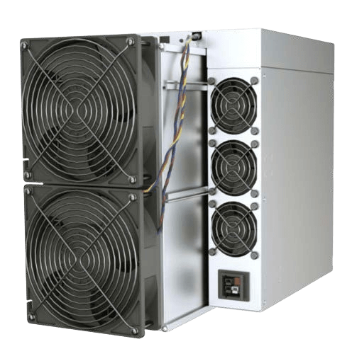
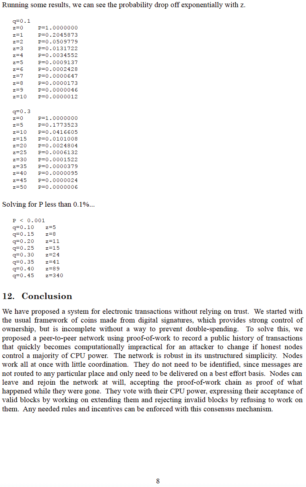

# Chapter 1

# Чому нам потрібен біткоїн

## ВІН НАМ ПОТРІБЕН, ТОМУ ЩО З ГРОШИМА ЩОСЬ НЕ ТАК

> *`Основна проблема з традиційною
>валютою полягає в тому, що для її
>функціонування потрібна велика довіра.
>Потрібно довіряти центральному банку, що він не буде
>знецінювати валюту, але історія фіатних валют
>повна порушень цієї довіри. Банкам потрібно
>довіряти зберігати наші гроші та переказувати
>їх в електронному вигляді, але вони видають їх
>хвилями кредитних бульбашок, ледь маючи
>частку в резерві. Ми повинні довіряти їм
>нашу приватність, довіряти їм не дозволяти
>зловмисникам викрадати наші кошти з рахунків.`*

~ Сатоші Накамото 2009-02-11

* Фіатна грошова система зламана (завжди була).
* Вона не є стійкою (ніколи не була).
* Немає способу її виправити (ніколи не буде).

---
## (НЕ) ЗОЛОТИЙ СТАНДАРТ
* Багато людей досі вважають, що гроші забезпечені
золотом.
* Це не так.
* Вони не забезпечувалися золотом з 1971 року, коли
президент Ніксон в односторонньому порядку зняв світ із
золотого стандарту ("шок Ніксона").
* Перегляньте **wtfhappenedin1971.com**, щоб отримати чітке уявлення
про збитки, які це завдало.

Графік, що показує інфляцію індексу споживчих цін (червона лінія) проти
купівельної спроможності долара США (чорна лінія) з 1971 року.

<small>Бюро статистики праці США, отримано з FRED, Федеральний резервний банк Сент-Луїса; https://
fred.stlouisfed.org/series/CPIAUCSL, 9 червня 2024 року.</small>

* Цікавий факт: Всесвітній економічний форум був створений у 1971 році.
---

>**ФІАТ:** (іменник) /ˈfiː.æt/
>
>: авторитетний або довільний наказ : ДЕКРЕТ
>
>: авторитетне визначення : ДИКТАТ
>
>**: команда або акт волі, що створює щось без
>або ніби без подальших зусиль**

~ merriam-webster.com/dictionary

>**ФІАТ :** від латинського fieri «бути зробленим, виникнути»

* Фіат - це гроші, які мають цінність лише тому, що уряд каже (ухвалює), що це так.
* Тому люди (повинні) вірити, що це так.
>* **Навіть якщо вони не вірять, що фіат має цінність, за законом вони
змушені використовувати його і приймати як плату за
товари та послуги.**
* **Фіатні гроші друкуються/створюються з повітря.**
* У наші дні близько 5% усіх доларів друкуються як
готівка.
* Інші 95% створюються в цифровому вигляді банками, які вводять
числа в комп'ютер, коли вони видають кредити

>*Бюро гравірування та друку витрачає лише кілька центів
на виробництво 100-доларової купюри…*

~ Американський економіст, Баррі Айхенгрін

---

>***Скотт Пеллі з NBC '60 Minutes':*** *Чи справедливо сказати, що ви
>просто затопили систему грошима?*
>
>***Голова ФРС Джером Пауелл:*** *Так. Ми зробили це.
>Це ще один спосіб про це подумати. Ми зробили це.*
>
>***Пеллі:*** *Звідки вони беруться?
>Ви просто друкуєте їх?*
>
>***Пауелл:*** *Ми друкуємо їх у цифровому вигляді. Отже, як центральний банк, ми
>маємо можливість створювати гроші в цифровому вигляді. І ми робимо це
>купуючи казначейські векселі або облігації для інших державних
>гарантованих цінних паперів. І це фактично збільшує
>грошову масу. Ми також друкуємо фактичну валюту і ми
>розповсюджуємо її через банки Федерального резерву.*

~ Інтерв'ю CNBC '60 Minutes', 17 травня 2020 року
Через два місяці після початку локдауну C*vid-19

>Насправді немає жодних обмежень щодо того, що ми можемо робити
з цими кредитними програмами, які ми маємо.

~ Голова ФРС Джером Пауелл
18 березня 2020 року в CBS News

>Так, у Федеральному резерві є нескінченна кількість готівки. Ми зробимо все необхідне, щоб
переконатися, що в банківській системі достатньо готівки.

~ Ніл Кашкарі, президент Федерального резервного банку Міннеаполіса
23 березня 2020 року, CBS '60 Minutes'

>Тут "ми" - це п'ятеро людей, які голосують за зміни до
монетарної політики в рамках системи Федерального резерву
під час засідань FOMC. 5 з 330 000 000.
Це все, що потрібно, щоб змінити монетарну політику США.

~ @MartyBent, засновник TFTC.io
Стаття Forbes, 18 березня 2020 року

---

## З УСТ КОНЯ ЗІ СТАРОГО

>*Банк отримує вигоду від відсотків на всі гроші,
які він створює з нічого.*

*~ Вільям Патерсон, 1694
Засновник Банку Англії*

>*Усі труднощі, плутанина та лихо в Америці виникають
не через недоліки Конституції чи Конфедерації,
не через відсутність честі чи чесноти,
а через відверте невігластво
сутності монети, кредиту та обігу.*

*~ Джон Адамс
2-й президент Сполучених Штатів, 1797-1801*

>*Я вважаю, що банківські установи є більш
небезпечними для наших свобод, ніж постійні армії.
Вони вже створили грошову аристократію,
яка кинула виклик уряду.
Влада емісії має бути відібрана у банків і
повернута народу, якому вона по праву належить.*

*~ Томас Джефферсон
3-й президент Сполучених Штатів, 1801-1809*

>*Вихваляючись нашими благородними справами, ми ретельно приховували той потворний
факт, що за допомогою беззаконної грошової системи ми націоналізували
систему пригноблення, яка, хоч і більш витончена,
але не менш жорстока, ніж стара система рабства.*

~ Горацій Грілі
Конгресмен США 1848-49
Засновник The New York Tribune

---

>*Той, хто контролює обсяг грошей у будь-якій країні, є
абсолютним господарем усієї промисловості та торгівлі…
коли ви усвідомите, що вся система дуже легко контролюється, тим чи іншим способом, кількома впливовими людьми на вершині, вам не потрібно буде говорити, як виникають періоди інфляції та депресії*

~ Джеймс А. Гарфілд
20-й президент Сполучених Штатів, березень-вересень 1881
Вбитий у 1881 році

>*Сьогодні в руках групи людей існує неконтрольована
влада робити долари з нічого.*

~ Томас В. Лоусон, автор 'Frenzied Finance', 1905

>*Я був настільки потайним - справді, настільки крадькома - як будь-який змовник.
Ми знали, що відкриття просто не повинно статися, інакше весь наш час
і зусилля будуть витрачені даремно. Якщо б стало відомо, що наша
конкретна група зібралася разом і написала банківський законопроект, то цей
законопроект не мав би жодного шансу бути прийнятим Конгресом.*

~ Франк А. Вандерліп
Президент National City Bank of New York
(попередник Citi Bank)
~ Пишучи в 1935 році про таємну зустріч, яка відбулася на
Острові Джекіл в 1910 році, щоб розробити законопроект, який був прийнятий як
Закон про Федеральну резервну систему в 1913 році.

>*Цей (Федеральний резерв) Закон встановлює найбільший трест на
землі. Коли президент (Вудро Вільсон) підпише законопроект,
невидимий уряд Грошової влади буде узаконений…
Найгірший законодавчий злочин століть вчиняється
цим банківським і валютним законопроектом.*

~ Чарльз А. Ліндберг-старший
Конгресмен США 1907-1917

---

>*Я найнещасніша людина. Я ненавмисно зруйнував свою країну.
Велика індустріальна нація контролюється її кредитною системою.
Наша кредитна система сконцентрована. Зростання нації,
отже, і вся наша діяльність знаходиться в руках кількох людей.
Ми стали однією з найбільш керованих, однією з найбільш
повністю контрольованих і домінованих урядів у цивілізованому
світі. Більше не уряд вільної думки, більше не уряд
переконань і голосування більшості, а уряд думки і примусу
невеликої групи домінуючих людей.*

~ Вудро Вільсон
28-й президент Сполучених Штатів, 1913-1921
Через 6 років після прийняття Закону про Федеральну резервну систему 1913 року.

>*Реальна правда в тому, як ми з вами знаємо,
що фінансовий елемент у великих центрах
володів урядом США з часів
Ендрю Джексона.*

~ Франклін Д. Рузвельт
32-й президент Сполучених Штатів у листі, написаному
21 листопада 1933 року полковнику Е. Менделлу Хаусу

>*Він [депресія] не був випадковим.
Це було ретельно сплановане явище….
Міжнародні банкіри прагнули викликати
тут стан відчаю, щоб вони могли
стати нашими правителями.*

~ Конгресмен Луїс Т. Макфадден,
Вбитий у 1936 році

>Голова комітету з банківської діяльності та валюти Палати представників
*Кожен раз, коли банк видає кредит,
створюється новий банківський кредит - нові депозити - абсолютно нові гроші.*

~ Грем Ф. Тауерс
Губернатор Центрального банку Канади, 1934-55

---

>*Якби в нашій грошовій системі не було боргів,
не було б і грошей*

*~ Маррінер Екклз,
1941, губернатор ФРС*

>*Мені ще ніколи не траплялося, щоб хтось міг, шляхом
логіки та розуму, виправдати Федеральний уряд
позичаючи використання власних грошей…
Я вважаю, що настане час, коли люди
вимагатимуть, щоб це було змінено.
Я вважаю, що в цій країні настане час, коли
вони фактично звинуватять вас і мене та
всіх інших, пов'язаних з Конгресом,
в тому, що ми сидимо склавши руки і дозволяємо
такій ідіотській системі продовжуватися.*

~ Райт Патман
Конгресмен США 1928-1976
Голова Комітету з банківської діяльності та валюти 1963-1975

>*Коли ви або я виписуємо чек, на нашому рахунку має бути достатньо коштів,
щоб покрити чек, але коли Федеральний резерв виписує
чек, немає банківського депозиту, на який би цей чек був виписаний. Коли
Федеральний резерв виписує чек, він створює гроші*

~ Федеральний резервний банк Бостона
'Пояснюючи просто', 1984

---

## ФЕДЕРАЛЬНА РЕЗЕРВНА СИСТЕМА

* ФРС - це "незалежний" центральний банк
США. Він був створений у 1913 році з прийняттям
Закону про Федеральну резервну систему.
* Він має унікальну структуру, частково приватну і частково
державну.
* Він повинен бути політично незалежною,
непартійною організацією в рамках уряду.
* Хоча Раду керуючих ФРС призначає
Президент і затверджує Конгрес, **рішення ФРС не потрібно
затверджувати ніким.**

**Він складається з:**

* Ради керуючих Федеральної резервної системи
* 12 Федеральних резервних банків
* Федерального комітету з відкритих ринків (FOMC),
який є органом, що визначає монетарну політику.

**ФРС відповідає за:**

* Нагляд за монетарною політикою США, сприяння зайнятості та стабільним цінам.
* Регулювання та нагляд за банківськими та фінансовими
установами.
* Надання платіжних послуг фінансовим установам.
* Сприяння захисту прав споживачів та розвитку громад.

---

## ПРИМІТКА ЩОДО ГОЛОВИ ФРС

* **Голова Федерального резерву також є:**

* Головує у Федеральному комітеті з відкритого ринку
(FOMC), який визначає напрямок
монетарної політики США (наприклад: кількісне пом'якшення, підвищення процентних ставок)
* Членом Міжнародного валютного фонду,
МВФ
* Членом Банку міжнародних
розрахунків, БМР (банк центральних банків).
* Міністром фінансів США в G-7
* Міністром фінансів США в G-20

* **Величезна** влада для однієї людини.

---

## ЧАСТКОВЕ РЕЗЕРВНЕ БАНКІВНИЦТВО, ВІДСОТКИ ТА КРЕДИТИ

* **Банківська справа з частковим резервуванням:** До березня 2020 року банки
зобов'язані були тримати резерв у розмірі 10%, і могли
видавати кредити на 90%.
* **З березня 2020 року немає жодних вимог до резервування, що дозволяє банкам видавати необмежену кількість кредитів.**

* Кредит - це гроші, засновані на боргу, і ви зобов'язані
сплачувати відсотки за кредитом.

>* **Цікавий факт 1:** Гроші для сплати відсотків за
>кредитом НЕ створюються банками.
>* **Цікавий факт 2:** Вони НІКОЛИ не створюються.
>* **Цікавий факт 3:** У світі НЕМАЄ ДОСТАТНЬО грошей, щоб
>повернути всі кредити + відсотки, нараховані
>за цими кредитами.
>* **Цікавий факт 4:** І ніколи не буде!

---

## ПРИМІТКА ЩОДО НАФТОДОЛАРА
* Можна сказати, **що до 1971 року долар був забезпечений
золотом, а з 1974 року він забезпечений нафтою,
а отже, за замовчуванням, збройними силами США.**
* **У 1974 році США та Саудівська Аравія уклали двосторонні угоди про ціноутворення на продаж нафти в доларах США.**
* З тих пір більшість глобальних продажів нафти здійснюється в
доларах США.
* Це значною мірою сприяло тому, що долар став
найсильнішою валютою в світі.
* **Таким чином, він був штучно підтриманий,** навіть під час
часи, коли йому зазвичай було б важко.
* З кінця 2022 року ряд країн
почали торгувати валютами, відмінними від долара США
* Цілком можливо, що це може бути початком
кінця нафтодолара. Що буде далі, ще належить побачити…

---

## ПРО КІЛЬКІСНЕ ПОМ'ЯКШЕННЯ (QE)
* **Кількісне пом'якшення вважається "нетрадиційною
монетарною політикою", яку використовують центральні банки для "стимулювання
економіки", коли ФРС купує державні
облігації та інші державні цінні папери.**
* Вперше вона була використана Японією в період з 2001 по 2006 рік.
Після цього США, Великобританія та Єврозона використовували
QE під час фінансової кризи 2008 року
* З тих пір єдиний час, коли в США не було програми QE,
був у період з 2014 по 2019 рік.
* Як видно нижче, критики стверджують, що **QE
переважно приносить користь вже заможним**

*Джерело: @RudyHavenstein у Twitter*

---

## ЦИКЛИ

* **У всій природі існують цикли, природні відливи та
припливи, розширення та скорочення.**

* Це **сприяє загальному, з часом, балансу
та стійкості** всієї взаємопов'язаної
системи, всього життя на землі.
* **Боргова система фіатних валют ігнорує
мудрість природних циклів,** і натомість заснована на,
і на 100% залежить для свого виживання від, безпрецедентного
і безкомпромісного зростання, для того, щоб продовжувати
обслуговувати свої борги.
* У природі це рак.
* В "економіці" ця неприродна траєкторія додатково
підтримується урядом, який рятує банки та великі компанії, що зазнають краху, а не дозволяє їм
згорнутися та бути переробленими у щось нове, щось здоровіше.
* **Короткозорість порятунку збанкрутілих компаній ставить під загрозу всю економіку.** По суті,
це просто відкладання проблеми на потім, і неминучий хаос, який чекає попереду, ймовірно, буде набагато, набагато
інтенсивнішим, ніж якби природним циклам було дозволено
проявитися
* **Ми вдячні Сатоші Накамото, і
шифропанкам до і після нього,** за те, що у них було
бачення, передбачення, рішучість і навички, щоб надати
рятувальний човен, щоб доставити нас до нових берегів.

---

* Як тільки ми усвідомимо, який це дар, ми повинні
застрибнути на борт, з повними серцями та ясними розумами,
здійснити подорож і побудувати новий світ з Грошима
Миру.
>* **Біткоїн виправляє гроші, а нам потрібно виправити все інше.
І, щоб було зрозуміло, завдяки тому, що гроші виправлені, БАГАТО
інших речей буде виправлено за замовчуванням**

* Головне з них - це те, що широкомасштабна, ініційована урядом кінетична війна більше не буде прибутковою або можливою без підтримки народу.
* Крім того, природно буде менше споживання,
а також перехід на товари та послуги реальної вартості, вільні ринки, реальні заощадження та демонетизацію
житла та нерухомості, які ніколи не мали
бути монетизовані.
* **ДИВІТЬСЯ:** Bitcoin Fixes This, сторінка 32
---

## ВІН НАМ ПОТРІБЕН, ТОМУ ЩО ІНФЛЯЦІЯ - ЦЕ КРАДІЖКА

Графік FRED за 2024 рік, що показує зниження купівельної спроможності
долара з моменту створення Федеральної резервної системи в
1913 році. Сукупний рівень інфляції з 1913 року становить близько
3.067%. Усі фіатні валюти центральних банків у всьому світі
дотримуються подібного рівня зниження.

* **Чим більше грошей створюється з нічого,
тим більше грошей втрачає цінність/купівельну спроможність.**
* Це називається **інфляцією.**
* Інфляція - це **крадіжка часу,** буквально. Вартість вашого
часу викрадається, коли ви заощаджуєте його у валюті, яка
роздувається, знецінюється та маніпулюється.
* Інфляція також є **прихованим податком**.

---

* Ця крадіжка часу та податок торкнулися також і фіатних валют усіх інших країн, оскільки вони всі
були прив'язані до долара США, оскільки він є
світовою резервною валютою з часів Бреттон-Вудської
угоди 1944 року.
* **У США щорічний рівень інфляції у 2% прописаний у
мандаті Федерального резерву.**
* Це означає, що **вам ГАРАНТОВАНО можливість
купити на 2% МЕНШЕ** за ті ж 20 доларів щороку.
* **У березні 2024 року річний рівень інфляції становив 3,5%,**
(набагато більше, ніж 2%, що означає, що ви втратили 3,5%
своєї купівельної спроможності в період з березня 2023 року по
березень 2024 року.
* Іншими словами, це означає, що в середньому ціни на речі
зросли на 3,5%
* **Якщо б інфляцію вимірювали точно, як це робилося
до початку 1980-х років, то в 2024 році вона була б
близькою до 10%.**
* Якщо розглядати по категоріях, то видно, що
інфляція набагато гірша, ніж 3,5% у багатьох
категоріях за останній рік.
* Коли людина дивиться на свою орендну плату, рахунки за продукти, ціни на газ,
майже все, що вона купує, стає цілком очевидним, що
інфляція бушує в кожному секторі

---
**Середня інфляція за останні
50 років у США:**

|  Середня вартість   |   1971  |   2021  |   % Збільшення  |
| --- | --- | --- | --- |
|  Зарплата   |    $9,400 |    $59,400 |    532% |
|   Будинок  |    $23,400 |    $513,000 |    2,092% |
|    Галон газу | $0.36    |   $4.17 |  1,058%   |
|    Новий автомобіль |  $3,400   |   $47,000  |    1,282% |
|   Ступінь коледжу   |  $1,400   |   $26,000  |  1,757%   |
|   Кошик продуктів  |$20     |  $210  |    950% |
|  Електроенергія/кВт-год   |  $0.02    |   $0.15  |   650%  |

>**Реальна історія:**
~ Будинок був куплений у 1976 році за 58 000 доларів.
~ Якщо врахувати "офіційну" інфляцію, це було б
279 000 доларів у цінах 2022 року.
~ У 2022 році той самий будинок оцінювався в 2,09 мільйона доларів.
~ Поміркуйте над цим…

>*Фіатна валюта - це дезінформація.
Яку інформацію передає 10-доларова купюра?
10 - це чисельник дробу з
відсутнім знаменником.
10 з чого?
10 нічого не говорить без відомого
і стабільного знаменника.*

~ @bitlany

---

* **Зі зростанням інфляції ваші заощадження (якщо вам пощастило
мати заощадження) втрачають цінність.**
* З часом вони втрачають **БАГАТО** цінності
>*Якщо ви почнете заощаджувати 100 доларів на місяць сьогодні, з
>найкращою доступною процентною ставкою 0,05%:
> * n Через 30 років ви заощадите **84 019 доларів.**
>* З урахуванням встановленої ФРС інфляції в 2%
>* Через 30 років ваші заощадження матимуть ефективну
купівельну спроможність лише **46 384 долари.**
>* З урахуванням сьогоднішньої інфляції в 3,5%:
>* Ваші заощадження в розмірі 84 019 доларів матимуть
купівельну спроможність лише **11 037 доларів** через 30 років!

* **Фактично, це означає, що приблизно шість із
семи годин вашої роботи були вкрадені = *Крадіжка часу.***

---
**Ще один спосіб поглянути на це:**
* У **1971 році** вартість будинку = **2,5** рази перевищувала середню
річну зарплату.
* У **2024 році** вартість будинку = **8,6** рази перевищує
середню річну зарплату.
* У **1971 році** новий автомобіль коштував близько **1/3** середньої зарплати
* У **2024 році** новий автомобіль коштує понад **3/4** середньої зарплати.

Я впевнений, що тепер зрозуміло, що
інфляція
* **не** *
працює на вашу користь.

**Примітка:** Усі ці цифри є середніми та змінними в залежності
від багатьох факторів. Суть залишається незмінною, інфляція - це прихований податок
і крадіжка часу нашої реальної праці та виробництва

>* **Тверді гроші виправляють це.**
>* **Біткоїн - це тверді гроші**
---

## НАМ ПОТРІБНО ЗАМІНИТИ ЦЕНТРАЛІЗОВАНО КЕРОВАНУ, МАНІПУЛЬОВАНУ, БОРГОВУ ЕКОНОМІКУ

>*Я не вірю, що у нас знову будуть хороші гроші,
поки ми не заберемо цю річ з рук уряду,
тобто ми не можемо забрати їх насильно з рук
уряду, все, що ми можемо зробити, це якимось хитрим обхідним шляхом
впровадити щось, що вони не можуть зупинити.*

~ Фрідріх Гаєк, 1984
Австрійський економіст, філософ і письменник, 1899-1992

Графік, що показує експоненціальне збільшення грошової маси M1
з 4 трильйонів доларів у березні 2020 року до понад 18 трильйонів доларів у червні 2024 року.

* **Зацікавтеся тут:** https://usdebtclock.org/
---
* **45% усіх доларів США, що існують, було
надруковано в період з квітня 2020 року по січень 2022 року!**
* Роздруковано з нічого, тобто, пам'ятаєте?
* Фіатні гроші централізовано контролюються державою, і
запаси легко маніпулюються.
* **Знадобилося 205 років, щоб Національний борг США досяг
1 трильйона доларів. (1776 > 1981)**
* Знадобилося всього **33 роки, щоб** Національний борг США
досяг **34 трильйонів доларів!** (1981 > 2024)

Графік FRED, що показує загальний державний борг США в період з 1970 по 2024 рік.

>*Глобальний борг, виміряний Інститутом
міжнародних фінансів, зараз становить 303 ТРИЛЬЙОНИ доларів.
Це наша планета на борговій фіатній основі.
До речі, глобальний ВВП становить лише 84 трильйони доларів.*

*~ Нік Бхатіа, автор книги "Багатошарові гроші", 2021 рік*

---

* **Для довідки**

| **Якщо у вас є:** | **Ви можете витрачати $1/секунду** |                |
| ------------ | ----------------------- | -------------- |
| **$1 мільйон**   | або 11 днів              | = 11 днів    |
| **$1 мільярд**   | протягом 11 680 днів         | = 32 роки   |
| **$1 трильйон**  | протягом 11 680 000 днів     | = 32 000 років |

* Ми всі перебуваємо на милість тих, хто має владу
вирішувати, коли друкувати більше, і які процентні ставки
нараховувати.
* **Якщо ФРС підвищить процентні ставки, то отримати
кредит на будинок або автомобіль раптово стане дорожче,
що сповільнить витрати, що призведе до
стагфляції**

* **Якщо вони триматимуть ставки штучно низькими, ми вступимо в
період депресії**

>* **Дозволяючи центральному банку створювати фінансові
"погодні умови", позбавляє нас свободи дозволяти ринку вирішувати, що має цінність, а що ні.**

* Крім того, **коли вони рятують банки та корпорації, вони штучно підтримують економіку.** Це лише
питання часу, коли картковий будинок впаде.
*  Первісним аргументом на користь створення центрального банку було те,
що потрібен кредитор в останній інстанції, коли
економіка похитнеться.

---
* **Це перетворилося на те, що центральний банк є Правителем
Першої інстанції, з нез

# Chapter 2

# ВИПРАВЛЯЄ ЦЮ ФІНАНСОВУ ІНКЛЮЗИВНІСТЬ
* **З біткоїном кожен має доступ до *тієї самої*
фінансової системи, з *однаковими* правилами для всіх.**
* Ніяких лазівок, чорних ходів чи особливих угод
для будь-кого.
* Кожен має потенціал отримати компенсацію за
цінність, яку він надає, тими ж реальними грошима,
створеними та підтримуваними за однаковими правилами.
* **Біткоїн доступний кожному, будь-де, де є
підключення до Інтернету.**

## ДОДАВАННЯ ЦІННОСТІ СВІТУ
* **Біткоїн стимулює людей додавати реальну цінність
спільноті та ринку,** оскільки це єдиний
спосіб заробити більше грошей
* Якщо хтось задоволений меншим, він все одно виграє, працюючи за справедливу плату, і **коли хтось заощаджує, ці заощадження зберігають свою цінність з часом.**

---
## ВИПРАВЛЯЄ ЦЕ ДОВКІЛЛЯ
* Здорові гроші з жорстко обмеженою пропозицією створюють
зовсім іншу динаміку, ніж та, що створюється
борговою системою з необмеженим друкуванням грошей, яке ми
бачимо сьогодні.
* Замість невпинного прагнення споживати все
більше, в гонитві за найнижчою ціною, щоб сплатити
складні відсотки за кредитами та боргами,
які ніколи не будуть погашені, **біткоїн
забезпечує вихід у світ, де прагнуть низького
часового пріоритету.**
>* Нестримне знищення навколишнього середовища **замінюється
меншим споживанням, меншою кількістю відходів і
зваженим підходом до виробництва,** де
ринок визначає, що має справжню цінність, і
речі, отже, будуються надовго.
* Це чиста вигода для людей, рослин і тварин!
---
## ВИПРАВЛЯЄ ЦЮ ВІЙНУ
* Необмежене друкування фіатної грошової
системи робить можливими та
прибутковими «вічні війни».
* Оскільки люди здебільшого не знають, як
працюють військові витрати, або звідки беруться гроші на війну,
з боку уряду майже немає підзвітності.
Війни можуть тривати роками у віддалених місцях, без реального нагляду.
* Починаючи з В'єтнаму, війни стали «війнами кредитних
карток» (h/t @AlexGladstein), оскільки
уряд позичає гроші для фінансування воєн, а
потім позичає більше грошей, щоб сплатити відсотки за
початковими кредитами... промити та повторити.
>* **За біткоїн стандарту, це вимагатиме від
народу країни бажання допомогти оплатити
війну. Ймовірно, вони б зробили це лише в тому випадку, якщо це
абсолютно і чітко необхідно для захисту своїх
сімей і країни, з кінцевою метою на місці.**
* Оскільки не буде жодних невиправданих прибутків,
державні чиновники та корпорації не будуть
зацікавлені в просуванні або участі у війні як
життєздатному варіанті.
* **Зусилля значно збільшаться, щоб знайти способи
досягнення мирних, недорогих рішень замість цього.**
---
## ВИПРАВЛЯЄ ЦЕЙ ЧАСОВИЙ ПРІОРИТЕТ

**Високий часовий пріоритет:** миттєве задоволення, нетерпіння,
короткострокове планування
**Низький часовий пріоритет:** відкладене задоволення, терпіння,
довгострокове планування

* Високий часовий пріоритет призводить до особистого, суспільного та
екологічного руйнування. Коли наші гроші
щодня втрачають вартість, ми «змушені» бути
нетерплячими і витрачати їх якомога швидше,
поки вони не втратять ще більше вартості.
* Коли наша година знецінюється валютою фіат, яка постійно інфлює,
ми втрачаємо зв'язок із цінністю нашого
часу.
* Це призводить до відключення та прихованого
стресу.
* Спроби полегшити стрес і знайти сенс,
викривлюються і стають відволікаючими факторами, такими як
надмірне споживання наркотиків, алкоголю, покупки,
порно, фаст-фуд, коротка увага, залежність
від екранів/соціальних мереж, імпульсивні рішення тощо.
* **З іншого боку, надійні гроші, які зберігають свою
цінність з часом і належним чином вимірюють наш
внесок через нашу роботу, призводять до низького
часового пріоритету, вдумливої якості життя, з
значущими стосунками, меншим споживанням, глибшим
зв'язком, більш глибокою розмовою, довгостроковими
цілями та підвищенням творчого потенціалу.**
---

# Chapter 3

# ЩО ТАКЕ БІТКОЇН?

>*"Написати опис цієї штуки
для широкої аудиторії - це надзвичайно важко.
Немає з чим її порівняти."*

~ Сатоші Накамото 2010-07-05

>*Загальний обсяг емісії складе 21 000 000
монет. Вони будуть розподілені між мережевими
вузлами (майнерами) під час створення блоків,
причому кількість буде зменшуватися вдвічі кожні 4 роки.
перші 4 роки: 10 500 000 монет
наступні 4 роки: 5 250 000 монет
наступні 4 роки: 2 625 000 монет
наступні 4 роки: 1 312 500 монет і т.д...
Коли це вичерпається, система зможе підтримувати
комісії за транзакції, якщо це буде необхідно. Вона базується на
відкритій ринковій конкуренції, і, ймовірно, завжди будуть
вузли, які захочуть обробляти транзакції безкоштовно.*

~ Сатоші Накамото 2009-01-09

* **Біткоїн - це гроші свободи…** у тому сенсі, що він має
потенціал звільнити нас усіх від всеосяжної
маніпуляції та контролю з боку центральної банківської
системи
* **У біткоїні грошові правила однакові для
ВСІХ, УСЮДИ.**
* Біткоїн є інклюзивним, у тому сенсі, що будь-хто з
підключенням до Інтернету може брати участь у мережі,
і **повинен грати за тими самими правилами.**

---
## біткоїн це:
* **ДЕЦЕНТРАЛІЗОВАНИЙ**
* **СПРАВЖНІЙ ДЕФІЦИТ**
* **СТІЙКИЙ ДО ЦЕНЗУРИ**
* **РОЗПОДІЛЕНИЙ РЕЄСТР**
* **НЕПІДКУПНИЙ**
* БЕЗДОЗВІЛЬНИЙ
* ПІДДАЄТЬСЯ АУДИТУ
* ПРОЗОРИЙ
* НЕЗМІННИЙ
* БЕЗКОРДОННИЙ
* ВАЖКО ПІДРОБИТИ
* ПСЕВДОНІМНИЙ
* БЕЗПЕРЕШКОДНИЙ
* БЕЗДОВІРЧИЙ
* ОДНОРАНГОВИЙ
---
* Біткоїн децентралізований.
* **Він працює на тисячах вузлів по всьому світу, тисячами людей, які не знають один одного.**
* Жодна людина, уряд чи компанія ніколи не зможуть
контролювати його.
* Ви теж можете запустити вузол, це легко ;)
* Запускаючи власний вузол, ви підвищуєте свою
конфіденційність і допомагаєте захистити мережу, коли ви
перевіряєте власні транзакції.
> **Не довіряй. Перевіряй**
---
* **Bitcoin (з великої літери 'B')** - це грошова мережа.
* **bitcoin (з малої літери 'b')** - це валюта, або грошовий актив, який випускається в мережі Bitcoin і працює на ній.

---
* **Біткоїн - чудовий стимул.**
>* **Геніальність Сатоші полягала в тому, що в біткоїні вперше і хороші, і погані актори заохочуються грати за правилами.**

> *"Стимул може допомогти заохотити
вузли залишатися чесними.
Якщо жадібний зловмисник зможе зібрати
більше CPU proof-of-work, ніж усі
чесні вузли, він повинен буде вибрати
між тим, щоб використовувати його для обману людей,
викрадаючи свої платежі,
або використовувати його для створення нових монет.
Він повинен вважати, що вигідніше грати
за правилами, такі правила, які сприяють
йому з більшою кількістю нових монет, ніж
усім іншим разом узятим,
ніж підривати систему і
дійсність власного багатства."*

~ Сатоші Накамото 2008-10-31

---
* **Біткоїн - це перші цифрові гроші,** на відміну від
вашого онлайн-рахунку, який є лише
цифровою формою фіатних грошей центрального банку.
* Біткоїн - це **децентралізована** цифрова валюта.
* Біткоїн **не має центрального органу.**
* Біткоїн **бездержавний.**
* Замисліться про наслідки...

>*Біткоїн - це децентралізована цифрова валюта, яка дає змогу
здійснювати миттєві платежі будь-кому, в будь-якій точці світу.
Біткоїн використовує однорангову технологію для роботи без
центрального органу: управління транзакціями та випуск грошей
здійснюються колективно мережею.*

~ Bitcoin Wiki
en.bitcoin.it

---
* Біткоїн - це магічні інтернет-гроші.
* Якщо серйозно, **біткоїн - це спосіб, яким ми збираємося виправити
світ.**
* Серйозно? Так.
---
* **Біткоїн - це спосіб передачі цінності**
 * будь-якої суми
 * безпечно
 * миттєво (в Lightning Network)
 * між будь-якими двома сторонами
 * будь-коли
 * 24/7
 * будь-де
 * так, будь-де
 * Задумайтеся над цим.

 ---

>*З електронною валютою, заснованою на криптографічних
доказах, без необхідності довіряти третій стороні,
гроші можуть бути безпечними, а
транзакції - легкими.*

~ Сатоші Накамото 2009-02-11

---
>*Біткоїн (майже) безкоштовно переміщується з упевненістю.
Я знаю зі 100% впевненістю, що отримую.*

~ Майкл Сейлор, генеральний директор Microstrategy

* Ви можете відправити $1.13, або 46c, або 359 sats, або 500 000 000
sats, або $1 мільйон будь-кому, будь-де, будь-коли
через мережу Bitcoin або Lightning Network,
побудовану на Bitcoin.
* **І ніхто не може вас зупинити.**
* Чи можете ви зробити це із золотом, сріблом, USD/GBP/EUR/YEN/
CYK/ZAR або будь-якою іншою фіатною валютою центрального банку?

---
* **Біткоїн є історичним.** Це перший випадок в історії, коли
справді децентралізована, стійка до цензури, незмінна,
безкордонна, бездозвольна та непідкупна грошова система з абсолютно жорстким обмеженням (21 мільйон
монет) коли-небудь була створена.
>* Біткоїн **настільки ж важливий для децентралізації влади
та збільшення фінансової інклюзії,** як і винахід
друкарського верстата, а пізніше і Всесвітньої
павутини, **для децентралізації контролю над
інформацією та розширення доступу до неї.**

>*Багато людей автоматично
відкидають електронну валюту як безнадійну справу
через усі ті компанії, які збанкрутували
з 1990-х років.
Я сподіваюся, що очевидно, що тільки
централізований характер цих
систем прирік їх на провал.
Я думаю, що це перший раз, коли ми намагаємося
децентралізовану, не засновану на довірі систему.*

~ Сатоші Накамото 2009-02-15
---
* **Біткоїн - це розподілений, децентралізований, прозорий
і незмінний РЕЄСТР ОБЛІКУ.**
* Будь-хто в світі може бачити, хто чим володіє, в будь-який
момент, і це не може бути змінено.
* За винятком того, що "хто" - це не ім'я, **а адреса,
що складається з цифр і букв.**
>* Приклад біткоїн-адреси:
**bc1qar0srrr7xfkvy5l643lydnw9re59gtzzwf5mdq**

* Тому біткоїн є **псевдонімним.**
---
* **Біткоїн - це**
* неупереджений емітент активів
* засіб накопичення вартості
* засіб обміну
* і незабаром стане одиницею обліку
* **а також**
* **засіб** обміну.

* Це емітент, золото, готівка, дебетова картка ТА
paypal, банк, venmo, cashapp, western union

**ВСЕ В ОДНОМУ!**

---
* **Біткоїн - це обліковець, який використовує математику і
інформатику замість банкірів, бухгалтерів
та аудиторів.**
* Він усуває посередників, банки, уряди, комісії за овердрафт,
комісії за розрахунковий рахунок, обмежений час обслуговування,
можливість цензури, заморожені рахунки, маніпулювання грошовою масою, процентні ставки, МВФ,
ВЕФ, БМР, цегляні будівлі, банкомати,
чеки, повернення платежів, нафтодолар, євро
долар, банківський сеньйораж, ефект Кантільона,
часткове резервування, visa, mastercard, amex,
western union, дні очікування на переказ
...

>* **Замість того, щоб між вами і
>людиною, якій ви хочете потиснути руку, ви можете просто
>потиснути її руку безпосередньо.**
>* **Не потрібно питати дозволу, щоб відправити свої власні
>гроші!**
---

## Простіше кажучи...
* **Біткоїн - це цифрова власність, яку ніхто не може у вас забрати.**
* >Володіння біткоїном означає володіння правом відправляти цінність
з конкретної адреси, яку ви контролюєте за допомогою
свого приватного ключа, на БУДЬ-ЯКУ іншу адресу, яку ви оберете.

*Біткоїн - це право власності, яке не залежить від
монополії на насильство.*

~ Роберт Брідлав @breedlove22

---

* **Біткоїн - це подія, яка трапляється раз на вид.**
* Біткоїн - це вибір.
* Біткоїн **породжує суверенітет.**
>* **Відкриття біткоїна 15 років тому, є для
фінансової свободи та суверенітету людини, як і
відкриття вогню для процвітання людини понад
500 000 років тому, а друкарський верстат - для
децентралізації доступу до людських знань майже
900 років тому.**

---
* **Біткоїн - це справжній засіб збереження вартості.**
* Він зберігає ваш найцінніший ресурс, ваш час, в
такий спосіб, що ви можете отримати доступ до нього знову пізніше.
>*Біткоїн схожий на високошвидкісний канал енергії до вашого
майбутнього "я"... ви можете працювати сьогодні, а біткоїн глибоко
заморозить вашу енергію для подальшого використання.*

~ Роберт Брідлав

>*Корінь грошей - це час
А корінь часу - це цінність*

~ Гай Свон

---
* Біткоїн - це часовий ланцюг, буквально.
* Сатоші багато разів згадував про часовий ланцюг у
своїх електронних листах до перших розробників.
* Ви можете вимірювати час блоками, оскільки один блок
майниться кожні ~10 хвилин.
>* **Наш час - наш найрідкісніший і найцінніший ресурс.**
>* **Це наша буквальна життєва сила.**
>* **Справжні Гроші дозволяють нам зберігати наш час.**

* Це спосіб, яким ми можемо визнати час, який ми "витратили".
* Ми **обмінюємо свій час на гроші, які є просто обліком
нашого часу та зусиль.**
* **Біткоїн дає змогу зберегти наш час таким чином,
щоб ми мали до нього "доступ" пізніше в житті, коли
ми більше не зможемо працювати так, як колись.**
---
* Біткоїн - це **засіб збереження вартості.**
* Біткоїн - це **засіб обміну.**
* Біткоїн **одного дня стане одиницею обліку.**
* Біткоїн **одного дня стане *ОДИНИЦЕЮ обліку.***
---
* **Біткоїн дефіцитний**
* Він має жорсткий ліміт в 21 000 000.
* Більше ніколи не буде.
* Код тут - закон.*

*Хоча "технічно" можна змінити
код, геній Сатоші запобігає цьому, оскільки збільшення
(інфляція) пропозиції призведе лише до зменшення
вартості всіх біткоїнів в обігу. Тому це
стимулює всіх неявно погодитися підтримувати
жорсткий ліміт в 21 000 000.

* Перегляньте **timechaincalendar.com** від @TC, щоб перевірити
поточну висоту блоку, доступну пропозицію та
численні інші показники щодо біткоїн-часового ланцюга.
---
* **Біткоїн нескінченно подільний, не знецінюючи
пропозицію.**
* **Одна піца - це одна піца, незалежно від того, наскільки маленькі
шматочки.**
* Наразі він ділиться до восьмого
десяткового знака: 1.00000000
* В 1 біткоїні 100 000 000 сатоші.
* 1 сатоші = 0.00000001
* Ви можете купити сати (сатоші) в будь-якій кількості.
---
* **Біткоїн - найтвердіші, найнадійніші гроші, які ми коли-небудь
знали.**
* Він навіть надійніший за золото, оскільки золото нелегко
поділити або перенести, має низьку швидкість (рухається повільно)
і його нелегко перевірити
* **Біткоїн має найвищі монетарні властивості
з усіх відомих активів.**

**ПОРІВНЯЛЬНА ТАБЛИЦЯ ВЛАСТИВОСТЕЙ НАДІЙНИХ ГРОШЕЙ**

ПРИМІТКА: Це загальний огляд, є нюанси, які не
можна врахувати в таблиці.

---
* **Біткоїн - це протиотрута.**
* Спроби "стабілізувати" економіку за допомогою викупу боргів,
друкування грошей, QE та маніпулювання процентними ставками - це
все одно, що підтримувати її на штучному життєзабезпеченні.
* Ця "машина" може працювати лише до тих пір, поки не стане дедалі дорожчою в обслуговуванні, і менш і менш стійкою, що призведе до серйозної поломки.
* **Біткоїн виправляє це**
* **Біткоїн - це кращі гроші**
---
* **Біткоїн антикрихкий.**
* І він стає все більш таким з кожною спробою атаки,
з кожною урядовою забороною, з кожним шматком масової інформаційної FUD (страх, невпевненість, сумнів).
>* Біткоїн ніколи не був зламаний.*
* Хоча багато хто намагався.

*Хоча ви могли чути про зломи, зламують саме
біржі, а не біткоїн-протокол.
* **Пам'ятайте:**
* Не ваші ключі, не ваші монети.
* **Завжди** виводьте свої сати на свій **власний гаманець.**
* **Найкраще** купувати P2P.
---
* **Біткоїн - це комбінація:**
* інформатика
* мережеві протоколи
* електричні системи
* теорія ігор
* переконання
* міметика
* термодинаміка
* мережеві ефекти
* криптографія
* енергія
* справжній дефіцит
* економічні стимули
* розробка програмного забезпечення
* часова вартість грошей
* криві впровадження технологій
* явище, що виникає
* сила децентралізації
* низька часова перевага
* узгодження стимулів
* монетарний нейтралітет
* фінансовий активізм
* незмінність

... все це працює разом, щоб створити довіру
в середовищі без довіри, децентралізованому,
щоб підтримувати

* нейтральні
* безпечні
* стійкі до цензури
* бездозвольні
* глобальні

цифрові гроші та грошову мережу.

---

* **Біткоїн - це глибока кроляча нора,** яка змушує вас
ставити під сумнів майже все, що ви думали, що знаєте ;)
* Біткоїн є самодостатнім.
* **Біткоїн просто є.**
>*Біткоїн є. І цього достатньо.*

~ @Beautyon

---
* **Біткоїн - це симбіотичний зв'язок** між:

**Людьми**

і

**Ідеальним рішенням для передачі та зберігання
часу/вартості.**

* Людям потрібен біткоїн, біткоїну потрібні люди.
---
* **Біткоїн - це рішення проблеми візантійських генералів.**
* Раніше вважалося, що це нерозв'язна проблема в
інформатиці
* Ця проблема виникає в децентралізованих системах, де
вважалося неможливим довести, що відправлене повідомлення
= отримане повідомлення, оскільки "людина посередині"
може бути недобросовісним учасником і фальсифікувати повідомлення.
* Іншими словами, здавалося неможливим сформувати консенсус між мережею розподілених і незалежних комп'ютерів.
* Використовуючи часову мітку разом із криптографічно захищеним розподіленим реєстром, Сатоші вирішив цю проблему.
* Його рішення відоме як **консенсус Накамото.**
---
* **Біткоїн - це рішення проблеми подвійних витрат.**
* Це означає, що коли ви відправляєте біткоїн, одержувач
може бути впевнений, що ви дійсно володіли біткоїном, який ви
відправили, і що, коли ви відправили його їм, ви не можете
витратити ці монети знову, відправивши їх комусь іншому
(подвійні витрати).
* Так само, як я даю вам апельсин. Як тільки він покидає
мої руки і опиняється у ваших руках, у мене більше немає
апельсина, щоб віддати його комусь іншому.
>*..подвійні витрати ніколи не приймаються в пул
транзакцій, тому кожен вузол
свідчить про те, яку транзакцію він побачив першою,
працюючи над тим, щоб помістити її в блок.*

~ Сатоші Накамото 2010-12-09

---
* **Біткоїн - це актив на пред'явника,** як готівка або золото, що зберігається
безпосередньо у пред'явника (власника)

>* **Це означає, що після відправлення (передачі) він надходить безпосередньо
до нового пред'явника (власника), без посередника
(банку), необхідного для обробки транзакції.**

---
* **Біткоїн - це P2P (одноранговий).**
* Біткоїн стійкий до цензури
>* **Це означає, що ніхто не має права затримувати
або запобігати проходженню транзакції до
нового пред'явника.**
* Біткоїн тече вільно.

* Не може бути ніяких привратників.
---
* **Біткоїн не потребує довіри.**
>*Основна проблема зі звичайною
валютою полягає в усій тій довірі, яка необхідна
для її роботи. Центральному банку потрібно
довіряти, щоб він не знецінював валюту, але
історія фіатних валют сповнена
порушень цієї довіри.*

~ Сатоші Накамото про важливість
природи біткоїна, яка не потребує довіри.

---
* **Біткоїн - це код.**
* **Код - це мова.**
* Перегляньте github.com/bitcoin
* **Зараз це головний біткоїн-репозиторій.**
* Натисніть, щоб переглянути код, запити на внесення змін,
огляди, коміти, біпи (пропозиції щодо поліпшення
біткоїна) та розробників, які
працюють над створенням біткоїна, підтримують його та покращують.

---

* **Біткоїн - це інтернет грошей.**
* Коли людина замислюється над тим, що все інше
стає/стало цифровим, зокрема:
 * музика
 * книги
 * банківська справа
 * фільми
 * освіта
 * фотографії
 * телефонні дзвінки
 * радіо
 * карти
 * ігри
 * зустрічі
 * і цей список можна продовжувати (краще чи гірше)

… тоді людина бачить, як **дійсно логічно, щоб
гроші наслідували цей приклад.**

> **АЛЕ,** нам потрібен **БІТКОЇН, А НЕ CBDC!**

---

## ГЕНІАЛЬНІСТЬ САТОШІ
>* Біткоїн - це **ВСЕ** з наступного:
> * Децентралізований, розподілений реєстр
> * Платіжна система
> * І сама вартість, що передається.

* Поза біткоїном **створення грошей** (емісія) і
**бухгалтерський облік** (відстеження отриманих/витрачених грошей)
**є централізованим** і включає в себе такі окремі
шари:

* Випуск грошей різними центральними банками
* Реєстри обліку, будь то письмові чи цифрові
* Довірені сторони, які вносять цифри в
реєстри
* Довірені сторони, які зберігають фізичні реєстри
в безпеці або які обслуговують комп'ютерні бази даних
* Довірені команди безпеки, які працюють для запобігання
зламу баз даних

* У біткоїні **всі ці шари об'єднані в один!**
* Хоча це може здаватися більш централізованим, геній Сатоші
зробив так, що сталося навпаки.
* Він **100% децентралізований!**

---

>* **Біткоїн НЕ має центральної точки відмови.**

* Єдиний спосіб, щоб все це було згорнуто в одне, і при цьому було
децентралізованим, полягає в тому, що **розподілений реєстр
підтримується добровільною, всесвітньою, спеціальною
групою людей, які добровільно видобувають і/або запускають
повні вузли.**
* І стимули мережі **заохочують усіх грати за правилами**
* Ви можете приєднатися до нас!

---
## Біткоїн - це мирна революція
---
## Біткоїн - це надія
---

# Chapter 4

# ЯК ПРАЦЮЄ Біткоїн?

Правила, а не правителі

tik-tok/
/наступний блок
* Біткоїн використовує proof-of-work, криптографію з відкритим ключем
і однорангові мережі для обробки та перевірки
платежів у глобальному, розподіленому, онлайн-реєстрі.

>**Криптографія** (іменник) /krɪpˈtɑːɡrəfi
>
>*: зашифрування та розшифрування повідомлень
>в секретному коді або шифрі
>: комп'ютеризоване кодування та
>декодування інформації*

~ Merriam Webster Dictionary

>**Хешування** (дієслово) /ˈhæʃɪŋ/
>
>*: метод шифрування
>: процес використання математичного алгоритму проти
>даних для отримання числового значення (хеш-дайджесту),
>яке є представницьким для цих даних.*

~ crsc.nist.gov

>**Пам'ятайте:**
>
>Екосистема біткоїна включає >>
>
>**bitcoin:** цифровий **монетарний актив**
>
>**Bitcoin:** **платіжна мережа** майнерів і вузлів

1 біткоїн = 100 000 000 сатоші (sats)

**(Ви можете купувати сатоші, частку біткоїна)**

---

>*Ми визначаємо електронну монету як ланцюжок
електронних підписів. Кожен власник передає
монету наступному, цифровим підписом
хешу попередньої транзакції та
відкритого ключа наступного власника та додаючи
їх до кінця монети. Одержувач може
перевірити підписи, щоб перевірити ланцюжок
власності.*

~ Сатоші Накамото
Bitcoin White Paper, Pt.2, 2008
Описуючи, як працює транзакція біткоїна
в розподіленому реєстрі

---
## ЕКОСИСТЕМА БІТКОЇНА..
**складається з Майнерів, Вузлів, Користувачів, Розробників**

всі працюють незалежно,

і одночасно взаємозалежно,

щоб оживити те, що є

БІТКОЇН!

---
## МАЙНЕРИ
* **Спеціалізовані вузли** (комп'ютери, які називаються ASICS) **які
"майнять" блоки**, які стають частиною біткоїн
блокчейну.
* Роблячи це, вони **перевіряють підтверджені транзакції,
здійснені користувачами, випускають нові біткоїни** та **захищають
всю мережу.**

## КОРИСТУВАЧІ
* **Ви і я. Всі ми.** Люди.
* Визнаючи та цінуючи цінність
товарів і послуг, ми здійснюємо транзакції: даємо
та отримуємо біткоїни, або зберігаємо їх для використання пізніше, за
потреби.

## ВУЗЛИ
* **Вузли - це комп'ютери, на яких працює біткоїн
програмне забезпечення.**
* **Існують тисячі вузлів**, які утворюють
децентралізовану, глобальну, добровільну **мережу, яка
перевіряє транзакції** (тим самим запобігаючи
подвійним витратам і допомагаючи захистити
систему).

## РОЗРОБНИКИ (DEVS)
* **Кодери, програмісти та цифрові автори**, які працюють
над тим, щоб **підтримувати та масштабувати мережу, покращувати безпеку,
конфіденційність та інтерфейс користувача, а також перекладати код**
мовою та візуальними засобами, які решта з нас може зрозуміти та використовувати

---

## БІТКОЇН ТРАНЗАКЦІЯ:
Алі хоче відправити Бенджі трохи біткоїнів:

>1. Алі **відкриває додаток біткоїн-гаманця** на своєму телефоні та
>**натискає "Відправити".**
>2. Бенджі **відкриває свій додаток-гаманець** і **натискає "Отримати".**
>3. **Якщо вони разом:** Алі сканує QR-код на
>додатку-гаманці на телефоні Бенджі.
>4. **Якщо вони не разом:** Алі копіює та вставляє
>адресу, яку Бенджі надсилає їй текстовим повідомленням, у поле адреси у своєму
>гаманці.
>5. Алі **вводить суму для відправлення** і натискає **"Відправити".**
>6. **Через кілька секунд** Бенджі побачить суму
>в очікуванні у своєму гаманці.
>7. **Якщо її відправили через Lightning**, вона буде підтверджена
>майже миттєво, і це майже безкоштовно.
>8. **Якщо її відправили "onchain"** (в основному ланцюзі біткоїна),
>вона включає невелику плату і зазвичай займає близько 10
>хвилин для підтвердження. Це може зайняти більше часу,
>залежно від трафіку в мережі.

---

## БІТКОЇН ТРАНЗАКЦІЯ ПІД КАПОТОМ:
(Визначення термінів, які **виділені жирним шрифтом**, наведено нижче)

>1. Коли Алі відправляє ці сатоші Бенджі, платіж
>**транзакція** **транслюється** в мережу.
>2. Транзакція перевіряється **вузлами**, які
>переконуються, що Алі дійсно має біткоїни для відправлення, і
>що їх раніше не було витрачено (щоб запобігти
>подвійним витратам).
>3. Після перевірки вузлом вона чекає в **мемпулі**
>з транзакціями інших людей.
>4. Транзакції в мемпулі додаються в
>блок до **блокчейну**, коли **майнер** знаходить >**nonce**,
>який задовольняє **алгоритм складності.**
>5. Кожен **блок** має **мітку часу.**
>6. Це створює **незмінність** і допомагає захистити
>коригування алгоритму складності від
>маніпулювання.
>7. Кожен блок представляє одне підтвердження для
>транзакцій, включених до нього.
>8. Оскільки блоки додаються, в середньому кожні десять хвилин,
>незмінність блокчейну зростає.

---

## ГЛОСАРІЙ ТЕРМІНІВ

---
>* **ТРАНЗАКЦІЯ ~ Відправка/отримання біткоїнів**
---
* Передача цінності у вигляді сатоші від
одного власника біткоїна до іншого.

---
>* **ВУЗОЛ ~ "Гілка" децентралізованого біткоїн
"банку". Будь-хто може запустити вузол.**
---

* Вузли - це комп'ютери, на яких працює біткоїн
програмне забезпечення.
* Вузли, разом з майнерами, користувачами та
розробниками, утворюють однорангову мережу біткоїна.
* Уявіть собі **кожний повний вузол як книгу, що містить
баланси кожного приватного ключа.**
* Вони взаємодіють і досягають консенсусу (погоджуються) один з
одним, приймаючи та перевіряючи
транзакції від інших вузлів, разом з блоками
від майнерів, а потім передаючи їх далі
іншим вузлам.
* Вузли управляються спеціальною групою з тисяч
добровольців по всьому світу.
* Повний вузол - це той, який незалежно
перевірив весь блокчейн біткоїна, починаючи з
Genesis Block, видобутого Сатоші в 2009 році.
* Чим більше активних вузлів, тим більш розподіленою, і, отже, стійкою стає вся мережа.
* Наразі **в усьому світі налічується понад 19 000 досяжних повних
вузлів і набагато більше недосяжних.**
* Усі вузли-учасники рівні.

---

---
>* **ТРАНСЛЯЦІЯ ~ Повідомлення мережі про те, що ви
надсилаєте біткоїн комусь.**
---

* Коли ви натискаєте "Відправити", ваш гаманець підписує транзакцію вашим приватним ключем і транслює її,
повідомляючи всім іншим вузлам про ваш намір
передати цінність, щоб вони могли перевірити
транзакцію

---
>* **MEMPOOL ~ Кімната очікування транзакцій**
---

* Це "кімната очікування", куди перевірені транзакції відправляються для того, щоб бути підхопленими майнером і
доданими до блоку.

---
>* **БЛОК ~ "Сторінка" в книзі біткоїна**
---

* Розподілена книга біткоїна складається з цифрових "блоків".
* Кожен блок містить перевірені біткоїн-транзакції,
які підтримують глобальну книгу в актуальному та точному стані.
Вони також містять nonce, мітку часу та
хеш попереднього блоку, що сприяє
незмінності біткоїн-блокчейну.

---
>* **БЛОКЧЕЙН ~ Вся книга біткоїна**
---

* Блокчейн біткоїна, також відомий як
таймчейн, - це розподілена книга, яка містить
кожний блок і кожну біткоїн-транзакцію, коли-небудь
зроблену з моменту створення Genesis-блоку Сатоші в 2009 році.

---

---
>* **МАЙНЕР ~ Спеціалізований вузол, який підтверджує
транзакції та випускає нові біткоїни**
---

* Майнери біткоїна - це спеціалізовані комп'ютери. Вони
спрямовують велику обчислювальну потужність (хешрейт) у
цифрову лотерею, щоб вгадати число, яке задовольнить
поточний алгоритм складності, тим самим "видобуваючи"
"блок" (частину книги).
* Видобутий блок отримує мітку часу та додається до
блокчейну (він же таймчейн).

---
>* **АЛГОРИТМ СКЛАДНОСТІ ~ Спеціальна, адаптивна
конструкція, яка допомагає підтримувати передбачуваний
випуск нових біткоїнів.**
---

* Це було одне з геніальних рішень Сатоші, яке допомогло
захистити випуск біткоїна від випередження самого себе,
оскільки розробляються більш досконалі комп'ютери.
* Коли більше майнерів виходять в онлайн, цільове число (nonce) в "лотереї" стає меншим і, отже, його стає важче знайти.
* Коли менше майнерів онлайн, стає легше.
* Алгоритм **автоматично налаштовується кожні 2016
блоків** (приблизно кожні два тижні), щоб забезпечити передбачувану швидкість постачання, коли один блок видобувається
в середньому кожні десять хвилин.

---
>* **NONCE ~ 32-бітове випадкове число**
---

* 32-бітове випадкове число, яке майнери додають до
кінця хешованого списку транзакцій, щоб спробувати
задовольнити цільову складність для видобутку блоку.
* Коли майнер знаходить nonce, який призводить до
генерації хешу нижче поточного цільового
числа, вони видобули блок і можуть додати
його до блокчейну та отримати винагороду за блок
біткоїна.
---

---
>* **МІТКА ЧАСУ ~ Відмічає час**
---

* Кожен видобутий блок має мітку часу, додану до нього.
* Це для додаткової безпеки, незмінності та для допомоги
в встановленні регулювання складності

---
>* **НЕЗМІННІСТЬ ~ Неможливо змінити.**
---

* Це означає, що блокчейн "висічений у цифровому камені".

---
>* **ПІДТВЕРДЖЕННЯ РОБОТОЮ (PoW) ~ Криптографічне підтвердження
того, що була виконана складна робота для задоволення алгоритму.**
---

* Майнери використовують алгоритм PoW, щоб довести, що вони
використали велику обчислювальну потужність за допомогою електроенергії
(роботи) для досягнення консенсусу в децентралізований спосіб і для запобігання зловмисникам від
спаму мережі.

---
>* **КРИПТОГРАФІЯ ВІДКРИТОГО КЛЮЧА ~ Процес, який
створює цифрові ключі для доступу до ваших біткоїнів**
---

* Це система, за допомогою якої два ключі створюються
за допомогою криптографічного алгоритму.
* **Один ключ є загальнодоступним** - як номер вашого банківського рахунку, який ви можете дати людям, щоб надсилати вам біткоїни за товари,
подарунки чи послуги.
* **Інший ключ є приватним** - Лише ви маєте копію,
і ви використовуєте його для розблокування доступу до своїх біткоїнів,
так само, як пароль розблоковує ваш онлайн-банківський
рахунок.
* **Ви повинні дуже добре захистити свій приватний ключ,**
оскільки будь-хто, хто має доступ до нього, має доступ до
ваших біткоїнів.

---

---
>* **ОДНОРАНГОВА (P2P) МЕРЕЖА ~ Децентралізована
мережа без посередників**
---

* Повні вузли (піри) спільно підтримують однорангову мережу для перевірки та підтвердження транзакцій і блоків.
* У цьому типі мережі кожен вузол може
як надавати/запитувати дані до/від своїх пірів.
* У мережі P2P немає привратників.

---
>* **МЕРЕЖА LIGHTNING ~ Мережа, побудована на біткоїні, яка дає змогу надсилати або отримувати
сатоші дуже швидко і майже безкоштовно.**
---

* Lightning - це рішення для масштабування Layer 2. Це означає,
що воно забезпечує спосіб масштабування біткоїна, надаючи йому
можливість обробляти мільйони транзакцій на
секунду (TPS).

---
>* **ГАМАНЕЦЬ ~ "Гаманець" містить криптографічні
ключі для доступу до ваших біткоїнів.**
---

* Він може бути на телефоні, комп'ютері або на окремому
невеликому апаратному пристрої (найбезпечнішому).
* Біткоїн-гаманець точніше було б назвати
пристроєм для підпису. Ваші біткоїни ніколи насправді не покидають
блокчейн, цифрову книгу.
* Коли ви хочете відправити або витратити свої біткоїни,
гаманець підпише та транслюватиме транзакцію в
мережу, щоб її можна було перевірити та
додати до блоку в блокчейні.

---
>* **РОЗРОБНИКИ ~ Комп'ютерні програмісти**
---

* Кіберпанки/програмісти, які підтримують мережу, підвищують безпеку, перевіряють на наявність помилок, подають
запити на внесення змін (для нових оновлень або функцій), переглядають
запити на внесення змін, перевіряють код.

---

---
>* **ВІДКРИТИЙ КЛЮЧ ~ Як номер банківського рахунку для
отримання біткоїнів.**
---

* Ви можете дати його людям, щоб вони надсилали вам біткоїни,
так само, як ви б дали номер свого рахунку
комусь, щоб вони могли надіслати вам фіат

---
>* **ПРИВАТНИЙ КЛЮЧ ~ Для захисту, доступу та надсилання біткоїнів, як ключ до банківської комірки.**
---

* Біткоїн-приватний ключ - це секретний рядок цифр
і літер, який дозволяє вам надсилати/витрачати ваші
біткоїни.
* Тільки у вас є копія. ** **Дуже важливо
зберігати її в безпеці, оскільки будь-хто, хто
отримає копію, може витратити ваші біткоїни.** **

---
>* **РОЗПОДІЛЕНА КНИГА ~ Книга, яку веде
кожен, хто бажає допомогти в її веденні.**
---

* Замість централізованої книги, яка є
невидимою для громадськості, як та, яку веде банк, біткоїн є прозорою, відкритою, децентралізованою
книгою, видимою для будь-кого в будь-який час.
* Адреси - це рядки літер і цифр,
без будь-яких імен.
* Хоча псевдонімні, можливо відстежувати транзакції, особливо якщо біткоїни були куплені на
централізованій біржі KYC.
* Мережа біткоїна не потребує довіри, і будь-хто може
перевірити її в будь-який час, на відміну від банку, де потрібно
довіряти, що книги ведуться чесно.

---

## БІЛЬШЕ ПРО МАЙНІНГ
 Whatsminer M50S

 Antminer S21 Pro

  Bitaxe 401 Supra

* **Майнери присвячують обчислювальну потужність, тобто хешрейт,
через електроенергію в мережу,** щоб додати блоки до
блокчейну біткоїна.
* Ці комп'ютери працюють 24 години на добу, зазвичай у наборах
від кількох до кількох сотень або тисяч.
* **Вони, по суті, беруть участь у лотереї. Коли один із
них вгадує число** (nonce), яке генерує
хеш, який відповідає поточній цільовій складності, **вони
можуть додати наступний блок до таймчейну.**
* **Все вищезазначене є підтвердженням роботи (PoW), необхідним для
народження нових біткоїнів.**

---

## ВИНАГОРОДА ЗА БЛОК БІТКОЇНА
**= Субсидія + Комісії**

>* **За свою роботу майнери отримують:**
> * **Субсидію у вигляді щойно видобутих біткоїнів.**
> * **Плюс комісії від перевірених транзакцій,
>включених до цього блоку**

* **Коли ви надсилаєте біткоїн комусь, ця транзакція
включає комісію** і потребує перевірки майнером,
а потім включення в блок.
* **Субсидія за блок біткоїна** зменшується вдвічі кожні чотири
роки
* Зараз вона становить **3,125 біткоїна** за блок, який видобувається.
* **Наступний "халвінг" буде в 2028 році,** після чого
винагорода за блок зменшиться до 1,5625 біткоїна за
видобутий блок.
* Як згадувалося раніше, **це підтримує стабільність випуску.**
* **У 2140 році буде видобуто останній шматок біткоїна.**
* Після цього майнери отримуватимуть лише комісії від транзакцій, які вони перевіряють у кожному блоці.

>*Через кілька десятиліть, коли винагорода стане занадто
маленькою, плата за транзакції стане
основною компенсацією для вузлів (майнерів).*

~ Сатоші Накамото
Bitcointalk.org, 2010-02-14

>* **Майнери завжди будуть потрібні для перевірки транзакцій,
тим самим підтримуючи мережу в актуальному та безпечному стані.**

* Хоча потрібно усвідомлювати, що є
витрати, і прибутковість незначна для домашніх
майнерів, це потужний спосіб допомогти захистити та підтримувати
мережу децентралізованою.
* Майнери служать досить багато років. Наприклад, зараз є багато
Antminer S9, які працюють
вже понад 6 років.
* Коли майнери виходять на пенсію, **їх можна легко
розібрати та переробити.**
* **Відбувається безліч захопливих інновацій,**
коли люди використовують надлишкове тепло від майнерів для
обігріву своїх будинків, саун, теплиць, гарячих ванн,
сушать в'ялене м'ясо та овочі, обігрівають палуби, сушать дерево та
багато іншого!

---

# Chapter 5

# ЩОДО МЕРЕЖІ LIGHTNING
* **Біткойн блоки навмисно невеликі** (1 МБ кожний),
в результаті чого головний ланцюг біткойна може обробляти близько 7 транзакцій на секунду (TPS).
* Visa обробляє близько 24 000 TPS.
* Крім того, **зазвичай потрібно близько 10 хвилин для
першого підтвердження транзакції в головному ланцюзі** (оскільки блок видобувається в
середньому кожні ~10 хвилин).
* Це непрактично, якщо ви перебуваєте в магазині і хочете
швидко розрахуватися за свої товари.

> ***Важлива деталь:** Причина, по якій блоки малі,
полягає в тому, щоб **зберігати ланцюг часу достатньо малим, щоб будь-хто міг
запустити власний вузол вдома, що допомагає підтримувати
мережу децентралізованою.** Сатоші усвідомлював
важливість цього

>*Користувачі біткойна можуть дедалі більше
тиранізуватися щодо обмеження розміру
ланцюга, щоб його було легко використовувати багатьом користувачам
і невеликим пристроям.*

~ Сатоші Накамото, 2010-12-10

**Рекомендована література:**
* The Blocksize War by Jonathan Bier
---

>* Отже, **Lightning Network (LN),** **рішення для масштабування біткойна на другому рівні.**
>* **'Другий рівень'** означає, що **він побудований поверх біткойна.**
>* **'Рішення для масштабування'** означає, що воно дозволяє мережі:
>* **Значно збільшити швидкість обробки.**
>* **Значно збільшити кількість транзакцій, які вона
>може обробляти за секунду.**
>* **Зробити мікроплатежі можливими.**

* Мережу Lightning можна (у певному сенсі) уявити як
рахунок, який ви можете вести з друзями в барі.
* Ви відстежуєте між собою, хто кому що винен
(як канал Lightning Network), і в кінці
вечора ваша група розраховується з барменом
(«головним ланцюгом»).
* **Канали Lightning, однак, можуть залишатися відкритими
дні, тижні, місяці або роки, перш ніж будуть
«розраховані» в головному ланцюзі.**

---
## ПЕРЕВАГИ :
* **ОБСЯГ** - Обсяг транзакцій за секунду є
по суті безмежним, оскільки можна відкрити незліченну кількість каналів
одночасно, кожен з яких веде свій власний
«рахунок».
* **МІКРОПЛАТЕЖІ** - Ви можете відправити лише 1
сатоші (наразі 0,0006 дол. США).
* **ШВИДКІСТЬ** - Зазвичай потрібно від мілісекунди до
кількох секунд, щоб отримати платіж.
* **КОНФІДЕНЦІЙНІСТЬ** - Транзакції не зберігаються у відкритому,
публічному блокчейні біткойна. У певному сенсі він навіть
більш приватний, ніж готівка, тому що з Lightning,
навіть інша сторона не обов'язково знає, хто
ви є, оскільки ваш платіж часто «стрибає» через
різні канали, щоб дістатися до одержувача.

Щоб було зрозуміло, я не кажу, що на 100% неможливо
розкрити, просто набагато більше, ніж з платежами в
головному ланцюзі біткойна.
Знадобиться величезна кількість часу та енергії,
щоб з упевненістю встановити, хто здійснював платежі
кому, і не завжди було б можливо
зробити це взагалі.

>**Насолоджуйтесь дивовижними візуалізаціями** поточного стану
>мережі Lightning за адресою:
>* lnrouter.app/graph
>* mempool.space/graphs/lightning/nodeschannels-map

---

>*Сам біткойн не може масштабуватися, щоб кожна
фінансова транзакція у
світі транслювалася всім і
включалася в блокчейн.
Повинен бути вторинний рівень
платіжних систем, який є легшим
і ефективнішим.*

*~ Хел Фінні, 2010-12-30, ранній шифропанк
& друга людина, яка запустила біткойн*

**Подумайте про це так:**
>* Біткойн: **Ощадний рахунок** ~ Більш повільні транзакції для
>більших сум.
>* Lightning: **Поточний рахунок** ~ Більш швидкі транзакції
>для менших сум.

>*Біткойн, покращений за допомогою Lightning, можна розглядати як продукт (цифрову власність) і послугу (відкриту грошову
мережу). Можливість передавати грошову енергію в часі та просторі без втручання уряду чи звичайних банків надзвичайно цінна для людства.*

~ Майкл Сейлор, генеральний директор
Microstrategy

**Дізнайтеся більше про Lightning тут:**

lopp.net/lightning-information.html

---

# Chapter 6

# ЯК БІТКОЇНИТИ

>**Біткоїнити:** (дієслово) /tuːˈbɪtkɔɪn/
Цим пропоную зробити «біткоїнити» дієсловом,
що охоплює всю повноту участі
в екосистемі біткоїна/Bitcoin.

* Гаразд, тепер, коли ви, сподіваюся ;) були "помаранчеві", і готові стати власним банком, беручи участь у перших у світі глобальних грошах свободи,
ось і настає найцікавіше!

---

## СТАНЬ ВЛАСНИМ БАНКОМ
* Саме тут лежить справді епічний зсув у напрямку фінансової самостійності, і це може зайняти час, щоб
дійсно, по-справжньому осягнути, що це означає.
* Потрібні певні **намір і відданість, щоб
зрозуміти, як зробити це якомога безпечніше.**
* У дусі того, щоб ця книга залишалася «найпростішою
книгою про біткоїни, коли-небудь написаною», я
наведу тут план, а потім запропоную ресурси в кінці,
щоб ви могли зануритися в глибину, яка значно перевищує
розмір цього посібника.

>**HODL:** (дієслово) /ho’dill/

: тримати свої біткоїни

: не продавати

-З допису на bitcointalk.org 2013 року, де автор,
який зізнався, що п'яний, неправильно написав «HOLD»

-bitcointalk.org/index.php?topic=375643.0

* Поки мережа ще росте, є велика цінність у мільйонах
глобальних ходлерів останньої надії.

---

## ПРИДБАННЯ БІТКОЇНІВ
* **Біткоїн виходить на ринок, коли майнери продають частину
біткоїнів, які вони отримують як винагороду,** щоб оплатити
свої операційні витрати.
* **Ви можете придбати біткоїн, купивши на одноранговій
торговій платформі, прийнявши його як оплату за
товари чи послуги, які ви пропонуєте, як подарунок або видобувши
його.** (Купівля на зареєстрованій біржі є крайнім заходом, не рекомендується).
* Коли ви його отримуєте, ви технічно отримуєте
приватні ключі для доступу до свого біткоїна.
> * **Пам'ятайте:** Сам біткоїн ніколи не залишає
ланцюжок часу.

* Ви можете придбати біткоїн анонімно або
з перевіркою особи (KYC - знай свого клієнта).

* KYC вимагається законом для виконання AML (законів про боротьбу з відмиванням грошей) при купівлі на біржах.

>* Купівля біткоїна без KYC **зберігає ваше право на
конфіденційність у майбутньому.**

---

## Non-KYC >> Анонімно
**Як отримати біткоїни без KYC (без ID):**

РЕКОМЕНДОВАНО

>1. Завантажте програму гаманця лише для біткоїнів (див. стор. 102).
>2. Оберіть метод (див. нижче).
>3. Купіть, отримайте або видобудьте біткоїн.
>4. Виведіть свій біткоїн на свій гаманець.
>5. HODL або витратьте і замініть.

* **Купуйте його на Robosats, Bisq, HodlHodl, Peach Bitcoin.**
* **Купуйте його в біткоїн-банкоматі** - обов'язково перевірте, оскільки
деякі вимагають ID. Інші просто запитують ім'я та
номер (можна використати тимчасовий номер телефону).
* **Купуйте ваучер Azteco** - відвідайте azte.co, щоб дізнатися про місцезнаходження.
* **Заробляйте його за роботу, яку ви виконуєте** - попросіть, щоб вам платили в біткоїнах.
Запропонуйте знизити вашу ціну.
* **Купуйте його особисто на зустрічі біткоїнерів.**
* **Видобувайте його** - стає легше видобувати вдома, або
ви можете приєднатися до майнінгового пулу, але тоді проведіть власне дослідження, щоб залишатися
без KYC. Ocean Pool - чудовий варіант.

---

## KYC >> Потрібна перевірка ID

**Як купити біткоїн з KYC (з ID):**

НЕ РЕКОМЕНДОВАНО

>1. Завантажте програму гаманця лише для біткоїнів (див. стор. 102).
>2. Оберіть біржу лише для біткоїнів.
>3. Створіть обліковий запис і підключіть спосіб оплати.
>4. Виконайте вимоги KYC.
>5. Купіть біткоїн.
>6. **Виведіть свій біткоїн на свій власний гаманець.**
>7. HODL або витратьте і замініть.

* **Майте на увазі, що ваш біткоїн буде назавжди пов'язаний з
вашою особистістю,** якщо ви купите його таким чином, таким чином втративши
майбутню псевдонімність щодо цих покупок.
* Якщо ви обираєте цей метод, я рекомендую знайти
авторитетну ***біржу лише для біткоїнів***.
* ***Переконайтеся, що біржа дозволяє виводити ваш
біткоїн на власний гаманець!***
* **Біржі зобов'язані за законом «KYC» вас.**
* Вони візьмуть **ваше повне ім'я, адресу, номер соціального страхування,
адресу електронної пошти, номер телефону і часто фотографію
вас, що тримаєте своє посвідчення особи.**
* **Переконайтеся, що біржа має підтримку як телефоном, так і електронною поштою
для обслуговування клієнтів.**

---

* Попросіть їх провести вас через відправлення вашого біткоїна
з вашого облікового запису на їхньому сайті на ваш власний гаманець, щоб
ви самостійно зберігали свій біткоїн
= **Тримаєте свої власні ключі.**

>* **Примітка:** Це НЕ стирає той факт, що ви
>купили біткоїн у них.
>* **Транзакції можна відстежити в ланцюжку, і в
>багатьох країнах ви несете відповідальність за сплату податків під час
>витрачання свого біткоїна.**

* Якщо ви хочете купувати через Venmo або Paypal, обов'язково
**спочатку переконайтеся, що ви все ще можете вивести
свої сатоші на свій власний гаманець, що самостійно розміщується.** У минулому
ви не могли цього зробити.
* Як вони кажуть:
> **«Немає ключів, немає сиру»** або
>
>**«Не твої ключі, не твій біткоїн»**

* Що це означає, так це те, що поки централізований сервіс
тримає приватні ключі до вашого біткоїна, залишається
можливість того, що їхню платформу зламають, або що
вони піддадуться регуляторному захопленню, і ви втратите свій
біткоїн.

>* **Завжди виводьте свій біткоїн на свій власний
гаманець, що самостійно розміщується, одразу після того, як ви його
купили.**

---
## EO 6102
* У 1933 році **президент Рузвельт видав Указ
6102, який вимагав від кожного громадянина США здати
більшість свого золота в обмін на банкноти.**
* Золото оцінювалося в 20,67 доларів США/унція. Наступного
року уряд збільшив ціну на золото до
35 доларів США/унція згідно з Законом про золотий резерв 1934 року,
фактично знецінивши банкноти, які люди отримали
майже наполовину, оскільки вартість їхніх
банкнот ніколи не зростала разом із роздутою ціною на золото.

---

* Знадобилося до 1975 року, **42 роки потому, щоб EO6102 було
скасовано,** і щоб приватним громадянам знову
дозволили мати більше 5 унцій золота.
* На даному етапі ми мало уявляємо, як регулятори
відреагують на біткоїн, оскільки він продовжує
набирати популярність і ширше поширення.
* Поки що прийом був неоднозначним. На даний
момент, однак, здається, що багато хто
розуміє, або, можливо, просто приймає, що біткоїн
неможливо зупинити.
* Є кілька політиків, які починають висловлюватися
на підтримку біткоїна як частини своєї платформи.
Є також деякі проти нього.
* Оскільки 2024 рік є роком виборів у США, він є дуже
цікавим, оскільки всі троє основних кандидатів у президенти
приймають пожертви на біткоїн для своєї кампанії!
* Сальвадор зробив його формою законного платіжного засобу в 2021 році.
Цікаво буде подивитися, яка країна буде наступною.

>* **Зрештою, було б в інтересах кожного уряду підтримати його та додати до свого балансу,
як хеджування від їхніх стрімко зростаючих
фіатних валют.**

---

## БЕЗПЕЧНЕ ЗБЕРІГАННЯ БІТКОЇНІВ

* Після того, як ви зробили крок, який змінив життя, купивши свій перший біткоїн, вам потрібно **вирішити, як його безпечно
зберігати.**
>* **Бути власним банком - це потужна форма
>самовладання.**
>* До цього потрібно ставитися **серйозно**.
* ***Будь ласка, проведіть власне дослідження * за межами
моїх основних рекомендацій тут.**
* **Екосистема біткоїна розвивається щохвилини.**
* Nostr, Twitter і bitcointalk.org - хороші
місця, щоб бути в курсі останніх розробок.

## ПЕРЕВІРТЕ ЦІ САЙТИ З ПІДРУЧНИКАМИ:
> * BTCSessions.ca від @BTCSessions
>* Bitcoiner.guide від @QnA
>* Armantheparman.com від @ArmanTheParman
>* @SouthernBitcoiner на YouTube
>* @wickedsmartbitcoin на YouTube

---

## ГАМАНЦІ ЛИШЕ ДЛЯ БІТКОЇНІВ
* Біткоїн найкраще зберігати у власному
 * **самостійно розміщеному**
 * **некастодіальному**
 * **лише для біткоїнів** «гаманці»

* «Гаманець» насправді є програмним забезпеченням, яке є
пристроєм для підпису. Він містить ваші приватні ключі, які він
використовує для підпису транзакції, яку ви відправляєте (транслюєте).

## ГАРЯЧИЙ ГАМАНЕЦЬ
* **Це онлайн-додаток біткоїн-гаманця, який ви завантажуєте на свій телефон або комп'ютер.**
* Найкраще використовувати для менших сум, для повсякденних
витрат.
## ХОЛОДНИЙ ГАМАНЕЦЬ ДЛЯ ЗБЕРІГАННЯ
* **Це офлайн-гаманець.** Також відомий як апаратний
гаманець.
* Це окремий апаратний пристрій, на якому можна зберігати
свої ключі.

>* Хоча обидва працюють добре, зазвичай рекомендується
використовувати холодний гаманець, коли у вас є більше
500-1000 доларів США в біткоїнах, оскільки він **більш безпечний.**

---
* **Будь ласка, проведіть власне дослідження, щоб порівняти функції та
компроміси між гаманцями, показаними нижче.**

* **ДОДАТКИ ГАРЯЧИХ ГАМАНЦІВ** - Некастодіальні
Blue Wallet, Muun Wallet, Mutiny Wallet
Sparrow Wallet, Green Wallet, Phoenix
Wallet, Zeus Wallet, Breez Wallet

* **ХОЛОДНІ ГАМАНЦІ ДЛЯ ЗБЕРІГАННЯ** - Некастодіальні
Cold Card, Trezor, Foundation Passport,
Blockstream Jade, Seed Signer, Bitbox,

>* **ЗАВЖДИ** купуйте свій холодний гаманець для зберігання **безпосередньо
у виробника,** щоб бути впевненим, що в нього не було
втручань.

---

## НАЛАШТУВАННЯ ГАМАНЦЯ
* Слідкуйте за @BTCSessions на YouTube, щоб отримати чудові
підручники з налаштування гаманця та багато іншого.

>* Під час налаштування гаманця обов'язково ***запишіть
>фразу-пароль з 12 або 24 слів на папері.***
>* ***Тримайте її в режимі офлайн. Ніколи не робіть її знімок екрана.***
>* **ЗБЕРІГАЙТЕ ФРАЗУ-ПАРОЛЬ ДУЖЕ БЕЗПЕЧНО.**
>* **ДУЖЕ, ДУЖЕ БЕЗПЕЧНО!**

* **Багато компаній виготовляють металеві пластини для паролів, в
які можна вбити свою фразу-пароль для додаткового
захисту від вогню/води/пошкоджень. Настійно рекомендую!**
* Якщо ви втратите доступ до свого гарячого або холодного гаманця,
ви можете відновити його за допомогою фрази-пароля та відновити
свої кошти.
* Ви можете зробити це на будь-якому гаманці, який підтримує той самий
тип фрази-пароля BIP39 (12/24 слова).
* Найкращою практикою було б зберігати
дескриптор гаманця на додаток до пароля.
>* **ПАМ'ЯТАЙТЕ: Будь-хто, хто має ваш пароль, має
доступ до вашого біткоїна!**

---
## ПРО КОНФІДЕНЦІЙНІСТЬ
* Конфіденційність при **купівлі (без KYC), захисті, зберіганні
та витрачанні** біткоїна стає все більш і більш
важливою, особливо у світлі останніх подій із
захопленням/заморожуванням банківських рахунків.
>* Крім того, **загальна цифрова конфіденційність має вирішальне значення, якщо ви
хочете отримати онлайн-самоврядування та захистити себе від надмірного стеження та шахрайства.**

* Нижче наведено деякі поточні послуги, орієнтовані на конфіденційність.
* Вихід за межі цієї книги, щоб глибоко заглибитися в
кожну з наступних, тому абсолютно проведіть власне дослідження та
слідкуйте за обліковими записами, які я згадую нижче, у Nostr або
Twitter, щоб отримувати оновлення.

>*Конфіденційність необхідна для відкритого суспільства в електронну
епоху. Конфіденційність - це не секретність. Особиста справа - це те, що
ніхто не хоче, щоб весь світ знав, але таємна
справа - це те, чого ніхто не хоче, щоб хтось знав.
Конфіденційність - це здатність вибірково розкривати
себе світу.*

~Ерік Хьюз, з «Маніфесту кіберпанка»

---

# Chapter 7

# ПРО ПРИВАТНІСТЬ
## ПОСІБНИКИ З ПРИВАТНОСТІ
* Bitcoiner.guide @BitcoinQ_A
* Econoalchemist.com @econoalchemist
* Sethforprivacy.com @sethforprivacy
* diverter.hostyourown.tools @Diverter_NoKYC
* Citadeldispatch.com @ODELL в Nostr
* KYCnot.me
* Lopp.net @lopp > Натисніть Resources > Privacy (Ресурси > Приватність)
* Privacytools.io
* Enegnei.github.io
* Restoreprivacy.com @ResPrivacy
* Keepitsimplebitcoin.com @KISBitcoin
* nbtv.media @naomibrockwell

## VPN (Віртуальна приватна мережа для приховування вашого інтернет-провайдера)
* Mullvad.net - Оплата біткоїнами
* IVPN.net - Оплата біткоїнами

## ЗАСТОСУНКИ ДЛЯ ДВОФАКТОРНОЇ АУТЕНТИФІКАЦІЇ
* Yubi Key - Апаратний засіб
* 2FAS - Лише для Android
* Bitwarden Authenticator - Застосунок для Android та iOS

## БРАУЗЕРИ, ОРІЄНТОВАНІ НА ПРИВАТНІСТЬ
* TOR
* Firefox Focus
* Mullvad Browser
* Duck Duck Go
---
## ЗАШИФРОВАНИЙ ЗАСТОСУНОК ДЛЯ 'НОТАТОК'
* StandardNotes.com
## ПОШУКОВІ СИСТЕМИ, ОРІЄНТОВАНІ НА ПРИВАТНІСТЬ
* Duck Duck Go
* Kagi - Платний і без реклами
* SearXNG
* Swisscows
* Mojeek

## ЗАСТОСУНКИ ДЛЯ ОБМІНУ ПОВІДОМЛЕННЯМИ, ОРІЄНТОВАНІ НА ПРИВАТНІСТЬ
* Signal
* SimpleX
* Session
* Telegram - Налаштування 'Секретний чат'
## ЗАПУСК ВЛАСНОЇ ВУЗЛА
* Bitcoin Knots
* Bitcoin Core
* Ronin Dojo
* Run Citadel
* Raspi Blitz
* Umbrel - Якщо ви просто запускаєте на ньому свою біткойн-вузол.
## МОБІЛЬНІ ТЕЛЕФОНИ/ОДНОРАЗОВІ НОМЕРИ ТЕЛЕФОНІВ
* Запустіть Graphene OS на Android Pixel
* Silent.link - Приймає біткойн та Lightning
* Text Verified - Приймає біткойн

---

## ПРИВАТНІ ВИТРАТИ
* The Bitcoin Company
* Bitrefill
* Bit.Store
* Примітка: Завжди читайте дрібний шрифт
## БОТ ПРИВАТНОЇ АДРЕСИ ДЛЯ ОТРИМАННЯ
* PayNym
## ДЕЦЕНТРАЛІЗОВАНІ СОЦІАЛЬНІ МЕРЕЖІ
* Nostr

>*Можливість бути анонімним або
псевдонімним залежить від того, чи не розкриваєте ви
будь-яку ідентифікаційну інформацію про
себе у зв'язку з біткойн
адресами, які ви використовуєте. Якщо ви публікуєте свій
біткойн-адресу в Інтернеті, то ви
пов'язуєте цю адресу та будь-які
транзакції з нею з іменем, під яким ви
опублікували.*

>Якщо ви опублікували під ніком, який
ви не пов'язували зі своєю реальною
особистістю, то ви все ще псевдонімні.*

~ Сатоші Накамото 2009-11-25

>*Для більшої конфіденційності найкраще використовувати
біткойн-адреси лише один раз. Ви можете
змінювати адреси так часто, як захочете.*

~Сатоші Накамото 2009-11-25

---

# Chapter 8

# Розвіювання Bitcoin FUD
(Страх, Невпевненість, Сумнів)

* Нижче наведено деякі поширені аргументи проти біткоїна, або страхи
щодо нього.
* Вони здебільшого безпідставні, є наслідком незнання або, можливо, неповного розуміння.
* Я наводжу короткі спростування до кожного з них тут, а в кінці
ви знайдете вказівки на більш глибокі ресурси, що
спростовують увесь FUD.

## БІТКОЇН ВИКОРИСТОВУЄ ЗАБАГАТО ЕНЕРГІЇ

>*Тепло від вашого комп'ютера не витрачається даремно,
якщо вам потрібно опалювати свій дім... Це
однакова вартість, якщо ви виробляєте тепло
за допомогою свого комп'ютера.*

~ Сатоші Накамото 2010-08-09

>*На перший погляд, виробництво товару лише тому, що воно
є дорогим, здається досить марнотратним. Однак, непідробно
дорогий товар неодноразово додає цінність, уможливлюючи
вигідні передачі багатства. Більша частина витрат відшкодовується
щоразу, коли стає можливою транзакція або вона стає
менш дорогою. Вартість, спочатку повністю марна,
амортизується протягом багатьох транзакцій.*

~ Нік Сабо

Кіберпанк

---

* **'Забагато' енергії - це ціннісна пропозиція, яка повинна
враховувати, як ми оцінюємо мету використання енергії.**

* **Коли врахувати, що різдвяні вогні в
США використовують стільки ж електроенергії, скільки вся мережа Bitcoin,** тоді, можливо, можна побачити, що все відносно!

* Використання енергії, навіть великої кількості енергії, для захисту
найтвердіших, найбільш стійких до цензури грошей, які
людство коли-небудь знало, більш ніж варте того.

* Порівнюючи використання енергії біткоїном з енергією, що використовується
застарілою системою, нам також потрібно враховувати 'повний
стек' з обох сторін:

| Екосистема Bitcoin    | Застаріла Фіатна Система          |
| -------------------- | --------------------------- |
| ASIC Майнери          | BIS                         |
| Вузли                | Центральні Банки               |
| Апаратні Гаманці     | Національні/Регіональні Банки     |
| Програмні Гаманці | Військово-промисловий комплекс |
|                      | Резервні Дата-центри         |
|                      | Фізичний Друк Грошей     |
|                      | Фізичний Розподіл Грошей |
|                      | Онлайн Банківські Додатки         |
|                      | Мережа Банкоматів             |

* Використовуючи біткоїн, ми в кінцевому підсумку зменшимо використання енергії
у багатьох інших сферах, особливо
тим, що більше не потребуватимемо військово-промислового
комплексу для захисту нафтодолара

---

* Крім того, шалений консюмеризм, який необхідний для
підтримки боргової системи на плаву, з часом
буде скорочений, оскільки **тверді гроші природним чином заохочують
розсудливі витрати та заощадження** (оскільки ваші заощадження
насправді збережуть свою вартість, концепція, яку ми не
відчували з тих пір, як відійшли від золотого стандарту).
* **І, що важливо, майнінг біткоїна вже
зменшує забруднення, захоплюючи попутний газ
і використовуючи його для живлення майнерів.** Оскільки майнери шукають
низькі витрати на електроенергію, він також, ймовірно, буде найбільшим
рушієм до відновлюваної низької вартості енергії, оскільки
стимули збігаються.
* **Інформовані глибокі занурення в Bitcoin та Енергію** були
написані Даніелем Баттеном на batcoinz.com, Троєм
Кроссом, Джін Урсо, відео 'This Machine Greens'
від Swan Bitcoin на YouTube, 'Dirty Coin',
документальний фільм про майнінг біткоїна, і
чудовий епізод шоу 'What is Money'
(WiM161) з Б.Квіттемом, серед багатьох інших.

---

## БІТКОЇН - ЦЕ ПІРАМІДА
* **Біткоїн - це не піраміда:**
 * Старим інвесторам не виплачують жодних грошей нові
 інвестори.
 * Купуючи біткоїн, ніхто не обіцяє прибутків
 на ваші інвестиції.
 * Немає лідерства чи команди просування.
 * Не було попереднього майнінгу.
 * **Прочитайте:** 'Чому Bitcoin не є пірамідою' від Лін Олден
для отримання додаткової інформації.

## БІТКОЇН ЗАНАДТО ПОВІЛЬНИЙ
* Хоча базовий рівень Bitcoin є повільним, 2
ий рівень
**Мережа Lightning, побудована на базовому рівні, є...
блискавично швидкою!**
* Мережа Bitcoin може обробляти близько 7
транзакцій на секунду (TPS).
* Мережа Visa стверджує, що може обробляти до 24 000
TPS, хоча 4 000 TPS ближче до фактичного використання.
* **Мережа Lightning, рішення другого рівня
побудоване на Bitcoin, має потенційну можливість
обробляти мільйони транзакцій на секунду!**

---

## УРЯДИ МОЖУТЬ ЗАБОРОНИТИ БІТКОЇН
* Деякі уряди намагалися, як-от Китай, Індія та
Нігерія, наприклад. У кожному випадку використання біткоїна
швидко зростає серед жителів згаданої країни
* **Немає способу для урядів справді 'заборонити' біткоїн,** оскільки він за своєю природою не потребує дозволу і стійкий до цензури. Це код, а код - це мова.
* Тим не менш, уряди можуть ускладнити купівлю
і продаж за фіат і в фіат. Вони також можуть оподатковувати його як
товар, як це роблять у США.
* **Зрештою, їм буде не на користь намагатися заборонити
його, оскільки біткоїн неминучий, і вони починають
це розуміти.** Їм було б набагато розумніше додати його до
балансу своєї країни як хедж проти їхніх
інфляційних фіатних валют.

>*Уряди добре вміють відрізати голови
централізовано контрольованим мережам,
таким як Napster, але чисті P2P мережі,
такі як Gnutella і Tor, здається,
тримаються самі по собі.*

~ Сатоші Накамото

* **Прочитайте:**

Чи може уряд зупинити Bitcoin? від Алекса Гладштейна,
CSO Human Rights Foundation

Чи може уряд заборонити Bitcoin? Чотири речі, які ви
повинні знати від Ніка Джамбруно

---

## БІТКОЇН - ЦЕ СТАРА ТЕХНОЛОГІЯ
* **Більше схоже на 'найкращу технологію',** щодо цифрової
рідкості, децентралізації та вирішення як проблеми подвійного витрачання, так і проблеми візантійських генералів. Після відкриття його неможливо повторно відкрити.
* **Після того, як колесо було винайдено, його ніколи не можна було
перевинайти.**
* Протокол TCP/IP, на якому працює інтернет, є
стандартом для всіх комп'ютерних мереж з
1983 року. Він, ймовірно, і надалі буде стандартом протягом
тривалого часу.
* Після того, як відкривається ідеальне рішення, базова технологія рівня, яка працює оптимально, вона може тривати сотні,
або тисячі років.

Авторство: @DecouvreBitcoin

---

## БІТКОЇН ВИКОРИСТОВУЄТЬСЯ ЗЛОЧИНЦЯМИ
* **Так само, як і долар, і будь-яка інша фіатна валюта у
світі.** Просто некоректно приписувати цю
проблему лише біткоїну.
* **Біткоїн - це інструмент, як і ніж, і кожен з нас
вирішує, як його використовувати.**
* Цікаво, що якщо біткоїн не могли б використовувати злочинці,
то він не був би нейтральними, стійкими до цензури
грошима, яких так потребує світ.
* **Примітка:** Оскільки блокчейн Bitcoin можна перевірити, це
насправді дуже поганий вибір для злочинної діяльності!

## КВАНТОВІ ОБЧИСЛЕННЯ МОЖУТЬ ЗЛАМАТИ БІТКОЇН
* Хоча це може бути можливим одного дня в майбутньому,
**розробники вже працюють над рішеннями для постквантового шифрування**
* Bitcoin - це лише одна з багатьох онлайн-програм, які покладаються на хешування SHA-256 для забезпечення безпеки.
Навіть військові використовують його, тому існує величезний стимул за межами біткоїн-спільноти для розробки нових
протоколів шифрування.
* Якщо SHA-256 зламають, нам буде про що турбуватися
крім біткоїна. Весь інтернет використовує
його для шифрування. Це включає в себе всі банківські, постачальницькі
ланцюги, транспортні системи, системи охорони здоров'я,
освітні системи та багато іншого.

---

## БІТКОЇН НЕ МАЄ РЕАЛЬНОЇ ЦІННОСТІ
>*"Цінність біткоїна визначається його гарантованою рідкістю"*

*~ Fidelity Digital Assets*

* **Рідкість - це цінність. Усі гроші за весь час були
цінні, тому що мали певну міру дефіциту.**

* Крім того, це було підкріплено вірою в те, що він
збереже свою вартість, щоб його можна було обміняти в
майбутньому на щось інше цінне.
* У міру зростання мережі Bitcoin, підкріпленої вищими
монетарними властивостями, які вона втілює, мережевий ефект
зростає в геометричній прогресії
* Чим більший мережевий ефект, тим більшу цінність він, як
дефіцитний актив, пропонує. Вартість є відображенням попиту,
і в міру збільшення попиту вартість зростає.

---

## У ДЕЯКИХ ЛЮДЕЙ ЗАБАГАТО
* Це правда, що у деяких людей набагато більше, ніж у інших.
**Відкривши протокол, Сатоші дозволив йому
вільно переміщатися, і ті, хто зрозумів потенціал, який
він має, або видобували, або купували на ранній стадії. Це був
найбільш справедливий і органічний спосіб представити його
світу.**
* З часом, коли світ буде гіпербіткоїнізованим, тобто ми будемо
жити за біткоїн-стандартом, ті, у кого
більше, природним чином витрачатимуть його в економіку

* Навіть якщо в певний момент більше не можна буде
купити його за фіат, людям будуть платити за їхню
роботу в біткоїнах. Отримання оплати в дійсно надійних грошах
дозволить нам мати реальні заощадження, які не будуть знецінюватися
з часом через інфляцію
* Хоча завжди будуть ті, у кого більше багатства
і ті, у кого менше, через безліч факторів,
**біткоїн-стандарт зробить мембрану між
класами багатства проникною**, як каже Алекс Светсі. Це
дозволить як висхідній, так і низхідній мобільності бути
набагато, набагато більш плинною, ніж сьогодні
* **Народившись і проживши все своє життя
у фіатному світі, майже неможливо уявити і
повністю зрозуміти наслідки володіння грошима, які
неможливо знецінити або маніпулювати ними!**

---
## БІТКОЇН ЗАНАДТО ВОЛАТИЛЬНИЙ
* **Це нормально під час фази виявлення ціни
нового монетарного активу.** Немає іншого способу, щоб
зростання відбувалося, коли воно є органічним і виникає
(на відміну від низхідного і централізовано контрольованого).
* Крім того, на цьому етапі існування людства, з
експоненційними зрушеннями, що відбуваються у всіх сферах, має
сенс, що щось таке рЕВОЛЮЦІЙНЕ, як біткоїн, матиме
шалені коливання.
* Хоча ті з нас, хто глибоко в кролячій норі, бачать його
як майбутнє, в даний час лише невеликий відсоток
світового населення володіє біткоїнами на даний час. Це
робить його вразливим до величезної волатильності.
* У міру того, як він зріє, і збільшується прийняття, волатильність зменшиться, і в кінцевому підсумку він стабілізується і
стане одиницею обліку.

>*Я впевнений, що через 20 років буде або дуже великий обсяг транзакцій, або ніякого обсягу.*

~ Сатоші Накамото 2010-02-14

---

## ВИ НЕ МОЖЕТЕ ДОТОРКНУТИСЯ ДО БІТКОЇНА

* **Це фіча, а не баг.** Сам факт того, що біткоїн
не є фізичним, є одним з найбільших факторів, що сприяють його неконфіскації!

## БІТКОЇН МОЖУТЬ ЗЛАМАТИ

* За 15 років з моменту його запуску його ніколи не
зламували.
* Однак були зломи на біржах, тому я
настійно рекомендую перемістити свій біткоїн у свій власний
гаманець самостійного зберігання якомога швидше.
* За оцінками, щоб зламати шифрування SHA-256
(яке використовує біткоїн) протягом 24 годин, квантовому
комп'ютеру знадобиться 13 000 000 фізичних
кубітів. На даний час поточний рекорд кубітів, утримуваний
Atom Computing в Каліфорнії, становить 1180 кубітів.
* Широко передбачається, що метод квантово-безпечного шифрування
буде розроблений задовго до того, як він знадобиться.

>*Бути відкритим кодом означає, що будь-хто може
самостійно переглянути код. Якби він був
закритого коду, ніхто не міг би перевірити
безпеку. Я думаю, що для
програми такого характеру важливо бути відкритим кодом.*

*~Сатоші Накамото 2009-12-10*

---

## БІЛЬШЕ ПРО РОЗВІЮВАННЯ FUD ТУТ:

* Endthefud.org
* Bitcoinmythbusters.org
* Casebitcoin.com - Поширені Критичні зауваження
* Safehodl.github.io/failure/
* Lopp.net - Інформація про Bitcoin: Неправильні уявлення

>*Bitcoin принципово відрізняється від будь-якого іншого цифрового
активу. Жоден інший цифровий актив не зможе покращити
біткоїн як грошовий товар, тому що біткоїн є найбільш
(відносно інших цифрових активів) безпечними, децентралізованими,
надійними цифровими грошима, і будь-яке "поліпшення"
обов'язково зіткнеться з компромісами.*

~ Звіт Fidelity Digital Assets, 'Bitcoin First', січень 2022
Кріс Куіпер, CFA, директор з досліджень
Джек Нойройтер, аналітик з досліджень

---

## ПРО ЦІНУ БІТКОЇНА
* **Я розглядаю ходлінг (утримання) біткоїна як довгостроковий
ощадний рахунок.**
* Щоденна ціна не має значення, оскільки очікується, що вона буде
волатильною (підніматися і опускатися) ще кілька років.
* Як я вже згадував раніше, це нормально для нового
активу, який проходить процес виявлення ціни
* Якщо збільшити масштаб на графіку ціни BTC/USD, ви
побачите, що він збільшився на +31 296% з 2009 року,
в середньому до ~200% на рік.
* Цінові коливання відображають різні статті новин, оновлення регулювання, ринковий попит, страх і хвилювання.
Це американські гірки!
* **Чим довше ви ходлите, тим більше ви дізнаєтеся і зрозумієте основи, і тим більше усвідомлюєте
глибокі наслідки володіння надійними грошима,
тим менше має значення ціна.**

>**Зрештою, 'ціна' взагалі не матиме значення, оскільки біткоїн
буде одиницею обліку.**

* **Відмова від відповідальності:**
* Вкладайте тільки те, що 'можете дозволити собі втратити', оскільки,
звичайно, немає жодних гарантій.
* Розглядайте біткоїни, які ви купуєте, як довгостроковий
ощадний рахунок, і плануйте залишити їх на холодному
зберіганні мінімум на п'ять років, перш ніж витрачати.

---

Оригінальне джерело bitcointalkforum.org для одного з
найбільш класичних біткоїн-мемів усіх часів.

---

## ТИМ ЧАСОМ, ЩОДО ПОДАТКІВ
* **Відмова від відповідальності:** Це не фінансові або податкові поради

* У податковому кодексі США біткоїн зараз розглядається як товар, тому існують потенційні податкові наслідки, якщо ви
продаєте його назад за фіат, або навіть якщо ви купуєте щось за
свій біткоїн
* Якщо ціна впала до того, як ви продали/витратили його, ви
можете заявити про збиток
* Якщо ціна зросла, ви повинні заявити про приріст капіталу і
сплатити від 10-30% CGT (податок на приріст капіталу)
* Сума залежить від декількох факторів, таких як
те, як довго ви тримали його, перш ніж продати або витратити, і
в яку податкову категорію ви потрапляєте.
* Якщо ви плануєте продавати або витрачати біткоїни, особливо великі
суми, ви можете звернутися до
податкового фахівця.
* Якщо ви просто купуєте і утримуєте, у вас зараз немає
жодних оподатковуваних подій щодо біткоїна.
* А якщо ви купуєте non-KYC...

---

# Chapter 9

# ЧОМУ ЛИШЕ Bitcoin?
З понад 2,5 мільйонів* (!) криптовалют, які будь-коли були створені,
і 13 000, якими зараз торгують, bitcoin є єдиною, яка:

* **ДІЙСНО децентралізована**
* З **ДІЙСНО розподіленою книгою обліку**
* З **ДІЙСНО обмеженою пропозицією**
* З **ДІЙСНО незмінною книгою обліку**
* З **мережевим ефектом**, побудованим протягом 15 років
* І з **монетарною політикою, якою неможливо маніпулювати!**
* Кожна інша криптовалюта має **невелику, централізовану
групу, яка контролює пропозицію, та/або має
повноваження змінювати базовий протокол (монетарну
політику).**
* **Це так само, як центральна фіатна банківська система, яку ми
бачимо сьогодні**
* Централізована влада, як ця, сприяє маніпуляціям і корупції.
* Перегляньте шахрайство з накачуванням/скиданням альткоїнів, описане на
наступній сторінці.
* **Послухайте:**

Stephan Livera Pod (SLP306) з Guy Swann

* Частковий список випадків викрадення коштів в альткоїнах/DeFi з 2020 року:

**rekt.news/leaderboard/**

 *coingecko.com/research/publications/
how-manycryptocurrencies-are-there

---

## НАКАЧУВАННЯ ТА СКИДАННЯ АЛЬТКОЇНІВ
* На жаль, це реальність, і це відбувається щодня з «крипто/токенами», окрім біткоїна.
* Існують різні ітерації, але одним із найпоширеніших
типів є наступний:

* **Створено токен:** Створюється новий криптотокен. Набагато
легше, ніж здається, будь-хто може зробити це за лічені хвилини.
* **Веб-сайт:** Часто створюється блискучий, вигадливий веб-сайт, щоб
токен виглядав законним.
* **Платні впливові особи:** Оплачуються для просування його в соціальних мережах,
Telegram тощо.
* **Платні інсайдерські групи:** Інформація надсилається лідерам
деяких із сотень «торгових» або «інвестиційних»
груп, де люди сплачують щомісячні або щорічні внески, щоб
отримати «інсайдерську інформацію».
* **Перед запуском:** Платні впливові особи та лідери платних груп купують першими, за найнижчою ціною.
* **Запуск:** Токен «запускається» цими впливовими особами
та лідерами груп, які кажуть своїм підписникам: «Швидше,
купуйте зараз!»
* **Накачування:** Ціна швидко зростає, оскільки їхні підписники намагаються встигнути купити раніше.
* Швидке зростання ціни спонукає звичайних людей купувати,
сподіваючись розбагатіти.

---

* Це, у свою чергу, призводить до ще більшого накачування ціни.
* **Скидання:** Ця сумна частина зазвичай відбувається швидко. У певний
момент лідери платних груп продають свої токени, «на вершині». Потім вони кажуть своїм підписникам продавати.
* **Падіння ціни:** Оскільки так багато людей продають одночасно, а ліквідність, як правило, низька, оскільки це нова монета, ціна швидко падає.
* **Паніка:** Падіння ціни викликає паніку серед широкої громадськості, яка не знає про ці закулісні махінації, і вони починають панічно продавати.
* **Тримачі мішків:** Кінець цієї сумної історії полягає в тому, що ті, хто залишився «тримати мішок», ймовірно, триматимуть свої мішки назавжди.
* Без будь-якої реальної вартості чи основних показників більшість із цих
токенів і мем-монет ніколи не відновлюють ринкову ціну.

---

## БЕЗПЕКА ТА УНИКНЕННЯ ШАХРАЙСТВА
* **Дотримуйтеся лише bitcoin.**
* **Будьте пильними** щодо вашої кібербезпеки!
* **Проводьте власні дослідження** та **захищайте свій біткоїн** з
максимальною обережністю.

>* **НІКОЛИ не давайте свої ключові слова нікому,
кому б не дали ключ від свого золотого запасу!**

* **НІКОЛИ не натискайте на жодні посилання** у своїй електронній пошті, які просять вас
підтвердити дані облікового запису будь-якого виду. **Замість цього перейдіть
безпосередньо на офіційний веб-сайт** і перевірте, чи є у вас
повідомлення, які вимагають будь-яких дій.
* **БУДЬТЕ В КУРСІ**, що існує нескінченна кількість імітацій
облікових записів із великою кількістю підписників у соціальних мережах. Якщо
впливова особа випадково надсилає вам DM, це, ймовірно, шахрайство.
* **УНИКАЙТЕ всіляких шахрайств, що з'являються в соціальних мережах**
облікових записах, які обіцяють подвоїти ваш біткоїн, якщо ви
надішлете їм трохи! Ви втратите свій біткоїн!
* **УНИКАЙТЕ тих самих шахрайств «подвоїть свою крипту»** на
YouTube.
* **БУДЬТЕ ПЕВНІ** щодо адреси, на яку ви надсилаєте свій
біткоїн, оскільки транзакції є незворотними. В ідеалі
перевірте всю адресу, особливо якщо це велика
сума.

---

# Chapter 10

# ГОДИННИК САТОШІ 369

**Біткоїн розроблено для видобутку 6 блоків на годину >> один блок
в середньому кожні ~10 хвилин.**

* 24 години в добі

2+4=**6**

* Це становить 144 блоки на день

1+4+4=**9**

* 52560 блоків на рік

5+2+5+6+0=18

1+8=**9**

* 52704 блоки у високосний рік

5+2+7+0+4=18

1+8=**9**

* 21 мільйон монет:

2 + 1 + 0 + 0 + 0 + 0 + 0 + 0 = **3**

* 33 халвінги:

3 + 3 =**6**

* Складність регулюється кожні 2016 блоків:

2 + 0 + 1 + 6 = **9**

~ На основі твіту @level39

* Нагорода за блок зменшується вдвічі кожні
210 000-й блок (приблизно кожні чотири роки)
2 + 1 + 0 + 0 + 0 + 0 = **3**

---

>*"Якби ви тільки знали велич 3, 6 і 9, тоді
ви мали б ключ до всесвіту."
~ Нікола Тесла*

## НАГОРОДА ЗА БЛОК = % ВІД ЗАГАЛЬНОЇ ПРОПОЗИЦІЇ

* Субсидія за блок (кількість біткоїнів, що винагороджуються
за кожен нововидобутий блок) представляє **відсоток від
загальної пропозиції**, який буде видобутий
протягом цієї епохи

* Наприклад, поточна винагорода за блок між
2024-2028 роками становить **3,125** біткоїна.

* У ці ж чотири роки буде видобуто **3,125**% від 21
мільйона біткоїнів.

Джерело: @bitcoinfool

---

## ЕПОХИ ВИНАГОРОД

* Кожні чотири роки субсидія біткоїна зменшується вдвічі для кожного
видобутого блоку. **Епоха винагороди - це чотирирічний період.**

* **Епоха винагороди 1:** 2009-2012 **Субсидія за блок:** 50 біткоїнів
= (50 біткоїнів * 210 000 блоків) = 10 500 000 біткоїнів

1+0+5+0+0+0+0+0 = **6**

* **Епоха винагороди 2:** 2012-2016 **Субсидія за блок:** 25 біткоїнів
= (25 * 210 000) = 5 250 000 біткоїнів

5+2+5+0+0+0+0 = 12

1+2 = **3**

* **Епоха винагороди 3:** 2016-2020 **Субсидія за блок:** 12.5 біткоїнів
= (12.5 * 210 000) = 2 625 000 біткоїнів

2+6+2+5+0+0+0 = 15

1+5 = **6**

* **Епоха винагороди 4:** 2020-2024 **Субсидія за блок:** 6.25 біткоїнів
= (6.25 * 210 000) = 1 312 500 біткоїнів

1+3+1+2+5+0+0 = 12

1+2 = **3**

* **Епоха винагороди 5:** 2024-2028 **Субсидія за блок:** 3.125 біткоїнів
= (3.125 * 210 000) = 656 250 біткоїнів

6+5+6+2+5+0 = 24

2+4 = **6**

* **Епоха винагороди 7: 2032-2036 Субсидія за блок:** 0.78125 btc
= (0.78125*210,000) = 164,062.5 біткоїнів

1+6+4+0+6+2+5 = 24

2+4 = **6**

**... і так далі до 2140 року**

---

## ДЕНЬ НАРОДЖЕННЯ САТОШІ

* ***5 квітня 1975 року*** - дата, яку Сатоші назвав своїм
днем народження.
* Хоча ми не можемо знати, чи справді це була його справжня дата
народження, це дуже цікаво.
* ***5 квітня*** (1933) був днем, коли президент США Франклін Д. Рузвельт підписав Виконавчий указ 6102
"про заборону накопичення золотих монет, золотих злитків
і золотих сертифікатів на території континентальних
Штатів".
* ***1975*** рік був роком, коли скасування EO 6102 набуло
чинності, і громадянам США знову було дозволено
утримувати більше 5 унцій золота.

## ЧИСЛОВИЙ ПАЛІНДРОМ 6102-2016

* ***6102*** - номер вищезгаданого
Виконавчого указу.
* ***2016*** - кількість блоків, видобутих під час кожного коригування складності (приблизно 2 тижні).

>* В обох наведених вище прикладах можна
припустити, що Сатоші використовував числа
, щоб вказати на розворот, **скасування
шкоди, завданої урядовим свавіллям.**

---

## ДЕНЬ БІТКОЇН-ПІЦИ

* 22 травня відоме як День біткоїн-піци. Це був
день, коли хлопець на ім'я Ласло Ханеч оголосив
на bitcointalkforum.org, що він успішно
обміняв 10 000 біткоїнів на піцу! Тоді це було
близько 40 доларів.
* За сьогоднішніми цінами це було б ~610 000 000 доларів.
* Це була віха для біткоїна, оскільки це був перший
відомий випадок, коли хтось обміняв біткоїн на
товар або послугу. Який довгий шлях ми пройшли!

---

## БІТКОЇН-КАЛЕНДАР ВАЖЛИВИХ ДНІВ

**2008-08-18** ~ Зареєстровано доменне ім'я **bitcoin.org**.

**2008-10-31** ~ **День білого паперу біткоїна:** Білий папір під
назвою "Bitcoin: A Peer-to-Peer Electronic Cash System" був
опублікований анонімним криптографом на ім'я Сатоші
Накамото на metzdowd.com, розсилці з криптографії.

**2009-01-03** ~ **День народження біткоїна:** Мережа біткоїна була
запущена, коли Сатоші видобув генезис-блок.

**2009-01-12** ~ **Перша біткоїн-транзакція** відбулася, коли Хел
Фінні отримав десять біткоїнів від Сатоші як тестову транзакцію.

**2009-10-05** ~ **Народження першої біткоїн-біржі,** The New
Liberty Standard (NLS), з оголошеною ринковою ціною 0,00764
долара за монету.

**2009-10-12** ~ "Знайшов **першу відому транзакцію біткоїна на долари США**
з моїх резервних копій електронної пошти. Я продав 5 050 BTC за 5,02 долара
12.10.2009." - Мартті Малмі, засновник bitcointalk.org, продав
біткоїни компанії NewLibertyStandard, яка запустила першу біржу.

**2010-05-22** ~ **День біткоїн-піци:** Перший відомий випадок
використання біткоїна для купівлі товару чи послуги, коли Ласло
Ханеч заплатив 10 000 біткоїнів за дві піци Papa John's!

**2010-12-12** ~ **Останній раз**, коли Сатоші публікував повідомлення на
форумі bitcointalk.org.

**2011-02-11** ~ **Біткоїн досягає паритету** з доларом США вперше.

**2011-06-14** ~ **Wikileaks** починає приймати пожертви в біткоїнах.

**2017-03-03** ~ **Біткоїн досягає паритету** з унцією золота.

**2021-08-21** ~ **Перший щорічний День нескінченності біткоїна**, запропонований
мемом Кнута Сванхольма:
Все поділене на 21 мільйон.

**2021-09-07** ~ Сальвадор стає першою країною, яка зробила
біткоїн законним платіжним засобом.

---

# Chapter 11

# РЕСУРСИ ДЛЯ BITCOIN КРОЛЯЧОЇ НОРИ
"Чим далі, тим цікавіше!" - сказала Аліса

## ФІЛЬМИ
* Ви можете знайти ці фільми на YouTube або Rumble.

## ФІЛЬМИ ПРО BITCOIN:

* @MaxDeMarco та @GetBasedTV на YouTube
* Bitcointv.com
* Dirty Coin: A Bitcoin Mining Documentary (2024)
* Immutable Democracy: film.simpleproof.com (2023)
* The Great Reset and the Rise of Bitcoin (2022)
* A Sly Roundabout Way: aslyroundaboutway.com (2022)
* Where Did Bitcoin Come From (2021)
* This Machine Greens (2021) Про Bitcoin та енергію
* Bit X Bit: In Bitcoin We Trust (2018)
* Bitcoin Big Bang (2018) Про злам Mt Gox у 2014 році
* Magic Money: The Bitcoin Revolution (2017)
* Banking on Bitcoin (2016)
* Deep Web (2015) Про Silk Road та Росса Ульбріхта
* Bitcoin: The End of Money as We Know It (2015)
* The Rise and Rise of Bitcoin (2014)
* Bitcoin in Uganda (2014)

## ФІЛЬМИ ПРО СИСТЕМУ FIAT ГРОШЕЙ:

* How is Money Created (2020)
* Hidden Secrets of Money - Mike Maloney (2013-18)
* Who Controls All of our Money? (2017)
* How the Economic Machine Works - Ray Dalio (2013)
* Inside Job (2010) - Події, що призвели до краху 2008 року
* The Money Masters (1996)

---

## КНИГИ
**Про Bitcoin:**
* **Layered Money** by Nik Batia
* **21 Lessons** by DerGigi
* **The Bullish Case for Bitcoin** by Vijay Boyapati
* **The Bitcoin Standard** by Saifedean Ammous
* **Inventing Bitcoin** by Yan Pritzker
* **Check Your Financial Privilege** by Alex Gladstein
* **Why Buy Bitcoin** by Andy Edstrom
* **Bitcoin Audible:** Guy Swann читає книги про Bitcoin
* **The Bitcoin Dictionary** by Ansel Lindner
* **The Genesis Book** by Aaron van Wirdum
* **Gradually, then Suddenly** by Parker Lewis
* **Cryptosovereignty** by Eric Cason

**Про Fiat, грошову історію та інше:**
* **The Price of Tomorrow** by Jeff Booth
* **Broken Money** by Lyn Alden
* **The Fiat Standard** by Saifedean Ammous
* **The Hidden Cost of Money** by Seb Bunney
* **Shells to Satoshi** by D Heikkinen and J Marquez
* **The Sovereign Individual** by Davidson & Rees-Mogg

## ПІДКАСТИ
**Слухайте в додатку Fountain, щоб надсилати сати хостам!
Якщо ще немає на Fountain, знайдіть їх на Spotify та iTunes.**
* **Citadel Dispatch** з Matt Odell
* **Bitcoin Rapid Fire** з John Vallis
* **Stephan Livera Podcast** з Stephan Livera
* **Coin Stories** з Natalie Brunell
* **Access Tribe's Bitcoin Podcast** з Krista Edmunds
* **The Bitcoin Standard Podcast** з Dr S. Ammous
* **Once Bitten** з Daniel Prince
* **Rabbit Hole Recap** з Matt Odell та Marty Bent
* **Bitcoin for Peace** з DJ Valerie B Love

---
* **The Bitcoin Matrix** з Cedric Youngelman
* **Bitcoin Fixes This** з Jimmy Song
* **Orange Pill Podcast** з Max Keiser та Stacy Herbert
* **What Bitcoin Did** з Peter McCormack
* **Bitcoin Audible** Guy Swann читає книги/статті

## БЕЗКОШТОВНІ КУРСИ
* **My First Bitcoin** - Bitcoin Curriculum
* **Saylor Academy** - Bitcoin for Everybody
* **Looking Glass Education** - Money & Bitcoin Courses

## ВЕБСАЙТИ
* Nakamotoinstitute.org
* Bitcoin-only.com
* Bitcoin Wiki - En.bitcoin.it
* WhyBitcoinOnly.com
* Wtfhappenedinfeb2023.com
* Lopp.net
* Casebitcoin.com
* Bitcoiner.guide
* Bitcoin.tv
* Learnmeabitcoin.com - Чудове просте пояснення технічної сторони BTC!
* Hope.com
* Bitcoin-resources.com
* Myfirstbitcoin.io (Також доступний іспанською)
* Whatisbitcoin.com
* SatoshisJournal.com
* github.com/bitcoin

## ДЛЯ ДІТЕЙ
* **PlayShamory.com** - Іграшки, ігри та книги, включно з
* **Satoshi Nakamoto & His Bitcoin Invention**
* **Bitcoin Money** By Michael Caras
* **Bitcoin Trading Cards** - btc-tc.com
* **Bitcoin Kids Comic Book** by Nzonda Fotsing Sr
* **Hodl Up** - Bitcoin Mining Board Game
* **21 Bitcoin Lessons** - freemarketkids.com
* **What is Bitcoin?** - @TuttleTwins на YouTube

---

## BT ~ BITCOIN TWITTER
Декілька шифропанків, геніїв, козлів та відчайдухів для підписки!
Через ці акаунти ви знайдете тисячі плебеїв
та інших глибоких мислителів,
всіх у цій подорожі.
BT, разом з bitcointalk.org та Reddit, здебільшого був
тим місцем, де цей експеримент зростав,
і тепер до нього приєднався Nostr,
децентралізований комунікаційний протокол,
все розгортається в реальному часі, у часі та просторі,
в ефірах кіберпростору, пов'язаного з фізичним,
через усіх нас,
людей,
які поділяють бачення децентралізованого світу.
Тоді є тихіші, розробники, які працюють
за лаштунками,
без яких
нічого з цього не було б можливим.
Всі ми
разом,
розкуті,
як біткоїн був випущений на нас,
благословення, що не піддається виміру.

**ТЕМИ ВКЛЮЧАЮТЬ:** Bitcoin, Proof-of-Work, Privacy, Philosophy,
Monetary History, Code, Bitcoin Mining, Sociology, Game
Theory, Austrian Economics, Bitcoin Education, Lightning
Network, Regulatory Environment, Bitcoin’s Energy Use,
Core Devs, Bitcoin Communities, Bitcoin’s Future та інше.

**Будьте попереджені:** Наявність дещо товстої шкіри в Twitter допомагає,
і знайте це, є багато пристрасті в захисті
біткоїна. Збереження чіткої лінії між ним і всіма
альткоїнами вимагає роботи. Підтримка ясності, безпеки та
чистоти єдиних справді надійних грошей, які світ коли-небудь
знав, є критично важливою, якщо ми хочемо мати шанс у ці часи,
що настають.

---

Adam Back - @adam3us

Allen Farrington - @allenf32

Anil - @anilsaidso

Anita Posch - @AnitaPosch

Arman the Parman - @parman_the

Beautyon - @Beautyon_

Bitcoin Q+A - @BitcoinQ_A

BTC Sessions - @BTCsessions

BTC Times - @btc

Brandon Quittem - @Bquittem

D++ - @D_plus__plus

Daniel Batten - @DSBatten

Daniel S Pico - @BTCGandalf

Deterministic Optimism - @nvk

Efrat Fenigson - @efenigson

Erik Cason - @Erikcason

Giacomo - @giacomozucco

Gigi - @dergigi на Nostr

Guy Swann - @TheGuySwann

Jack - @jack на Nostr

Jameson Lopp - @lopp

Jeff Booth - @JeffBooth

Jimmy Song - @jimmysong

Knut Svanholm - @knutsvanholm

Luke Dash Jr - @LukeDashjr

Lyn Alden - @LynAldenContact

Marty Bent - @MartyBent

Matt Odell - @ODELL на Nostr

Mechanic - @GrassFedBitcoin

Michael Saylor - @saylor

Natalie Brunell - @natbrunell

Natalie Smolenski - @NSmolenski

Nick Szabo - @NickSzabo4

Nik Bhatia - @timevalueofbtc

Parker Lewis - @parkeralewis

Pavlenex - @pavlenex

Pleb Lab - @PlebLab

Preston Pysh - @PrestonPysh

Seb Bunney - @sebbunney

Tomer Strolight - @TomerStrolight

Troy Cross - @thetrocro

Vijay Boyapati - @real_vijay

**Дякую всім за те, що навчаєте мене щодня!**

---

# Chapter 12

# ПРОЄКТИ БІТКОІН-СПІЛЬНОТИ
Нижче наведено деякі низові проєкти по всьому
світу, які працюють над тим, щоб навчати та створювати
місцеву економіку за допомогою біткоїна.

Слідкуйте за ними в Nostr або Twitter, щоб дізнатися більше або
зробити пожертву:

* **Bitcoin Beach El Zonte** - Сальвадор - @Bitcoinbeach
* **Bitcoin Ekasi** - Південна Африка - @BitcoinEkasi
* **Bitcoin Beach Brazil** - Бразилія - @BitcoinBeachBR
* **Bitcoin Jungle** - Коста-Рика - @BitcoinJungleCR
* **Bitcoin Venezuela** - Венесуела - @btcven
* **Bitcoin Bay** - Флорида, США - @bitcoinbaytpa
* **Bitcoin Lake**- Озеро Атітлан - @LakeBitcoin
* **Bitcoin House** Балі - Індонезія - @btchousebali
* **7 Mile Bitcoin** - Кайманові острови - 7milebitcoin.org
* **Bitcoin Kampala** - Уганда - @BitcoinKampala
* **Bitcoin Retreat** - Філіппіни - @BtcRetreat
* **Bridge2Bitcoin** - Великобританія - @Bridge2Bitcoin
* **Bitcoin Berlin** - Сальвадор - @BitcoinBerlinSV
* **Harlem Bitcoin** - Нью-Йорк, США - @HarlemBitcoin
* **F.R.E.E Madeira** - Португалія - @FREEMadeiraOrg
* **Bitcoin Valley** - Роверето, Італія

---

# Chapter 13

# РОЗДУМИ, ІНДУКОВАНІ БІТКОЇНОМ
Висловлюю подяку

Сатоші

та всім

оранжево-таблетковим

мрійникам

ясновидцям

кіберпанк-чарівникам

поетам свободи

охоронцям мудрості

суверенним особистостям

ходлерам останньої інстанції

безстрашно куючим майбутнє

разом наодинці

за свободу

Vires In Numeris!

---

## РОЗДУМИ ЩОДО КРОЛЯЧОЇ НОРИ

Біткоїн насправді досить захоплива "річ"

Хоча це не "річ"

У тому сенсі, що ви не можете її торкнутися

Проте він торкається мільйонів із нас

По всьому світу

Незабаром мільярдів..

Це правда, що

Це цифрові біти та байти

Алгоритми та код

0 та 1

І що, якщо кожен окремий вузол

Архівний вузол, обрізаний вузол і легкий вузол

Якимось чином буде

Знищено

Він більше не існуватиме

У тому вигляді, в якому ми його знаємо

В якому здатні його сприймати..

Однак він все одно "існуватиме"

У тому сенсі, в якому квантова фізика

Чи гравітація

Існують

Незалежно від людського сприйняття..

У тому сенсі, в якому математика існувала

До того, як люди її кодифікували

Обрали символи для її представлення..

Правда

Не потребує нас

## ЧОМУ ВСЯ ЦІННІСТЬ ЗБЕРІГАТИМЕТЬСЯ У БІТКОЇНІ

Існують деякі цікаві теорії ігор, які, здається,
збігаються, коли йдеться про біткоїн, роблячи
ймовірність його зростання та збільшення цінності з часом
все більш і більш певною.

## ТОЧКА ШЕЛЛІНГА

* Запроваджена в 1960-х роках американським економістом
Томасом Шеллінгом, точка Шеллінга в основному стверджує
що **люди, які не обов'язково можуть спілкуватися
один з одним, все ще можуть зійтися на рішенні
або курсі дій, особливо коли з'являється переконливе
рішення проблеми** (-> біткоїн)
* Крім того, оскільки все більше людей тяжіє до точки Шеллінга
вона приваблює ще більше людей (-> біткоїн)

## ЕФЕКТ ЛІНДІ
* По суті, Ефект Лінді стверджує, **що чим довше
ідея, технологія або бізнес існує,
тим довше він, ймовірно, проіснує.**

## ЗАКОН МЕТКАЛФА

* Популяризований Робертом Меткалфом, який винайшов
Ethernet, серед іншого. Закон Меткалфа стверджує,
що **мережа стає пропорційно ціннішою, чим більше в неї користувачів.** Корисність зростає в геометричній прогресії, оскільки до неї приєднується все більше і більше користувачів, зміцнюючи
мережу.

---

## P2P МЕРЕЖА
>*Це глобальна розподілена база даних, з
доповненнями до бази даних за згодою
більшості...*

~ Сатоші Накамото 2009-02-18

Глобальний розподіл доступних вузлів біткоїна, червень 2024

>*Результатом є розподілена система з
відсутністю єдиної точки відмови. Користувачі тримають
криптографічні ключі до власних грошей і
здійснюють операції безпосередньо один з одним, за
допомогою мережі P2P для перевірки на
подвійне витрачання.*

~ Сатоші Накамото 2009-02-11

---

## БІТКОЇН, НЕНАСИЛЬНИЦЬКЕ СПІЛКУВАННЯ ТА ПЕРМАКУЛЬТУРА

Я бачу **Біткоїн,** подарований нам Сатоші Накамото, як
фундамент здорового суспільства щодо:

* **обміну цінністю**
* **здійснення операцій та обміну**
* **зберігання нашої енергії часу/життя**
в органічному, чесному розгортанні, що виникає.

Я бачу **Ненасильницьке спілкування,** подароване нам Маршаллом
Розенбергом, доктором філософії, як фундамент здорового суспільства
щодо:

* **обміну почуттями та потребами**
* **глибокого слухання, емпатії**
* **пошуку спільно-творчих рішень**
в органічному, чесному розгортанні, що виникає.

Я бачу **Природне землеробство та пермакультуру,** подаровані нам
нашими Предками, і, зовсім недавно, Масанобу Фукуокою та Біллом
Моллісоном як фундамент здорового суспільства
щодо:

* **спілкування із землею**
* **вирощування їжі, оздоровлення ґрунту**
* **догляду за дикою природою**
в органічному та чесному розгортанні, що виникає

---

Кожна з цих технологій, одна математична, що веде
нас за межі математики, одна лінгвістична, що веде нас за межі
мови, одна біологічна, що веде нас за межі біології, заснована
на Правді.

Від нас залежить, чи будемо ми їх використовувати, чи будемо жити ними, і
чи дозволимо ми їм вести нас все глибше і глибше в
той глибокий потенціал, який ми відчуваємо, поколюючи на кінчику
нашого сприйняття.

**Нехай ми знайдемо мужність, силу,
мудрість і благодать
безстрашно рухатися вперед
на шляху**

---

# Chapter 14

# Маніфест шифропанка

Ерік Х'юз

**Приватність необхідна для відкритого суспільства в електронну еру.
Приватність — це не секретність. Приватна справа — це те, що людина
не хоче, щоб про це знав увесь світ, але секретна справа —
це те, чого людина не хоче, щоб хтось знав. Приватність — це
можливість вибірково відкривати себе світові.**

Якщо дві сторони мають якісь домовленості, то кожна з них
має пам'ять про свою взаємодію. Кожна сторона може говорити про
свою власну пам'ять про це; як хтось може цьому завадити? Можна
ухвалити закони проти цього, але **свобода слова, навіть
більше, ніж приватність, є фундаментальною для відкритого суспільства;** ми
не прагнемо обмежувати будь-яке висловлювання взагалі. Якщо багато сторін говорять
разом на одному форумі, кожен може звертатися до всіх інших
і об'єднувати знання про окремих осіб та
інші сторони. Потужність електронних комунікацій
уможливила таке групове спілкування, і воно не зникне лише
тому, що ми цього можемо хотіти.

Оскільки ми прагнемо приватності, ми повинні забезпечити, щоб кожна сторона
транзакції мала знання лише про те, що безпосередньо
необхідно для цієї транзакції. Оскільки про будь-яку інформацію можна
говорити, ми повинні переконатися, що ми розкриваємо якомога менше.
У більшості випадків особиста ідентифікація не є важливою. Коли я купую
журнал у магазині та даю готівку продавцю, немає
необхідності знати, хто я.

Коли я прошу свого постачальника електронної пошти надсилати та отримувати
повідомлення, моєму постачальнику не потрібно знати, з ким я розмовляю, що я говорю або що інші говорять мені; мій
постачальник повинен знати лише, як доставити повідомлення та
скільки я їм винен за послуги. Коли моя ідентичність розкривається
основним механізмом транзакції, я не маю
приватності. Я не можу тут вибірково розкривати себе; я повинен завжди
розкривати себе.

---

Отже, **приватність у відкритому суспільстві вимагає анонімних
транзакційних систем. До цього часу готівка була основною
такою системою. Анонімна транзакційна система не є
секретною транзакційною системою. Анонімна система дає змогу окремим особам розкривати свою ідентичність, коли це бажано, і лише
коли це бажано; це є суттю приватності.**

Приватність у відкритому суспільстві також вимагає криптографії. Якщо я кажу
щось, я хочу, щоб це почули лише ті, для кого я це призначив.
Якщо зміст моєї промови доступний світові, я не маю
приватності. Шифрувати — означає виражати бажання приватності,
а шифрувати за допомогою слабкої криптографії — **означає не надто
велике бажання приватності. Крім того, розкриття своєї ідентичності
з впевненістю, коли за замовчуванням є анонімність, вимагає
криптографічного підпису.** Ми не можемо очікувати, що уряди,
корпорації чи інші великі, безликі організації нададуть
нам приватність з їхньої доброчинності

У їхніх інтересах говорити про нас, і ми повинні очікувати,
що вони будуть говорити. Намагатися запобігти їхнім висловлюванням — це боротися
проти реалій інформації. Інформація не просто
хоче бути вільною, вона прагне бути вільною. Інформація розширюється, щоб заповнити
доступний простір для зберігання. Інформація — молодша,
сильніша кузина Чутки; Інформація швидша за ноги, має більше очей,
знає більше і розуміє менше, ніж Чутка.

**Ми повинні захищати нашу власну приватність, якщо ми очікуємо мати її.**
Ми повинні об'єднатися та створити системи, які дозволяють
здійснювати анонімні транзакції. Люди захищають
свою власну приватність протягом століть за допомогою шепоту,
темряви, конвертів, закритих дверей, таємних рукостискань і
кур'єрів. Технології минулого не дозволяли мати сильну
приватність, але електронні технології дозволяють.

**Ми, шифропанки, прагнемо будувати анонімні
системи. Ми захищаємо свою приватність за допомогою криптографії,**
за допомогою анонімних систем пересилання пошти, за допомогою цифрових підписів і за допомогою електронних грошей.

---

**Шифропанки пишуть код. Ми знаємо, що хтось повинен
писати програмне забезпечення для захисту приватності, і оскільки ми не можемо отримати
приватність, якщо ми всі цього не зробимо, ми збираємося його написати.** Ми
публікуємо
наш код, щоб наші колеги-шифропанки могли практикувати та
гратися з ним.

**Наш код є безкоштовним для використання всіма у всьому світі.** Нам не дуже
важливо, чи не схвалюєте ви програмне забезпечення, яке ми пишемо. Ми
знаємо, що програмне забезпечення неможливо знищити і що широко
розповсюджену систему неможливо закрити.

Шифропанки засуджують регулювання криптографії, оскільки
шифрування є, по суті, приватною дією. Акт
шифрування, насправді, видаляє інформацію з публічної
сфери. Навіть закони проти криптографії сягають лише до
кордонів країни та сили її насильства.

Криптографія неминуче пошириться по всій земній кулі,
а разом з нею й анонімні транзакційні системи, які вона
уможливлює.

**Щоб приватність була поширеною, вона повинна бути частиною соціального
контракту. Люди повинні прийти та разом розгорнути ці
системи для загального блага.** Приватність поширюється лише настільки,
наскільки співпрацюють товариші в суспільстві. Ми,
шифропанки, просимо ваші запитання та ваші занепокоєння, і
сподіваємося, що зможемо залучити вас, щоб ми не обманювали
себе. Однак нас не змусять зійти з нашого
шляху, тому що дехто може не погодитися з нашими цілями.

Шифропанки активно працюють над тим, щоб зробити мережі безпечнішими для приватності. Тож давайте рухатися разом у ногу з часом.
Вперед.

Ерік Х'юз <hughes@soda.berkeley.edu>
9 березня 1993

(Акцент **жирним шрифтом** мій)

---

## ДЕЯКІ З РАННІХ ШИФРОПАНКІВ

**З РАННІХ ШИФРОПАНКІВ
ми можемо подякувати за внесок у
розвиток цифрової однорангової готівки**

* **Сатоші Накамото** - Анонімний шифропанк, який
представив біткойн світу в 2009 році.
* **Нік Сабо** - Bit Gold 2005
* **Хел Фінні** - 2004 Reusable Proof of Work (RPoW),
Автор PGP 2.0. Друга людина, яка запустила біткойн-клієнт. Отримав першу біткойн-транзакцію
в 10 біткойнів від Сатоші Накамото
* **Вей Дай** - B-money 1998
* **Др. Адам Бек** - HashCash 1997 - CEO
Blockstream
* **Дуглас Джексон і Баррі Дауні** - E Gold
1996
* **Джон Гілмор**
* **Тімоті К. Мей**
* **Ерік Х'юз**
* **Філіп Ціммерман:** 1991 PGP 1.0, найбільш
широко використовуване шифрування електронної пошти.
* **Девід Чаум** - Ecash 1983 і DigiCash 1989

---

# Chapter 15

# Біла Книга Bitcoin
Представлена світові на metzdowd.com
2008-10-31

**автор: Сатоші Накамото**

Псевдонімний шифропанк, який востаннє спілкувався
з шифропанковою спільнотою на форумі bitcointalk.org
10.12.2010.

Залишивши проєкт, він дозволив Bitcoin стати справжнім експериментом
в дикій природі. Кожен, хто працює над ним, є волонтером у певному
сенсі <-> натхненний потенціалом звільнення людства
від кайданів маніпульованої грошової системи, заснованої на боргах,
і замість цього, бере участь у глобальній, надійній,
без дозволу, стійкій до цензури, справді дефіцитній, одноранговій, децентралізованій грошовій і грошовій платіжній мережі, яка надихає на виникнення порядку з
попелу фіатної системи

**Ми всі Сатоші**
>*The Times 03/Jan/2009 Канцлер на межі
другого пакету допомоги для банків*

~ Текст заголовка з The Times of London,
викарбуваний Сатоші
Накамото в генезис-блоці Bitcoin 03.01.2009

---

---

---

---

---

---

---

---

---

---

## Генезис-блок Bitcoin ~ Необроблена шістнадцяткова версія 03.01.2009

і отже,

нова ера,

була започаткована

---

# Chapter 16

# NOSTR

## NOSTR ТА ІНШІ РЕЧІ, ЩО ПЕРЕДАЮТЬСЯ ЧЕРЕЗ РЕЛЕ

>*Можна приймати закони проти цього, але свобода
слова, навіть більше, ніж приватність, є основою
відкритого суспільства; ми прагнемо взагалі не обмежувати жодне висловлювання.*

~ Ерік Хьюз, Маніфест шифропанка, 1993

## ЩО ТАКЕ NOSTR

>*TL;DR: nostr - це протокол, який має силу
замінити twitter, Telegram та інші речі.*

~ @dergigi

>*nostr для свободи комунікації
те саме, що біткойн для свободи транзакцій.*

~ Keysa @SimplestBitcoinBook

* **Nostr - це простий, децентралізований протокол для
стійких до цензури, глобальних, сумісних мереж.**
* Nostr не покладається на довірений центральний сервер.
* Це безкоштовний протокол програмного забезпечення з відкритим вихідним кодом (FOSS),
як Bitcoin, HTTP або TCP-IP, який дозволяє будь-кому
розробляти на основі nostr.
* **Це те, як ми зберігаємо нашу свободу спілкуватися**
з будь-ким, будь-де, хто має підключення до Інтернету.

>*(це) комунікаційний протокол з
самостійним рівнем ідентифікації...
і nostr - це також більше, ніж це.*

~ @dergigi

---

## ЧОМУ НАМ ПОТРІБЕН NOSTR

Нам потрібен nostr, тому що поточні комунікаційні
системи та платформи соціальних мереж є централізованими.

**Це проблематично, тому що ці системи:**

* Мають владу цензурувати вашу мову.
* Вразливі до регуляторних атак з боку держави.
* Можуть вирішити або отримати вказівку призупинити або видалити ваш
акаунт.
* Можуть бути зламані, і таким чином поставити під загрозу ваші дані.
* Використовують алгоритми, щоб показувати вам ту інформацію, яку вони хочуть, щоб ви бачили.
* Маніпулюють кожним аспектом вашого досвіду на них.
* Відстежують всю вашу активність.
* Збирають і продають ваші дані.
* Використовують ваші дані, щоб захаращувати вашу стрічку рекламою.

---

## ЯК ПРАЦЮЄ NOSTR

* **Nostr складається з двох частин:** Клієнти та Реле.
* **КЛІЄНТ - це ІНТЕРФЕЙС** (додаток або веб-сайт), який працює
на протоколі nostr.
* **Це місце, де ви бачите нотатки**, які ви та люди,
на яких ви підписані, публікуєте (так само, як twitter є
інтерфейсом, де ви публікуєте та читаєте нотатки інших,
за винятком того, що twitter є централізованим і він цензурує пости).
* **РЕЛЕ - це СЕРВЕР і БАЗА ДАНИХ.** Будь-хто може
запустити реле, і це робить nostr децентралізованим.
* **Це місце, куди ваші нотатки надсилаються, зберігаються та звідки отримуються**
клієнтами.
* Існує багато реле, і ви можете вибрати, до яких підключатися. Деякі є безкоштовними, а деякі платні.
* Коли ви публікуєте повідомлення, воно транслюється на реле,
до яких ви підключені.
* Клієнти запитують реле, до яких вони підключені, і
потім вони заповнюють повідомлення, розміщені
цими реле.

~ @BTCillustrated

---

>*Будь-хто може запустити реле. Реле дуже просте і
дурне. Воно не робить нічого, окрім прийняття постів
від деяких людей і пересилання іншим.
Реле не повинні бути надійними.
Підписи перевіряються на стороні клієнта.*

~ @fiatjaf, 2019-11-02 fiatjaf.com/nostr.html

* Коли ви відкриваєте свій клієнт nostr, ви побачите всі
нотатки, опубліковані вами та тими, на кого ви підписані, в
хронологічному порядку.
* Немає **алгоритмів**, які вирішують, що вам показувати,
що від вас приховувати або цензурувати ваші пости.
* Як і Bitcoin, **nostr використовує пари відкритих/закритих ключів.**
* **ВІДКРИТИЙ КЛЮЧ** = npub, як ім'я користувача
* **ЗАКРИТИЙ КЛЮЧ** = nsec, як пароль

>* **ПРИМІТКА:** Ваш закритий ключ неможливо відновити, якщо
>втрачено, тому ви **повинні добре його захистити!**
>* Якщо ви розголосите свій закритий ключ, будь-хто, хто має
>доступ до нього, матиме доступ до вашого nostr
>акаунта, і **немає способу відновити
>єдиний доступ.**

---

* Ви можете створити ім'я користувача, яке легко читається, за допомогою
NIP-05. **Наприклад:**
* **Мій відкритий ключ, або npub:**
<small>npub1dpna3xwwddnhhzg9ycpvlcz2ze0jdwm2rf3eqd2lf9leaewtq7tqhw0ef2</small>

* **Моя NIP-05 адреса Nostr:**

SimplestBitcoinBook@nostrplebs.com

* **Ви можете шукати людей на nostr**, ввівши їх:
* npub
* NIP-05 (також відома як адреса nostr), якщо вона у них є
* Ім'я користувача з NIP-05 -> @SimplestBitcoinBook

* **Отримайте ідентифікатор NIP-05 тут:**
* nostrplebs.com
* verified-nostr.com
* getalby.com
* Або налаштуйте його зі своїм власним доменом

* Після того, як ви отримаєте свою пару ключів nostr, ви можете увійти в будь-який
клієнт nostr з цими самими ключами, і ви побачите, що ви
**зберігаєте свою ідентичність і списки підписників/підписок
на всіх клієнтах.**
* Це відрізняється від застарілих соціальних мереж, де вам потрібен
окремий обліковий запис, ім'я користувача та пароль для кожної
платформи, і у вас є різний контент, підписки та
підписники на кожній з них.
>*На найпростішому рівні, Nostr - це комунікаційний
протокол, який діє як соціальний клей, що пов'язує
всі ваші додатки разом.*

~ derekross@nostrplebs.com

---

# ЯК КОРИСТУВАТИСЯ NOSTR

>1. **Виберіть клієнтський** додаток для завантаження. (Не має значення,
який ви виберете, оскільки ви можете спробувати їх усі, як тільки
згенерована ваша пара ключів.)
>2. **Популярні приклади клієнтів:**
>* Damus на iOS
>* Amethyst на Android
>* Primal на iOS/Android/Desktop
>3. **Створіть ім'я користувача.** Інша інформація не потрібна.
>4. **Додаток згенерує обліковий запис.**
>5. **Ви можете додати фотографію профілю та банер**, якщо хочете.
>6. **Ваш обліковий запис автоматично підключиться до кількох
реле**, як тільки ви виберете принаймні один інтерес (наприклад:
біткойн, мистецтво, права людини, спорт, музика тощо)
>7. Залежно від клієнта, він автоматично підпишеться на
кілька облікових записів зі схожими інтересами або дозволить вам вибрати
кілька.
>8. **Потім ви можете додавати або видаляти реле та облікові записи.**

~ @BTCillustrated

---

## УПРАВЛІННЯ КЛЮЧАМИ
* Після того, як ваші ключі були згенеровані, настав час
встановити **розширення для підпису.**
* Коли ви захочете увійти на веб-сайт, що працює на
протоколі nostr, він запитає ваш nsec, або закритий ключ.
* **НЕ** вводьте його безпосередньо, оскільки веб-сайти можуть розголосити дані
* **Замість цього завжди використовуйте розширення для підпису.**
* Це інструмент, який зберігає ваш закритий ключ, і ви
авторизуєте його підписувати події, такі як нотатки, від вашого
імені. Не хвилюйтеся, це простіше, ніж здається!
* **Популярні розширення для підпису:**
* Nostore (iOS Safari)
* Amber (Android)
* Nsec App (Mobile/Desktop)
* Alby (Desktop)
* Nos2X (Desktop)
* Nostr Connect (Desktop)

## ZAPS
* Zapping - це те, як ми використовуємо біткойн на nostr! Створюючи V4V
(Value4Value) економіку, нотатка за нотаткою, зап за запом.
* Ви можете надсилати та отримувати сати (також відомі як zaps) за нотатки або
контент, який ви цінуєте, підключивши
Bitcoin Lightning гаманець до вашого облікового запису nostr.
* Існують різні способи зробити це. Якщо клієнт, який ви
виберете, не проведе вас через це, просто запитайте на nostr
з тегом #asknostr, і хтось вас направить.
Nostriches дружні

---

## NOSTR РЕСУРСИ
Нижче наведено список веб-сайтів, які містять чудові, легко
засвоювані посібники з nostr та його чудес!

* nostr-resources.com від @derGigi
* nostr.com від @fiatjaf
* nostr.net від @aljaz
* nostr.how від @JeffG
* usenostr.org від @pluja
* benwehrman.com/nostr-guide від @benwehrman
* nostrapps.com від @Karnage

## ЧОМУ СТРАУС?

**Історія походження Nostrich**

від Walker@primal.net

**16 грудня 2022:**

Я відкрив ChatGPT3 і,
звичайно, запитав його
"Чи можете ви написати жарт про #nostr?"
ChatGPT3 відповів:
З: Як називається цікавий страус?
В: NosTrich!
Жарт був не дуже вдалим, але не можна звинувачувати бота. Незважаючи на це, я
подобалася ідея візуальної ідентичності для nostr, а страуси - це
круті птахи. Тож я звернувся до Midjourney і створив #Nostrich

**20 грудня 2022:**

@jb55 запропонував "Nostrich" як офіційний талісман Nostr
і логотип.
Через три хвилини @jack твітить зображення Nostrich.
Решта, як то кажуть, історія.

~ @Walker

---

## NOSTR КЛІЄНТИ/ДОДАТКИ

Відвідайте **nostrapps.com**, щоб знайти ці та багато інших
дивовижних додатків, побудованих на безкоштовному протоколі nostr з відкритим вихідним кодом.
Використовуйте своє розширення для підпису, щоб увійти в усі з них!

* **Nostr Nests** - Аудіопростір для спілкування, джем-сейшнів,
мікро-конференцій, живих подкастів.
* **Plebian Market** - Самостійний ринок
Інтернету, що працює на Bitcoin & Lightning.
* **Npub.pro** - Зробіть собі веб-сайт на основі nostr.
* **Corny Chat** - Живі аудіопростори.
* **Wavlake** - Платформа для потокового передавання музики, яка використовує
Lightning Network від Bitcoin, щоб запропонувати цінність за цінність.
* **Zap.stream** - Розміщуйте свій прямий ефір і отримуйте сати.
* **Flare** - Клієнт для перегляду, завантаження та взаємодії
з відеоконтентом.
* **Blowater** - Створений для заміни Telegram/Slack/Discord.
* **Stemstr** - Соціальний досвід для музичних виконавців, щоб
спілкуватися, співпрацювати та ділитися чудовою музикою.
* **Nostr.build** - Завантажувач і хост зображень, відео та медіа.
* Hivetalk - Відеодзвінки та
зустрічі в режимі реального часу, повністю приватні, замінює Zoom.
* **Zap.cooking** - Діліться рецептами через Nostr.
* **Flockstr** - Планування подій і зустрічей.
* **Memestr** - Переглядайте та створюйте меми через Nostr
* **Quotestr** - Зробіть нотатку Nostr цитатою на зображенні.

---

## ПРИЄДНУЙТЕСЯ ДО НАС
* Nostr все ще дуже молодий. Як і біткойн, але набагато
молодший, це низовий, хаотичний, глобальний, експеримент з нуля.
* Якщо ви бачите цінність у децентралізованому, стійкому до цензури протоколі зв'язку з відкритим вихідним кодом,
будь ласка, приєднайтеся до нас, використовуючи його, розробляючи його, пропонуючи
відгуки розробникам і беручи участь у будь-який
спосіб, яким ви відчуваєте покликання, щоб допомогти розвинути цей інструмент свободи слова.
* Це дивовижний досвід залучення до зростаючої
технології, яка створена для збереження свободи слова
та відкритого спілкування в усьому світі.
* Пориньте та навчайтеся разом з рештою нас, суверенних
душ, приймаючи властивий хаос, щоб створити красу,
і щоб викувати світле майбутнє для наших онуків!

*Більш важливим за все є те, що ми повинні пам'ятати, що
nostr - це просто дуже розрізнена сукупність серверів, які практично не мають
зв'язку між ними, ... і процес підтримання
зв'язку з іншими та пошуку контенту має бути
вирішений за допомогою багатьох різних хакерських спроб. Щоб
писати програми Nostr і використовувати Nostr, потрібно
прийняти властивий хаос.*

*~ @fiatjaf з:*

*'Бачення виявлення контенту та використання реле
для базової соціальної мережі в Nostr'*

---

Величезна подяка Сатоші, Фіатджафу, шифропанкам
минулого, сьогодення та майбутнього, сім'ї Nostr, вихору BT,
токсичним максі, нетоксичним максі, мем-лордам і
леді, віруючим, цинікам, провидцям...
і завжди,
моїй коханій родині, друзям,
і Тому, хто дихає через нас усіх,
за те, що завжди бачить мене наскрізь,
цінніше за все, навіть за біткойн

Безкоштовний PDF цієї книги та переклади
доступні за адресою: thesimplestbitcoinbook.net

Слідкуйте за мною на nostr:

Коментарі, запитання, оновлення, відгуки:

thesimplestbitcoinbook@proton.me

Не можу обіцяти, що встигну це зробити вчасно ...

може бути босоніж десь у горах

Складайте сати

Залишайтеся сильними

Залишайтеся вірними

в кінці кінців, Любов

851522