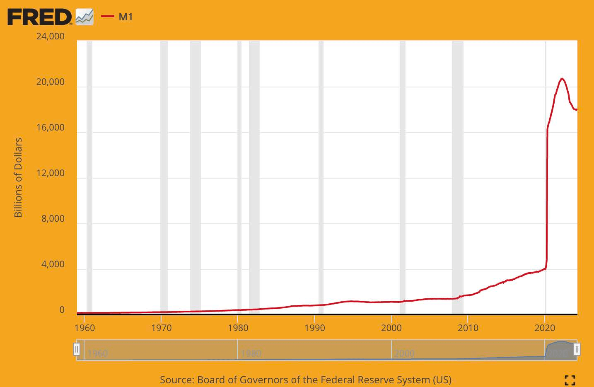

# Warum wir Bitcoin brauchen

## WIR BRAUCHEN ES, WEIL GELD KAPUTT IST

> *`Das Grundproblem bei konventionellen
>Währungen ist das ganze Vertrauen, das
>erforderlich ist, damit sie funktionieren. Der Zentralbank muss
>vertraut werden, dass sie die Währung nicht entwertet,
>aber die Geschichte der Fiat-Währungen ist voll
>von Verstößen gegen dieses Vertrauen. Banken muss
>vertraut werden, dass sie unser Geld halten und
>es elektronisch überweisen, aber sie verleihen es
>in Wellen von Kreditblasen mit kaum einem
>Bruchteil in Reserve. Wir müssen ihnen
>unsere Privatsphäre anvertrauen, darauf vertrauen, dass sie
>Identitätsdiebe nicht unsere Konten leer räumen.`*

~ Satoshi Nakamoto 2009-02-11

* Das Fiat-Geldsystem ist kaputt (war es immer).
* Es ist nicht nachhaltig (war es nie).
* Es gibt keine Möglichkeit, es zu reparieren (wird es nie geben).

---
## DER (NICHT) GOLDKURS
* Viele Leute glauben immer noch, dass Geld durch
Gold gedeckt ist.
* Ist es aber nicht.
* Es ist seit 1971 nicht mehr durch Gold gedeckt, als
Präsident Nixon die Welt einseitig vom
Goldstandard abkoppelte (der Nixon-Schock).
* Siehe **wtfhappenedin1971.com**, um ein klares Bild
der Schäden zu bekommen, die dadurch entstanden sind.

Diagramm, das die Inflation des Verbraucherpreisindex (rote Linie) vs.
die Kaufkraft des US-Dollars (schwarze Linie) seit 1971 zeigt.

<small>U.S. Bureau of Labor Statistics, abgerufen von FRED, Federal Reserve Bank of St. Louis; https://
fred.stlouisfed.org/series/CPIAUCSL, 9. Juni 2024.</small>

* Fun Fact: Das Weltwirtschaftsforum wurde 1971 gegründet.
---

>**FIAT:** (Nomen) /ˈfiː.æt/
>
>: eine autoritäre oder willkürliche Anordnung : DEKRET
>
>: eine autoritäre Festlegung : DIKTAT
>
>**: ein Befehl oder Willensakt, der etwas ohne
>oder wie ohne weitere Anstrengung erschafft**

~ merriam-webster.com/dictionary

>**FIAT :** von lateinisch fieri „gemacht werden, entstehen“

* Fiat ist Geld, das nur deshalb einen Wert hat, weil die Regierung sagt (dekretiert), dass es das tut.
* Daher müssen die Leute (glauben), dass es das tut.
>* **Auch wenn sie nicht glauben, dass Fiat einen Wert hat, werden sie per Gesetz
gezwungen, es zu benutzen und es als Zahlung für
Waren und Dienstleistungen zu akzeptieren.**
* **Fiat-Geld wird aus dem Nichts gedruckt/geschaffen.**
* Heutzutage werden etwa 5 % aller Dollar als
Bargeld gedruckt.
* Die anderen 95 % werden digital von Banken geschaffen, indem sie
Zahlen in einen Computer eingeben, wenn sie Kredite vergeben.

>*Es kostet das Bureau of Engraving and Printing nur wenige Cent, um einen 100-Dollar-Schein herzustellen...*

~ Amerikanischer Wirtschaftswissenschaftler, Barry Eichengreen

---

>***Scott Pelley von NBC ’60 Minutes‘:*** *Ist es richtig zu sagen, dass Sie
>das System einfach mit Geld überschwemmt haben?*
>
>***Fed-Chef Jerome Powell:*** *Ja. Das haben wir getan.
>Das ist eine andere Art, darüber nachzudenken. Das haben wir getan.*
>
>***Pelley:*** *Wo kommt das her?
>Drucken Sie es einfach?*
>
>***Powell:*** *Wir drucken es digital. Als Zentralbank haben wir
>die Möglichkeit, Geld digital zu schaffen. Und das tun wir,
>indem wir Schatzwechsel oder Anleihen für andere staatlich
>garantierte Wertpapiere kaufen. Und das erhöht tatsächlich die
>Geldmenge. Wir drucken auch echtes Bargeld und wir
>verteilen es über die Federal Reserve Banks.*

~ CNBC ’60 Minutes‘ Interview, 17. Mai 2020
Zwei Monate nach Beginn des C*vid-19-Lockdowns

>Es gibt eigentlich keine Grenzen für das, was wir mit diesen Kreditprogrammen tun können, die wir haben.

~ Fed-Chef Jerome Powell
18. März 2020 auf CBS News

>Ja, es gibt eine unendliche Menge an Bargeld in der Federal
Reserve. Wir werden alles tun, was wir tun müssen, um
sicherzustellen, dass genügend Bargeld im Bankensystem vorhanden ist.

~ Neel Kashkari, Präsident der Minneapolis Fed
23. März 2020, CBS '60 Minutes'

>Das „wir“ hier sind fünf Personen, die über Änderungen der
Geldpolitik innerhalb des Federal Reserve Systems
während der FOMC-Sitzungen abstimmen. 5 von 330.000.000.
Mehr braucht es nicht, um die US-Geldpolitik zu ändern.

~ @MartyBent, Gründer von TFTC.io
Forbes Artikel, 18. März 2020

---

## AUS DEM MUNDE DES PFERDES VON DAMALS

>*Die Bank hat Zinsvorteile auf alle Gelder,
die sie aus dem Nichts erschafft.*

*~ William Paterson, 1694
Gründer der Bank of England*

>*Alle Verwirrungen, Verwirrungen und Nöte in Amerika entstehen,
nicht aus den Mängeln der Verfassung oder der Konföderation,
nicht aus dem Mangel an Ehre oder Tugend,
sondern aus schlichter Unkenntnis der
Natur von Münzen, Krediten und Umlauf.*

*~ John Adams
2. Präsident der Vereinigten Staaten, 1797-1801*

>*Ich glaube, dass Bankinstitute gefährlicher
für unsere Freiheiten sind als stehende Heere.
Bereits jetzt haben sie eine Geldaristokratie geschaffen,
die die Regierung verhöhnt.
Die Ausgabe von Geld sollte den Banken entzogen und
dem Volk zurückgegeben werden, dem es rechtmäßig gehört.*

*~ Thomas Jefferson
3. Präsident der Vereinigten Staaten, 1801-1809*

>*Während wir mit unseren edlen Taten prahlten, achteten wir darauf, die hässliche
Tatsache zu verbergen, dass wir durch ein ungerechtes Geldsystem ein
System der Unterdrückung verstaatlicht haben, das, obwohl es raffinierter ist,
nicht weniger grausam ist als das alte System der Chattel-Sklaverei.*

~Horace Greeley
US-Kongressabgeordneter 1848-49
Gründer der The New York Tribune

---

>*Wer das Geldvolumen in einem Land kontrolliert, ist
absoluter Herr über alle Industrie und allen Handel...
wenn Sie erkennen, dass das gesamte System sehr leicht kontrolliert werden kann,
auf die eine oder andere Weise, von ein paar mächtigen Männern an der Spitze, werden Sie nicht
gesagt bekommen müssen, wie Inflations- und Depressionsperioden entstehen*

~ James A. Garfield
20. Präsident der Vereinigten Staaten, März-Sept. 1881
Ermordet im Jahr 1881

>*Heute existiert unkontrolliert in den Händen einer Gruppe von Männern
die Macht, Dollar aus dem Nichts zu machen.*

~ Thomas W. Lawson, Autor von 'Frenzied Finance', 1905

>*Ich war so geheimnisvoll - ja, so heimlich - wie jeder Verschwörer.
Entdeckung, das wussten wir, durfte einfach nicht geschehen, sonst wären unsere ganze Zeit
und Mühe verschwendet. Wenn bekannt würde, dass sich unsere
besondere Gruppe zusammengefunden und einen Bankgesetzentwurf geschrieben hatte, hätte dieser
Gesetzentwurf keinerlei Chancen, vom Kongress verabschiedet zu werden.*

~ Frank A. Vanderlip
Präsident der National City Bank of New York
(Vorläufer der Citi Bank)
~ Er schrieb 1935 über das geheime Treffen, das 1910 auf
Jekyll Island stattfand, um den Gesetzentwurf zu entwerfen, der 1913 als
Federal Reserve Act verabschiedet wurde.

>*Dieses (Federal Reserve) Gesetz errichtet den gigantischsten Trust auf
Erden. Wenn der Präsident (Woodrow Wilson) den Gesetzentwurf unterzeichnet, wird die
unsichtbare Regierung der Geldmacht legalisiert...
Das schlimmste legislative Verbrechen der Geschichte wird
durch dieses Bank- und Währungsgesetz begangen.*

~ Charles A. Lindbergh, Sr.
US-Kongressabgeordneter 1907-1917

---

>*Ich bin ein sehr unglücklicher Mann. Ich habe unwissentlich mein Land ruiniert.
Eine große Industrienation wird von ihrem Kreditsystem kontrolliert.
Unser Kreditsystem ist konzentriert. Das Wachstum der Nation,
daher liegen alle unsere Aktivitäten in den Händen einiger weniger Männer.
Wir sind zu einer der am schlechtesten regierten, einer der am
vollständigsten kontrollierten und beherrschten Regierungen in der zivilisierten
Welt geworden. Längst keine Regierung mehr durch freie Meinungsäußerung, längst keine
Regierung mehr durch Überzeugung und die Stimme der Mehrheit, sondern eine
Regierung durch die Meinung und den Zwang einer
kleinen Gruppe dominanter Männer.*

~ Woodrow Wilson
28. Präsident der Vereinigten Staaten, 1913-1921
6 Jahre nach der Verabschiedung des Federal Reserve Act von 1913.

>*Die wahre Wahrheit ist, wie Sie und ich wissen,
dass ein finanzielles Element in den großen Zentren
die Regierung der USA seit den
Tagen von Andrew Jackson besitzt.*

~ Franklin D. Roosevelt
32. Präsident der Vereinigten Staaten in einem Brief vom
21. November 1933 an Colonel E. Mandell House

>*Es [die Depression] war kein Zufall.
Es war ein sorgfältig ausgeklügeltes Ereignis....
Die internationalen Bankiers versuchten,
hier einen Zustand der Verzweiflung herbeizuführen, damit sie
als die Herrscher über uns alle hervorgehen könnten.*

~ Kongressabgeordneter Louis T. McFadden,
Ermordet im Jahr 1936

>Vorsitzender des Banken- und Währungsausschusses des Repräsentantenhauses
*Jedes Mal, wenn eine Bank einen Kredit vergibt,
wird neuer Bankkredit geschaffen - neue Einlagen - brandneues Geld.*

~ Graham F. Towers
Gouverneur der Zentralbank von Kanada, 1934-55

---

>*Wenn es in unserem Geldsystem keine Schulden gäbe,
gäbe es kein Geld*

*~ Marriner Eccles,
1941, Gouverneur der Fed*

>*Ich habe noch nie jemanden gehabt, der durch
den Gebrauch von Logik und Vernunft rechtfertigen konnte, dass die Bundesregierung
sich die Nutzung ihres eigenen Geldes leiht...
Ich glaube, es wird die Zeit kommen, in der die Menschen
fordern werden, dass dies geändert wird.
Ich glaube, es wird die Zeit in diesem Land kommen, in der
sie Sie und mich und
alle anderen, die mit dem Kongress zu tun haben,
tatsächlich dafür verantwortlich machen werden, dass wir
tatenlos zugesehen und
ein solch idiotisches System weiterhin zugelassen haben.*

~ Wright Patman
US-Kongressabgeordneter 1928-1976
Vorsitzender des Ausschusses für Banken und Währung 1963-1975

>*Wenn Sie oder ich einen Scheck ausstellen, muss sich genügend Guthaben auf unserem
Konto befinden, um den Scheck zu decken, aber wenn die Federal Reserve einen
Scheck ausstellt, gibt es keine Bankeinlage, auf die dieser Scheck gezogen wird. Wenn
die Federal Reserve einen Scheck ausstellt, schafft sie Geld*

~ Federal Reserve Bank von Boston
'Putting It Simply', 1984

---

## DIE FEDERAL RESERVE

* Die Fed ist die „unabhängige“ Zentralbank der
USA. Sie wurde 1913 mit der Verabschiedung des
Federal Reserve Act gegründet.
* Sie hat eine einzigartige Struktur, teils privat und teils
staatlich.
* Sie soll eine politisch unabhängige,
überparteiliche Einheit innerhalb der Regierung sein.
* Während das Fed Board of Governors vom
Präsidenten ernannt und vom Kongress bestätigt wird, müssen
**die Entscheidungen der Fed von niemandem
ratifiziert werden.**

**Sie besteht aus:**

* Dem Federal Reserve Board of Governors
* 12 Federal Reserve Banken
* Dem Federal Open Markets Committee (FOMC),
das das geldpolitische Entscheidungsgremium ist.

**Die Fed ist verantwortlich für:**

* Die Aufsicht über die US-Geldpolitik, die Förderung von Beschäftigung und stabilen Preisen.
* Die Regulierung und Aufsicht von Banken und Finanzinstituten.
* Die Bereitstellung von Zahlungsdiensten für Finanzinstitute.
* Die Förderung des Verbraucherschutzes und der Gemeindeentwicklung.

---

## EINE ANMERKUNG ZUM VORSITZENDEN DER FED

* **Der Vorsitzende der Federal Reserve ist auch:**

* Vorsitzender des Federal Open Market Committee
(FOMC), das über die Ausrichtung der US-
Geldpolitik entscheidet (z. B. QE, Zinserhöhungen)
* Mitglied des Internationalen Währungsfonds,
des IWF
* Mitglied der Bank für Internationalen
Zahlungsausgleich, der BIZ (die Bank der Zentralbanken).
* Der US-Finanzminister der G-7
* Der US-Finanzminister der G-20

* Eine **ganze** Menge Macht für eine Person.

---

## FRAKTIONALE RESERVEBANK, ZINSEN & KREDITE

* **Fraktionale Reservebank:** Bis März 2020 mussten Banken
eine Reserve von 10 % halten und konnten
90 % verleihen.
* **Seit März 2020 gibt es keine vorgeschriebene Reserve mehr, so dass Banken unbegrenzt Kredite vergeben können.**

* Ein Kredit ist schuldenbasiertes Geld, und Sie müssen
Zinsen auf den Kredit zahlen.

>* **Fun Fact 1:** Das Geld, um die Zinsen auf den
>Kredit zu zahlen, wird NICHT von den Banken geschaffen.
>* **Fun Fact 2:** Es wird NIEMALS geschaffen.
>* **Fun Fact 3:** Es gibt NICHT GENUG Geld in der
>Welt, um alle Kredite + die auf diese Kredite fälligen Zinsen zurückzuzahlen.
>* **Fun Fact 4:** Das wird es nie geben!

---

## EINE ANMERKUNG ZUM PETRO-DOLLAR
* Man könnte sagen, **dass der Dollar bis 1971 durch
Gold gedeckt war und seit 1974 durch Öl,
und damit standardmäßig durch das US-Militär.**
* **1974 schlossen die USA und Saudi-Arabien bilaterale Vereinbarungen ab, um den Verkauf von Öl in US-Dollar zu bepreisen.**
* Seitdem werden die meisten globalen Ölverkäufe in
US-Dollar abgewickelt.
* Dies hat maßgeblich dazu beigetragen, dass der Dollar zur
stärksten Währung der Welt geworden ist.
* **Er wurde also künstlich gestützt,** selbst in
Zeiten, in denen er normalerweise zu kämpfen gehabt hätte.
* Seit Ende 2022 haben eine Reihe von Ländern
begonnen, in anderen Währungen als dem US-
Dollar zu handeln
* Es ist sehr gut möglich, dass dies der Anfang vom
Ende des Petro-Dollars sein könnte. Was als nächstes geschieht,
bleibt abzuwarten...

---

## ZU QE (QUANTITATIVE ENTSCHÄRFUNG)
* **Quantitative Entschärfung gilt als „unkonventionelle
Geldpolitik“, die von Zentralbanken zur „Stimulierung
der Wirtschaft“ eingesetzt wird, wobei die Fed Staatsanleihen
und andere staatliche Wertpapiere kauft.**
* Sie wurde erstmals von Japan zwischen 2001 und 2006 eingesetzt.
Danach nutzten die USA, Großbritannien und die Eurozone
QE während der Finanzkrise von 2008.
* Seitdem gab es in den USA nur zwischen 2014 und 2019 kein
QE-Programm.
* Wie unten zu sehen ist, argumentieren Kritiker, dass **QE
überwiegend den bereits Wohlhabenden zugute kommt**

*Quelle: @RudyHavenstein auf Twitter*

---

## ZYKLEN

* **In der Natur gibt es Zyklen, natürliche Ebbe und
Flut, Expansionen und Kontraktionen.**

* Dies **trägt zu einem allgemeinen, langfristigen, Gleichgewicht
und Nachhaltigkeit** des gesamten vernetzten
Systems, des gesamten Lebens auf der Erde **bei**.
* **Das schuldenbasierte Fiat-Währungssystem ignoriert die
Weisheit der natürlichen Zyklen,** sondern basiert stattdessen auf,
und ist für sein Überleben zu 100 % darauf angewiesen, dass es ein beispielloses
und ungemildertes Wachstum gibt, um weiterhin
seine Schulden zu bedienen.
* In der Natur ist dies Krebs.
* In der „Wirtschaft“ wird diese unnatürliche Entwicklung weiter
dadurch unterstützt, dass die Regierung scheiternde
Banken und große Unternehmen rettet, anstatt sie
zusammenbrechen und zu etwas Neuem, etwas Gesünderem recycelt zu werden.
* **Die Kurzsichtigkeit, scheiternde Unternehmen zu retten, gefährdet die gesamte Wirtschaft.** Im Wesentlichen
wird das Problem nur aufgeschoben, und die unvermeidlichen Turbulenzen, die vor uns liegen, werden wahrscheinlich viel, viel
intensiver sein, als wenn sich natürliche Zyklen hätten
abspielen können.
* **Wir sind Satoshi Nakamoto und den
Cypherpunks vor und nach ihm zu Dank verpflichtet,** für ihre
Vision, Weitsicht, Entschlossenheit und ihr Können, uns ein
Rettungsboot zu bieten, um uns zu neuen Ufern zu bringen.

---

* Sobald wir das Geschenk, das dies ist, erkennen, liegt es an uns,
mit vollem Herzen und klarem Verstand an Bord zu gehen, um
die Reise anzutreten und mit dem Geld
des Friedens eine neue Welt aufzubauen.
>* **Bitcoin repariert das Geld, es liegt an uns, den Rest zu reparieren.
Und um es klar zu sagen: Wenn das Geld repariert ist, wird
automatisch EINE MENGE anderer Dinge repariert**

* Die wichtigste davon ist, dass groß angelegte, von der Regierung initiierte, kinetische Kriege ohne die Unterstützung des Volkes nicht mehr rentabel oder möglich sind.
* Darüber hinaus wird es natürlich weniger Konsum geben,
zusammen mit einer Umstellung auf Güter und Dienstleistungen mit echtem Wert, freie Märkte, reale Ersparnisse und Entmonetarisierung von
Wohnraum und Immobilien, die ohnehin nie monetarisiert werden sollten.
* **SIEHE:** Bitcoin repariert das, Seite 32
---

## WIR BRAUCHEN ES, WEIL INFLATION DIEBSTAHL IST

FRED-Diagramm von 2024, das den sinkenden Kaufkraft des
Dollars seit der Gründung der Federal Reserve im Jahr
1913 zeigt. Die kumulative Inflationsrate seit 1913 liegt bei etwa
3,067 %. Alle Fiat-Währungen der Zentralbanken auf der ganzen Welt
folgen einer ähnlichen Rückgangsrate.

* **Je mehr Geld aus dem Nichts geschaffen wird,
desto mehr verliert alles Geld an Wert/Kaufkraft.**
* Dies wird **Inflation** genannt.
* Inflation ist buchstäblich **Zeitdiebstahl**. Der Wert Ihrer
Zeit wird gestohlen, wenn Sie sie in einer Währung sparen, die
aufgebläht, entwertet und manipuliert wird.
* Inflation ist auch eine **versteckte Steuer**.

---

* Dieser Zeitdiebstahl und diese Steuer haben auch alle anderen
Fiat-Währungen der Länder betroffen, da sie alle
an den US-Dollar gekoppelt waren, da dieser seit dem Bretton-Woods-Abkommen von 1944 die
Weltreservewährung ist.
* **In den USA ist eine jährliche Inflationsrate von 2 % im
Mandat der Federal Reserve festgeschrieben.**
* Das bedeutet, dass **Sie GARANTIERT jedes Jahr 2 % WENIGER
kaufen können** mit demselben 20-Dollar-Schein.
* **Im März 2024 betrug die jährliche Inflationsrate 3,5 %,**
(viel mehr als 2 %, was bedeutet, dass Sie 3,5 % Ihrer
Kaufkraft zwischen März 2023 und
März 2024 verloren haben.
* Anders ausgedrückt bedeutet dies, dass die Preise im Durchschnitt
um 3,5 % gestiegen sind
* **Wenn die Inflation genau gemessen würde, wie
bis in die frühen 1980er Jahre, würde sie 2024
tatsächlich eher bei 10 % liegen.**
* Betrachtet man die einzelnen Kategorien, so stellt man fest, dass
die Inflation in vielen Kategorien im vergangenen Jahr
viel schlimmer ist als 3,5 %.
* Wenn man sich die Miete, die Lebensmittelrechnungen, die Benzinpreise und
fast alles, was man kauft, ansieht, ist es ganz klar, dass
die Inflation in jedem Sektor grassiert

---
**Durchschnittliche Inflation in den
letzten 50 Jahren in den USA:**

|  Durchschnittliche Kosten   |   1971  |   2021  |   % Steigerung  |
| --- | --- | --- | --- |
|  Gehalt   |    9.400 $ |    59.400 $ |    532 % |
|   Haus  |    23.400 $ |    513.000 $ |    2.092 % |
|    Gallone Benzin | 0,36 $    |   4,17 $ |  1.058 %   |
|    Neuwagen |  3.400 $   |   47.000 $  |    1.282 % |
|   Hochschulabschluss   |  1.400 $   |   26.000 $  |  1.757 %   |
|   Warenkorb  |20 $     |  210 $ |    950 % |
|  Strom/kWh   |  0,02 $    |   0,15 $  |   650 %  |

>**Wahre Geschichte:**
~ Ein Haus wurde 1976 für 58.000 $ gekauft.
~ Unter Berücksichtigung der „offiziellen“ Inflation wären das
279.000 $ in Dollar von 2022.
~ Im Jahr 2022 wurde dasselbe Haus mit 2,09 Millionen $ bewertet.
~ Denken Sie darüber nach...

>*Fiat-Währung ist Desinformation.
Welche Informationen vermittelt ein 10-Dollar-Schein?
Die 10 ist der Zähler eines Bruchs, bei dem
der Nenner fehlt.
10 von was?
Die 10 sagt nichts ohne einen bekannten
und stabilen Nenner.*

~ @bitlany

---

* **Wenn die Inflation steigt, verlieren Ihre Ersparnisse (wenn Sie das Glück
haben, Ersparnisse zu haben) an Wert.**
* Im Laufe der Zeit verlieren sie **VIEL** an Wert
>*Wenn Sie heute beginnen, 100 $/Monat zu sparen, mit dem
besten verfügbaren Zinssatz von 0,05 %:
> * n 30 Jahren hätten Sie **84.019 $** gespart.
>* Bereinigt um die von der FED vorgeschriebene Inflation von 2 %
>* In 30 Jahren hätten Ihre Ersparnisse eine effektive
Kaufkraft von nur **46.384 $**.
>* Bereinigung um die heutige Inflation von 3,5 %:
>* Ihre Ersparnisse im Wert von 84.019 $ hätten in 30 Jahren
eine Kaufkraft von nur **11.037 $**!

* **In der Tat bedeutet dies, dass etwa sechs von
sieben Stunden Ihrer Arbeit gestohlen wurden = *Zeitdiebstahl.***

---
**Eine andere Möglichkeit, dies zu betrachten, ist die folgende:**
* Im Jahr **1971** kostete ein Haus das **2,5-fache** eines durchschnittlichen
Jahresgehalts.
* Im Jahr **2024** kostet ein Haus das **8,6-fache** eines
durchschnittlichen Jahresgehalts.
* Im Jahr **1971** kostete ein Neuwagen etwa **1/3** eines durchschnittlichen Gehalts
* Im Jahr **2024** kostet ein Neuwagen über **3/4** eines durchschnittlichen Gehalts.

Ich bin zuversichtlich, dass es jetzt klar ist, dass
Inflation
* **nicht** *
zu Ihren Gunsten wirkt.

**Hinweis:** Alle diese Zahlen sind Durchschnittswerte und variieren je nach
vielen Faktoren. Der Punkt bleibt, Inflation ist eine versteckte Steuer
und ist Zeitdiebstahl an unserer realen Arbeit und Produktion

>* **Hartes Geld behebt das.**
>* **Bitcoin ist hartes Geld**
---

## WIR MÜSSEN DIE ZENTRAL GESTEUERTE, MANIPULIERTE, SCHULDENBASIERTE WIRTSCHAFT ERSETZEN

>*Ich glaube nicht, dass wir jemals wieder ein gutes Geld haben werden,
bevor wir die Sache aus den Händen der Regierung nehmen,
das heißt, wir können sie nicht gewaltsam aus den Händen der
Regierung nehmen, alles, was wir tun können, ist auf einem verschlungenen Weg etwas einzuführen,
das sie nicht aufhalten können.*

~ Friedrich Hayek, 1984
Österreichischer Wirtschaftswissenschaftler, Philosoph und Autor, 1899-1992

Diagramm, das den exponentiellen Anstieg der M1-Geldmenge von
4 Billionen Dollar im März 2020 auf über 18 Billionen Dollar im Juni 2024 zeigt.

* **Sprengen Sie hier Ihren Verstand:** https://usdebtclock.org/
---
* **45 % aller US-Dollar, die es gibt, wurden
zwischen April 2020 und Januar 2022 gedruckt!**
* Gedruckt aus dem Nichts, wohlgemerkt?
* Fiat-Geld wird zentral vom Staat kontrolliert, und
das Angebot wird leicht manipuliert.
* **Es dauerte 205 Jahre, bis die US-Staatsverschuldung
1 Billion Dollar erreichte. (1776 > 1981)**
* Es dauerte nur **33 weitere Jahre, bis die** US-Staatsverschuldung
**34 Billionen Dollar erreichte!** (1981 > 2024)

FRED-Diagramm, das die Gesamtverschuldung des Staates von 1970 bis 2024 in den USA zeigt.

>*Die globale Verschuldung, gemessen vom Institute of
International Finance, beläuft sich mittlerweile auf 303 BILLIONEN Dollar.
Dies ist unser Planet auf schuldenbasiertem Fiat.
Übrigens beträgt das globale BIP nur 84 Billionen Dollar.*

*~ Nik Bhatia, Autor von ‘Layered Money’, 2021*

---

* **Zum Vergleich**

| **Wenn Sie haben:** | **Sie können 1 $/Sekunde ausgeben** |                |
| ------------ | ----------------------- | -------------- |
| **1 Million $**   | oder 11 Tage              | = 11 Tage    |
| **1 Milliarde $**   | für 11.680 Tage         | = 32 Jahre   |
| **1 Billion $**  | für 11.680.000 Tage     | = 32.000 Jahre |

* Wir sind alle der Gnade derer ausgeliefert, die die Macht haben,
zu entscheiden, wann mehr gedruckt werden soll und welche Zinssätze
erhoben werden sollen.
* **Wenn die Fed die Zinsen erhöht, dann wird die Aufnahme
eines Kredits für ein Haus oder ein Auto plötzlich teurer,
was die Ausgaben verlangsamt und zu einer Stagflation führt**

* **Wenn sie die Zinssätze künstlich niedrig halten, treten wir in eine
Periode der Depression ein**

>* **Wenn man der Zentralbank erlaubt, das finanzielle
"Wetter" zu machen, nimmt man uns die Freiheit, den Markt entscheiden zu lassen, was von Wert ist und was nicht.**

* Darüber hinaus **stützen sie die Wirtschaft künstlich, wenn sie Banken und Unternehmen retten.** Es ist nur
eine Frage der Zeit, bis das Kartenhaus zusammenfällt.
* Das ursprüngliche Argument für eine Zentralbank war, dass
es einen Kreditgeber der letzten Instanz geben müsse, wenn die
Wirtschaft ins Wanken gerät.

---
* **Dies hat sich dahin entwickelt, dass die Zentralbank ein Herrscher
erster Instanz ist, mit beispielloser, nicht gewählter, letztlich
autoritärer Macht.**

> *Alles Geld ist politisch, außer Bitcoin.
Fiat-Währungen, Bankinstrumente, Fintech-Kredite,
andere Kryptowährungen und sogar Gold werden alle von
Regierungen, Unternehmen oder kleinen Gruppen kontrolliert.
Eine Ausnahme zu haben, wird sich als sehr nützlich erweisen,
wenn wir in die Zukunft gehen.*

*~ Alex Gladstein @gladstein
Chief Strategy Officer der Human Rights Foundation*

>*Bitcoin verbindet 8 Milliarden Menschen, verbindet
hundert Millionen Unternehmen, es synchronisiert die Welt
über politische Gerichtsbarkeiten hinweg und bringt Rationalität in
das gesamte Finanzsystem zurück und es gibt der gesamten Menschheit
Freiheit und Eigentumsrechte zurück*

*~Michael Saylor
CEO Microstrategy*

---

## WIR MÜSSEN DIE MENSCHEN OHNE BANKVERBINDUNG MIT BANKDIENSTLEISTUNGEN VERSORGEN

>*Für 953 Millionen Menschen in 20 Ländern mit schwächelnden
Währungen stellt Bitcoin etwas Größeres als einen
Vermögenswert dar. Für sie ist es eher eine Arche
verschlüsselter Energie, um der Flut zu entkommen.*

*~ Michael Saylor
CEO von Microstrategy*

* **Stand 2024 haben etwa 25 % der Erwachsenen auf
der Welt keine Bankverbindung, etwa 1,4 Milliarden Menschen!**

>* **Das bedeutet, dass sie keinen Zugang zu Bankdienstleistungen haben
>und keine Geldautomaten, Debitkarten, Kreditkarten oder
>Schecks verwenden können.**
>* **Darüber hinaus sind sie nicht in der Lage, Kredite aufzunehmen, um
ein Unternehmen zu gründen, ein Auto oder ein Haus usw. zu kaufen.**

* **Das Senden und Empfangen von Geld oder das Einlösen von Schecks ist
teuer.**

* Sie müssen Geldtransfer- und Scheckeinlösedienste
wie Western Union nutzen, die hohe Gebühren erheben
und Zeit für die Bearbeitung benötigen.

* Es ist **besonders teuer für Menschen, die Geld
nach Hause an ihre Familien** in anderen Ländern (Überweisungen) senden,
was bis zu 10 % oder 12 % über eine Bank kosten kann

---
* Es ist **teuer und zeitaufwendig für diejenigen, die Überweisungen erhalten,** da sie für den Transport bezahlen
und zum Geldtransferbüro gehen müssen, oft weit von ihrem
Wohnort entfernt, um das Geld zu bekommen, das ihr Familienmitglied gesendet hat.

* Oftmals ist es für sie nicht sicher, zu diesen
Büros zu reisen.
* Bitcoin über das Lightning Network bietet jetzt eine
sofortige Lösung für diese Probleme!

***#bitcoin repariert das***
>*Wann wurde eine Technologie, die Menschen
ermächtigt, jemals aufgehalten?*

*~ Jeff Booth
Autor: Der Preis von morgen*

---

## WIR MÜSSEN DEN MENSCHEN HELFEN, DER TYRANNEI UND DEM WÄHRUNGSZUSAMMENBRUCH ZU ENTFLIEHEN

* Wie wir gesehen haben, können und tun Regierungen
in den letzten Jahren die Bankkonten
derjenigen einfrieren, mit denen sie nicht einverstanden sind.

>* **Dies zeigt, dass Ihr Geld auf der Bank
im Wesentlichen nichts anderes als ein Schuldschein ist, der Ihnen
jederzeit gestohlen werden kann.**

* Wenn die Inflation grassiert, wie wir es derzeit
2024 in Venezuela (283 %), Sudan
(63 %), Libanon (212 %), Syrien (79 %),
Argentinien (161 %), Simbabwe (47 %), Türkei
(64 %) und mehr sehen, werden die Lebensersparnisse der Menschen
verdampft, manchmal über Nacht, und sie können
nichts dagegen tun.
* Für Menschen, die eines der oben genannten Probleme haben, wird **Bitcoin
zu einer echten, sofortigen Lösung für
ein ansonsten untragbares Problem.**
* **In Anbetracht der Tatsache, dass sowohl Tyrannei als auch Inflation
an vielen Orten zunehmen, wäre es ratsam, sich
dagegen abzusichern, indem man jetzt Bitcoin erwirbt.**
---
## WIR MÜSSEN CBDCS VERMEIDEN
* Sie haben vielleicht gehört, dass **Zentralbanken beginnen,
CBDCs, Central Bank Digital Currencies, zu schaffen.**
Im Mai 2020 untersuchten 35 Länder diese Option.
* Im März 2022 waren 87 Länder aktiv auf der Suche
oder hatten bereits einen Pilot-CBDC gest