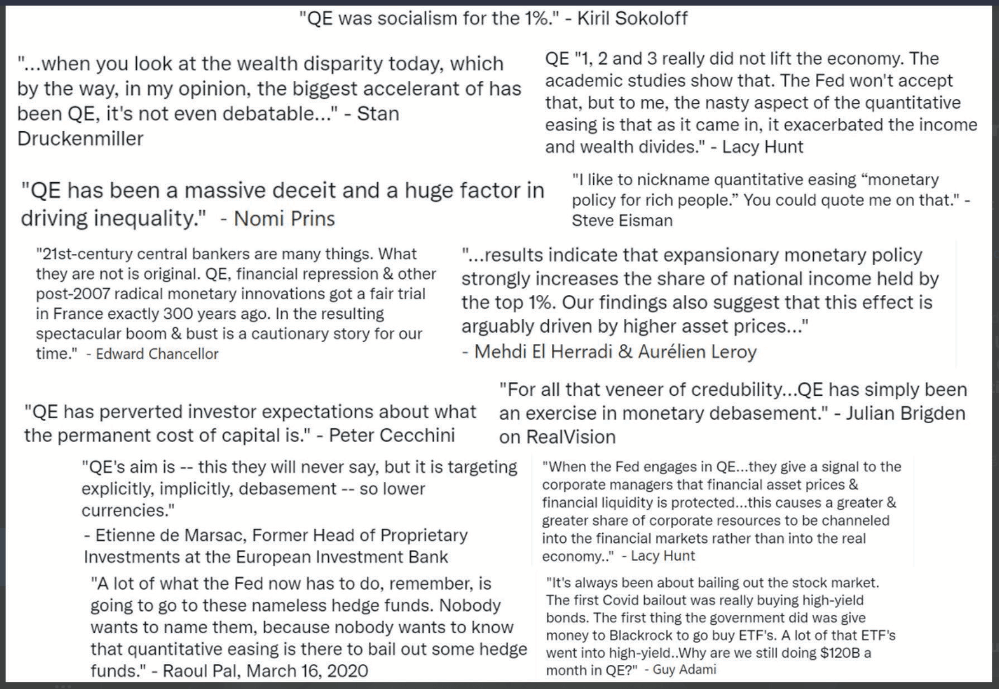
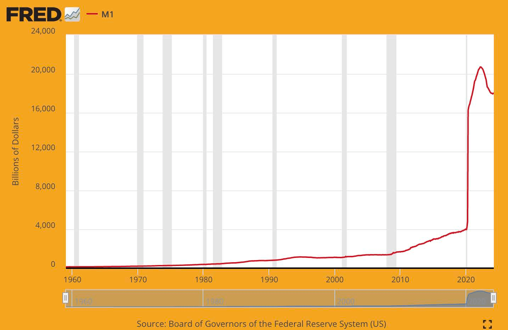

# Warum wir Bitcoin brauchen

## WIR BRAUCHEN ES, WEIL GELD KAPUTT IST

> *`Das grundlegende Problem mit konventionellen
>Währungen ist das ganze Vertrauen, das
>nötig ist, damit sie funktionieren. Der Zentralbank muss
>vertraut werden, dass sie die Währung nicht entwertet,
>aber die Geschichte der Fiat-Währungen ist voll
>von Brüchen dieses Vertrauens. Banken muss
>vertraut werden, dass sie unser Geld verwahren und
>es elektronisch überweisen, aber sie verleihen es
>in Wellen von Kreditblasen mit kaum einer
>Fraktion in Reserve. Wir müssen ihnen
>unsere Privatsphäre anvertrauen, darauf vertrauen, dass sie nicht zulassen,
>dass Identitätsdiebe unsere Konten leerräumen.`*

~ Satoshi Nakamoto 2009-02-11

* Das Fiat-Geldsystem ist kaputt (war es schon immer).
* Es ist nicht nachhaltig (war es noch nie).
* Es gibt keine Möglichkeit, es zu reparieren (wird es nie geben).

---

## DER (NICHT-)GOLDSTANDARD
* Viele Leute glauben immer noch, dass Geld durch Gold gedeckt ist.
* Das ist nicht der Fall.
* Es ist seit 1971 nicht mehr durch Gold gedeckt, als
Präsident Nixon die Welt einseitig vom
Goldstandard abkoppelte (der Nixon-Schock).
* Siehe **wtfhappenedin1971.com**, um ein klares Bild
von dem Schaden zu bekommen, den dies angerichtet hat.

Diagramm, das die Inflation des Verbraucherpreisindex (rote Linie) vs.
die Kaufkraft des US-Dollars (schwarze Linie) seit 1971 zeigt.

<small>U.S. Bureau of Labor Statistics, abgerufen von FRED, Federal Reserve Bank of St. Louis; https://
fred.stlouisfed.org/series/CPIAUCSL, 9. Juni 2024.</small>

* Fun Fact: Das Weltwirtschaftsforum wurde 1971 gegründet.
---

>**FIAT:** (Nomen) /ˈfiː.æt/
>
>: eine autoritative oder willkürliche Anordnung : DEKRET
>
>: eine autoritative Festlegung : DIKTAT
>
>**: ein Befehl oder Willensakt, der etwas ohne
>oder wie ohne weitere Anstrengung erschafft**

~ merriam-webster.com/dictionary

>**FIAT :** vom lateinischen fieri «gemacht werden, entstehen»

* Fiat ist Geld, das nur deshalb einen Wert hat, weil die Regierung sagt (verordnet), dass es das tut.
* Deshalb müssen die Leute (es) glauben.
>* **Auch wenn sie nicht glauben, dass Fiat einen Wert hat, sind sie gesetzlich dazu gezwungen, es zu verwenden und als Zahlung für Waren und Dienstleistungen zu akzeptieren.**
* **Fiatgeld wird aus dem Nichts gedruckt/geschaffen.**
* Heutzutage werden etwa 5 % aller Dollar als Bargeld gedruckt.
* Die anderen 95 % werden digital von Banken erstellt, indem sie
Zahlen in einen Computer eingeben, wenn sie Kredite vergeben

>*Es kostet das Bureau of
Engraving and Printing nur wenige Cent, um einen 100-Dollar-Schein herzustellen...*

~ Amerikanischer Wirtschaftswissenschaftler, Barry Eichengreen

---

>***Scott Pelley von NBC '60 Minutes':*** *Kann man sagen, Sie
>haben das System einfach mit Geld überschwemmt?*
>
>***Fed-Chef Jerome Powell:*** *Ja. Das haben wir getan.
>So kann man es auch sehen. Das haben wir getan.*
>
>***Pelley:*** *Wo kommt es her?
>Drucken Sie es einfach?*
>
>***Powell:*** *Wir drucken es digital. Als Zentralbank haben wir
>die Möglichkeit, digital Geld zu schöpfen. Und das tun wir,
>indem wir Schatzwechsel oder Anleihen für andere staatlich
>garantierte Wertpapiere kaufen. Und das erhöht tatsächlich die
>Geldmenge. Wir drucken auch tatsächliche Währung und
>verteilen diese über die Federal Reserve Banken.*

~ CNBC '60 Minutes' Interview, 17. Mai 2020
Zwei Monate nach Beginn des C*vid-19-Lockdowns

>Es gibt wirklich keine Grenzen für das, was wir
mit diesen Kreditprogrammen tun können, die wir haben.

~ Fed-Chef Jerome Powell
18. März 2020 auf CBS News

>Ja, es gibt unendlich viel Bargeld in der Federal
Reserve. Wir werden alles tun, was wir tun müssen, um
sicherzustellen, dass genügend Bargeld im Bankensystem vorhanden ist.

~ Neel Kashkari, Präsident der Minneapolis Fed
23. März 2020, CBS '60 Minutes'

>Das "wir" sind hier fünf Personen, die über Änderungen der
Geldpolitik innerhalb des Federal Reserve Systems
während der FOMC-Sitzungen abstimmen. 5 von 330.000.000.
Das ist alles, was nötig ist, um die US-Geldpolitik zu ändern.

~ @MartyBent, Gründer von TFTC.io
Forbes Artikel, 18. März 2020

---

## AUS DEM MAUL DES PFERDES VON EINST

>*Die Bank profitiert von Zinsen auf alle Gelder,
die sie aus dem Nichts erschafft.*

*~ William Paterson, 1694
Gründer der Bank of England*

>*Alle Verwirrung, Konfusion und Not in Amerika entstehen,
nicht aus den Mängeln der Verfassung oder Konföderation,
nicht aus dem Mangel an Ehre oder Tugend,
sondern vielmehr aus schlichter Unkenntnis
der Natur von Münzen, Krediten und Umlauf.*

*~ John Adams
2. Präsident der Vereinigten Staaten, 1797-1801*

>*Ich glaube, dass Bankinstitute gefährlicher
für unsere Freiheiten sind als stehende Heere.
Bereits haben sie eine Geldaristokratie hervorgebracht,
die die Regierung verhöhnt.
Die Macht zur Geldausgabe sollte den Banken genommen und
dem Volk zurückgegeben werden, dem sie rechtmäßig gehört.*

*~ Thomas Jefferson
3. Präsident der Vereinigten Staaten, 1801-1809*

>*Während wir uns unserer edlen Taten rühmten, waren wir darauf bedacht, die hässliche
Tatsache zu verbergen, dass wir durch ein unaufrichtiges Geldsystem ein
System der Unterdrückung verstaatlicht haben, das, obwohl verfeinerter, nicht
weniger grausam ist als das alte System der Chattel-Sklaverei.*

~Horace Greeley
US-Kongressabgeordneter 1848-49
Gründer der New York Tribune

---

>*Wer auch immer die Geldmenge in einem Land kontrolliert, ist
absoluter Herr über alle Industrie und Handel...
wenn Sie erkennen, dass das gesamte System auf die eine
oder andere Weise von einigen wenigen mächtigen Männern an der Spitze sehr leicht kontrolliert werden kann, wird man Ihnen nicht
sagen müssen, wie Perioden von Inflation und Depression entstehen*

~ James A. Garfield
20. Präsident der Vereinigten Staaten, März-Sept. 1881
Ermordet im Jahr 1881

>*Es existiert heute unkontrolliert in den Händen einer Gruppe von Männern
die Macht, Dollar aus dem Nichts zu machen.*

~ Thomas W. Lawson, Autor von 'Frenzied Finance', 1905

>*Ich war so geheimnisvoll - ja, so verstohlen - wie jeder Verschwörer.
Eine Entdeckung durfte einfach nicht geschehen, sonst wären all unsere Zeit
und Mühe verschwendet gewesen. Wenn herauskommen würde, dass sich unsere
besondere Gruppe zusammengefunden und ein Bankengesetz geschrieben hatte, hätte dieses
Gesetz überhaupt keine Chance, vom Kongress verabschiedet zu werden.*

~ Frank A.Vanderlip
Präsident der National City Bank of New York
(Vorläufer der Citi Bank)
~ Geschrieben im Jahr 1935 über das geheime Treffen, das 1910 auf
Jekyll Island stattfand, um den Gesetzentwurf zu entwerfen, der 1913 als
Federal Reserve Act verabschiedet wurde.

>*Dieses (Federal Reserve) Gesetz etabliert den gigantischsten Trust auf
Erden. Wenn der Präsident (Woodrow Wilson) das Gesetz unterzeichnet, wird die
unsichtbare Regierung der Geldmacht legalisiert...
Das schlimmste legislative Verbrechen der Zeitalter wird
durch dieses Banken- und Währungsgesetz begangen.*

~ Charles A. Lindbergh, Sr.
US-Kongressabgeordneter 1907-1917

---

>*Ich bin ein höchst unglücklicher Mann. Ich habe unwissentlich mein Land ruiniert.
Eine große Industrienation wird von ihrem Kreditsystem kontrolliert.
Unser Kreditsystem ist konzentriert. Das Wachstum der Nation,
und somit all unsere Aktivitäten, liegen in den Händen einiger weniger Männer.
Wir sind zu einer der am schlechtesten regierten, einer der am
vollständigsten kontrollierten und beherrschten Regierungen in der zivilisierten
Welt geworden. Längst keine Regierung mehr durch freie Meinungsäußerung, längst keine
Regierung mehr durch Überzeugung und die Stimmenmehrheit, sondern eine
Regierung durch die Meinung und den Zwang einer
kleinen Gruppe dominanter Männer.*

~ Woodrow Wilson
28. Präsident der Vereinigten Staaten, 1913-1921
6 Jahre nach Verabschiedung des Federal Reserve Act von 1913.

>*Die wahre Wahrheit ist, wie Sie und ich wissen,
dass ein finanzielles Element in den großen Zentren
die Regierung der USA seit
den Tagen von Andrew Jackson besitzt.*

~ Franklin D. Roosevelt
32. Präsident der Vereinigten Staaten in einem Brief, der
am 21. November 1933 an Colonel E. Mandell House geschrieben wurde

>*Es [die Depression] war kein Zufall.
Es war ein sorgfältig inszeniertes Ereignis...
Die internationalen Banker versuchten,
einen Zustand der Verzweiflung herbeizuführen, damit sie
als die Herrscher über uns alle hervorgehen könnten.*

~ Kongressabgeordneter Louis T. McFadden,
Ermordet im Jahr 1936

>Vorsitzender des Banken- und Währungsausschusses des Repräsentantenhauses
*Jedes Mal, wenn eine Bank einen Kredit vergibt,
wird neues Bankguthaben geschaffen - neue Einlagen - brandneues Geld.*

~ Graham F.Towers
Gouverneur der Zentralbank von Kanada, 1934-55

---

>*Wenn es keine Schulden in unserem Geldsystem gäbe,
gäbe es kein Geld*

*~ Marriner Eccles,
1941, Gouverneur der Fed*

>*Ich hatte noch nie jemanden, der durch
den Einsatz von Logik und Vernunft rechtfertigen konnte, warum sich die Bundesregierung
die Nutzung ihres eigenen Geldes leiht...
Ich glaube, die Zeit wird kommen, in der die Menschen
verlangen werden, dass dies geändert wird.
Ich glaube, die Zeit wird in diesem Land kommen, in der
sie tatsächlich Sie und mich und
alle anderen, die mit dem Kongress verbunden sind,
beschuldigen werden, untätig zuzusehen und
ein so idiotisches System weiterhin zuzulassen.*

~ Wright Patman
US-Kongressabgeordneter 1928-1976
Vorsitzender des Ausschusses für Banken und Währung 1963-1975

>*Wenn Sie oder ich einen Scheck ausstellen, muss sich genügend Guthaben auf unserem
Konto befinden, um den Scheck zu decken, aber wenn die Federal Reserve einen
Scheck ausstellt, gibt es keine Bankeinlage, auf die dieser Scheck gezogen wird. Wenn
die Federal Reserve einen Scheck ausstellt, schafft sie Geld*

~ Federal Reserve Bank von Boston
'Putting It Simply', 1984

---

## DIE US-ZENTRALBANK (FED)

* Die Fed ist die "unabhängige" Zentralbank der
USA. Sie wurde 1913 mit der Verabschiedung des
Federal Reserve Act gegründet.
* Sie hat eine einzigartige Struktur, teils privat und teils
staatlich.
* Sie soll eine politisch unabhängige,
unparteiische Einrichtung innerhalb der Regierung sein.
* Während der Fed-Gouverneursrat vom
Präsidenten ernannt und vom Kongress bestätigt wird, **müssen
die Entscheidungen der Fed von niemandem
ratifiziert werden.**

**Sie besteht aus:**

* Dem Federal Reserve Board of Governors (Zentralbankrat)
* 12 Federal Reserve Banks (Zentralbanken)
* Dem Federal Open Markets Committee (FOMC),
welches das geldpolitische Entscheidungsgremium ist.

**Die Fed ist verantwortlich für:**

* Die Überwachung der US-Geldpolitik, die Förderung von Beschäftigung und stabilen Preisen.
* Die Regulierung und Überwachung von Banken und
Finanzinstituten.
* Die Bereitstellung von Zahlungsdiensten für Finanzinstitute.
* Die Förderung des Verbraucherschutzes und der Gemeinde-
Entwicklung.

---

## EINE ANMERKUNG ZUM FED-CHAI-TEE AUF DEM FED-CHAIR

* **Der Vorsitzende der Federal Reserve ist auch:**

* Vorsitzender des Federal Open Market Committee
(FOMC), das über die Richtung der US-amerikanischen
Geldpolitik entscheidet (z.B.: QE, Zinserhöhungen)
* Mitglied des Internationalen Währungsfonds,
des IWF
* Mitglied der Bank für Internationalen
Zahlungsausgleich, der BIZ (der Bank der Zentralbanken).
* Der US-Finanzminister der G-7
* Der US-Finanzminister der G-20

* Eine **ganze** Menge Macht für eine Person.

---

## FRAKTIONELLE RESERVEBANKING, ZINSEN & KREDITE

* **Fraktionelles Reservebanking:** Bis März 2020 mussten Banken
eine Reserve von 10% halten und konnten
90% verleihen.
* **Seit März 2020 ist keine Reserve mehr erforderlich, wodurch Banken unbegrenzt Kredite vergeben können.**

* Ein Kredit ist schuldenbasiertes Geld, und Sie sind verpflichtet,
Zinsen auf den Kredit zu zahlen.

>* **Wissenswertes 1:** Das Geld, um die Zinsen auf den
>Kredit zu zahlen, wird NICHT von den Banken geschaffen.
>* **Wissenswertes 2:** Es wird NIEMALS geschaffen.
>* **Wissenswertes 3:** Es gibt NICHT GENUG Geld auf der
>Welt, um alle Kredite + die fälligen Zinsen
>auf diese Kredite zurückzuzahlen.
>* **Wissenswertes 4:** Das wird es nie geben!

---

## EINE ANMERKUNG ZUM PETRODOLLAR
* Man könnte sagen, **dass der Dollar bis 1971 durch Gold gedeckt war und seit 1974 durch Öl und somit standardmäßig durch das US-Militär.**
* **1974 schlossen die USA und Saudi-Arabien bilaterale Abkommen ab, um den Verkauf von Öl in US-Dollar zu bepreisen.**
* Seitdem werden die meisten globalen Ölverkäufe in US-Dollar abgewickelt.
* Dies hat erheblich dazu beigetragen, dass der Dollar zur stärksten Währung der Welt geworden ist.
* **Er wurde somit künstlich gestützt,** selbst in Zeiten, in denen er normalerweise zu kämpfen gehabt hätte.
* Seit Ende 2022 haben eine Reihe von Ländern begonnen, mit anderen Währungen als dem US-Dollar zu handeln.
* Es ist sehr gut möglich, dass dies der Anfang vom Ende des Petrodollars sein könnte. Was als nächstes passiert, bleibt abzuwarten…

---

## ÜBER QE (QUANTITATIVE EASING)
* **Quantitative Easing wird als eine "unkonventionelle
Geldpolitik" betrachtet, die von Zentralbanken genutzt wird, um "die Wirtschaft anzukurbeln", wobei die Fed Staatsanleihen und andere staatliche Wertpapiere kauft.**
* Sie wurde erstmals von Japan zwischen 2001 und 2006 eingesetzt.
Danach nutzten die USA, Großbritannien und die Eurozone
QE während der Finanzkrise von 2008.
* Seitdem gab es in den USA nur zwischen 2014 und 2019 kein QE-
Programm.
* Wie unten zu sehen ist, argumentieren Kritiker, dass **QE
überwiegend den ohnehin schon Reichen zugute kommt.**

*Credit: @RudyHavenstein auf Twitter*

---

## ZYKLEN

* **In der gesamten Natur gibt es Zyklen, natürliche Ebbe und
Flut, Expansionen und Kontraktionen.**

* Dies **trägt zu einem übergreifenden, langfristigen Gleichgewicht
und Nachhaltigkeit** des gesamten vernetzten
Systems, des gesamten Lebens auf der Erde, bei.
* **Das schuldenbasierte Fiat-Währungssystem ignoriert die
Weisheit der natürlichen Zyklen**, und basiert stattdessen auf
einem beispiellosen und ungemilderten Wachstum, um
seine Schulden weiterhin bedienen zu können, und ist für sein Überleben zu 100 % darauf angewiesen.
* In der Natur ist dies Krebs.
* In der "Wirtschaft" wird diese unnatürliche Entwicklung zusätzlich
dadurch unterstützt, dass die Regierung scheiternde
Banken und große Unternehmen rettet, anstatt sie
zusammenbrechen und in etwas Neues, etwas Gesünderes,
recyceln zu lassen.
* **Die Kurzsichtigkeit, scheiternde Unternehmen zu retten, gefährdet die gesamte Wirtschaft.** Im Wesentlichen wird
das Problem nur aufgeschoben, und die unvermeidlichen Turbulenzen, die vor uns liegen, werden wahrscheinlich viel, viel
heftiger sein, als wenn natürliche Zyklen sich hätten
auswirken können.
* **Wir sind Satoshi Nakamoto und den
Cypherpunks vor und nach ihm zu Dank verpflichtet**, für ihre
Vision, Weitsicht, Entschlossenheit und ihr Können,
uns ein Rettungsboot zur Verfügung zu stellen, um uns zu neuen Ufern zu bringen.

---

* Sobald wir erkannt haben, welches Geschenk dies ist, liegt es an uns,
mit vollem Herzen und klarem Verstand an Bord zu gehen,
um die Reise anzutreten und eine neue Welt mit dem Geld
des Friedens aufzubauen.
>* **Bitcoin behebt das Geld, es liegt an uns, den Rest zu beheben.
Und um es klar zu sagen, wenn das Geld in Ordnung ist, wird sich eine MENGE
anderer Dinge von selbst regeln.**

* Der Hauptgrund dafür ist, dass groß angelegte, von der Regierung initiierte, kinetische Kriege ohne die Unterstützung der Bevölkerung nicht mehr rentabel oder möglich sein werden.
* Darüber hinaus wird es natürlich weniger Konsum
geben, zusammen mit einer Umstellung auf realwertige Güter und Dienstleistungen, freie Märkte, reale Ersparnisse und Entmonetarisierung
von Wohnraum und Immobilien, die ohnehin nie dazu bestimmt waren,
monetarisiert zu werden.
* **SIEHE:** Bitcoin Fixes This, Seite 32
---

## WIR BRAUCHEN ES, WEIL INFLATION DIEBSTAHL IST

2024 FRED-Chart, der die sinkende Kaufkraft des Dollars
seit der Gründung der Federal Reserve im Jahr
1913 zeigt. Die kumulierte Inflationsrate seit 1913 beträgt rund
3,067 %. Alle Fiat-Währungen der Zentralbanken weltweit
verfolgen eine ähnliche Abwärtsbewegung.

* **Je mehr Geld aus dem Nichts geschaffen wird,
desto mehr verlieren alle Geldmittel an Wert/Kaufkraft.**
* Das nennt man **Inflation**.
* Inflation ist im wahrsten Sinne des Wortes **Zeitdiebstahl**. Der Wert deiner
Zeit wird gestohlen, wenn du sie in einer Währung sparst, die
aufgebläht, entwertet und manipuliert wird.
* Inflation ist auch eine **versteckte Steuer**.

---

* Dieser Zeitdiebstahl und diese Steuer haben sich auch auf alle anderen
Fiat-Währungen der Länder ausgewirkt, da sie alle an den
US-Dollar gekoppelt sind, da dieser seit dem Bretton-Woods-
Abkommen im Jahr 1944 die Weltreservewährung ist.
* **In den USA ist eine jährliche Inflationsrate von 2 % im
Mandat der Federal Reserve festgeschrieben.**
* Das bedeutet, dass **du GARANTIERT jedes Jahr 2 % WENIGER kaufen
kannst** mit demselben 20-Dollar-Schein.
* **Im März 2024 betrug die jährliche Inflationsrate 3,5 %**,
(viel mehr als 2 %, was bedeutet, dass du 3,5 % deiner
Kaufkraft zwischen März 2023 und
März 2024 verloren hast.
* Anders ausgedrückt bedeutet dies, dass die Preise im Durchschnitt um 3,5 % gestiegen sind.
* **Wenn die Inflation korrekt gemessen würde, wie
bis in die frühen 1980er Jahre, würde sie tatsächlich
eher bei 10 % im Jahr 2024 liegen.**
* Betrachtet man die einzelnen Kategorien, so stellt man fest, dass
die Inflation in vielen
Kategorien im vergangenen Jahr weitaus schlimmer ist als 3,5 %.
* Wenn man sich die Miete, die Lebensmittelrechnungen und die
Benzinpreise ansieht, ist es ganz klar, dass
die Inflation in allen Sektoren grassiert.

---
**Durchschnittliche Inflation in den
letzten 50 Jahren in den USA:**

|  Durchschnittliche Kosten   |   1971  |   2021  |   % Anstieg  |
| --- | --- | --- | --- |
|  Gehalt   |    $9,400 |    $59,400 |    532% |
|  Haus  |    $23,400 |    $513,000 |    2,092% |
|    Gallone Benzin | $0.36    |   $4.17 |  1,058%   |
|    Neuwagen |  $3,400   |   $47,000  |    1,282% |
|   Hochschulabschluss   |  $1,400   |   $26,000  |  1,757%   |
|   Einkaufskorb  |$20     |  $210  |    950% |
|  Strom/kWh   |  $0.02    |   $0.15  |   650%  |

>**Wahre Geschichte:**
~ Ein Haus wurde 1976 für 58.000 Dollar gekauft.
~ Unter Berücksichtigung der "offiziellen" Inflation wären das
279.000 Dollar im Jahr 2022.
~ Im Jahr 2022 wurde dasselbe Haus auf 2,09 Millionen Dollar geschätzt.
~ Denken Sie darüber nach...

>*Fiat-Währung ist Desinformation.
Welche Information vermittelt ein 10-Dollar-Schein?
Die 10 ist ein Zähler eines Bruchs mit
dem fehlenden Nenner.
10 von was?
Die 10 sagt nichts ohne einen bekannten
und stabilen Nenner.*

~ @bitlany

---

* **Wenn die Inflation steigt, verlieren Ihre Ersparnisse (wenn Sie das Glück
haben, Ersparnisse zu haben) an Wert.**
* Im Laufe der Zeit verlieren sie **VIEL** an Wert
>*Wenn Sie heute anfangen, 100 Dollar pro Monat zu sparen, mit dem
>bestmöglichen Zinssatz von 0,05 %:
> * In 30 Jahren hätten Sie **84.019 Dollar** gespart.
>* Bereinigt um die von der FED vorgeschriebene Inflation von 2 %
>* In 30 Jahren hätte Ihr Erspartes eine effektive
Kaufkraft von nur **46.384 Dollar.**
>* Bereinigt um die heutige Inflation von 3,5 %:
>* Ihre Ersparnisse im Wert von 84.019 Dollar hätten eine
Kaufkraft von nur **11.037 Dollar** in 30 Jahren!

* **Im Endeffekt bedeutet dies, dass etwa sechs von
sieben Stunden Ihrer Arbeit gestohlen wurden = *Zeitdiebstahl.***

---
**Eine andere Betrachtungsweise ist die folgende:**
* Im Jahr **1971** kostete ein Haus das **2,5**-fache eines durchschnittlichen
Jahresgehalts.
* Im Jahr **2024** kostet ein Haus das **8,6**-fache eines
durchschnittlichen Jahresgehalts.
* Im Jahr **1971** kostete ein Neuwagen etwa **1/3** eines durchschnittlichen Gehalts
* Im Jahr **2024** kostet ein Neuwagen über **3/4** eines durchschnittlichen Gehalts.

Ich vertraue darauf, dass jetzt klar ist, dass
Inflation
* **nicht** *
zu Ihren Gunsten wirkt.

**Hinweis:** Alle diese Zahlen sind Durchschnittswerte und variieren je
nach vielen Faktoren. Fakt ist, dass Inflation eine versteckte Steuer ist
und Zeitdiebstahl an unserer realen Arbeit und Produktion

>* **Hartgeld behebt das.**
>* **Bitcoin ist Hartgeld**
---

## WIR MÜSSEN DIE ZENTRAL GESTEUERTE, MANIPULIERTE, SCHULDBASIERTE WIRTSCHAFT ERSETZEN

>*Ich glaube nicht, dass wir jemals wieder ein gutes Geld haben werden,
bevor wir die Sache aus den Händen der Regierung nehmen,
das heißt, wir können sie nicht gewaltsam aus den Händen der
Regierung nehmen, alles, was wir tun können, ist auf irgendeine schlaue, verschlungene Weise
etwas einzuführen, das sie nicht aufhalten können.*

~ Friedrich Hayek, 1984
Österreichischer Ökonom, Philosoph und Autor, 1899-1992

Graphische Darstellung des exponentiellen Anstiegs der Geldmenge M1 von
4 Billionen Dollar im März 2020 auf über 18 Billionen Dollar im Juni 2024.

* **Hier werden Sie umgehauen:** https://usdebtclock.org/
---
* **45% aller existierenden US-Dollar wurden
zwischen April 2020 und Januar 2022 gedruckt!**
* Aus dem Nichts gedruckt, nicht wahr?
* Fiatgeld wird zentral vom Staat kontrolliert und
das Angebot wird leicht manipuliert.
* **Es dauerte 205 Jahre, bis die US-Staatsschulden
1 Billion Dollar erreichten. (1776 > 1981)**
* Es dauerte nur **33 weitere Jahre, bis die** US-Staatsschulden
**34 Billionen Dollar erreichten!** (1981 > 2024)

FRED Graphische Darstellung der Gesamtverschuldung des Staates in den USA von 1970-2024.

>*Die globalen Schulden, gemessen vom Institute of
International Finance, belaufen sich nun auf 303 BILLIONEN Dollar.
Dies ist unser Planet auf schuldbasiertem Fiat.
Übrigens beträgt das globale BIP nur 84 Billionen Dollar.*

*~ Nik Bhatia, Autor von ‚Layered Money‘, 2021*

---

* **Zur Information**

| **Wenn Sie haben:** | **Sie können $1/Sekunde ausgeben** |                |
| ------------ | ----------------------- | -------------- |
| **$1 Million**   | oder 11 Tage              | = 11 Tage    |
| **$1 Milliarde**   | für 11.680 Tage         | = 32 Jahre   |
| **$1 Billion**  | für 11.680.000 Tage     | = 32000 Jahre |

* Wir sind alle der Gnade derjenigen ausgeliefert, die die Macht haben,
zu entscheiden, wann mehr gedruckt werden soll und welche Zinssätze
berechnet werden sollen.
* **Wenn die Fed die Zinssätze erhöht, wird es plötzlich
teurer, einen Kredit für ein Haus oder ein Auto zu bekommen,
was die Ausgaben verlangsamt und zu einer Stagflation führt**

* **Wenn sie die Zinssätze künstlich niedrig halten, treten wir in eine
Phase der Depression ein**

>* **Wenn man der Zentralbank erlaubt, das finanzielle
"Wetter" zu machen, nimmt uns das die Freiheit, den Markt entscheiden zu lassen, was von Wert ist und was nicht.**

* Außerdem **stützen sie die Wirtschaft künstlich, wenn sie Banken und Unternehmen retten.** Es ist nur
eine Frage der Zeit, bis das Kartenhaus zusammenbricht.
* Das ursprüngliche Argument für eine Zentralbank war,
dass es einen Kreditgeber der letzten Instanz geben müsse, wenn
die Wirtschaft ins Wanken gerät.

---
* **Dies hat dazu geführt, dass die Zentralbank zu einem Herrscher der
ersten Instanz geworden ist, mit beispielloser, nicht gewählter, letztlich
autoritärer Macht.**

> *Alles Geld ist politisch, außer Bitcoin.
Fiat-Währungen, Bankinstrumente, Fintech-Kredite,
andere Kryptowährungen und sogar Gold werden alle
von Regierungen, Unternehmen oder kleinen Gruppen kontrolliert.
Eine Ausnahme zu haben, wird sich als sehr nützlich erweisen,
wenn wir in die Zukunft gehen.*

*~ Alex Gladstein @gladstein
Chief Strategy Officer der Human Rights Foundation*

>*Bitcoin verbindet 8 Milliarden Menschen, verbindet
hundert Millionen Unternehmen, es synchronisiert die Welt
über politische Gerichtsbarkeiten hinweg und es gibt der Rationalität
das gesamte Finanzsystem zurück und es gibt der gesamten
Menschheit Freiheit und Eigentumsrechte zurück*

*~Michael Saylor
CEO Microstrategy*

---

## WIR MÜSSEN DIE AUSSCHLIESSSLICH MIT BARGELD ARBEITENDEN BEBANKEN

>*Für 953 Millionen Menschen in 20 Ländern mit schwächelnden
Währungen stellt Bitcoin etwas Größeres als ein
Schatzwert dar. Für sie ist es eher wie eine Arche
verschlüsselter Energie, um der Flut zu entkommen.*

*~ Michael Saylor
CEO von Microstrategy*

* **Stand 2024 sind etwa 25 % der Erwachsenen in
der Welt ohne Bankkonto, das sind etwa 1,4 Milliarden Menschen!**

>* **Das bedeutet, dass sie keinen Zugang zu Bankdienstleistungen haben
>und keine Geldautomaten, Debitkarten, Kreditkarten oder
>Schecks verwenden können.**
>* **Darüber hinaus sind sie nicht in der Lage, Kredite aufzunehmen, um
ein Unternehmen zu gründen, ein Auto oder ein Haus zu kaufen usw.**

* **Das Senden und Empfangen von Geld oder das Einlösen von Schecks ist
teuer.**

* Sie müssen Geldtransfer- und Scheckeinlösedienste
wie Western Union nutzen, die hohe Gebühren erheben
und Zeit für die Bearbeitung benötigen.

* Es ist **besonders teuer für Menschen, die Geld
nach Hause an ihre Familien** in anderen Ländern schicken (Rücküberweisungen),
was bis zu 10 % oder 12 % über eine Bank kosten kann

---
* Es ist **teuer und zeitaufwendig für diejenigen, die Rücküberweisungen erhalten,** da sie für den Transport bezahlen und
zum Geldtransferbüro gehen müssen, oft weit entfernt von dem Ort,
an dem sie leben, um das Geld zu bekommen, das ihr Familienmitglied geschickt hat.

* Oft ist es für sie nicht sicher, zu diesen
Büros zu reisen.
* Bitcoin, über das Lightning Network, bietet eine
sofortige Lösung für diese Probleme jetzt!

***#bitcoin löst das***
>*Wann wurde jemals eine Technologie gestoppt, die
Menschen stärkt?*

*~ Jeff Booth
Autor: Der Preis von Morgen*

---

## WIR MÜSSEN DEN MENSCHEN HELFEN, DER TYRANNEI UND DEM WÄHRUNGSZUSAMMENBRUCH ZU ENTKOMMEN

* Wie wir in den letzten Jahren gesehen haben, können
Regierungen die Bankkonten von Andersdenkenden einfrieren,
und sie tun es auch.

>* **Dies zeigt, dass Ihr Geld auf der Bank im Wesentlichen
nichts anderes ist als ein Schuldschein, der Ihnen
jederzeit gestohlen werden kann.**

* Wenn die Inflation grassiert, wie wir sie derzeit im Jahr 2024 in Venezuela (283 %), Sudan
(63 %), Libanon (212 %), Syrien (79 %),
Argentinien (161 %), Simbabwe (47 %), der Türkei
(64 %) und weiteren Ländern erleben, werden die Ersparnisse der Menschen
manchmal über Nacht vernichtet, und sie können
nichts dagegen tun.
* Für Menschen, die eine der oben genannten Situationen erleben, **wird Bitcoin
zu einer echten, unmittelbaren Lösung für
ein ansonsten unhaltbares Problem.**
* **In Anbetracht der Tatsache, dass sowohl Tyrannei als auch Inflation
an vielen Orten zunehmen, wäre es ratsam,
sich jetzt durch den Erwerb von Bitcoin dagegen abzusichern.**
---

## WIR MÜSSEN CBDCs VERMEIDEN
* Ihnen ist vielleicht schon zu Ohren gekommen, dass **Zentralbanken anfangen, CBDCs, Central Bank Digital Currencies (digitale Zentralbankwährungen), zu schaffen.**
Im Mai 2020 erforschten 35 Länder diese Option.
* Im März 2022 untersuchten 87 Länder aktiv die Einführung einer Pilot-CBDC oder hatten diese bereits gestartet.
* Zum Zeitpunkt der Erstellung dieses Dokuments im Juni 2024 befinden sich 134 Länder, die 98 % des globalen BIP ausmachen, im Forschungs-, Entwicklungs-, Pilot- oder Einführungsstadium.
www.atlanticcouncil.org/cbdctracker/

>**CBDCs sind dem elektronischen Geld sehr ähnlich,
das Sie in Ihrem Online-Bankkonto sehen, außer dass
sie, da sie von Natur aus digital sind, programmierbar
und zu 100 % kontrollierbar sind.**

>*Ein wesentlicher Unterschied bei CBDCs ist, dass
Zentralbanken die **absolute Kontrolle hätten...***

~Agustin Carstens
General Mgr, BIS - Bank für Internationalen
Zahlungsverkehr (Die Bank aller Banken)

* **Das bedeutet, dass die Regierung ein Ablaufdatum für Ihr Geld programmieren kann**, wodurch Sie gezwungen werden, es auszugeben, bevor es abläuft.

---

* **Sie können auch andere Dinge darin programmieren**, wie z. B. die Erlaubnis, es nur in bestimmten Geschäften, Websites oder
Gerichtsbarkeiten auszugeben, und nicht in anderen.
* **Sie könnten es verknüpfen mit:** Ihrem Kredit-Score, Ihrem Gesundheitspass, digitaler ID und anderen sozialen Bewertungen.

* **Sie können alle Einschränkungen programmieren, die sie für richtig halten**, basierend
auf Ihrem spezifischen Score in einem Bereich, oder auf Ihrem
"Gesamtscore", oder auf dem, was sie für die
"Wirtschaft" für notwendig halten.
* Darüber hinaus werden sie in der Lage sein, jede einzelne
Sache, die Sie mit Ihrem Geld machen, zu überwachen.

>*Wir wissen nicht, wer heute einen 100-Dollar-Schein benutzt, und wir
wissen nicht, wer heute einen 1.000-Peso-Schein benutzt.
Der Hauptunterschied bei der CBDC ist, dass **die Zentralbank
die absolute Kontrolle über die Regeln und Vorschriften hat,
die die Verwendung bestimmen**, dieses **Ausdrucks der
zentralbankseitigen Haftung**, und wir werden auch
**die Technologie haben, um dies durchzusetzen.***

~Agustin Carstens
GM, BIS - Bank für Internationalen Zahlungsausgleich

>* **Hinweis:** Die Aussage **"dieser Ausdruck der zentralbankseitigen Haftung"** impliziert, dass Ihr Wert, Ihre Lebenskraft, gespeichert
als Geld, tatsächlich der Zentralbank "gehört".
---

## WIR MÜSSEN DEN GARTEN RETTEN

* **Bitcoin zupft an der Wurzel DAS größte Problem, vor dem wir
stehen, die Fiat-Lüge, heraus.**

* Dies ist die Lüge der korrupten Fiat-Währung, des Wuchers und all
dessen, was dazugehört, um deine Zeit zu stehlen, während es
diejenigen, die dem Gelddrucker am nächsten stehen, stark
bereichert.

* Die **Fiat-Lüge** ist wie ein riesiges **Monster-Unkraut** in deinem Garten, **saugt** alle Nährstoffe aus dem Boden, **tötet**
das gesamte Myzel und **blockiert** das Sonnenlicht, sodass
die anderen Pflanzen nicht gedeihen können und ums
Überleben kämpfen.
* Plötzlich, wenn dieses schädliche Monster-Fiat-Lügen-Unkraut
verschwunden ist, tritt die Wahrheit ein!

>* Alle Pflanzen **(die Menschen)** können sich erholen.
>* Der Boden **(die Kreativität, die realen Güter und
>Dienstleistungen der Menschen)** kann sich regenerieren.
>* Das Myzel **(die authentische Verbindung zwischen
>Menschen)** wird nachwachsen.
>* Und das Sonnenlicht **(unmittelbare Lebenskraft)** wird
>wieder auf uns alle scheinen!
---

## WIR MÜSSEN DIE WELT RETTEN
* Das ist kein Witz. **#bitcoinfixesthis** ist aus gutem Grund
ein gängiges Meme.
* Auch wenn das etwas "grandios" klingen mag, lasst es mich
erklären. Wenn man die "Art und Weise, wie die Dinge sind",
betrachtet, **kann man sehen, dass "etwas sehr falsch läuft".**
* Zügellose Zerstörung, Umweltzerstörung,
zersplitterte Familien und Gemeinschaften, Verlust von Kulturen, Sprachen, Traditionen, zunehmende Armut, massive Vermögenskonzentration in den Händen der (sehr)
wenigen, übermäßiger Konsum, unendliches Geld zur Unterstützung
von Politikern, Mangel an Nahrung und sauberem Wasser für Millionen,
ständig zunehmende Fettleibigkeit und Autoimmunerkrankungen,
scheinbar endlose Kriege ...

>* Man sollte meinen, dass mit dem exponentiellen Wachstum
>von NGOs, gemeinnützigen Organisationen, Wohltätigkeitsstiftungen und >sogenannten staatlich unterstützten Institutionen
>diese Probleme weniger gravierend werden würden.
>* Stattdessen **werden sie größtenteils immer gravierender.**

---