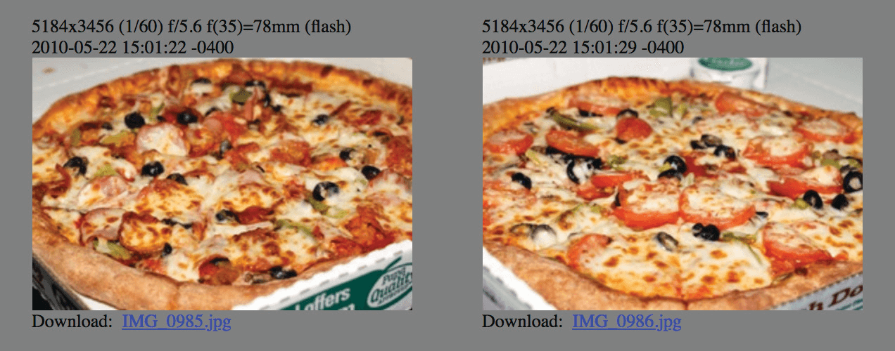
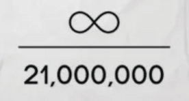

# SATOSHIS ZAHLEN 369 UHR

**Bitcoin ist so konzipiert, dass 6 Blöcke pro Stunde geschürft werden >> ein Block
im Durchschnitt alle ~10 Minuten.**

* 24 Stunden an einem Tag

2+4=**6**

* Das ergibt 144 Blöcke pro Tag

1+4+4=**9**

* 52560 Blöcke pro Jahr

5+2+5+6+0=18

1+8=**9**

* 52704 Blöcke pro Schaltjahr

5+2+7+0+4=18

1+8=**9**

* 21 Millionen Coins:

2 + 1 + 0 + 0 + 0 + 0 + 0 + 0 = **3**

* 33 Halbierungen:

3 + 3 =**6**

* Der Schwierigkeitsgrad wird alle 2016 Blöcke angepasst:

2 + 0 + 1 + 6 = **9**

~ Basierend auf einem Tweet von @level39 

* Die Blockbelohnung wird alle
210.000 Blöcke halbiert (ungefähr alle vier Jahre)
2 + 1 + 0 + 0 + 0 + 0 = **3**

---

>*"Wenn du nur die Herrlichkeit der 3, 6 und 9 kennst, dann
hättest du den Schlüssel zum Universum."
~ Nikola Tesla*

## BLOCKBELOHNUNG = % DES ANgebots

* Die Blocksubvention (Anzahl der Bitcoins, die für jeden neu geschürften Block belohnt werden) stellt **den Prozentsatz des Gesamtangebots** dar, der während dieser Epoche geschürft wird.

* Zum Beispiel beträgt die aktuelle Blockbelohnung zwischen
2024-2028 **3,125** Bitcoin.

* In denselben vier Jahren werden **3,125**% der 21 Millionen Bitcoins geschürft.

Credit: @bitcoinfool

---

## BELOHNUNGSEPOCHEN

* Alle vier Jahre wird die Bitcoin-Subvention für jeden geschürften Block halbiert. **Eine Belohnungsepoche ist dieser Zeitraum von vier Jahren.**

* **Belohnungsepoche 1:** 2009-2012 **Blocksubvention:** 50 Bitcoin
= (50 Bitcoins * 210.000 Blöcke) = 10.500.000 Bitcoin

1+0+5+0+0+0+0+0 = **6**

* **Belohnungsepoche 2:** 2012-2016 **Blocksubvention:** 25 Bitcoin
= (25 * 210.000) = 5.250.000 Bitcoin

5+2+5+0+0+0+0 = 12

1+2 = **3**

* **Belohnungsepoche 3:** 2016-2020 **Blocksubvention:** 12.5 Bitcoin
= (12.5 * 210.000) = 2.625.000 Bitcoin

2+6+2+5+0+0+0 = 15

1+5 = **6**

* **Belohnungsepoche 4:** 2020-2024 **Blocksubvention:** 6.25 Bitcoin
= (6.25 * 210.000) = 1.312.500 Bitcoin

1+3+1+2+5+0+0 = 12

1+2 = **3**

* **Belohnungsepoche 5:** 2024-2028 **Blocksubvention:** 3.125 Bitcoin
= (3.125 * 210.000) = 656.250 Bitcoin

6+5+6+2+5+0 = 24

2+4 = **6**

* **Belohnungsepoche 7: 2032-2036 Blocksubvention:** 0.78125 btc
= (0.78125*210.000) = 164,062.5 Bitcoin

1+6+4+0+6+2+5 = 24

2+4 = **6**

**... und so weiter bis 2140**

---

## SATOSHIS GEBURTSTAG

* Der ***5. April 1975*** ist das Datum, das Satoshi als seinen
Geburtstag angab.
* Wir können zwar nicht wissen, ob dies tatsächlich sein wahres Geburtsdatum
war, aber es ist sehr interessant.
* Der ***5. April*** (1933) war der Tag, an dem die Executive Order 6102
von US-Präsident Franklin D. Roosevelt unterzeichnet wurde,
"die das Horten von Goldmünzen, Goldbarren
und Goldzertifikaten innerhalb des kontinentalen
Gebiets der Vereinigten Staaten verbot".
* ***1975*** war das Jahr, in dem die Aufhebung der EO 6102 in
Kraft trat und US-Bürger wieder mehr als 5oz Gold
besitzen durften.

## EIN NUMERISCHES PALINDROM 6102-2016

* ***6102*** war die Nummer der oben genannten
Executive Order.
* ***2016*** ist die Anzahl der Blöcke, die während jeder Schwierigkeitsanpassung geschürft werden (ungefähr 2 Wochen).

>* In beiden obigen Beispielen könnte man
postulieren, dass Satoshi Zahlen verwendete, um eine Umkehrung,
**eine Aufhebung des Schadens, der durch Übergriffe der Regierung verursacht wurde, anzuzeigen.**

---

## BITCOIN PIZZA TAG

* Der 22. Mai ist als Bitcoin Pizza Day bekannt. Dies war der Tag, an dem ein Mann namens Laszlo Hanyecz
auf bitcointalkforum.org ankündigte, dass er erfolgreich
10.000 Bitcoin gegen Pizza getauscht hatte! Damals waren das etwa 40 Dollar.
* Zu heutigen Preisen wären das ~610.000.000 Dollar.
* Es war ein Meilenstein für Bitcoin, da es der erste bekannte Vorfall war, bei dem jemand Bitcoin gegen eine Ware oder Dienstleistung tauschte. Was für einen langen Weg wir zurückgelegt haben!

---

## BITCOIN KALENDER DENKWÜRDIGER TAGE

**2008-08-18** ~ Der Domainname **bitcoin.org wurde registriert.**

**2008-10-31** ~ **Bitcoin White Paper Tag:** Das White Paper mit dem Titel "Bitcoin: A Peer-to-Peer Electronic Cash System" wurde von einem anonymen Kryptographen namens Satoshi Nakamoto auf metzdowd.com, der Mailingliste für Kryptographie, veröffentlicht.

**2009-01-03** ~ **Bitcoins Geburtstag:** Das Bitcoin-Netzwerk wurde gestartet, als Satoshi den Genesis-Block schürfte.

**2009-01-12** ~ **Die erste Bitcoin-Transaktion** fand statt, als Hal Finney als Testsendung zehn Bitcoins von Satoshi erhielt.

**2009-10-05** ~ **Geburt der ersten Bitcoin-Börse,** The New Liberty Standard (NLS), mit einem notierten Marktpreis von 0,00764 Dollar pro Coin.

**2009-10-12** ~ "Ich habe die **erste bekannte Bitcoin-zu-USD-Transaktion** aus meinen E-Mail-Backups gefunden. Ich habe am 2009-10-12 5.050 BTC für 5,02 Dollar verkauft." - Martti Malmi, Gründer von bitcointalk.org, verkaufte Bitcoin an NewLibertyStandard, der die erste Börse gründete.

**2010-05-22** ~ **Bitcoin Pizza Tag:** Das erste bekannte Ereignis, bei dem Bitcoin verwendet wurde, um eine Ware oder Dienstleistung zu kaufen, als Lazslo Hanyecz 10.000 Bitcoin für zwei Papa John's Pizzen bezahlte!

**2010-12-12** ~ **Das letzte Mal**, dass Satoshi im bitcointalk.org-Forum gepostet hat.

**2011-02-11** ~ **Bitcoin erreicht zum ersten Mal die Parität** mit dem US-Dollar.

**2011-06-14** ~ **Wikileaks** beginnt, Spenden in Bitcoin anzunehmen.

**2017-03-03** ~ **Bitcoin erreicht die Parität** mit einer Unze Gold.

**2021-08-21** ~ **Erster jährlicher Bitcoin Infinity Day**, vorgeschlagen durch Knut Svanholms Meme:
Alles geteilt durch 21 Millionen.

**2021-09-07** ~ El Salvador ist das erste Land, das Bitcoin zum gesetzlichen Zahlungsmittel macht.

---