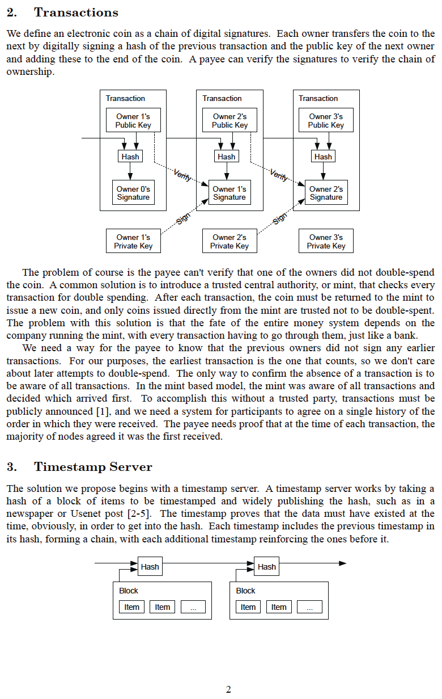
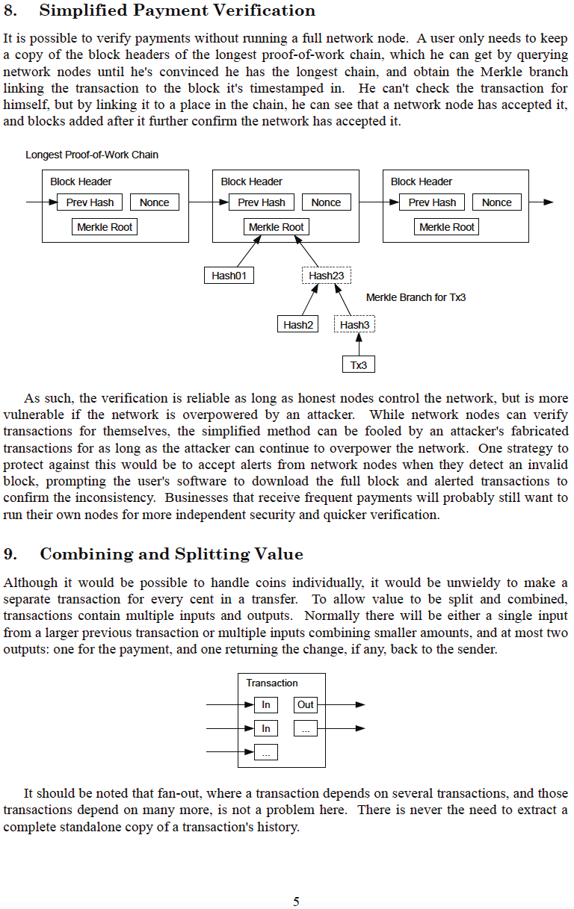
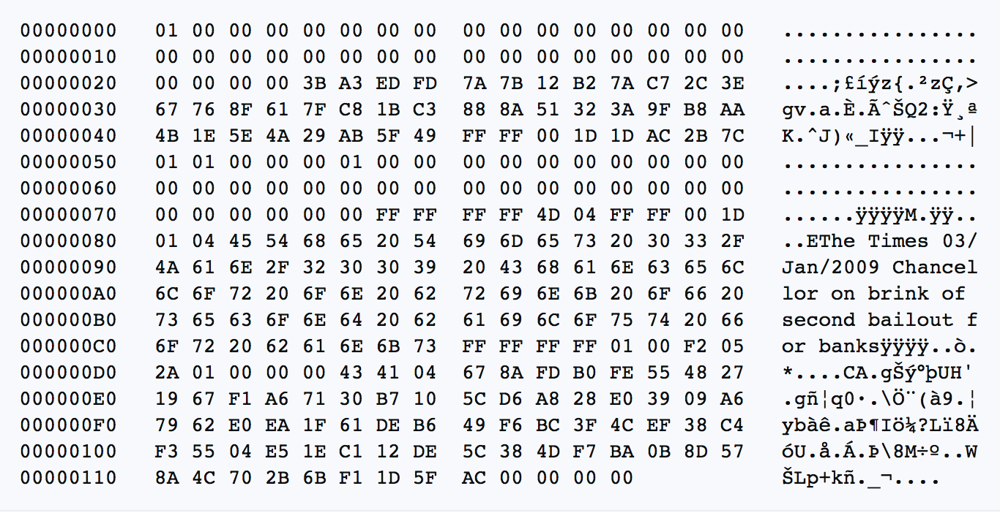

# Das Bitcoin White Paper
Der Welt vorgestellt auf metzdowd.com
2008-10-31

**von Satoshi Nakamoto**

Ein pseudonymer Cypherpunk, der zuletzt mit der
Cypherpunk-Community im bitcointalk.org
Forum am 2010-12-10 kommunizierte.

Durch seinen Abschied ermöglichte er, dass Bitcoin ein wahres Experiment
in freier Wildbahn sein konnte. Jeder, der daran arbeitet, ist in gewissem
Sinne ein Freiwilliger <-> inspiriert von dem Potenzial, die Menschheit
von den Fesseln eines manipulierten, schuldenbasierten Geldsystems zu befreien
und stattdessen an einem globalen, vertrauenslosen,
genehmigungsfreien, zensurresistenten, wirklich knappen, Peer-to-Peer-, dezentralen Geld- und monetären Zahlungsnetzwerk teilzunehmen, das eine aufkommende Ordnung inspiriert, aus der
Fiat-Asche aufzusteigen

**Wir sind alle Satoshi**
>*The Times 03/Jan/2009 Chancellor on brink
of second bailout for banks*
~ Text einer Schlagzeile aus The Times of London,
die von Satoshi
Nakamoto am 2009-01-03 in den Bitcoin-Genesis-Block eingraviert wurde

---

---

---

---

---

---

---

---

---

---

## Bitcoin Genesis Block ~ Rohe Hex-Version 2009-01-03

und so,

eine neue Ära,

wurde entfesselt

---
