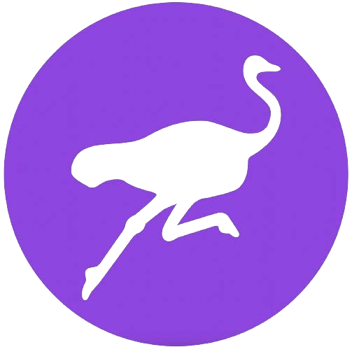
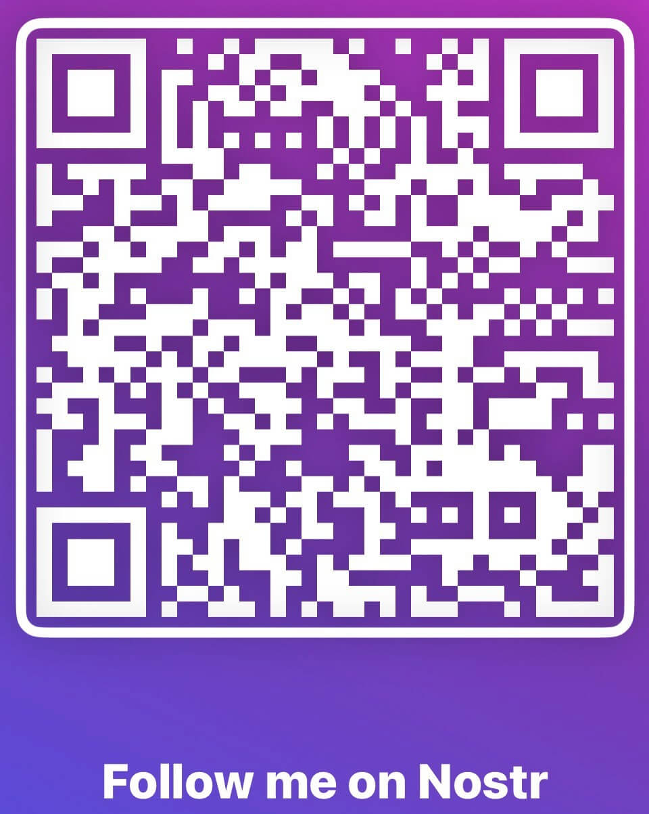

# NOSTR

## NOSTR & ANDERE DINGE, DIE VON RELAIS ÜBERTRAGEN WERDEN

>*Man könnte Gesetze dagegen erlassen, aber die Freiheit der
Meinungsäußerung ist, noch mehr als die Privatsphäre, von grundlegender Bedeutung für eine
offene Gesellschaft; wir versuchen, keinerlei Rede einzuschränken.*

~ Eric Hughes, Das Manifest des Cypherpunk, 1993

## WAS IST NOSTR

>*TL;DR: nostr ist ein Protokoll, das die Macht hat,
Twitter, Telegram und andere Dinge zu ersetzen.*

~ @dergigi

>*nostr ist für die Freiheit der Kommunikation
was Bitcoin für die Freiheit der Transaktion ist.*

~ Keysa @SimplestBitcoinBook

* **Nostr ist ein einfaches, dezentrales Protokoll für
zensurresistente, globale, interoperable Netzwerke.**
* Nostr ist nicht auf einen vertrauenswürdigen zentralen Server angewiesen.
* Es ist ein freies und quelloffenes (FOSS) Softwareprotokoll,
wie Bitcoin, HTTP oder TCP-IP, das es jedem ermöglicht,
auf nostr aufzubauen.
* **So behalten wir unsere Freiheit, zu kommunizieren**
mit jedem, überall mit einer Internetverbindung.

>*(es ist) ein Kommunikationsprotokoll mit einer
selbstbestimmten Identitätsschicht...
und nostr ist auch mehr als das.*

~ @dergigi

---

## WARUM WIR NOSTR BRAUCHEN

Wir brauchen nostr, weil die aktuellen Kommunikationssysteme
und Social-Media-Plattformen zentralisiert sind.

**Das ist problematisch, weil diese Systeme:**

* Die Macht haben, deine Rede zu zensieren.
* Anfällig für regulatorische Angriffe durch den Staat sind.
* Wählen können oder angewiesen werden können, dein
Konto zu sperren oder zu löschen.
* Gehackt werden können und somit deine Daten gefährden.
* Algorithmen verwenden, um dir die Informationen zu geben, die sie dir zeigen wollen.
* Jeden Aspekt deiner Erfahrung auf ihnen manipulieren.
* Alle deine Aktivitäten verfolgen.
* Deine Daten ernten und verkaufen.
* Deine Daten verwenden, um deinen Feed mit Werbung zu überschwemmen.

---

## WIE FUNKTIONIERT NOSTR

* **Nostr hat zwei Teile:** Clients und Relays.
* **Ein CLIENT ist eine OBERFLÄCHE** (App oder Website), die
auf dem Nostr-Protokoll läuft.
* **Hier siehst du die Notizen**, die du und die Leute,
denen du folgst, posten (so wie Twitter eine
Oberfläche ist, auf der du Notizen postest und liest,
aber Twitter ist zentralisiert und zensiert Beiträge).
* **Ein RELAY ist ein SERVER und eine DATENBANK.** Jeder kann
ein Relay betreiben, was Nostr dezentral macht.
* **Hier werden deine Notizen von Clients gesendet, gespeichert und abgerufen.**
* Es gibt viele Relays und du kannst wählen, mit welchen
du dich verbinden möchtest. Einige sind kostenlos und einige sind kostenpflichtig.
* Wenn du eine Nachricht postest, wird sie an die Relays
gesendet, mit denen du verbunden bist.
* Die Clients fragen die Relays ab, mit denen sie verbunden sind, und
dann werden die Nachrichten angezeigt, die von diesen Relays gehostet werden.

~ @BTCillustrated

---

>*Jeder kann ein Relay betreiben. Ein Relay ist sehr einfach und
dumm. Es tut nichts anderes, als Beiträge von
einigen Leuten anzunehmen und an andere weiterzuleiten.
Relays müssen nicht vertrauenswürdig sein.
Signaturen werden clientseitig verifiziert.*

~ @fiatjaf, 2019-11-02 fiatjaf.com/nostr.html

* Wenn du deinen Nostr-Client öffnest, siehst du alle
Notizen, die von dir und denen, denen du folgst,
in chronologischer Reihenfolge gepostet wurden.
* Es gibt keine **Algorithmen**, die entscheiden, was dir angezeigt wird,
was dir vorenthalten wird oder deine Beiträge zensiert.
* Wie Bitcoin verwendet **nostr Public/Private-Key-Paare.**
* **PUBLIC KEY** = npub, wie ein Benutzername
* **PRIVATE KEY** = nsec, wie ein Passwort

>* **HINWEIS:** Dein privater Schlüssel kann nicht zurückgesetzt werden, wenn
>er verloren geht, daher **musst du ihn gut sichern!**
>* Wenn du deinen privaten Schlüssel verlierst, hat jeder, der
>Zugriff darauf hat, Zugriff auf dein Nostr-Konto,
>und **es gibt keine Möglichkeit, den alleinigen
>Zugriff wiederzuerlangen.**

---

* Du kannst einen für Menschen lesbaren Benutzernamen mit
NIP-05 erstellen. **Zum Beispiel:**
* **Mein öffentlicher Schlüssel oder npub ist:**
<small>npub1dpna3xwwddnhhzg9ycpvlcz2ze0jdwm2rf3eqd2lf9leaewtq7tqhw0ef2</small>

* **Meine NIP-05 Nostr-Adresse ist:**

SimplestBitcoinBook@nostrplebs.com

* **Du kannst nach Personen auf Nostr suchen**, indem du Folgendes eingibst:
* npub
* NIP-05 (aka Nostr-Adresse), falls vorhanden
* Benutzername von NIP-05 -> @SimplestBitcoinBook

* **Hier bekommst du eine NIP-05-Kennung:**
* nostrplebs.com
* verified-nostr.com
* getalby.com
* Oder richte eine mit deiner eigenen Domain ein

* Sobald du dein Nostr-Schlüsselpaar hast, kannst du dich mit
diesen gleichen Schlüsseln bei jedem Nostr-Client anmelden und du wirst sehen,
dass du **deine Identität und Follower-/Following-Listen
auf allen Clients behältst.**
* Dies unterscheidet sich von Legacy-Social-Media, wo du ein
separates Konto, Benutzernamen und Passwort für jede
Plattform benötigst und du unterschiedliche Inhalte, Follows und
Follower auf jeder Plattform hast.
>*Auf der einfachsten Ebene ist Nostr ein Kommunikationsprotokoll,
das als soziales Bindemittel fungiert, das
alle deine Apps miteinander verbindet.*

~ derekross@nostrplebs.com

---

# WIE MAN NOSTRT

>1. **Wähle eine Client-App** zum Herunterladen aus. (Es spielt keine Rolle,
welche du auswählst, da du sie alle ausprobieren kannst, sobald
du dein Schlüsselpaar generiert hast.)
>2. **Beliebte Client-Beispiele:**
>* Damus auf iOS
>* Amethyst auf Android
>* Primal auf iOS/Android/Desktop
>3. **Erstelle einen Benutzernamen.** Es sind keine weiteren Informationen erforderlich.
>4. **Die App generiert das Konto.**
>5. **Du kannst ein Profilbild und ein Banner hinzufügen**, wenn du möchtest.
>6. **Dein Konto verbindet sich automatisch mit einigen
Relays**, sobald du mindestens ein Interesse auswählst (z. B.:
Bitcoin, Kunst, Menschenrechte, Sport, Musik usw.).
>7. Abhängig vom Client folgt er automatisch einigen
Konten mit einem ähnlichen Interesse oder lässt dich einige
auswählen.
>8. **Du kannst dann Relays und Konten hinzufügen oder entfernen.**

~ @BTCillustrated

---

## SCHLÜSSELVERWALTUNG
* Sobald deine Schlüssel generiert wurden, ist es an der Zeit,
eine **Signaturerweiterung** zu installieren.
* Wenn du dich bei einer Website anmelden möchtest, die auf dem
Nostr-Protokoll läuft, wird nach deinem nsec oder privaten Schlüssel gefragt.
* **Gib ihn NICHT** direkt ein, da Websites Daten verlieren können
* **Verwende stattdessen immer eine Signaturerweiterung.**
* Dies ist ein Tool, das deinen privaten Schlüssel speichert und du
autorisierst es, Ereignisse wie Notizen in deinem Namen zu signieren. Keine Sorge, das ist einfacher als es klingt!
* **Beliebte Signaturerweiterungen:**
* Nostore (iOS Safari)
* Amber (Android)
* Nsec App (Mobile/Desktop)
* Alby (Desktop)
* Nos2X (Desktop)
* Nostr Connect (Desktop)

## ZAPS
* Zappen ist, wie wir auf Nostr Bitcoin bezahlen! Schaffen einer V4V
(Value4Value)-Wirtschaft, Note für Note, Zap für Zap.
* Du kannst Sats (auch Zaps genannt) für Notizen oder
Inhalte senden und empfangen, die du schätzt, indem du ein Bitcoin
Lightning-Wallet mit deinem Nostr-Konto verbindest.
* Es gibt verschiedene Möglichkeiten, dies zu tun. Wenn der Client, den du
wählst, dich nicht durch den Prozess führt, frage einfach auf Nostr
mit dem Tag #asknostr und jemand wird dich anleiten.
Strauße sind freundlich

---

## NOSTR-RESSOURCEN
Unten ist eine Liste von Websites, die hervorragende, leicht
verständliche Anleitungen zu Nostr und seinen Wundern enthalten!

* nostr-resources.com von @derGigi
* nostr.com von @fiatjaf
* nostr.net von @aljaz
* nostr.how von @JeffG
* usenostr.org von @pluja
* benwehrman.com/nostr-guide von @benwehrman
* nostrapps.com von @Karnage

## WARUM DER STRAUSS?

**Die Ursprungsgeschichte des Nostrich**

von Walker@primal.net

**16. Dezember 2022:**

Ich habe ChatGPT3 entdeckt und
natürlich gefragt
„Kannst du einen Witz über #nostr schreiben?“
ChatGPT3 antwortete:
F: Wie nennt man einen neugierigen Strauß?
A: Einen nosTrich!
Der Witz war nicht toll, aber man kann es einem Bot nicht verübeln. Ungeachtet dessen
gefiel mir die Idee einer visuellen Identität für Nostr und Strauße sind
coole Vögel. Also habe ich Midjourney benutzt und den #Nostrich erstellt

**20. Dezember 2022:**

@jb55 schlug den „Nostrich“ als offizielles Nostr-Maskottchen
und Logo vor.
Drei Minuten später twittert @jack das Nostrich-Bild.
Der Rest ist, wie man so schön sagt, Geschichte.

~ @Walker

---

## NOSTR CLIENTS/APPS

Besuche **nostrapps.com**, um diese und viele weitere
erstaunliche Apps zu finden, die auf dem kostenlosen Open-Source-Nostr-Protokoll basieren.
Verwende deine Signaturerweiterung, um dich bei allen anzumelden!

* **Nostr Nests** - Ein Audiobereich für Chatten, Jammen,
Mikrokonferenzen, Live-Podcasts.
* **Plebian Market** - Der selbstbestimmte Marktplatz des
Internets, betrieben von Bitcoin & Lightning.
* **Npub.pro** - Erstelle dir eine Nostr-basierte Website.
* **Corny Chat** - Live-Audiobereiche.
* **Wavlake** - Eine Musik-Streaming-Plattform, die das
Bitcoin Lightning Network verwendet, um Wert für Wert zu bieten.
* **Zap.stream** - Hosten deinen Livestream und erhalte Sat-Zaps.
* **Flare** - Ein Client zum Anzeigen, Hochladen und Interagieren
mit Videoinhalten.
* **Blowater** - Entwickelt, um Telegram/Slack/Discord zu ersetzen.
* **Stemstr** - Eine soziale Erfahrung für Musikkünstler, um
sich zu verbinden, zusammenzuarbeiten und erstaunliche Musik zu teilen.
* **Nostr.build** - Bild-, Video- und Medien-Uploader & Host.
* Hivetalk - Echtzeit-, völlig private Videoanrufe und
Meetings, ersetzt Zoom.
* **Zap.cooking** - Teile Rezepte über Nostr.
* **Flockstr** - Veranstaltungen und Meetup-Planung.
* **Memestr** - Zeige und erstelle Memes über Nostr
* **Quotestr** - Mache aus einer Nostr-Notiz ein Bildzitat.

---

## MACH MIT
* Nostr ist noch sehr jung. Genau wie Bitcoin, aber viel
jünger, ist es ein basisdemokratisches, chaotisches, globales Experiment von unten nach oben.
* Wenn du den Wert eines dezentralen, zensurresistenten
Open-Source-Kommunikationsprotokolls erkennst,
beteilige dich bitte an der Nutzung, Entwicklung und dem Feedback an die Entwickler
und beteilige dich auf jede Weise, die du für richtig hältst,
um dieses Werkzeug für freie Meinungsäußerung zu fördern.
* Es ist eine erstaunliche Erfahrung, sich an einer wachsenden
Technologie zu beteiligen, die entwickelt wurde, um die freie Meinungsäußerung
und offene Kommunikation weltweit zu erhalten.
* Tauche ein und lerne zusammen mit dem Rest von uns souveränen
Seelen, die das inhärente Chaos annehmen, um Schönheit zu schaffen,
und eine strahlende Zukunft für unsere Enkelkinder zu schmieden!

*Wichtiger als alles andere ist, dass wir uns vor Augen halten, dass
Nostr nur eine sehr lose Ansammlung von Servern ist, zwischen denen es im Grunde keine
Verbindung gibt, ... und der Prozess, mit anderen in Verbindung zu bleiben
und Inhalte zu finden, muss
durch viele verschiedene Hack-Versuche angegangen werden. Um
Nostr-Anwendungen zu schreiben und Nostr zu verwenden, muss man
das inhärente Chaos annehmen.*

*~ @fiatjaf von:*

*'Eine Vision für die Entdeckung von Inhalten und die Verwendung von Relays
für grundlegendes Social Networking in Nostr'*

---

Tiefempfundener Dank an Satoshi, Fiatjaf, die Cypherpunks
der Vergangenheit, Gegenwart und Zukunft, die Nostr-Familie, den BT-Vortex, die
toxischen Maxis, die nicht-toxischen Maxis, die Meme-Lords und -
Damen, die Gläubigen, die Zyniker, die Seher...
und immer,
meine geliebte Familie, Freunde,
und der Eine, der durch uns alle atmet,
weil er mich immer hindurchsieht,
kostbarer als alles andere, sogar Bitcoin

Kostenloses PDF dieses Buches und die Übersetzungen
erhältlich unter: thesimplestbitcoinbook.net

Folge mir auf Nostr:

Kommentare, Fragen, Updates, Feedback:

thesimplestbitcoinbook@proton.me

Kann nicht versprechen, dass ich es rechtzeitig schaffe ...

vielleicht barfuß auf einem Berg irgendwo

Stacke Sats

Bleib stark

Bleib treu

am Ende, Liebe

851522
