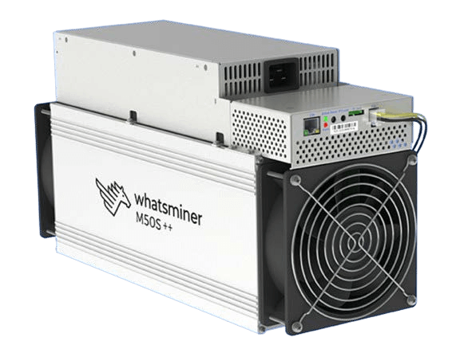

# WIE FUNKTIONIERT Bitcoin?

Regeln, nicht Herrscher

tik-tok/
/nächster Block
* Bitcoin verwendet Proof-of-Work, Public-Key-Kryptographie
und Peer-to-Peer-Netzwerke, um
Zahlungen in einem globalen, verteilten Online-Ledger zu verarbeiten und zu verifizieren.

>**Kryptographie** (Substantiv) /krɪpˈtɑːɡrəfi
>
>*: das Ver- und Entschlüsseln von Nachrichten
>in geheimem Code oder Chiffre
>: die computergestützte Kodierung und
>Dekodierung von Informationen*

~ Merriam Webster Wörterbuch

>**Hashing** (Verb) /ˈhæʃɪŋ/
>
>*: eine Methode der Verschlüsselung
>: der Prozess der Verwendung eines mathematischen Algorithmus auf
>Daten, um einen numerischen Wert (einen Hash-Digest) zu erzeugen,
>der für diese Daten repräsentativ ist.*

~ crsc.nist.gov

>**Merke:**
>
>Das Bitcoin-Ökosystem umfasst >>
>
>**bitcoin:** das digitale **monetäre Gut**
>
>**Bitcoin:** das **Zahlungsnetzwerk** von Minern und Nodes

1 bitcoin = 100.000.000 Satoshis (Sats)

**(Du kannst Sats kaufen, einen Bruchteil eines Bitcoins)**

---

>*Wir definieren eine elektronische Münze als eine Kette von
digitalen Signaturen. Jeder Besitzer überträgt
die Münze an den nächsten, indem er digital
einen Hash der vorherigen Transaktion und den
öffentlichen Schlüssel des nächsten Besitzers signiert und
diese am Ende der Münze hinzufügt. Ein Zahlungsempfänger kann
die Signaturen verifizieren, um die Kette
des Eigentums zu überprüfen.*

~ Satoshi Nakamoto
Bitcoin White Paper, Pt.2, 2008
Beschreibung, wie eine Bitcoin-Transaktion im
verteilten Ledger funktioniert

---
## DAS BITCOIN-ÖKOSYSTEM...
**besteht aus Minern, Nodes, Benutzern, Entwicklern**

alle arbeiten unabhängig voneinander,

und gleichzeitig interdependent,

um das zu beleben, was

BITCOIN ist!

---
## MINER
* **Spezialisierte Nodes** (Computer, die ASICS genannt werden) **die
die Blöcke 'minen'**, die Teil der Bitcoin-
Blockchain werden.
* Dabei **verifizieren sie die validierten Transaktionen
die von Benutzern getätigt werden, prägen neue Bitcoins** und **sichern
das gesamte Netzwerk.**

## BENUTZER
* **Du und ich. Wir alle.** Die Leute.
* In Anerkennung und Wertschätzung des Wertes von
Waren und Dienstleistungen, die bereitgestellt werden, transagieren wir: geben
und empfangen Bitcoin, oder wir speichern es für die spätere Verwendung, nach
Bedarf.

## NODES
* **Nodes sind Computer, die die Bitcoin-
Software ausführen.**
* **Es gibt Tausende von Nodes**, die das
dezentrale, globale, freiwillige **Netzwerk bilden, das
Transaktionen validiert** (und dadurch
Doppelausgaben verhindert und zur Sicherung des
Systems beiträgt).

## ENTWICKLER (DEVS)
* **Coder, Programmierer und digitale Autoren**, die
daran arbeiten, **das Netzwerk zu warten und zu skalieren, die Sicherheit zu verbessern,
Datenschutz und Benutzeroberfläche, und Code zu übersetzen** in
Sprache und Visualisierungen, die der Rest von uns verstehen und nutzen kann

---

## EINE BITCOIN-TRANSAKTION:
Ali möchte Benji etwas Bitcoin schicken:

>1. Ali **öffnet die Bitcoin-Wallet** App auf ihrem Handy und
>**klickt auf 'Senden'.**
>2. Benji **öffnet seine Wallet-App** und **klickt auf 'Empfangen'.**
>3. **Wenn sie zusammen sind:** Ali scannt den QR-Code auf der
>Wallet-App auf Benjis Handy.
>4. **Wenn sie nicht zusammen sind:** Ali kopiert und fügt die
>Adresse, die Benji ihr per SMS schickt, in das Adressfeld in ihrer
>Wallet ein.
>5. Ali **gibt den zu sendenden Betrag ein** und drückt **'Senden'.**
>6. **Wenige Sekunden später** wird Benji den Betrag
>in seiner Wallet als ausstehend sehen.
>7. **Wenn es über Lightning gesendet wurde,** wird es
>fast sofort bestätigt und ist fast kostenlos.
>8. **Wenn es 'Onchain' gesendet wurde** (auf der Bitcoin-Mainchain),
>enthält es eine kleine Gebühr und dauert normalerweise etwa 10
>Minuten, um bestätigt zu werden. Es kann länger dauern,
>abhängig vom Netzwerkverkehr.

---

## EINE BITCOIN-TRANSAKTION UNTER DER HAUBE:
(Definitionen der Begriffe, die **fettgedruckt** sind, folgen)

>1. Wenn Ali diese Sats an Benji schickt, wird die
>**Transaktion** an das Netzwerk **gesendet**.
>2. Die Transaktion wird von **Nodes** validiert, die
>sicherstellen, dass Ali wirklich das Bitcoin zum Senden hat, und
>dass es nicht bereits ausgegeben wurde (um
>Doppelausgaben zu verhindern).
>3. Sobald sie von einem Node validiert wurde, wartet sie im **Mempool**
>mit den Transaktionen anderer Leute.
>4. Die Transaktionen im Mempool werden in einem
>Block zur **Blockchain** hinzugefügt, wenn ein **Miner** eine >**Nonce**
>findet, die den **Difficulty-Algorithmus** erfüllt.
>5. Jeder **Block** hat einen **Zeitstempel.**
>6. Dies schafft **Unveränderlichkeit** und hilft, die
>Anpassung des Difficulty-Algorithmus vor
>Manipulation zu schützen.
>7. Jeder Block stellt eine Bestätigung für die darin enthaltenen
>Transaktionen dar.
>8. Wenn Blöcke hinzugefügt werden, im Durchschnitt alle zehn Minuten,
>erhöht sich die Unveränderlichkeit der Blockchain.

---

## GLOSSAR DER BEGRIFFE

---
>* **TRANSAKTION ~ Senden/Empfangen von Bitcoin**
---
* Eine Wertübertragung in Form von Satoshis, von
einem Bitcoin-Inhaber zu einem anderen.

---
>* **NODE ~ Ein 'Zweig' der dezentralen Bitcoin-
'Bank'. Jeder kann einen Node betreiben.**
---

* Nodes sind Computer, die die Bitcoin-
Software ausführen.
* Nodes bilden zusammen mit Minern, Benutzern und
Entwicklern das Peer-to-Peer-Bitcoin-
Netzwerk.
* Stellen Sie sich **jeden Full Node als ein Ledger vor, das die
Guthaben jedes privaten Schlüssels enthält.**
* Sie interagieren und erzielen Konsens (stimmen überein) miteinander,
indem sie Transaktionen von anderen Nodes zusammen mit Blöcken
von Minern akzeptieren und validieren und diese dann an
andere Nodes weiterleiten.
* Nodes werden von einer Ad-hoc-Gruppe von Tausenden
von Freiwilligen auf der ganzen Welt betrieben.
* Ein Full Node ist einer, der die gesamte Bitcoin-Blockchain seit dem
Genesis-Block, der 2009 von Satoshi gemint wurde, unabhängig validiert hat.
* Je mehr aktive Nodes es gibt, desto verteilter und damit widerstandsfähiger wird das gesamte Netzwerk.
* Es gibt **derzeit über 19.000 erreichbare Full
Nodes weltweit, & weit mehr unerreichbare.**
* Alle teilnehmenden Nodes sind gleichberechtigt.

---

---
>* **BROADCAST ~ Das Netzwerk wissen lassen, dass Sie
Bitcoin an jemanden senden.**
---

* Wenn Sie auf 'Senden' klicken, signiert Ihre Wallet die Transaktion mit Ihrem privaten Schlüssel und sendet sie,
wodurch alle anderen Nodes von Ihrer Absicht
informiert werden, einen Wert zu übertragen, damit sie die
Transaktion validieren können.

---
>* **MEMPOOL ~ Ein Transaktionswartebereich**
---

* Dies ist der 'Warteraum', in dem validierte Transaktionen gesendet werden, um von einem Miner abgeholt und
zu einem Block hinzugefügt zu werden.

---
>* **BLOCK ~ Eine 'Seite' im Bitcoin-Ledger**
---

* Das verteilte Bitcoin-Ledger besteht aus digitalen 'Blöcken'.
* Jeder Block enthält verifizierte Bitcoin-Transaktionen,
die das globale Ledger genau und aktuell halten.
Sie enthalten auch die Nonce, einen Zeitstempel und einen
Hash des vorherigen Blocks, die alle zur Unveränderlichkeit der Bitcoin-Blockchain beitragen.

---
>* **BLOCKCHAIN ~ Das gesamte Bitcoin-Ledger**
---

* Die Bitcoin-Blockchain, auch bekannt als die
Timechain, ist das verteilte Ledger, das
jeden Block und jede Bitcoin-Transaktion enthält, die seit dem Genesis-Block, der von
Satoshi im Jahr 2009 gemint wurde, jemals getätigt wurde.

---

---
>* **MINER ~ Ein spezialisierter Node, der sowohl
Transaktionen bestätigt als auch neue Bitcoins ausgibt**
---

* Bitcoin-Miner sind spezialisierte Computer. Sie
richten viel Rechenleistung (Hashrate) in einer
digitalen Lotterie, um eine Zahl zu erraten, die den
aktuellen Difficulty-Algorithmus erfüllt, wodurch ein 'Block' (ein Teil des Ledgers) 'gemint' wird.
* Ein geminter Block wird mit einem Zeitstempel versehen und der
Blockchain (aka Timechain) hinzugefügt.

---
>* **DIFFICULTY-ALGORITHMUS ~ Ein spezielles, adaptives
Design, das dazu beiträgt, die Ausgabe neuer Bitcoins
vorhersehbar zu halten.**
---

* Dies war eine von Satoshis genialen Lösungen, um
die Bitcoin-Ausgabe vor dem Überholen zu schützen,
da fortschrittlichere Computer entwickelt werden.
* Wenn mehr Miner online kommen, wird die Zielzahl (Nonce) in der 'Lotterie' kleiner und daher schwieriger zu finden.
* Wenn weniger Miner online sind, wird es einfacher.
* Der Algorithmus **passt sich automatisch alle 2016
Blöcke an** (etwa alle zwei Wochen), um eine vorhersehbare Lieferrate zu gewährleisten, wobei ein Block
im Durchschnitt alle zehn Minuten gemint wird.

---
>* **NONCE ~ Eine 32-Bit-Zufallszahl**
---

* Eine 32-Bit-Zufallszahl, die Miner zum
Ende der gehashten Transaktionsliste hinzufügen, um
das Difficulty-Ziel zu erfüllen, um einen Block zu minen.
* Wenn ein Miner eine Nonce findet, die zur
Generierung eines Hashes unterhalb des aktuellen Zielwerts führt, haben sie einen Block gemint und können ihn
zur Blockchain hinzufügen und die Bitcoin-Block-
Belohnung beanspruchen.
---

---
>* **ZEITSTEMPEL ~ Stempelt die Zeit**
---

* Jeder geminte Block hat einen hinzugefügten Zeitstempel.
* Dies dient der zusätzlichen Sicherheit, Unveränderlichkeit und hilft,
die Difficulty-Anpassung festzulegen.

---
>* **UNVERÄNDERLICHKEIT ~ Kann nicht geändert werden.**
---

* Dies bedeutet, dass die Blockchain in 'digitalen Stein gemeißelt' ist.

---
>* **PROOF-OF-WORK (PoW) ~ Kryptografischer Beweis
dafür, dass schwierige Arbeit geleistet wurde, um einen Algorithmus zu erfüllen.**
---

* Miner verwenden den PoW-Algorithmus, um zu beweisen, dass sie
viel Rechenleistung über Elektrizität
(Arbeit) verwendet haben, um einen Konsens auf dezentrale Weise zu erzielen und korrupte Akteure
daran zu hindern, das Netzwerk mit Spam zu überfluten.

---
>* **PUBLIC-KEY-KRYPTOGRAPHIE ~ Ein Prozess, der
die digitalen Schlüssel für den Zugriff auf Ihre Bitcoins erstellt**
---

* Dies ist ein System, bei dem zwei Schlüssel durch einen kryptografischen Algorithmus erstellt werden.
* **Ein Schlüssel ist öffentlich** - Wie Ihre Bankkontonummer, die Sie Leuten geben können, um Ihnen Bitcoin für Waren, Geschenke oder Dienstleistungen zu senden.
* **Der andere Schlüssel ist privat** - Nur Sie haben eine Kopie,
und Sie verwenden ihn, um den Zugriff auf Ihr Bitcoin freizuschalten,
genau wie ein Passwort Ihr Online-Bankkonto
entsperrt.
* **Sie müssen Ihren privaten Schlüssel sehr gut sichern,**
da jeder, der Zugriff darauf hat, Zugriff auf
Ihr Bitcoin hat.

---

---
>* **PEER-TO-PEER (P2P) NETZWERK ~ Ein dezentrales
Netzwerk ohne Mittelsmänner**
---

* Full Nodes (Peers) pflegen gemeinsam ein Peer-
to-Peer-Netzwerk für Transaktions- und Blockvalidierung und -verifizierung.
* In dieser Art von Netzwerk ist jeder Node in der Lage, sowohl Daten bereitzustellen als auch von seinen Peers anzufordern.
* Es gibt keine Gatekeeper in einem P2P-Netzwerk.

---
>* **LIGHTNING NETWORK ~ Ein auf Bitcoin aufgebautes Netzwerk, das es ermöglicht,
Sats sehr schnell und fast kostenlos zu senden oder zu empfangen.**
---

* Lightning ist eine Layer-2-Skalierungslösung. Dies bedeutet,
dass es eine Möglichkeit für Bitcoin bietet, zu skalieren, was es
potenziell ermöglicht, Millionen von Transaktionen pro
Sekunde (TPS) zu verarbeiten.

---
>* **WALLET ~ Eine 'Wallet' enthält die kryptografischen
Schlüssel für den Zugriff auf Ihr Bitcoin.**
---

* Es kann sich auf einem Telefon, Computer oder auf einem separaten
kleinen Hardwaregerät (dem sichersten) befinden.
* Eine Bitcoin-Wallet sollte genauer als
Signiergerät bezeichnet werden. Ihr Bitcoin verlässt
niemals wirklich die Blockchain, das digitale Ledger.
* Wenn Sie Ihr Bitcoin senden oder ausgeben möchten, wird die
Wallet die Transaktion signieren und an das
Netzwerk senden, damit sie validiert und
zu einem Block in der Blockchain hinzugefügt werden kann.

---
>* **ENTWICKLER ~ Computerprogrammierer**
---

* Cypherpunks/Programmierer, die das Netzwerk warten, die Sicherheit verbessern, nach Fehlern suchen,
Pull-Requests einreichen (für neue Updates oder Funktionen),
Pull-Requests überprüfen, den Code auditieren.

---

---
>* **ÖFFENTLICHER SCHLÜSSEL ~ Wie eine Bankkontonummer zum
Empfangen von Bitcoin.**
---

* Sie können ihn an Leute weitergeben, um Ihnen Bitcoin zu senden,
genau wie Sie Ihre Kontonummer an
jemanden weitergeben würden, damit er Ihnen Fiat senden kann.

---
>* **PRIVATER SCHLÜSSEL ~ Zum Sichern, Zugreifen und Senden von Bitcoin, wie der Schlüssel zu einem Schließfach.**
---

* Ein privater Bitcoin-Schlüssel ist eine geheime Zeichenfolge aus Zahlen
und Buchstaben, mit der Sie Ihr
Bitcoin senden/ausgeben können.
* Nur Sie haben eine Kopie. ** **Es ist sehr wichtig, es sehr sicher und geschützt aufzubewahren, da jeder, der
eine Kopie erhält, Ihr Bitcoin ausgeben kann.** **

---
>* **VERTEILTES LEDGER ~ Ein Ledger, das von
jedem geführt wird, der zur Aufrechterhaltung beitragen möchte.**
---

* Anstelle eines zentral gesteuerten Ledgers, das für die Öffentlichkeit unsichtbar ist, wie es eine Bank führt, ist Bitcoin ein transparentes, offenes, dezentrales
Ledger, das für jeden jederzeit sichtbar ist.
* Die Adressen sind Zeichenfolgen aus Buchstaben und Zahlen,
ohne angehängte Namen.
* Obwohl pseudonym, ist es möglich, Transaktionen zu verfolgen, insbesondere wenn das Bitcoin von
einer zentralisierten KYC-Börse gekauft wurde.
* Das Bitcoin-Netzwerk ist vertrauenslos und jeder kann es
jederzeit prüfen, im Gegensatz zu einer Bank, bei der man
darauf vertrauen muss, dass die Ledger ehrlich geführt werden.

---

## MEHR ZUM MINING
 Whatsminer M50S

 Antminer S21 Pro

 Bitaxe 401 Supra

* **Miner widmen Rechenleistung, auch bekannt als Hashrate, über Strom dem Netzwerk,** um Blöcke zur
Bitcoin-Blockchain hinzuzufügen.
* Diese Computer laufen 24 Stunden am Tag, normalerweise in Sätzen
von wenigen bis zu wenigen hundert oder tausend.
* **Sie betreiben im Grunde eine Lotterie. Wenn einer von
ihnen eine Zahl errät** (die Nonce), die einen
Hash erzeugt, der das aktuelle Difficulty-Ziel erfüllt, **können sie
den nächsten Block zur Timechain hinzufügen.**
* **All das oben Genannte ist der Proof-of-Work (PoW), der benötigt wird,
um neue Bitcoins zu erzeugen.**

---

## BITCOIN-BLOCK-BELOHNUNG
**= Subvention + Gebühren**

>* **Für ihre Arbeit erhalten Miner:**
> * **Eine Subvention in Form von frisch geprägten Bitcoins.**
> * **Plus die Gebühren von den verifizierten Transaktionen,
>die in diesem Block enthalten sind**

* **Wenn Sie Bitcoin an jemanden senden, enthält diese Transaktion
eine Gebühr** und muss von einem Miner verifiziert und dann in einen Block aufgenommen werden.
* Die **Bitcoin-Block-Subvention** wird alle vier
Jahre halbiert.
* Sie beträgt **derzeit 3,125 Bitcoin** pro Block, der gemint wird.
* **Die nächste 'Halbierung' wird im Jahr 2028 sein,** zu diesem Zeitpunkt
wird die Blockbelohnung auf 1,5625 Bitcoin pro
geminten Block sinken.
* Wie bereits erwähnt, **hält dies die Ausgabe stabil.**
* **Im Jahr 2140 wird das letzte Stück Bitcoin
gemint werden.**
* Danach erhalten Miner nur noch die Gebühren von den Transaktionen, die sie in jedem Block verifizieren.

>*In einigen Jahrzehnten, wenn die Belohnung zu
klein wird, wird die Transaktionsgebühr zur
Hauptvergütung für Nodes (Miner).*

~ Satoshi Nakamoto
Bitcointalk.org, 2010-02-14

>* **Miner werden immer benötigt, um Transaktionen zu verifizieren,
wodurch das Netzwerk aktualisiert und sicher gehalten wird.**

* Obwohl man sich bewusst sein muss, dass es Kosten
gibt und die Rentabilität für Home-Miner vernachlässigbar ist, ist es eine wirksame Möglichkeit, das Netzwerk zu sichern und dezentral zu halten.
* Miner halten einige Jahre. Es gibt derzeit viele
Antminer S9 zum Beispiel, die seit über 6 Jahren laufen.
* Wenn Miner außer Betrieb genommen werden, **können sie leicht auseinandergenommen und recycelt werden.**
* **Es gibt jede Menge faszinierende Innovationen,** wobei
Leute die überschüssige Wärme von Minern nutzen, um
ihre Häuser, Saunen, Gewächshäuser, Whirlpools zu beheizen,
Trockenfleisch und Gemüse zu trocknen, Decks zu heizen, Holz zu trocknen und
mehr!

---
