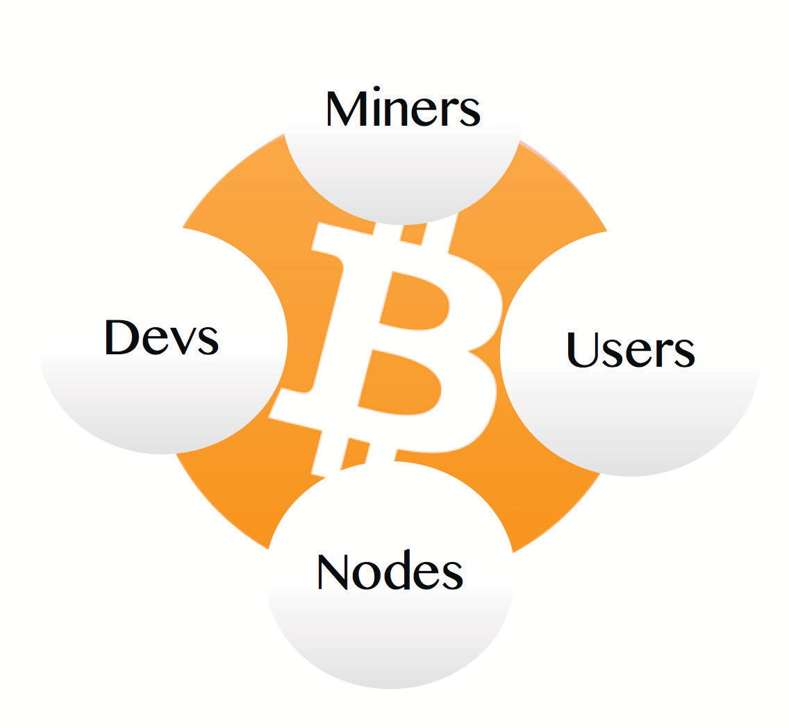
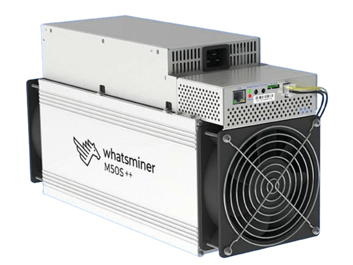
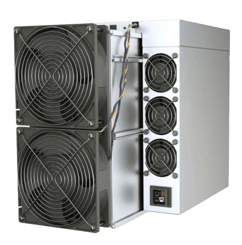

# WIE FUNKTIONIERT Bitcoin?

Regeln, nicht Herrscher

tik-tok/
/nächster Block
* Bitcoin verwendet Proof-of-Work, Public-Key-Kryptographie
und Peer-to-Peer-Netzwerke, um Zahlungen in einem globalen, verteilten Online-Ledger zu verarbeiten und zu verifizieren.

>**Kryptographie** (Nomen) /krɪpˈtɑːɡrəfi
>
>*: die Ver- und Entschlüsselung von Nachrichten
>in Geheimcode oder Chiffre
>: die computergestützte Kodierung und
>Dekodierung von Informationen*

~ Merriam Webster Wörterbuch

>**Hashing** (Verb) /ˈhæʃɪŋ/
>
>*: eine Methode der Verschlüsselung
>: der Prozess, bei dem ein mathematischer Algorithmus auf
>Daten angewendet wird, um einen numerischen Wert (einen Hash-Digest) zu erzeugen,
>der diese Daten repräsentiert.*

~ crsc.nist.gov

>**Denken Sie daran:**
>
>Das Bitcoin-Ökosystem umfasst >>
>
>**bitcoin:** das digitale **monetäre Gut**
>
>**Bitcoin:** das **Zahlungsnetzwerk** von Minern und Nodes

1 Bitcoin = 100.000.000 Satoshis (Sats)

**(Sie können Sats kaufen, einen Bruchteil eines Bitcoins)**

---

>*Wir definieren eine elektronische Münze als eine Kette von
digitalen Signaturen. Jeder Besitzer überträgt
die Münze an den nächsten, indem er digital einen Hash der vorherigen Transaktion und den
öffentlichen Schlüssel des nächsten Besitzers signiert und
diese an das Ende der Münze hinzufügt. Ein Zahlungsempfänger kann
die Signaturen verifizieren, um die Kette
des Eigentums zu überprüfen.*

~ Satoshi Nakamoto
Bitcoin White Paper, Teil 2, 2008
Beschreibt, wie eine Bitcoin-Transaktion im Distributed Ledger funktioniert

---
## DAS BITCOIN-ÖKOSYSTEM...
**besteht aus Minern, Nodes, Benutzern, Entwicklern**

alle arbeiten unabhängig,

und gleichzeitig interdependent,

um das zu beleben, was ist

BITCOIN!

---
## MINER
* **Spezialisierte Nodes** (Computer, die ASICS genannt werden) **die
die Blöcke 'minen'**, die Teil der Bitcoin-Blockchain werden.
* Indem sie dies tun, **verifizieren sie die validierten Transaktionen,
die von Benutzern getätigt wurden, prägen neue Bitcoins** und **sichern
das gesamte Netzwerk.**

## BENUTZER
* **Du und ich. Wir alle.** Die Leute.
* In Anerkennung und Wertschätzung des Wertes von
bereitgestellten Gütern und Dienstleistungen tätigen wir Transaktionen: geben
und empfangen Bitcoin, oder wir speichern es zur späteren Verwendung, nach
Bedarf.

## NODES
* **Nodes sind Computer, die die Bitcoin-Software ausführen.**
* **Es gibt Tausende von Nodes**, die das
dezentrale, globale, freiwillige **Netzwerk bilden, das
Transaktionen validiert** (wodurch
Doppelausgaben verhindert und das System gesichert wird).

## ENTWICKLER (DEVS)
* **Coder, Programmierer & digitale Autoren**, die arbeiten,
um **das Netzwerk zu warten und zu skalieren, die Sicherheit,
den Datenschutz und die Benutzeroberfläche zu verbessern und Code** in
Sprache und Visualisierungen zu übersetzen, die der Rest von uns verstehen und nutzen kann.

---

## EINE BITCOIN-TRANSAKTION:
Ali möchte Benji etwas Bitcoin schicken:

>1. Ali **öffnet die Bitcoin-Wallet** App auf ihrem Handy und
>**klickt auf 'Senden'.**
>2. Benji **öffnet seine Wallet App** und **klickt auf 'Empfangen'.**
>3. **Wenn sie zusammen sind:** Ali scannt den QR-Code auf der
>Wallet App auf Benjis Handy.
>4. **Wenn sie nicht zusammen sind:** Ali kopiert die Adresse,
>die Benji ihr per SMS schickt, und fügt sie in das Adressfeld in ihrer
>Wallet ein.
>5. Ali **gibt den zu sendenden Betrag ein** und drückt auf **'Senden'.**
>6. **Wenige Sekunden später** wird Benji den Betrag
>als ausstehend in seiner Wallet sehen.
>7. **Wenn es über Lightning gesendet wurde**, wird es
>fast sofort bestätigt und ist fast kostenlos.
>8. **Wenn es 'onchain' gesendet wurde** (auf der Bitcoin-Hauptkette),
>enthält es eine kleine Gebühr und dauert in der Regel etwa 10
>Minuten, bis es bestätigt ist. Es kann länger dauern,
>abhängig vom Netzwerkverkehr.

---

## EINE BITCOIN-TRANSAKTION UNTER DER HAUBE:
(Definitionen der Begriffe, die **fett** gedruckt sind, folgen)

>1. Wenn Ali diese Sats an Benji schickt, wird die
>**Transaktion** an das Netzwerk **übertragen**.
>2. Die Transaktion wird von **Nodes** validiert, die
>sicherstellen, dass Ali wirklich das Bitcoin zum Senden hat, und
>dass es nicht bereits ausgegeben wurde (um
>Doppelausgaben zu verhindern).
>3. Sobald sie von einem Node validiert wurde, wartet sie im **Mempool**
>mit den Transaktionen anderer Leute.
>4. Die Transaktionen im Mempool werden in einem
>Block zur **Blockchain** hinzugefügt, wenn ein **Miner** eine >**Nonce**
>findet, die den **Schwierigkeitsalgorithmus** erfüllt.
>5. Jeder **Block** hat einen **Zeitstempel**.
>6. Dies schafft **Unveränderlichkeit** und hilft, die
>Anpassung des Schwierigkeitsalgorithmus vor
>Manipulationen zu schützen.
>7. Jeder Block stellt eine Bestätigung für die
>darin enthaltenen Transaktionen dar.
>8. Wenn Blöcke hinzugefügt werden, erhöht sich die
>Unveränderlichkeit der Blockchain im Durchschnitt alle zehn Minuten.

---

## GLOSSAR DER BEGRIFFE

---
>* **TRANSAKTION ~ Bitcoin senden/empfangen**
---
* Eine Wertübertragung in Form von Satoshis von
einem Bitcoin-Besitzer zum anderen.

---
>* **NODE ~ Ein 'Zweig' der dezentralen Bitcoin-
>'Bank'. Jeder kann einen Node betreiben.**
---

* Nodes sind Computer, die die Bitcoin-
Software ausführen.
* Nodes bilden zusammen mit Minern, Benutzern und
Entwicklern das Peer-to-Peer-Bitcoin-
Netzwerk.
* Stellen Sie sich **jeden Full Node als ein Ledger vor, das die
Guthaben jedes privaten Schlüssels enthält.**
* Sie interagieren und erzielen einen Konsens (stimmen überein)
miteinander, indem sie Transaktionen von anderen Nodes sowie Blöcke
von Minern akzeptieren und validieren und diese dann an
andere Nodes weiterleiten.
* Nodes werden von einer Ad-hoc-Gruppe von Tausenden
von Freiwilligen auf der ganzen Welt betrieben.
* Ein Full Node ist ein Node, der die gesamte Bitcoin-Blockchain seit dem
Genesis-Block, der 2009 von Satoshi gemined wurde, unabhängig
validiert hat.
* Je mehr aktive Nodes es gibt, desto verteilter und damit widerstandsfähiger
wird das gesamte Netzwerk.
* Es gibt **derzeit über 19.000 erreichbare Full
Nodes weltweit & weit mehr unerreichbare.**
* Alle teilnehmenden Nodes sind gleichberechtigt.

---

---
>* **BROADCAST ~ Das Netzwerk wissen lassen, dass Sie
jemandem Bitcoin senden.**
---

* Wenn Sie auf 'Senden' klicken, signiert Ihre Wallet die Transaktion mit Ihrem privaten Schlüssel und überträgt sie,
wodurch alle anderen Nodes von Ihrer Absicht
erfahren, Wert zu übertragen, damit sie die
Transaktion validieren können

---
>* **MEMPOOL ~ Ein Transaktions-Warteraum**
---

* Dies ist der 'Warteraum', in dem validierte Transaktionen
gesendet werden, um von einem Miner abgeholt und
zu einem Block hinzugefügt zu werden.

---
>* **BLOCK ~ Eine 'Seite' im Bitcoin-Ledger**
---

* Das verteilte Bitcoin-Ledger besteht aus digitalen
'Blöcken'.
* Jeder Block enthält verifizierte Bitcoin-Transaktionen,
die das globale Ledger genau und aktuell halten.
Sie enthalten auch die Nonce, einen Zeitstempel und einen
Hash des vorherigen Blocks, die alle zur
Unveränderlichkeit der Bitcoin-Blockchain beitragen.

---
>* **BLOCKCHAIN ~ Das gesamte Bitcoin-Ledger**
---

* Die Bitcoin-Blockchain, auch bekannt als Timechain, ist das verteilte Ledger, das
jeden Block und jede Bitcoin-Transaktion enthält, die jemals
seit dem Genesis-Block, der 2009 von Satoshi gemined wurde, getätigt wurde.

---

---
>* **MINER ~ Ein spezialisierter Node, der sowohl
Transaktionen bestätigt als auch neue Bitcoins ausgibt**
---

* Bitcoin-Miner sind spezialisierte Computer. Sie
lenken viel Rechenleistung (Hashrate) in einer
digitalen Lotterie, um eine Zahl zu erraten, die den
aktuellen Schwierigkeitsalgorithmus erfüllt, wodurch ein
'Block' (ein Teil des Ledgers) 'gemined' wird.
* Ein gemineder Block wird mit einem Zeitstempel versehen und der
Blockchain (auch Timechain genannt) hinzugefügt.

---
>* **SCHWIERIGKEITSALGORITHMUS ~ Ein spezielles, adaptives
Design, das dazu beiträgt, die Ausgabe neuer Bitcoins
vorhersehbar zu halten.**
---

* Dies war eine von Satoshis genialen Lösungen, um
die Bitcoin-Ausgabe vor dem Ausufern zu schützen,
da immer fortschrittlichere Computer entwickelt werden.
* Wenn mehr Miner online kommen, wird die Zielzahl (Nonce) in der 'Lotterie' kleiner und daher schwieriger zu finden.
* Wenn weniger Miner online sind, wird es einfacher.
* Der Algorithmus **passt sich automatisch alle 2016
Blöcke an** (etwa alle zwei Wochen), um eine vorhersehbare Angebotsrate zu gewährleisten, wobei ein Block
im Durchschnitt alle zehn Minuten gemined wird.

---
>* **NONCE ~ Eine 32-Bit-Zufallszahl**
---

* Eine 32-Bit-Zufallszahl, die Miner dem
Ende der gehashten Liste von Transaktionen hinzufügen, um
zu versuchen, das Schwierigkeitsziel zum Minen eines Blocks zu erfüllen.
* Wenn ein Miner eine Nonce findet, die zur
Erzeugung eines Hash unterhalb der aktuellen Zielzahl führt, haben sie einen Block gemined und können
ihn zur Blockchain hinzufügen und die Bitcoin-Block-Belohnung
beanspruchen.
---

---
>* **ZEITSTEMPEL ~ Stempelt die Zeit**
---

* Jeder geminede Block hat einen Zeitstempel.
* Dies dient der zusätzlichen Sicherheit, Unveränderlichkeit und zur Unterstützung
der Festlegung der Schwierigkeitsanpassung

---
>* **UNVERÄNDERLICHKEIT ~ Kann nicht geändert werden.**
---

* Dies bedeutet, dass die Blockchain in 'digitalen Stein gemeißelt' ist.

---
>* **PROOF-OF-WORK (PoW) ~ Kryptografischer Beweis,
dass schwierige Arbeit geleistet wurde, um einen Algorithmus zu erfüllen.**
---

* Miner verwenden den PoW-Algorithmus, um zu beweisen, dass sie
viel Rechenleistung über Strom
(Arbeit) verwendet haben, um einen Konsens auf dezentrale Weise zu erzielen und zu verhindern, dass korrupte Akteure
das Netzwerk mit Spam überfluten.

---
>* **PUBLIC-KEY-KRYPTOGRAPHIE ~ Ein Prozess, der
die digitalen Schlüssel für den Zugriff auf Ihre Bitcoins erstellt**
---

* Dies ist ein System, bei dem zwei Schlüssel durch einen kryptografischen Algorithmus erstellt werden.
* **Ein Schlüssel ist öffentlich** - Wie Ihre Bankkontonummer, die Sie Leuten geben können, um Ihnen Bitcoin für Waren, Geschenke oder Dienstleistungen zu senden.
* **Der andere Schlüssel ist privat** - Nur Sie haben eine Kopie,
und Sie verwenden ihn, um den Zugriff auf Ihre Bitcoins freizuschalten,
genau wie ein Passwort Ihr Online-Bankkonto
freischaltet.
* **Sie müssen Ihren privaten Schlüssel sehr gut sichern,**
da jeder, der Zugriff darauf hat, Zugriff auf
Ihre Bitcoins hat.

---

---
>* **PEER-TO-PEER (P2P) NETZWERK ~ Ein dezentrales
Netzwerk ohne Mittelsmänner**
---

* Full Nodes (Peers) unterhalten gemeinschaftlich ein Peerto-Peer-Netzwerk zur Transaktions- und Blockvalidierung und -verifizierung.
* In dieser Art von Netzwerk ist jeder Node in der Lage,
Daten von seinen Peers bereitzustellen/anzufordern.
* Es gibt keine Gatekeeper in einem P2P-Netzwerk.

---
>* **LIGHTNING NETWORK ~ Ein Netzwerk, das auf Bitcoin aufbaut und es ermöglicht,
Sats sehr schnell und fast kostenlos zu senden oder zu empfangen.**
---

* Lightning ist eine Layer-2-Skalierungslösung. Das bedeutet,
dass es eine Möglichkeit für Bitcoin bietet, zu skalieren, was ihm die
Möglichkeit gibt, Millionen von Transaktionen pro
Sekunde (TPS) zu verarbeiten.

---
>* **WALLET ~ Eine 'Wallet' enthält die kryptografischen
Schlüssel für den Zugriff auf Ihre Bitcoins.**
---

* Sie kann sich auf einem Telefon, Computer oder einem separaten
kleinen Hardwaregerät befinden (am sichersten).
* Eine Bitcoin-Wallet würde genauer als
Signiergerät bezeichnet werden. Ihre Bitcoins verlassen nie die
Blockchain, das digitale Ledger.
* Wenn Sie Ihre Bitcoins senden oder ausgeben möchten, signiert und überträgt
die Wallet die Transaktion an das Netzwerk, damit sie validiert und
zu einem Block in der Blockchain hinzugefügt werden kann.

---
>* **ENTWICKLER ~ Computerprogrammierer**
---

* Cypherpunks/Programmierer, die das Netzwerk warten, die Sicherheit verbessern, auf Fehler prüfen,
Pull-Requests (für neue Updates oder Funktionen) einreichen,
Pull-Requests überprüfen, den Code prüfen.

---

---
>* **PUBLIC KEY ~ Wie eine Bankkontonummer zum
Empfangen von Bitcoins.**
---

* Sie können ihn Leuten geben, um Ihnen Bitcoins zu senden,
genau wie Sie jemandem Ihre Kontonummer geben würden,
damit er Ihnen Fiat senden kann

---
>* **PRIVATE KEY ~ Zum Sichern, Zugreifen und Senden von Bitcoins, wie der Schlüssel zu einem Bankschließfach.**
---

* Ein privater Bitcoin-Schlüssel ist eine geheime Zeichenfolge aus Zahlen
und Buchstaben, mit der Sie Ihre
Bitcoins senden/ausgeben können.
* Nur Sie haben eine Kopie. ** **Es ist sehr wichtig,
ihn sehr sicher aufzubewahren, da jeder, der
eine Kopie erhält, Ihre Bitcoins ausgeben kann.** **

---
>* **DISTRIBUTED LEDGER ~ Ein Ledger, das von
jedem geführt wird, der dazu beitragen möchte.**
---

* Anstelle eines zentral gesteuerten Ledgers, das für die Öffentlichkeit
unsichtbar ist, wie eines, das eine Bank führt, ist Bitcoin ein transparentes, offenes, dezentrales
Ledger, das für jeden jederzeit einsehbar ist.
* Die Adressen sind Zeichenfolgen aus Buchstaben und Zahlen,
ohne angehängte Namen.
* Obwohl pseudonym, ist es möglich, Transaktionen zu verfolgen,
insbesondere wenn die Bitcoins von einer zentralisierten KYC-Börse gekauft wurden.
* Das Bitcoin-Netzwerk ist vertrauenslos und jeder kann
es jederzeit prüfen, im Gegensatz zu einer Bank, bei der man
darauf vertrauen muss, dass die Ledgers ehrlich geführt werden.

---

## MEHR ZUM MINING
 Whatsminer M50S

 Antminer S21 Pro

 Bitaxe 401 Supra

* **Miner widmen Rechenleistung, auch Hashrate genannt,
über Elektrizität dem Netzwerk,** um Blöcke zur
Bitcoin-Blockchain hinzuzufügen.
* Diese Computer laufen 24 Stunden am Tag, normalerweise in Sätzen
von wenigen bis zu einigen Hundert oder Tausend.
* **Sie betreiben im Grunde eine Lotterie. Wenn einer
von ihnen eine Zahl errät** (die Nonce), die einen
Hash erzeugt, der das aktuelle Schwierigkeitsziel erfüllt, **dürfen
sie den nächsten Block zur Timechain hinzufügen.**
* **Das alles ist der Proof-of-Work (PoW), der benötigt wird,
um neue Bitcoins zu erzeugen.**

---

## BITCOIN-BLOCK-BELOHNUNG
**= Subvention + Gebühren**

>* **Für ihre Arbeit erhalten Miner:**
> * **Eine Subvention in Form von frisch geminten Bitcoins.**
> * **Plus die Gebühren von den verifizierten Transaktionen,
>die in diesem Block enthalten sind**

* **Wenn Sie jemandem Bitcoins senden, enthält diese Transaktion
eine Gebühr** und muss von einem Miner verifiziert
und dann in einem Block enthalten sein.
* Die **Bitcoin-Block-Subvention** wird alle vier
Jahre halbiert.
* Sie beträgt **derzeit 3,125 Bitcoins** pro geminedem Block.
* **Die nächste 'Halbierung' wird im Jahr 2028 sein**,
zu diesem Zeitpunkt wird die Block-Belohnung auf 1,5625 Bitcoins pro
geminedem Block sinken.
* Wie bereits erwähnt, **hält dies die Ausgabe stabil.**
* **Im Jahr 2140 wird das letzte Stück Bitcoin
gemined.**
* Danach erhalten Miner nur noch die Gebühren von den Transaktionen,
die sie in jedem Block verifizieren.

>*In ein paar Jahrzehnten, wenn die Belohnung zu
gering wird, wird die Transaktionsgebühr die
Hauptentschädigung für Nodes (Miner).*

~ Satoshi Nakamoto
Bitcointalk.org, 2010-02-14

>* **Miner werden immer benötigt, um Transaktionen zu verifizieren,
wodurch das Netzwerk aktualisiert und gesichert wird.**

* Während man sich bewusst sein muss, dass Kosten
anfallen und die Rentabilität für Home-Miner vernachlässigbar ist, ist es eine
wirkungsvolle Möglichkeit, das Netzwerk zu sichern und dezentral zu halten.
* Miner halten einige Jahre. Es gibt derzeit viele
Antminer S9's zum Beispiel, die seit über 6 Jahren laufen.
* Wenn Miner ausgemustert werden, **können sie leicht
auseinandergenommen und recycelt werden.**
* **Es finden tonnenweise faszinierende Innovationen statt**,
wobei die überschüssige Wärme von Minern verwendet wird, um
ihre Häuser, Saunen, Gewächshäuser, Whirlpools, Trockenfleisch und
Gemüse zu beheizen, Decks zu heizen, Holz zu trocknen und
mehr!

---
