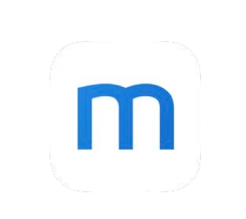
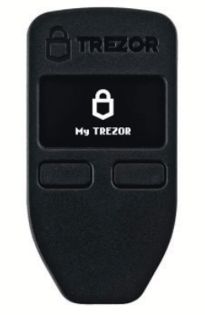
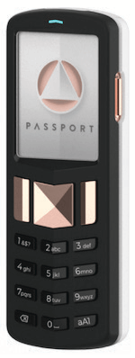
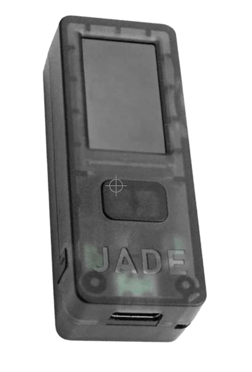
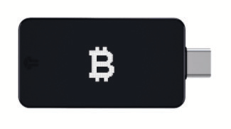

# WIE MAN BITCOIN VERWENDET

>**To Bitcoin:** (Verb) /tuːˈbɪtkɔɪn/
Hiermit schlage ich vor, 'to bitcoin' zu einem Verb zu machen,
das die Gesamtheit der Teilnahme
am Bitcoin/Bitcoin-Ökosystem umfasst.

* Ok, jetzt, wo du hoffentlich ;) orangefarben geworden bist und bereit bist, deine eigene Bank zu werden und am weltweit ersten globalen Freiheitsgeld teilzunehmen,
kommt der lustige Teil!

---

## DEINE EIGENE BANK WERDEN
* Hier liegt die wirklich epische Veränderung hin zur finanziellen Selbstbestimmung, und es kann Zeit brauchen, um
wirklich und wahrhaftig zu begreifen, was das bedeutet.
* Es sind einige **Absichten und Hingabe erforderlich, um
zu verstehen, wie man es auf die sicherste Art und Weise
tut.**
* Im Geiste, dieses Buch 'das einfachste
Bitcoin-Buch aller Zeiten' zu halten, werde ich hier einen
Überblick geben und dann am Ende Ressourcen anbieten,
in die du eintauchen kannst, die viel tiefer gehen als
der Umfang dieser Einführung.

>**HODL:** (Verb) /ho’dill/

: deine Bitcoin behalten

: nicht verkaufen

-Aus einem Bitcointalk.org-Post von 2013, in dem der Poster,
der vorgab, betrunken zu sein, 'HOLD' falsch buchstabierte

-bitcointalk.org/index.php?topic=375643.0

* Solange das Netzwerk noch wächst, liegt viel
Wert in den Millionen globalen Hodl'rs der letzten Instanz.

---

## BITCOIN ERWERBEN
* **Bitcoin kommt auf den Markt, indem Miner einige der
Bitcoins verkaufen, die sie als Belohnung erhalten,** um
ihre Betriebskosten zu decken.
* **Du kannst Bitcoin erwerben, indem du es auf einer Peer-to-Peer-
Handelsplattform kaufst, indem du es als Zahlung für
Waren oder Dienstleistungen akzeptierst, die du anbietest, als Geschenk oder durch Mining.** (Eine allerletzte Möglichkeit, nicht empfohlen, ist der Kauf
über eine registrierte Börse).
* Wenn du es erhältst, erhältst du technisch gesehen die
privaten Schlüssel, mit denen du auf deine Bitcoin zugreifen kannst.
> * **Denk daran:** Der Bitcoin selbst verlässt niemals die
 Timechain.

* Du kannst Bitcoin entweder anonym oder
mit ID-Verifizierung (KYC - Know Your Customer) erwerben.

* KYC ist gesetzlich vorgeschrieben, um AML-Gesetze (Gesetze zur Bekämpfung der Geldwäsche) beim Kauf von Börsen zu erfüllen.

>* Der Kauf von Non-KYC-Bitcoin **bewahrt dein Recht auf
Privatsphäre in der Zukunft.**

---

## Non-KYC >> Anonym
**Wie man Non-KYC-Bitcoin erhält (Kein Ausweis):**

EMPFOHLEN

>1. Lade eine Bitcoin-only Wallet-App herunter (siehe S. 102).
>2. Wähle eine Methode (siehe unten).
>3. Kaufe, erhalte oder mine Bitcoin.
>4. Ziehe deine Bitcoin in deine Wallet ab.
>5. HODL oder gib sie aus und ersetze sie.

* **Kaufe es bei Robosats, Bisq, HodlHodl, Peach Bitcoin.**
* **Kaufe es an einem Bitcoin-Automaten** - Achte darauf, dies zu überprüfen, da
einige einen Ausweis benötigen. Andere fragen nur nach einem Namen und
einer Nummer (du kannst eine temporäre Telefonnummer verwenden).
* **Kaufe einen Azteco-Gutschein** - Besuche azte.co für Standorte.
* **Verdiene es für Arbeit, die du leistest** - Bitte darum, in Bitcoin bezahlt zu werden.
Biete an, deinen Preis zu reduzieren.
* **Kaufe es persönlich bei einem Bitcoin-Meet-up.**
* **Mine es** - Es wird einfacher, zu Hause zu minen, oder
du kannst einem Mining-Pool beitreten, aber DYOR, um
KYC-frei zu bleiben. Ocean Pool ist eine grossartige Option.

---

## KYC >> ID-Verifizierung erforderlich

**Wie man KYC-Bitcoin kauft (mit Ausweis):**

NICHT EMPFOHLEN

>1. Lade eine Bitcoin-only Wallet-App herunter (siehe S. 102).
>2. Wähle eine Bitcoin-only Börse.
>3. Erstelle ein Konto und verbinde eine Zahlungsmethode.
>4. Erfülle die KYC-Anforderungen.
>5. Kaufe Bitcoin.
>6. **Ziehe deine Bitcoin in deine eigene Wallet ab.**
>7. HODL oder gib sie aus und ersetze sie.

* **Sei dir bewusst, dass deine Bitcoin für immer mit
deiner Identität verbunden sein wird,** wenn du sie auf diese Weise kaufst, wodurch
du auf zukünftige Pseudonymität in Bezug auf diese Käufe verzichtest.
* Wenn du diese Methode wählst, empfehle ich, eine seriöse ***Bitcoin-only Börse*** zu finden.
* ***Stelle sicher, dass die Börse es dir erlaubt, deine
Bitcoin in deine eigene Wallet abzuheben!***
* **Die Börsen sind gesetzlich verpflichtet, dich zu 'KYC'en'.**
* Sie nehmen **deinen vollständigen Namen, Adresse, Sozialversicherungsnummer, E-Mail, Telefonnummer und oft ein Foto von
dir, auf dem du deinen Ausweis hältst.**
* **Bestätige, dass die Börse sowohl Telefon- als auch E-Mail-
Support** für den Kundenservice hat.

---

* Lass sie dich durch das Senden deiner Bitcoin
von deinem Konto bei ihnen zu deiner eigenen Wallet führen, so
dass du deine Bitcoin selbst verwahrst.
= **Deine eigenen Schlüssel halten.**

>* **Hinweis:** Dies löscht NICHT die Tatsache, dass du
>Bitcoin von ihnen gekauft hast.
>* **Transaktionen sind on-chain nachverfolgbar, und in
>vielen Ländern bist du steuerpflichtig, wenn
>du deine Bitcoin ausgibst.**

* Wenn du über Venmo oder Paypal kaufen möchtest, stelle
sicher, dass du **zuerst bestätigst, dass du deine
Sats noch in deine eigene selbst gehostete Wallet abheben kannst.** In der
Vergangenheit war dies nicht möglich.
* Wie sie sagen:
> **"Keine Schlüssel, kein Käse"** oder
>
>**"Nicht deine Schlüssel, nicht deine Bitcoin"**

* Das bedeutet, solange ein zentralisierter Dienst die
privaten Schlüssel zu deinen Bitcoin hält, besteht die
Möglichkeit, dass ihre Plattform gehackt wird oder dass
sie regulatorisch erfasst werden und du deine
Bitcoin verlierst.

>* **Hebe deine Bitcoin immer in deine eigene
selbst gehostete Wallet ab, sobald du sie
gekauft hast.**

---
## EO 6102
* Im Jahr 1933 erliess **Präsident Roosevelt die Executive Order
6102, die jeden US-Bürger verpflichtete, den Großteil
ihres Goldes im Austausch gegen Banknoten abzugeben.**
* Das Gold wurde mit 20,67 $/oz bewertet. Im folgenden
Jahr erhöhte die Regierung den Goldpreis auf
35 $/oz mit dem Gold Reserve Act von 1934,
wodurch die Noten, die die Leute erhalten hatten,
effektiv um fast die Hälfte entwertet wurden, da der Wert ihrer
Noten nie mit dem erhöhten Goldpreis stieg.

---

* Es dauerte bis 1975, **42 Jahre später, bis EO6102
aufgehoben wurde,** und es Privatpersonen wieder erlaubt
war, mehr als 5 Unzen Gold zu halten.
* Zum jetzigen Zeitpunkt haben wir kaum eine Vorstellung davon, wie die Regulierungsbehörden
auf Bitcoin reagieren werden, da es immer beliebter wird und eine breitere Akzeptanz findet.
* Bisher gab es einen gemischten Empfang. Im Moment scheint es jedoch, dass viele
verstehen oder vielleicht einfach akzeptieren, dass Bitcoin
letztendlich nicht gestoppt werden kann.
* Es gibt eine Reihe von Politikern, die anfangen, sich
im Rahmen ihrer Plattform für Bitcoin auszusprechen.
Es gibt auch einige, die dagegen sind.
* Da es ein Wahljahr in den USA ist, ist 2024 sehr
interessant, da alle drei grossen Präsidentschaftskandidaten
Bitcoin-Wahlkampfspenden annehmen!
* El Salvador hat es 2021 zu einer Form von gesetzlichem Zahlungsmittel gemacht.
Es wird interessant sein zu sehen, welches Land als nächstes folgt.

>* **Letztendlich wäre es im Interesse jeder Regierung, es anzunehmen und es als Absicherung gegen ihre sich schnell aufblähenden
Fiat-Währungen in ihre Bilanz aufzunehmen.**

---

## BITCOIN SICHER AUFBEWAHREN

* Sobald du den lebensverändernden Schritt des Kaufs deiner ersten
Bitcoin unternommen hast, musst du **entscheiden, wie du sie sicher
aufbewahrst.**
>* **Deine eigene Bank zu sein, ist eine mächtige Form der
>Selbstbestimmung.**
>* Sie muss **ernst** genommen werden.
* ***Bitte DYOR - Do Your Own Research* über meine grundlegenden Empfehlungen hier hinaus.**
* Das **Bitcoin-Ökosystem entwickelt sich jede Minute weiter.**
* Nostr, Twitter und bitcointalk.org sind gute
Orte, um über die neuesten Entwicklungen auf dem Laufenden zu bleiben.

## SCHAU DIR DIESE SEITEN FÜR TUTORIALS AN:
> * BTCSessions.ca von @BTCSessions
>* Bitcoiner.guide von @QnA
>* Armantheparman.com von @ArmanTheParman
>* @SouthernBitcoiner auf YouTube
>* @wickedsmartbitcoin auf YouTube

---

## BITCOIN-ONLY WALLETS
* Bitcoin wird am besten in deiner eigenen
 * **selbst gehosteten**
 * **nicht-verwahrenden**
 * **Bitcoin-only** 'Wallet' aufbewahrt.

* Eine 'Wallet' ist eigentlich ein Stück Software, das ein
Signiergerät ist. Es enthält deine privaten Schlüssel, die es
verwendet, um eine Transaktion zu signieren, die du sendest (broadcast).

## HOT WALLET
* **Dies ist eine Online-Bitcoin-Wallet-App, die du auf dein Handy oder deinen Computer herunterlädst.**
* Sie wird am besten für kleinere Beträge verwendet, für den täglichen
Gebrauch.
## COLD STORAGE WALLET
* **Dies ist eine Offline-Wallet.** Auch bekannt als Hardware
Wallet.
* Es ist ein separates Hardwaregerät, auf dem du
deine Schlüssel aufbewahren kannst.

>* Obwohl beide gut funktionieren, wird generell empfohlen,
eine Cold Wallet zu verwenden, sobald du über
500-1000 $ in Bitcoin hast, da sie **sicherer** ist.

---
* **Bitte DYOR, um die Funktionen und
Kompromisse zwischen den unten gezeigten Wallets zu vergleichen.**

* **HOT WALLET APPS** - Nicht-verwahrend
Blue Wallet, Muun Wallet, Mutiny Wallet
Sparrow Wallet, Green Wallet, Phoenix
Wallet, Zeus Wallet, Breez Wallet

* **COLD STORAGE WALLETS** - Nicht-verwahrend
Cold Card, Trezor, Foundation Passport,
Blockstream Jade, Seed Signer, Bitbox,

>* Kaufe deine Cold Storage Wallet **IMMER
direkt vom Hersteller,** um sicherzustellen, dass sie nicht
manipuliert wurde.

---

## WALLET-EINRICHTUNG
* Folge @BTCSessions auf YouTube für exzellente
Tutorials zur Wallet-Einrichtung und vielem mehr.

>* Stelle bei der Einrichtung deiner Wallet sicher, dass du ***die 12- oder 24-Wort-Seed-Phrase auf Papier notierst.***
>* ***Halte sie offline. Mache niemals einen Screenshot davon.***
>* **BEWAHRE DIE SEED-PHRASE SEHR SICHER AUF.**
>* **SEHR, SEHR SICHER!**

* **Viele Unternehmen stellen Seed-Platten aus Metall her, in
die du deine Seed-Phrase stanzen kannst, um zusätzlichen
Feuer-/Wasser-/Beschädigungsschutz zu erhalten. Sehr empfehlenswert!**
* Wenn du den Zugriff auf deine Hot- oder Cold-Wallet verlieren solltest,
kannst du sie mit der Seed-Phrase wiederherstellen und deine
Gelder zurückerhalten.
* Du kannst dies mit jeder Wallet tun, die denselben
Typ von BIP39 Seed-Phrase (12/24 Wörter) unterstützt.
* Best Practice wäre, zusätzlich zu deinem Seed den Wallet-Deskriptor
deiner Wallet zu speichern.
>* **DENKE DARAN: Jeder, der deinen Seed hat, hat
Zugriff auf deine Bitcoin!**

---
## ZUM THEMA DATENSCHUTZ
* Datenschutz beim **Kaufen (Non-KYC), Sichern, Aufbewahren
und Ausgeben** von Bitcoin wird immer wichtiger,
insbesondere angesichts der jüngsten Ereignisse, bei denen
Bankkonten beschlagnahmt/eingefroren wurden.
>* Darüber hinaus ist **allgemeiner digitaler Datenschutz entscheidend, wenn du
Online-Souveränität erlangen und dich vor unzulässiger Überwachung und Betrug schützen möchtest.**

* Unten sind einige aktuelle datenschutzorientierte Dienste aufgeführt.
* Es geht über den Rahmen dieses Buches hinaus, auf
jeden der folgenden Punkte detailliert einzugehen, also DYOR unbedingt, und
folge den Accounts, die ich unten auf Nostr oder
Twitter erwähne, um Updates zu erhalten.

>*Datenschutz ist notwendig für eine offene Gesellschaft im elektronischen
Zeitalter. Datenschutz ist nicht Geheimhaltung. Eine private Angelegenheit ist etwas,
von dem man nicht möchte, dass die ganze Welt es weiss, aber eine geheime
Angelegenheit ist etwas, von dem man nicht möchte, dass es irgendjemand weiss.
Datenschutz ist die Macht, sich der Welt selektiv zu offenbaren.*

~Eric Hughes, Aus 'Das Manifest eines Cypherpunks'

---
