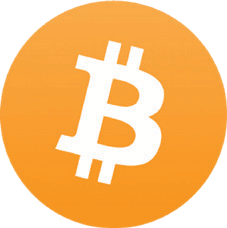
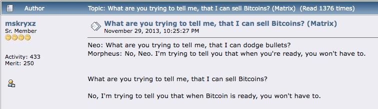

#  Bitcoin-Falschmeldungen zerstreuen
(Angst, Unsicherheit, Zweifel)

* Im Folgenden werden einige gängige Argumente gegen oder Ängste
über Bitcoin aufgeführt.
* Diese sind weitgehend unbegründet und resultieren aus Unwissenheit oder vielleicht aus einem unvollständigen Verständnis.
* Ich liefere hier kurze Widerlegungen für jeden Punkt, und am Ende
findest du Verweise auf ausführlichere Ressourcen
zur Widerlegung aller Falschmeldungen.

## BITCOIN VERBRAUCHT ZU VIEL ENERGIE

>*Die Wärme von deinem Computer wird nicht verschwendet,
wenn du dein Haus damit heizen musst ... Es ist
kostengleich, wenn du die Wärme mit
deinem Computer erzeugst.*

~ Satoshi Nakamoto 2010-08-09

>*Zuerst erscheint die Produktion einer Ware nur deshalb, weil sie
kostspielig ist, recht verschwenderisch. Die unfälschbar
kostspielige Ware fügt jedoch wiederholt Wert hinzu, indem sie
vorteilhafte Vermögenstransfers ermöglicht. Ein größerer Teil der Kosten wird
jedes Mal wieder hereingeholt, wenn eine Transaktion ermöglicht oder
kostengünstiger gemacht wird. Die Kosten, anfänglich eine komplette Verschwendung, werden
über viele Transaktionen amortisiert.*

~ Nick Szabo

Cypherpunk

---

* **"Zu viel" Energie ist eine Wertvorstellung, die
berücksichtigen muss, wie wir den Zweck der Energienutzung
bewerten.**

* **Wenn man bedenkt, dass die Weihnachtsbeleuchtung in den
USA so viel Strom verbraucht wie das gesamte Bitcoin-Netzwerk,** dann erkennt man vielleicht, dass alles relativ ist!

* Energie zu verwenden, selbst eine ganze Menge Energie, um
das härteste, zensurresistenteste Geld
zu sichern, das die Menschheit je kannte, ist es mehr als wert.

* Beim Vergleich des Bitcoin-Energieverbrauchs mit dem des
traditionellen Systems müssen wir auch den "Full
Stack" auf beiden Seiten berücksichtigen:

| Bitcoin-Ökosystem   | Traditionelles Fiat-System       |
| -------------------- | --------------------------- |
| ASIC-Miner           | BIZ                         |
| Nodes                | Zentralbanken               |
| Hardware-Wallets     | Nationale/Regionale Banken     |
| Software-Wallet-Apps | Militärisch-Industrieller Komplex |
|                      | Backup-Rechenzentren        |
|                      | Physischer Gelddruck       |
|                      | Physische Geldverteilung    |
|                      | Online-Banking-Apps         |
|                      | Netzwerk von Geldautomaten    |

* Durch die Verwendung von Bitcoin werden wir letztendlich den Energieverbrauch
in einer Vielzahl anderer Bereiche reduzieren, insbesondere
dadurch, dass wir den militärisch-industriellen Komplex nicht mehr benötigen
, um den Petro-Dollar zu schützen.

---

* Außerdem wird der grassierende Konsumismus, der erforderlich ist
, um das schuldenbasierte System am Laufen zu halten, im Laufe der Zeit
eingeschränkt werden, da **hartes Geld auf natürliche Weise zu
umsichtigem Ausgeben und Sparen anregt** (da deine Ersparnisse
tatsächlich ihren Wert behalten, ein Konzept, das wir seit dem Ende des Goldstandards nicht mehr erlebt haben).
* **Schließlich und wichtig ist, dass das Bitcoin-Mining bereits
die Umweltverschmutzung reduziert, indem es abgefackeltes Erdgas auffängt
und es zur Stromversorgung der Miner verwendet.** Da Miner
niedrige Stromkosten anstreben, wird es wahrscheinlich auch die größte
Triebkraft für erneuerbare, kostengünstige Energie sein, da die
Anreize übereinstimmen.
* **Fundierte, tiefgehende Analysen zu Bitcoin und Energie** wurden
von Daniel Batten auf batcoinz.com, Troy
Cross, Jyn Urso, dem Video "This Machine Greens"
von Swan Bitcoin auf YouTube, "Dirty Coin", einem
Bitcoin-Mining-Dokumentarfilm und einer
ausgezeichneten Folge der Sendung "What is Money"
(WiM161) mit B. Quittem unter vielen anderen geschrieben.

---

## BITCOIN IST EIN PONZI-SYSTEM
* **Bitcoin ist kein Ponzi-System:**
 * Alte Investoren erhalten kein Geld von neuen
 Investoren.
 * Beim Kauf von Bitcoin verspricht niemand eine Rendite
 auf deine Investition.
 * Es gibt kein Führungs- oder Promotion-Team.
 * Es gab keinen Pre-Mine.
 * **Lesen:** "Warum Bitcoin kein Ponzi-System ist" von Lyn Alden
für mehr Informationen.

## BITCOIN IST ZU LANGSAM
* Obwohl die Bitcoin-Basisschicht langsam ist, ist die 2.
Schicht
**Lightning Network, das auf der Basisschicht aufgebaut ist, ...
blitzschnell!**
* Das Bitcoin-Netzwerk kann etwa 7
Transaktionen pro Sekunde (TPS) verarbeiten.
* Das Visa-Netzwerk behauptet, bis zu 24.000
TPS verarbeiten zu können, obwohl 4.000 TPS der tatsächlichen Nutzung näher kommen.
* **Das Lightning Network, eine Second-Layer-Lösung
, die auf Bitcoin basiert, hat das Potenzial,
Millionen von Transaktionen pro Sekunde zu verarbeiten!**

---

## REGIERUNGEN KÖNNTEN BITCOIN VERBIETEN
* Einige Regierungen haben es versucht, wie zum Beispiel China, Indien und
Nigeria. In jedem Fall steigt die Nutzung von Bitcoin
durch die Bevölkerung des jeweiligen Landes rasant an.
* **Es gibt für Regierungen keine Möglichkeit, Bitcoin wirklich zu "verbieten",** da es von Natur aus genehmigungsfrei und zensurresistent ist. Es ist Code und Code ist Sprache.
* Das heißt, Regierungen können es erschweren, mit Fiat zu kaufen
und zu verkaufen. Sie können es auch als Ware besteuern,
wie sie es in den USA tun.
* **Letztendlich wird es nicht in ihrem Interesse sein, zu versuchen, es zu verbieten
, da Bitcoin unvermeidlich ist und sie das langsam
erkennen.** Es wäre viel klüger, es als Absicherung gegen ihre
inflationären Fiat-Währungen auf die Bilanz ihres Landes zu setzen.

>*Regierungen sind gut darin, die
Köpfe von zentral gesteuerten Netzwerken
wie Napster abzuschneiden, aber reine P2P-Netzwerke
wie Gnutella und Tor scheinen sich zu
behaupten.*

~ Satoshi Nakamoto

* **Lesen:**

Kann die Regierung Bitcoin stoppen? von Alex Gladstein,
CSO der Human Rights Foundation

Kann die Regierung Bitcoin verbieten? Vier Dinge, die du
wissen musst von Nick Giambruno

---

## BITCOIN IST ALTE TECHNIK
* **Eher "ultimative Technik",** in Bezug auf digitale
Knappheit, Dezentralisierung und Lösung sowohl des Double-Spending-Problems als auch des Problems der byzantinischen Generäle. Einmal entdeckt, kann sie nicht wiederentdeckt werden.
* **Sobald das Rad erfunden war, konnte es nie wieder
neu erfunden werden.**
* Das TCP/IP-Protokoll, auf dem das Internet läuft, ist
seit 1983 der Standard für alle Computernetzwerke.
Es wird wahrscheinlich noch lange der Standard bleiben.
* Sobald eine perfekte Basisschichttechnologie entdeckt wird, die optimal funktioniert, kann sie Hunderte
oder Tausende von Jahren halten.

Credit: @DecouvreBitcoin

---

## BITCOIN WIRD VON KRIMINELLEN VERWENDET
* **So auch der Dollar und jede andere Fiat-Währung der
Welt.** Es ist schlichtweg falsch, dieses Problem
nur Bitcoin zuzuschreiben.
* **Bitcoin ist ein Werkzeug, genau wie ein Messer, und es liegt an jedem
von uns, wie wir es verwenden.**
* Interessanterweise, wenn Bitcoin nicht von Kriminellen verwendet werden könnte,
wäre es nicht das neutrale, zensurresistente
Geld, das die Welt so dringend braucht.
* **Hinweis:** Da die Bitcoin-Blockchain überprüfbar ist, ist sie
eigentlich eine wirklich schlechte Wahl für kriminelle Aktivitäten!

## QUANTENCOMPUTING KÖNNTE BITCOIN KNACKEN
* Dies mag zwar eines Tages in der Zukunft möglich sein,
**Entwickler arbeiten bereits an Lösungen für Post-Quanten-Verschlüsselung**
* Bitcoin ist nur eine von vielen Online-Anwendungen, die für die Sicherheit auf SHA-256-Hashing angewiesen sind.
Sogar das Militär verwendet es, daher gibt es über die Bitcoin-Community hinaus einen enormen Anreiz, neue
Verschlüsselungsprotokolle zu entwickeln.
* Wenn SHA-256 gebrochen wird, haben wir noch viel mehr
zu befürchten als Bitcoin. Das gesamte Internet verwendet
es zur Verschlüsselung. Dazu gehören alle Bank-, Lieferketten-, Transportsysteme, Gesundheitssysteme,
Bildungssysteme und mehr.

---

## BITCOIN HAT KEINEN ECHTEN WERT
>*"Bitcoins Wert wird durch seine durchsetzbare Knappheit bestimmt"*

*~ Fidelity Digital Assets*

* **Knappheit ist der Wert. Alles Geld über die gesamte Zeit wurde
geschätzt, weil es ein gewisses Maß an Knappheit aufwies.**

* Darüber hinaus wurde es von der Überzeugung getragen, dass es
seinen Wert behalten würde, so dass es in der
Zukunft gegen etwas anderes Wertvolles eingetauscht werden könnte.
* Da das Bitcoin-Netzwerk wächst, unterstützt durch die überlegenen
monetären Eigenschaften, die es verkörpert, wächst der Netzwerkeffekt
exponentiell.
* Je größer der Netzwerkeffekt, desto mehr Wert bietet es als
knappes Gut. Wert ist ein Spiegelbild der Nachfrage,
und mit steigender Nachfrage steigt der Wert.

---

## EINIGE LEUTE HABEN ZU VIEL
* Es stimmt, dass einige Leute viel mehr haben als andere.
**Indem Satoshi das Protokoll offen freigab, erlaubte er ihm,
sich frei zu bewegen, und diejenigen, die das Potenzial
erkannten, das es barg, schürften oder kauften es frühzeitig. Es war die
fairste und organischste Art, es der Welt zu präsentieren.**
* Im Laufe der Zeit, wenn die Welt hyperbitcoinisiert ist, was bedeutet, dass wir uns in einem Bitcoin-Standard befinden, werden diejenigen,
die mehr haben, es auf natürliche Weise in die Wirtschaft ausgeben

* Auch wenn man es ab einem bestimmten Punkt nicht mehr
mit Fiat kaufen kann, werden die Leute für ihre
Arbeit in Bitcoin bezahlt. In echtem, solidem Geld bezahlt zu werden, wird
es uns ermöglichen, echte Ersparnisse zu haben, die im Laufe der Zeit
nicht durch Inflation entwertet werden.
* Während es aufgrund einer Vielzahl von Faktoren immer
diejenigen mit mehr Reichtum und diejenigen mit weniger Reichtum geben wird,
**wird ein Bitcoin-Standard die Membran zwischen
den Wohlstandsklassen durchlässig machen**, wie Aleks Svetsi sagt. Dies
wird es ermöglichen, dass sowohl die Aufwärts- als auch die Abwärtsmobilität
weitaus fließender sind als heute.
* **Da wir in eine Fiat-Welt hineingeboren wurden und unser ganzes Leben lang darin geschwommen sind, ist es fast unmöglich, sich vorzustellen und
die Auswirkungen eines Geldes vollständig zu erfassen, das
nicht entwertet oder manipuliert werden kann!**

---
## BITCOIN IST ZU VOLATIL
* **Dies ist normal während der Preisfindungsphase eines
neuen monetären Vermögenswerts.** Es gibt keine andere Möglichkeit, wie
Wachstum geschehen kann, wenn es organisch und emergent ist
(im Gegensatz zu Top-Down und zentral gesteuert.
* Darüber hinaus ist es in diesem Stadium der menschlichen Existenz, mit
exponentiellen Veränderungen in allen Bereichen, sinnvoll, dass etwas so rEVOLutionäres wie Bitcoin
wilde Schwankungen aufweisen wird.
* Während diejenigen von uns, die tief im Kaninchenbau stecken, es
als die Zukunft sehen, hält derzeit nur ein kleiner Prozentsatz der
Weltbevölkerung Bitcoin zu diesem Zeitpunkt. Dies
macht es anfällig für immense Volatilität.
* Mit zunehmender Reife und Akzeptanz wird die Volatilität abnehmen, und schließlich wird sie sich stabilisieren und
zu einer Recheneinheit werden.

>*Ich bin sicher, dass es in 20 Jahren entweder ein sehr großes Transaktionsvolumen
oder kein Volumen geben wird.*

~ Satoshi Nakamoto 2010-02-14

---

## MAN KANN EINEN BITCOIN NICHT ANFASSEN

* **Dies ist ein Feature, kein Bug.** Die Tatsache, dass Bitcoin
nicht physisch ist, ist einer der größten Faktoren, die zu seiner Unbeschlagnahmbarbeit beitragen!

## BITCOIN KÖNNTE GEHACKT WERDEN

* In den 15 Jahren seit seiner Einführung wurde es nie
gehackt.
* Es gab jedoch Hacks an Börsen, daher empfehle ich
dringend, dein Bitcoin so schnell wie möglich in deine eigene
Selbstverwahrungs-Wallet zu verschieben.
* Es wurde geschätzt, dass ein Quantencomputer
13.000.000 physische
Qubits benötigen würde, um die SHA-256-Verschlüsselung (die Bitcoin verwendet) innerhalb von 24 Stunden zu knacken. Zu diesem Zeitpunkt liegt der aktuelle Qubit-Rekord
von Atom Computing in Kalifornien bei 1.180 Qubits.
* Es wird allgemein angenommen, dass eine quantensichere Verschlüsselungsmethode
entwickelt wird, lange bevor sie benötigt wird.

>*Open Source zu sein bedeutet, dass jeder den
Code unabhängig überprüfen kann. Wenn es
Closed Source wäre, könnte niemand die
Sicherheit überprüfen. Ich denke, es ist unerlässlich, dass ein
Programm dieser Art Open Source ist.*

*~Satoshi Nakamoto 2009-12-10*

---

## MEHR ZUR ENTKRÄFTUNG VON FALSCHMELDUNGEN HIER:

* Endthefud.org
* Bitcoinmythbusters.org
* Casebitcoin.com - Häufige Kritikpunkte
* Safehodl.github.io/failure/
* Lopp.net - Bitcoin Info: Missverständnisse

>*Bitcoin unterscheidet sich grundlegend von jedem anderen digitalen
Asset. Kein anderes digitales Asset wird Bitcoin wahrscheinlich als monetäres Gut verbessern, da Bitcoin das
(im Vergleich zu anderen digitalen Assets) sicherste, dezentralisierteste,
solide digitale Geld ist und jede "Verbesserung"
notwendigerweise Kompromisse eingehen wird.*

~ Fidelity Digital Assets Report, "Bitcoin First", Jan 2022
Chris Kuiper, CFA, Direktor für Forschung
Jack Neureuter, Research Analyst

---

## ZUM PREIS VON BITCOIN
* **Ich sehe das Hodling (Halten) von Bitcoin wie ein langfristiges
Sparkonto.**
* Der Tagespreis spielt keine Rolle, da erwartet wird, dass er
noch einige Jahre volatil sein wird (rauf und runter gehen).
* Wie ich bereits erwähnt habe, ist dies normal für ein neues
Asset, das sich in der Preisfindungsphase befindet.
* Wenn man auf dem BTC/USD-Preischart herauszoomt,
wird man sehen, dass er seit 2009 um +31.296 % gestiegen ist,
im Durchschnitt auf ~200 % pro Jahr.
* Die Preisschwankungen spiegeln verschiedene Nachrichtenartikel, regulatorische Aktualisierungen, Marktnachfrage, Angst und Aufregung wider.
Es ist eine Achterbahnfahrt!
* **Je länger du hodlst, desto mehr lernst und verstehst du die Grundlagen, und desto mehr erkennst du
die tiefgreifenden Auswirkungen von solidem Geld,
desto weniger spielt der Preis eine Rolle.**

>**Am Ende wird der "Preis" überhaupt keine Rolle mehr spielen, da Bitcoin
die Recheneinheit sein wird.**

* **Haftungsausschluss:**
* Setze nur das ein, was du 'verlieren kannst', da
es natürlich keine Garantien gibt.
* Betrachte das Bitcoin, das du kaufst, als ein langfristiges
Sparkonto und plane, es für mindestens fünf Jahre
im Cold Storage zu lassen, bevor du es ausgibst.

---

Originalquelle des bitcointalkforum.org für eines der
klassischsten Bitcoin-Memes aller Zeiten.

---

## IN DER ZWISCHENZEIT ZU STEUERN
* **Haftungsausschluss:** Dies ist keine Finanz- oder Steuerberatung

* Im US-Steuergesetz wird Bitcoin derzeit als Ware angesehen, daher gibt es potenzielle steuerliche Auswirkungen, wenn du
es wieder in Fiat verkaufst oder sogar, wenn du etwas mit
deinem Bitcoin kaufst.
* Wenn der Preis gefallen ist, bevor du es verkauft/ausgegeben hast, kannst du
einen Verlust geltend machen.
* Wenn der Preis gestiegen ist, sollst du einen
Kapitalgewinn geltend machen und zwischen 10-30 % KEST (Kapitalertragssteuer) zahlen.
* Die Höhe hängt von mehreren Faktoren ab, z. B.
wie lange du es vor dem Verkauf oder der Ausgabe gehalten hast und
in welche Steuerklasse du fällst.
* Wenn du planst, Bitcoin zu verkaufen oder auszugeben, insbesondere größere
Beträge, solltest du in Erwägung ziehen, einen
Steuerberater zu konsultieren.
* Wenn du einfach kaufst und hältst, hast du derzeit
keine steuerpflichtigen Ereignisse in Bezug auf Bitcoin.
* Und wenn du non-KYC kaufst...

---
