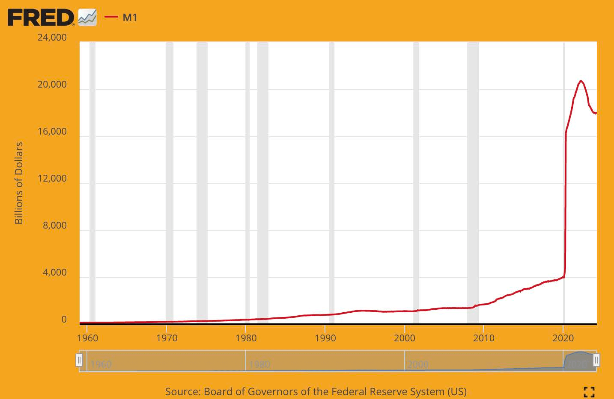

# Me Yasa Muke Bukatar Bitcoin

## MUNA BUKATA SABODA KUDI YA LALACE

> *`Babban matsalar da ke tattare da al'adar
>kudin takarda shi ne amincewa da ake bukata
>don ya yi aiki. Dole ne a amince da babban bankin
>ba zai rage darajar kudin ba,
>amma tarihin kudaden takarda ya cika
>da keta amana. Dole ne a amince da bankuna
>su rike kudinmu kuma su canza
>su ta hanyar lantarki, amma suna ba da shi
>a cikin guguwar kumbo na bashi da kyar a
>wani kaso a ajiye. Dole ne mu amince da su
>da sirrinmu, mu amince da su ba za su bari ba
>barayin shaidar su kwashe asusun ajiyarmu ba.`*

~ Satoshi Nakamoto 2009-02-11

* Tsarin kudin takarda ya lalace (kullum haka yake).
* Ba zai iya dorewa ba (babu lokacin da ya dore).
* Babu wata hanya ta gyara shi (ba zai taba yiwuwa ba).

---
## (BA) MA'AUNI NA ZINARIYA
* Mutane da yawa har yanzu suna ganin cewa zinariya ce ke goyon bayan kudi.
* Ba haka ba ne.
* Ba a goyon bayan zinariya tun 1971, lokacin da
Shugaba Nixon ya soke wa duniya daidaiton
zinariya (girgizar Nixon).
* Duba **wtfhappenedin1971.com** don samun hoto bayyananne
na barnar da hakan ya yi.

Taswirar da ke nuna hauhawar farashin kayayyaki (layin ja) da
ikon sayen dalar Amurka (layin baki) tun 1971.

<small>Ofishin Kididdiga na Ma'aikata na Amurka, wanda aka samo daga FRED, Babban Bankin Tarayya na St. Louis; https://
fred.stlouisfed.org/series/CPIAUCSL, Yuni 9, 2024.</small>

* Gaskiya Mai Ban Sha'awa: An kafa Dandalin Tattalin Arziki na Duniya a cikin 1971.
---

>**FIAT:** (suna) /ˈfiː.æt/
>
>: umarni mai iko ko na son rai: DOKA
>
>: ƙaddarar hukuma: DIKTA
>
>**: umarni ko aikin nufi da ke haifar da wani abu ba tare da
>ko kamar ba tare da ƙarin ƙoƙari ba**

~ merriam-webster.com/dictionary

>**FIAT :** daga Latin fieri «a yi, ya fara»

* Fiat kudi ne da ke da daraja kawai saboda gwamnati ta ce (ta yanke hukunci) cewa haka ne.
* Don haka mutane (dole ne) su gaskata cewa haka ne.
>* **Ko da ba su gaskata cewa takarda tana da daraja ba, doka ta
tilasta musu su yi amfani da ita kuma su karɓe ta a matsayin biyan kuɗi don
kayayyaki da ayyuka.**
* **Kudin takarda ana buga shi/ƙirƙira shi daga iska.**
* A kwanakin nan kusan kashi 5% na dukkan daloli ana buga su ne a matsayin
tsabar kudi.
* Sauran kashi 95% bankuna ne ke ƙirƙira ta hanyar shigar da
lambobi cikin kwamfuta lokacin da suke ba da lamuni

>*Yana kashe 'yan cents kaɗan ga Ofishin
Rubutu da Buga don samar da kuɗin $100…*

~ Masanin Tattalin Arziki na Amurka, Barry Eichengreen

---

>***Scott Pelley na NBC '60 Minutes':*** *Yana da kyau a ce kuna
kawai kuna ambaliya da tsarin da kudi?*
>
>***Shugaban Fed Jerome Powell:*** *Ee. Mun yi.
Wannan wata hanya ce ta tunani game da shi. Mun yi.*
>
>***Pelley:*** *Daga ina ya fito?
Kawai kuna buga shi ne?*
>
>***Powell:*** *Muna buga shi a dijital. Don haka a matsayin babban banki, muna
da ikon samar da kuɗi a dijital. Kuma muna yin haka
ta hanyar siyan Bills na Ma'aji ko takardun shaidar gwamnati
ko wasu takardun shaida da gwamnati ta ba da tabbaci. Kuma hakan yana ƙara yawan
kudin da ake samu. Hakanan muna buga ainihin kudin kuma muna
raba shi ta hanyar bankunan Tarayya.*

~ CNBC '60 Minutes' Interview, Mayu 17, 2020
Watanni biyu bayan barkewar kulle C*vid-19

>Babu iyaka ga abin da za mu iya yi
tare da waɗannan shirye-shiryen ba da lamuni da muke da su.

~ Shugaban Fed Jerome Powell
Maris 18, 2020 akan CBS News

>Ee, akwai tsabar kuɗi marasa iyaka a Tarayyar
Ajiyar. Za mu yi duk abin da ya kamata mu yi don tabbatar
akwai isasshen tsabar kuɗi a cikin tsarin banki.

~ Neel Kashkari, Shugaban Minneapolis Fed
Maris 23, 2020, CBS '60 Minutes'

>‘Mu’ a nan mutane biyar ne da ke kada kuri’a kan sauye-sauye a
tsarin manufofin kudi a cikin tsarin Tarayyar
Ajiyar a lokacin tarurrukan FOMC. 5 daga cikin 330,000,000.
Abin da ake bukata kenan don canza manufofin kuɗi na Amurka.

~ @MartyBent, Wanda ya kafa TFTC.io
Labarin Forbes, Maris 18, 2020

---

## DAGA BAKIN DOKIN OLDE

>*Bankin yana da riba akan duk kuɗin
da yake ƙirƙira daga ba komai.*

*~ William Paterson, 1694
Wanda ya kafa Bankin Ingila*

>*Dukkan rudani, hargitsi, da damuwa a Amurka sun taso ne,
ba daga ajizancin Tsarin Mulki ko Ƙungiyar Tarayya ba,
ba daga rashin girmamawa ko nagarta ba,
kamar yadda yake daga jahilcin
yanayin tsabar kudi, bashi, da zirga-zirga.*

*~ John Adams
Shugaba na 2 na Amurka, 1797-1801*

>*Na yi imani cewa cibiyoyin banki sun fi
hadari ga 'yancinmu fiye da sojojin da ke tsaye.
Tuni sun tayar da kuɗin sarauta
wanda ya sanya gwamnati a cikin ƙalubale.
Ya kamata a kwace ikon bayarwa daga bankuna, kuma
a mayar da shi ga mutanen da ya dace da su.*

*~ Thomas Jefferson
Shugaba na 3 na Amurka, 1801-1809*

>*Yayin da muke alfahari da manyan ayyukanmu, mun yi taka-tsan-tsan don ɓoye munanan
gaskiyar cewa ta hanyar tsarin kuɗi mara adalci mun mayar da
tsarin zalunci na ƙasa, wanda, ko da yake ya fi inganci, ba shi
da rashin tausayi fiye da tsohon tsarin bautar chattel.*

~Horace Greeley
Dan Majalisar Amurka 1848-49
Wanda ya kafa The New York Tribune

---

>*Duk wanda ya mallaki yawan kuɗi a kowace ƙasa shine
cikakken maigidan duk masana'antu da kasuwanci…
lokacin da kuka fahimci cewa yana da sauƙi a sarrafa tsarin gaba ɗaya,
ta hanyar ɗaya ko ɗaya, ta wasu 'yan maza masu iko a saman, ba za ku
buƙaci a gaya muku yadda lokutan hauhawar farashin kaya da damuwa ke farawa*

~ James A. Garfield
Shugaba na 20 na Amurka, Mar-Satumba.1881
An kashe shi a 1881

>*Akwai a yau wanda ba a sarrafa shi a hannun wasu maza
ikon yin daloli daga ba komai.*

~ Thomas W. Lawson, Marubuci 'Frenzied Finance', 1905

>*Na kasance mai asiri - hakika, mai ɓoyewa - kamar kowane mai shirya makirci.
Gano, mun sani, ba zai faru ba, in ba haka ba duk lokacinmu
da ƙoƙari za a ɓata. Idan aka fallasa cewa namu
wani takamaiman rukuni ya taru kuma ya rubuta dokar banki, wancan
dokar ba za ta sami damar zartar da Majalisar ba.*

~ Frank A. Vanderlip
Shugaban Bankin Birni na New York
(magabacin Citi Bank)
~ Rubuce-rubuce a 1935 na taron sirri da aka gudanar a
Jekyll Island a cikin 1910, don tsara dokar da aka zartar a matsayin
Dokar Tarayyar Ajiyar a 1913.

>*Wannan Dokar (Tarayyar Ajiyar) ta kafa amintaccen amintaccen a
duniya. Lokacin da Shugaban kasa (Woodrow Wilson) ya rattaba hannu kan Dokar,
gwamnatin da ba a gani ba ta Ikon Kuɗi za ta zama doka…
Mafi munin laifin majalisa na zamanin nan an aikata
ta wannan banki da lissafin kudin.*

~ Charles A. Lindbergh, Sr.
Dan Majalisar Amurka 1907-1917

---

>*Ni mutum ne da ba ni da farin ciki. Ba tare da sani ba na lalata kasata.
Tsarin bashi ne ke sarrafa babban al'ummar masana'antu.
Tsarin bashi namu ya tattara. Ci gaban al'umma,
don haka, da dukan ayyukanmu suna hannun 'yan mutane.
Mun zama daya daga cikin mafi munin mulki, daya daga cikin mafi
sarrafawa da mamaye gwamnatoci a cikin wayewa
duniya. Ba gwamnati ba ce ta hanyar ra'ayi na kyauta, ba gwamnati ba ce ta hanyar
aminci da kuri'un mafi rinjaye, sai dai
gwamnati ta hanyar ra'ayi da tilasta
karamin rukuni na maza masu rinjaye.*

~ Woodrow Wilson
Shugaba na 28 na Amurka, 1913-1921
Shekaru 6 bayan zartar da Dokar Tarayyar Ajiyar ta 1913.

>*Gaskiyar magana ita ce, kamar yadda kai da ni muka sani,
cewa wani kashi na kudi a manyan cibiyoyi
ya mallaki gwamnatin Amurka tun
kwanakin Andrew Jackson.*

~ Franklin D. Roosevelt
Shugaba na 32 na Amurka a cikin wasiƙar da aka rubuta
a ranar 21 ga Nuwamba, 1933 ga Kanar E. Mandell House

>*Ba ta [bakin ciki] ba ce ta bazata.
Lamari ne da aka tsara a hankali….
Bankunan kasa da kasa sun yi kokarin kawo
yanayin rashin bege a nan don su iya
fito a matsayin masu mulkinmu duka.*

~ Dan Majalisar Wakilai Louis T. McFadden,
An kashe shi a 1936

>Shugaban Kwamitin Banki da Kudi na Majalisar
*A duk lokacin da banki ya ba da lamuni,
sabbin kiredit na banki ana ƙirƙira - sabbin ajiya - sabon kuɗi.*

~ Graham F. Towers
Gov na Babban Bankin Kanada, 1934-55

---

>*Idan babu basussuka a cikin tsarin kuɗi namu,
ba za a sami kuɗi ba*

*~ Marriner Eccles,
1941, Gov. na Fed*

>*Ban taba samun kowa da zai iya, ta hanyar
amfani da hankali da tunani, ya tabbatar da gwamnatin Tarayya
yana aro amfani da kuɗin sa…
Na yi imani lokaci zai zo lokacin da mutane za su
bukaci a canza wannan.
Na yi imani lokaci zai zo a cikin wannan ƙasa lokacin da
za su zargi ku da ni da
kowane irin mutum da ke da alaka da Majalisar
saboda zama a banza da bada izini
irin wannan tsarin wauta ya ci gaba.*

~ Wright Patman
Dan Majalisar Amurka 1928-1976
Shugaban Kwamitin Banki da Kudi 1963-1975

>*Lokacin da kai ko ni muka rubuta cak, dole ne a sami isassun kudade a cikin mu
asusun don biyan kuɗin cak, amma lokacin da Tarayyar Ajiyar ta rubuta
cak babu ajiya na banki wanda aka zana cak ɗin. Lokacin da
Tarayyar Ajiyar ta rubuta cak, tana ƙirƙirar kuɗi*

~ Bankin Tarayyar Amurka na Boston
'Sanya Shi Sauƙi', 1984

---

## TARAYYAR AJIYAR

* Fed shi ne 'mai zaman kansa' babban bankin
Amurka. An ƙirƙira ta a 1913 tare da zartar da
Dokar Tarayyar Ajiyar.
* Tana da tsari na musamman, bangare mai zaman kansa da bangare
na gwamnati.
* Ya kamata ya zama mai zaman kansa na siyasa,
bangaren da ba na jam'iyya ba a cikin gwamnati.
* Yayin da Shugaban kasa ke nada Hukumar Gudanarwa ta Fed
kuma Majalisa ta tabbatar da ita, **ba dole ba ne a amince da
shawarwarin Fed da kowa.**

**Ya ƙunshi:**

* Hukumar Gudanarwa ta Tarayyar Ajiyar
* Bankunan Tarayya 12
* Kwamitin Kasuwannin Buɗe na Tarayya (FOMC),
wanda shine hukumar da ke tsara manufofin kuɗi.

**Fed yana da alhakin:**

* Kula da manufofin kuɗi na Amurka, haɓaka aikin yi da farashin da ke daidai.
* Tsara da kuma kula da banki da na kuɗi
cibiyoyi.
* Samar da ayyukan biyan kuɗi ga cibiyoyin kuɗi.
* Haɓaka kariyar masu amfani da ci gaban al'umma
gaba.

---

## BAYANIN KAN SHUGABAN FED CHAI

* **Shugaban Tarayyar Ajiyar shi ma:**

* Shugaban Kwamitin Kasuwannin Buɗe na Tarayya
(FOMC), wanda ke yanke shawarar alkiblar Amurka
manufofin kudi (misali: QE, hawan riba)
* Memba na Asusun Ba da Lamuni na Duniya,
IMF
* Memba na Bankin Biyan Kuɗi na Duniya,
BIS (bankin manyan bankuna).
* Ministan kuɗi na Amurka na G-7
* Ministan kuɗi na Amurka na G-20

* **Duka** iko mai yawa ga mutum ɗaya.

---

## AJIYAR BASHIN, Riba & LAMUNI

* **Bankin Ajiya na Rago:** Har zuwa Maris 2020, bankuna
ana buƙatar su riƙe ajiya na 10%, kuma za su iya
bayar da lamuni 90%.
* **Tun Maris 2020, ba a buƙatar ajiya, yana ba bankuna damar bayar da lamuni mara iyaka.**

* Lamuni kuɗi ne na tushen bashi, kuma ana buƙatar ku
biya riba akan lamunin.

>* **Gaskiya Mai Ban Sha'awa 1:** Ba bankuna ne suka samar da kudin biyan ribar lamunin
>ba.
>* **Gaskiya Mai Ban Sha'awa 2:** Ba a taɓa ƙirƙira ta.
>* **Gaskiya Mai Ban Sha'awa 3:** BABU ISASSHEN kuɗi a cikin
>duniya don biyan duk lamunin + ribar da ake bin
>waɗannan lamunin.
>* **Gaskiya Mai Ban Sha'awa 4:** Ba za a taɓa samun ba!

---

## BAYANI AKAN PETRO DOLLA
* Mutum zai iya cewa **har zuwa 1971 zinariya ce ke goyon bayan dala,
kuma tun 1974 man fetur ne ke goyon bayanta,
don haka ta hanyar tsohuwa, Sojojin Amurka.**
* **A cikin 1974 Amurka da Saudi Arabia sun shiga yarjejeniyoyin bangarori biyu don saka farashin man fetur a cikin dalar Amurka.**
* Tun daga nan, yawancin tallace-tallacen man fetur na duniya an warware su a cikin
dalar Amurka.
* Hakan ya taimaka sosai wajen mayar da dala ta
zama mafi ƙarfi a duniya.
* **Don haka an tallafa mata ta hanyar wucin gadi,** har ma a lokutan
da a al'ada za ta yi fama.
* Tun daga ƙarshen 2022, wasu ƙasashe sun
fara ciniki a cikin kuɗaɗe ban da dalar Amurka
* Akwai yuwuwar wannan zai iya zama farkon
karshen petro dollar. Abin da ya faru na gaba
zai rage a gani…

---

## AKAN QE (SAUKAKA MASU YAWAN GUDA)
* **Ana ɗaukar Sauƙaƙe Mai Yawan Guda a matsayin 'manufofin kuɗi da ba a saba gani ba' da
Manyan Bankuna ke amfani da su don 'ƙarfafa
tattalin arziki', inda Fed ke sayen gwamnati
takardun shaida da sauran takardun gwamnati.**
* Japan ta fara amfani da shi tsakanin 2001-2006.
Bayan haka, Amurka, Birtaniya, da yankin Euro sun yi amfani
da QE a lokacin rikicin kuɗi na 2008
* Tun daga nan, lokaci kawai da Amurka ba ta da shirin
QE shine tsakanin 2014-2019.
* Kamar yadda aka gani a ƙasa, masu suka sun yi jayayya cewa **QE na amfanar da waɗanda suka riga sun yi arziki**

*Kiredit: @RudyHavenstein akan Twitter*

---

## CYCLES

* **A cikin dukkan yanayi, akwai hawan keke, hawan keke na halitta da
gudu, fadada da takurawa.**

* Wannan **yana ba da gudummawa ga gabaɗaya, a kan lokaci, ma'auni
da dorewar** tsarin haɗin kai gaba ɗaya, na dukkan
rayuwa a duniya.
* **Tsarin kuɗi na tushen bashi, kudin takarda yana watsi da
hikimar hawan keke na halitta,** kuma a maimakon haka ya dogara ne akan,
kuma 100% ya dogara don tsira akan, wanda ba a misaltuwa
da ci gaba mara kyau, don ci gaba da
bi bashinsa.
* A yanayi, wannan shine ciwon daji.
* A cikin 'tattalin arziki', gwamnati na kara tallafa wa wannan yanayin da ba na halitta ba ta hanyar ceto
bankuna da manyan kamfanoni da ke fama da matsala, maimakon barin su
su ninka, a sake sarrafa su zuwa wani sabon abu, wani abu mafi koshin lafiya.
* **Rashin ganin nesa na ceto kamfanoni masu fama da matsala yana sanya tattalin arzikin gaba daya cikin hadari.** A zahiri,
yana kawai harba gwangwan din a kan hanya, kuma tabbas rikicin da ke gaba yana iya zama mai zurfi, zurfi
mafi tsanani fiye da idan an bar hawan keke na halitta su
fita
* **Muna bin Satoshi Nakamoto, da
cypherpunks kafin da bayan shi,** saboda samun
hangen nesa, hangen nesa, ƙuduri da ƙwarewa don samar da
jirgin ruwa don ɗaukar mu zuwa sabbin gabobin ruwa.

---

* Da zarar mun gane kyautar da wannan yake, ya rage namu mu
hau jirgin, da cikakkiyar zuciya da tunani mai kyau, zuwa
dauki tafiyar kuma mu gina sabuwar duniya da Kudi
na Aminci.
>* **Bitcoin yana gyara kuɗin, ya rage namu mu gyara sauran.
Kuma, a fayyace, ta hanyar samun kuɗin da aka gyara, A LOT
wasu abubuwa za a gyara, ta hanyar tsohuwa**

* Babban shine cewa, yaki mai girma, wanda gwamnati ta fara, ba zai sake samun riba ba, ko kuma zai yiwu, ba tare da goyon bayan mutane ba.
* Ƙari ga haka, a zahiri za a sami ƙarancin amfani,
tare da sauyawa zuwa kayayyaki da sabis na ainihi, kasuwanni kyauta, ainihin ajiyar kuɗi, & kawar da kuɗi
gidaje da gidaje, wanda ba a yi nufin
a sanya shi a cikin kuɗi a wurin farko ba.
* **GANIN:** Bitcoin Fixes This, shafi na 32
---

## MUNA BUKATA SABODA HAUHAWAR FARAHA SATA NE

Taswirar FRED ta 2024 da ke nuna raguwar ikon sayan
dala tun kafuwar Tarayyar Ajiyar a
1913. Yawan hauhawar farashin kaya tun 1913 yana kusa
3.067%. Dukkan kudaden takarda na manyan bankuna a duniya
suna bin makamancin haka.

* **Ƙarin kuɗin da aka ƙirƙira daga iska,
ƙarin duk kuɗi ke rasa darajar/ikon sayan.**
* Ana kiran wannan **hauhawar farashin kaya.**
* Hauhawar farashin kaya **sata ne na lokaci,** a zahiri. An sace darajar ku
lokacin da kuka ajiye shi a cikin kuɗin da aka yi hauhawar farashin kaya, aka rage darajarsa kuma aka sarrafa shi.
* Hauhawar farashin kaya kuma **haraji ne da aka ɓoye**.

---

* Wannan satar lokaci da haraji ya shafi duk sauran
kudaden takarda na kasashe, haka nan, tunda dukansu
an haɗa su da dalar Amurka, kamar yadda ya kasance
kudin ajiyar duniya tun yarjejeniyar Bretton Woods
a 1944.
* **A Amurka, an rubuta hauhawar farashin kaya na 2% na shekara-shekara
umarnin Tarayyar Ajiyar.**
* Wannan yana nufin cewa **an GARANTIN ka za ka iya
sayan 2% KARANCI** tare da kuɗin $20 iri ɗaya kowace shekara.
* **A cikin Maris 2024, hauhawar farashin kayayyaki na shekara-shekara ya kasance 3.5%,**
(fiye da 2%, wanda ke nufin kun rasa 3.5% na
ikon sayayya tsakanin Maris 2023 da
Maris 2024.
* A takaice dai, wannan yana nufin cewa, a matsakaici, abubuwa
sun karu a farashin da kashi 3.5%
* **Idan an auna hauhawar farashin kayayyaki daidai, kamar yadda aka yi
har zuwa farkon 1980s, a zahiri zai
ya kasance kusa da 10% a cikin 2024.**
* Idan aka duba ta nau'i, mutum ya ga cewa
hauhawar farashin kaya ya fi muni fiye da kashi 3.5% a cikin da yawa
rukunan a cikin shekarar da ta gabata.
* Lokacin da mutum ya kalli hayan mutum, lissafin kayan abinci, gas
farashin, kusan duk abin da mutum ya saya, a bayyane yake cewa
hauhawar farashin kaya ya yadu a kowane fanni

---
**Matsakaicin Hauhawar Farashin Kaya sama da
shekaru 50 da suka gabata a Amurka:**

|   Matsakaicin Kuɗi   |   1971  |   2021  |   % Ƙaruwa  |
| --- | --- | --- | --- |
|   Albashi   |    $9,400 |    $59,400 |    532% |
|   Gida  |    $23,400 |    $513,000 |    2,092% |
|    Galon Gas | $0.36    |   $4.17 |  1,058%   |
|    Sabon Mota |  $3,400   |   $47,000  |    1,282% |
|   Digirin Kwaleji   |  $1,400   |   $26,000  |  1,757%   |
|   Basket Groceries  |$20     |  $210  |    950% |
|  Wutar Lantarki/kWh   |  $0.02    |   $0.15  |   650%  |

>**Tabbataccen Labari:**
~ An sayi gida a 1976 akan $58,000.
~ Lokacin da aka yi la'akari da hauhawar farashin kaya na 'officially', wannan zai kasance
$279,000 a cikin dalar 2022.
~ A cikin 2022 an kimanta gidan iri ɗaya akan $2.09 miliyan.
~ Yi tunani akan wannan…

>*Kudin takarda yaudara ne.
Wane bayani ne kuɗin $10 ke bayarwa?
10 shine mai lissafin wani juzu'i tare da
mai rarraba ya ɓace.
10 daga cikin menene?
10 ba ya cewa komai ba tare da sananne ba
da kuma mai rarraba mai ƙarfi.*

~ @bitlany

---

* **Yayin da hauhawar farashin kaya ke karuwa, ajiyar kuɗin ku (idan kuna da sa'a
isa ya sami ajiyar kuɗi), rasa darajar.**
* A tsawon lokaci, sun rasa **A LOT** na darajar
>*Idan ka fara ajiye $100/wata a yau, tare da
>mafi kyawun riba da ake samu na 0.05%:
> * a cikin shekaru 30 da za ku ajiye **$84,019.**
>* Lokacin da aka daidaita don hauhawar farashin kaya na 2% na FED
>* A cikin shekaru 30 ajiyar ku za ta sami tasiri
ikon sayayya na **$46,384 kawai.**
>* Gyara don hauhawar farashin kayayyaki na yau da kullun na 3.5%:
>* Ajiyar ku ta $84,019 za ta sami
ikon sayayya na **$11,037 kawai** a cikin shekaru 30!

* **A zahiri wannan yana nufin cewa kusan shida daga cikin
An sace sa'o'i bakwai na aikinku = *Satan Lokaci.***

---
**Wata hanyar duban shi ita ce kamar haka:**
* A **1971**, farashin gida = **2.5** sau matsakaicin
albashi na shekara.
* A **2024,** farashin gida = **8.6** sau
matsakaicin albashi na shekara.
* A **1971**, sabuwar mota ta kashe kusan **1/3** na matsakaicin albashi
* A **2024**, sabuwar mota ta kashe sama da **3/4** na matsakaicin albashi.

Na amince cewa yanzu a bayyane yake
hauhawar farashin kaya
ba ya  * **a'a** *
aiki a cikin gaskiya.

**Lura:** Duk waɗannan lambobin matsakaita ne, kuma suna canzawa bisa
akan abubuwa da yawa. Matsalar ta kasance, hauhawar farashin kaya haraji ne da aka ɓoye
kuma sata ce ta lokaci akan ainihin aikinmu da samarwa

>* **Kudi mai wuya yana gyara wannan.**
>* **Bitcoin kudi ne mai wuya**
---

## MUNA BUKATAR MAYAR DA TATTALIN ARZIKI DA AKA SARRAFA A TSARA, MANUFAR, DA BASHIN

>*Ba na tunanin za mu sake samun kudi mai kyau,
kafin mu fitar da abin daga hannun gwamnati,
wato ba za mu iya fitar da su da karfi daga hannun
gwamnati, duk abin da za mu iya yi shi ne ta hanyar wani sirri na karkata hanyar
gabatar da wani abu da ba za su iya dakatarwa ba.*

~ Friedrich Hayek, 1984
Masanin Tattalin Arziki na Austrian, Falsafa da Marubuci, 1899-1992

Graph yana nuna ƙarin M1 Money Supply mai girma daga
$4 tiriliyan a cikin Maris 2020 zuwa sama da $18 tiriliyan a cikin Yuni 2024.

* **Hura tunanin ku a nan:** https://usdebtclock.org/
---
* **An buga kashi 45% na dukkan dalolin Amurka da ke wanzu
tsakanin Afrilu 2020-Janairu 2022!**
* An buga daga iska mai siriri, tuna?
* Gwamnati ce ke sarrafa kuɗin takarda a tsakiya, kuma
an yi sauƙin sarrafa kayan.
* **Ya ɗauki shekaru 205 kafin Basussukan Ƙasa na Amurka su
kai $1 tiriliyan. (1776 > 1981)**
* Ya ɗauki **ƙarin shekaru 33 kawai kafin** Basussukan Ƙasa
na Amurka su kai **$34 tiriliyan!** (1981 > 2024)

FRED Graph yana nuna Jimlar Bashin Jama'a 1970-2024 a Amurka.

>*Bashin duniya, wanda Cibiyar
Kuɗi ta Duniya ta auna, yanzu ya kai $303 TRILLION.
Wannan ita ce duniyarmu akan takardar kuɗi na tushen bashi.
Af, GDP na duniya shine $84 tiriliyan kawai.*

*~ Nik Bhatia, Marubucin 'Layered Money', 2021*

---

* **Don tunani**

| **Idan kana da:** | **Kuna iya kashe $1/na biyu** |                |
| ------------ | ----------------------- | -------------- |
| **$1 Miliyan**   | ko kwanaki 11              | = kwanaki 11    |
| **$1 Biliyan**   | don kwanaki 11,680         | = shekaru 32   |
| **$1 Tiriliyan**  | don kwanaki 11,680