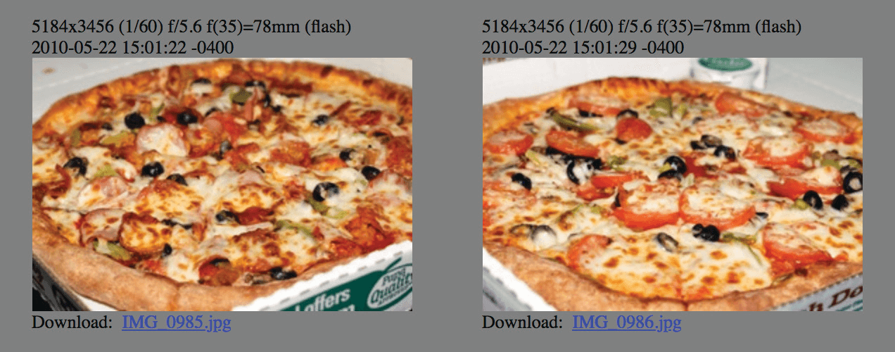

# AGOGO NA SATOSHI 369

**An tsara Bitcoin don hako tubalan 6 a kowane awa >> tubali daya
a matsakaici duk bayan ~ mintuna 10.**

* Awanni 24 a cikin yini

2+4=**6**

* Wannan yana nufin tubalan 144 a kowace rana

1+4+4=**9**

* Tubalan 52560 a kowace shekara

5+2+5+6+0=18

1+8=**9**

* Tubalan 52704 a shekarar da ake samun kari

5+2+7+0+4=18

1+8=**9**

* Kudi Miliyan 21:

2 + 1 + 0 + 0 + 0 + 0 + 0 + 0 = **3**

* Rage Raba 33:

3 + 3 =**6**

* Matsalar tana daidaitawa kowane tubalan 2016:

2 + 0 + 1 + 6 = **9**

~ Dangane da wani sakon twitter na @level39

* Rage lambar yabo na tubali yana faruwa kowane
tubali na 210,000 (kimanin kowane shekaru hudu)
2 + 1 + 0 + 0 + 0 + 0 = **3**

---

>*"Idan kawai kun san girman 3, 6 da 9, to
da kuna da mabuɗin sararin samaniya.”
~ Nikola Tesla*

## KYAUTAR TUBALI = % NA KAYAN AIKI

* Tallafin tubali (adadin bitcoins da ake ba da lada
ga kowane sabon tubali da aka haƙo) yana wakiltar **kashi
na jimillar wadatar** da za a hako
a lokacin zamanin nan

* Misali, lambar yabo ta tubali ta yanzu tsakanin
2024-2028 shine **3.125** bitcoin.

* A cikin waɗannan shekaru huɗu ɗin, **3.125**% na 21
za a hako miliyan bitcoins.

Bashi: @bitcoinfool

---

## LOKACIN KYAUTA

* Duk shekaru hudu, ana raba tallafin bitcoin ga kowane
tubali da aka haƙo. **Zamanin Kyauta shine wannan lokacin shekaru huɗu.**

* **Zamanin lada na 1:** 2009-2012 **Tallafin tubali:** 50 bitcoin
= (50 bitcoins * tubalan 210,000) = 10,500,000 bitcoin

1+0+5+0+0+0+0+0 = **6**

* **Zamanin lada na 2:** 2012-2016 **Tallafin tubali:** 25 bitcoin
= (25 * 210,000) = 5,250,000 bitcoin

5+2+5+0+0+0+0 = 12

1+2 = **3**

* **Zamanin lada na 3:** 2016-2020 **Tallafin tubali:** 12.5 bitcoin
= (12.5 * 210,000) = 2,625,000 bitcoin

2+6+2+5+0+0+0 = 15

1+5 = **6**

* **Zamanin lada na 4:** 2020-2024 **Tallafin tubali:** 6.25 bitcoin
= (6.25 * 210,000) = 1,312,500 bitcoin

1+3+1+2+5+0+0 = 12

1+2 = **3**

* **Zamanin lada na 5:** 2024-2028 **Tallafin tubali:** 3.125 bitcoin
= (3.125 * 210,000) = 656,250 bitcoin

6+5+6+2+5+0 = 24

2+4 = **6**

* **Zamanin lada na 7: 2032-2036 Tallafin tubali:** 0.78125 btc
= (0.78125*210,000) = 164,062.5 bitcoin

1+6+4+0+6+2+5 = 24

2+4 = **6**

**...da sauransu har zuwa 2140**

---

## RANAR HAIHUWAR SATOSHI

* ***Afrilu 5, 1975*** ita ce ranar da Satoshi ya ce ta sa
ranar haihuwa.
* Yayin da ba za mu iya sanin ko wannan ita ce ainihin haihuwarsa ba
kwanan wata, yana da matukar ban sha'awa.
* ***Afrilu 5*** (1933) ita ce ranar da Dokar Zartarwa 6102
shugaban Amurka Franklin D. Roosevelt ya sanya hannu
"hana tara tsabar zinariya, da zinariya,
da takardun shaida na zinariya a cikin nahiyar
Amurka.”
* ***1975*** ita ce shekarar da soke EO 6102 ya fara
aiki, kuma an sake bai wa 'yan ƙasar Amurka damar
rika rike fiye da 5oz na zinariya.

## LAMBA MAI DAWO DA KANTA 6102-2016

* ***6102*** ita ce lambar da aka ambata a sama
Dokar Zartarwa.
* ***2016*** ita ce adadin tubalan da aka haƙo a lokacin kowane daidaitawar wahala (kimanin makonni 2).

>* A cikin duka misalan da ke sama, mutum zai iya
ya yi imanin cewa Satoshi yana amfani da lambobi
don nuna juyawa, **warwarewar
lalacewar da gwamnati ta yi.**

---

## RANAR PIZZA TA BITCOIN

* 22 ga Mayu an san shi da Ranar Pizza ta Bitcoin. Wannan shi ne
ranar da wani mutum, mai suna Laszlo Hanyecz, ya sanar
a bitcointalkforum.org cewa ya yi nasarar
ya sayar da bitcoin 10,000 don pizza! A lokacin
ya kasance kusan $40.
* A farashin yau, wannan zai zama ~$610,000,000.
* Ya kasance wani muhimmin lokaci ga bitcoin, domin shi ne na farko
sanannen lamarin wani yana sayar da bitcoin don a
kayan aiki ko sabis. Masha Allah mun yi nisa!

---

## KALANDA NA BITCOIN NA RANAKUN BAN GASKIYA

**2008-08-18** ~ An yi rijistar sunan yankin **bitcoin.org**.

**2008-10-31** ~ **Ranar Takardar Fari ta Bitcoin:** Takardar Fari,
mai taken "Bitcoin: Tsarin Kuɗi na Lantarki tsakanin Tsara-tsara"
an buga shi ta wani mai rubutun sirri mai suna Satoshi
Nakamoto akan metzdowd.com, jerin gwanayen cryptography.

**2009-01-03** ~ **Ranar Haihuwar Bitcoin:** An ƙaddamar da hanyar sadarwa ta Bitcoin
lokacin da Satoshi ya haƙo tubalin Genesis.

**2009-01-12** ~ **An gudanar da ciniki na farko na bitcoin,** lokacin da Hal
Finney ya sami bitcoins goma daga Satoshi a matsayin gwajin aikawa.

**2009-10-05** ~ **An haifi musayar bitcoin ta farko,** Sabuwar
Matsayin 'Yanci (NLS), tare da farashin kasuwa da aka jera na $0.00764
kowace tsabar kudin.

**2009-10-12** ~ "Na sami **ciniki na farko da aka sani na bitcoin zuwa USD**
daga madadin imel ɗina. Na sayar da 5,050 BTC akan $5.02
a kan 2009-10-12." - Martti Malmi, wanda ya kafa bitcointalk.org, ya sayar
bitcoin zuwa NewLibertyStandard wanda ya fara musayar farko.

**2010-05-22** ~ **Ranar Pizza ta Bitcoin:** Farkon sanannen faruwar
ana amfani da bitcoin don siyan kaya ko sabis, lokacin da Lazslo
Hanyecz ya biya bitcoin 10,000 don pizzas biyu na Papa John!

**2010-12-12** ~ **Lokaci na karshe** da Satoshi ya sanya a kan
dandalin bitcointalk.org.

**2011-02-11** ~ **Bitcoin ya kai daidaito** tare da Dalar Amurka don
lokaci na farko.

**2011-06-14** ~ **Wikileaks** ta fara karɓar gudummawa a bitcoin.

**2017-03-03** ~ **Bitcoin ya kai daidaito** tare da oza na zinariya.

**2021-08-21** ~ **Ranar Infinity ta Bitcoin ta farko ta shekara** ta ba da shawarar
Knut Svanholm's meme:
An raba komai da miliyan 21.

**2021-09-07** ~ El Salvador ta zama ƙasa ta farko da ta yi
bitcoin a matsayin hanyar biyan kuɗi ta doka.

---