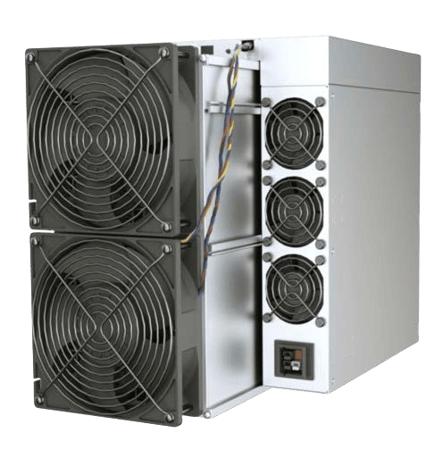

# איך ביטקוין עובד?

חוקים, לא שליטים

טיק טוק/
/הבלוק הבא
* ביטקוין משתמש בהוכחת עבודה, קריפטוגרפיה של מפתח ציבורי ורשתות עמית לעמית כדי לעבד ולאמת תשלומים בפנקס חשבונות מקוון, גלובלי ומבוזר.

>**קריפטוגרפיה** (שם עצם) /krɪpˈtɑːɡrəfi
>
>*: הצפנה ופענוח של הודעות בקוד סודי או צופן
>: קידוד ופענוח ממוחשבים של מידע*

~ מילון מריאם ובסטר

>**גיבוב** (פועל) /ˈhæʃɪŋ/
>
>*: שיטת הצפנה
>: תהליך של שימוש באלגוריתם מתמטי כנגד נתונים כדי לייצר ערך מספרי (תמצית גיבוב) המייצג נתונים אלה.*

~ crsc.nist.gov

>**זכור:**
>
>מערכת הביטקוין כוללת >>
>
>**ביטקוין:** **נכס כספי** דיגיטלי
>
>**ביטקוין:** **רשת תשלומים** של כורים וצמתים

1 ביטקוין = 100,000,000 סאטושי (סאט)

**(אפשר לקנות סאט, שבריר של ביטקוין)**

---

>*אנו מגדירים מטבע אלקטרוני כשרשרת של חתימות דיגיטליות. כל בעלים מעביר את המטבע לבא בתור על ידי חתימה דיגיטלית של גיבוב של העסקה הקודמת והמפתח הציבורי של הבעלים הבא והוספת אלה לסוף המטבע. מקבל תשלום יכול לאמת את החתימות כדי לאמת את שרשרת הבעלות.*

~ סאטושי נקאמוטו
מאמר הביטקוין, חלק 2, 2008
מתאר כיצד עסקת ביטקוין עובדת בפנקס החשבונות המבוזר

---
## מערכת הביטקוין..
**מורכבת מכורים, צמתים, משתמשים, מפתחים**

כולם עובדים באופן עצמאי,

ובו זמנית בתלות הדדית,

כדי להחיות את מה שזה

ביטקוין!

---
## כורים
* **צמתים מיוחדים** (מחשבים שנקראים ASICS) **ש'כורים' את הבלוקים** שהופכים לחלק משרשרת הבלוקים של הביטקוין.
* בכך, הם **מאמתים את העסקאות שאומתו שבוצעו על ידי משתמשים, מייצרים ביטקוינים חדשים** ו**מאבטחים את כל הרשת.**

## משתמשים
* **אתם ואני. כולנו.** האנשים.
* מתוך הכרה והערכה של הערך של סחורות ושירותים המסופקים, אנו מבצעים עסקאות: נותנים ומקבלים ביטקוין, או שאנחנו מאחסנים אותו לשימוש מאוחר יותר, לפי הצורך.

## צמתים
* **צמתים הם מחשבים שמריצים את תוכנת הביטקוין.**
* **ישנם אלפי צמתים** המרכיבים את ה**רשת** הגלובלית, המבוזרת והוולונטרית **שמאמתת עסקאות** (ובכך מונעת הוצאה כפולה ועוזרת לאבטח את המערכת).

## מפתחים (DEVS)
* **מתכנתים, תוכניתנים ומחברים דיגיטליים** שעובדים כדי **לתחזק ולהגדיל את הרשת, לשפר את האבטחה, הפרטיות וממשק המשתמש, ולתרגם קוד** לשפה וחזותיים ששארנו יכולים להבין ולהשתמש בהם.

---

## עסקת ביטקוין:
עלי רוצה לשלוח לבנג'י קצת ביטקוין:

>1. עלי **פותחת את אפליקציית ארנק הביטקוין** בטלפון שלה ו**לוחצת על 'שלח'.**
>2. בנג'י **פותח את אפליקציית הארנק שלו** ו**לוחץ על 'קבל'.**
>3. **אם הם ביחד:** עלי סורקת את קוד ה-QR באפליקציית הארנק בטלפון של בנג'י.
>4. **אם הם לא ביחד:** עלי מעתיקה ומדביקה את הכתובת שבנג'י שלח לה בטקסט, לשדה הכתובת בארנק שלה.
>5. עלי **מזינה את הסכום לשליחה,** ולוחצת על **'שלח'.**
>6. **כמה שניות לאחר מכן,** בנג'י יראה את הסכום בהמתנה בארנק שלו.
>7. **אם זה נשלח דרך Lightning** זה יאושר כמעט מיד, וכמעט בחינם.
>8. **אם זה נשלח 'onchain'** (בשרשרת הראשית של הביטקוין), זה כולל עמלה קטנה, ובדרך כלל לוקח בערך 10 דקות כדי לאשר. זה יכול לקחת יותר זמן, תלוי בעומס התנועה ברשת.

---

## עסקת ביטקוין מתחת למכסה המנוע:
(הגדרות המונחים ה**מודגשים** מופיעות בהמשך)

>1. כשעלי שולחת את הסאט האלה לבנג'י, ה**עסקה** של התשלום **משודרת** לרשת.
>2. העסקה מאומתת על ידי **צמתים** שמוודאים שלעלי באמת יש את הביטקוין לשלוח, ושזה לא הוצא בעבר (כדי למנוע הוצאה כפולה).
>3. לאחר שאומתה על ידי צומת, היא מחכה ב**ממפול** עם העסקאות של אנשים אחרים.
>4. העסקאות בממפול מתווספות בבלוק ל**שרשרת הבלוקים** כאשר **כורה** מוצא **נון** שמשביע את רצון **אלגוריתם הקושי.**
>5. לכל **בלוק** יש **חותמת זמן.**
>6. זה יוצר **חוסר שינוי,** ועוזר להגן על התאמת אלגוריתם הקושי מפני מניפולציות.
>7. כל בלוק מייצג אישור אחד לעסקאות הכלולות בו.
>8. ככל שמוסיפים בלוקים, בממוצע כל עשר דקות, חוסר השינוי של שרשרת הבלוקים גדל.

---

## מילון מונחים

---
>* **עסקה ~ שליחה/קבלה של ביטקוין**
---
* העברת ערך בצורה של סאטושי, ממחזיק ביטקוין אחד למשנהו.

---
>* **צומת ~ 'ענף' של 'בנק' הביטקוין המבוזר. כל אחד יכול להריץ צומת.**
---

* צמתים הם מחשבים שמריצים את תוכנת הביטקוין.
* צמתים, יחד עם כורים, משתמשים ומפתחים, יוצרים את רשת הביטקוין עמית לעמית.
* דמיינו **כל צומת מלא כפנקס חשבונות המכיל את היתרות של כל מפתח פרטי.**
* הם מקיימים אינטראקציה ומגיעים לקונצנזוס (מסכימים) זה עם זה על ידי קבלה ואימות של עסקאות מצמתים אחרים, יחד עם בלוקים מכורים, ולאחר מכן העברתם הלאה לצמתים אחרים.
* צמתים מופעלים על ידי קבוצה אד-הוקית של אלפי מתנדבים ברחבי העולם.
* צומת מלא הוא צומת שאימת באופן עצמאי את כל שרשרת הבלוקים של הביטקוין, מאז בלוק בראשית שנכרה על ידי סאטושי בשנת 2009.
* ככל שיש יותר צמתים פעילים, כך כל הרשת הופכת מבוזרת יותר, ולכן עמידה יותר.
* **יש כיום יותר מ-19,000 צמתים מלאים ניתנים להשגה ברחבי העולם, והרבה יותר כאלה שלא ניתנים להשגה.**
* כל הצמתים המשתתפים שווים.

---

---
>* **שידור ~ ליידע את הרשת שאתם שולחים ביטקוין למישהו.**
---

* כאשר אתם לוחצים על 'שלח', הארנק שלכם חותם על העסקה עם המפתח הפרטי שלכם ומשדר אותה, ומיידע את כל הצמתים האחרים על כוונתכם להעביר ערך כדי שהם יוכלו לאמת את העסקה.

---
>* **MEMPOOL ~ חדר המתנה לעסקאות**
---

* זהו 'חדר ההמתנה' שאליו נשלחות עסקאות מאומתות כדי שייאספו על ידי כורה ויווספו לבלוק.

---
>* **בלוק ~ 'דף' בפנקס החשבונות של הביטקוין**
---

* פנקס החשבונות המבוזר של הביטקוין מורכב מ'בלוקים' דיגיטליים.
* כל בלוק מכיל עסקאות ביטקוין מאומתות ששומרות על פנקס החשבונות הגלובלי מדויק ועדכני.
* הם מכילים גם את ה-nonce, חותמת זמן וגיבוב של הבלוק הקודם, שכולם תורמים לחוסר השינוי של שרשרת הבלוקים של הביטקוין.

---
>* **שרשרת הבלוקים ~ כל פנקס החשבונות של הביטקוין**
---

* שרשרת הבלוקים של הביטקוין, הידועה גם כשרשרת הזמן, היא פנקס החשבונות המבוזר המכיל כל בלוק וכל עסקת ביטקוין שבוצעה מאז בלוק בראשית שנכרה על ידי סאטושי בשנת 2009.

---

---
>* **כורה ~ צומת מיוחד שגם מאשר עסקאות וגם מנפיק ביטקוינים חדשים**
---

* כורי ביטקוין הם מחשבים מיוחדים. הם מכוונים הרבה כוח מחשוב (hashrate) בהגרלה דיגיטלית כדי לנחש מספר שיספק את אלגוריתם הקושי הנוכחי, ובכך 'כורים' 'בלוק' (חלק מהפנקס).
* בלוק שנכרה מקבל חותמת זמן ומוסף לשרשרת הבלוקים (aka timechain).

---
>* **אלגוריתם קושי ~ עיצוב מיוחד ומסתגל שעוזר לשמור על הנפקת ביטקוין חדשה צפויה.**
---

* זה היה אחד הפתרונות הגאוניים של סאטושי כדי לעזור להגן על הנפקת הביטקוין מפני עקיפת עצמה, ככל שמפתחים מחשבים מתקדמים יותר.
* כאשר יותר כורים עולים לרשת, מספר המטרה (nonce) ב'הגרלה' נעשה קטן יותר, ולכן קשה יותר למצוא אותו.
* כאשר פחות כורים מחוברים לרשת, זה נעשה קל יותר.
* האלגוריתם **מתאים את עצמו אוטומטית כל 2016 בלוקים** (בערך כל שבועיים), כדי להבטיח קצב אספקה צפוי, כאשר בלוק אחד נכרה בממוצע כל עשר דקות.

---
>* **NONCE ~ מספר אקראי של 32 ביט**
---

* מספר אקראי של 32 ביט שכורים מוסיפים לסוף רשימת העסקאות המגובבות, כדי לנסות לספק את יעד הקושי לכריית בלוק.
* כאשר כורה מוצא nonce שמוביל ליצירת גיבוב מתחת למספר היעד הנוכחי, הם כרו בלוק ומקבלים להוסיף אותו לשרשרת הבלוקים ולתבוע את תגמול הבלוק של הביטקוין.
---

---
>* **חותמת זמן ~ חותמת את השעה**
---

* לכל בלוק שנכרה מתווספת חותמת זמן.
* זה נועד להגברת האבטחה, חוסר השינוי ועזרה לבסס את התאמת הקושי

---
>* **חוסר שינוי ~ לא ניתן לשנות.**
---

* המשמעות היא ששרשרת הבלוקים 'מוטבעת באבן דיגיטלית'.

---
>* **הוכחת עבודה (PoW) ~ הוכחה קריפטוגרפית שבוצעה עבודה קשה כדי לספק אלגוריתם.**
---

* כורים משתמשים באלגוריתם PoW כדי להוכיח שהם השתמשו בהרבה כוח חישוב באמצעות חשמל (עבודה), כדי להשיג קונצנזוס בצורה מבוזרת, ולמנוע משחקנים מושחתים לשלוח דואר זבל לרשת.

---
>* **קריפטוגרפיה של מפתח ציבורי ~ תהליך שיוצר את המפתחות הדיגיטליים לגישה לביטקוינים שלכם**
---

* זוהי מערכת שבה נוצרים שני מפתחות באמצעות אלגוריתם קריפטוגרפי.
* **מפתח אחד הוא ציבורי** - כמו מספר חשבון הבנק שלכם, שאתם יכולים לתת לאנשים כדי לשלוח לכם ביטקוין עבור סחורות, מתנות או שירותים.
* **המפתח השני הוא פרטי** - רק לכם יש עותק, ואתם משתמשים בו כדי לפתוח גישה לביטקוין שלכם, בדיוק כפי שסיסמה פותחת את חשבון הבנק המקוון שלכם.
* **אתם חייבים לאבטח את המפתח הפרטי שלכם היטב,** מכיוון שלכל מי שיש גישה אליו יש גישה לביטקוין שלכם.

---

---
>* **רשת עמית לעמית (P2P) ~ רשת מבוזרת ללא מתווכים**
---

* צמתים מלאים (עמיתים) מתחזקים בשיתוף פעולה רשת עמית לעמית לאימות ואימות עסקאות ובלוקים.
* בסוג רשת זה, כל צומת מסוגל גם לספק/לבקש נתונים אל/מהעמיתים שלו.
* אין שומרים ברשת P2P.

---
>* **רשת LIGHTNING ~ רשת הבנויה על ביטקוין המאפשרת לשלוח או לקבל סאט מהר מאוד וכמעט בחינם.**
---

* Lightning הוא פתרון קנה מידה של שכבה 2. המשמעות היא שהוא מספק דרך לביטקוין להתרחב, ונותן לו את הפוטנציאל לעבד מיליוני עסקאות בשנייה (TPS).

---
>* **ארנק ~ 'ארנק' מחזיק את המפתחות הקריפטוגרפיים לגישה לביטקוין שלכם.**
---

* זה יכול להיות בטלפון, במחשב או במכשיר חומרה קטן נפרד (הבטוח ביותר).
* ארנק ביטקוין ייקרא בצורה מדויקת יותר מכשיר חתימה. הביטקוין שלכם לעולם לא עוזב את שרשרת הבלוקים, פנקס החשבונות הדיגיטלי.
* כאשר אתם רוצים לשלוח או להוציא את הביטקוין שלכם, הארנק יחתום וישדר את העסקה לרשת, כדי שניתן יהיה לאמת אותה ולהוסיף אותה לבלוק בשרשרת הבלוקים.

---
>* **מפתחים ~ מתכנתים**
---

* Cypherpunks/מתכנתים שתחזקים את הרשת, משפרים את האבטחה, בודקים באגים, שולחים בקשות משיכה (לעדכונים או תכונות חדשות), סוקרים בקשות משיכה, מבקרים את הקוד.

---

---
>* **מפתח ציבורי ~ כמו מספר חשבון בנק לקבלת ביטקוין.**
---

* אתם יכולים לתת אותו לאנשים כדי לשלוח לכם ביטקוין, בדיוק כמו שהייתם נותנים את מספר החשבון שלכם למישהו כדי שיוכל לשלוח לכם פיאט

---
>* **מפתח פרטי ~ לאבטחה, גישה ושליחה של ביטקוין, כמו המפתח לכספת.**
---

* מפתח פרטי של ביטקוין הוא מחרוזת סודית של מספרים ואותיות המאפשרת לכם לשלוח/להוציא את הביטקוין שלכם.
* רק לכם יש עותק. **מאוד חשוב לשמור עליו בטוח ומאובטח מאוד, מכיוון שכל מי שמשיג עותק יכול להוציא את הביטקוין שלכם.**

---
>* **פנקס חשבונות מבוזר ~ פנקס חשבונות שמתוחזק על ידי כל מי שרוצה לעזור לתחזק אותו.**
---

* במקום פנקס חשבונות בשליטה מרכזית שאינו גלוי לציבור, כמו זה שבנק מנהל, ביטקוין הוא פנקס חשבונות שקוף, פתוח ומבוזר הגלוי לכל אחד, בכל עת.
* הכתובות הן מחרוזות של אותיות ומספרים, ללא שמות מצורפים.
* למרות שזה פסאודו אנונימי, אפשר לעקוב אחר עסקאות, במיוחד אם הביטקוין נקנה מבורסת KYC מרכזית.
* רשת הביטקוין היא חסרת אמון וכל אחד יכול לבקר אותה בכל עת, בניגוד לבנק שבו צריך לסמוך על כך שפנקסי החשבונות נשמרים בכנות.

---

## עוד על כרייה
 Whatsminer M50S

 Antminer S21 Pro

 Bitaxe 401 Supra

* **כורים מקדישים כוח מחשוב AKA hashrate, באמצעות חשמל לרשת,** כדי להוסיף בלוקים לשרשרת הבלוקים של הביטקוין.
* מחשבים אלה פועלים 24 שעות ביממה, בדרך כלל בסטים של כמה, לכמה מאות או אלפים.
* **הם בעצם מריצים הגרלה. כאשר אחד מהם מנחש מספר** (ה-nonce) שמייצר גיבוב שמספק את יעד הקושי הנוכחי, **הוא מקבל להוסיף את הבלוק הבא לשרשרת הזמן.**
* **כל האמור לעיל הוא הוכחת העבודה (PoW) הדרושה כדי להוליד ביטקוינים חדשים.**

---

## תגמול בלוק של ביטקוין
**= סבסוד + עמלות**

>* **עבור עבודתם, כורים מקבלים:**
> * **סבסוד, בצורה של ביטקוינים שזה עתה הוטבעו.**
> * **בנוסף, העמלות מהעסקאות שאומתו הכלולות בבלוק זה**

* **כשאתם שולחים ביטקוין למישהו, העסקה הזו כוללת עמלה** וצריכה להיות מאומתת על ידי כורה, ואז להיכלל בבלוק.
* **סבסוד בלוק הביטקוין** מצטמצם בחצי כל ארבע שנים.
* זה **כרגע 3.125 ביטקוין** לכל בלוק שנכרה.
* **ה'חציה' הבאה תהיה בשנת 2028,** ובאותה נקודה תגמול הבלוק יירד ל-1.5625 ביטקוין לכל בלוק שנכרה.
* כפי שהוזכר קודם לכן, **זה שומר על ההנפקה יציבה.**
* **בשנת 2140, החלק האחרון של הביטקוין ייכרה.**
* אחרי זה, כורים יקבלו רק את העמלות מהעסקאות שהם מאמתים בכל בלוק.

>*בעוד כמה עשורים כאשר התגמול יהיה קטן מדי, עמלת העסקה תהפוך לפיצוי העיקרי לצמתים (כורים).*

~ סאטושי נקאמוטו
Bitcointalk.org, 2010-02-14

>* **תמיד יהיה צורך בכורים כדי לאמת עסקאות, ובכך לשמור על הרשת מעודכנת ומאובטחת.**

* בעוד שצריך להיות מודעים לכך שיש עלויות מעורבות, והרווחיות זניחה עבור כורים ביתיים, זו דרך עוצמתית לעזור לאבטח ולשמור על הרשת מבוזרת.
* כורים מחזיקים מעמד די הרבה שנים. יש כרגע הרבה Antminer S9 למשל, שפועלים כבר יותר מ-6 שנים.
* כאשר כורים יוצאים לפנסיה **ניתן לפרק אותם בקלות ולמחזר אותם.**
* **טונות של חדשנות מרתקת קורית,** עם אנשים שמשתמשים בחום העודף מכורים כדי לחמם את בתיהם, סאונות, חממות, ג'קוזי, חטיפי בשר וירקות מיובשים, דקים מחוממים, עצים יבשים ועוד!

---
