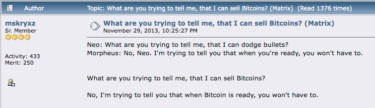

# बिटकॉइन FUD (डर, अनिश्चितता, संदेह) को दूर करना

* नीचे कुछ आम तर्क या डर दिए गए हैं
  बिटकॉइन के बारे में।
* ये ज्यादातर निराधार हैं, जो अज्ञानता या शायद अधूरी समझ के कारण हैं।
* मैं यहां प्रत्येक के लिए संक्षिप्त खंडन प्रदान करता हूं, और अंत में
  आपको सभी FUD का खंडन करने वाले अधिक गहन संसाधनों के संकेत मिलेंगे।

## बिटकॉइन बहुत ज्यादा ऊर्जा का इस्तेमाल करता है

>*आपके कंप्यूटर से निकलने वाली गर्मी बर्बाद नहीं होती है
  यदि आपको अपने घर को गर्म करने की आवश्यकता है ... यदि आप गर्मी उत्पन्न करते हैं तो यह बराबर लागत है
  आपके कंप्यूटर से।*

~ सातोशी नाकामोतो 2010-08-09

>*शुरू में, केवल इसलिए कि यह महंगा है, एक वस्तु का उत्पादन काफी बेकार लगता है। हालाँकि, गैर-जालसाजी
  महंगी वस्तु लाभकारी धन हस्तांतरण को सक्षम करके बार-बार मूल्य जोड़ती है। लागत का अधिक हिस्सा वसूला जाता है
  हर बार जब कोई लेनदेन संभव बनाया जाता है या कम खर्चीला बनाया जाता है। लागत, जो शुरू में पूरी तरह से बेकार थी, है
  कई लेनदेन पर परिशोधित।*

~ निक स्ज़ाबो

साइफरपंक

---

* **'बहुत अधिक' ऊर्जा एक मूल्य प्रस्ताव है जिस पर विचार करना चाहिए
  विचार करें कि हम ऊर्जा के उद्देश्य को कितना महत्व देते हैं
  उपयोग करें।**

* **जब कोई विचार करता है कि क्रिसमस की रोशनी में
  अमेरिका में जितनी बिजली का उपयोग होता है उतनी बिजली पूरे बिटकॉइन नेटवर्क में,** तो शायद कोई देख सकता है कि यह सब सापेक्ष है!

* ऊर्जा का उपयोग करना, यहां तक कि बहुत अधिक ऊर्जा का उपयोग करना, सुरक्षित करने के लिए
  सबसे कठिन, सबसे सेंसरशिप-प्रतिरोधी पैसा
  मानवता ने कभी जाना है, इससे कहीं अधिक लायक है।

* बिटकॉइन ऊर्जा उपयोग की तुलना विरासत प्रणाली द्वारा उपयोग की जाने वाली ऊर्जा से करते समय, हमें दोनों तरफ 'फुल स्टैक' पर भी विचार करने की आवश्यकता है:

| बिटकॉइन इकोसिस्टम    | विरासत फिएट सिस्टम          |
| -------------------- | --------------------------- |
| ASIC माइनर्स          | BIS                         |
| नोड्स                | केंद्रीय बैंक               |
| हार्डवेयर वॉलेट     | राष्ट्रीय/क्षेत्रीय बैंक     |
| सॉफ्टवेयर वॉलेट ऐप्स | सैन्य औद्योगिक परिसर |
|                      | बैकअप डेटा केंद्र         |
|                      | भौतिक धन मुद्रण     |
|                      | भौतिक धन वितरण |
|                      | ऑनलाइन बैंकिंग ऐप्स         |
|                      | एटीएम का नेटवर्क             |

* बिटकॉइन का उपयोग करके, हम अंततः ऊर्जा को कम कर देंगे
  कई अन्य क्षेत्रों में उपयोग, विशेष रूप से
  पेट्रो डॉलर की रक्षा के लिए अब सैन्य औद्योगिक
  परिसर की आवश्यकता नहीं है

---

* इसके अलावा, व्याप्त उपभोक्तावाद जो आवश्यक है
  ऋण-आधारित प्रणाली को चालू रखने के लिए, समय के साथ
  कम किया जाएगा, क्योंकि **कठोर धन स्वाभाविक रूप से प्रोत्साहित करता है
  विवेकपूर्ण खर्च और बचत** (चूंकि आपकी बचत
  वास्तव में अपना मूल्य रखेगा, एक ऐसी अवधारणा जिसे हमने अनुभव नहीं किया है
  स्वर्ण मानक से अलग होने के बाद से)।
* **अंत में, और महत्वपूर्ण रूप से, बिटकॉइन माइनिंग पहले से ही है
  भड़के हुए प्राकृतिक गैस पर कब्जा करके प्रदूषण को कम करना
  और इसका उपयोग खनिकों को बिजली देने के लिए करना।** चूंकि खनिक खोजते हैं
  बिजली की कम लागत, इसलिए इसके सबसे बड़े होने की भी संभावना है
  नवीकरणीय कम लागत वाली ऊर्जा की ओर चालक, क्योंकि
  प्रोत्साहन मेल खाते हैं।
* **बिटकॉइन और ऊर्जा पर सूचित गहन गोते** लिखे गए हैं
  डेनियल बेटन द्वारा batcoinz.com पर, ट्रॉय
  क्रॉस, जीन उर्सो, वीडियो 'यह मशीन ग्रीन'
  YouTube पर स्वान बिटकॉइन द्वारा, 'डर्टी कॉइन', ए
  बिटकॉइन माइनिंग डॉक्यूमेंट्री, और एक
  उत्कृष्ट एपिसोड 'व्हाट इज मनी' शो का
  (WiM161) बी. क्विटेम के साथ, कई अन्य के बीच।

---

## बिटकॉइन एक पोंजी है
* **बिटकॉइन एक पोंजी नहीं है:**
 * पुराने निवेशकों को नए द्वारा कोई पैसा नहीं दिया जाता है
  निवेशक।
 * बिटकॉइन खरीदते समय, कोई भी रिटर्न का वादा नहीं कर रहा है
  आपके निवेश पर।
 * कोई नेतृत्व या पदोन्नति टीम नहीं है।
 * कोई पूर्व-खनन नहीं था।
 * **पढ़ें:** 'बिटकॉइन पोंजी क्यों नहीं है' लिन एल्डन द्वारा
अधिक जानकारी के लिए।

## बिटकॉइन बहुत धीमा है
* जबकि बिटकॉइन बेस लेयर धीमी है, दूसरी लेयर
nd लेयर
**बेस लेयर पर निर्मित लाइटनिंग नेटवर्क ...
बिजली की तरह तेज है!**
* बिटकॉइन का नेटवर्क लगभग 7
लेनदेन प्रति सेकंड (टीपीएस)।
* वीजा नेटवर्क का दावा है कि यह 24,000 तक संसाधित कर सकता है
टीपीएस, हालांकि 4,000 टीपीएस वास्तविक उपयोग के करीब है।
* **लाइटनिंग नेटवर्क, एक दूसरी परत समाधान
बिटकॉइन पर बनाया गया है, जिसमें क्षमता है
लाखों लेनदेन प्रति सेकंड संसाधित करें!**

---

## सरकारें बिटकॉइन पर प्रतिबंध लगा सकती हैं
* कुछ सरकारों ने कोशिश की है, जैसे चीन, भारत और
उदाहरण के लिए नाइजीरिया। प्रत्येक मामले में, बिटकॉइन का उपयोग
कहे गए देश के लोगों द्वारा तेजी से बढ़ता है
* **सरकारों के लिए वास्तव में बिटकॉइन पर 'प्रतिबंध' लगाने का कोई तरीका नहीं है,** क्योंकि यह स्वभाव से अनुमति रहित और सेंसरशिप-प्रतिरोधी है। यह कोड है और कोड भाषण है।
* कहा जा रहा है, सरकारें इसे खरीदना मुश्किल बना सकती हैं
और फिएट में बेच सकते हैं। वे इसे कर के रूप में भी कर सकते हैं
एक वस्तु, जैसे वे अमेरिका में करते हैं।
* **अंततः, ऐसा करने की कोशिश करना उनके पक्ष में नहीं होगा और प्रतिबंध
  यह अपरिहार्य है, और वे देखने लगे हैं
  वह।** वे अपने में इसे जोड़ने के लिए बहुत चतुर होंगे
  उनकी बढ़ती फिएट मुद्राओं के खिलाफ बचाव के रूप में देश की बैलेंस शीट।

>*सरकारें काटने में अच्छी हैं
  केंद्रीय रूप से नियंत्रित नेटवर्क के प्रमुख
  नेप्स्टर की तरह, लेकिन शुद्ध P2P नेटवर्क
  जैसे कि ग्नूटेला और टोर लगते हैं
  अपना पकड़ बनाए हुए हैं।*

~ सातोशी नाकामोतो

* **पढ़ें:**

क्या सरकार बिटकॉइन को रोक सकती है? एलेक्स ग्लैडस्टीन द्वारा,
मानवाधिकार फाउंडेशन के सीएसओ

क्या सरकार बिटकॉइन पर प्रतिबंध लगा सकती है? चार बातें जो आपको चाहिए
निक जियाम्ब्रुनो द्वारा जानने के लिए

---

## बिटकॉइन पुरानी तकनीक है
* **डिजिटल के संबंध में 'अंतिम तकनीक' की तरह अधिक,**
कमी, विकेंद्रीकरण और दोहरे खर्च की समस्या और बाइजेंटाइन जनरल की समस्या को हल करना। एक बार पता चलने के बाद, इसे फिर से खोजा नहीं जा सकता।
* **एक बार जब पहिया का आविष्कार हो गया, तो इसे कभी नहीं किया जा सकता है
फिर से आविष्कार किया।**
* TCP/IP प्रोटोकॉल जिस पर इंटरनेट चलता है, वह तब से सभी कंप्यूटर नेटवर्किंग के लिए मानक रहा है
1983. इसके लंबे समय तक मानक बने रहने की संभावना है।
* एक बार एक प्रीफेक्ट-समाधान, बेस लेयर तकनीक की खोज हो जाने के बाद जो बेहतर ढंग से काम करती है, यह सैकड़ों, या हजारों वर्षों तक चल सकती है।

क्रेडिट: @DecouvreBitcoin

---

## बिटकॉइन का इस्तेमाल अपराधियों द्वारा किया जाता है
* **तो डॉलर है, और दुनिया की हर दूसरी फिएट करेंसी है।** इस समस्या को केवल बिटकॉइन पर ही बताना पूरी तरह से गलत है।
* **बिटकॉइन एक उपकरण है, ठीक चाकू की तरह, और यह हममें से प्रत्येक पर निर्भर करता है कि हम इसका उपयोग कैसे करते हैं।**
* दिलचस्प बात यह है कि अगर बिटकॉइन का उपयोग अपराधियों द्वारा नहीं किया जा सकता है, तो यह तटस्थ, सेंसरशिप-प्रतिरोधी पैसा नहीं होगा जिसकी दुनिया को इतनी बुरी तरह से जरूरत है।
* **ध्यान दें:** चूंकि बिटकॉइन ब्लॉकचेन ऑडिट करने योग्य है, इसलिए यह आपराधिक गतिविधि के लिए वास्तव में एक बुरा विकल्प है!

## क्वांटम कंप्यूटिंग बिटकॉइन को तोड़ सकता है
* जबकि भविष्य में एक दिन यह एक संभावना हो सकती है, **डेवलपर्स पहले से ही पोस्ट के समाधान पर काम कर रहे हैंक्वांटम एन्क्रिप्शन**
* बिटकॉइन कई ऑनलाइन अनुप्रयोगों में से एक है जो सुरक्षा के लिए SHA-256 हैशिंग पर निर्भर करता है।
यहां तक कि सेना भी इसका इस्तेमाल करती है, इसलिए नए को विकसित करने के लिए बिटकॉइन समुदाय से परे बहुत बड़ा प्रोत्साहन है
एन्क्रिप्शन प्रोटोकॉल।
* यदि SHA-256 टूट गया है, तो हमारे पास चिंता करने के लिए बहुत कुछ होगा
बिटकॉइन से परे। पूरा इंटरनेट इसका इस्तेमाल करता है
एन्क्रिप्शन के लिए। इसमें सभी बैंकिंग, आपूर्ति शामिल है
चेन, परिवहन प्रणाली, स्वास्थ्य सेवा प्रणाली,
शिक्षा प्रणाली और भी बहुत कुछ।

---

## बिटकॉइन का कोई वास्तविक मूल्य नहीं है
>*"बिटकॉइन का मूल्य इसकी लागू करने योग्य कमी से संचालित होता है"*

*~ फिडेलिटी डिजिटल एसेट्स*

* **दुर्लभता ही मूल्य है। समय के साथ सभी धन का मूल्य रहा है
क्योंकि इसमें कमी का कुछ माप था।**

* इसके अलावा, इसे इस विश्वास का समर्थन प्राप्त था कि यह
अपना मूल्य बनाए रखें, ताकि इसका कारोबार किया जा सके
भविष्य में मूल्य की किसी अन्य चीज़ के लिए।
* जैसे-जैसे बिटकॉइन नेटवर्क बढ़ता है, बेहतर समर्थन के साथ
मौद्रिक गुण जो यह समाहित करता है, नेटवर्क प्रभाव
घातीय रूप से बढ़ता है
* नेटवर्क प्रभाव जितना बड़ा होगा, उसका मूल्य उतना ही अधिक होगा, क्योंकि
एक दुर्लभ संपत्ति, प्रदान करता है। मूल्य मांग का प्रतिबिंब है,
और जैसे-जैसे मांग बढ़ती है, मूल्य बढ़ता है।

---

## कुछ लोगों के पास बहुत कुछ है
* यह सच है कि कुछ लोगों के पास दूसरों की तुलना में बहुत अधिक है।
**प्रोटोकॉल को खुले तौर पर जारी करके, सातोशी ने इसे अनुमति दी
स्वतंत्र रूप से घूमना, और जिन्होंने क्षमता को समझा
इसमें या तो खनन किया गया, या जल्दी खरीदा गया। यह था
इसे प्रस्तुत करने का सबसे निष्पक्ष और सबसे व्यवस्थित तरीका
दुनिया के लिए।**
* समय के साथ, जब दुनिया अति-बिटकॉइन हो जाती है, जिसका अर्थ है कि हम बिटकॉइन मानक पर जी रहे हैं, जिनके पास
अधिक स्वाभाविक रूप से इसे अर्थव्यवस्था में खर्च करेंगे

* भले ही एक निश्चित बिंदु पर कोई अब नहीं होगा
इसे फिएट से खरीदने में सक्षम, लोगों को उनके लिए भुगतान मिलेगा
बिटकॉइन में काम करते हैं। वास्तव में अच्छी मुद्रा में भुगतान किया जा रहा है
हमें वास्तविक बचत करने की अनुमति मिलेगी जो भ्रष्ट नहीं होगी
समय के साथ मुद्रास्फीति से।
* जबकि हमेशा ऐसे लोग होंगे जिनके पास अधिक धन होगा
और ऐसे लोग जिनके पास कम होगा, कई कारकों के कारण,
**एक बिटकॉइन मानक झिल्ली बनाएगा
धन वर्गों के बीच पारगम्य**, जैसा कि एलेक्स स्वेट्सी कहते हैं। यह
ऊपर और नीचे दोनों गतिशीलता की अनुमति देगा
आज की तुलना में कहीं अधिक तरल हो
* **पैदा होने के बाद, और अपना पूरा जीवन तैरना
एक फिएट दुनिया में, यह कल्पना करना लगभग असंभव है, और
पूरी तरह से एक पैसे होने के निहितार्थ को समझें
भ्रष्ट या हेरफेर नहीं किया जा सकता है!**

---
## बिटकॉइन बहुत अस्थिर है
* **यह एक नए मौद्रिक संपत्ति के मूल्य खोज चरण के दौरान सामान्य है।** कोई अन्य तरीका नहीं है
विकास होने के लिए जब यह व्यवस्थित और उभरता है
(ऊपर से नीचे और केंद्रीय रूप से नियंत्रित के विपरीत)।
* इसके अलावा, मानव अस्तित्व के इस चरण में,
सभी क्षेत्रों में तेजी से बदलाव हो रहे हैं, इससे यह समझ में आता है कि बिटकॉइन जितना rEVOLutionary होगा
जंगली स्विंग होगा।
* जबकि हममें से जो खरगोश के छेद में गहरे हैं, इसे देखते हैं
भविष्य के रूप में, वर्तमान में केवल एक छोटा प्रतिशत
वैश्विक जनसंख्या इस समय बिटकॉइन रखती है। यह
इसे भारी अस्थिरता के लिए कमजोर बनाता है।
* जैसे-जैसे यह परिपक्व होता है, और अपनाने में वृद्धि होती है, अस्थिरता कम हो जाएगी, और अंततः यह स्थिर हो जाएगा और
लेखा इकाई बनें।

>*मुझे यकीन है कि 20 वर्षों में वहाँ
या तो बहुत बड़ा लेनदेन होगा
वॉल्यूम या कोई वॉल्यूम नहीं।*

~ सातोशी नाकामोतो 2010-02-14

---

## आप एक बिटकॉइन को छू नहीं सकते

* **यह एक सुविधा है, कोई बग नहीं।** तथ्य यह है कि बिटकॉइन
भौतिक नहीं है, यह इसके सबसे बड़े कारकों में से एक है जो इसके गैर-जब्त में योगदान देता है!

## बिटकॉइन को हैक किया जा सकता है

* इसे लॉन्च किए जाने के बाद से 15 वर्षों में, इसे कभी नहीं किया गया है
हैक किया गया।
* हालांकि एक्सचेंजों में हैक हुए हैं, इसलिए मैं
अपने बिटकॉइन को अपने पास ले जाने की अत्यधिक अनुशंसा करें
जितनी जल्दी हो सके स्व-हिरासत वाला वॉलेट।
* यह अनुमान लगाया गया है कि SHA-256 को तोड़ना
एन्क्रिप्शन (जिसका उपयोग बिटकॉइन करता है) 24 घंटों के भीतर, ए
क्वांटम कंप्यूटर को 13,000,000 भौतिक की आवश्यकता होगी
क्विबिट्स। इस समय, वर्तमान क्विबिट रिकॉर्ड आयोजित किया गया
कैलिफ़ोर्निया में एटम कंप्यूटिंग द्वारा 1,180 क्विबिट्स है।
* यह व्यापक रूप से माना जाता है कि एक क्वांटम-सुरक्षित एन्क्रिप्शन
विधि की आवश्यकता से पहले अच्छी तरह से विकसित की जाएगी।

>*खुला स्रोत होने का मतलब है कि कोई भी कर सकता है
स्वतंत्र रूप से कोड की समीक्षा करें। अगर ऐसा था
बंद स्रोत, कोई भी सुरक्षा को सत्यापित नहीं कर सकता है। मुझे लगता है कि यह आवश्यक है
इस प्रकृति के एक कार्यक्रम को खुला स्रोत बनाने के लिए।*

*~सातोशी नाकामोतो 2009-12-10*

---

## यहाँ FUD को दूर करने पर और अधिक:

* Endthefud.org
* Bitcoinmythbusters.org
* Casebitcoin.com - सामान्य आलोचनाएँ
* Safehodl.github.io/failure/
* Lopp.net - बिटकॉइन जानकारी: गलतफहमी

>*बिटकॉइन मौलिक रूप से किसी भी अन्य डिजिटल से अलग है
संपत्ति। किसी अन्य डिजिटल संपत्ति में सुधार की संभावना नहीं है
एक मौद्रिक वस्तु के रूप में बिटकॉइन क्योंकि बिटकॉइन सबसे अधिक है
(अन्य डिजिटल संपत्तियों के सापेक्ष) सुरक्षित, विकेन्द्रीकृत,
अच्छे डिजिटल पैसे और कोई भी "सुधार"
आवश्यक रूप से ट्रेडऑफ़ का सामना करना पड़ेगा।*

~ फिडेलिटी डिजिटल एसेट्स रिपोर्ट, 'बिटकॉइन फर्स्ट', जनवरी 2022
क्रिस कुइपर, सीएफए, अनुसंधान निदेशक
जैक न्यूरेटर, अनुसंधान विश्लेषक

---

## बिटकॉइन की कीमत पर
* **मैं होल्डिंग (होल्डिंग) बिटकॉइन को लंबी अवधि की तरह देखता हूं
बचत खाता।**
* दैनिक कीमत मायने नहीं रखती, क्योंकि इसके होने की उम्मीद है
अस्थिर (ऊपर और नीचे जाना) कुछ वर्षों तक।
* जैसा कि मैंने पहले उल्लेख किया था, यह एक नए के लिए सामान्य है
मूल्य खोज से गुजर रही संपत्ति
* यदि कोई बीटीसी/यूएसडी मूल्य चार्ट पर ज़ूम आउट करता है, तो आपको दिखाई देगा
देखेंगे कि यह 2009 से +31,296% बढ़ गया है,
औसतन ~200% प्रति वर्ष।
* मूल्य में उतार-चढ़ाव विभिन्न समाचार लेखों, नियामक अपडेट, बाजार की मांग, डर और उत्साह को दर्शाते हैं।
यह एक रोलर कोस्टर है!
* **जितना अधिक आप होल्ड करते हैं, उतना अधिक आप सीखते हैं और मूल सिद्धांतों को समझते हैं, और जितना अधिक आप महसूस करते हैं
अच्छे पैसे रखने के गहरे निहितार्थ,
कीमत उतनी ही कम मायने रखती है।**

>**अंत में, 'कीमत' बिल्कुल भी मायने नहीं रखेगी, क्योंकि बिटकॉइन
लेखा इकाई होगी।**

* **अस्वीकरण:**
* केवल वही डालें जो आप 'खो सकते हैं', क्योंकि
निश्चित रूप से, कोई गारंटी नहीं है।
* आपके द्वारा खरीदे गए बिटकॉइन को दीर्घकालिक माना जाता है
बचत खाता, और इसे ठंड में छोड़ने की योजना बनाएं
खर्च करने से पहले कम से कम पाँच साल तक का भंडारण।

---

सबसे क्लासिक बिटकॉइन मीम्स में से एक के लिए मूल bitcointalkforum.org स्रोत।

---

## इस बीच, करों पर
* **अस्वीकरण:** यह वित्तीय या कर सलाह नहीं है

* अमेरिकी कर कोड में, बिटकॉइन को वर्तमान में एक वस्तु के रूप में देखा जाता है, इसलिए संभावित कर निहितार्थ हैं यदि आप
इसे वापस फिएट में बेचें, या यहां तक कि अगर आप अपने से कुछ खरीदते हैं
बिटकॉइन
* यदि आपके द्वारा इसे बेचने/खर्च करने से पहले कीमत कम हो गई, तो आप
नुकसान का दावा कर सकते हैं
* अगर कीमत बढ़ गई, तो आपको दावा करना चाहिए
पूंजीगत लाभ, और 10-30% CGT (पूंजीगत) का भुगतान करें
लाभ कर)
* राशि कई कारकों पर निर्भर करती है, जैसे
इसे बेचने या खर्च करने से पहले आपने इसे कितने समय तक रखा था, और
आप किस टैक्स ब्रैकेट में उतरते हैं।
* यदि आप बिटकॉइन को बेचने या खर्च करने की योजना बना रहे हैं, खासकर बड़े
मात्रा में, आप परामर्श करने पर विचार कर सकते हैं
एक कर पेशेवर।
* यदि आप केवल खरीदते हैं और रखते हैं, तो वर्तमान में आपके पास नहीं है
बिटकॉइन के संबंध में कोई भी कर योग्य घटना।
* और अगर आप गैर-केवाईसी खरीदते हैं…

---
