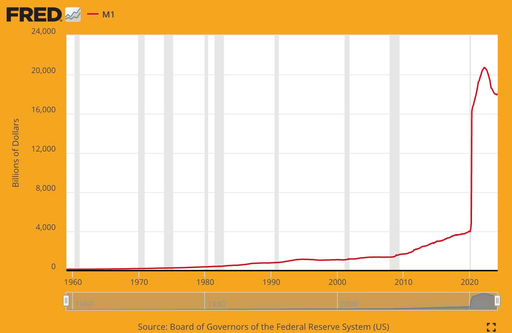

# Perché Abbiamo Bisogno di Bitcoin

## NE ABBIAMO BISOGNO PERCHÉ IL DENARO È ROTTO

> *`Il problema di fondo con la valuta convenzionale
>è tutta la fiducia necessaria
>per farla funzionare. La banca centrale deve
>essere fidata a non svilire la valuta,
>ma la storia delle valute fiat è piena
>di violazioni di tale fiducia. Le banche devono
>essere fidate a detenere il nostro denaro e trasferirlo
>elettronicamente, ma lo prestano
>in ondate di bolle di credito con a malapena una
>frazione in riserva. Dobbiamo fidarci di loro
>con la nostra privacy, fidarci di loro a non lasciare
>che i ladri di identità svuotino i nostri conti.`*

~ Satoshi Nakamoto 2009-02-11

* Il sistema monetario fiat è rotto (lo è sempre stato).
* Non è sostenibile (non lo è mai stato).
* Non c'è modo di ripararlo (non lo sarà mai).

---
## IL (NON) GOLD STANDARD
* Molte persone credono ancora che il denaro sia garantito dall'oro.
* Non lo è.
* Non è garantito dall'oro dal 1971, quando il Presidente Nixon ha unilateralmente tolto il mondo dal gold standard (lo Shock Nixon).
* Vedi **wtfhappenedin1971.com** per avere un quadro chiaro dei danni che questo ha causato.

Grafico che mostra l'inflazione dell'Indice dei Prezzi al Consumo (linea rossa) vs il potere d'acquisto del dollaro USA (linea nera) dal 1971.

<small>U.S. Bureau of Labor Statistics, retrieved from FRED, Federal Reserve Bank of St. Louis; https://
fred.stlouisfed.org/series/CPIAUCSL, 9 giugno 2024.</small>

* Curiosità: Il World Economic Forum è stato formato nel 1971.
---

>**FIAT:** (nome) /ˈfiː.æt/
>
>: un ordine autorevole o arbitrario: DECRETO
>
>: una determinazione autorevole: DETTAME
>
>**: un comando o atto di volontà che crea qualcosa senza
>o come se senza ulteriore sforzo**

~ merriam-webster.com/dictionary

>**FIAT :** dal latino fieri «essere fatto, venire all'esistenza»

* Fiat è denaro che ha valore solo perché il governo dice (decreta) che lo ha.
* Pertanto le persone (devono) credere che lo abbia.
>* **Anche se non credono che fiat abbia valore, per legge sono
costretti a usarlo e ad accettarlo come pagamento per
beni e servizi.**
* **Il denaro fiat viene stampato/creato dal nulla.**
* Al giorno d'oggi circa il 5% di tutti i dollari sono stampati come
contanti.
* L'altro 95% è creato digitalmente dalle banche inserendo
numeri in un computer quando emettono prestiti

>*Costa solo pochi centesimi all'Ufficio
di Incisione e Stampa produrre una banconota da 100 dollari...*

~ Economista americano, Barry Eichengreen

---

>***Scott Pelley di NBC '60 Minutes':*** *È giusto dire che
>avete semplicemente inondato il sistema di denaro?*
>
>***Il Presidente della Fed Jerome Powell:*** *Sì. L'abbiamo fatto.
>Questo è un altro modo di pensarci. L'abbiamo fatto.*
>
>***Pelley:*** *Da dove viene?
>Lo stampate semplicemente?*
>
>***Powell:*** *Lo stampiamo digitalmente. Quindi come banca centrale, noi
>abbiamo la capacità di creare denaro digitalmente. E lo facciamo
>acquistando Buoni del Tesoro o obbligazioni per altri titoli garantiti dal governo. E questo in realtà aumenta l'offerta di moneta. Stampiamo anche valuta reale e la distribuiamo attraverso le banche della Federal Reserve.*

~ Intervista di CNBC '60 Minutes', 17 maggio 2020
Due mesi dopo l'inizio del lockdown di C*vid-19

>Non c'è davvero alcun limite a ciò che possiamo fare
con questi programmi di prestito che abbiamo.

~ Il Presidente della Fed Jerome Powell
18 marzo 2020 su CBS News

>Sì, c'è una quantità infinita di denaro contante nella Federal
Reserve. Faremo tutto il necessario per assicurarci
che ci sia abbastanza denaro contante nel sistema bancario.

~ Neel Kashkari, Presidente della Fed di Minneapolis
23 marzo 2020, CBS '60 Minutes'

>Il 'noi' qui sono cinque persone che votano sui cambiamenti alla
politica monetaria all'interno del sistema della Federal Reserve
durante le riunioni del FOMC. 5 su 330.000.000.
Questo è tutto ciò che serve per cambiare la politica monetaria degli Stati Uniti.

~ @MartyBent, Fondatore di TFTC.io
Articolo di Forbes, 18 marzo 2020

---

## DALLA BOCCA DEL CAVALLO DI UN TEMPO

>*La banca ha il beneficio degli interessi su tutti i denari
che crea dal nulla.*

*~ William Paterson, 1694
Fondatore della Banca d'Inghilterra*

>*Tutte le perplessità, la confusione e l'angoscia in America sorgono,
non dai difetti della Costituzione o della Confederazione,
non dalla mancanza di onore o virtù,
tanto quanto dalla pura ignoranza della
natura della moneta, del credito e della circolazione.*

*~ John Adams
2° Presidente degli Stati Uniti, 1797-1801*

>*Credo che le istituzioni bancarie siano più
pericolose per le nostre libertà che gli eserciti permanenti.
Hanno già creato un'aristocrazia del denaro
che ha sfidato il governo.
Il potere di emissione dovrebbe essere tolto alle banche e
restituito al popolo a cui appartiene di diritto.*

*~ Thomas Jefferson
3° Presidente degli Stati Uniti, 1801-1809*

>*Mentre ci vantavamo delle nostre nobili azioni, ci siamo premurati di nascondere il brutto
fatto che con un sistema monetario iniquo abbiamo nazionalizzato un
sistema di oppressione che, sebbene più raffinato, non è
meno crudele del vecchio sistema di schiavitù mobiliare.*

~Horace Greeley
Membro del Congresso degli Stati Uniti 1848-49
Fondatore del The New York Tribune

---

>*Chiunque controlli il volume di denaro in qualsiasi paese è
padrone assoluto di tutta l'industria e il commercio...
quando vi rendete conto che l'intero sistema è molto facilmente controllato, in un modo o nell'altro, da pochi uomini potenti al vertice, non vi sarà necessario sentirvi dire come hanno origine i periodi di inflazione e depressione*

~ James A. Garfield
20° Presidente degli Stati Uniti, Marzo-Sett.1881
Assassinato nel 1881

>*Oggi esiste incontrollato nelle mani di un gruppo di uomini
un potere di fare dollari dal nulla.*

~ Thomas W. Lawson, Autore di 'Frenzied Finance', 1905

>*Ero tanto segreto - anzi, tanto furtivo - quanto qualsiasi cospiratore.
La scoperta, lo sapevamo, non doveva assolutamente accadere, altrimenti tutto il nostro tempo
e i nostri sforzi sarebbero stati sprecati. Se fosse stato rivelato che il nostro
particolare gruppo si era riunito e aveva scritto una legge bancaria, quella
legge non avrebbe avuto alcuna possibilità di essere approvata dal Congresso.*

~ Frank A.Vanderlip
Presidente della National City Bank di New York
(precursore di Citi Bank)
~ Scrivendo nel 1935 dell'incontro segreto che ebbe luogo a
Jekyll Island nel 1910, per redigere il disegno di legge che fu approvato come
il Federal Reserve Act nel 1913.

>*Questo (Federal Reserve) Act stabilisce il trust più gigantesco sulla
terra. Quando il Presidente (Woodrow Wilson) firmerà il disegno di legge, il
governo invisibile del Potere Monetario sarà legalizzato...
Il peggior crimine legislativo dei secoli è perpetrato
da questo disegno di legge bancario e valutario.*

~ Charles A. Lindbergh, Sr.
Membro del Congresso degli Stati Uniti 1907-1917

---

>*Sono un uomo molto infelice. Ho rovinato involontariamente il mio paese.
Una grande nazione industriale è controllata dal suo sistema di credito.
Il nostro sistema di credito è concentrato. La crescita della nazione,
pertanto, e tutte le nostre attività sono nelle mani di pochi uomini.
Siamo diventati uno dei governi peggiori, uno dei più
completamente controllati e dominati nel mondo civile. Non più un governo per libera opinione, non più un
governo per convinzione e voto della maggioranza, ma un
governo per l'opinione e la coercizione di
un piccolo gruppo di uomini dominanti.*

~ Woodrow Wilson
28° Presidente degli Stati Uniti, 1913-1921
6 anni dopo l'approvazione del Federal Reserve Act del 1913.

>*La vera verità della questione è, come tu ed io sappiamo,
che un elemento finanziario nei grandi centri
ha posseduto il governo degli Stati Uniti sin dai
tempi di Andrew Jackson.*

~ Franklin D. Roosevelt
32° Presidente degli Stati Uniti in una lettera scritta
il 21 novembre 1933 al Colonnello E. Mandell House

>*Essa [la depressione] non è stata accidentale.
È stato un evento attentamente architettato....
I banchieri internazionali hanno cercato di provocare
una condizione di disperazione qui in modo che potessero
emergere come i nostri governanti.*

~ Membro del Congresso Louis T. McFadden,
Assassinato nel 1936

>Presidente della Commissione per le Banche e la Valuta della Camera
*Ogni volta che una banca concede un prestito,
viene creato nuovo credito bancario - nuovi depositi - denaro nuovo di zecca.*

~ Graham F.Towers
Governatore della Banca Centrale del Canada, 1934-55

---

>*Se non ci fossero debiti nel nostro sistema monetario,
non ci sarebbero soldi*

*~ Marriner Eccles,
1941, Governatore della Fed*

>*Non ho ancora avuto nessuno che potesse, attraverso l'uso della logica e della ragione, giustificare il governo federale
prendere in prestito l'uso dei propri soldi...
Credo che arriverà il momento in cui le persone
chiederanno che questo venga cambiato.
Credo che arriverà il momento in questo paese in cui
incolperanno effettivamente te e me e
tutti gli altri collegati al Congresso
per essere rimasti inattivi e aver permesso che
un sistema così idiota continuasse.*

~ Wright Patman
Membro del Congresso degli Stati Uniti 1928-1976
Presidente, Commissione per le Banche e la Valuta 1963-1975

>*Quando tu o io scriviamo un assegno, devono esserci fondi sufficienti nel nostro
conto per coprire l'assegno, ma quando la Federal Reserve scrive un assegno non c'è un deposito bancario su cui viene tratto quell'assegno. Quando la Federal Reserve scrive un assegno, sta creando denaro*

~ Federal Reserve Bank di Boston
'Putting It Simply', 1984

---

## LA FEDERAL RESERVE

* La Fed è la banca centrale 'indipendente' degli
Stati Uniti. È stata creata nel 1913 con l'approvazione del
Federal Reserve Act.
* Ha una struttura unica, in parte privata e in parte
governativa.
* Si suppone che sia un'entità politicamente indipendente,
non partigiana all'interno del governo.
* Mentre il Consiglio dei Governatori della Fed è nominato dal
Presidente e confermato dal Congresso, **le
decisioni della Fed non devono essere ratificate
da nessuno.**

**È composto da:**

* Il Consiglio dei Governatori della Federal Reserve
* 12 Banche della Federal Reserve
* Il Federal Open Markets Committee (FOMC),
che è l'organo decisionale della politica monetaria.

**La Fed è responsabile di:**

* Supervisionare la politica monetaria degli Stati Uniti, promuovendo l'occupazione e prezzi stabili.
* Regolamentare e supervisionare le banche e le istituzioni finanziarie.
* Fornire servizi di pagamento alle istituzioni finanziarie.
* Promuovere la protezione dei consumatori e lo sviluppo della comunità.

---

## UNA NOTA SULLA POLTRONA DELLA FED

* **Il Presidente della Federal Reserve è anche:**

* Presiede il Federal Open Market Committee
(FOMC), che decide la direzione della politica
monetaria degli Stati Uniti (ad es: QE, aumenti dei tassi
di interesse)
* Un membro del Fondo Monetario Internazionale,
l'FMI
* Un membro della Banca dei Regolamenti
Internazionali, la BRI (la banca delle banche centrali).
* Il ministro delle finanze statunitense del G-7
* Il ministro delle finanze statunitense del G-20

* Un **sacco** di potere per una sola persona.

---

## BANKING A RISERVA FRAZIONARIA, INTERESSI E PRESTITI

* **Banking a Riserva Frazionaria:** Fino a marzo 2020, le banche
erano tenute a detenere una riserva del 10% e potevano
prestare il 90%.
* **Da marzo 2020, non è richiesta alcuna riserva, consentendo alle banche di emettere prestiti illimitati.**

* Un prestito è denaro basato sul debito e sei tenuto a
pagare gli interessi sul prestito.

>* **Curiosità 1:** Il denaro per pagare gli interessi sul
>prestito NON è creato dalle banche.
>* **Curiosità 2:** NON è MAI creato.
>* **Curiosità 3:** NON c'è ABBASTANZA denaro nel
>mondo per ripagare tutti i prestiti + gli interessi dovuti
>su tali prestiti.
>* **Curiosità 4:** Non ci sarà mai!

---

## UNA NOTA SUL PETRO DOLLARO
* Si potrebbe dire **che fino al 1971 il dollaro era garantito
dall'oro, e dal 1974 è stato garantito dal petrolio,
e quindi per impostazione predefinita, dall'esercito statunitense.**
* **Nel 1974 gli Stati Uniti e l'Arabia Saudita hanno stipulato accordi bilaterali per fissare il prezzo della vendita di petrolio in dollari statunitensi.**
* Da allora, la maggior parte delle vendite globali di petrolio sono state regolate in
dollari statunitensi.
* Ciò ha contribuito notevolmente a far diventare il dollaro
la valuta più forte del mondo.
* **È stato quindi sostenuto artificialmente,** anche durante
i periodi in cui normalmente avrebbe faticato.
* Dalla fine del 2022, un certo numero di paesi ha
iniziato a commerciare in valute diverse dal dollaro statunitense
* È molto possibile che questo possa essere l'inizio della
fine del petro dollaro. Cosa succederà dopo
resta da vedere...

---

## SU QE (ALLENTAMENTO QUANTITATIVO)
* **L'Allentamento Quantitativo è considerato una 'politica
monetaria non convenzionale' utilizzata dalle Banche Centrali per 'stimolare
l'economia', in base alla quale la Fed acquista obbligazioni
statali e altri titoli statali.**
* È stato utilizzato per la prima volta dal Giappone tra il 2001 e il 2006.
Successivamente, gli Stati Uniti, il Regno Unito e l'Eurozona hanno utilizzato
il QE durante la crisi finanziaria del 2008
* Da allora, l'unica volta in cui gli Stati Uniti non hanno avuto un programma di QE
è stato tra il 2014 e il 2019.
* Come si vede sotto, i critici sostengono che **il QE
avvantaggia in modo schiacciante i già ricchi**

*Credito: @RudyHavenstein su Twitter*

---

## CICLI

* **In tutta la natura, ci sono cicli, flussi e riflussi naturali, espansioni e contrazioni.**

* Questo **contribuisce a un equilibrio e una sostenibilità
complessivi e duraturi** dell'intero sistema interconnesso, di tutta la vita sulla terra.
* **Il sistema monetario fiat basato sul debito ignora la
saggezza dei cicli naturali,** e invece si basa su,
ed è al 100% dipendente per la sua sopravvivenza da, una crescita
senza precedenti e ininterrotta, al fine di continuare a servire i suoi debiti.
* In natura, questo è il cancro.
* Nell''economia', questa traiettoria innaturale è ulteriormente
supportata dal governo che salva le banche e le grandi aziende in fallimento, piuttosto che consentire loro
di fallire ed essere riciclate in qualcosa di nuovo, qualcosa di più sano.
* **La miopia del salvataggio di aziende in fallimento sta mettendo a rischio l'intera economia.** In sostanza,
sta solo rinviando il problema, e l'inevitabile turbamento che ci aspetta è probabile che sia molto, molto
più intenso che se i cicli naturali fossero autorizzati a
svolgersi
* **Siamo in debito con Satoshi Nakamoto, e con i
cypherpunk prima e dopo di lui,** per aver avuto la
visione, la lungimiranza, la determinazione e l'abilità di fornire
un salvagente per portarci su nuove sponde.

---

* Una volta che ci rendiamo conto del dono che questo è, spetta a noi
salire a bordo, con cuore pieno e mente lucida, per
intraprendere il viaggio e costruire un nuovo mondo con il Denaro
della Pace.
>* **Bitcoin sistema il denaro, spetta a noi sistemare il resto.
E, per essere chiari, avendo il denaro sistemato, MOLTE
altre cose saranno sistemate, per impostazione predefinita**

* La principale è che la guerra cinetica su larga scala, avviata dal governo, non sarà più redditizia, o possibile, senza il sostegno del popolo.
* Inoltre, ci sarà naturalmente meno consumo,
insieme a un passaggio a beni e servizi di valore reale, mercati liberi, risparmi reali e smonetizzazione di
alloggi e immobili, che non erano mai destinati a
essere monetizzati in primo luogo.
* **VEDI:** Bitcoin Fixes This, pagina 32
---

## NE ABBIAMO BISOGNO PERCHÉ L'INFLAZIONE È UN FURTO

Grafico FRED del 2024 che mostra il calo del potere d'acquisto del dollaro
dalla formazione della Federal Reserve nel
1913. Il tasso cumulativo di inflazione dal 1913 è di circa
3,067%. Tutte le valute fiat delle banche centrali in tutto il mondo
stanno seguendo un simile tasso di declino.

* **Più denaro viene creato dal nulla,
più tutto il denaro perde valore/potere d'acquisto.**
* Questo è chiamato **inflazione.**
* L'inflazione è **furto di tempo,** letteralmente. Il valore del tuo
tempo viene rubato quando lo risparmi in una valuta che viene
gonfiata, svilita e manipolata.
* L'inflazione è anche una **tassa nascosta**.

---

* Questo furto di tempo e questa tassa ha colpito anche tutte le altre
valute fiat dei paesi, poiché sono state tutte ancorate al dollaro statunitense, poiché è stata la
valuta di riserva mondiale dall'accordo di Bretton Woods
nel 1944.
* **Negli Stati Uniti, un tasso di inflazione annuale del 2% è scritto nel
mandato della Federal Reserve.**
* Ciò significa che **ti è GARANTITO di poter
comprare il 2% IN MENO** con la stessa banconota da $20 ogni anno.
* **A marzo 2024, il tasso di inflazione annuale era del 3,5%,**
(molto più del 2%, il che significa che hai perso il 3,5% del
tuo potere d'acquisto tra marzo 2023 e
marzo 2024.
* In altre parole, questo significa che in media, le cose
sono aumentate di prezzo del 3,5%
* **Se l'inflazione fosse misurata accuratamente, come lo era
fino all'inizio degli anni '80, in realtà
sarebbe più vicino al 10% nel 2024.**
* Quando si guarda per categoria, si vede che
l'inflazione è molto peggiore del 3,5% in molte
categorie nell'ultimo anno.
* Quando si guarda l'affitto, le bollette della spesa, i prezzi della benzina, quasi tutto ciò che si compra, è abbastanza chiaro che
l'inflazione è dilagante in ogni settore

---
**Inflazione media negli
ultimi 50 anni negli Stati Uniti:**

|  Costo medio   |   1971  |   2021  |   % di aumento  |
| --- | --- | --- | --- |
|  Stipendio   |    $9,400 |    $59,400 |    532% |
|   Casa  |    $23,400 |    $513,000 |    2,092% |
|    Gallone di benzina | $0.36    |   $4.17 |  1,058%   |
|    Auto nuova |  $3,400   |   $47,000  |    1,282% |
|   Laurea universitaria   |  $1,400   |   $26,000  |  1,757%   |
|   Cesto di generi alimentari  |$20     |  $210  |    950% |
|  Elettricità/kWh   |  $0.02    |   $0.15  |   650%  |

>**Storia vera:**
~ Una casa è stata acquistata nel 1976 per $58,000.
~ Considerando l'inflazione 'ufficiale', questo sarebbe
$279,000 in dollari del 2022.
~ Nel 2022 la stessa casa è stata valutata $2.09 milioni.
~ Meditate su questo...

>*La valuta fiat è disinformazione.
Quali informazioni trasmette una banconota da $10?
Il 10 è un numeratore di una frazione con
il denominatore mancante.
10 su cosa?
Il 10 non dice nulla senza un denominatore
noto e stabile.*

~ @bitlany

---

* **Con l'aumento dell'inflazione, i tuoi risparmi (se sei fortunato
ad avere risparmi), perdono valore.**
* Nel tempo, perdono **MOLTO** valore
>*Se iniziassi a risparmiare $100/mese oggi, con il
>miglior tasso di interesse disponibile dello 0,05%:
> * n 30 anni avresti risparmiato **$84,019.**
>* Quando corretto per l'inflazione prescritta dalla FED del 2%
>* In 30 anni i tuoi risparmi avrebbero un potere
d'acquisto effettivo di soli **$46,384.**
>* Correggendo per l'inflazione odierna del 3,5%:
>* I tuoi $84,019 di risparmi avrebbero il potere
d'acquisto di soli **$11,037** in 30 anni!

* **In effetti questo significa che circa sei ore su
sette del tuo lavoro sono state rubate = *Furto di
tempo.***

---
**Un altro modo per guardare la cosa è il seguente:**
* Nel **1971**, il costo di una casa = **2.5** volte uno stipendio
annuale medio.
* Nel **2024,** il costo di una casa = **8.6** volte uno
stipendio annuale medio.
* Nel **1971**, un'auto nuova costava circa **1/3** di uno stipendio medio
* Nel **2024**, un'auto nuova costa oltre i **3/4** di uno stipendio medio.

Spero che ora sia chiaro che
l'inflazione
* **non** *
lavora a tuo favore.

**Nota:** Tutti questi numeri sono medie e variabili in base a
molti fattori. Il punto rimane, l'inflazione è una tassa nascosta
ed è un furto di tempo sul nostro lavoro e produzione reali

>* **Il denaro solido lo sistema.**
>* **Bitcoin è denaro solido**
---

## DOBBIAMO SOSTITUIRE L'ECONOMIA CONTROLLATA CENTRALMENTE, MANIPOLATA E BASATA SUL DEBITO

>*Non credo che avremo mai più una buona moneta,
prima di togliere la cosa dalle mani del governo,
cioè, non possiamo toglierla violentemente dalle mani del
governo, tutto ciò che possiamo fare è in qualche modo subdolo e indiretto
introdurre qualcosa che non possono fermare.*

~ Friedrich Hayek, 1984
Economista, filosofo e autore austriaco, 1899-1992

Grafico che mostra l'aumento esponenziale dell'offerta di moneta M1
da $4 trilioni a marzo 2020 a oltre $18 trilioni a giugno 2024.

* **Impazzisci qui:** https://usdebtclock.org/
---
* **Il 45% di tutti i dollari statunitensi in circolazione sono stati
stampati tra aprile 2020 e gennaio 2022!**
* Stampati dal nulla, ricordi?
* Il denaro fiat è controllato centralmente dallo stato e
l'offerta è facilmente manipolabile.
* **Ci sono voluti 205 anni perché il debito nazionale degli Stati Uniti
raggiungesse $1 trilione. (1776 > 1981)**
* Ci sono voluti solo **33 anni in più perché il** debito nazionale degli Stati Uniti
raggiungesse **$34 trilioni!** (1981 > 2024)

Grafico FRED che mostra il debito pubblico totale 1970-2024 negli Stati Uniti.

>*Il debito globale, misurato dall'Institute of
International Finance, ora ammonta a $303 MILIARDI.
Questo è il nostro pianeta sul fiat basato sul debito.
A proposito, il PIL globale è di soli $84 trilioni.*

*~ Nik Bhatia, Autore di 'Layered Money', 2021*

---

* **Per riferimento**

| **Se hai:** | **Puoi spendere $1/secondo** |                |
| ------------ | ----------------------- | -------------- |
| **$1 Milione**   | o 11 giorni              | = 11 giorni    |
| **$1 Miliardo**   | per 11,680 giorni         | = 32 anni   |
| **$1 Trilione**  | per 11,680,000 giorni     | = 32000 anni |

* Siamo tutti alla mercé di coloro che hanno il potere
di decidere quando stampare di più e quali tassi di interesse
applicare.
* **Se la Fed aumenta i tassi di interesse, allora ottenere un
prestito per una casa o un'auto diventa improvvisamente più
costoso, il che rallenta la spesa, portando alla
stagflazione**

* **Se mantengono i tassi artificialmente bassi, entriamo in un
periodo di depressione**

>* **Consentire alla banca centrale di creare il 'tempo' finanziario, toglie la nostra libertà di lasciare che il mercato decida cosa ha valore e cosa no.**

* Inoltre, **quando salvano banche e società, sostengono artificialmente l'economia.** È solo
una questione di tempo prima che il castello di carte cada.
* L'argomento originale per avere una banca centrale era
che ci doveva essere un Prestatore di Ultima Istanza quando
l'economia vacillava.

---
* **Questo si è trasformato nella banca centrale che è un Regnante di
Prima Istanza, con un potere senza precedenti, non eletto, in ultima analisi
autoritario.**

> *Tutto il denaro è politico, tranne Bitcoin.
Valute fiat, strumenti bancari, crediti fintech,
altre criptovalute e persino l'oro sono tutti controllati
da governi, società o piccoli gruppi.
Avere un'eccezione si rivelerà molto utile
mentre ci dirigiamo verso il futuro.*

*~ Alex Gladstein @gladstein
Chief Strategy Officer per la Human Rights Foundation*

>*Bitcoin collega 8 miliardi di persone, collega
cento milioni di aziende, sincronizza il mondo
attraverso le giurisdizioni politiche e restituisce la razionalità
all'intero sistema finanziario e restituisce la libertà e
i diritti di proprietà all'intera razza umana*

*~Michael Saylor
CEO Microstrategy*

---

## DOBBIAMO BANCARIZZARE GLI ESCLUSI

>*Per 953 milioni di persone in 20 paesi con valute in indebolimento,
Bitcoin rappresenta qualcosa di più grande di una
risorsa di tesoreria. Per loro, è più come un'arca di
energia crittografata per sfuggire all'inondazione.*

*~ Michael Saylor
CEO di Microstrategy*

* **A partire dal 2024, circa il 25% degli adulti nel
mondo sono esclusi dal sistema bancario, circa 1,4 miliardi di persone!**

>* **Questo significa che non hanno accesso ai servizi bancari
>e non possono utilizzare bancomat, carte di debito, carte di credito o
>assegni.**
>* **Inoltre, non sono in grado di ottenere prestiti per avviare
un'attività, per comprare un'auto o una casa ecc.**

* **Inviare e ricevere denaro, o incassare assegni, è
costoso.**

* Devono utilizzare servizi di trasferimento di denaro e incasso di assegni
come Western Union, che applicano tariffe elevate
e richiedono tempo per l'elaborazione.

* È **particolarmente costoso per le persone che inviano denaro
a casa alle loro famiglie** in altri paesi (rimesse),
che può costare fino al 10% o al 12% tramite una banca

---
* È **costoso e richiede tempo per coloro che ricevono rimesse,** poiché devono pagare per il trasporto e
andare all'ufficio di trasferimento di denaro, spesso lontano da dove
vivono, per ottenere i soldi che il loro familiare ha inviato.

* Spesso non è sicuro per loro recarsi in questi
uffici.
* Bitcoin, tramite la Lightning Network, fornisce una
soluzione immediata a questi problemi ora!

***#bitcoinsistemacquesto***
>*Quando una tecnologia che responsabilizza
le persone è mai stata fermata?*

*~ Jeff Booth
Autore: The Price of Tomorrow*

---

## DOBBIAMO AIUTARE LE PERSONE A SFUGGIRE ALLA TIRANNIA E AL CROLLO MONETARIO

* Come abbiamo visto, negli ultimi due anni,
i governi possono e congelano i conti
bancari di coloro con cui sono in disaccordo.

>* **Questo dimostra che, in sostanza, il tuo denaro in banca
non è altro che una cambiale che può esserti rubata
in qualsiasi momento.**

* Inoltre, quando l'inflazione è dilagante, come stiamo
attualmente vedendo nel 2024 in Venezuela (283%), Sudan
(63%), Libano (212%), Siria (79%),
Argentina (161%), Zimbabwe (47%), Turchia
(64%) e altro, i risparmi di una vita delle persone vengono
vaporizzati, a volte da un giorno all'altro, e non c'è
niente che possano fare al riguardo.
* Per le persone che vivono una qualsiasi delle situazioni di cui sopra, **bitcoin
diventa una soluzione reale e immediata a
un problema altrimenti insostenibile.**
* **Considerando che sia la tirannia che l'inflazione sono
in aumento in molti luoghi, sarebbe saggio
coprirsi contro di essi acquisendo bitcoin ora.**
---
## DOBBIAMO EVITARE LE CBDCS
* Potresti aver sentito che **le banche centrali stanno iniziando
a creare CBDC, valute digitali della banca centrale.**
A maggio 2020, 35 paesi stavano esplorando questa opzione.
* A marzo 2022, 87 paesi stavano attivamente esaminando
o avevano già lanciato un CBDC pilota
* Al momento in cui scrivo, a giugno 2024, 134 paesi
che rappresentano il 98% del PIL globale sono in fase di
ricerca, sviluppo, pilota o lancio.
www.atlanticcouncil.org/cbdctracker/

>**Le CBDC sono molto simili al denaro elettronico
che vedi nel tuo conto bancario online, tranne per il fatto che
essendo nativamente digital