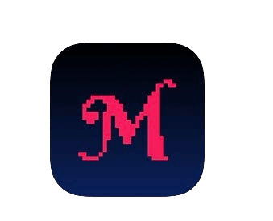

# COME BITCOINIZZARE

>**Bitcoinizzare:** (verbo) /tuːˈbɪtkɔɪn/
Propongo qui di rendere 'bitcoinizzare' un verbo,
che racchiuda la pienezza della partecipazione
nell'eco-sistema bitcoin/Bitcoin.

* Ok, ora che sei stato, speriamo ;) convinto, e sei pronto a diventare la tua banca personale, partecipando alla prima moneta globale per la libertà del mondo,
ecco la parte divertente!

---

## DIVENTARE LA TUA BANCA PERSONALE
* Qui risiede il cambiamento davvero epico nel diventare finanziariamente auto-sovrano, e può richiedere tempo per
comprendere veramente cosa significa.
* È necessaria una certa **intenzione e dedizione per
capire come farlo nel modo più sicuro possibile.**
* Nello spirito di mantenere questo libro 'il libro bitcoin più semplice mai scritto', fornirò qui una
panoramica, e poi offrirò risorse alla fine
per approfondire che vanno molto più in profondità
rispetto alla portata di questo manuale.

>**HODL:** (verbo) /ho’dill/

: mantenere i propri bitcoin

: non vendere

-Da un post del 2013 su bitcointalk.org, dove l'autore
che professava di essere ubriaco, ha scritto male 'HOLD'

-bitcointalk.org/index.php?topic=375643.0

* Mentre la rete è ancora in crescita, c'è molto
valore nei milioni di hodl'r globali di ultima istanza.

---

## ACQUISIZIONE DI BITCOIN
* **Il bitcoin entra nel mercato attraverso i minatori che vendono parte dei
bitcoin che ricevono come ricompensa,** al fine di pagare
per i loro costi operativi.
* **Puoi acquisire bitcoin acquistando su una piattaforma di trading peer-to-peer, accettandolo come pagamento per
beni o servizi che offri, come regalo o minandolo.** (Un'ultima risorsa, non raccomandata, è acquistarlo
da un exchange registrato).
* Quando lo ricevi, tecnicamente ricevi le
chiavi private con cui accedere al tuo bitcoin.
> * **Ricorda:** Il bitcoin stesso non lascia mai la
 timechain.

* Puoi acquisire bitcoin in modo anonimo o
con verifica dell'identità (KYC - Know Your Customer)

* KYC è richiesto dalla legge per soddisfare le leggi AML (leggi antiriciclaggio) quando si acquista da exchange.

>* Acquistare bitcoin non-KYC **preserva il tuo diritto alla
privacy in futuro.**

---

## Non-KYC >> Anonimamente
**Come ottenere Bitcoin non-KYC (senza ID):**

RACCOMANDATO

>1. Scarica un'app wallet solo per bitcoin (vedi pag. 102).
>2. Scegli un metodo (vedi sotto).
>3. Acquista, ricevi o mina bitcoin.
>4. Preleva i tuoi bitcoin nel tuo wallet.
>5. HODL, o spendi e sostituisci.

* **Acquistalo da Robosats, Bisq, HodlHodl, Peach Bitcoin.**
* **Acquistalo da un bancomat bitcoin** - Assicurati di controllare, poiché
alcuni richiedono l'ID. Altri chiedono solo un nome e
numero (puoi usare un numero di telefono temporaneo).
* **Acquista un voucher Azteco** - Visita azte.co per le posizioni.
* **Guadagnalo per il lavoro che fai** - Chiedi di essere pagato in bitcoin.
Offri di scontare il tuo prezzo.
* **Acquistalo di persona a un incontro bitcoin.**
* **Minalo** - Sta diventando più facile minare a casa, o
puoi unirti a un pool di mining, ma poi fai le tue ricerche per rimanere
senza KYC. Ocean Pool è un'ottima opzione.

---

## KYC >> Verifica dell'identità richiesta

**Come acquistare Bitcoin KYC (con ID):**

NON RACCOMANDATO

>1. Scarica un'app wallet solo per bitcoin (vedi pag. 102).
>2. Scegli un exchange solo per bitcoin.
>3. Crea un account e collega un metodo di pagamento.
>4. Soddisfa i requisiti KYC.
>5. Acquista bitcoin.
>6. **Preleva i tuoi bitcoin nel tuo wallet personale.**
>7. HODL o spendi e sostituisci.

* **Sii consapevole che il tuo bitcoin sarà per sempre collegato alla
tua identità** se lo acquisti in questo modo, perdendo così
la futura pseudonimia rispetto a questi acquisti.
* Se scegli questo metodo, ti consiglio di trovare un
***exchange solo per bitcoin*** rispettabile.
* ***Assicurati che l'exchange ti permetta di prelevare i tuoi
bitcoin nel tuo wallet personale!***
* **Gli exchange sono tenuti per legge a 'KYC'arti.**
* Prenderanno **il tuo nome completo, indirizzo, codice fiscale
numero, email, numero di telefono e spesso una foto di
te che tieni in mano il tuo documento d'identità.**
* **Conferma che l'exchange abbia sia supporto telefonico che email
supporto** per il servizio clienti.

---

* Chiedi loro di guidarti attraverso l'invio dei tuoi bitcoin
dal tuo account con loro al tuo wallet personale, in modo che
tu sia l'auto-custode dei tuoi bitcoin
= **Detenere le proprie chiavi.**

>* **Nota:** Questo NON cancella il fatto che tu
>abbia acquistato bitcoin da loro.
>* **Le transazioni sono tracciabili sulla catena, e in
>molti paesi sei responsabile della tassazione quando
>spendi i tuoi bitcoin.**

* Se vuoi acquistare tramite Venmo o Paypal, assicurati
prima di **confermare che puoi ancora prelevare
i tuoi satoshi nel tuo wallet auto-ospitato.** In passato
non potevi farlo.
* Come si suol dire:
> **"Niente chiavi, niente formaggio"** o
>
>**"Non sono le tue chiavi, non sono i tuoi bitcoin"**

* Ciò significa che, finché un servizio centralizzato
detiene le chiavi private dei tuoi bitcoin, rimane
la possibilità che la loro piattaforma venga hackerata, o che
subiscano una cattura normativa e tu perda i tuoi
bitcoin.

>* **Preleva sempre i tuoi bitcoin nel tuo
wallet auto-ospitato personale non appena lo hai
acquistato.**

---
## EO 6102
* Nel 1933 **il presidente Roosevelt emanò l'ordine esecutivo
6102, che richiedeva a ogni cittadino statunitense di consegnare
la maggior parte del loro oro in cambio di banconote.**
* L'oro era valutato a $20,67/oz. L'anno successivo,
il governo aumentò il prezzo dell'oro a
$35/oz con il Gold Reserve Act del 1934,
svalutando di fatto le banconote che le persone avevano
ricevuto di quasi la metà, poiché il valore delle loro
banconote non è mai aumentato con il prezzo gonfiato dell'oro.

---

* Ci sono voluti fino al 1975, **42 anni dopo, perché EO6102 fosse
abrogato,** e perché ai privati cittadini fosse nuovamente
consentito detenere più di 5 once d'oro.
* A questo punto, abbiamo poca idea di come i regolatori
risponderanno al bitcoin man mano che continua a
guadagnare popolarità e un'adozione più diffusa.
* Finora, c'è stata un'accoglienza mista. Per il
momento, tuttavia, sembra che molti
capiscano, o forse accettino semplicemente, che il bitcoin
non può essere fermato in definitiva.
* Ci sono un certo numero di politici che iniziano a parlare
a sostegno del bitcoin come parte della loro piattaforma.
Ce ne sono anche alcuni contrari.
* Essendo un anno elettorale negli Stati Uniti, il 2024 è molto
interessante, con tutti e tre i principali candidati presidenziali
che accettano donazioni di campagna in bitcoin!
* El Salvador lo ha reso una forma di moneta a corso legale nel 2021.
Sarà interessante vedere quale paese sarà il prossimo.

>* **In definitiva, sarebbe nell'interesse di ogni governo abbracciarlo e aggiungerlo al proprio bilancio
come copertura contro le loro valute fiat in rapida inflazione.**

---

## CONSERVARE IN MODO SICURO IL BITCOIN

* Una volta che hai compiuto il passo che cambia la vita di acquistare i tuoi primi , devi **decidere come conservare in modo sicuro
esso.**
>* **Essere la tua banca personale è una potente forma di
>auto-sovranità.**
>* Deve essere preso **sul serio**
* ***Per favore DYOR - Fai le tue ricerche * oltre
le mie raccomandazioni di base qui.**
* L'**ecosistema bitcoin si sta evolvendo ogni minuto.**
* Nostr, Twitter e bitcointalk.org sono buoni
posti per rimanere al passo con gli ultimi sviluppi.

## GUARDA QUESTI SITI PER I TUTORIAL:
> * BTCSessions.ca di @BTCSessions
>* Bitcoiner.guide di @QnA
>* Armantheparman.com di @ArmanTheParman
>* @SouthernBitcoiner su YouTube
>* @wickedsmartbitcoin su YouTube

---

## WALLET SOLO PER BITCOIN
* Il bitcoin è meglio conservato nel tuo
 * **auto-ospitato**
 * **non custodiale**
 * **solo per bitcoin** 'wallet'

* Un 'wallet' è in realtà un software che è un
dispositivo di firma. Contiene le tue chiavi private che
utilizza per firmare una transazione che invii (trasmetti).

## HOT WALLET
* **Questa è un'app wallet bitcoin online che scarichi sul tuo telefono o computer.**
* È meglio utilizzarlo per importi più piccoli, per il giorno per giorno
spesa
## COLD STORAGE WALLET
* **Questo è un wallet offline.** Conosciuto anche come wallet hardware
* È un dispositivo hardware separato su cui conservare
le tue chiavi.

>* Sebbene entrambi funzionino bene, è generalmente raccomandato
di utilizzare un wallet freddo una volta che hai oltre
$500-1000 di bitcoin, poiché è **più sicuro.**

---
* **Per favore DYOR per confrontare le funzionalità e
compromessi tra i wallet mostrati di seguito.**

* **HOT WALLET APPS** - Non-Custodial
Blue Wallet, Muun Wallet, Mutiny Wallet
Sparrow Wallet, Green Wallet, Phoenix
Wallet, Zeus Wallet, Breez Wallet

* **COLD STORAGE WALLETS** - Non-Custodial
Cold Card, Trezor, Foundation Passport,
Blockstream Jade, Seed Signer, Bitbox,

>* **ACQUISTA SEMPRE il tuo wallet di cold storage **direttamente
dal produttore,** per essere certo che non sia stato
manomesso.

---

## CONFIGURAZIONE DEL WALLET
* Segui @BTCSessions su YouTube per eccellenti
tutorial sulla configurazione del wallet e molto altro.

>* Quando configuri il tuo wallet, assicurati di ***scrivere
>la frase di seed di 12 o 24 parole su carta.***
>* ***Mantienila offline. Non farne mai uno screenshot.***
>* **CONSERVA LA FRASE DI SEED MOLTO AL SICURO.**
>* **MOLTO, MOLTO AL SICURO!**

* **Molte aziende producono piastre di seed in metallo in
cui puoi punzonare la tua frase di seed per una maggiore
protezione da fuoco/acqua/danni. Altamente raccomandato!**
* Se dovessi perdere l'accesso al tuo wallet hot o cold,
puoi ripristinarlo con la frase di seed e recuperare
i tuoi fondi.
* Puoi farlo su qualsiasi wallet che supporti lo stesso
tipo di frase di seed BIP39 (12/24 parole).
* La best practice sarebbe quella di memorizzare il wallet
descrittore del tuo wallet oltre al tuo seed.
>* **RICORDA: Chiunque abbia il tuo seed ha
accesso al tuo bitcoin!**

---
## SULLA PRIVACY
* La privacy quando **acquisti (non-KYC), proteggi, conservi
e spendi** bitcoin sta diventando sempre più
importante, soprattutto alla luce dei recenti eventi con
conti bancari sequestrati/congelati.
>* Inoltre, **la privacy digitale generale è fondamentale se
desideri ottenere la sovranità online e proteggerti da sorveglianza e frodi indebite.**

* Di seguito sono riportati alcuni servizi attuali incentrati sulla privacy.
* È al di fuori dello scopo di questo libro approfondire
ciascuno dei seguenti, quindi assolutamente DYOR, e
segui gli account che menziono di seguito su Nostr o
Twitter per gli aggiornamenti.

>*La privacy è necessaria per una società aperta nell'era elettronica.
La privacy non è segretezza. Una questione privata è qualcosa
che non si vuole che il mondo intero sappia, ma una questione segreta
è qualcosa che non si vuole che nessuno sappia.
La privacy è il potere di rivelarsi selettivamente
al mondo.*

~Eric Hughes, Da 'Il manifesto di un Cypherpunk'

---