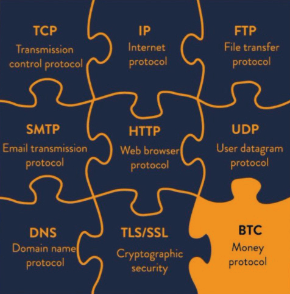

#  Dissipare il FUD su Bitcoin
(Paura, Incertezza, Dubbio)

* Di seguito sono riportate alcune argomentazioni comuni contro, o paure
riguardo a Bitcoin.
* Questi sono in gran parte infondati, derivanti dall'ignoranza o forse da una comprensione incompleta.
* Fornisco brevi confutazioni a ciascuno qui, e alla fine
troverai indicazioni per risorse più approfondite
che confutano tutto il FUD.

## BITCOIN UTILIZZA TROPPA ENERGIA

>*Il calore del tuo computer non viene sprecato
se hai bisogno di riscaldare la tua casa... È
un costo uguale se generi il calore
con il tuo computer.*

~ Satoshi Nakamoto 2010-08-09

>*Inizialmente, la produzione di una merce semplicemente perché
è costosa sembra piuttosto dispendiosa. Tuttavia, la merce
costosa e non falsificabile aggiunge ripetutamente valore consentendo
trasferimenti di ricchezza vantaggiosi. Gran parte del costo viene recuperato
ogni volta che una transazione è resa possibile o resa
meno costosa. Il costo, inizialmente uno spreco totale, viene
ammortizzato su molte transazioni.*

~ Nick Szabo

Cypherpunk

---

* **L'energia 'troppa' è una proposta di valore che deve
considerare come valutiamo lo scopo dell'uso dell'energia.**

* **Quando si considera che le luci di Natale negli
Stati Uniti usano tanta elettricità quanto l'intera rete Bitcoin,** allora forse si può vedere che è tutto relativo!

* Usare energia, anche molta energia, per proteggere
il denaro più resistente alla censura che
l'umanità abbia mai conosciuto, vale più che la pena.

* Nel confrontare l'utilizzo di energia di Bitcoin con quello utilizzato dal
sistema legacy, dobbiamo anche considerare il 'full
stack' su entrambi i lati:

| Ecosistema Bitcoin    | Sistema Fiat Legacy          |
| -------------------- | --------------------------- |
| ASIC Miners          | BRI                        |
| Nodi                | Banche centrali               |
| Hardware Wallet     | Banche nazionali/regionali     |
| App Software Wallet | Complesso militare-industriale |
|                      | Centri dati di backup         |
|                      | Stampa fisica di denaro     |
|                      | Distribuzione fisica di denaro |
|                      | App di online banking         |
|                      | Rete di bancomat             |

* Usando bitcoin, alla fine ridurremo l'energia
utilizzata in una moltitudine di altre aree, in particolare
non avendo più bisogno del Complesso Militare Industriale
per proteggere il petro dollaro

---

* Inoltre, il consumismo sfrenato necessario per
mantenere a galla il sistema basato sul debito, verrà nel tempo
ridotto, poiché **la moneta forte incentiva naturalmente
la spesa e il risparmio prudenti** (poiché i tuoi risparmi
conserveranno effettivamente il loro valore, un concetto che non abbiamo
sperimentato da quando siamo usciti dal gold standard).
* **Infine, e cosa importante, il mining di bitcoin sta già
riducendo l'inquinamento catturando il gas naturale flaring
e usandolo per alimentare i miner.** Poiché i miner cercano
bassi costi dell'elettricità, è anche probabile che sia il più grande
motore verso l'energia rinnovabile a basso costo, poiché
gli incentivi corrispondono.
* **Approfondimenti informati e approfonditi su Bitcoin ed energia** sono stati
scritti da Daniel Batten su batcoinz.com, Troy
Cross, Jyn Urso, il video 'This Machine Greens'
di Swan Bitcoin su YouTube, 'Dirty Coin', un
documentario sul mining di bitcoin, e un
eccellente episodio dello show 'What is Money'
(WiM161) con B.Quittem, tra molti altri.

---

## BITCOIN È UNO SCHEMA PONZI
* **Bitcoin non è uno schema Ponzi:**
 * I vecchi investitori non ricevono denaro dai nuovi
 investitori.
 * Quando si acquista bitcoin, nessuno promette un ritorno
 sul tuo investimento.
 * Non c'è un team di leadership o promozioni.
 * Non c'è stato un pre-mine.
 * **Leggi:** 'Why Bitcoin is Not a Ponzi' di Lyn Alden
per altro.

## BITCOIN È TROPPO LENTO
* Mentre il livello base di Bitcoin è lento, il 2° livello
**La Lightning Network costruita sul livello base è...
velocissima!**
* La rete di Bitcoin può elaborare circa 7
transazioni al secondo (TPS).
* La rete Visa afferma di poter elaborare fino a 24.000
TPS, anche se 4.000 TPS sono più vicini all'utilizzo reale.
* **La Lightning Network, una soluzione di secondo livello
costruita su Bitcoin, ha la capacità potenziale di
elaborare milioni di transazioni al secondo!**

---

## I GOVERNI POTREBBERO VIETARE BITCOIN
* Alcuni governi ci hanno provato, come Cina, India e
Nigeria per esempio. In ogni caso, l'uso di bitcoin
aumenta rapidamente da parte della popolazione di detto paese
* **Non c'è modo per i governi di 'vietare' veramente bitcoin,** poiché è per sua natura senza autorizzazione e resistente alla censura. È codice e il codice è discorso.
* Detto questo, i governi possono rendere più difficile l'acquisto
e la vendita con, e in fiat. Possono anche tassarlo come una
merce, come fanno negli Stati Uniti.
* **In definitiva, non sarà a loro favore cercare di vietarlo
, poiché bitcoin è inevitabile e stanno iniziando
a capirlo.** Sarebbe molto più intelligente aggiungerlo al
bilancio del loro paese come copertura contro le loro
valute fiat in inflazione.

>*I governi sono bravi a tagliare le
teste di reti controllate centralmente
come Napster, ma le reti P2P pure
come Gnutella e Tor sembrano essere
autosufficienti.*

~ Satoshi Nakamoto

* **Leggi:**

Can Government Stop Bitcoin? di Alex Gladstein,
CSO della Human Rights Foundation

Can the Government Ban Bitcoin? Four Things You
Need to Know di Nick Giambruno

---

## BITCOIN È TECNOLOGIA VECCHIA
* **Più come 'tecnologia definitiva',** per quanto riguarda la scarsità digitale,
la decentralizzazione e la risoluzione sia del problema della doppia spesa che del problema dei generali bizantini. Una volta scoperto, non può essere riscoperto.
* **Una volta inventata la ruota, non avrebbe mai potuto essere
reinventata.**
* Il protocollo TCP/IP su cui funziona Internet è
lo standard per tutte le reti di computer dal
1983. È probabile che continui a essere lo standard per un
lungo periodo.
* Una volta scoperta una tecnologia di livello base con una soluzione perfetta che funziona in modo ottimale, può durare per centinaia,
o migliaia di anni.

Credito: @DecouvreBitcoin

---

## BITCOIN È UTILIZZATO DAI CRIMINALÌ
* **Così è il dollaro, e ogni altra valuta fiat nel
mondo.** È semplicemente errato attribuire questo
problema solo a bitcoin.
* **Bitcoin è uno strumento, proprio come un coltello, e dipende da ciascuno
di noi come lo usiamo.**
* È interessante notare che, se bitcoin non potesse essere utilizzato dai criminali,
allora non sarebbe il denaro neutrale e resistente alla censura
di cui il mondo ha così tanto bisogno.
* **Nota:** Poiché la blockchain di Bitcoin è controllabile, è
in realtà una scelta davvero pessima per l'attività criminale!

## IL CALCOLO QUANTISTICO POTREBBE ROMPERE BITCOIN
* Sebbene questa possa essere una possibilità un giorno in futuro,
**gli sviluppatori stanno già lavorando a soluzioni per la crittografia post-quantistica**
* Bitcoin è solo una delle molteplici applicazioni online che si basano sull'hashing SHA-256 per la sicurezza.
Anche i militari lo usano, quindi c'è un enorme incentivo al di là della comunità bitcoin a sviluppare nuovi
protocolli di crittografia.
* Se SHA-256 viene rotto, avremo molto altro di cui
preoccuparci oltre a bitcoin. L'intera Internet lo usa
per la crittografia. Ciò include tutti i sistemi bancari, la fornitura
catene, sistemi di trasporto, sistemi sanitari,
sistemi educativi e altro ancora.

---

## BITCOIN NON HA UN VALORE REALE
>*"Il valore di Bitcoin è guidato dalla sua scarsità applicabile"*

*~ Fidelity Digital Assets*

* **La rarità è il valore. Tutti i soldi nel corso del tempo sono stati
valutati perché avevano una certa misura di scarsità.**

* Inoltre, era supportato dalla convinzione che avrebbe
mantenuto il suo valore, in modo che potesse essere scambiato in futuro
per qualcos'altro di valore.
* Man mano che la rete Bitcoin cresce, supportata dalle superiori
proprietà monetarie che incarna, l'effetto di rete
cresce esponenzialmente
* Maggiore è l'effetto di rete, più valore offre, come
risorsa scarsa. Il valore è un riflesso della domanda,
e all'aumentare della domanda, il valore aumenta.

---

## ALCUNE PERSONE NE HANNO TROPPO
* È vero che alcune persone hanno molto più di altre.
**Nel rilasciare il protocollo apertamente, Satoshi gli ha permesso
di vagare liberamente, e coloro che hanno compreso il potenziale
che aveva estratto o acquistato presto. Era il
modo più equo e organico possibile per presentarlo
al mondo.**
* Nel tempo, quando il mondo sarà iperbitcoinizzato, il che significa che vivremo su uno standard bitcoin, coloro che
ne hanno di più lo spenderanno naturalmente nell'economia

* Anche se a un certo punto non si potrà più
acquistarlo con fiat, le persone verranno pagate per il loro
lavoro in bitcoin. Essere pagati in denaro veramente solido ci
permetterà di avere veri risparmi che non verranno svalutati
nel tempo dall'inflazione
* Mentre ci saranno sempre quelli con più ricchezza
e quelli con meno, a causa di un vasto numero di fattori,
**uno standard bitcoin renderà la membrana tra
le classi di ricchezza permeabile**, come dice Aleks Svetsi. Questo
permetterà alla mobilità sia verso l'alto che verso il basso di essere
molto, molto più fluida di quanto non lo sia oggi
* **Essendo nati e nuotando per tutta la nostra vita
in un mondo fiat, è quasi impossibile immaginare e
comprendere appieno le implicazioni di avere una moneta che
non può essere svalutata o manipolata!**

---
## BITCOIN È TROPPO VOLATILE
* **Questo è normale durante la fase di scoperta del prezzo di
una nuova attività monetaria.** Non c'è altro modo perché
la crescita avvenga quando è organica ed emergente
(al contrario che dall'alto verso il basso e controllata centralmente.
* Inoltre, in questa fase dell'esistenza umana, con
cambiamenti esponenziali che accadono in tutte le sfere, ha
senso che qualcosa di così rEVOLuzionario come bitcoin avrà
oscillazioni selvagge.
* Mentre quelli di noi che sono nel profondo della tana del coniglio lo vedono
come il futuro, attualmente solo una piccola percentuale della
popolazione globale detiene bitcoin in questo momento. Questo
lo rende vulnerabile a un'immensa volatilità.
* Man mano che matura e l'adozione aumenta, la volatilità diminuirà e alla fine si stabilizzerà e
diventerà un'unità di conto.

>*Sono sicuro che tra 20 anni ci sarà
un volume di transazioni molto elevato
o nessun volume.*

~ Satoshi Nakamoto 2010-02-14

---

## NON PUOI TOCCARE UN BITCOIN

* **Questa è una caratteristica, non un bug.** Il fatto stesso che bitcoin
non sia fisico è uno dei maggiori fattori che contribuiscono alla sua non confiscabilità!

## BITCOIN POTREBBE ESSERE HACKERATO

* Nei 15 anni dal suo lancio, non è mai
stato hackerato.
* Ci sono stati tuttavia attacchi agli exchange, quindi consiglio vivamente
di spostare i tuoi bitcoin sul tuo portafoglio in autocustodia il prima possibile.
* È stato stimato che per rompere la crittografia SHA-256
(che bitcoin utilizza) entro 24 ore, un
computer quantistico avrebbe bisogno di 13.000.000 di qubit fisici. Al momento, il record attuale di qubit detenuto
da Atom Computing in California è di 1.180 qubit.
* Si presume ampiamente che un metodo di crittografia sicuro per i quanti
verrà sviluppato ben prima che sia necessario.

>*Essere open source significa che chiunque può
rivedere in modo indipendente il codice. Se fosse
closed source, nessuno potrebbe verificarne la
sicurezza. Penso che sia essenziale per un
programma di questa natura essere open source.*

*~Satoshi Nakamoto 2009-12-10*

---

## ALTRO SULLA SFATAZIONE DEL FUD QUI:

* Endthefud.org
* Bitcoinmythbusters.org
* Casebitcoin.com - Critiche comuni
* Safehodl.github.io/failure/
* Lopp.net - Informazioni su Bitcoin: Idee sbagliate

>*Bitcoin è fondamentalmente diverso da qualsiasi altra risorsa digitale. Nessun'altra risorsa digitale ha probabilità di migliorare
bitcoin come bene monetario perché bitcoin è il denaro digitale più
(rispetto ad altre risorse digitali) sicuro, decentralizzato e
solido e qualsiasi "miglioramento"
affronterà necessariamente compromessi.*

~ Fidelity Digital Assets Report, 'Bitcoin First', gennaio 2022
Chris Kuiper, CFA, Direttore della ricerca
Jack Neureuter, Analista di ricerca

---

## SUL PREZZO DI BITCOIN
* **Vedo l'hodling (detenzione) di bitcoin come avere un conto
di risparmio a lungo termine.**
* Il prezzo giornaliero non ha importanza, poiché si prevede che sarà
volatile (salirà e scenderà) per alcuni anni ancora.
* Come ho detto in precedenza, questo è normale per una nuova
risorsa in fase di scoperta del prezzo
* Se si ingrandisce il grafico dei prezzi BTC/USD, si
vedrà che è aumentato di +31.296% dal 2009,
mediato a ~200% all'anno.
* Le oscillazioni di prezzo riflettono vari articoli di notizie, aggiornamenti normativi, domanda di mercato, paura ed eccitazione.
È un ottovolante!
* **Più a lungo si hodla, più si impara e si comprendono i fondamenti, e più ci si rende conto delle profonde implicazioni di avere denaro solido, meno il prezzo conta.**

>**Alla fine, il 'prezzo' non avrà alcuna importanza, poiché bitcoin
sarà l'unità di conto.**

* **Disclaimer:**
* Inserisci solo ciò che 'puoi permetterti di perdere', poiché,
ovviamente, non ci sono garanzie.
* Considera i bitcoin che acquisti come un conto
di risparmio a lungo termine e pianifica di lasciarli in cold
storage per un minimo di cinque anni prima di
spenderli.

---

Fonte originale di bitcointalkforum.org per uno dei
meme bitcoin più classici di tutti i tempi.

---

## NEL FRATTEMPO, SULLE TASSE
* **Disclaimer:** Questo non è un consiglio finanziario o fiscale

* Nel codice fiscale statunitense, bitcoin è attualmente visto come una merce, quindi ci sono potenziali implicazioni fiscali se lo
rivendi in fiat, o anche se acquisti qualcosa con
il tuo bitcoin
* Se il prezzo è sceso prima di venderlo/spenderlo,
puoi richiedere una perdita
* Se il prezzo è aumentato, dovresti richiedere un
guadagno di capitale e pagare tra il 10-30% di CGT (Imposta
sui guadagni di capitale)
* L'importo dipende da diversi fattori, come
quanto tempo lo hai detenuto prima di venderlo o spenderlo, e
in quale fascia fiscale ti trovi.
* Se hai intenzione di vendere o spendere bitcoin, soprattutto importi
maggiori, potresti voler considerare di consultare
un professionista fiscale.
* Se semplicemente acquisti e detieni, attualmente non hai
alcun evento imponibile per quanto riguarda bitcoin.
* E se acquisti non-KYC…

---
