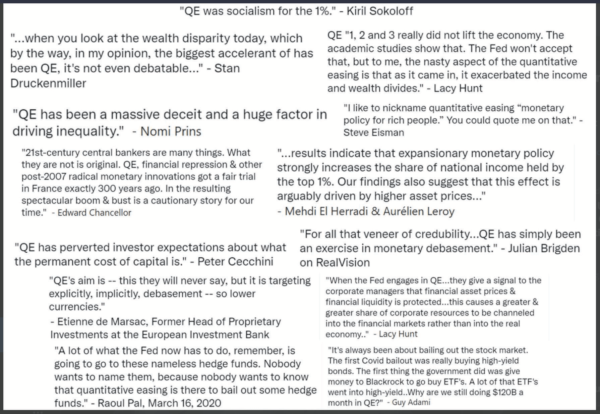

# なぜビットコインが必要なのか

## なぜなら、お金は壊れているから

> *従来の通貨の根本的な問題は、
> それを機能させるために必要なすべての信頼です。
> 中央銀行は通貨を切り下げないと
> 信頼されなければなりませんが、法定通貨の歴史は
> その信頼の侵害でいっぱいです。銀行は
> 私たちのお金を保持し、電子的に送金すると
> 信頼されなければなりませんが、彼らはほとんど
> 準備金を持たずに信用バブルの波で貸し出します。私たちは彼らを
> 私たちのプライバシーで信頼し、彼らが
> 個人情報泥棒が私たちの口座を空にしないと信頼します。*

~ サトシ・ナカモト 2009-02-11

* 法定通貨システムは壊れています（常にそうでした）。
* 持続可能ではありません（決してそうではありませんでした）。
* 修正する方法はありません（決してありません）。

---
## （金）本位制について
* 多くの人々は、お金は依然として金に裏打ちされていると信じています。
* そうではありません。
* 1971年にニクソン大統領が一方的に世界を金本位制から外して以来、金に裏打ちされていません（ニクソン・ショック）。
* これがもたらした損害の明確な全体像を把握するには、**wtfhappenedin1971.com**を参照してください。

1971年以降の消費者物価指数のインフレ（赤い線）と米ドルの購買力（黒い線）を示すグラフ。

<small>米国労働統計局、セントルイス連邦準備銀行のFREDから取得。https://
fred.stlouisfed.org/series/CPIAUCSL、2024年6月9日。</small>

* 豆知識：世界経済フォーラムは1971年に設立されました。
---

>**法定通貨（FIAT）：**（名詞）/ˈfiː.æt/
>
>: 権威的または恣意的な命令：布告
>
>: 権威ある決定：命令
>
>**: それ以上の努力なしに、またはあたかもなしに何かを創造する命令または意志の行為**

~ merriam-webster.com/dictionary

>**法定通貨：** ラテン語のfieri「作られる、生まれる」に由来

* 法定通貨とは、政府がそうである（と布告する）と言う場合にのみ価値があるお金です。
* したがって、人々はそれがそうであると（信じなければなりません）。
>* **法定通貨には価値がないと信じていなくても、法律により、
それを使用し、商品やサービスの支払いとして受け入れることを強制されます。**
* **法定通貨は無から印刷/作成されます。**
* 現在、すべてのドルの約5％が現金として印刷されています。
* 他の95％は、銀行が融資を行う際にコンピューターに数字を入力することによってデジタルで作成されます。

>*造幣局が100ドル紙幣を製造するのにかかる費用はわずか数セントです...*

~ アメリカの経済学者、バリー・アイケングリーン

---

>***NBC ’60 Minutes’のスコット・ペリー：*** *システムにお金を単に溢れさせたと言っても過言ではありませんか？*
>
>***FRB議長ジェローム・パウエル：*** *はい。そうしました。
それは別の考え方です。そうしました。*
>
>***ペリー：*** *それはどこから来るのですか？
ただ印刷するだけですか？*
>
>***パウエル：*** *デジタルで印刷します。そのため、中央銀行として、
デジタルでお金を作成する能力があります。そして、私たちはそれを行います
米国財務省証券または債券を他の政府機関から購入することで
保証された証券。そして、それは実際にお金を増やします
供給。また、実際の通貨も印刷し、
それを連邦準備銀行を通じて配布します。*

~ CNBC ’60 Minutes’ インタビュー、2020年5月17日
C*vid-19ロックダウンの開始から2か月後

>これらの貸付プログラムでできることに本当に制限はありません。

~ FRB議長ジェローム・パウエル
2020年3月18日、CBSニュースにて

>はい、連邦準備制度には無限の現金があります。私たちはそうするために必要なことは何でもします
銀行システムに十分な現金があることを確認してください。

~ ミネアポリス連銀総裁ニール・カシュカリ
2020年3月23日、CBS '60 Minutes'

>ここでの「私たち」は、連邦準備制度内の貨幣政策の変更に投票する5人です
FOMC会議中。3億3000万人のうち5人。
それが米国の金融政策を変えるのに必要なすべてです。

~ TFTC.ioの創設者@MartyBent
フォーブス記事、2020年3月18日

---

## 古き良き時代からのホースマウスから

>*銀行は、無から作り出したすべてのお金に利息の利益があります。*

*〜ウィリアム・パターソン、1694年
イングランド銀行の創設者*

>*アメリカの当惑、混乱、苦悩はすべて、
憲法や連邦の欠陥からではなく、
名誉や美徳の欠如からではなく、
コイン、信用、流通の性質についての完全な無知から生じます。*

*〜ジョン・アダムス
第2代米国大統領、1797〜1801年*

>*私は、銀行機関は常備軍よりも
私たちの自由にとって危険であると信じています。
すでに彼らは、政府を無視するマネー貴族を育ててきました。
発行権は銀行から取り上げ、
それが適切に属する人々に返還されるべきです。*

*〜トーマス・ジェファーソン
第3代米国大統領、1801〜1809年*

>*私たちの高貴な行為を誇りながら、不公平なお金システムによって、私たちは国家化されたという醜い事実を隠すように注意しました
抑圧のシステム。それは、より洗練されていますが、
動産奴隷制度の古いシステムよりも残酷ではありません。*

〜ホレス・グリーリー
米国下院議員1848〜49年
ニューヨーク・トリビューンの創設者

---

>*どの国のマネー量を管理する人も、
すべての産業と商業の絶対的な支配者です...
システム全体が非常に簡単に制御されていることに気づいたとき、
多かれ少なかれ、トップにいる少数の有力者によって、インフレと不況の時期がどのように発生するかを伝えられる必要はありません*

〜ジェームズ・A・ガーフィールド
第20代米国大統領、1881年3月〜9月
1881年に暗殺

>*今日、一連の人々の手に制御されていないものが存在します
何もないところからドルを作る力。*

〜トーマス・W・ローソン、著書『熱狂的な金融』、1905年

>*私は陰謀者のように秘密主義的で、実際にはこっそりしていました。
発見は、私たちの時間と労力がすべて無駄になるので、決して起こってはならないことを私たちは知っていました。私たちの
特定のグループが集まって銀行法案を書いたことが暴露された場合、その法案は議会を通過する可能性はまったくありません。*

〜フランク・A・ヴァンダーリップ
ニューヨーク国立シティ銀行の頭取
（シティバンクの前身）
〜1913年の連邦準備制度法として可決された法案の草案を作成するために、1910年にジキル島で行われた秘密会議について1935年に書きました。

>*この（連邦準備制度）法は、地球上で最も巨大な信託を確立します。大統領（ウッドロー・ウィルソン）が法案に署名すると、
金融力の見えない政府が合法化されます...
今世紀最悪の立法犯罪は、
この銀行および通貨法案によって行われます。*

〜チャールズ・A・リンドバーグ・シニア
米国下院議員1907-1917年

---

>*私は最も不幸な男です。私は不注意にも私の国を破滅させました。
偉大な工業国は、その信用システムによって管理されています。
私たちの信用システムは集中しています。国家の成長、
したがって、私たちのすべての活動は少数の人々の手に委ねられています。
私たちは、文明化された世界で最悪の支配を受け、最も
完全に制御され、支配されている政府の1つになりました。もはや自由な意見による政府ではなく、もはや
多数派の信念と投票による政府ではなく、
少数の支配的な人々の意見と強制による政府。*

〜ウッドロー・ウィルソン
第28代米国大統領、1913〜1921年
1913年の連邦準備制度法可決から6年後。

>*問題の本当の真実は、あなたと私が知っているように、
大規模なセンターの金融要素は
アンドリュー・ジャクソンの時代から米国の政府を所有しています。*

〜フランクリン・D・ルーズベルト
第32代米国大統領、1933年11月21日にE.マンデル・ハウス大佐に宛てた手紙の中で

>*それは[恐慌]偶然ではありませんでした。
それは慎重に考案された出来事でした...
国際銀行家は、彼らが
私たちすべての支配者として現れることができるように、ここで絶望の状態をもたらそうとしました。*

〜下院議員ルイス・T・マクファデン、
1936年に暗殺

>下院銀行通貨委員会の委員長
*銀行が融資を行うたびに、新しい銀行信用が創造されます - 新しい預金 - 真新しいお金。*

〜グラハム・F・タワーズ
カナダ中央銀行総裁、1934〜55年

---

>*私たちのお金システムに借金がなければ、お金は存在しません*

*〜マリナー・エクルズ、
1941年、FRB総裁*

>*私は、連邦政府が
論理と理性を使って、自分のお金の借り入れを正当化できる人は誰もいませんでした...
私は、人々が
これが変更されることを要求する時が来ると信じています。
私は、この国で
あなたと私と
議会に関係する他のすべての人を実際に非難する時が来ると信じています。
そのようなばかげたシステムが継続することを黙って傍観していることに対して。*

〜ライト・パトマン
米国下院議員1928〜1976年
銀行通貨委員会委員長1963〜1975年

>*あなたまたは私が小切手を書くとき、小切手を支払うのに十分な資金が口座にある必要がありますが、連邦準備制度が
小切手を書くとき、その小切手が引き出される銀行預金はありません。連邦準備制度が
小切手を書くとき、それはお金を作っています*

〜ボストン連邦準備銀行
「簡単に言うと」、1984年

---

## 連邦準備制度

* FRBは、米国の「独立した」中央銀行です。それは、1913年に連邦準備制度法が可決されたときに作成されました。
* 民間と政府の一部であるユニークな構造を持っています。
* 政府内の政治的に独立した超党派の団体であると考えられています。
* FRB理事会は大統領によって任命され、議会によって承認されますが、**FRBの決定は誰によっても批准される必要はありません。**

**構成：**

* 連邦準備制度理事会
* 12の連邦準備銀行
* 金融政策を決定する機関である連邦公開市場委員会（FOMC）。

**FRBは、次の責任を負います。**

* 米国の金融政策を監督し、雇用と安定した価格を促進すること。
* 銀行および金融機関を規制および監督すること。
* 金融機関に支払いサービスを提供すること。
* 消費者保護と地域社会の発展を促進すること。

---

## FRB議長に関するメモ

* **連邦準備制度議長は次の役割も担います。**

* 米国の方向性を決定する連邦公開市場委員会（FOMC）の議長
金融政策（例：QE、金利引き上げ）
* 国際通貨基金（IMF）のメンバー
* 国際決済銀行（BIS）のメンバー（中央銀行の銀行）。
* G-7の米国財務大臣
* G-20の米国財務大臣

* 1人の人にとって**非常に**大きな力。

---

## 部分準備銀行制度、利息、および融資

* **部分準備銀行制度：** 2020年3月まで、銀行は10％の準備金を保持する必要があり、90％を貸し出すことができました。
* **2020年3月以降、準備金は不要になり、銀行は無制限の融資を発行できるようになりました。**

* 融資は債務に基づくお金であり、融資に利息を支払う必要があります。

>* **豆知識1：** 融資の利息を支払うためのお金は、銀行によって作成されていません。
>* **豆知識2：** それは決して作成されません。
>* **豆知識3：** すべての融資＋それらの融資に発生する利息を返済するのに十分なお金は世界にありません。
>* **豆知識4：** 決してありません！

---

## 石油ドルに関するメモ
* **1971年までドルは金に裏打ちされ、1974年以降は石油に裏打ちされ、したがってデフォルトでは米軍に裏打ちされていたと言えるでしょう。**
* **1974年、米国とサウジアラビアは、石油の販売価格を米ドルで設定する二国間協定を締結しました。**
* それ以来、世界の石油販売のほとんどは米ドルで決済されています。
* これは、ドルが世界で最も強い通貨になることに大きく貢献しています。
* **したがって、通常は苦労している時期でも、人為的に支えられてきました。**
* 2022年後半以降、多くの国が米ドル以外の通貨で取引を開始しています。
* これは、石油ドルの終わりの始まりである可能性が非常に高いです。次に何が起こるかはまだわかりません…

---

## QE（量的緩和）について
* **量的緩和は、中央銀行が「経済を刺激する」ために使用する「型破りな金融政策」と見なされており、FRBが政府債券やその他の政府証券を購入します。**
* これは、2001〜2006年の間に日本で初めて使用されました。その後、米国、英国、ユーロ圏は2008年の金融危機の際にQEを使用しました
* それ以来、米国がQEプログラムを実施していなかったのは2014〜2019年の間だけです。
* 以下に示すように、批評家は**QEがすでに富裕層に圧倒的に利益をもたらすと主張しています**

*クレジット：Twitterの@RudyHavenstein*

---

## サイクル

* **自然界のすべてにおいて、サイクル、自然な満ち引き、拡大と収縮があります。**

* これは、地球上のすべての生命の、全体的な、長期的な、バランスのとれた持続可能性に貢献します。
* **債務に基づく法定通貨システムは、自然サイクルの知恵を無視し、代わりにその生存のために、その債務にサービスを提供し続けるために、比類のない、緩和されていない成長に100％依存しています。**
* 自然界では、これはがんです。
* 「経済」では、この不自然な軌道は、政府が倒産しつつある銀行や大企業を救済することによってさらに支持されています。倒産させ、何か新しい、より健全なものにリサイクルするのではなく。
* **倒産しつつある企業を救済することの近視眼さは、経済全体を危険にさらしています。** つまり、それは単に缶詰を先送りしているだけであり、必然的に訪れる混乱は、自然サイクルが実行されることを許可した場合よりも、はるかに激しくなる可能性があります
* **私たちは、新しい海岸に私たちを運ぶための救命ボートを提供するビジョン、先見性、決意、スキルを持っているサトシ・ナカモト、そして彼以前および以降のサイファーパンクに恩義があります。**

---

* これが贈り物であることに気づいたら、心と頭をクリアにして、旅に参加し、平和のお金で新しい世界を構築するのは私たち次第です。
>* **ビットコインはお金を修正し、残りを修正するのは私たち次第です。そして、明確にするために、お金を修正することで、多くの他のことがデフォルトで修正されます**

* 主なものは、大規模で政府が開始した運動戦争が、人々の支持なしにはもはや利益を得ることができず、不可能になることです。
* さらに、自然に消費が減少し、本来収益化されるべきではなかった住宅や不動産の、実質価値の商品やサービス、自由市場、実際の貯蓄、非収益化への切り替えが行われます。
* **参照：** Bitcoin Fixes This、32ページ
---

## なぜなら、インフレは窃盗だから

1913年の連邦準備制度の設立以来のドルの購買力の低下を示す2024年のFREDチャート。1913年以降の累積インフレ率は約3.067％です。世界中の中央銀行の法定通貨はすべて、同様の低下率に従っています。

* **無からお金が作成されればされるほど、すべてのお金は価値/購買力を失います。**
* これは**インフレ**と呼ばれます。
* インフレは、文字通り**時間の窃盗**です。インフレ、切り下げ、操作された通貨で時間を節約すると、時間の価値が盗まれます。
* インフレは**隠れた税金**でもあります。

---

* この時間の窃盗と税金は、他のすべての国の法定通貨にも影響を与えています。これは、1944年のブレトンウッズ協定以来、世界準備通貨として、すべてが米ドルに固定されているためです。
* **米国では、年間2％のインフレ率が連邦準備制度の義務に書き込まれています。**
* これは、毎年同じ20ドル札で**2％少なく購入できることが保証されている**ことを意味します。
* **2024年3月、年間インフレ率は3.5％でした**（2％よりもはるかに高いので、2023年3月から2024年3月の間に購買力の3.5％を失ったことを意味します。
* 言い換えれば、これは平均して物価が3.5％上昇したことを意味します
* **1980年代初頭まで行われていたように、インフレが正確に測定された場合、2024年には実際には10％近くになるでしょう。**
* カテゴリ別に見ると、過去1年間で多くのカテゴリでインフレが3.5％よりもはるかに悪いことがわかります。
* 家賃、食料品代、ガソリン代、ほとんどの購入物を調べると、すべてのセクターでインフレが蔓延していることは明らかです

---
**過去50年間の米国の平均インフレ率：**

| 平均費用 | 1971年 | 2021年 | ％増加 |
| --- | --- | --- | --- |
| 給与 | $9,400 | $59,400 | 532% |
| 家 | $23,400 | $513,000 | 2,092% |
| ガソリン1ガロン | $0.36 | $4.17 | 1,058% |
| 新車 | $3,400 | $47,000 | 1,282% |
| 大学の学位 | $1,400 | $26,000 | 1,757% |
| 食料品のバスケット | $20 | $210 | 950% |
| 電気/kWh | $0.02 | $0.15 | 650% |

>**本当の話：**
〜家は1976年に58,000ドルで購入されました。
〜「公式」インフレを考慮すると、これは2022年のドルで279,000ドルになります。
〜2022年、同じ家は209万ドルと評価されました。
〜考えてみてください…

>*法定通貨は偽情報です。
10ドル札はどのような情報を伝えますか？
10は、分母が欠落している分数の分子です。
10はいくつですか？
10は、既知の安定した分母がなければ何も言いません。*

〜@bitlany

---

* **インフレが上昇すると、貯蓄（幸運にも貯蓄がある場合）は価値を失います。**
* 時間の経過とともに、それらは**多大な**価値を失います
>*今日から毎月100ドルを貯蓄し始めた場合、利用可能な最高の金利は0.05％です。
> * 30年後には**84,019ドル**貯蓄できたでしょう。
>* FEDの義務付けられた2％のインフレ率で調整した場合
>* 30年後には、貯蓄の実質購買力はわずか**46,384ドル**になります。
>* 今日の3.5％のインフレ率で調整した場合：
>* 84,019ドルの貯蓄の購買力は、30年後にはわずか**11,037ドル**になります！

* **実際には、仕事の約6時間のうち7時間が盗まれたことを意味します = *時間の窃盗。***

---
**別の見方は次のとおりです。**
* **1971年**、家の費用 = 平均年収の**2.5**倍。
* **2024年**、家の費用 = 平均年収の**8.6**倍。
* **1971年**、新車は平均年収の約**1/3**でした
* **2024年**、新車は平均年収の**3/4**以上かかります。

インフレが
あなたのために働く
**ではありません** *。

**注：** これらの数字はすべて平均であり、多くの要因に基づいて変動します。ポイントは、インフレが隠れた税金であり、私たちの実際の労働と生産に対する時間の窃盗であるということです

>* **ハードマネーがこれを修正します。**
>* **ビットコインはハードマネーです**
---

## 中央制御され、操作され、債務に基づく経済を置き換える必要があります

>*政府の手から物を取り除く前に、私たちは良いお金を再び持つことは決してないと思います。
つまり、政府の手から暴力的に奪うことはできません。私たちができるのは、政府が阻止できないものを導入するような、狡猾な回り道の方法によるだけです。*

〜フリードリヒ・ハイエク、1984年
オーストリアの経済学者、哲学者、作家、1899〜1992年

2020年3月の4兆ドルから2024年6月には18兆ドル以上に増加した、指数関数的なM1マネーサプライの増加を示すグラフ。

* **ここであなたの心を爆破してください：** https://usdebtclock.org/
---
* **既存のすべての米ドルの45％は、2020年4月から2022年1月にかけて印刷されました！**
* つまり、空気から印刷されたことを覚えていますか？
* 法定通貨は国によって中央制御されており、供給は簡単に操作されます。
* **米国の国家債務が1兆ドルに達するのに205年かかりました。（1776 > 1981）**
* 米国の国家債務が**34兆ドルに達するのに**わずか**33年しかかかりませんでした！（1981 > 2024）

米国の1970〜2024年の総公的債務を示すFREDグラフ。

>*国際金融協会によって測定された世界の債務は、現在303兆ドルに達しています。
これは債務に基づく法定通貨の私たちの惑星です。
ちなみに、世界GDPはわずか84兆ドルです。*

*〜ニク・バティア、『レイヤードマネー』の著者、2021年*

---

* **参考までに**

| **もしあなたが持っているなら：** | **1秒あたり1ドル使える** | |
| ------------ | ----------------------- | -------------- |
| **100万ドル** | 11日間 | ＝11日間 |
| **10億ドル** | 11,680日間 | ＝32年間 |
| **1兆ドル** | 11,680,000日間 | ＝32000年間 |

* 私たちは皆、より多くを印刷する時期と、請求する金利を決定する力を持っている人々のなすがままにされています。
* **FRBが金利を引き上げると、家や車のローンが突然高くなり、支出が鈍化し、スタグフレーションにつながります**

* **彼らが金利を人為的に低く保つと、私たちは不況の時代に入ります**

>* **中央銀行が財政の「天気」を作り出すことを許可することは、何が価値があり、何がないかを市場に決定させる自由を奪います。**

* さらに、**彼らが銀行や企業を救済すると、人為的に経済を支えます。** カードの家が崩壊するのも時間の問題です。
* 中央銀行を持つことの当初の議論は、経済が揺らいだときに最後の貸し手が必要であるということでした。

---
* **これは、中央銀行が第一のリゾートの支配者に変わり、比類のない、選出されていない、最終的には権威主義的な力を持つようになりました。**

> *ビットコインを除くすべてのお金は政治的です。
法定通貨、銀行商品、フィンテッククレジット、
他の暗号通貨、さらには金も、すべて政府、企業、または少数のグループによって管理されています。
例外を持つことは、
私たちが将来に向かうにつれて非常に役立つことが証明されます。*

*〜アレックス・グラッドスタイン @gladstein
人権財団最高戦略責任者*

>*ビットコインは80億人を結びつけ、1億の企業を結びつけ、世界を政治的管轄区域にわたって同期させ、金融システム全体に合理性を回復させ、人類全体に自由と財産権を回復させます*

*〜マイケル・セイラー
マイクロストラテジーCEO*

---

## 銀行口座を持たない人々に銀行サービスを提供する必要があります

>*通貨が弱体化している20か国9億5300万人の人々にとって、ビットコインは財務資産よりも大きな何かを表しています。彼らにとって、それは洪水を逃れるための暗号化されたエネルギーの方舟のようなものです。*

*〜マイケル・セイラー
マイクロストラテジーのCEO*

* **2024年現在、世界の成人の約25％が銀行口座を持っておらず、約14億人です！**

>* **これは、彼らが銀行サービスにアクセスできず、ATM、デビットカード、クレジットカード、小切手を使用できないことを意味します。**
>* **さらに、彼らはビジネスを開始したり、車や家などを購入したりするためのローンを組むことができません。**

* **送金、受領、または小切手の換金は費用がかかります。**

* 彼らは、高額な料金を請求し、処理に時間がかかるウエスタンユニオンのような送金および小切手換金サービスを使用する必要があります。

* 他の国（送金）の家族に送金する人々にとって特に費用がかかり、銀行経由で最大10％または12％の費用がかかる可能性があります

---
* 彼らが家族のメンバーが送ったお金を手に入れるために、輸送費を支払い、居住地から遠く離れた送金オフィスに行く必要があるため、**送金を受け取る人々にとって費用と時間がかかります**。

* 多くの場合、これらのオフィスに旅行するのは安全ではありません。
* ビットコインは、ライトニングネットワーク上で、これらの問題に対する即時のソリューションを今提供します！

***＃ビットコインがこれを修正します***
>*人々を力づけるテクノロジーが止められたことはいつありますか？*

*〜ジェフ・ブース
著者：明日の価格*

---

## 人々が専制政治と通貨崩壊から逃れるのを支援する必要があります

* 私たちがこれまで見てきたように、過去数年間で、政府は反対する人々の銀行口座を凍結することができますし、そうしています。

>* **これは、本質的に、銀行にあるあなたのお金は、いつでもあなたから盗むことができる借用証書に過ぎないことを示しています。**

* さらに、ベネズエラ（283％）、スーダン（63％）、レバノン（212％）、シリア（79％）、アルゼンチン（161％）、ジンバブエ（47％）、トルコ（64％）などで2024年に現在見られているように、インフレが蔓延すると、人々の生涯にわたる貯蓄は、時には一晩にして蒸発し、それについて何もできることはありません。
* 上記のいずれかを経験している人々にとって、**ビットコインは、それ以外の場合は維持できない問題に対する現実的で即時の解決策になります。**
* **専制政治とインフレの両方が多くの場所で高まっていることを考えると、今ビットコインを取得することで、それらに対するヘッジをするのが賢明でしょう。**
---
## CBDCを避ける必要があります
* **中央銀行がCBDC、中央銀行デジタル通貨の作成を開始していることを聞いたことがあるかもしれません。** 2020年5月には、35か国がこのオプションを検討していました。
* 2022年3月には、87か国が積極的にCBDCのパイロット版を検討しているか、すでに開始していました
* 2024年6月の執筆時点では、世界のGDPの98％を占める134か国が調査、開発、パイロット、または立ち上げ段階にあります。
www.atlanticcouncil.org/cbdctracker/

>**CBDCは、オンライン銀行口座で表示される電子マネーと非常によく似ていますが、ネイティブにデジタルであるため、プログラミング可能で100％制御可能です。**

>*CBDCの重要な違いは、中央銀行が**絶対的な制御**を持つことです...*

〜アグスティン・カルステンス
BIS総支配人 - 国際決済銀行（すべての銀行の銀行）

* **これは、政府がお金に有効期限をプログラムし、有効期限が切れる前に強制的に支出させることができることを意味します。**

---

* **また、他のこと、**特定のショップ、ウェブサイト、または管轄区域でのみ使用できるようにプログラムすることもできます。
* **彼らはそれを以下にリンクすることができます：** あなたの信用スコア、あなたの健康パス、デジタルID、その他の社会的スコア。

* **彼らは、ある分野のあなたの特定のスコア、またはあなたの「全体的なスコア」、または彼らが「経済」が必要だと見なすものに基づいて、**彼らが適切と考える制限をプログラムすることができます。
* さらに、彼らはあなたがお金で行うすべてのことを監視することができます。

>*今日、誰が100ドル札を使っているのかわかりませんし、今日、誰が1,000ペソ札を使っているのかわかりません。
CBDCの重要な違いは、**中央銀行は
その**中央銀行の債務の表現**の使用を決定するルールと規制を絶対に制御**し、また**それを強制する技術を持っている**ということです。*

〜アグスティン・カルステンス
GM、BIS - 国際決済銀行

>* **注：** **「中央銀行の債務の表現」**と言うことは、お金として保存されたあなたの価値、あなたの生命力が、実際には中央銀行によって「所有」されていることを意味します。
---

## 庭を救う必要があります

* **ビットコインは、私たちが直面している最大の問題である法定通貨の嘘を根源から摘み取ります。**

* これは、堕落した法定通貨、高利貸し、そしてお金の印刷機に最も近い人々を大きく豊かにしながら、あなたの時間を盗むためにそれに伴うすべての嘘です。

* **法定通貨の嘘**は、庭の巨大な**モンスター雑草**のようなもので、土壌からすべての栄養素を**吸い込み**、すべての菌糸体を**殺し**、他の植物が繁栄できず、生き残るのに苦労しているため、日光を**遮断し**ます。
* この有害なモンスター法定通貨の嘘がなくなると、突然真実が入ってきます！

>* すべての植物**（人々）**は回復を開始できます。
>* 土壌**（人々の創造性、実際の製品、サービス）**は再生できます。
>* 菌糸体**（人々の間の信頼できるつながり）**は再成長します。
>* そして、日光**（仲介されていない生命力）**が再び私たち全員に降り注ぎます！
---

## 世界を修正する必要があります
* これは冗談ではありません。**#ビットコインがこれを修正します**は、正当な理由で実行されているミームです。
* これはやや「壮大」に聞こえるかもしれませんが、説明させてください。「物事がそうなっている方法」を考えると、**「何かが非常に間違っている」ことがわかります。**
* 蔓延する破壊、環境破壊、分裂した家族やコミュニティ、文化、言語、伝統の喪失、貧困の増加、莫大な富が（非常に）少数の手に集中、過剰消費、政治家を支援する無限のお金、何百万人もの人々のための食料と清潔な水の不足、肥満と自己免疫疾患の増加、終わりのない戦争…

>* NGO、非営利組織、慈善財団、いわゆる政府支援機関が指数関数的に増加していることを考えると、これらの問題は深刻度が低下しているはずだと思うでしょう。
>* 代わりに**、それらは大きく悪化しています。**

---