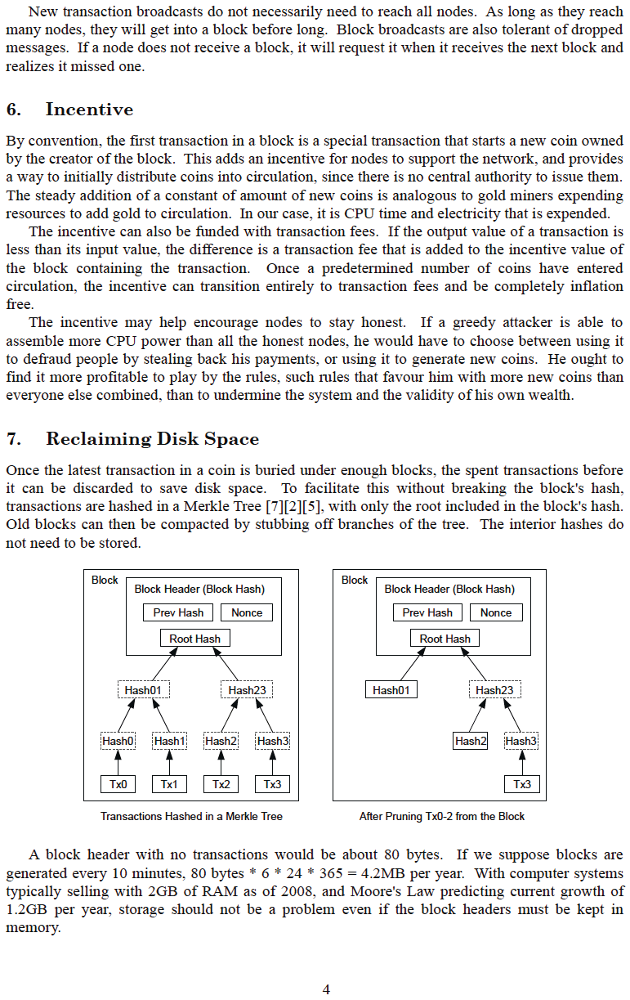

# Bitcoinのホワイトペーパー
metzdowd.comで世界に公開
2008-10-31

**サトシ・ナカモト著**

2010年12月10日にbitcointalk.orgのフォーラムで
最後にサイファーパンクコミュニティと連絡を取った
偽名のサイファーパンク。

彼が去ったことで、Bitcoinは真の実験として
野放しにされることになった。それに取り組むすべての人は、ある意味でボランティアである
<-> 操作され、借金に基づく貨幣制度の束縛から
人類を解放する可能性に触発され、代わりに、グローバルで、トラストレスで、
許可不要で、検閲耐性があり、真に希少で、ピアツーピアで、
分散型の貨幣および金銭支払いネットワークに参加し、
法定通貨の灰の中から新たな秩序が生まれることを刺激している

**私たちは皆サトシです**
>*The Times 2009年1月3日 財務相、銀行の2度目の救済間近*

~ ロンドンのThe Times紙の見出しのテキスト、
2009年1月3日にサトシ・ナカモトによってBitcoinのジェネシスブロックに刻まれた

---

---

---

---

---

---

---

---

---

---

## Bitcoinジェネシスブロック～Raw Hexバージョン 2009-01-03

そして、

新しい時代が、

解き放たれた

---
