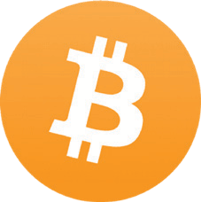

# ビットコインのFUD（不安、不確実性、疑念）を払拭する

* 以下は、ビットコインに対する一般的な反論や懸念事項です。
* これらは主に根拠がなく、無知、あるいは不完全な理解から生じています。
* ここではそれぞれに対する簡単な反論を提示し、最後に
すべてのFUDに対するより詳細なリソースへのポインタがあります。

## ビットコインはエネルギーを使いすぎる

>*あなたのコンピュータからの熱は無駄ではありません。
もしあなたが家を暖める必要があるのであれば... それは
コンピュータで熱を発生させるのと同じコストです。*

~ サトシ・ナカモト 2010-08-09

>*当初、ある商品を生産する理由は、単にコストがかかるからというだけで、非常に無駄に思えます。しかし、偽造不可能なコストのかかる商品は、有益な富の移転を可能にすることで、繰り返し価値を付加します。取引が可能になったり、費用が削減されたりするたびに、より多くのコストが回収されます。当初は完全な無駄であったコストが、多くの取引にわたって償却されます。*

~ ニック・サボ

サイファーパンク

---

* **「多すぎる」エネルギーは、エネルギーの用途をどのように評価するかを考慮する必要がある価値提案です。**

* **米国のクリスマスライトが、ビットコインネットワーク全体の電気使用量と同じくらいの電気を使用していることを考えると、** おそらくすべてが相対的であることがわかるでしょう！

* 人類がこれまでに知っている中で最も硬く、最も検閲耐性のあるお金を確保するために、エネルギー、それも大量のエネルギーを使用することは、それ以上の価値があります。

* ビットコインのエネルギー使用量を従来のシステムで使用されるエネルギーと比較する際には、両側の「フルスタック」も考慮する必要があります。

| ビットコインエコシステム    | 従来のフィアットシステム          |
| -------------------- | --------------------------- |
| ASICマイナー          | BIS                         |
| ノード                | 中央銀行               |
| ハードウェアウォレット     | 国/地域銀行     |
| ソフトウェアウォレットアプリ | 軍産複合体 |
|                      | バックアップデータセンター         |
|                      | 物理的なお金の印刷     |
|                      | 物理的なお金の流通 |
|                      | オンラインバンキングアプリ         |
|                      | ATMのネットワーク             |

* ビットコインを使用することで、最終的には他の多くの分野でエネルギー使用量を削減できます。特に、石油ドルを保護するために軍産複合体を必要としなくなることで。

---

* また、債務に基づいたシステムを維持するために必要な、蔓延る消費主義は、時間が経つにつれて抑制されます。なぜなら、**ハードマネーは当然のことながら、慎重な支出と貯蓄を促すからです**（貯蓄が実際にその価値を保持するため、金本位制から離れて以来経験していない概念です）。
* **最後に、そして重要なことですが、ビットコインのマイニングは、フレアされた天然ガスを回収し、それを使用してマイナーに電力を供給することで、すでに汚染を削減しています。** マイナーは電気料金の低さを求めているため、インセンティブが一致するため、再生可能な低コストエネルギーへの最大の推進力となる可能性も高くなります。
* **ビットコインとエネルギーに関する情報に基づいた詳細な調査** は、Daniel Battenがbatcoinz.comで、Troy Cross、Jyn Urso、YouTubeのSwan Bitcoinによるビデオ「This Machine Greens」、ビットコインマイニングのドキュメンタリー「Dirty Coin」、およびB.Quittemとの「What is Money」ショー（WiM161）の優れたエピソードなど、多数の人が書いています。

---

## ビットコインはねずみ講である
* **ビットコインはねずみ講ではありません。**
 * 古い投資家は、新しい投資家からお金を受け取っていません。
 * ビットコインを購入する際、誰も投資に対するリターンを約束していません。
 * リーダーシップやプロモーションチームはありません。
 * プリマインはありませんでした。
 * **お読みください：** Lyn Aldenによる「ビットコインがねずみ講ではない理由」をご覧ください。

## ビットコインは遅すぎる
* ビットコインのベースレイヤーは遅いですが、2番目のレイヤーである
**ベースレイヤー上に構築されたLightning Networkは... 電光石火の速さです！**
* ビットコインのネットワークは、1秒あたり約7トランザクション（TPS）を処理できます。
* Visaネットワークは、最大24,000 TPSを処理できると主張していますが、実際の使用量に近いのは4,000 TPSです。
* **ビットコイン上に構築されたセカンドレイヤーソリューションであるLightning Networkは、1秒あたり数百万のトランザクションを処理できる可能性があります！**

---

## 政府はビットコインを禁止できる
* 一部の政府は、たとえば中国、インド、ナイジェリアのように試みました。それぞれの場合において、ビットコインの使用は当該国の人々によって急速に増加しています。
* **政府が本当にビットコインを「禁止」する方法はありません。** なぜなら、その性質上、許可不要で検閲耐性があるからです。それはコードであり、コードはスピーチです。
* とはいえ、政府は購入や販売、そしてフィアットへの転換を困難にすることができます。また、米国のようにコモディティとして課税することもできます。
* **最終的には、ビットコインは避けられず、彼らはそれに気づき始めているため、禁止しようとすることは彼らの利益にはなりません。** 自国のインフレを起こしているフィアット通貨に対するヘッジとして、自国の貸借対照表に追加する方がはるかに賢明でしょう。

>*政府は、Napsterのような集中管理されたネットワークの首を切るのが得意ですが、GnutellaやTorのような純粋なP2Pネットワークは、持ちこたえているようです。*

~ サトシ・ナカモト

* **お読みください：**

政府はビットコインを止められるか？ Alex Gladstein、人権財団CSO

政府はビットコインを禁止できますか？知っておくべき4つのこと Nick Giambruno著

---

## ビットコインは古い技術である
* **デジタル希少性、分散化、および二重支払い問題とビザンチン将軍問題の両方を解決することに関して言えば、「究極の技術」に近いです。** 一度発見されると、再発見することはできません。
* **一度車輪が発明されると、再び発明することはできません。**
* インターネットが動作するTCP/IPプロトコルは、1983年以来、すべてのコンピューターネットワークの標準となっています。今後も長い間標準であり続けるでしょう。
* 完璧なソリューションであるベースレイヤーテクノロジーが最適に機能することが発見されると、何百年、何千年も持続する可能性があります。

クレジット：@DecouvreBitcoin

---

## ビットコインは犯罪者に使用されている
* **ドルや世界の他のすべての法定通貨も同様です。** この問題をビットコインだけに帰することは、単純に誤りです。
* **ビットコインは、ナイフと同じように道具であり、どのように使用するかは私たち一人ひとりにかかっています。**
* 興味深いことに、ビットコインが犯罪者に使用できない場合、世界が非常に必要としている中立的で検閲耐性のあるお金にはなり得ません。
* **注：** ビットコインのブロックチェーンは監査可能であるため、実際には犯罪行為には非常に悪い選択肢です！

## 量子コンピューティングはビットコインを破壊する可能性がある
* これは将来のある日に起こる可能性はありますが、**開発者はすでに量子耐性暗号化のソリューションに取り組んでいます**
* ビットコインは、セキュリティのためにSHA-256ハッシュに依存している多数のオンラインアプリケーションの1つにすぎません。
軍もそれを使用しているため、ビットコインコミュニティを超えて、新しい暗号化プロトコルを開発する大きなインセンティブがあります。
* SHA-256が破られた場合、ビットコイン以外にも心配することがたくさんあります。インターネット全体が暗号化に使用しています。これには、すべての銀行業務、サプライチェーン、輸送システム、ヘルスケアシステム、教育システムなどが含まれます。

---

## ビットコインには真の価値がない
>*「ビットコインの価値は、その強制可能な希少性によって左右されます」*

*〜フィデリティ・デジタル・アセッツ*

* **希少性が価値です。これまでのお金はすべて、ある程度の希少性を持っているために評価されてきました。**

* 加えて、それは価値を保持するという信念によって裏付けられており、将来価値のある他のものと交換できると考えられていました。
* ビットコインネットワークが成長するにつれて、それが具現化する優れた金融特性によって裏付けられ、ネットワーク効果は指数関数的に増大します。
* ネットワーク効果が大きければ大きいほど、希少な資産として提供する価値が高まります。価値は需要の反映であり、需要が増加するにつれて価値は増加します。

---

## 一部の人が多すぎる
* 一部の人が他の人よりもはるかに多くを持っているのは事実です。
**プロトコルをオープンに公開することで、サトシはそれを自由に動き回らせ、それが持つ可能性を理解した人々はマイニングするか、早期に購入しました。それは、それを世界に提示する最も公平で有機的な方法でした。**
* 時が経ち、世界がハイパービットコイン化されると、つまりビットコイン標準で生活していると、多くを持っている人々は当然それを経済に費やすでしょう。

* ある時点でフィアットで購入できなくなっても、人々は仕事の対価としてビットコインで支払われます。真に健全な通貨で支払われることで、インフレによって時間の経過とともに価値が下落することのない、真の貯蓄を持つことができます
* 莫大な数の要因により、常に多くの富を持つ人とそうでない人がいますが、**ビットコイン標準は、富裕層間の膜を透過可能にするでしょう**、とAleks Svetsiは言います。これにより、今日よりもはるかに流動的な上方および下方への移動が可能になります
* **私たちがフィアットの世界に生まれ、人生全体を泳いできたため、価値を下げたり操作したりできないお金を持つことの意味を想像し、完全に理解することはほとんど不可能です！**

---
## ビットコインは不安定すぎる
* **これは、新しい金融資産の価格発見段階では正常です。** 有機的かつ創発的な場合（トップダウンおよび集中管理とは対照的）、成長が起こる方法は他にありません。
* 加えて、人間の存在のこの段階では、すべての分野で指数関数的な変化が起こっているため、ビットコインほど革新的なものが激しい変動を持つのは理にかなっています。
* ウサギの穴の奥深くにいる私たちはそれを未来と見ていますが、現時点では世界の人口のごく一部しかビットコインを保有していません。これにより、莫大なボラティリティに対して脆弱になります。
* 成熟し、採用が増加するにつれて、ボラティリティは低下し、最終的には安定して会計単位になります。

>*20年後には、非常に大きなトランザクション量があるか、まったくないかのどちらかになると確信しています。*

~ サトシ・ナカモト 2010-02-14

---

## ビットコインに触れることはできない

* **これはバグではなく、機能です。** ビットコインが物理的ではないという事実は、その没収不可能性に貢献する最大の要因の1つです！

## ビットコインはハッキングされる可能性がある

* 発売から15年間、ハッキングされたことはありません。
* ただし、取引所でハッキングが発生したため、できるだけ早くビットコインを自己管理ウォレットに移動することを強くお勧めします。
* SHA-256暗号化（ビットコインが使用）を24時間以内に破るには、量子コンピューターは13,000,000個の物理量子ビットが必要になると推定されています。現時点では、カリフォルニアのAtom Computingが保持している現在の量子ビットレコードは1,180量子ビットです。
* 必要な時が来る前に、量子安全な暗号化方法が開発されると広く想定されています。

>*オープンソースであるということは、誰でもコードを独自にレビューできることを意味します。クローズドソースの場合、誰もセキュリティを確認できません。この性質のプログラムでは、オープンソースであることが不可欠だと思います。*

*〜サトシ・ナカモト 2009-12-10*

---

## ここでFUDを反論することに関する詳細：

* Endthefud.org
* Bitcoinmythbusters.org
* Casebitcoin.com - 一般的な批判
* Safehodl.github.io/failure/
* Lopp.net - ビットコイン情報：誤解

>*ビットコインは、他のデジタル資産とは根本的に異なります。他のデジタル資産が金融商品としてビットコインを改善する可能性は低いです。なぜなら、ビットコインは（他のデジタル資産と比較して）最も安全で、分散化され、健全なデジタルマネーであり、「改善」は必然的にトレードオフに直面するからです。*

~ フィデリティ・デジタル・アセッツ・レポート、「Bitcoin First」、2022年1月
クリス・クイパー、CFA、リサーチディレクター
ジャック・ノイロイター、リサーチアナリスト

---

## ビットコインの価格について
* **ビットコインをホドリング（保持）することは、長期の貯蓄口座を持っているようなものだと考えています。**
* 日々の価格は重要ではありません。なぜなら、数年間はボラティリティ（上昇と下降）が予想されるからです。
* 前述のように、これは価格発見を受けている新しい資産では正常です
* BTC/USD価格チャートをズームアウトすると、2009年以降+31,296%増加し、平均して年間〜200%増加していることがわかります。
* 価格の変動は、さまざまなニュース記事、規制の更新、市場の需要、恐怖、興奮を反映しています。ジェットコースターのようです！
* **ホドリングする期間が長ければ長いほど、ファンダメンタルズを学び、理解し、健全なお金を持つことの重大な意味を理解するほど、価格は重要ではなくなります。**

>**最終的には、「価格」はまったく重要ではなくなります。なぜなら、ビットコインが会計単位になるからです。**

* **免責事項：**
* もちろん保証はないため、「失うことができる」ものだけを入れてください。
* 購入するビットコインは長期の貯蓄口座と見なし、使用する前に最低5年間はコールドストレージに保管する予定を立ててください。

---

最も古典的なビットコインミームの1つの元のbitcointalkforum.orgソース。

---

## その間、税金について
* **免責事項：** これは財務または税務アドバイスではありません

* 米国の税法では、ビットコインは現在コモディティと見なされているため、フィアットに売り戻したり、ビットコインで何かを購入したりすると、潜在的な税金の影響があります。
* 販売/使用する前に価格が下落した場合、損失を請求できます
* 価格が上昇した場合、キャピタルゲインを請求し、10〜30％のCGT（キャピタルゲイン税）を支払うことになっています
* 金額は、販売または使用する前に保持していた期間や、どの税率区分に該当するかなど、いくつかの要因によって異なります。
* ビットコインを販売または使用する予定がある場合は、特に多額の場合、税務専門家にご相談ください。
* 単に購入して保持するだけの場合は、現在ビットコインに関する課税対象イベントはありません。
* そして、非KYCを購入すると...

---
