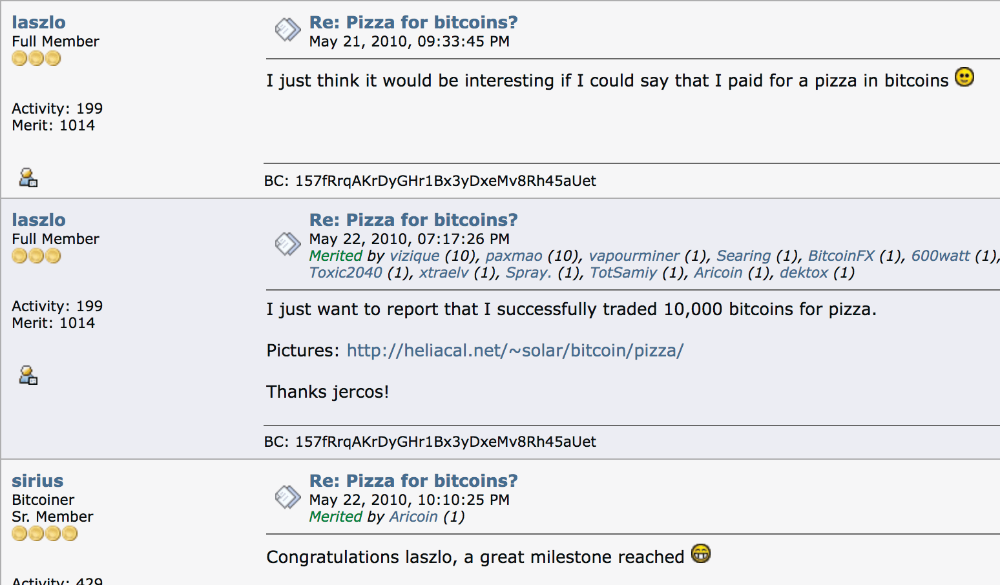

# 사토시의 숫자 369 시계

**비트코인은 시간당 6개의 블록을 채굴하도록 설계되었습니다. >> 평균적으로 약 10분마다 하나의 블록이 생성됩니다.**

* 하루 24시간

2+4=**6**

* 하루에 144개의 블록이 생성됩니다.

1+4+4=**9**

* 1년에 52560개의 블록이 생성됩니다.

5+2+5+6+0=18

1+8=**9**

* 윤년에는 52704개의 블록이 생성됩니다.

5+2+7+0+4=18

1+8=**9**

* 2100만 개의 코인:

2 + 1 + 0 + 0 + 0 + 0 + 0 + 0 = **3**

* 33번의 반감기:

3 + 3 =**6**

* 난이도는 2016 블록마다 조정됩니다.

2 + 0 + 1 + 6 = **9**

~ @level39의 트윗을 기반으로 함

* 블록 보상 반감기는 매
210,000번째 블록마다 발생합니다 (약 4년마다).
2 + 1 + 0 + 0 + 0 + 0 = **3**

---

>*"3, 6, 9의 숭고함을 안다면,
우주의 열쇠를 갖게 될 것이다."
~ 니콜라 테슬라*

## 블록 보상 = 공급량의 %

* 블록 보조금 (새롭게 채굴된 각 블록에 대해 보상되는 비트코인 수)은 해당 시대에 채굴될 **총 공급량의 백분율**을 나타냅니다.

* 예를 들어, 2024-2028년 사이의 현재 블록 보상은 **3.125** 비트코인입니다.

* 이 같은 4년 동안 2100만 비트코인의 **3.125**%가 채굴될 것입니다.

제공: @bitcoinfool

---

## 보상 시대

* 매 4년마다 비트코인 보조금은 채굴되는 각 블록에 대해 반감됩니다. **보상 시대는 그 4년 기간입니다.**

* **보상 시대 1:** 2009-2012 **블록 보조금:** 50 비트코인
= (50 비트코인 * 210,000 블록) = 10,500,000 비트코인

1+0+5+0+0+0+0+0 = **6**

* **보상 시대 2:** 2012-2016 **블록 보조금:** 25 비트코인
= (25 * 210,000) = 5,250,000 비트코인

5+2+5+0+0+0+0 = 12

1+2 = **3**

* **보상 시대 3:** 2016-2020 **블록 보조금:** 12.5 비트코인
= (12.5 * 210,000) = 2,625,000 비트코인

2+6+2+5+0+0+0 = 15

1+5 = **6**

* **보상 시대 4:** 2020-2024 **블록 보조금:** 6.25 비트코인
= (6.25 * 210,000) = 1,312,500 비트코인

1+3+1+2+5+0+0 = 12

1+2 = **3**

* **보상 시대 5:** 2024-2028 **블록 보조금:** 3.125 비트코인
= (3.125 * 210,000) = 656,250 비트코인

6+5+6+2+5+0 = 24

2+4 = **6**

* **보상 시대 7: 2032-2036 블록 보조금:** 0.78125 btc
= (0.78125*210,000) = 164,062.5 비트코인

1+6+4+0+6+2+5 = 24

2+4 = **6**

**... 2140년까지 계속**

---

## 사토시의 생일

* ***1975년 4월 5일***은 사토시가 자신의 생일이라고 주장한 날짜입니다.
* 이것이 실제로 그의 진짜 생일이었는지는 알 수 없지만, 매우 흥미롭습니다.
* ***4월 5일*** (1933년)은 프랭클린 D. 루스벨트 미국 대통령이 "미국 대륙 내에서 금화, 금괴, 금 증서의 축적을 금지하는" 행정 명령 6102호에 서명한 날이었습니다.
* ***1975년***은 EO 6102의 폐지가 효력을 발휘하고 미국 시민들이 다시 5온스 이상의 금을 보유할 수 있게 된 해였습니다.

## 숫자 회문 6102-2016

* ***6102***는 위에서 언급한 행정 명령의 번호였습니다.
* ***2016***은 각 난이도 조정 (약 2주) 동안 채굴되는 블록 수입니다.

>* 위의 두 가지 예에서 사토시는 숫자를 사용하여 정부의 과도한 간섭으로 인한 피해의 반전, **되돌림**을 나타내고 있다고 추론할 수 있습니다.

---

## 비트코인 피자 데이

* 5월 22일은 비트코인 피자 데이로 알려져 있습니다. 이 날은 라즐로 하니에츠라는 사람이 bitcointalkforum.org에서 10,000 비트코인을 피자와 성공적으로 교환했다고 발표한 날입니다! 당시에는 약 40달러였습니다.
* 오늘날의 가격으로 환산하면 약 6억 1천만 달러입니다.
* 이것은 비트코인이 상품이나 서비스와 거래된 최초의 사건이라는 점에서 비트코인에게는 이정표였습니다. 정말 먼 길을 왔습니다!

---

## 주목할만한 날짜의 비트코인 달력

**2008-08-18** ~ **bitcoin.org 도메인 이름이 등록되었습니다.**

**2008-10-31** ~ **비트코인 백서 데이:** "비트코인: P2P 전자 현금 시스템"이라는 제목의 백서는 익명의 암호학자 사토시 나카모토가 암호학 메일링 리스트인 metzdowd.com에 게시했습니다.

**2009-01-03** ~ **비트코인의 생일:** 사토시가 제네시스 블록을 채굴하면서 비트코인 네트워크가 시작되었습니다.

**2009-01-12** ~ **최초의 비트코인 거래**는 Hal Finney가 테스트 전송으로 사토시로부터 10 비트코인을 받았을 때 발생했습니다.

**2009-10-05** ~ **최초의 비트코인 거래소 탄생,** New Liberty Standard (NLS)는 코인당 0.00764달러의 시장 가격으로 상장되었습니다.

**2009-10-12** ~ "이메일 백업에서 **최초의 알려진 비트코인-USD 거래**를 발견했습니다. 2009-10-12에 5,050 BTC를 5.02달러에 판매했습니다." - bitcointalk.org 설립자 Martti Malmi는 최초의 거래소를 시작한 NewLibertyStandard에게 비트코인을 판매했습니다.

**2010-05-22** ~ **비트코인 피자 데이:** 라즐로 하니에츠가 Papa John's 피자 2판에 10,000 비트코인을 지불했을 때 비트코인이 상품이나 서비스를 구매하는 데 사용된 최초의 알려진 사례!

**2010-12-12** ~ 사토시가 bitcointalk.org 포럼에 게시한 **마지막 시간**.

**2011-02-11** ~ **비트코인이 사상 처음으로** 미국 달러와 **동등한 가치에 도달합니다**.

**2011-06-14** ~ **위키리크스**는 비트코인으로 기부를 받기 시작합니다.

**2017-03-03** ~ **비트코인이 금 1온스와 동등한 가치에 도달합니다**.

**2021-08-21** ~ Knut Svanholm의 밈에서 제안된 **최초의 연례 비트코인 인피니티 데이**:
2100만으로 나눈 모든 것.

**2021-09-07** ~ 엘살바도르가 비트코인을 법정 통화로 만든 최초의 국가가 됩니다.

---