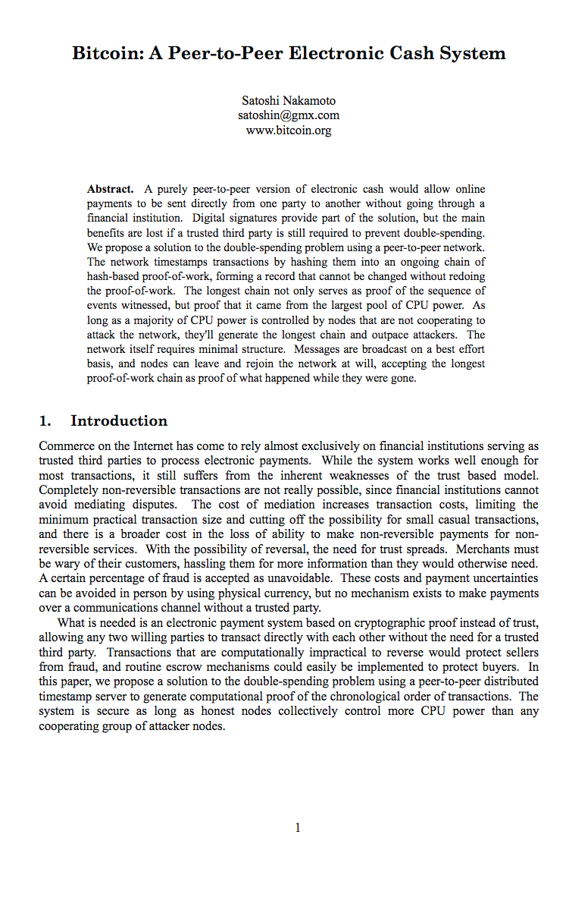
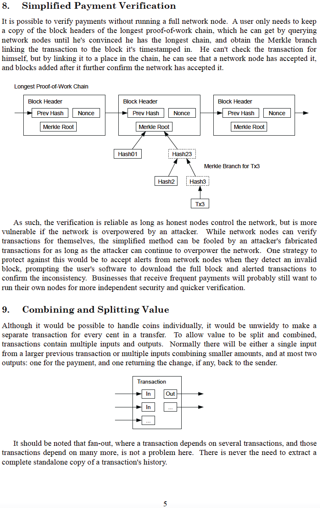

# 비트코인 백서
metzdowd.com에 공개됨
2008-10-31

**사토시 나카모토**

가명의 사이버펑크로, bitcointalk.org
포럼에서 2010-12-10에 사이버펑크 커뮤니티와 마지막으로 소통했습니다.

그는 떠남으로써 비트코인이 진정한 야생에서의 실험이 되도록 했습니다. 비트코인에 참여하는 모든 사람은 어떤 의미에서 자원봉사자입니다. <-> 조작되고 부채 기반의 통화 시스템의 족쇄로부터 인류를 해방시킬 잠재력에 영감을 받아 글로벌하고, 신뢰가 필요 없고, 허가받을 필요 없고, 검열에 저항하며, 진정으로 희소하고, P2P 기반의 분산형 통화 및 화폐 결제 네트워크에 참여하고 있으며, 이는 법정화폐의 잿더미에서 부상하는 새로운 질서에 영감을 주고 있습니다.

**우리는 모두 사토시입니다**
>*The Times 2009년 1월 3일, 총리가 은행에 대한 두 번째 구제 금융 직전에 있다*

~ 2009년 1월 3일 사토시 나카모토가 비트코인 제네시스 블록에 새겨 넣은 런던 타임즈의 헤드라인 텍스트

---

---

---

---

---

---

---

---

---

---

## 비트코인 제네시스 블록 ~ 로우 헥스 버전 2009-01-03

그리고,

새로운 시대가

열렸습니다.

---
