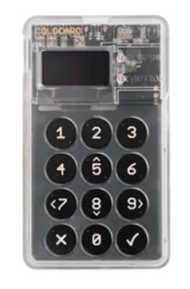
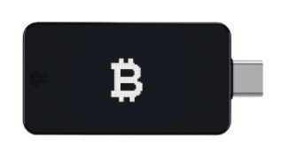

# 비트코인 사용법

>**비트코인하다 (Bitcoin):** (동사) /tuːˈbɪtkɔɪn/
저는 여기서 '비트코인하다'를 동사로 만들 것을 제안합니다.
비트코인/Bitcoin 생태계에 참여하는 것의 완전성을
요약하는 것입니다.

* 자, 이제 바라건대 ;) 오렌지필을 받으셨고, 세계 최초의 글로벌 자유 화폐에 참여하면서 자신의 은행이 될 준비가 되셨기를 바랍니다.
재미있는 부분이 다가옵니다!

---

## 자신만의 은행 되기
* 이곳은 재정적 자기 주권을 갖게 되는 진정으로 웅장한 변화가 있는 곳이며, 시간이 걸릴 수 있습니다.
이것이 무엇을 의미하는지 진정으로, 완전히 파악하는 데 말입니다.
* 가장 안전한 방법으로 수행하는 방법을 이해하려면 **의도와 헌신이 필요합니다.**
* 이 책을 '지금까지 쓰여진 가장 간단한 비트코인 책'으로 유지하려는 정신으로, 여기에서 개요를 제공하고, 책의 마지막 부분에서 이 입문서의 범위를 훨씬 뛰어넘는 더 깊이 있는 자료를 제공합니다.

>**HODL:** (동사) /ho’dill/

: 비트코인을 보유하는 것

: 판매하지 않는 것

-2013년 bitcointalk.org 게시물에서 유래했으며, 게시자는 술에 취해 'HOLD'를 잘못 썼습니다.

-bitcointalk.org/index.php?topic=375643.0

* 네트워크가 여전히 성장하고 있는 동안, 마지막 수단으로 수백만 명의 글로벌 호들러들이 갖는 가치는 매우 큽니다.

---

## 비트코인 획득
* **비트코인은 채굴자들이 운영 비용을 지불하기 위해 보상으로 받는 비트코인의 일부를 판매함으로써 시장에 진입합니다.**
* **개인 간 거래 플랫폼에서 구매하거나, 제공하는 상품이나 서비스에 대한 지불로 받거나, 선물로 받거나, 채굴함으로써 비트코인을 획득할 수 있습니다.** (최후의 수단으로, 권장하지 않지만, 등록된 거래소에서 구매하는 것입니다).
* 비트코인을 받으면, 기술적으로는 비트코인에 접근할 수 있는 개인 키를 받는 것입니다.
> * **기억하세요:** 비트코인 자체는 타임체인에서 절대 벗어나지 않습니다.

* 익명으로 또는 ID 확인(KYC - 고객 알기)을 통해 비트코인을 획득할 수 있습니다.

* KYC는 거래소에서 구매할 때 AML(자금 세탁 방지법)을 준수하기 위해 법적으로 요구됩니다.

>* 비 KYC 비트코인을 구매하는 것은 **미래에 개인 정보를 보호할 권리를 보존합니다.**

---

## 비 KYC >> 익명으로
**비 KYC 비트코인 획득 방법(ID 없음):**

추천

>1. 비트코인 전용 지갑 앱을 다운로드합니다(102페이지 참조).
>2. 방법을 선택합니다(아래 참조).
>3. 비트코인을 구매, 수령 또는 채굴합니다.
>4. 비트코인을 지갑으로 인출합니다.
>5. HODL하거나, 소비하고 교체합니다.

* **Robosats, Bisq, HodlHodl, Peach Bitcoin에서 구매하세요.**
* **비트코인 ATM에서 구매하세요.** - ID가 필요한지 확인하세요. 다른 곳에서는 이름과 번호만 묻습니다(임시 전화번호를 사용할 수 있습니다).
* **Azteco 바우처를 구매하세요.** - 위치는 azte.co를 방문하세요.
* **하는 일에 대한 대가로 받으세요.** - 비트코인으로 지불해 달라고 요청하세요. 가격 할인을 제안하세요.
* **비트코인 모임에서 직접 구매하세요.**
* **채굴하세요.** - 집에서 채굴하는 것이 더 쉬워지고 있으며, 채굴 풀에 가입할 수도 있지만, KYC에서 벗어나려면 DYOR(자체 조사)하세요. Ocean Pool이 좋은 선택입니다.

---

## KYC >> ID 확인 필요

**KYC 비트코인 구매 방법(ID 사용):**

권장하지 않음

>1. 비트코인 전용 지갑 앱을 다운로드합니다(102페이지 참조).
>2. 비트코인 전용 거래소를 선택합니다.
>3. 계정을 만들고 결제 수단을 연결합니다.
>4. KYC 요구 사항을 충족합니다.
>5. 비트코인을 구매합니다.
>6. **비트코인을 자신의 지갑으로 인출합니다.**
>7. HODL하거나 소비하고 교체합니다.

* **비트코인을 이런 방식으로 구매하면 비트코인이 신원에 영구적으로 연결되어** 이러한 구매와 관련하여 향후 익명성을 포기하게 됩니다.
* 이 방법을 선택하는 경우 평판이 좋은 ***비트코인 전용 거래소***를 찾는 것이 좋습니다.
* ***거래소에서 비트코인을 자신의 지갑으로 인출할 수 있는지 확인하세요!***
* **거래소는 법적으로 'KYC'를 준수해야 합니다.**
* 거래소는 **이름, 주소, 사회 보장 번호, 이메일, 전화 번호와 ID를 들고 있는 사진**을 요구할 것입니다.
* **거래소에 고객 서비스를 위한 전화 및 이메일 지원이 모두 있는지 확인하세요.**

---

* 거래소에서 비트코인을 자신의 지갑으로 보내는 과정을 안내해 달라고 요청하여
비트코인을 직접 보관할 수 있도록 하세요.
= **자신의 키를 보유하는 것.**

>* **참고:** 이것은 비트코인을 구매했다는 사실을 지우지 않습니다.
>* **트랜잭션은 체인에서 추적할 수 있으며, 많은 국가에서 비트코인을 사용할 때 과세 대상이 됩니다.**

* Venmo나 Paypal을 통해 구매하려면 먼저 **자신의 자체 호스팅 지갑으로 삿을 인출할 수 있는지 확인하세요.** 과거에는 그렇게 할 수 없었습니다.
* 그들이 말하듯이:
> **"키가 없으면 치즈도 없다"** 또는
>
>**"자신의 키가 아니면 비트코인도 아니다"**

* 이는 중앙 집중식 서비스가 비트코인에 대한 개인 키를 보유하고 있는 한, 해당 플랫폼이 해킹되거나 규제 포획을 당하여 비트코인을 잃을 가능성이 남아 있다는 것을 의미합니다.

>* **비트코인을 구매하는 즉시 자신의 자체 호스팅 지갑으로 인출하세요.**

---
## EO 6102
* 1933년 **루스벨트 대통령은 모든 미국 시민이 대부분의 금을 은행권으로 교환하여 반납하도록 요구하는 행정 명령 6102를 발표했습니다.**
* 금은 $20.67/oz로 평가되었습니다. 다음 해에 정부는 1934년 금 보유법으로 금 가격을 $35/oz로 인상하여 사람들이 받은 지폐의 가치가 거의 절반으로 떨어졌습니다. 왜냐하면 지폐의 가치가 인상된 금 가격과 함께 오르지 않았기 때문입니다.

---

* EO6102가 폐지되고 개인 시민이 다시 5oz 이상의 금을 보유할 수 있게 되기까지는 **42년 후인 1975년**까지 걸렸습니다.
* 현재 단계에서 규제 당국이 비트코인이 인기를 얻고 더 널리 채택됨에 따라 어떻게 대응할지는 거의 알 수 없습니다.
* 지금까지는 엇갈린 반응이 있었습니다. 그러나 당분간은 많은 사람들이 비트코인을 궁극적으로 막을 수 없다는 것을 이해하거나 어쩌면 받아들이고 있는 것 같습니다.
* 비트코인을 자신의 플랫폼의 일부로 지지하는 정치인들이 늘어나고 있습니다. 반대하는 사람들도 있습니다.
* 미국에서 선거의 해인 2024년은 세 명의 주요 대통령 후보가 모두 비트코인 선거 캠페인 기부를 받고 있어 매우 흥미롭습니다!
* 엘살바도르는 2021년에 법정 통화의 한 형태로 만들었습니다. 다음 국가는 어디가 될지 흥미로울 것입니다.

>* **궁극적으로 모든 정부가 비트코인을 수용하고 급격히 인플레이션되는 법정 통화에 대한 헤지 수단으로 대차 대조표에 추가하는 것이 모든 정부의 이익이 될 것입니다.**

---

## 비트코인 안전하게 보관하기

* 첫 번째 비트코인을 구매하는 인생을 바꾸는 단계를 거쳤으면, **안전하게 보관하는 방법을 결정해야 합니다.**
>* **자신의 은행이 되는 것은 강력한 형태의 자기 주권입니다.**
>* **심각하게** 받아들여야 합니다.
* ***여기에서 제공하는 기본적인 권장 사항 외에도 DYOR - Do Your Own Research *를 하세요.**
* **비트코인 생태계는 매 순간 진화하고 있습니다.**
* Nostr, Twitter 및 bitcointalk.org는 최신 개발 상황을 파악하기에 좋은 곳입니다.

## 다음 사이트에서 튜토리얼을 확인하세요.
> * BTCSessions.ca by @BTCSessions
>* Bitcoiner.guide by @QnA
>* Armantheparman.com by @ArmanTheParman
>* YouTube의 @SouthernBitcoiner
>* YouTube의 @wickedsmartbitcoin

---

## 비트코인 전용 지갑
* 비트코인은 자신의
 * **자체 호스팅**
 * **비 양육**
 * **비트코인 전용** '지갑'에 보관하는 것이 가장 좋습니다.

* '지갑'은 실제로 서명 장치인 소프트웨어입니다. 여기에는 보내는(브로드캐스트) 트랜잭션에 서명하는 데 사용하는 개인 키가 포함되어 있습니다.

## 핫 월렛
* **휴대폰이나 컴퓨터에 다운로드하는 온라인 비트코인 지갑 앱입니다.**
* 일상적인 지출을 위해 소액을 사용하는 데 가장 적합합니다.
## 콜드 스토리지 월렛
* **오프라인 지갑입니다.** 하드웨어 지갑이라고도 합니다.
* 키를 저장하는 별도의 하드웨어 장치입니다.

>* 둘 다 잘 작동하지만, 일반적으로 500~1000달러 이상의 비트코인을 보유하고 있는 경우 콜드 월렛을 사용하는 것이 **더 안전**하기 때문에 권장됩니다.

---
* **아래 표시된 지갑 간의 기능과 장단점을 비교하려면 DYOR을 하세요.**

* **핫 월렛 앱** - 비 양육
Blue Wallet, Muun Wallet, Mutiny Wallet
Sparrow Wallet, Green Wallet, Phoenix
Wallet, Zeus Wallet, Breez Wallet

* **콜드 스토리지 월렛** - 비 양육
Cold Card, Trezor, Foundation Passport,
Blockstream Jade, Seed Signer, Bitbox,

>* 콜드 스토리지 월렛은 **반드시 제조업체에서 직접** 구매하여 변조되지 않았는지 확인하세요.

---

## 지갑 설정
* YouTube에서 @BTCSessions의 지갑 설정에 대한 훌륭한 튜토리얼과 더 많은 정보를 확인하세요.

>* 지갑을 설정할 때 **12단어 또는 24단어 시드 문구를 종이에 적어 두세요.**
>* **오프라인으로 보관하세요. 스크린샷을 찍지 마세요.**
>* **시드 문구를 매우 안전하게 보관하세요.**
>* **매우, 매우 안전하게 보관하세요!**

* **많은 회사에서 금속 시드 플레이트를 만들어 시드 문구를 펀칭하여 화재/물/손상으로부터 보호할 수 있습니다. 강력히 추천합니다!**
* 핫 월렛이나 콜드 월렛에 대한 액세스 권한을 잃은 경우 시드 문구로 복원하고 자금을 복구할 수 있습니다.
* 동일한 유형의 BIP39 시드 문구(12/24단어)를 지원하는 모든 지갑에서 그렇게 할 수 있습니다.
* 가장 좋은 방법은 시드 외에도 지갑 설명자를 보관하는 것입니다.
>* **기억하세요: 시드가 있는 사람은 누구나 비트코인에 액세스할 수 있습니다!**

---
## 개인 정보 보호
* **비트코인 구매(비 KYC), 보안, 보관 및 사용** 시 개인 정보 보호는 특히 은행 계좌가 압류/동결되는 최근 사건으로 인해 점점 더 중요해지고 있습니다.
>* 또한 **일반적인 디지털 개인 정보 보호는 온라인 주권을 얻고 부당한 감시와 사기로부터 자신을 보호하려는 경우 매우 중요합니다.**

* 아래는 현재 개인 정보 보호에 중점을 둔 서비스입니다.
* 이 책의 범위를 벗어나 각 서비스에 대해 자세히 설명할 수 없으므로 반드시 DYOR을 하고 아래에 언급된 계정을 Nostr 또는 Twitter에서 팔로우하여 업데이트를 받으세요.

>*개인 정보 보호는 전자 시대에 열린 사회에 필수적입니다. 개인 정보 보호는 비밀이 아닙니다. 사적인 문제는 온 세상이 알기를 원하지 않는 것이지만, 비밀 문제는 아무도 알기를 원하지 않는 것입니다. 개인 정보 보호는 자신을 세상에 선택적으로 드러낼 수 있는 힘입니다.*

~에릭 휴즈, '사이퍼펑크 선언문'에서 발췌
