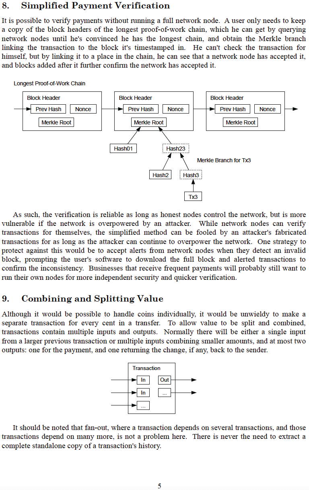
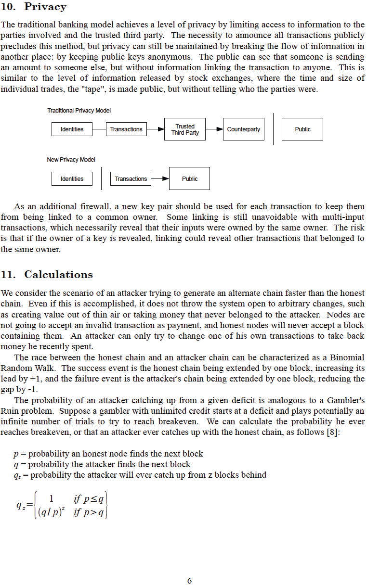

# Ekitabo Ekitangaavu ekya Bitcoin
Kyaleetebwa eri ensi ku metzdowd.com
2008-10-31

**Okuva eri Satoshi Nakamoto**

Omuntu atamanyika eyali mu kibinja ky'abantu abaakozesanga obukodyo okukweka ebintu, eyasembayo okwogera
ne kibinja ky'abantu abaakozesanga obukodyo okukweka ebintu ku mukutu gwa bitcointalk.org
mu 2010-12-10.

Bwe yagenda, yakiriza Bitcoin okuba ekigezo ekituufu mu
nsi. Buli omu agikolerako yeewaayo mu ngeri
emu oba endala <-> ng'akubirizibwa amaanyi agali mu kusuulawo abantu
okuva mu busibe bw'enkola y'ebyensimbi eyekobaneera, eyeeyagalira ku bbanja,
mu kifo kyekyo, okwetaba mu mukutu gw'ebyensimbi ogw'ensi yonna, ogutesigamizibwa,
ogutalina lukusa, ogutaziyizibwa, ogutalina mutindo, ogwa buli muntu ku buli muntu, ogwawuliddwa, oguleetawo enkola empya okuva mu
vvu ly'ebyensimbi ebitannyegeera

**Ffenna tuli Satoshi**
>*The Times 03/Jan/2009 Kansala ali ku mulyango
gw'okutaasa amabbanka omulundi ogwokubiri*

~ Ebigambo by'omutwe gw'amawulire okuva mu The Times eya London,
ebyawandiikibwa mu Bitcoin Genesis block mu Satoshi
Nakamoto mu 2009-01-03

---

---

---

---

---

---

---

---

---

---

## Bitcoin Genesis Block ~ Enkyusa eya Raw Hex 2009-01-03

era bwe kityo,

emirembe emipya,

gyatandika

---
